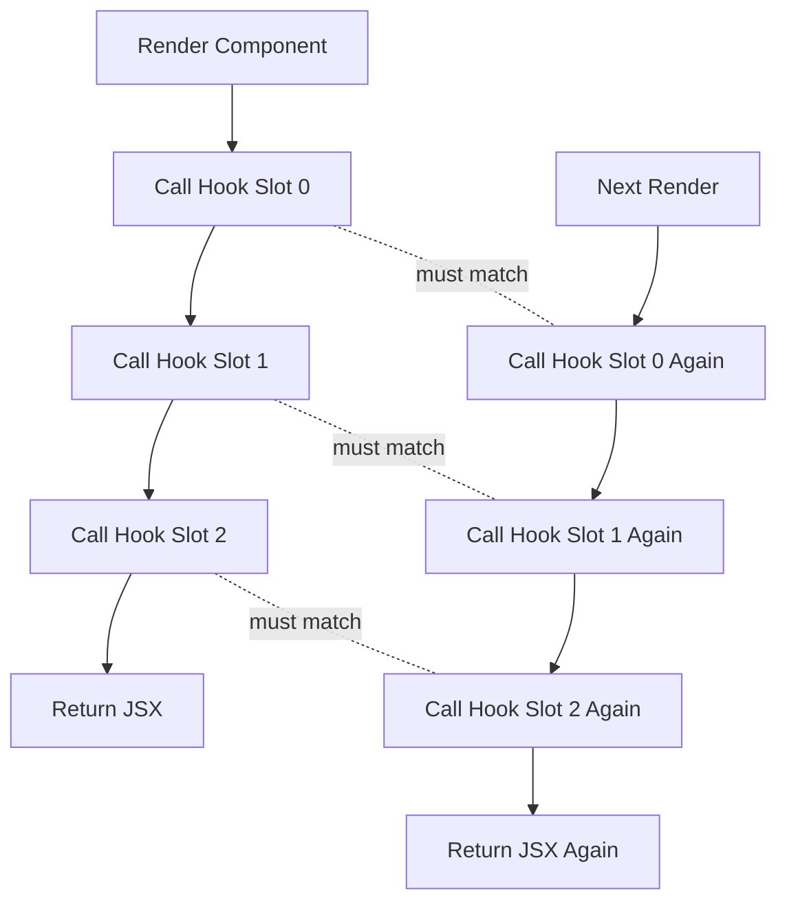
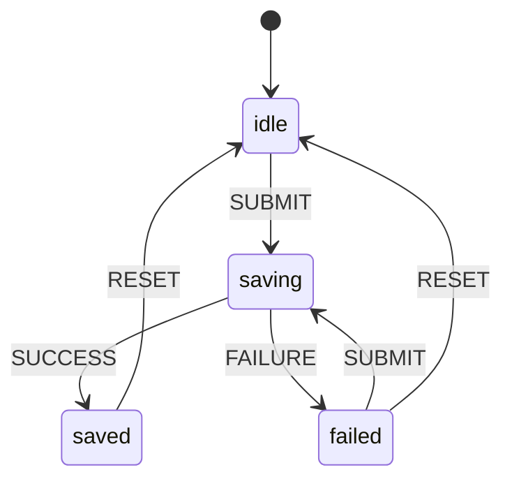
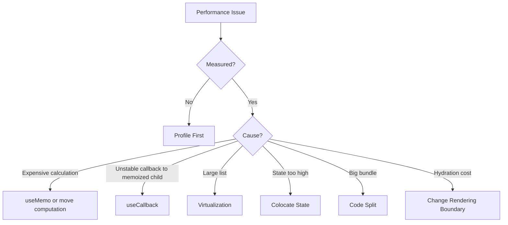

------
title: Learn Frontend React Production Architecture - Part 005
description: Deep dive into React Hooks as runtime contracts, including ordering invariants, dependency correctness, custom hook architecture, memoization strategy, stale closures, refs, and production anti-patterns.
series: learn-frontend-react-production-architecture
seriesTitle: Learn Frontend React Production Architecture
order: 5
partTitle: Hooks as Runtime Contracts
tags:
- react
- frontend
- hooks
- architecture
- production
- series
date: 2026-06-28
---

# Part 005 — Hooks as Runtime Contracts

## Tujuan Pembelajaran

Di level basic, Hooks sering dipahami sebagai “fitur untuk memakai state dan lifecycle di function component”.

Di level production architecture, pemahaman itu terlalu dangkal.

Hooks adalah **kontrak runtime** antara component function dan React. Kontrak ini mengatur:

1. urutan pemanggilan stateful primitives,
2. cara React mengasosiasikan state dengan component identity,
3. cara component membaca reactive values,
4. cara side effect disinkronkan,
5. cara logic reusable diekstrak tanpa membuat inheritance hierarchy,
6. cara performa dikontrol tanpa merusak correctness.

Jika kontrak ini dilanggar, bug-nya sering tidak langsung terlihat. UI mungkin tetap “jalan”, tetapi menyimpan race condition, stale data, render loop, state bocor, atau re-render cascade yang mahal.

Part ini membahas Hooks sebagai fondasi arsitektur, bukan sebagai daftar API.

---

## 1. Mental Model Utama

React memanggil function component berulang kali untuk menghasilkan deskripsi UI terbaru.

```tsx
function UserProfile({ userId }: { userId: string }) {
  const [tab, setTab] = useState<"summary" | "activity">("summary");

  return (
    <section>
      <UserHeader userId={userId} />
      <ProfileTabs value={tab} onChange={setTab} />
    </section>
  );
}
```

Component function bukan object instance seperti class component.

Setiap render adalah eksekusi baru dari function tersebut.

Hooks adalah cara React menyimpan state lintas eksekusi function.

Dengan kata lain:

> Function component dieksekusi ulang, tetapi Hook state dipertahankan oleh React selama component identity tetap sama.

---

## 2. Hook Slot Model

Cara sederhana memahami Hooks:

React menyimpan daftar slot internal untuk setiap mounted component.

Pada render pertama:

```tsx
const [a] = useState(1);      // slot 0
const [b] = useState(2);      // slot 1
const ref = useRef(null);     // slot 2
```

Pada render berikutnya, React berharap urutannya tetap sama:

```tsx
const [a] = useState(1);      // slot 0
const [b] = useState(2);      // slot 1
const ref = useRef(null);     // slot 2
```

Jika urutan berubah, React tidak bisa lagi mencocokkan slot state dengan Hook yang benar.

Contoh rusak:

```tsx
function BrokenComponent({ enabled }: { enabled: boolean }) {
  const [name, setName] = useState("");

  if (enabled) {
    const [count, setCount] = useState(0);
  }

  const [email, setEmail] = useState("");

  return null;
}
```

Ketika `enabled` berubah dari `true` ke `false`, Hook `email` yang sebelumnya berada di slot 2 bisa berpindah ke slot 1. React tidak lagi punya mapping yang valid.

Itulah sebabnya Hooks harus dipanggil:

- hanya di top-level component,
- hanya di top-level custom Hook,
- tidak di dalam condition,
- tidak di dalam loop,
- tidak setelah conditional return,
- tidak di dalam event handler,
- tidak di dalam callback biasa.

---

## 3. Diagram: Hook Ordering Contract



Invariant-nya:

> Untuk component identity yang sama, urutan pemanggilan Hooks harus deterministik antar render.

---

## 4. Hooks Bukan Utility Function Biasa

Function biasa boleh dipanggil kapan saja.

```ts
function formatCurrency(value: number) {
  return new Intl.NumberFormat("id-ID", {
    style: "currency",
    currency: "IDR",
  }).format(value);
}
```

Hook tidak.

```tsx
function useCurrentUser() {
  const session = useSession();
  const query = useUserQuery(session.userId);

  return query.data;
}
```

Hook membawa konsekuensi runtime:

1. ikut dalam render lifecycle,
2. bisa membaca state/props/context,
3. bisa menyimpan state,
4. bisa mendaftarkan effect,
5. bisa memicu re-render,
6. bisa berinteraksi dengan scheduler React.

Karena itu custom Hook harus dirancang seperti public API kecil, bukan sekadar tempat membuang logic agar component terlihat pendek.

---

## 5. Kategori Hooks dalam Arsitektur React

Secara praktis, Hooks bisa dikelompokkan menjadi beberapa kategori.

| Kategori | Contoh | Fungsi Arsitektural |
|---|---|---|
| State hooks | `useState`, `useReducer` | Menyimpan state milik component |
| Ref hooks | `useRef`, `useImperativeHandle` | Menyimpan mutable value atau handle imperative |
| Effect hooks | `useEffect`, `useLayoutEffect` | Sinkronisasi dengan sistem eksternal |
| Context hooks | `useContext` | Membaca dependency dari provider |
| Memoization hooks | `useMemo`, `useCallback` | Mengontrol referential stability |
| External store hooks | `useSyncExternalStore` | Integrasi dengan store eksternal |
| Transition hooks | `useTransition`, `useDeferredValue` | Mengatur update priority dan perceived responsiveness |
| Custom hooks | `useSomething` | Menyusun behavior reusable |

Dalam codebase production, masalah biasanya bukan “tidak tahu Hook apa yang dipakai”, tetapi:

- Hook dipakai untuk state yang salah,
- Effect dipakai untuk derivation,
- Context dipakai sebagai global mutable store,
- `useMemo` dipakai sebagai obat semua re-render,
- `useRef` dipakai untuk menyembunyikan state,
- custom Hook menyembunyikan side effect yang tidak jelas.

---

## 6. Reactive Values

Reactive value adalah nilai yang bisa berubah antar render dan dibaca oleh component atau Hook.

Contoh:

```tsx
function SearchBox({
  userId,
  initialQuery,
}: {
  userId: string;
  initialQuery: string;
}) {
  const [query, setQuery] = useState(initialQuery);

  const normalized = query.trim().toLowerCase();

  useEffect(() => {
    console.log(userId, normalized);
  }, [userId, normalized]);

  return <input value={query} onChange={(e) => setQuery(e.target.value)} />;
}
```

Di sini:

- `userId` reactive karena prop,
- `query` reactive karena state,
- `normalized` reactive karena dihitung dari state,
- `setQuery` stabil dari React,
- literal biasa bukan reactive,
- value di luar component belum tentu reactive terhadap render.

Dependency array bukan “daftar kapan saya ingin effect jalan”.

Dependency array adalah deklarasi:

> Effect ini membaca reactive values berikut, sehingga React harus menjalankan ulang sinkronisasi ketika salah satunya berubah.

---

## 7. Closure dan Stale Value

Setiap render menghasilkan closure baru.

```tsx
function Counter() {
  const [count, setCount] = useState(0);

  function logLater() {
    setTimeout(() => {
      console.log(count);
    }, 1000);
  }

  return <button onClick={logLater}>Log later</button>;
}
```

Callback dalam `setTimeout` menangkap `count` dari render saat event handler dibuat.

Jika user klik saat `count = 1`, lalu count berubah ke 5 sebelum timeout selesai, callback tetap bisa mencetak 1.

Ini bukan bug React. Ini sifat JavaScript closure.

Untuk production, stale closure penting pada:

- timers,
- subscriptions,
- WebSocket handlers,
- async callbacks,
- external event listeners,
- debounced/throttled callbacks,
- long-running promises,
- callbacks yang dikirim ke library pihak ketiga.

---

## 8. Functional Update untuk State yang Bergantung pada State Sebelumnya

Jika update bergantung pada nilai sebelumnya, gunakan functional update.

Kurang aman:

```tsx
setCount(count + 1);
```

Lebih aman:

```tsx
setCount((previous) => previous + 1);
```

Alasannya: callback menerima state terbaru yang diketahui React, bukan closure lama.

Contoh pada batch update:

```tsx
function incrementThreeTimes() {
  setCount((c) => c + 1);
  setCount((c) => c + 1);
  setCount((c) => c + 1);
}
```

Ini berbeda dari:

```tsx
function incrementThreeTimesWrong() {
  setCount(count + 1);
  setCount(count + 1);
  setCount(count + 1);
}
```

Versi kedua membaca `count` yang sama dari closure render saat ini.

---

## 9. `useState`: Simple State, Bukan Workflow Engine

Gunakan `useState` untuk state lokal sederhana:

```tsx
const [isOpen, setIsOpen] = useState(false);
const [selectedId, setSelectedId] = useState<string | null>(null);
const [draft, setDraft] = useState("");
```

Cocok untuk:

- boolean UI sederhana,
- input text,
- selected tab,
- selected item,
- expanded/collapsed row,
- local display preference.

Tidak ideal untuk state dengan banyak transition:

```tsx
const [isLoading, setIsLoading] = useState(false);
const [isSuccess, setIsSuccess] = useState(false);
const [isError, setIsError] = useState(false);
const [error, setError] = useState<Error | null>(null);
```

Masalahnya: kombinasi state bisa invalid.

Apakah mungkin `isLoading = true` dan `isSuccess = true` sekaligus? Secara domain mungkin tidak, tetapi secara kode bisa terjadi.

Untuk state transition yang punya mode jelas, gunakan union type atau reducer.

---

## 10. `useReducer`: Transition Boundary

Reducer berguna ketika state punya transition eksplisit.

```tsx
type SaveState =
  | { status: "idle" }
  | { status: "saving" }
  | { status: "saved"; savedAt: string }
  | { status: "failed"; message: string };

type SaveEvent =
  | { type: "SUBMIT" }
  | { type: "SUCCESS"; savedAt: string }
  | { type: "FAILURE"; message: string }
  | { type: "RESET" };

function reducer(state: SaveState, event: SaveEvent): SaveState {
  switch (event.type) {
    case "SUBMIT":
      return { status: "saving" };
    case "SUCCESS":
      return { status: "saved", savedAt: event.savedAt };
    case "FAILURE":
      return { status: "failed", message: event.message };
    case "RESET":
      return { status: "idle" };
    default:
      return state;
  }
}
```

Penggunaan:

```tsx
const [state, dispatch] = useReducer(reducer, { status: "idle" });
```

Kelebihan:

- transition terlihat,
- impossible state berkurang,
- testable tanpa render React,
- cocok untuk workflow UI lokal,
- mudah diaudit.

Untuk case management UI, reducer lokal sering lebih jelas daripada banyak boolean flags.

---

## 11. Diagram: Reducer as Local State Machine



Reducer bukan pengganti global store. Reducer adalah boundary transition.

---

## 12. `useRef`: Mutable Cell yang Tidak Memicu Render

`useRef` menyimpan nilai mutable yang bertahan antar render.

```tsx
const inputRef = useRef<HTMLInputElement | null>(null);
```

Contoh DOM access:

```tsx
function SearchInput() {
  const inputRef = useRef<HTMLInputElement | null>(null);

  return (
    <>
      <input ref={inputRef} />
      <button onClick={() => inputRef.current?.focus()}>
        Focus
      </button>
    </>
  );
}
```

Contoh menyimpan timer id:

```tsx
const timerRef = useRef<number | null>(null);

function startTimer() {
  timerRef.current = window.setTimeout(() => {
    console.log("done");
  }, 1000);
}
```

Ref cocok untuk:

- DOM node,
- timer id,
- WebSocket instance,
- latest callback reference,
- previous value tracking,
- imperative third-party instance,
- mutable value yang tidak mempengaruhi render output.

Ref tidak cocok untuk state yang menentukan UI.

Anti-pattern:

```tsx
const isOpenRef = useRef(false);

function open() {
  isOpenRef.current = true;
}
```

Jika `isOpenRef.current` menentukan apakah modal tampil, UI tidak akan otomatis re-render.

---

## 13. `useMemo`: Cache Calculation, Bukan Semantic Guarantee

`useMemo` digunakan untuk menyimpan hasil kalkulasi antar render ketika dependencies tidak berubah.

```tsx
const filteredUsers = useMemo(() => {
  return users.filter((user) => user.name.includes(search));
}, [users, search]);
```

Gunakan ketika:

- kalkulasi benar-benar mahal,
- nilai dipakai sebagai dependency Hook lain,
- nilai dikirim ke memoized child,
- referential stability dibutuhkan untuk correctness library tertentu.

Jangan gunakan untuk semua object literal.

Kurang perlu:

```tsx
const style = useMemo(() => ({ display: "block" }), []);
```

Lebih sederhana:

```tsx
const style = { display: "block" };
```

Atau lebih baik gunakan CSS class.

Prinsip:

> `useMemo` adalah optimasi. Jangan jadikan ia fondasi correctness kecuali Anda memahami konsekuensi invalidation-nya.

---

## 14. `useCallback`: Stable Function Identity

`useCallback(fn, deps)` setara secara konseptual dengan `useMemo(() => fn, deps)`.

Contoh wajar:

```tsx
const handleSelect = useCallback((id: string) => {
  setSelectedId(id);
}, []);
```

Berguna ketika:

- callback dikirim ke memoized child,
- callback menjadi dependency effect,
- callback didaftarkan ke library yang sensitif terhadap identity,
- callback dikirim ke context value,
- callback dipakai dalam subscription lifecycle.

Tidak berguna jika child tidak memoized dan tidak ada identity-sensitive behavior.

Cargo cult:

```tsx
const handleClick = useCallback(() => {
  console.log("clicked");
}, []);
```

Jika tidak ada consumer yang peduli identity, ini hanya menambah kompleksitas.

---

## 15. React Compiler Mengubah Cara Berpikir Memoization

React Compiler dirancang untuk mengotomasi banyak optimasi memoization yang sebelumnya dilakukan manual dengan `useMemo`, `useCallback`, dan `React.memo`.

Implikasi untuk arsitektur:

1. Jangan mendesain codebase dengan asumsi semua optimization harus manual.
2. Jangan memakai memoization sebagai cara menyembunyikan component boundary buruk.
3. Jangan membuat dependency array rumit hanya demi menghindari render murah.
4. Pertahankan purity agar compiler dan React bisa mengoptimasi dengan aman.
5. Pakai manual memoization saat memang ada alasan jelas dan terukur.

Memoization strategy modern:



---

## 16. `useContext`: Dependency Injection, Bukan Default Global Store

Context membuat value tersedia ke subtree.

```tsx
const AuthContext = createContext<AuthSession | null>(null);

function useAuth() {
  const value = useContext(AuthContext);

  if (!value) {
    throw new Error("useAuth must be used inside AuthProvider");
  }

  return value;
}
```

Context cocok untuk:

- theme,
- locale,
- authenticated session metadata,
- feature flags,
- dependency injection,
- static-ish configuration,
- service clients,
- permission context,
- design system settings.

Context berbahaya untuk high-frequency mutable state.

Contoh rawan:

```tsx
<AuthContext.Provider value={{ user, notifications, cursorPosition }}>
  {children}
</AuthContext.Provider>
```

Jika `cursorPosition` berubah sering, semua consumer context terkait bisa ikut terdampak.

Gunakan Context untuk mendistribusikan dependency. Untuk state yang sering berubah, pertimbangkan store dengan selector granularity atau state colocation.

---

## 17. Custom Hook sebagai Architecture Primitive

Custom Hook bukan sekadar cara mengurangi jumlah baris di component.

Custom Hook adalah boundary untuk behavior reusable.

Contoh sederhana:

```tsx
function useDebouncedValue<T>(value: T, delayMs: number): T {
  const [debounced, setDebounced] = useState(value);

  useEffect(() => {
    const timerId = window.setTimeout(() => {
      setDebounced(value);
    }, delayMs);

    return () => window.clearTimeout(timerId);
  }, [value, delayMs]);

  return debounced;
}
```

Component:

```tsx
function UserSearch() {
  const [query, setQuery] = useState("");
  const debouncedQuery = useDebouncedValue(query, 300);

  return (
    <SearchResults query={debouncedQuery} onQueryChange={setQuery} />
  );
}
```

Kualitas custom Hook bisa dinilai dari:

1. namanya menjelaskan behavior,
2. input/output eksplisit,
3. dependency jelas,
4. tidak menyembunyikan side effect berbahaya,
5. bisa dites secara behavior,
6. tidak terlalu banyak tanggung jawab,
7. tidak mengikat UI structure tanpa perlu,
8. error handling terlihat,
9. cancellation/cleanup benar,
10. tidak menjadi service locator tersembunyi.

---

## 18. Pola Custom Hook yang Sehat

### 18.1 Adapter Hook

Mengadaptasi API eksternal ke shape yang nyaman untuk UI.

```tsx
function useCurrentUserViewModel() {
  const { data, isLoading, error } = useCurrentUserQuery();

  return {
    isLoading,
    errorMessage: error ? "Failed to load user" : null,
    displayName: data?.fullName ?? "Unknown user",
    avatarUrl: data?.avatarUrl ?? "/images/default-avatar.png",
  };
}
```

Tujuan:

- UI tidak tahu struktur API mentah,
- error format dinormalisasi,
- fallback presentation terkonsentrasi.

### 18.2 Permission Hook

```tsx
function useCanApproveCase(caseStatus: CaseStatus) {
  const { roles } = useAuth();

  return roles.includes("SUPERVISOR") && caseStatus === "UNDER_REVIEW";
}
```

Catatan penting:

Permission hook boleh menentukan apakah action ditampilkan, tetapi authorization final tetap di backend.

### 18.3 Subscription Hook

```tsx
function useOnlineStatus() {
  const [isOnline, setIsOnline] = useState(navigator.onLine);

  useEffect(() => {
    const handleOnline = () => setIsOnline(true);
    const handleOffline = () => setIsOnline(false);

    window.addEventListener("online", handleOnline);
    window.addEventListener("offline", handleOffline);

    return () => {
      window.removeEventListener("online", handleOnline);
      window.removeEventListener("offline", handleOffline);
    };
  }, []);

  return isOnline;
}
```

### 18.4 Reducer Hook

```tsx
function useCaseActionDialog() {
  const [state, dispatch] = useReducer(dialogReducer, {
    status: "closed",
  } as DialogState);

  return {
    state,
    open: (caseId: string) => dispatch({ type: "OPEN", caseId }),
    close: () => dispatch({ type: "CLOSE" }),
    confirm: () => dispatch({ type: "CONFIRM" }),
  };
}
```

---

## 19. Pola Custom Hook yang Buruk

### 19.1 God Hook

```tsx
function useCaseManagementPage() {
  // fetch user
  // fetch cases
  // fetch permissions
  // manage filters
  // manage modal
  // manage selection
  // manage WebSocket
  // manage export
  // manage audit log
  // manage navigation
}
```

Masalah:

- sulit dites,
- dependency tidak jelas,
- re-render scope besar,
- side effect bercampur,
- tanggung jawab terlalu banyak,
- refactor mahal.

Lebih baik pecah berdasarkan ownership:

```tsx
function useCaseFilters() {}
function useCaseSelection() {}
function useCasePermissions() {}
function useCaseRealtimeUpdates() {}
function useCaseExportAction() {}
```

### 19.2 Hidden Global Service Hook

```tsx
function useCaseService() {
  return globalCaseService;
}
```

Jika service global mutable dan tidak jelas lifecycle-nya, Hook ini hanya menyembunyikan dependency.

Lebih baik gunakan provider eksplisit:

```tsx
const CaseApiContext = createContext<CaseApi | null>(null);

function useCaseApi() {
  const api = useContext(CaseApiContext);
  if (!api) throw new Error("CaseApiProvider missing");
  return api;
}
```

### 19.3 Hook dengan Output Tidak Stabil Tanpa Alasan

```tsx
function useActions() {
  return {
    save: () => {},
    cancel: () => {},
  };
}
```

Object baru dibuat setiap render. Jika dikirim ke child memoized atau context, bisa menyebabkan re-render tidak perlu.

Perbaikan:

```tsx
function useActions() {
  const save = useCallback(() => {}, []);
  const cancel = useCallback(() => {}, []);

  return useMemo(() => ({ save, cancel }), [save, cancel]);
}
```

Namun jangan lakukan ini otomatis. Stabilkan identity jika ada consumer yang membutuhkannya.

---

## 20. Dependency Array sebagai Correctness Boundary

Dependency array sering diperlakukan sebagai performance tuning.

Itu salah.

Dependency array adalah correctness boundary.

Contoh bug:

```tsx
function UserPage({ userId }: { userId: string }) {
  const [user, setUser] = useState<User | null>(null);

  useEffect(() => {
    fetchUser(userId).then(setUser);
  }, []);

  return <UserProfile user={user} />;
}
```

Ketika `userId` berubah, effect tidak jalan lagi. UI bisa menampilkan user lama.

Perbaikan minimal:

```tsx
useEffect(() => {
  let ignore = false;

  fetchUser(userId).then((nextUser) => {
    if (!ignore) {
      setUser(nextUser);
    }
  });

  return () => {
    ignore = true;
  };
}, [userId]);
```

Lebih baik untuk server state production:

```tsx
const query = useUserQuery(userId);
```

Data fetching dan cache lifecycle lebih baik dikelola oleh server-state library atau framework data layer daripada effect manual tersebar di component.

---

## 21. Jangan Melawan Linter Tanpa Alasan Kuat

Contoh berbahaya:

```tsx
useEffect(() => {
  analytics.track("Viewed", { userId });
  // eslint-disable-next-line react-hooks/exhaustive-deps
}, []);
```

Jika `userId` awalnya belum tersedia lalu berubah, event bisa salah.

Bukan berarti linter selalu tahu niat domain Anda. Tetapi ketika linter mengeluh, perlakukan itu sebagai sinyal desain:

1. Apakah effect ini memang perlu?
2. Apakah sebagian logic seharusnya event handler?
3. Apakah dependency bisa dipindahkan ke dalam effect?
4. Apakah nilai bisa diturunkan saat render?
5. Apakah state shape salah?
6. Apakah butuh ref untuk membaca latest value secara non-reactive?
7. Apakah butuh custom Hook khusus?

Suppress linter adalah pilihan terakhir, bukan kebiasaan.

---

## 22. Derived State: Hitung Saat Render Jika Bisa

Anti-pattern:

```tsx
const [fullName, setFullName] = useState("");

useEffect(() => {
  setFullName(`${firstName} ${lastName}`);
}, [firstName, lastName]);
```

Ini membuat render tambahan dan membuka risiko state tidak sinkron.

Lebih baik:

```tsx
const fullName = `${firstName} ${lastName}`;
```

Jika mahal:

```tsx
const fullName = useMemo(() => {
  return expensiveNormalizeName(firstName, lastName);
}, [firstName, lastName]);
```

Rule:

> Jika nilai bisa dihitung dari props/state saat render, jangan simpan sebagai state dan jangan update melalui effect.

---

## 23. Event Handler vs Hook Logic

Event handler menjawab: “apa yang terjadi karena user melakukan aksi ini?”

Effect menjawab: “apa yang harus disinkronkan karena UI berada dalam state ini?”

Contoh event handler:

```tsx
function SubmitButton({ draft }: { draft: Draft }) {
  const handleSubmit = async () => {
    await submitDraft(draft);
    toast.success("Draft submitted");
  };

  return <button onClick={handleSubmit}>Submit</button>;
}
```

Tidak perlu effect:

```tsx
useEffect(() => {
  if (shouldSubmit) {
    submitDraft(draft);
  }
}, [shouldSubmit, draft]);
```

Jika aksi terjadi karena event user, taruh di event handler. Jika sinkronisasi terjadi karena component aktif dengan state tertentu, effect bisa masuk akal.

---

## 24. Hook API Design

Custom Hook yang baik memiliki API kecil dan eksplisit.

Kurang baik:

```tsx
const result = useCaseStuff(props);
```

Lebih baik:

```tsx
const {
  cases,
  isLoading,
  selectedCaseId,
  selectCase,
  clearSelection,
} = useCaseSelection({
  initialCaseId,
  visibleCases,
});
```

Checklist API:

- Apakah namanya spesifik?
- Apakah parameter minimal?
- Apakah return value stabil?
- Apakah error behavior jelas?
- Apakah loading state jelas?
- Apakah cleanup otomatis?
- Apakah Hook ini pure selain effect yang memang perlu?
- Apakah Hook ini membuat component lebih mudah dipahami?
- Apakah Hook ini mengurangi coupling atau hanya memindahkannya?

---

## 25. Hook Layering dalam Codebase Production

Struktur yang sehat:

```txt
src/
  app/
    routes/
  features/
    cases/
      components/
      hooks/
        useCaseFilters.ts
        useCaseSelection.ts
        useCasePermissions.ts
      api/
      model/
  shared/
    hooks/
      useDebouncedValue.ts
      useOnlineStatus.ts
      usePrevious.ts
```

Prinsip:

- shared Hook harus domain-agnostic,
- feature Hook boleh domain-specific,
- API Hook harus jelas apakah client-state atau server-state,
- jangan membuat `hooks/` global sebagai tempat semua hal,
- nama Hook harus mengungkapkan behavior, bukan lokasi.

---

## 26. External Store Integration

Kadang state tidak hidup di React, misalnya:

- Redux store,
- Zustand store,
- browser storage,
- collaborative editor,
- media query store,
- WebSocket connection manager,
- feature flag SDK,
- auth SDK.

Untuk store eksternal, React menyediakan model subscription yang aman melalui external store pattern.

Prinsipnya:

1. React harus bisa membaca snapshot.
2. React harus bisa subscribe perubahan.
3. Snapshot harus konsisten.
4. Subscription harus cleanup.
5. Store update tidak boleh membuat tearing/inconsistent reads.

Dalam production, jangan langsung membaca mutable singleton dari render tanpa subscription.

Buruk:

```tsx
function FeatureGate() {
  const flags = featureFlagClient.flags;

  return flags.newDashboard ? <NewDashboard /> : <OldDashboard />;
}
```

Jika flags berubah, React tidak tahu harus render ulang.

Lebih baik gunakan Hook yang subscribe:

```tsx
function useFeatureFlag(name: string) {
  return useSyncExternalStore(
    featureFlagClient.subscribe,
    () => featureFlagClient.getSnapshot(name),
    () => false
  );
}
```

---

## 27. Common Failure Modes

### 27.1 Hook Order Violation

Gejala:

- error Rules of Hooks,
- state berpindah,
- behavior tidak deterministik.

Penyebab:

- Hook dalam condition,
- Hook dalam loop,
- early return sebelum semua Hook,
- Hook dipanggil dari function biasa.

### 27.2 Infinite Effect Loop

Gejala:

- CPU tinggi,
- network request berulang,
- browser freeze,
- log berulang.

Penyebab:

- dependency selalu berubah,
- effect mengubah state yang menjadi dependency,
- object/function baru dipakai sebagai dependency tanpa stabilisasi,
- derived state via effect.

### 27.3 Stale Closure

Gejala:

- callback membaca nilai lama,
- listener tidak update,
- timer memakai state lama,
- async result menimpa state terbaru.

Penyebab:

- dependency kurang,
- ref/latest callback tidak dipakai untuk non-reactive listener,
- async race tidak dibatalkan.

### 27.4 Re-render Cascade

Gejala:

- banyak component render ulang karena satu update kecil,
- input terasa lambat,
- INP buruk.

Penyebab:

- state terlalu tinggi,
- context value berubah terus,
- selector tidak granular,
- callback/object identity tidak stabil di boundary sensitif.

### 27.5 Hidden Side Effect

Gejala:

- component render menyebabkan network/analytics/subscription tidak jelas,
- test sulit,
- behavior berubah ketika Hook dipanggil ulang.

Penyebab:

- custom Hook melakukan terlalu banyak hal,
- side effect tidak terlihat dari nama Hook,
- dependency implisit.

---

## 28. Anti-Pattern Catalog

## 28.1 Hooks in Conditions

```tsx
if (user) {
  const permissions = usePermissions(user.id);
}
```

Perbaikan:

```tsx
const permissions = usePermissions(user?.id);
```

Lalu desain `usePermissions` agar menerima `undefined` secara aman.

---

## 28.2 `useEffect` untuk Menghitung Nilai Turunan

```tsx
useEffect(() => {
  setVisibleItems(filterItems(items, query));
}, [items, query]);
```

Perbaikan:

```tsx
const visibleItems = useMemo(
  () => filterItems(items, query),
  [items, query]
);
```

Atau jika murah:

```tsx
const visibleItems = filterItems(items, query);
```

---

## 28.3 `useMemo` untuk Menyembunyikan Render Mahal yang Salah Boundary

```tsx
const page = useMemo(() => {
  return <HugeAdminPage data={data} />;
}, [data]);
```

Jika page memang besar, pertimbangkan:

- route-level code splitting,
- state colocation,
- virtualization,
- server rendering boundary,
- component decomposition,
- Suspense boundary.

---

## 28.4 Context untuk Semua State

```tsx
<AppContext.Provider value={{ user, cases, filters, modals, notifications }}>
```

Masalah:

- coupling besar,
- consumer tidak jelas,
- update kecil berdampak luas,
- testing berat.

Perbaikan:

- pisahkan provider berdasarkan lifecycle,
- gunakan server-state cache untuk data backend,
- colocate state lokal,
- pakai external store dengan selector bila global mutable memang perlu.

---

## 28.5 Custom Hook yang Mengubah Dunia Tanpa Nama yang Jelas

```tsx
function useInitialize() {
  // sets auth
  // connects socket
  // tracks analytics
  // preloads data
  // changes document title
}
```

Perbaikan:

```tsx
useAuthBootstrap();
useRealtimeConnection();
usePageAnalytics("CaseList");
useDocumentTitle("Cases");
```

---

## 29. Production Decision Checklist

Gunakan checklist berikut saat menulis atau review Hook.

### Untuk `useState`

- Apakah state ini benar-benar perlu disimpan?
- Bisa dihitung dari props/state?
- Apakah state punya transition rumit?
- Apakah `useReducer` lebih tepat?
- Apakah state terlalu tinggi?

### Untuk `useReducer`

- Apakah ada state machine lokal?
- Apakah event dan state type eksplisit?
- Apakah impossible state berkurang?
- Apakah reducer pure?
- Apakah side effect tidak masuk reducer?

### Untuk `useEffect`

- Apakah ada sistem eksternal?
- Apakah logic ini harus event handler?
- Apakah semua reactive value masuk dependency?
- Apakah cleanup benar?
- Apakah ada race condition?
- Apakah effect idempotent?

### Untuk `useMemo`

- Apakah kalkulasi mahal?
- Apakah sudah diprofiling?
- Apakah nilai menjadi dependency penting?
- Apakah memoization menyembunyikan design smell?
- Apakah React Compiler bisa menangani kasus ini?

### Untuk `useCallback`

- Siapa consumer callback ini?
- Apakah identity penting?
- Apakah child memoized?
- Apakah callback menjadi dependency effect?
- Apakah dependency list benar?

### Untuk `useRef`

- Apakah nilai ini tidak mempengaruhi render output?
- Apakah perubahan ref tidak perlu re-render?
- Apakah ref dipakai untuk imperative API?
- Apakah ref sedang menyembunyikan state seharusnya?

### Untuk Custom Hook

- Apakah namanya spesifik?
- Apakah input/output eksplisit?
- Apakah responsibility tunggal?
- Apakah cleanup otomatis?
- Apakah Hook ini mudah dites?
- Apakah side effect terlihat dari kontraknya?

---

## 30. Code Review Smells

Saat review PR React, cari smell berikut:

1. `eslint-disable react-hooks/exhaustive-deps`.
2. `useEffect` yang hanya melakukan `setState` dari props.
3. Banyak boolean state yang saling eksklusif.
4. Custom Hook dengan nama umum seperti `useData`, `useInit`, `useCommon`.
5. Context provider berisi banyak state unrelated.
6. Object literal dikirim ke provider tanpa memoization.
7. `useCallback` di semua handler tanpa alasan.
8. Fetch manual di banyak component.
9. Ref dipakai sebagai source of truth UI.
10. Hooks dipanggil setelah conditional return.

---

## 31. Mini Case Study: Refactor Hook Chaos

### Before

```tsx
function CaseDetailPage({ caseId }: { caseId: string }) {
  const [caseData, setCaseData] = useState<CaseDto | null>(null);
  const [isLoading, setIsLoading] = useState(false);
  const [selectedAction, setSelectedAction] = useState<string | null>(null);
  const [isApproveOpen, setApproveOpen] = useState(false);
  const [isRejectOpen, setRejectOpen] = useState(false);
  const [error, setError] = useState<string | null>(null);

  useEffect(() => {
    setIsLoading(true);
    fetch(`/api/cases/${caseId}`)
      .then((res) => res.json())
      .then(setCaseData)
      .catch((err) => setError(err.message))
      .finally(() => setIsLoading(false));
  }, []);

  useEffect(() => {
    if (selectedAction === "APPROVE") {
      setApproveOpen(true);
    }

    if (selectedAction === "REJECT") {
      setRejectOpen(true);
    }
  }, [selectedAction]);

  return null;
}
```

Masalah:

- `caseId` hilang dari dependency,
- data fetching manual,
- loading/error state manual,
- boolean dialog bisa invalid,
- selectedAction dipakai sebagai trigger effect,
- action event diproses tidak langsung.

### After

```tsx
function CaseDetailPage({ caseId }: { caseId: string }) {
  const caseQuery = useCaseDetailQuery(caseId);
  const actionDialog = useCaseActionDialog();

  if (caseQuery.isLoading) {
    return <CaseDetailSkeleton />;
  }

  if (caseQuery.error) {
    return <CaseDetailError error={caseQuery.error} />;
  }

  return (
    <CaseDetailView
      caseData={caseQuery.data}
      onApprove={() => actionDialog.open({ type: "APPROVE", caseId })}
      onReject={() => actionDialog.open({ type: "REJECT", caseId })}
      dialog={actionDialog.state}
      onCloseDialog={actionDialog.close}
    />
  );
}
```

Custom Hook untuk dialog:

```tsx
type DialogState =
  | { status: "closed" }
  | { status: "open"; action: "APPROVE" | "REJECT"; caseId: string };

type DialogEvent =
  | { type: "OPEN"; action: "APPROVE" | "REJECT"; caseId: string }
  | { type: "CLOSE" };

function dialogReducer(state: DialogState, event: DialogEvent): DialogState {
  switch (event.type) {
    case "OPEN":
      return {
        status: "open",
        action: event.action,
        caseId: event.caseId,
      };
    case "CLOSE":
      return { status: "closed" };
  }
}

function useCaseActionDialog() {
  const [state, dispatch] = useReducer(dialogReducer, { status: "closed" });

  return {
    state,
    open: (input: { type: "APPROVE" | "REJECT"; caseId: string }) =>
      dispatch({
        type: "OPEN",
        action: input.type,
        caseId: input.caseId,
      }),
    close: () => dispatch({ type: "CLOSE" }),
  };
}
```

Hasil:

- server state dipisahkan,
- dialog state menjadi state machine,
- event handler langsung mengekspresikan intent,
- effect tidak dipakai untuk workflow,
- impossible state berkurang.

---

## 32. Deliberate Practice

### Latihan 1 — Hook Audit

Ambil satu page React yang sudah ada.

Klasifikasikan setiap Hook:

| Hook | Kategori | State Owner | Dependency Risk | Refactor Candidate |
|---|---|---|---|---|
| `useState(filters)` | local UI state | page | low | maybe extract |
| `useEffect(fetch)` | server state | page | high | move to query layer |
| `useContext(Auth)` | dependency | app shell | medium | ok |
| `useMemo(columns)` | memoization | table | medium | validate need |

Target:

- temukan 3 effect yang tidak perlu,
- temukan 1 state yang bisa dihitung,
- temukan 1 boolean cluster yang bisa menjadi reducer,
- temukan 1 custom Hook yang terlalu besar.

### Latihan 2 — Dependency Repair

Cari semua:

```tsx
// eslint-disable-next-line react-hooks/exhaustive-deps
```

Untuk setiap kasus, jawab:

1. reactive value apa yang disembunyikan?
2. apa behavior yang diharapkan?
3. apakah ini event handler, effect, atau derived value?
4. apakah butuh ref/latest value?
5. apa refactor paling kecil yang benar?

### Latihan 3 — Custom Hook Design

Buat Hook:

```tsx
useCaseFilters()
```

Kebutuhan:

- menyimpan query,
- menyimpan status filter,
- menyimpan assigned officer,
- sinkron dengan URL query params,
- menyediakan `reset`,
- menyediakan `hasActiveFilters`,
- tidak fetch data,
- tidak membuka modal,
- tidak membaca permission.

Tujuan latihan: menjaga boundary Hook tetap sempit.

---

## 33. Production Heuristics

1. Prefer render calculation over effect synchronization.
2. Prefer event handler over effect trigger.
3. Prefer local state over global state.
4. Prefer reducer over boolean cluster.
5. Prefer explicit dependency over suppressed dependency.
6. Prefer custom Hook with narrow contract over God Hook.
7. Prefer profiling over random memoization.
8. Prefer state colocation over memoization.
9. Prefer server-state cache over manual fetch effect.
10. Prefer semantic correctness before performance optimization.

---

## 34. Ringkasan

Hooks adalah kontrak runtime.

Kesalahan terbesar bukan sekadar salah memakai API, tetapi salah memahami lifecycle dan ownership.

Mental model yang harus dibawa:

- `useState` menyimpan state lokal.
- `useReducer` memodelkan transition lokal.
- `useRef` menyimpan mutable value yang tidak memicu render.
- `useMemo` menyimpan hasil kalkulasi, bukan memperbaiki desain.
- `useCallback` menstabilkan identity jika ada consumer yang peduli.
- `useContext` mendistribusikan dependency, bukan default global store.
- `useEffect` menyinkronkan component dengan sistem eksternal.
- custom Hook adalah boundary arsitektur kecil.

Di production, Hooks yang baik membuat behavior lebih eksplisit. Hooks yang buruk menyembunyikan coupling, side effect, race condition, dan lifecycle bug.

---

## 35. Self-Assessment

Anda siap lanjut jika bisa menjawab tanpa melihat referensi:

1. Mengapa Hooks tidak boleh dipanggil dalam condition?
2. Apa perbedaan state, ref, dan derived value?
3. Kapan `useReducer` lebih baik daripada banyak `useState`?
4. Mengapa dependency array adalah correctness boundary?
5. Apa bedanya event handler dan effect?
6. Apa risiko stale closure?
7. Kapan `useCallback` benar-benar berguna?
8. Bagaimana React Compiler mengubah strategi memoization?
9. Apa ciri custom Hook yang sehat?
10. Apa smell dari God Hook?

Jika jawaban Anda masih berupa “biar tidak error” atau “biar tidak re-render”, ulangi bagian mental model dan dependency correctness.

---

## 36. Sumber Rujukan

- React Docs — Rules of Hooks
- React Docs — Built-in React Hooks
- React Docs — `useEffect`
- React Docs — `useRef`
- React Docs — `useMemo`
- React Docs — `useCallback`
- React Docs — React Compiler
- React Docs — Removing Effect Dependencies
- React Docs — You Might Not Need an Effect
