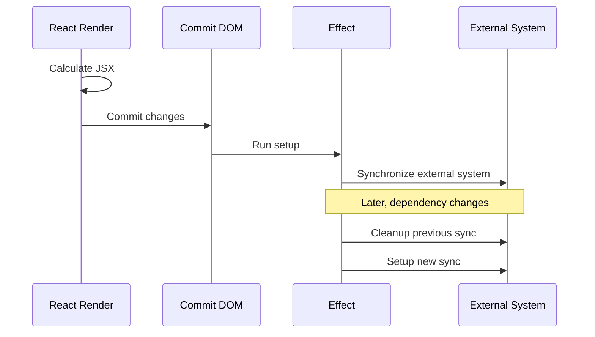
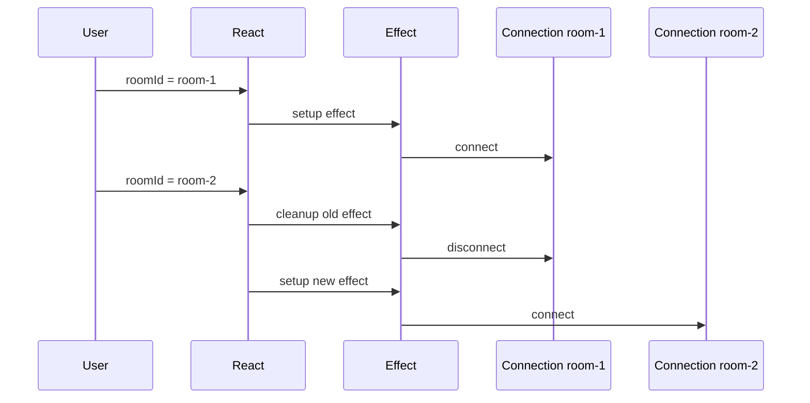
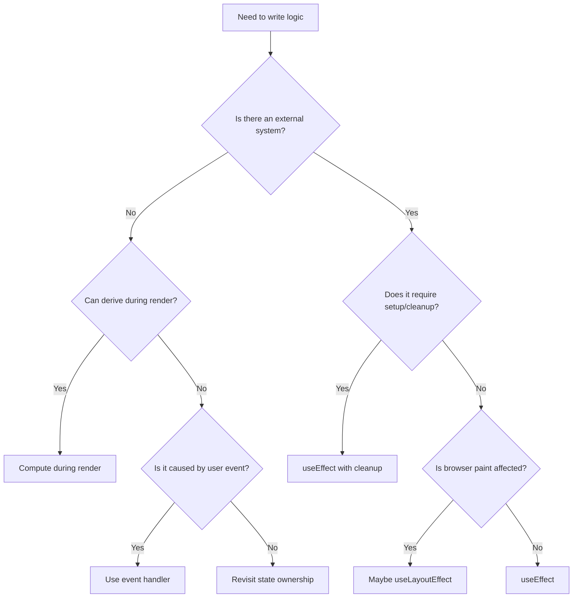

------
title: Learn Frontend React Production Architecture - Part 006
description: Production-grade guide to React Effects as synchronization mechanisms, including effect lifecycle, event-handler separation, cleanup, abortable async work, subscriptions, race conditions, idempotency, browser APIs, and common anti-patterns.
series: learn-frontend-react-production-architecture
seriesTitle: Learn Frontend React Production Architecture
order: 6
partTitle: Effects, Synchronization, and Side-Effect Design
tags:
- react
- frontend
- effects
- synchronization
- architecture
- production
- series
date: 2026-06-28
---

# Part 006 — Effects, Synchronization, and Side-Effect Design

## Tujuan Pembelajaran

Part sebelumnya menjelaskan Hooks sebagai kontrak runtime. Part ini fokus pada salah satu Hook yang paling sering disalahgunakan: `useEffect`.

Di level basic, `useEffect` sering dipahami sebagai “lifecycle replacement”.

Di level production, mental model itu tidak cukup.

`useEffect` bukan tempat default untuk:

- fetching semua data,
- menghitung derived state,
- menjalankan workflow user action,
- memperbaiki prop drilling,
- membuat component “bereaksi” secara imperatif,
- menaruh semua logic yang tidak tahu harus diletakkan di mana.

`useEffect` adalah mekanisme untuk **menyinkronkan component dengan sistem eksternal**.

Sistem eksternal bisa berupa:

- DOM API di luar React,
- browser storage,
- network connection,
- analytics SDK,
- WebSocket,
- event listener,
- timer,
- map/video/editor library,
- imperative widget,
- subscription store,
- document title,
- media query,
- service worker,
- non-React code.

Jika tidak ada sistem eksternal, kemungkinan besar Anda tidak membutuhkan Effect.

---

## 1. Mental Model Utama

React component melakukan render untuk mendeskripsikan UI.

Effect berjalan setelah render commit untuk menyinkronkan dunia luar dengan UI/state terbaru.



Effect lifecycle berbeda dari component lifecycle.

Component bisa mount, update, unmount.

Effect melakukan dua hal:

1. start synchronization,
2. stop synchronization.

Satu component bisa tetap mounted, tetapi effect di dalamnya bisa start/stop berkali-kali karena dependency berubah.

---

## 2. Bentuk Dasar Effect

```tsx
useEffect(() => {
  // setup synchronization

  return () => {
    // cleanup synchronization
  };
}, [dependencies]);
```

Contoh event listener:

```tsx
function WindowSizeLogger() {
  useEffect(() => {
    const handleResize = () => {
      console.log(window.innerWidth, window.innerHeight);
    };

    window.addEventListener("resize", handleResize);

    return () => {
      window.removeEventListener("resize", handleResize);
    };
  }, []);

  return null;
}
```

Setup:

```tsx
window.addEventListener("resize", handleResize);
```

Cleanup:

```tsx
window.removeEventListener("resize", handleResize);
```

Dependency:

```tsx
[]
```

Artinya effect tidak membaca reactive value dari component scope yang berubah antar render.

---

## 3. Effect Bukan Lifecycle Method Lama

Class lifecycle dulu membuat developer berpikir:

- `componentDidMount` = taruh logic awal,
- `componentDidUpdate` = taruh logic update,
- `componentWillUnmount` = cleanup.

Hooks mendorong model berbeda:

> Pikirkan sinkronisasi, bukan fase lifecycle component.

Buruk:

```tsx
useEffect(() => {
  // do everything on mount
}, []);
```

Lebih baik bertanya:

- sistem eksternal apa yang disinkronkan?
- nilai reactive apa yang dibaca?
- kapan sinkronisasi harus diperbarui?
- bagaimana cleanup-nya?
- apakah setup aman dijalankan ulang?
- apakah async work bisa dibatalkan?
- apakah event user seharusnya menangani logic ini?

---

## 4. Dependency Array sebagai Deklarasi Sinkronisasi

Contoh:

```tsx
function ChatRoom({ roomId }: { roomId: string }) {
  useEffect(() => {
    const connection = createConnection(roomId);

    connection.connect();

    return () => {
      connection.disconnect();
    };
  }, [roomId]);

  return <h1>Room {roomId}</h1>;
}
```

Makna dependency:

> Sinkronisasi koneksi bergantung pada `roomId`.

Jika `roomId` berubah:

1. cleanup koneksi lama,
2. setup koneksi baru.

Diagram:



Jika dependency `roomId` hilang, component bisa tetap terhubung ke room lama walaupun UI menampilkan room baru.

---

## 5. Tiga Pertanyaan Wajib Sebelum Menulis Effect

Sebelum menulis `useEffect`, jawab:

### 5.1 Apakah ada sistem eksternal?

Jika tidak, jangan mulai dengan effect.

Contoh tidak perlu effect:

```tsx
const fullName = `${firstName} ${lastName}`;
```

Bukan:

```tsx
const [fullName, setFullName] = useState("");

useEffect(() => {
  setFullName(`${firstName} ${lastName}`);
}, [firstName, lastName]);
```

### 5.2 Apakah ini akibat event user?

Jika iya, biasanya gunakan event handler.

```tsx
async function handleSubmit() {
  await submitForm(values);
  toast.success("Saved");
}
```

Bukan:

```tsx
useEffect(() => {
  if (shouldSubmit) {
    submitForm(values);
  }
}, [shouldSubmit, values]);
```

### 5.3 Apakah dependency mencerminkan semua reactive value yang dibaca?

Jika effect membaca `userId`, `token`, `query`, atau `enabled`, dependency harus mengikutinya kecuali nilai tersebut sengaja dibuat non-reactive dengan desain yang benar.

---

## 6. You Might Not Need an Effect

Effect yang tidak perlu menciptakan masalah:

- render tambahan,
- state tidak sinkron,
- infinite loop,
- dependency palsu,
- race condition,
- test lebih sulit,
- mental model kabur.

Contoh derived state:

```tsx
function CartSummary({ items }: { items: CartItem[] }) {
  const [total, setTotal] = useState(0);

  useEffect(() => {
    setTotal(items.reduce((sum, item) => sum + item.price, 0));
  }, [items]);

  return <p>Total: {total}</p>;
}
```

Perbaikan:

```tsx
function CartSummary({ items }: { items: CartItem[] }) {
  const total = items.reduce((sum, item) => sum + item.price, 0);

  return <p>Total: {total}</p>;
}
```

Jika expensive:

```tsx
const total = useMemo(() => {
  return items.reduce((sum, item) => sum + item.price, 0);
}, [items]);
```

---

## 7. Event Handler vs Effect

Event handler:

- berjalan karena interaksi spesifik,
- tidak reactive terhadap semua dependency,
- cocok untuk submit, click, confirm, cancel, approve,
- mengekspresikan intent user.

Effect:

- berjalan karena component perlu sinkron dengan external system,
- reactive terhadap dependency,
- cocok untuk subscription, connection, DOM API, timers, external widgets.

Contoh approve case.

Buruk:

```tsx
function CaseApproval({ caseId }: { caseId: string }) {
  const [shouldApprove, setShouldApprove] = useState(false);

  useEffect(() => {
    if (!shouldApprove) {
      return;
    }

    approveCase(caseId);
  }, [shouldApprove, caseId]);

  return (
    <button onClick={() => setShouldApprove(true)}>
      Approve
    </button>
  );
}
```

Lebih baik:

```tsx
function CaseApproval({ caseId }: { caseId: string }) {
  const handleApprove = async () => {
    await approveCase(caseId);
  };

  return <button onClick={handleApprove}>Approve</button>;
}
```

Effect bukan workflow queue untuk event user.

---

## 8. Effect dengan Subscription

Subscription harus punya cleanup.

```tsx
function useCaseUpdates(caseId: string) {
  const [events, setEvents] = useState<CaseEvent[]>([]);

  useEffect(() => {
    const subscription = caseEventClient.subscribe(caseId, (event) => {
      setEvents((current) => [event, ...current]);
    });

    return () => {
      subscription.unsubscribe();
    };
  }, [caseId]);

  return events;
}
```

Invariant:

- subscribe hanya ke case yang relevan,
- ketika `caseId` berubah, unsubscribe dari case lama,
- callback update memakai functional update,
- cleanup selalu tersedia,
- duplicate subscription dicegah oleh lifecycle.

---

## 9. Effect dengan Browser Event Listener

Contoh online status:

```tsx
function useOnlineStatus() {
  const [isOnline, setOnline] = useState(navigator.onLine);

  useEffect(() => {
    const handleOnline = () => setOnline(true);
    const handleOffline = () => setOnline(false);

    window.addEventListener("online", handleOnline);
    window.addEventListener("offline", handleOffline);

    return () => {
      window.removeEventListener("online", handleOnline);
      window.removeEventListener("offline", handleOffline);
    };
  }, []);

  return isOnline;
}
```

Kenapa aman?

- handler didefinisikan di dalam effect,
- tidak membaca reactive values,
- dependency kosong valid,
- cleanup menghapus handler yang sama,
- state update sederhana.

Jika handler membaca props/state, dependency harus dipikirkan ulang.

---

## 10. Effect dengan Timer

```tsx
function useCountdown(initialSeconds: number) {
  const [seconds, setSeconds] = useState(initialSeconds);

  useEffect(() => {
    const intervalId = window.setInterval(() => {
      setSeconds((current) => Math.max(0, current - 1));
    }, 1000);

    return () => {
      window.clearInterval(intervalId);
    };
  }, []);

  return seconds;
}
```

Masalah tersembunyi: jika `initialSeconds` berubah, state tidak otomatis reset.

Jika expected behavior adalah reset saat `initialSeconds` berubah:

```tsx
function useCountdown(initialSeconds: number) {
  const [seconds, setSeconds] = useState(initialSeconds);

  useEffect(() => {
    setSeconds(initialSeconds);
  }, [initialSeconds]);

  useEffect(() => {
    const intervalId = window.setInterval(() => {
      setSeconds((current) => Math.max(0, current - 1));
    }, 1000);

    return () => {
      window.clearInterval(intervalId);
    };
  }, []);

  return seconds;
}
```

Tetapi lebih baik lagi desain API jelas:

```tsx
function useCountdown({ startsFrom, resetKey }: {
  startsFrom: number;
  resetKey: string;
}) {
  const [seconds, setSeconds] = useState(startsFrom);

  useEffect(() => {
    setSeconds(startsFrom);
  }, [startsFrom, resetKey]);

  useEffect(() => {
    const intervalId = window.setInterval(() => {
      setSeconds((current) => Math.max(0, current - 1));
    }, 1000);

    return () => window.clearInterval(intervalId);
  }, []);

  return seconds;
}
```

Effect design selalu terkait kontrak domain.

---

## 11. Async Effect: Jangan Jadikan Callback Effect `async`

Tidak lakukan ini:

```tsx
useEffect(async () => {
  const user = await fetchUser(userId);
  setUser(user);
}, [userId]);
```

Effect callback harus mengembalikan `undefined` atau cleanup function, bukan Promise.

Gunakan function di dalam effect:

```tsx
useEffect(() => {
  let ignore = false;

  async function loadUser() {
    const user = await fetchUser(userId);

    if (!ignore) {
      setUser(user);
    }
  }

  loadUser();

  return () => {
    ignore = true;
  };
}, [userId]);
```

Namun untuk production server state, pertimbangkan data layer seperti TanStack Query, RTK Query, React Router loaders, atau framework data fetching. Manual fetch effect mudah salah jika menyangkut cache, deduplication, retry, pagination, invalidation, dan race condition.

---

## 12. Abortable Async Work

Jika API mendukung `AbortController`, gunakan untuk membatalkan request lama.

```tsx
useEffect(() => {
  const controller = new AbortController();

  async function load() {
    try {
      const response = await fetch(`/api/users/${userId}`, {
        signal: controller.signal,
      });

      const data = await response.json();
      setUser(data);
    } catch (error) {
      if (error instanceof DOMException && error.name === "AbortError") {
        return;
      }

      setError(error);
    }
  }

  load();

  return () => {
    controller.abort();
  };
}, [userId]);
```

Manfaat:

- request lama dibatalkan,
- response lama tidak menimpa state baru,
- resource network lebih hemat,
- cleanup sesuai dependency lifecycle.

Tetap perlu hati-hati:

- tidak semua async operation abortable,
- error abort perlu dibedakan dari error nyata,
- state loading harus konsisten,
- multiple concurrent operation perlu identity/request id.

---

## 13. Race Condition pada Effect

Contoh masalah:

```tsx
useEffect(() => {
  setLoading(true);

  fetchUser(userId).then((data) => {
    setUser(data);
    setLoading(false);
  });
}, [userId]);
```

Skenario:

1. `userId = A`, request A mulai.
2. `userId = B`, request B mulai.
3. request B selesai lebih dulu, UI menampilkan B.
4. request A selesai belakangan, UI tertimpa A.

Perbaikan dengan ignore flag:

```tsx
useEffect(() => {
  let ignore = false;

  setLoading(true);

  fetchUser(userId)
    .then((data) => {
      if (!ignore) {
        setUser(data);
      }
    })
    .finally(() => {
      if (!ignore) {
        setLoading(false);
      }
    });

  return () => {
    ignore = true;
  };
}, [userId]);
```

Perbaikan dengan request id:

```tsx
const requestIdRef = useRef(0);

useEffect(() => {
  const requestId = requestIdRef.current + 1;
  requestIdRef.current = requestId;

  async function load() {
    setLoading(true);

    try {
      const data = await fetchUser(userId);

      if (requestIdRef.current === requestId) {
        setUser(data);
      }
    } finally {
      if (requestIdRef.current === requestId) {
        setLoading(false);
      }
    }
  }

  load();
}, [userId]);
```

Lebih baik jika data fetching kompleks: gunakan server-state layer.

---

## 14. Idempotent Effects

Dalam production, effect harus aman jika setup/cleanup terjadi lebih dari sekali.

Idempotent berarti:

- setup tidak membuat duplicate subscription permanen,
- cleanup bisa dipanggil tanpa merusak state,
- external system tidak masuk kondisi invalid,
- analytics tidak terkirim berkali-kali tanpa niat,
- resource dilepas dengan benar.

Contoh non-idempotent:

```tsx
useEffect(() => {
  analytics.track("PageViewed");
}, []);
```

Di development Strict Mode, React bisa menjalankan setup+cleanup ekstra untuk membantu menemukan bug effect. Jika analytics page view terkirim dua kali di dev, jangan langsung menyalahkan React. Tanyakan apakah event tracking sebaiknya ditempatkan di route analytics layer, bukan component acak.

Lebih baik:

```tsx
function usePageView(pageName: string) {
  const location = useLocation();

  useEffect(() => {
    analytics.track("PageViewed", {
      pageName,
      path: location.pathname,
    });
  }, [pageName, location.pathname]);
}
```

Namun untuk analytics production, biasanya lebih baik:

- sentral di router layer,
- dedupe berdasarkan navigation id,
- pisahkan dev behavior,
- jangan tersebar di banyak component.

---

## 15. Strict Mode dan Double Invocation di Development

React Strict Mode dapat menjalankan setup dan cleanup effect tambahan di development untuk membantu mendeteksi effect yang cleanup-nya tidak benar.

Konsekuensi arsitektur:

- effect harus cleanup dengan benar,
- jangan bergantung pada “effect hanya sekali” sebagai correctness,
- side effect non-idempotent harus dirancang hati-hati,
- external subscription harus aman saat reconnect,
- timer harus selalu dibersihkan,
- network effect manual harus tahan race.

Jika effect rusak saat Strict Mode, sering kali production bug-nya hanya belum terlihat.

---

## 16. `useLayoutEffect` vs `useEffect`

`useEffect` berjalan setelah browser paint pada banyak kasus.

`useLayoutEffect` berjalan lebih awal, setelah DOM mutation tetapi sebelum browser paint, sehingga bisa dipakai untuk layout measurement yang harus sinkron sebelum tampilan terlihat.

Contoh:

```tsx
function Tooltip({ targetRef }: { targetRef: RefObject<HTMLElement> }) {
  const tooltipRef = useRef<HTMLDivElement | null>(null);
  const [position, setPosition] = useState({ top: 0, left: 0 });

  useLayoutEffect(() => {
    const target = targetRef.current;
    const tooltip = tooltipRef.current;

    if (!target || !tooltip) {
      return;
    }

    const rect = target.getBoundingClientRect();

    setPosition({
      top: rect.bottom + window.scrollY,
      left: rect.left + window.scrollX,
    });
  }, [targetRef]);

  return (
    <div
      ref={tooltipRef}
      style={{
        position: "absolute",
        top: position.top,
        left: position.left,
      }}
    >
      Tooltip
    </div>
  );
}
```

Gunakan `useLayoutEffect` secara hemat karena bisa memblok paint.

Rule praktis:

- default pakai `useEffect`,
- pakai `useLayoutEffect` untuk DOM measurement sebelum paint,
- hindari network/subscription biasa di `useLayoutEffect`,
- waspadai SSR warnings bila digunakan di code yang juga dirender server.

---

## 17. Synchronizing Imperative Widgets

React sering perlu berintegrasi dengan library imperative:

- map,
- chart,
- video player,
- code editor,
- date picker,
- rich text editor.

Contoh video player:

```tsx
function VideoPlayer({
  src,
  isPlaying,
}: {
  src: string;
  isPlaying: boolean;
}) {
  const ref = useRef<HTMLVideoElement | null>(null);

  useEffect(() => {
    const video = ref.current;

    if (!video) {
      return;
    }

    if (isPlaying) {
      video.play();
    } else {
      video.pause();
    }
  }, [isPlaying]);

  return <video ref={ref} src={src} />;
}
```

Ini effect yang valid karena menyinkronkan state React dengan DOM media API eksternal.

Namun perhatikan:

- `play()` bisa mengembalikan Promise dan gagal karena browser autoplay policy,
- cleanup mungkin dibutuhkan untuk object URL,
- source change perlu dipikirkan,
- state playback jangan diduplikasi tanpa alasan.

---

## 18. External Instance Lifecycle

Contoh map instance:

```tsx
function MapView({ center, zoom }: { center: LatLng; zoom: number }) {
  const containerRef = useRef<HTMLDivElement | null>(null);
  const mapRef = useRef<MapInstance | null>(null);

  useEffect(() => {
    if (!containerRef.current) {
      return;
    }

    const map = createMap(containerRef.current);
    mapRef.current = map;

    return () => {
      map.destroy();
      mapRef.current = null;
    };
  }, []);

  useEffect(() => {
    mapRef.current?.setCenter(center);
  }, [center]);

  useEffect(() => {
    mapRef.current?.setZoom(zoom);
  }, [zoom]);

  return <div ref={containerRef} />;
}
```

Mengapa dipisah?

- effect pertama mengelola lifecycle instance,
- effect kedua sinkronisasi center,
- effect ketiga sinkronisasi zoom.

Satu God Effect lebih sulit dikelola:

```tsx
useEffect(() => {
  // create map
  // update center
  // update zoom
  // subscribe event
  // cleanup everything
}, [center, zoom]);
```

Pemisahan berdasarkan sinkronisasi membuat dependency lebih jelas.

---

## 19. Effect Events dan Non-Reactive Logic

Kadang effect harus membaca nilai terbaru tanpa menjadikan nilai tersebut trigger sinkronisasi.

Contoh konseptual:

- koneksi chat bergantung pada `roomId`,
- notifikasi saat connected ingin membaca `theme` terbaru,
- tetapi perubahan `theme` tidak seharusnya reconnect chat.

Jika semua dibaca langsung di effect, dependency akan meminta `theme`, lalu connection reconnect saat theme berubah.

Solusi modern React menyediakan pendekatan untuk memisahkan reactive effect dari non-reactive event logic. Secara desain, pertanyaannya:

- nilai mana yang menentukan lifecycle sinkronisasi?
- nilai mana yang hanya dibaca saat event terjadi?
- apakah perubahan nilai itu harus restart effect?

Jika belum memakai API khusus untuk effect event, pola lama menggunakan ref bisa dipakai dengan sangat hati-hati.

```tsx
function useLatest<T>(value: T) {
  const ref = useRef(value);

  useEffect(() => {
    ref.current = value;
  }, [value]);

  return ref;
}
```

Lalu:

```tsx
const latestThemeRef = useLatest(theme);

useEffect(() => {
  const connection = createConnection(roomId);

  connection.onConnected(() => {
    showNotification("Connected", latestThemeRef.current);
  });

  connection.connect();

  return () => connection.disconnect();
}, [roomId, latestThemeRef]);
```

Catatan: dependency `latestThemeRef` stabil selama Hook mengembalikan ref yang sama. Namun pattern ini harus dipakai sebagai escape hatch, bukan cara menghindari dependency seenaknya.

---

## 20. Effect dan Data Fetching

Manual fetch di effect boleh untuk kasus sederhana, tetapi production frontend sering membutuhkan lebih dari sekadar `fetch`.

Kebutuhan nyata:

- request deduplication,
- cache,
- stale-while-revalidate,
- retry,
- pagination,
- infinite query,
- optimistic mutation,
- invalidation,
- background refetch,
- offline/reconnect handling,
- SSR/RSC hydration,
- request cancellation,
- normalized error handling.

Jika setiap component fetch sendiri di effect, codebase akan punya banyak perilaku inconsistent.

Contoh manual fetch sederhana:

```tsx
useEffect(() => {
  let ignore = false;

  async function load() {
    setStatus("loading");

    try {
      const data = await fetchCases(filters);

      if (!ignore) {
        setCases(data);
        setStatus("success");
      }
    } catch (error) {
      if (!ignore) {
        setError(normalizeError(error));
        setStatus("error");
      }
    }
  }

  load();

  return () => {
    ignore = true;
  };
}, [filters]);
```

Untuk production, biasanya lebih baik:

```tsx
const casesQuery = useCasesQuery(filters);
```

Atau framework route loader/server component tergantung rendering architecture.

---

## 21. Effect dan URL Synchronization

Sinkronisasi URL adalah kasus yang sering ambigu.

Jika user mengetik filter, kapan URL berubah?

- setiap keystroke,
- setelah debounce,
- setelah submit,
- saat Apply diklik,
- saat filter valid,
- saat route transition?

Contoh effect debounce untuk URL:

```tsx
function useSearchParamSync(query: string) {
  const navigate = useNavigate();
  const location = useLocation();

  useEffect(() => {
    const timerId = window.setTimeout(() => {
      const params = new URLSearchParams(location.search);

      if (query) {
        params.set("q", query);
      } else {
        params.delete("q");
      }

      navigate({ search: params.toString() }, { replace: true });
    }, 300);

    return () => window.clearTimeout(timerId);
  }, [query, location.search, navigate]);
}
```

Namun hati-hati:

- effect ini bisa membuat navigation loop,
- `location.search` berubah karena navigate,
- query local dan URL bisa konflik,
- back/forward browser harus tetap benar.

Sering lebih baik URL dijadikan source of truth:

```tsx
const [searchParams, setSearchParams] = useSearchParams();
const query = searchParams.get("q") ?? "";
```

Lalu update URL dari event handler Apply.

---

## 22. Effect dan Local Storage

Local storage adalah external system.

Membaca initial value:

```tsx
function readInitialTheme(): Theme {
  const value = window.localStorage.getItem("theme");

  return value === "dark" ? "dark" : "light";
}
```

State:

```tsx
const [theme, setTheme] = useState<Theme>(() => readInitialTheme());
```

Sinkronisasi:

```tsx
useEffect(() => {
  window.localStorage.setItem("theme", theme);
}, [theme]);
```

Cross-tab sync:

```tsx
useEffect(() => {
  const handleStorage = (event: StorageEvent) => {
    if (event.key !== "theme") {
      return;
    }

    setTheme(event.newValue === "dark" ? "dark" : "light");
  };

  window.addEventListener("storage", handleStorage);

  return () => {
    window.removeEventListener("storage", handleStorage);
  };
}, []);
```

Perhatikan:

- SSR tidak punya `window`,
- localStorage bisa gagal di beberapa environment,
- value harus divalidasi,
- jangan simpan token sensitif sembarangan,
- cross-tab event tidak fire di tab yang sama yang melakukan perubahan.

---

## 23. Effect dan Document Title

Document title external terhadap React.

```tsx
function useDocumentTitle(title: string) {
  useEffect(() => {
    const previousTitle = document.title;

    document.title = title;

    return () => {
      document.title = previousTitle;
    };
  }, [title]);
}
```

Untuk app besar, document title sering lebih baik dikelola di route metadata layer.

Jika banyak component mengubah title, cleanup previous title bisa menghasilkan behavior aneh saat nested component mount/unmount.

Pertimbangkan:

- route owns title,
- modal may append suffix,
- breadcrumbs derive title,
- SSR metadata support jika framework menyediakan.

---

## 24. Effect dan Analytics

Analytics terlihat sederhana tetapi rawan duplikasi.

Buruk:

```tsx
useEffect(() => {
  analytics.track("CaseDetailViewed", { caseId });
}, [caseId]);
```

Ini mungkin valid, tetapi tanyakan:

- apakah event terkirim saat data belum loaded?
- apakah Strict Mode dev mengirim dua kali?
- apakah route transition mengirim event serupa?
- apakah component remount karena layout?
- apakah tab visibility mempengaruhi event?
- apakah event perlu user/session metadata?
- apakah data PII bocor?
- apakah event harus dedupe?

Lebih robust:

```tsx
function useCaseDetailPageAnalytics(caseId: string, status: QueryStatus) {
  const trackedRef = useRef<string | null>(null);

  useEffect(() => {
    if (status !== "success") {
      return;
    }

    const trackingKey = `case-detail:${caseId}`;

    if (trackedRef.current === trackingKey) {
      return;
    }

    trackedRef.current = trackingKey;

    analytics.track("CaseDetailViewed", {
      caseId,
    });
  }, [caseId, status]);
}
```

Namun governance terbaik biasanya analytics event catalog + route-level tracking.

---

## 25. Cleanup Design

Cleanup harus membatalkan apa yang dibuat setup.

| Setup | Cleanup |
|---|---|
| `addEventListener` | `removeEventListener` |
| `setInterval` | `clearInterval` |
| `setTimeout` | `clearTimeout` |
| `connect` | `disconnect` |
| `subscribe` | `unsubscribe` |
| `createMap` | `destroy` |
| `new AbortController` | `abort` |
| `objectUrl = URL.createObjectURL` | `URL.revokeObjectURL` |

Prinsip:

> Jangan membuat resource di effect tanpa tahu cara melepaskannya.

---

## 26. Splitting Effects by Synchronization Target

Buruk:

```tsx
useEffect(() => {
  document.title = title;

  const connection = createConnection(roomId);
  connection.connect();

  window.localStorage.setItem("theme", theme);

  return () => {
    connection.disconnect();
  };
}, [title, roomId, theme]);
```

Masalah:

- title berubah membuat connection reconnect,
- theme berubah membuat connection reconnect,
- unrelated dependencies bercampur.

Lebih baik:

```tsx
useEffect(() => {
  document.title = title;
}, [title]);

useEffect(() => {
  const connection = createConnection(roomId);
  connection.connect();

  return () => connection.disconnect();
}, [roomId]);

useEffect(() => {
  window.localStorage.setItem("theme", theme);
}, [theme]);
```

Satu effect harus punya satu alasan sinkronisasi.

---

## 27. Merging Effects by Same Synchronization Target

Sebaliknya, jangan memecah effect jika target sinkronisasi sama dan lifecycle harus konsisten.

Kurang baik:

```tsx
useEffect(() => {
  connection.setRoom(roomId);
}, [roomId]);

useEffect(() => {
  connection.setToken(token);
}, [token]);

useEffect(() => {
  connection.connect();
  return () => connection.disconnect();
}, []);
```

Jika connection lifecycle bergantung pada room dan token, satukan:

```tsx
useEffect(() => {
  const connection = createConnection({ roomId, token });

  connection.connect();

  return () => {
    connection.disconnect();
  };
}, [roomId, token]);
```

Rule:

- split jika target eksternal berbeda,
- merge jika satu lifecycle resource bergantung pada beberapa value.

---

## 28. Infinite Loop Patterns

### 28.1 Object Dependency Baru Setiap Render

```tsx
const options = { roomId };

useEffect(() => {
  const connection = createConnection(options);
  connection.connect();

  return () => connection.disconnect();
}, [options]);
```

`options` baru setiap render, effect jalan terus.

Perbaikan:

```tsx
useEffect(() => {
  const options = { roomId };

  const connection = createConnection(options);
  connection.connect();

  return () => connection.disconnect();
}, [roomId]);
```

### 28.2 Effect Mengubah Dependency Sendiri

```tsx
useEffect(() => {
  setCount(count + 1);
}, [count]);
```

Ini hampir pasti loop.

Jika ingin inisialisasi, gunakan initializer. Jika ingin derivation, hitung saat render. Jika ingin reaction terhadap external system, jelaskan sistem eksternalnya.

### 28.3 Function Dependency Tidak Stabil

```tsx
function createOptions() {
  return { roomId };
}

useEffect(() => {
  const connection = createConnection(createOptions());
  connection.connect();

  return () => connection.disconnect();
}, [createOptions]);
```

Function dibuat ulang setiap render.

Perbaikan:

```tsx
useEffect(() => {
  function createOptions() {
    return { roomId };
  }

  const connection = createConnection(createOptions());
  connection.connect();

  return () => connection.disconnect();
}, [roomId]);
```

Atau gunakan `useCallback` jika function memang perlu di luar effect.

---

## 29. Effect, Suspense, and Rendering Architecture

Effect tidak berjalan di server render. Effect berjalan di client.

Implikasi:

- data yang hanya di-fetch dalam effect tidak tersedia di HTML awal,
- SSR page bisa menampilkan loading shell lalu fetch di client,
- SEO dan LCP bisa terdampak,
- hydration bisa berbeda jika initial state tergantung browser-only API,
- Server Components tidak bisa memakai client-only effects.

Untuk rendering architecture modern:

- gunakan Server Components/server loaders untuk data yang perlu hadir di server-rendered output,
- gunakan client effects untuk browser-only synchronization,
- jangan memindahkan semua data fetching ke effect jika framework menyediakan data layer lebih tepat,
- pahami boundary `use client` pada framework RSC.

---

## 30. Effect dalam Client Component pada RSC Architecture

Dalam React Server Components architecture, effect hanya bisa dipakai di Client Component.

Contoh:

```tsx
"use client";

import { useEffect } from "react";

export function ClientAnalytics({ pageName }: { pageName: string }) {
  useEffect(() => {
    analytics.track("PageViewed", { pageName });
  }, [pageName]);

  return null;
}
```

Pertanyaan desain:

- apakah component ini memang harus client?
- apakah analytics perlu route-level client boundary?
- apakah props yang dikirim dari server serializable?
- apakah effect membaca data yang sebaiknya tetap di server?
- apakah client boundary memperbesar bundle?

Anti-pattern:

```tsx
"use client";

export function EntireCasePage() {
  // everything client-side only because one child needs useEffect
}
```

Lebih baik isolasi effect ke island kecil.

---

## 31. Production Pattern: Synchronization Hook

Jika effect memiliki behavior reusable, bungkus dalam custom Hook kecil.

```tsx
function useWindowEvent<K extends keyof WindowEventMap>(
  type: K,
  listener: (event: WindowEventMap[K]) => void,
) {
  useEffect(() => {
    window.addEventListener(type, listener);

    return () => {
      window.removeEventListener(type, listener);
    };
  }, [type, listener]);
}
```

Namun API ini membuat caller harus menjaga `listener` stability.

Pemakaian:

```tsx
const handleResize = useCallback(() => {
  console.log(window.innerWidth);
}, []);

useWindowEvent("resize", handleResize);
```

Alternatif dengan latest ref bisa mengurangi beban caller:

```tsx
function useWindowEvent<K extends keyof WindowEventMap>(
  type: K,
  listener: (event: WindowEventMap[K]) => void,
) {
  const listenerRef = useRef(listener);

  useEffect(() => {
    listenerRef.current = listener;
  }, [listener]);

  useEffect(() => {
    const stableListener = (event: WindowEventMap[K]) => {
      listenerRef.current(event);
    };

    window.addEventListener(type, stableListener);

    return () => {
      window.removeEventListener(type, stableListener);
    };
  }, [type]);
}
```

Trade-off:

- caller lebih mudah,
- Hook lebih kompleks,
- listener update tidak resubscribe,
- cocok untuk event listener umum,
- harus dipahami sebagai non-reactive latest value pattern.

---

## 32. Production Pattern: Resource Hook

Untuk lifecycle resource:

```tsx
function useWebSocketConnection(url: string) {
  const [status, setStatus] = useState<"connecting" | "open" | "closed">(
    "connecting"
  );

  useEffect(() => {
    const socket = new WebSocket(url);

    setStatus("connecting");

    socket.addEventListener("open", () => setStatus("open"));
    socket.addEventListener("close", () => setStatus("closed"));

    return () => {
      socket.close();
    };
  }, [url]);

  return status;
}
```

Lebih robust production version perlu:

- reconnect backoff,
- auth token refresh,
- heartbeat,
- error classification,
- max retry,
- visibility handling,
- offline handling,
- message ordering,
- idempotency,
- cleanup on logout.

Effect hanya lifecycle primitive. Resilience logic harus didesain eksplisit.

---

## 33. Production Pattern: DOM Measurement Hook

```tsx
function useElementRect<T extends HTMLElement>() {
  const ref = useRef<T | null>(null);
  const [rect, setRect] = useState<DOMRectReadOnly | null>(null);

  useLayoutEffect(() => {
    const element = ref.current;

    if (!element) {
      return;
    }

    const observer = new ResizeObserver(([entry]) => {
      setRect(entry.contentRect);
    });

    observer.observe(element);

    return () => {
      observer.disconnect();
    };
  }, []);

  return { ref, rect };
}
```

Catatan:

- `ResizeObserver` external browser API,
- cleanup wajib,
- `useLayoutEffect` masuk akal jika measurement mempengaruhi layout sebelum paint,
- untuk banyak element, perhatikan overhead observer.

---

## 34. Production Pattern: Page-Level Side Effect Governance

Untuk app besar, side effect harus diatur dalam layer.

Contoh governance:

```txt
src/
  app/
    analytics/
      routeTracking.ts
    effects/
      useDocumentTitle.ts
      useNetworkStatus.ts
      useVisibilityChange.ts
  features/
    cases/
      effects/
        useCaseRealtimeUpdates.ts
        useCaseDetailAnalytics.ts
```

Aturan:

- route-level side effect di app layer,
- feature-specific effect di feature layer,
- shared browser effect di shared/app layer,
- jangan taruh analytics acak di setiap button tanpa catalog,
- jangan taruh WebSocket setup di component presentational,
- jangan campur fetch/cache dengan effect manual jika ada data layer.

---

## 35. Anti-Pattern Catalog

### 35.1 Fetch Everything in `useEffect`

```tsx
useEffect(() => {
  fetch("/api/dashboard").then(...);
}, []);
```

Masalah:

- tidak ada cache,
- tidak ada dedupe,
- tidak SSR-friendly,
- loading state manual,
- retry manual,
- race condition manual.

Bukan berarti selalu salah, tetapi untuk production data-intensive app, ini sering smell.

---

### 35.2 Effect as Business Workflow Engine

```tsx
useEffect(() => {
  if (caseStatus === "APPROVED") {
    sendNotification();
    navigate("/next");
    refreshList();
    closeDialog();
  }
}, [caseStatus]);
```

Masalah:

- workflow tersembunyi,
- dependency rapuh,
- urutan side effect sulit diuji,
- event intent hilang.

Lebih baik command handler eksplisit:

```tsx
async function handleApprove() {
  await approveCase(caseId);
  closeDialog();
  invalidateCaseQueries();
  navigate("/cases");
}
```

---

### 35.3 Missing Cleanup

```tsx
useEffect(() => {
  window.addEventListener("resize", handleResize);
}, []);
```

Leak.

Perbaikan:

```tsx
useEffect(() => {
  window.addEventListener("resize", handleResize);

  return () => {
    window.removeEventListener("resize", handleResize);
  };
}, [handleResize]);
```

---

### 35.4 Suppressing Dependencies

```tsx
useEffect(() => {
  reconnect(token, roomId);
  // eslint-disable-next-line react-hooks/exhaustive-deps
}, []);
```

Jika token berubah, koneksi tetap memakai token lama.

---

### 35.5 Effect That Only Mirrors Props to State

```tsx
const [value, setValue] = useState(propValue);

useEffect(() => {
  setValue(propValue);
}, [propValue]);
```

Kadang valid untuk reset state lokal berdasarkan identity tertentu, tetapi sering menunjukkan ownership state tidak jelas.

Tanya:

- siapa source of truth?
- apakah component controlled?
- apakah butuh `key` untuk reset?
- apakah state lokal hanya draft?
- apakah reset harus terjadi pada event tertentu?

---

### 35.6 Navigation Loop

```tsx
useEffect(() => {
  navigate(`/users/${selectedUserId}`);
}, [selectedUserId, navigate]);
```

Jika `selectedUserId` diturunkan dari route, ini bisa loop.

Navigation umumnya akibat event user atau route guard eksplisit, bukan effect generik.

---

## 36. Decision Tree: Do I Need an Effect?



---

## 37. Code Review Checklist for Effects

Saat review PR, cek:

1. Apakah effect punya external system jelas?
2. Apakah effect bisa diganti render calculation?
3. Apakah effect bisa diganti event handler?
4. Apakah semua reactive values ada di dependency?
5. Apakah dependency object/function bisa dipindahkan ke dalam effect?
6. Apakah cleanup tersedia?
7. Apakah async work abortable atau protected dari race?
8. Apakah Strict Mode aman?
9. Apakah effect idempotent?
10. Apakah effect terlalu banyak responsibility?
11. Apakah data fetching sebaiknya masuk data layer?
12. Apakah effect menyebabkan navigation loop?
13. Apakah effect membuat client boundary terlalu besar?
14. Apakah analytics/event tracking dedupe?
15. Apakah error path ditangani?

---

## 38. Mini Case Study: Case Detail Realtime Updates

### Problem

Regulatory case detail page perlu:

- load initial case detail,
- subscribe realtime events,
- show connection status,
- update timeline when event arrives,
- avoid duplicate events,
- cleanup when leaving case,
- reconnect safely.

### Bad Version

```tsx
function CaseDetailPage({ caseId }: { caseId: string }) {
  const [caseData, setCaseData] = useState<CaseDetail | null>(null);
  const [events, setEvents] = useState<CaseEvent[]>([]);

  useEffect(() => {
    fetch(`/api/cases/${caseId}`)
      .then((res) => res.json())
      .then(setCaseData);

    const socket = new WebSocket(`/ws/cases/${caseId}`);

    socket.onmessage = (message) => {
      setEvents([JSON.parse(message.data), ...events]);
    };
  }, []);

  return null;
}
```

Bugs:

- `caseId` missing dependency,
- no socket cleanup,
- stale `events`,
- fetch race,
- no duplicate handling,
- no connection status,
- no error path,
- effect mixes fetch and socket,
- not SSR/data-layer friendly.

### Better Version

```tsx
function CaseDetailPage({ caseId }: { caseId: string }) {
  const caseQuery = useCaseDetailQuery(caseId);
  const realtime = useCaseRealtimeEvents(caseId);

  if (caseQuery.isLoading) {
    return <CaseDetailSkeleton />;
  }

  if (caseQuery.error) {
    return <CaseDetailError error={caseQuery.error} />;
  }

  return (
    <CaseDetailView
      caseData={caseQuery.data}
      realtimeStatus={realtime.status}
      events={realtime.events}
    />
  );
}
```

Realtime Hook:

```tsx
function useCaseRealtimeEvents(caseId: string) {
  const [status, setStatus] = useState<"connecting" | "open" | "closed">(
    "connecting"
  );
  const [events, setEvents] = useState<CaseEvent[]>([]);
  const seenEventIdsRef = useRef(new Set<string>());

  useEffect(() => {
    const socket = new WebSocket(`/ws/cases/${caseId}`);

    setStatus("connecting");

    socket.addEventListener("open", () => {
      setStatus("open");
    });

    socket.addEventListener("close", () => {
      setStatus("closed");
    });

    socket.addEventListener("message", (message) => {
      const event = JSON.parse(message.data) as CaseEvent;

      setEvents((current) => {
        if (seenEventIdsRef.current.has(event.id)) {
          return current;
        }

        seenEventIdsRef.current.add(event.id);

        return [event, ...current];
      });
    });

    return () => {
      socket.close();
      seenEventIdsRef.current.clear();
    };
  }, [caseId]);

  return { status, events };
}
```

Still missing for true production:

- reconnect backoff,
- auth token refresh,
- server event replay,
- ordering guarantee,
- heartbeat,
- offline handling,
- visibility handling,
- error classification,
- tracing.

But boundary is now clear.

---

## 39. Deliberate Practice

### Latihan 1 — Effect Classification

Ambil 10 `useEffect` dari codebase.

Klasifikasikan:

| Effect | External System? | Can Be Event Handler? | Can Be Derived? | Cleanup? | Risk |
|---|---:|---:|---:|---:|---|
| fetch user | yes/network | no | no | partial | race |
| set full name | no | no | yes | n/a | redundant |
| add resize listener | yes/browser | no | no | yes | ok |
| navigate on selected | maybe/router | often yes | no | n/a | loop |

Target:

- hapus 2 effect yang tidak perlu,
- perbaiki 1 missing cleanup,
- perbaiki 1 dependency suppression,
- pisahkan 1 God Effect.

### Latihan 2 — Race Repair

Buat contoh search box:

- user mengetik query,
- request berjalan setelah debounce 300ms,
- response lama tidak boleh menimpa response baru,
- loading state benar,
- error abort tidak ditampilkan,
- query kosong tidak fetch.

Tulis dua versi:

1. manual effect dengan `AbortController`,
2. server-state library query hook.

Bandingkan kompleksitas.

### Latihan 3 — Subscription Hook

Buat:

```tsx
useCaseEventSubscription(caseId)
```

Kebutuhan:

- subscribe saat `caseId` tersedia,
- unsubscribe saat berubah,
- dedupe event by id,
- expose status,
- expose latest event,
- expose accumulated timeline,
- tidak fetch initial data,
- tidak melakukan navigation.

Tujuan: memisahkan realtime synchronization dari server-state fetching.

---

## 40. Production Heuristics

1. Effect harus punya external system yang jelas.
2. Satu effect punya satu alasan sinkronisasi.
3. Dependency array adalah correctness, bukan preference.
4. Cleanup adalah bagian dari setup, bukan tambahan.
5. Async effect harus aman terhadap race.
6. Jangan jadikan effect sebagai workflow engine.
7. Jangan jadikan effect sebagai derived state mechanism.
8. Browser-only effect harus dipisah dari server-rendered logic.
9. Analytics effect perlu dedupe/governance.
10. Data fetching production biasanya butuh data layer, bukan effect manual tersebar.

---

## 41. Ringkasan

`useEffect` adalah escape hatch untuk sinkronisasi.

Pertanyaan utamanya bukan:

> “Kapan effect ini jalan?”

Tetapi:

> “Sistem eksternal apa yang sedang disinkronkan dengan state/render React?”

Jika tidak ada sistem eksternal, kemungkinan effect tidak diperlukan.

Jika ada sistem eksternal, desain effect dengan benar:

- dependency lengkap,
- cleanup jelas,
- async work aman,
- idempotent,
- tidak mencampur responsibility,
- tidak menyembunyikan workflow,
- tidak menciptakan client boundary terlalu besar.

Production React codebase yang sehat biasanya punya lebih sedikit effect daripada codebase intermediate, bukan lebih banyak. Senior frontend engineer bukan orang yang paling banyak memakai `useEffect`, tetapi orang yang tahu kapan tidak memakainya.

---

## 42. Self-Assessment

Anda siap lanjut jika bisa menjawab:

1. Apa definisi sistem eksternal dalam konteks `useEffect`?
2. Mengapa derived state biasanya tidak perlu effect?
3. Apa beda event handler dan effect?
4. Apa arti dependency array secara correctness?
5. Bagaimana cara mencegah race condition pada async effect?
6. Mengapa cleanup harus dianggap bagian dari setup?
7. Kapan `useLayoutEffect` dipakai?
8. Apa risiko suppress dependency?
9. Mengapa fetching semua data di effect sering menjadi smell?
10. Bagaimana cara memisahkan God Effect menjadi beberapa effect?

Jika jawaban masih berupa “agar jalan setelah render”, ulangi bagian mental model sinkronisasi.

---

## 43. Sumber Rujukan

- React Docs — `useEffect`
- React Docs — Synchronizing with Effects
- React Docs — Lifecycle of Reactive Effects
- React Docs — You Might Not Need an Effect
- React Docs — Separating Events from Effects
- React Docs — Removing Effect Dependencies
- React Docs — Strict Mode
- React Docs — `useLayoutEffect`
