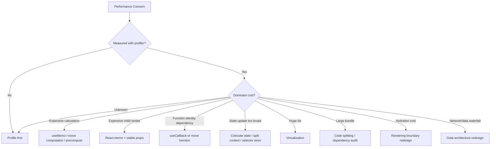

------
title: Learn Frontend React Production Architecture - Part 007
description: Production-grade guide to React Compiler, memoization strategy, referential stability, React.memo, useMemo, useCallback, profiling-first optimization, and anti-patterns in modern React applications.
series: learn-frontend-react-production-architecture
seriesTitle: Learn Frontend React Production Architecture
order: 7
partTitle: React Compiler and Memoization Strategy
tags:
- react
- frontend
- react-compiler
- memoization
- performance
- architecture
- production
- series
date: 2026-06-28
---

# Part 007 — React Compiler and Memoization Strategy

## Tujuan Pembelajaran

Sebelum React Compiler menjadi bagian penting dari arsitektur React modern, banyak codebase mengandalkan manual memoization:

- `React.memo`
- `useMemo`
- `useCallback`
- selector memoization
- stable object references
- custom equality function
- dependency-array gymnastics

Sebagian penggunaan itu benar. Banyak juga yang hanya cargo cult.

Part ini membahas memoization sebagai **strategi arsitektur**, bukan sekadar “pakai `useMemo` agar cepat”.

Target setelah menyelesaikan part ini:

1. memahami apa yang sebenarnya dimemoize,
2. membedakan render murah vs render mahal,
3. tahu kapan manual memoization benar-benar berguna,
4. tahu kapan memoization menyembunyikan desain yang buruk,
5. memahami implikasi React Compiler,
6. bisa menulis code yang compiler-friendly,
7. bisa melakukan performance review berbasis profiling,
8. bisa memilih antara memoization, state colocation, virtualization, code splitting, atau boundary redesign.

---

## 1. Masalah yang Sering Disalahpahami

Banyak engineer melihat render ulang sebagai bug.

Padahal di React:

> Re-render adalah mekanisme normal untuk menyegarkan deskripsi UI.

Yang menjadi masalah bukan “component render ulang”, tetapi:

- render ulang terlalu sering pada subtree besar,
- render mahal karena kalkulasi berat,
- child render ulang karena referential identity tidak stabil,
- state terlalu tinggi sehingga update kecil mengguncang banyak component,
- context provider value berubah terus,
- list besar dirender tanpa virtualization,
- bundle besar membuat hydration lambat,
- expensive effect berjalan ulang karena dependency tidak stabil,
- UI input lambat karena update prioritas tidak dipisah.

Memoization hanya menyelesaikan sebagian dari masalah tersebut.

---

## 2. Apa Itu Memoization

Memoization adalah teknik menyimpan hasil operasi agar bisa digunakan ulang ketika input-nya sama.

Secara umum:

```ts
function memoize<A, R>(fn: (arg: A) => R) {
  const cache = new Map<A, R>();

  return (arg: A) => {
    if (cache.has(arg)) {
      return cache.get(arg)!;
    }

    const result = fn(arg);
    cache.set(arg, result);

    return result;
  };
}
```

Di React, memoization muncul pada beberapa level:

| Level | Tool | Yang Dimemoize |
|---|---|---|
| Component | `React.memo` | hasil render component berdasarkan props |
| Value | `useMemo` | hasil kalkulasi |
| Function | `useCallback` | identity function |
| Selector | library selector | hasil transform state |
| Server computation | `cache` dalam konteks tertentu | hasil fungsi berdasarkan input |
| Compiler | React Compiler | values/functions/components secara otomatis bila aman |

Memoization bukan caching universal. Ia selalu bergantung pada definisi “input sama”.

---

## 3. Referential Equality vs Structural Equality

JavaScript membandingkan object/function/array berdasarkan referensi.

```ts
{} === {} // false
[] === [] // false
(() => {}) === (() => {}) // false
```

Contoh di React:

```tsx
function Parent() {
  const options = { dense: true };

  return <Table options={options} />;
}
```

Setiap render membuat object baru. Jika `Table` dibungkus `React.memo`, props `options` tetap dianggap berubah.

```tsx
const Table = memo(function Table({ options }: { options: TableOptions }) {
  return null;
});
```

Perbaikan bisa menggunakan `useMemo`:

```tsx
function Parent() {
  const options = useMemo(() => ({ dense: true }), []);

  return <Table options={options} />;
}
```

Tetapi sebelum memperbaiki, tanya dulu:

- Apakah `Table` benar-benar mahal?
- Apakah `Table` memoized?
- Apakah render ulang terbukti menjadi bottleneck?
- Apakah `options` bisa dipindahkan ke constant di luar component?
- Apakah desain API `Table` terlalu object-heavy?
- Apakah state Parent terlalu sering berubah?

---

## 4. React Compiler Mental Model

React Compiler adalah compiler yang menganalisis component dan Hook agar dapat melakukan optimasi otomatis, terutama memoization yang sebelumnya banyak ditulis manual.

Konsekuensi mental model:

> React code harus ditulis seolah-olah render bisa terjadi sering, dan render harus tetap pure.

Compiler tidak menggantikan arsitektur yang buruk. Compiler hanya bisa mengoptimalkan code yang memenuhi batasan correctness.

Code yang baik untuk compiler biasanya:

- component pure,
- render tidak punya side effect,
- props/state diperlakukan immutable,
- derived value dihitung jelas,
- tidak ada mutation tersembunyi,
- tidak menyembunyikan dependency,
- tidak mengandalkan urutan side effect saat render,
- tidak menggunakan escape hatch secara berlebihan.

Code yang buruk untuk compiler:

```tsx
let globalCounter = 0;

function BadComponent() {
  globalCounter += 1;

  return <p>{globalCounter}</p>;
}
```

Render punya side effect. Compiler tidak bisa memperlakukan component ini sebagai fungsi murni.

---

## 5. Diagram: Modern Memoization Decision Flow



Memoization hanya satu cabang dari pohon keputusan.

---

## 6. `React.memo`

`React.memo` membuat React melewati render component jika props dianggap sama.

```tsx
const UserRow = memo(function UserRow({
  user,
  onSelect,
}: {
  user: User;
  onSelect: (id: string) => void;
}) {
  return (
    <button onClick={() => onSelect(user.id)}>
      {user.name}
    </button>
  );
});
```

Jika parent render ulang tetapi `user` dan `onSelect` sama secara referensi, `UserRow` bisa dilewati.

Namun `React.memo` tidak berguna jika props selalu baru.

```tsx
<UserRow
  user={{ id: "1", name: "Ayu" }}
  onSelect={(id) => selectUser(id)}
/>
```

`user` object dan function baru dibuat setiap render.

Perbaikan:

```tsx
const handleSelect = useCallback((id: string) => {
  selectUser(id);
}, [selectUser]);

<UserRow user={user} onSelect={handleSelect} />
```

Atau lebih baik jika `selectUser` sendiri stabil dari store/action layer.

---

## 7. Kapan `React.memo` Berguna

Gunakan `React.memo` ketika:

1. component sering menerima props yang sama,
2. parent sering render ulang,
3. child render relatif mahal,
4. props bisa distabilkan,
5. component pure,
6. profiling menunjukkan render child bermasalah.

Contoh wajar:

- row dalam table besar,
- item dalam virtualized list,
- complex chart wrapper,
- expensive form section,
- design system primitive yang sering dipakai dan props stabil,
- component yang menerima derived props dari selector memoized.

Tidak perlu untuk:

- component kecil dan murah,
- component yang hampir selalu props-nya berubah,
- page-level component yang render jarang,
- component yang bottleneck-nya ada di network atau layout, bukan render,
- component yang punya banyak children baru setiap render.

---

## 8. Custom Comparison Function

`React.memo` bisa menerima comparator:

```tsx
const UserRow = memo(
  function UserRow({ user }: { user: User }) {
    return <p>{user.name}</p>;
  },
  (previous, next) => previous.user.id === next.user.id &&
    previous.user.name === next.user.name
);
```

Gunakan sangat hati-hati.

Risiko comparator:

- comparator mahal,
- comparator tidak lengkap,
- UI stale jika prop yang dipakai tidak dibandingkan,
- function props bisa menangkap stale closure,
- sulit direview,
- sulit diuji.

Anti-pattern:

```tsx
memo(Component, () => true);
```

Ini membekukan component. Jika UI tetap berubah, berarti perubahan datang dari context/state internal, dan desain menjadi membingungkan.

Rule:

> Comparator custom adalah pisau tajam. Gunakan hanya saat prop shape besar tetapi dependency render kecil dan benar-benar dipahami.

---

## 9. `useMemo`

`useMemo` menyimpan hasil kalkulasi selama dependency sama.

```tsx
const visibleCases = useMemo(() => {
  return cases
    .filter((item) => item.status === status)
    .filter((item) => item.title.includes(query))
    .sort(compareByPriority);
}, [cases, status, query]);
```

Kapan masuk akal:

- filtering/sorting list besar,
- parsing data mahal,
- membangun index/map,
- menghitung derived model kompleks,
- membuat object stabil untuk memoized child,
- membuat dependency stabil untuk effect tertentu.

Kapan tidak masuk akal:

```tsx
const label = useMemo(() => `${firstName} ${lastName}`, [firstName, lastName]);
```

String concatenation murah.

Atau:

```tsx
const config = useMemo(() => ({ color: "blue" }), []);
```

Jika tidak ada consumer yang sensitif identity, ini noise.

---

## 10. `useMemo` Bukan Tempat Side Effect

Salah:

```tsx
const value = useMemo(() => {
  analytics.track("Computed");
  return computeValue(input);
}, [input]);
```

`useMemo` untuk kalkulasi dan cache hasil, bukan side effect.

Jika butuh analytics karena user action, gunakan event handler. Jika butuh sinkronisasi external system, gunakan effect. Jika hanya butuh kalkulasi, gunakan `useMemo`.

---

## 11. `useCallback`

`useCallback` menstabilkan identity function.

```tsx
const handleApprove = useCallback((caseId: string) => {
  approveCase(caseId);
}, [approveCase]);
```

Secara mental:

```tsx
const handleApprove = useMemo(() => {
  return (caseId: string) => approveCase(caseId);
}, [approveCase]);
```

Gunakan ketika:

- callback dikirim ke `React.memo` child,
- callback masuk dependency effect,
- callback masuk context value,
- callback didaftarkan ke subscription API,
- callback menjadi prop ke expensive component,
- callback dipakai oleh library yang membandingkan identity.

Tidak perlu untuk setiap inline handler:

```tsx
<button onClick={() => setOpen(true)}>Open</button>
```

Inline handler pada button murah biasanya tidak masalah.

---

## 12. `useCallback` dan Stale Closure

Bug:

```tsx
const handleSubmit = useCallback(() => {
  submit(values);
}, []);
```

`values` tidak masuk dependency. Callback akan membaca `values` dari render awal.

Perbaikan:

```tsx
const handleSubmit = useCallback(() => {
  submit(values);
}, [values]);
```

Jika `submit` juga reactive:

```tsx
const handleSubmit = useCallback(() => {
  submit(values);
}, [submit, values]);
```

Jika Anda tidak mau callback berubah karena dipakai subscription, mungkin yang dibutuhkan bukan suppress dependency, melainkan latest-ref pattern atau effect event pattern.

---

## 13. Stable Identity Tidak Selalu Sama dengan Correctness

Kadang developer memaksa identity stabil dengan dependency kosong.

```tsx
const save = useCallback(() => {
  saveDraft(draft);
}, []);
```

Stabil, tetapi salah.

Correctness lebih penting daripada stability.

Urutan keputusan:

1. Benarkan dependency.
2. Jika identity terlalu sering berubah dan bermasalah, ubah desain.
3. Pertimbangkan functional update, reducer, atau event boundary.
4. Pakai ref/latest value hanya jika non-reactive read memang intentional.
5. Jangan suppress dependency hanya demi “stabil”.

---

## 14. State Colocation Lebih Baik daripada Memoization

Misal parent menyimpan state input:

```tsx
function Page() {
  const [query, setQuery] = useState("");

  return (
    <>
      <SearchInput value={query} onChange={setQuery} />
      <HugeDashboard />
    </>
  );
}
```

Setiap ketikan membuat `Page` render ulang, termasuk `HugeDashboard`.

Solusi pertama bukan selalu `memo(HugeDashboard)`.

Lebih baik:

```tsx
function Page() {
  return (
    <>
      <SearchSection />
      <HugeDashboard />
    </>
  );
}

function SearchSection() {
  const [query, setQuery] = useState("");

  return <SearchInput value={query} onChange={setQuery} />;
}
```

State dipindahkan ke subtree yang membutuhkan. Re-render scope mengecil tanpa memoization.

Rule:

> Letakkan state sedekat mungkin dengan consumer-nya, kecuali ada alasan ownership yang lebih kuat.

---

## 15. Context Value dan Memoization

Provider context sering menjadi sumber re-render luas.

Buruk:

```tsx
<AuthContext.Provider value={{ user, logout }}>
  {children}
</AuthContext.Provider>
```

Object baru setiap render.

Perbaikan:

```tsx
const value = useMemo(() => {
  return { user, logout };
}, [user, logout]);

<AuthContext.Provider value={value}>
  {children}
</AuthContext.Provider>
```

Tetapi jika `logout` tidak stabil:

```tsx
const logout = useCallback(() => {
  authClient.logout();
}, [authClient]);
```

Untuk context yang sering berubah, memoizing `value` saja tidak menyelesaikan semua masalah. Semua consumer context tetap bisa terdampak ketika value berubah.

Untuk high-frequency state, pertimbangkan:

- split context,
- selector-based external store,
- state colocation,
- server-state library,
- event bus dengan subscription yang benar,
- reducer di feature boundary.

---

## 16. Derived Object API Design

Kadang memoization diperlukan karena component API menerima object besar.

```tsx
<DataGrid
  columns={columns}
  filters={filters}
  sorting={sorting}
  pagination={pagination}
/>
```

Jika setiap prop object dibuat inline, grid bisa render mahal.

Pilihan:

### 16.1 Memoize Object

```tsx
const pagination = useMemo(() => ({
  page,
  pageSize,
}), [page, pageSize]);
```

### 16.2 Flatten Props

```tsx
<DataGrid page={page} pageSize={pageSize} />
```

### 16.3 Move Ownership

```tsx
<DataGrid initialPageSize={25} dataSource={dataSource} />
```

### 16.4 Use Controller Hook

```tsx
const grid = useCaseGridController();

<DataGrid controller={grid} />
```

Tidak ada jawaban universal. Tetapi jangan otomatis membungkus semua object dengan `useMemo` tanpa mengevaluasi desain API.

---

## 17. Selector Memoization

Untuk state besar, selector membantu mengambil slice yang dibutuhkan.

Contoh konseptual:

```tsx
const visibleCases = selectVisibleCases(state, filters);
```

Jika selector selalu membuat array baru, consumer bisa render ulang terus.

Memoized selector:

```tsx
const visibleCases = useMemo(() => {
  return selectVisibleCases(cases, filters);
}, [cases, filters]);
```

Dalam store library, selector granularity lebih penting.

Prinsip:

- component harus subscribe ke data minimal,
- selector output harus stabil jika input tidak berubah,
- jangan subscribe ke seluruh store jika hanya butuh satu field,
- hindari derivation mahal di banyak component,
- letakkan derivation sesuai ownership.

---

## 18. Virtualization vs Memoization

Untuk list 10.000 row, `React.memo` tidak cukup.

Masalah utamanya bukan hanya re-render, tetapi jumlah DOM node dan layout cost.

Gunakan virtualization/windowing:

```tsx
<VirtualizedList
  itemCount={cases.length}
  itemHeight={48}
  renderItem={(index) => <CaseRow caseItem={cases[index]} />}
/>
```

Memoization membantu row yang terlihat. Virtualization mengurangi jumlah row yang dirender.

Decision:

| Problem | Better First Move |
|---|---|
| Banyak row tidak terlihat | Virtualization |
| Row terlihat sering render dengan props sama | `React.memo` |
| Filtering/sorting mahal | `useMemo` / worker / server-side |
| Scroll lambat karena layout | CSS/layout optimization |
| Bundle table besar | lazy-load table module |

---

## 19. Code Splitting vs Memoization

Jika app lambat karena bundle besar, `useMemo` tidak membantu.

Gunakan route-level atau feature-level code splitting.

```tsx
const AdminDashboard = lazy(() => import("./AdminDashboard"));

function AppRoutes() {
  return (
    <Suspense fallback={<PageSkeleton />}>
      <AdminDashboard />
    </Suspense>
  );
}
```

Memoization mengurangi kerja setelah code sudah loaded. Code splitting mengurangi code yang harus dikirim/parse/execute di awal.

Untuk SPA production:

- split by route,
- split rarely used workflows,
- split admin/reporting/chart/editor modules,
- avoid shipping internal tools to public path,
- monitor chunk size,
- avoid too many tiny chunks without reason.

---

## 20. Hydration Cost vs Memoization

Pada SSR/RSC architectures, bottleneck sering bukan render ulang biasa, tetapi hydration.

Manual memoization di client component tidak menghilangkan semua biaya hydration. Jika terlalu banyak client component dikirim ke browser, browser tetap harus:

- download JS,
- parse JS,
- execute JS,
- hydrate event handlers,
- reconcile markup,
- attach interactivity.

Solusi bisa berupa:

- kurangi client boundary,
- pindahkan component ke server jika bisa,
- isolate interactive islands,
- reduce bundle,
- defer non-critical interactivity,
- stream/suspend boundary dengan benar.

Memoization bukan pengganti rendering architecture.

---

## 21. Profiling-First Optimization

Sebelum menulis memoization:

1. reproduksi masalah,
2. ukur dengan React Profiler,
3. ukur dengan browser Performance panel,
4. lihat flamegraph,
5. identifikasi render mahal,
6. identifikasi commit/layout/paint cost,
7. identifikasi network/bundle/hydration cost,
8. buat hipotesis,
9. ubah satu hal,
10. ukur lagi.

Tanpa pengukuran, optimization cenderung berubah menjadi ritual.

---

## 22. React Profiler Reading

Saat melihat profiler, tanyakan:

- component mana yang sering render?
- component mana yang render lama?
- apakah render disebabkan props changed?
- apakah render disebabkan state changed?
- apakah context changed?
- apakah parent render menyebabkan child render?
- apakah render sebenarnya murah?
- apakah commit phase mahal?
- apakah browser layout/paint yang mahal?

Jika component render 100 kali tetapi masing-masing 0.1ms, mungkin bukan prioritas.

Jika satu chart render 2 kali tetapi masing-masing 150ms, itu prioritas.

---

## 23. Performance Budget untuk Memoization

Buat threshold praktis:

| Situasi | Aksi |
|---|---|
| Render < 1ms dan tidak sering | Jangan optimasi |
| Render murah tapi sangat sering saat typing | Cek state colocation |
| Render mahal karena sorting/filtering | `useMemo`, server-side, worker |
| Child mahal dan props stabil | `React.memo` |
| Child mahal tapi props selalu baru | Stabilkan props atau ubah API |
| Context update mengguncang app | Split context/store selector |
| List besar | Virtualization |
| Bundle besar | Code splitting/dependency audit |
| Hydration berat | Rendering boundary redesign |

---

## 24. React Compiler-Friendly Code

Agar compiler bisa bekerja optimal:

### 24.1 Render Harus Pure

Jangan:

```tsx
function Component() {
  localStorage.setItem("last-render", Date.now().toString());

  return null;
}
```

Gunakan effect:

```tsx
useEffect(() => {
  localStorage.setItem("last-render", Date.now().toString());
}, []);
```

### 24.2 Jangan Mutasi Props

Salah:

```tsx
function UserList({ users }: { users: User[] }) {
  users.sort(compareByName);

  return users.map((user) => <UserRow key={user.id} user={user} />);
}
```

Benar:

```tsx
const sortedUsers = useMemo(() => {
  return [...users].sort(compareByName);
}, [users]);
```

### 24.3 Jangan Mutasi State Object

Salah:

```tsx
caseData.status = "APPROVED";
setCaseData(caseData);
```

Benar:

```tsx
setCaseData((current) => ({
  ...current,
  status: "APPROVED",
}));
```

### 24.4 Jangan Bergantung pada Render Count

Jika logic Anda bergantung pada “component render berapa kali”, desainnya salah.

---

## 25. Manual Memoization Masih Relevan

React Compiler mengurangi kebutuhan manual memoization, tetapi bukan berarti semua manual memoization hilang.

Manual memoization masih relevan ketika:

- compiler belum aktif di project,
- library boundary membutuhkan stable identity,
- effect dependency butuh object/function stabil,
- expensive calculation terukur,
- data structure besar harus di-cache,
- integration dengan third-party component sensitif identity,
- custom equality diperlukan di external store,
- optimization harus dibuat eksplisit untuk API contract.

Gunakan sebagai escape hatch yang intentional, bukan default style.

---

## 26. Anti-Pattern Catalog

### 26.1 Memo Everywhere

```tsx
const Button = memo(function Button(...) {});
const Text = memo(function Text(...) {});
const Icon = memo(function Icon(...) {});
```

Masalah:

- noise,
- comparator overhead,
- debugging lebih sulit,
- tidak menyelesaikan bottleneck utama,
- menutupi state ownership buruk.

### 26.2 Empty Dependency for Stability

```tsx
const submit = useCallback(() => {
  api.submit(form);
}, []);
```

Stabil tapi stale.

### 26.3 Deep Equality Comparator

```tsx
memo(Component, (a, b) => deepEqual(a, b));
```

Comparator bisa lebih mahal daripada render.

### 26.4 Memoizing JSX as Default

```tsx
const content = useMemo(() => <Panel data={data} />, [data]);
```

Biasanya lebih baik memoize component atau perbaiki boundary.

### 26.5 `useMemo` for Side Effects

```tsx
useMemo(() => {
  sendMetric();
}, [value]);
```

Salah kategori.

### 26.6 Ignoring State Colocation

Menggunakan `React.memo` untuk menahan re-render subtree besar padahal state bisa dipindah ke leaf.

### 26.7 Context Monolith + Memoized Value

Provider tunggal dengan banyak unrelated state tetap mengguncang banyak consumer walaupun value dimemoize.

---

## 27. Architecture Pattern: Stable Controller Object

Kadang component kompleks menerima controller object.

```tsx
function useCaseTableController() {
  const [selectedIds, setSelectedIds] = useState<Set<string>>(() => new Set());

  const select = useCallback((id: string) => {
    setSelectedIds((current) => {
      const next = new Set(current);
      next.add(id);
      return next;
    });
  }, []);

  const clear = useCallback(() => {
    setSelectedIds(new Set());
  }, []);

  return useMemo(() => {
    return {
      selectedIds,
      select,
      clear,
    };
  }, [selectedIds, select, clear]);
}
```

Penggunaan:

```tsx
const table = useCaseTableController();

<CaseTable controller={table} />
```

Kapan baik:

- component child memang kompleks,
- controller menjadi public API internal,
- identity stability penting,
- action methods stabil,
- state ownership jelas.

Kapan buruk:

- controller jadi God object,
- semua state feature masuk satu object,
- child terlalu tahu implementation detail parent,
- controller menyembunyikan side effect.

---

## 28. Architecture Pattern: Memoized View Model

View model membantu memisahkan DTO dari UI model.

```tsx
function useCaseDetailViewModel(caseData: CaseDetailDto) {
  return useMemo(() => {
    return {
      title: `${caseData.referenceNo} — ${caseData.subjectName}`,
      statusLabel: formatStatus(caseData.status),
      canApprove: caseData.availableActions.includes("APPROVE"),
      timeline: caseData.events.map(toTimelineItem),
    };
  }, [caseData]);
}
```

Cocok jika:

- mapping mahal,
- banyak component memakai shape yang sama,
- DTO backend tidak cocok langsung ke UI,
- transform perlu terpusat,
- UI model ingin stabil.

Namun jika transform murah, plain function bisa cukup.

---

## 29. Architecture Pattern: Split Provider

Buruk:

```tsx
<AppContext.Provider value={{
  user,
  permissions,
  theme,
  locale,
  notifications,
  sidebar,
  filters,
}}>
```

Lebih baik:

```tsx
<AuthProvider>
  <PermissionProvider>
    <ThemeProvider>
      <LocaleProvider>
        <AppShellStateProvider>
          {children}
        </AppShellStateProvider>
      </LocaleProvider>
    </ThemeProvider>
  </PermissionProvider>
</AuthProvider>
```

Tetap jangan membuat provider pyramid tanpa desain. Tujuannya adalah memisahkan lifecycle dan update frequency.

| Provider | Update Frequency | Consumer Scope |
|---|---:|---|
| Theme | jarang | seluruh app |
| Auth session | sedang | banyak |
| Permissions | sedang | feature/action layer |
| Sidebar state | sering | shell |
| Notification count | sering | header/badge |
| Form state | sangat sering | form subtree |

State dengan update frequency berbeda sebaiknya tidak selalu berada dalam satu context value.

---

## 30. Mini Case Study: Slow Case Table

### Problem

Regulatory case table terasa lambat saat mengetik filter.

### Before

```tsx
function CaseManagementPage({ cases }: { cases: Case[] }) {
  const [query, setQuery] = useState("");

  const filteredCases = cases
    .filter((item) => item.subjectName.includes(query))
    .sort(compareByPriority);

  return (
    <main>
      <SearchBox value={query} onChange={setQuery} />
      <CaseSummaryStats cases={filteredCases} />
      <CaseTable cases={filteredCases} />
    </main>
  );
}
```

Masalah potensial:

- filter/sort jalan setiap render,
- query state ada di page,
- table render saat setiap ketikan,
- stats render saat setiap ketikan,
- list besar tidak virtualized,
- row mungkin tidak memoized,
- sorting mutasi bisa terjadi jika tidak hati-hati.

### Step 1 — Measure

Temuan profiler:

- `CaseTable` render 120ms setiap keypress,
- `CaseRow` banyak render,
- filter/sort 30ms,
- DOM row 2000 item.

### Step 2 — Memoize Derived Data

```tsx
const filteredCases = useMemo(() => {
  return cases
    .filter((item) => item.subjectName.includes(query))
    .toSorted(compareByPriority);
}, [cases, query]);
```

Jika `toSorted` belum tersedia di target environment, gunakan copy:

```tsx
return cases
  .filter((item) => item.subjectName.includes(query))
  .sort(compareByPriority);
```

Pastikan tidak mutasi `cases`.

### Step 3 — Virtualize Table

```tsx
<CaseVirtualizedTable cases={filteredCases} />
```

### Step 4 — Memoize Row

```tsx
const CaseRow = memo(function CaseRow({ caseItem }: { caseItem: Case }) {
  return (
    <tr>
      <td>{caseItem.referenceNo}</td>
      <td>{caseItem.subjectName}</td>
    </tr>
  );
});
```

### Step 5 — Reconsider State/URL Ownership

Jika filter harus ada di URL, query mungkin berasal dari URL params dan update melalui debounce/apply button.

### Step 6 — Server-Side Filtering for Large Data

Jika dataset besar, jangan kirim semua case ke client.

Gunakan:

- server-side pagination,
- server-side filtering,
- stable query keys,
- cache invalidation,
- optimistic UI jika perlu.

Kesimpulan:

Memoization hanya salah satu dari enam langkah. Solusi utama sering virtualization dan data architecture.

---

## 31. Mini Case Study: Context Re-render Storm

### Before

```tsx
function AppStateProvider({ children }: { children: ReactNode }) {
  const [sidebarOpen, setSidebarOpen] = useState(true);
  const [caseFilters, setCaseFilters] = useState(defaultFilters);
  const [currentUser, setCurrentUser] = useState<User | null>(null);
  const [notifications, setNotifications] = useState<Notification[]>([]);

  const value = {
    sidebarOpen,
    setSidebarOpen,
    caseFilters,
    setCaseFilters,
    currentUser,
    setCurrentUser,
    notifications,
    setNotifications,
  };

  return (
    <AppStateContext.Provider value={value}>
      {children}
    </AppStateContext.Provider>
  );
}
```

Masalah:

- object `value` baru setiap render,
- semua consumer context berpotensi re-render,
- state unrelated bercampur,
- update notification mengguncang filter consumer,
- filter update mengguncang auth consumer.

### Better

```tsx
function AppProviders({ children }: { children: ReactNode }) {
  return (
    <AuthProvider>
      <NotificationProvider>
        <ShellStateProvider>
          <CaseFilterProvider>
            {children}
          </CaseFilterProvider>
        </ShellStateProvider>
      </NotificationProvider>
    </AuthProvider>
  );
}
```

Setiap provider:

- value dimemoize bila perlu,
- update frequency terpisah,
- consumer scope lebih kecil,
- ownership jelas.

Jika notification berubah sangat sering, pertimbangkan external store selector.

---

## 32. Decision Checklist

Sebelum menambahkan memoization, jawab:

1. Apa problem yang diukur?
2. Apakah bottleneck render, commit, layout, network, bundle, atau hydration?
3. Component mana yang mahal?
4. Apakah props berubah karena identity baru?
5. Apakah state terlalu tinggi?
6. Apakah context terlalu besar?
7. Apakah list terlalu besar?
8. Apakah calculation mahal?
9. Apakah data terlalu banyak di client?
10. Apakah rendering architecture salah?
11. Apakah React Compiler aktif?
12. Apakah manual memoization masih diperlukan?
13. Apakah dependency benar?
14. Apakah optimization bisa menyebabkan stale UI?
15. Apakah perubahan sudah diukur ulang?

---

## 33. Code Review Checklist

Saat review PR:

- Tolak `useMemo` tanpa alasan pada kalkulasi murah.
- Tolak `useCallback` dengan dependency kosong yang membaca reactive values.
- Curigai `React.memo` pada semua component kecil.
- Curigai comparator custom.
- Cek apakah state bisa dipindah ke child.
- Cek apakah context value terlalu besar.
- Cek apakah expensive derived data dimutasi.
- Cek apakah list besar butuh virtualization.
- Cek apakah code splitting lebih tepat.
- Cek apakah memoization menyembunyikan design smell.
- Cek apakah profiling dilampirkan untuk optimization besar.

---

## 34. Deliberate Practice

### Latihan 1 — Memoization Audit

Ambil 20 penggunaan `useMemo`/`useCallback`/`React.memo`.

Buat tabel:

| Location | Tool | Claimed Purpose | Measured? | Dependency Correct? | Keep/Remove/Refactor |
|---|---|---|---:|---:|---|
| `CaseTable.tsx` | `useMemo` | filter cases | yes | yes | keep |
| `Button.tsx` | `memo` | performance | no | n/a | remove |
| `Form.tsx` | `useCallback` | stable submit | no | no | fix deps |

Target:

- hapus memoization yang noise,
- perbaiki stale callback,
- ganti satu memoization dengan state colocation,
- ganti satu memoization dengan virtualization.

### Latihan 2 — Profiler-Driven Optimization

Buat page:

- input filter,
- list 5000 item,
- stats summary,
- row detail action.

Optimalkan dalam urutan:

1. baseline measurement,
2. `useMemo` for filtering,
3. `React.memo` row,
4. state colocation,
5. virtualization,
6. compare hasil.

Tulis catatan: perubahan mana yang paling berdampak?

### Latihan 3 — Compiler-Friendly Refactor

Cari component yang:

- mutasi props,
- side effect saat render,
- dependency suppress,
- object creation berlebihan,
- custom comparator kompleks.

Refactor menjadi:

- pure render,
- immutable update,
- explicit dependency,
- narrow props,
- memoization minimal.

---

## 35. Ringkasan

Memoization adalah alat optimasi, bukan fondasi desain.

React Compiler mengubah default strategy:

- tulis component pure,
- jaga immutability,
- desain boundary yang jelas,
- biarkan compiler mengoptimasi kasus umum,
- gunakan manual memoization sebagai escape hatch yang terukur.

Prioritas production:

1. correctness,
2. state ownership,
3. rendering boundary,
4. data architecture,
5. bundle strategy,
6. measured memoization.

Engineer yang kuat bukan yang paling banyak memakai `useMemo`, tetapi yang bisa menjelaskan **mengapa sebuah render mahal, di mana ownership state seharusnya berada, dan optimization mana yang paling rendah risikonya**.

---

## 36. Self-Assessment

Anda siap lanjut jika bisa menjawab:

1. Apa beda `React.memo`, `useMemo`, dan `useCallback`?
2. Mengapa referential equality penting?
3. Kapan `React.memo` tidak berguna?
4. Apa risiko custom comparator?
5. Mengapa dependency kosong pada `useCallback` sering berbahaya?
6. Kapan state colocation lebih baik daripada memoization?
7. Mengapa virtualization berbeda dari memoization?
8. Bagaimana React Compiler mengubah strategi optimasi?
9. Apa ciri code yang compiler-friendly?
10. Bagaimana membuktikan optimization berhasil?

---

## 37. Sumber Rujukan

- React Docs — React Compiler
- React Docs — React Compiler Introduction
- React Docs — `memo`
- React Docs — `useMemo`
- React Docs — `useCallback`
- React Docs — `lazy`
- React Docs — `<Suspense>`
- React Docs — Keeping Components Pure
