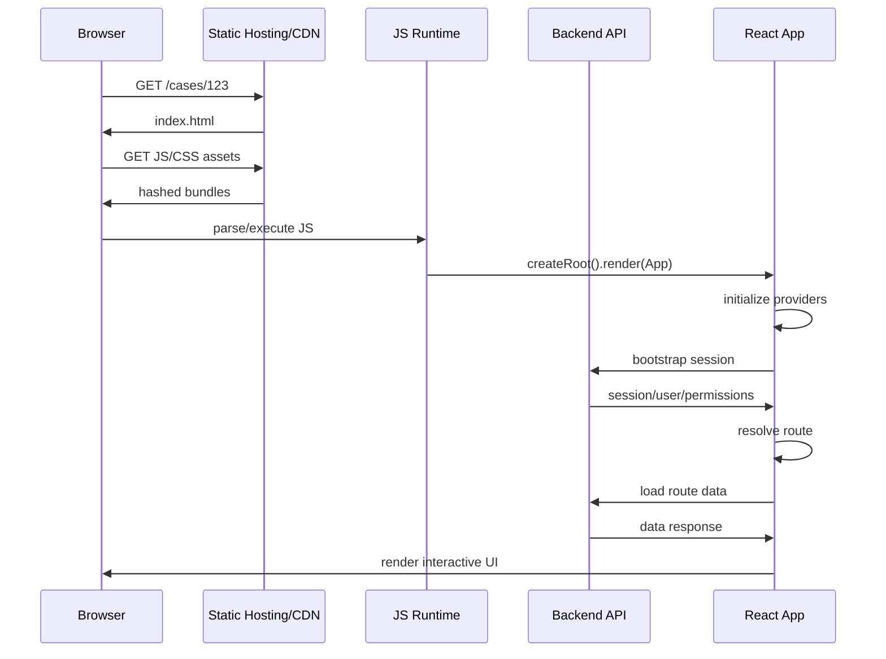
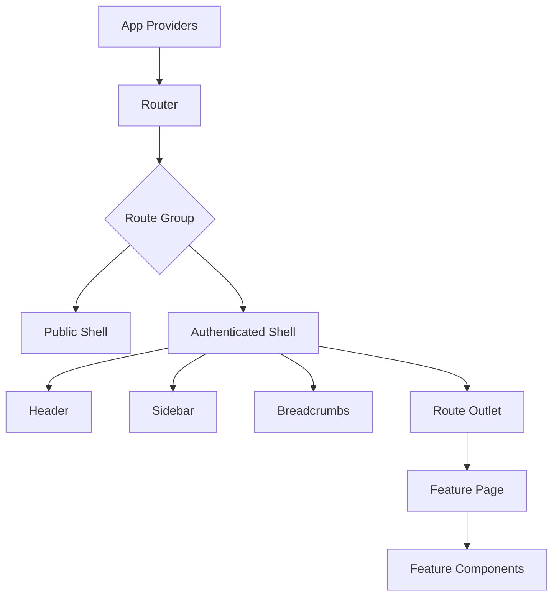
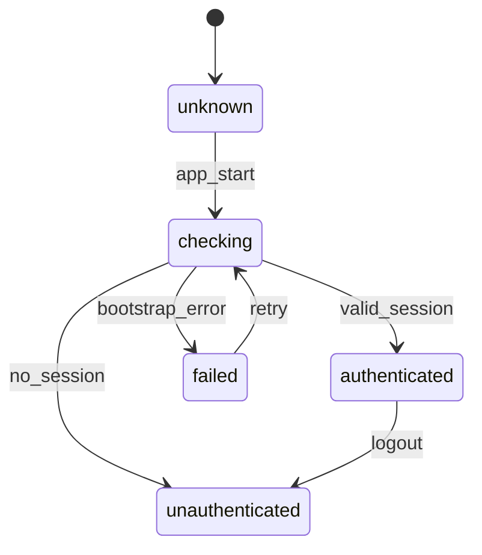
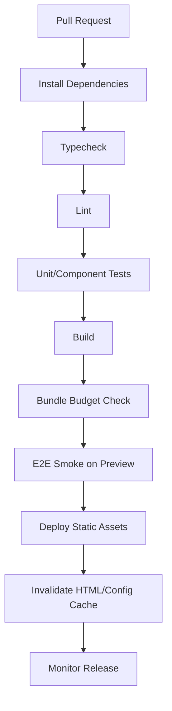

------
title: Learn Frontend React Production Architecture - Part 008
description: Production-grade guide to client-rendered SPA architecture with React, including app shell, boot sequence, routing, authentication bootstrap, code splitting, data cache hydration, error/loading boundaries, offline behavior, and operational trade-offs.
series: learn-frontend-react-production-architecture
seriesTitle: Learn Frontend React Production Architecture
order: 8
partTitle: Client-Rendered SPA Architecture
tags:
- react
- frontend
- spa
- vite
- architecture
- production
- routing
- series
date: 2026-06-28
---

# Part 008 — Client-Rendered SPA Architecture

## Tujuan Pembelajaran

Single Page Application atau SPA sering dianggap “pola lama” setelah SSR, streaming, dan React Server Components semakin populer.

Itu terlalu menyederhanakan masalah.

SPA masih sangat relevan untuk banyak production system, terutama:

- internal tools,
- admin console,
- workflow-heavy applications,
- dashboards,
- case management systems,
- authenticated enterprise apps,
- apps yang SEO-nya tidak dominan,
- apps dengan interaksi panjang setelah login,
- apps yang bisa di-deploy sebagai static asset di CDN,
- apps yang backend-nya sudah punya API contract kuat.

Part ini membahas SPA bukan sebagai tutorial routing dasar, tetapi sebagai **production architecture model**.

Kita akan membahas:

1. app shell,
2. boot sequence,
3. authentication bootstrap,
4. routing,
5. data loading,
6. cache hydration,
7. error/loading boundaries,
8. code splitting,
9. deployment static/CDN,
10. offline/reconnect behavior,
11. observability,
12. anti-pattern yang umum terjadi.

---

## 1. Apa Itu Client-Rendered SPA

Client-rendered SPA adalah aplikasi di mana browser menerima HTML minimal, JavaScript bundle, lalu React membangun UI di client.

HTML awal biasanya seperti:

```html
<!doctype html>
<html lang="en">
  <head>
    <title>Case Management</title>
  </head>
  <body>
    <div id="root"></div>
    <script type="module" src="/src/main.tsx"></script>
  </body>
</html>
```

React entry point:

```tsx
import { createRoot } from "react-dom/client";
import { App } from "./App";

createRoot(document.getElementById("root")!).render(<App />);
```

Production build menghasilkan static assets:

```txt
dist/
  index.html
  assets/
    index-abc123.js
    index-def456.css
    vendor-xyz789.js
```

Server atau CDN mengirim file static. Setelah JavaScript berjalan, routing, UI state, data fetching, dan interaksi dikontrol di browser.

---

## 2. SPA Bukan Berarti Tanpa Arsitektur

SPA yang buruk:

```tsx
function App() {
  return (
    <BrowserRouter>
      <Routes>
        <Route path="/cases" element={<CasePage />} />
      </Routes>
    </BrowserRouter>
  );
}
```

Lalu setiap page fetch sendiri, auth sendiri, error sendiri, loading sendiri, permission sendiri, dan layout sendiri.

SPA production harus punya layer:

```txt
src/
  app/
    main.tsx
    App.tsx
    providers/
    router/
    shell/
    error/
    observability/
  features/
    cases/
    users/
    reports/
  shared/
    ui/
    hooks/
    api/
    lib/
```

Arsitektur SPA bukan ditentukan oleh “pakai BrowserRouter”, tetapi oleh boundary:

- siapa yang bootstrap app,
- siapa yang memiliki shell,
- siapa yang mengelola session,
- siapa yang mengelola route guard,
- siapa yang mengelola server state,
- siapa yang mengelola error global,
- siapa yang mengelola observability,
- siapa yang mengelola permission,
- siapa yang mengelola deployment assumptions.

---

## 3. Diagram: SPA Boot Sequence



SPA boot cost sangat bergantung pada:

- ukuran JS awal,
- network latency,
- CPU device user,
- auth bootstrap,
- route data waterfall,
- cache strategy,
- code splitting,
- CDN configuration.

---

## 4. Kapan SPA Adalah Pilihan Tepat

SPA cocok jika:

| Kondisi | Mengapa SPA Masuk Akal |
|---|---|
| App mostly behind login | SEO publik bukan prioritas utama |
| Interaksi panjang setelah load | Initial HTML bukan bottleneck utama |
| Workflow kompleks | Client state/navigation penting |
| Deployment static lebih sederhana | CDN + API backend cukup |
| Backend sudah API-first | UI bisa menjadi client API consumer |
| Tim ingin independence deploy | FE static deploy terpisah dari backend |
| Banyak user internal | Controlled browser/device bisa diasumsikan |
| Real-time dashboard | Client runtime memang dominan |

Contoh kuat:

- regulatory case management,
- back office approval system,
- customer support console,
- compliance dashboard,
- internal reporting app,
- admin portal,
- monitoring UI,
- workflow orchestration UI.

---

## 5. Kapan SPA Tidak Ideal

SPA kurang ideal jika:

| Kondisi | Risiko |
|---|---|
| Public marketing/content-heavy site | SEO dan initial load bisa buruk |
| Need fastest first content on slow devices | JS boot cost tinggi |
| Banyak route bisa di-render statis | SPA membuang peluang pre-render |
| Security logic salah ditempatkan di client | UI mudah dimanipulasi |
| Data harus hadir di HTML awal | Effect/client fetch terlambat |
| Bundle sangat besar | TTI/INP memburuk |
| User anonymous global | device/network variance besar |

SPA bukan salah. Tetapi memakai SPA untuk semua masalah tanpa mengevaluasi trade-off adalah salah.

---

## 6. App Shell Model

App shell adalah struktur UI stabil yang membungkus route content:

- header,
- sidebar,
- nav,
- breadcrumbs,
- user menu,
- notification badge,
- global command palette,
- layout grid,
- global error/toast layer.

Contoh:

```tsx
function AuthenticatedShell() {
  return (
    <div className="app-shell">
      <Sidebar />
      <div className="app-shell__main">
        <Header />
        <Breadcrumbs />
        <main>
          <Outlet />
        </main>
      </div>
      <Toaster />
    </div>
  );
}
```

Route:

```tsx
<Route element={<RequireAuth />}>
  <Route element={<AuthenticatedShell />}>
    <Route path="/cases" element={<CaseListPage />} />
    <Route path="/cases/:caseId" element={<CaseDetailPage />} />
  </Route>
</Route>
```

Prinsip:

- shell dimiliki app layer,
- page tidak membuat sidebar sendiri,
- route content masuk melalui outlet,
- global UI seperti toast tidak tersebar,
- authenticated shell berbeda dari public shell,
- layout persistence dikontrol route hierarchy.

---

## 7. Diagram: SPA Shell Boundary



Boundary ini mencegah page-level layout duplication.

---

## 8. Provider Architecture

Provider umum di SPA:

```tsx
function AppProviders({ children }: { children: ReactNode }) {
  return (
    <ErrorBoundary>
      <ObservabilityProvider>
        <FeatureFlagProvider>
          <AuthProvider>
            <QueryClientProvider client={queryClient}>
              <ThemeProvider>
                {children}
              </ThemeProvider>
            </QueryClientProvider>
          </AuthProvider>
        </FeatureFlagProvider>
      </ObservabilityProvider>
    </ErrorBoundary>
  );
}
```

Jangan meniru provider ini secara buta.

Pertimbangkan ordering:

- observability paling luar agar error bootstrap tertangkap,
- feature flags mungkin dibutuhkan sebelum route render,
- auth mungkin dibutuhkan untuk API client,
- query client harus tersedia untuk server-state hooks,
- theme bisa lebih dalam,
- router bisa berada di dalam atau luar provider tergantung kebutuhan.

Checklist provider:

1. Apakah provider ini global atau route-scoped?
2. Apakah value sering berubah?
3. Apakah provider menyebabkan re-render luas?
4. Apakah provider punya async bootstrap?
5. Apakah provider butuh error boundary?
6. Apakah provider butuh fallback UI?
7. Apakah provider bisa dipindah ke feature boundary?

---

## 9. Authentication Bootstrap

SPA authenticated app harus menjawab:

1. Apakah user sudah login?
2. Bagaimana session divalidasi?
3. Apakah token masih valid?
4. Bagaimana refresh token dilakukan?
5. Apakah user profile/role/permission tersedia?
6. Apa yang terjadi jika bootstrap gagal?
7. Apa yang ditampilkan selama bootstrap?
8. Bagaimana mencegah unauthorized route flicker?

Contoh state machine:



Implementation sketch:

```tsx
type AuthState =
  | { status: "checking" }
  | { status: "authenticated"; user: CurrentUser }
  | { status: "unauthenticated" }
  | { status: "failed"; message: string };

function AuthGate({ children }: { children: ReactNode }) {
  const auth = useAuthBootstrap();

  if (auth.status === "checking") {
    return <FullPageLoading message="Checking session..." />;
  }

  if (auth.status === "failed") {
    return <AuthBootstrapError onRetry={auth.retry} />;
  }

  if (auth.status === "unauthenticated") {
    return <LoginRedirect />;
  }

  return <>{children}</>;
}
```

Anti-pattern:

```tsx
if (!user) {
  navigate("/login");
}
```

dijalankan di banyak page secara ad hoc.

---

## 10. Route Guard

Route guard SPA harus jelas:

```tsx
function RequireAuth() {
  const auth = useAuth();

  if (auth.status === "checking") {
    return <FullPageLoading />;
  }

  if (auth.status !== "authenticated") {
    return <Navigate to="/login" replace />;
  }

  return <Outlet />;
}
```

Permission guard:

```tsx
function RequirePermission({ permission }: { permission: Permission }) {
  const { hasPermission } = usePermissions();

  if (!hasPermission(permission)) {
    return <ForbiddenPage />;
  }

  return <Outlet />;
}
```

Catatan penting:

> Route guard di frontend hanya UX boundary. Authorization final tetap harus ada di backend.

Jika user memanggil API langsung, backend tetap harus menolak action yang tidak diizinkan.

---

## 11. Routing Architecture

Route bukan hanya mapping path ke component.

Route menyimpan:

- layout hierarchy,
- data ownership,
- permission boundary,
- error boundary,
- loading boundary,
- code-splitting boundary,
- navigation metadata,
- breadcrumb metadata,
- feature ownership.

Contoh route config:

```tsx
const routes = createBrowserRouter([
  {
    element: <AppProviders />,
    errorElement: <RootErrorPage />,
    children: [
      {
        path: "/login",
        element: <LoginPage />,
      },
      {
        element: <RequireAuth />,
        children: [
          {
            element: <AuthenticatedShell />,
            children: [
              {
                path: "/cases",
                lazy: () => import("@/features/cases/routes/CaseListRoute"),
              },
              {
                path: "/cases/:caseId",
                lazy: () => import("@/features/cases/routes/CaseDetailRoute"),
              },
            ],
          },
        ],
      },
    ],
  },
]);
```

Route-level lazy loading menjadi production default untuk feature besar.

---

## 12. Loading Boundary Strategy

SPA sering punya tiga jenis loading:

1. app bootstrap loading,
2. route module loading,
3. route data loading.

Jangan pakai satu spinner global untuk semua.

Contoh:

| Loading Type | UI |
|---|---|
| Initial app boot | full page skeleton |
| Lazy route bundle | route fallback/skeleton |
| Route data fetch | page skeleton |
| Mutation | button-level pending state |
| Background refetch | subtle stale indicator |
| Infinite scroll | row-level loader |

Anti-pattern:

```tsx
if (isLoading) return <Spinner />;
```

di seluruh page tanpa mempertimbangkan UX.

Better:

```tsx
if (query.isLoading) {
  return <CaseDetailSkeleton />;
}

if (query.isError) {
  return <CaseDetailLoadError error={query.error} />;
}

return <CaseDetailView data={query.data} />;
```

Skeleton harus mirip layout akhir agar layout shift kecil.

---

## 13. Error Boundary Strategy

SPA butuh beberapa level error boundary:

```txt
RootErrorBoundary
  AuthBoundary
    ShellErrorBoundary
      RouteErrorBoundary
        WidgetErrorBoundary
```

Tidak semua error harus menjatuhkan seluruh app.

Contoh:

- error root provider: tampilkan fatal app error,
- error route data: tampilkan page error,
- error chart widget: tampilkan chart fallback,
- error mutation: tampilkan inline/toast,
- error permission: tampilkan forbidden,
- error 404: not found.

React error boundary menangkap render error, bukan semua async error. Data layer dan route layer tetap perlu error handling eksplisit.

---

## 14. Server State di SPA

SPA biasanya mengambil data setelah client boot.

Gunakan server-state layer untuk:

- cache,
- stale time,
- retry,
- invalidation,
- optimistic update,
- deduplication,
- background refetch,
- query key management,
- mutation lifecycle.

Contoh query key:

```ts
const caseKeys = {
  all: ["cases"] as const,
  list: (filters: CaseFilters) => [...caseKeys.all, "list", filters] as const,
  detail: (caseId: string) => [...caseKeys.all, "detail", caseId] as const,
};
```

Hook:

```tsx
function useCaseDetailQuery(caseId: string) {
  return useQuery({
    queryKey: caseKeys.detail(caseId),
    queryFn: () => caseApi.getCaseDetail(caseId),
    staleTime: 30_000,
  });
}
```

Mutation:

```tsx
function useApproveCaseMutation() {
  const queryClient = useQueryClient();

  return useMutation({
    mutationFn: caseApi.approveCase,
    onSuccess: (_, input) => {
      queryClient.invalidateQueries({ queryKey: caseKeys.detail(input.caseId) });
      queryClient.invalidateQueries({ queryKey: caseKeys.all });
    },
  });
}
```

Anti-pattern:

- fetch di setiap component,
- simpan server response mentah ke Redux tanpa invalidation,
- manual loading/error state everywhere,
- query key tidak stabil,
- tidak ada invalidation strategy.

---

## 15. API Client Boundary

Jangan panggil `fetch` langsung dari UI component.

Buruk:

```tsx
function CaseDetailPage({ caseId }: { caseId: string }) {
  useEffect(() => {
    fetch(`/api/cases/${caseId}`);
  }, [caseId]);
}
```

Lebih baik:

```txt
features/cases/
  api/
    caseApi.ts
    caseKeys.ts
    caseQueries.ts
  routes/
    CaseDetailRoute.tsx
  components/
    CaseDetailView.tsx
```

API client:

```ts
export async function getCaseDetail(caseId: string): Promise<CaseDetailDto> {
  const response = await http.get(`/cases/${caseId}`);

  return caseDetailSchema.parse(response.data);
}
```

Query hook:

```ts
export function useCaseDetailQuery(caseId: string) {
  return useQuery({
    queryKey: caseKeys.detail(caseId),
    queryFn: () => getCaseDetail(caseId),
  });
}
```

UI:

```tsx
const query = useCaseDetailQuery(caseId);
```

Boundary ini memudahkan:

- testing,
- mocking,
- validation,
- error normalization,
- migration API,
- observability,
- retry policy.

---

## 16. Code Splitting Strategy

SPA harus menghindari mengirim seluruh aplikasi pada initial load.

Prioritas split:

1. route-level split,
2. feature-level split,
3. expensive library split,
4. rarely used modal/workflow split,
5. admin/reporting split,
6. chart/editor/map split.

Contoh:

```tsx
const ReportsRoute = lazy(() => import("@/features/reports/ReportsRoute"));
```

Dengan Suspense:

```tsx
<Suspense fallback={<RouteSkeleton />}>
  <ReportsRoute />
</Suspense>
```

Jangan over-split:

- terlalu banyak chunk kecil bisa menambah request overhead,
- fallback yang berkedip mengganggu UX,
- shared vendor chunk bisa membesar,
- prefetch strategy perlu dipikirkan.

---

## 17. Bundle Ownership

SPA production harus punya ownership terhadap bundle.

Checklist:

- Apakah dependency benar-benar dipakai?
- Apakah chart library masuk initial bundle?
- Apakah date library terlalu besar?
- Apakah editor/rich text lazy-loaded?
- Apakah icon library tree-shakeable?
- Apakah admin route ikut public route bundle?
- Apakah source map aman di production?
- Apakah bundle budget ada di CI?

Struktur budget contoh:

```json
{
  "budgets": {
    "initialJsGzipKb": 250,
    "routeChunkGzipKb": 150,
    "cssGzipKb": 80
  }
}
```

Angka harus disesuaikan konteks produk. Yang penting adalah ada batas dan tren dipantau.

---

## 18. Static Hosting and History Fallback

SPA dengan browser routing butuh fallback ke `index.html`.

Jika user membuka:

```txt
/cases/123
```

CDN/server harus mengembalikan `index.html`, bukan 404 static file, lalu React Router mengambil alih route.

Konfigurasi konseptual:

```txt
/cases/123 -> /index.html
/assets/index-abc123.js -> actual asset
/assets/app-def456.css -> actual asset
```

Namun asset hashed harus tetap cached long-term.

Header strategy:

| Resource | Cache Policy |
|---|---|
| `index.html` | no-cache / short cache |
| hashed JS/CSS assets | long cache immutable |
| images/fonts hashed | long cache immutable |
| runtime config | no-cache |
| API responses | sesuai backend/cache policy |

Anti-pattern:

- cache `index.html` terlalu lama sehingga user stuck di versi lama,
- tidak ada fallback sehingga refresh route deep link 404,
- asset tidak hashed,
- environment config dibake salah,
- deployment tidak atomic.

---

## 19. Runtime Configuration

SPA static build sering membutuhkan config:

- API base URL,
- Sentry DSN,
- environment name,
- feature flag endpoint,
- auth issuer/client id.

Jika config dibake saat build, satu artifact hanya cocok untuk satu environment.

Alternatif runtime config:

```html
<script>
  window.__APP_CONFIG__ = {
    API_BASE_URL: "https://api.example.com",
    ENVIRONMENT: "production"
  };
</script>
```

Atau fetch:

```txt
/config.json
```

Trade-off:

| Approach | Kelebihan | Risiko |
|---|---|---|
| Build-time env | sederhana | artifact per env |
| Runtime global | flexible | typing/validation perlu |
| `/config.json` | deploy-time configurable | extra request |
| Server-injected HTML | kuat | butuh server layer |

Config harus divalidasi saat boot.

```ts
const config = appConfigSchema.parse(window.__APP_CONFIG__);
```

Fail fast lebih baik daripada app berjalan dengan API URL salah.

---

## 20. Auth Token and Session Handling

SPA auth adalah area sensitif.

Prinsip umum:

- jangan menganggap hidden route sebagai security,
- backend tetap otoritatif,
- token storage harus dipilih berdasarkan threat model,
- refresh flow harus terpusat,
- 401 handling harus konsisten,
- logout harus membersihkan cache sensitive,
- cross-tab logout perlu dipikirkan.

401 handling:

```ts
httpClient.onUnauthorized(async () => {
  queryClient.clear();
  authStore.setUnauthenticated();
  router.navigate("/login");
});
```

Hindari setiap API call menangani 401 sendiri secara berbeda.

Untuk cookie-based session:

- perhatikan CSRF,
- SameSite,
- secure flag,
- CORS,
- credentials mode.

Untuk token-based session:

- perhatikan XSS risk,
- refresh token lifecycle,
- memory vs storage trade-off,
- rotation,
- revocation.

---

## 21. Offline and Reconnect Behavior

SPA berjalan lama di browser. Network bisa berubah.

Kebutuhan:

- detect offline,
- show offline banner,
- pause risky mutation,
- retry safe query,
- resume on reconnect,
- dedupe pending actions,
- prevent double-submit,
- handle stale data.

Online status hook:

```tsx
function useOnlineStatus() {
  const [online, setOnline] = useState(navigator.onLine);

  useEffect(() => {
    const handleOnline = () => setOnline(true);
    const handleOffline = () => setOnline(false);

    window.addEventListener("online", handleOnline);
    window.addEventListener("offline", handleOffline);

    return () => {
      window.removeEventListener("online", handleOnline);
      window.removeEventListener("offline", handleOffline);
    };
  }, []);

  return online;
}
```

UI:

```tsx
function NetworkBanner() {
  const online = useOnlineStatus();

  if (online) {
    return null;
  }

  return <Banner tone="warning">You are offline. Some actions may fail.</Banner>;
}
```

Untuk transactional app, offline mutation harus dirancang sangat hati-hati. Jangan queue approval/legal/regulatory decision tanpa idempotency dan audit model yang jelas.

---

## 22. Long-Running Session

Enterprise SPA sering dibuka berjam-jam.

Masalah:

- token expired,
- stale permission,
- stale feature flags,
- backend deploy mengubah API,
- new frontend version tersedia,
- memory leak,
- WebSocket reconnect,
- tab tidur lalu aktif lagi,
- local cache terlalu lama,
- user role berubah.

Pattern:

- visibility change refetch,
- periodic session validation,
- cache stale time yang realistis,
- app version check,
- force reload prompt saat deployment baru,
- logout broadcast via storage event,
- cleanup subscription.

Version check contoh:

```tsx
function useAppVersionCheck() {
  useEffect(() => {
    const intervalId = window.setInterval(async () => {
      const response = await fetch("/version.json", { cache: "no-store" });
      const latest = await response.json();

      if (latest.version !== APP_VERSION) {
        notifyNewVersionAvailable();
      }
    }, 5 * 60 * 1000);

    return () => window.clearInterval(intervalId);
  }, []);
}
```

Jangan auto-reload saat user sedang mengisi form penting tanpa warning.

---

## 23. State Persistence

SPA kadang menyimpan state di browser:

- theme,
- collapsed sidebar,
- draft form,
- recent filters,
- table column visibility,
- user preference.

Jangan simpan:

- authorization decision,
- sensitive token tanpa threat model,
- source of truth regulatory decision,
- data yang harus audit-safe,
- large backend data tanpa eviction.

Persistence strategy:

| State | Storage |
|---|---|
| Theme | localStorage |
| Tab-specific draft | sessionStorage |
| URL filter | query params |
| Sensitive session | cookie/memory depending threat model |
| Server data | server-state cache |
| Large offline data | IndexedDB dengan governance |

---

## 24. Observability in SPA

SPA production harus mengirim sinyal:

- JavaScript errors,
- route transitions,
- Web Vitals,
- failed API calls,
- mutation failures,
- slow route loads,
- unhandled promise rejection,
- chunk load failure,
- auth bootstrap failure,
- user action breadcrumbs.

Minimal setup:

```tsx
window.addEventListener("unhandledrejection", (event) => {
  reportUnhandledRejection(event.reason);
});

window.addEventListener("error", (event) => {
  reportGlobalError(event.error);
});
```

React boundary:

```tsx
<ErrorBoundary
  fallback={<FatalAppError />}
  onError={(error, info) => {
    reportReactError(error, info);
  }}
>
  <App />
</ErrorBoundary>
```

Router instrumentation:

```ts
router.subscribe((navigation) => {
  analytics.track("RouteChanged", {
    path: navigation.location.pathname,
  });
});
```

Observability bukan hanya untuk backend. Frontend punya failure mode sendiri.

---

## 25. Chunk Load Failure

SPA code splitting bisa gagal saat deployment baru:

1. user membuka app versi lama,
2. deployment baru menghapus chunk lama,
3. user navigasi ke lazy route,
4. browser mencoba load chunk lama,
5. 404/chunk load error.

Mitigasi:

- asset retention beberapa versi,
- immutable hashed assets,
- deployment atomic,
- error boundary khusus chunk load,
- prompt reload,
- service worker strategy jika dipakai,
- CDN invalidation hati-hati.

Contoh fallback:

```tsx
function ChunkErrorFallback({ onReload }: { onReload: () => void }) {
  return (
    <div role="alert">
      <h1>New version available</h1>
      <p>The application was updated. Reload to continue.</p>
      <button onClick={onReload}>Reload</button>
    </div>
  );
}
```

---

## 26. Security Boundaries

SPA security rule:

> Frontend boleh membantu UX, tetapi tidak boleh menjadi boundary keamanan final.

Contoh permission UI:

```tsx
if (canApprove) {
  return <ApproveButton />;
}
```

Tetapi backend tetap harus enforce:

```txt
POST /cases/123/approve -> 403 jika user tidak berwenang
```

Threats:

- XSS,
- token theft,
- dependency supply chain,
- malicious browser extension,
- CSRF jika cookie-based,
- open redirect,
- sensitive data in logs,
- source map exposure,
- cache leakage,
- over-broad API response.

SPA architecture harus bekerja sama dengan backend security.

---

## 27. Accessibility in SPA Navigation

SPA route change tidak otomatis seperti full page load.

Perhatikan:

- focus management after navigation,
- page title update,
- screen reader announcement,
- skip link,
- landmark structure,
- keyboard navigation,
- modal focus trap,
- loading state announcement.

Route change focus pattern:

```tsx
function RouteFocusManager() {
  const location = useLocation();
  const mainRef = useRef<HTMLElement | null>(null);

  useEffect(() => {
    mainRef.current?.focus();
  }, [location.pathname]);

  return <main ref={mainRef} tabIndex={-1} />;
}
```

Implementasi sebenarnya harus disesuaikan layout agar tidak membuat focus jump yang mengganggu.

---

## 28. SPA Performance Budget

SPA performance risk:

- initial JS besar,
- runtime CPU tinggi,
- route transition lambat,
- query waterfall,
- long task,
- input delay,
- re-render cascade,
- layout shift saat skeleton buruk.

Budget contoh:

| Metric | Target Awal |
|---|---|
| Initial JS gzip | < 250 KB untuk shell utama |
| Route chunk gzip | < 150 KB per heavy route |
| LCP | <= 2.5s untuk target user utama |
| INP | <= 200ms |
| CLS | <= 0.1 |
| Route transition | perceived < 500ms untuk cached route |
| Error rate | dipantau per release |
| Chunk failure | dipantau per deployment |

Angka harus dievaluasi berdasarkan domain, device, network, dan user base.

---

## 29. Vite Production Model

Untuk SPA modern, Vite umum dipakai sebagai build tool.

Mental model:

- dev server memakai native ESM dan HMR,
- production build menghasilkan optimized static assets,
- `index.html` menjadi entry,
- bundling dilakukan untuk deployment,
- assets diberi hash,
- output bisa di-serve dari static hosting/CDN.

Vite app basic:

```bash
npm create vite@latest case-management-ui -- --template react-ts
npm run build
```

Production output:

```txt
dist/
  index.html
  assets/
    index-C9a2f.js
    index-B7x1p.css
```

Namun production architecture bukan selesai di `vite build`.

Anda tetap butuh:

- env/config strategy,
- router fallback,
- asset caching,
- source map policy,
- bundle analysis,
- CI validation,
- preview deploy,
- security headers,
- observability injection,
- release version metadata.

---

## 30. CI/CD Pipeline untuk SPA

Pipeline minimal:



Quality gates:

- TypeScript strict,
- ESLint,
- test,
- build,
- no circular dependency critical,
- bundle budget,
- accessibility smoke,
- route smoke,
- API contract compatibility,
- source map upload,
- release tagging.

---

## 31. SPA Deployment Checklist

1. `index.html` fallback configured.
2. hashed assets long-cache immutable.
3. `index.html` no-cache or short-cache.
4. environment config validated.
5. source maps handled securely.
6. CSP/security headers configured.
7. API base URL correct.
8. auth redirect URI correct.
9. route smoke tests pass.
10. chunk load failure strategy exists.
11. previous assets retained during rollout.
12. rollback plan exists.
13. observability release id configured.
14. Web Vitals captured.
15. error boundary tested.
16. 404 route handled.
17. deep link refresh works.
18. unauthenticated route works.
19. forbidden route works.
20. logout clears sensitive cache.

---

## 32. Anti-Pattern Catalog

### 32.1 SPA Pretending to Be SSR

Trying to fix SEO/first content by adding hacks while still fetching all content after client boot.

If content must be available in initial HTML, evaluate SSR/SSG/RSC.

### 32.2 Everything in `App.tsx`

```tsx
function App() {
  // auth
  // router
  // permissions
  // websocket
  // analytics
  // feature flags
  // layout
  // modals
  // routes
}
```

Split into providers, router, shell, feature modules.

### 32.3 Fetch in Every Page with `useEffect`

Creates inconsistent loading/error/cache/retry behavior.

Use server-state layer or router data layer.

### 32.4 One Global Store for Everything

Server data, form state, URL state, modal state, and auth state all in one store.

Use state taxonomy.

### 32.5 No Deep Link Support

App works only from `/`, but `/cases/123` refresh returns 404.

Fix server/CDN fallback.

### 32.6 Cache `index.html` Forever

User stuck with stale app shell and missing chunks.

### 32.7 Route Guard as Security

Hiding button/route without backend authorization.

### 32.8 No Chunk Failure Handling

Lazy routes fail after deploy and user sees blank page.

### 32.9 Public and Admin Routes in Same Initial Bundle

Shipping internal admin/reporting code to all users.

### 32.10 Full Page Spinner Everywhere

Bad perceived performance and layout instability.

---

## 33. Mini Case Study: Regulatory Case Management SPA

### Requirements

- authenticated users,
- roles: officer, supervisor, auditor,
- case list with filters,
- case detail lifecycle,
- approval/rejection actions,
- audit timeline,
- realtime updates,
- reports route,
- admin route,
- long-running sessions.

### Suggested Architecture

```txt
src/
  app/
    main.tsx
    App.tsx
    providers/
      AppProviders.tsx
      AuthProvider.tsx
      QueryProvider.tsx
      ObservabilityProvider.tsx
    router/
      routes.tsx
      guards.tsx
    shell/
      AuthenticatedShell.tsx
      PublicShell.tsx
    config/
      runtimeConfig.ts
  features/
    cases/
      api/
      routes/
      components/
      hooks/
      model/
    reports/
    admin/
  shared/
    ui/
    lib/
    hooks/
```

### Route Design

```tsx
const routes = [
  {
    path: "/login",
    element: <LoginPage />,
  },
  {
    element: <RequireAuth />,
    children: [
      {
        element: <AuthenticatedShell />,
        children: [
          {
            path: "/cases",
            lazy: () => import("@/features/cases/routes/CaseListRoute"),
          },
          {
            path: "/cases/:caseId",
            lazy: () => import("@/features/cases/routes/CaseDetailRoute"),
          },
          {
            path: "/reports",
            element: (
              <RequirePermission permission="reports.view">
                <LazyReportsRoute />
              </RequirePermission>
            ),
          },
        ],
      },
    ],
  },
];
```

### Data Ownership

| Data | Owner |
|---|---|
| Current user/session | Auth provider |
| Permission map | Permission provider derived from session |
| Case list | server-state query |
| Case filters | URL query params + local draft |
| Case detail | server-state query |
| Approval modal state | local reducer |
| Audit timeline | query + realtime subscription |
| Sidebar state | shell state |
| Theme | persistent preference |
| Reports module | lazy route |

---

## 34. Deliberate Practice

### Latihan 1 — SPA Boot Map

Gambarkan boot sequence app Anda:

1. HTML loaded,
2. JS loaded,
3. config loaded,
4. providers initialized,
5. auth checked,
6. route resolved,
7. data fetched,
8. page rendered,
9. observability started.

Tandai bottleneck:

- network,
- CPU parse/execute,
- auth,
- data waterfall,
- bundle size,
- route module loading.

### Latihan 2 — Route Boundary Audit

Untuk setiap route, dokumentasikan:

| Route | Shell | Auth? | Permission | Lazy? | Data Owner | Error Boundary |
|---|---|---:|---|---:|---|---|
| `/cases` | authenticated | yes | cases.view | yes | query | route |
| `/reports` | authenticated | yes | reports.view | yes | query | route |

Cari route yang:

- tidak lazy padahal besar,
- permission tersebar di component,
- data fetch tidak konsisten,
- error fallback generic,
- page membuat layout sendiri.

### Latihan 3 — Deployment Failure Drill

Simulasikan:

1. user membuka app versi lama,
2. deploy versi baru,
3. user klik lazy route,
4. chunk lama 404.

Desain:

- error boundary,
- reload prompt,
- asset retention,
- monitoring event,
- rollback decision.

---

## 35. Ringkasan

SPA masih valid untuk banyak production system, terutama authenticated workflow-heavy app.

Namun SPA production bukan hanya “React + Router”.

SPA yang matang memiliki:

- app shell jelas,
- provider boundary sehat,
- auth bootstrap state machine,
- route guard konsisten,
- server-state layer,
- API boundary,
- route-level code splitting,
- cache/deployment strategy,
- offline/reconnect behavior,
- observability,
- error/loading boundary,
- accessibility handling,
- security model yang sadar bahwa backend tetap otoritatif.

SPA gagal bukan karena SPA-nya, tetapi karena semua responsibility dicampur di component/page tanpa boundary.

---

## 36. Self-Assessment

Anda siap lanjut jika bisa menjawab:

1. Kapan SPA adalah pilihan tepat?
2. Kapan SPA tidak ideal?
3. Apa itu app shell?
4. Bagaimana boot sequence SPA production?
5. Apa perbedaan app loading, route loading, dan data loading?
6. Mengapa route guard bukan security boundary final?
7. Bagaimana server-state layer membantu SPA?
8. Mengapa deep link refresh bisa 404?
9. Apa risiko chunk load failure?
10. Apa saja yang harus dicek sebelum deploy SPA?

---

## 37. Sumber Rujukan

- React Docs — Build a React app from Scratch
- React Docs — `lazy`
- React Docs — `<Suspense>`
- React Router Docs — Route Objects, Data Routers, Lazy Routes
- Vite Docs — Building for Production
- Vite Docs — Static Deploy
- web.dev — Core Web Vitals
