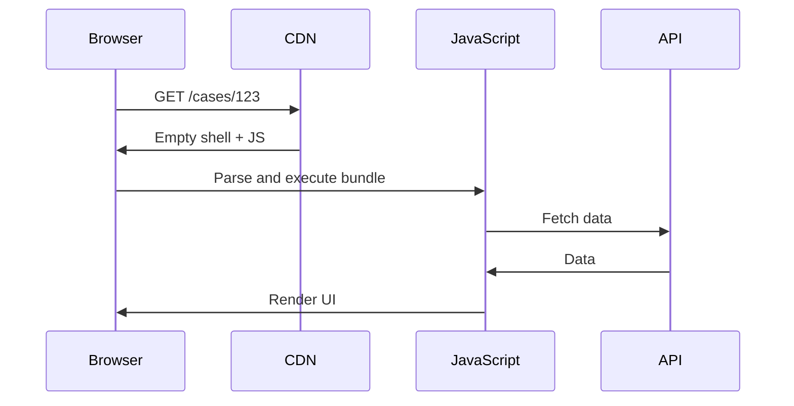
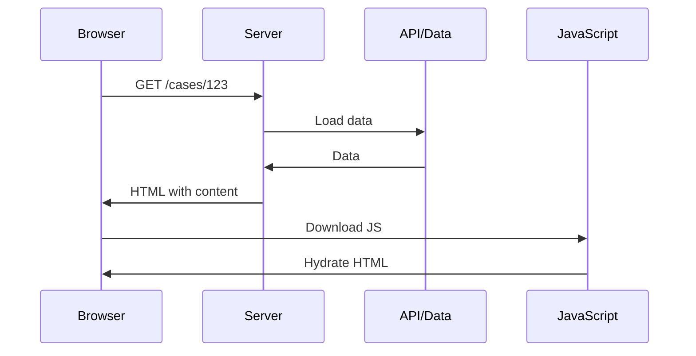
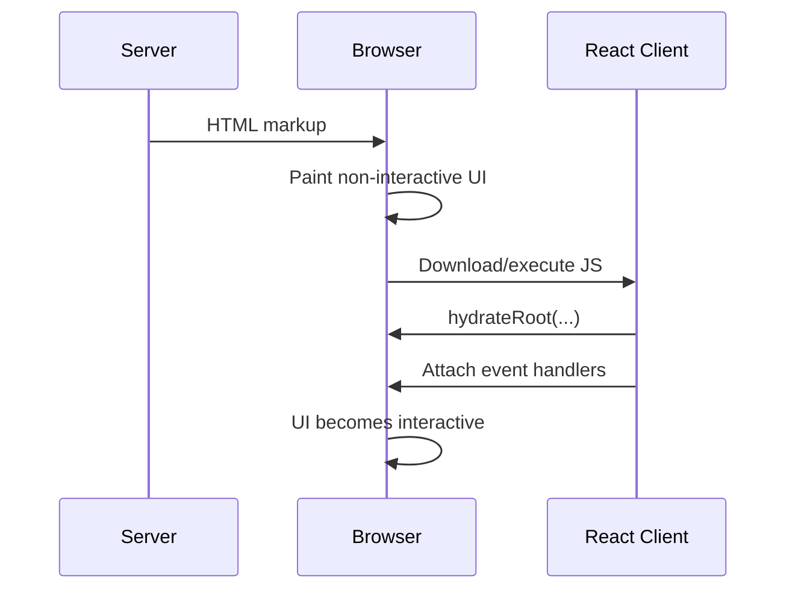
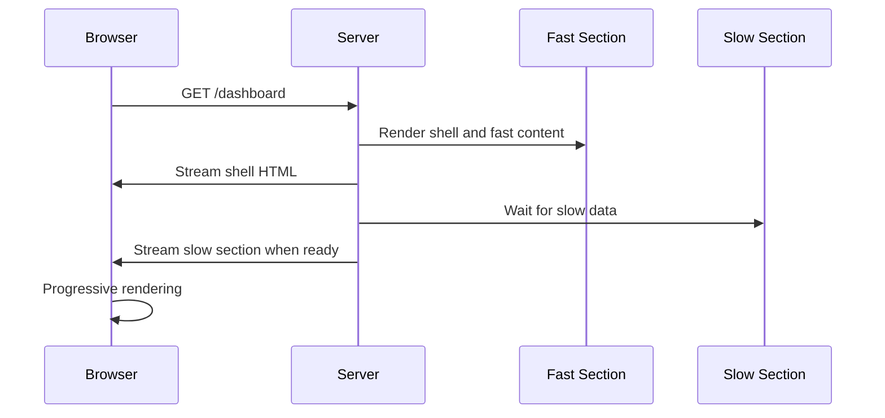
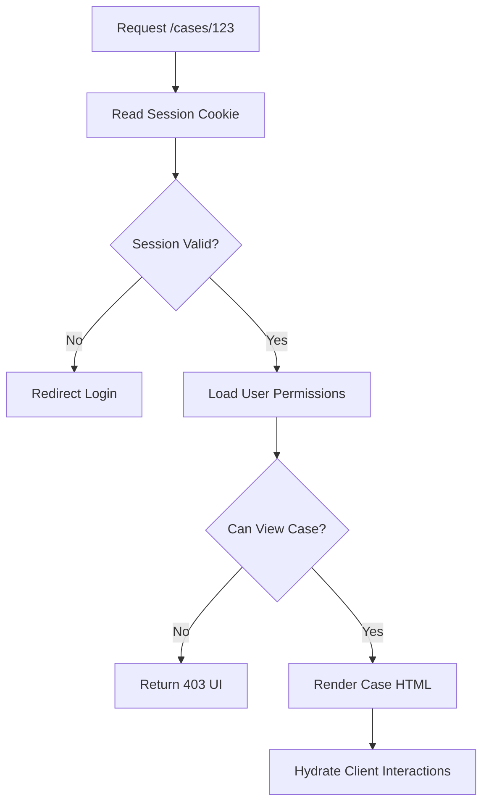
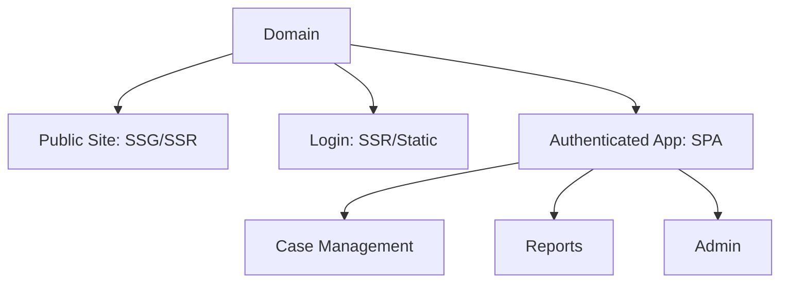
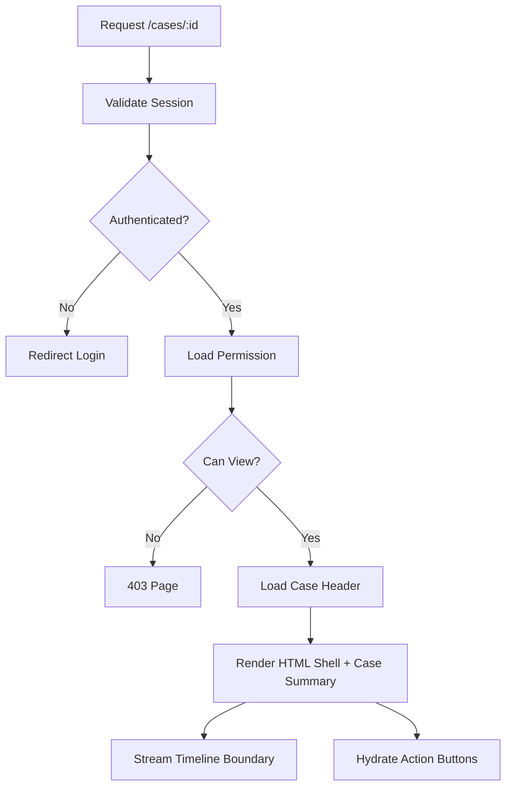

------
title: Learn Frontend React Production Architecture - Part 009
description: Production-grade guide to SSR, streaming, hydration, Suspense boundaries, progressive rendering, hydration mismatch, data waterfalls, performance trade-offs, and operational failure modes in React applications.
series: learn-frontend-react-production-architecture
seriesTitle: Learn Frontend React Production Architecture
order: 9
partTitle: SSR, Streaming, and Hydration
tags:
- react
- frontend
- ssr
- streaming
- hydration
- suspense
- architecture
- production
- series
date: 2026-06-28
---

# Part 009 — SSR, Streaming, and Hydration

## Tujuan Pembelajaran

Part sebelumnya membahas client-rendered SPA sebagai baseline. Sekarang kita masuk ke rendering architecture yang lebih kompleks: **Server-Side Rendering, streaming, dan hydration**.

SSR sering dijual sebagai “lebih cepat” atau “lebih SEO-friendly”. Pernyataan itu tidak salah, tetapi tidak lengkap.

SSR production bukan sekadar mengubah:

```tsx
createRoot(root).render(<App />);
```

menjadi:

```tsx
renderToString(<App />);
```

SSR mengubah seluruh model aplikasi:

- siapa yang menjalankan render pertama,
- di mana data dimuat,
- kapan HTML dikirim,
- kapan JavaScript dikirim,
- kapan UI menjadi interaktif,
- bagaimana error ditangani,
- bagaimana asset dipetakan,
- bagaimana cache bekerja,
- bagaimana hydration mismatch dicegah,
- bagaimana streaming boundary dipilih,
- bagaimana observability mengukur server dan client sekaligus.

Part ini membahas SSR sebagai **arsitektur delivery**, bukan sebagai checkbox framework.

---

## 1. Rendering Taxonomy

Sebelum masuk detail, bedakan istilah berikut.

| Istilah | Makna Praktis |
|---|---|
| CSR | Browser menerima shell kosong lalu React render di client |
| SSR | Server menghasilkan HTML untuk request |
| Hydration | Client React mengambil alih HTML server agar interaktif |
| Streaming SSR | Server mengirim HTML bertahap, tidak menunggu seluruh tree selesai |
| SSG | HTML dibuat saat build |
| ISR/Revalidation | HTML/cache diperbarui setelah build atau berdasarkan policy |
| RSC | Component tertentu dirender di server dan tidak dikirim sebagai JS client |
| Partial hydration / islands | Hanya bagian tertentu yang dihidupkan di client, tergantung framework |

React SSR modern biasanya tidak berdiri sendiri. Framework seperti Next.js menggabungkan SSR, streaming, route-level data, Server Components, caching, dan deployment runtime.

---

## 2. Mental Model SSR

CSR:



SSR:



Perbedaan besar:

- browser bisa melihat content lebih awal,
- user belum tentu bisa langsung interaksi,
- server sekarang punya beban render,
- data loading bisa terjadi sebelum HTML,
- hydration harus cocok dengan HTML server,
- cache strategy menjadi lebih penting.

---

## 3. Hydration Mental Model

Hydration adalah proses ketika React di browser menempelkan behavior interaktif pada HTML yang sudah dibuat server.

HTML server:

```html
<button>Approve</button>
```

Setelah JS client loaded dan React hydrate:

```tsx
<button onClick={handleApprove}>Approve</button>
```

User melihat button sebelum interaktif, tetapi event handler belum aktif sampai hydration selesai.

Diagram:



Kunci:

> SSR mempercepat visibility. Hydration menentukan interactivity.

Jika SSR menghasilkan HTML cepat tetapi bundle besar dan hydration lambat, user bisa melihat UI tetapi tidak bisa memakainya. Ini disebut “uncanny valley” frontend: tampilan terlihat siap, tetapi klik tidak merespons.

---

## 4. Metrics yang Harus Dibedakan

SSR sering dievaluasi salah karena hanya melihat satu metrik.

| Metric | Apa yang Diukur | Relevansi |
|---|---|---|
| TTFB | waktu sampai byte pertama dari server | server latency/render/cache |
| FCP | first content paint | content mulai terlihat |
| LCP | largest contentful paint | content utama terlihat |
| TTI | time to interactive | kapan app bisa dipakai |
| INP | responsiveness interaksi | input latency setelah hidup |
| CLS | layout shift | stabilitas visual |
| Hydration time | waktu client mengambil alih HTML | interactivity |
| Server render time | waktu render di server | backend cost |
| Data load time | waktu fetch dependency | waterfall risk |

SSR bisa memperbaiki FCP/LCP, tetapi memperburuk TTFB jika server render/data load lambat. SSR juga bisa memperbesar work total karena UI dirender dua kali: sekali di server, sekali untuk hydration di client.

---

## 5. SSR Trade-Offs

### Kelebihan

- content tersedia di HTML awal,
- lebih baik untuk SEO/content crawling,
- first paint bisa lebih cepat,
- metadata per route lebih mudah,
- sharing/social preview lebih baik,
- works without waiting for client fetch,
- bisa memanfaatkan server cache,
- bisa mengurangi blank screen.

### Biaya

- server infrastructure lebih kompleks,
- render cost pindah ke server,
- hydration cost tetap ada di client,
- mismatch risk,
- data loading lebih rumit,
- caching invalidation lebih sulit,
- debugging server/client boundary lebih berat,
- browser-only API tidak tersedia saat render server,
- deployment/runtime constraints lebih besar.

Kesimpulan:

> SSR bukan “lebih baik dari SPA”. SSR adalah trade-off: visibility lebih awal dengan biaya server/render/hydration complexity.

---

## 6. Hydration Mismatch

Hydration mismatch terjadi ketika HTML yang dirender server tidak sama dengan render pertama di client.

Contoh:

```tsx
function Clock() {
  return <p>{new Date().toLocaleTimeString()}</p>;
}
```

Server render pada 10:00:00. Client hydrate pada 10:00:02. Markup berbeda.

Contoh lain:

```tsx
function RandomId() {
  return <p>{Math.random()}</p>;
}
```

Mismatch.

Penyebab umum:

- `Date.now()` saat render,
- `Math.random()` saat render,
- locale/timezone berbeda server-client,
- membaca `window`/`localStorage` saat render,
- branching berdasarkan browser-only state,
- data server dan data client berbeda,
- invalid HTML nesting,
- feature flag berbeda,
- auth/session berbeda,
- CSS-in-JS class mismatch,
- responsive rendering berdasarkan `window.innerWidth`.

---

## 7. Hydration-Safe Rendering

### 7.1 Gunakan Data yang Sama

Server dan client harus mendapat input awal yang sama.

```tsx
hydrateRoot(
  document,
  <App assetMap={window.assetMap} />
);
```

Jika server render memakai `assetMap`, client hydrate juga harus memakai `assetMap` yang sama.

### 7.2 Pindahkan Browser-Only Logic ke Effect

Buruk:

```tsx
function ThemeLabel() {
  const theme = localStorage.getItem("theme");

  return <p>{theme}</p>;
}
```

Server tidak punya `localStorage`.

Lebih aman:

```tsx
function ThemeLabel() {
  const [theme, setTheme] = useState<string | null>(null);

  useEffect(() => {
    setTheme(localStorage.getItem("theme"));
  }, []);

  return <p>{theme ?? "system"}</p>;
}
```

Namun ini bisa menyebabkan content berubah setelah hydration. Untuk theme, solusi production biasanya inline script sebelum paint atau server cookie.

### 7.3 Hindari Non-Determinism saat Render

```tsx
const id = useId();
```

Gunakan mekanisme React untuk ID stable, bukan `Math.random()`.

### 7.4 Render Placeholder yang Sama

Jika data client-only belum tersedia:

```tsx
function ClientOnlyPanel() {
  const [mounted, setMounted] = useState(false);

  useEffect(() => setMounted(true), []);

  if (!mounted) {
    return <PanelSkeleton />;
  }

  return <BrowserOnlyPanel />;
}
```

Gunakan dengan hati-hati agar tidak membuat SSR kehilangan manfaat.

---

## 8. Browser-Only APIs di SSR

Saat render server, tidak ada:

- `window`,
- `document`,
- `navigator`,
- `localStorage`,
- `sessionStorage`,
- DOM measurement,
- media query runtime,
- direct canvas rendering,
- browser extension API.

Pattern:

```tsx
function useIsClient() {
  const [isClient, setClient] = useState(false);

  useEffect(() => {
    setClient(true);
  }, []);

  return isClient;
}
```

Penggunaan:

```tsx
function BrowserOnlyWidget() {
  const isClient = useIsClient();

  if (!isClient) {
    return null;
  }

  return <WidgetThatNeedsWindow />;
}
```

Tetapi jangan memakai `isClient` untuk seluruh page kecuali memang harus. Itu mengubah SSR menjadi CSR terselubung.

---

## 9. Streaming SSR

SSR tradisional sering menunggu seluruh tree siap sebelum mengirim HTML.

Streaming SSR memungkinkan server mulai mengirim HTML sebelum seluruh data/component selesai.

Concept:



Dengan Suspense boundary, bagian lambat bisa punya fallback sementara.

```tsx
function DashboardPage() {
  return (
    <PageLayout>
      <SummaryCards />
      <Suspense fallback={<AuditTimelineSkeleton />}>
        <AuditTimeline />
      </Suspense>
    </PageLayout>
  );
}
```

Prinsip:

> Suspense boundary adalah boundary pengalaman loading dan boundary streaming.

---

## 10. Suspense Boundary Design

Suspense bukan hanya “spinner wrapper”.

Boundary harus dipilih berdasarkan:

- prioritas informasi,
- dependency data,
- layout stability,
- perceived performance,
- error isolation,
- streaming point,
- interactivity priority.

Buruk:

```tsx
<Suspense fallback={<Spinner />}>
  <EntireDashboard />
</Suspense>
```

Semua menunggu atau semua fallback.

Lebih baik:

```tsx
<DashboardLayout>
  <Suspense fallback={<SummarySkeleton />}>
    <SummaryCards />
  </Suspense>

  <Suspense fallback={<CaseQueueSkeleton />}>
    <CaseQueue />
  </Suspense>

  <Suspense fallback={<AuditTimelineSkeleton />}>
    <AuditTimeline />
  </Suspense>
</DashboardLayout>
```

Namun terlalu banyak boundary juga bisa membuat UX fragmented.

Checklist boundary:

1. Apakah fallback mirip final layout?
2. Apakah boundary terlalu besar?
3. Apakah boundary terlalu kecil?
4. Apakah critical content diprioritaskan?
5. Apakah slow content bisa stream belakangan?
6. Apakah error boundary terkait tersedia?
7. Apakah boundary memicu layout shift?
8. Apakah loading state bermakna?

---

## 11. SSR Data Waterfall

SSR bisa gagal jika data dependency berantai:

```txt
render page
  fetch current user
    render layout
      fetch permissions
        render case page
          fetch case detail
            render timeline
              fetch timeline events
```

Ini menghasilkan waterfall.

Lebih baik data dependency diparalelkan atau dipindahkan ke boundary yang tepat.

```tsx
async function CasePage({ caseId }: { caseId: string }) {
  const casePromise = getCaseDetail(caseId);
  const permissionsPromise = getPermissions();
  const timelinePromise = getCaseTimeline(caseId);

  const [caseDetail, permissions, timeline] = await Promise.all([
    casePromise,
    permissionsPromise,
    timelinePromise,
  ]);

  return (
    <CaseDetailView
      caseDetail={caseDetail}
      permissions={permissions}
      timeline={timeline}
    />
  );
}
```

Untuk streaming, slow dependency bisa masuk Suspense boundary agar shell tidak menunggu semuanya.

---

## 12. SSR and Cache Strategy

SSR tanpa cache bisa membebani server.

Cache bisa terjadi di beberapa level:

| Level | Contoh |
|---|---|
| CDN/page cache | cache HTML untuk public/static route |
| server data cache | cache API/database result |
| framework fetch cache | framework-managed cache |
| client cache | query cache setelah hydration |
| browser HTTP cache | asset/API cache |
| edge cache | route/data dekat user |

Pertanyaan desain:

- apakah route personalized?
- apakah user-specific data boleh cache?
- apakah response mengandung PII?
- apa invalidation trigger?
- apakah data stale masih acceptable?
- apakah cache vary by auth/locale/device?
- apakah route bisa static?
- apakah streaming mempengaruhi status code/header?
- apakah mutation harus invalidate cache?

Untuk authenticated enterprise app, caching HTML personalized harus sangat hati-hati.

---

## 13. Status Code dan Streaming

Pada streaming, server bisa mulai mengirim HTML sebelum semua component selesai. Setelah stream dimulai, status code/header tertentu mungkin sudah tidak bisa diubah.

Konsekuensi:

- error yang terjadi setelah stream mulai tidak selalu bisa mengubah status menjadi 500,
- not found yang diketahui terlambat bisa butuh UI-level fallback,
- redirect harus diputuskan sebelum stream commit jika ingin status benar,
- data critical untuk status sebaiknya dimuat sebelum streaming dimulai.

Rule:

> Status-critical decisions harus selesai sebelum server commit response stream.

Contoh status-critical:

- auth redirect,
- 404 route,
- permission forbidden,
- locale redirect,
- canonical redirect.

---

## 14. Hydration and Event Replay

React dapat menangani beberapa interaksi selama hydration dalam model tertentu, tetapi secara arsitektur jangan mengandalkan user menunggu tanpa feedback.

Masalah praktis:

- user klik button sebelum hydrated,
- form terlihat siap tetapi handler belum aktif,
- dropdown tidak membuka,
- link mungkin fallback ke browser navigation,
- analytics event belum initialized.

Solusi:

- kurangi JS/hydration cost,
- prioritaskan hydration untuk interactive region,
- jangan render critical button palsu terlalu awal jika belum siap,
- gunakan progressive enhancement jika bisa,
- gunakan server actions/forms jika framework mendukung,
- boundary interaktif harus kecil.

---

## 15. SSR and Authenticated Apps

SSR untuk app behind login punya trade-off khusus.

Manfaat:

- halaman detail bisa muncul lebih cepat setelah request,
- server bisa enforce auth sebelum HTML,
- metadata/layout personalized bisa dirender,
- user tidak melihat login flicker.

Risiko:

- personalized HTML tidak boleh cache publik,
- session/cookie handling di server lebih kompleks,
- CSRF/token model harus jelas,
- data leakage via cache/header/log,
- server render cost per user,
- edge runtime limitation.

Auth flow SSR:



Frontend route guard tetap berguna untuk client navigation, tetapi server harus menjadi boundary awal.

---

## 16. SSR and Security

SSR bisa meningkatkan atau menurunkan security tergantung implementasi.

Risiko:

- secret environment variable bocor ke client bundle,
- server-only data diserialisasi ke HTML,
- PII masuk inline script,
- cache personalized response secara publik,
- XSS dalam serialized state,
- source map server/client salah exposure,
- error stack server dikirim ke browser,
- dependency server rendering rentan.

Aturan:

1. Data yang diserialisasi ke client harus minimal.
2. Jangan kirim secret ke client.
3. Escape JSON/HTML dengan benar.
4. Set cache header sesuai sensitivity.
5. Bedakan public env dan server env.
6. Jangan percaya UI permission.
7. Log server render error tanpa membocorkan PII.

---

## 17. SSR Asset Mapping

Server perlu tahu script dan CSS mana yang harus dimasukkan ke HTML.

Dalam app bundled, asset name biasanya hashed:

```txt
main-a1b2c3.js
style-d4e5f6.css
```

Server render perlu manifest:

```json
{
  "src/main.tsx": {
    "file": "assets/main-a1b2c3.js",
    "css": ["assets/style-d4e5f6.css"]
  }
}
```

HTML:

```html
<script type="module" src="/assets/main-a1b2c3.js"></script>
<link rel="stylesheet" href="/assets/style-d4e5f6.css">
```

Jika server dan client asset map berbeda, hydration/deployment bisa gagal.

Deployment invariant:

> HTML server, asset manifest, dan client bundle harus berasal dari release yang sama.

---

## 18. `renderToString` vs Streaming APIs

`renderToString` menghasilkan string HTML lengkap. Ia sederhana, tetapi tidak mendukung streaming dan punya keterbatasan dengan Suspense.

Concept:

```ts
const html = renderToString(<App />);
response.send(html);
```

Streaming Node concept:

```ts
const { pipe } = renderToPipeableStream(<App />, {
  bootstrapScripts: ["/main.js"],
  onShellReady() {
    response.setHeader("content-type", "text/html");
    pipe(response);
  },
});
```

Web Streams concept:

```ts
const stream = await renderToReadableStream(<App />, {
  bootstrapScripts: ["/main.js"],
});

return new Response(stream, {
  headers: { "content-type": "text/html" },
});
```

Framework biasanya menyembunyikan detail ini, tetapi memahami mental model tetap penting untuk debugging.

---

## 19. Shell Ready vs All Ready

Pada streaming SSR, ada perbedaan:

- shell ready: layout/shell cukup siap untuk mulai dikirim,
- all ready: seluruh content selesai.

Untuk user biasa, shell ready + streaming bisa memberi progressive experience.

Untuk crawler/static generation, kadang ingin menunggu all ready agar HTML lengkap.

Trade-off:

| Mode | Kelebihan | Kekurangan |
|---|---|---|
| shell ready | cepat mulai render | content lambat muncul fallback |
| all ready | HTML lengkap | tidak progressive |
| static pre-render | sangat cepat dari CDN | data freshness/invalidation |
| dynamic SSR | personalized/fresh | server cost |

---

## 20. Streaming UX Pitfalls

### 20.1 Spinner Waterfall

```tsx
<Suspense fallback={<Spinner />}>
  <SectionA />
</Suspense>
<Suspense fallback={<Spinner />}>
  <SectionB />
</Suspense>
<Suspense fallback={<Spinner />}>
  <SectionC />
</Suspense>
```

User melihat banyak spinner.

Lebih baik skeleton layout yang stabil.

### 20.2 Late Critical Content

Jika critical heading masuk boundary lambat, page terasa kosong walaupun shell stream cepat.

### 20.3 Layout Shift

Fallback kecil diganti content besar.

```tsx
<Suspense fallback={<div>Loading...</div>}>
  <LargeTable />
</Suspense>
```

Gunakan skeleton tinggi/struktur mirip.

### 20.4 Uncoordinated Reveal

Content muncul acak dan membingungkan. Kadang perlu group reveal.

---

## 21. Error Handling in SSR

Error bisa terjadi:

- saat server render,
- saat data fetch server,
- saat stream berjalan,
- saat client hydration,
- saat client event,
- saat lazy chunk load.

Boundary:

```tsx
<ErrorBoundary fallback={<SectionError />}>
  <Suspense fallback={<SectionSkeleton />}>
    <Section />
  </Suspense>
</ErrorBoundary>
```

Framework-level error file seperti `error.tsx` di Next.js App Router membantu route segment error isolation.

Production requirements:

- server log dengan trace id,
- client error report dengan release id,
- safe fallback,
- no secret leakage,
- status code benar jika error sebelum stream commit,
- retry affordance,
- correlation between server and client logs.

---

## 22. Hydrating Server State to Client Cache

SSR sering perlu menghindari fetch ulang di client setelah hydration.

Pattern:

1. server fetch data,
2. server render HTML,
3. server serialize dehydrated cache,
4. client hydrate cache,
5. client React hydrate UI,
6. query library menggunakan cache awal.

Concept:

```tsx
const dehydratedState = dehydrate(queryClient);

return (
  <html>
    <body>
      <App dehydratedState={dehydratedState} />
      <script
        dangerouslySetInnerHTML={{
          __html: `window.__DEHYDRATED_STATE__ = ${safeSerialize(dehydratedState)}`
        }}
      />
    </body>
  </html>
);
```

Risiko:

- XSS jika serialization tidak aman,
- data sensitive bocor,
- payload HTML membesar,
- stale cache mismatch,
- duplicate fetch jika key tidak sama,
- cache invalidation sulit.

Dalam RSC/framework modern, data transfer bisa berbeda, tetapi prinsipnya sama: server-client data boundary harus eksplisit.

---

## 23. SSR and CSS

CSS SSR issues:

- critical CSS,
- CSS order,
- CSS-in-JS extraction,
- class name determinism,
- flash of unstyled content,
- theme hydration mismatch,
- responsive layout shift,
- font loading.

Production checklist:

- server HTML includes required CSS,
- CSS class names deterministic,
- theme resolved before paint if possible,
- fallback layout stable,
- fonts configured to reduce CLS,
- CSS chunk loading tested per route.

---

## 24. Edge SSR

SSR bisa berjalan di:

- Node server,
- serverless function,
- edge runtime,
- framework-managed hosting.

Edge benefits:

- closer to user,
- lower latency for request handling,
- good for personalization near user,
- can stream from edge.

Edge constraints:

- limited Node APIs,
- cold start/runtime limits,
- database connectivity constraints,
- binary/native packages may fail,
- memory/time limits,
- logging/debugging different.

Decision:

| Need | Runtime |
|---|---|
| heavy server logic | Node/server |
| low latency light personalization | edge |
| static content | CDN/static |
| database-heavy render | Node near DB often better |
| public cacheable route | CDN/SSG |

---

## 25. SSR Operational Failure Modes

### 25.1 Server Render Slow

Causes:

- data waterfall,
- no cache,
- slow DB/API,
- heavy render computation,
- blocking synchronous work,
- large component tree,
- expensive markdown/render transformation.

Mitigation:

- parallel data loading,
- cache,
- streaming,
- pre-render,
- move heavy compute,
- profile server render.

### 25.2 Hydration Slow

Causes:

- huge client bundle,
- too many client components,
- complex event handlers,
- large DOM,
- expensive initial state,
- third-party scripts.

Mitigation:

- reduce JS,
- split code,
- server components,
- island boundary,
- defer non-critical scripts,
- optimize client state.

### 25.3 Hydration Mismatch

Causes:

- non-deterministic render,
- browser-only state,
- inconsistent data,
- time/locale,
- invalid HTML.

Mitigation:

- deterministic render,
- same props server/client,
- client-only boundary,
- useId,
- safe serialization,
- test hydration warnings.

### 25.4 Cache Leakage

Causes:

- public cache for personalized HTML,
- missing `Vary`,
- CDN misconfiguration,
- shared response cache with auth data.

Mitigation:

- cache policy review,
- sensitive route no-store,
- tests for headers,
- CDN rules audit.

### 25.5 Stream Error After Commit

Causes:

- slow component throws after shell sent,
- status cannot change,
- user sees partial page.

Mitigation:

- decide critical status early,
- error boundaries,
- fallback sections,
- server logging.

---

## 26. SSR Decision Matrix

| Requirement | CSR SPA | SSR | Streaming SSR | SSG |
|---|---:|---:|---:|---:|
| Public SEO | weak | strong | strong | strongest |
| Authenticated workflow | strong | medium/strong | medium/strong | weak |
| Lowest infra complexity | strong | medium | weaker | strong |
| Fast first content | weak/medium | strong | strong | strong |
| Fast interactivity | depends JS | depends hydration | depends hydration | depends hydration |
| Personalized per request | medium | strong | strong | weak |
| Server cost | low | higher | higher | low |
| Cache simplicity | static assets only | complex | complex | simpler |
| Long app session | strong | strong after hydrate | strong after hydrate | depends |
| Data freshness | client fetch | request/cache | request/cache | revalidate needed |

---

## 27. Architecture Pattern: SSR Public + SPA Private

Banyak sistem besar memakai hybrid architecture:

- public marketing/docs pages: SSG/SSR,
- login page: SSR/static,
- authenticated app shell: SPA,
- selected detail pages: SSR if needed,
- admin console: SPA.

Pattern:



Tidak semua route harus punya rendering strategy yang sama.

---

## 28. Architecture Pattern: SSR Shell + Client Islands

Untuk page yang butuh content cepat tetapi ada widget interaktif:

```tsx
function CasePublicSummaryPage() {
  return (
    <ArticleLayout>
      <CaseSummaryServerContent />
      <ClientOnlyShareWidget />
      <ClientOnlyCommentBox />
    </ArticleLayout>
  );
}
```

Manfaat:

- content utama ada di HTML,
- interactivity dibatasi,
- JS client lebih kecil,
- hydration work lebih rendah.

Risiko:

- boundary client/server harus jelas,
- widget perlu fallback,
- data duplication bisa terjadi,
- styling konsisten harus dijaga.

---

## 29. Anti-Pattern Catalog

### 29.1 SSR Everything Without Reason

SSR route internal yang tidak butuh first content/SEO/personalized server render bisa menambah complexity tanpa manfaat.

### 29.2 Client-Only Everything in SSR App

```tsx
"use client";

export default function EntirePage() {
  return <HugeInteractiveApp />;
}
```

Jika seluruh page client-only, SSR/RSC benefit hilang.

### 29.3 Hydration Warning Ignored

Hydration warning adalah correctness signal. Jangan diabaikan karena “UI tetap kelihatan benar”.

### 29.4 Date/Random in Render

Membuat server-client output berbeda.

### 29.5 Browser API During Server Render

Akses `window` saat server render akan error.

### 29.6 Streaming Without UX Design

Banyak Suspense fallback kecil yang membuat page terasa patah-patah.

### 29.7 Public Cache for Personalized HTML

High severity. Bisa membocorkan data user.

### 29.8 Fetch Duplicate Server and Client

Server fetch data, lalu client fetch ulang karena cache tidak dihydrate atau key berbeda.

### 29.9 Status Decision Too Late

404/redirect diketahui setelah stream dimulai.

### 29.10 SSR as Performance Silver Bullet

Tanpa bundle/hydration optimization, SSR hanya memindahkan sebagian masalah.

---

## 30. Mini Case Study: Case Detail Page

### Requirement

Case detail page untuk internal regulatory system:

- user harus authenticated,
- permission harus dicek,
- case detail harus tampil cepat,
- audit timeline bisa lambat,
- actions harus interaktif,
- timeline bisa stream belakangan,
- no data leak.

### SSR Design



### Component Sketch

```tsx
async function CaseDetailPage({ caseId }: { caseId: string }) {
  const session = await requireSession();
  const permission = await getCasePermission(session.userId, caseId);

  if (!permission.canView) {
    return <ForbiddenPage />;
  }

  const caseDetail = await getCaseHeader(caseId);

  return (
    <CaseDetailLayout caseDetail={caseDetail}>
      <CaseActionsClient caseId={caseId} permissions={permission.actions} />

      <Suspense fallback={<AuditTimelineSkeleton />}>
        <AuditTimelineServer caseId={caseId} />
      </Suspense>
    </CaseDetailLayout>
  );
}
```

Key decisions:

- auth/permission before streaming,
- case header critical,
- timeline can stream,
- actions client boundary small,
- no personalized HTML public cache,
- client action still calls backend authorization.

---

## 31. Migration from SPA to SSR

Jangan migrasi seluruh app sekaligus.

Langkah:

1. pilih route dengan manfaat jelas,
2. audit browser-only code,
3. pisahkan API/data layer,
4. buat deterministic render,
5. perbaiki state initialization,
6. desain loading/error boundary,
7. hydrate client cache bila perlu,
8. ukur LCP/TTFB/hydration,
9. audit cache/security headers,
10. rollout route by route.

Route kandidat:

- public content page,
- SEO-sensitive page,
- authenticated detail page dengan content critical,
- landing page,
- report snapshot page.

Bukan kandidat awal:

- highly interactive editor,
- admin workflow panjang,
- dashboard dengan semua data real-time,
- page penuh browser-only widget.

---

## 32. Testing SSR/Hydration

Test yang perlu:

- server render smoke,
- hydration without warnings,
- deep link route,
- browser-only component fallback,
- auth redirect,
- 403/404 status,
- cache headers,
- streaming fallback,
- error boundary,
- no secret in HTML,
- serialized data safe,
- route JS chunks load.

Hydration warning test bisa dilakukan dengan menangkap console error dalam E2E.

Pseudo:

```ts
test("case detail hydrates without mismatch", async ({ page }) => {
  const errors: string[] = [];

  page.on("console", (message) => {
    if (message.type() === "error") {
      errors.push(message.text());
    }
  });

  await page.goto("/cases/CASE-001");

  expect(errors).not.toContainEqual(
    expect.stringContaining("Hydration")
  );
});
```

---

## 33. SSR Review Checklist

Sebelum merge SSR route:

1. Apakah route benar-benar butuh SSR?
2. Apakah auth/permission status-critical selesai sebelum stream?
3. Apakah HTML bisa cache? Jika ya, bagaimana vary/invalidation?
4. Apakah ada PII di HTML?
5. Apakah hydration warning nol?
6. Apakah data server-client konsisten?
7. Apakah browser API tidak dipakai saat server render?
8. Apakah Suspense boundary punya fallback stabil?
9. Apakah slow section bisa stream?
10. Apakah bundle client tetap terkendali?
11. Apakah route error boundary ada?
12. Apakah source map/log aman?
13. Apakah metrics TTFB/LCP/hydration diukur?
14. Apakah duplicate fetch dicegah?
15. Apakah deployment asset manifest konsisten?

---

## 34. Deliberate Practice

### Latihan 1 — Hydration Mismatch Hunt

Cari component yang memakai:

- `Date.now()`,
- `new Date()`,
- `Math.random()`,
- `window`,
- `document`,
- `localStorage`,
- `navigator`,
- locale/timezone render,
- responsive branch berdasarkan width.

Klasifikasikan:

| Component | Risk | Fix |
|---|---|---|
| `Clock` | time mismatch | client-only/effect |
| `ThemeToggle` | localStorage | cookie/inline script/effect |
| `Chart` | DOM API | client boundary |

### Latihan 2 — Suspense Boundary Design

Ambil satu dashboard.

Bagi menjadi:

- critical above-the-fold,
- fast data,
- slow data,
- interactive widget,
- non-critical widget.

Desain boundary:

```txt
PageLayout
  CriticalHeader
  Suspense(SummarySkeleton)
    Summary
  Suspense(TableSkeleton)
    CaseQueue
  Suspense(TimelineSkeleton)
    AuditTimeline
```

Tulis alasan setiap boundary.

### Latihan 3 — SSR Decision Record

Buat ADR singkat:

- route apa yang akan di-SSR,
- mengapa bukan SPA,
- data apa yang critical,
- apakah streaming dipakai,
- cache policy,
- auth policy,
- expected metric improvement,
- risk dan rollback.

---

## 35. Ringkasan

SSR adalah arsitektur untuk menghasilkan HTML lebih awal di server. Hydration adalah proses membuat HTML itu interaktif di client. Streaming membuat server bisa mengirim UI bertahap melalui Suspense boundary.

Keputusan kunci:

- SSR memperbaiki visibility, bukan otomatis interactivity.
- Hydration mismatch adalah correctness bug.
- Streaming butuh desain UX, bukan spinner sembarangan.
- Status-critical decision harus selesai sebelum stream commit.
- Cache personalized HTML adalah area high risk.
- Browser-only logic harus dipisahkan.
- SSR bisa digabung dengan SPA/RSC/SSG per route.

SSR production yang baik bukan paling banyak server rendering, tetapi rendering strategy yang paling cocok untuk route, data, user, security, dan performance target.

---

## 36. Self-Assessment

Anda siap lanjut jika bisa menjawab:

1. Apa beda SSR dan hydration?
2. Mengapa SSR bisa memperbaiki LCP tetapi tetap lambat interaktif?
3. Apa penyebab umum hydration mismatch?
4. Kapan browser-only logic harus dipindah ke effect/client boundary?
5. Apa fungsi Suspense dalam streaming?
6. Mengapa status code bisa rumit pada streaming?
7. Apa risiko cache personalized HTML?
8. Bagaimana mencegah duplicate fetch server-client?
9. Kapan SSR tidak lebih baik dari SPA?
10. Bagaimana memilih Suspense boundary yang sehat?

---

## 37. Sumber Rujukan

- React Docs — `hydrateRoot`
- React Docs — `renderToPipeableStream`
- React Docs — `renderToReadableStream`
- React Docs — `renderToString`
- React Docs — `<Suspense>`
- Next.js Docs — App Router
- Next.js Docs — Streaming
- web.dev — Core Web Vitals
