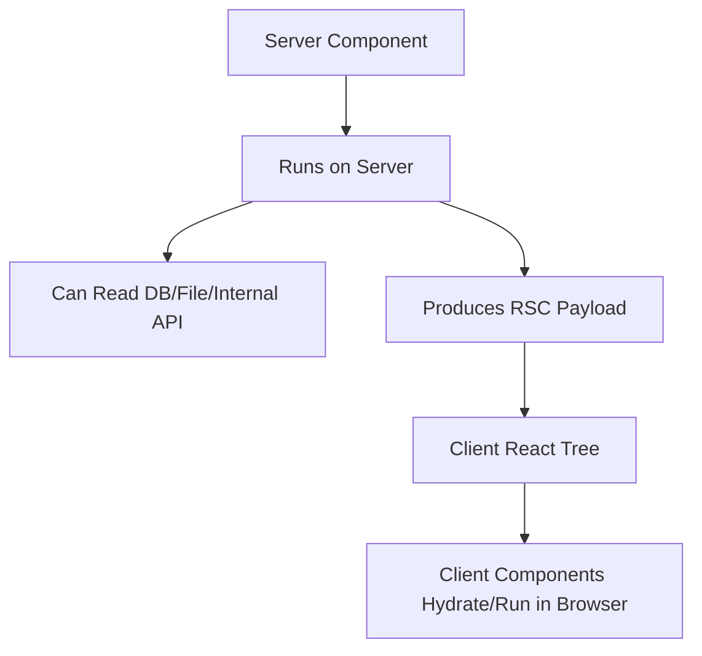
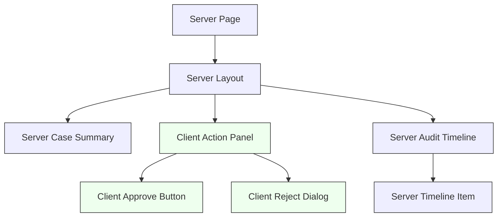
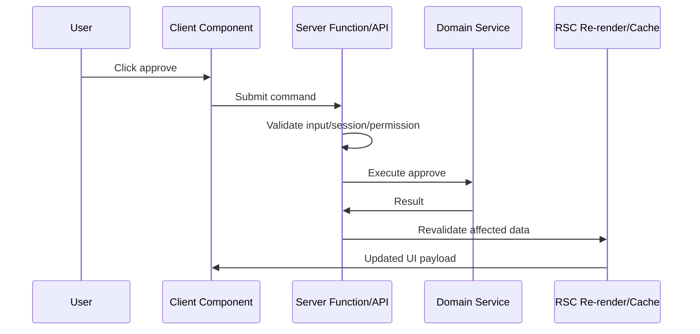

------
title: Learn Frontend React Production Architecture - Part 010
description: Production-grade guide to React Server Components architecture, including server/client boundaries, serializable props, client islands, data access, security, bundle implications, Server Functions, caching, and anti-patterns.
series: learn-frontend-react-production-architecture
seriesTitle: Learn Frontend React Production Architecture
order: 10
partTitle: React Server Components Architecture
tags:
- react
- frontend
- rsc
- server-components
- nextjs
- architecture
- production
- series
date: 2026-06-28
---

# Part 010 — React Server Components Architecture

## Tujuan Pembelajaran

React Server Components atau RSC mengubah cara kita memikirkan React architecture.

Sebelumnya, pertanyaan utama biasanya:

> “Apakah page ini CSR atau SSR?”

Dengan RSC, pertanyaannya menjadi lebih granular:

> “Bagian mana dari tree ini seharusnya berjalan di server, dan bagian mana yang benar-benar membutuhkan client runtime?”

RSC bukan sekadar SSR. SSR menghasilkan HTML. RSC memperkenalkan jenis component yang dirender di server environment terpisah dan hasilnya dikirim ke client tanpa mengirim JavaScript component tersebut ke browser.

Part ini membahas:

1. mental model Server Component,
2. perbedaan RSC dengan SSR,
3. server/client boundary,
4. serializable props,
5. data access di server,
6. Client Component island,
7. bundle size implications,
8. Server Functions,
9. caching/revalidation model konseptual,
10. security risk,
11. anti-pattern umum,
12. decision checklist.

---

## 1. RSC Mental Model

Di React tradisional, component code dikirim ke browser agar React bisa menjalankan render di client.

Dengan Server Components:

- component tertentu dirender di server,
- component code-nya tidak perlu masuk client bundle,
- component bisa membaca resource server,
- hasil render dikirim sebagai payload ke client/framework,
- Client Components tetap dipakai untuk interaksi browser.

Simplified model:



RSC membuat React tree bisa terdiri dari dua dunia:

1. **server world**: data access, non-interactive rendering, secret-safe computation,
2. **client world**: stateful interactivity, browser APIs, event handlers, effects.

---

## 2. RSC Bukan SSR

SSR dan RSC sering bercampur di framework modern, tetapi konsepnya berbeda.

| Aspek | SSR | RSC |
|---|---|---|
| Output utama | HTML awal | RSC payload/component tree description |
| Tujuan | first content/HTML | mengurangi client JS dan memindahkan logic ke server |
| Component code | bisa tetap dikirim ke client untuk hydration | Server Component code tidak dikirim ke client |
| Interactivity | butuh hydration | hanya Client Components yang interaktif |
| Data access | via server render/loaders | langsung di Server Component/framework model |
| Granularity | route/page render | component tree boundary |
| Browser API | tidak tersedia saat server render | tidak tersedia di Server Components |
| State/effects | client after hydration | tidak boleh di Server Components |

Dalam framework seperti Next.js App Router, SSR, streaming, dan RSC bisa bekerja bersama. Tetapi sebagai engineer, Anda perlu memisahkan mental modelnya.

---

## 3. Server Component vs Client Component

### Server Component

Cocok untuk:

- membaca data server,
- render content non-interactive,
- mengakses database/internal service,
- membaca file/server config,
- menjaga dependency berat tetap di server,
- format data besar,
- compose layout,
- mengurangi client bundle,
- menghasilkan UI berdasarkan permission/session server.

Tidak bisa:

- memakai `useState`,
- memakai `useEffect`,
- memakai browser event handler seperti `onClick`,
- membaca `window`,
- memakai DOM API,
- memakai custom Hook yang bergantung pada client-only Hook,
- menyimpan interactive state.

### Client Component

Cocok untuk:

- event handler,
- form interactivity,
- local state,
- effects,
- browser API,
- animations,
- media queries runtime,
- drag and drop,
- rich text editor,
- charts interactive,
- realtime subscription,
- imperative UI library.

---

## 4. `'use client'` Boundary

File dengan directive:

```tsx
"use client";

import { useState } from "react";

export function Counter() {
  const [count, setCount] = useState(0);

  return (
    <button onClick={() => setCount((value) => value + 1)}>
      {count}
    </button>
  );
}
```

Menandai module sebagai client entry. Component dalam file itu dan dependency client-nya masuk client bundle.

Important:

> `'use client'` bukan berarti component hanya dirender di client dalam semua konteks. Ia menandai boundary bahwa component membutuhkan client capabilities dan harus tersedia untuk browser.

Jika Anda menaruh `'use client'` di page/layout besar, banyak dependency bisa terseret ke client bundle.

---

## 5. Diagram: Server/Client Boundary



Architecture goal:

> Jadikan client boundary sekecil mungkin, tetapi tidak lebih kecil dari kebutuhan interaksi yang nyata.

---

## 6. Prop Serialization Boundary

Server Components bisa mengirim props ke Client Components, tetapi props harus serializable.

Valid:

```tsx
<ClientCaseActions
  caseId="CASE-001"
  availableActions={["APPROVE", "REJECT"]}
  status="UNDER_REVIEW"
/>
```

Risky/invalid:

```tsx
<ClientComponent
  onApprove={() => approveCase(caseId)}
  databaseConnection={db}
  complexClassInstance={caseEntity}
/>
```

Function biasa, connection object, class instance kompleks, secret, dan non-serializable object tidak boleh dijadikan props ke Client Component.

Gunakan data sederhana:

- string,
- number,
- boolean,
- null,
- arrays,
- plain objects,
- serializable records,
- Dates jika framework mendukung encoding tertentu, tetapi lebih aman kirim ISO string.

---

## 7. Data Access in Server Components

Server Component bisa menjadi tempat natural untuk data access.

```tsx
async function CaseDetailPage({ params }: { params: { caseId: string } }) {
  const caseDetail = await getCaseDetail(params.caseId);

  return <CaseDetailView caseDetail={caseDetail} />;
}
```

Keuntungan:

- data dekat dengan UI yang membutuhkannya,
- tidak perlu fetch dari browser untuk content awal,
- internal API/database tidak harus exposed ke client,
- secrets tetap di server,
- dependency berat tidak masuk bundle,
- bisa streaming dengan Suspense.

Tetapi hati-hati:

- jangan membuat data waterfall,
- jangan campur query dengan mutation sembarangan,
- jangan membocorkan data server ke Client Component,
- jangan mengganti backend authorization dengan UI filtering,
- cache/revalidation harus dipahami.

---

## 8. Parallel Data Loading

Buruk:

```tsx
async function CasePage({ caseId }: { caseId: string }) {
  const caseDetail = await getCaseDetail(caseId);
  const permissions = await getPermissions(caseDetail.ownerId);
  const timeline = await getTimeline(caseId);

  return <View caseDetail={caseDetail} permissions={permissions} timeline={timeline} />;
}
```

Jika `permissions` tidak benar-benar butuh `caseDetail`, ini waterfall.

Lebih baik:

```tsx
async function CasePage({ caseId }: { caseId: string }) {
  const casePromise = getCaseDetail(caseId);
  const permissionsPromise = getPermissionsForCase(caseId);
  const timelinePromise = getTimeline(caseId);

  const [caseDetail, permissions, timeline] = await Promise.all([
    casePromise,
    permissionsPromise,
    timelinePromise,
  ]);

  return (
    <View
      caseDetail={caseDetail}
      permissions={permissions}
      timeline={timeline}
    />
  );
}
```

Atau streaming:

```tsx
async function CasePage({ caseId }: { caseId: string }) {
  const caseDetail = await getCaseDetail(caseId);
  const permissions = await getPermissionsForCase(caseId);

  return (
    <CaseLayout caseDetail={caseDetail} permissions={permissions}>
      <Suspense fallback={<TimelineSkeleton />}>
        <TimelineServer caseId={caseId} />
      </Suspense>
    </CaseLayout>
  );
}
```

---

## 9. Client Islands

Client island adalah subtree kecil yang butuh interactivity.

Contoh:

```tsx
async function CaseDetailPage({ caseId }: { caseId: string }) {
  const caseDetail = await getCaseDetail(caseId);
  const actions = await getAvailableActions(caseId);

  return (
    <CaseDetailLayout>
      <CaseSummary caseDetail={caseDetail} />
      <CaseActionPanelClient
        caseId={caseId}
        actions={actions}
      />
      <AuditTimelineServer caseId={caseId} />
    </CaseDetailLayout>
  );
}
```

Client component:

```tsx
"use client";

export function CaseActionPanelClient({
  caseId,
  actions,
}: {
  caseId: string;
  actions: CaseAction[];
}) {
  const [dialog, setDialog] = useState<CaseAction | null>(null);

  return (
    <>
      {actions.map((action) => (
        <button key={action} onClick={() => setDialog(action)}>
          {action}
        </button>
      ))}

      {dialog && (
        <ConfirmActionDialog
          caseId={caseId}
          action={dialog}
          onClose={() => setDialog(null)}
        />
      )}
    </>
  );
}
```

Client island owns:

- dialog state,
- click handlers,
- pending mutation UI,
- optimistic UX,
- focus management.

Server owns:

- case data,
- available actions initial computation,
- static content,
- audit timeline initial render.

---

## 10. Bundle Size Implication

RSC can reduce client JavaScript because Server Component code and server-only dependencies do not need to ship to the browser.

Example:

```tsx
import { expensiveMarkdownProcessor } from "@/server/markdown";

export async function ArticleServer({ slug }: { slug: string }) {
  const article = await loadArticle(slug);
  const html = expensiveMarkdownProcessor(article.body);

  return <article dangerouslySetInnerHTML={{ __html: html }} />;
}
```

If this stays server-only, markdown processor need not enter client bundle.

But if parent is marked client:

```tsx
"use client";

import { ArticleServer } from "./ArticleServer";
```

This composition is invalid or forces redesign depending framework rules. You cannot freely import Server Component into Client Component as if both are same runtime.

Rule:

> Client modules can pull dependencies into client bundle. Keep `'use client'` low in the tree.

---

## 11. Composition Rules

A common pattern:

- Server Component can render Client Component.
- Client Component cannot directly import Server Component.
- Server content can be passed as children into Client Component depending framework composition model.

Example:

```tsx
function ServerPage() {
  return (
    <ClientTabs>
      <ServerRenderedTabContent />
    </ClientTabs>
  );
}
```

The Client Component controls tab state, but server-rendered children can be passed through as already-rendered payload.

This pattern is powerful but must be used carefully:

- client component should not need to inspect server child data,
- server content should not depend on client state unless re-render/navigation triggers server refresh,
- avoid trying to make server component respond instantly to client local state.

---

## 12. Server Functions

Server Functions allow client code to request server-side execution through framework-supported references.

Concept:

```tsx
"use server";

export async function approveCase(input: ApproveCaseInput) {
  await requirePermission("case.approve");
  await caseService.approve(input.caseId, input.reason);
}
```

Client usage concept:

```tsx
"use client";

import { approveCase } from "./actions";

function ApproveButton({ caseId }: { caseId: string }) {
  const handleApprove = async () => {
    await approveCase({ caseId, reason: "Reviewed" });
  };

  return <button onClick={handleApprove}>Approve</button>;
}
```

Important:

- server function is still an API boundary,
- validate input,
- authenticate/authorize,
- handle CSRF depending framework/session model,
- log audit events,
- do not trust client-provided data,
- return serializable values,
- handle errors safely.

Server Functions do not remove need for backend discipline.

---

## 13. Security Model

RSC moves logic to server, but does not automatically make the app secure.

Security rules:

1. Authorization must happen on server.
2. Server Component must not serialize secret data to client.
3. Server Functions must validate all arguments.
4. Client-visible action availability is UX, not enforcement.
5. Cache must not leak user-specific data.
6. Logs must not include sensitive payload accidentally.
7. Dependencies for RSC/server functions must be patched quickly.
8. Treat RSC payload/endpoints as attack surface.

For regulatory systems:

- every state-changing action needs audit trail,
- command must be idempotent or protected,
- user identity must come from trusted session,
- permission must be checked at execution time,
- optimistic UI must reconcile with server result,
- hidden buttons are not access control.

---

## 14. RSC Vulnerability Awareness

RSC architecture includes server-side decoding/execution paths that can have framework/runtime vulnerabilities. When critical security advisories are released, patching must be prioritized.

Production policy:

- track React/framework security advisories,
- pin/upgrade React and framework versions intentionally,
- maintain dependency inventory,
- automate vulnerability scanning,
- run smoke tests after upgrades,
- avoid exposing experimental endpoints casually,
- monitor server action/RSC endpoint traffic anomalies.

Architecture is not only code shape. It includes patch discipline.

---

## 15. Caching and Revalidation

RSC frameworks often integrate fetch/data caching.

Questions:

- Is this data static, user-specific, or frequently changing?
- Can it be cached per request?
- Can it be shared across users?
- What invalidates it?
- Does mutation revalidate the right path/key?
- Does stale data create regulatory risk?
- Is cache keyed by permission/session?

Example conceptual policies:

| Data | Cache Policy |
|---|---|
| Public product page | static/revalidate |
| Current user session | no-store/per-request |
| Case detail | no-store or short private cache depending sensitivity |
| Reference data | cache with revalidation |
| Permissions | per-request or short private cache |
| Audit timeline | no-store or carefully revalidated |
| Feature flags | short cache |

Do not copy cache defaults blindly.

---

## 16. RSC and Mutations

Server Components are primarily for rendering. Mutations should be explicit commands.

Bad mental model:

```tsx
async function CasePage() {
  if (someCondition) {
    await approveCaseAutomatically();
  }

  return <View />;
}
```

Render should not perform unintended mutation.

Better:

- render available action,
- user submits command,
- server function/API validates,
- mutation updates domain state,
- cache/path/query invalidated,
- UI refreshes.

Command flow:



---

## 17. RSC and Forms

Forms can be powerful with Server Functions, especially for progressive enhancement.

Concept:

```tsx
function ApproveCaseForm({ caseId }: { caseId: string }) {
  return (
    <form action={approveCaseAction}>
      <input type="hidden" name="caseId" value={caseId} />
      <textarea name="reason" />
      <button type="submit">Approve</button>
    </form>
  );
}
```

Production concerns:

- validation,
- pending state,
- error mapping,
- idempotency,
- duplicate submit,
- CSRF/session,
- accessibility,
- optimistic update,
- rollback,
- audit logging,
- field-level errors.

For complex forms, Client Component may still be necessary for rich interaction.

---

## 18. RSC and State Taxonomy

RSC changes where data is loaded, but not state taxonomy.

| State Type | Likely Owner |
|---|---|
| Server data for initial render | Server Component |
| User input draft | Client Component |
| Dialog open/closed | Client Component |
| URL params | Router/server + client navigation |
| Auth session | Server boundary + client provider as needed |
| Permission decision | Server for enforcement, client for UX |
| Realtime connection | Client Component |
| Audit history | Server Component/query + optional client updates |
| Theme | server cookie + client preference |
| Form pending/error | server action + client form state |

Do not push local UI state to server just because RSC exists. Do not push server data to client state just because you need one button.

---

## 19. RSC and Realtime UI

RSC is request/render oriented. Realtime subscriptions are browser-oriented.

Pattern:

```tsx
async function CaseTimelinePage({ caseId }: { caseId: string }) {
  const initialEvents = await getTimeline(caseId);

  return (
    <TimelineClient
      caseId={caseId}
      initialEvents={initialEvents}
    />
  );
}
```

Client:

```tsx
"use client";

function TimelineClient({
  caseId,
  initialEvents,
}: {
  caseId: string;
  initialEvents: CaseEvent[];
}) {
  const events = useCaseRealtimeTimeline(caseId, initialEvents);

  return <Timeline events={events} />;
}
```

Trade-off:

- initial content from server,
- realtime behavior in client,
- duplicate/dedupe logic needed,
- server revalidation still needed after mutation,
- event ordering and idempotency must be handled.

---

## 20. RSC and URL State

Server Components naturally read route params/search params.

```tsx
async function CaseListPage({
  searchParams,
}: {
  searchParams: { status?: string; q?: string };
}) {
  const filters = parseCaseFilters(searchParams);
  const cases = await getCases(filters);

  return <CaseListView cases={cases} filters={filters} />;
}
```

For interactive filtering:

- submit form updates URL,
- navigation triggers server render,
- Client Component can manage draft state,
- Apply updates search params.

Pattern:

```tsx
<CaseFilterClient initialFilters={filters} />
<CaseListServer filters={filters} />
```

Avoid trying to make every keystroke trigger server render unless UX and infrastructure can support it.

---

## 21. RSC Boundary and Design System

Design system components need classification.

Server-safe components:

- typography,
- static layout,
- card,
- badge,
- table markup,
- breadcrumb static,
- non-interactive icon.

Client-required components:

- dropdown,
- modal,
- tooltip with focus/position logic,
- combobox,
- date picker,
- rich select,
- tabs with client state,
- toast,
- drag and drop.

Design system package may need explicit entrypoints:

```txt
@acme/ui/server
@acme/ui/client
```

Or clear file-level directives.

Anti-pattern:

```tsx
"use client";

export * from "./all-components";
```

This can pull entire design system into client bundle.

---

## 22. RSC and Third-Party Libraries

Some libraries are server-safe. Some are browser-only.

Server-safe examples:

- schema validation,
- date formatting without browser APIs,
- markdown processing,
- data transformation,
- authorization policy evaluation,
- pure utility libraries.

Client-only examples:

- chart libraries touching DOM,
- map libraries,
- rich text editors,
- drag-and-drop libraries,
- browser storage wrappers,
- animation libraries requiring DOM.

If imported into Server Component, browser-only library can crash server render.

If imported into Client Component high in tree, heavy library can bloat bundle.

Use lazy client islands for heavy browser-only libraries.

---

## 23. Error Handling in RSC

Errors can happen:

- in Server Component data load,
- in Server Function,
- during RSC payload generation,
- in Client Component hydration,
- during client interaction,
- during revalidation/navigation.

Pattern:

- route segment error boundary,
- server logs with correlation id,
- safe user-facing error,
- retry mechanism,
- no secret stack in client,
- domain errors separated from system errors.

Example domain error:

```tsx
if (!permission.canView) {
  return <ForbiddenPage />;
}
```

Example system error:

```tsx
throw new Error("Case service unavailable");
```

Framework error boundary handles system fallback.

---

## 24. Observability for RSC

RSC needs both server and client observability.

Track:

- server render duration,
- data fetch duration,
- cache hit/miss,
- server function duration,
- server function error rate,
- RSC payload size,
- client JS bundle size,
- hydration errors,
- client action latency,
- navigation latency,
- revalidation latency.

Correlation:

```txt
request_id -> server render logs
request_id -> data fetch logs
request_id -> client navigation metric
request_id -> mutation audit event
```

For workflow-heavy system, add domain telemetry:

- approve action attempted,
- approve success/failure,
- permission denied,
- stale case version conflict,
- audit event appended,
- timeline refreshed.

---

## 25. Folder Architecture

Example Next.js-style conceptual architecture:

```txt
src/
  app/
    cases/
      page.tsx                 # Server Component route
      loading.tsx              # streaming fallback
      error.tsx                # route error boundary
      [caseId]/
        page.tsx               # Server Component detail
    actions/
      caseActions.ts           # server functions
  features/
    cases/
      server/
        getCaseDetail.ts
        getCaseTimeline.ts
        getCasePermissions.ts
      client/
        CaseActionPanelClient.tsx
        CaseFilterClient.tsx
        TimelineClient.tsx
      components/
        CaseSummary.tsx
        CaseTimeline.tsx
      model/
        caseTypes.ts
        caseSchemas.ts
  shared/
    ui/
      server/
      client/
    lib/
      server/
      client/
```

Principles:

- server-only code separated,
- client components clearly named or located,
- shared UI split by capability,
- server functions/actions explicit,
- domain model shared only if safe,
- validation schema can be shared if no server secret/dependency.

---

## 26. Import Boundary Rules

Establish code review rules:

1. Client files must not import `server/` modules.
2. Server files may import pure shared modules.
3. Server Components may render Client Components.
4. Client Components receive serializable props.
5. Browser-only libraries live behind client boundary.
6. Server-only libraries never enter client bundle.
7. Secrets only accessed in server modules.
8. API/database clients only in server modules.
9. Shared model must be environment-neutral.
10. `'use client'` should be as low as possible.

ESLint/import rules can enforce this.

---

## 27. Anti-Pattern Catalog

### 27.1 `'use client'` at the Top of Everything

```tsx
"use client";

export default function CasePage() {
  // entire page client
}
```

This erases RSC benefits.

### 27.2 Passing Non-Serializable Props

```tsx
<ClientComponent db={db} onSave={serverFunctionClosure} />
```

Invalid boundary.

### 27.3 Server Component with Browser API

```tsx
function ServerComponent() {
  return <p>{window.location.href}</p>;
}
```

Server has no `window`.

### 27.4 Client Component Fetching Data Already Available on Server

Server loads data, then client fetches same data again because boundary design is unclear.

### 27.5 Server Component as Mutation Trigger

Rendering should not execute domain command.

### 27.6 Secret Serialization

```tsx
<ClientComponent config={process.env} />
```

High severity.

### 27.7 Heavy Client Design System Barrel

A single `'use client'` barrel exports everything and pulls server-safe components into bundle.

### 27.8 RSC Without Cache Policy

Data freshness, privacy, and invalidation become accidental.

### 27.9 Treating Server Function as Trusted Because It Is Imported

Client can call it. Validate like API endpoint.

### 27.10 Ignoring Security Advisories

RSC/server function runtime vulnerabilities require fast patching.

---

## 28. Decision Matrix: Server or Client?

| Need | Server Component | Client Component |
|---|---:|---:|
| Reads database/internal service | yes | no |
| Uses secret env | yes | no |
| Needs `useState` | no | yes |
| Needs `useEffect` | no | yes |
| Handles click/input directly | no | yes |
| Formats static data | yes | maybe |
| Uses browser API | no | yes |
| Heavy pure dependency | yes | avoid client |
| Needs realtime subscription | no | yes |
| Needs SEO/content HTML | yes | maybe |
| Needs drag/drop | no | yes |
| Uses permission to hide action | server computes, client displays | yes for UX |
| Enforces authorization | yes | no |

---

## 29. Mini Case Study: RSC Case Detail

### Requirement

- server validates session,
- server loads case summary,
- server loads audit timeline,
- client handles approve/reject dialog,
- client handles mutation pending state,
- backend enforces permission,
- after mutation, UI refreshes.

### Server Route

```tsx
async function CaseDetailPage({ params }: { params: { caseId: string } }) {
  const session = await requireSession();
  const permission = await getCasePermission(session.userId, params.caseId);

  if (!permission.canView) {
    return <ForbiddenPage />;
  }

  const caseDetail = await getCaseDetail(params.caseId);

  return (
    <CaseDetailLayout>
      <CaseSummary caseDetail={caseDetail} />

      <CaseActionPanelClient
        caseId={params.caseId}
        availableActions={permission.availableActions}
        version={caseDetail.version}
      />

      <Suspense fallback={<AuditTimelineSkeleton />}>
        <AuditTimelineServer caseId={params.caseId} />
      </Suspense>
    </CaseDetailLayout>
  );
}
```

### Client Action Panel

```tsx
"use client";

function CaseActionPanelClient({
  caseId,
  availableActions,
  version,
}: {
  caseId: string;
  availableActions: CaseAction[];
  version: number;
}) {
  const [pendingAction, setPendingAction] = useState<CaseAction | null>(null);

  return (
    <>
      {availableActions.includes("APPROVE") && (
        <button onClick={() => setPendingAction("APPROVE")}>
          Approve
        </button>
      )}

      {pendingAction && (
        <CaseActionDialog
          action={pendingAction}
          caseId={caseId}
          version={version}
          onClose={() => setPendingAction(null)}
        />
      )}
    </>
  );
}
```

### Server Function

```tsx
"use server";

async function submitCaseAction(input: SubmitCaseActionInput) {
  const session = await requireSession();

  const parsed = submitCaseActionSchema.parse(input);

  await requireCasePermission({
    userId: session.userId,
    caseId: parsed.caseId,
    action: parsed.action,
  });

  await caseCommandService.execute({
    caseId: parsed.caseId,
    action: parsed.action,
    reason: parsed.reason,
    expectedVersion: parsed.version,
    actorId: session.userId,
  });

  revalidateCase(parsed.caseId);

  return { ok: true };
}
```

Important:

- `availableActions` is UX,
- `requireCasePermission` is enforcement,
- `expectedVersion` handles stale UI conflict,
- audit service records command,
- revalidation refreshes server-rendered data.

---

## 30. Migration from Client-Only React to RSC

Stepwise migration:

1. identify non-interactive content-heavy components,
2. move data fetching to server route/component,
3. isolate interactive widgets as client components,
4. remove client bundle dependencies from server-safe code,
5. enforce import boundaries,
6. design serialization DTO,
7. add route loading/error boundaries,
8. define cache/revalidation policy,
9. move mutations to explicit server functions/API,
10. measure bundle and hydration reduction.

Do not migrate:

- highly interactive editor as first target,
- realtime-heavy dashboard as first target,
- page with unclear state ownership,
- codebase with no tests/observability,
- workflow command without backend authorization discipline.

---

## 31. Testing RSC Architecture

Test categories:

### 31.1 Server Component Data Tests

- permission denied,
- case not found,
- data service error,
- cache behavior,
- no secret serialization.

### 31.2 Client Island Tests

- dialog opens/closes,
- submit pending state,
- error mapping,
- keyboard/focus behavior,
- optimistic update if any.

### 31.3 Integration/E2E

- route loads server content,
- action executes server function/API,
- unauthorized action rejected,
- stale version conflict shown,
- timeline refreshes,
- no hydration error,
- bundle size not regressed.

### 31.4 Import Boundary Tests

- client modules cannot import server modules,
- server-only env not referenced in client bundle,
- browser-only library not imported server-side.

---

## 32. RSC Review Checklist

Before approving RSC code:

1. Is `'use client'` placed as low as possible?
2. Are props crossing server-client boundary serializable?
3. Is server-only data kept server-side?
4. Are secrets excluded from client payload?
5. Is data loading parallel where possible?
6. Are Suspense boundaries meaningful?
7. Is cache policy explicit?
8. Is mutation handled as command, not render side effect?
9. Does server function validate input?
10. Does server function authorize user?
11. Are domain actions audited?
12. Is client action availability treated as UX only?
13. Are heavy browser libraries isolated?
14. Is design system split server/client?
15. Are security advisories tracked?

---

## 33. Deliberate Practice

### Latihan 1 — Boundary Classification

Ambil satu page React existing dan klasifikasikan setiap component:

| Component | Server/Client | Reason |
|---|---|---|
| `CaseSummary` | server | static content from server data |
| `ApproveButton` | client | click handler/dialog |
| `AuditTimeline` | server + client optional | initial timeline server, realtime client |
| `FilterInput` | client | local draft state |
| `Breadcrumbs` | server | route metadata |

Target:

- pindahkan minimal 3 component ke server-safe,
- isolasi 1 client island kecil,
- hilangkan 1 dependency berat dari client bundle.

### Latihan 2 — Serialization Audit

Cari props dari server ke client:

- function,
- class instance,
- Date object,
- Map/Set,
- Error,
- database entity,
- secret/config,
- large nested object.

Ubah menjadi DTO serializable minimal.

### Latihan 3 — Server Function Threat Model

Untuk satu action `approveCase`, tulis:

- input schema,
- auth source,
- authorization check,
- idempotency/version check,
- audit log,
- error mapping,
- revalidation target,
- observability event.

---

## 34. Ringkasan

React Server Components memperkenalkan boundary baru dalam arsitektur React:

- Server Components untuk render/data/server-only logic.
- Client Components untuk interactivity/browser state/effects.
- Props crossing boundary harus serializable.
- `'use client'` harus ditempatkan rendah.
- Server Functions adalah command boundary dan tetap harus divalidasi/diotorisasi.
- RSC dapat mengurangi client JS, tetapi membutuhkan import governance, cache policy, dan security discipline.
- RSC bukan pengganti SSR, bukan pengganti backend authorization, dan bukan alasan untuk memindahkan semua hal ke server.

Arsitektur RSC yang baik terasa seperti sistem yang jelas:

> Server owns data and authority. Client owns interaction and immediacy. Boundary between them is explicit, serializable, observable, and secure.

---

## 35. Self-Assessment

Anda siap lanjut jika bisa menjawab:

1. Apa beda RSC dan SSR?
2. Apa fungsi `'use client'`?
3. Mengapa props ke Client Component harus serializable?
4. Kapan component sebaiknya server?
5. Kapan component harus client?
6. Mengapa meletakkan `'use client'` terlalu tinggi berbahaya?
7. Apa risiko Server Function?
8. Mengapa RSC tidak menghapus kebutuhan authorization backend?
9. Bagaimana RSC mengurangi bundle size?
10. Bagaimana mendesain client island untuk workflow action?

---

## 36. Sumber Rujukan

- React Docs — Server Components
- React Docs — `'use client'`
- React Docs — Server Functions
- React Docs — `'use server'`
- React Docs — Directives
- React Docs — `use`
- Next.js Docs — App Router
- Next.js Docs — Server and Client Components
- Next.js Docs — Streaming
- React Blog — Critical Security Vulnerability in React Server Components
