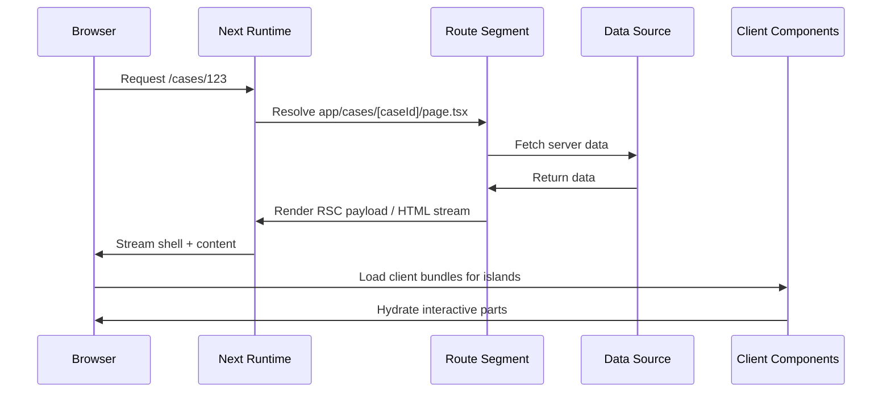

------
title: Learn Frontend React Production Architecture - Part 011
description: Production-grade guide to Next.js App Router architecture, including route segments, layouts, loading and error boundaries, Server and Client Components, caching, revalidation, route handlers, server functions, middleware, edge runtime, and production folder strategy.
series: learn-frontend-react-production-architecture
seriesTitle: Learn Frontend React Production Architecture
order: 11
partTitle: Next.js App Router Production Model
tags:
- react
- frontend
- nextjs
- app-router
- rsc
- production
- architecture
- series
date: 2026-06-28
---

# Part 011 — Next.js App Router Production Model

## Tujuan Pembelajaran

Next.js App Router bukan sekadar “folder `app/` baru”.

App Router adalah model arsitektur yang menggabungkan:

- file-system routing,
- React Server Components,
- Server and Client Component boundary,
- layouts,
- nested routing,
- streaming,
- Suspense,
- route-level loading UI,
- route-level error boundaries,
- route handlers,
- Server Functions,
- caching,
- revalidation,
- metadata,
- middleware,
- edge/node runtime choices,
- deployment model.

Jika dipakai dengan benar, App Router membuat rendering, data fetching, cache, layout, dan interactivity menjadi lebih terstruktur.

Jika dipakai tanpa mental model, App Router bisa berubah menjadi campuran berbahaya:

- semua file diberi `'use client'`,
- cache tidak dipahami,
- data stale tidak disengaja,
- route segment terlalu besar,
- Server Function dianggap aman tanpa validasi,
- middleware dipakai sebagai business layer,
- error handling bercampur,
- RSC benefit hilang.

Part ini membahas App Router sebagai **production application model**, bukan tutorial routing dasar.

---

## 1. App Router Mental Model

Dalam App Router, URL dipetakan ke segment folder.

Contoh:

```txt
app/
  layout.tsx
  page.tsx
  login/
    page.tsx
  cases/
    layout.tsx
    page.tsx
    [caseId]/
      page.tsx
      loading.tsx
      error.tsx
```

Route:

```txt
/              -> app/page.tsx
/login         -> app/login/page.tsx
/cases         -> app/cases/page.tsx
/cases/123     -> app/cases/[caseId]/page.tsx
```

`layout.tsx` membungkus segment dan child segment.

```mermaid
flowchart TD
    A[app/layout.tsx Root Layout] --> B[app/cases/layout.tsx Cases Layout]
    B --> C[app/cases/page.tsx Case List]
    B --> D[app/cases/[caseId]/page.tsx Case Detail]
```

Mental model:

> Folder bukan hanya organisasi file. Folder adalah boundary routing, rendering, loading, error, layout, metadata, dan caching.

---

## 2. Core File Conventions

App Router memakai file khusus.

| File | Peran |
|---|---|
| `layout.tsx` | shared UI yang membungkus child segment |
| `page.tsx` | route leaf UI |
| `loading.tsx` | fallback loading untuk segment |
| `error.tsx` | error boundary untuk segment |
| `not-found.tsx` | UI not found |
| `route.ts` | route handler/API endpoint |
| `template.tsx` | layout-like wrapper yang remount pada navigation |
| `default.tsx` | fallback untuk parallel route |
| `global-error.tsx` | root-level error fallback |
| `metadata`/`generateMetadata` | route metadata |

Production implication:

- `layout.tsx` harus stabil dan tidak memuat interactivity besar tanpa alasan.
- `loading.tsx` menjadi Suspense fallback segment.
- `error.tsx` harus menjadi Client Component karena perlu reset/interactivity.
- `route.ts` adalah HTTP boundary, bukan React component.
- `not-found.tsx` harus dirancang seperti state domain/route, bukan generic blank page.

---

## 3. Root Layout

Root layout wajib mendefinisikan struktur HTML.

```tsx
export default function RootLayout({
  children,
}: {
  children: React.ReactNode;
}) {
  return (
    <html lang="id">
      <body>
        {children}
      </body>
    </html>
  );
}
```

Production root layout biasanya bertanggung jawab untuk:

- document shell,
- global CSS,
- font setup,
- global providers,
- metadata default,
- analytics bootstrap minimal,
- accessibility landmarks,
- theme bootstrapping,
- body-level portal root jika diperlukan.

Namun jangan menjadikan root layout sebagai tempat semua business logic.

Anti-pattern:

```tsx
export default async function RootLayout({ children }) {
  const allCases = await getAllCases();
  const reports = await getAllReports();
  const notifications = await getAllNotifications();

  return <html><body>{children}</body></html>;
}
```

Root layout terlalu tinggi. Data route-specific sebaiknya hidup di route/segment terkait.

---

## 4. Nested Layouts

Nested layout menjaga UI tetap persistent saat navigasi antar child route.

Contoh:

```tsx
// app/cases/layout.tsx
export default function CasesLayout({
  children,
}: {
  children: React.ReactNode;
}) {
  return (
    <section>
      <CasesNavigation />
      <div>{children}</div>
    </section>
  );
}
```

Navigasi:

- `/cases`
- `/cases/123`
- `/cases/123/audit`

`CasesNavigation` bisa tetap persistent.

Gunakan nested layout untuk:

- authenticated shell,
- feature shell,
- sidebar per domain,
- breadcrumbs per area,
- tab layout,
- settings layout,
- admin layout.

Jangan gunakan nested layout untuk logic yang harus reset setiap route. Untuk wrapper yang harus remount, evaluasi `template.tsx`.

---

## 5. Route Groups

Route group memakai folder dengan parentheses:

```txt
app/
  (public)/
    login/
      page.tsx
  (authenticated)/
    layout.tsx
    cases/
      page.tsx
```

Route group tidak mempengaruhi URL.

URL tetap:

```txt
/login
/cases
```

Gunakan route group untuk:

- memisahkan public/authenticated shell,
- memisahkan marketing/app/admin area,
- mengatur layout tanpa menambah path,
- menata codebase berdasarkan boundary aplikasi.

Contoh:

```txt
app/
  (public)/
    layout.tsx
    login/
      page.tsx
  (app)/
    layout.tsx
    cases/
      page.tsx
  (admin)/
    layout.tsx
    admin/
      page.tsx
```

---

## 6. Server Components by Default

Dalam App Router, components di `app/` secara default adalah Server Components kecuali diberi `'use client'`.

Server Component cocok untuk:

- load data,
- read cookies/headers,
- render static/dynamic content,
- access server-only dependencies,
- reduce client bundle,
- compose non-interactive UI.

Client Component dibutuhkan untuk:

- `useState`,
- `useEffect`,
- browser APIs,
- event handlers,
- local interaction,
- form UI complex,
- realtime subscriptions.

Production rule:

> Mulai dari Server Component. Turunkan `'use client'` serendah mungkin hanya pada island yang membutuhkan interactivity.

---

## 7. Client Boundary Placement

Buruk:

```tsx
"use client";

export default function CaseDetailPage() {
  const [dialogOpen, setDialogOpen] = useState(false);
  // fetch all data client-side
}
```

Lebih baik:

```tsx
export default async function CaseDetailPage({
  params,
}: {
  params: Promise<{ caseId: string }>;
}) {
  const { caseId } = await params;
  const caseDetail = await getCaseDetail(caseId);
  const permissions = await getCasePermissions(caseId);

  return (
    <CaseDetailLayout>
      <CaseSummary caseDetail={caseDetail} />
      <CaseActionsClient
        caseId={caseId}
        availableActions={permissions.availableActions}
      />
      <AuditTimelineServer caseId={caseId} />
    </CaseDetailLayout>
  );
}
```

Client component hanya action panel:

```tsx
"use client";

export function CaseActionsClient({
  caseId,
  availableActions,
}: {
  caseId: string;
  availableActions: string[];
}) {
  const [selectedAction, setSelectedAction] = useState<string | null>(null);

  return (
    <>
      {availableActions.map((action) => (
        <button key={action} onClick={() => setSelectedAction(action)}>
          {action}
        </button>
      ))}
      {selectedAction && <ActionDialog caseId={caseId} action={selectedAction} />}
    </>
  );
}
```

---

## 8. Diagram: App Router Request Lifecycle



---

## 9. Loading UI and Streaming

`loading.tsx` automatically creates loading UI for the segment.

```tsx
// app/cases/[caseId]/loading.tsx
export default function Loading() {
  return <CaseDetailSkeleton />;
}
```

When segment data is slow, Next can show the fallback while streaming.

Design rules:

- fallback should match final layout,
- avoid generic spinner for content-heavy screens,
- loading UI must not cause layout shift,
- keep skeleton accessible,
- show critical shell early,
- place `loading.tsx` at segment level that matches user expectation.

Example:

```txt
app/
  cases/
    loading.tsx           # fallback for case list
    [caseId]/
      loading.tsx         # fallback for case detail
```

Do not put one global loading spinner at root for every route.

---

## 10. Error Boundaries

`error.tsx` handles uncaught errors in the segment.

```tsx
"use client";

export default function Error({
  error,
  reset,
}: {
  error: Error;
  reset: () => void;
}) {
  return (
    <div role="alert">
      <h2>Failed to load case detail</h2>
      <p>Please try again.</p>
      <button onClick={() => reset()}>Retry</button>
    </div>
  );
}
```

Production guidance:

- separate expected domain errors from unexpected exceptions,
- use `notFound()` for true not-found route state,
- use explicit UI for forbidden/unauthorized,
- log unexpected errors with correlation id,
- do not expose stack traces,
- retry should be meaningful,
- keep error boundary close enough to avoid killing whole app.

Expected errors should often be modeled in return values, not thrown into global error boundary.

---

## 11. Not Found

Use not-found UI for route/domain not found.

```tsx
import { notFound } from "next/navigation";

export default async function CaseDetailPage({ params }: Props) {
  const { caseId } = await params;
  const caseDetail = await getCaseDetail(caseId);

  if (!caseDetail) {
    notFound();
  }

  return <CaseDetailView caseDetail={caseDetail} />;
}
```

`not-found.tsx`:

```tsx
export default function NotFound() {
  return (
    <main>
      <h1>Case not found</h1>
      <p>The case may have been removed or you may not have access.</p>
    </main>
  );
}
```

For regulatory systems, be careful whether you distinguish “not found” vs “forbidden”. Revealing that a case exists might itself be sensitive.

---

## 12. Data Fetching in Server Components

Server Components can fetch using `fetch`, ORM, database clients, or server-only service modules.

```tsx
export default async function CaseListPage({
  searchParams,
}: {
  searchParams: Promise<{ status?: string; q?: string }>;
}) {
  const params = await searchParams;
  const filters = parseCaseFilters(params);
  const cases = await getCases(filters);

  return <CaseList cases={cases} filters={filters} />;
}
```

Guidelines:

- put data access in server-only modules,
- validate route/search params,
- parallelize independent fetches,
- avoid accidental cache defaults,
- do not serialize unnecessary fields,
- do not expose secrets,
- use DTOs, not database entities,
- keep mutation out of render.

---

## 13. Parallel Routes and Data Loading

Bad waterfall:

```tsx
const user = await getCurrentUser();
const permissions = await getPermissions(user.id);
const cases = await getCases(permissions.scope);
```

Some dependencies are real. Others can be parallel.

Better:

```tsx
const userPromise = getCurrentUser();
const referenceDataPromise = getReferenceData();

const user = await userPromise;

const permissionsPromise = getPermissions(user.id);
const casesPromise = getCasesForUser(user.id);

const [permissions, cases, referenceData] = await Promise.all([
  permissionsPromise,
  casesPromise,
  referenceDataPromise,
]);
```

If slow data is not critical, stream with Suspense.

---

## 14. Caching Model: Think Explicitly

Caching is one of the most common App Router failure zones.

Questions before fetching:

1. Is data user-specific?
2. Is data public?
3. Is data frequently changing?
4. Can stale data be shown?
5. What invalidates it?
6. Does it depend on cookies/headers?
7. Is route static, dynamic, or partially dynamic?
8. Is this GET safe and cacheable?
9. Is there regulatory/audit risk if stale?

Example policy table:

| Data | Suggested Policy |
|---|---|
| Public docs | static/revalidate |
| Reference enum list | cache/revalidate |
| Current user session | no-store/per-request |
| Case detail | often no-store or short private cache |
| Case audit trail | no-store or explicit revalidation |
| Dashboard counts | short cache if acceptable |
| Permission map | per-request or short private cache |
| Marketing page | static/ISR-like |

Do not let cache policy be accidental.

---

## 15. Revalidation After Mutation

If mutation changes server-rendered data, affected paths/cache entries must be revalidated.

Concept:

```tsx
"use server";

export async function approveCaseAction(input: ApproveCaseInput) {
  const session = await requireSession();
  const parsed = approveCaseSchema.parse(input);

  await requirePermission(session.userId, parsed.caseId, "case.approve");

  await caseCommandService.approve({
    caseId: parsed.caseId,
    reason: parsed.reason,
    actorId: session.userId,
    expectedVersion: parsed.version,
  });

  revalidatePath(`/cases/${parsed.caseId}`);
  revalidatePath("/cases");
}
```

Key point:

- client action availability is UX,
- server action validates and authorizes,
- domain service writes audit record,
- revalidation refreshes stale UI.

For complex cache usage, use tags or query invalidation strategy depending framework/data layer.

---

## 16. Server Functions / Server Actions

Server Functions are asynchronous functions executed on the server and can be invoked from forms or Client Components.

Production rules:

- schema-validate input,
- authenticate,
- authorize,
- check idempotency/version,
- handle expected errors explicitly,
- avoid leaking stack traces,
- log/audit state-changing actions,
- return serializable result,
- revalidate affected data,
- consider CSRF/session model,
- rate-limit if exposed to untrusted traffic.

Bad:

```tsx
"use server";

export async function approveCase(caseId: string) {
  await db.case.update({ where: { id: caseId }, data: { status: "APPROVED" } });
}
```

Better:

```tsx
"use server";

export async function approveCase(input: unknown): Promise<ActionResult> {
  const session = await requireSession();
  const parsed = approveCaseSchema.safeParse(input);

  if (!parsed.success) {
    return { ok: false, type: "validation", errors: parsed.error.flatten() };
  }

  const permission = await canApproveCase(session.userId, parsed.data.caseId);

  if (!permission.allowed) {
    return { ok: false, type: "forbidden" };
  }

  await caseCommandService.approve({
    caseId: parsed.data.caseId,
    actorId: session.userId,
    reason: parsed.data.reason,
    expectedVersion: parsed.data.version,
  });

  revalidatePath(`/cases/${parsed.data.caseId}`);

  return { ok: true };
}
```

---

## 17. Forms with Server Functions

Server Functions work naturally with forms.

```tsx
export function ApproveCaseForm({
  caseId,
  version,
}: {
  caseId: string;
  version: number;
}) {
  return (
    <form action={approveCaseFormAction}>
      <input type="hidden" name="caseId" value={caseId} />
      <input type="hidden" name="version" value={version} />
      <label>
        Reason
        <textarea name="reason" required />
      </label>
      <button type="submit">Approve</button>
    </form>
  );
}
```

For rich pending/error state, use a Client Component around the form.

Consider:

- field-level validation,
- optimistic UI,
- duplicate submit,
- pending state,
- conflict handling,
- focus management after error,
- accessible error message,
- progressive enhancement,
- domain audit trail.

---

## 18. Route Handlers

`route.ts` defines custom request handlers.

```tsx
// app/api/cases/[caseId]/route.ts
export async function GET(
  request: Request,
  context: { params: Promise<{ caseId: string }> }
) {
  const { caseId } = await context.params;
  const session = await requireSession();

  const caseDetail = await getCaseDetailForUser(session.userId, caseId);

  return Response.json(caseDetail);
}
```

Use route handlers for:

- external webhooks,
- API endpoints for non-RSC clients,
- file downloads,
- health checks,
- OAuth callbacks,
- server-side proxy with policy,
- integration endpoints.

Do not use route handlers as a dumping ground when Server Components or Server Functions fit better.

Route handler is HTTP boundary. Treat it like backend code:

- method semantics,
- validation,
- auth,
- status codes,
- content type,
- cache headers,
- rate limits,
- audit/logging.

---

## 19. Middleware

Middleware runs before route handling and can inspect/modify request/response.

Use for:

- lightweight redirects,
- locale routing,
- auth presence check,
- header injection,
- A/B routing,
- request normalization.

Do not use middleware for:

- heavy DB queries,
- full authorization logic,
- complex business workflows,
- large data fetching,
- mutation,
- expensive computation.

Middleware often runs in constrained runtime and affects every matching request. Keep it small.

Pattern:

```ts
export function middleware(request: NextRequest) {
  const sessionCookie = request.cookies.get("session");

  if (!sessionCookie && request.nextUrl.pathname.startsWith("/cases")) {
    return NextResponse.redirect(new URL("/login", request.url));
  }

  return NextResponse.next();
}
```

Server-side route/page must still validate session and permission. Middleware is early routing optimization, not final security.

---

## 20. Edge vs Node Runtime

App Router deployments can involve Node runtime, Edge runtime, serverless, or static output depending feature/host.

Decision:

| Need | Prefer |
|---|---|
| database driver with Node APIs | Node |
| filesystem/native packages | Node |
| low-latency lightweight personalization | Edge |
| middleware redirects | Edge/middleware |
| CPU-heavy render | Node/server |
| static public page | static/CDN |
| webhook with signature verification | depends library/runtime |
| internal enterprise app near backend | Node near backend often simpler |

Avoid choosing Edge by hype. Runtime affects available APIs, cold start, logging, package compatibility, and network topology.

---

## 21. Metadata

Route metadata controls document metadata.

Static:

```tsx
export const metadata = {
  title: "Cases",
  description: "Case management queue",
};
```

Dynamic:

```tsx
export async function generateMetadata({
  params,
}: {
  params: Promise<{ caseId: string }>;
}) {
  const { caseId } = await params;
  const caseDetail = await getCaseMetadata(caseId);

  return {
    title: `${caseDetail.referenceNo} - Case Detail`,
  };
}
```

Be careful:

- metadata fetch can add latency,
- do not leak sensitive information in title/open graph,
- not all authenticated data belongs in metadata,
- public sharing metadata differs from internal app metadata.

---

## 22. Folder Architecture for Production

Recommended conceptual structure:

```txt
src/
  app/
    (public)/
      login/
        page.tsx
    (app)/
      layout.tsx
      cases/
        page.tsx
        loading.tsx
        error.tsx
        [caseId]/
          page.tsx
          loading.tsx
          error.tsx
      reports/
        page.tsx
    api/
      webhooks/
        route.ts
  features/
    cases/
      server/
        getCaseDetail.ts
        getCaseList.ts
        caseCommands.ts
      client/
        CaseActionsClient.tsx
        CaseFiltersClient.tsx
      components/
        CaseSummary.tsx
        CaseList.tsx
      model/
        caseSchemas.ts
        caseTypes.ts
      actions/
        approveCaseAction.ts
    reports/
  shared/
    ui/
      server/
      client/
    config/
      server.ts
      public.ts
    auth/
      server.ts
      client.ts
    observability/
```

Rules:

- `app/` coordinates routes and segment files.
- `features/` owns domain UI/data/action.
- `server/` modules never imported by client files.
- `client/` modules have `'use client'`.
- shared UI split by server-safe vs client-required.
- schemas can be shared if environment-neutral.
- public config separated from secret server config.

---

## 23. Import Boundary Governance

Enforce with convention and tooling:

```txt
features/cases/server/*  -> server only
features/cases/client/*  -> client only
shared/config/server.ts  -> server only
shared/config/public.ts  -> safe client
```

Review failures:

- Client Component imports database client.
- Client Component imports server env.
- Server Component imports browser-only chart library.
- `'use client'` barrel exports too much.
- feature action imports UI component.
- route handler imports client module.

Boundary governance is not bureaucracy. It prevents bundle leaks, runtime crashes, and secret exposure.

---

## 24. Production Observability

Instrument:

- route render duration,
- server data fetch duration,
- cache hit/miss,
- Server Function latency,
- route handler status codes,
- middleware redirects,
- error boundary events,
- client hydration errors,
- chunk load failures,
- Web Vitals,
- route navigation time,
- action success/failure.

For case management:

- approve/reject command attempted,
- validation failure,
- permission denied,
- stale version conflict,
- audit append failure,
- revalidation completed,
- timeline refresh latency.

Use release id and request correlation id.

---

## 25. Security Checklist

1. Server Functions validate input.
2. Server Functions authorize action.
3. Route handlers validate method/auth/body.
4. Middleware not treated as final auth.
5. Secrets never imported into client modules.
6. Serialized props contain minimum data.
7. Cache policy protects personalized data.
8. Source maps handled intentionally.
9. Error UI does not leak stack/PII.
10. Server dependencies patched.
11. CSRF/session model understood.
12. Sensitive route metadata does not leak case info.
13. Permission UI backed by backend enforcement.
14. Audit trail written for state changes.
15. RSC/security advisories monitored.

---

## 26. Performance Checklist

1. `'use client'` boundaries low.
2. Heavy libraries lazy-loaded in Client Components.
3. Server data fetching parallelized.
4. Critical content not blocked by slow optional content.
5. `loading.tsx` skeleton stable.
6. Suspense boundaries meaningful.
7. Cache policy explicit.
8. Client bundle measured.
9. Route chunks measured.
10. Hydration warnings eliminated.
11. Images/fonts optimized.
12. Metadata fetch does not create waterfall.
13. Middleware cheap.
14. Route handler not blocking critical UI path unnecessarily.
15. Web Vitals monitored in field.

---

## 27. Anti-Pattern Catalog

### 27.1 `'use client'` Root Layout

Turns most of app into client bundle.

### 27.2 Fetching Everything in Client Component

Loses RSC/server rendering benefits.

### 27.3 Cache by Accident

Using default caching without asking whether data is user-specific or stale-safe.

### 27.4 Server Function Without Validation

Imported function still receives untrusted input.

### 27.5 Middleware as Authorization Engine

Middleware can help redirect, but final permission check must occur in server route/action.

### 27.6 Generic `error.tsx`

Every domain error becomes “Something went wrong” without recovery path.

### 27.7 Layout Fetches Route-Specific Data

Parent layout blocks unrelated child routes.

### 27.8 Barrel Export with `'use client'`

Pulls too much into client bundle.

### 27.9 Duplicated Server and Client Fetch

Server renders data, client fetches same data immediately after hydration.

### 27.10 No Revalidation After Mutation

UI stays stale after server action.

---

## 28. Mini Case Study: App Router Case Management

### Requirements

- login public route,
- authenticated app shell,
- case list with URL filters,
- case detail with server-rendered summary,
- action dialog client island,
- audit timeline streamed,
- reports route protected by permission,
- route handlers for CSV export,
- Server Functions for approve/reject,
- no public cache for personalized case pages.

### Route Structure

```txt
app/
  (public)/
    login/
      page.tsx
  (app)/
    layout.tsx
    cases/
      page.tsx
      loading.tsx
      error.tsx
      [caseId]/
        page.tsx
        loading.tsx
        error.tsx
    reports/
      page.tsx
  api/
    cases/
      [caseId]/
        export/
          route.ts
```

### Case Detail Page

```tsx
export default async function CaseDetailPage({
  params,
}: {
  params: Promise<{ caseId: string }>;
}) {
  const { caseId } = await params;
  const session = await requireSession();

  const [caseDetail, permissions] = await Promise.all([
    getCaseDetail(caseId, session.userId),
    getCasePermissions(caseId, session.userId),
  ]);

  if (!caseDetail) {
    notFound();
  }

  if (!permissions.canView) {
    return <ForbiddenPage />;
  }

  return (
    <CaseDetailLayout>
      <CaseSummary caseDetail={caseDetail} />

      <CaseActionsClient
        caseId={caseId}
        version={caseDetail.version}
        availableActions={permissions.availableActions}
      />

      <Suspense fallback={<AuditTimelineSkeleton />}>
        <AuditTimelineServer caseId={caseId} />
      </Suspense>
    </CaseDetailLayout>
  );
}
```

### Key Decisions

| Decision | Reason |
|---|---|
| Case summary server-rendered | critical content, no client state needed |
| Action panel client island | dialog/pending/error state |
| Permission checked server-side | security and data minimization |
| Timeline streamed | can be slower than summary |
| Mutation via Server Function | command boundary |
| Revalidate case route after action | keep server UI fresh |
| CSV export via route handler | HTTP/file download boundary |

---

## 29. Architecture Review Checklist

Before approving App Router architecture:

1. Are route groups aligned with app shells?
2. Is root layout minimal and stable?
3. Are nested layouts used for persistent UI only?
4. Are loading/error/not-found files placed at correct segment?
5. Is `'use client'` as low as possible?
6. Are Client Component props serializable and minimal?
7. Is data fetching server-side where appropriate?
8. Are independent data loads parallelized?
9. Is cache policy explicit for each data category?
10. Are mutations explicit Server Functions/API commands?
11. Are revalidation targets correct?
12. Are route handlers treated as backend endpoints?
13. Is middleware lightweight?
14. Are runtime choices deliberate?
15. Are import boundaries enforceable?
16. Are security checks server-side?
17. Are observability hooks in place?
18. Are field metrics monitored after release?
19. Are sensitive metadata/cache leaks prevented?
20. Are route-level tests covering deep link, error, and action flows?

---

## 30. Deliberate Practice

### Latihan 1 — Convert SPA Route to App Router

Ambil satu route SPA:

```txt
/cases/:caseId
```

Pecah menjadi:

- Server Component page,
- server data module,
- client action island,
- loading skeleton,
- error boundary,
- not-found UI,
- server action for mutation.

Tuliskan apa yang tetap client dan mengapa.

### Latihan 2 — Cache Classification

Buat tabel data route:

| Data | User-specific? | Stale Allowed? | Cache Policy | Revalidation |
|---|---:|---:|---|---|
| Case detail | yes | low | no-store/private short | approve/reject |
| Reference status list | no | yes | revalidate | admin update |
| Current user | yes | no | per request | login/logout |

### Latihan 3 — Boundary Audit

Cari semua file dengan `'use client'`.

Untuk setiap file:

1. Mengapa harus client?
2. Apakah boundary bisa turun?
3. Dependency apa yang masuk bundle?
4. Props apa yang crossing dari server?
5. Apakah ada server-only import leak?

---

## 31. Ringkasan

Next.js App Router adalah production model yang menyatukan routing, layout, RSC, streaming, loading/error boundaries, server functions, route handlers, caching, dan deployment runtime.

Kekuatan utamanya datang dari boundary:

- route segment boundary,
- layout boundary,
- loading/error boundary,
- server/client boundary,
- cache boundary,
- mutation boundary,
- runtime boundary.

Kesalahan terbesar adalah memakai App Router seperti SPA lama atau Pages Router lama:

- semua client,
- semua fetch di effect,
- cache tidak dipahami,
- error boundary generic,
- server action tanpa validation,
- middleware terlalu pintar.

App Router yang sehat membuat ownership eksplisit:

> Server owns data, authority, cache, and initial rendering. Client owns interaction, immediacy, and browser APIs. Route segments own layout, loading, errors, and user experience boundaries.

---

## 32. Self-Assessment

Anda siap lanjut jika bisa menjawab:

1. Apa fungsi `layout.tsx`, `page.tsx`, `loading.tsx`, `error.tsx`, `route.ts`?
2. Mengapa Server Components default penting?
3. Kapan `'use client'` harus digunakan?
4. Mengapa cache policy App Router harus eksplisit?
5. Apa perbedaan route handler dan Server Function?
6. Mengapa middleware bukan final authorization boundary?
7. Bagaimana revalidation bekerja setelah mutation secara konseptual?
8. Apa risiko layout yang fetch terlalu banyak data?
9. Bagaimana mendesain App Router untuk case detail workflow?
10. Apa checklist sebelum meng-approve App Router route production?

---

## 33. Sumber Rujukan

- Next.js Docs — App Router
- Next.js Docs — Fetching Data
- Next.js Docs — Caching
- Next.js Docs — Mutating Data
- Next.js Docs — Error Handling
- Next.js Docs — Route Handlers
- React Docs — Server Components
- React Docs — Server Functions
