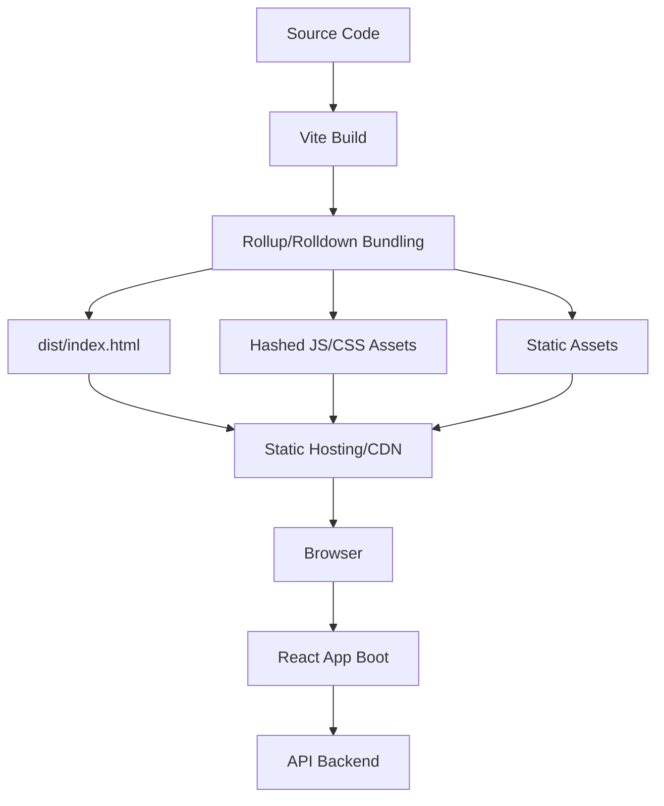
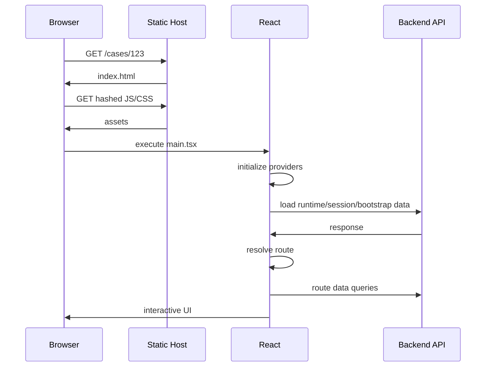
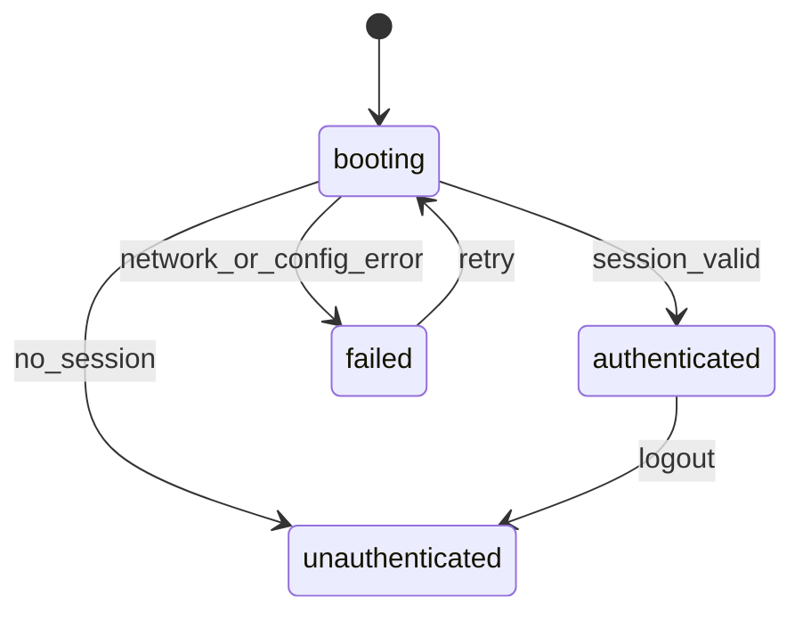
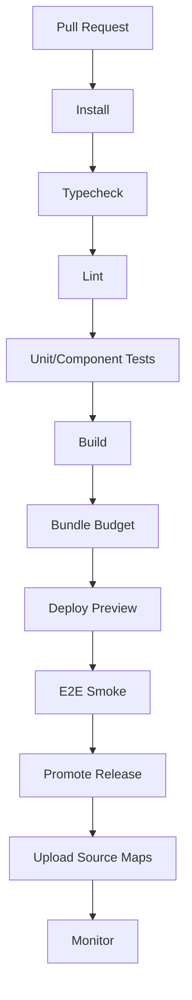

------
title: Learn Frontend React Production Architecture - Part 012
description: Production-grade guide to Vite React SPA architecture, including dev server vs production build, Rollup/Rolldown mental model, environment variables, static deployment, code splitting, assets, monorepo usage, testing, CI/CD, and anti-patterns.
series: learn-frontend-react-production-architecture
seriesTitle: Learn Frontend React Production Architecture
order: 12
partTitle: Vite React SPA Production Model
tags:
- react
- frontend
- vite
- spa
- build
- deployment
- architecture
- production
- series
date: 2026-06-28
---

# Part 012 — Vite React SPA Production Model

## Tujuan Pembelajaran

Part 011 membahas Next.js App Router sebagai model React full-stack/RSC. Part ini membahas sisi lain yang tetap sangat penting: **Vite React SPA production model**.

Vite bukan framework aplikasi seperti Next.js. Vite adalah build tool dan dev tooling modern. Karena itu, Vite React SPA memberi fleksibilitas besar, tetapi juga menuntut Anda membuat sendiri banyak keputusan arsitektur:

- routing,
- data fetching,
- auth bootstrap,
- app shell,
- static deployment,
- runtime config,
- cache headers,
- code splitting,
- error boundaries,
- observability,
- testing,
- CI/CD,
- monorepo boundaries.

Vite membuat development cepat dan production build efisien, tetapi tidak otomatis membuat aplikasi production-grade.

Part ini membahas Vite sebagai **static-delivery React architecture**, terutama untuk internal apps, dashboards, admin consoles, workflow-heavy systems, dan enterprise SPAs.

---

## 1. Vite Mental Model

Vite terdiri dari dua mode utama:

| Mode | Mental Model |
|---|---|
| Development | native ESM dev server, fast transform, HMR |
| Production | bundle optimized static assets for hosting |

Development:

```txt
browser -> Vite dev server -> module transform on demand
```

Production:

```txt
source -> vite build -> dist/index.html + hashed JS/CSS/assets -> static hosting/CDN
```

Vite app tidak punya server runtime by default. Setelah build, output-nya bisa disajikan oleh:

- Nginx,
- CDN,
- object storage static hosting,
- Netlify/Vercel static,
- Kubernetes ingress + static server,
- Java/.NET/Go backend serving static files,
- edge static hosting.

---

## 2. Basic Project Shape

```txt
case-management-ui/
  index.html
  package.json
  vite.config.ts
  tsconfig.json
  src/
    main.tsx
    App.tsx
```

`index.html` adalah entry HTML.

```html
<!doctype html>
<html lang="en">
  <head>
    <meta charset="UTF-8" />
    <meta name="viewport" content="width=device-width, initial-scale=1.0" />
    <title>Case Management</title>
  </head>
  <body>
    <div id="root"></div>
    <script type="module" src="/src/main.tsx"></script>
  </body>
</html>
```

`main.tsx`:

```tsx
import { StrictMode } from "react";
import { createRoot } from "react-dom/client";
import { App } from "./app/App";

createRoot(document.getElementById("root")!).render(
  <StrictMode>
    <App />
  </StrictMode>
);
```

Production build rewrites module references to built assets.

---

## 3. Vite Build Output

Typical output:

```txt
dist/
  index.html
  assets/
    index-C9a2f47a.js
    index-D1b8a2cc.css
    vendor-B812a91f.js
    logo-91a8dd.svg
```

Production invariant:

- `index.html` points to hashed assets.
- hashed assets can be cached long-term.
- `index.html` should not be cached forever.
- browser routing requires fallback to `index.html`.
- deployment should be atomic: HTML and assets from same release.

---

## 4. Diagram: Vite Build and Delivery



---

## 5. Vite Is Not Your Application Architecture

Vite answers:

- how modules are served in dev,
- how assets are bundled in production,
- how env constants are replaced,
- how plugins transform code,
- how static build output is produced.

Vite does not answer by itself:

- how routing works,
- how auth works,
- how server state is cached,
- how forms are validated,
- how permissions are modeled,
- how API errors are normalized,
- how deployment config works,
- how route fallback is configured,
- how observability works,
- how accessibility is enforced.

Those are your architecture responsibilities.

---

## 6. Recommended Production Folder Architecture

```txt
src/
  app/
    App.tsx
    main.tsx
    providers/
      AppProviders.tsx
      QueryProvider.tsx
      AuthProvider.tsx
      ObservabilityProvider.tsx
    router/
      routes.tsx
      guards.tsx
    shell/
      AuthenticatedShell.tsx
      PublicShell.tsx
    config/
      runtimeConfig.ts
  features/
    cases/
      api/
        caseApi.ts
        caseKeys.ts
        caseQueries.ts
      routes/
        CaseListRoute.tsx
        CaseDetailRoute.tsx
      components/
      hooks/
      model/
    reports/
    admin/
  shared/
    ui/
    hooks/
    lib/
    api/
    testing/
```

Principles:

- `app/` owns composition and boot.
- `features/` own domain modules.
- `shared/` contains domain-neutral reusable pieces.
- route components coordinate feature screens.
- UI components do not call raw fetch directly.
- API boundary is explicit.
- testing utilities are centralized.

---

## 7. App Boot Sequence

Vite SPA boot:



Potential bottlenecks:

- JS download,
- JS parse/execute,
- auth bootstrap,
- route module lazy load,
- route data fetch,
- API latency,
- large initial bundle,
- blocking config request.

---

## 8. Static Hosting Fallback

SPA with browser routing needs fallback.

If user opens:

```txt
/cases/CASE-001
```

Static host must return:

```txt
/index.html
```

Not:

```txt
404 file not found
```

But assets should still resolve normally:

```txt
/assets/index-C9a2f47a.js
```

Conceptual rules:

```txt
if path starts with /assets/ -> serve asset
else if file exists -> serve file
else -> serve /index.html
```

Nginx-style concept:

```nginx
location / {
  try_files $uri $uri/ /index.html;
}
```

Do not copy config blindly; adapt to your platform.

---

## 9. Cache Headers

Recommended static caching model:

| Resource | Cache Policy |
|---|---|
| `index.html` | no-cache or very short cache |
| hashed JS/CSS | long cache immutable |
| hashed images/fonts | long cache immutable |
| runtime config file | no-cache/short cache |
| service worker | carefully controlled |
| API response | backend-defined |

Why:

- `index.html` determines which asset hashes are loaded.
- hashed assets are safe to cache because filename changes when content changes.
- caching `index.html` too long can keep users on old release.
- deleting old assets immediately can break users with old HTML.

Deployment invariant:

> Keep old hashed assets available long enough for users who still have older `index.html`.

---

## 10. Environment Variables

Vite exposes env values via `import.meta.env`.

Only variables with configured public prefix, commonly `VITE_`, are exposed to client code.

Example:

```env
VITE_API_BASE_URL=https://api.example.com
VITE_APP_ENV=production
```

Usage:

```ts
const apiBaseUrl = import.meta.env.VITE_API_BASE_URL;
```

Important:

> Values exposed to Vite client bundle are public. Do not put secrets in `VITE_*`.

Bad:

```env
VITE_DATABASE_PASSWORD=secret
VITE_PRIVATE_API_KEY=secret
```

These can end up in client JS.

---

## 11. Build-Time vs Runtime Config

Vite env values are usually replaced at build time.

This means:

```txt
build artifact for staging != build artifact for production
```

if API URLs differ.

Build-time config is simple but creates artifact-per-environment.

Runtime config allows build once, deploy many.

Example `config.json`:

```json
{
  "apiBaseUrl": "https://api.example.com",
  "environment": "production",
  "releaseId": "2026.06.28-001"
}
```

Load before app boot:

```ts
export async function loadRuntimeConfig(): Promise<RuntimeConfig> {
  const response = await fetch("/config.json", { cache: "no-store" });

  if (!response.ok) {
    throw new Error("Failed to load runtime config");
  }

  const json = await response.json();

  return runtimeConfigSchema.parse(json);
}
```

Boot:

```tsx
async function bootstrap() {
  const config = await loadRuntimeConfig();

  createRoot(document.getElementById("root")!).render(
    <App config={config} />
  );
}

bootstrap();
```

Trade-off:

| Approach | Pros | Cons |
|---|---|---|
| Build-time env | simple, tree-shakeable | rebuild per env |
| Runtime `config.json` | build once deploy many | extra request, boot failure path |
| HTML injected config | no extra fetch | server/static injection complexity |
| Backend-served config | centralized | backend dependency at boot |

---

## 12. Type-Safe Config

Never use config as untyped global string bag.

```ts
import { z } from "zod";

const runtimeConfigSchema = z.object({
  apiBaseUrl: z.string().url(),
  environment: z.enum(["local", "dev", "staging", "production"]),
  releaseId: z.string(),
});

export type RuntimeConfig = z.infer<typeof runtimeConfigSchema>;
```

Fail fast:

```tsx
try {
  const config = await loadRuntimeConfig();
  renderApp(config);
} catch (error) {
  renderBootstrapError(error);
}
```

A wrong API base URL should produce a clear bootstrap error, not random failed requests across the app.

---

## 13. Routing in Vite SPA

Vite does not impose routing. Commonly React Router is used.

Route config:

```tsx
export const router = createBrowserRouter([
  {
    element: <AppProviders />,
    errorElement: <RootErrorPage />,
    children: [
      {
        path: "/login",
        element: <LoginRoute />,
      },
      {
        element: <RequireAuth />,
        children: [
          {
            element: <AuthenticatedShell />,
            children: [
              {
                path: "/cases",
                lazy: () => import("@/features/cases/routes/CaseListRoute"),
              },
              {
                path: "/cases/:caseId",
                lazy: () => import("@/features/cases/routes/CaseDetailRoute"),
              },
            ],
          },
        ],
      },
    ],
  },
]);
```

Vite production concern:

- lazy route imports become chunks,
- chunk load failure must be handled,
- browser refresh fallback must serve `index.html`,
- base path must match deployment subdirectory if not hosted at `/`.

---

## 14. Base Path

If app is hosted at:

```txt
https://example.com/case-management/
```

not root, configure base path.

`vite.config.ts`:

```ts
import { defineConfig } from "vite";
import react from "@vitejs/plugin-react";

export default defineConfig({
  base: "/case-management/",
  plugins: [react()],
});
```

Router basename:

```tsx
createBrowserRouter(routes, {
  basename: "/case-management",
});
```

Failure mode:

- assets 404 because base wrong,
- routes mismatch because router basename wrong,
- deep links fail under subdirectory.

---

## 15. Code Splitting

Dynamic import creates split chunks.

```tsx
const ReportsRoute = lazy(() => import("@/features/reports/routes/ReportsRoute"));
```

React Router lazy route:

```tsx
{
  path: "/reports",
  lazy: () => import("@/features/reports/routes/ReportsRoute"),
}
```

Split candidates:

- reports,
- admin,
- charts,
- rich text editor,
- maps,
- PDF viewer,
- workflow modals rarely used,
- heavy validation schemas if not needed initially.

Avoid over-splitting:

- too many tiny chunks,
- waterfall chunk loading,
- confusing fallback,
- duplicate vendor code,
- poor prefetch strategy.

---

## 16. Manual Chunking

Vite uses bundler output. Sometimes you may customize chunks.

Concept:

```ts
export default defineConfig({
  build: {
    rollupOptions: {
      output: {
        manualChunks: {
          react: ["react", "react-dom"],
          charts: ["echarts"],
        },
      },
    },
  },
});
```

Use carefully.

Manual chunks can help:

- isolate large vendor libraries,
- improve cache reuse,
- keep rarely changed deps stable,
- analyze large dependencies.

But it can hurt:

- create chunk waterfall,
- load unused vendor chunk too early,
- make caching assumptions wrong,
- complicate debugging.

Default first. Customize based on bundle analysis.

---

## 17. Bundle Analysis

Add bundle analysis to CI/release process.

Questions:

- What is initial JS gzip/brotli size?
- Which dependencies dominate?
- Are charts/editors in initial bundle?
- Are icons tree-shaken?
- Is date library too large?
- Is design system duplicated?
- Are test/dev utilities in prod bundle?
- Are source maps generated/uploaded securely?

Budget example:

```json
{
  "initialJsGzipKb": 250,
  "initialCssGzipKb": 80,
  "routeChunkGzipKb": 150
}
```

Budget is not universal. Establish based on users, devices, network, and product.

---

## 18. Assets

Vite handles assets referenced from JS/CSS.

```tsx
import logoUrl from "@/assets/logo.svg";

export function HeaderLogo() {
  return ;
}
```

Public assets can be placed in `public/` and served as root paths.

```txt
public/favicon.svg -> /favicon.svg
```

Guidelines:

- import assets when they are part of module graph,
- use `public/` for fixed root assets,
- optimize images before shipping,
- avoid huge uncompressed assets,
- use appropriate formats,
- set dimensions to avoid layout shift,
- lazy-load non-critical images.

---

## 19. CSS Strategy

Vite supports CSS imports, CSS modules, PostCSS, preprocessors, and framework-specific styling approaches.

Production concerns:

- global CSS must be controlled,
- CSS module naming stable enough,
- avoid huge unused CSS,
- design system tokens consistent,
- critical layout CSS loaded early,
- route-level CSS chunk behavior understood,
- CSS order conflicts avoided.

Example:

```tsx
import styles from "./CaseCard.module.css";

export function CaseCard() {
  return <article className={styles.card}>...</article>;
}
```

For enterprise app, prefer explicit design system primitives and tokens over ad hoc CSS in every feature.

---

## 20. API Client Boundary

In Vite SPA, backend integration is client-to-API by default.

Do not scatter raw fetch.

```txt
features/cases/api/
  caseApi.ts
  caseKeys.ts
  caseQueries.ts
```

API client:

```ts
export async function getCaseDetail(caseId: string): Promise<CaseDetail> {
  const response = await http.get(`/cases/${caseId}`);
  return caseDetailSchema.parse(response.data);
}
```

HTTP client:

```ts
export function createHttpClient(config: RuntimeConfig) {
  return {
    async get<T>(path: string): Promise<T> {
      const response = await fetch(`${config.apiBaseUrl}${path}`, {
        credentials: "include",
      });

      if (!response.ok) {
        throw await normalizeHttpError(response);
      }

      return response.json() as Promise<T>;
    },
  };
}
```

Normalize:

- 400 validation,
- 401 unauthenticated,
- 403 forbidden,
- 404 not found,
- 409 conflict,
- 422 domain validation,
- 500 system error,
- network failure,
- timeout/abort.

---

## 21. Server State Layer

Use server-state architecture rather than manual effect fetch everywhere.

Query keys:

```ts
export const caseKeys = {
  all: ["cases"] as const,
  list: (filters: CaseFilters) => [...caseKeys.all, "list", filters] as const,
  detail: (caseId: string) => [...caseKeys.all, "detail", caseId] as const,
};
```

Query hook:

```ts
export function useCaseDetailQuery(caseId: string) {
  return useQuery({
    queryKey: caseKeys.detail(caseId),
    queryFn: () => caseApi.getCaseDetail(caseId),
    staleTime: 30_000,
  });
}
```

Mutation:

```ts
export function useApproveCaseMutation() {
  const queryClient = useQueryClient();

  return useMutation({
    mutationFn: caseApi.approveCase,
    onSuccess: (_, input) => {
      queryClient.invalidateQueries({ queryKey: caseKeys.detail(input.caseId) });
      queryClient.invalidateQueries({ queryKey: caseKeys.all });
    },
  });
}
```

Production rules:

- query keys stable,
- invalidation explicit,
- retry policy domain-aware,
- optimistic update used carefully,
- conflict errors handled,
- cache cleared on logout,
- sensitive cache not persisted blindly.

---

## 22. Auth Bootstrap

Vite SPA starts in browser, so auth bootstrap is client-driven.

State machine:



Implementation:

```tsx
function AuthGate({ children }: { children: React.ReactNode }) {
  const auth = useAuthBootstrap();

  if (auth.status === "booting") {
    return <FullPageSkeleton />;
  }

  if (auth.status === "failed") {
    return <BootstrapError onRetry={auth.retry} />;
  }

  if (auth.status === "unauthenticated") {
    return <Navigate to="/login" replace />;
  }

  return <>{children}</>;
}
```

Do not let every route implement its own auth check.

---

## 23. Security in Vite SPA

Because client code is public, never place secrets in:

- `VITE_*`,
- source code,
- static config,
- localStorage,
- bundled constants.

Security boundaries:

- backend enforces auth/authorization,
- route guard only improves UX,
- API validates all commands,
- CORS/session policy understood,
- CSRF addressed for cookie sessions,
- token storage threat model explicit,
- CSP configured at static host/server,
- dependencies scanned,
- source maps handled intentionally,
- logs do not include PII.

SPA cannot hide business rules from a determined user. It can only provide a safe and usable interface. Authority lives on the server.

---

## 24. Observability

Vite SPA needs explicit observability setup.

Capture:

- global JS errors,
- unhandled promise rejection,
- React error boundary,
- route changes,
- Web Vitals,
- API failure rate,
- mutation failure,
- chunk load failure,
- auth bootstrap failure,
- config load failure,
- user action breadcrumbs,
- release id.

Bootstrap:

```ts
initializeObservability({
  releaseId: config.releaseId,
  environment: config.environment,
});
```

Error boundary:

```tsx
<ErrorBoundary
  fallback={<FatalAppError />}
  onError={(error, info) => {
    reportReactError(error, info);
  }}
>
  <RouterProvider router={router} />
</ErrorBoundary>
```

---

## 25. Chunk Load Failure

Vite lazy chunks can fail after deployment if old assets are removed.

Scenario:

1. user loads `index.html` for release A,
2. release B deploys,
3. release A chunks removed,
4. user navigates to lazy route,
5. browser requests old chunk,
6. 404,
7. app crashes.

Mitigation:

- retain old assets,
- deploy atomically,
- do not aggressively purge hashed assets,
- detect chunk errors,
- show reload prompt,
- monitor error type,
- avoid service worker stale trap.

Example UI:

```tsx
function ReloadRequired() {
  return (
    <div role="alert">
      <h1>Application updated</h1>
      <p>Please reload to continue.</p>
      <button onClick={() => window.location.reload()}>Reload</button>
    </div>
  );
}
```

---

## 26. Service Worker / PWA Caution

Service workers can improve offline and caching but add complexity:

- stale app shell,
- broken update flow,
- cached API mismatch,
- auth/logout cache leakage,
- difficult debugging,
- regulatory data persistence risk,
- offline mutation consistency.

For case management/regulatory apps, do not add offline mutation casually.

Ask:

- what data may be stored offline?
- how is it encrypted/protected?
- how is logout handled?
- how are pending actions audited?
- what if action is submitted twice?
- what if case state changed while offline?
- who owns conflict resolution?

PWA is architecture, not plugin checkbox.

---

## 27. Testing Strategy

Vite integrates well with modern testing tools.

Typical stack:

- TypeScript check,
- ESLint,
- Vitest for unit/component logic,
- Testing Library for component behavior,
- MSW for API mocking,
- Playwright for E2E,
- axe/accessibility checks,
- bundle budget check.

Test boundaries:

```txt
unit: pure model, reducers, formatters
component: UI behavior with Testing Library
integration: route + query + mock API
e2e: login, critical workflows, deployment smoke
contract: API schema/fixtures
visual: design system/regression if needed
```

Do not over-rely on snapshots. Test user-observable behavior.

---

## 28. CI/CD Pipeline



Quality gates:

- no TypeScript errors,
- no lint errors,
- tests pass,
- production build succeeds,
- bundle budget within threshold,
- preview route smoke passes,
- accessibility smoke for critical route,
- source maps uploaded but not publicly browsable if policy requires,
- release id injected,
- config validated.

---

## 29. Monorepo Usage

Vite works well in monorepos, but boundaries matter.

Example:

```txt
repo/
  apps/
    case-management-ui/
      vite.config.ts
  packages/
    ui/
    eslint-config/
    tsconfig/
    domain-model/
    api-client/
```

Rules:

- package exports must be explicit,
- avoid importing source across package boundaries unless configured,
- ensure libraries build or are transpiled correctly,
- avoid duplicate React versions,
- centralize TypeScript path strategy,
- design system package should tree-shake,
- browser/server package boundaries clear,
- CI cache keyed correctly.

Common monorepo failure:

- shared package imports Node-only module,
- Vite client bundle tries to polyfill/fails,
- design system ships all components as one barrel,
- duplicate dependency versions inflate bundle.

---

## 30. Library Mode

Vite can build libraries, useful for design system or shared widgets.

Concept:

```ts
export default defineConfig({
  build: {
    lib: {
      entry: "src/index.ts",
      name: "AcmeUi",
      fileName: "acme-ui",
    },
    rollupOptions: {
      external: ["react", "react-dom"],
    },
  },
});
```

For UI library:

- mark React as peer dependency,
- avoid bundling React,
- ship type declarations,
- support tree shaking,
- separate CSS strategy,
- avoid browser-only side effects at module top-level,
- document server/client compatibility if also used in SSR/RSC app.

---

## 31. Dependency Governance

Frontend dependencies affect:

- bundle size,
- security,
- maintenance,
- license compliance,
- performance,
- browser compatibility.

Checklist before adding dependency:

1. Is it necessary?
2. Can platform API solve it?
3. Bundle cost?
4. Tree-shakeable?
5. ESM support?
6. Maintenance status?
7. Security posture?
8. TypeScript support?
9. Browser compatibility?
10. Can it be lazy-loaded?
11. License acceptable?
12. Does it touch DOM/global state?

For production architecture, dependency approval should be lightweight but intentional.

---

## 32. Anti-Pattern Catalog

### 32.1 Treating Vite as Framework

Expecting Vite to solve routing, data, auth, and architecture.

### 32.2 Secrets in `VITE_*`

Everything exposed to client bundle must be considered public.

### 32.3 Cache `index.html` Forever

Users can be stuck with stale release and missing chunks.

### 32.4 No History Fallback

Deep link refresh returns 404.

### 32.5 Raw Fetch in Components

Inconsistent errors, retries, cache, auth, and invalidation.

### 32.6 No Runtime Config Strategy

Rebuild per environment accidentally or wrong API URL in production.

### 32.7 Giant Initial Bundle

Charts, admin, reports, editor, and map all shipped at app boot.

### 32.8 Over-Splitting

Every tiny component lazy-loaded, causing chunk waterfalls.

### 32.9 No Chunk Failure UX

App crashes after deployment.

### 32.10 No Release Observability

Cannot correlate frontend errors with deployments.

---

## 33. Mini Case Study: Vite SPA for Regulatory Case Management

### Requirements

- static deploy to CDN,
- backend API already exists,
- authenticated app,
- case list/detail,
- reports lazy route,
- admin lazy route,
- runtime config per environment,
- long-running session,
- chunk failure recovery,
- no secrets in client,
- audit actions enforced backend-side.

### Architecture

```txt
src/
  app/
    main.tsx
    bootstrap.tsx
    App.tsx
    config/
      runtimeConfig.ts
    providers/
      AppProviders.tsx
      AuthProvider.tsx
      QueryProvider.tsx
    router/
      routes.tsx
      guards.tsx
    shell/
      AuthenticatedShell.tsx
  features/
    cases/
      api/
      routes/
      components/
      hooks/
      model/
    reports/
      routes/
    admin/
      routes/
  shared/
    ui/
    api/
    observability/
```

### Boot

```tsx
async function main() {
  try {
    const config = await loadRuntimeConfig();

    initializeObservability({
      releaseId: config.releaseId,
      environment: config.environment,
    });

    createRoot(document.getElementById("root")!).render(
      <App config={config} />
    );
  } catch (error) {
    renderBootstrapFailure(error);
  }
}

main();
```

### Deployment Rules

| Area | Decision |
|---|---|
| `index.html` | short/no cache |
| hashed assets | long immutable |
| config | no-store |
| API URL | runtime config |
| reports/admin | lazy chunks |
| old assets | retained |
| deep links | fallback to index |
| source maps | upload to observability, restricted public access |
| release id | included in config/build metadata |

---

## 34. Vite Production Review Checklist

1. Is static fallback configured?
2. Is `index.html` cache policy safe?
3. Are hashed assets immutable?
4. Are old assets retained during rollout?
5. Is runtime/build-time config strategy explicit?
6. Are secrets excluded from client bundle?
7. Is API boundary centralized?
8. Is auth bootstrap centralized?
9. Are route chunks lazy-loaded appropriately?
10. Is bundle budget enforced?
11. Is chunk failure handled?
12. Are source maps handled intentionally?
13. Is release id visible to observability?
14. Are Web Vitals captured?
15. Are CI gates complete?
16. Are monorepo package boundaries clean?
17. Is base path correct for deployment?
18. Are environment variables typed/validated?
19. Are dependency additions governed?
20. Are critical workflows covered by E2E smoke tests?

---

## 35. Deliberate Practice

### Latihan 1 — Static Deploy Drill

Deploy Vite SPA locally behind static server and verify:

- `/` loads,
- `/cases/123` refresh loads app,
- `/assets/...` served directly,
- `index.html` not long cached,
- hashed JS long cached,
- wrong route shows app-level 404,
- missing chunk shows reload prompt.

### Latihan 2 — Runtime Config Refactor

Replace direct `import.meta.env.VITE_API_BASE_URL` usage with:

- `runtimeConfigSchema`,
- `loadRuntimeConfig()`,
- `AppConfigProvider`,
- bootstrap error UI,
- config test.

Compare build-once vs build-per-env trade-off.

### Latihan 3 — Bundle Audit

Run bundle analysis and identify:

- top 10 largest dependencies,
- route chunks,
- duplicate packages,
- admin/reporting leakage into initial bundle,
- icon library behavior,
- chart/editor/map cost.

Create action plan:

| Finding | Action |
|---|---|
| chart lib in initial bundle | lazy-load reports |
| icon package huge | switch import strategy |
| duplicate date lib | dependency consolidation |

---

## 36. Ringkasan

Vite React SPA is a strong production model when:

- the app is mostly authenticated,
- SEO initial HTML is not the main requirement,
- static/CDN deployment is desirable,
- backend API is authoritative,
- client interactivity dominates,
- team wants frontend deploy independence.

But Vite is not an application framework. You must own:

- routing,
- app shell,
- auth bootstrap,
- state/data architecture,
- API boundaries,
- config,
- deployment fallback,
- cache headers,
- observability,
- testing,
- CI/CD,
- security.

A mature Vite SPA is not “simple because static”. It is simple at runtime delivery, but only if architecture boundaries are explicit.

---

## 37. Self-Assessment

Anda siap lanjut jika bisa menjawab:

1. Apa perbedaan Vite dev server dan production build?
2. Mengapa `index.html` tidak boleh long-cache?
3. Mengapa hashed assets boleh long-cache?
4. Apa risiko secrets di `VITE_*`?
5. Kapan runtime config lebih baik daripada build-time env?
6. Mengapa deep link refresh bisa gagal?
7. Bagaimana route-level code splitting bekerja di Vite SPA?
8. Apa risiko chunk load failure setelah deployment?
9. Mengapa raw fetch di component menjadi anti-pattern?
10. Apa checklist deploy Vite SPA production?

---

## 38. Sumber Rujukan

- Vite Docs — Building for Production
- Vite Docs — Env Variables and Modes
- Vite Docs — Static Deploy
- Vite Docs — Shared Options
- Vite Docs — Build Options
- React Docs — Build a React app from Scratch
- React Router Docs — Route Objects and Lazy Routes
- web.dev — Core Web Vitals
