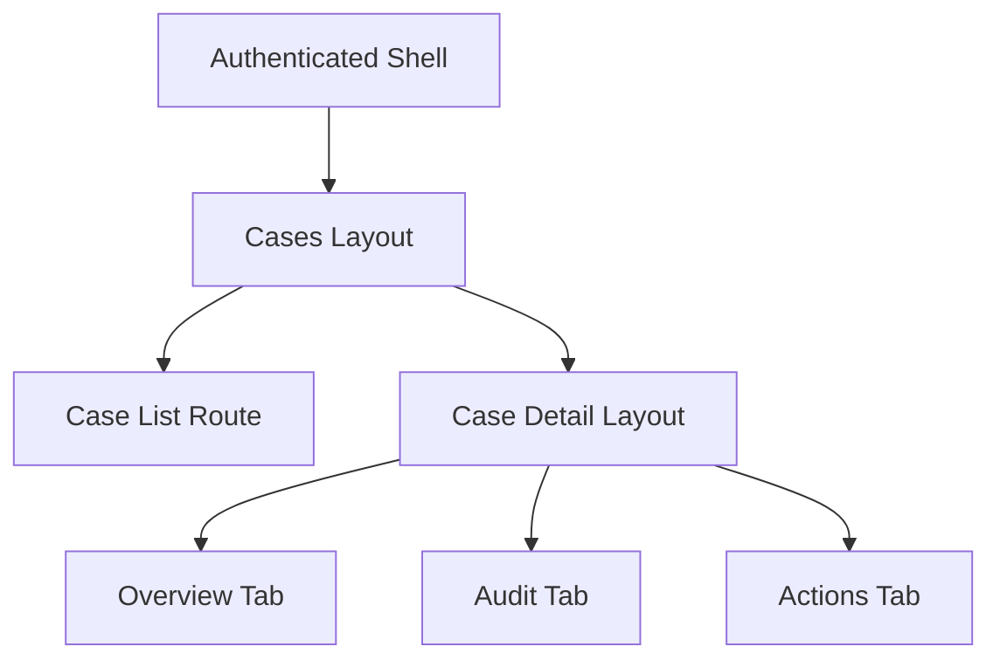
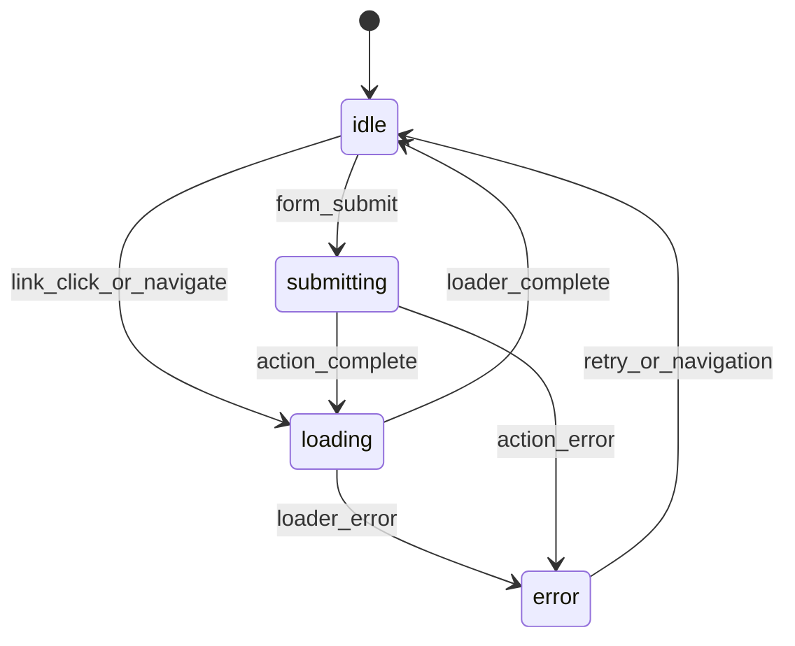
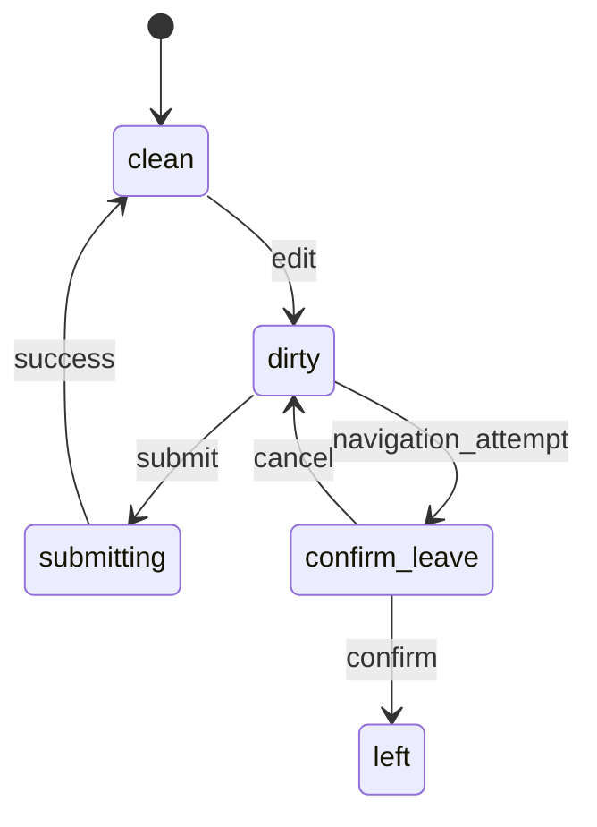

------
title: Learn Frontend React Production Architecture - Part 013
description: Production-grade guide to routing, navigation, and URL state in React applications, including route hierarchy, params, search params, navigation intent, pending UI, route-level errors, protected routes, state machines, and anti-patterns.
series: learn-frontend-react-production-architecture
seriesTitle: Learn Frontend React Production Architecture
order: 13
partTitle: Routing, Navigation, and URL State
tags:
- react
- frontend
- routing
- navigation
- url-state
- react-router
- architecture
- production
- series
date: 2026-06-28
---

# Part 013 — Routing, Navigation, and URL State

## Tujuan Pembelajaran

Routing sering dianggap hanya “mapping URL ke component”.

Di production frontend, routing adalah salah satu boundary arsitektur paling penting karena URL menentukan:

- screen identity,
- navigation history,
- shareability,
- refresh behavior,
- deep linking,
- data loading,
- error boundary,
- layout boundary,
- permission boundary,
- search/filter state,
- browser back/forward behavior,
- observability event,
- user mental model.

Jika routing salah, app akan terasa rapuh:

- refresh deep link 404,
- filter hilang saat reload,
- tombol back tidak sesuai ekspektasi,
- modal tidak bisa dibagikan,
- protected route flicker,
- route data fetch berulang,
- loading global mengganggu,
- navigation loop,
- state workflow tersimpan hanya di memory,
- analytics route event kacau.

Part ini membahas routing sebagai **state architecture**.

---

## 1. Core Mental Model

URL bukan string dekoratif. URL adalah state publik aplikasi.

```txt
/cases?status=UNDER_REVIEW&officer=ayu&page=2
```

URL di atas menyimpan:

- resource: `cases`,
- filter status,
- assigned officer,
- pagination page.

Jika user refresh, share link, buka tab baru, atau pakai back button, state tersebut tetap dapat direkonstruksi.

Rule:

> State yang menentukan “apa yang sedang dilihat user” sebaiknya hidup di URL, bukan hanya memory component.

Tidak semua state harus masuk URL. Tetapi state navigasi utama sebaiknya bisa dipulihkan dari URL.

---

## 2. Taxonomy of Route State

| State | Example | Should Be URL? |
|---|---|---:|
| Resource identity | `/cases/CASE-001` | yes |
| Tab identity | `/cases/CASE-001/audit` or `?tab=audit` | often |
| Search query | `?q=fraud` | yes |
| Filter | `?status=open` | yes |
| Pagination | `?page=2` | yes |
| Sort | `?sort=priority.desc` | yes |
| Modal open | `?dialog=approve` | sometimes |
| Form draft text | local state | no |
| Dropdown open | local state | no |
| Hover/focus | local state | no |
| Optimistic pending state | mutation state | no |
| Wizard step | route or URL | often |
| Scroll position | browser/router | usually no manual |
| Auth session | cookie/provider | no |
| Feature flag | provider/server | no |

Heuristic:

- If user expects reload/share/back-forward to preserve it, URL candidate.
- If state is ephemeral interaction, local state.
- If state is server truth, server-state cache.
- If state is workflow position, evaluate route vs URL vs backend state.

---

## 3. Path Params vs Search Params

Path params identify hierarchical resource.

```txt
/cases/CASE-001
/officers/OFC-22
/reports/annual/2026
```

Search params refine view.

```txt
/cases?status=OPEN&page=2
/reports?from=2026-01-01&to=2026-06-30
```

Bad:

```txt
/cases/status/open/page/2/sort/priority
```

Maybe valid for some APIs, but for UI navigation it often becomes rigid.

Better:

```txt
/cases?status=open&page=2&sort=priority.desc
```

Decision:

| Use Path | Use Search Params |
|---|---|
| identity | filtering |
| hierarchy | sorting |
| canonical resource | pagination |
| required route data | optional view state |
| page type | display mode |
| authorization boundary | search query |

---

## 4. Route Hierarchy

Route hierarchy should mirror layout and data boundary.

Example:

```txt
/cases
/cases/:caseId
/cases/:caseId/audit
/cases/:caseId/actions
```

Possible UI:



Route hierarchy helps:

- persistent layout,
- nested error boundary,
- nested loading,
- breadcrumb generation,
- permission boundary,
- data ownership.

Flat routing can work, but often loses architectural clarity.

---

## 5. Route as Ownership Boundary

A route module should coordinate:

- params parsing,
- query/search param parsing,
- data loading hook or loader,
- permission guard,
- page-level loading/error,
- feature view composition,
- route metadata,
- analytics page identity.

It should not contain all rendering details.

Example route component:

```tsx
export function CaseDetailRoute() {
  const { caseId } = useParams();
  const parsedCaseId = parseCaseId(caseId);

  const query = useCaseDetailQuery(parsedCaseId);

  if (query.isLoading) {
    return <CaseDetailSkeleton />;
  }

  if (query.isError) {
    return <CaseDetailError error={query.error} />;
  }

  return <CaseDetailPage caseDetail={query.data} />;
}
```

Feature view:

```tsx
function CaseDetailPage({ caseDetail }: { caseDetail: CaseDetail }) {
  return (
    <CaseDetailLayout>
      <CaseSummary caseDetail={caseDetail} />
      <CaseTimeline caseId={caseDetail.id} />
      <CaseActions caseDetail={caseDetail} />
    </CaseDetailLayout>
  );
}
```

Route coordinates. Feature components render.

---

## 6. URL Parsing and Validation

Search params are strings. Treat them as untrusted input.

```txt
/cases?page=hello&status=INVALID
```

Do not assume valid.

```ts
const caseStatusValues = ["OPEN", "UNDER_REVIEW", "CLOSED"] as const;

type CaseStatus = (typeof caseStatusValues)[number];

function parseCaseFilters(searchParams: URLSearchParams): CaseFilters {
  const status = searchParams.get("status");
  const pageRaw = searchParams.get("page");

  return {
    status: isCaseStatus(status) ? status : undefined,
    page: parsePositiveInteger(pageRaw) ?? 1,
    query: searchParams.get("q") ?? "",
  };
}
```

Better with schema library:

```ts
const caseFiltersSchema = z.object({
  status: z.enum(["OPEN", "UNDER_REVIEW", "CLOSED"]).optional(),
  page: z.coerce.number().int().positive().catch(1),
  q: z.string().catch(""),
});
```

Principles:

- URL input must be parsed.
- Invalid URL should degrade gracefully.
- Defaults should be explicit.
- Canonicalization can redirect/replace if needed.
- Do not let invalid search params crash the page.

---

## 7. URL Serialization

Parsing is half. Serialization must also be centralized.

Bad:

```tsx
setSearchParams({ status, page: String(page), q });
```

scattered in many components with subtle differences.

Better:

```ts
export function serializeCaseFilters(filters: CaseFilters): URLSearchParams {
  const params = new URLSearchParams();

  if (filters.status) {
    params.set("status", filters.status);
  }

  if (filters.query) {
    params.set("q", filters.query);
  }

  if (filters.page && filters.page > 1) {
    params.set("page", String(filters.page));
  }

  return params;
}
```

Benefits:

- stable URLs,
- no duplicate defaults,
- easier tests,
- easier canonicalization,
- easier backend/query key mapping.

---

## 8. URL State Hook

A clean hook:

```tsx
function useCaseFiltersUrlState() {
  const [searchParams, setSearchParams] = useSearchParams();

  const filters = useMemo(() => {
    return parseCaseFilters(searchParams);
  }, [searchParams]);

  const setFilters = useCallback(
    (nextFilters: CaseFilters, options?: { replace?: boolean }) => {
      setSearchParams(serializeCaseFilters(nextFilters), {
        replace: options?.replace,
      });
    },
    [setSearchParams]
  );

  return [filters, setFilters] as const;
}
```

Usage:

```tsx
const [filters, setFilters] = useCaseFiltersUrlState();

const query = useCaseListQuery(filters);
```

Make URL state typed and intentional. Do not parse raw `location.search` everywhere.

---

## 9. Draft State vs Committed URL State

For search forms, distinguish draft from committed filter.

Example:

- user types in input,
- URL should not necessarily update every keystroke,
- Apply button commits to URL,
- Reset clears URL.

```tsx
function CaseFiltersForm({
  filters,
  onApply,
}: {
  filters: CaseFilters;
  onApply: (filters: CaseFilters) => void;
}) {
  const [draft, setDraft] = useState(filters);

  useEffect(() => {
    setDraft(filters);
  }, [filters]);

  return (
    <form
      onSubmit={(event) => {
        event.preventDefault();
        onApply({ ...draft, page: 1 });
      }}
    >
      <input
        value={draft.query}
        onChange={(event) =>
          setDraft((current) => ({
            ...current,
            query: event.target.value,
          }))
        }
      />
      <button type="submit">Apply</button>
    </form>
  );
}
```

URL owns committed state. Local component owns draft state.

This prevents excessive navigation/fetch while typing.

---

## 10. Debounced URL Updates

Sometimes search-as-you-type is desired.

```tsx
function useDebouncedCaseQueryParam(query: string) {
  const [filters, setFilters] = useCaseFiltersUrlState();

  useEffect(() => {
    const timerId = window.setTimeout(() => {
      setFilters({
        ...filters,
        query,
        page: 1,
      }, { replace: true });
    }, 300);

    return () => window.clearTimeout(timerId);
  }, [query, filters, setFilters]);
}
```

This naive version has risk because `filters` object may change identity and includes query itself.

Better design:

```tsx
function useDebouncedUrlCommit<T>({
  value,
  delayMs,
  commit,
}: {
  value: T;
  delayMs: number;
  commit: (value: T) => void;
}) {
  useEffect(() => {
    const timerId = window.setTimeout(() => {
      commit(value);
    }, delayMs);

    return () => window.clearTimeout(timerId);
  }, [value, delayMs, commit]);
}
```

Then make commit stable and precise.

Consider:

- use `replace` for each keystroke to avoid back stack pollution,
- use `push` for explicit Apply,
- reset page to 1 on filter change,
- avoid navigation loop,
- avoid loader revalidation on unrelated param if router supports control.

---

## 11. Push vs Replace

When updating URL:

- `push` creates browser history entry,
- `replace` updates current entry.

Use `push` when user made meaningful navigation:

- opened case detail,
- changed tab intentionally,
- clicked Apply filters,
- went to next page.

Use `replace` when URL is adjusted without meaningful history:

- debounce typing,
- canonicalize invalid params,
- update tracking param,
- normalize defaults,
- intermediate wizard internal state.

Example:

```tsx
setSearchParams(nextParams, { replace: true });
```

Bad behavior:

- typing “fraud” creates 5 history entries: `f`, `fr`, `fra`, `frau`, `fraud`.
- user presses Back and has to step through every keystroke.

---

## 12. Navigation Intent

Not all navigation is equal.

| Intent | Example | UX |
|---|---|---|
| Resource navigation | open case detail | route change |
| Refinement | apply filter | update URL/search |
| Drilldown | case -> audit event | nested route |
| Modal route | open approval dialog | optional URL state |
| Wizard progression | step 1 -> step 2 | route or state machine |
| Redirect | unauthenticated -> login | replace |
| Canonicalization | invalid param -> default | replace |
| Background refresh | refetch current data | no navigation |

Model intent before writing `navigate()`.

Anti-pattern:

```tsx
useEffect(() => {
  navigate("/cases");
}, [someState]);
```

Navigation triggered from vague state changes often creates loops.

Better:

```tsx
function handleCancel() {
  navigate("/cases");
}
```

Event intent is explicit.

---

## 13. Navigation State Machine

Navigation has phases.



In data routers, pending UI can derive from navigation state.

Production UI should distinguish:

- global navigation pending,
- route-level loading,
- form submitting,
- mutation pending,
- background refetching.

One global spinner for all states is poor UX.

---

## 14. Pending UI

When route loaders/actions are involved, navigation can be pending before next screen appears.

Use pending state to show:

- top progress bar,
- disabled nav link,
- route skeleton,
- optimistic item state,
- form submitting state.

Example conceptual:

```tsx
function GlobalNavigationIndicator() {
  const navigation = useNavigation();
  const isNavigating = Boolean(navigation.location);

  if (!isNavigating) {
    return null;
  }

  return <TopProgressBar />;
}
```

But do not show global loader for every tiny search param update. Match pending UI to user intent.

---

## 15. Route-Level Error Handling

Errors should align with route boundary.

Case list error:

```tsx
function CaseListError({ error }: { error: unknown }) {
  return (
    <section role="alert">
      <h1>Failed to load cases</h1>
      <p>Try refreshing or adjusting filters.</p>
    </section>
  );
}
```

Case detail not found:

```tsx
function CaseNotFound() {
  return (
    <section>
      <h1>Case not found</h1>
      <p>The case may not exist or you may not have access.</p>
    </section>
  );
}
```

Forbidden:

```tsx
function ForbiddenCase() {
  return (
    <section>
      <h1>Access denied</h1>
      <p>You do not have permission to view this case.</p>
    </section>
  );
}
```

Do not collapse every route problem into generic “Something went wrong.”

---

## 16. Protected Routes

Protected route pattern:

```tsx
function RequireAuth() {
  const auth = useAuth();

  if (auth.status === "checking") {
    return <FullPageSkeleton />;
  }

  if (auth.status === "unauthenticated") {
    return <Navigate to="/login" replace />;
  }

  return <Outlet />;
}
```

Permission route:

```tsx
function RequirePermission({ permission }: { permission: Permission }) {
  const permissions = usePermissions();

  if (!permissions.has(permission)) {
    return <ForbiddenPage />;
  }

  return <Outlet />;
}
```

Security invariant:

> Frontend protected routes prevent confusing UX. Backend authorization prevents unauthorized access.

Never assume route guard protects data if API still returns it.

---

## 17. Login Redirect Flow

When user hits protected URL:

```txt
/cases/CASE-001
```

and is unauthenticated, redirect to login while preserving intent:

```txt
/login?returnTo=%2Fcases%2FCASE-001
```

After login, navigate back.

Rules:

- validate `returnTo` to prevent open redirect,
- only allow same-origin relative path,
- use `replace` after successful login,
- handle expired return target,
- avoid including sensitive query data if not needed.

Validation:

```ts
function sanitizeReturnTo(value: string | null): string {
  if (!value || !value.startsWith("/")) {
    return "/";
  }

  if (value.startsWith("//")) {
    return "/";
  }

  return value;
}
```

---

## 18. Modal Routes

Sometimes modal state should be URL-addressable.

Example:

```txt
/cases/CASE-001?dialog=approve
```

Benefits:

- shareable,
- refresh preserves modal,
- back closes modal,
- workflow state visible.

Risks:

- modal may require parent data,
- invalid dialog param,
- permission changes,
- accessibility/focus management,
- back behavior can surprise.

Use modal route for:

- important workflow dialog,
- detail preview,
- image/document viewer,
- action confirmation where linkability matters.

Do not put every dropdown/popover in URL.

---

## 19. Tabs: Route or Query Param?

Options:

```txt
/cases/CASE-001/overview
/cases/CASE-001/audit
/cases/CASE-001/documents
```

or:

```txt
/cases/CASE-001?tab=audit
```

Use nested route when:

- tab has distinct data loading,
- tab should have own URL identity,
- tab is deep-link target,
- tab has error/loading boundary,
- tab may have subroutes,
- tab is major content section.

Use query param when:

- tab is display preference,
- content is small,
- tab does not represent route hierarchy,
- parent route owns data.

For case detail, audit/documents/actions often deserve nested route if they are large and independently loadable.

---

## 20. Breadcrumbs

Breadcrumbs should be derived from route hierarchy and route data, not hardcoded in every page.

Example:

```txt
Cases > CASE-001 > Audit
```

Data needed:

- static route label: `Cases`,
- dynamic case reference: `CASE-001`,
- active child label: `Audit`.

Pattern:

```ts
type Breadcrumb = {
  label: string;
  href?: string;
};

function caseDetailBreadcrumb(caseDetail: CaseDetail): Breadcrumb[] {
  return [
    { label: "Cases", href: "/cases" },
    { label: caseDetail.referenceNo, href: `/cases/${caseDetail.id}` },
  ];
}
```

In frameworks/data routers, route handles/metadata can help centralize this.

---

## 21. Scroll Restoration

SPA navigation can break browser scroll expectations.

Consider:

- navigating to new page should scroll top,
- back should restore previous scroll,
- search param refinement may preserve scroll,
- tab change may scroll top or preserve depending UX,
- modal route should preserve background scroll.

React Router and frameworks often provide scroll restoration helpers. Use them intentionally.

Anti-pattern:

```tsx
useEffect(() => {
  window.scrollTo(0, 0);
}, [location.pathname, location.search]);
```

This scrolls top on every filter change and can frustrate users.

---

## 22. Navigation Blocking

For unsaved forms, navigation blocking may be needed.

State machine:



Guidelines:

- only block when there is real unsaved data,
- avoid blocking harmless search param changes if possible,
- handle browser refresh/close separately,
- make confirmation text specific,
- do not block after successful submit,
- don't create trap with broken confirmation.

For regulatory forms, losing draft can have operational cost. But blocking too aggressively also damages workflow.

---

## 23. Route Analytics

Route analytics should track meaningful navigation, not every low-level state update.

Track:

- page viewed,
- route transition duration,
- route error,
- unauthorized/forbidden route,
- search/filter apply if meaningful,
- action flow open/submit/success/failure.

Avoid:

- sending page view for every debounce keystroke,
- duplicate route events on hydration,
- logging sensitive query params,
- mixing route path with PII identifiers unless policy allows.

Use route patterns:

```txt
/cases/:caseId
```

instead of raw:

```txt
/cases/CASE-001-SENSITIVE
```

if identifiers are sensitive.

---

## 24. Route Data and Revalidation

In data routers, loaders can re-run when params/search params change or after actions.

This is powerful but dangerous if search params change frequently.

Example issue:

- typing search updates `?q=...`,
- each update revalidates loader,
- network spam and UI jitter.

Solutions:

- draft local state + Apply,
- debounce with replace,
- `shouldRevalidate` where appropriate,
- server-state cache with stable query keys,
- split param that affects loader from param that doesn't,
- avoid putting ephemeral state in search params.

---

## 25. Route Key and Component Remount

Sometimes route param change should reset local state.

Example:

```txt
/cases/CASE-001
/cases/CASE-002
```

If same component instance persists, draft/dialog state may remain.

Pattern:

```tsx
function CaseDetailRouteWrapper() {
  const { caseId } = useParams();

  return <CaseDetailRoute key={caseId} caseId={caseId!} />;
}
```

Use carefully. Key-based remount resets all state under component.

Alternative: reset specific state when identity changes.

```tsx
useEffect(() => {
  closeDialog();
  resetDraft();
}, [caseId]);
```

Choose based on ownership.

---

## 26. URL Canonicalization

Invalid or noisy URL:

```txt
/cases?page=0&status=INVALID&q=&pageSize=25
```

Canonical:

```txt
/cases?page=1
```

Or omit defaults:

```txt
/cases
```

Canonicalization can:

- improve shareability,
- prevent duplicate analytics,
- simplify cache keys,
- reduce invalid state.

But avoid aggressive replace that fights user input.

Example:

```tsx
useEffect(() => {
  const canonical = serializeCaseFilters(filters).toString();

  if (canonical !== searchParams.toString()) {
    setSearchParams(canonical, { replace: true });
  }
}, [filters, searchParams, setSearchParams]);
```

Be careful: this can loop if serialization order/defaults unstable.

---

## 27. URL and Query Key Alignment

If server-state query uses filters, ensure URL-parsed filters and query keys align.

```ts
const filters = parseCaseFilters(searchParams);

const query = useQuery({
  queryKey: caseKeys.list(filters),
  queryFn: () => getCases(filters),
});
```

If parse returns new object every render, query library usually hashes key structurally, but still make sure serialization is stable.

Normalize:

```ts
type CaseFilters = {
  status?: CaseStatus;
  query: string;
  page: number;
  sort: "priority.desc" | "createdAt.desc";
};
```

Do not let `undefined`, `null`, empty string, and missing param mean four subtly different states unless domain requires it.

---

## 28. Workflow Routing

Workflow-heavy apps often have state progression.

Example:

```txt
/cases/CASE-001/review
/cases/CASE-001/approve
/cases/CASE-001/approve/confirmation
```

Question:

- Is approve a route?
- Is it a modal?
- Is it local dialog?
- Is it backend workflow state?

Decision depends on:

| Factor | Route | Modal URL | Local State |
|---|---:|---:|---:|
| user may share/reload | strong | medium | weak |
| long form | strong | medium | weak |
| small confirmation | weak | strong/medium | strong |
| needs separate permission | strong | medium | medium |
| audit step | strong | strong | medium |
| ephemeral UI | weak | weak | strong |

For regulatory decisions, explicit workflow route can improve defensibility if step is substantial.

---

## 29. Common Anti-Patterns

### 29.1 Navigable State Only in Memory

```tsx
const [status, setStatus] = useState("OPEN");
```

Case list filter disappears on refresh/share.

### 29.2 Everything in URL

Dropdown open, hover row, draft typing, tooltip state in query params. Noisy and unusable.

### 29.3 Navigate in Effect Without Clear Intent

```tsx
useEffect(() => {
  if (saved) navigate("/cases");
}, [saved]);
```

Sometimes okay, but often better in command success handler.

### 29.4 Back Button Hostility

Typing creates dozens of history entries or modals trap back behavior.

### 29.5 No Search Param Validation

Invalid URL crashes page.

### 29.6 Route Guard as Security Boundary

Frontend guard hides screen but API still returns data.

### 29.7 Hardcoded Breadcrumbs

Every page hand-builds breadcrumbs differently.

### 29.8 Route-Level God Component

Route component fetches, renders, mutates, manages forms, modals, tables, layout, permissions, and analytics all at once.

### 29.9 Search Params Trigger Massive Revalidation

Every UI preference in URL causes loader/query refetch.

### 29.10 Non-Canonical URLs

Same state represented by many URLs, confusing cache, analytics, and support.

---

## 30. Mini Case Study: Case List Route

### Requirements

- filter by status/officer/query,
- sort by priority/created date,
- pagination,
- shareable URL,
- Apply button for filter form,
- table row opens case detail,
- back returns to same filter/page,
- invalid params fall back gracefully,
- query cache aligned with URL.

### Route

```tsx
function CaseListRoute() {
  const [filters, setFilters] = useCaseFiltersUrlState();
  const query = useCaseListQuery(filters);

  if (query.isLoading) {
    return <CaseListSkeleton />;
  }

  if (query.isError) {
    return <CaseListError error={query.error} />;
  }

  return (
    <CaseListPage
      filters={filters}
      cases={query.data.items}
      total={query.data.total}
      onApplyFilters={(nextFilters) =>
        setFilters({ ...nextFilters, page: 1 })
      }
      onPageChange={(page) =>
        setFilters({ ...filters, page })
      }
    />
  );
}
```

### URL Examples

```txt
/cases
/cases?status=UNDER_REVIEW
/cases?status=UNDER_REVIEW&officer=ayu&page=2
/cases?q=tax&sort=createdAt.desc
```

### Back Behavior

- Apply filter: push.
- Pagination click: push.
- Debounced query typing: replace or draft local.
- Open case detail: push.
- Back from detail: returns to same filter URL.

---

## 31. Mini Case Study: Case Detail Tabs

Option A: nested routes.

```txt
/cases/CASE-001
/cases/CASE-001/audit
/cases/CASE-001/documents
```

Good if each tab has distinct data and loading boundary.

Option B: query param.

```txt
/cases/CASE-001?tab=audit
```

Good if tabs are light presentation mode.

For regulatory case detail, audit and documents often deserve route identity because:

- data can be large,
- permission can differ,
- loading/error can differ,
- support can link directly,
- audit route may be critical for review.

---

## 32. Architecture Checklist

For every route, answer:

1. What resource or screen does this URL identify?
2. Which state belongs in path params?
3. Which state belongs in search params?
4. Which state is local only?
5. How are params parsed/validated?
6. Is there a canonical URL?
7. What is loading boundary?
8. What is error boundary?
9. What is permission boundary?
10. What data loads for this route?
11. What changes should revalidate data?
12. What should Back do?
13. What should refresh preserve?
14. Is route shareable?
15. Are analytics safe and meaningful?
16. Does route expose sensitive identifiers?
17. Are breadcrumbs derived consistently?
18. Are modal/tab states modeled intentionally?
19. Is navigation blocked for dirty forms?
20. Does backend enforce authorization?

---

## 33. Deliberate Practice

### Latihan 1 — URL State Audit

Ambil satu page list/table.

Buat tabel:

| State | Current Owner | Should Owner Be | Reason |
|---|---|---|---|
| search query | component state | URL/draft split | shareable and reloadable |
| selected row | component | component | ephemeral |
| status filter | component | URL | navigable |
| page number | component | URL | back/refresh |
| column width | localStorage | localStorage | preference |

Refactor minimal satu state navigable ke URL.

### Latihan 2 — Route Decision Record

Untuk route `/cases/:caseId/audit`, tulis:

- why route, not tab state?
- params schema,
- permission required,
- loading fallback,
- error fallback,
- breadcrumb,
- analytics event,
- data query key,
- refresh/back behavior.

### Latihan 3 — Navigation Failure Drill

Simulasikan:

1. invalid search param,
2. unauthenticated deep link,
3. forbidden case,
4. deleted case,
5. slow route data,
6. dirty form navigation,
7. chunk load failure on route change.

Tulis expected UI dan expected log/event.

---

## 34. Ringkasan

Routing adalah state architecture.

URL yang baik membuat aplikasi:

- shareable,
- reloadable,
- debuggable,
- accessible,
- predictable with Back/Forward,
- easier to test,
- easier to support.

Production routing membutuhkan keputusan eksplisit:

- path vs search param,
- URL state vs local state,
- push vs replace,
- route vs modal vs tab,
- protected route vs backend authorization,
- pending UI,
- error boundary,
- canonicalization,
- analytics safety.

Jangan perlakukan routing sebagai wiring setelah UI selesai. Routing adalah bagian dari desain domain frontend.

---

## 35. Self-Assessment

Anda siap lanjut jika bisa menjawab:

1. Mengapa URL adalah state?
2. State apa yang sebaiknya masuk URL?
3. Apa beda path params dan search params?
4. Kapan memakai push vs replace?
5. Kapan tab menjadi nested route?
6. Mengapa frontend route guard bukan security boundary final?
7. Bagaimana mencegah invalid search params crash?
8. Bagaimana membedakan draft filter dan committed URL filter?
9. Apa risiko navigation in effect?
10. Bagaimana mendesain route untuk workflow-heavy UI?

---

## 36. Sumber Rujukan

- React Router Docs — Routing
- React Router Docs — Route Object
- React Router Docs — useSearchParams
- React Router Docs — useNavigate
- React Router Docs — Pending UI
- React Router Docs — State Management
- React Docs — Preserving and Resetting State
