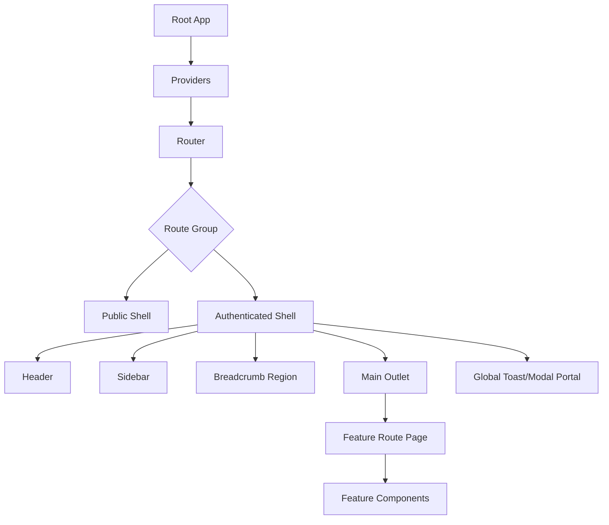
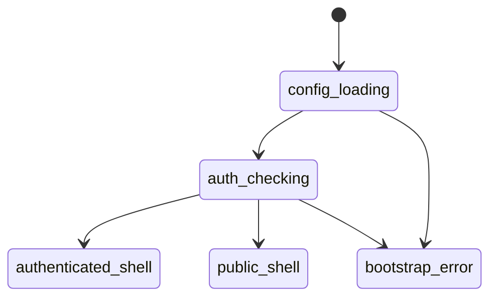

------
title: Learn Frontend React Production Architecture - Part 014
description: Production-grade guide to frontend application shell and layout systems in React, including authenticated/public shells, layout persistence, sidebar/header ownership, breadcrumbs, permission-aware navigation, responsive shell, slots, and anti-patterns.
series: learn-frontend-react-production-architecture
seriesTitle: Learn Frontend React Production Architecture
order: 14
partTitle: Frontend Application Shell and Layout Systems
tags:
- react
- frontend
- app-shell
- layout
- navigation
- architecture
- production
- series
date: 2026-06-28
---

# Part 014 — Frontend Application Shell and Layout Systems

## Tujuan Pembelajaran

Application shell adalah struktur stabil yang membungkus route content dan menyediakan pengalaman aplikasi yang konsisten.

Dalam app production, shell biasanya mencakup:

- root layout,
- public vs authenticated layout,
- header,
- sidebar,
- navigation,
- breadcrumbs,
- footer jika ada,
- notification center,
- user menu,
- global search/command palette,
- toast layer,
- modal portal,
- skip links,
- responsive layout,
- permission-aware menu,
- environment/release indicator,
- global error/loading presentation.

Kesalahan umum: setiap page membuat layout sendiri.

Akibatnya:

- header berbeda-beda,
- sidebar state tidak konsisten,
- permission menu tersebar,
- breadcrumbs hardcoded,
- responsive behavior pecah,
- route content terlalu tahu global layout,
- accessibility landmark kacau,
- page sulit diuji,
- redesign shell menjadi sangat mahal.

Part ini membahas app shell sebagai **ownership boundary**.

---

## 1. Mental Model

App shell menjawab:

> “Apa struktur aplikasi yang tetap ada saat user berpindah antar screen?”

Route content menjawab:

> “Apa isi screen spesifik untuk route ini?”

Contoh:

```tsx
function AuthenticatedShell() {
  return (
    <div className="shell">
      <Sidebar />
      <div className="shell-main">
        <Header />
        <Breadcrumbs />
        <main id="main-content">
          <Outlet />
        </main>
      </div>
      <ToastViewport />
    </div>
  );
}
```

Route page hanya mengisi outlet.

```tsx
function CaseListRoute() {
  return <CaseListPage />;
}
```

Route page tidak membuat header/sidebar sendiri.

---

## 2. Diagram: Shell Ownership Model



Ownership:

- Shell owns global structure.
- Route owns screen content.
- Feature owns domain UI.
- Shared UI owns primitives.
- Providers own cross-cutting context.
- Backend owns authority/security.

---

## 3. Shell Types

Most apps need more than one shell.

| Shell | Example Routes | Characteristics |
|---|---|---|
| Public shell | `/login`, `/forgot-password` | simple, unauthenticated |
| Marketing shell | `/`, `/pricing`, `/docs` | SEO/content oriented |
| Authenticated app shell | `/cases`, `/reports` | sidebar/header/user menu |
| Admin shell | `/admin/*` | separate nav/permission |
| Embedded shell | `/embed/*` | minimal chrome |
| Print/export shell | `/cases/:id/print` | print-friendly |
| Error shell | fatal app error | recovery-focused |

Do not force all screens into one shell.

---

## 4. Public vs Authenticated Shell

Public shell:

```tsx
function PublicShell() {
  return (
    <div className="public-shell">
      <main>
        <Outlet />
      </main>
    </div>
  );
}
```

Authenticated shell:

```tsx
function AuthenticatedShell() {
  return (
    <div className="authenticated-shell">
      <Sidebar />
      <div className="content-column">
        <Header />
        <main id="main-content" tabIndex={-1}>
          <Outlet />
        </main>
      </div>
    </div>
  );
}
```

Route group:

```tsx
<Route element={<PublicShell />}>
  <Route path="/login" element={<LoginPage />} />
</Route>

<Route element={<RequireAuth />}>
  <Route element={<AuthenticatedShell />}>
    <Route path="/cases" element={<CaseListRoute />} />
  </Route>
</Route>
```

This prevents login page from accidentally carrying app sidebar.

---

## 5. Layout Persistence

Persistent layout means shell does not unmount during child route transitions.

Benefits:

- sidebar open state retained,
- header user menu retained,
- command palette retained,
- WebSocket/global subscription not restarted,
- scroll region controlled,
- navigation context stable.

But persistence can be bad if state should reset.

Example:

- modal in shell should close on route change?
- command palette search should reset?
- notification panel should persist?
- sidebar collapse should persist?

Design per state.

---

## 6. Shell State Taxonomy

| Shell State | Owner | Persistence |
|---|---|---|
| Sidebar collapsed | shell/localStorage | across sessions maybe |
| Mobile nav open | shell local state | per session/page |
| User menu open | shell local state | ephemeral |
| Command palette open | shell/global UI state | ephemeral, close on route |
| Active nav item | derived from route | no state |
| Breadcrumbs | derived from route/data | no local state |
| Notification count | server-state/query/subscription | refreshed |
| Theme | preference provider | persistent |
| Locale | provider/router/server | persistent |
| Environment banner | config | static per release |

Do not store derived route state manually.

---

## 7. Header Ownership

Header commonly contains:

- app title/context,
- global search,
- user menu,
- notification icon,
- environment badge,
- help link,
- command palette trigger.

Header should not know feature internals.

Bad:

```tsx
function Header() {
  const cases = useCaseListQuery();
  const reports = useReportsQuery();
  // feature-specific logic everywhere
}
```

Better:

- header reads global user/session,
- header reads notification summary via dedicated query,
- feature-specific page title comes from route metadata or context,
- global search uses search service boundary.

Header should be stable and lightweight.

---

## 8. Sidebar Ownership

Sidebar owns navigation structure, not domain data rendering.

Navigation item model:

```ts
type NavigationItem = {
  id: string;
  label: string;
  href: string;
  icon?: React.ComponentType;
  requiredPermission?: Permission;
  children?: NavigationItem[];
};
```

Filter by permission:

```ts
function filterNavigationByPermission(
  items: NavigationItem[],
  can: (permission: Permission) => boolean
): NavigationItem[] {
  return items
    .filter((item) => !item.requiredPermission || can(item.requiredPermission))
    .map((item) => ({
      ...item,
      children: item.children
        ? filterNavigationByPermission(item.children, can)
        : undefined,
    }));
}
```

Important:

> Permission-aware navigation improves UX. It is not security enforcement.

Backend still enforces API/action access.

---

## 9. Active Navigation

Active item should be derived from current location.

```tsx
function SidebarItem({ item }: { item: NavigationItem }) {
  const location = useLocation();
  const active = location.pathname === item.href ||
    location.pathname.startsWith(`${item.href}/`);

  return (
    <NavLink
      to={item.href}
      aria-current={active ? "page" : undefined}
    >
      {item.label}
    </NavLink>
  );
}
```

Be careful with prefix matching:

```txt
/cases
/cases-archive
```

Naive startsWith can mark wrong item.

Use route matching utilities when available.

---

## 10. Breadcrumb System

Breadcrumbs should not be hardcoded per page.

Model:

```ts
type Breadcrumb = {
  label: string;
  href?: string;
};
```

Static:

```ts
const casesBreadcrumb = { label: "Cases", href: "/cases" };
```

Dynamic:

```ts
function caseDetailBreadcrumb(caseDetail: CaseDetail): Breadcrumb[] {
  return [
    { label: "Cases", href: "/cases" },
    { label: caseDetail.referenceNo, href: `/cases/${caseDetail.id}` },
  ];
}
```

App shell can render breadcrumbs provided by route context.

Pattern:

```tsx
function BreadcrumbRegion({ breadcrumbs }: { breadcrumbs: Breadcrumb[] }) {
  return (
    <nav aria-label="Breadcrumb">
      <ol>
        {breadcrumbs.map((item, index) => (
          <li key={index}>
            {item.href ? <Link to={item.href}>{item.label}</Link> : item.label}
          </li>
        ))}
      </ol>
    </nav>
  );
}
```

Accessibility:

- use `nav aria-label="Breadcrumb"`,
- use ordered list,
- current item should not be misleading link if already current page.

---

## 11. Page Header vs Global Header

Separate:

- global header: app-wide controls,
- page header: page-specific title/actions.

Page header belongs to route content, not global shell, unless shell has a slot/context for it.

Example:

```tsx
function CaseDetailPageHeader({ caseDetail }: { caseDetail: CaseDetail }) {
  return (
    <header>
      <h1>{caseDetail.referenceNo}</h1>
      <CaseStatusBadge status={caseDetail.status} />
      <CasePrimaryActions caseDetail={caseDetail} />
    </header>
  );
}
```

Global shell should not import `CasePrimaryActions`.

If page header must visually appear in shell region, use slot pattern.

---

## 12. Layout Slots

Slot-based shell lets routes provide page-specific regions.

Concept:

```tsx
type ShellSlots = {
  pageTitle?: ReactNode;
  pageActions?: ReactNode;
  breadcrumbs?: Breadcrumb[];
};
```

A route can set slots through route metadata, context, or layout composition.

Composition pattern:

```tsx
function PageLayout({
  title,
  actions,
  children,
}: {
  title: React.ReactNode;
  actions?: React.ReactNode;
  children: React.ReactNode;
}) {
  return (
    <>
      <div className="page-header">
        <div>{title}</div>
        <div>{actions}</div>
      </div>
      {children}
    </>
  );
}
```

This often beats over-engineering global shell slots. Keep route-level page layout explicit when possible.

---

## 13. Responsive Shell

Responsive behavior:

- desktop sidebar visible/collapsible,
- tablet sidebar compact,
- mobile sidebar as drawer,
- header adapts,
- main content scrolls correctly,
- touch targets large enough,
- keyboard/focus behavior works.

State:

```tsx
function useSidebarState() {
  const [collapsed, setCollapsed] = usePersistentState(
    "sidebar.collapsed",
    false
  );

  const [mobileOpen, setMobileOpen] = useState(false);

  useEffect(() => {
    setMobileOpen(false);
  }, [location.pathname]);

  return {
    collapsed,
    setCollapsed,
    mobileOpen,
    setMobileOpen,
  };
}
```

Do not persist mobile drawer open across route changes. Do persist desktop collapsed preference if useful.

---

## 14. Main Content and Scroll Containers

Shell layout must decide scroll ownership.

Option A: body scrolls.

```css
body {
  min-height: 100vh;
}
```

Option B: app shell fixed, main scrolls.

```css
.shell {
  height: 100vh;
  display: grid;
  grid-template-columns: auto 1fr;
}

.main-scroll {
  overflow: auto;
}
```

Main-scroll layout gives app-like behavior but introduces complexity:

- scroll restoration,
- focus management,
- sticky header,
- modals,
- mobile viewport units,
- nested scroll traps.

Choose intentionally.

---

## 15. Accessibility Landmarks

Shell should provide semantic landmarks:

```tsx
<a href="#main-content" className="skip-link">
  Skip to main content
</a>

<header>...</header>

<nav aria-label="Primary navigation">...</nav>

<main id="main-content" tabIndex={-1}>
  <Outlet />
</main>
```

Rules:

- one primary `main`,
- navigation labeled,
- skip link available,
- route change focus managed,
- modal portals preserve focus,
- active nav uses `aria-current`,
- notification/toast announcements appropriate,
- keyboard access for sidebar/menu.

---

## 16. Route Change Focus Management

In SPA, route change does not reload document. Screen reader and keyboard users need focus handling.

Pattern:

```tsx
function RouteFocusManager() {
  const location = useLocation();
  const mainRef = useRef<HTMLElement | null>(null);

  useEffect(() => {
    mainRef.current?.focus();
  }, [location.pathname]);

  return <main id="main-content" ref={mainRef} tabIndex={-1} />;
}
```

Better integrated shell:

```tsx
function ShellMain({ children }: { children: React.ReactNode }) {
  const location = useLocation();
  const ref = useRef<HTMLElement | null>(null);

  useEffect(() => {
    ref.current?.focus();
  }, [location.pathname]);

  return (
    <main id="main-content" ref={ref} tabIndex={-1}>
      {children}
    </main>
  );
}
```

Be careful not to steal focus during minor search param changes unless desired.

---

## 17. Toast and Global Feedback Layer

Toast layer belongs near shell/root.

```tsx
function AppChrome() {
  return (
    <>
      <Outlet />
      <ToastViewport />
    </>
  );
}
```

Guidelines:

- toast for transient feedback,
- inline error for actionable form/field issues,
- modal for blocking confirmation,
- banner for persistent system status,
- do not show toast for every background refetch,
- avoid sensitive data in toast text,
- make toast accessible.

For workflow actions:

- success toast after command accepted,
- inline conflict error if action fails due to stale state,
- permission denied as explicit error, not generic toast only.

---

## 18. Global Modal/Portal Strategy

Modals often need portal root to avoid stacking context issues.

```html
<div id="root"></div>
<div id="modal-root"></div>
```

Portal layer:

```tsx
function ModalPortal({ children }: { children: React.ReactNode }) {
  const node = document.getElementById("modal-root");

  if (!node) {
    return null;
  }

  return createPortal(children, node);
}
```

Shell responsibilities:

- provide portal root,
- manage z-index scale,
- ensure focus trap,
- ensure escape key behavior,
- prevent background scroll,
- restore focus on close,
- avoid nested modal chaos.

---

## 19. Command Palette

Command palette is app-shell-level because it spans routes.

It may expose:

- navigate to case,
- open reports,
- search users,
- trigger global action,
- recent cases.

Architecture:

```txt
app/shell/command-palette/
  CommandPaletteProvider.tsx
  CommandPaletteDialog.tsx
  commandRegistry.ts
```

Feature modules can register commands carefully, but avoid runtime global mutation chaos.

Command items must respect permissions.

---

## 20. Notification Center

Notification count might be visible in header.

Data ownership:

- notification summary query in shell,
- notification list lazy when panel opens,
- realtime subscription maybe shell-level,
- unread count invalidation after mark read.

Do not fetch large notification list on every page render if only badge is needed.

```tsx
function NotificationButton() {
  const summary = useNotificationSummaryQuery();

  return (
    <button aria-label={`Notifications: ${summary.unreadCount} unread`}>
      <BellIcon />
      {summary.unreadCount > 0 && <Badge>{summary.unreadCount}</Badge>}
    </button>
  );
}
```

---

## 21. Environment and Release Indicators

Internal enterprise apps often need:

- environment banner: DEV/STAGING/UAT,
- release id,
- build time,
- backend version compatibility,
- feature flag debug view.

In production, show only what is useful and safe.

Example:

```tsx
function EnvironmentBanner() {
  const config = useRuntimeConfig();

  if (config.environment === "production") {
    return null;
  }

  return (
    <div role="status">
      {config.environment.toUpperCase()} — {config.releaseId}
    </div>
  );
}
```

This helps avoid user/tester confusion.

---

## 22. Permission-Aware Navigation

Navigation item visibility:

```ts
const navigation: NavigationItem[] = [
  {
    id: "cases",
    label: "Cases",
    href: "/cases",
    requiredPermission: "case.view",
  },
  {
    id: "reports",
    label: "Reports",
    href: "/reports",
    requiredPermission: "reports.view",
  },
  {
    id: "admin",
    label: "Admin",
    href: "/admin",
    requiredPermission: "admin.access",
  },
];
```

Filter:

```tsx
const visibleNavigation = useMemo(() => {
  return filterNavigationByPermission(navigation, permissions.can);
}, [permissions]);
```

But route must still enforce:

```tsx
<Route element={<RequirePermission permission="reports.view" />}>
  <Route path="/reports" element={<ReportsRoute />} />
</Route>
```

And backend must still enforce API access.

---

## 23. Sidebar Navigation and Feature Ownership

Who defines nav item?

Option A: central app nav registry.

```ts
const navigation = [
  casesNavItem,
  reportsNavItem,
  adminNavItem,
];
```

Option B: features export nav metadata.

```ts
// features/cases/navigation.ts
export const casesNavigationItem = {
  id: "cases",
  label: "Cases",
  href: "/cases",
  requiredPermission: "case.view",
};
```

Central registry imports feature metadata.

Avoid dynamic hidden magic where features mutate nav registry at runtime during render.

---

## 24. Layout System and Design Tokens

Shell layout should use design system tokens:

- spacing,
- color,
- z-index,
- breakpoints,
- typography,
- elevation,
- border radius.

Example token concept:

```css
:root {
  --shell-sidebar-width: 280px;
  --shell-sidebar-collapsed-width: 72px;
  --shell-header-height: 56px;
  --z-index-header: 100;
  --z-index-sidebar: 110;
  --z-index-modal: 1000;
}
```

Avoid hardcoded magic numbers across pages.

---

## 25. Z-Index Governance

Without governance:

```css
.modal { z-index: 999999; }
.header { z-index: 9999; }
.tooltip { z-index: 99999; }
```

Chaos.

Define scale:

| Layer | Token |
|---|---|
| base | 0 |
| sticky content | 10 |
| header | 100 |
| sidebar | 110 |
| dropdown | 200 |
| overlay | 500 |
| modal | 1000 |
| toast | 1100 |
| command palette | 1200 |

Use tokens, not arbitrary numbers.

---

## 26. Shell Loading States

Shell itself may need loading:

- auth bootstrap,
- permission map,
- runtime config,
- feature flags,
- user profile.

Avoid showing authenticated shell with empty or wrong user info.

Bootstrap states:



Shell should be rendered only when required global context is ready.

---

## 27. Shell Error States

Global shell error examples:

- runtime config cannot load,
- auth bootstrap fails,
- app version incompatible,
- critical provider fails,
- feature flag SDK unavailable.

Use full-page bootstrap error:

```tsx
function BootstrapError({ onRetry }: { onRetry: () => void }) {
  return (
    <main role="alert">
      <h1>Unable to start application</h1>
      <p>Check your connection and try again.</p>
      <button onClick={onRetry}>Retry</button>
    </main>
  );
}
```

Do not show half-initialized shell if auth/config is unknown.

---

## 28. Shell and Realtime Connections

Some realtime connections are app-wide:

- notifications,
- session expiry,
- global announcements,
- feature flag updates.

Others are feature-specific:

- case timeline events,
- document collaboration,
- report generation status.

App shell should not subscribe to every case event. Keep scope aligned.

| Realtime Data | Owner |
|---|---|
| Notification count | shell/global |
| Session expiry | auth provider |
| Case timeline | case detail route |
| Report export progress | reports feature |
| Presence in document editor | editor feature |

---

## 29. Shell and Micro-Frontend Considerations

If multiple teams own features, shell becomes integration contract.

Shell contract may define:

- navigation item API,
- route registration,
- permission model,
- design tokens,
- telemetry contract,
- error boundary requirements,
- bundle budget,
- accessibility requirements.

Even without micro-frontends, a large monorepo benefits from shell governance.

Avoid:

- features modifying shell DOM directly,
- feature-specific CSS overriding shell internals,
- duplicate sidebars,
- inconsistent route metadata.

---

## 30. Anti-Pattern Catalog

### 30.1 Every Page Owns the Shell

Page imports `Header`, `Sidebar`, `Breadcrumbs` independently.

Result: duplication and inconsistency.

### 30.2 Shell Imports Every Feature Deeply

Header/sidebar directly fetches and renders feature internals.

Result: global bundle bloat and coupling.

### 30.3 Navigation Hardcoded Without Permission Model

Users see links they cannot access or do not see links but can still hit route.

### 30.4 Breadcrumbs as Strings in JSX

Inconsistent and impossible to govern.

### 30.5 Active Nav Stored in State

Active route should derive from URL, not separate state.

### 30.6 Mobile Sidebar State Persisted Forever

User opens mobile drawer, navigates, drawer stays open unexpectedly.

### 30.7 Missing Skip Link and Landmarks

Keyboard/screen reader navigation suffers.

### 30.8 Z-Index Arms Race

Random z-index values across app.

### 30.9 Toast for All Errors

Form/domain errors should often be inline and actionable.

### 30.10 Shell Does Auth, Permission, Data, Feature Rendering, and Workflow

God shell becomes impossible to maintain.

---

## 31. Mini Case Study: Regulatory Case Management Shell

### Requirements

- authenticated app,
- officer/supervisor/auditor roles,
- sidebar nav filtered by permission,
- case search command palette,
- notification count,
- environment banner for non-prod,
- breadcrumbs,
- responsive layout,
- route change focus,
- logout clears sensitive cache.

### Structure

```txt
src/app/shell/
  AuthenticatedShell.tsx
  PublicShell.tsx
  Sidebar.tsx
  Header.tsx
  BreadcrumbRegion.tsx
  Navigation.ts
  EnvironmentBanner.tsx
  RouteFocusMain.tsx
  ToastViewport.tsx
  CommandPalette/
```

### Shell

```tsx
function AuthenticatedShell() {
  const navigation = useVisibleNavigation();
  const breadcrumbs = useCurrentBreadcrumbs();

  return (
    <div className="shell">
      <SkipLink targetId="main-content" />
      <EnvironmentBanner />

      <Sidebar navigation={navigation} />

      <div className="shell-content">
        <Header />
        <BreadcrumbRegion breadcrumbs={breadcrumbs} />
        <RouteFocusMain>
          <Outlet />
        </RouteFocusMain>
      </div>

      <ToastViewport />
      <CommandPalette />
    </div>
  );
}
```

### Permission-Aware Navigation

```ts
const navigation: NavigationItem[] = [
  {
    id: "cases",
    label: "Cases",
    href: "/cases",
    requiredPermission: "case.view",
  },
  {
    id: "reports",
    label: "Reports",
    href: "/reports",
    requiredPermission: "reports.view",
  },
  {
    id: "admin",
    label: "Administration",
    href: "/admin",
    requiredPermission: "admin.access",
  },
];
```

### Key Decisions

| Decision | Reason |
|---|---|
| Sidebar in shell | persistent global nav |
| Breadcrumbs route-derived | consistency |
| Case actions in page header | domain-specific |
| Notification summary in header | global status |
| Case timeline subscription in feature | route-specific realtime |
| Permission-filtered nav | UX |
| Backend authz still required | security |
| Skip link/focus main | accessibility |
| Release/environment banner | operational clarity |

---

## 32. Layout Review Checklist

Before approving shell/layout code:

1. Does route content avoid owning global shell?
2. Are public/authenticated shells separated?
3. Is active nav derived from URL?
4. Is navigation permission-aware?
5. Are permissions also enforced by route/backend?
6. Are breadcrumbs centrally modeled?
7. Does shell avoid importing heavy feature internals?
8. Is responsive sidebar behavior specified?
9. Is route change focus handled?
10. Are skip links and landmarks present?
11. Is z-index scale governed?
12. Are global toasts/modals centralized?
13. Are shell states classified by persistence?
14. Are app-wide realtime connections scoped correctly?
15. Is bootstrap loading/error handled?
16. Is environment/release info available if needed?
17. Does logout clear sensitive client cache?
18. Are shell components tested?
19. Does shell meet accessibility expectations?
20. Can a new feature add navigation without editing many files?

---

## 33. Deliberate Practice

### Latihan 1 — Shell Ownership Audit

Ambil app existing dan cari:

| Concern | Current Location | Correct Owner |
|---|---|---|
| header | every page | authenticated shell |
| breadcrumbs | page JSX | route metadata/breadcrumb service |
| sidebar open state | global store | shell/persistent preference |
| active nav | local state | URL-derived |
| notification count | header fetch | shell query |
| case action buttons | header | page header/feature |

Refactor satu concern ke owner yang benar.

### Latihan 2 — Navigation Registry

Buat typed navigation registry:

- `id`,
- `label`,
- `href`,
- `requiredPermission`,
- `icon`,
- `children`.

Tambahkan filter permission dan tests:

- user officer sees cases,
- supervisor sees reports,
- auditor lacks admin,
- direct route still protected.

### Latihan 3 — Accessibility Shell Test

Test manual:

1. Tab from top of page.
2. Skip link appears.
3. Skip link moves focus to main content.
4. Sidebar nav has labels.
5. Active nav has `aria-current`.
6. Route change moves focus appropriately.
7. Mobile drawer traps focus when open.
8. Escape closes drawer/modal.
9. Screen reader announces page title/breadcrumb.

---

## 34. Ringkasan

Application shell adalah boundary global UI.

Shell yang sehat:

- memisahkan public/authenticated layout,
- menyediakan header/sidebar/breadcrumb/main landmark,
- menjaga layout persistent,
- mengelola global UI seperti toast/modal/command palette,
- memfilter navigation berdasarkan permission,
- menjaga responsive behavior,
- menangani accessibility/focus,
- tidak mengambil alih feature logic,
- tidak menjadi God component.

Page yang sehat:

- mengisi route content,
- memiliki page-specific header/actions,
- mengelola feature data dan UI,
- tidak menduplikasi global shell.

App shell bukan kosmetik. Ia adalah struktur operasional yang menentukan maintainability, accessibility, security UX, dan kemampuan scale codebase lintas fitur/tim.

---

## 35. Self-Assessment

Anda siap lanjut jika bisa menjawab:

1. Apa beda app shell dan route page?
2. Mengapa page tidak boleh membuat header/sidebar sendiri?
3. Apa saja state yang dimiliki shell?
4. Mengapa active nav harus derived dari URL?
5. Bagaimana permission-aware navigation tetap berbeda dari authorization?
6. Bagaimana breadcrumbs sebaiknya dimodelkan?
7. Mengapa responsive shell butuh state taxonomy?
8. Apa accessibility requirement minimal untuk shell?
9. Apa risiko shell mengimpor feature internals?
10. Bagaimana mendesain shell untuk regulatory case management app?

---

## 36. Sumber Rujukan

- React Docs — Sharing State Between Components
- React Docs — Preserving and Resetting State
- React Router Docs — Layout Routes and Outlet
- React Router Docs — NavLink
- React Router Docs — Scroll Restoration
- WAI-ARIA Authoring Practices — Breadcrumb Pattern
- WCAG — Keyboard and Focus Guidance
