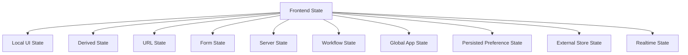
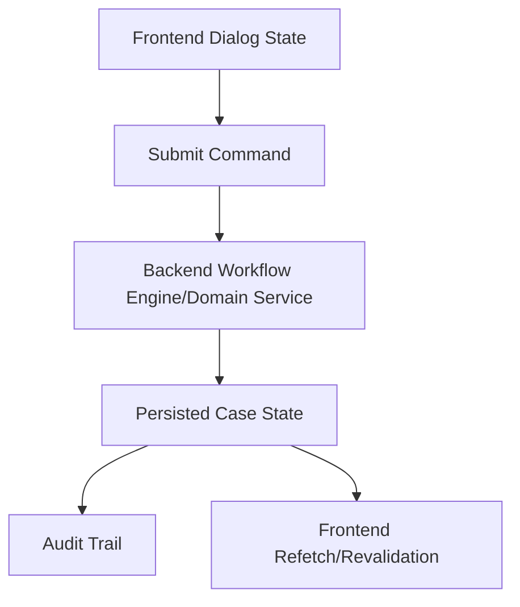
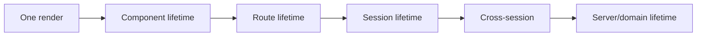
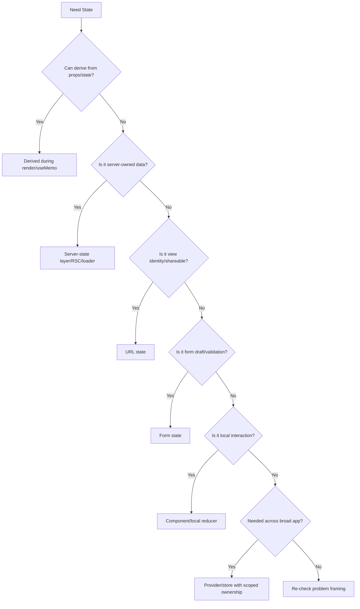

------
title: Learn Frontend React Production Architecture - Part 015
description: Production-grade guide to state taxonomy and ownership in React applications, covering local UI state, derived state, server state, form state, URL state, workflow state, persisted state, cache state, and anti-patterns.
series: learn-frontend-react-production-architecture
seriesTitle: Learn Frontend React Production Architecture
order: 15
partTitle: State Taxonomy and Ownership
tags:
- react
- frontend
- state-management
- architecture
- ownership
- production
- series
date: 2026-06-28
---

# Part 015 — State Taxonomy and Ownership

## Tujuan Pembelajaran

Sebagian besar masalah state management di React bukan karena “kurang library”.

Masalah utamanya adalah **salah mengklasifikasikan state**.

Jika semua state dianggap sama, engineer cenderung melakukan salah satu dari dua ekstrem:

1. semua state ditaruh di component lokal,
2. semua state ditaruh di global store.

Keduanya salah untuk production architecture.

State yang berbeda punya:

- owner berbeda,
- lifetime berbeda,
- source of truth berbeda,
- invalidation berbeda,
- persistence berbeda,
- synchronization berbeda,
- security risk berbeda,
- testing strategy berbeda.

Part ini membahas state taxonomy dan ownership agar Anda bisa menjawab:

> State ini sebenarnya milik siapa, hidup berapa lama, dan harus disinkronkan dengan apa?

---

## 1. Core Mental Model

React UI adalah fungsi dari state.

Tetapi “state” bukan satu kategori tunggal.



Setiap kategori punya aturan ownership berbeda.

---

## 2. State Ownership Questions

Sebelum memilih `useState`, `useReducer`, Context, Redux, Zustand, TanStack Query, URL params, localStorage, atau backend, jawab pertanyaan ini:

1. Siapa source of truth?
2. Siapa yang boleh mengubah state?
3. Berapa lama state hidup?
4. Apakah state harus survive refresh?
5. Apakah state harus shareable via URL?
6. Apakah state berasal dari server?
7. Apakah state adalah draft user input?
8. Apakah state bisa dihitung dari state lain?
9. Apakah state perlu audit trail?
10. Apakah stale state berbahaya?
11. Apakah state user-specific?
12. Apakah state sensitive?
13. Apakah state harus sinkron antar tab?
14. Apakah state butuh optimistic update?
15. Apakah state punya transition yang valid/invalid?
16. Apakah state mempengaruhi authorization?
17. Apakah state harus bisa direplay/debug?
18. Apakah state update frequency tinggi?

Jawaban ini lebih penting daripada nama library.

---

## 3. State Category Overview

| Category | Example | Typical Owner |
|---|---|---|
| Local UI state | dropdown open, selected tab local | component/subtree |
| Derived state | filtered list, full name | render calculation/memo |
| URL state | filters, page, sort, tab | router/URL |
| Form state | input draft, touched, dirty | form component/form library |
| Server state | case detail, user profile | server-state cache/server |
| Workflow state | case lifecycle, approval stage | backend/domain, sometimes local state machine for UI |
| Global app state | theme, auth session metadata | provider/store |
| Persisted preference | sidebar collapsed, theme | localStorage/cookie/provider |
| External store state | feature flags, browser media query | subscription hook/store |
| Realtime state | WebSocket event stream | feature-specific subscription + cache |
| Optimistic state | pending row update | mutation layer/local overlay |
| Ephemeral state | hover, focus, transient animation | component/browser |

---

## 4. Local UI State

Local UI state belongs close to the component that uses it.

Examples:

```tsx
const [isOpen, setOpen] = useState(false);
const [selectedTab, setSelectedTab] = useState("summary");
const [hoveredRowId, setHoveredRowId] = useState<string | null>(null);
```

Good candidates:

- dropdown open/closed,
- modal open/closed,
- local tab if not URL-worthy,
- selected row inside table,
- temporary expanded section,
- hover/focus-driven UI,
- local display toggle,
- draft state for small interaction.

Rule:

> If only one component/subtree cares, keep it local.

Do not globalize local UI state just because “many pages have dropdowns”. The pattern can be shared; the state should remain local.

---

## 5. Derived State

Derived state can be computed from existing props/state.

Example:

```tsx
const fullName = `${firstName} ${lastName}`;
```

Do not store it separately:

```tsx
const [fullName, setFullName] = useState("");

useEffect(() => {
  setFullName(`${firstName} ${lastName}`);
}, [firstName, lastName]);
```

Derived state should usually be:

- plain calculation during render,
- `useMemo` if expensive,
- selector if derived from store,
- server-side computed if data is huge or security-sensitive.

Examples:

```tsx
const visibleCases = useMemo(() => {
  return cases.filter((item) => item.status === status);
}, [cases, status]);
```

Derived state anti-patterns create:

- duplicate source of truth,
- stale UI,
- extra render,
- unnecessary effects,
- dependency bugs.

---

## 6. URL State

URL state represents view identity.

Examples:

```txt
/cases?status=UNDER_REVIEW&page=2&sort=priority.desc
/cases/CASE-001/audit
```

Belongs to:

- router,
- path params,
- search params,
- route metadata,
- browser history.

Use URL for:

- search query,
- filters,
- pagination,
- sort,
- major tab,
- resource identity,
- wizard step if shareable,
- modal if it represents navigation.

Do not use URL for:

- hover,
- dropdown open,
- unsaved keystrokes unless deliberate,
- sensitive token,
- hidden authorization data,
- large objects.

URL state must be parsed and validated.

---

## 7. Form State

Form state is not just “a bunch of inputs”.

It includes:

- values,
- dirty state,
- touched state,
- validation errors,
- async validation status,
- submit status,
- field-level visibility,
- dependent fields,
- optimistic response,
- server validation errors,
- reset behavior.

Example:

```tsx
type ApprovalFormState = {
  reason: string;
  attachmentIds: string[];
  acknowledgePolicy: boolean;
};
```

Form state is usually owned by:

- form component,
- form library,
- route if multi-step,
- URL/backend if workflow step must persist.

Do not put form state in global store unless:

- form spans unrelated route boundaries,
- draft must survive navigation,
- collaboration/offline requirements exist,
- state must be restored intentionally.

Even then, be explicit about persistence and cleanup.

---

## 8. Server State

Server state is data owned by backend.

Examples:

- case detail,
- user profile,
- permission map,
- audit timeline,
- report list,
- notification count,
- reference data,
- search results.

Properties:

- can be stale,
- can be refetched,
- can be invalidated,
- can be cached,
- can fail due to network,
- may be shared across components,
- may require optimistic update,
- may require background refresh,
- source of truth is not React.

Server state should usually be managed by:

- framework data layer,
- React Server Components,
- route loaders,
- TanStack Query,
- RTK Query,
- normalized GraphQL cache,
- custom cache only if necessary.

Anti-pattern:

```tsx
const [caseDetail, setCaseDetail] = useState(null);

useEffect(() => {
  fetch(`/api/cases/${caseId}`).then(...);
}, [caseId]);
```

This is okay for trivial demos, but fragile as production pattern.

---

## 9. Workflow State

Workflow state represents business lifecycle.

Example:

```txt
DRAFT -> SUBMITTED -> UNDER_REVIEW -> APPROVED -> CLOSED
```

For regulatory/case management systems, workflow state often must be owned by backend/domain model because it needs:

- authorization,
- audit trail,
- concurrency control,
- event history,
- escalation,
- compliance reporting,
- cross-entity consistency,
- legal defensibility.

Frontend may mirror workflow state for UI display, but it must not become authority.

Frontend can own **local interaction state** around workflow:

- approve dialog open,
- pending submit,
- local confirmation step,
- field draft,
- optimistic disabled button,
- conflict display.

Backend owns actual lifecycle.



---

## 10. Global App State

Global app state is data genuinely needed across broad app areas.

Examples:

- authenticated user summary,
- locale,
- theme,
- feature flags,
- app config,
- global notification summary,
- command palette open state,
- sidebar preference.

But global does not mean “put in one global object”.

Different global states have different update frequency and sensitivity.

| State | Suggested Owner |
|---|---|
| Theme | Theme provider + persistence |
| Locale | Locale provider/router/server |
| Current user | Auth provider/server-state |
| Permissions | Permission provider derived from session |
| Sidebar collapsed | Shell state + localStorage |
| Feature flags | Feature flag provider/external store |
| Notification count | server-state query/subscription |
| Command palette | shell UI provider |

Avoid monolithic `AppContext`.

---

## 11. Persisted Preference State

Preference state should survive reload/session.

Examples:

- theme,
- sidebar collapsed,
- table density,
- column visibility,
- selected locale,
- recent workspace,
- dashboard layout preference.

Storage options:

| Storage | Use Case |
|---|---|
| localStorage | non-sensitive preference |
| sessionStorage | tab-scoped temporary preference |
| cookie | server-readable preference, theme/locale |
| backend profile | cross-device preference |
| IndexedDB | large structured offline data |
| URL | shareable view state |

Do not store sensitive workflow data casually in localStorage.

For preference:

```tsx
function usePersistentState<T>(
  key: string,
  initialValue: T
): [T, (value: T) => void] {
  const [value, setValue] = useState<T>(() => {
    const raw = window.localStorage.getItem(key);
    return raw ? JSON.parse(raw) : initialValue;
  });

  const update = useCallback((next: T) => {
    setValue(next);
    window.localStorage.setItem(key, JSON.stringify(next));
  }, [key]);

  return [value, update];
}
```

Production version needs validation, SSR safety, error handling, and storage unavailability handling.

---

## 12. External Store State

Some state lives outside React:

- media query,
- online status,
- feature flag SDK,
- auth SDK,
- collaborative editor,
- browser storage,
- WebSocket manager,
- Redux/Zustand store.

React needs a subscription bridge to avoid stale reads.

Example:

```tsx
function useOnlineStatus() {
  const [isOnline, setOnline] = useState(navigator.onLine);

  useEffect(() => {
    const online = () => setOnline(true);
    const offline = () => setOnline(false);

    window.addEventListener("online", online);
    window.addEventListener("offline", offline);

    return () => {
      window.removeEventListener("online", online);
      window.removeEventListener("offline", offline);
    };
  }, []);

  return isOnline;
}
```

For formal external stores, use a store subscription model rather than reading mutable singleton directly during render.

---

## 13. Realtime State

Realtime state arrives as events.

Examples:

- case status updated,
- new audit event,
- notification received,
- report export completed,
- officer presence changed.

Realtime state is tricky because events may be:

- duplicated,
- delayed,
- out of order,
- missing,
- replayed,
- unauthorized after permission change,
- stale relative to server snapshot.

Architecture pattern:

1. load initial snapshot from server,
2. subscribe to events,
3. dedupe by event id/version,
4. apply event or invalidate query,
5. reconcile with server after mutation/reconnect,
6. handle gap detection.

Do not assume WebSocket events are perfect state.

---

## 14. Optimistic State

Optimistic state shows expected result before server confirms.

Example:

```tsx
function useApproveCaseMutation() {
  return useMutation({
    mutationFn: approveCase,
    onMutate: async (input) => {
      await queryClient.cancelQueries({ queryKey: caseKeys.detail(input.caseId) });

      const previous = queryClient.getQueryData(caseKeys.detail(input.caseId));

      queryClient.setQueryData(caseKeys.detail(input.caseId), (current) => ({
        ...current,
        status: "APPROVED",
      }));

      return { previous };
    },
    onError: (_error, input, context) => {
      queryClient.setQueryData(caseKeys.detail(input.caseId), context?.previous);
    },
    onSettled: (_data, _error, input) => {
      queryClient.invalidateQueries({ queryKey: caseKeys.detail(input.caseId) });
    },
  });
}
```

Optimistic update is not always appropriate.

Avoid for:

- legally significant actions without clear rollback,
- financial transactions,
- destructive commands,
- complex workflow transitions,
- actions with high conflict probability.

Use pending UI instead if correctness/defensibility matters more than perceived speed.

---

## 15. Ephemeral State

Ephemeral state is short-lived interaction state.

Examples:

- hover,
- focus,
- active press,
- transient animation,
- drag preview,
- tooltip open,
- popover position.

Often best handled by:

- CSS pseudo-classes,
- browser focus,
- component-local state,
- accessible primitive library.

Do not globalize ephemeral state.

---

## 16. State Lifetime

State lifetime is key.



Examples:

| Lifetime | Example |
|---|---|
| one render | derived value |
| component lifetime | dropdown open |
| route lifetime | selected row in table |
| session lifetime | auth session, query cache |
| cross-session | theme preference |
| server/domain lifetime | case status |

Mismatch creates bugs.

Example:

- case status stored in localStorage = wrong lifetime.
- dropdown open stored in Redux = too long lifetime.
- filter only component state = too short if shareable.
- form draft discarded on route change = maybe wrong if long form.

---

## 17. State Ownership Diagram



---

## 18. State Location Decision Matrix

| Question | Recommended Direction |
|---|---|
| Only one component cares? | local state |
| Siblings need same value? | lift to common parent |
| Many distant consumers but low update frequency? | Context/provider |
| Many consumers with high update frequency? | external store with selectors |
| Data from backend? | server-state cache/RSC/loader |
| User can share/reload view? | URL state |
| Input draft? | form local/form library |
| Business lifecycle? | backend/domain |
| Preference? | persistent preference provider |
| Event stream? | subscription + reconciliation |
| Can compute from existing state? | derived, not stored |

---

## 19. Lifting State Up

React docs describe lifting state up as moving state to the closest common parent when components need to change together.

Example:

```tsx
function Parent() {
  const [selectedId, setSelectedId] = useState<string | null>(null);

  return (
    <>
      <CaseList selectedId={selectedId} onSelect={setSelectedId} />
      <CasePreview caseId={selectedId} />
    </>
  );
}
```

Good when:

- state is shared by siblings,
- lifetime is parent subtree,
- update frequency manageable,
- no need for global store.

Bad when:

- parent becomes God component,
- state is lifted too high,
- unrelated children re-render,
- prop drilling becomes excessive,
- ownership becomes unclear.

Lift to closest common parent, not root by default.

---

## 20. Context as Dependency Distribution

Context is good for distributing values through tree.

Examples:

- theme,
- locale,
- auth summary,
- permission checker,
- design system config,
- service client,
- feature flag reader.

Context is not always good for high-frequency state.

Bad:

```tsx
<AppContext.Provider value={{
  mousePosition,
  formValues,
  notifications,
  user,
  theme,
}}>
```

Every update risks broad re-render.

Split by responsibility and frequency:

```tsx
<AuthProvider>
  <ThemeProvider>
    <NotificationProvider>
      <ShellStateProvider>
        {children}
      </ShellStateProvider>
    </NotificationProvider>
  </ThemeProvider>
</AuthProvider>
```

---

## 21. Global Store Use Cases

Global store can be valid.

Use when:

- many distant components need high-frequency updates,
- selector granularity matters,
- state is client-owned and cross-cutting,
- event-driven UI state is complex,
- undo/redo/debugging needed,
- non-React consumers need access,
- feature module needs a scoped store.

Avoid for:

- server state that belongs in query cache,
- form state that belongs to form,
- URL state that belongs in router,
- local dropdown/modal state,
- derived values,
- backend workflow state.

Global store should be a deliberate architecture choice, not default.

---

## 22. State Normalization

For large client-owned collections, normalize.

Instead of:

```ts
type State = {
  cases: Case[];
  selectedCaseId: string | null;
};
```

Use:

```ts
type State = {
  caseIds: string[];
  casesById: Record<string, Case>;
  selectedCaseId: string | null;
};
```

Benefits:

- O(1) lookup,
- easier update,
- less duplication,
- selectors simpler.

But do not normalize server state manually unless client store truly owns it. Server-state libraries may have different caching model.

---

## 23. State and Identity

React preserves state based on component position and key.

```tsx
<CaseEditor caseId={caseId} />
```

If `caseId` changes but component position/type remains, local state may persist.

If draft must reset when case changes:

```tsx
<CaseEditor key={caseId} caseId={caseId} />
```

Or reset specific state:

```tsx
useEffect(() => {
  resetDraft();
}, [caseId]);
```

Decision:

- key remount resets all subtree state,
- effect reset is selective,
- URL/backend draft persistence may be needed for long forms.

---

## 24. State and Security

Frontend state is not trusted.

Never trust:

- hidden buttons,
- disabled fields,
- local permission state,
- client role flags,
- local workflow status,
- localStorage values,
- optimistic UI state.

Backend must verify:

- identity,
- authorization,
- current entity version,
- allowed transition,
- validation,
- audit metadata.

Frontend state can help UX. It cannot enforce security.

---

## 25. State and Auditability

For regulatory systems, ask:

- Does this state affect official decision?
- Does it change case lifecycle?
- Does it need audit trail?
- Does it need actor/time/reason?
- Does it need approval chain?
- Does stale state create risk?
- Does conflict need resolution?

If yes, state likely belongs in backend domain model or command workflow, not only React state.

Frontend local state can model pending user intent before command submission.

---

## 26. State and Concurrency

State can be stale due to:

- another user changed case,
- another tab updated filters,
- backend reclassified entity,
- permission changed,
- WebSocket event delayed,
- user submits old version,
- optimistic update failed.

Use:

- version numbers,
- ETags,
- optimistic concurrency control,
- query invalidation,
- realtime reconciliation,
- conflict UI,
- idempotency keys for commands.

Frontend should not assume single-user world.

---

## 27. State and Testing

Different state categories need different tests.

| State Type | Test Strategy |
|---|---|
| Derived state | pure unit tests |
| Local reducer | reducer transition tests |
| Form state | component/form tests |
| URL state | parser/serializer tests + route tests |
| Server state | mock API/query tests |
| Workflow state | backend/domain tests + UI integration |
| Global provider | provider behavior tests |
| Realtime state | event sequence tests |
| Optimistic state | success/error rollback tests |
| Persistence | storage fallback tests |

Testing state ownership is easier when ownership is explicit.

---

## 28. Anti-Pattern Catalog

### 28.1 One Global Store for Everything

Server data, form data, URL filters, dropdown state, theme, auth, and workflow status all in one store.

Result: coupling, stale data, poor invalidation, hard testing.

### 28.2 Duplicate State

Same value stored in props, local state, global store, and URL.

Result: inconsistency.

### 28.3 Derived State in Effect

Extra render and stale risk.

### 28.4 Server State in Redux by Default

Manual cache invalidation becomes hidden complexity.

### 28.5 Form State in Global Store

Dirty/touched/validation state leaks after unmount.

### 28.6 URL-Ignorant Filters

User cannot share/reload filtered view.

### 28.7 localStorage as Database

Sensitive or authoritative state stored in browser.

### 28.8 Backend Workflow Mirrored as Client Authority

Client thinks case is approvable; backend must decide.

### 28.9 Provider Monolith

One context value with unrelated state and high re-render cost.

### 28.10 State Too High

A small input update re-renders entire dashboard.

---

## 29. Mini Case Study: Case Management State Map

### Screen

```txt
/cases?status=UNDER_REVIEW&page=2
```

### State Classification

| State | Category | Owner |
|---|---|---|
| `status=UNDER_REVIEW` | URL state | router/search params |
| `page=2` | URL state | router/search params |
| case list result | server state | query cache/backend |
| selected row hover | ephemeral | table row/browser |
| selected row checkbox | local/table state or URL if shareable | table feature |
| sidebar collapsed | preference | shell + localStorage |
| current user | auth/global/server state | auth provider/backend |
| permissions | global/server-derived | permission provider/backend |
| approve dialog open | local UI/workflow intent | case action component |
| approval reason draft | form state | dialog form |
| case status | workflow/server state | backend/domain |
| optimistic pending approve | mutation state | mutation layer |
| audit timeline | server/realtime state | backend/query/subscription |

This table prevents wrong tool selection.

---

## 30. Refactoring State Chaos

### Before

```tsx
const appStore = {
  user,
  permissions,
  theme,
  cases,
  caseFilters,
  selectedCase,
  approvalForm,
  isApprovalModalOpen,
  sidebarOpen,
  notifications,
};
```

### Problems

- server state mixed with UI state,
- form state global,
- URL state duplicated,
- modal state global,
- shell state mixed with feature,
- invalidation unclear,
- logout cleanup risky.

### After

```txt
AuthProvider
  current user/session summary

PermissionProvider
  permission checker derived from session

ThemeProvider
  theme preference

ShellStateProvider
  sidebar/command palette

Router URL
  case filters/page/sort

Query Cache
  cases, case detail, notifications

Feature Local State
  selected rows, dialog open

Form State
  approval reason, validation, touched

Backend
  case lifecycle/status/audit
```

---

## 31. Production State Review Checklist

For any new state, ask:

1. What category is this state?
2. Who is source of truth?
3. Who can update it?
4. What is its lifetime?
5. Should it survive reload?
6. Should it be shareable?
7. Is it derived?
8. Is it server-owned?
9. Is it sensitive?
10. Does it affect authorization?
11. Does it need audit trail?
12. Does it need optimistic update?
13. What invalidates it?
14. What resets it?
15. What happens on logout?
16. What happens on route change?
17. What happens in another tab?
18. What happens if backend changes it?
19. How is it tested?
20. What is the simplest correct owner?

---

## 32. Deliberate Practice

### Latihan 1 — State Inventory

Ambil satu page kompleks dan daftar semua state.

| State | Current Owner | Correct Category | Correct Owner | Refactor |
|---|---|---|---|---|
| filter | useState page | URL | search params | move |
| case detail | Redux | server state | query cache | migrate |
| modal open | Redux | local UI | component | move local |
| approval reason | Redux | form | form | move |
| case status | local | workflow/server | backend/query | refetch |

Target:

- pindahkan 1 derived state ke render calculation,
- pindahkan 1 filter ke URL,
- pindahkan 1 server state ke query layer,
- pindahkan 1 modal/form state keluar dari global store.

### Latihan 2 — Lifetime Mapping

Untuk setiap state, beri lifetime:

```txt
render / component / route / session / cross-session / backend
```

Cari mismatch.

### Latihan 3 — Logout Cleanup

Desain apa yang terjadi saat logout:

- query cache,
- auth provider,
- permission provider,
- localStorage preference,
- sensitive persisted state,
- WebSocket connection,
- open forms,
- route redirect.

---

## 33. Ringkasan

State management production dimulai dari taxonomy, bukan library.

Pertanyaan utama:

> State ini sebenarnya milik siapa?

Jawaban umum:

- Local UI state: component/subtree.
- Derived state: render calculation.
- URL state: router.
- Form state: form.
- Server state: backend/query/RSC/loader.
- Workflow state: backend/domain.
- Preference state: provider + persistence.
- Global app state: scoped providers/stores.
- Realtime state: subscription + reconciliation.
- Optimistic state: mutation layer.

Jika ownership tepat, library choice menjadi lebih mudah. Jika ownership salah, library apa pun akan terlihat buruk.

---

## 34. Self-Assessment

Anda siap lanjut jika bisa menjawab:

1. Apa perbedaan local UI state dan server state?
2. Mengapa derived state sebaiknya tidak disimpan?
3. Kapan state harus masuk URL?
4. Mengapa form state biasanya tidak cocok di global store?
5. Mengapa backend workflow state tidak boleh dimiliki frontend?
6. Apa risiko one global store for everything?
7. Bagaimana menentukan lifetime state?
8. Apa yang harus terjadi pada state saat logout?
9. Apa perbedaan preference state dan domain state?
10. Bagaimana mengaudit state ownership pada page kompleks?

---

## 35. Sumber Rujukan

- React Docs — Managing State
- React Docs — Choosing the State Structure
- React Docs — Sharing State Between Components
- React Docs — Preserving and Resetting State
- React Docs — Extracting State Logic into a Reducer
- React Docs — `useState`
- React Docs — `useReducer`
