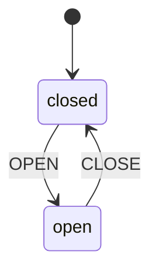
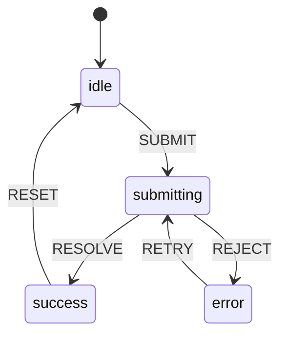
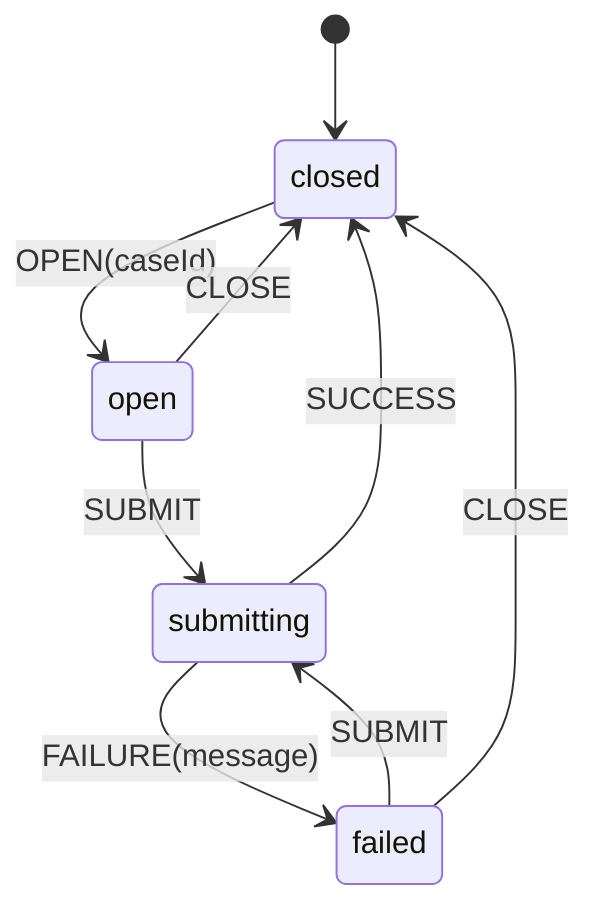
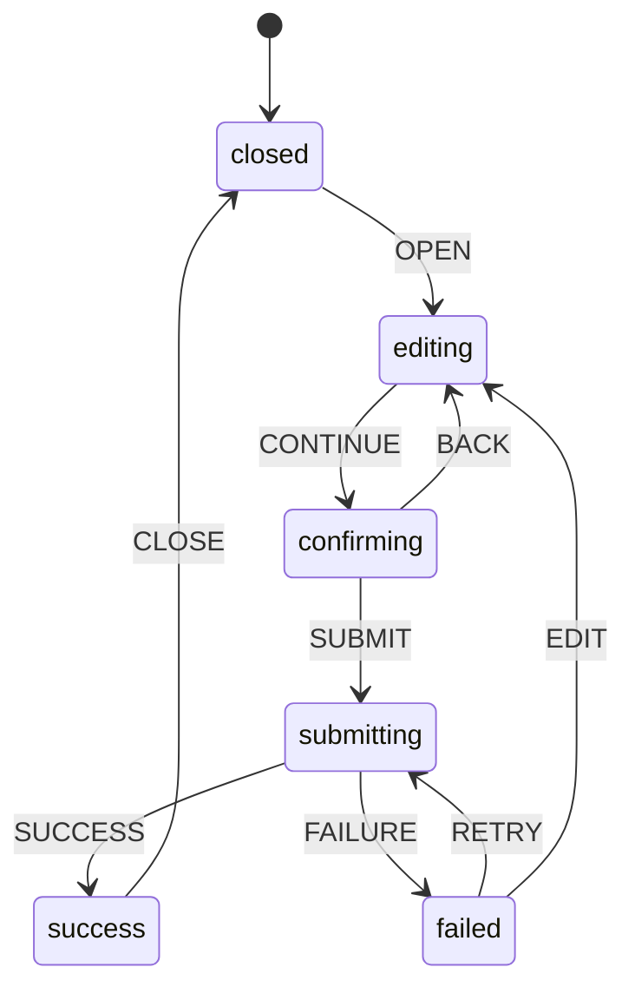
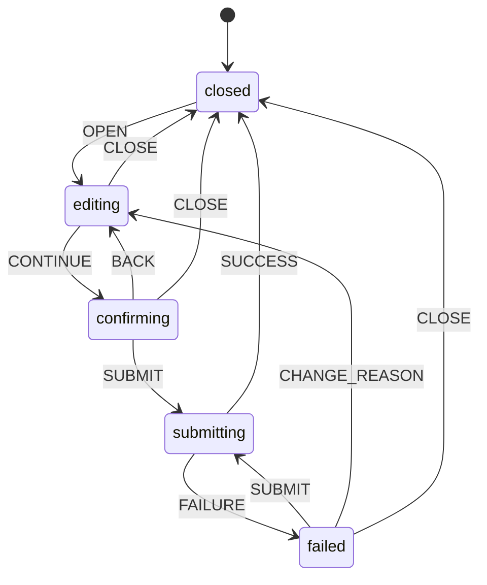

------
title: Learn Frontend React Production Architecture - Part 016
description: Production-grade guide to local state and component state machines in React, including useState, useReducer, impossible states, discriminated unions, modal/dialog/dropdown states, async UI states, and anti-patterns.
series: learn-frontend-react-production-architecture
seriesTitle: Learn Frontend React Production Architecture
order: 16
partTitle: Local State and Component State Machines
tags:
- react
- frontend
- state-machine
- local-state
- usereducer
- architecture
- production
- series
date: 2026-06-28
---

# Part 016 — Local State and Component State Machines

## Tujuan Pembelajaran

Part sebelumnya membahas taxonomy dan ownership. Sekarang kita fokus pada salah satu kategori: **local UI state**.

Local state terlihat sederhana:

```tsx
const [isOpen, setOpen] = useState(false);
```

Tetapi banyak bug production muncul dari local state yang tidak dimodelkan dengan benar:

- modal bisa open dan closed sekaligus,
- loading dan success aktif bersamaan,
- error lama tetap muncul setelah retry,
- stale async result menimpa state baru,
- form submit bisa double-click,
- dialog action salah case id,
- component menyimpan state lama saat route param berubah,
- banyak boolean flags membuat impossible states.

Part ini membahas local state sebagai **state machine kecil**.

---

## 1. Mental Model

State machine adalah model yang menjelaskan:

- state apa saja yang mungkin,
- event apa saja yang bisa terjadi,
- transition mana yang valid,
- data apa yang melekat pada setiap state.

React component tidak harus memakai library state machine untuk berpikir seperti state machine.

Contoh modal sederhana:



Contoh async submit:



Tujuan:

> Make impossible states impossible, or at least hard to represent.

---

## 2. When `useState` Is Enough

`useState` cukup untuk state sederhana dengan sedikit transition.

Good:

```tsx
const [isOpen, setOpen] = useState(false);
const [query, setQuery] = useState("");
const [selectedId, setSelectedId] = useState<string | null>(null);
const [density, setDensity] = useState<"compact" | "comfortable">("compact");
```

Use `useState` when:

- state is independent,
- transitions are obvious,
- no complex event history,
- no impossible combination risk,
- only one/two fields,
- update logic is local and simple.

Example:

```tsx
function Disclosure() {
  const [open, setOpen] = useState(false);

  return (
    <section>
      <button
        aria-expanded={open}
        onClick={() => setOpen((value) => !value)}
      >
        Details
      </button>
      {open && <div>Content</div>}
    </section>
  );
}
```

This does not need reducer.

---

## 3. Boolean Explosion

Problem:

```tsx
const [isOpen, setOpen] = useState(false);
const [isSubmitting, setSubmitting] = useState(false);
const [isSuccess, setSuccess] = useState(false);
const [isError, setError] = useState(false);
const [errorMessage, setErrorMessage] = useState<string | null>(null);
```

Invalid combinations are possible:

```txt
isSubmitting = true
isSuccess = true
isError = true
```

What does that mean?

Boolean flags multiply possible states.

With 4 booleans, there are 16 combinations. Domain may only allow 4.

Prefer discriminated union.

```ts
type SubmitState =
  | { status: "idle" }
  | { status: "submitting" }
  | { status: "success" }
  | { status: "error"; message: string };
```

Now impossible combinations disappear.

---

## 4. Discriminated Union for UI State

Example:

```ts
type LoadState<T> =
  | { status: "idle" }
  | { status: "loading" }
  | { status: "success"; data: T }
  | { status: "error"; message: string };
```

Usage:

```tsx
function CasePreview({ state }: { state: LoadState<CaseDetail> }) {
  switch (state.status) {
    case "idle":
      return <EmptyPreview />;
    case "loading":
      return <CasePreviewSkeleton />;
    case "success":
      return <CasePreviewContent caseDetail={state.data} />;
    case "error":
      return <ErrorMessage message={state.message} />;
  }
}
```

Benefits:

- state shape tells truth,
- rendering exhaustive,
- easier tests,
- fewer invalid UI combinations,
- easier event mapping.

---

## 5. `useReducer` as Transition Boundary

When local state has multiple events, use reducer.

```ts
type DialogState =
  | { status: "closed" }
  | { status: "open"; caseId: string }
  | { status: "submitting"; caseId: string }
  | { status: "failed"; caseId: string; message: string };

type DialogEvent =
  | { type: "OPEN"; caseId: string }
  | { type: "CLOSE" }
  | { type: "SUBMIT" }
  | { type: "SUCCESS" }
  | { type: "FAILURE"; message: string };
```

Reducer:

```ts
function dialogReducer(
  state: DialogState,
  event: DialogEvent
): DialogState {
  switch (event.type) {
    case "OPEN":
      return { status: "open", caseId: event.caseId };

    case "CLOSE":
      return { status: "closed" };

    case "SUBMIT":
      if (state.status !== "open" && state.status !== "failed") {
        return state;
      }

      return { status: "submitting", caseId: state.caseId };

    case "SUCCESS":
      return { status: "closed" };

    case "FAILURE":
      if (state.status !== "submitting") {
        return state;
      }

      return {
        status: "failed",
        caseId: state.caseId,
        message: event.message,
      };

    default:
      return state;
  }
}
```

Component:

```tsx
function ApproveCaseDialogController() {
  const [state, dispatch] = useReducer(dialogReducer, { status: "closed" });

  // ...
}
```

---

## 6. Diagram: Approval Dialog State Machine



This captures:

- cannot submit when closed,
- failure retains case id,
- retry returns to submitting,
- success closes dialog,
- close is allowed from open/failed.

---

## 7. Reducer Purity

Reducer must be pure.

Do not:

```ts
function reducer(state, event) {
  if (event.type === "SUBMIT") {
    api.submit(state.values);
    return { status: "submitting" };
  }
}
```

Reducer should only compute next state.

Side effects belong in:

- event handler,
- mutation callback,
- effect that syncs external system,
- command handler outside reducer.

Correct:

```tsx
async function handleSubmit() {
  dispatch({ type: "SUBMIT" });

  try {
    await submitApproval(state.caseId, reason);
    dispatch({ type: "SUCCESS" });
  } catch (error) {
    dispatch({
      type: "FAILURE",
      message: normalizeError(error),
    });
  }
}
```

Reducers are easy to test because they are pure.

---

## 8. Event Naming

Use event names that represent user/system events, not setter names.

Bad:

```ts
{ type: "SET_LOADING_TRUE" }
{ type: "SET_ERROR_MESSAGE" }
{ type: "SET_OPEN_FALSE" }
```

Better:

```ts
{ type: "SUBMIT" }
{ type: "SUCCESS" }
{ type: "FAILURE" }
{ type: "CLOSE" }
{ type: "RETRY" }
```

Event should describe what happened, not which field changes.

This keeps reducer aligned with domain/UI behavior.

---

## 9. Async Local State

Async UI often starts as:

```tsx
const [loading, setLoading] = useState(false);
const [error, setError] = useState<string | null>(null);
```

Better:

```ts
type AsyncState<T> =
  | { status: "idle" }
  | { status: "pending" }
  | { status: "success"; data: T }
  | { status: "error"; message: string };
```

But be careful: server data should often live in query cache, not local async state.

Use local async state for:

- client-only operation,
- local file parse,
- browser API,
- one-off command pending state,
- dialog submission state,
- local import/export process.

Use server-state layer for backend data fetching.

---

## 10. Async Race Condition in Local State

Example:

```tsx
async function handlePreview(caseId: string) {
  dispatch({ type: "LOAD" });

  const data = await getCasePreview(caseId);

  dispatch({ type: "SUCCESS", data });
}
```

If user selects case A then B quickly:

1. A request starts.
2. B request starts.
3. B completes.
4. A completes and overwrites preview.

Fix with request id:

```tsx
const requestIdRef = useRef(0);

async function handlePreview(caseId: string) {
  const requestId = requestIdRef.current + 1;
  requestIdRef.current = requestId;

  dispatch({ type: "LOAD", caseId });

  try {
    const data = await getCasePreview(caseId);

    if (requestIdRef.current === requestId) {
      dispatch({ type: "SUCCESS", caseId, data });
    }
  } catch (error) {
    if (requestIdRef.current === requestId) {
      dispatch({
        type: "FAILURE",
        caseId,
        message: normalizeError(error),
      });
    }
  }
}
```

Or use `AbortController` if operation supports cancellation.

---

## 11. Modal State

Basic modal:

```ts
type ModalState =
  | { status: "closed" }
  | { status: "open" };
```

Modal with payload:

```ts
type CaseActionModalState =
  | { status: "closed" }
  | { status: "open"; action: "APPROVE" | "REJECT"; caseId: string };
```

Usage:

```tsx
const [modal, setModal] = useState<CaseActionModalState>({
  status: "closed",
});

function openApprove(caseId: string) {
  setModal({ status: "open", action: "APPROVE", caseId });
}

function close() {
  setModal({ status: "closed" });
}
```

This is better than:

```tsx
const [approveOpen, setApproveOpen] = useState(false);
const [rejectOpen, setRejectOpen] = useState(false);
const [caseId, setCaseId] = useState<string | null>(null);
```

Invalid state avoided:

```txt
approveOpen = true
rejectOpen = true
caseId = null
```

---

## 12. Dropdown/Popover State

Dropdown can be simple:

```tsx
const [open, setOpen] = useState(false);
```

But accessible dropdown needs more:

- open/closed,
- highlighted item,
- selected item,
- keyboard navigation,
- focus management,
- typeahead,
- pointer interaction,
- dismissal.

State:

```ts
type MenuState =
  | { status: "closed" }
  | { status: "open"; highlightedIndex: number };
```

Events:

```ts
type MenuEvent =
  | { type: "OPEN" }
  | { type: "CLOSE" }
  | { type: "MOVE_NEXT"; itemCount: number }
  | { type: "MOVE_PREVIOUS"; itemCount: number }
  | { type: "HIGHLIGHT"; index: number };
```

For production, prefer tested accessible primitives for complex components. Do not casually implement combobox/menu/dialog from scratch unless you understand ARIA and keyboard requirements.

---

## 13. Wizard State

Multi-step wizard:

```ts
type Step = "details" | "evidence" | "review" | "submit";

type WizardState = {
  step: Step;
  completedSteps: Set<Step>;
  draft: CaseSubmissionDraft;
};
```

But step may belong in URL:

```txt
/cases/new/details
/cases/new/evidence
/cases/new/review
```

Decision:

- if step is reloadable/shareable, route it,
- if short modal wizard, local reducer may be enough,
- if long-running draft, backend draft may own it,
- if compliance-sensitive, backend state likely required.

Local wizard reducer:

```ts
type WizardEvent =
  | { type: "NEXT" }
  | { type: "BACK" }
  | { type: "UPDATE_DRAFT"; patch: Partial<CaseSubmissionDraft> }
  | { type: "RESET" };
```

---

## 14. Selection State

Table selection:

```ts
type SelectionState = {
  selectedIds: Set<string>;
};
```

Events:

```ts
type SelectionEvent =
  | { type: "TOGGLE"; id: string }
  | { type: "SELECT_ALL_VISIBLE"; ids: string[] }
  | { type: "CLEAR" };
```

Reducer:

```ts
function selectionReducer(
  state: SelectionState,
  event: SelectionEvent
): SelectionState {
  switch (event.type) {
    case "TOGGLE": {
      const next = new Set(state.selectedIds);

      if (next.has(event.id)) {
        next.delete(event.id);
      } else {
        next.add(event.id);
      }

      return { selectedIds: next };
    }

    case "SELECT_ALL_VISIBLE":
      return { selectedIds: new Set(event.ids) };

    case "CLEAR":
      return { selectedIds: new Set() };
  }
}
```

Important:

- `Set` must be replaced, not mutated in place.
- Selection may need reset when filter/page changes.
- Selection across pagination needs explicit semantics.

---

## 15. Resetting State on Identity Change

Example:

```tsx
function CaseDetail({ caseId }: { caseId: string }) {
  const [draftComment, setDraftComment] = useState("");

  return <CommentBox value={draftComment} onChange={setDraftComment} />;
}
```

If `caseId` changes while component persists, comment draft may carry over.

Options:

### 15.1 Key Remount

```tsx
<CaseDetail key={caseId} caseId={caseId} />
```

Resets entire subtree.

### 15.2 Selective Reset

```tsx
useEffect(() => {
  setDraftComment("");
}, [caseId]);
```

Resets only desired state.

### 15.3 Controlled Draft Owner

Move draft state to route/form owner with explicit reset policy.

Choose intentionally.

---

## 16. Controlled vs Uncontrolled Local State

Component can be controlled:

```tsx
<Tabs value={tab} onValueChange={setTab} />
```

Or uncontrolled:

```tsx
<Tabs defaultValue="summary" />
```

Design system components often support both.

Implementation concept:

```tsx
function useControllableState<T>({
  value,
  defaultValue,
  onChange,
}: {
  value?: T;
  defaultValue: T;
  onChange?: (value: T) => void;
}) {
  const [internalValue, setInternalValue] = useState(defaultValue);
  const isControlled = value !== undefined;

  const currentValue = isControlled ? value : internalValue;

  const setValue = useCallback((next: T) => {
    if (!isControlled) {
      setInternalValue(next);
    }

    onChange?.(next);
  }, [isControlled, onChange]);

  return [currentValue, setValue] as const;
}
```

Be careful:

- controlled/uncontrolled switch should be avoided,
- `undefined` can be ambiguous,
- document behavior clearly.

---

## 17. State Machine with TypeScript Exhaustiveness

Use `never` to enforce exhaustive switch.

```ts
function assertNever(value: never): never {
  throw new Error(`Unexpected value: ${value}`);
}

function renderSubmitState(state: SubmitState) {
  switch (state.status) {
    case "idle":
      return <Idle />;
    case "submitting":
      return <Submitting />;
    case "success":
      return <Success />;
    case "error":
      return <Error message={state.message} />;
    default:
      return assertNever(state);
  }
}
```

When new state variant is added, TypeScript can guide missing handling.

---

## 18. Reducer Tests

Reducer is pure, so test it directly.

```ts
describe("dialogReducer", () => {
  it("opens dialog for case", () => {
    expect(
      dialogReducer({ status: "closed" }, {
        type: "OPEN",
        caseId: "CASE-001",
      })
    ).toEqual({
      status: "open",
      caseId: "CASE-001",
    });
  });

  it("submits only when open", () => {
    expect(
      dialogReducer({ status: "closed" }, { type: "SUBMIT" })
    ).toEqual({ status: "closed" });
  });
});
```

Test transition rules, not implementation details.

---

## 19. Component Tests for Local State

Example:

```tsx
test("opens and closes approve dialog", async () => {
  render(<CaseActions caseId="CASE-001" />);

  await user.click(screen.getByRole("button", { name: /approve/i }));

  expect(screen.getByRole("dialog")).toBeInTheDocument();

  await user.click(screen.getByRole("button", { name: /cancel/i }));

  expect(screen.queryByRole("dialog")).not.toBeInTheDocument();
});
```

Test user-observable behavior:

- dialog opens,
- focus moves,
- pending state shown,
- error displayed,
- retry works,
- close resets error,
- submit disabled while pending.

---

## 20. State Machine Diagram in Design Docs

For complex UI, include Mermaid diagram.

Example command dialog:



This helps reviewers reason about:

- missing transitions,
- invalid transitions,
- user escape paths,
- retry behavior,
- close behavior,
- failure recovery.

---

## 21. Local State and Server Mutations

Local UI state often wraps server mutation.

Example:

```tsx
function ApproveCaseDialog({ caseId, onClose }: Props) {
  const [state, dispatch] = useReducer(reducer, { status: "editing" });
  const mutation = useApproveCaseMutation();

  async function handleSubmit(reason: string) {
    dispatch({ type: "SUBMIT" });

    try {
      await mutation.mutateAsync({ caseId, reason });
      dispatch({ type: "SUCCESS" });
      onClose();
    } catch (error) {
      dispatch({
        type: "FAILURE",
        message: normalizeError(error),
      });
    }
  }

  return <DialogContent state={state} onSubmit={handleSubmit} />;
}
```

Mutation state and local dialog state can overlap. Avoid duplicating too much.

Alternative:

- let mutation own pending/error,
- local state owns dialog/wizard fields.

```tsx
const mutation = useApproveCaseMutation();

<button disabled={mutation.isPending}>Submit</button>
{mutation.error && <InlineError error={mutation.error} />}
```

Choose one clear owner for pending/error.

---

## 22. Local Reducer vs State Machine Library

You may not need a library.

Use local reducer when:

- state machine is small,
- transitions are straightforward,
- no parallel states,
- no invoked services,
- no hierarchical states,
- no need for visualization/tooling.

Consider state machine/statechart library when:

- multiple parallel regions,
- nested states,
- long workflow,
- many events,
- formal visualization helpful,
- business process has complex transitions,
- retry/timeouts/invoked services matter,
- cross-team communication needs explicit statechart.

For most component UI, discriminated unions + reducer are enough.

---

## 23. State Machine vs Backend Workflow Engine

Do not confuse local UI state machine with business workflow engine.

Local:

```txt
dialog closed -> editing -> submitting -> failed
```

Backend:

```txt
case draft -> submitted -> under review -> approved -> closed
```

Frontend reducer cannot be source of truth for backend lifecycle.

It can only represent UI intent and local interaction state.

---

## 24. State and Accessibility

Local state often controls accessibility attributes.

Disclosure:

```tsx
<button aria-expanded={open} aria-controls="case-panel">
  Details
</button>
<div id="case-panel" hidden={!open}>
  ...
</div>
```

Tabs:

- selected tab,
- active tab id,
- keyboard navigation,
- `aria-selected`,
- `aria-controls`.

Dialog:

- open state,
- focus trap,
- labelled title,
- described body,
- return focus on close,
- escape key close policy.

State model should include accessibility behavior. Accessibility is not an afterthought.

---

## 25. Optimistic Local UI

For small UI feedback:

```tsx
const [liked, setLiked] = useState(initialLiked);

async function handleToggle() {
  const next = !liked;
  setLiked(next);

  try {
    await updateLiked(next);
  } catch {
    setLiked(!next);
  }
}
```

For regulatory actions, be more conservative.

Do not optimistically show “Approved” if approval can fail due to permission, conflict, validation, or audit error. Use pending state:

```tsx
<button disabled={mutation.isPending}>
  {mutation.isPending ? "Approving..." : "Approve"}
</button>
```

Then refetch confirmed server state.

---

## 26. Local State and Performance

State location controls re-render scope.

Bad:

```tsx
function Dashboard() {
  const [searchDraft, setSearchDraft] = useState("");

  return (
    <>
      <SearchBox value={searchDraft} onChange={setSearchDraft} />
      <HugeDashboardCharts />
      <LargeTable />
    </>
  );
}
```

Every keystroke re-renders dashboard.

Better:

```tsx
function Dashboard() {
  return (
    <>
      <SearchSection />
      <HugeDashboardCharts />
      <LargeTable />
    </>
  );
}

function SearchSection() {
  const [searchDraft, setSearchDraft] = useState("");

  return <SearchBox value={searchDraft} onChange={setSearchDraft} />;
}
```

State colocation often beats memoization.

---

## 27. Component Identity and State Preservation

React preserves state based on component type and position in tree.

Example:

```tsx
{mode === "edit" ? <CaseForm /> : <CaseForm />}
```

Same type and position can preserve state.

Different key resets:

```tsx
<CaseForm key={caseId} caseId={caseId} />
```

Different component type resets:

```tsx
{mode === "edit" ? <EditCaseForm /> : <ReadOnlyCaseView />}
```

Use this deliberately for:

- reset form when entity changes,
- preserve tab state across route,
- reset wizard after submit,
- preserve sidebar preference.

---

## 28. Common Anti-Patterns

### 28.1 Boolean Cluster

Multiple booleans representing one state machine.

### 28.2 Setter-Oriented Reducer Events

Reducers that only set fields, not model events.

### 28.3 Side Effects in Reducer

Reducers call APIs, navigate, or mutate external resources.

### 28.4 State Too High

Input state in page root re-renders expensive subtree.

### 28.5 State Too Low

Sibling components duplicate state and drift apart.

### 28.6 Modal Payload Split Across Variables

```tsx
isOpen + selectedCaseId + actionType
```

can become inconsistent.

### 28.7 Error Not Reset on Retry/Close

User sees stale error from previous attempt.

### 28.8 Async Result Race

Older request overwrites newer state.

### 28.9 Local State as Backend Truth

UI status updated locally without server confirmation.

### 28.10 Ignoring Accessibility State

Open/selected/focused state not reflected in ARIA/keyboard behavior.

---

## 29. Mini Case Study: Approve Case Dialog

### Requirements

- open from case detail,
- collect reason,
- confirm approval,
- submit to backend,
- show pending,
- show validation/domain error,
- retry,
- close resets state,
- successful submit closes and refetches case.

### State Model

```ts
type ApproveDialogState =
  | { status: "closed" }
  | { status: "editing"; caseId: string; reason: string }
  | { status: "confirming"; caseId: string; reason: string }
  | { status: "submitting"; caseId: string; reason: string }
  | { status: "failed"; caseId: string; reason: string; message: string };
```

Events:

```ts
type ApproveDialogEvent =
  | { type: "OPEN"; caseId: string }
  | { type: "CHANGE_REASON"; reason: string }
  | { type: "CONTINUE" }
  | { type: "BACK" }
  | { type: "SUBMIT" }
  | { type: "SUCCESS" }
  | { type: "FAILURE"; message: string }
  | { type: "CLOSE" };
```

Reducer:

```ts
function approveDialogReducer(
  state: ApproveDialogState,
  event: ApproveDialogEvent
): ApproveDialogState {
  switch (event.type) {
    case "OPEN":
      return {
        status: "editing",
        caseId: event.caseId,
        reason: "",
      };

    case "CHANGE_REASON":
      if (state.status !== "editing" && state.status !== "failed") {
        return state;
      }

      return {
        ...state,
        status: "editing",
        reason: event.reason,
      };

    case "CONTINUE":
      if (state.status !== "editing" || !state.reason.trim()) {
        return state;
      }

      return {
        status: "confirming",
        caseId: state.caseId,
        reason: state.reason,
      };

    case "BACK":
      if (state.status !== "confirming") {
        return state;
      }

      return {
        status: "editing",
        caseId: state.caseId,
        reason: state.reason,
      };

    case "SUBMIT":
      if (state.status !== "confirming" && state.status !== "failed") {
        return state;
      }

      return {
        status: "submitting",
        caseId: state.caseId,
        reason: state.reason,
      };

    case "SUCCESS":
    case "CLOSE":
      return { status: "closed" };

    case "FAILURE":
      if (state.status !== "submitting") {
        return state;
      }

      return {
        status: "failed",
        caseId: state.caseId,
        reason: state.reason,
        message: event.message,
      };
  }
}
```

### Diagram



This is longer than boolean flags, but clearer and safer.

---

## 30. Mini Case Study: Async Preview Panel

### Problem

User hovers rows and preview panel loads case preview.

Naive:

```tsx
const [preview, setPreview] = useState<CasePreview | null>(null);

async function handleHover(caseId: string) {
  const data = await getPreview(caseId);
  setPreview(data);
}
```

Race bug.

Better state:

```ts
type PreviewState =
  | { status: "empty" }
  | { status: "loading"; caseId: string }
  | { status: "success"; caseId: string; data: CasePreview }
  | { status: "error"; caseId: string; message: string };
```

Use request id or abort.

Reducer:

```ts
type PreviewEvent =
  | { type: "LOAD"; caseId: string }
  | { type: "SUCCESS"; caseId: string; data: CasePreview }
  | { type: "FAILURE"; caseId: string; message: string }
  | { type: "CLEAR" };
```

Reject stale success if state is loading different case.

```ts
case "SUCCESS":
  if (state.status !== "loading" || state.caseId !== event.caseId) {
    return state;
  }

  return {
    status: "success",
    caseId: event.caseId,
    data: event.data,
  };
```

---

## 31. Local State Review Checklist

For every local state:

1. Is this truly local?
2. Could it be derived?
3. Should it be URL state?
4. Should it be server state?
5. Should it be form state?
6. Is `useState` enough?
7. Are there multiple booleans representing one mode?
8. Are impossible states representable?
9. Would discriminated union help?
10. Would reducer make transitions clearer?
11. Are reducer events domain/user events?
12. Are side effects outside reducer?
13. Is async race handled?
14. Is error reset behavior clear?
15. Is close/reset behavior clear?
16. Is state reset on identity change?
17. Is state colocated properly?
18. Is accessibility state reflected?
19. Is state tested?
20. Is this simpler than adding global store?

---

## 32. Deliberate Practice

### Latihan 1 — Boolean Cluster Refactor

Cari component dengan 3+ boolean state.

Refactor ke:

- discriminated union,
- reducer,
- Mermaid state diagram,
- reducer tests.

Before:

```tsx
isOpen
isSubmitting
isError
isSuccess
```

After:

```ts
type State =
  | { status: "closed" }
  | { status: "editing" }
  | { status: "submitting" }
  | { status: "failed"; message: string };
```

### Latihan 2 — Modal Payload Audit

Cari modal yang punya:

```tsx
isOpen
selectedId
actionType
```

Ubah menjadi:

```ts
type ModalState =
  | { status: "closed" }
  | { status: "open"; id: string; action: ActionType };
```

### Latihan 3 — Async Race Drill

Buat preview panel yang load data berdasarkan selected id.

Simulasikan:

- select A,
- select B,
- B returns first,
- A returns later.

Pastikan UI tetap B.

### Latihan 4 — State Reset Drill

Buat route `/cases/:caseId/edit`.

Tentukan state mana yang reset saat `caseId` berubah:

- form draft,
- active tab,
- sidebar collapse,
- global notification,
- selected document,
- validation errors.

Implement key remount atau selective reset.

---

## 33. Ringkasan

Local state production bukan hanya `useState`.

Gunakan:

- `useState` untuk state sederhana,
- discriminated union untuk mode eksklusif,
- `useReducer` untuk transition kompleks,
- request id/abort untuk async race,
- key/remount/reset policy untuk identity change,
- local state colocation untuk performance,
- accessible state attributes untuk UI primitives.

Prinsip utama:

> Jika UI hanya punya beberapa state valid, modelkan hanya state valid itu. Jangan biarkan boolean flags menciptakan kombinasi yang tidak pernah boleh terjadi.

Local state yang baik membuat component mudah dibaca, mudah dites, dan sulit masuk kondisi invalid.

---

## 34. Self-Assessment

Anda siap lanjut jika bisa menjawab:

1. Kapan `useState` cukup?
2. Apa itu boolean explosion?
3. Bagaimana discriminated union mencegah impossible state?
4. Kapan memakai `useReducer`?
5. Mengapa reducer harus pure?
6. Apa beda event reducer dan setter field?
7. Bagaimana mencegah async race?
8. Kapan memakai `key` untuk reset state?
9. Apa perbedaan local UI state dan backend workflow state?
10. Bagaimana mendesain approve dialog sebagai state machine?

---

## 35. Sumber Rujukan

- React Docs — `useState`
- React Docs — `useReducer`
- React Docs — Extracting State Logic into a Reducer
- React Docs — Choosing the State Structure
- React Docs — Preserving and Resetting State
- React Docs — Sharing State Between Components
- WAI-ARIA Authoring Practices — Dialog, Menu, Tabs Patterns
