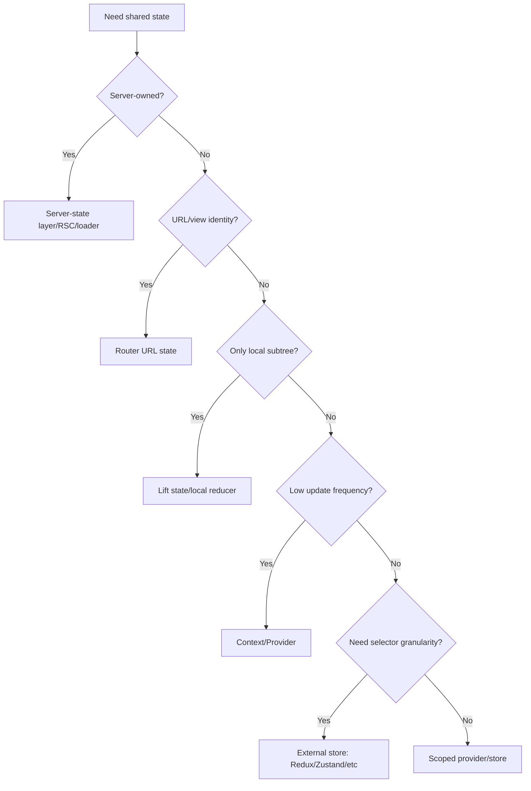

------
title: Learn Frontend React Production Architecture - Part 017
description: Production-grade guide to global state in React, including Context, reducer+context, Redux Toolkit, Zustand, selectors, subscription granularity, event-driven updates, global store boundaries, and anti-patterns.
series: learn-frontend-react-production-architecture
seriesTitle: Learn Frontend React Production Architecture
order: 17
partTitle: Global State: Redux Toolkit, Zustand, Context, and Beyond
tags:
- react
- frontend
- state-management
- redux-toolkit
- zustand
- context
- architecture
- production
- series
date: 2026-06-28
---

# Part 017 — Global State: Redux Toolkit, Zustand, Context, and Beyond

## Tujuan Pembelajaran

Global state adalah salah satu area frontend yang paling sering diperdebatkan.

Pertanyaannya sering salah:

> “Lebih bagus Redux, Zustand, Context, atau library X?”

Pertanyaan yang lebih tepat:

> “State apa yang benar-benar global, siapa source of truth-nya, seberapa sering berubah, siapa subscribernya, dan failure mode apa yang harus dicegah?”

Part ini membahas global state sebagai **ownership dan subscription architecture**, bukan sebagai perang library.

Kita akan membahas:

1. kapan global state dibutuhkan,
2. kapan global state tidak dibutuhkan,
3. Context sebagai dependency distribution,
4. reducer + Context,
5. Redux Toolkit,
6. Zustand,
7. selector design,
8. subscription granularity,
9. event-driven updates,
10. store boundaries,
11. server-state confusion,
12. anti-pattern production.

---

## 1. Apa Itu Global State?

Global state adalah state yang perlu diakses atau diubah oleh bagian aplikasi yang jauh secara struktur component tree.

Contoh valid:

- auth session summary,
- current workspace/tenant,
- theme,
- locale,
- feature flags,
- shell/sidebar preference,
- command palette,
- selected organization,
- global notification summary,
- client-only collaborative presence,
- app-wide draft registry,
- editor state shared across distant panels.

Namun tidak semua state yang “dipakai di banyak tempat” harus global store.

Server data seperti case detail, user profile, dan report list biasanya lebih cocok di server-state cache, bukan global client store.

---

## 2. Decision First, Library Later

Sebelum memilih library:



Library choice is downstream of ownership.

---

## 3. When You Do Not Need Global State

Do not globalize:

- dropdown open state,
- modal state used by one page,
- form field values,
- server query result,
- derived filtered list,
- route search params,
- hover/focus,
- optimistic pending state for one mutation,
- local wizard state,
- table column resize while editing unless preference,
- validation errors.

Bad:

```tsx
globalStore.setApprovalReason(value);
globalStore.setApprovalModalOpen(true);
globalStore.setCaseListResponse(response);
globalStore.setCurrentFilter(searchParams);
```

This mixes form state, modal state, server state, and URL state.

---

## 4. Context Mental Model

React Context lets a component provide a value to its subtree without passing props through every level.

Good uses:

- theme,
- locale,
- authenticated user summary,
- permission checker,
- service client,
- design system config,
- feature flag reader,
- shell context,
- form context within form subtree.

Example:

```tsx
const PermissionContext = createContext<PermissionService | null>(null);

export function PermissionProvider({
  service,
  children,
}: {
  service: PermissionService;
  children: React.ReactNode;
}) {
  return (
    <PermissionContext.Provider value={service}>
      {children}
    </PermissionContext.Provider>
  );
}

export function usePermissions() {
  const value = useContext(PermissionContext);

  if (!value) {
    throw new Error("usePermissions must be used within PermissionProvider");
  }

  return value;
}
```

Context is excellent for dependency distribution.

---

## 5. Context Re-render Behavior

When Context provider value changes, components reading that context can re-render.

Example:

```tsx
<AuthContext.Provider value={{ user, logout }}>
  {children}
</AuthContext.Provider>
```

If `{ user, logout }` is created fresh every render, provider value identity changes.

Stabilize if needed:

```tsx
const value = useMemo(() => {
  return { user, logout };
}, [user, logout]);

return <AuthContext.Provider value={value}>{children}</AuthContext.Provider>;
```

But memoization is not magic. If `user` changes, consumers still update.

For high-frequency state, Context alone may be too broad.

---

## 6. Splitting Context by Responsibility

Bad:

```tsx
<AppContext.Provider
  value={{
    user,
    permissions,
    theme,
    sidebarOpen,
    notifications,
    caseFilters,
    currentCase,
    formDraft,
  }}
>
  {children}
</AppContext.Provider>
```

Problems:

- unrelated updates affect unrelated consumers,
- ownership unclear,
- testing harder,
- provider becomes God object.

Better:

```tsx
<AuthProvider>
  <PermissionProvider>
    <ThemeProvider>
      <ShellStateProvider>
        <NotificationProvider>
          {children}
        </NotificationProvider>
      </ShellStateProvider>
    </ThemeProvider>
  </PermissionProvider>
</AuthProvider>
```

Split by:

- ownership,
- lifetime,
- update frequency,
- security sensitivity,
- domain boundary.

---

## 7. Reducer + Context

React docs show scaling state by combining reducer and context.

Pattern:

```tsx
type ShellState = {
  sidebarCollapsed: boolean;
  commandPaletteOpen: boolean;
};

type ShellEvent =
  | { type: "TOGGLE_SIDEBAR" }
  | { type: "OPEN_COMMAND_PALETTE" }
  | { type: "CLOSE_COMMAND_PALETTE" };

function shellReducer(state: ShellState, event: ShellEvent): ShellState {
  switch (event.type) {
    case "TOGGLE_SIDEBAR":
      return {
        ...state,
        sidebarCollapsed: !state.sidebarCollapsed,
      };

    case "OPEN_COMMAND_PALETTE":
      return {
        ...state,
        commandPaletteOpen: true,
      };

    case "CLOSE_COMMAND_PALETTE":
      return {
        ...state,
        commandPaletteOpen: false,
      };
  }
}
```

Provider:

```tsx
const ShellStateContext = createContext<ShellState | null>(null);
const ShellDispatchContext = createContext<Dispatch<ShellEvent> | null>(null);

function ShellStateProvider({ children }: { children: React.ReactNode }) {
  const [state, dispatch] = useReducer(shellReducer, {
    sidebarCollapsed: false,
    commandPaletteOpen: false,
  });

  return (
    <ShellStateContext.Provider value={state}>
      <ShellDispatchContext.Provider value={dispatch}>
        {children}
      </ShellDispatchContext.Provider>
    </ShellStateContext.Provider>
  );
}
```

Separate state and dispatch contexts reduce unnecessary rerenders for components that only dispatch.

---

## 8. Context + Reducer Limitations

Reducer + Context is good when:

- state is medium complexity,
- scope is a subtree,
- update frequency is not extreme,
- all consumers can tolerate provider updates,
- no need for advanced devtools/time travel,
- no need for selector subscription granularity.

Limitations:

- context update can affect all consumers,
- selectors are not built-in,
- large/high-frequency state can be expensive,
- debugging complex async workflows can be harder,
- persistence/middleware/devtools are manual.

Use it intentionally.

---

## 9. External Store Pattern

External store means state lives outside React render tree and React components subscribe to it.

React provides `useSyncExternalStore` for reading external store snapshots safely.

Concept:

```ts
type Listener = () => void;

function createCounterStore() {
  let count = 0;
  const listeners = new Set<Listener>();

  return {
    getSnapshot: () => count,
    subscribe: (listener: Listener) => {
      listeners.add(listener);
      return () => listeners.delete(listener);
    },
    increment: () => {
      count += 1;
      listeners.forEach((listener) => listener());
    },
  };
}
```

Hook:

```tsx
function useCounter() {
  return useSyncExternalStore(
    counterStore.subscribe,
    counterStore.getSnapshot
  );
}
```

Libraries like Redux and Zustand provide store abstractions and React bindings around similar subscription ideas.

---

## 10. Redux Toolkit Mental Model

Redux Toolkit is the modern recommended way to write Redux logic.

Redux is useful when you want:

- centralized client-owned state,
- event/action log mental model,
- predictable reducer updates,
- middleware,
- devtools,
- cross-feature events,
- normalized client state,
- large team conventions,
- strong debugging/story of “what happened”,
- explicit transitions.

Redux Toolkit reduces boilerplate compared with old Redux.

Typical store:

```ts
import { configureStore } from "@reduxjs/toolkit";

export const store = configureStore({
  reducer: {
    shell: shellReducer,
    workflowDrafts: workflowDraftsReducer,
  },
});
```

Slice:

```ts
import { createSlice, PayloadAction } from "@reduxjs/toolkit";

type ShellState = {
  sidebarCollapsed: boolean;
};

const initialState: ShellState = {
  sidebarCollapsed: false,
};

const shellSlice = createSlice({
  name: "shell",
  initialState,
  reducers: {
    toggledSidebar(state) {
      state.sidebarCollapsed = !state.sidebarCollapsed;
    },
    setSidebarCollapsed(state, action: PayloadAction<boolean>) {
      state.sidebarCollapsed = action.payload;
    },
  },
});

export const shellActions = shellSlice.actions;
export const shellReducer = shellSlice.reducer;
```

Redux Toolkit uses Immer internally for ergonomic immutable updates.

---

## 11. Redux Toolkit Use Cases

Redux Toolkit is strong for:

- complex client-owned state,
- multi-feature events,
- undo/redo,
- event log debugging,
- state snapshots,
- middleware-driven side effects,
- large teams needing conventions,
- offline-capable queues,
- complex editor state,
- client workflow drafts,
- global command bus,
- cross-cutting logout/reset actions.

Example cross-feature logout:

```ts
const authSlice = createSlice({
  name: "auth",
  initialState,
  reducers: {
    loggedOut() {
      return initialState;
    },
  },
});
```

Other slices can respond:

```ts
builder.addCase(authActions.loggedOut, () => initialDraftState);
```

This is useful when one event should reset many client-owned slices.

---

## 12. Redux Anti-Use Cases

Do not use Redux by default for:

- server-state cache,
- form field state,
- local modals,
- URL search params,
- hover/focus,
- component-only UI,
- data that should be fetched/refetched/invalidation-managed by query layer.

Old anti-pattern:

```ts
dispatch(fetchCaseDetail(caseId));
const caseDetail = useSelector(selectCaseDetail);
```

If this is just server data, prefer TanStack Query/RTK Query/framework loaders/RSC.

Redux can manage server data, especially with RTK Query, but plain slices for backend cache often become manual cache invalidation burden.

---

## 13. Selectors in Redux

Use selectors to isolate component reads.

```ts
export const selectSidebarCollapsed = (state: RootState) =>
  state.shell.sidebarCollapsed;
```

Component:

```tsx
const collapsed = useSelector(selectSidebarCollapsed);
```

For derived values:

```ts
export const selectVisibleDrafts = createSelector(
  [selectDrafts, selectDraftFilter],
  (drafts, filter) => drafts.filter((draft) => draft.status === filter.status)
);
```

Selector benefits:

- encapsulate state shape,
- enable memoization,
- reduce component coupling,
- improve testability.

Avoid selecting entire state object:

```tsx
const shell = useSelector((state) => state.shell);
```

if component only needs one field.

---

## 14. Redux Middleware and Side Effects

Reducers must stay pure. Side effects happen via:

- thunks,
- listener middleware,
- RTK Query,
- external services,
- component event handlers.

Thunk example:

```ts
export const saveDraft = createAsyncThunk(
  "drafts/saveDraft",
  async (draft: Draft, { rejectWithValue }) => {
    try {
      return await draftApi.save(draft);
    } catch (error) {
      return rejectWithValue(normalizeError(error));
    }
  }
);
```

Listener middleware can react to actions:

```ts
startAppListening({
  actionCreator: authActions.loggedOut,
  effect: async (_action, listenerApi) => {
    queryClient.clear();
    listenerApi.dispatch(draftsActions.cleared());
  },
});
```

Keep side effects intentional and testable.

---

## 15. RTK Query Note

RTK Query is Redux Toolkit's data fetching and caching layer.

It can be a strong server-state solution if your app already uses Redux Toolkit and wants integrated API cache.

Do not confuse:

- Redux slices for client-owned global state,
- RTK Query endpoints for server-state.

If using RTK Query, avoid duplicating the same API data into normal slices unless there is a clear reason.

---

## 16. Zustand Mental Model

Zustand is a small hook-based state management library.

It is useful when you want:

- simple external store,
- minimal boilerplate,
- hook-based API,
- selector-based subscription,
- feature-scoped stores,
- local-ish global state,
- less ceremony than Redux,
- no action/reducer strictness unless you add it.

Example:

```ts
import { create } from "zustand";

type ShellStore = {
  sidebarCollapsed: boolean;
  toggleSidebar: () => void;
};

export const useShellStore = create<ShellStore>((set) => ({
  sidebarCollapsed: false,
  toggleSidebar: () =>
    set((state) => ({
      sidebarCollapsed: !state.sidebarCollapsed,
    })),
}));
```

Component:

```tsx
const collapsed = useShellStore((state) => state.sidebarCollapsed);
const toggle = useShellStore((state) => state.toggleSidebar);
```

Selector-based reads help avoid rerendering on unrelated store fields.

---

## 17. Zustand Store Design

Good:

```ts
type CaseSelectionStore = {
  selectedIds: Set<string>;
  toggle: (id: string) => void;
  clear: () => void;
};

export const useCaseSelectionStore = create<CaseSelectionStore>((set) => ({
  selectedIds: new Set(),
  toggle: (id) =>
    set((state) => {
      const next = new Set(state.selectedIds);

      if (next.has(id)) {
        next.delete(id);
      } else {
        next.add(id);
      }

      return { selectedIds: next };
    }),
  clear: () => set({ selectedIds: new Set() }),
}));
```

Bad:

```ts
export const useAppStore = create(() => ({
  user: null,
  cases: [],
  filters: {},
  form: {},
  modal: {},
  theme: "light",
}));
```

Zustand does not force architecture. That is power and risk.

---

## 18. Zustand Selectors and Shallow Equality

If selector returns object/array, new reference can trigger rerender.

```tsx
const value = useStore((state) => ({
  count: state.count,
  user: state.user,
}));
```

This object is new unless equality is handled.

Use separate selectors:

```tsx
const count = useStore((state) => state.count);
const user = useStore((state) => state.user);
```

Or shallow equality/helper if appropriate.

Selector granularity matters.

---

## 19. Redux vs Zustand vs Context

| Dimension | Context | Redux Toolkit | Zustand |
|---|---|---|---|
| Boilerplate | low | medium | low |
| Conventions | low | high | low/medium |
| Devtools/event log | limited | strong | possible but lighter |
| Selector granularity | not built-in | strong via useSelector | strong via selectors |
| Middleware | manual | strong | middleware available |
| Team consistency | depends discipline | strong | depends discipline |
| Best for | dependency/low-frequency state | complex centralized client state | simple/feature-scoped stores |
| Risk | provider re-render, monolith | overuse for server/form/local state | architecture drift/God store |

No universal winner.

---

## 20. Store Scope

Not every store must be app-wide singleton.

Scopes:

| Scope | Example |
|---|---|
| app-wide | auth, theme, feature flags |
| shell-wide | sidebar, command palette |
| route-scoped | case list selection |
| feature-scoped | report builder state |
| component-scoped external store | rich editor |
| session-scoped | current workspace |
| tab-scoped | temporary draft |

Feature-scoped store can be created per provider instance.

```tsx
function CaseListSelectionProvider({ children }: Props) {
  const store = useMemo(() => createCaseSelectionStore(), []);

  return (
    <CaseSelectionContext.Provider value={store}>
      {children}
    </CaseSelectionContext.Provider>
  );
}
```

This avoids leaking selection across unrelated pages.

---

## 21. Cross-Feature Events

Sometimes a global event should affect many slices/stores.

Examples:

- logout,
- workspace switched,
- tenant changed,
- app version changed,
- permission refreshed,
- offline detected,
- feature flag changed.

Model as event, not random setter calls.

Redux:

```ts
dispatch(appEvents.workspaceChanged({ workspaceId }));
```

Zustand/manual:

```ts
eventBus.emit("workspaceChanged", { workspaceId });
```

Be careful with event bus. It can become hidden coupling if not governed.

Event should be:

- typed,
- documented,
- observable,
- testable,
- limited.

---

## 22. Global State and Logout

Logout is a state reset event.

On logout:

- clear auth state,
- clear permission state,
- clear server-state cache with sensitive data,
- close WebSocket connections,
- clear feature stores containing sensitive data,
- keep safe preferences like theme/sidebar,
- redirect to login,
- stop background polling,
- clear optimistic queues if unsafe.

Example:

```ts
async function logout() {
  await authApi.logout();

  queryClient.clear();
  store.dispatch(authActions.loggedOut());
  caseSelectionStore.getState().clear();
  realtimeClient.disconnect();

  navigate("/login", { replace: true });
}
```

Do not leave previous user's data in memory after logout.

---

## 23. Persistence

Global state persistence should be selective.

Persist safe preferences:

- theme,
- sidebar collapsed,
- table density,
- column visibility.

Do not blindly persist:

- auth tokens,
- permission maps,
- case details,
- workflow drafts,
- approval reasons,
- sensitive reports,
- server cache.

If persisting:

- version schema,
- validate on read,
- migrate or discard old data,
- clear on logout if sensitive,
- handle storage unavailability,
- consider cross-tab sync.

---

## 24. Cross-Tab State

Some state should sync across browser tabs:

- logout,
- theme,
- locale,
- workspace switch,
- feature flag refresh maybe.

Mechanisms:

- `storage` event,
- BroadcastChannel,
- server push,
- polling.

Example:

```tsx
useEffect(() => {
  const channel = new BroadcastChannel("app-session");

  channel.onmessage = (event) => {
    if (event.data.type === "LOGOUT") {
      handleRemoteLogout();
    }
  };

  return () => channel.close();
}, []);
```

Avoid syncing all state across tabs. Decide state by state.

---

## 25. Global Store and Server State Boundary

Common mistake:

```ts
type AppStore = {
  cases: Case[];
  currentCase: CaseDetail | null;
  reports: Report[];
  userProfile: UserProfile | null;
};
```

This is backend data. It needs:

- cache lifecycle,
- stale/fresh semantics,
- invalidation,
- retries,
- background refetch,
- deduplication,
- pagination,
- optimistic mutation,
- garbage collection.

Global client store can do this manually, but server-state libraries exist because this is complex.

Keep boundary:

```txt
Global client store:
  shell state
  client workflow draft
  editor state

Server-state cache:
  cases
  case detail
  reports
  user profile
```

---

## 26. Global Store and URL State Boundary

URL state should not be duplicated in global store.

Bad:

```ts
store.caseFilters = parse(location.search);
```

Then components update store and URL separately.

Better:

- URL is source of truth,
- parse in route/hook,
- query key uses parsed filters,
- components receive filters via props/context if needed.

If many nested components need filters, provide read-only route context derived from URL.

---

## 27. Global Store and Form State Boundary

Form state in global store often causes leaks:

- validation errors persist after route change,
- dirty state survives wrong entity,
- old draft appears for new case,
- sensitive input remains after logout,
- reducers become huge.

Use global store for form state only when requirements justify:

- multi-route wizard,
- autosaved drafts,
- offline draft,
- collaboration,
- long-running process,
- restoration after crash.

Even then, model draft lifecycle explicitly.

---

## 28. Anti-Pattern Catalog

### 28.1 Context Provider Pyramid Without Ownership

Many providers with unclear purpose. Split is good only if each provider has clear responsibility.

### 28.2 AppContext God Object

Everything inside one context.

### 28.3 Redux as Backend Cache by Hand

Manual API loading into slices without invalidation semantics.

### 28.4 Zustand God Store

One store with all app data because Zustand makes it easy.

### 28.5 Selector Returning Fresh Object

Causes rerender on every store update.

### 28.6 Persist Everything

Sensitive data leaks and stale state survives.

### 28.7 Cross-Tab Everything

Unnecessary complexity and surprising behavior.

### 28.8 Event Bus Spaghetti

Hidden coupling between features.

### 28.9 Store Chosen Before State Taxonomy

Tool-driven architecture.

### 28.10 Global State as Escape from Prop Design

Using global store because component boundaries are unclear.

---

## 29. Mini Case Study: Shell State

### Requirements

- sidebar collapsed,
- command palette open,
- theme,
- notification summary,
- current user,
- case filters.

Classification:

| State | Owner |
|---|---|
| sidebar collapsed | shell provider + persistence |
| command palette open | shell provider/local |
| theme | theme provider + persistence |
| notification summary | server-state query |
| current user | auth provider/server-state |
| case filters | URL state |

A healthy architecture does not put all six into one store.

---

## 30. Mini Case Study: Client Workflow Draft Store

Requirement:

- user creates long report,
- wizard spans multiple routes,
- draft can survive navigation,
- draft does not need server persistence until submit,
- user can discard,
- logout clears draft.

Zustand or Redux can fit.

State:

```ts
type ReportDraftState = {
  draftId: string;
  title: string;
  sections: ReportSectionDraft[];
  currentStep: "details" | "sections" | "review";
  dirty: boolean;
};
```

Actions:

```ts
type ReportDraftActions = {
  updateTitle: (title: string) => void;
  addSection: () => void;
  removeSection: (id: string) => void;
  moveToStep: (step: ReportDraftState["currentStep"]) => void;
  reset: () => void;
};
```

This is client-owned state with route-spanning lifetime. Global/feature store is reasonable.

But if report draft must be audited, recovered cross-device, or resumed after crash, backend draft ownership may be better.

---

## 31. Decision Matrix

| Need | Suggested Tool |
|---|---|
| theme/locale | Context/provider |
| permission checker | Context/provider |
| shell sidebar | Context or small Zustand store |
| command palette | Context/local shell store |
| case list filter | URL |
| case detail data | server-state/RSC/loader |
| approval form | form state |
| approval pending | mutation state |
| long client draft | Redux/Zustand feature store |
| complex editor | external store or editor's state model |
| cross-feature event log | Redux Toolkit |
| simple feature store | Zustand |
| high-frequency many consumers | external store with selectors |
| low-frequency broad dependency | Context |

---

## 32. Review Checklist

Before adding global state:

1. Is the state truly global?
2. Is it server-owned?
3. Is it URL state?
4. Is it form state?
5. Is it derived?
6. What is its lifetime?
7. Who can update it?
8. How often does it update?
9. How many consumers?
10. Do consumers need selectors?
11. Does it contain sensitive data?
12. Should it persist?
13. Should it clear on logout?
14. Should it sync cross-tab?
15. Does it need devtools/event log?
16. Is Context enough?
17. Is Redux Toolkit justified?
18. Is Zustand enough?
19. Can store be feature-scoped?
20. What anti-pattern are we avoiding?

---

## 33. Deliberate Practice

### Latihan 1 — Global Store Audit

Ambil global store existing.

Buat tabel:

| Field | Category | Correct Owner | Action |
|---|---|---|---|
| cases | server state | query cache | remove from store |
| filters | URL state | search params | move |
| approvalReason | form state | dialog form | move |
| theme | preference | theme provider | keep |
| sidebarOpen | shell state | shell store | keep/scope |

Target:

- remove 3 fields that are not truly global,
- split store by ownership,
- add selectors for remaining fields.

### Latihan 2 — Context Split

Ambil `AppContext`.

Pecah menjadi:

- AuthContext,
- ThemeContext,
- PermissionContext,
- ShellContext,
- Notification query.

Measure rerender differences if possible.

### Latihan 3 — Store Scope Design

For one feature, decide:

- app-wide store,
- feature-scoped store,
- route-local reducer,
- URL state,
- server-state.

Write ADR with trade-offs.

---

## 34. Ringkasan

Global state is not a dumping ground. It is a shared ownership mechanism.

Use:

- Context for dependency/low-frequency values.
- Reducer + Context for scoped state with explicit transitions.
- Redux Toolkit for centralized complex client-owned state and strong conventions.
- Zustand for lightweight external stores with selectors.
- Server-state libraries/framework data layers for backend data.
- URL for view identity.
- Form state for forms.
- Local state for local interaction.

The best global state architecture is often smaller than expected.

---

## 35. Self-Assessment

Anda siap lanjut jika bisa menjawab:

1. Kapan state benar-benar global?
2. Mengapa Context bukan default high-frequency state store?
3. Apa manfaat reducer + Context?
4. Kapan Redux Toolkit lebih cocok daripada Zustand?
5. Kapan Zustand lebih cocok daripada Redux Toolkit?
6. Mengapa selector granularity penting?
7. Mengapa server data tidak otomatis masuk global store?
8. Apa yang harus dibersihkan saat logout?
9. Kapan persistence aman?
10. Bagaimana mencegah God store?

---

## 36. Sumber Rujukan

- React Docs — Passing Data Deeply with Context
- React Docs — Scaling Up with Reducer and Context
- React Docs — `useContext`
- React Docs — `useSyncExternalStore`
- Redux Toolkit Docs — `configureStore`, `createSlice`, `createAsyncThunk`
- Redux Toolkit Docs — Usage with TypeScript
- Zustand Docs — Introduction
- Zustand Docs — Selectors and `useShallow`
- Zustand Docs — `subscribeWithSelector`
