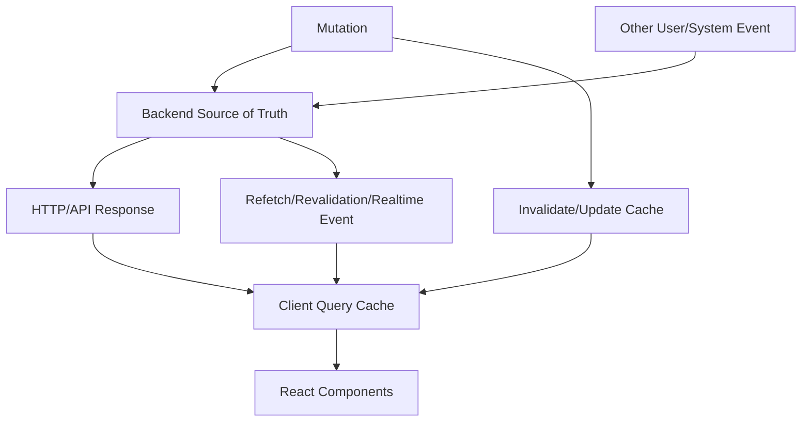
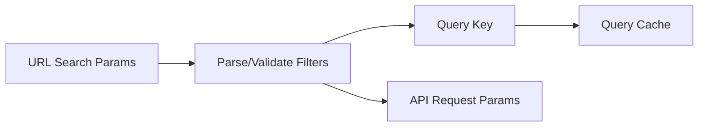
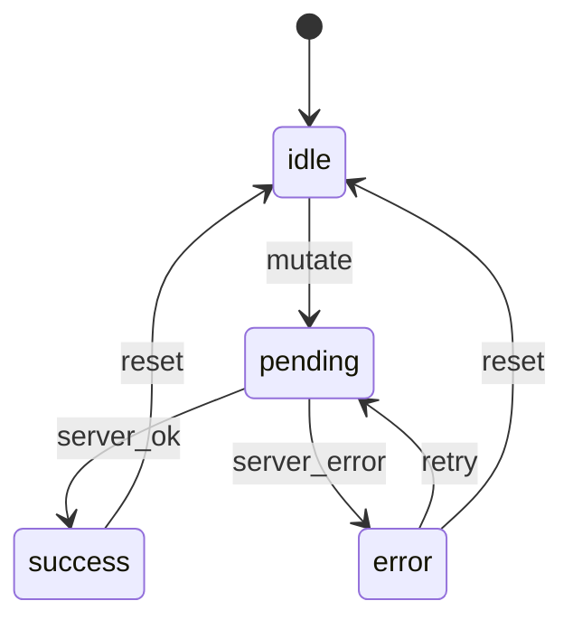
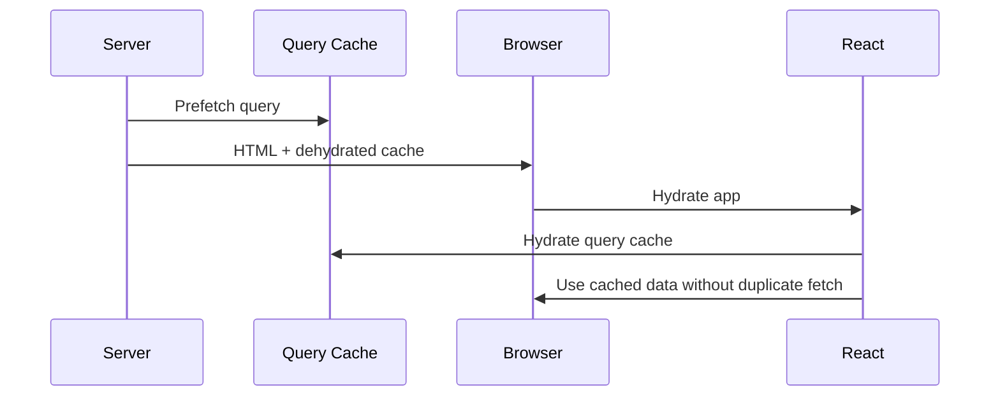

------
title: Learn Frontend React Production Architecture - Part 018
description: Production-grade guide to server state and cache architecture in React, including stale/fresh semantics, query keys, invalidation, deduplication, retries, mutations, optimistic updates, pagination, SSR/RSC hydration, and anti-patterns.
series: learn-frontend-react-production-architecture
seriesTitle: Learn Frontend React Production Architecture
order: 18
partTitle: Server State and Cache Architecture
tags:
- react
- frontend
- server-state
- cache
- tanstack-query
- rtk-query
- data-fetching
- architecture
- production
- series
date: 2026-06-28
---

# Part 018 — Server State and Cache Architecture

## Tujuan Pembelajaran

Part 017 membahas global client state. Sekarang kita fokus pada kategori yang sering salah dimasukkan ke global store: **server state**.

Server state adalah data yang source of truth-nya berada di backend.

Contoh:

- case detail,
- case list,
- user profile,
- permissions,
- audit timeline,
- notification count,
- reference data,
- report results,
- search results,
- dashboard metrics.

Server state berbeda dari client state karena:

- bisa stale,
- bisa gagal di-fetch,
- bisa di-refetch,
- bisa di-cache,
- bisa di-invalidate,
- bisa di-update oleh user lain,
- bisa dipengaruhi permission,
- bisa berubah tanpa React tahu,
- memiliki lifecycle network,
- memiliki concurrency risk.

Part ini membahas server-state cache sebagai **distributed data synchronization problem**, bukan sekadar `fetch()`.

---

## 1. Server State Mental Model

Client tidak memiliki server state. Client memiliki **snapshot/cache** dari server state.



Important:

> Server state in frontend is a synchronized copy, not authority.

---

## 2. Server State vs Client State

| Aspect | Client State | Server State |
|---|---|---|
| Source of truth | browser/client | backend/server |
| Update owner | user/UI | API/backend/domain |
| Can be stale | usually no | yes |
| Needs fetch | no | yes |
| Needs cache invalidation | rarely | yes |
| Needs retry | no | often |
| Needs loading/error | not usually | yes |
| Shared across users | no | often |
| Can change externally | no | yes |
| Example | modal open | case detail |

Do not treat server state like local `useState` unless trivial.

---

## 3. Why Manual `useEffect` Fetching Breaks Down

Demo:

```tsx
function CaseDetail({ caseId }: { caseId: string }) {
  const [data, setData] = useState<CaseDetail | null>(null);
  const [loading, setLoading] = useState(false);
  const [error, setError] = useState<Error | null>(null);

  useEffect(() => {
    setLoading(true);

    fetch(`/api/cases/${caseId}`)
      .then((response) => response.json())
      .then(setData)
      .catch(setError)
      .finally(() => setLoading(false));
  }, [caseId]);

  // ...
}
```

Problems:

- race condition,
- duplicate requests,
- no cache reuse,
- no stale/fresh semantics,
- no background refetch,
- no retry policy,
- no pagination model,
- no mutation invalidation,
- no optimistic update,
- no garbage collection,
- no SSR hydration,
- no offline/reconnect handling,
- inconsistent error normalization,
- repeated boilerplate everywhere.

Manual effect can work for small one-off browser synchronization. It is not a scalable server-state architecture.

---

## 4. Server-State Responsibilities

A production server-state layer handles:

1. query identity,
2. cache storage,
3. stale/fresh policy,
4. deduplication,
5. retry policy,
6. request cancellation,
7. background refetch,
8. pagination/infinite loading,
9. mutation lifecycle,
10. optimistic update,
11. invalidation,
12. cache garbage collection,
13. SSR/RSC hydration,
14. offline/reconnect,
15. error normalization,
16. devtools/debugging,
17. test/mocking strategy.

This is why TanStack Query, RTK Query, Apollo, Relay, SWR, route loaders, and RSC data layers exist.

---

## 5. Query Key Design

Query key is cache identity.

```ts
const caseKeys = {
  all: ["cases"] as const,
  list: (filters: CaseFilters) => [...caseKeys.all, "list", filters] as const,
  detail: (caseId: string) => [...caseKeys.all, "detail", caseId] as const,
  timeline: (caseId: string) => [...caseKeys.detail(caseId), "timeline"] as const,
};
```

Good query keys:

- include all variables that affect result,
- stable and serializable,
- hierarchical,
- reusable for invalidation,
- typed,
- centralized.

Bad:

```ts
useQuery({
  queryKey: ["cases"],
  queryFn: () => getCases(filters),
});
```

If filters change but key doesn't, cache returns wrong data.

Also bad:

```ts
queryKey: ["cases", Math.random()]
```

No cache reuse.

---

## 6. URL State and Query Keys

For list pages, query keys should derive from parsed URL state.

```tsx
const [filters] = useCaseFiltersUrlState();

const query = useQuery({
  queryKey: caseKeys.list(filters),
  queryFn: () => caseApi.getCases(filters),
});
```

Flow:



The parsed filter object should normalize defaults.

Avoid these meaning different things accidentally:

```txt
/cases
/cases?page=1
/cases?page=01
/cases?page=
```

Canonicalize or parse to same `CaseFilters`.

---

## 7. Stale vs Fresh

Server-state cache needs freshness semantics.

Concept:

- **fresh**: data is recent enough; no refetch needed on mount/focus.
- **stale**: data can be shown but should be refetched under triggers.
- **inactive**: no component currently observes it.
- **garbage collected**: removed from cache after inactivity.

Example:

```ts
useQuery({
  queryKey: caseKeys.detail(caseId),
  queryFn: () => caseApi.getCaseDetail(caseId),
  staleTime: 30_000,
  gcTime: 5 * 60_000,
});
```

Policy depends on data.

| Data | Possible staleTime |
|---|---|
| reference countries | hours/days |
| current case detail | short |
| audit timeline | short/no stale if critical |
| dashboard metrics | 30s-5m |
| current user | session-based |
| permissions | short/per request |
| report result | long if immutable |

Do not copy one `staleTime` everywhere.

---

## 8. Cache Garbage Collection

Cache cannot grow forever.

When no component observes a query, it becomes inactive. After configured time, it can be garbage collected.

Consider memory:

- large tables,
- report results,
- document previews,
- PDF blobs,
- infinite queries,
- many filter combinations.

For heavy data:

- shorter gc time,
- avoid storing huge blobs in query cache,
- paginate,
- cache metadata separately,
- revoke object URLs,
- clear on logout.

---

## 9. Retry Policy

Not every error should retry.

Retry good for:

- transient network error,
- 502/503/504,
- temporary timeout.

Retry bad for:

- 400 validation,
- 401 unauthenticated,
- 403 forbidden,
- 404 not found,
- 409 conflict,
- domain rule rejection.

Example:

```ts
function shouldRetry(failureCount: number, error: AppError) {
  if (failureCount >= 2) {
    return false;
  }

  return error.type === "network" || error.status >= 500;
}
```

Use exponential backoff if library supports.

Do not retry state-changing operations blindly unless idempotency is guaranteed.

---

## 10. Error Normalization

Raw errors are inconsistent:

- `fetch` network error,
- HTTP response error,
- validation error,
- domain error,
- auth error,
- JSON parse error,
- timeout,
- abort.

Normalize at API boundary.

```ts
type AppError =
  | { type: "network"; message: string }
  | { type: "unauthenticated" }
  | { type: "forbidden" }
  | { type: "not_found"; resource: string }
  | { type: "conflict"; message: string }
  | { type: "validation"; fields: Record<string, string[]> }
  | { type: "server"; message: string };
```

UI can then map:

```tsx
if (error.type === "forbidden") {
  return <ForbiddenPage />;
}

if (error.type === "not_found") {
  return <CaseNotFound />;
}

return <CaseDetailLoadError error={error} />;
```

---

## 11. Query Function Boundaries

Keep query function clean.

```ts
async function getCaseDetail(caseId: string): Promise<CaseDetail> {
  const response = await http.get(`/cases/${caseId}`);

  return caseDetailSchema.parse(response);
}
```

Do not put UI logic in query function.

Bad:

```ts
async function getCaseDetail(caseId) {
  const response = await fetch(...);

  if (response.status === 401) {
    navigate("/login");
  }

  toast.error("Failed");
}
```

API boundary should return data or normalized error. UI/router handles presentation/navigation.

---

## 12. Loading States

Server-state loading is not one boolean.

Common states:

- initial loading,
- background refetching,
- pending mutation,
- placeholder data,
- previous data while new filters load,
- offline paused,
- error with stale data still available.

UI should distinguish:

| State | UI |
|---|---|
| first load | skeleton |
| refetch with old data | subtle indicator |
| mutation pending | button/row pending |
| query error no data | error page |
| query error with stale data | banner + old data |
| offline | offline banner |
| empty result | empty state |

Bad:

```tsx
if (isLoading || isFetching) return <Spinner />;
```

This hides existing data during background refresh.

---

## 13. Placeholder and Previous Data

For pagination/filter changes, UX often benefits from keeping previous data while new data loads.

Example:

```tsx
const query = useQuery({
  queryKey: caseKeys.list(filters),
  queryFn: () => caseApi.getCases(filters),
  placeholderData: keepPreviousData,
});
```

Concept:

- page 1 visible,
- user clicks page 2,
- page 1 remains while page 2 fetches,
- pending indicator shown,
- when page 2 arrives, data updates.

Avoid layout flash.

---

## 14. Pagination

Offset pagination:

```ts
type CaseFilters = {
  page: number;
  pageSize: number;
};
```

Query key:

```ts
caseKeys.list(filters)
```

API:

```ts
GET /cases?page=2&pageSize=25
```

Cursor pagination:

```ts
type CursorPage = {
  items: Case[];
  nextCursor?: string;
};
```

Infinite query model:

```ts
useInfiniteQuery({
  queryKey: caseKeys.infinite(filters),
  queryFn: ({ pageParam }) =>
    caseApi.getCases({ ...filters, cursor: pageParam }),
  getNextPageParam: (lastPage) => lastPage.nextCursor,
});
```

Choose based on backend semantics.

For mutable data, offset pagination can shift under user. Cursor pagination is often safer for event feeds.

---

## 15. Mutations

Mutation changes server state.

Example:

```ts
function useApproveCaseMutation() {
  const queryClient = useQueryClient();

  return useMutation({
    mutationFn: caseApi.approveCase,
    onSuccess: (_, input) => {
      queryClient.invalidateQueries({
        queryKey: caseKeys.detail(input.caseId),
      });

      queryClient.invalidateQueries({
        queryKey: caseKeys.all,
      });
    },
  });
}
```

Mutation lifecycle:



For domain actions, mutation result should be confirmed by backend.

---

## 16. Invalidation Strategy

Invalidation tells cache data is stale and should refetch when observed or immediately depending library/action.

After approving case:

Affected:

- case detail,
- case list,
- audit timeline,
- dashboard counts,
- notification count maybe,
- report metrics maybe.

Invalidation map:

```ts
function invalidateAfterCaseAction(
  queryClient: QueryClient,
  caseId: string
) {
  queryClient.invalidateQueries({ queryKey: caseKeys.detail(caseId) });
  queryClient.invalidateQueries({ queryKey: caseKeys.listPrefix() });
  queryClient.invalidateQueries({ queryKey: dashboardKeys.caseMetrics() });
}
```

Use hierarchical keys to make this easy.

Avoid broad invalidation if too expensive:

```ts
queryClient.invalidateQueries();
```

This can refetch the world.

---

## 17. Direct Cache Update

Sometimes update cache directly after mutation.

```ts
queryClient.setQueryData(caseKeys.detail(caseId), (current) => {
  if (!current) {
    return current;
  }

  return {
    ...current,
    status: "APPROVED",
  };
});
```

Good when:

- server response contains updated entity,
- update is simple,
- avoids unnecessary refetch,
- correctness is clear.

Still often refetch/revalidate eventually for domain-critical data.

For regulatory workflow, prefer server-confirmed response + invalidation if state transition has side effects.

---

## 18. Optimistic Updates

Optimistic update shows change before server confirms.

Useful for:

- likes,
- toggles,
- preference changes,
- low-risk UI,
- reversible actions.

Risky for:

- approval/rejection,
- financial transaction,
- legal decision,
- irreversible destructive action,
- workflow transition with audit,
- high-conflict entity.

Optimistic pattern:

```ts
useMutation({
  mutationFn: caseApi.updateCaseNote,
  onMutate: async (input) => {
    await queryClient.cancelQueries({
      queryKey: caseKeys.detail(input.caseId),
    });

    const previous = queryClient.getQueryData(caseKeys.detail(input.caseId));

    queryClient.setQueryData(caseKeys.detail(input.caseId), (current) => {
      if (!current) return current;

      return {
        ...current,
        notes: [...current.notes, input.note],
      };
    });

    return { previous };
  },
  onError: (_error, input, context) => {
    queryClient.setQueryData(caseKeys.detail(input.caseId), context?.previous);
  },
  onSettled: (_data, _error, input) => {
    queryClient.invalidateQueries({
      queryKey: caseKeys.detail(input.caseId),
    });
  },
});
```

---

## 19. Concurrency and Conflict

Server state can change between read and write.

Use version:

```ts
type ApproveCaseInput = {
  caseId: string;
  expectedVersion: number;
  reason: string;
};
```

Backend can return conflict:

```json
{
  "type": "conflict",
  "message": "Case was updated by another user.",
  "currentVersion": 12
}
```

UI response:

- show conflict banner,
- refetch case,
- ask user to review latest state,
- preserve draft reason if safe,
- do not silently override.

Conflict is not just error. It is workflow reality.

---

## 20. Realtime and Cache

Realtime events should update or invalidate cache.

Event:

```ts
type CaseUpdatedEvent = {
  id: string;
  caseId: string;
  version: number;
  type: "CASE_UPDATED";
};
```

Option A: invalidate.

```ts
socket.on("CASE_UPDATED", (event) => {
  queryClient.invalidateQueries({
    queryKey: caseKeys.detail(event.caseId),
  });
});
```

Option B: apply patch.

```ts
socket.on("CASE_STATUS_CHANGED", (event) => {
  queryClient.setQueryData(caseKeys.detail(event.caseId), (current) => {
    if (!current || event.version <= current.version) {
      return current;
    }

    return {
      ...current,
      status: event.status,
      version: event.version,
    };
  });
});
```

Use patch only if event payload and ordering are reliable enough. Otherwise invalidate.

---

## 21. Deduplication

Server-state libraries dedupe identical in-flight queries by query key.

If two components ask:

```ts
useCaseDetailQuery("CASE-001");
```

they should share request/cache.

Manual fetch in components often duplicates:

```txt
CaseHeader fetches /cases/1
CaseActions fetches /cases/1
CaseTimeline fetches /cases/1
```

Better:

- one query consumed by multiple components,
- route loads data and passes down,
- query cache shares result.

---

## 22. Request Cancellation

When params change, old request may become irrelevant.

Use abort signals if supported by library/API.

```ts
useQuery({
  queryKey: caseKeys.detail(caseId),
  queryFn: ({ signal }) => caseApi.getCaseDetail(caseId, { signal }),
});
```

Fetch:

```ts
async function getCaseDetail(
  caseId: string,
  options?: { signal?: AbortSignal }
) {
  const response = await fetch(`/api/cases/${caseId}`, {
    signal: options?.signal,
  });

  return parseResponse(response);
}
```

Cancellation reduces race and wasted network.

---

## 23. SSR Hydration

SSR/RSC/framework data can hydrate client cache.

Flow:



Risks:

- query keys differ server/client,
- serialized state contains sensitive data,
- dehydrated payload too large,
- cache stale immediately and refetches anyway,
- XSS unsafe serialization,
- server and client auth context mismatch.

Hydration should be designed, not accidental.

---

## 24. RSC and Server State

In React Server Components architecture, some server state is read directly in Server Components.

Example:

```tsx
async function CaseDetailPage({ caseId }: { caseId: string }) {
  const caseDetail = await getCaseDetail(caseId);

  return <CaseDetailView caseDetail={caseDetail} />;
}
```

Client-side query cache may still be needed for:

- interactive widgets,
- realtime updates,
- client mutations,
- background refetch,
- client-only route sections.

Do not duplicate server data into client cache unless client needs it.

Boundary question:

> Does this data need to be interactive/live in the browser, or only rendered server-side?

---

## 25. RTK Query vs TanStack Query vs Framework Data

| Option | Good Fit |
|---|---|
| TanStack Query | framework-agnostic server-state cache for React |
| RTK Query | Redux-integrated API cache |
| React Router loaders/actions | route-centric data loading and mutations |
| Next.js RSC/data cache | server-rendered/RSC routes |
| Apollo/Relay | GraphQL normalized cache |
| SWR | lightweight fetch/cache pattern |

Decision criteria:

- app architecture: SPA vs SSR/RSC,
- existing Redux usage,
- GraphQL vs REST,
- need normalized cache,
- route loader model,
- SSR hydration requirements,
- team familiarity,
- mutation complexity,
- devtools,
- cache invalidation model.

Do not mix multiple server-state libraries casually.

---

## 26. Cache Key and Permission

If data depends on user permission, cache must account for auth context.

For most client apps, query cache is per browser session, so user separation happens by logout clearing cache.

But if user switches workspace/tenant:

```ts
const caseKeys = {
  list: (workspaceId: string, filters: CaseFilters) =>
    ["workspaces", workspaceId, "cases", "list", filters] as const,
};
```

If permission scope changes, invalidate affected queries.

On logout:

```ts
queryClient.clear();
```

Do not let user B see user A's cached data after account switch.

---

## 27. Sensitive Data

Query cache lives in memory and may be inspected by browser devtools.

If persisted, it may live in storage.

Be careful caching:

- PII,
- confidential case details,
- documents,
- tokens,
- audit notes,
- financial data,
- legal reasoning,
- private reports.

Rules:

- clear on logout,
- avoid persistence unless approved,
- avoid logging sensitive data,
- restrict devtools in production if policy requires,
- avoid dehydrating sensitive data into public HTML,
- scope cache per user/tenant.

---

## 28. Empty State vs Error State

Empty is not error.

```tsx
if (query.data.items.length === 0) {
  return <EmptyCases filters={filters} />;
}
```

Different empty states:

- no cases at all,
- no results for filters,
- no permission,
- loading failed,
- archived only,
- search too narrow.

Do not show “No data” for 403 or network failure.

---

## 29. Refetch Triggers

Common triggers:

- component mount,
- window focus,
- reconnect,
- interval,
- manual refresh,
- mutation invalidation,
- route navigation,
- event subscription,
- visibility change.

Each data type needs policy.

For volatile dashboard:

```ts
refetchInterval: 30_000
```

For case detail:

- refetch on focus,
- invalidate after mutations,
- subscribe to realtime,
- manual refresh button.

For reference data:

- long stale time.

---

## 30. Offline Behavior

Server-state libraries can pause/retry depending network mode.

Design UX:

- show offline banner,
- avoid destructive mutations offline unless queued safely,
- allow read from cache if acceptable,
- indicate stale data,
- retry on reconnect,
- clear unsafe optimistic states if conflict.

For regulatory actions, offline queue is dangerous unless backend supports idempotency, conflict handling, and audit.

---

## 31. API Contract and Schema Validation

Server-state cache is only as reliable as API contract.

Validate responses at boundary when risk justifies.

```ts
const caseDetailSchema = z.object({
  id: z.string(),
  referenceNo: z.string(),
  status: z.enum(["OPEN", "UNDER_REVIEW", "APPROVED", "CLOSED"]),
  version: z.number().int(),
});

async function getCaseDetail(caseId: string): Promise<CaseDetail> {
  const json = await http.get(`/cases/${caseId}`);

  return caseDetailSchema.parse(json);
}
```

Validation catches:

- backend contract drift,
- malformed data,
- unexpected null,
- wrong enum,
- version mismatch.

Do not over-validate every trivial payload if performance/maintenance cost is high. Use judgment.

---

## 32. Testing Server State

Test levels:

### 32.1 API client unit tests

- correct URL,
- query params,
- error mapping,
- schema validation.

### 32.2 Hook/component tests

- loading state,
- success state,
- error state,
- empty state,
- retry,
- mutation success/invalidation.

### 32.3 Integration tests with MSW

Mock network at HTTP boundary.

### 32.4 E2E tests

Critical workflow against test backend or realistic mock.

### 32.5 Cache tests

- invalidation after mutation,
- optimistic rollback,
- query key correctness,
- logout clears cache.

---

## 33. Anti-Pattern Catalog

### 33.1 Server State in Global Store by Default

Manual cache lifecycle hidden in app store.

### 33.2 Query Key Missing Variables

Wrong data from cache.

### 33.3 Refetch Everything After Any Mutation

Works initially, collapses at scale.

### 33.4 No Invalidation After Mutation

UI stale after command.

### 33.5 Optimistic Update for Critical Workflow

UI claims success before backend confirms.

### 33.6 Treating 403/404/409 as Retryable

Bad UX and wasted traffic.

### 33.7 Loading Spinner on Background Refetch

Hides useful stale data.

### 33.8 Persisting Sensitive Query Cache

Security risk.

### 33.9 Duplicate Fetch Server and Client

SSR/RSC fetched data, client immediately refetches due to cache mismatch.

### 33.10 Ignoring Other Users

Assumes data changes only from current UI.

---

## 34. Mini Case Study: Case Detail Cache

### Requirements

- case detail route,
- audit timeline,
- approve action,
- realtime event when case changes,
- conflict if stale version,
- clear cache on logout.

### Query Keys

```ts
const caseKeys = {
  all: ["cases"] as const,
  detail: (caseId: string) => [...caseKeys.all, "detail", caseId] as const,
  timeline: (caseId: string) => [...caseKeys.detail(caseId), "timeline"] as const,
  list: (filters: CaseFilters) => [...caseKeys.all, "list", filters] as const,
};
```

### Detail Query

```ts
function useCaseDetailQuery(caseId: string) {
  return useQuery({
    queryKey: caseKeys.detail(caseId),
    queryFn: ({ signal }) => caseApi.getCaseDetail(caseId, { signal }),
    staleTime: 30_000,
    retry: shouldRetry,
  });
}
```

### Approve Mutation

```ts
function useApproveCaseMutation() {
  const queryClient = useQueryClient();

  return useMutation({
    mutationFn: caseApi.approveCase,
    onSuccess: (_, input) => {
      queryClient.invalidateQueries({
        queryKey: caseKeys.detail(input.caseId),
      });

      queryClient.invalidateQueries({
        queryKey: caseKeys.timeline(input.caseId),
      });

      queryClient.invalidateQueries({
        queryKey: caseKeys.all,
        exact: false,
      });
    },
  });
}
```

### Realtime

```ts
function useCaseRealtimeInvalidation(caseId: string) {
  const queryClient = useQueryClient();

  useEffect(() => {
    const subscription = caseEvents.subscribe(caseId, (event) => {
      if (event.type === "CASE_UPDATED") {
        queryClient.invalidateQueries({
          queryKey: caseKeys.detail(caseId),
        });
      }

      if (event.type === "AUDIT_EVENT_APPENDED") {
        queryClient.invalidateQueries({
          queryKey: caseKeys.timeline(caseId),
        });
      }
    });

    return () => subscription.unsubscribe();
  }, [caseId, queryClient]);
}
```

---

## 35. Deliberate Practice

### Latihan 1 — Query Key Audit

List all queries.

| Query | Key | Variables Included? | Invalidation Path |
|---|---|---:|---|
| case list | `["cases"]` | no | bad |
| case detail | `["cases", id]` | yes | approve/reject |
| timeline | `["timeline", id]` | yes | event append |

Fix missing variables.

### Latihan 2 — Mutation Invalidation Map

For each mutation:

| Mutation | Affected Cache |
|---|---|
| approve case | detail, list, timeline, dashboard |
| assign officer | detail, list, officer queue |
| add note | detail/timeline |
| mark notification read | notification summary/list |

### Latihan 3 — Error Policy

Classify errors:

| Error | Retry? | UI |
|---|---:|---|
| 401 | no | redirect/login |
| 403 | no | forbidden |
| 404 | no | not found |
| 409 | no | conflict resolution |
| 500 | yes maybe | retry/error |
| network | yes maybe | offline/retry |

### Latihan 4 — Optimistic Update Decision

For 5 mutations, decide:

- optimistic,
- pessimistic pending,
- direct cache update after success,
- invalidate only.

Justify based on domain risk.

---

## 36. Review Checklist

Before approving server-state code:

1. Is this truly server state?
2. Is query key complete?
3. Is API boundary centralized?
4. Are responses normalized/validated as needed?
5. Is staleTime intentional?
6. Is retry policy intentional?
7. Are errors normalized?
8. Is loading/refetch UI correct?
9. Is pagination model correct?
10. Does mutation invalidate affected queries?
11. Is optimistic update safe?
12. Are conflicts handled?
13. Does logout clear sensitive cache?
14. Does workspace/user switch clear or scope cache?
15. Are realtime events reconciled?
16. Is SSR hydration needed?
17. Is duplicate fetch avoided?
18. Is sensitive data persisted/dehydrated safely?
19. Are tests covering success/error/empty/mutation?
20. Is field telemetry available for failures?

---

## 37. Ringkasan

Server state is not client state.

It is a cached, stale-prone, failure-prone, permission-sensitive copy of backend truth.

A mature server-state architecture has:

- query keys,
- cache policy,
- stale/fresh semantics,
- invalidation,
- mutation lifecycle,
- error normalization,
- retry policy,
- concurrency handling,
- security boundaries,
- SSR/RSC hydration strategy,
- realtime reconciliation,
- logout cleanup.

The goal is not to fetch data. The goal is to keep the UI synchronized with backend truth under latency, failure, concurrency, and change.

---

## 38. Self-Assessment

Anda siap lanjut jika bisa menjawab:

1. Apa beda server state dan client state?
2. Mengapa query key harus berisi semua variabel?
3. Apa beda stale dan fresh?
4. Kapan retry tidak boleh dilakukan?
5. Apa perbedaan invalidation dan direct cache update?
6. Kapan optimistic update berbahaya?
7. Bagaimana menangani conflict 409?
8. Bagaimana realtime event mempengaruhi cache?
9. Apa yang harus terjadi pada query cache saat logout?
10. Bagaimana mencegah duplicate fetch SSR/client?

---

## 39. Sumber Rujukan

- TanStack Query Docs — Important Defaults
- TanStack Query Docs — Query Keys
- TanStack Query Docs — Mutations
- TanStack Query Docs — Query Invalidation
- TanStack Query Docs — Optimistic Updates
- TanStack Query Docs — Paginated Queries
- RTK Query Docs — Overview
- React Router Docs — Data Loading
- Next.js Docs — Data Fetching and Caching
