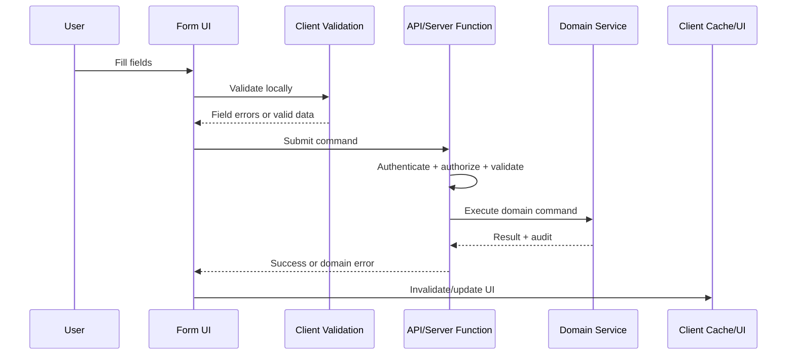
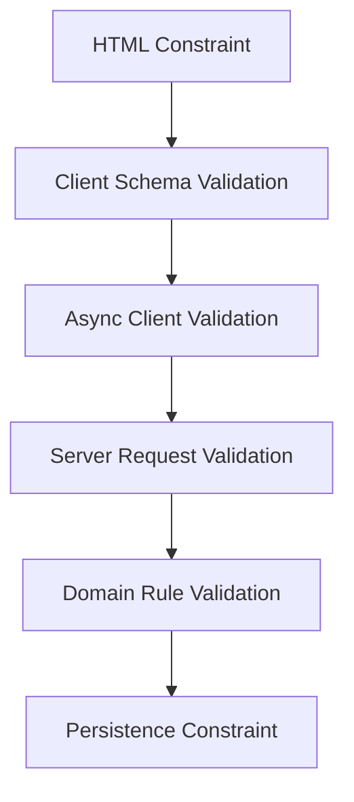
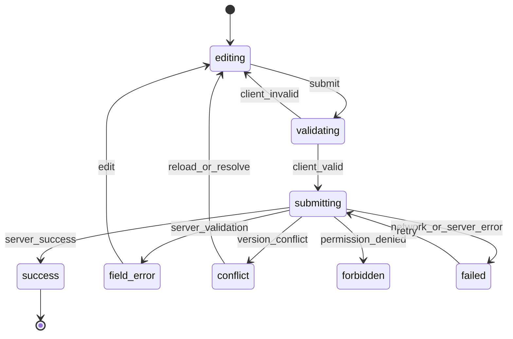
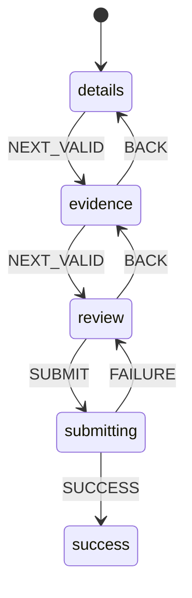
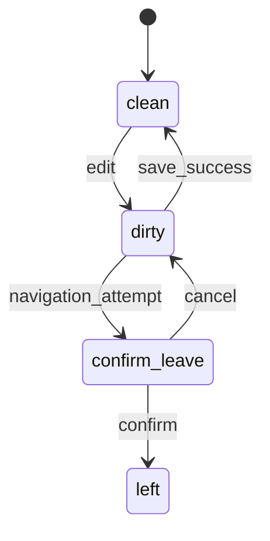
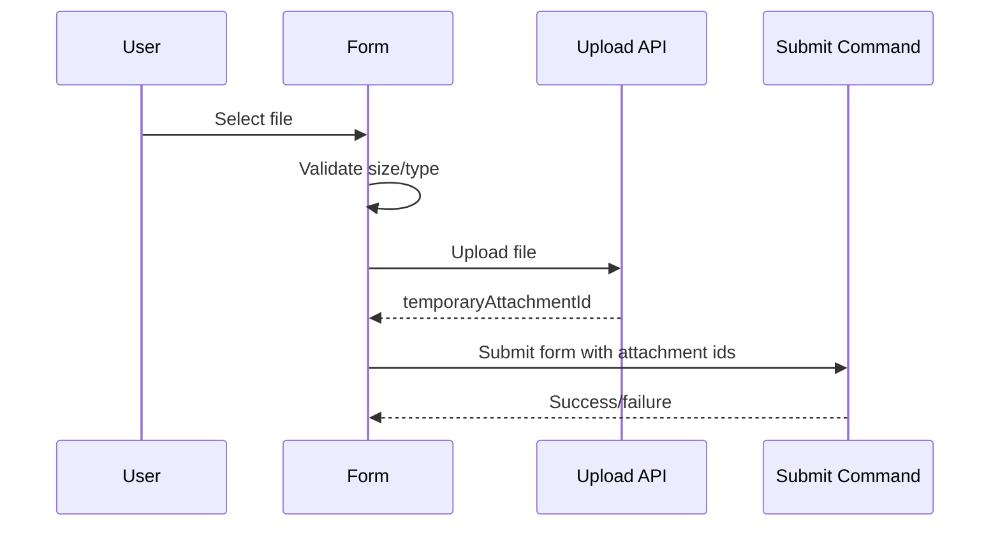

------
title: Learn Frontend React Production Architecture - Part 019
description: Production-grade guide to forms, validation, and transactional UI in React, including controlled and uncontrolled forms, schema validation, async validation, dirty/touched state, multi-step workflows, optimistic and pessimistic submit, rollback, accessibility, and anti-patterns.
series: learn-frontend-react-production-architecture
seriesTitle: Learn Frontend React Production Architecture
order: 19
partTitle: Forms, Validation, and Transactional UI
tags:
- react
- frontend
- forms
- validation
- transactional-ui
- react-hook-form
- zod
- architecture
- production
- series
date: 2026-06-28
---

# Part 019 — Forms, Validation, and Transactional UI

## Tujuan Pembelajaran

Forms adalah salah satu area frontend yang terlihat sederhana tetapi sering menjadi sumber bug production paling mahal.

Form bukan hanya input dan submit.

Form production mencakup:

- value state,
- default values,
- dirty/touched state,
- validation,
- async validation,
- server validation errors,
- dependent fields,
- conditional fields,
- multi-step state,
- draft persistence,
- submit lifecycle,
- duplicate submit prevention,
- optimistic/pessimistic behavior,
- rollback,
- conflict handling,
- accessibility,
- auditability,
- backend contract,
- security.

Dalam sistem regulatory/case management, form sering merepresentasikan **intent untuk mengubah state domain**. Karena itu, form harus diperlakukan sebagai transactional UI, bukan sekadar layout input.

---

## 1. Mental Model: Form as Transaction Boundary

Form adalah boundary antara:

1. user intent,
2. client validation,
3. server validation,
4. domain command,
5. persistence,
6. audit trail,
7. UI reconciliation.



Key idea:

> Client validation improves UX. Server validation and domain rules decide truth.

---

## 2. Form State Taxonomy

Form state includes more than values.

| State | Meaning |
|---|---|
| values | current input values |
| defaultValues | baseline initial values |
| dirty | values differ from defaults |
| touched | user interacted with field |
| errors | validation/server errors |
| isValid | validation result |
| isSubmitting | submit in progress |
| submitCount | number of attempts |
| isSubmitSuccessful | submit succeeded |
| asyncValidation | remote validation status |
| disabled/readonly | interaction capability |
| visibility | conditional fields |
| optimistic overlay | pending UI change |
| conflict state | server rejected due stale data |

Do not put all of this into global store unless there is a strong lifecycle reason.

---

## 3. Controlled vs Uncontrolled Inputs

Controlled input:

```tsx
function ControlledExample() {
  const [value, setValue] = useState("");

  return (
    <input
      value={value}
      onChange={(event) => setValue(event.target.value)}
    />
  );
}
```

React owns value.

Uncontrolled input:

```tsx
function UncontrolledExample() {
  const ref = useRef<HTMLInputElement | null>(null);

  function handleSubmit() {
    console.log(ref.current?.value);
  }

  return <input ref={ref} defaultValue="" />;
}
```

DOM owns value until read.

In large forms, fully controlled fields can cause many re-renders. Libraries like React Hook Form often optimize by using uncontrolled inputs and subscriptions internally.

---

## 4. When Controlled Forms Are Fine

Controlled forms are fine for:

- small forms,
- search boxes,
- controlled design system components,
- dependent immediate UI,
- value-driven rendering,
- simple login form,
- local filter draft.

Example:

```tsx
function SearchForm({ onSearch }: { onSearch: (query: string) => void }) {
  const [query, setQuery] = useState("");

  return (
    <form
      onSubmit={(event) => {
        event.preventDefault();
        onSearch(query);
      }}
    >
      <input value={query} onChange={(event) => setQuery(event.target.value)} />
      <button type="submit">Search</button>
    </form>
  );
}
```

No library needed.

---

## 5. When Form Library Helps

A form library helps when you need:

- many fields,
- field-level validation,
- dirty/touched tracking,
- nested object values,
- arrays/dynamic fields,
- schema resolver,
- async validation,
- controlled/uncontrolled integration,
- field registration,
- performance with fewer re-renders,
- reusable form components,
- form context,
- server error mapping.

Example with React Hook Form:

```tsx
type ApprovalFormValues = {
  reason: string;
  acknowledge: boolean;
};

function ApprovalForm({ onSubmit }: Props) {
  const form = useForm<ApprovalFormValues>({
    defaultValues: {
      reason: "",
      acknowledge: false,
    },
  });

  return (
    <form onSubmit={form.handleSubmit(onSubmit)}>
      <textarea {...form.register("reason", { required: true })} />
      {form.formState.errors.reason && (
        <p role="alert">Reason is required.</p>
      )}

      <label>
        <input type="checkbox" {...form.register("acknowledge")} />
        I acknowledge the policy
      </label>

      <button disabled={form.formState.isSubmitting}>
        Submit
      </button>
    </form>
  );
}
```

---

## 6. Schema Validation

Schema validation centralizes form rules.

Example with Zod:

```ts
const approvalSchema = z.object({
  reason: z
    .string()
    .trim()
    .min(10, "Reason must be at least 10 characters")
    .max(2000, "Reason is too long"),
  acknowledge: z.literal(true, {
    errorMap: () => ({ message: "You must acknowledge the policy" }),
  }),
});

type ApprovalFormValues = z.infer<typeof approvalSchema>;
```

Benefits:

- single source for structural validation,
- type inference,
- safe parsing,
- reusable for API boundary,
- easier tests,
- explicit error model.

But remember:

> Schema validation is not authorization and not full domain validation.

Example: “reason is non-empty” can be client/schema rule. “Officer may approve this case in this state” is server/domain rule.

---

## 7. Validation Layers

Production forms usually have multiple validation layers.



| Layer | Example |
|---|---|
| HTML | `required`, `type=email`, `minLength` |
| client schema | Zod/Yup validation |
| async client | username/case ref availability |
| server request | body schema, auth, CSRF |
| domain rule | transition allowed, permission, version |
| persistence | unique constraint, FK constraint |

Do not rely on only one layer.

---

## 8. Client Validation vs Server Validation

Client validation:

- faster feedback,
- reduces invalid submissions,
- improves UX,
- can be bypassed.

Server validation:

- authoritative,
- protects data,
- handles concurrency,
- enforces domain rule,
- writes audit.

Never trust client validation.

Server should validate:

- required fields,
- types,
- permission,
- entity exists,
- allowed transition,
- version/ETag,
- idempotency,
- business constraints,
- tenant/workspace scope.

---

## 9. Error Types in Forms

Errors are not all the same.

| Error | Example | UI |
|---|---|---|
| field validation | reason too short | field message |
| form validation | at least one attachment required | form summary |
| async validation | reference already used | field message |
| auth error | session expired | login/reauth |
| forbidden | cannot approve | permission UI |
| conflict | case changed | conflict banner |
| domain error | case not in approvable state | form/action error |
| network error | offline | retry/banner |
| server error | 500 | generic retry |

Do not show all errors as toast.

---

## 10. Server Error Mapping

Server response:

```json
{
  "type": "validation",
  "fields": {
    "reason": ["Reason is too short"],
    "attachments": ["At least one evidence file is required"]
  },
  "form": ["Approval cannot be submitted while case is locked"]
}
```

Mapping:

```ts
function applyServerValidationErrors(
  form: UseFormReturn<ApprovalFormValues>,
  error: ValidationError
) {
  for (const [field, messages] of Object.entries(error.fields)) {
    form.setError(field as keyof ApprovalFormValues, {
      type: "server",
      message: messages[0],
    });
  }

  if (error.form.length > 0) {
    form.setError("root", {
      type: "server",
      message: error.form[0],
    });
  }
}
```

UI:

```tsx
{form.formState.errors.root && (
  <Alert tone="error">
    {form.formState.errors.root.message}
  </Alert>
)}
```

---

## 11. Dirty and Touched Semantics

Dirty means value changed from default.

Touched means field was visited/interacted with.

Use them differently:

- show validation after touched/submit,
- enable save when dirty,
- warn on navigation if dirty,
- reset dirty after successful save,
- compare default values correctly.

Example UX:

```tsx
<button disabled={!form.formState.isDirty || form.formState.isSubmitting}>
  Save
</button>
```

Be careful with default values loaded asynchronously. If defaults arrive after render, reset form intentionally.

```tsx
useEffect(() => {
  if (query.data) {
    form.reset(toFormDefaults(query.data));
  }
}, [query.data, form]);
```

---

## 12. Default Values and Reset

For edit forms:

```tsx
const form = useForm<CaseEditValues>({
  defaultValues: {
    title: "",
    description: "",
  },
});

useEffect(() => {
  if (caseDetail) {
    form.reset({
      title: caseDetail.title,
      description: caseDetail.description,
    });
  }
}, [caseDetail, form]);
```

Key questions:

- should user edits be overwritten if server refetches?
- should reset happen only when caseId changes?
- should conflict be shown if backend changed while editing?
- should draft be preserved on error?
- should successful save update defaults?

After successful save:

```ts
form.reset(savedValues);
```

This marks form clean relative to saved state.

---

## 13. Dependent Fields

Example:

- `action = REJECT` requires `reason`,
- `action = APPROVE` requires `acknowledge`,
- `country` determines `province`,
- `caseType` determines evidence fields.

Model explicitly.

```ts
const actionSchema = z.discriminatedUnion("action", [
  z.object({
    action: z.literal("APPROVE"),
    acknowledge: z.literal(true),
    reason: z.string().optional(),
  }),
  z.object({
    action: z.literal("REJECT"),
    reason: z.string().min(10),
  }),
]);
```

Discriminated unions make conditional validation clearer.

---

## 14. Field Arrays

Dynamic fields:

- attachments,
- evidence items,
- witnesses,
- notes,
- report sections.

Risks:

- unstable keys,
- losing field state,
- incorrect validation,
- reorder bugs,
- server error mapping to wrong index.

Use stable IDs, not array index as identity.

```ts
type EvidenceItem = {
  id: string;
  type: string;
  description: string;
};
```

UI key:

```tsx
{fields.map((field) => (
  <EvidenceItemEditor key={field.id} field={field} />
))}
```

---

## 15. Async Validation

Example: checking duplicate reference number.

Avoid validating every keystroke without debounce/cancellation.

```tsx
function useDebouncedAsyncValidation(value: string) {
  const [state, setState] = useState<AsyncValidationState>({
    status: "idle",
  });

  useEffect(() => {
    if (!value) {
      setState({ status: "idle" });
      return;
    }

    const controller = new AbortController();

    const timerId = window.setTimeout(async () => {
      setState({ status: "checking" });

      try {
        const result = await api.checkReference(value, {
          signal: controller.signal,
        });

        setState(result.available
          ? { status: "valid" }
          : { status: "invalid", message: "Reference already exists" }
        );
      } catch (error) {
        if (!controller.signal.aborted) {
          setState({ status: "error", message: "Could not validate" });
        }
      }
    }, 300);

    return () => {
      window.clearTimeout(timerId);
      controller.abort();
    };
  }, [value]);

  return state;
}
```

Server must still validate uniqueness at submit time.

---

## 16. Submit Lifecycle

Submit state machine:



Design UI for each state.

Not every error should be same red toast.

---

## 17. Prevent Duplicate Submit

Use multiple defenses:

- disable submit button while pending,
- server idempotency key for important commands,
- backend duplicate command protection,
- optimistic locking/version,
- UI pending state,
- ignore repeated local click while pending.

Client:

```tsx
<button type="submit" disabled={mutation.isPending}>
  {mutation.isPending ? "Submitting..." : "Submit"}
</button>
```

Server:

```txt
Idempotency-Key: uuid
```

For regulatory actions, server-side idempotency is more important than disabled button.

---

## 18. Pessimistic vs Optimistic Submit

Pessimistic:

1. submit,
2. wait server,
3. update UI after confirmation.

Optimistic:

1. submit,
2. immediately update UI,
3. rollback if server fails.

Use pessimistic for:

- approval/rejection,
- destructive action,
- regulated workflow,
- money movement,
- access control changes,
- irreversible actions.

Use optimistic for:

- local preference,
- like/favorite,
- low-risk reversible update,
- draft autosave indicator,
- reorder UI if rollback safe.

Case approval should usually be pessimistic:

```tsx
await approveCase(input);
queryClient.invalidateQueries(caseKeys.detail(input.caseId));
closeDialog();
```

Do not show official state transition before server confirms.

---

## 19. Conflict Handling

Edit form should submit expected version.

```ts
type UpdateCaseInput = {
  caseId: string;
  expectedVersion: number;
  patch: CasePatch;
};
```

If backend returns conflict:

```tsx
if (error.type === "conflict") {
  return (
    <ConflictBanner
      message="This case was updated by another user."
      onReload={reloadLatest}
      onCompare={openDiff}
    />
  );
}
```

Possible resolution:

- reload and lose draft with confirmation,
- compare changes,
- merge if safe,
- re-submit with new version if allowed,
- escalate manual review.

Conflict handling is domain design, not generic error handling.

---

## 20. Multi-Step Forms

Multi-step form decisions:

| Question | Option |
|---|---|
| Step in URL? | if reload/share/back matters |
| Draft persisted? | local, sessionStorage, backend draft |
| Validation per step? | per-step or final |
| Can skip steps? | state machine |
| Back behavior? | route history or wizard state |
| Server draft? | needed for long-running/auditable process |
| Recovery after crash? | backend/local persistence |

For regulatory onboarding/case creation, backend draft often makes sense if the form is long, critical, or auditable.

---

## 21. Wizard State Machine



Reducer:

```ts
type WizardStep = "details" | "evidence" | "review";

type WizardState = {
  step: WizardStep;
  values: CaseCreationDraft;
};

type WizardEvent =
  | { type: "UPDATE"; patch: Partial<CaseCreationDraft> }
  | { type: "NEXT" }
  | { type: "BACK" }
  | { type: "RESET" };
```

If steps are routes:

```txt
/cases/new/details
/cases/new/evidence
/cases/new/review
```

Use router as step state.

---

## 22. Navigation Blocking for Dirty Forms

If dirty and user navigates away:



UX:

- warn only when dirty,
- do not block after successful save,
- preserve user's intended destination,
- handle browser refresh separately,
- avoid trapping users.

For high-stakes forms, autosave/backend draft may be better than relying on navigation blocking.

---

## 23. Autosave

Autosave is a distributed consistency problem.

Questions:

- what triggers autosave?
- debounce interval?
- conflict behavior?
- offline behavior?
- draft version?
- save indicator?
- server validation?
- partial validation?
- audit or not?
- sensitive data storage?
- discard behavior?

Autosave state:

```ts
type AutosaveState =
  | { status: "idle" }
  | { status: "dirty" }
  | { status: "saving" }
  | { status: "saved"; savedAt: string }
  | { status: "failed"; message: string };
```

Do not implement autosave as blind `useEffect` POST on every field change without idempotency and cancellation.

---

## 24. File Upload Forms

File upload adds complexity:

- size/type validation,
- virus scan,
- progress,
- cancellation,
- retry,
- temporary file id,
- final association,
- cleanup abandoned uploads,
- preview URL revoke,
- resumable upload,
- accessibility of progress,
- security scanning result.

Flow:



Do not submit raw huge file with every form field if upload lifecycle should be separate.

---

## 25. Accessibility in Forms

Required:

- label every input,
- associate errors with fields,
- use `aria-invalid`,
- use `aria-describedby`,
- show error summary for long forms,
- focus first invalid field on submit,
- preserve keyboard order,
- avoid placeholder as label,
- do not rely on color only,
- announce submit success/failure appropriately,
- disable carefully; disabled fields are skipped and not submitted.

Example:

```tsx
<label htmlFor="reason">Reason</label>
<textarea
  id="reason"
  aria-invalid={Boolean(error)}
  aria-describedby={error ? "reason-error" : undefined}
/>
{error && (
  <p id="reason-error" role="alert">
    {error}
  </p>
)}
```

---

## 26. Security in Forms

Forms are attack surface.

Protect:

- CSRF for cookie sessions,
- XSS in user-entered rich text,
- file upload validation,
- hidden field tampering,
- price/role/status tampering,
- over-posting/mass assignment,
- authorization bypass,
- replay/double submit,
- idempotency,
- injection,
- sensitive data in logs.

Never trust hidden input:

```html
<input type="hidden" name="role" value="ADMIN" />
```

Server must derive authority from session and domain rules.

---

## 27. Transactional UI for Domain Commands

For approval command:

```ts
type ApproveCaseCommand = {
  caseId: string;
  expectedVersion: number;
  reason: string;
  idempotencyKey: string;
};
```

Client form:

- collects reason,
- includes expected version,
- creates idempotency key,
- submits,
- handles 409 conflict,
- handles 403 forbidden,
- invalidates case detail,
- closes only on success.

Server:

- validates schema,
- authenticates,
- authorizes,
- checks case version,
- validates transition,
- writes audit,
- commits transaction,
- returns result.

UI should reflect command lifecycle, not pretend local state is official.

---

## 28. React Actions and Modern Form APIs

React provides APIs such as `useActionState`, `useOptimistic`, and `useTransition` that support form/action workflows in modern React.

Conceptually:

- `useActionState` helps update state from form action result,
- `useOptimistic` supports optimistic UI while async action is pending,
- `useTransition` supports non-blocking updates and pending state.

These APIs fit especially well with framework/server action models.

But the architecture questions remain:

- where is validation?
- where is authorization?
- how are errors mapped?
- how is cache revalidated?
- what is optimistic vs pessimistic?
- what happens on conflict?
- what is the audit trail?

API does not remove transaction design.

---

## 29. Form Architecture Patterns

### 29.1 Small Controlled Form

Good for simple search/filter.

### 29.2 React Hook Form + Schema

Good for large input forms.

### 29.3 Server Action Form

Good for framework-integrated submit with server validation.

### 29.4 Form + Mutation Hook

Good for SPA API-driven workflow.

### 29.5 Backend Draft Workflow

Good for long/auditable multi-step process.

### 29.6 State Machine Wizard

Good for complex local step control.

Choose based on lifecycle and domain risk.

---

## 30. Anti-Pattern Catalog

### 30.1 Form State in Global Store by Default

Dirty/touched/errors leak across routes.

### 30.2 Client Validation as Security

Server must validate.

### 30.3 Toast for Field Errors

User cannot see which field to fix.

### 30.4 Optimistic Approval

Shows official workflow change before server commits.

### 30.5 No Conflict Handling

Last write wins silently.

### 30.6 Submit Button Only Duplicate Defense

Server needs idempotency/version control.

### 30.7 Hidden Fields Trusted

Users can tamper.

### 30.8 Default Values Not Reset Correctly

Edit form shows previous entity data.

### 30.9 Async Validation Without Cancellation

Old validation result overwrites new input.

### 30.10 Accessibility Missing

Inputs without labels, errors not announced.

---

## 31. Mini Case Study: Approve Case Form

### Requirements

- reason required,
- reason min 10 chars,
- user must acknowledge policy,
- submit case version,
- prevent duplicate submit,
- backend validates permission and transition,
- conflict if version stale,
- audit written,
- UI closes on success,
- errors mapped inline.

### Schema

```ts
const approveCaseSchema = z.object({
  caseId: z.string().min(1),
  expectedVersion: z.number().int().positive(),
  reason: z.string().trim().min(10).max(2000),
  acknowledge: z.literal(true),
  idempotencyKey: z.string().uuid(),
});

type ApproveCaseFormValues = z.infer<typeof approveCaseSchema>;
```

### Component Sketch

```tsx
function ApproveCaseForm({
  caseId,
  version,
  onSuccess,
}: {
  caseId: string;
  version: number;
  onSuccess: () => void;
}) {
  const mutation = useApproveCaseMutation();

  const form = useForm<ApproveCaseFormValues>({
    defaultValues: {
      caseId,
      expectedVersion: version,
      reason: "",
      acknowledge: false,
      idempotencyKey: crypto.randomUUID(),
    },
    resolver: zodResolver(approveCaseSchema),
  });

  async function submit(values: ApproveCaseFormValues) {
    try {
      await mutation.mutateAsync(values);
      form.reset(values);
      onSuccess();
    } catch (error) {
      const normalized = normalizeAppError(error);

      if (normalized.type === "validation") {
        applyServerValidationErrors(form, normalized);
        return;
      }

      if (normalized.type === "conflict") {
        form.setError("root", {
          type: "server",
          message: "This case has changed. Reload before approving.",
        });
        return;
      }

      form.setError("root", {
        type: "server",
        message: "Approval failed. Please try again.",
      });
    }
  }

  return (
    <form onSubmit={form.handleSubmit(submit)}>
      {form.formState.errors.root && (
        <Alert tone="error">
          {form.formState.errors.root.message}
        </Alert>
      )}

      <label htmlFor="reason">Reason</label>
      <textarea
        id="reason"
        aria-invalid={Boolean(form.formState.errors.reason)}
        {...form.register("reason")}
      />
      {form.formState.errors.reason && (
        <p role="alert">{form.formState.errors.reason.message}</p>
      )}

      <label>
        <input type="checkbox" {...form.register("acknowledge")} />
        I acknowledge this action is auditable.
      </label>

      <button
        type="submit"
        disabled={form.formState.isSubmitting || mutation.isPending}
      >
        {mutation.isPending ? "Approving..." : "Approve case"}
      </button>
    </form>
  );
}
```

---

## 32. Form Review Checklist

Before approving a production form:

1. Are default values correct?
2. Is state local/form-owned unless justified?
3. Is schema validation explicit?
4. Are server errors mapped to fields/root?
5. Are dirty/touched semantics correct?
6. Does submit prevent duplicate clicks?
7. Is backend idempotency/version control present for critical commands?
8. Are permissions validated server-side?
9. Are domain transitions validated server-side?
10. Is conflict handled?
11. Is optimistic UI appropriate or risky?
12. Are fields accessible?
13. Are errors announced?
14. Are async validations debounced/cancelled?
15. Is navigation blocking/autosave needed?
16. Are hidden fields treated as untrusted?
17. Does successful submit reset form defaults?
18. Does entity change reset the form?
19. Is sensitive data avoided in logs/storage?
20. Are tests covering validation, submit, server errors, conflict, and accessibility?

---

## 33. Deliberate Practice

### Latihan 1 — Form State Audit

Ambil satu form besar.

Buat tabel:

| State | Current Owner | Correct Owner |
|---|---|---|
| values | Redux | form |
| server errors | toast | form fields/root |
| case version | hidden field | form value + server validation |
| permission | client only | server/domain |
| dirty | missing | form state |
| conflict | generic error | conflict UI |

Refactor minimal 3.

### Latihan 2 — Validation Layer Map

Untuk form approval, tulis rules di setiap layer:

| Rule | Client | Server | Domain |
|---|---:|---:|---:|
| reason required | yes | yes | no |
| user can approve | no | yes | yes |
| case status approvable | no | yes | yes |
| version current | no | yes | yes |
| acknowledge checked | yes | yes | maybe |

### Latihan 3 — Conflict Drill

Simulasikan:

1. user opens form at version 10,
2. another user updates case to version 11,
3. first user submits approval,
4. backend returns 409.

Design exact UI.

---

## 34. Ringkasan

Forms are transactional UI.

A mature form architecture separates:

- local form state,
- client validation,
- server validation,
- domain rules,
- mutation lifecycle,
- conflict handling,
- cache invalidation,
- accessibility,
- security.

Client forms improve user experience. They do not replace backend authority.

For regulated workflow, prefer correctness and auditability over optimistic cleverness.

---

## 35. Self-Assessment

Anda siap lanjut jika bisa menjawab:

1. Apa saja yang termasuk form state selain values?
2. Kapan controlled form cukup?
3. Kapan form library membantu?
4. Mengapa client validation bukan security?
5. Apa perbedaan field error, form error, conflict, dan domain error?
6. Bagaimana menangani async validation race?
7. Kapan optimistic submit tidak aman?
8. Mengapa idempotency key penting?
9. Bagaimana menangani dirty form navigation?
10. Bagaimana mendesain approval form untuk case management?

---

## 36. Sumber Rujukan

- React Docs — `useActionState`
- React Docs — `useOptimistic`
- React Docs — `useTransition`
- React Hook Form Docs — `useForm`
- React Hook Form Docs — `handleSubmit`
- React Hook Form Resolvers
- Zod Docs — Defining Schemas
- Zod Docs — `parse` and `safeParse`
- MDN — HTML forms and constraint validation
- WAI-ARIA Authoring Practices — Form, Dialog, Error patterns
