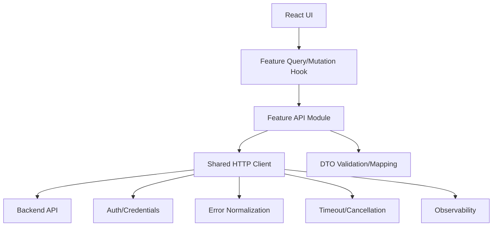

------
title: Learn Frontend React Production Architecture - Part 020
description: Production-grade guide to API integration contracts and frontend boundaries, including REST/GraphQL/tRPC-style APIs, generated clients, DTO mapping, error normalization, pagination, idempotency, retries, cancellation, security, observability, and anti-patterns.
series: learn-frontend-react-production-architecture
seriesTitle: Learn Frontend React Production Architecture
order: 20
partTitle: API Integration Contracts and Boundaries
tags:
- react
- frontend
- api
- integration
- contracts
- rest
- openapi
- architecture
- production
- series
date: 2026-06-28
---

# Part 020 — API Integration Contracts and Boundaries

## Tujuan Pembelajaran

Frontend production tidak boleh memperlakukan API sebagai detail kecil yang tersebar di component.

API integration adalah boundary arsitektur antara:

- UI,
- server-state cache,
- backend domain,
- auth/session,
- network failure,
- error semantics,
- contract versioning,
- observability,
- security.

Jika boundary ini buruk, codebase akan punya:

- `fetch()` tersebar di components,
- error handling tidak konsisten,
- retry salah,
- 401/403/404 diperlakukan sama,
- DTO backend bocor ke UI,
- pagination tidak stabil,
- idempotency hilang,
- request race,
- contract drift,
- duplicated API clients,
- auth behavior berbeda antar feature.

Part ini membahas API integration sebagai **contract and boundary design**.

---

## 1. Mental Model: API Boundary

Frontend should not call backend randomly. It should call through a boundary.



Each layer has responsibility.

| Layer | Responsibility |
|---|---|
| UI component | render, user interaction |
| query/mutation hook | cache, loading, invalidation |
| feature API module | endpoint-specific contract |
| shared HTTP client | transport, credentials, base URL |
| error normalizer | common error model |
| mapper | DTO to UI/domain model |
| backend | authority and persistence |

---

## 2. Do Not Scatter Fetch

Bad:

```tsx
function CaseDetailPage({ caseId }: { caseId: string }) {
  useEffect(() => {
    fetch(`/api/cases/${caseId}`)
      .then((response) => response.json())
      .then(setCase);
  }, [caseId]);
}
```

Problems:

- no auth policy,
- no error normalization,
- no timeout/cancellation,
- no schema validation,
- no observability,
- no cache strategy,
- no retry policy,
- no consistent URL construction,
- no test boundary.

Better:

```ts
// features/cases/api/caseApi.ts
export async function getCaseDetail(caseId: string): Promise<CaseDetail> {
  const dto = await httpClient.get<CaseDetailDto>(`/cases/${caseId}`);

  return mapCaseDetailDto(dto);
}
```

Hook:

```ts
export function useCaseDetailQuery(caseId: string) {
  return useQuery({
    queryKey: caseKeys.detail(caseId),
    queryFn: () => getCaseDetail(caseId),
  });
}
```

UI:

```tsx
const query = useCaseDetailQuery(caseId);
```

---

## 3. API Contract Types

Common frontend integration styles:

| Style | Characteristics |
|---|---|
| REST + OpenAPI | HTTP resources, generated clients possible |
| GraphQL | typed query schema, client chooses fields |
| tRPC/RPC-style | TypeScript end-to-end contracts |
| gRPC-web | protobuf contracts |
| BFF | backend-for-frontend tailored API |
| Server Functions | framework-mediated server calls |
| WebSocket/SSE | event stream integration |

Each has different contract, cache, and failure model.

This part focuses mostly on REST-like API because it is common in enterprise/regulatory systems, but principles apply broadly.

---

## 4. OpenAPI and Generated Clients

OpenAPI describes HTTP API surface and semantics in a machine-readable document.

Benefits:

- shared contract,
- generated types/client,
- contract testing,
- documentation,
- mock server generation,
- drift detection,
- easier onboarding.

Generated client can reduce manual endpoint bugs.

But generated client is not architecture by itself.

Still needed:

- error normalization,
- domain mapping,
- auth/session handling,
- observability,
- retry policy,
- cancellation,
- generated-code boundaries,
- versioning policy.

Recommended layering:

```txt
generated/
  openapi-client.ts

features/cases/api/
  caseApi.ts       # wraps generated client and maps DTOs

shared/api/
  httpClient.ts
  errors.ts
```

Do not let generated DTOs leak everywhere unless intentionally accepted.

---

## 5. DTO vs UI Model

Backend DTO often reflects API contract, not UI needs.

DTO:

```ts
type CaseDetailDto = {
  id: string;
  ref_no: string;
  subject_name: string;
  status_code: "UR" | "AP" | "CL";
  updated_at: string;
};
```

UI model:

```ts
type CaseDetail = {
  id: string;
  referenceNo: string;
  subjectName: string;
  status: "UNDER_REVIEW" | "APPROVED" | "CLOSED";
  updatedAt: Date;
};
```

Mapper:

```ts
function mapCaseDetailDto(dto: CaseDetailDto): CaseDetail {
  return {
    id: dto.id,
    referenceNo: dto.ref_no,
    subjectName: dto.subject_name,
    status: mapStatus(dto.status_code),
    updatedAt: new Date(dto.updated_at),
  };
}
```

Benefits:

- backend changes isolated,
- UI speaks domain-friendly names,
- transformation centralized,
- validation possible,
- tests easier.

Do not over-map if API contract is already frontend-oriented and stable. Use judgment.

---

## 6. Runtime Validation

TypeScript types disappear at runtime.

If API response is untrusted or contract drift is costly, validate.

```ts
const caseDetailDtoSchema = z.object({
  id: z.string(),
  ref_no: z.string(),
  subject_name: z.string(),
  status_code: z.enum(["UR", "AP", "CL"]),
  updated_at: z.string(),
});

async function getCaseDetail(caseId: string): Promise<CaseDetail> {
  const json = await httpClient.getJson(`/cases/${caseId}`);
  const dto = caseDetailDtoSchema.parse(json);

  return mapCaseDetailDto(dto);
}
```

Use runtime validation for:

- critical data,
- external API,
- unstable backend,
- security-sensitive flows,
- generated clients with weak runtime guarantees,
- high-cost contract drift.

Avoid excessive validation for every tiny stable payload if overhead/maintenance becomes too high.

---

## 7. HTTP Client Boundary

Shared HTTP client owns transport-level concerns.

Example:

```ts
type HttpClient = {
  get<T>(path: string, options?: RequestOptions): Promise<T>;
  post<T>(path: string, body: unknown, options?: RequestOptions): Promise<T>;
};

function createHttpClient(config: RuntimeConfig): HttpClient {
  async function request<T>(
    method: string,
    path: string,
    body?: unknown,
    options?: RequestOptions
  ): Promise<T> {
    const response = await fetch(`${config.apiBaseUrl}${path}`, {
      method,
      credentials: "include",
      headers: {
        "content-type": "application/json",
        ...options?.headers,
      },
      body: body === undefined ? undefined : JSON.stringify(body),
      signal: options?.signal,
    });

    return handleResponse<T>(response);
  }

  return {
    get: (path, options) => request("GET", path, undefined, options),
    post: (path, body, options) => request("POST", path, body, options),
  };
}
```

Centralize:

- base URL,
- credentials,
- headers,
- JSON parsing,
- error mapping,
- abort signal,
- observability,
- auth behavior.

---

## 8. Fetch Semantics

`fetch()` resolves successfully for HTTP error responses like 404 or 500. It rejects on network-level failures.

So this is wrong:

```ts
const response = await fetch("/api/cases/1");
const data = await response.json();
```

Need check:

```ts
const response = await fetch("/api/cases/1");

if (!response.ok) {
  throw await normalizeHttpError(response);
}

const data = await response.json();
```

This distinction matters:

- HTTP 403 is a successful network response but failed request semantics.
- Network error means no response.
- Abort error means intentional cancellation or timeout.
- Timeout needs explicit implementation.

---

## 9. HTTP Status Mapping

Map status intentionally.

| Status | Meaning for UI |
|---|---|
| 200 | success |
| 201 | created |
| 202 | accepted async processing |
| 204 | success no body |
| 400 | malformed request |
| 401 | unauthenticated |
| 403 | authenticated but forbidden |
| 404 | resource not found or hidden |
| 409 | conflict/stale version |
| 422 | validation/domain validation |
| 429 | rate limited |
| 500 | server error |
| 502/503/504 | transient upstream/service |

Do not map all non-2xx to “Something went wrong”.

---

## 10. Error Normalization

Define common error model.

```ts
type AppError =
  | { type: "network"; message: string }
  | { type: "timeout"; message: string }
  | { type: "aborted" }
  | { type: "unauthenticated" }
  | { type: "forbidden"; message?: string }
  | { type: "not_found"; resource?: string }
  | { type: "conflict"; message: string; currentVersion?: number }
  | { type: "validation"; fields: Record<string, string[]>; form: string[] }
  | { type: "rate_limited"; retryAfterSeconds?: number }
  | { type: "server"; message: string; traceId?: string }
  | { type: "unknown"; message: string };
```

Normalize once in HTTP client.

Then UI can make consistent decisions.

---

## 11. Auth and Credentials

Credential strategy depends on backend auth model.

Cookie session:

```ts
fetch(url, {
  credentials: "include",
});
```

Bearer token:

```ts
fetch(url, {
  headers: {
    Authorization: `Bearer ${token}`,
  },
});
```

Cookie-based cross-origin requests require correct CORS and cookie settings. Browser defaults do not always send credentials cross-origin.

Frontend responsibilities:

- include credentials correctly,
- handle 401 centrally,
- avoid token leakage,
- clear state on logout,
- do not store secrets in public config,
- understand CSRF model.

Backend responsibilities:

- validate session/token,
- enforce authorization,
- set secure cookie flags,
- handle CSRF where relevant,
- avoid overly broad CORS.

---

## 12. Central 401 Handling

When API returns 401:

- clear sensitive cache,
- mark user unauthenticated,
- disconnect realtime,
- redirect/login prompt,
- avoid infinite retry,
- preserve returnTo if appropriate.

Do not implement per feature.

```ts
function handleUnauthenticated() {
  queryClient.clear();
  authStore.setUnauthenticated();
  realtimeClient.disconnect();
  router.navigate("/login", { replace: true });
}
```

Be careful with background requests: a single expired session should not produce dozens of toasts.

---

## 13. 403 vs 404

403 means user is authenticated but not allowed.

404 means resource not found. Some systems intentionally return 404 for forbidden resources to avoid revealing existence.

Frontend should follow backend contract.

UI examples:

- 403: “You do not have access.”
- 404: “Case not found or unavailable.”
- hidden 404: generic not found.

Do not expose sensitive existence information if backend intentionally hides it.

---

## 14. 409 Conflict

409 often means current client state is stale.

Example:

```json
{
  "type": "conflict",
  "message": "Case was modified by another user.",
  "currentVersion": 12
}
```

UI should:

- stop submit,
- show conflict,
- refetch latest,
- preserve draft if safe,
- ask user to review,
- avoid silent overwrite.

For workflow/case management, 409 is a first-class UX path.

---

## 15. 422 Validation

Validation error shape should be consistent.

```json
{
  "type": "validation",
  "fields": {
    "reason": ["Reason is required"]
  },
  "form": ["Case is locked"]
}
```

Map field errors to form library. Map form errors to summary/root.

Avoid backends returning random string formats per endpoint.

---

## 16. Request Cancellation

Support cancellation with `AbortController`.

```ts
async function getCaseDetail(
  caseId: string,
  options?: { signal?: AbortSignal }
) {
  const response = await fetch(`/api/cases/${caseId}`, {
    signal: options?.signal,
  });

  return handleResponse<CaseDetailDto>(response);
}
```

TanStack Query can pass signal to query function.

Benefits:

- avoid wasted network,
- avoid stale response,
- improve UX on fast navigation/filter changes.

Differentiate:

- abort due to navigation,
- timeout,
- real network error.

---

## 17. Timeouts

Fetch does not have a universal default timeout behavior you should rely on for app UX.

Use abort signal timeout if supported or custom timer.

```ts
function timeoutSignal(ms: number): AbortSignal {
  return AbortSignal.timeout(ms);
}
```

Fallback:

```ts
function createTimeoutController(ms: number) {
  const controller = new AbortController();

  const timeoutId = window.setTimeout(() => {
    controller.abort();
  }, ms);

  return {
    signal: controller.signal,
    clear: () => window.clearTimeout(timeoutId),
  };
}
```

Set timeouts by endpoint type:

| Endpoint | Timeout |
|---|---|
| quick lookup | short |
| report generation start | medium |
| file upload | long |
| streaming/export | special handling |
| background poll | moderate |

---

## 18. Retries

Retry only safe requests or idempotent operations.

GET retry often okay for transient 5xx/network.

POST retry dangerous unless idempotent.

Use idempotency key for retried commands.

```ts
type CommandInput = {
  idempotencyKey: string;
  payload: unknown;
};
```

Retry policy:

```ts
function shouldRetry(error: AppError, method: HttpMethod) {
  if (method !== "GET") {
    return false;
  }

  return error.type === "network" || error.type === "server";
}
```

For command submission, let user retry intentionally unless backend supports idempotency.

---

## 19. Idempotency

Idempotency means repeating request has same effect.

Safe/idempotent-ish:

- GET,
- PUT designed as replace,
- DELETE often intended idempotent,
- POST with idempotency key.

Approval command:

```http
POST /cases/CASE-001/approve
Idempotency-Key: 8f756a9f-b7f5-4f45-bdd7-e12...
```

Backend stores key + result to prevent duplicate approval.

Frontend creates key per user submit attempt and reuses for retry of same attempt.

Do not regenerate idempotency key on automatic retry of same command.

---

## 20. Pagination Contracts

Offset:

```http
GET /cases?page=2&pageSize=25
```

Response:

```ts
type Page<T> = {
  items: T[];
  page: number;
  pageSize: number;
  total: number;
};
```

Cursor:

```http
GET /audit-events?cursor=abc&limit=50
```

Response:

```ts
type CursorPage<T> = {
  items: T[];
  nextCursor?: string;
};
```

Frontend needs to know:

- stable ordering,
- total availability,
- cursor expiration,
- empty page behavior,
- sorting/filtering semantics,
- max page size,
- consistency under mutation.

Audit/event feeds often fit cursor pagination better than offset.

---

## 21. Filtering and Sorting Contracts

Avoid ad hoc query construction.

```ts
type CaseListRequest = {
  status?: CaseStatus;
  officerId?: string;
  query?: string;
  page: number;
  pageSize: number;
  sort: "priority.desc" | "createdAt.desc";
};
```

Serializer:

```ts
function serializeCaseListRequest(input: CaseListRequest): URLSearchParams {
  const params = new URLSearchParams();

  if (input.status) params.set("status", input.status);
  if (input.officerId) params.set("officerId", input.officerId);
  if (input.query) params.set("q", input.query);

  params.set("page", String(input.page));
  params.set("pageSize", String(input.pageSize));
  params.set("sort", input.sort);

  return params;
}
```

Backend must define:

- supported filters,
- filter combinations,
- sort fields,
- default sort,
- invalid filter behavior,
- max result size.

---

## 22. DTO Versioning and Compatibility

APIs evolve.

Frontend should expect:

- new enum values,
- new fields,
- missing optional fields,
- deprecated fields,
- endpoint version changes,
- backend rolling deploy mismatch.

Strategies:

- tolerant readers,
- runtime validation with explicit unknown handling,
- feature flags,
- versioned endpoints when breaking,
- contract tests,
- generated clients pinned to spec,
- backward-compatible backend changes,
- frontend release coordination.

Enum handling:

```ts
function mapStatus(code: string): CaseStatus {
  switch (code) {
    case "UR":
      return "UNDER_REVIEW";
    case "AP":
      return "APPROVED";
    case "CL":
      return "CLOSED";
    default:
      return "UNKNOWN";
  }
}
```

For regulatory UI, unknown status may require safe fallback and monitoring.

---

## 23. API Client Generation

Generated clients can be:

- fetch-based,
- axios-based,
- TypeScript type-only,
- runtime validated,
- schema-first,
- code-first generated.

Pros:

- less manual URL/body mismatch,
- consistent types,
- faster development,
- contract drift detection.

Cons:

- generated code can be ugly,
- error model may be poor,
- runtime validation may be absent,
- DTOs leak everywhere,
- generated client may be too low-level,
- customization hard.

Best practice:

```txt
generated client -> feature API wrapper -> query/mutation hook -> UI
```

---

## 24. BFF Pattern

Backend-for-Frontend tailors API to frontend needs.

Useful when:

- multiple backend services,
- frontend needs aggregation,
- security/session handling centralized,
- response shape UI-specific,
- reduce client round trips,
- hide internal service topology,
- enforce frontend-specific policy.

Risk:

- BFF becomes another monolith,
- duplicate business logic,
- unclear ownership,
- versioning complexity.

Rule:

> BFF should orchestrate and adapt. It should not silently fork core domain rules.

---

## 25. GraphQL Note

GraphQL changes contract shape:

- schema typed,
- client chooses fields,
- normalized cache possible,
- over/under-fetch reduced,
- resolver/backend complexity higher,
- authorization still server-side,
- pagination pattern needs convention,
- caching semantics differ from REST.

Frontend still needs:

- error policy,
- retry policy,
- cache invalidation,
- DTO/domain mapping where useful,
- query colocation governance,
- security and observability.

---

## 26. Server Functions Note

Server Functions can feel like direct function calls but are still remote boundary.

Treat them like API:

- input validation,
- auth,
- authorization,
- idempotency,
- error mapping,
- observability,
- cache revalidation,
- no trust in client arguments.

Do not skip contract thinking because function is imported.

---

## 27. Realtime API Contracts

For WebSocket/SSE events, contract includes:

- event type,
- event id,
- entity id,
- version,
- timestamp,
- ordering guarantee,
- replay support,
- authorization scope,
- heartbeat,
- reconnect behavior,
- gap detection,
- payload schema.

Example:

```ts
type CaseUpdatedEvent = {
  eventId: string;
  type: "CASE_UPDATED";
  caseId: string;
  version: number;
  occurredAt: string;
};
```

Frontend should dedupe by `eventId` and ignore old versions if appropriate.

---

## 28. Observability at API Boundary

Log/measure:

- endpoint,
- route/screen,
- method,
- status class,
- latency,
- error type,
- trace id,
- request id,
- retry count,
- timeout,
- abort,
- payload size where safe,
- release id.

Do not log:

- sensitive form values,
- tokens,
- PII unless policy allows,
- full case details.

Attach correlation:

```ts
headers: {
  "x-client-request-id": crypto.randomUUID(),
  "x-client-release": config.releaseId,
}
```

Backend can echo trace id in errors.

---

## 29. Security Boundary

API integration must assume hostile client.

Frontend cannot enforce:

- role,
- permission,
- object ownership,
- transition validity,
- rate limits,
- input validity,
- hidden fields,
- tenant boundary.

Backend must enforce.

Frontend should:

- not expose secrets,
- not send unnecessary sensitive data,
- avoid storing tokens insecurely,
- handle CSRF/CORS correctly,
- sanitize rendered server content,
- avoid overbroad logging,
- keep dependencies patched.

---

## 30. Testing API Boundary

Test:

### 30.1 API module unit tests

- URL serialization,
- request method/body,
- response mapping,
- error normalization.

### 30.2 Contract tests

- generated client matches spec,
- backend response matches schema,
- mock server from OpenAPI.

### 30.3 Component integration tests

Use MSW or equivalent network mocking.

### 30.4 E2E

- critical path against real/staging backend,
- auth/permission cases,
- conflict handling,
- validation error mapping.

### 30.5 Failure simulation

- 401,
- 403,
- 404,
- 409,
- 422,
- 500,
- network offline,
- timeout,
- malformed response.

---

## 31. Folder Architecture

```txt
src/
  shared/
    api/
      httpClient.ts
      errors.ts
      requestId.ts
      pagination.ts
  features/
    cases/
      api/
        caseApi.ts
        caseKeys.ts
        caseQueries.ts
        caseMutations.ts
        caseDtoSchemas.ts
        caseMappers.ts
      model/
        caseTypes.ts
      routes/
      components/
```

Rules:

- `shared/api` has generic transport only.
- feature API owns endpoint-specific logic.
- query/mutation hooks own cache integration.
- UI never imports raw generated client directly unless intentionally simple.
- DTO schemas/mappers stay near feature API.
- model types used by UI are stable.

---

## 32. Anti-Pattern Catalog

### 32.1 Fetch Calls Scattered Across Components

No boundary, no consistency.

### 32.2 Generated Client Imported Everywhere

DTO and low-level errors leak into UI.

### 32.3 All Errors as `Error`

UI cannot distinguish 403 vs 409 vs validation.

### 32.4 Retry Every Failure

Retries 403/404/validation and creates bad UX.

### 32.5 POST Retry Without Idempotency

Duplicate command risk.

### 32.6 DTO as UI Model Forever

Backend naming/status codes leak across UI.

### 32.7 No Runtime Contract Validation for Critical Data

Contract drift crashes deep in UI.

### 32.8 API Client Navigates Directly

Transport layer performs UI routing side effects.

### 32.9 Auth Handling Per Feature

Inconsistent session expiration behavior.

### 32.10 No Contract Tests

Frontend/backend drift discovered in production.

---

## 33. Mini Case Study: Case API Boundary

### Backend

```http
GET /cases/{caseId}
POST /cases/{caseId}/approve
GET /cases?status=&page=&pageSize=
GET /cases/{caseId}/audit-events?cursor=
```

### Folder

```txt
features/cases/api/
  caseApi.ts
  caseDtoSchemas.ts
  caseMappers.ts
  caseKeys.ts
  caseQueries.ts
  caseMutations.ts
```

### DTO Schema

```ts
const caseDetailDtoSchema = z.object({
  id: z.string(),
  referenceNo: z.string(),
  status: z.enum(["OPEN", "UNDER_REVIEW", "APPROVED", "CLOSED"]),
  version: z.number().int(),
  subjectName: z.string(),
});
```

### API Module

```ts
export async function getCaseDetail(
  caseId: string,
  options?: { signal?: AbortSignal }
): Promise<CaseDetail> {
  const json = await httpClient.getJson(`/cases/${caseId}`, {
    signal: options?.signal,
  });

  const dto = caseDetailDtoSchema.parse(json);

  return mapCaseDetailDto(dto);
}
```

### Mutation

```ts
export async function approveCase(
  input: ApproveCaseInput
): Promise<ApproveCaseResult> {
  const json = await httpClient.postJson(
    `/cases/${input.caseId}/approve`,
    {
      reason: input.reason,
      expectedVersion: input.expectedVersion,
    },
    {
      headers: {
        "Idempotency-Key": input.idempotencyKey,
      },
    }
  );

  return approveCaseResultSchema.parse(json);
}
```

### Query Hook

```ts
export function useCaseDetailQuery(caseId: string) {
  return useQuery({
    queryKey: caseKeys.detail(caseId),
    queryFn: ({ signal }) => getCaseDetail(caseId, { signal }),
    retry: shouldRetryQuery,
  });
}
```

### Mutation Hook

```ts
export function useApproveCaseMutation() {
  const queryClient = useQueryClient();

  return useMutation({
    mutationFn: approveCase,
    onSuccess: (_, input) => {
      queryClient.invalidateQueries({
        queryKey: caseKeys.detail(input.caseId),
      });
      queryClient.invalidateQueries({
        queryKey: caseKeys.listPrefix(),
      });
    },
  });
}
```

---

## 34. API Review Checklist

Before approving API integration:

1. Is raw fetch hidden behind boundary?
2. Is base URL/config centralized?
3. Are credentials handled consistently?
4. Are HTTP errors normalized?
5. Are 401/403/404/409/422 distinct?
6. Are retries safe and intentional?
7. Is cancellation supported?
8. Is timeout behavior defined?
9. Are idempotency keys used for critical commands?
10. Are DTOs mapped or consciously accepted?
11. Is runtime validation used where needed?
12. Are query keys complete?
13. Are mutation invalidations correct?
14. Are pagination/filter contracts typed?
15. Are server errors mapped to form fields?
16. Is API boundary observable?
17. Are sensitive values excluded from logs?
18. Are CORS/credentials assumptions correct?
19. Are contract tests or generated clients used?
20. Does backend still enforce authorization?

---

## 35. Deliberate Practice

### Latihan 1 — Fetch Boundary Refactor

Cari 5 raw `fetch()` di component.

Refactor menjadi:

```txt
httpClient -> featureApi -> query/mutation hook -> UI
```

Pastikan error UI tetap bekerja.

### Latihan 2 — Error Mapping Table

Buat mapping endpoint:

| Status | AppError | UI |
|---|---|---|
| 401 | unauthenticated | login |
| 403 | forbidden | forbidden |
| 404 | not_found | not found |
| 409 | conflict | conflict banner |
| 422 | validation | field/root errors |
| 500 | server | retry |

### Latihan 3 — Idempotent Command Design

Untuk `approveCase`, tulis:

- request body,
- idempotency key generation,
- expected version,
- retry behavior,
- backend response,
- cache invalidation,
- audit event.

### Latihan 4 — DTO Mapping Audit

Cari UI yang memakai backend field names directly.

Refactor:

- DTO schema,
- mapper,
- UI model,
- tests for unknown enum.

---

## 36. Ringkasan

API integration is a contract boundary.

A production-grade frontend:

- centralizes HTTP transport,
- normalizes errors,
- validates/mapps DTOs when needed,
- treats auth/session consistently,
- supports cancellation and timeout,
- designs retry/idempotency carefully,
- separates query/mutation/cache from UI,
- observes latency and failures,
- tests contract drift,
- never treats frontend as authority.

The strongest frontend teams design API boundaries like backend engineers design service boundaries.

---

## 37. Self-Assessment

Anda siap lanjut jika bisa menjawab:

1. Mengapa raw `fetch()` di component menjadi smell?
2. Apa tanggung jawab shared HTTP client?
3. Apa beda DTO dan UI model?
4. Mengapa `fetch()` perlu `response.ok` check?
5. Bagaimana membedakan 401, 403, 404, 409, dan 422?
6. Kapan retry aman?
7. Mengapa idempotency key penting?
8. Bagaimana OpenAPI membantu contract?
9. Bagaimana menghindari generated client leak ke UI?
10. Apa checklist API boundary untuk command approval?

---

## 38. Sumber Rujukan

- OpenAPI Specification
- OpenAPI Initiative
- MDN — Fetch API
- MDN — AbortController
- MDN — HTTP response status codes
- MDN — CORS and credentials
- Zod Docs — schema validation
- TanStack Query Docs — Query Functions, Mutations, Invalidation
- React Router Docs — Network Concurrency Management
