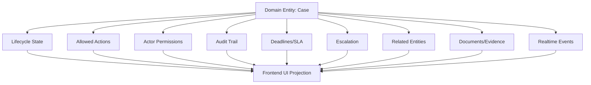
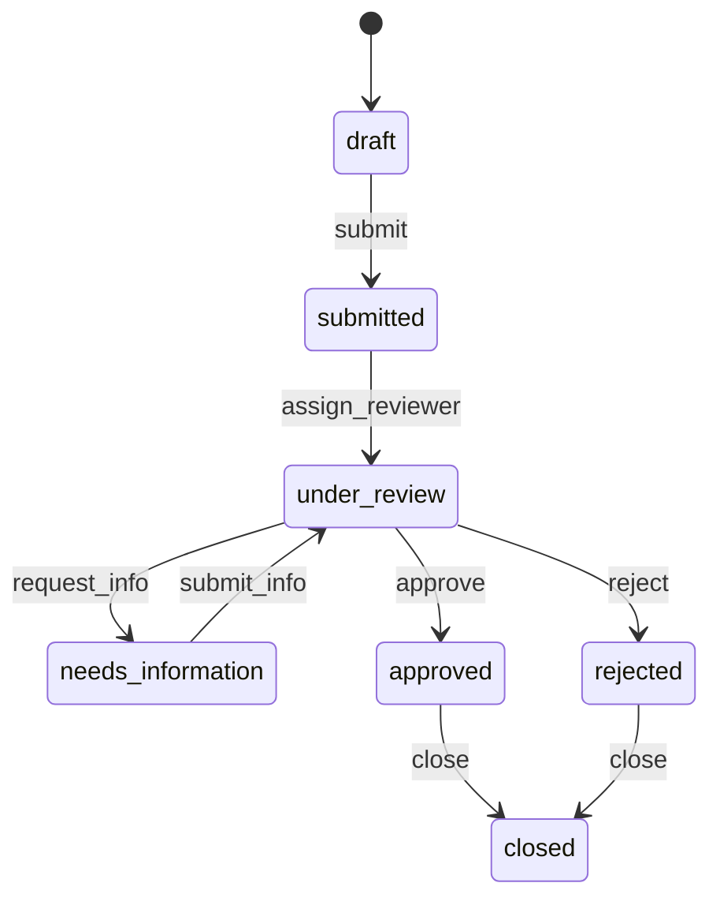
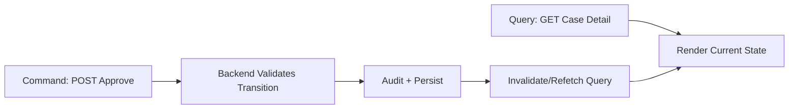
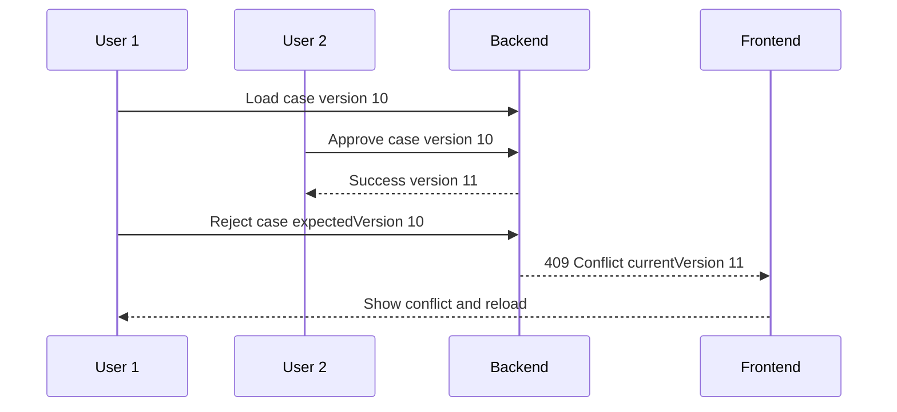
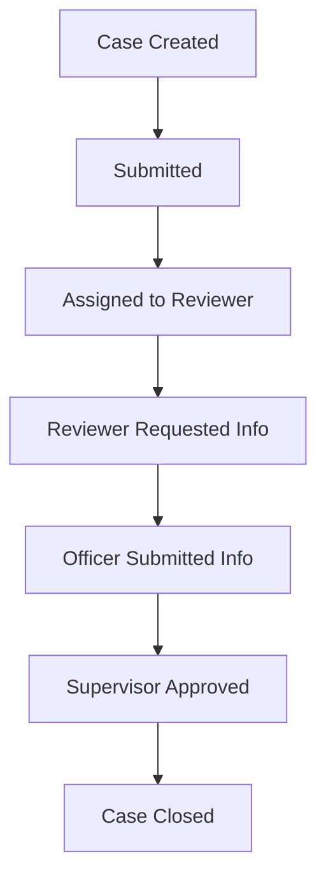
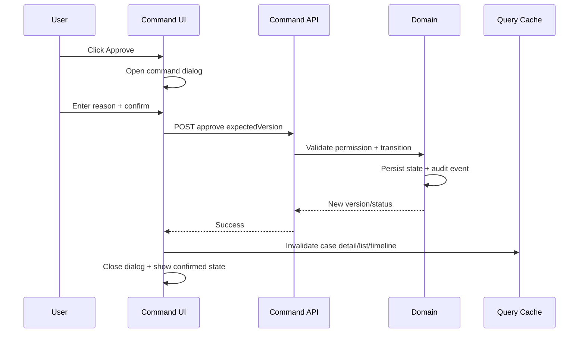
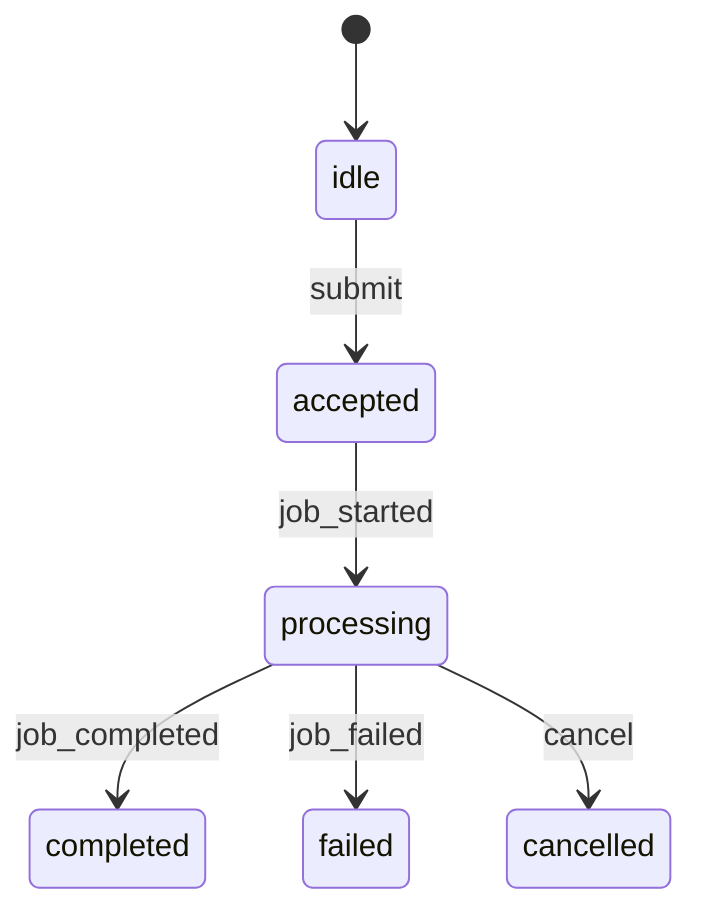

------
title: Learn Frontend React Production Architecture - Part 021
description: Production-grade guide to workflow-heavy UI, case management, state progression, command/query separation, audit-aware interfaces, permissions by state, escalation, lifecycle modeling, and anti-patterns in React applications.
series: learn-frontend-react-production-architecture
seriesTitle: Learn Frontend React Production Architecture
order: 21
partTitle: Workflow-Heavy UI, Case Management, and State Progression
tags:
- react
- frontend
- workflow
- case-management
- state-machine
- architecture
- production
- series
date: 2026-06-28
---

# Part 021 — Workflow-Heavy UI, Case Management, and State Progression

## Tujuan Pembelajaran

Sebagian besar tutorial React mengajarkan UI yang relatif sederhana:

- todo list,
- dashboard,
- CRUD table,
- search/filter,
- login form.

Production enterprise systems sering jauh lebih rumit.

Contoh domain:

- regulatory case management,
- enforcement lifecycle,
- approval workflow,
- claim processing,
- compliance review,
- fraud investigation,
- legal escalation,
- procurement approval,
- incident response,
- risk assessment,
- internal audit remediation.

UI semacam ini bukan hanya menampilkan data. UI harus merepresentasikan **proses bisnis yang berjalan dalam waktu panjang**, melibatkan banyak aktor, state progression, rule, permission, audit, dan exception.

Part ini membahas bagaimana mendesain React frontend untuk workflow-heavy applications.

---

## 1. Core Mental Model

Dalam workflow-heavy UI, screen bukan sekadar page. Screen adalah jendela ke state domain yang terus berkembang.



Frontend tidak memiliki workflow. Frontend memproyeksikan workflow state dari backend/domain ke user experience.

Important:

> Workflow state is domain authority. UI state is interaction state.

---

## 2. Workflow State vs UI State

Case lifecycle:

```txt
DRAFT -> SUBMITTED -> UNDER_REVIEW -> NEEDS_INFORMATION -> APPROVED -> CLOSED
```

Ini adalah domain workflow state. Source of truth harus backend/domain.

UI state:

```txt
approve dialog open
reason draft filled
submit pending
error displayed
timeline tab selected
```

Ini boleh frontend-owned.

Jangan campur.

Bad:

```tsx
const [caseStatus, setCaseStatus] = useState("APPROVED");

function handleApprove() {
  setCaseStatus("APPROVED");
}
```

This only changes UI, not official state.

Better:

```tsx
async function handleApprove(input: ApproveCaseInput) {
  await approveCaseMutation.mutateAsync(input);
  queryClient.invalidateQueries({ queryKey: caseKeys.detail(input.caseId) });
}
```

Official transition happens on backend. UI refetches confirmed state.

---

## 3. State Progression Model

Workflow state should be explicit.



Each transition has:

- actor,
- precondition,
- command,
- validation,
- authorization,
- side effects,
- audit event,
- notification,
- next state,
- UI refresh.

Transition design is not a button click. Button click is only the user intent trigger.

---

## 4. Command vs Query UI

A critical distinction:

- Query UI: displays state.
- Command UI: requests a state change.

Query examples:

- case summary,
- audit timeline,
- current status,
- assigned officer,
- SLA timer,
- documents,
- related parties.

Command examples:

- approve case,
- reject case,
- assign officer,
- request information,
- escalate,
- close case,
- reopen case,
- add evidence,
- mark as duplicate.

Frontend should model command and query separately.



Do not update query state as if command is already accepted unless optimistic behavior is explicitly safe.

---

## 5. Available Actions

Do not hardcode available actions purely in frontend.

Bad:

```tsx
if (caseDetail.status === "UNDER_REVIEW" && user.role === "SUPERVISOR") {
  showApproveButton = true;
}
```

This duplicates backend rule and will drift.

Better:

Backend returns available actions:

```ts
type CaseDetail = {
  id: string;
  status: CaseStatus;
  version: number;
  availableActions: CaseAction[];
};
```

UI:

```tsx
function CaseActions({ caseDetail }: { caseDetail: CaseDetail }) {
  return (
    <ActionBar>
      {caseDetail.availableActions.includes("APPROVE") && (
        <ApproveCaseButton caseId={caseDetail.id} version={caseDetail.version} />
      )}

      {caseDetail.availableActions.includes("REQUEST_INFORMATION") && (
        <RequestInformationButton caseId={caseDetail.id} />
      )}
    </ActionBar>
  );
}
```

Backend still validates when command is submitted.

Available actions are UX hints, not authority.

---

## 6. Permission by State

Permission is often state-dependent.

Example:

| State | Officer | Supervisor | Auditor |
|---|---:|---:|---:|
| DRAFT | edit | view | none |
| SUBMITTED | view | assign | view |
| UNDER_REVIEW | comment | approve/reject | view |
| NEEDS_INFORMATION | respond | view | view |
| APPROVED | view | close | audit |
| CLOSED | view | view | audit |

Frontend should not scatter this matrix across components.

Better:

- backend computes `availableActions`,
- frontend can use permission for navigation/menu UX,
- domain transitions validated server-side.

For offline/latency UX, frontend may have local prediction, but prediction must be treated as non-authoritative.

---

## 7. Versioning and Optimistic Concurrency

Workflow-heavy systems often need entity version.

```ts
type CaseDetail = {
  id: string;
  status: CaseStatus;
  version: number;
};
```

Command includes expected version:

```ts
type ApproveCaseInput = {
  caseId: string;
  expectedVersion: number;
  reason: string;
  idempotencyKey: string;
};
```

If version mismatch:

```txt
409 Conflict
```

UI should show:

- case changed,
- reload required,
- possibly compare changes,
- preserve draft reason if safe,
- do not silently overwrite.



---

## 8. Audit-Aware UI

Audit is not a log widget added at the end.

Audit affects UI design:

- command forms require reason,
- user sees who changed what and when,
- state changes are traceable,
- action buttons reflect accountability,
- errors and conflicts are explainable,
- system events are distinguishable from user events.

Audit timeline model:

```ts
type AuditEvent = {
  id: string;
  occurredAt: string;
  actor: {
    id: string;
    displayName: string;
    type: "USER" | "SYSTEM";
  };
  type: AuditEventType;
  summary: string;
  metadata?: Record<string, unknown>;
};
```

UI should present:

- chronological order,
- actor,
- event type,
- reason,
- attachments,
- previous/new state if relevant,
- system-generated events clearly.

---

## 9. Timeline as First-Class UI

Case management UI often needs timeline.



Timeline concerns:

- pagination/cursor,
- ordering,
- event grouping,
- filtering by type,
- realtime append,
- dedupe,
- display timezone,
- actor identity,
- sensitive metadata,
- access control,
- export/audit evidence.

Do not load entire audit history if huge. Use cursor pagination or lazy sections.

---

## 10. Status-Driven UI

Status affects:

- visible actions,
- primary message,
- badge color/label,
- form editability,
- required fields,
- page header,
- SLA display,
- warning banners,
- next step guidance,
- empty state text.

Centralize status view model.

```ts
function getCaseStatusView(status: CaseStatus): {
  label: string;
  tone: "neutral" | "warning" | "success" | "danger";
  description: string;
} {
  switch (status) {
    case "DRAFT":
      return {
        label: "Draft",
        tone: "neutral",
        description: "This case has not been submitted.",
      };
    case "UNDER_REVIEW":
      return {
        label: "Under Review",
        tone: "warning",
        description: "A reviewer is evaluating this case.",
      };
    case "APPROVED":
      return {
        label: "Approved",
        tone: "success",
        description: "This case has been approved.",
      };
    default:
      return {
        label: "Unknown",
        tone: "neutral",
        description: "The case status is not recognized.",
      };
  }
}
```

Prepare for unknown status. Backend enums can evolve.

---

## 11. UI Projection Model

Instead of letting components interpret raw DTOs, create view model.

```ts
type CaseDetailViewModel = {
  title: string;
  status: {
    label: string;
    tone: StatusTone;
    description: string;
  };
  primaryAction?: CaseAction;
  secondaryActions: CaseAction[];
  warnings: CaseWarning[];
  sections: CaseSection[];
};
```

Mapper:

```ts
function toCaseDetailViewModel(caseDetail: CaseDetail): CaseDetailViewModel {
  const statusView = getCaseStatusView(caseDetail.status);

  return {
    title: `${caseDetail.referenceNo} — ${caseDetail.subjectName}`,
    status: statusView,
    primaryAction: choosePrimaryAction(caseDetail.availableActions),
    secondaryActions: chooseSecondaryActions(caseDetail.availableActions),
    warnings: deriveCaseWarnings(caseDetail),
    sections: deriveVisibleSections(caseDetail),
  };
}
```

Benefits:

- UI logic centralized,
- status/action handling testable,
- unknown states handled,
- components simpler,
- business display rules easier to review.

---

## 12. Lifecycle-Aware Layout

Case detail page should reflect lifecycle.

Possible sections:

```txt
Case Header
  reference number
  status
  assigned officer
  SLA

Primary Guidance
  what happens next
  pending blocker
  required action

Action Bar
  available commands

Main Content
  summary
  documents
  notes
  related entities

Timeline
  audit events
```

Layout should answer:

- where am I in process?
- what can I do now?
- why can/can't I do something?
- what happened before?
- what will happen next?
- who owns the next step?

---

## 13. Action Availability UX

If action is not available, choose one:

1. hide action,
2. show disabled action with reason,
3. show action but fail with server message,
4. show request access/escalation path.

For high-trust enterprise systems, disabled with reason can be better.

```tsx
<ActionButton
  disabled
  disabledReason="Only supervisors can approve cases under review."
>
  Approve
</ActionButton>
```

But be careful exposing sensitive rule details.

Backend-provided unavailable reasons can help:

```ts
type CaseActionAvailability = {
  action: CaseAction;
  available: boolean;
  reason?: string;
};
```

---

## 14. Command Form Design

Every workflow command should define:

- action name,
- required inputs,
- expected entity version,
- idempotency key,
- validation rules,
- confirmation text,
- risk level,
- success behavior,
- error mapping,
- audit metadata,
- cache invalidation.

Example:

```ts
type WorkflowCommandDefinition = {
  action: "APPROVE";
  requiresReason: true;
  requiresConfirmation: true;
  destructive: false;
  optimisticAllowed: false;
  invalidates: ["caseDetail", "caseList", "auditTimeline"];
};
```

UI should not invent command behavior ad hoc per button.

---

## 15. Transactional Command Flow



Note:

- UI does not directly set official status.
- UI waits for server confirmation.
- Cache invalidation pulls latest state.

---

## 16. Escalation UI

Escalation is common in workflow-heavy systems.

Escalation can be:

- manual,
- automatic by SLA,
- risk-based,
- supervisor-triggered,
- exception-triggered.

UI needs to show:

- current escalation level,
- reason,
- deadline,
- next escalation time,
- responsible role,
- available escalation/de-escalation actions,
- history.

State:

```ts
type EscalationState =
  | { status: "none" }
  | { status: "pending"; dueAt: string }
  | { status: "escalated"; level: number; reason: string }
  | { status: "resolved"; resolvedAt: string };
```

Escalation should not be hidden in a small badge only if it changes priority/action availability.

---

## 17. SLA and Deadline UI

Deadline UI must be precise.

Consider:

- timezone,
- business calendar,
- grace periods,
- paused states,
- overdue states,
- system clock discrepancy,
- server authority for due date,
- accessibility for color.

Example:

```ts
type SlaView =
  | { status: "not_applicable" }
  | { status: "due_soon"; dueAt: string }
  | { status: "overdue"; dueAt: string; overdueByMinutes: number }
  | { status: "paused"; reason: string };
```

Do not compute official SLA state entirely in frontend if rules are complex. Backend should provide authoritative due status.

Frontend can format countdown, but should handle server-provided state.

---

## 18. Case Locking and Assignment

Workflow UI often includes ownership/locking.

Examples:

- assigned officer,
- claimed by user,
- locked by reviewer,
- read-only because another user editing,
- temporary lock expired,
- manual reassignment.

UI states:

```ts
type EditAccess =
  | { status: "editable" }
  | { status: "read_only"; reason: string }
  | { status: "locked_by_other"; actorName: string }
  | { status: "requires_claim" };
```

Do not just disable fields silently. Explain why.

---

## 19. Long-Running Operations

Some commands are asynchronous:

- generate report,
- run risk scoring,
- import evidence,
- external agency check,
- background verification.

HTTP command may return 202 Accepted.

UI model:



Frontend needs:

- job id,
- polling/SSE/WebSocket,
- progress status,
- cancellation if allowed,
- retry,
- final result retrieval,
- notification if user navigates away.

Do not pretend long-running operation is complete when server only accepted it.

---

## 20. Cross-Entity Impact

Workflow commands can affect related data:

Approving case may update:

- case detail,
- case list,
- audit timeline,
- dashboard metrics,
- officer queue,
- supervisor queue,
- notifications,
- reports,
- related entity status.

Invalidation must reflect impact.

```ts
function invalidateAfterCaseApproval(queryClient: QueryClient, caseId: string) {
  queryClient.invalidateQueries({ queryKey: caseKeys.detail(caseId) });
  queryClient.invalidateQueries({ queryKey: caseKeys.lists() });
  queryClient.invalidateQueries({ queryKey: auditKeys.caseTimeline(caseId) });
  queryClient.invalidateQueries({ queryKey: dashboardKeys.caseMetrics() });
  queryClient.invalidateQueries({ queryKey: notificationKeys.summary() });
}
```

If impact map grows, centralize domain invalidation helpers.

---

## 21. Empty and Blocked States

Workflow UI needs nuanced states.

Examples:

- no documents uploaded,
- waiting for external agency,
- blocked by missing information,
- user lacks permission,
- case locked,
- overdue,
- under system review,
- closed and read-only,
- archived.

Each state needs specific UX.

Bad:

```tsx
return <EmptyState>No data</EmptyState>;
```

Better:

```tsx
if (caseDetail.status === "NEEDS_INFORMATION") {
  return (
    <BlockedState
      title="Information required"
      description="This case is waiting for additional documents from the officer."
      action={<SubmitInformationButton />}
    />
  );
}
```

---

## 22. Multi-Actor UI

Different actors see different responsibilities.

Actors:

- submitter,
- assigned officer,
- reviewer,
- supervisor,
- auditor,
- admin,
- external party,
- system.

UI should answer:

- what is my role in this case?
- am I responsible for next action?
- who currently owns it?
- who can act next?
- what can I see?
- what can I edit?

Backend should provide role/context-specific projection when possible.

```ts
type CaseUserContext = {
  roleInCase: "SUBMITTER" | "REVIEWER" | "SUPERVISOR" | "AUDITOR";
  responsibility: "ACTION_REQUIRED" | "WAITING" | "VIEW_ONLY";
  availableActions: CaseAction[];
};
```

---

## 23. Event Sourcing and Timeline Projection

If backend is event-sourced or audit-event-heavy, frontend often consumes projection:

- current case summary,
- event timeline,
- action availability,
- read model.

Do not reconstruct official current state from timeline in frontend unless explicitly designed.

Bad:

```ts
const status = events.reduce(computeStatus, "DRAFT");
```

Better:

```ts
const caseDetail = await getCaseDetail(caseId);
const timeline = await getAuditTimeline(caseId);
```

Backend projection owns current state. Frontend timeline displays history.

---

## 24. Workflow Navigation

Workflow step can be route.

```txt
/cases/CASE-001/overview
/cases/CASE-001/evidence
/cases/CASE-001/review
/cases/CASE-001/audit
```

Use route when:

- step is deep-linkable,
- step has independent data/loading/error,
- step maps to user task,
- support/audit needs direct link,
- back/refresh matters.

Use local state when:

- short confirmation,
- non-shareable modal,
- transient UI.

Use backend workflow state when:

- step must be durable,
- process spans sessions/users,
- audit required.

---

## 25. Workflow Error Taxonomy

Errors:

| Error | Example | UI |
|---|---|---|
| validation | reason missing | field error |
| forbidden | role cannot approve | forbidden/action disabled |
| invalid transition | case no longer under review | refresh/conflict |
| conflict | version mismatch | conflict banner |
| locked | another user editing | locked state |
| dependency missing | no evidence | blocked state |
| external failure | agency check unavailable | retry/escalate |
| server error | unexpected | retry + trace id |

Workflow errors are often domain signals, not just technical failures.

---

## 26. Safe Optimism in Workflow UI

Optimistic UI is risky for official workflow transitions.

Potentially safe optimistic areas:

- local note draft added with pending marker,
- preference toggle,
- temporary row highlight,
- “request submitted” pending state,
- skeleton placeholder for expected timeline event.

Risky:

- marking case approved before server commits,
- removing case from queue before command confirms,
- showing audit event as official before persisted,
- updating SLA/responsibility locally as truth.

If using optimism, mark pending clearly and rollback safely.

---

## 27. Idempotency and Duplicate Commands

Workflow commands must handle duplicate submit.

Frontend:

- disable while pending,
- idempotency key per command attempt,
- do not regenerate key on retry,
- show pending state.

Backend:

- stores idempotency key,
- returns same result for same key,
- prevents duplicate audit event,
- validates user/session/action scope.

UI alone cannot prevent double-submit under network retry/back button/multiple tabs.

---

## 28. Multi-Tab and Multi-User Reality

Workflow-heavy apps are multi-user.

Problems:

- user opens same case in two tabs,
- two reviewers act at same time,
- permission changes mid-session,
- assignment changes while page open,
- case closed while form open.

Frontend strategy:

- version conflict,
- realtime invalidation,
- refetch on focus,
- stale warning,
- disable actions after state changes,
- clear or revalidate drafts,
- show “case updated” banner.

Never assume the page is the only actor.

---

## 29. Anti-Pattern Catalog

### 29.1 Hiding Workflow Logic in Buttons

Each button decides if it should show, validates, mutates, updates UI, and logs.

### 29.2 Frontend as Workflow Authority

Local state changes official lifecycle without backend confirmation.

### 29.3 Hardcoded Role/Status Matrix in UI

Rules drift from backend.

### 29.4 No Version on Commands

Last write wins silently.

### 29.5 Generic Error for Domain Failure

“Something went wrong” when case is locked/conflicted/forbidden.

### 29.6 Audit Timeline as Afterthought

No reason/actor/transition clarity.

### 29.7 Optimistic Official Status

UI says approved before server persists.

### 29.8 Action Availability Not Refetched

User acts on stale available action.

### 29.9 No Cross-Entity Invalidation

Case detail updates but list/dashboard remains stale.

### 29.10 One Giant CaseDetail Component

All status rules, actions, timeline, forms, documents, permissions in one file.

---

## 30. Mini Case Study: Case Detail Architecture

### Requirements

- show case summary,
- show status and SLA,
- show available actions,
- approve/reject/request information,
- show audit timeline,
- handle conflict,
- handle locked/read-only,
- refresh on realtime update,
- maintain accessibility.

### Data Model

```ts
type CaseDetail = {
  id: string;
  referenceNo: string;
  status: CaseStatus;
  version: number;
  subjectName: string;
  assignedTo?: UserSummary;
  availableActions: CaseActionAvailability[];
  sla: SlaView;
  editAccess: EditAccess;
};
```

### Component Structure

```txt
CaseDetailRoute
  CaseDetailPage
    CaseHeader
    CaseStatusPanel
    CaseGuidancePanel
    CaseActionBar
      ApproveCaseDialog
      RejectCaseDialog
      RequestInformationDialog
    CaseContentTabs
    AuditTimeline
```

Route owns data loading. Page composes. Action dialogs own local form state. Backend owns workflow transition.

### Command

```ts
type ApproveCaseCommand = {
  caseId: string;
  expectedVersion: number;
  reason: string;
  idempotencyKey: string;
};
```

### Mutation

```ts
function useApproveCaseMutation() {
  const queryClient = useQueryClient();

  return useMutation({
    mutationFn: caseApi.approveCase,
    onSuccess: (_, input) => {
      invalidateAfterCaseCommand(queryClient, input.caseId);
    },
  });
}
```

---

## 31. Workflow Review Checklist

Before approving workflow UI:

1. Is workflow state backend-owned?
2. Are available actions server-provided or validated server-side?
3. Is command/query separation clear?
4. Does command include expected version?
5. Is idempotency handled?
6. Are domain errors distinct?
7. Is conflict UI designed?
8. Are locked/read-only states explained?
9. Is audit trail visible and meaningful?
10. Are action reasons captured where needed?
11. Is optimistic UI safe or avoided?
12. Are affected caches invalidated?
13. Is realtime/multi-user update handled?
14. Are permissions both UX-filtered and backend-enforced?
15. Is SLA/deadline state authoritative?
16. Is long-running operation modeled correctly?
17. Is timeline paginated if large?
18. Are unknown statuses/actions handled safely?
19. Is page decomposed by responsibility?
20. Are tests covering state progression and failure modes?

---

## 32. Testing Workflow UI

Test scenarios:

### Query Display

- status labels,
- available actions,
- read-only/locked states,
- SLA due/overdue,
- empty/blocked states.

### Commands

- approve success,
- reject validation error,
- forbidden action,
- conflict 409,
- locked case,
- duplicate submit,
- network failure,
- cache invalidation.

### Timeline

- events render in order,
- pagination works,
- new event appended,
- duplicate event ignored.

### Multi-user

- case updated while open,
- action no longer available,
- permission changes,
- stale version conflict.

### Accessibility

- action dialogs labelled,
- errors announced,
- focus restored,
- disabled reasons accessible.

---

## 33. Deliberate Practice

### Latihan 1 — State Progression Diagram

Ambil satu lifecycle domain.

Tulis Mermaid state diagram:

- states,
- allowed transitions,
- actors,
- invalid transitions.

Then map each transition to UI command.

### Latihan 2 — Available Action Contract

Design response:

```ts
type CaseActionAvailability = {
  action: CaseAction;
  available: boolean;
  reason?: string;
  riskLevel: "low" | "medium" | "high";
};
```

Create UI behavior for each.

### Latihan 3 — Conflict Drill

Simulate:

1. user opens under review case version 5,
2. another user approves to version 6,
3. first user tries reject with version 5,
4. backend returns 409.

Design UI and cache behavior.

### Latihan 4 — Audit Timeline Design

For each command, define audit event:

| Command | Audit Event | Required Metadata |
|---|---|---|
| approve | CASE_APPROVED | actor, reason, old/new status |
| reject | CASE_REJECTED | actor, reason |
| assign | CASE_ASSIGNED | actor, old/new assignee |
| request info | INFORMATION_REQUESTED | actor, due date |

---

## 34. Ringkasan

Workflow-heavy UI requires domain thinking.

Key principles:

- backend owns workflow state,
- frontend owns interaction state,
- commands and queries are separate,
- available actions are UX hints, not authority,
- version/conflict/idempotency matter,
- audit is first-class,
- SLA/escalation/lock states need explicit UI,
- realtime and multi-user updates are normal,
- domain errors need domain UI,
- optimistic official state is usually unsafe.

A strong React engineer in workflow-heavy systems thinks like a product engineer, backend engineer, and process analyst at once.

---

## 35. Self-Assessment

Anda siap lanjut jika bisa menjawab:

1. Apa beda workflow state dan UI state?
2. Mengapa available actions sebaiknya server-provided?
3. Apa perbedaan command dan query UI?
4. Mengapa command perlu expected version?
5. Apa yang harus terjadi saat 409 conflict?
6. Mengapa audit timeline first-class?
7. Bagaimana mendesain SLA/escalation UI?
8. Kapan optimistic UI tidak aman?
9. Bagaimana multi-user update mempengaruhi case detail?
10. Bagaimana membagi CaseDetail page agar tidak jadi God component?

---

## 36. Sumber Rujukan

- React Docs — Managing State
- React Docs — `useReducer`
- React Docs — Preserving and Resetting State
- TanStack Query Docs — Mutations and Invalidation
- MDN — HTTP 409 Conflict
- MDN — HTTP 202 Accepted
- OWASP — Authorization and Access Control Principles
