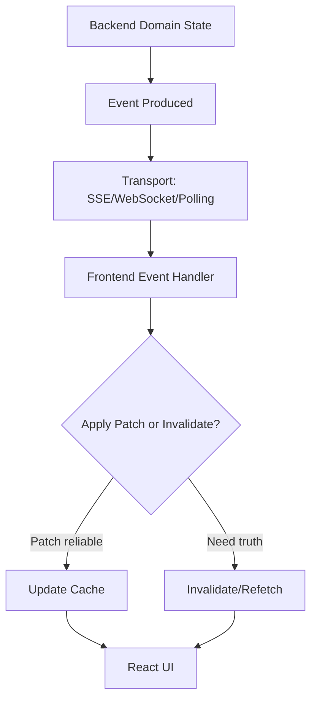
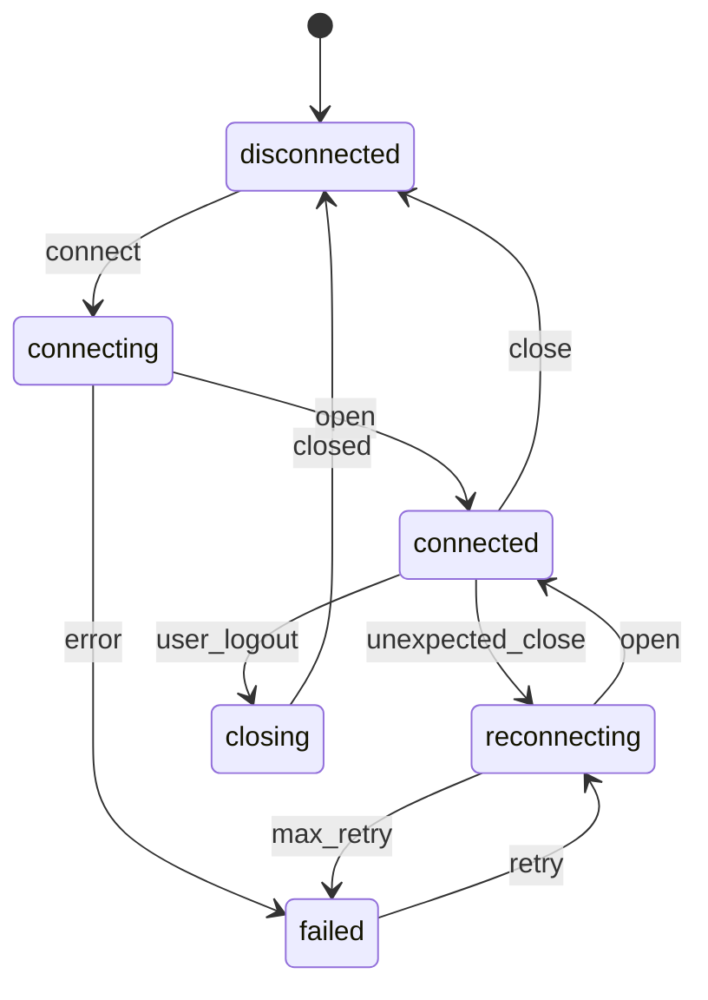
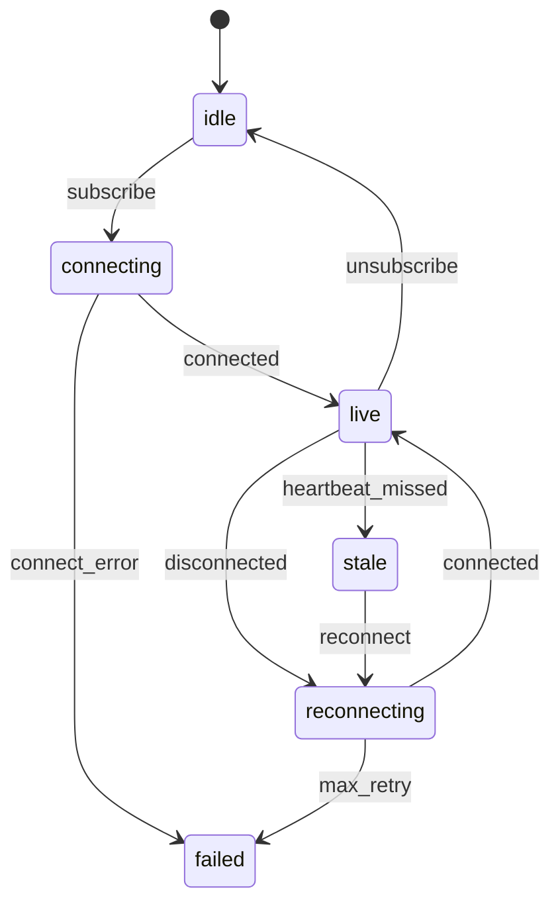

------
title: Learn Frontend React Production Architecture - Part 022
description: Production-grade guide to realtime, collaboration, and event-driven UI in React, including polling, SSE, WebSocket, event ordering, idempotency, optimistic updates, reconnect, presence, conflict handling, cache invalidation, and anti-patterns.
series: learn-frontend-react-production-architecture
seriesTitle: Learn Frontend React Production Architecture
order: 22
partTitle: Realtime, Collaboration, and Event-Driven UI
tags:
- react
- frontend
- realtime
- websocket
- sse
- polling
- collaboration
- event-driven
- architecture
- production
- series
date: 2026-06-28
---

# Part 022 — Realtime, Collaboration, and Event-Driven UI

## Tujuan Pembelajaran

Realtime UI bukan hanya WebSocket.

Realtime adalah cara aplikasi bereaksi terhadap perubahan yang terjadi di luar event lokal user saat ini.

Sumber perubahan bisa berasal dari:

- user lain,
- tab lain,
- backend job,
- workflow engine,
- external system,
- scheduler,
- notification service,
- realtime collaboration server,
- feature flag service,
- network status,
- browser visibility change.

Realtime UI production membutuhkan pemahaman tentang:

- polling,
- long polling,
- Server-Sent Events,
- WebSocket,
- event contracts,
- ordering,
- deduplication,
- reconnect,
- backoff,
- idempotency,
- cache invalidation,
- optimistic UI,
- conflict resolution,
- presence,
- collaboration,
- offline behavior,
- observability.

Part ini membahas realtime sebagai **event-driven frontend architecture**, bukan sekadar membuka socket.

---

## 1. Core Mental Model

Realtime event is not the source of truth by default.

Usually:

- backend database/domain is source of truth,
- event stream tells frontend something changed,
- frontend updates cache or invalidates/refetches,
- UI reconciles with latest server state.



Do not blindly trust every event as complete truth unless the protocol is designed that way.

---

## 2. Realtime Transport Options

| Transport | Good For | Trade-Off |
|---|---|---|
| Polling | simple periodic refresh | latency/load |
| Long polling | near realtime with HTTP | server complexity |
| SSE | server-to-client events | one-way, HTTP-friendly |
| WebSocket | bidirectional realtime | connection management |
| WebRTC | peer media/data | complex, specialized |
| BroadcastChannel | same-browser tabs | local only |
| Service Worker messages | app/background coordination | complexity |
| Push notifications | out-of-app notifications | platform constraints |

Pick by requirement, not hype.

---

## 3. Polling

Polling asks server repeatedly.

```tsx
useQuery({
  queryKey: notificationKeys.summary(),
  queryFn: notificationApi.getSummary,
  refetchInterval: 30_000,
});
```

Good for:

- low-frequency updates,
- dashboard metrics,
- notification badge,
- simple status,
- no infrastructure for sockets.

Bad for:

- high-frequency collaboration,
- low-latency trading/chat,
- massive user base with tight interval,
- large payloads.

Polling design:

- interval based on freshness need,
- pause when tab hidden if okay,
- backoff on errors,
- avoid synchronized thundering herd,
- fetch small summary not full data.

---

## 4. Manual Polling Hook

```tsx
function useJobStatus(jobId: string) {
  return useQuery({
    queryKey: jobKeys.status(jobId),
    queryFn: () => jobApi.getStatus(jobId),
    refetchInterval: (query) => {
      const status = query.state.data?.status;

      if (status === "completed" || status === "failed") {
        return false;
      }

      return 2_000;
    },
  });
}
```

This is good for long-running job status.

Avoid WebSocket if all you need is a status check every few seconds.

---

## 5. Server-Sent Events

SSE is one-way server-to-client event stream over HTTP.

Good for:

- notifications,
- event feed,
- job progress,
- timeline updates,
- server-to-client only updates,
- simpler infra than WebSocket in some environments.

Concept:

```ts
const eventSource = new EventSource("/api/events");

eventSource.addEventListener("case.updated", (event) => {
  const payload = JSON.parse(event.data);
  handleCaseUpdated(payload);
});
```

Cleanup:

```ts
eventSource.close();
```

Limitations:

- one-way,
- browser connection limits,
- auth/cookie considerations,
- reconnection semantics,
- custom headers not straightforward with native EventSource.

---

## 6. WebSocket

WebSocket provides bidirectional persistent connection.

Good for:

- chat,
- collaboration,
- presence,
- low-latency notifications,
- interactive dashboards,
- multiplayer editing,
- command/ack protocols.

Basic hook:

```tsx
function useCaseSocket(caseId: string) {
  useEffect(() => {
    const socket = new WebSocket(`/ws/cases/${caseId}`);

    socket.addEventListener("message", (message) => {
      const event = JSON.parse(message.data);
      handleCaseEvent(event);
    });

    return () => {
      socket.close();
    };
  }, [caseId]);
}
```

Production WebSocket needs much more:

- auth,
- reconnect,
- heartbeat,
- backoff,
- message schema validation,
- event ordering,
- dedupe,
- subscription management,
- visibility handling,
- offline handling,
- observability.

---

## 7. Connection Lifecycle



UI can show:

- connected,
- reconnecting,
- offline,
- stale data,
- connection failed.

Do not hide connection state if data correctness depends on it.

---

## 8. Reconnect with Backoff

Reconnect loop should avoid hammering server.

```ts
function getBackoffMs(attempt: number) {
  const base = Math.min(30_000, 1000 * 2 ** attempt);
  const jitter = Math.random() * 500;
  return base + jitter;
}
```

Behavior:

- retry after unexpected close,
- stop on logout,
- pause offline,
- reset attempts after successful connection,
- cap max delay,
- consider max retry before showing failure.

Avoid infinite tight reconnect loop.

---

## 9. Heartbeat

Connection can appear open but be dead.

Heartbeat patterns:

- client sends ping, server responds pong,
- server sends periodic heartbeat,
- client times out if no heartbeat.

State:

```ts
type ConnectionHealth =
  | { status: "healthy"; lastSeenAt: number }
  | { status: "stale"; lastSeenAt: number }
  | { status: "dead"; lastSeenAt: number };
```

If heartbeat fails:

- mark stale,
- reconnect,
- invalidate critical queries after reconnect,
- show banner if needed.

---

## 10. Event Contract

An event contract should include:

```ts
type DomainEvent = {
  eventId: string;
  type: string;
  entityType: string;
  entityId: string;
  version?: number;
  occurredAt: string;
  actorId?: string;
  payload: unknown;
};
```

Minimum useful fields:

- event id for dedupe,
- type,
- entity id,
- occurred time,
- version/order if available,
- payload schema,
- tenant/workspace scope if relevant.

Without event id and version, reliable event handling becomes difficult.

---

## 11. Event Schema Validation

Do not trust event payload.

```ts
const caseUpdatedEventSchema = z.object({
  eventId: z.string(),
  type: z.literal("CASE_UPDATED"),
  caseId: z.string(),
  version: z.number().int(),
  occurredAt: z.string(),
});

function parseEvent(raw: unknown): CaseUpdatedEvent | null {
  const result = caseUpdatedEventSchema.safeParse(raw);

  if (!result.success) {
    reportInvalidRealtimeEvent(result.error);
    return null;
  }

  return result.data;
}
```

Invalid event should not crash app.

---

## 12. Deduplication

Events can duplicate.

Keep seen ids.

```ts
function createEventDeduper(limit = 1000) {
  const seen = new Set<string>();
  const order: string[] = [];

  return {
    has(eventId: string) {
      return seen.has(eventId);
    },
    add(eventId: string) {
      if (seen.has(eventId)) return;

      seen.add(eventId);
      order.push(eventId);

      if (order.length > limit) {
        const oldest = order.shift();
        if (oldest) seen.delete(oldest);
      }
    },
  };
}
```

Use event id for dedupe. If no event id, dedupe is approximate and fragile.

---

## 13. Ordering

Do not assume perfect ordering unless contract guarantees it.

Problems:

- event B arrives before event A,
- duplicate event,
- missing event,
- reconnect gap,
- server partition,
- client tab paused,
- message delayed.

Version helps.

```ts
function applyCaseEvent(current: CaseDetail, event: CaseUpdatedEvent) {
  if (event.version <= current.version) {
    return current;
  }

  return {
    ...current,
    status: event.status,
    version: event.version,
  };
}
```

If event version skips:

```txt
current version 10
event version 13
```

Maybe missed 11 and 12. Safer: invalidate/refetch.

---

## 14. Patch vs Invalidate

When event arrives, choose:

### Patch cache

Good when:

- event payload complete,
- ordering reliable,
- entity version known,
- update simple,
- immediate UI important.

### Invalidate/refetch

Good when:

- event payload partial,
- ordering uncertain,
- rules complex,
- security/permission may change,
- related data affected,
- correctness more important.

Example:

```ts
if (event.type === "CASE_UPDATED") {
  queryClient.invalidateQueries({
    queryKey: caseKeys.detail(event.caseId),
  });
}
```

For workflow-heavy apps, invalidation is often safer than patching official state.

---

## 15. Realtime and Query Cache

Pattern:

```tsx
function useCaseRealtime(caseId: string) {
  const queryClient = useQueryClient();

  useEffect(() => {
    const subscription = caseEvents.subscribe(caseId, (event) => {
      switch (event.type) {
        case "CASE_UPDATED":
          queryClient.invalidateQueries({
            queryKey: caseKeys.detail(caseId),
          });
          break;

        case "AUDIT_EVENT_APPENDED":
          queryClient.invalidateQueries({
            queryKey: caseKeys.timeline(caseId),
          });
          break;
      }
    });

    return () => {
      subscription.unsubscribe();
    };
  }, [caseId, queryClient]);
}
```

Do not update local component state while query cache remains stale. Single source of display truth should be clear.

---

## 16. Reconnect Gap

When disconnected, events may be missed.

On reconnect:

- send last seen event id/version,
- ask server for missed events,
- or invalidate/refetch critical queries.

Simple strategy:

```tsx
socket.on("reconnected", () => {
  queryClient.invalidateQueries({ queryKey: caseKeys.all });
  queryClient.invalidateQueries({ queryKey: notificationKeys.all });
});
```

More efficient strategy:

```ts
subscribe({
  topic: `case:${caseId}`,
  lastSeenEventId,
});
```

Server replays missed events if available.

If replay not supported, refetch.

---

## 17. Visibility and Focus

Browser tabs can sleep.

When tab becomes visible:

```tsx
useEffect(() => {
  const handleVisibilityChange = () => {
    if (document.visibilityState === "visible") {
      queryClient.invalidateQueries({ queryKey: criticalKeys.all });
    }
  };

  document.addEventListener("visibilitychange", handleVisibilityChange);

  return () => {
    document.removeEventListener("visibilitychange", handleVisibilityChange);
  };
}, [queryClient]);
```

Do not assume realtime connection stayed healthy while tab hidden.

---

## 18. Online/Offline

Use browser events as hints, not perfect truth.

```tsx
function useOnlineStatus() {
  const [online, setOnline] = useState(navigator.onLine);

  useEffect(() => {
    const handleOnline = () => setOnline(true);
    const handleOffline = () => setOnline(false);

    window.addEventListener("online", handleOnline);
    window.addEventListener("offline", handleOffline);

    return () => {
      window.removeEventListener("online", handleOnline);
      window.removeEventListener("offline", handleOffline);
    };
  }, []);

  return online;
}
```

Offline UI:

- show banner,
- pause unsafe mutations,
- show cached/stale state indicator,
- reconnect automatically,
- invalidate after reconnect.

For regulated workflow, offline command queue should be avoided unless carefully designed.

---

## 19. Presence

Presence answers:

- who is viewing?
- who is editing?
- who is typing?
- who is active?
- when did they last update?

Presence is not usually auditable domain truth. It is ephemeral collaboration state.

Presence model:

```ts
type PresenceUser = {
  userId: string;
  displayName: string;
  status: "viewing" | "editing" | "idle";
  lastSeenAt: string;
};
```

UI:

- show avatars,
- show “Ayu is editing this section”,
- warn before editing locked section,
- avoid overclaiming exact truth.

Presence can be stale. Use TTL.

---

## 20. Collaborative Editing

Collaborative editing is complex.

Approaches:

- pessimistic locking,
- optimistic concurrency,
- operational transform,
- CRDT,
- section-level locks,
- backend draft merge,
- manual conflict resolution.

Do not build Google Docs casually.

For enterprise forms, simpler patterns often work better:

- lock case while editing,
- edit sections independently,
- autosave backend draft,
- version conflict on submit,
- show compare/merge.

Choose based on domain need, not trend.

---

## 21. Locks

Lock types:

| Lock | Meaning |
|---|---|
| hard lock | others cannot edit |
| soft lock | warning only |
| section lock | one section locked |
| lease lock | expires after time |
| optimistic lock | no lock, conflict on submit |

UI for lock:

```ts
type LockState =
  | { status: "none" }
  | { status: "locked_by_me"; expiresAt: string }
  | { status: "locked_by_other"; displayName: string; expiresAt: string }
  | { status: "expired" };
```

Show:

- who holds lock,
- when expires,
- how to request release,
- whether view is read-only.

Backend enforces locks. Frontend displays.

---

## 22. Optimistic Updates and Realtime

Optimistic update plus realtime event can duplicate.

Scenario:

1. user adds note optimistically,
2. server persists note,
3. realtime event broadcasts note,
4. UI shows note twice.

Need temporary id/client mutation id.

```ts
type AddNoteCommand = {
  clientMutationId: string;
  caseId: string;
  body: string;
};
```

Realtime event includes:

```ts
type NoteAddedEvent = {
  eventId: string;
  clientMutationId?: string;
  note: Note;
};
```

Client can reconcile pending optimistic note with confirmed note.

---

## 23. Event-Driven UI State Machine

Realtime feature state:



UI should reflect stale/reconnecting if correctness matters.

---

## 24. Notifications

Notification system architecture:

- summary badge,
- notification list,
- realtime event,
- mark read mutation,
- query invalidation,
- browser notification optional,
- cross-tab sync.

Data:

```ts
type NotificationSummary = {
  unreadCount: number;
};

type NotificationItem = {
  id: string;
  type: string;
  title: string;
  createdAt: string;
  readAt?: string;
  href?: string;
};
```

Realtime:

```ts
NOTIFICATION_CREATED -> invalidate summary/list or prepend item
NOTIFICATION_READ -> update summary/list
```

Avoid fetching full notification list just to show unread count.

---

## 25. Event Bus Inside Frontend

Internal event bus can be useful but risky.

Useful for:

- cross-cutting app events,
- logout,
- workspace changed,
- feature flag refreshed,
- global command palette.

Risk:

- hidden coupling,
- hard debugging,
- order dependency,
- untyped events,
- memory leaks,
- bypass React/data flow.

Prefer explicit state/store/cache APIs. Use event bus only with typed contract and governance.

---

## 26. Browser BroadcastChannel

For same-origin tabs.

Use cases:

- logout all tabs,
- sync theme,
- notify cache invalidation,
- coordinate leader polling,
- avoid duplicate websocket per tab maybe.

Example:

```tsx
function useLogoutBroadcast() {
  useEffect(() => {
    const channel = new BroadcastChannel("session");

    channel.onmessage = (event) => {
      if (event.data.type === "LOGOUT") {
        handleRemoteLogout();
      }
    };

    return () => channel.close();
  }, []);
}
```

Do not broadcast sensitive payload.

---

## 27. Leader Election for Tabs

If many tabs open, each with WebSocket/polling, load multiplies.

Possible strategy:

- one leader tab maintains connection,
- broadcasts events to other tabs,
- leader changes when closed.

This is advanced and can be fragile.

Consider only if:

- many users open many tabs,
- socket/polling load is significant,
- consistency requirements can tolerate complexity,
- team can maintain it.

Otherwise simpler per-tab connection may be acceptable.

---

## 28. Security in Realtime

Realtime endpoints need security.

Risks:

- unauthorized subscription,
- tenant data leak,
- event payload includes sensitive data,
- stale auth after permission change,
- socket remains after logout,
- missing CSRF/auth model,
- replay injection,
- malformed events crash client.

Rules:

- authenticate connection,
- authorize subscription topic,
- filter events server-side,
- close socket on logout,
- revalidate permission on sensitive action,
- validate event payload client-side,
- avoid secrets in payload,
- consider token refresh/expiry.

---

## 29. Observability

Track:

- connection open/close,
- reconnect attempts,
- reconnect success/failure,
- message parse errors,
- invalid event schema,
- event lag,
- missed event gap,
- subscription count,
- socket errors,
- server close codes,
- cache invalidations triggered by realtime,
- user-visible stale banners.

Metrics:

```txt
realtime.connection.duration
realtime.reconnect.count
realtime.event.invalid.count
realtime.event.lag.ms
realtime.message.count
```

Without observability, realtime bugs are hard to reproduce.

---

## 30. Backpressure and High-Frequency Events

If events arrive too fast:

- React re-renders too often,
- cache invalidates repeatedly,
- browser main thread overloaded,
- network overhead high.

Strategies:

- batch events,
- debounce invalidation,
- aggregate server-side,
- drop non-critical events,
- use requestAnimationFrame for visual updates,
- throttle UI rendering,
- process in Web Worker if heavy,
- use windowing/virtualization for feeds.

Example debounce invalidation:

```ts
const invalidateCaseList = debounce(() => {
  queryClient.invalidateQueries({ queryKey: caseKeys.lists() });
}, 500);
```

Do not invalidate large queries hundreds of times per second.

---

## 31. Event Log vs Snapshot

Realtime systems often combine:

- snapshot: current state,
- event log: changes over time.

UI should know which it is rendering.

Snapshot:

```ts
CaseDetail { status: "UNDER_REVIEW", version: 12 }
```

Event:

```ts
CaseStatusChanged { from: "SUBMITTED", to: "UNDER_REVIEW", version: 12 }
```

Use event to update/invalidate snapshot. Use event log for timeline. Do not confuse them.

---

## 32. Realtime Testing

Test:

- connects and subscribes,
- unsubscribes on unmount,
- handles valid event,
- ignores duplicate event,
- handles out-of-order event,
- invalidates query,
- reconnects on close,
- stops on logout,
- shows offline/stale state,
- handles malformed event,
- does not crash on unknown event type.

Mock socket/event source.

Pseudo:

```ts
test("invalidates case detail on CASE_UPDATED", () => {
  const queryClient = createTestQueryClient();
  const socket = createMockSocket();

  render(<CaseRealtimeProvider socket={socket} caseId="CASE-001" />);

  socket.emit({
    eventId: "evt-1",
    type: "CASE_UPDATED",
    caseId: "CASE-001",
    version: 2,
  });

  expect(queryClient.invalidateQueries).toHaveBeenCalledWith(
    expect.objectContaining({
      queryKey: caseKeys.detail("CASE-001"),
    })
  );
});
```

---

## 33. Anti-Pattern Catalog

### 33.1 Assuming Exactly-Once Events

Distributed systems rarely guarantee this by default.

### 33.2 Assuming In-Order Events

Out-of-order delivery happens.

### 33.3 Treating Event Payload as Full Truth

Partial events can make UI inconsistent.

### 33.4 No Reconnect Strategy

Socket closes and UI silently stale.

### 33.5 No Cleanup on Unmount

Subscriptions leak.

### 33.6 No Logout Cleanup

Socket continues receiving events after logout.

### 33.7 Updating Local State While Query Cache Stale

Multiple sources of truth.

### 33.8 No Event Schema Validation

Malformed event crashes UI.

### 33.9 Realtime Everything

Using WebSocket for low-frequency data where polling is simpler.

### 33.10 No Observability

Realtime failures invisible until users complain.

---

## 34. Mini Case Study: Case Detail Realtime

### Requirements

- show case detail,
- show audit timeline,
- update when another user changes case,
- append new audit events,
- show stale/reconnecting banner,
- avoid duplicate events,
- refetch after reconnect,
- stop subscription on route leave.

### Hook

```tsx
function useCaseDetailRealtime(caseId: string) {
  const queryClient = useQueryClient();
  const [connection, setConnection] = useState<ConnectionState>({
    status: "connecting",
  });

  useEffect(() => {
    const deduper = createEventDeduper();

    const subscription = caseRealtimeClient.subscribe(caseId, {
      onOpen: () => setConnection({ status: "live" }),
      onReconnecting: () => setConnection({ status: "reconnecting" }),
      onClose: () => setConnection({ status: "closed" }),
      onEvent: (raw) => {
        const event = parseCaseEvent(raw);

        if (!event || deduper.has(event.eventId)) {
          return;
        }

        deduper.add(event.eventId);

        switch (event.type) {
          case "CASE_UPDATED":
            queryClient.invalidateQueries({
              queryKey: caseKeys.detail(caseId),
            });
            break;

          case "AUDIT_EVENT_APPENDED":
            queryClient.invalidateQueries({
              queryKey: caseKeys.timeline(caseId),
            });
            break;
        }
      },
      onReconnect: () => {
        queryClient.invalidateQueries({
          queryKey: caseKeys.detail(caseId),
        });
        queryClient.invalidateQueries({
          queryKey: caseKeys.timeline(caseId),
        });
      },
    });

    return () => {
      subscription.unsubscribe();
    };
  }, [caseId, queryClient]);

  return connection;
}
```

UI:

```tsx
function CaseConnectionBanner({ state }: { state: ConnectionState }) {
  if (state.status === "live") {
    return null;
  }

  if (state.status === "reconnecting") {
    return <Banner tone="warning">Reconnecting. Data may be stale.</Banner>;
  }

  if (state.status === "closed") {
    return <Banner tone="danger">Realtime updates disconnected.</Banner>;
  }

  return null;
}
```

---

## 35. Mini Case Study: Collaboration on Case Notes

### Requirements

- multiple users can add notes,
- notes appear realtime,
- duplicate note avoided,
- user's own optimistic note reconciled,
- note order stable,
- conflict not critical because notes append.

Approach:

- optimistic add with temporary id,
- server returns canonical note id,
- event includes `clientMutationId`,
- client replaces optimistic note.

State:

```ts
type NoteView =
  | { status: "pending"; clientMutationId: string; body: string }
  | { status: "confirmed"; id: string; body: string; createdAt: string }
  | { status: "failed"; clientMutationId: string; body: string; message: string };
```

This is safer than pretending pending note is confirmed.

---

## 36. Realtime Review Checklist

Before approving realtime feature:

1. Is realtime actually needed?
2. Is polling enough?
3. What is the transport?
4. How is connection authenticated?
5. How is subscription authorized?
6. What is event schema?
7. Does event include event id?
8. Does event include entity version/order?
9. Are events deduplicated?
10. Are out-of-order events handled?
11. What happens on disconnect?
12. What happens on reconnect gap?
13. Are queries invalidated/refetched appropriately?
14. Is patching safe or should invalidate?
15. Is cleanup done on unmount/logout?
16. Are malformed events handled?
17. Is offline state shown?
18. Is high-frequency event backpressure handled?
19. Is observability instrumented?
20. Are tests covering duplicates, reconnect, and invalid payloads?

---

## 37. Deliberate Practice

### Latihan 1 — Transport Decision

For each feature, choose transport:

| Feature | Requirement | Transport |
|---|---|---|
| notification badge | <30s freshness | polling/SSE |
| case timeline | near realtime | SSE/WebSocket |
| collaborative editor | low latency bidirectional | WebSocket/CRDT |
| report job progress | every 2s | polling/SSE |
| dashboard metrics | 1 min freshness | polling |

Justify.

### Latihan 2 — Event Contract Design

Design event:

```ts
type CaseUpdatedEvent = {
  eventId: string;
  type: "CASE_UPDATED";
  caseId: string;
  version: number;
  occurredAt: string;
  actorId: string;
};
```

Define:

- dedupe rule,
- ordering rule,
- cache action,
- security scope.

### Latihan 3 — Reconnect Drill

Simulate:

1. connected,
2. receive event version 10,
3. disconnect,
4. backend advances to version 13,
5. reconnect,
6. receive event version 13.

Decide whether to patch or refetch.

### Latihan 4 — Optimistic + Event Reconciliation

Implement add note with:

- temp id,
- clientMutationId,
- pending UI,
- server success,
- realtime event,
- dedupe/reconcile.

---

## 38. Ringkasan

Realtime UI is distributed systems in the browser.

Principles:

- choose transport by requirement,
- event stream is not automatically truth,
- dedupe and ordering matter,
- reconnect gaps are normal,
- cache invalidation is often safer than patching,
- optimistic UI needs reconciliation,
- presence is ephemeral and stale-prone,
- collaboration requires conflict strategy,
- security applies to subscriptions,
- observability is mandatory.

A strong frontend engineer treats realtime not as “open socket and set state”, but as event-driven synchronization under failure.

---

## 39. Self-Assessment

Anda siap lanjut jika bisa menjawab:

1. Kapan polling cukup?
2. Kapan SSE lebih cocok daripada WebSocket?
3. Mengapa event id penting?
4. Mengapa event ordering tidak boleh diasumsikan?
5. Apa beda patch cache dan invalidate/refetch?
6. Apa yang harus terjadi setelah reconnect?
7. Bagaimana optimistic update bisa duplicate dengan realtime event?
8. Apa itu presence dan mengapa stale?
9. Bagaimana mengamankan realtime subscription?
10. Apa checklist sebelum menambahkan WebSocket ke app?

---

## 40. Sumber Rujukan

- MDN — WebSocket API
- MDN — EventSource / Server-Sent Events
- MDN — BroadcastChannel
- MDN — Online and offline events
- TanStack Query Docs — Invalidation and Refetching
- React Docs — Synchronizing with Effects
- React Docs — `useSyncExternalStore`
