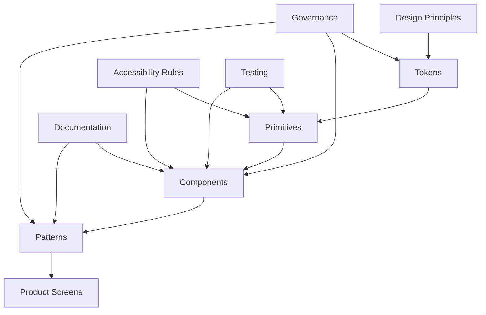
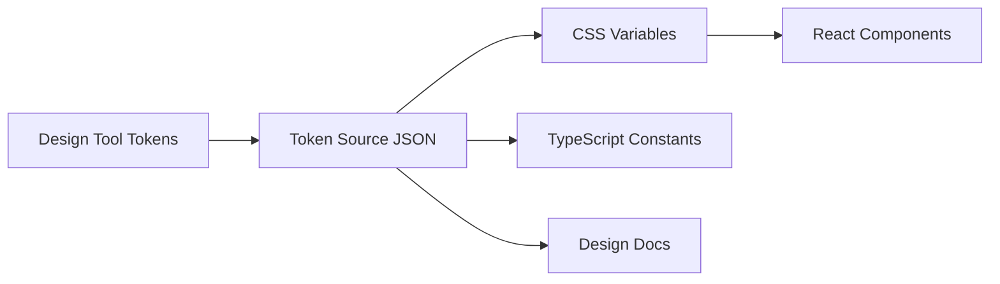

------
title: Learn Frontend React Production Architecture - Part 023
description: Production-grade guide to design system architecture in React, including tokens, component APIs, variants, composition, accessibility primitives, documentation, governance, versioning, adoption strategy, and anti-patterns.
series: learn-frontend-react-production-architecture
seriesTitle: Learn Frontend React Production Architecture
order: 23
partTitle: Design System Architecture
tags:
- react
- frontend
- design-system
- component-library
- tokens
- accessibility
- architecture
- production
- series
date: 2026-06-28
---

# Part 023 — Design System Architecture

## Tujuan Pembelajaran

Design system sering disalahartikan sebagai “folder komponen UI” atau “CSS token”.

Production design system jauh lebih luas.

Design system adalah **produk internal** yang menyatukan:

- visual language,
- interaction behavior,
- accessibility rules,
- component APIs,
- design tokens,
- documentation,
- code implementation,
- design implementation,
- testing strategy,
- versioning,
- governance,
- migration,
- adoption,
- quality bar.

Dalam React production architecture, design system menentukan apakah UI bisa tumbuh konsisten atau berubah menjadi kumpulan komponen random yang kebetulan mirip.

Part ini membahas design system sebagai **architecture and governance layer**, bukan sekadar library.

---

## 1. Design System vs Component Library

Component library adalah kumpulan komponen reusable.

Design system mencakup component library, tetapi juga mencakup aturan dan keputusan yang membuat komponen itu konsisten.

| Area | Component Library | Design System |
|---|---|---|
| Button component | yes | yes |
| Color tokens | maybe | yes |
| Accessibility standard | maybe | yes |
| Component API guidelines | maybe | yes |
| Design documentation | maybe | yes |
| Usage patterns | maybe | yes |
| Governance | rarely | yes |
| Versioning/migration | maybe | yes |
| Contribution process | maybe | yes |
| UX principles | no | yes |

Jika Anda hanya punya `Button.tsx`, `Modal.tsx`, dan `Table.tsx`, Anda punya component library. Jika Anda juga punya contract penggunaan, token, behavior, test, documentation, governance, dan migration path, Anda mulai punya design system.

---

## 2. Design System as Platform

Design system adalah platform internal untuk product engineers.



Tujuannya bukan hanya membuat UI cantik. Tujuannya:

- mempercepat delivery,
- menjaga consistency,
- mengurangi bug accessibility,
- mengurangi duplicate implementation,
- mengurangi design/code drift,
- membuat refactor visual lebih murah,
- meningkatkan quality baseline,
- memberi bahasa bersama antara design dan engineering.

---

## 3. Design System Layers

Layer umum:

```txt
tokens
  color, spacing, typography, radius, shadow, z-index

primitives
  Box, Stack, VisuallyHidden, FocusRing, Portal

interaction primitives
  Dialog, Popover, Menu, Tooltip, Tabs, Combobox

components
  Button, TextField, Select, Checkbox, Badge, Alert

patterns
  FormSection, PageHeader, EmptyState, DataTable, FilterBar

templates
  AuthenticatedShell, SettingsLayout, CaseDetailLayout
```

Semakin tinggi layer, semakin domain/product-specific.

Rule:

> Jangan letakkan domain workflow logic di design system base component.

`Button` tidak tahu tentang approval. `ApproveCaseButton` hidup di feature/domain layer.

---

## 4. Token Architecture

Design tokens adalah named decisions.

Examples:

```css
:root {
  --color-bg-default: #ffffff;
  --color-text-default: #111827;
  --space-1: 0.25rem;
  --space-2: 0.5rem;
  --radius-md: 0.5rem;
  --z-index-modal: 1000;
}
```

Token categories:

| Token | Example |
|---|---|
| color | background, text, border, semantic tone |
| spacing | scale 1–12 |
| typography | font size, line height, weight |
| radius | sm/md/lg/full |
| shadow | elevation scale |
| z-index | dropdown/modal/toast |
| breakpoint | sm/md/lg/xl |
| motion | duration/easing |
| opacity | disabled, overlay |
| component token | button height, input padding |

Token should represent design decisions, not arbitrary values.

---

## 5. Primitive Tokens vs Semantic Tokens

Primitive:

```css
--blue-500: #2563eb;
--red-600: #dc2626;
```

Semantic:

```css
--color-action-primary-bg: var(--blue-500);
--color-danger-text: var(--red-600);
--color-border-subtle: var(--gray-200);
```

Use semantic tokens in components.

Bad:

```css
.button {
  background: var(--blue-500);
}
```

Better:

```css
.button {
  background: var(--color-action-primary-bg);
}
```

Semantic tokens allow theme changes without rewriting components.

---

## 6. Component Token

Component tokens are useful when component variants need stable design control.

```css
:root {
  --button-height-md: 2.5rem;
  --button-padding-x-md: 1rem;
  --button-radius: var(--radius-md);
}
```

But avoid token explosion.

Not every CSS property needs token.

Token should exist when:

- designers refer to it,
- multiple components share it,
- theme needs override,
- governance matters,
- value should not be arbitrary.

---

## 7. Token Distribution

Tokens must reach both design and code.

Possible flow:



Source of truth can vary:

- design tool,
- code repo,
- token JSON package,
- generated CSS.

Important:

- avoid manual sync drift,
- version tokens,
- document breaking changes,
- test theme output,
- enforce token usage through lint/review.

---

## 8. Component API Design

A component API is a contract.

Bad Button API:

```tsx
<Button
  blue
  large
  rounded
  shadow
  marginTop={8}
  fontSize={13}
>
  Save
</Button>
```

This exposes random styling knobs.

Better:

```tsx
<Button variant="primary" size="md">
  Save
</Button>
```

Good API qualities:

- small,
- semantic,
- consistent naming,
- composable,
- accessible by default,
- hard to misuse,
- escape hatches available but controlled,
- predictable variants,
- no domain-specific leakage.

---

## 9. Variant Strategy

Common variant dimensions:

| Component | Variant Dimensions |
|---|---|
| Button | variant, size, loading, disabled |
| Badge | tone, size |
| Alert | tone, title, actions |
| TextField | size, invalid, disabled, prefix/suffix |
| Card | padding, elevation |
| Modal | size, dismissible |
| Table | density, selection mode |

Example:

```tsx
<Button variant="primary" size="md" isLoading>
  Approve
</Button>
```

Avoid combinatorial explosion:

```tsx
variant * size * tone * rounded * outline * iconPosition * emphasis * density
```

When combinations explode, split components or redesign API.

---

## 10. Composition Over Prop Explosion

Bad:

```tsx
<Card
  title="Case Summary"
  subtitle="Updated today"
  actions={[...]}
  footer="..."
  icon={<Icon />}
  badge={<Badge />}
  collapsible
  defaultCollapsed
/>
```

This becomes impossible to maintain.

Better:

```tsx
<Card>
  <CardHeader>
    <CardTitle>Case Summary</CardTitle>
    <CardDescription>Updated today</CardDescription>
    <CardActions>
      <Button>Refresh</Button>
    </CardActions>
  </CardHeader>
  <CardContent>
    ...
  </CardContent>
  <CardFooter>
    ...
  </CardFooter>
</Card>
```

Composition scales better because consumers provide structure through children/slots.

---

## 11. Slot Pattern

Slot pattern supports structured composition.

```tsx
<PageHeader>
  <PageHeader.Breadcrumbs items={breadcrumbs} />
  <PageHeader.Title>{caseDetail.referenceNo}</PageHeader.Title>
  <PageHeader.Description>{caseDetail.subjectName}</PageHeader.Description>
  <PageHeader.Actions>
    <Button>Approve</Button>
  </PageHeader.Actions>
</PageHeader>
```

Benefits:

- flexible layout,
- semantic regions,
- consistent spacing,
- less prop explosion,
- easier visual change.

Risks:

- too many subcomponents,
- consumer can arrange invalid combinations,
- context coupling if overdone.

Document valid composition.

---

## 12. Controlled and Uncontrolled Component APIs

Interactive components often need both.

Example Tabs:

```tsx
<Tabs value={tab} onValueChange={setTab}>
  ...
</Tabs>
```

Uncontrolled:

```tsx
<Tabs defaultValue="summary">
  ...
</Tabs>
```

Design system should define controlled/uncontrolled behavior consistently:

- `value` + `onValueChange`,
- `defaultValue`,
- do not switch controlled/uncontrolled,
- clear event naming,
- expose state only where needed.

---

## 13. Accessibility as Default

Design system must make accessible implementation the default path.

Button should render button:

```tsx
<button type="button">Approve</button>
```

Not:

```tsx
<div onClick={onClick}>Approve</div>
```

Dialog should handle:

- role,
- labelled title,
- focus trap,
- escape key,
- restore focus,
- modal semantics,
- background inert behavior where appropriate.

TextField should handle:

- label association,
- error id,
- `aria-invalid`,
- `aria-describedby`.

If design system components are inaccessible, every product screen inherits the defect.

---

## 14. Semantic HTML First

Use native elements when possible.

| Need | Prefer |
|---|---|
| clickable action | `button` |
| navigation | `a`/Link |
| form input | `input`, `select`, `textarea` |
| table data | `table` |
| heading | `h1`–`h6` |
| list | `ul`/`ol` |
| status message | appropriate live region if dynamic |

ARIA should enhance semantics when native HTML is insufficient. ARIA should not be used to recreate basic native behavior poorly.

---

## 15. Headless vs Styled Components

Styled component:

```tsx
<Button variant="primary" />
```

Headless primitive:

```tsx
<Dialog.Root>
  <Dialog.Trigger />
  <Dialog.Content />
</Dialog.Root>
```

Headless provides behavior/accessibility without fixed visual style.

Use headless for complex interaction primitives:

- Dialog,
- Popover,
- Menu,
- Combobox,
- Tabs,
- Tooltip,
- Select,
- Accordion.

Design system can wrap headless primitives with tokens/styles.

```tsx
<AccessibleDialog>
  <StyledDialogContent />
</AccessibleDialog>
```

---

## 16. Design System Package Boundaries

In monorepo:

```txt
packages/
  tokens/
  ui-primitives/
  ui-components/
  ui-patterns/
  eslint-config/
  storybook/
```

Or simpler:

```txt
src/shared/ui/
  primitives/
  components/
  patterns/
```

Choose based on team size and reuse.

Package boundary matters when:

- multiple apps consume same design system,
- versioning needed,
- independent release required,
- ownership separated,
- tree-shaking important,
- SSR/RSC compatibility needed.

---

## 17. Server/Client Compatibility

With RSC/SSR, design system components should be classified.

Server-safe:

- Badge,
- Card,
- Typography,
- Stack,
- static Table markup,
- Alert if no interaction,
- Icon if pure.

Client-required:

- Dialog,
- DropdownMenu,
- Combobox,
- Tooltip,
- Toast,
- DatePicker,
- Tabs if client state,
- Select custom.

Avoid single client barrel:

```tsx
"use client";

export * from "./Button";
export * from "./Card";
export * from "./Dialog";
```

This can pull server-safe components into client bundle.

Better:

```txt
@acme/ui/server
@acme/ui/client
```

or clear file-level directives.

---

## 18. Tree Shaking and Barrel Files

Bad package:

```ts
export * from "./Button";
export * from "./Dialog";
export * from "./DataGrid";
export * from "./RichTextEditor";
```

If not carefully built, consumer importing Button may include heavy components.

Guidelines:

- ESM output,
- sideEffects configured correctly,
- avoid top-level heavy imports,
- split entrypoints,
- lazy-load heavy components,
- test bundle output.

Example:

```txt
@acme/ui/button
@acme/ui/dialog
@acme/ui/data-grid
```

Or use named exports with verified tree-shaking.

---

## 19. Styling Architecture

Options:

- CSS modules,
- plain CSS + tokens,
- CSS-in-JS,
- utility classes,
- vanilla-extract,
- Tailwind with design tokens,
- compiled CSS-in-JS.

Decision criteria:

- SSR/RSC compatibility,
- bundle/runtime cost,
- theming,
- design token integration,
- developer experience,
- performance,
- critical CSS,
- variants,
- code splitting.

Whatever you choose, define rules:

- where tokens live,
- how variants are expressed,
- how overrides work,
- how responsive styles work,
- how dark mode works,
- how component styles are tested.

---

## 20. Escape Hatches

Consumers sometimes need customization.

Bad escape hatch:

```tsx
<Button style={{ marginTop: 17, color: "tomato" }} />
```

Better:

- `className` for layout only,
- `style` only for rare dynamic values,
- `asChild` pattern where appropriate,
- semantic variants,
- slots,
- CSS variables for controlled overrides,
- documented composition.

Example:

```tsx
<Button className="case-action-button" variant="primary" />
```

But if every consumer uses custom CSS to fix component, component API is wrong.

---

## 21. Layout Components

Design system layout primitives:

```tsx
<Stack gap="md">
  ...
</Stack>

<Inline gap="sm" align="center">
  ...
</Inline>

<Grid columns={3} gap="lg">
  ...
</Grid>
```

Use layout primitives to avoid ad hoc spacing everywhere.

However, avoid making layout components too magical.

Good layout primitive:

- simple,
- maps to CSS concepts,
- token-based,
- predictable.

Bad:

- embeds page-specific behavior,
- includes domain assumptions,
- too many props,
- breaks responsive control.

---

## 22. Pattern Components

Pattern components are higher-level but still domain-neutral.

Examples:

- PageHeader,
- EmptyState,
- ErrorState,
- FilterBar,
- DataTableShell,
- FormSection,
- DetailList,
- Timeline,
- WizardShell.

Pattern components encode product UX consistency.

Example:

```tsx
<EmptyState
  title="No cases found"
  description="Adjust your filters or create a new case."
  action={<Button>Create case</Button>}
/>
```

Avoid making pattern components know domain-specific permissions or API.

---

## 23. DataTable: Component or Pattern?

DataTable is often where design systems become overcomplicated.

Question: is it:

- simple table styling,
- headless data grid,
- full-featured server-driven grid,
- virtualized enterprise table,
- domain-specific case queue?

Better layering:

```txt
Table primitives
  Table, TableHeader, TableRow, TableCell

DataTable pattern
  sorting UI, loading, empty, pagination slots

Feature table
  CaseQueueTable, ReportTable
```

Do not build a mega DataTable that tries to solve every domain.

---

## 24. Icon Strategy

Icon systems can bloat bundles.

Guidelines:

- import specific icons,
- avoid importing whole icon package,
- standardize size/stroke,
- ensure decorative icons are hidden from screen readers,
- meaningful icons have accessible label,
- support RTL if needed,
- avoid icon-only buttons without labels.

Example:

```tsx
<button aria-label="Open notifications">
  <BellIcon aria-hidden="true" />
</button>
```

---

## 25. Documentation

Design system without docs becomes tribal knowledge.

Docs should include:

- component purpose,
- when to use,
- when not to use,
- props/API,
- accessibility notes,
- keyboard interaction,
- examples,
- variants,
- design specs,
- do/don't,
- testing status,
- migration notes.

Storybook is commonly used as component workshop, documentation, and testing surface.

Story docs should include edge states:

- loading,
- error,
- disabled,
- long text,
- empty,
- RTL if relevant,
- small viewport,
- high contrast,
- keyboard focus,
- screen reader notes.

---

## 26. Component States Matrix

For each component, document states.

Button:

| State | Expected |
|---|---|
| default | clickable |
| hover | visual affordance |
| focus-visible | focus ring |
| active | pressed feedback |
| disabled | non-interactive |
| loading | prevents duplicate action |
| icon-only | requires label |
| long text | wraps/truncates correctly |

TextField:

| State | Expected |
|---|---|
| empty | label visible |
| filled | value shown |
| invalid | error associated |
| disabled | skipped/non-editable |
| readonly | visible but not editable |
| required | indicated accessibly |
| help text | associated description |

---

## 27. Testing Design System Components

Test layers:

### Unit / Component Behavior

- render,
- props,
- controlled/uncontrolled,
- events,
- keyboard interaction,
- focus behavior.

### Accessibility Tests

- no obvious axe violations,
- labels,
- roles,
- ARIA states,
- focus trap,
- keyboard navigation.

### Visual Regression

- variants,
- states,
- themes,
- responsive.

### Contract Tests

- public API stable,
- deprecated props warn,
- server/client entrypoints safe.

### Bundle Tests

- component import does not pull heavy unrelated modules.

---

## 28. Visual Regression

Visual regression catches unintended UI changes.

But it can become noisy.

Best practices:

- test stable stories,
- avoid dynamic dates/randomness,
- freeze animations,
- deterministic fonts/assets,
- compare important variants,
- review diffs with design intent,
- separate intentional update from accidental regression.

Visual tests should support design system governance, not block every harmless pixel difference without context.

---

## 29. Accessibility Governance

Design system should define accessibility baseline.

Examples:

- all interactive components keyboard accessible,
- focus-visible styling required,
- color contrast token checked,
- error messages associated,
- modal focus trap tested,
- no icon-only button without label,
- no clickable div,
- form components expose error/help text ids,
- WCAG target level defined by organization, often AA.

Automated tests help but cannot replace manual keyboard/screen reader review.

---

## 30. Versioning

If design system is shared package, versioning matters.

Use semantic versioning style:

- patch: bug fix, no API break,
- minor: new component/variant,
- major: breaking prop/style behavior.

But visual changes can be breaking even if TypeScript API unchanged.

Examples of breaking visual changes:

- button height changes,
- spacing scale changes,
- color contrast changes,
- modal z-index changes,
- table density default changes.

Communicate visual breaking changes clearly.

---

## 31. Migration Strategy

Design system adoption is migration work.

Strategies:

- new components only for new features,
- wrapper around legacy components,
- codemods for prop rename,
- deprecation warnings,
- migration guide,
- lint rule banning legacy components,
- page-by-page migration,
- feature-flagged visual rollout.

Do not rewrite whole app just because design system exists.

---

## 32. Contribution Governance

Define contribution flow:

1. problem proposal,
2. design review,
3. accessibility review,
4. API review,
5. implementation,
6. tests,
7. docs/stories,
8. release notes,
9. adoption plan.

For new component, require:

- owner,
- use cases,
- non-goals,
- API design,
- accessibility pattern,
- keyboard behavior,
- variants,
- story coverage,
- test coverage.

---

## 33. Design System Anti-Patterns

### 33.1 Design System as CSS Dump

Only tokens/classes, no behavior or accessibility governance.

### 33.2 Mega Component

One component tries to solve all use cases with 50 props.

### 33.3 Domain Logic in Base Components

`Button` knows about case approval.

### 33.4 Inaccessible Primitives

Custom select/dialog/menu without keyboard/focus support.

### 33.5 Token Explosion

Thousands of tokens nobody understands.

### 33.6 No Versioning

Breaking visual/API changes surprise apps.

### 33.7 Storybook as Pretty Gallery Only

Stories show happy path, not edge states.

### 33.8 Uncontrolled Overrides Everywhere

Consumers use custom CSS to fight design system.

### 33.9 Client Barrel Pulls Everything

Server-safe components become client bundle.

### 33.10 No Adoption Governance

Design system exists but teams keep building one-off components.

---

## 34. Mini Case Study: Regulatory UI Design System

### Needed Components

- Button,
- IconButton,
- Badge,
- Alert,
- TextField,
- TextArea,
- Checkbox,
- Select,
- Dialog,
- DropdownMenu,
- Tabs,
- DataTable primitives,
- Timeline,
- PageHeader,
- EmptyState,
- FormSection,
- StatusBadge,
- SLAIndicator.

### Layering

```txt
tokens
  color/status/spacing/typography/z-index

primitives
  Stack, Inline, Box, VisuallyHidden, Portal

components
  Button, TextField, Dialog, Badge, Alert

patterns
  PageHeader, FormSection, EmptyState, Timeline, DetailList

domain feature
  CaseStatusBadge, ApproveCaseDialog, CaseTimeline
```

`StatusBadge` can be generic if tone/label passed. `CaseStatusBadge` belongs to feature/domain because it maps case statuses.

### Example

```tsx
<CaseStatusBadge status={caseDetail.status} />
```

Internally:

```tsx
function CaseStatusBadge({ status }: { status: CaseStatus }) {
  const view = getCaseStatusView(status);

  return <Badge tone={view.tone}>{view.label}</Badge>;
}
```

`Badge` is design system. `getCaseStatusView` is domain/view model.

---

## 35. Design System Review Checklist

Before approving design system component:

1. Is component domain-neutral?
2. Is API semantic and minimal?
3. Are variants controlled?
4. Is composition preferred over prop explosion?
5. Are accessibility roles/labels correct?
6. Is keyboard behavior defined?
7. Is focus behavior tested?
8. Are disabled/loading states clear?
9. Are tokens used instead of arbitrary values?
10. Are server/client boundaries clear?
11. Does component tree-shake?
12. Are stories complete?
13. Are edge states documented?
14. Are visual tests stable?
15. Are a11y tests included?
16. Is theming supported if required?
17. Are escape hatches controlled?
18. Are migration notes provided if changing existing component?
19. Is versioning impact understood?
20. Does this component belong in design system or feature layer?

---

## 36. Deliberate Practice

### Latihan 1 — Component API Audit

Pick `Button`, `Card`, or `Modal`.

Create table:

| Prop | Purpose | Keep/Remove/Rename | Reason |
|---|---|---|---|
| `blue` | style | remove | use `variant` |
| `isLoading` | state | keep | action pending |
| `marginTop` | layout | remove | parent layout owns spacing |
| `size` | variant | keep | tokenized size |

### Latihan 2 — Token Audit

Find hardcoded values:

```css
color: #2563eb;
margin: 17px;
z-index: 99999;
```

Map to tokens or remove.

### Latihan 3 — Accessibility Story Matrix

For one interactive component, create stories:

- default,
- keyboard focus,
- disabled,
- invalid,
- long text,
- small viewport,
- high contrast,
- screen reader label,
- error state.

### Latihan 4 — Domain Boundary Audit

Find design system components that know domain terms:

- `ApprovalButton`,
- `CaseBadge`,
- `OfficerSelect`.

Move to feature layer or make generic.

---

## 37. Ringkasan

Design system architecture is product architecture.

A strong design system provides:

- tokens,
- primitives,
- accessible components,
- reusable patterns,
- stable APIs,
- docs,
- tests,
- versioning,
- governance,
- migration support.

It should make the correct UI easy and the incorrect UI hard.

The best design systems are not just visually consistent. They encode accessibility, behavior, composition, and engineering discipline.

---

## 38. Self-Assessment

Anda siap lanjut jika bisa menjawab:

1. Apa beda component library dan design system?
2. Apa fungsi design tokens?
3. Mengapa semantic tokens lebih baik daripada primitive tokens di component?
4. Bagaimana menghindari prop explosion?
5. Kapan memakai headless primitive?
6. Mengapa design system harus accessibility-first?
7. Bagaimana membedakan generic component dan domain component?
8. Apa risiko barrel file dengan `'use client'`?
9. Bagaimana design system harus diuji?
10. Apa checklist sebelum menambahkan component baru?

---

## 39. Sumber Rujukan

- Storybook Docs — Component workshop, documentation, interaction testing, visual testing
- W3C WCAG 2.2
- W3C WAI-ARIA Authoring Practices Guide
- React Docs — Components and Props
- React Docs — Sharing State Between Components
- React Aria Docs — Accessible UI primitives
