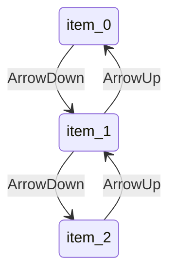
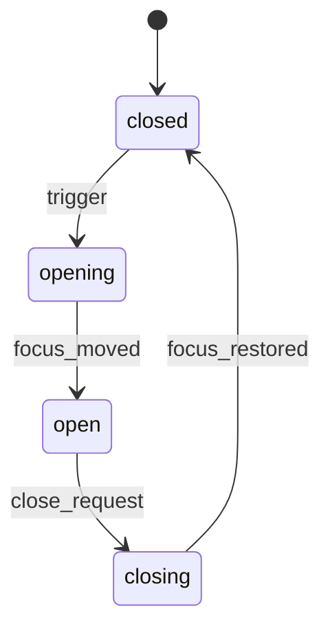

------
title: Learn Frontend React Production Architecture - Part 024
description: Production-grade guide to headless UI, accessible components, and interaction primitives in React, including ARIA patterns, keyboard navigation, focus management, dialogs, menus, comboboxes, tabs, portals, roving tabindex, and anti-patterns.
series: learn-frontend-react-production-architecture
seriesTitle: Learn Frontend React Production Architecture
order: 24
partTitle: Headless UI, Accessible Components, and Interaction Primitives
tags:
- react
- frontend
- accessibility
- headless-ui
- aria
- keyboard
- focus-management
- architecture
- production
- series
date: 2026-06-28
---

# Part 024 — Headless UI, Accessible Components, and Interaction Primitives

## Tujuan Pembelajaran

Interactive UI components terlihat sederhana sampai Anda harus membuatnya accessible.

Contoh komponen yang sering diremehkan:

- Dialog,
- Dropdown menu,
- Popover,
- Tooltip,
- Tabs,
- Accordion,
- Combobox,
- Select,
- Date picker,
- Toast,
- Command palette.

Jika dibuat sembarangan, komponen ini akan gagal pada:

- keyboard navigation,
- focus management,
- screen reader semantics,
- ARIA state,
- dismissal behavior,
- scroll locking,
- portal layering,
- mobile/touch interaction,
- form integration,
- error announcement.

Part ini membahas headless UI dan accessible interaction primitives sebagai **behavior architecture**.

---

## 1. Accessibility Is Not Decoration

Accessibility bukan checklist akhir.

Accessibility adalah bagian dari component contract.

Button contract:

- focusable,
- clickable by keyboard,
- role button,
- disabled semantics,
- accessible name,
- visible focus indicator.

Dialog contract:

- focus moves into dialog,
- background interaction blocked,
- labelled title,
- escape behavior defined,
- focus restored on close,
- screen reader understands modal context.

Combobox contract:

- input semantics,
- popup relationship,
- active option,
- keyboard navigation,
- selection behavior,
- screen reader announcements.

If component contract omits accessibility, component is incomplete.

---

## 2. Headless UI Mental Model

Headless component provides behavior and accessibility without enforcing styling.

Example concept:

```tsx
<Dialog.Root>
  <Dialog.Trigger>Open</Dialog.Trigger>
  <Dialog.Portal>
    <Dialog.Overlay />
    <Dialog.Content>
      <Dialog.Title>Approve case</Dialog.Title>
      ...
    </Dialog.Content>
  </Dialog.Portal>
</Dialog.Root>
```

The primitive handles:

- open state,
- ARIA,
- focus trap,
- escape key,
- outside click,
- portal,
- restore focus.

Your design system adds:

- tokens,
- layout,
- color,
- animation,
- size,
- variants.

---

## 3. Native HTML First

Before using ARIA, ask if native HTML solves it.

Use:

```tsx
<button type="button">Open</button>
<a href="/cases">Cases</a>
<input type="text" />
<select />
<textarea />
<dialog />
<table />
```

Avoid:

```tsx
<div role="button" onClick={...}>Open</div>
```

unless you also handle keyboard, focus, disabled semantics, and accessible name. Usually just use `<button>`.

Rule:

> No ARIA is better than bad ARIA. Native semantics first.

---

## 4. WCAG Mental Model

WCAG is organized under four principles:

- Perceivable,
- Operable,
- Understandable,
- Robust.

For component engineering:

| Principle | Component Implication |
|---|---|
| Perceivable | labels, contrast, visible states, text alternatives |
| Operable | keyboard, focus, no traps, enough target size |
| Understandable | predictable behavior, clear errors |
| Robust | valid semantics, works with assistive tech |

Design system should encode these principles into components.

---

## 5. Accessible Name

Every interactive control needs accessible name.

Good:

```tsx
<button>Approve case</button>
```

Icon-only:

```tsx
<button aria-label="Open notifications">
  <BellIcon aria-hidden="true" />
</button>
```

Bad:

```tsx
<button>
  <BellIcon />
</button>
```

Screen reader may announce nothing useful.

Accessible name can come from:

- text content,
- `aria-label`,
- `aria-labelledby`,
- associated label,
- alt text for image button.

---

## 6. Focus Management

Focus is the user's cursor for keyboard and assistive technology.

Focus rules:

- interactive elements must be focusable,
- focus order should follow visual/logical order,
- focus should be visible,
- route changes may need focus reset,
- modal opens should move focus inside,
- modal closes should restore focus,
- hidden elements should not receive focus,
- disabled elements usually should not be focusable unless pattern requires explanation.

Bad:

```css
*:focus {
  outline: none;
}
```

If removing default outline, replace with visible focus style.

---

## 7. Focus Visible

Mouse users may not need focus ring on click. Keyboard users do.

Use `:focus-visible`.

```css
.button:focus-visible {
  outline: 2px solid var(--color-focus-ring);
  outline-offset: 2px;
}
```

Do not remove focus style globally.

---

## 8. Roving Tabindex

For composite widgets like menu, tabs, toolbar, or listbox, often only one item is tabbable at a time.

```tsx
function RovingItem({
  active,
  children,
}: {
  active: boolean;
  children: React.ReactNode;
}) {
  return (
    <button tabIndex={active ? 0 : -1}>
      {children}
    </button>
  );
}
```

Arrow keys move active item.



Do not use roving tabindex for simple lists of links/buttons unless composite behavior is intended.

---

## 9. Keyboard Interaction Contracts

Document keyboard behavior for every complex component.

Examples:

| Component | Keys |
|---|---|
| Dialog | Escape closes if dismissible, Tab cycles within |
| Menu | Arrow keys navigate, Enter/Space selects, Escape closes |
| Tabs | Arrow keys move tab focus, Enter/Space activates depending mode |
| Combobox | Arrow keys navigate options, Enter selects, Escape closes |
| Accordion | Enter/Space toggles |
| Tooltip | Escape dismisses if open |
| Select | Arrow keys navigate, Enter selects |

Do not rely only on mouse testing.

---

## 10. Dialog

Dialog is one of the most important primitives.

Requirements:

- triggered by explicit action,
- `role="dialog"` or native dialog semantics,
- `aria-modal="true"` when modal,
- labelled by title,
- focus moves inside,
- focus trapped,
- Escape closes if dismissible,
- background inert/unavailable,
- scroll locking if needed,
- focus restored to trigger,
- close button accessible,
- nested dialogs avoided if possible.

Example shape:

```tsx
<Dialog>
  <DialogTrigger asChild>
    <Button>Approve</Button>
  </DialogTrigger>

  <DialogContent aria-labelledby="approve-title">
    <DialogTitle id="approve-title">Approve case</DialogTitle>
    <DialogDescription>
      This action will be recorded in the audit log.
    </DialogDescription>
    ...
  </DialogContent>
</Dialog>
```

---

## 11. Dialog State Machine



Close request can come from:

- close button,
- Escape,
- outside click if allowed,
- successful submit,
- route change,
- parent state reset.

Each close path should restore focus or move focus intentionally.

---

## 12. Alert Dialog

Alert dialog is for destructive or important confirmation.

Example:

- delete evidence,
- reject case,
- submit official approval.

Requirements:

- clear title,
- clear consequence,
- primary and cancel actions,
- initial focus chosen carefully,
- avoid accidental destructive default,
- keyboard accessible.

Do not use alert dialog for routine information.

For high-stakes workflow, prefer explicit confirmation text/reason form rather than generic “Are you sure?”

---

## 13. Popover vs Dialog vs Tooltip

| Component | Use |
|---|---|
| Tooltip | brief non-interactive description |
| Popover | small interactive floating content |
| Dialog | interruptive modal task |
| Menu | list of actions/options |
| Combobox/Listbox | selection from options |

Do not put form inside tooltip. Do not use popover for critical blocking confirmation. Do not use menu as generic layout container.

---

## 14. Dropdown Menu

Menu is for actions.

Example:

```tsx
<DropdownMenu>
  <DropdownMenuTrigger asChild>
    <Button variant="secondary">Actions</Button>
  </DropdownMenuTrigger>
  <DropdownMenuContent>
    <DropdownMenuItem onSelect={openAssignDialog}>
      Assign officer
    </DropdownMenuItem>
    <DropdownMenuItem onSelect={openEscalateDialog}>
      Escalate
    </DropdownMenuItem>
  </DropdownMenuContent>
</DropdownMenu>
```

Keyboard:

- trigger opens,
- arrow keys navigate,
- Enter/Space activates,
- Escape closes,
- focus returns to trigger,
- disabled items handled correctly.

Menu items should not contain arbitrary complex forms. Use dialog/popover for that.

---

## 15. Tooltip

Tooltip provides supplemental information.

Rules:

- not required for completing task,
- appears on hover/focus,
- dismissible,
- not interactive,
- not the only way to see critical info,
- accessible description connected where appropriate.

Bad:

```tsx
<Tooltip content="Reason required to approve">
  <Icon />
</Tooltip>
```

If information is critical, show inline text.

---

## 16. Tabs

Tabs organize related panels.

Structure:

```tsx
<Tabs value={value} onValueChange={setValue}>
  <TabsList aria-label="Case sections">
    <TabsTrigger value="summary">Summary</TabsTrigger>
    <TabsTrigger value="audit">Audit</TabsTrigger>
  </TabsList>
  <TabsContent value="summary">...</TabsContent>
  <TabsContent value="audit">...</TabsContent>
</Tabs>
```

Accessibility:

- tablist,
- tab,
- tabpanel,
- selected state,
- keyboard navigation,
- panel labelled by tab.

Routing decision:

- small local sections: tabs local state,
- deep-linkable major sections: route tabs.

Do not use tabs for navigation that should be normal links unless routing behavior is handled.

---

## 17. Accordion and Disclosure

Disclosure:

```tsx
<button aria-expanded={open} aria-controls="details">
  Details
</button>
<div id="details" hidden={!open}>
  ...
</div>
```

Accordion is a group of disclosures.

Questions:

- can multiple panels open?
- does at least one remain open?
- should state persist?
- should heading semantics be used?
- keyboard behavior?

Use native `<details>`/`<summary>` when it fits.

---

## 18. Combobox

Combobox is complex.

It involves:

- input,
- popup,
- options,
- filtering,
- active descendant,
- selection,
- keyboard navigation,
- text input behavior,
- screen reader announcement,
- async loading,
- empty state,
- disabled options.

Do not build custom combobox casually.

Use a proven accessible primitive or library.

Concept state:

```ts
type ComboboxState =
  | { status: "closed"; inputValue: string; selectedId?: string }
  | { status: "open"; inputValue: string; activeIndex: number; selectedId?: string };
```

But ARIA details are significant. Follow WAI-ARIA APG or use a maintained library.

---

## 19. Select

Native `<select>` is often better than custom select.

Use custom select only when you need:

- rich option content,
- async search,
- multi-select,
- custom grouping,
- virtualized long list,
- consistent complex styling.

Custom select must implement:

- label,
- keyboard,
- focus,
- popup,
- selection,
- form integration,
- disabled state,
- screen reader semantics.

Many custom selects are inaccessible. Be conservative.

---

## 20. Date Picker

Date picker is hard.

Requirements:

- keyboard calendar navigation,
- text input fallback,
- locale,
- timezone,
- min/max,
- invalid dates,
- screen reader labels,
- focus management,
- month/year selection,
- mobile behavior.

For enterprise/regulatory app, consider:

- text input with strict format + calendar helper,
- native date input if acceptable,
- proven date picker library,
- clear timezone rules.

Do not build calendar from scratch unless necessary.

---

## 21. Toast and Live Regions

Toast messages should be announced appropriately.

Use live regions carefully:

```tsx
<div aria-live="polite" aria-atomic="true">
  {message}
</div>
```

For urgent errors:

```tsx
<div role="alert">
  Failed to submit approval.
</div>
```

Do not spam screen reader with frequent background updates.

Toast should not be only place for form field errors.

---

## 22. Portal and Layering

Portals render outside normal DOM hierarchy.

Use for:

- modal,
- popover,
- tooltip,
- toast,
- command palette.

Issues:

- z-index,
- focus scope,
- event bubbling,
- SSR/hydration,
- scroll locking,
- stacking context,
- theming context,
- testing selectors.

Design system should centralize portal behavior.

---

## 23. Scroll Lock

Modal often locks background scroll.

Naive:

```ts
document.body.style.overflow = "hidden";
```

Problems:

- layout shift due scrollbar removal,
- nested modals,
- mobile Safari,
- cleanup bug,
- multiple locks.

Use robust scroll lock utility.

State should count locks:

```ts
let lockCount = 0;
```

Unlock only when all locks released.

---

## 24. Outside Click and Dismissal

Outside click behavior must be defined.

Dialog:

- modal task may not close on outside click if destructive/critical,
- informational modal may close.

Popover/menu:

- usually closes outside click,
- should not close when interacting inside,
- should handle pointer down vs click carefully.

Tooltip:

- hover/focus triggers,
- Escape dismiss if needed.

For approval/rejection command, outside click close may risk losing draft. Ask if dirty.

---

## 25. Disabled vs Readonly

Disabled:

- not focusable,
- not submitted in form,
- often hidden from assistive interaction,
- no tooltip via focus.

Readonly:

- focusable/readable,
- submitted if form semantics apply,
- useful for non-editable data.

If user needs to know why action unavailable, disabled button may hide explanation from keyboard users. Consider:

- explanatory text,
- tooltip on wrapper with accessible description,
- visible disabled reason,
- action availability panel.

---

## 26. `aria-disabled`

For custom composite items, `aria-disabled` may be used when item remains focusable but not actionable.

Example menu item:

```tsx
<div role="menuitem" aria-disabled="true">
  Approve unavailable
</div>
```

But you must prevent action manually.

Native `disabled` is better for native buttons when appropriate.

---

## 27. Hidden Content

Different hiding mechanisms:

| Mechanism | Visible | Screen Reader | Layout |
|---|---:|---:|---:|
| `display: none` | no | no | no |
| `hidden` | no | no | no |
| `visibility: hidden` | no | usually no | yes |
| visually hidden | no | yes | yes/minimal |
| `aria-hidden="true"` | maybe | no | yes |

Use visually hidden for screen-reader-only labels.

```css
.visually-hidden {
  position: absolute;
  width: 1px;
  height: 1px;
  overflow: hidden;
  clip-path: inset(50%);
  white-space: nowrap;
}
```

Do not put focusable elements inside `aria-hidden` content.

---

## 28. IDs and Relationships

ARIA often needs IDs:

- label,
- description,
- controls,
- active descendant.

React `useId` helps generate stable IDs.

```tsx
function TextField({ label, error }: Props) {
  const inputId = useId();
  const errorId = useId();

  return (
    <div>
      <label htmlFor={inputId}>{label}</label>
      <input
        id={inputId}
        aria-invalid={Boolean(error)}
        aria-describedby={error ? errorId : undefined}
      />
      {error && <p id={errorId}>{error}</p>}
    </div>
  );
}
```

Do not use `Math.random()` for IDs during render, especially with SSR.

---

## 29. Form Primitives

Design system form primitive should handle:

- label,
- description,
- error,
- required indicator,
- input id,
- `aria-describedby`,
- `aria-invalid`,
- disabled/readonly,
- layout spacing.

Example:

```tsx
<Field>
  <FieldLabel htmlFor={id}>Reason</FieldLabel>
  <TextArea id={id} aria-describedby={descriptionId} />
  <FieldDescription id={descriptionId}>
    Explain why this case should be approved.
  </FieldDescription>
  <FieldError>{error}</FieldError>
</Field>
```

Field primitive prevents every feature from reimplementing error association.

---

## 30. High Contrast and Reduced Motion

Respect user preferences:

```css
@media (prefers-reduced-motion: reduce) {
  * {
    animation-duration: 0.001ms;
    transition-duration: 0.001ms;
  }
}
```

Use carefully; do not break functional animations.

High contrast:

- do not rely only on background colors,
- use borders/icons/text,
- test forced-colors mode if target users need it.

---

## 31. Mobile and Touch

Accessibility includes touch.

Consider:

- target size,
- touch vs hover,
- virtual keyboard,
- scroll locking,
- safe area insets,
- pointer cancellation,
- focus after tap,
- long press not required,
- tooltip not hover-only.

Custom dropdowns and popovers often behave poorly on mobile. Test.

---

## 32. Unknown and Edge States

Interactive primitives should handle:

- long labels,
- no options,
- loading options,
- disabled options,
- nested scroll,
- small viewport,
- RTL,
- zoom 200%,
- screen reader,
- keyboard only,
- slow device,
- SSR hydration.

Storybook stories should cover these states.

---

## 33. Testing Accessible Primitives

Test with:

- Testing Library user interactions,
- keyboard navigation,
- focus assertions,
- role/name queries,
- axe for automated checks,
- visual regression,
- manual screen reader for complex components.

Example:

```tsx
test("dialog traps and restores focus", async () => {
  render(<ApproveDialogExample />);

  const trigger = screen.getByRole("button", { name: /approve/i });

  await user.click(trigger);

  expect(screen.getByRole("dialog", { name: /approve case/i }))
    .toBeInTheDocument();

  await user.keyboard("{Escape}");

  expect(trigger).toHaveFocus();
});
```

Use role/name queries because they align with accessibility tree.

---

## 34. Component Primitive API Checklist

For each primitive:

1. What native element/role?
2. What accessible name source?
3. What keyboard behavior?
4. What focus behavior?
5. What ARIA states?
6. What dismissal behavior?
7. What controlled/uncontrolled API?
8. What portal/layering behavior?
9. What disabled/readonly behavior?
10. What SSR behavior?
11. What mobile behavior?
12. What reduced-motion behavior?
13. What error/loading/empty states?
14. What tests?
15. What Storybook examples?

---

## 35. Anti-Pattern Catalog

### 35.1 Clickable Div

`div` with `onClick` but no keyboard semantics.

### 35.2 Custom Select Without Keyboard

Mouse-only select.

### 35.3 Dialog Without Focus Trap

Keyboard user tabs into background.

### 35.4 Tooltip for Critical Information

Keyboard/touch users miss required info.

### 35.5 Removing Focus Outline

No replacement focus indicator.

### 35.6 Icon Button Without Label

Screen reader announces nothing.

### 35.7 `aria-hidden` Around Focusable Content

Focus enters invisible accessibility tree.

### 35.8 Menu Used as Generic Container

Wrong semantics confuse assistive tech.

### 35.9 All Errors as Toast

Fields are not associated with error messages.

### 35.10 Reimplementing Complex Primitives Casually

Combobox/date picker/dialog built without ARIA/keyboard expertise.

---

## 36. Mini Case Study: Approve Case Dialog Primitive

### Requirements

- button opens dialog,
- dialog has title and description,
- reason textarea labelled,
- error associated,
- Escape closes if not submitting,
- cancel closes,
- submit disabled while pending,
- focus restored to trigger,
- audit warning visible,
- form errors announced.

### Composition

```tsx
<Dialog open={open} onOpenChange={setOpen}>
  <DialogTrigger asChild>
    <Button>Approve case</Button>
  </DialogTrigger>

  <DialogContent>
    <DialogTitle>Approve case</DialogTitle>
    <DialogDescription>
      This action will be recorded in the audit trail.
    </DialogDescription>

    <ApproveCaseForm
      caseId={caseId}
      onSuccess={() => setOpen(false)}
    />
  </DialogContent>
</Dialog>
```

### Form Field

```tsx
<Field error={form.formState.errors.reason?.message}>
  <FieldLabel htmlFor={reasonId}>Reason</FieldLabel>
  <TextArea
    id={reasonId}
    aria-invalid={Boolean(form.formState.errors.reason)}
  />
  <FieldError />
</Field>
```

This combines:

- dialog primitive,
- form primitive,
- domain form,
- mutation.

Each layer has clear responsibility.

---

## 37. Mini Case Study: Case Action Menu

### Requirements

- action trigger in case header,
- actions depend on available actions,
- disabled reason shown,
- keyboard navigable,
- action opens dialog,
- unavailable actions not silently confusing.

Possible UI:

```tsx
<DropdownMenu>
  <DropdownMenuTrigger asChild>
    <Button variant="secondary">Actions</Button>
  </DropdownMenuTrigger>

  <DropdownMenuContent>
    {actions.map((action) => (
      <DropdownMenuItem
        key={action.type}
        disabled={!action.available}
        onSelect={() => openActionDialog(action.type)}
      >
        {action.label}
        {!action.available && action.reason && (
          <VisuallyHidden>Unavailable: {action.reason}</VisuallyHidden>
        )}
      </DropdownMenuItem>
    ))}
  </DropdownMenuContent>
</DropdownMenu>
```

Consider whether unavailable actions should be hidden, disabled with reason, or visible elsewhere. This is UX/domain decision.

---

## 38. Deliberate Practice

### Latihan 1 — Clickable Div Audit

Search codebase for:

```tsx
<div onClick
<span onClick
```

Classify:

- should be `button`,
- should be `a`,
- should be non-interactive,
- needs composite widget behavior.

### Latihan 2 — Dialog Accessibility Test

For every dialog:

- open with keyboard,
- focus enters dialog,
- title announced,
- Tab stays inside,
- Escape behavior correct,
- close button labelled,
- focus returns to trigger,
- form errors announced.

### Latihan 3 — Combobox Decision

Before building custom combobox, write:

- why native select insufficient,
- option count,
- async search need,
- keyboard behavior,
- ARIA pattern,
- library considered,
- test plan.

### Latihan 4 — Focus Map

For one workflow:

1. open action menu,
2. select Approve,
3. dialog opens,
4. submit invalid form,
5. error appears,
6. fix and submit,
7. dialog closes.

Write expected focus target at every step.

---

## 39. Ringkasan

Headless accessible primitives are behavior infrastructure.

For production React apps:

- native HTML first,
- ARIA only when needed and correct,
- keyboard behavior defined,
- focus management tested,
- dialog/menu/combobox/select are not trivial,
- form primitives must associate labels/errors,
- portals/layers/scroll lock need governance,
- accessibility must be default in design system.

The strongest UI systems make accessible interaction the path of least resistance.

---

## 40. Self-Assessment

Anda siap lanjut jika bisa menjawab:

1. Apa itu headless component?
2. Mengapa native HTML harus diutamakan?
3. Apa itu accessible name?
4. Bagaimana dialog harus mengelola focus?
5. Apa itu roving tabindex?
6. Kapan memakai tooltip vs popover vs dialog?
7. Mengapa custom combobox sulit?
8. Bagaimana error form dikaitkan dengan input?
9. Apa risiko icon-only button tanpa label?
10. Apa checklist accessible primitive sebelum masuk design system?

---

## 41. Sumber Rujukan

- W3C WAI-ARIA Authoring Practices Guide
- W3C APG — Dialog, Menu, Combobox, Tabs Patterns
- W3C WCAG 2.2
- React Docs — `useId`
- React Docs — Refs and the DOM
- React Aria Docs — Accessibility primitives
- MDN — ARIA roles and attributes
