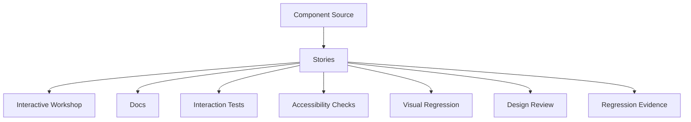
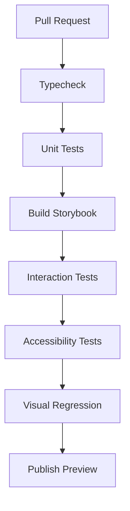

------
title: Learn Frontend React Production Architecture - Part 025
description: Production-grade guide to Storybook as component workshop, UI documentation, interaction testing, accessibility testing, visual review, design system governance, and frontend architecture support.
series: learn-frontend-react-production-architecture
seriesTitle: Learn Frontend React Production Architecture
order: 25
partTitle: Storybook, Component Workshop, and UI Documentation
tags:
- react
- frontend
- storybook
- documentation
- design-system
- component-testing
- accessibility
- visual-testing
- architecture
- production
- series
date: 2026-06-28
---

# Part 025 — Storybook, Component Workshop, and UI Documentation

## Tujuan Pembelajaran

Design system tanpa tempat kerja yang baik akan cepat membusuk.

Component library yang hanya diuji lewat halaman production akan sulit berkembang karena engineer harus menjalankan seluruh aplikasi hanya untuk melihat satu state komponen.

Storybook menyelesaikan masalah ini dengan menjadi **frontend workshop**: tempat untuk membangun, melihat, mendokumentasikan, menguji, dan mereview komponen secara terisolasi.

Namun Storybook juga sering disalahgunakan sebagai galeri cantik yang hanya menampilkan happy path.

Part ini membahas Storybook sebagai:

- component workshop,
- documentation platform,
- behavior test surface,
- accessibility review surface,
- visual regression surface,
- design-system governance tool,
- collaboration layer antara design, product, QA, dan engineering.

---

## 1. Storybook Mental Model

Storybook bukan hanya dokumentasi.



Story adalah executable example.

Sebuah story menjawab:

- component ini dipakai bagaimana?
- state apa saja yang harus didukung?
- prop apa yang penting?
- edge case apa yang perlu dipikirkan?
- behavior apa yang dijanjikan?
- accessibility state apa yang harus benar?
- visual regression apa yang tidak boleh berubah?

---

## 2. Why Storybook Matters in Production

Storybook membantu production codebase karena:

1. UI bisa dikembangkan tanpa menjalankan full app.
2. Component states terlihat eksplisit.
3. Docs hidup dekat dengan implementation.
4. Visual review lebih cepat.
5. Design-system governance lebih mudah.
6. Accessibility review bisa dilakukan lebih awal.
7. Interaction tests bisa dekat dengan stories.
8. Regression detection lebih terstruktur.
9. Onboarding engineer lebih cepat.
10. Product/QA bisa melihat component behavior tanpa setup domain kompleks.

Tanpa Storybook atau equivalent workshop, UI states sering tersembunyi di flow app yang sulit dicapai.

---

## 3. What Belongs in Storybook?

Good candidates:

- design system components,
- headless/styled primitives,
- form fields,
- dialogs,
- dropdowns,
- tables,
- cards,
- page headers,
- empty states,
- error states,
- loading skeletons,
- domain-independent patterns,
- reusable feature components,
- critical workflow dialogs,
- route-level page components with mocked data.

Less suitable:

- components requiring full backend integration without mocks,
- components with heavy routing assumptions unless wrapped,
- one-off private implementation details,
- low-level functions,
- components whose states are better tested as pure reducers/hooks.

Even route/page stories can be useful if data and providers are mocked.

---

## 4. Story Taxonomy

Story types:

| Story Type | Purpose |
|---|---|
| Default | baseline usage |
| Variants | size/tone/variant |
| States | loading/error/empty/disabled |
| Edge cases | long text, missing optional data, overflow |
| Responsive | small/medium/large viewport |
| Accessibility | keyboard/focus/error labels |
| Interaction | user clicks/types and assertions |
| Regression | stable visual snapshots |
| Domain examples | realistic usage with production-like data |
| Anti-example | sometimes docs-only “do not use like this” |

A mature Storybook has more than `Default`.

---

## 5. Component Story Format Mental Model

A story should be small, focused, and realistic.

Example:

```tsx
import type { Meta, StoryObj } from "@storybook/react";
import { Button } from "./Button";

const meta = {
  title: "Design System/Button",
  component: Button,
  args: {
    children: "Save",
    variant: "primary",
    size: "md",
  },
} satisfies Meta<typeof Button>;

export default meta;

type Story = StoryObj<typeof meta>;

export const Default: Story = {};

export const Loading: Story = {
  args: {
    isLoading: true,
    children: "Saving",
  },
};

export const Danger: Story = {
  args: {
    variant: "danger",
    children: "Delete",
  },
};
```

Stories should be clear enough that another engineer can copy usage safely.

---

## 6. Story Naming

Bad:

```txt
Button1
Button2
Test
Random
```

Good:

```txt
Default
Primary
Secondary
Danger
Loading
Disabled
IconOnly
LongLabel
```

For domain component:

```txt
ApproveAvailable
ApprovePending
ApproveForbidden
ConflictError
ValidationError
```

Names are documentation. Treat them as API.

---

## 7. Realistic Data Fixtures

Use realistic fixtures.

Bad:

```ts
const user = { name: "Test" };
```

Better:

```ts
const caseDetailFixture = {
  id: "CASE-2026-001",
  referenceNo: "CASE-2026-001",
  subjectName: "PT Nusantara Mineral Review",
  status: "UNDER_REVIEW",
  version: 7,
  availableActions: ["APPROVE", "REQUEST_INFORMATION"],
};
```

Fixtures should cover:

- normal data,
- long labels,
- missing optional fields,
- edge statuses,
- permission differences,
- empty arrays,
- large lists.

Do not use sensitive real production data in stories.

---

## 8. Provider Decorators

Many components need providers:

- theme,
- router,
- query client,
- auth context,
- permission context,
- i18n,
- form provider.

Use decorators.

```tsx
export const decorators = [
  (Story) => (
    <ThemeProvider>
      <MemoryRouter>
        <Story />
      </MemoryRouter>
    </ThemeProvider>
  ),
];
```

For feature stories:

```tsx
const meta = {
  decorators: [
    (Story) => (
      <TestAppProviders
        user={supervisorUser}
        permissions={supervisorPermissions}
      >
        <Story />
      </TestAppProviders>
    ),
  ],
};
```

Keep decorators close to component requirements. Do not make every story load the entire app shell unless needed.

---

## 9. Mocking API Calls

Use network mocking for components/hooks that fetch.

Pattern:

- mock at HTTP boundary,
- use MSW or equivalent,
- represent success/error/empty/slow states,
- avoid mocking implementation internals.

Example conceptual:

```ts
export const Success: Story = {
  parameters: {
    msw: {
      handlers: [
        http.get("/api/cases/CASE-001", () => {
          return HttpResponse.json(caseDetailFixture);
        }),
      ],
    },
  },
};
```

Stories should model production network states:

- success,
- loading delay,
- 401/403,
- 404,
- 409 conflict,
- 422 validation,
- 500 error.

---

## 10. Stories for Loading and Error States

If a component can load, it must have a loading story.

If it can fail, it must have error stories.

Example:

```txt
CaseDetailCard
  Default
  Loading
  NotFound
  Forbidden
  ServerError
  StaleDataWithRefetching
```

This prevents forgotten states from being ugly or inaccessible.

---

## 11. Stories for Empty States

Empty states are product UX, not absence of UI.

Examples:

- no cases,
- no results for filter,
- no audit events,
- no notifications,
- no documents,
- no permission to view data.

Each should be explicit.

```tsx
export const EmptyFiltered: Story = {
  args: {
    cases: [],
    filters: { status: "UNDER_REVIEW", query: "rare term" },
  },
};
```

Empty state should answer:

- what happened?
- is this normal?
- what can user do next?

---

## 12. Stories for Accessibility States

Every component with accessibility complexity should have stories for:

- keyboard focus,
- invalid field,
- described field,
- icon-only control,
- disabled with reason,
- dialog open,
- menu open,
- long label,
- high contrast if supported,
- reduced motion where relevant.

Example:

```tsx
export const Invalid: Story = {
  args: {
    label: "Reason",
    error: "Reason is required",
  },
};
```

This makes error association reviewable.

---

## 13. Interaction Tests

Storybook interaction tests simulate user behavior in the browser.

Example:

```tsx
export const OpensDialog: Story = {
  play: async ({ canvas, userEvent }) => {
    await userEvent.click(
      canvas.getByRole("button", { name: /approve/i })
    );

    await expect(
      canvas.getByRole("dialog", { name: /approve case/i })
    ).toBeVisible();
  },
};
```

Use interaction tests for:

- dialog open/close,
- menu keyboard navigation,
- form validation,
- submit pending state,
- tabs switching,
- accordion toggle,
- combobox filtering,
- error display,
- focus restoration.

Interaction tests should test user-observable behavior, not implementation details.

---

## 14. Accessibility Testing

Automated accessibility checks can catch many issues:

- missing labels,
- invalid ARIA,
- color contrast in some cases,
- role misuse,
- missing alt text,
- form association problems.

But automated tests do not catch everything:

- confusing reading order,
- poor copy,
- complex keyboard behavior,
- screen reader nuance,
- cognitive load,
- visual focus quality.

Use automated accessibility tests as baseline, not full guarantee.

---

## 15. Visual Regression Testing

Visual regression catches unintended layout/style changes.

Good candidates:

- design-system components,
- page headers,
- dialogs,
- cards,
- tables,
- empty/error states,
- responsive layouts,
- theme variants.

Make visual stories deterministic:

- no current time,
- no random IDs visible,
- no real network,
- stable fonts/assets,
- frozen animations,
- stable viewport.

Visual tests fail if stories are flaky. Flaky visual tests will be ignored.

---

## 16. Docs as Contract

Storybook docs should include:

- purpose,
- import path,
- basic usage,
- props,
- variants,
- accessibility notes,
- keyboard behavior,
- composition rules,
- when to use,
- when not to use,
- examples,
- migration/deprecation notes.

For complex components:

```mdx
## Keyboard Interaction

- `Tab`: moves focus into trigger.
- `Enter` or `Space`: opens menu.
- `ArrowDown`: moves to next item.
- `Escape`: closes menu and restores focus.
```

Docs should answer how component behaves, not just how it looks.

---

## 17. MDX Documentation

MDX is useful for design guidance.

Example structure:

```mdx
# Button

Use Button for actions that trigger changes.

## When to use

- submit a form
- open a dialog
- trigger command

## When not to use

- navigation links
- purely decorative elements

## Variants

<Canvas of={ButtonStories.Primary} />

## Accessibility

Icon-only buttons require `aria-label`.
```

Use MDX for decisions and usage guidance; use stories for executable examples.

---

## 18. Controls and Args

Storybook controls make props interactive.

Use args for public API exploration.

```tsx
const meta = {
  component: Badge,
  args: {
    tone: "neutral",
    children: "Under Review",
  },
  argTypes: {
    tone: {
      control: "select",
      options: ["neutral", "success", "warning", "danger"],
    },
  },
};
```

Controls are great for exploration, but curated stories are still necessary. Users should not have to discover all valid states manually.

---

## 19. Storybook and Design Review

Storybook can be used in pull requests:

- designer reviews changed components,
- QA verifies edge cases,
- engineer reviews accessibility behavior,
- product checks copy,
- snapshots compare visual changes.

A PR should link to relevant stories for major UI changes.

Review questions:

1. Is story coverage enough?
2. Are edge states included?
3. Does UI match design token/pattern?
4. Are keyboard interactions correct?
5. Are errors/empty/loading states acceptable?
6. Does visual diff match intended change?

---

## 20. Storybook and Component API Review

Stories reveal API quality.

If story requires awkward setup:

```tsx
<Card
  hasHeader
  headerTitle="..."
  headerActionText="..."
  headerActionOnClick={...}
  showFooter
  footerLeft="..."
  footerRight="..."
/>
```

The component API may be wrong.

Better composition may produce cleaner story.

Story friction is architecture feedback.

---

## 21. Storybook for Domain Components

Domain components can be in Storybook if mocked properly.

Example:

```txt
CaseActionBar
  OfficerCanRequestInfo
  SupervisorCanApprove
  AuditorReadOnly
  CaseLocked
  ConflictAfterSubmit
```

These stories become living documentation for workflow behavior.

But avoid putting backend rules only in story. Story should reflect contract from backend fixtures.

---

## 22. Storybook and State Machines

For local state machine components, story states should map to state machine states.

Approve dialog:

```txt
Closed
Editing
Confirming
Submitting
FailedValidation
FailedConflict
Success
```

If state machine has 7 states but Storybook only shows default, coverage is incomplete.

---

## 23. Storybook and Theming

Show:

- light mode,
- dark mode,
- high contrast if supported,
- compact density,
- RTL/locale if applicable.

Theme decorator:

```tsx
export const Dark: Story = {
  parameters: {
    theme: "dark",
  },
};
```

Or global toolbar to switch themes.

Test both token and component behavior.

---

## 24. Storybook and Responsive Viewports

Stories should be tested in key breakpoints.

Examples:

- mobile nav,
- small dialog,
- table overflow,
- form layout,
- card grid,
- page header actions wrapping.

Viewport stories:

```tsx
export const Mobile: Story = {
  parameters: {
    viewport: {
      defaultViewport: "mobile1",
    },
  },
};
```

Responsive bugs are easier to catch in isolated stories than after full app integration.

---

## 25. Storybook and DataTable

DataTable stories should include:

- empty,
- loading,
- error,
- few rows,
- many rows,
- long text,
- selectable rows,
- sort state,
- pagination,
- sticky header,
- narrow viewport,
- row action menu,
- keyboard focus,
- virtualized behavior if applicable.

DataTable happy path story is not enough.

---

## 26. Storybook and Forms

Form stories should include:

- pristine,
- dirty,
- validation errors,
- server field errors,
- server root error,
- submitting,
- success,
- disabled/read-only,
- conflict,
- long labels,
- required fields,
- keyboard submit.

Form stories often reveal accessibility bugs.

---

## 27. Storybook Architecture in Repo

Possible structure:

```txt
src/
  shared/
    ui/
      Button/
        Button.tsx
        Button.stories.tsx
        Button.test.tsx
        Button.module.css
        README.mdx
  features/
    cases/
      components/
        CaseActionBar.tsx
        CaseActionBar.stories.tsx
```

Or colocate stories with components.

Benefits:

- stories evolve with component,
- easier review,
- less stale documentation.

For design system package:

```txt
packages/ui/
  src/
  stories/
  docs/
```

Choose structure that keeps documentation maintained.

---

## 28. Storybook CI

CI can run:

- typecheck,
- build Storybook,
- interaction tests,
- accessibility tests,
- visual regression,
- publish preview.

Pipeline:



At minimum, ensure Storybook builds in CI. A broken Storybook means docs/tests/workshop are unreliable.

---

## 29. Storybook Preview Deployments

Preview deployment allows reviewers to inspect UI without local setup.

PR comment can include:

- Storybook preview URL,
- changed stories,
- visual diff summary,
- test results.

This helps cross-functional review.

For private enterprise apps, secure preview deployments appropriately.

---

## 30. Governance: Definition of Done

For new design-system component, require:

1. component implementation,
2. typed public API,
3. stories for variants/states,
4. docs/usage guidance,
5. accessibility notes,
6. keyboard behavior documented,
7. interaction tests for behavior,
8. visual stories,
9. no obvious a11y violations,
10. migration note if replacing old component.

For feature component, require story if:

- reused,
- complex state,
- important workflow,
- hard to reach manually,
- visual behavior important.

---

## 31. Anti-Pattern Catalog

### 31.1 Storybook as Pretty Gallery

Only default happy path. No errors, loading, edge cases, or tests.

### 31.2 Stories Depend on Real Backend

Flaky, slow, and hard to review.

### 31.3 No Provider Strategy

Every story manually wraps random providers.

### 31.4 Stories Use Fake Unrealistic Data

UI breaks with real text length/status/roles.

### 31.5 Visual Tests on Flaky Stories

Random dates/animation make diffs useless.

### 31.6 Docs Separate from Component

Docs rot because implementation changes separately.

### 31.7 No Accessibility Stories

Keyboard/focus/error states invisible.

### 31.8 Storybook Build Broken for Weeks

Tool loses trust.

### 31.9 Component API Hidden Behind Controls Only

No curated guidance.

### 31.10 No Story Review in PR

Storybook exists but is not part of engineering workflow.

---

## 32. Mini Case Study: Case Action Bar Stories

Component:

```tsx
<CaseActionBar caseDetail={caseDetail} />
```

Stories:

```txt
SupervisorCanApprove
OfficerCanRequestInformation
AuditorReadOnly
CaseLockedByOtherUser
NoAvailableActions
SubmittingApproval
ApprovalConflict
ApprovalForbidden
```

Fixtures:

```ts
const underReviewCase = {
  id: "CASE-2026-001",
  status: "UNDER_REVIEW",
  version: 7,
  availableActions: [
    { action: "APPROVE", available: true },
    { action: "REJECT", available: true },
  ],
};
```

Why valuable:

- documents workflow UX,
- tests disabled/action states,
- reveals if unavailable reasons are accessible,
- supports design review,
- helps QA understand role differences.

---

## 33. Mini Case Study: TextField Stories

Stories:

```txt
Default
WithDescription
Required
Invalid
Disabled
Readonly
LongLabel
PrefixSuffix
```

Invalid story:

```tsx
export const Invalid: Story = {
  args: {
    label: "Reason",
    value: "",
    error: "Reason is required",
  },
};
```

Interaction test:

```tsx
export const ValidationOnBlur: Story = {
  play: async ({ canvas, userEvent }) => {
    const input = canvas.getByLabelText(/reason/i);

    await userEvent.click(input);
    await userEvent.tab();

    await expect(
      canvas.getByRole("alert")
    ).toHaveTextContent(/required/i);
  },
};
```

---

## 34. Storybook Review Checklist

Before approving stories:

1. Does story title match taxonomy?
2. Are important variants covered?
3. Are loading/error/empty states covered?
4. Are long text and edge data covered?
5. Are accessibility states covered?
6. Are keyboard interactions tested for complex components?
7. Are stories deterministic?
8. Are API controls useful but not the only docs?
9. Are providers/mocks realistic?
10. Are network calls mocked?
11. Are no production secrets/data used?
12. Does Storybook build in CI?
13. Are visual diffs stable?
14. Are docs clear on when to use/not use?
15. Are story examples copy-pasteable?
16. Are domain stories based on backend-like fixtures?
17. Are deprecated components marked?
18. Are responsive states covered?
19. Are theme variants covered if applicable?
20. Does this story improve review confidence?

---

## 35. Deliberate Practice

### Latihan 1 — Story Coverage Matrix

Pick one component and create matrix:

| State | Story Exists? |
|---|---:|
| default | yes |
| loading | no |
| error | no |
| disabled | yes |
| long label | no |
| mobile | no |
| keyboard interaction | no |

Add missing stories.

### Latihan 2 — Convert Manual QA Case to Story

Take a QA scenario:

```txt
Supervisor tries to approve stale case and receives conflict.
```

Create:

- fixture,
- mocked API 409,
- story,
- interaction test.

### Latihan 3 — Storybook CI Gate

Add pipeline steps:

- build Storybook,
- run interaction tests,
- run accessibility checks,
- publish preview.

### Latihan 4 — API Design Feedback from Story

Pick story with awkward props. Refactor component API until story usage becomes clear.

---

## 36. Ringkasan

Storybook is a UI engineering operating system.

It helps teams:

- build components in isolation,
- document usage,
- review design,
- test interactions,
- catch accessibility issues,
- detect visual regressions,
- govern design system adoption,
- preserve edge states.

But Storybook only pays off if stories are treated as executable contracts, not screenshots.

A strong production frontend team uses stories to make UI states visible, reviewable, and testable.

---

## 37. Self-Assessment

Anda siap lanjut jika bisa menjawab:

1. Mengapa Storybook bukan hanya galeri?
2. State apa saja yang harus punya story?
3. Bagaimana story membantu API design?
4. Mengapa network harus dimock?
5. Apa manfaat interaction tests?
6. Apa batas automated accessibility testing?
7. Bagaimana membuat visual regression stabil?
8. Apa yang harus ada dalam docs component?
9. Bagaimana Storybook membantu workflow-heavy UI?
10. Apa Definition of Done untuk design-system component?

---

## 38. Sumber Rujukan

- Storybook Docs — Build, test, and document components
- Storybook Docs — Component testing
- Storybook Docs — Accessibility testing
- Storybook Docs — Visual tests
- Storybook Docs — Writing stories
- Testing Library Docs — User-centric queries
- WAI-ARIA Authoring Practices Guide
