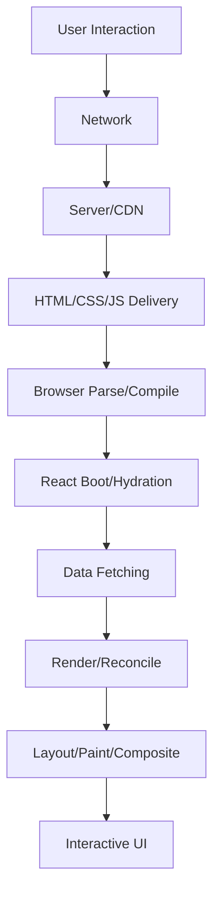
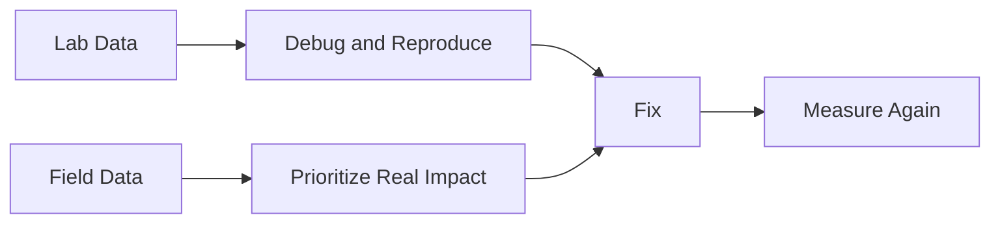
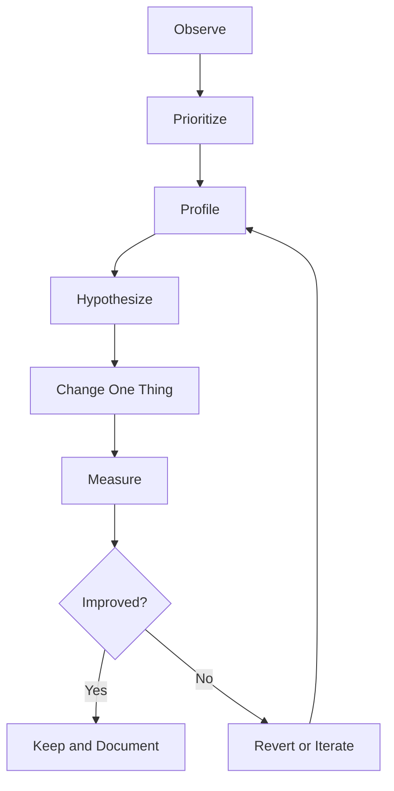

------
title: Learn Frontend React Production Architecture - Part 026
description: Production-grade guide to frontend performance mental models, Core Web Vitals, field vs lab data, performance budgets, React performance, bundle budgets, latency budgets, profiling loops, and anti-patterns.
series: learn-frontend-react-production-architecture
seriesTitle: Learn Frontend React Production Architecture
order: 26
partTitle: Performance Mental Model, Core Web Vitals, and Budgets
tags:
- react
- frontend
- performance
- core-web-vitals
- web-vitals
- budgets
- profiling
- architecture
- production
- series
date: 2026-06-28
---

# Part 026 — Performance Mental Model, Core Web Vitals, and Budgets

## Tujuan Pembelajaran

Performance engineering bukan ritual menambahkan `useMemo`.

Frontend performance adalah sistem yang melibatkan:

- network,
- server latency,
- CDN,
- HTML,
- CSS,
- JavaScript bundle,
- parsing,
- execution,
- rendering,
- hydration,
- data fetching,
- React render,
- layout,
- paint,
- input latency,
- third-party scripts,
- device capability,
- cache,
- UX perception.

Part ini membangun mental model performance dari level user experience sampai technical budget.

Target setelah part ini:

1. memahami Core Web Vitals,
2. membedakan lab data dan field data,
3. membuat performance budget,
4. tahu bottleneck kategori utama,
5. menghindari optimization yang salah sasaran,
6. membangun measurement loop,
7. menghubungkan React performance dengan web performance,
8. mendesain review checklist performance production.

---

## 1. Performance Is User Experience

User tidak peduli apakah lambat karena:

- JavaScript parse,
- server TTFB,
- React render,
- hydration,
- CSS blocking,
- image size,
- API waterfall,
- third-party script,
- layout thrashing.

User hanya merasakan:

- halaman lama muncul,
- tombol tidak responsif,
- layout lompat,
- input lag,
- scroll patah-patah,
- loading membingungkan,
- app terasa berat.

Performance engineering harus dimulai dari pengalaman user, lalu diturunkan ke metrik dan sistem.

---

## 2. Performance Stack



Bottleneck bisa terjadi di mana saja.

Jika LCP buruk karena image hero besar, `React.memo` tidak membantu.

Jika INP buruk karena expensive input handler, CDN tidak membantu.

Jika route transition lambat karena API waterfall, bundle splitting saja tidak cukup.

---

## 3. Core Web Vitals

Core Web Vitals adalah tiga metrik utama untuk pengalaman web:

| Metric | Measures | Good Threshold |
|---|---|---:|
| LCP | loading performance | ≤ 2.5s |
| INP | interactivity/responsiveness | ≤ 200ms |
| CLS | visual stability | ≤ 0.1 |

LCP: Largest Contentful Paint, kapan content terbesar utama terlihat.

INP: Interaction to Next Paint, seberapa responsif halaman terhadap interaksi user.

CLS: Cumulative Layout Shift, seberapa banyak layout bergerak tak terduga.

Core Web Vitals bukan satu-satunya performance metric, tetapi menjadi baseline penting untuk user-perceived quality.

---

## 4. LCP Mental Model

LCP dipengaruhi oleh:

- server response time,
- render-blocking resources,
- CSS,
- JavaScript blocking,
- image loading,
- font loading,
- client-side rendering delay,
- data fetch delay,
- hydration/rendering architecture,
- CDN/cache.

Common LCP element:

- hero image,
- large heading,
- main content block,
- product image,
- article title,
- dashboard header.

Improve LCP by:

- reduce TTFB,
- SSR/SSG critical content if needed,
- preload critical image/font carefully,
- optimize image size/format,
- avoid client-only blank shell for content-heavy route,
- reduce render-blocking CSS/JS,
- avoid data waterfall before primary content,
- use skeleton only when it improves perception, not as fake content.

---

## 5. INP Mental Model

INP measures interaction responsiveness.

Input delay can come from:

- long JavaScript tasks,
- expensive event handlers,
- large React render after input,
- synchronous validation,
- blocking third-party scripts,
- layout thrashing,
- heavy state updates,
- huge component tree rerender,
- expensive controlled input,
- large list rendering.

Improve INP by:

- keep event handlers small,
- split long tasks,
- use transitions where appropriate,
- colocate state,
- virtualize lists,
- avoid synchronous heavy validation per keystroke,
- debounce non-critical work,
- memoize measured expensive components,
- move heavy compute to worker/server,
- reduce JS shipped.

---

## 6. CLS Mental Model

CLS measures unexpected layout shift.

Causes:

- images without dimensions,
- ads/embeds injected late,
- font swap causing size change,
- skeleton not matching final layout,
- dynamic banners inserted above content,
- lazy-loaded content without reserved space,
- error/loading state changing layout drastically.

Improve CLS by:

- set width/height or aspect-ratio for media,
- reserve space for dynamic content,
- use stable skeletons,
- avoid inserting content above current viewport unexpectedly,
- use font loading strategy,
- keep alert/banner space predictable if possible.

React apps often create CLS through loading states that do not match final layout.

---

## 7. Other Important Metrics

Core Web Vitals are not enough.

| Metric | Why Useful |
|---|---|
| TTFB | server/CDN response speed |
| FCP | first visible content |
| TBT | lab proxy for main-thread blocking |
| JS bundle size | delivery/parse/execute cost |
| route transition time | SPA/RSC navigation UX |
| hydration time | SSR/RSC interactivity |
| API latency | data dependency |
| error rate | reliability |
| memory usage | long-running app health |
| long tasks | INP/debugging |
| FPS/scroll | visual smoothness |
| cache hit rate | delivery/data performance |

Choose metrics based on app type.

Internal SPA may care more about route transition, INP, and memory than public SEO.

---

## 8. Field Data vs Lab Data

Lab data:

- controlled environment,
- repeatable,
- useful for debugging,
- generated by Lighthouse/WebPageTest/local profiling.

Field data:

- real users,
- real devices,
- real networks,
- real interactions,
- noisy but authoritative.



Use both.

Lab can say “this page seems fast on simulated Moto G4.” Field can say “real users in Indonesia on mid-tier Android have poor INP.”

---

## 9. Percentiles

Performance should be evaluated by percentiles, not averages only.

Common:

- p50: median user,
- p75: commonly used threshold for Core Web Vitals,
- p95/p99: tail pain.

Average hides pain.

Example:

```txt
Average route transition: 600ms
p95 route transition: 8s
```

This means many users are okay, but a significant tail suffers.

Performance budgets should define percentile target.

---

## 10. Performance Budgets

Performance budget is a set of limits.

Budget types:

| Budget Type | Example |
|---|---|
| metric | LCP ≤ 2.5s p75 |
| resource | initial JS gzip ≤ 250KB |
| count | requests ≤ 50 |
| timing | route transition ≤ 800ms p75 |
| UX | form submit feedback ≤ 200ms |
| CPU | no task > 50ms in critical interaction |
| bundle | route chunk ≤ 150KB gzip |
| memory | no unbounded growth over 4h session |

Budget converts performance from opinion into engineering constraint.

---

## 11. Example Budget for Public Route

```txt
Route: /pricing

Field targets:
  LCP p75 <= 2.5s
  INP p75 <= 200ms
  CLS p75 <= 0.1

Lab targets:
  Lighthouse performance >= 90 on mobile profile
  TBT <= 200ms

Resource budgets:
  Initial JS gzip <= 180KB
  CSS gzip <= 60KB
  Hero image <= 120KB compressed
  Third-party scripts <= 2 critical scripts
```

Public routes are sensitive to first content and SEO.

---

## 12. Example Budget for Internal SPA

```txt
App: Case Management SPA

Initial load:
  app shell JS gzip <= 300KB
  first authenticated shell visible <= 3s p75 target users
  auth bootstrap <= 800ms p75

Interaction:
  case list filter input INP <= 200ms
  route transition cached <= 500ms perceived
  case detail load <= 1.5s p75 after navigation
  approval dialog opens <= 100ms
  approval submit feedback <= 200ms

Long session:
  no memory growth > 20% over 4h idle/use cycle
  WebSocket reconnect visible within 5s
```

Internal apps need budgets too, but metrics differ.

---

## 13. Budget Enforcement

Budgets can be enforced through:

- CI bundle size check,
- Lighthouse CI,
- WebPageTest,
- synthetic monitoring,
- RUM alerts,
- pull request visual/performance reports,
- dependency size checks,
- route-level chunk checks.

CI catches regressions before deploy. RUM catches real-world pain after deploy.

Do not rely only on local developer intuition.

---

## 14. Performance Review Loop



Avoid random optimization.

Bad:

```txt
App feels slow -> add useMemo everywhere.
```

Good:

```txt
Case list filter has INP p75 350ms -> profile typing -> 3000 rows rerender -> virtualize + colocate state -> INP p75 140ms.
```

---

## 15. Performance Bottleneck Taxonomy

| Bottleneck | Example |
|---|---|
| Network | slow API/image/JS download |
| Server | slow SSR/data response |
| Bundle | too much JS/CSS |
| Parse/execute | large JS main thread |
| Hydration | too many client components |
| Data waterfall | sequential API requests |
| Render | large React subtree |
| Commit/layout | DOM/layout expensive |
| Paint/composite | shadows/filters/large areas |
| Input handler | synchronous heavy work |
| Memory | leaks in long sessions |
| Third-party | analytics/chat blocks main thread |

Classify before optimizing.

---

## 16. React Performance Is Not All Performance

React-specific tools help with:

- component render cost,
- rerender reasons,
- memoization effects,
- context update impact,
- state colocation,
- Suspense boundaries,
- hydration/client component cost.

But React profiler does not fully explain:

- network waterfall,
- image size,
- server TTFB,
- CSS blocking,
- browser layout/paint,
- third-party scripts,
- font loading,
- CDN cache.

Use browser Performance panel and field metrics too.

---

## 17. React Profiler

React Profiler helps identify:

- which components render,
- how long render took,
- what update caused render,
- whether memoization helped,
- expensive subtree,
- repeated updates.

Use it for:

- slow interaction,
- input lag,
- large list render,
- context re-render storm,
- expensive chart/table,
- unnecessary rerenders.

Do not use it as only performance tool.

---

## 18. Browser Performance Panel

Use browser performance tools to inspect:

- long tasks,
- scripting vs rendering vs painting,
- layout recalculation,
- forced synchronous layout,
- event timing,
- CPU throttling,
- network waterfall,
- screenshots/frames,
- memory.

If INP is bad, browser Performance panel is essential.

React Profiler can show React render cost, but browser panel shows main thread reality.

---

## 19. Bundle Analysis

Bundle analysis answers:

- what code ships?
- which dependencies are largest?
- which route imports heavy modules?
- is tree-shaking working?
- are duplicate libraries present?
- is admin/report code in main bundle?
- are charts/editors/maps lazy-loaded?
- are icons imported efficiently?

Budget:

```txt
initial JS gzip <= 250KB
reports route chunk <= 180KB
admin route chunk <= 150KB
vendor chunk reviewed every release
```

Bundle size affects network, parse, and execution.

---

## 20. JavaScript Cost

JavaScript is expensive because browser must:

1. download,
2. decompress,
3. parse,
4. compile,
5. execute,
6. hydrate/render,
7. respond to events.

Reducing JS often improves:

- LCP,
- INP,
- battery,
- memory,
- low-end device performance.

Strategies:

- code splitting,
- remove dependencies,
- lazy-load heavy UI,
- prefer server components/static rendering where appropriate,
- avoid shipping admin code to public users,
- avoid polyfills unless needed,
- tree-shake icon libraries,
- replace heavy libraries with smaller alternatives.

---

## 21. Network Waterfall

Waterfall example:

```txt
HTML
  JS bundle
    auth request
      user request
        permissions request
          case detail request
            timeline request
```

Bad.

Better:

- preload critical assets,
- parallelize independent requests,
- server render/load critical data,
- combine endpoints/BFF where appropriate,
- route loader fetches before render,
- stream non-critical sections,
- cache reference data.

Waterfall often beats any component-level optimization as source of latency.

---

## 22. Loading UX and Perceived Performance

Performance is not only raw speed.

Good loading UX:

- shows stable skeleton,
- prioritizes critical content,
- keeps old data during refetch,
- provides immediate button feedback,
- avoids layout shift,
- distinguishes background refresh,
- allows cancellation/retry,
- does not block entire app unnecessarily.

Bad:

- full-page spinner for every update,
- content disappears during refetch,
- skeleton unlike final layout,
- no feedback after submit,
- multiple spinners.

Perceived performance matters, but do not use skeleton to hide severe latency forever.

---

## 23. React State and Performance

State update scope matters.

Bad:

```tsx
function Page() {
  const [query, setQuery] = useState("");

  return (
    <>
      <Search value={query} onChange={setQuery} />
      <HugeDashboard />
    </>
  );
}
```

Every keypress renders Page and potentially HugeDashboard.

Better:

```tsx
function Page() {
  return (
    <>
      <SearchSection />
      <HugeDashboard />
    </>
  );
}
```

State colocation often beats memoization.

---

## 24. Context and Performance

Context updates can rerender many consumers.

Avoid:

```tsx
<AppContext.Provider value={{ user, theme, filters, mouse, form }}>
```

Split by:

- ownership,
- update frequency,
- consumer scope.

High-frequency state may need external store selectors, not broad context.

---

## 25. Lists and Virtualization

Large lists hurt:

- render time,
- DOM size,
- layout,
- memory,
- scroll performance.

Virtualization renders only visible items.

Use for:

- thousands of rows,
- long audit timeline,
- large select/combobox options,
- logs/events,
- search results.

But virtualization has trade-offs:

- accessibility,
- dynamic row heights,
- keyboard navigation,
- browser find,
- print/export,
- scroll restoration.

Use intentionally.

---

## 26. Images and Media

Images often dominate LCP and bandwidth.

Optimize:

- correct dimensions,
- responsive `srcset`,
- modern formats,
- compression,
- lazy-load non-critical images,
- preload LCP image if needed,
- avoid layout shift with width/height/aspect-ratio,
- use CDN image resizing.

React cannot fix a 5MB hero image.

---

## 27. Fonts

Fonts affect LCP and CLS.

Consider:

- font-display strategy,
- preload critical fonts,
- reduce font weights/styles,
- use system fonts where acceptable,
- avoid layout shift from font swap,
- self-host vs external provider trade-offs.

Font loading is design + performance decision.

---

## 28. Third-Party Scripts

Third-party scripts can hurt:

- main thread,
- network,
- privacy,
- security,
- INP,
- LCP.

Examples:

- analytics,
- tag manager,
- chat widget,
- heatmap,
- A/B testing,
- monitoring.

Governance:

- owner,
- purpose,
- load timing,
- size,
- performance impact,
- privacy review,
- failure behavior,
- remove unused scripts.

Do not add third-party script without budget impact.

---

## 29. Hydration Cost

SSR/RSC apps can show HTML early but still need client JS for interactive parts.

Hydration cost depends on:

- amount of client component tree,
- bundle size,
- DOM size,
- event handlers,
- data serialization,
- third-party scripts.

Strategies:

- keep client boundaries small,
- move static content to server,
- lazy-load non-critical interactive widgets,
- avoid client wrapper around entire page,
- measure hydration and INP.

SSR without hydration discipline can still feel slow.

---

## 30. Route Transition Performance

For SPA/internal apps, route transition matters.

Measure:

- click to skeleton,
- click to meaningful content,
- cached route transition,
- uncached route data fetch,
- lazy chunk load,
- route error fallback.

Optimize:

- route-level code splitting,
- prefetch likely routes,
- keep previous data where useful,
- cache reference data,
- avoid route data waterfall,
- optimize shell persistence,
- show route-level skeleton.

---

## 31. Long-Running Sessions

Enterprise apps can stay open for hours.

Performance risks:

- memory leaks,
- unbounded query cache,
- WebSocket leaks,
- event listener leaks,
- timers not cleaned,
- large lists retained,
- detached DOM,
- stale closures,
- repeated subscriptions.

Test:

- open app,
- perform workflow repeatedly,
- navigate routes,
- leave tab idle,
- reconnect,
- check memory.

Performance is not only initial load.

---

## 32. Performance and Accessibility

Performance and accessibility interact.

Examples:

- delayed hydration can make visible controls unusable,
- focus management after route transition affects keyboard users,
- layout shift affects cognitive/motor accessibility,
- animations can harm reduced-motion users,
- long tasks block assistive tech interaction,
- skeletons without semantic status can confuse users.

Fast but inaccessible is not production quality. Accessible but painfully slow is also poor UX.

---

## 33. Performance and Product Decisions

Many performance issues are product/design decisions:

- huge dashboard above the fold,
- auto-loading all reports,
- 10 analytics scripts,
- infinite widgets,
- complex animations,
- high-resolution media,
- giant table without pagination,
- all filters instant server search,
- no loading prioritization.

Top engineers negotiate trade-offs with product/design early.

---

## 34. Performance Anti-Patterns

### 34.1 Memoization Before Measurement

Optimizing randomly.

### 34.2 Bundle Budget Ignored

Initial JS grows every sprint.

### 34.3 Full Page Spinner Everywhere

Poor perceived performance.

### 34.4 Client Rendering Content That Should Be Server/Static

Bad LCP for content-heavy route.

### 34.5 SSR as Magic Fix

Hydration still slow.

### 34.6 Query Waterfall

Sequential fetches add latency.

### 34.7 Context God Provider

Every update rerenders broad tree.

### 34.8 No Field Metrics

Only local fast laptop intuition.

### 34.9 Third-Party Script Sprawl

No ownership or budget.

### 34.10 Performance Work Without Regression Guard

Fix once, regress next month.

---

## 35. Mini Case Study: Slow Case List Filtering

### Symptom

Typing in case filter feels laggy.

### Wrong Fix

Add `useMemo` everywhere.

### Measurement

- INP bad during typing.
- React Profiler shows whole table rerenders.
- Browser Performance shows long tasks from 3000 rows.
- API not involved; filter is local.

### Root Causes

- search state in page root,
- full table rendered,
- rows expensive,
- no virtualization,
- derived filtering on every keypress.

### Fix Plan

1. Move input draft state into SearchSection.
2. Commit filter to URL on Apply or debounce.
3. Memoize derived filtered list if local.
4. Virtualize table.
5. Memoize row only if profiling confirms.
6. Measure INP again.

---

## 36. Mini Case Study: Poor LCP on Public Landing

### Symptom

LCP p75 is 4.2s.

### Measurement

- LCP element is hero image.
- TTFB okay.
- image 900KB.
- render-blocking CSS large.
- JS executes before image priority.

### Fix Plan

1. Resize/compress hero.
2. Serve responsive image.
3. Set width/height.
4. Preload only if actually LCP.
5. Defer non-critical JS.
6. Inline/minimize critical CSS if appropriate.
7. Re-measure field LCP.

React render optimization irrelevant here.

---

## 37. Mini Case Study: Slow Hydration in App Router

### Symptom

Page content appears but buttons unresponsive for seconds.

### Measurement

- HTML streams fast.
- client bundle large.
- page root marked `'use client'`.
- heavy chart library in client bundle.
- hydration long task.

### Fix Plan

1. Move page/layout back to Server Component.
2. Isolate chart into lazy Client Component.
3. Keep static summary server-rendered.
4. Reduce design system client barrel.
5. Measure hydration and INP.

---

## 38. Performance Review Checklist

Before approving performance-sensitive change:

1. What metric/user pain does this address?
2. Is measurement field, lab, or profiler?
3. Is bottleneck classified?
4. Is there a baseline?
5. What is target budget?
6. Is fix smallest effective change?
7. Could this regress accessibility?
8. Could this increase bundle?
9. Could this create stale/caching risk?
10. Are route/data waterfalls checked?
11. Are images/fonts considered?
12. Are third-party scripts affected?
13. Is hydration cost affected?
14. Is long-session memory affected?
15. Is regression guard added?
16. Is result measured after change?
17. Is trade-off documented?
18. Is optimization still correct without relying on accident?
19. Are low-end devices considered?
20. Does user-perceived UX improve?

---

## 39. Deliberate Practice

### Latihan 1 — Performance Budget

Create budget for one route:

```txt
Route:
User segment:
Device/network assumption:
LCP:
INP:
CLS:
Initial JS:
Route chunk:
API latency:
Interaction target:
```

### Latihan 2 — Bottleneck Classification

Pick one slow interaction. Classify:

- network,
- server,
- bundle,
- render,
- layout,
- paint,
- input handler,
- third-party.

Collect evidence.

### Latihan 3 — Bundle Audit

Find top 10 dependencies. For each:

| Dependency | Size | Initial/Route | Action |
|---|---:|---|---|
| chart lib | large | initial | lazy-load reports |
| icons | large | initial | fix imports |

### Latihan 4 — Field Metric Dashboard

Design RUM dashboard:

- LCP p75 by route,
- INP p75 by route/device,
- CLS p75 by route,
- route transition p75/p95,
- JS error rate,
- release comparison.

---

## 40. Ringkasan

Performance engineering is measurement-driven architecture.

Core rules:

- Start from user pain and metrics.
- Classify bottleneck before optimizing.
- Use field and lab data.
- Create budgets.
- Optimize the right layer.
- Measure after every change.
- Add regression guard.

React performance is one piece. Web performance includes delivery, assets, network, browser main thread, data, rendering architecture, and product decisions.

The top 1% engineer does not ask “where can I add memoization?” They ask “what is the measured bottleneck, which system layer owns it, and what trade-off gives the largest user benefit with the least risk?”

---

## 41. Self-Assessment

Anda siap lanjut jika bisa menjawab:

1. Apa itu LCP, INP, dan CLS?
2. Mengapa field data dan lab data sama-sama dibutuhkan?
3. Apa itu performance budget?
4. Mengapa average performance menyesatkan?
5. Bagaimana membedakan React render bottleneck dan browser layout bottleneck?
6. Kapan bundle analysis lebih penting daripada React Profiler?
7. Mengapa SSR tidak otomatis membuat app interactive cepat?
8. Apa risiko third-party scripts?
9. Bagaimana mendesain budget untuk internal SPA?
10. Bagaimana membuat performance review loop?

---

## 42. Sumber Rujukan

- web.dev — Web Vitals
- web.dev — Core Web Vitals
- web.dev — Performance budgets
- React Docs — `<Profiler>`
- React Docs — React Developer Tools
- Chrome DevTools — Performance panel
- Lighthouse Docs
- MDN — Performance budgets
