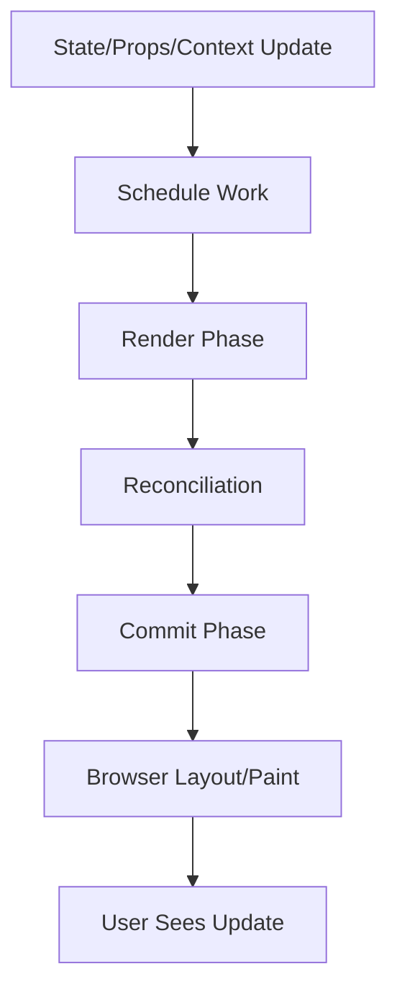
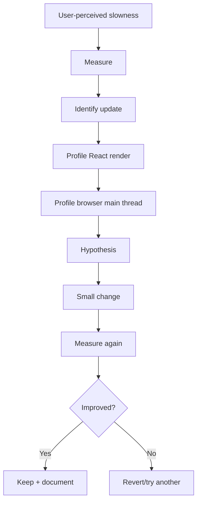

------
title: Learn Frontend React Production Architecture - Part 027
description: Production-grade guide to React rendering performance, profiling, rerender analysis, state colocation, memoization, virtualization, context optimization, transitions, deferred rendering, and anti-patterns.
series: learn-frontend-react-production-architecture
seriesTitle: Learn Frontend React Production Architecture
order: 27
partTitle: Rendering Performance, Profiling, and Optimization
tags:
- react
- frontend
- performance
- rendering
- profiler
- memoization
- optimization
- production
- series
date: 2026-06-28
---

# Part 027 — Rendering Performance, Profiling, and Optimization

## Tujuan Pembelajaran

Part sebelumnya membangun mental model performance dari sisi web platform: Core Web Vitals, budgets, field data, bottleneck taxonomy, dan measurement loop.

Part ini masuk lebih dalam ke React rendering performance.

Kita akan membahas:

- apa yang sebenarnya terjadi saat render React,
- mengapa component rerender,
- bagaimana menggunakan React Profiler,
- kapan rerender itu normal,
- kapan rerender menjadi masalah,
- state colocation,
- memoization strategy,
- `React.memo`,
- `useMemo`,
- `useCallback`,
- `useDeferredValue`,
- `useTransition`,
- Context optimization,
- list virtualization,
- expensive component isolation,
- effect-related performance issues,
- profiling-first workflow,
- anti-pattern umum.

Core principle:

> Jangan mengoptimalkan React render sebelum tahu render apa yang mahal, seberapa mahal, dan apakah user benar-benar merasakannya.

---

## 1. React Render Performance Mental Model

React UI update umumnya melalui beberapa tahap konseptual:



Render phase:

- React memanggil component functions,
- membuat React element tree baru,
- membandingkan dengan tree sebelumnya,
- menentukan perubahan.

Commit phase:

- React menerapkan perubahan ke DOM,
- menjalankan layout effects,
- browser melakukan layout/paint.

Performance bisa buruk pada:

- render phase mahal,
- commit phase mahal,
- DOM terlalu besar,
- layout/paint mahal,
- event handler mahal,
- browser main thread penuh,
- hydration mahal,
- effect cleanup/setup mahal.

---

## 2. Rerender Is Not Automatically Bad

Rerender adalah cara React bekerja.

Rerender kecil dan cepat itu normal.

Masalah muncul ketika:

- rerender terjadi terlalu sering,
- rerender menyentuh subtree besar,
- component melakukan expensive calculation saat render,
- render menghasilkan DOM besar,
- context update memicu banyak consumer,
- list ribuan item dirender,
- controlled input memicu chart/table rerender,
- effect memicu update loop,
- memoization salah membuat bug atau overhead.

Rule:

> Optimize expensive rerenders, not all rerenders.

---

## 3. What Causes a Rerender?

Component rerender when:

1. its own state changes,
2. parent rerenders and child is not memoized,
3. consumed context value changes,
4. external store subscription changes,
5. route/data provider updates,
6. key changes and component remounts,
7. Suspense boundary resolves,
8. transition/deferred update completes.

Example:

```tsx
function Parent() {
  const [query, setQuery] = useState("");

  return (
    <>
      <SearchBox value={query} onChange={setQuery} />
      <ExpensiveDashboard />
    </>
  );
}
```

Every query keystroke rerenders `Parent`, and by default `ExpensiveDashboard` is called again.

This may be fine if dashboard is cheap. It may be bad if dashboard is expensive.

---

## 4. Render Scope

State location determines render scope.

Bad:

```tsx
function CasePage() {
  const [filterDraft, setFilterDraft] = useState("");

  return (
    <PageLayout>
      <CaseFilterInput value={filterDraft} onChange={setFilterDraft} />
      <CaseMetricsPanel />
      <LargeCaseTable />
      <AuditTimeline />
    </PageLayout>
  );
}
```

Typing affects entire page.

Better:

```tsx
function CasePage() {
  return (
    <PageLayout>
      <CaseFilterSection />
      <CaseMetricsPanel />
      <LargeCaseTable />
      <AuditTimeline />
    </PageLayout>
  );
}

function CaseFilterSection() {
  const [filterDraft, setFilterDraft] = useState("");

  return (
    <CaseFilterInput
      value={filterDraft}
      onChange={setFilterDraft}
    />
  );
}
```

The state is colocated with the interaction. Expensive siblings no longer rerender due to keystrokes.

State colocation is often the simplest and best optimization.

---

## 5. Profiling-First Workflow

Performance workflow:



Do not optimize by vibes.

Collect:

- interaction name,
- route,
- device class,
- data size,
- browser,
- baseline metric,
- profiling recording,
- expected target.

---

## 6. React Profiler

React `<Profiler>` measures rendering performance of a React tree.

Concept:

```tsx
<Profiler id="CaseTable" onRender={handleRender}>
  <CaseTable />
</Profiler>
```

`onRender` receives information such as:

- id,
- phase,
- actualDuration,
- baseDuration,
- startTime,
- commitTime.

Use Profiler to answer:

- which subtree renders?
- how expensive is it?
- is render mount or update?
- did memoization reduce actualDuration?
- does one state update rerender too much?

In practice, React DevTools Profiler is usually the interactive starting point.

---

## 7. What to Look for in React Profiler

Look for:

- large commits,
- repeated commits,
- expensive components,
- components rendering due to parent update,
- context provider causing broad update,
- list rows all rerendering,
- expensive derived calculations,
- memoized components still rerendering due unstable props,
- effects causing immediate second update.

Not all expensive render is wrong. Some UI is genuinely complex. The goal is to avoid unnecessary work and make necessary work acceptable.

---

## 8. Browser Performance Panel

React Profiler alone is not enough.

Browser Performance panel shows:

- long tasks,
- scripting,
- style recalculation,
- layout,
- paint,
- compositing,
- event timing,
- network,
- screenshots,
- CPU throttling.

If INP is bad, inspect main thread.

Example:

- React render takes 20ms,
- layout takes 180ms due huge DOM table.

React memoization will not fix layout cost. Virtualization or DOM reduction might.

---

## 9. Common React Render Bottlenecks

| Bottleneck | Symptom |
|---|---|
| state too high | unrelated subtree rerenders |
| context too broad | many consumers update |
| large list | render/layout slow |
| unstable props | memoized child still rerenders |
| expensive derived calculation | CPU spike during render |
| inline object/function | prop identity changes |
| heavy component in initial tree | slow mount/hydration |
| controlled input with heavy siblings | typing lag |
| effect setState loop | repeated commits |
| large DOM | layout/paint slow |
| unvirtualized table | scroll and updates lag |
| over-memoization | complexity without benefit |

---

## 10. State Colocation

State colocation means putting state near where it is used.

Bad:

```tsx
function DashboardPage() {
  const [activeTooltipId, setActiveTooltipId] = useState<string | null>(null);

  return (
    <>
      <Toolbar />
      <MetricsGrid
        activeTooltipId={activeTooltipId}
        setActiveTooltipId={setActiveTooltipId}
      />
      <ReportPanel />
    </>
  );
}
```

If only metric cards need tooltip state, keep it there.

```tsx
function MetricsGrid() {
  const [activeTooltipId, setActiveTooltipId] = useState<string | null>(null);

  return ...
}
```

Benefits:

- smaller rerender scope,
- less prop drilling,
- clearer ownership,
- less need for memoization.

---

## 11. Component Splitting

Component splitting can reduce rerender scope.

Before:

```tsx
function CaseDetailPage({ caseDetail }: Props) {
  const [commentDraft, setCommentDraft] = useState("");

  return (
    <>
      <CaseSummary caseDetail={caseDetail} />
      <AuditTimeline caseId={caseDetail.id} />
      <textarea value={commentDraft} onChange={...} />
    </>
  );
}
```

After:

```tsx
function CaseDetailPage({ caseDetail }: Props) {
  return (
    <>
      <CaseSummary caseDetail={caseDetail} />
      <AuditTimeline caseId={caseDetail.id} />
      <CommentDraftBox caseId={caseDetail.id} />
    </>
  );
}
```

This alone may eliminate unnecessary rerender of summary/timeline while typing.

---

## 12. `React.memo`

`React.memo` lets React skip rerendering a component when props are unchanged.

```tsx
const CaseRow = memo(function CaseRow({
  caseItem,
  onOpen,
}: {
  caseItem: CaseItem;
  onOpen: (id: string) => void;
}) {
  return (
    <tr onClick={() => onOpen(caseItem.id)}>
      <td>{caseItem.referenceNo}</td>
      <td>{caseItem.status}</td>
    </tr>
  );
});
```

But memo only works if props are stable.

This breaks memo:

```tsx
<CaseRow
  caseItem={caseItem}
  onOpen={(id) => navigate(`/cases/${id}`)}
/>
```

`onOpen` is new every render.

Fix if profiling shows need:

```tsx
const handleOpen = useCallback((id: string) => {
  navigate(`/cases/${id}`);
}, [navigate]);

<CaseRow caseItem={caseItem} onOpen={handleOpen} />;
```

Do not wrap everything in `memo` by default.

---

## 13. When `React.memo` Helps

Use when:

- component renders often,
- component render is expensive,
- props usually unchanged,
- parent rerenders frequently,
- prop identity can be stabilized,
- measurement shows benefit.

Good candidates:

- table rows,
- expensive chart wrapper,
- rich card in list,
- large static subtree,
- complex form section,
- tree node component.

Poor candidates:

- tiny components,
- components whose props always change,
- components with many unstable children,
- components that consume frequently changing context,
- components rendered rarely.

---

## 14. `useMemo`

`useMemo` caches calculation result between renders.

Good:

```tsx
const visibleCases = useMemo(() => {
  return cases
    .filter((item) => item.status === status)
    .sort(compareByPriority);
}, [cases, status]);
```

Use when:

- calculation is expensive,
- dependencies change less often than parent render,
- result identity matters for memoized child,
- profiling shows calculation cost.

Bad:

```tsx
const label = useMemo(() => `${firstName} ${lastName}`, [firstName, lastName]);
```

This is unnecessary.

Worse:

```tsx
const value = useMemo(() => ({ status }), []);
```

Missing dependencies creates stale bugs.

---

## 15. `useCallback`

`useCallback` caches function identity.

Use when:

- passing callback to memoized child,
- callback is dependency of another hook,
- stable identity prevents expensive subscription/reset,
- measured rerender issue exists.

Example:

```tsx
const handleSelect = useCallback((id: string) => {
  dispatch({ type: "SELECT", id });
}, [dispatch]);
```

Do not use `useCallback` because “functions are expensive to create.” Usually function creation is not the bottleneck.

`useCallback` mostly helps with referential stability.

---

## 16. Referential Stability

React shallow prop comparison checks references.

New object each render:

```tsx
<DataTable
  columns={[
    { id: "referenceNo", header: "Reference" },
    { id: "status", header: "Status" },
  ]}
/>
```

This creates new `columns` array each render.

Better:

```tsx
const columns = useMemo(() => [
  { id: "referenceNo", header: "Reference" },
  { id: "status", header: "Status" },
], []);

<DataTable columns={columns} />;
```

Or define static outside component:

```ts
const caseColumns = [
  { id: "referenceNo", header: "Reference" },
  { id: "status", header: "Status" },
];
```

Do this when child depends on stable identity.

---

## 17. Memoization Cost

Memoization has cost:

- extra code complexity,
- dependency management,
- memory retention,
- stale closure risk,
- false confidence,
- harder debugging,
- overhead of comparisons,
- risk of hiding wrong state ownership.

Do not add memoization unless:

1. render/calculation is expensive,
2. rerender occurs frequently,
3. dependencies are stable,
4. profiling confirms improvement.

Optimization should have evidence.

---

## 18. Custom Comparison in `memo`

`React.memo` supports custom comparison.

```tsx
const CaseRow = memo(CaseRowBase, (prev, next) => {
  return prev.caseItem.version === next.caseItem.version &&
    prev.selected === next.selected;
});
```

Use sparingly.

Risks:

- incorrect comparison causes stale UI,
- deep equality is expensive,
- comparison cost can exceed render cost,
- hidden bugs when props added.

Prefer stable props and normal shallow comparison.

---

## 19. Context Performance

Context updates all consumers of that context value.

Bad:

```tsx
<AppContext.Provider value={{ user, theme, filters, formDraft, mousePosition }}>
  {children}
</AppContext.Provider>
```

Split contexts:

```tsx
<AuthProvider>
  <ThemeProvider>
    <ShellStateProvider>
      {children}
    </ShellStateProvider>
  </ThemeProvider>
</AuthProvider>
```

For high-frequency state, consider external store with selectors.

Also memoize provider values if needed:

```tsx
const value = useMemo(() => ({ user, logout }), [user, logout]);
```

But do not expect `useMemo` to prevent updates when `user` genuinely changes.

---

## 20. External Stores and Selectors

External stores like Redux or Zustand can reduce rerenders through selectors.

```tsx
const collapsed = useShellStore((state) => state.sidebarCollapsed);
```

Component rerenders only when selected value changes.

Bad:

```tsx
const shell = useShellStore();
```

This subscribes to whole store.

Selector discipline matters.

---

## 21. Large Lists

Large lists are common bottleneck.

Problems:

- thousands of React elements,
- thousands of DOM nodes,
- layout slow,
- paint slow,
- memory high,
- scroll jank,
- row update rerenders all rows.

Solutions:

- pagination,
- server filtering,
- virtualization,
- windowing,
- row memoization,
- stable row data,
- avoid inline heavy cell renderers,
- move row-level state into row,
- reduce DOM complexity.

---

## 22. Virtualization

Virtualization renders only visible items.

Use for:

- thousands of rows,
- audit logs,
- search results,
- large dropdown options,
- long trees.

Trade-offs:

- accessibility,
- keyboard navigation,
- dynamic heights,
- browser find,
- print/export,
- scroll restoration,
- row measurement complexity.

Not every table needs virtualization. For 50 rows, pagination may be simpler.

---

## 23. Expensive Derived Data

Example:

```tsx
const grouped = groupAndSortCases(cases, filters);
```

If expensive and run on every keypress, optimize.

Options:

1. compute on server,
2. memoize,
3. debounce input,
4. use deferred value,
5. move to Web Worker,
6. reduce data size,
7. normalize data,
8. precompute indexes.

`useMemo` is only one option.

---

## 24. `useDeferredValue`

`useDeferredValue` lets you defer updating part of UI.

Example:

```tsx
function CaseSearch({ cases }: { cases: CaseItem[] }) {
  const [query, setQuery] = useState("");
  const deferredQuery = useDeferredValue(query);

  const results = useMemo(() => {
    return searchCases(cases, deferredQuery);
  }, [cases, deferredQuery]);

  const isStale = query !== deferredQuery;

  return (
    <>
      <input value={query} onChange={(event) => setQuery(event.target.value)} />
      {isStale && <span>Updating results...</span>}
      <CaseResults results={results} />
    </>
  );
}
```

Typing stays responsive while results update later.

Use when:

- urgent input must update immediately,
- expensive dependent UI can lag,
- stale content is acceptable briefly.

Do not use to hide fundamentally bad architecture for huge data that should be server-filtered or virtualized.

---

## 25. `useTransition`

`useTransition` marks state update as non-urgent.

Example:

```tsx
function FilterTabs() {
  const [isPending, startTransition] = useTransition();
  const [tab, setTab] = useState("summary");

  function handleTabChange(nextTab: string) {
    startTransition(() => {
      setTab(nextTab);
    });
  }

  return (
    <>
      {isPending && <PendingIndicator />}
      <Tabs value={tab} onValueChange={handleTabChange} />
      <ExpensiveTabPanel tab={tab} />
    </>
  );
}
```

Use when:

- some state update can be deprioritized,
- immediate feedback should remain responsive,
- rendering next state is expensive,
- stale previous UI is acceptable while pending.

Do not wrap all updates in transitions. User-critical state like input value should stay urgent.

---

## 26. Debounce vs Deferred vs Transition

| Technique | Good For |
|---|---|
| debounce | reduce frequency of action/API/filter commit |
| throttle | limit repeated events like scroll/resize |
| `useDeferredValue` | let dependent UI lag behind urgent value |
| `useTransition` | mark state update as non-urgent |
| memoization | avoid recomputing unchanged expensive value |
| virtualization | reduce rendered DOM |
| worker | move CPU off main thread |

Example:

- search input draft: urgent local state,
- API search: debounced URL/query commit,
- local large result render: deferred value + virtualization,
- route transition: `startTransition` if appropriate.

---

## 27. Event Handler Cost

Expensive handler:

```tsx
function handleChange(value: string) {
  setValue(value);
  const result = expensiveSearch(allCases, value);
  setResults(result);
}
```

Every keystroke blocks.

Better:

- update input immediately,
- debounce search,
- defer results,
- move heavy work,
- server-side search for large data.

Handlers should do minimum urgent work.

---

## 28. Effects Causing Performance Issues

Effect anti-pattern:

```tsx
useEffect(() => {
  setFiltered(cases.filter(...));
}, [cases, filters]);
```

This creates extra render and duplicate state.

Prefer derived calculation:

```tsx
const filtered = useMemo(() => {
  return cases.filter(...);
}, [cases, filters]);
```

Effect setState loops:

```tsx
useEffect(() => {
  setOptions({ status });
}, [status, options]);
```

`options` changes every time -> loop.

Effects are synchronization with external systems, not default derivation mechanism.

---

## 29. Layout Thrashing

Layout thrashing happens when code alternates DOM reads and writes.

Example:

```ts
for (const item of items) {
  item.element.style.width = "100px";
  const height = item.element.offsetHeight;
}
```

Browser repeatedly recalculates layout.

In React:

- measuring layout in many components,
- synchronous DOM reads in layout effects,
- resizing many rows,
- expensive scroll handlers.

Solutions:

- batch reads/writes,
- use ResizeObserver carefully,
- avoid measuring every item,
- virtualize,
- use CSS layout instead of JS where possible.

---

## 30. `useLayoutEffect` Cost

`useLayoutEffect` runs before browser paints and can block visual update.

Use for:

- layout measurement before paint,
- positioning that must avoid flicker,
- scroll/focus correction where timing matters.

Avoid for:

- data fetching,
- non-layout effects,
- analytics,
- subscriptions not requiring pre-paint.

Overuse can hurt responsiveness and paint timing.

---

## 31. Expensive Children and Slots

Passing children can help isolate rerenders.

Example:

```tsx
function Shell({ children }: { children: React.ReactNode }) {
  const [sidebarOpen, setSidebarOpen] = useState(false);

  return (
    <div>
      <Sidebar open={sidebarOpen} onToggle={setSidebarOpen} />
      <main>{children}</main>
    </div>
  );
}
```

If `children` is passed from parent, updating shell state does not necessarily recreate child element tree inside Shell's render.

Composition can reduce accidental rerender coupling.

---

## 32. Data Shape and Rendering

Bad data shape can force expensive render work.

Example:

```tsx
cases.map((caseItem) => {
  const officer = officers.find((item) => item.id === caseItem.officerId);
});
```

O(n*m) per render.

Better:

```tsx
const officersById = useMemo(() => {
  return new Map(officers.map((officer) => [officer.id, officer]));
}, [officers]);

cases.map((caseItem) => {
  const officer = officersById.get(caseItem.officerId);
});
```

Or have backend return denormalized view needed by UI.

---

## 33. Keys and Performance

Keys help React preserve identity.

Bad:

```tsx
{items.map((item, index) => (
  <Row key={index} item={item} />
))}
```

If list reorders, React may reuse wrong state and perform inefficient updates.

Better:

```tsx
{items.map((item) => (
  <Row key={item.id} item={item} />
))}
```

Stable keys matter for correctness and performance.

---

## 34. Hydration and Client Component Boundaries

In SSR/RSC apps, rendering performance includes hydration.

Problems:

- huge client component tree,
- root layout marked `'use client'`,
- heavy design system client barrel,
- client table/chart hydrates immediately,
- third-party widgets block hydration.

Optimize:

- keep server components server-safe,
- lower client boundary,
- lazy-load heavy client widgets,
- use Suspense boundaries,
- reduce initial JS,
- avoid client wrappers around static content.

---

## 35. React Compiler Consideration

React Compiler can automatically apply memoization-like optimizations in supported setups. This reduces need for manual `memo`, `useMemo`, and `useCallback` in many cases.

But you still need:

- correct state ownership,
- pure components,
- stable architecture,
- list virtualization,
- network/data optimization,
- bundle reduction,
- profiling,
- accessibility and UX.

Compiler does not fix:

- rendering 10,000 DOM rows,
- giant bundle,
- bad API waterfall,
- image size,
- layout shift,
- excessive context scope,
- wrong state taxonomy.

---

## 36. Anti-Pattern Catalog

### 36.1 Memo Everything

Adds complexity and stale dependency bugs.

### 36.2 No Profiling

Optimization without evidence.

### 36.3 State at Page Root

Every small interaction rerenders entire page.

### 36.4 Context God Provider

One update rerenders broad app.

### 36.5 Unstable Props to Memoized Children

`memo` ineffective due new objects/functions.

### 36.6 Derived State via Effect

Extra render and synchronization bugs.

### 36.7 Large Unvirtualized Lists

DOM/render/layout cost explodes.

### 36.8 Deep Equality in Memo Comparator

Comparison becomes slower than render.

### 36.9 Transition Everything

Urgent UI becomes confusing or stale.

### 36.10 Ignoring Browser Layout/Paint

React render optimized but browser still slow.

---

## 37. Mini Case Study: Slow Approval Dialog Open

### Symptom

Clicking “Approve” freezes for 500ms before dialog appears.

### Baseline

- Button click is urgent interaction.
- React Profiler shows entire CaseDetailPage rerenders.
- CaseDetailPage includes huge AuditTimeline.
- Dialog open state is stored at CaseDetailPage root.

### Fix

Move dialog state closer to action bar.

Before:

```tsx
function CaseDetailPage() {
  const [approveOpen, setApproveOpen] = useState(false);

  return (
    <>
      <CaseActionBar onApprove={() => setApproveOpen(true)} />
      <AuditTimeline />
      <ApproveDialog open={approveOpen} />
    </>
  );
}
```

After:

```tsx
function CaseActionArea({ caseDetail }: Props) {
  const [approveOpen, setApproveOpen] = useState(false);

  return (
    <>
      <CaseActionBar onApprove={() => setApproveOpen(true)} />
      <ApproveDialog open={approveOpen} />
    </>
  );
}

function CaseDetailPage() {
  return (
    <>
      <CaseActionArea />
      <AuditTimeline />
    </>
  );
}
```

Measure again.

If still slow, inspect dialog mount cost and lazy-load heavy form dependencies.

---

## 38. Mini Case Study: Case Table Rerenders All Rows

### Symptom

Selecting one row rerenders 1000 rows.

### Causes

- selected state stored in parent,
- each row receives `selectedIds` Set,
- row computes `selectedIds.has(id)`,
- Set identity changes every selection,
- all rows see prop change.

Bad:

```tsx
<CaseRow selectedIds={selectedIds} />
```

Better:

```tsx
<CaseRow selected={selectedIds.has(caseItem.id)} />
```

Memoized row:

```tsx
const CaseRow = memo(function CaseRow({
  caseItem,
  selected,
  onToggle,
}: Props) {
  ...
});
```

Stable handler:

```tsx
const handleToggle = useCallback((id: string) => {
  dispatch({ type: "TOGGLE", id });
}, []);
```

Still, for 1000+ rows, consider virtualization.

---

## 39. Mini Case Study: Slow Search Results

### Symptom

Typing search query lags.

### Potential Fixes

1. Keep input state local and urgent.
2. Use `useDeferredValue` for results.
3. Memoize search calculation.
4. Debounce server search if remote.
5. Virtualize results.
6. Move heavy fuzzy search to worker or backend.

Example:

```tsx
const [query, setQuery] = useState("");
const deferredQuery = useDeferredValue(query);

const results = useMemo(() => {
  return fuzzySearch(cases, deferredQuery);
}, [cases, deferredQuery]);
```

Add stale indicator:

```tsx
const isStale = query !== deferredQuery;
```

---

## 40. Rendering Performance Review Checklist

Before approving render optimization:

1. What user interaction is slow?
2. Is there a baseline metric?
3. Did React Profiler identify expensive render?
4. Did browser Performance panel identify main-thread/layout cost?
5. Is state located too high?
6. Can component boundaries reduce rerender scope?
7. Is derived data recomputed unnecessarily?
8. Are props unstable?
9. Would `memo` actually skip renders?
10. Is `useMemo` protecting expensive calculation?
11. Is `useCallback` needed for referential stability?
12. Is context too broad?
13. Is external store selector too wide?
14. Is list too large and needs virtualization?
15. Is layout/paint the true bottleneck?
16. Is hydration/client boundary too large?
17. Does fix improve measured result?
18. Does fix increase complexity?
19. Is there a regression test/budget?
20. Is optimization documented?

---

## 41. Deliberate Practice

### Latihan 1 — Profiler Drill

Pick a slow interaction.

Record:

- before duration,
- top 5 expensive components,
- why they rendered,
- proposed fix,
- after duration.

### Latihan 2 — State Colocation Refactor

Find state in page root.

Move it into smallest subtree and measure rerender difference.

### Latihan 3 — Memoization Experiment

Choose one expensive row/card.

Test:

- no memo,
- `memo`,
- stable props,
- custom comparator.

Measure actual benefit.

### Latihan 4 — Context Split

Find context with unrelated values.

Split by update frequency and measure rerenders.

### Latihan 5 — Virtualization Decision

For a table/list:

- row count,
- row height stability,
- accessibility need,
- pagination need,
- scroll behavior,
- performance baseline.

Decide pagination vs virtualization.

---

## 42. Ringkasan

React rendering performance is about reducing unnecessary work and making necessary work fit user-perceived budgets.

Best optimizations are usually:

1. correct state ownership,
2. state colocation,
3. component boundaries,
4. avoiding derived state effects,
5. stable data shape,
6. list virtualization,
7. targeted memoization,
8. context/store selector discipline,
9. deferred/transition updates when appropriate,
10. measurement-driven iteration.

Do not worship memoization. Use it surgically.

Top-level rule:

> Measure first, optimize the correct layer, measure again.

---

## 43. Self-Assessment

Anda siap lanjut jika bisa menjawab:

1. Apa penyebab umum rerender React?
2. Mengapa rerender tidak otomatis buruk?
3. Bagaimana React Profiler membantu?
4. Kapan browser Performance panel lebih penting?
5. Mengapa state colocation sering lebih baik daripada memoization?
6. Kapan `React.memo` membantu?
7. Apa perbedaan `useMemo` dan `useCallback`?
8. Kapan memakai `useDeferredValue`?
9. Kapan memakai `useTransition`?
10. Bagaimana mendiagnosis table yang lambat?

---

## 44. Sumber Rujukan

- React Docs — `<Profiler>`
- React Docs — `memo`
- React Docs — `useMemo`
- React Docs — `useCallback`
- React Docs — `useDeferredValue`
- React Docs — `useTransition`
- React Docs — React Compiler
- Chrome DevTools — Performance panel
