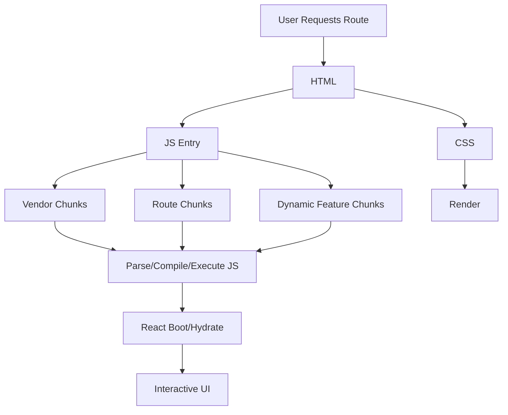

------
title: Learn Frontend React Production Architecture - Part 028
description: Production-grade guide to bundle architecture, code splitting, route-level delivery, dynamic imports, chunk strategy, dependency governance, asset delivery, caching, preloading, and anti-patterns in React/Vite/Next.js applications.
series: learn-frontend-react-production-architecture
seriesTitle: Learn Frontend React Production Architecture
order: 28
partTitle: Bundle Architecture, Code Splitting, and Delivery
tags:
- react
- frontend
- performance
- bundle
- code-splitting
- vite
- nextjs
- delivery
- architecture
- production
- series
date: 2026-06-28
---

# Part 028 — Bundle Architecture, Code Splitting, and Delivery

## Tujuan Pembelajaran

Bundle architecture menentukan berapa banyak JavaScript, CSS, dan asset yang harus dikirim ke browser sebelum user bisa melihat dan menggunakan aplikasi.

Banyak app React melambat bukan karena React render buruk, tetapi karena:

- initial bundle terlalu besar,
- admin/report/chart/editor dikirim ke semua user,
- icon library diimport salah,
- code splitting tidak dirancang,
- chunk waterfall,
- old assets dihapus terlalu cepat,
- `index.html` di-cache terlalu lama,
- sourcemap/config bocor,
- third-party scripts tidak terkendali,
- route lazy loading tidak punya fallback UX,
- dependency governance lemah.

Part ini membahas bundle architecture sebagai **delivery system design**, bukan sekadar konfigurasi bundler.

---

## 1. Core Mental Model

Browser harus melakukan banyak pekerjaan sebelum app siap.



Initial bundle is not just network size. It costs:

- download,
- decompression,
- parse,
- compile,
- execute,
- memory,
- hydration/render work.

Reducing unnecessary JS improves both load and interaction.

---

## 2. Bundle Is Product Surface

Every dependency is shipped to users unless split/server-only/tree-shaken.

Question:

> Should every user pay the cost of this code?

Examples:

- should login page load chart library?
- should case list load report builder?
- should mobile users load desktop data grid?
- should public route load admin console?
- should every user load PDF editor?
- should SSR server-only markdown parser ship to browser?
- should all icons ship for one icon?

Bundle architecture is product architecture because it decides who pays what cost.

---

## 3. Static Imports vs Dynamic Imports

Static import:

```ts
import { ReportBuilder } from "./ReportBuilder";
```

Included in bundle graph immediately.

Dynamic import:

```ts
const ReportBuilder = lazy(() => import("./ReportBuilder"));
```

Loaded when needed.

Use dynamic import for:

- routes,
- heavy modals,
- charts,
- editors,
- maps,
- PDF viewers,
- admin-only features,
- rarely used workflows,
- expensive libraries.

Do not dynamic import tiny components everywhere. Over-splitting can create waterfall.

---

## 4. React `lazy` and Suspense

React `lazy` defers component code loading until rendered.

```tsx
import { lazy, Suspense } from "react";

const ReportsRoute = lazy(() => import("./routes/ReportsRoute"));

function AppRoutes() {
  return (
    <Suspense fallback={<RouteSkeleton />}>
      <ReportsRoute />
    </Suspense>
  );
}
```

Use Suspense fallback that matches route/feature layout.

Bad:

```tsx
<Suspense fallback={<Spinner />}>
  <EntireApp />
</Suspense>
```

Better:

```tsx
<Route
  path="/reports"
  element={
    <Suspense fallback={<ReportsRouteSkeleton />}>
      <ReportsRoute />
    </Suspense>
  }
/>
```

---

## 5. Route-Level Code Splitting

Routes are natural split points.

```tsx
const CaseListRoute = lazy(() => import("@/features/cases/routes/CaseListRoute"));
const ReportsRoute = lazy(() => import("@/features/reports/routes/ReportsRoute"));
const AdminRoute = lazy(() => import("@/features/admin/routes/AdminRoute"));
```

Benefits:

- users only load route code they visit,
- admin/report code not in initial shell,
- feature teams can reason about route budget,
- heavy dependencies scoped.

But route splitting alone is not enough if shared imports pull heavy code into main bundle.

---

## 6. Feature-Level Code Splitting

Sometimes split within route.

Example: case detail route has optional PDF viewer.

```tsx
const EvidencePdfViewer = lazy(() => import("./EvidencePdfViewer"));

function EvidenceSection({ selectedDocument }: Props) {
  if (!selectedDocument) {
    return <EmptyEvidencePreview />;
  }

  return (
    <Suspense fallback={<PdfViewerSkeleton />}>
      <EvidencePdfViewer documentId={selectedDocument.id} />
    </Suspense>
  );
}
```

Feature-level splitting is useful for:

- rarely opened dialogs,
- document viewers,
- chart panels,
- rich editors,
- map widgets,
- export builders,
- advanced filters.

---

## 7. Modal-Level Code Splitting

Heavy modal:

```tsx
const AdvancedSearchDialog = lazy(() => import("./AdvancedSearchDialog"));

function AdvancedSearchButton() {
  const [open, setOpen] = useState(false);

  return (
    <>
      <Button onClick={() => setOpen(true)}>Advanced search</Button>
      {open && (
        <Suspense fallback={<DialogSkeleton />}>
          <AdvancedSearchDialog onClose={() => setOpen(false)} />
        </Suspense>
      )}
    </>
  );
}
```

Trade-off:

- first open may be delayed,
- can prefetch on hover/focus,
- fallback must not feel broken.

For critical modal like approve action, split only if it is heavy enough and UX still good.

---

## 8. Prefetching

Prefetching loads code/data before user needs it.

Examples:

- prefetch route on link hover,
- prefetch next wizard step,
- prefetch likely detail route when row visible,
- preload critical route chunk after app idle.

But prefetch can waste bandwidth.

Good prefetch candidates:

- high probability next route,
- small/medium chunk,
- user has good network,
- after critical work complete,
- not data-sensitive unless authorized.

Bad:

- prefetch all routes,
- prefetch huge admin chunk for everyone,
- prefetch on mobile slow network,
- prefetch sensitive data unnecessarily.

---

## 9. Preload vs Prefetch

Simplified:

| Mechanism | Purpose |
|---|---|
| preload | current navigation needs resource soon |
| prefetch | likely future navigation |
| modulepreload | module graph loading optimization |
| lazy/dynamic import | load when rendered/called |

Preload is higher priority. Use carefully.

If you preload too much, you compete with critical resources.

---

## 10. Chunk Waterfall

Over-splitting can create sequence:

```txt
main.js -> route.js -> chartWrapper.js -> chartLibrary.js -> locale.js
```

Each chunk discovers next dependency late.

Symptoms:

- many tiny chunks,
- route transition delayed,
- network waterfall,
- Suspense fallback visible too long.

Fix:

- group related chunks,
- avoid unnecessary nested lazy imports,
- prefetch known next chunks,
- use bundler analysis,
- keep route chunk self-sufficient enough.

Code splitting should reduce critical path, not create new one.

---

## 11. Vendor Chunk Strategy

Vendor chunking can help cache dependencies separately.

But not all vendor code should be one chunk.

Problems with giant vendor chunk:

- every route loads all libraries,
- chart/editor/admin deps in initial vendor,
- small change in dependency can invalidate huge chunk,
- slow parse/execute.

Possible grouping:

```txt
react-vendor
ui-vendor
charts-vendor
editor-vendor
pdf-vendor
```

But manual chunking can also create complexity.

Use bundle analysis before manual chunks.

---

## 12. Vite Build Mental Model

Vite production build uses Rollup under the hood for bundling.

Output commonly includes:

```txt
dist/
  index.html
  assets/
    index-abc123.js
    vendor-def456.js
    CaseListRoute-ghi789.js
```

Vite can split chunks automatically via dynamic imports. You can configure Rollup output options such as `manualChunks`.

Example concept:

```ts
export default defineConfig({
  build: {
    rollupOptions: {
      output: {
        manualChunks: {
          react: ["react", "react-dom"],
          charts: ["echarts"],
        },
      },
    },
  },
});
```

Do this based on analysis, not guesswork.

---

## 13. `chunkSizeWarningLimit`

Vite warns when chunks are large after minification.

Do not simply raise warning limit to hide problem.

Ask:

- which chunk is large?
- is it initial or lazy?
- what dependencies dominate?
- is it loaded by all users?
- can it be route-split?
- can dependency be replaced?
- can server-side rendering/RSC remove it from client?
- does real performance suffer?

Warning is signal, not diagnosis.

---

## 14. Bundle Analysis Tools

Use:

- Rollup visualizer,
- source-map-explorer,
- webpack-bundle-analyzer for Webpack apps,
- Next bundle analyzer,
- Vite bundle visualizer,
- browser Coverage tab,
- build output stats.

Analyze:

- initial JS,
- route chunks,
- duplicated packages,
- large dependencies,
- unused code,
- CSS size,
- sourcemaps,
- dynamic imports.

Create bundle reports in CI for PRs.

---

## 15. Dependency Governance

Before adding dependency:

1. What problem does it solve?
2. Is it needed client-side?
3. Can it be server-only?
4. Bundle size?
5. Tree-shakable?
6. ESM support?
7. Side effects?
8. Browser support?
9. Maintenance/security?
10. Can it be lazy-loaded?
11. Is smaller alternative acceptable?
12. Does it duplicate existing dependency?

Every dependency becomes part of delivery architecture.

---

## 16. Icon Libraries

Common bundle issue.

Bad:

```ts
import * as Icons from "some-icon-library";
```

or:

```ts
import { IconA, IconB } from "big-icon-library";
```

if package is not tree-shakeable.

Better:

- import per icon path if supported,
- verify tree-shaking,
- create app icon registry,
- use SVG sprites if appropriate,
- avoid shipping thousands of icons.

Icon-only buttons must still have accessible names.

---

## 17. Date Libraries and Locales

Date libraries can pull large locale/timezone data.

Questions:

- do you need all locales?
- can browser Intl handle it?
- can locale be lazy-loaded?
- is timezone computation server-side?
- can formatting be centralized?

Avoid importing all locale packs accidentally.

---

## 18. Chart Libraries

Chart libraries are often heavy.

Strategies:

- lazy-load chart routes,
- lazy-load chart component when visible,
- use lighter chart for simple visualization,
- render static image/server chart if non-interactive,
- avoid charts in initial bundle,
- virtualize/limit data points,
- avoid re-rendering chart on unrelated state.

Example:

```tsx
const RiskChart = lazy(() => import("./RiskChart"));
```

For dashboards, consider skeleton + lazy chart while critical metrics load first.

---

## 19. Rich Text Editors and PDF Viewers

These are heavy.

Do not load them for every user.

Use:

- route split,
- modal split,
- dynamic import on user action,
- worker split,
- CDN worker config carefully,
- permissions to avoid loading for unauthorized users,
- fallback while loading.

If workflow needs instant editor, prefetch after route idle.

---

## 20. CSS Bundle Architecture

CSS can block rendering.

Risks:

- huge global CSS,
- unused utility classes,
- design system imports all component CSS,
- route CSS waterfall,
- CSS-in-JS runtime cost,
- duplicate styles,
- critical CSS missing,
- font CSS blocking.

Strategies:

- remove unused CSS,
- code-split CSS where supported,
- keep global CSS minimal,
- token-based styles,
- avoid per-component runtime style injection if it hurts SSR/perf,
- preload critical CSS carefully.

---

## 21. Assets

Asset delivery includes:

- images,
- fonts,
- icons,
- JSON data,
- WASM,
- workers,
- PDFs,
- videos.

Rules:

- optimize size,
- use hashed filenames,
- cache immutable assets long-term,
- serve correct content type,
- avoid inlining huge assets,
- lazy-load non-critical media,
- reserve dimensions,
- use CDN where appropriate.

---

## 22. Static Hosting Cache Policy

For Vite SPA/static build:

| Resource | Cache |
|---|---|
| `index.html` | no-cache/short |
| hashed JS/CSS/assets | long immutable |
| config JSON | no-store/short |
| service worker | careful short/no-cache |
| old hashed assets | retain during rollout |

If `index.html` is cached forever, users may stay on old release. If old assets are deleted immediately, users with old HTML may get chunk 404.

Deployment must be atomic and rollback-aware.

---

## 23. Chunk Load Failure

Scenario:

1. User loads release A `index.html`.
2. Release B deploys.
3. Release A chunks deleted.
4. User navigates to lazy route.
5. Browser requests old chunk.
6. 404.
7. App crashes.

Mitigation:

- retain old assets,
- atomic deploy,
- chunk error boundary,
- reload prompt,
- monitor chunk load errors.

Example:

```tsx
function ChunkErrorFallback() {
  return (
    <div role="alert">
      <h1>Application updated</h1>
      <p>Please reload to continue.</p>
      <button onClick={() => window.location.reload()}>
        Reload
      </button>
    </div>
  );
}
```

---

## 24. Source Maps

Source maps help debugging but can expose source.

Options:

- generate and upload to observability provider,
- do not publicly serve maps,
- serve maps only behind auth,
- exclude sensitive comments/config,
- ensure source map release id matches deployed assets.

Do not accidentally publish source maps with secrets. Secrets should not be in source anyway, but source maps can expose internal code structure.

---

## 25. Runtime Config

Static app often needs runtime config.

Do not bake secrets into client config.

```json
{
  "apiBaseUrl": "https://api.example.com",
  "environment": "production",
  "releaseId": "2026.06.28-001"
}
```

Cache config carefully:

- no-store/short,
- validate schema,
- fail bootstrap clearly,
- include release id.

Runtime config can block boot if fetched synchronously. Keep it small and reliable.

---

## 26. Service Workers and Cache Complexity

Service workers can improve offline/caching but can break delivery:

- stale `index.html`,
- old chunks,
- cached API mismatch,
- logout data leakage,
- hard-to-debug update bugs,
- offline mutation conflicts.

Use only when requirements justify.

For workflow-heavy regulated apps, offline caching of sensitive data and commands needs explicit security/domain design.

---

## 27. Next.js Bundle Boundaries

In App Router/RSC:

- Server Components do not ship component code to browser,
- Client Components and their dependencies ship,
- `'use client'` boundary controls client graph,
- dynamic imports can split client components,
- route segments affect loading,
- server-only imports must not leak into client.

Bad:

```tsx
"use client";

import { heavyServerFormatter } from "@/server/formatters";
import { BigChart } from "@/features/reports/BigChart";
```

This can break or bloat client bundle.

Keep client boundaries low.

---

## 28. RSC and Bundle Reduction

RSC can reduce JS by keeping non-interactive UI server-side.

Good candidates:

- markdown rendering,
- static article content,
- case summary,
- timeline initial render,
- reference data display,
- non-interactive layout.

Client candidates:

- action dialogs,
- filters with local state,
- charts with interactivity,
- realtime subscriptions,
- drag/drop,
- rich editor.

RSC is not magic. If everything is marked `'use client'`, bundle remains large.

---

## 29. Dynamic Import in Next.js

Next.js supports dynamic loading patterns for client components.

Concept:

```tsx
const Chart = dynamic(() => import("./Chart"), {
  loading: () => <ChartSkeleton />,
});
```

Use for heavy client-only components.

Be mindful:

- SSR option depending component,
- loading fallback,
- layout stability,
- route segment boundaries,
- data dependencies.

---

## 30. Workers and WASM

Heavy CPU work can move off main thread.

Candidates:

- fuzzy search over large dataset,
- PDF processing,
- image manipulation,
- diff computation,
- large JSON parsing/transformation,
- crypto/compression,
- spreadsheet parsing.

Use Web Worker:

- split worker bundle,
- message data serialization cost,
- cancellation,
- error handling,
- worker lifecycle,
- browser support.

Moving work to worker does not reduce download size automatically. It improves main-thread responsiveness.

---

## 31. Data Splitting

Bundle architecture also includes data.

Avoid shipping:

- huge embedded JSON,
- all translations,
- all reference data,
- all feature flags,
- all icons,
- all locale data.

Strategies:

- lazy-load locale files,
- fetch reference data by feature,
- cache reference data,
- split translations by route/namespace,
- server render data needed for route only.

---

## 32. Internationalization Bundles

i18n can bloat bundles.

Strategies:

- route/namespace split translation files,
- load only active locale,
- avoid bundling all locales,
- cache translations,
- fallback language strategy,
- prefetch next likely namespace,
- server-side locale selection where applicable.

Example:

```ts
const messages = await import(`./locales/${locale}/cases.json`);
```

Make dynamic import pattern bundler-friendly.

---

## 33. Monorepo Bundle Risks

Monorepo risks:

- importing server package into client,
- duplicate React,
- duplicate utility packages,
- package not tree-shakeable,
- CJS package blocks tree-shaking,
- barrel exports side effects,
- internal package ships all features,
- design system client entry pulls heavy components.

Rules:

- explicit package exports,
- server/client entrypoints,
- no Node APIs in browser packages,
- peer dependencies for React,
- bundle tests for packages,
- dependency deduplication.

---

## 34. Module Side Effects

Tree-shaking depends on modules being side-effect-free where declared.

Side effects:

```ts
import "./global.css";
registerGlobalThing();
patchPrototype();
```

Package `sideEffects` config must be accurate. Wrongly marking side-effectful modules as side-effect-free can break app. Marking everything side-effectful can prevent tree-shaking.

Understand package build output.

---

## 35. Delivery Observability

Track:

- initial JS size by release,
- route chunk size,
- chunk load failures,
- cache hit/miss for assets,
- `index.html` cache issues,
- bundle parse/execute time,
- source map upload success,
- old asset 404,
- service worker update failures,
- route transition chunk load time.

Bundle performance is production observable.

---

## 36. CI Bundle Budgets

Add CI checks.

Example budgets:

```json
{
  "initialJsGzipKb": 300,
  "initialCssGzipKb": 80,
  "routes": {
    "reports": { "jsGzipKb": 180 },
    "admin": { "jsGzipKb": 160 },
    "cases": { "jsGzipKb": 220 }
  }
}
```

PR should show:

- bundle diff,
- largest new dependency,
- affected chunks,
- budget pass/fail.

Budget failures should trigger review, not blind overrides.

---

## 37. Anti-Pattern Catalog

### 37.1 Lazy Loading Everything

Creates chunk waterfall and bad UX.

### 37.2 Lazy Loading Nothing

All users download all features.

### 37.3 Raising Chunk Warning Limit

Silences symptom without understanding cost.

### 37.4 One Giant Vendor Chunk

All dependencies loaded upfront.

### 37.5 Heavy Library in Shared Component

Every route pays cost.

### 37.6 Client Barrel Exports Everything

Tree-shaking/client boundary breaks.

### 37.7 Deleting Old Assets Immediately

Lazy route chunk fails after deploy.

### 37.8 Caching `index.html` Forever

Users stuck on stale release.

### 37.9 Prefetch Everything

Wastes bandwidth and CPU.

### 37.10 No Bundle Diff in PR

Bundle grows unnoticed.

---

## 38. Mini Case Study: Admin Code in Main Bundle

### Symptom

Initial JS 900KB gzip. Most users only use case queue.

### Analysis

Bundle analyzer shows:

- admin route,
- chart library,
- rich editor,
- PDF viewer,
- all included in main chunk.

### Fix

1. Route-split admin.
2. Lazy-load chart panel.
3. Lazy-load editor on edit action.
4. Lazy-load PDF viewer when document selected.
5. Verify design system barrel not importing heavy components.
6. Add budget.

Before:

```tsx
import { AdminRoute } from "@/features/admin/AdminRoute";
```

After:

```tsx
const AdminRoute = lazy(() => import("@/features/admin/AdminRoute"));
```

Measure:

- initial JS gzip,
- route transition,
- admin load fallback.

---

## 39. Mini Case Study: Chart Library in Dashboard Shell

### Symptom

Login and case list load chart library even without dashboard.

### Cause

`DashboardCard` imported from shared UI imports chart library.

Bad:

```tsx
// shared/ui/index.ts
export * from "./Button";
export * from "./ChartCard";
```

`ChartCard` imports chart library.

Fix:

- move chart wrapper to reports/dashboard feature,
- split export entry,
- dynamic import chart,
- keep generic Card chart-free.

```txt
shared/ui/Card
features/reports/ChartCard
```

---

## 40. Mini Case Study: Chunk Load Error After Deployment

### Symptom

Users see blank screen after deployment when navigating.

### Cause

Old assets deleted immediately. User had old `index.html`.

Fix:

- retain old hashed assets,
- update deployment strategy,
- add chunk error boundary,
- monitor 404 for assets,
- ensure `index.html` no-cache.

This is delivery architecture, not React bug.

---

## 41. Bundle Architecture Review Checklist

Before approving bundle/delivery change:

1. What code enters initial bundle?
2. What route chunks are affected?
3. Is heavy dependency lazy-loaded?
4. Is code splitting at route/feature boundary?
5. Is there chunk waterfall?
6. Is fallback UX acceptable?
7. Are client/server boundaries correct?
8. Does design system barrel pull heavy code?
9. Is tree-shaking verified?
10. Are icon/date/chart libraries controlled?
11. Are CSS bundles reasonable?
12. Are assets optimized?
13. Is `index.html` cache policy safe?
14. Are hashed assets immutable?
15. Are old assets retained?
16. Are source maps handled securely?
17. Is runtime config small and safe?
18. Are bundle budgets enforced?
19. Are chunk load errors monitored?
20. Did field/lab performance improve?

---

## 42. Deliberate Practice

### Latihan 1 — Bundle Analyzer Review

Run analyzer and create table:

| Chunk | Size | Loaded When | Top Dependencies | Action |
|---|---:|---|---|---|
| main | 600KB | initial | admin, charts | route split |
| reports | 250KB | reports route | chart lib | acceptable/lazy |
| pdf | 400KB | document viewer | pdfjs | lazy on click |

### Latihan 2 — Route Split Plan

For each route:

| Route | Current Loading | Target Split |
|---|---|---|
| `/cases` | initial | initial/core |
| `/reports` | initial | lazy |
| `/admin` | initial | lazy permission-gated |
| `/cases/:id/documents` | initial | lazy PDF viewer |

### Latihan 3 — Deployment Cache Audit

Check:

- `index.html` headers,
- hashed asset headers,
- config headers,
- old asset retention,
- service worker strategy,
- rollback plan.

### Latihan 4 — Dependency Addition ADR

For a new chart library:

- bundle size,
- alternatives,
- lazy strategy,
- route affected,
- budget impact,
- accessibility,
- maintenance/security,
- owner.

---

## 43. Ringkasan

Bundle architecture decides what code users pay for.

Strong production strategy:

- split by route and heavy feature,
- avoid over-splitting,
- analyze before manual chunking,
- govern dependencies,
- keep client/server boundaries clean,
- optimize assets/CSS/fonts,
- cache hashed assets long-term,
- avoid stale `index.html`,
- retain old chunks,
- monitor chunk failures,
- enforce bundle budgets in CI.

The goal is not “smallest possible bundle” in isolation. The goal is delivering the right code to the right user at the right time with predictable performance and reliable deployment.

---

## 44. Self-Assessment

Anda siap lanjut jika bisa menjawab:

1. Apa biaya JavaScript selain download size?
2. Kapan memakai dynamic import?
3. Mengapa route-level splitting natural?
4. Apa risiko over-splitting?
5. Apa beda preload dan prefetch?
6. Mengapa giant vendor chunk bisa buruk?
7. Mengapa menaikkan `chunkSizeWarningLimit` bukan fix?
8. Bagaimana cache policy static assets seharusnya?
9. Apa penyebab chunk load failure setelah deployment?
10. Bagaimana mendesain bundle budget?

---

## 45. Sumber Rujukan

- React Docs — `lazy`
- React Docs — `<Suspense>`
- Vite Docs — Building for Production
- Vite Docs — Build Options
- Rollup Docs — `manualChunks`
- web.dev — Code-split JavaScript
- web.dev — Optimize JavaScript
- Next.js Docs — Lazy Loading
