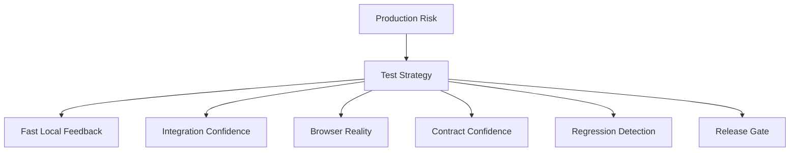
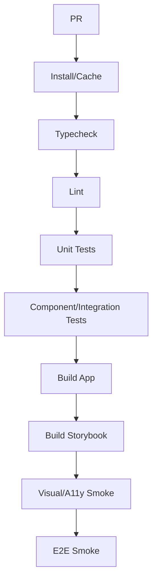

------
title: Learn Frontend React Production Architecture - Part 029
description: Production-grade guide to React testing strategy across unit, component, integration, and E2E tests, including test portfolio design, user-centric testing, flakiness control, accessibility tests, performance smoke, and CI quality gates.
series: learn-frontend-react-production-architecture
seriesTitle: Learn Frontend React Production Architecture
order: 29
partTitle: Testing Strategy: Unit, Component, Integration, and E2E
tags:
- react
- frontend
- testing
- unit-testing
- component-testing
- integration-testing
- e2e
- playwright
- testing-library
- vitest
- architecture
- production
- series
date: 2026-06-28
---

# Part 029 — Testing Strategy: Unit, Component, Integration, and E2E

## Tujuan Pembelajaran

Testing frontend production bukan sekadar “pakai Jest/Vitest + React Testing Library”.

Testing strategy adalah desain portofolio bukti bahwa aplikasi bekerja dalam kondisi nyata:

- pure logic benar,
- component behavior benar,
- user interactions benar,
- API integration benar,
- routing benar,
- workflow command benar,
- accessibility tidak rusak,
- regression visual terdeteksi,
- critical journey berjalan di browser,
- deployment bisa dipercaya,
- test tidak flaky,
- CI cukup cepat untuk dipakai setiap hari.

Part ini membahas testing sebagai **confidence architecture**.

Kita akan membahas:

1. test portfolio,
2. unit tests,
3. component tests,
4. integration tests,
5. E2E tests,
6. accessibility tests,
7. visual tests,
8. contract boundary,
9. performance smoke,
10. CI governance,
11. flakiness management,
12. anti-pattern.

---

## 1. Core Mental Model

Testing bukan soal jumlah test. Testing soal **confidence per cost**.



Setiap jenis test punya trade-off.

| Test Type | Speed | Confidence | Maintenance | Best For |
|---|---:|---:|---:|---|
| unit | very fast | focused | low | pure logic |
| component | fast | UI behavior | medium | component behavior |
| integration | medium | feature flow | medium | route + API mock |
| E2E | slower | high browser confidence | high | critical journeys |
| visual | medium | visual regression | medium/high | design system/layout |
| contract | medium | API compatibility | medium | client/server boundary |
| accessibility | medium | baseline a11y | medium | roles/labels/focus |

No single layer is enough.

---

## 2. Testing Pyramid vs Testing Trophy

Classic pyramid:

```txt
many unit
some integration
few E2E
```

Modern frontend often benefits from a “testing trophy” mindset:

```txt
static checks
unit tests
integration/component tests
few high-value E2E tests
```

For React apps, component/integration tests often provide high value because they can test user behavior without the cost/flakiness of full E2E.

A mature strategy is not dogmatic. It optimizes for:

- risk,
- speed,
- maintainability,
- realism,
- debugging quality,
- team workflow.

---

## 3. Test Portfolio by Risk

For a case management app:

| Area | Suggested Tests |
|---|---|
| status mapping | unit |
| URL filter parser | unit |
| reducer state machine | unit |
| Button/TextField/Dialog | component + a11y |
| Approve form | component/integration |
| Case detail route | integration with mocked API |
| API client error mapping | unit |
| approve mutation invalidation | integration |
| login flow | E2E |
| approve case happy path | E2E |
| conflict 409 handling | integration + E2E if critical |
| visual design system | visual regression |
| API compatibility | contract tests |

Design tests from risk, not arbitrary coverage percentage.

---

## 4. Static Checks Are Tests Too

Static checks catch classes of bugs before runtime:

- TypeScript,
- ESLint,
- accessibility linting,
- import boundary linting,
- formatting,
- dependency audit,
- bundle budget,
- schema generation checks,
- dead code checks.

Pipeline:

```txt
typecheck -> lint -> unit/component -> build -> storybook -> e2e smoke
```

Static checks are cheap and high signal.

Do not undervalue TypeScript. Many UI bugs are state shape/contract bugs.

---

## 5. Unit Tests

Unit tests are best for pure logic.

Examples:

- URL parser/serializer,
- reducers,
- state machine transitions,
- validation schema,
- DTO mapper,
- query key factory,
- status view model,
- permission display helper,
- date formatting policy,
- error normalizer,
- cache invalidation helper.

Example:

```ts
describe("parseCaseFilters", () => {
  it("defaults invalid page to 1", () => {
    const params = new URLSearchParams("page=abc&status=UNDER_REVIEW");

    expect(parseCaseFilters(params)).toEqual({
      page: 1,
      status: "UNDER_REVIEW",
      query: "",
      sort: "priority.desc",
    });
  });
});
```

Unit tests should be fast, deterministic, and numerous where logic matters.

---

## 6. Reducer and State Machine Tests

Reducers are perfect unit-test targets.

```ts
describe("approveDialogReducer", () => {
  it("moves from editing to confirming when reason is valid", () => {
    const state = {
      status: "editing",
      caseId: "CASE-001",
      reason: "Valid approval reason",
    } as const;

    expect(
      approveDialogReducer(state, { type: "CONTINUE" })
    ).toEqual({
      status: "confirming",
      caseId: "CASE-001",
      reason: "Valid approval reason",
    });
  });

  it("does not submit when closed", () => {
    expect(
      approveDialogReducer({ status: "closed" }, { type: "SUBMIT" })
    ).toEqual({ status: "closed" });
  });
});
```

Test valid and invalid transitions.

State machine tests are high-value because impossible states are a common UI bug source.

---

## 7. Component Tests

Component tests render component and interact as user.

Use Testing Library style:

- query by role/name/label,
- click/type/tab like user,
- assert visible behavior,
- avoid implementation details.

Example:

```tsx
test("shows error when approval reason is empty", async () => {
  render(<ApproveCaseForm caseId="CASE-001" version={7} />);

  await user.click(screen.getByRole("button", { name: /approve/i }));

  expect(screen.getByRole("alert"))
    .toHaveTextContent(/reason is required/i);
});
```

Good component test:

- talks like user,
- does not inspect private state,
- does not rely on CSS class,
- covers accessibility semantics,
- is deterministic.

---

## 8. Queries That Reflect User Experience

Prefer:

```tsx
screen.getByRole("button", { name: /approve case/i });
screen.getByLabelText(/reason/i);
screen.getByText(/case not found/i);
```

Avoid:

```tsx
container.querySelector(".approve-button");
screen.getByTestId("approve-button");
```

`data-testid` is acceptable when:

- no semantic role exists,
- testing invisible technical marker,
- repeated similar elements need disambiguation,
- stable contract explicitly defined.

But role/name/label queries should be default.

---

## 9. User Event vs Fire Event

Prefer user-level interactions.

```tsx
await user.click(button);
await user.type(input, "Approval reason");
await user.tab();
```

This better simulates browser events a user triggers.

Low-level events are sometimes needed for special cases, but they are less representative.

---

## 10. Component Tests for Accessibility

Component tests can assert accessible structure.

Examples:

```tsx
expect(screen.getByRole("dialog", { name: /approve case/i }))
  .toBeInTheDocument();

expect(screen.getByLabelText(/reason/i))
  .toHaveAccessibleDescription(/explain why/i);

expect(screen.getByRole("button", { name: /submit/i }))
  .toBeDisabled();
```

Test focus behavior:

```tsx
await user.click(screen.getByRole("button", { name: /approve/i }));

expect(screen.getByRole("dialog")).toBeInTheDocument();

await user.keyboard("{Escape}");

expect(screen.getByRole("button", { name: /approve/i })).toHaveFocus();
```

Do not rely only on snapshot.

---

## 11. Integration Tests

Integration tests render a feature or route with providers and mocked API.

Example scope:

- router,
- query client,
- auth provider,
- permission provider,
- mocked backend with MSW,
- route component.

Test:

```tsx
test("approves case and reloads confirmed state", async () => {
  server.use(
    http.get("/api/cases/CASE-001", () => HttpResponse.json(underReviewCase)),
    http.post("/api/cases/CASE-001/approve", () =>
      HttpResponse.json({ ok: true })
    )
  );

  renderAppAt("/cases/CASE-001", {
    user: supervisorUser,
  });

  await screen.findByText(/under review/i);

  await user.click(screen.getByRole("button", { name: /approve/i }));
  await user.type(screen.getByLabelText(/reason/i), "Reviewed and approved.");
  await user.click(screen.getByRole("button", { name: /submit/i }));

  expect(await screen.findByText(/approved/i)).toBeInTheDocument();
});
```

This test verifies user flow + API interaction without requiring real backend.

---

## 12. Integration Test Boundaries

Good integration tests include:

- real component tree for feature,
- real router behavior,
- real query/mutation hooks,
- real validation schema,
- mocked HTTP boundary,
- realistic fixtures,
- user interactions.

Avoid:

- mocking internal hooks too much,
- mocking child components unless irrelevant/heavy,
- asserting implementation details,
- using real backend by default,
- sleeping with fixed timeouts.

Integration tests are where most frontend confidence should live.

---

## 13. E2E Tests

E2E tests run in real browser against deployed/running app.

They verify:

- routing,
- browser behavior,
- auth,
- backend integration,
- network,
- build output,
- critical workflows,
- deployment config,
- real CSS/layout enough,
- cross-browser basics.

Use E2E for critical journeys, not every edge case.

Examples:

- login/logout,
- open case detail,
- approve case,
- handle forbidden route,
- export report,
- create draft and resume,
- route deep link refresh,
- chunk load smoke,
- accessibility smoke on key pages.

---

## 14. E2E Test Design

Good E2E test:

- uses user-facing locators,
- starts from known test data,
- isolates state,
- avoids depending on execution order,
- avoids arbitrary sleeps,
- asserts meaningful outcomes,
- cleans up or uses disposable data,
- logs trace/video/screenshot on failure,
- runs in parallel safely.

Bad E2E test:

```ts
await page.waitForTimeout(5000);
await page.click(".btn-primary");
expect(await page.textContent(".status")).toBe("Approved");
```

Better:

```ts
await page.getByRole("button", { name: /approve case/i }).click();
await expect(page.getByRole("heading", { name: /approved/i })).toBeVisible();
```

---

## 15. Playwright Locator Strategy

Prefer resilient locators:

- role,
- label,
- text where stable,
- test id for app-specific stable marker,
- avoid CSS/XPath tied to implementation.

Example:

```ts
await page.getByRole("button", { name: "Approve case" }).click();
await page.getByLabel("Reason").fill("Reviewed and approved.");
await page.getByRole("button", { name: "Submit approval" }).click();

await expect(page.getByText("Case approved")).toBeVisible();
```

User-facing locators improve accessibility and reduce test brittleness.

---

## 16. E2E Test Data Strategy

Test data is often hardest part.

Options:

| Strategy | Pros | Cons |
|---|---|---|
| seeded database | deterministic | setup overhead |
| API factory | flexible | needs backend helper |
| test tenant | realistic | contamination risk |
| mock backend | fast | less end-to-end |
| create data in test | realistic | slower |
| snapshot DB reset | deterministic | infra complexity |

For workflow systems, use API factories or seed scripts:

```ts
const caseId = await testData.createCase({
  status: "UNDER_REVIEW",
  assignedTo: supervisor.id,
});
```

Avoid relying on shared mutable cases.

---

## 17. Test Isolation

Each test should be independent.

Isolation principles:

- unique test user/tenant/data,
- reset state or create fresh data,
- no reliance on previous test,
- parallel safe,
- deterministic clock if needed,
- avoid external mutable service unless controlled.

Shared state causes flaky tests.

---

## 18. Mocking Strategy by Test Level

| Test Level | Mock What? |
|---|---|
| unit | dependencies as needed |
| component | external API, browser APIs |
| integration | HTTP boundary |
| E2E smoke | minimal/no mocking |
| E2E edge | sometimes network mocking |
| contract | provider/consumer boundary |
| visual | all network/time/randomness |

Mocking too low hides bugs. Mocking too high makes tests slow/flaky.

---

## 19. MSW for API Mocking

Mock Service Worker intercepts outgoing requests at network boundary.

Benefits:

- same mocks can be used in browser and Node test environments,
- tests exercise real fetch/query code,
- UI does not know API is mocked,
- handlers model backend behavior.

Example conceptual handler:

```ts
export const caseHandlers = [
  http.get("/api/cases/:caseId", ({ params }) => {
    return HttpResponse.json(
      createCaseDetailFixture({ id: params.caseId as string })
    );
  }),

  http.post("/api/cases/:caseId/approve", async () => {
    return HttpResponse.json({ ok: true });
  }),
];
```

Use network-level mocking for component/integration tests involving API.

---

## 20. Browser Environment Choices

Test environments:

| Environment | Use |
|---|---|
| Node | pure unit tests |
| jsdom/happy-dom | many component tests |
| real browser component tests | layout/browser APIs |
| Playwright | E2E/browser behavior |
| Storybook test runner | story interactions |
| Vitest Browser Mode | browser-native component tests |

jsdom is not a real browser. It is great for many component tests but not layout, actual CSS rendering, or full browser APIs.

Use real browser tests when behavior depends on browser reality.

---

## 21. Testing React Updates

React tests need updates flushed before assertions.

Testing Library utilities usually wrap common operations appropriately, but async UI still needs awaiting.

Good:

```tsx
await user.click(button);

expect(await screen.findByText(/approved/i)).toBeInTheDocument();
```

Avoid:

```tsx
user.click(button);
expect(screen.getByText(/approved/i)).toBeInTheDocument();
```

If UI updates asynchronously, use `findBy*` or `waitFor`.

Do not overuse manual `act` unless needed.

---

## 22. Async Testing

Common async patterns:

```tsx
expect(await screen.findByText(/case loaded/i)).toBeInTheDocument();
```

```tsx
await waitFor(() => {
  expect(mockSubmit).toHaveBeenCalledTimes(1);
});
```

Avoid arbitrary sleeps:

```tsx
await new Promise((resolve) => setTimeout(resolve, 1000));
```

Sleep makes tests slow and flaky. Wait for observable condition.

---

## 23. Flakiness Sources

Common flaky test causes:

- arbitrary timeouts,
- shared data,
- uncontrolled network,
- real time/date,
- animations,
- race conditions,
- test order dependency,
- random IDs visible in snapshots,
- real third-party services,
- environment-specific behavior,
- not awaiting async updates,
- hidden retries masking bugs.

Flaky tests destroy trust.

---

## 24. Flakiness Policy

A mature team has policy:

1. flaky test blocks trust and must be fixed,
2. do not blindly retry forever,
3. quarantine only with owner and deadline,
4. collect trace/screenshot/video,
5. classify root cause,
6. fix test or product race,
7. add deterministic data/waiting.

Retries can reduce noise but should not hide systemic flakiness.

---

## 25. Visual Regression Tests

Use for:

- design system,
- layout shells,
- page headers,
- dialogs,
- data tables,
- empty/error states,
- responsive states,
- themes.

Stabilize:

- mock data,
- freeze dates,
- disable animations,
- stable fonts,
- deterministic viewport,
- no live network.

Visual test does not replace behavior test. It catches different regressions.

---

## 26. Accessibility Tests

Automated:

- axe checks,
- role/label assertions,
- keyboard interaction tests,
- focus assertions.

Manual:

- keyboard-only navigation,
- screen reader smoke,
- zoom 200%,
- high contrast/forced colors,
- reduced motion.

For design system primitives, accessibility tests should be stricter.

Example critical flow test:

```tsx
await user.tab();
expect(screen.getByRole("link", { name: /skip to main/i })).toHaveFocus();
```

---

## 27. Performance Smoke Tests

Not full performance lab, but regression guard.

Examples:

- route loads under budget in CI synthetic condition,
- no giant bundle increase,
- no obvious long task on critical interaction,
- Lighthouse smoke for public route,
- Web Vitals field monitoring.

Performance smoke should catch severe regressions, not replace profiling.

---

## 28. Snapshot Tests

Snapshot tests can be useful for:

- serialized pure output,
- stable generated config,
- small deterministic markup.

They are poor for broad React tree snapshots.

Problems:

- large noisy diffs,
- reviewers approve blindly,
- implementation coupling,
- brittle.

Prefer explicit assertions:

```tsx
expect(screen.getByRole("button", { name: /approve/i })).toBeEnabled();
```

Use visual regression for visual snapshots.

---

## 29. Coverage Metrics

Coverage is useful but incomplete.

High coverage can still miss:

- wrong assertions,
- inaccessible UI,
- critical E2E path,
- integration mismatch,
- contract drift,
- race conditions,
- performance regressions,
- visual regressions.

Use coverage to find untested areas, not as sole quality metric.

Better quality indicators:

- critical journey coverage,
- mutation/command scenario coverage,
- bug regression tests,
- test flake rate,
- CI time,
- escaped defect categories,
- contract coverage for API client.

---

## 30. Test Naming

Good test names describe behavior.

Bad:

```ts
it("works")
it("renders")
it("test approve")
```

Good:

```ts
it("shows conflict message when approval is submitted with stale version")
it("keeps filter URL when returning from case detail")
it("disables submit while approval mutation is pending")
```

A test name should explain why the test exists.

---

## 31. Test File Organization

Option 1: colocated.

```txt
Button.tsx
Button.test.tsx
Button.stories.tsx
```

Option 2: tests folder.

```txt
features/cases/
  components/
  routes/
  __tests__/
```

Colocation works well for component/unit tests. E2E usually lives separately:

```txt
e2e/
  auth.spec.ts
  cases.spec.ts
  reports.spec.ts
```

Choose consistency over ideology.

---

## 32. Testing Hooks

Prefer testing hooks through components when hook behavior is UI-facing.

Pure hook can be tested directly if it is logic-heavy and independent.

Examples:

- `useDebouncedValue`,
- `useOnlineStatus`,
- `usePersistentState`,
- `useControllableState`.

But for query hooks, test feature integration rather than hook internals unless API client/cache behavior is complex.

---

## 33. Testing Error Boundaries

Error boundaries are production reliability tools and should be tested.

```tsx
function BrokenComponent() {
  throw new Error("boom");
}

test("shows recovery UI when route crashes", () => {
  render(
    <RouteErrorBoundary>
      <BrokenComponent />
    </RouteErrorBoundary>
  );

  expect(screen.getByRole("alert"))
    .toHaveTextContent(/something went wrong/i);
});
```

Also test reset/retry behavior if supported.

---

## 34. Testing Routing and URL State

Test parser unit-level and route integration-level.

Unit:

```ts
expect(parseCaseFilters(new URLSearchParams("page=abc"))).toEqual({
  page: 1,
});
```

Integration:

```tsx
renderAppAt("/cases?status=UNDER_REVIEW&page=2");

expect(screen.getByRole("combobox", { name: /status/i }))
  .toHaveValue("UNDER_REVIEW");
```

E2E:

- apply filter,
- navigate to detail,
- Back returns to filtered list.

---

## 35. Testing Server-State Behavior

Test:

- loading,
- success,
- error,
- empty,
- retry,
- refetch,
- stale with data,
- mutation success,
- mutation error,
- invalidation,
- optimistic rollback,
- logout cache clear.

Use QueryClient per test to avoid cache leakage.

```ts
function createTestQueryClient() {
  return new QueryClient({
    defaultOptions: {
      queries: { retry: false },
      mutations: { retry: false },
    },
  });
}
```

Disable retries in tests unless retry behavior is under test.

---

## 36. Testing Workflow Commands

For approval:

Scenarios:

1. valid approval success,
2. client validation failure,
3. server validation failure,
4. forbidden 403,
5. conflict 409,
6. network failure,
7. double submit prevention,
8. audit reason required,
9. cache invalidation,
10. dialog closes only on success.

This is more valuable than generic coverage.

---

## 37. Testing Accessibility Interaction Primitives

Dialog:

- opens with trigger,
- labelled,
- focus moves inside,
- Escape closes when allowed,
- focus restores,
- form errors announced.

Menu:

- trigger opens,
- arrow navigation,
- disabled items not actionable,
- Escape closes,
- selection triggers callback.

Tabs:

- active tab announced,
- keyboard navigation,
- panel switches.

Combobox:

- input labelled,
- options filtered,
- active option semantics,
- Enter selects,
- Escape closes.

Complex primitives deserve dedicated tests.

---

## 38. CI Test Layers

Example pipeline:



Nightly:

- full E2E,
- cross-browser,
- visual full suite,
- performance synthetic,
- dependency audit,
- long-running session test.

Keep PR pipeline fast enough that developers trust it.

---

## 39. Test Data and Fixtures

Fixture principles:

- realistic,
- typed,
- composable,
- override-friendly,
- no sensitive production data,
- represent edge cases,
- stable IDs where needed.

Factory:

```ts
function createCaseDetailFixture(
  overrides: Partial<CaseDetail> = {}
): CaseDetail {
  return {
    id: "CASE-001",
    referenceNo: "CASE-2026-001",
    status: "UNDER_REVIEW",
    version: 7,
    subjectName: "PT Nusantara Mineral Review",
    availableActions: ["APPROVE", "REJECT"],
    ...overrides,
  };
}
```

Factories reduce brittle hand-written objects.

---

## 40. Anti-Pattern Catalog

### 40.1 Testing Implementation Details

Asserting private state, CSS class, component instance.

### 40.2 E2E Everything

Slow, flaky, expensive.

### 40.3 Unit Everything, No Integration

Mocks pass while app fails.

### 40.4 Real Backend for All Tests

Slow and nondeterministic.

### 40.5 Too Much Mocking

Tests no longer exercise real integration.

### 40.6 Arbitrary Sleeps

Flaky and slow.

### 40.7 Snapshot Wall

Large snapshots approved blindly.

### 40.8 Coverage Worship

High coverage, low confidence.

### 40.9 Shared Mutable Test Data

Parallel tests fail randomly.

### 40.10 Ignoring Flaky Tests

CI becomes theater.

---

## 41. Mini Case Study: Approval Workflow Test Portfolio

### Unit

- approval schema validation,
- reducer transitions,
- status view mapping,
- error normalizer,
- query key factory.

### Component

- form shows validation errors,
- submit button pending state,
- conflict message renders,
- dialog focus restore.

### Integration

- route loads case,
- approve command sends expected body/version,
- success invalidates detail/timeline,
- 409 conflict refetches latest,
- 403 shows forbidden.

### E2E

- supervisor logs in,
- opens assigned case,
- approves with reason,
- sees case status updated,
- audit event visible.

### Contract

- frontend expected approve request/response matches backend.

This portfolio gives strong confidence without making every case E2E.

---

## 42. Testing Review Checklist

Before approving test strategy:

1. Is risk mapped to test level?
2. Are pure functions unit-tested?
3. Are reducers/state machines tested?
4. Are components tested by user behavior?
5. Are accessibility semantics asserted?
6. Are route/integration flows covered?
7. Are API calls mocked at HTTP boundary?
8. Are critical journeys E2E-tested?
9. Is test data deterministic?
10. Are tests isolated and parallel-safe?
11. Are async updates awaited properly?
12. Are arbitrary sleeps avoided?
13. Are retries disabled where inappropriate?
14. Are error states tested?
15. Are conflict/permission states tested?
16. Are visual/a11y tests included where valuable?
17. Is CI fast and trustworthy?
18. Are flaky tests owned?
19. Are coverage metrics interpreted cautiously?
20. Would a production bug in this area likely be caught?

---

## 43. Deliberate Practice

### Latihan 1 — Test Portfolio Map

Pick one feature.

Create matrix:

| Behavior | Unit | Component | Integration | E2E | Contract |
|---|---:|---:|---:|---:|---:|
| parse filters | yes | no | route | no | no |
| approve success | schema | form | yes | smoke | yes |
| conflict 409 | normalizer | message | yes | maybe | yes |

### Latihan 2 — Replace Implementation Test

Find test using CSS selectors/private state.

Rewrite using role/label/text and user-event.

### Latihan 3 — Flaky Test Autopsy

Pick flaky test and classify:

- timing,
- data,
- network,
- async wait,
- animation,
- environment,
- order dependency.

Fix root cause.

### Latihan 4 — E2E Reduction

Find E2E test that can be component/integration test.

Move it down the test pyramid unless full browser/backend confidence is needed.

---

## 44. Ringkasan

Testing strategy is confidence architecture.

A strong React production test portfolio:

- uses static checks,
- unit-tests pure logic,
- component-tests user behavior,
- integration-tests routes/features with mocked API,
- E2E-tests critical journeys,
- includes accessibility and visual checks where valuable,
- controls test data,
- avoids flakiness,
- treats CI as trusted release gate.

The goal is not maximum test count. The goal is maximum confidence with sustainable cost.

---

## 45. Self-Assessment

Anda siap lanjut jika bisa menjawab:

1. Apa beda unit, component, integration, dan E2E test?
2. Mengapa Testing Library mendorong user-centric tests?
3. Kapan memakai `data-testid`?
4. Mengapa E2E semua hal adalah anti-pattern?
5. Apa itu HTTP boundary mocking?
6. Mengapa arbitrary sleep membuat test flaky?
7. Bagaimana mendesain test portfolio untuk approval workflow?
8. Apa peran accessibility tests?
9. Bagaimana mengelola test data E2E?
10. Apa checklist sebelum test masuk CI gate?

---

## 46. Sumber Rujukan

- React Docs — `act`
- React Testing Library Docs — Guiding Principles
- Testing Library Docs — Queries
- Testing Library Docs — user-event
- Vitest Docs — Browser Mode and Mocking
- Playwright Docs — Best Practices and Writing Tests
- Mock Service Worker Docs — API Mocking
