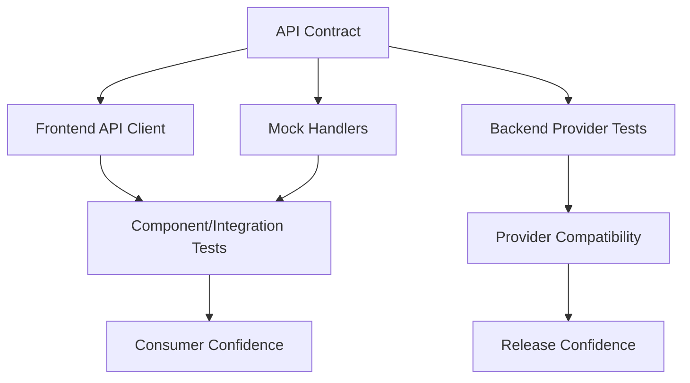
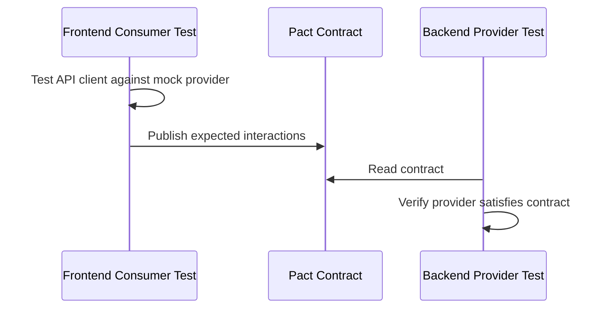

------
title: Learn Frontend React Production Architecture - Part 030
description: Production-grade guide to contract testing, API mocking, fixtures, test environments, MSW, Pact, OpenAPI, schema validation, environment parity, CI data strategy, and anti-flakiness for React applications.
series: learn-frontend-react-production-architecture
seriesTitle: Learn Frontend React Production Architecture
order: 30
partTitle: Contract Testing, Mocking, and Test Environments
tags:
- react
- frontend
- testing
- contract-testing
- mocking
- msw
- pact
- openapi
- test-environments
- architecture
- production
- series
date: 2026-06-28
---

# Part 030 — Contract Testing, Mocking, and Test Environments

## Tujuan Pembelajaran

Part sebelumnya membahas test portfolio. Part ini mendalami tiga area yang sering membuat frontend tests gagal memberikan confidence:

1. contract testing,
2. mocking strategy,
3. test environment governance.

Masalah umum:

- mock tidak sama dengan backend,
- API berubah tapi frontend test tetap hijau,
- E2E flaky karena environment tidak stabil,
- test data shared dan saling mengganggu,
- MSW handlers drift dari OpenAPI,
- generated client tidak diuji,
- staging berbeda dari production,
- feature flag/test config tidak terkendali,
- contract errors baru ketahuan setelah deploy.

Part ini membahas bagaimana membuat mock dan environment menjadi **trusted test infrastructure**, bukan ilusi.

---

## 1. Core Mental Model

Mock hanya berguna jika ia mewakili contract yang benar.



Jika mock tidak terhubung ke contract, test bisa lulus sambil production rusak.

---

## 2. What Is a Contract?

Contract adalah kesepakatan antara consumer dan provider.

Untuk HTTP API:

- URL/path,
- method,
- query params,
- request headers,
- request body,
- response status,
- response headers,
- response body shape,
- error shape,
- authentication behavior,
- pagination semantics,
- idempotency semantics,
- versioning behavior.

Example:

```http
POST /cases/{caseId}/approve
Idempotency-Key: <uuid>

{
  "expectedVersion": 7,
  "reason": "Reviewed and approved."
}
```

Possible responses:

```txt
200 success
400 bad request
401 unauthenticated
403 forbidden
409 conflict
422 validation
500 server error
```

Frontend must know and handle these.

---

## 3. Contract Drift

Contract drift happens when frontend expectation and backend reality diverge.

Examples:

- backend renames `referenceNo` to `refNo`,
- enum adds new status,
- error response shape changes,
- 409 becomes 422,
- pagination response changes,
- required header added,
- null appears where frontend expects string,
- date format changes,
- backend starts returning 202 for async operation.

TypeScript alone cannot catch runtime drift if generated types or mocks are stale.

---

## 4. Contract Testing Options

| Approach | Description |
|---|---|
| OpenAPI/spec-first | validate API against schema/spec |
| generated client tests | ensure client sends/reads expected shape |
| consumer-driven contract | consumer tests generate expectations provider verifies |
| provider contract tests | provider validates responses against contract |
| schema validation tests | runtime schemas parse fixtures/responses |
| snapshot contract fixtures | stable response samples verified |
| E2E contract smoke | real app hits provider for critical endpoints |

Use multiple where appropriate.

---

## 5. OpenAPI as Contract Source

OpenAPI can define:

- endpoints,
- request params,
- request bodies,
- response schemas,
- status codes,
- authentication schemes.

Benefits:

- shared spec,
- generated clients,
- mock servers,
- validation,
- documentation,
- contract tests,
- drift detection.

But spec must be maintained. A stale OpenAPI spec creates false confidence.

Governance:

- backend CI validates implementation against spec,
- frontend CI validates generated client is up to date,
- breaking changes require versioning/review,
- mocks derive from spec or validated fixtures.

---

## 6. Generated Client Boundary

Generated clients reduce manual mismatch.

But generated code should usually be wrapped.

```txt
generated/openapi-client.ts
features/cases/api/caseApi.ts
features/cases/api/caseMappers.ts
features/cases/api/caseQueries.ts
```

Wrapper responsibilities:

- map DTO to UI model,
- normalize errors,
- attach idempotency keys,
- validate critical responses if needed,
- hide generated client quirks,
- expose stable feature API.

Test generated wrapper with contract fixtures.

---

## 7. Consumer-Driven Contract Testing

Consumer-driven contract testing starts from consumer expectations.

Pact-style flow:



Value:

- tests only interactions consumer actually uses,
- provider can change unused behavior freely,
- frontend/backend mismatch caught before release,
- contract becomes executable.

Good for microservices and independent frontend/backend teams.

---

## 8. Consumer Test Mindset

Pact docs emphasize that consumer tests should start as good unit tests for the API client.

Example goal:

> When frontend calls `approveCase`, it sends expected request and can parse expected response.

Pseudo:

```ts
test("approveCase sends command with expected version", async () => {
  await provider
    .given("case CASE-001 is under review")
    .uponReceiving("approve case command")
    .withRequest({
      method: "POST",
      path: "/cases/CASE-001/approve",
      headers: {
        "Idempotency-Key": like("uuid"),
      },
      body: {
        expectedVersion: 7,
        reason: "Reviewed and approved.",
      },
    })
    .willRespondWith({
      status: 200,
      body: {
        ok: true,
        newVersion: 8,
      },
    });

  const result = await caseApi.approveCase({
    caseId: "CASE-001",
    expectedVersion: 7,
    reason: "Reviewed and approved.",
    idempotencyKey: "uuid",
  });

  expect(result.ok).toBe(true);
});
```

This produces contract for provider verification.

---

## 9. Provider Verification

Provider verification checks backend satisfies consumer contract.

Provider must produce expected response for declared state.

Example provider states:

- case is under review,
- user is supervisor,
- case version is 7,
- case is locked,
- user lacks permission.

Provider state setup is crucial.

If provider cannot reliably set state, contract verification becomes flaky.

---

## 10. OpenAPI vs Pact

| Dimension | OpenAPI | Pact/CDC |
|---|---|---|
| Style | spec-first/schema | consumer expectation |
| Scope | entire API surface | used interactions |
| Good for | documentation/generated clients | independent consumer/provider compatibility |
| Risk | spec stale/too broad | missing unused but required semantics |
| Tests | schema conformance | interaction conformance |
| Best together | spec describes API, Pact validates consumer usage | yes |

They are complementary, not mutually exclusive.

---

## 11. Runtime Schema Validation

Frontend can validate API responses with Zod or similar.

```ts
const approveCaseResultSchema = z.object({
  ok: z.literal(true),
  newVersion: z.number().int().positive(),
});

async function approveCase(input: ApproveCaseInput) {
  const json = await httpClient.postJson(...);

  return approveCaseResultSchema.parse(json);
}
```

Testing:

```ts
it("parses approve case result", () => {
  expect(
    approveCaseResultSchema.parse({ ok: true, newVersion: 8 })
  ).toEqual({ ok: true, newVersion: 8 });
});
```

Runtime validation catches unexpected backend shape but must be balanced against performance/maintenance.

---

## 12. Mocking Philosophy

Mock what you do not own.

But mock at the right boundary.

Bad:

```ts
vi.mock("@/features/cases/api/useCaseDetailQuery", () => ...)
```

This bypasses query behavior, API boundary, loading/error states.

Better for integration:

```ts
server.use(
  http.get("/api/cases/:caseId", () => HttpResponse.json(caseFixture))
);
```

HTTP-level mocking exercises:

- fetch client,
- error normalization,
- query hooks,
- cache,
- UI behavior.

---

## 13. Mock Levels

| Mock Level | Use |
|---|---|
| function mock | unit test dependency |
| module mock | rare, for hard dependency |
| HTTP mock | component/integration API behavior |
| browser API mock | localStorage, ResizeObserver, clipboard |
| provider fake | auth/permission test provider |
| service virtualization | E2E-like environment |
| real service | final E2E/staging smoke |

Higher-level mocks usually increase confidence but cost more.

---

## 14. Mock Service Worker

MSW intercepts network requests and returns mocked responses.

Benefits:

- app uses real HTTP client,
- same handlers can support tests and Storybook,
- mocks are close to API boundary,
- browser/Node support,
- realistic latency/errors possible.

Handler example:

```ts
export const handlers = [
  http.get("/api/cases/:caseId", ({ params }) => {
    return HttpResponse.json(
      createCaseDetailFixture({ id: params.caseId as string })
    );
  }),

  http.post("/api/cases/:caseId/approve", async ({ request }) => {
    const body = await request.json();

    if (!body.reason) {
      return HttpResponse.json(
        {
          type: "validation",
          fields: { reason: ["Reason is required"] },
          form: [],
        },
        { status: 422 }
      );
    }

    return HttpResponse.json({ ok: true, newVersion: 8 });
  }),
];
```

---

## 15. MSW Handler Governance

Handlers can drift from backend.

Governance strategies:

- derive handlers from fixtures matching OpenAPI schema,
- validate mock responses against schema,
- share fixtures with contract tests,
- review handlers as API contract artifacts,
- avoid one-off inline handlers unless test-specific,
- centralize common scenarios.

Bad:

```ts
server.use(http.get("/api/cases/1", () => HttpResponse.json({ foo: "bar" })));
```

If `foo` is not real contract, test is misleading.

---

## 16. Scenario-Based Mocks

Organize mocks by scenario.

```txt
test/mocks/
  handlers/
    cases.ts
    auth.ts
    reports.ts
  scenarios/
    supervisorCanApprove.ts
    officerReadOnly.ts
    caseConflict.ts
    networkFailure.ts
```

Scenario:

```ts
export function supervisorCanApproveScenario() {
  return [
    http.get("/api/session", () => HttpResponse.json(supervisorSession)),
    http.get("/api/cases/CASE-001", () =>
      HttpResponse.json(underReviewCase)
    ),
  ];
}
```

Scenario names should match product behavior.

---

## 17. Fixtures

Fixtures are contract examples.

Good fixtures:

- typed,
- realistic,
- composable,
- valid against schema,
- edge-case rich,
- not production-sensitive,
- easy to override.

Factory:

```ts
export function createCaseDetailDto(
  overrides: Partial<CaseDetailDto> = {}
): CaseDetailDto {
  return {
    id: "CASE-001",
    referenceNo: "CASE-2026-001",
    status: "UNDER_REVIEW",
    version: 7,
    subjectName: "PT Nusantara Mineral Review",
    availableActions: ["APPROVE", "REJECT"],
    ...overrides,
  };
}
```

Validate fixture:

```ts
caseDetailDtoSchema.parse(createCaseDetailDto());
```

---

## 18. Test Data Builders

Data builders reduce brittle tests.

```ts
const caseDetail = caseBuilder()
  .underReview()
  .assignedTo(supervisor)
  .withAvailableActions(["APPROVE"])
  .build();
```

Pros:

- readable intent,
- less object noise,
- consistent defaults,
- easy edge cases.

Cons:

- builder can hide data details,
- too much magic,
- must stay aligned with contract.

Use builders for domain-rich tests.

---

## 19. Golden Fixtures

Golden fixtures are stable representative JSON payloads.

Use for:

- API client parser tests,
- contract samples,
- regression when backend response changes,
- documentation.

But avoid snapshotting huge payloads blindly.

Golden fixture should be:

- minimal enough to review,
- realistic enough to catch drift,
- versioned,
- validated.

---

## 20. Error Fixtures

Do not only mock success.

Create standard error fixtures:

```ts
export const validationErrorFixture = {
  type: "validation",
  fields: {
    reason: ["Reason is required"],
  },
  form: [],
};

export const conflictErrorFixture = {
  type: "conflict",
  message: "Case was updated by another user.",
  currentVersion: 8,
};
```

Every API command should have error fixture tests.

---

## 21. Environment Types

Testing environments:

| Environment | Purpose |
|---|---|
| local dev | fast feedback |
| unit test | pure logic |
| component test | UI behavior |
| Storybook | visual/workshop |
| integration test | feature + mocked API |
| E2E local | app + test backend/mock |
| preview env | PR review |
| staging/UAT | production-like smoke |
| production | monitored reality |

Do not confuse staging with production. Staging often has different data, scale, flags, auth, cache, network.

---

## 22. Environment Parity

Parity dimensions:

- API version,
- schema,
- auth/session behavior,
- feature flags,
- CORS/cookie settings,
- cache headers,
- CDN behavior,
- browser bundle,
- environment variables,
- permissions,
- seed data,
- third-party integrations,
- time/date/timezone,
- file storage,
- WebSocket/SSE,
- service worker.

A test environment that differs in these areas can miss bugs.

---

## 23. Test Environment Config

Config should be explicit and validated.

```ts
const testConfigSchema = z.object({
  apiBaseUrl: z.string().url(),
  authMode: z.enum(["mock", "real"]),
  featureFlagMode: z.enum(["fixed", "remote"]),
  testTenantId: z.string(),
});
```

Avoid magic environment variables scattered across tests.

Centralize config loading.

---

## 24. Feature Flags in Tests

Feature flags can make tests nondeterministic.

Rules:

- tests should pin flag values,
- E2E should run against known flag configuration,
- critical flags should be tested both on/off if behavior differs,
- visual tests should use stable flags,
- test failures should include flag state.

Do not let remote feature flag service randomly change PR test behavior.

---

## 25. Time and Date

Time causes flakiness.

Problems:

- current date changes,
- timezone mismatch,
- SLA countdown,
- relative time text,
- token expiration,
- date picker behavior.

Strategies:

- fake timers for unit/component where appropriate,
- fixed test clock,
- inject clock service,
- set timezone in CI,
- avoid asserting exact relative seconds,
- use deterministic fixtures.

Example:

```ts
vi.setSystemTime(new Date("2026-06-28T10:00:00+07:00"));
```

Remember to restore timers.

---

## 26. Network Conditions

Network affects tests.

For most tests:

- mock network,
- deterministic responses,
- controlled latency.

For performance/E2E resilience:

- simulate slow network,
- timeout,
- offline,
- server errors,
- delayed response.

Do not let random real network decide test pass/fail.

---

## 27. Browser API Mocks

Some browser APIs need mocks in jsdom:

- `ResizeObserver`,
- `IntersectionObserver`,
- `matchMedia`,
- clipboard,
- scroll APIs,
- `BroadcastChannel`,
- WebSocket,
- EventSource.

Mock carefully.

Example:

```ts
class ResizeObserverMock {
  observe() {}
  unobserve() {}
  disconnect() {}
}

global.ResizeObserver = ResizeObserverMock;
```

If component depends heavily on actual browser layout, use browser tests instead of fake jsdom mocks.

---

## 28. jsdom Limitations

jsdom is not a layout engine.

It cannot fully test:

- actual layout,
- CSS rendering,
- media queries,
- scroll behavior,
- real focus quirks,
- canvas,
- complex drag/drop,
- browser accessibility tree,
- native form picker behavior.

Use browser-based testing for:

- layout-sensitive components,
- drag/drop,
- canvas/chart interactions,
- real keyboard/focus behavior,
- scroll/virtualization,
- visual regression.

---

## 29. Vitest Browser Mode

Browser-native component testing can bridge gap between jsdom and full E2E.

Useful for:

- components needing real browser APIs,
- CSS/layout behavior,
- complex interaction primitives,
- Storybook-like browser confidence.

But browser mode has different mocking limitations than Node/jsdom. Design tests with environment constraints in mind.

---

## 30. Playwright Test Environments

Playwright can run against:

- local dev server,
- preview deployment,
- staging,
- production smoke if safe.

Use configuration projects:

```ts
projects: [
  { name: "chromium" },
  { name: "firefox" },
  { name: "webkit" },
]
```

For PR:

- chromium smoke usually enough.

Nightly:

- cross-browser,
- wider suite,
- slower tests,
- visual/performance.

Do not run massive E2E suite on every commit if it destroys feedback speed.

---

## 31. Authentication in E2E

Options:

1. UI login in every test,
2. login once and reuse storage state,
3. API login,
4. test auth bypass in non-prod,
5. seeded session.

Best practice often:

- have one UI login smoke test,
- use storage state/API setup for other tests.

Example:

```ts
test.use({ storageState: "playwright/.auth/supervisor.json" });
```

Be careful:

- session expiry,
- role/tenant setup,
- parallel isolation,
- logout tests.

---

## 32. Database/Test Data Isolation

For E2E with real backend:

Options:

- transaction rollback,
- unique test tenant,
- unique generated IDs,
- database reset,
- API cleanup,
- ephemeral environment,
- seed per test worker.

For workflow systems, prefer unique case IDs and test tenant.

Avoid tests fighting over same entity.

---

## 33. Contract-Aware Mocking

Best mock strategy:

```txt
OpenAPI/Pact/schema
  -> DTO schemas
  -> fixture builders validated by schema
  -> MSW handlers
  -> component/integration tests
```

If backend changes contract, fixtures or generated client should fail.

Mock should not be invented independently.

---

## 34. API Client Contract Tests

Test API modules directly.

```ts
test("getCaseDetail maps DTO to UI model", async () => {
  server.use(
    http.get("/api/cases/CASE-001", () =>
      HttpResponse.json(createCaseDetailDto({
        status: "UNDER_REVIEW",
      }))
    )
  );

  const result = await caseApi.getCaseDetail("CASE-001");

  expect(result.status).toBe("UNDER_REVIEW");
  expect(result.referenceNo).toBe("CASE-2026-001");
});
```

Error mapping:

```ts
test("approveCase maps conflict response", async () => {
  server.use(
    http.post("/api/cases/CASE-001/approve", () =>
      HttpResponse.json(conflictErrorFixture, { status: 409 })
    )
  );

  await expect(caseApi.approveCase(input))
    .rejects.toMatchObject({ type: "conflict" });
});
```

---

## 35. Contract Tests for Error Semantics

Many teams test only success schema. Error contract is equally important.

For each command:

| Status | Expected Error Shape | UI Consumer |
|---|---|---|
| 400 | bad request | generic client issue |
| 401 | unauthenticated | auth handler |
| 403 | forbidden | forbidden UI |
| 409 | conflict | conflict banner |
| 422 | validation | field/root errors |
| 500 | server | retry + trace id |

If backend changes 409 body, UI conflict handling may break. Test it.

---

## 36. Mocking Realtime

Realtime test mocks need event control.

Mock client:

```ts
class MockCaseRealtimeClient {
  private listeners = new Set<(event: CaseEvent) => void>();

  subscribe(_caseId: string, listener: (event: CaseEvent) => void) {
    this.listeners.add(listener);

    return {
      unsubscribe: () => this.listeners.delete(listener),
    };
  }

  emit(event: CaseEvent) {
    this.listeners.forEach((listener) => listener(event));
  }
}
```

Test:

- event invalidates cache,
- duplicate ignored,
- reconnect invalidates,
- unsubscribe works,
- malformed event handled.

Do not rely on real WebSocket for most component tests.

---

## 37. Mocking Browser Storage

localStorage/sessionStorage tests:

- clean between tests,
- validate stored schema,
- handle unavailable storage,
- test logout cleanup for sensitive data.

```ts
beforeEach(() => {
  window.localStorage.clear();
});
```

Do not let persisted state leak across tests.

---

## 38. Test Environment Observability

When tests fail, collect:

- logs,
- network requests,
- screenshots,
- videos,
- traces,
- console errors,
- app release id,
- feature flag state,
- test data IDs,
- backend trace id.

Playwright traces are especially useful for E2E debugging.

Without artifacts, flaky failures are hard to diagnose.

---

## 39. CI Matrix Strategy

PR pipeline:

```txt
typecheck
lint
unit/component
build
storybook build
small E2E smoke
```

Nightly:

```txt
full E2E
cross-browser
visual regression
accessibility broader scan
contract verification
performance smoke
dependency audit
```

Release gate:

```txt
contract tests green
critical E2E green
bundle budgets green
migration checks green
```

CI should be layered by feedback speed.

---

## 40. Staging vs Preview Environments

Preview env:

- per PR,
- isolated,
- good for UI review,
- may use mock/service virtualization.

Staging:

- shared production-like,
- real integrations,
- release candidate validation,
- can be polluted,
- data management needed.

Production smoke:

- minimal safe checks,
- no destructive commands unless special test tenant,
- monitors real deployment.

Do not run destructive tests against production accidentally.

---

## 41. Service Virtualization

For complex backend dependencies, service virtualization can simulate provider behavior.

Useful when:

- real provider unavailable,
- external agency service slow,
- payment/identity provider hard to use,
- workflow backend expensive,
- edge cases hard to create.

But virtualization must follow contract. Otherwise it becomes sophisticated lying.

---

## 42. Contract and Mock Anti-Patterns

### 42.1 Mock Invented from UI Wish

Mock returns what UI wants, not backend contract.

### 42.2 Only Happy Path Fixtures

Errors untested.

### 42.3 Inline One-Off Handlers Everywhere

Impossible to govern.

### 42.4 Stale OpenAPI Spec

Generated types are false confidence.

### 42.5 Contract Tests Without Provider State

Verification flaky or meaningless.

### 42.6 E2E Environment Shared Mutable Data

Tests fight.

### 42.7 Remote Feature Flags Unpinned

Tests change without code change.

### 42.8 Real Time in Tests

Midnight/timezone failures.

### 42.9 jsdom Used for Layout Assertions

False confidence.

### 42.10 Mocking Internal Hooks

Bypasses integration you need to test.

---

## 43. Mini Case Study: Approval API Contract

### Contract

```http
POST /cases/{caseId}/approve
Idempotency-Key: uuid
Content-Type: application/json

{
  "expectedVersion": 7,
  "reason": "Reviewed and approved."
}
```

Responses:

```txt
200 { ok: true, newVersion: 8 }
403 { type: "forbidden", message: "..." }
409 { type: "conflict", currentVersion: 8, message: "..." }
422 { type: "validation", fields: { reason: [...] }, form: [] }
```

### Frontend Tests

- API client sends expected body/header,
- parses success,
- maps 409 to conflict,
- maps 422 to validation,
- form maps field errors,
- mutation invalidates case detail/timeline.

### Provider Verification

- backend verifies same interactions against real controller/service,
- provider state sets case under review version 7,
- permission state sets supervisor user,
- conflict state sets version 8.

### MSW Fixture

MSW handler uses same fixture schema.

This creates contract confidence across unit, integration, and provider tests.

---

## 44. Mini Case Study: Test Environment for Case Management

### Environments

| Environment | Purpose |
|---|---|
| local component | MSW + fixtures |
| local E2E | app + test API/docker |
| PR preview | deployed frontend + mock/test backend |
| staging | production-like backend |
| production smoke | safe non-mutating checks |

### Test Users

- officer,
- supervisor,
- auditor,
- admin.

### Test Tenants

- isolated tenant per test run,
- seeded cases,
- cleanup job.

### Feature Flags

- pinned for PR,
- nightly matrix for major flags.

### Time

- fixed clock for SLA tests where possible,
- timezone Asia/Jakarta explicit.

This is infrastructure, not incidental setup.

---

## 45. Review Checklist

Before approving mocking/contract/environment setup:

1. What is source of API contract?
2. Are generated clients up to date?
3. Are mocks derived from or validated against contract?
4. Are success and error shapes covered?
5. Are provider states deterministic?
6. Are consumer contracts verified by provider?
7. Are fixtures realistic and typed?
8. Are mock handlers centralized?
9. Are inline handlers justified?
10. Is test data isolated?
11. Are feature flags pinned?
12. Is time deterministic?
13. Are browser API mocks safe?
14. Is jsdom used only where appropriate?
15. Are browser tests used for layout/focus-heavy features?
16. Are E2E auth/data strategies stable?
17. Are environment configs validated?
18. Are traces/logs captured on failure?
19. Are CI layers matched to feedback speed?
20. Would API drift fail before production?

---

## 46. Deliberate Practice

### Latihan 1 — Mock Contract Audit

Pick 5 MSW handlers.

For each:

| Handler | Contract Source | Fixture Validated? | Error Cases? |
|---|---|---:|---:|
| getCase | OpenAPI | yes/no | yes/no |
| approveCase | Pact | yes/no | yes/no |

Fix one handler to validate fixture against schema.

### Latihan 2 — Error Contract Table

For one command, define all error statuses and UI mapping.

### Latihan 3 — Test Environment Diagram

Draw environment flow:

```txt
PR -> preview -> contract verification -> staging smoke -> production monitor
```

List what is real vs mocked.

### Latihan 4 — Time Flake Fix

Find test depending on current date/time. Inject clock or freeze time.

### Latihan 5 — Provider State Design

For contract test `approveCase`, define provider states:

- case under review version 7,
- user supervisor,
- case already version 8,
- user lacks permission,
- reason invalid.

---

## 47. Ringkasan

Mocks and environments can either build confidence or create illusion.

Strong frontend teams:

- treat API contract as executable artifact,
- validate mocks and fixtures,
- test error semantics,
- use HTTP-level mocking for integration,
- verify provider compatibility,
- pin feature flags/time/config,
- isolate E2E data,
- understand jsdom vs browser limits,
- capture failure artifacts,
- layer CI for speed and confidence.

The goal is not “mock less” or “mock more”. The goal is to mock the right boundary with contract-backed behavior.

---

## 48. Self-Assessment

Anda siap lanjut jika bisa menjawab:

1. Apa itu contract drift?
2. Apa beda OpenAPI dan consumer-driven contract testing?
3. Mengapa generated client tetap perlu wrapper?
4. Mengapa MSW lebih baik daripada mock internal hook untuk integration test?
5. Bagaimana memastikan fixture tidak drift?
6. Error status apa saja yang harus diuji untuk command?
7. Apa limitasi jsdom?
8. Bagaimana mengelola feature flags dalam test?
9. Bagaimana membuat E2E test data isolated?
10. Apa checklist agar mock benar-benar dipercaya?

---

## 49. Sumber Rujukan

- Pact Docs — Consumer Driven Contracts
- Pact Docs — Writing Consumer Tests
- OpenAPI Specification
- Mock Service Worker Docs — API Mocking
- Vitest Docs — Mocking and Browser Mode
- Playwright Docs — Network Mocking, Best Practices, Tracing
- Zod Docs — Runtime Schema Validation
