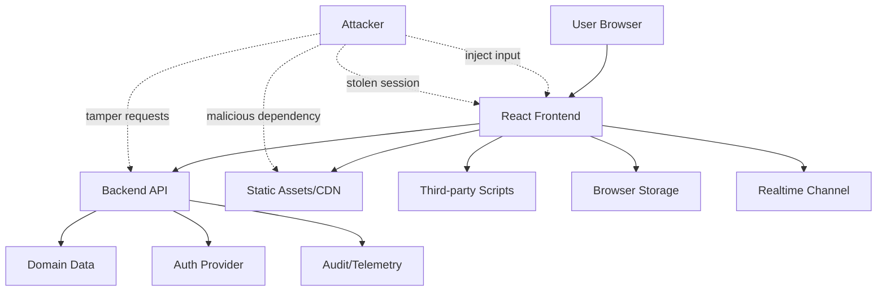

------
title: Learn Frontend React Production Architecture - Part 031
description: Production-grade guide to frontend security threat modeling in React applications, including XSS, CSRF, CORS, auth boundaries, token/session handling, CSP, supply chain, sensitive data, logging, SSR/RSC leaks, and security review checklists.
series: learn-frontend-react-production-architecture
seriesTitle: Learn Frontend React Production Architecture
order: 31
partTitle: Frontend Security Threat Modeling
tags:
- react
- frontend
- security
- threat-modeling
- xss
- csrf
- cors
- csp
- owasp
- architecture
- production
- series
date: 2026-06-28
---

# Part 031 — Frontend Security Threat Modeling

## Tujuan Pembelajaran

Frontend security sering disalahpahami.

Ada dua kesalahan ekstrem:

1. menganggap frontend bisa menjadi security boundary utama,
2. menganggap frontend tidak punya peran security sama sekali.

Keduanya salah.

Frontend tidak bisa dipercaya sebagai otoritas final karena semua code client bisa dilihat, dimodifikasi, dan dipanggil ulang oleh attacker. Tetapi frontend tetap sangat penting karena ia:

- merender data sensitive,
- memegang session state,
- mengirim command ke backend,
- melakukan navigation dan redirect,
- memproses input,
- memuat third-party script,
- menyimpan cache,
- mengelola upload/download,
- menjalankan JavaScript di browser user,
- bisa menjadi pintu XSS, CSRF, data leakage, atau supply-chain compromise.

Part ini membahas frontend security sebagai **threat modeling discipline**, bukan checklist setelah selesai coding.

---

## 1. Core Thesis

> Frontend is not the authority, but frontend is part of the attack surface.

Backend harus menegakkan:

- authentication,
- authorization,
- validation,
- domain rule,
- workflow transition,
- audit,
- rate limit,
- data ownership,
- tenant boundary.

Frontend harus menjaga:

- tidak memperbesar attack surface,
- tidak membocorkan data,
- tidak membuat XSS sink,
- tidak menyimpan secrets,
- tidak mempercayai hidden/client state,
- tidak mengirim data sensitive ke telemetry,
- tidak membuka CORS/redirect/frame risk,
- tidak memuat dependency/script sembarangan,
- tidak membuat UX security yang misleading,
- tidak menyembunyikan backend security failure.

Security production adalah shared responsibility.

---

## 2. Threat Modeling Mental Model

Threat modeling menjawab:

1. Apa aset yang dilindungi?
2. Siapa aktor dan attacker?
3. Data mengalir lewat mana?
4. Boundary mana yang trusted/untrusted?
5. Apa threat yang mungkin?
6. Kontrol apa yang mencegah/menurunkan risk?
7. Bagaimana kita mendeteksi jika gagal?
8. Bagaimana kita recover?

Diagram sederhana:



Threat model tidak harus sempurna. Ia harus cukup eksplisit untuk menemukan risk sebelum production.

---

## 3. Frontend Asset Inventory

Sebelum threat modeling, daftar aset.

| Asset | Risk |
|---|---|
| session cookie/token | account takeover |
| case detail data | privacy/compliance leak |
| audit trail | tampering/misrepresentation |
| approval command | unauthorized workflow transition |
| document attachments | malware/data leak |
| user profile/permissions | privilege inference |
| feature flags | hidden functionality exposure |
| API base URL/runtime config | environment misuse |
| query cache | sensitive data remains after logout |
| localStorage/sessionStorage | persistent leak |
| logs/telemetry | PII leak |
| source maps | code disclosure |
| third-party scripts | XSS/supply chain |
| realtime channel | unauthorized subscription/data leak |

Aset menentukan threat yang relevan.

---

## 4. Trust Boundaries

Trust boundary adalah tempat data berpindah dari area yang lebih dipercaya ke area yang kurang dipercaya atau sebaliknya.

Important boundaries:

```txt
Browser <-> Backend API
Browser <-> Auth Provider
Browser <-> Third-party Script
Browser <-> Local Storage
Browser <-> Realtime Channel
SSR Server <-> Browser Hydration Payload
Build Pipeline <-> Deployed Assets
Feature Flag Service <-> UI Behavior
```

Rule:

> Data crossing trust boundary must be validated, encoded, authorized, or constrained.

Frontend should treat all external input as untrusted:

- URL params,
- API responses,
- user input,
- localStorage values,
- postMessage payload,
- realtime events,
- third-party script data,
- feature flags,
- markdown/HTML content,
- uploaded file metadata.

---

## 5. STRIDE for Frontend

STRIDE categories can be adapted:

| STRIDE | Frontend Example |
|---|---|
| Spoofing | fake user/session state in client |
| Tampering | changing hidden field or request payload |
| Repudiation | command submitted without audit reason/context |
| Information Disclosure | sensitive data in localStorage/logs/HTML |
| Denial of Service | heavy payload freezes UI, reconnect storm |
| Elevation of Privilege | route guard bypass if API lacks authz |

Use it as thinking tool, not bureaucracy.

---

## 6. OWASP-Oriented Frontend Risks

OWASP Top 10 categories relevant to frontend architecture include:

- Broken Access Control,
- Cryptographic Failures,
- Injection,
- Insecure Design,
- Security Misconfiguration,
- Vulnerable and Outdated Components,
- Identification and Authentication Failures,
- Software and Data Integrity Failures,
- Security Logging and Monitoring Failures.

Frontend-specific mapping:

| OWASP Area | Frontend Concern |
|---|---|
| Broken Access Control | trusting route guards/action visibility |
| Injection | XSS, DOM injection, URL injection |
| Security Misconfiguration | CORS, CSP, cache headers, source maps |
| Vulnerable Components | npm dependency risk |
| Auth Failures | bad token/session handling |
| Data Integrity | third-party script/build supply chain |
| Logging Failures | missing client-side security telemetry |

---

## 7. Client Is Untrusted

Attacker can:

- open DevTools,
- modify JavaScript,
- call API manually,
- change hidden field,
- edit localStorage,
- bypass disabled button,
- modify request body,
- replay command,
- forge route,
- call admin endpoint if backend allows,
- inspect bundle,
- monkey patch functions.

Therefore:

```tsx
if (user.role === "admin") {
  showAdminButton();
}
```

is only UX.

Backend must still enforce:

```txt
Can this authenticated actor perform this action on this resource now?
```

Do not design backend rules based on “button is hidden.”

---

## 8. Route Guards Are UX, Not Authorization

Protected route:

```tsx
function RequirePermission({ permission }: Props) {
  const permissions = usePermissions();

  if (!permissions.has(permission)) {
    return <ForbiddenPage />;
  }

  return <Outlet />;
}
```

This is good UX.

But attacker can still call:

```http
POST /admin/users
```

Backend must reject unauthorized request.

Frontend route guards:

- reduce confusion,
- avoid showing irrelevant UI,
- improve navigation,
- provide early feedback.

They do not protect data.

---

## 9. Available Actions Are Hints, Not Authority

Backend may return:

```ts
availableActions: ["APPROVE", "REJECT"]
```

Frontend uses this to render action buttons.

But backend still validates command:

```txt
POST /cases/{id}/approve
```

must check:

- authenticated,
- authorized,
- case exists,
- actor belongs to tenant/workspace,
- case is in correct state,
- version matches,
- idempotency key valid,
- reason valid,
- audit metadata recorded.

Never treat `availableActions` as permission token.

---

## 10. Authentication State

Frontend often stores session summary:

```ts
type Session = {
  userId: string;
  displayName: string;
  roles: string[];
};
```

This is display state, not authority.

Sensitive choices:

- cookie session vs bearer token,
- where token is stored,
- refresh flow,
- logout cleanup,
- multi-tab logout,
- session expiry,
- silent refresh,
- CSRF protection,
- token replay risk.

General principle:

> Avoid storing long-lived secrets in JavaScript-accessible storage.

If token is in localStorage, XSS can steal it. If session cookie is used, CSRF must be handled. Security is trade-off and must match backend model.

---

## 11. Token Storage

Storage options:

| Option | Pros | Risks |
|---|---|---|
| HttpOnly secure cookie | not readable by JS | CSRF if not mitigated |
| memory-only access token | reduced persistence | lost on refresh, refresh complexity |
| localStorage | easy persistence | XSS theft |
| sessionStorage | tab-scoped | XSS theft |
| IndexedDB | structured | XSS access |
| non-HttpOnly cookie | simple | JS readable + CSRF considerations |

No option is magic.

For many web apps, HttpOnly Secure SameSite cookies plus CSRF strategy can be strong. For token-based SPAs, keep token lifetime short and reduce XSS risk. Final decision depends on auth architecture.

---

## 12. Logout Cleanup

On logout:

- clear query cache,
- clear sensitive stores,
- close WebSocket/SSE,
- clear session state,
- clear sensitive local/session storage,
- abort in-flight requests,
- remove optimistic queues,
- navigate to login,
- notify other tabs,
- avoid showing previous user data.

Example:

```ts
async function logout() {
  await authApi.logout();

  queryClient.clear();
  sensitiveStore.reset();
  realtimeClient.disconnect();
  broadcastLogoutToOtherTabs();

  navigate("/login", { replace: true });
}
```

Do not leave case details in memory after user switch.

---

## 13. XSS Mental Model

Cross-Site Scripting occurs when attacker-controlled content executes as script in the victim's browser.

Sources:

- user input,
- API response,
- URL parameter,
- markdown/rich text,
- file name,
- CMS content,
- third-party script,
- realtime event,
- localStorage value.

Sinks:

- `dangerouslySetInnerHTML`,
- `innerHTML`,
- `insertAdjacentHTML`,
- script URL,
- inline event handlers,
- unsafe markdown renderer,
- DOM-based URL construction,
- template injection,
- third-party widgets.

React escapes text content by default:

```tsx
<div>{userProvidedText}</div>
```

But React cannot protect you if you intentionally inject HTML.

---

## 14. Dangerous HTML Rendering

Dangerous:

```tsx
<div dangerouslySetInnerHTML={{ __html: htmlFromUser }} />
```

Only do this if:

- content is trusted or sanitized,
- sanitizer is robust and configured,
- allowed tags/attributes are limited,
- links are validated,
- scripts/event attributes removed,
- SVG/math risks considered,
- CSP adds defense-in-depth,
- tests include malicious payloads.

Better for many cases:

- store structured content,
- render markdown through safe pipeline,
- allowlist formatting,
- sanitize on server and/or client,
- avoid arbitrary HTML entirely.

---

## 15. Markdown and Rich Text

Markdown can become HTML.

Risky inputs:

```md
[click me](javascript:alert(1))

<iframe src=...>
```

Safe markdown pipeline should:

- disable raw HTML unless required,
- sanitize output,
- validate URLs,
- allowlist tags,
- allowlist protocols,
- add `rel="noopener noreferrer"` for external links,
- consider `target="_blank"` risk,
- test XSS payloads.

Do not assume markdown is safe because it is not HTML initially.

---

## 16. URL Injection

User-provided URL can be dangerous.

Example:

```tsx
<a href={returnTo}>Continue</a>
```

If `returnTo` is:

```txt
javascript:alert(1)
https://evil.example
//evil.example
```

you may create XSS/open redirect/phishing risk.

Validate:

```ts
function sanitizeInternalPath(value: string | null): string {
  if (!value || !value.startsWith("/")) {
    return "/";
  }

  if (value.startsWith("//")) {
    return "/";
  }

  return value;
}
```

For external URLs:

- allow only `https:`,
- maybe allow only trusted domains,
- render visible domain,
- use `rel="noopener noreferrer"`.

---

## 17. Open Redirect

Login return URL:

```txt
/login?returnTo=https://evil.example
```

After login, app redirects to attacker site. This can enable phishing or token leakage depending flow.

Use allowlist:

```ts
function normalizeReturnTo(value: string | null): string {
  if (!value) return "/";

  try {
    const url = new URL(value, window.location.origin);

    if (url.origin !== window.location.origin) {
      return "/";
    }

    return `${url.pathname}${url.search}${url.hash}`;
  } catch {
    return "/";
  }
}
```

Prefer relative internal paths.

---

## 18. CSRF

Cross-Site Request Forgery happens when browser sends authenticated request without user's intended action.

Risk is high when using cookies for auth.

Mitigations can include:

- SameSite cookies,
- CSRF tokens,
- checking Origin/Referer,
- custom headers with CORS constraints,
- double-submit token,
- requiring reauthentication for high-risk action,
- idempotency and audit for commands.

Frontend responsibilities:

- include CSRF token/header if architecture requires,
- do not leak token,
- handle CSRF failure distinctly,
- avoid unsafe GET actions.

Backend must enforce CSRF protection. Frontend cannot solve it alone.

---

## 19. CORS

CORS controls which origins can read responses from cross-origin requests.

Common misconfiguration:

```txt
Access-Control-Allow-Origin: *
Access-Control-Allow-Credentials: true
```

or reflecting arbitrary Origin.

Frontend concern:

- understand credential mode,
- avoid assuming CORS is auth,
- know that CORS protects browsers, not backend from server-to-server requests,
- never expose secrets because “CORS blocks others.”

Backend must authenticate and authorize regardless of CORS.

---

## 20. Content Security Policy

CSP is defense-in-depth against XSS and injection.

Useful directives:

```txt
default-src 'self';
script-src 'self' 'nonce-...';
style-src 'self';
img-src 'self' data: https:;
connect-src 'self' https://api.example.com;
frame-ancestors 'none';
base-uri 'self';
object-src 'none';
```

CSP can reduce impact of XSS, but is not a substitute for output encoding/sanitization.

Frontend impact:

- avoid inline scripts/styles where possible,
- support nonce for framework scripts if SSR,
- audit third-party scripts,
- use report-only mode before enforce,
- monitor violations.

---

## 21. Trusted Types

Trusted Types can help prevent DOM XSS by restricting dangerous DOM sinks in supporting browsers.

It is especially relevant for apps that must use HTML injection or third-party legacy code.

Adoption requires:

- policy design,
- sanitizer integration,
- fixing unsafe sinks,
- CSP directive,
- gradual rollout.

Trusted Types is advanced but valuable for high-risk apps.

---

## 22. Security Headers

Frontend delivery should coordinate headers:

| Header | Purpose |
|---|---|
| Content-Security-Policy | reduce injection/script risk |
| X-Frame-Options / frame-ancestors | clickjacking protection |
| Strict-Transport-Security | force HTTPS |
| Referrer-Policy | reduce referrer leakage |
| Permissions-Policy | limit browser features |
| Cross-Origin-Opener-Policy | isolation/security |
| Cross-Origin-Resource-Policy | resource protection |
| Cache-Control | sensitive caching behavior |

Headers are served by backend/CDN/static host, but frontend architecture must know assumptions.

---

## 23. Clickjacking

Clickjacking tricks user into clicking your app inside an attacker-controlled frame.

Mitigation:

- `frame-ancestors 'none'` or allowlist in CSP,
- `X-Frame-Options: DENY` or `SAMEORIGIN` for legacy support.

If your app has approval/destructive actions, clickjacking risk matters.

Some apps need embedding. Then define allowed frame ancestors explicitly.

---

## 24. Sensitive Data in Browser Storage

Avoid storing:

- access tokens,
- PII,
- case details,
- audit notes,
- approval reasons,
- downloaded document metadata,
- permission maps if sensitive,
- server-state cache containing confidential data.

If persistence is needed:

- justify requirement,
- minimize data,
- encrypting in browser rarely helps if key is also in browser,
- clear on logout,
- expire data,
- validate schema,
- avoid cross-user leak.

Preferences like theme/sidebar collapsed are safer.

---

## 25. Query Cache and Sensitive Data

Server-state cache may contain sensitive data in memory.

Risks:

- after logout/user switch,
- shared browser,
- devtools,
- persisted cache,
- error reports capturing cache,
- hydrated HTML payload.

Controls:

- clear cache on logout,
- scope cache by user/tenant,
- avoid persisting sensitive queries,
- do not include sensitive data in dehydrated public HTML,
- avoid logging query data,
- set cache time intentionally.

---

## 26. SSR/RSC Data Leaks

SSR/RSC introduces server-to-client serialization.

Potential leaks:

- server-only secret accidentally passed to Client Component,
- full user object serialized when UI needs displayName,
- admin-only data included in HTML,
- cache shared across users incorrectly,
- route statically cached despite user-specific data,
- environment variables exposed to client bundle,
- server logs include sensitive request data.

Rules:

- pass minimal props to client,
- mark server-only modules,
- understand framework caching,
- avoid user-specific data in public cache,
- review serialized payload,
- separate public/static and authenticated/dynamic routes.

---

## 27. Runtime Config and Secrets

Client runtime config is public.

Do not put secrets in:

- `VITE_*` env values,
- `NEXT_PUBLIC_*` env values,
- bundled config,
- `config.json`,
- source maps,
- JavaScript constants,
- feature flags sent to client.

Allowed public config:

- API base URL,
- environment name,
- release id,
- public analytics id,
- feature flag client key if intended public.

Secret must stay server-side.

---

## 28. Source Maps

Source maps help debugging but can expose source code structure and comments.

Options:

- upload maps to error monitoring only,
- do not publicly serve maps,
- restrict access,
- strip sensitive comments,
- verify no secrets in bundle,
- align release id.

Source maps are not primary secret leak if you never put secrets in source, but they still increase code visibility.

---

## 29. Dependency and Supply Chain Security

Frontend supply chain risk includes:

- malicious npm package,
- compromised maintainer,
- typosquatting,
- outdated vulnerable dependency,
- build script compromise,
- dependency confusion,
- lockfile tampering,
- CDN script compromise.

Controls:

- lockfile,
- package manager integrity,
- dependency review,
- minimal dependencies,
- security scanning,
- update policy,
- trusted registries,
- avoid unpinned CDN scripts,
- Subresource Integrity for static third-party scripts where applicable,
- restrict install scripts if feasible,
- separate build permissions.

Do not add dependencies casually.

---

## 30. Third-Party Scripts

Third-party scripts can read/modify page data.

Examples:

- analytics,
- tag manager,
- chat,
- heatmap,
- A/B testing,
- error monitoring.

Risks:

- PII leakage,
- XSS supply chain,
- performance,
- CSP exceptions,
- compliance,
- session data exposure.

Governance:

- owner,
- purpose,
- data processed,
- domains loaded,
- CSP impact,
- performance budget,
- privacy review,
- removal process.

Do not add tag manager scripts without security/privacy review.

---

## 31. Logging and Telemetry Privacy

Frontend logs often accidentally include sensitive data.

Avoid logging:

- tokens,
- cookies,
- authorization headers,
- full API responses,
- form inputs,
- PII,
- case details,
- document names if sensitive,
- URL query params containing sensitive data,
- localStorage content.

Sanitize errors:

```ts
reportError(error, {
  routePattern: "/cases/:caseId",
  status: error.status,
  traceId: error.traceId,
});
```

Prefer route patterns over raw URLs if identifiers are sensitive.

---

## 32. Feature Flags

Feature flags are not security controls.

If hidden feature is in client bundle, user can discover it. If API endpoint lacks authorization, user may call it.

Flags are for:

- rollout,
- experimentation,
- kill switch,
- UI behavior.

Security must remain backend-enforced.

Do not put sensitive logic only behind client-side flag.

---

## 33. File Upload and Download

Upload risks:

- malware,
- huge file DoS,
- dangerous file type,
- content-type spoofing,
- filename XSS,
- path traversal-like names,
- preview vulnerabilities,
- leaked temporary file,
- unauthorized attachment access.

Frontend controls:

- validate size/type as UX,
- show upload progress,
- sanitize displayed filename by rendering as text,
- do not trust MIME from browser,
- handle scan pending state,
- revoke object URLs,
- avoid unsafe preview,
- require backend authorization.

Backend controls are authoritative: scan, validate, store safely, authorize download.

---

## 34. Download and Blob URLs

Blob/object URLs can leak if not revoked.

```tsx
const url = URL.createObjectURL(blob);

try {
  openDownload(url);
} finally {
  URL.revokeObjectURL(url);
}
```

For sensitive docs:

- avoid caching if not allowed,
- set appropriate response headers,
- require authorization,
- prevent embedding if needed,
- audit access,
- handle download errors.

---

## 35. Realtime Security

Realtime channel risks:

- unauthorized subscription,
- tenant data leak,
- stale session remains connected,
- event payload contains sensitive data,
- malformed event causes crash,
- replay/duplicate events,
- missing authorization on topic.

Controls:

- authenticate connection,
- authorize topic subscription,
- close on logout,
- validate event schema,
- dedupe,
- minimize payload,
- re-check permission for commands,
- monitor invalid events.

---

## 36. postMessage Security

If using `window.postMessage`:

- validate origin,
- validate message schema,
- do not use `*` target unless justified,
- avoid sending secrets,
- handle unknown message safely.

Bad:

```ts
window.addEventListener("message", (event) => {
  doSomething(event.data);
});
```

Better:

```ts
window.addEventListener("message", (event) => {
  if (event.origin !== trustedOrigin) {
    return;
  }

  const parsed = messageSchema.safeParse(event.data);

  if (!parsed.success) {
    return;
  }

  handleTrustedMessage(parsed.data);
});
```

---

## 37. Security Testing

Frontend security tests can include:

- route guard UX tests,
- backend 403 handling tests,
- XSS payload rendering tests,
- URL sanitizer tests,
- returnTo redirect tests,
- CSP report monitoring,
- dependency scanning,
- secret scanning,
- source map deployment check,
- localStorage sensitive data tests,
- API error handling tests,
- file upload client validation tests,
- logout cleanup tests.

Security testing does not replace security review, but helps prevent regressions.

---

## 38. Threat Modeling Review Flow

For new feature:

```txt
1. Define assets.
2. Draw data flow.
3. Identify trust boundaries.
4. List attacker goals.
5. Identify likely threats.
6. Define controls.
7. Add tests/monitoring.
8. Document residual risk.
```

Example: Approve Case feature.

Assets:

- case state,
- approval reason,
- actor identity,
- audit event.

Threats:

- unauthorized approval,
- duplicate approval,
- stale version approval,
- XSS in reason,
- reason leaked to logs,
- CSRF approval,
- clickjacking.

Controls:

- backend authz,
- expected version,
- idempotency key,
- server validation,
- output encoding,
- logging redaction,
- CSRF protection,
- frame protection,
- audit trail.

---

## 39. Mini Case Study: XSS in Case Notes

### Scenario

Users can add rich case notes. Notes render in timeline.

Threat:

- attacker inserts script in note,
- supervisor opens case,
- script steals session/action data.

Bad:

```tsx
<div dangerouslySetInnerHTML={{ __html: note.html }} />
```

Controls:

- store structured rich text or sanitized HTML,
- sanitize server-side,
- sanitize client-side defense-in-depth,
- disable dangerous tags/attributes,
- validate URLs,
- CSP with nonce/no unsafe-inline,
- test XSS payloads,
- render unknown content as text,
- do not log note HTML.

---

## 40. Mini Case Study: Unauthorized Action Button

### Scenario

Frontend hides Approve button unless role is supervisor.

Threat:

- officer calls API manually.

Bad backend:

```txt
POST /cases/CASE-001/approve -> 200
```

Correct backend:

```txt
POST /cases/CASE-001/approve -> 403
```

Frontend test:

- officer route does not show button,
- API 403 shows forbidden/action unavailable.

Backend test:

- officer cannot approve.

Takeaway:

> Hide button for UX. Enforce permission on backend.

---

## 41. Mini Case Study: Cached Sensitive Data After Logout

### Scenario

User A views case detail. Logs out. User B logs in on same browser. Query cache still contains User A case.

Control:

```ts
function onLogout() {
  queryClient.clear();
  authStore.reset();
  permissionStore.reset();
  realtimeClient.disconnect();
}
```

Test:

```tsx
await loginAs(userA);
await openCase("CASE-A");
await logout();
await loginAs(userB);

expect(screen.queryByText("CASE-A")).not.toBeInTheDocument();
```

Also clear persisted sensitive storage.

---

## 42. Frontend Security Review Checklist

Before approving feature:

1. What sensitive data is displayed?
2. Does backend enforce authorization?
3. Are route guards only UX?
4. Are available actions backend-provided and revalidated?
5. Are URL params validated?
6. Are redirects sanitized?
7. Is any HTML injected?
8. Is markdown/rich text sanitized?
9. Are user-provided URLs validated?
10. Are tokens/secrets stored safely?
11. Is CSRF handled if using cookies?
12. Is CORS assumption correct?
13. Is CSP compatible and useful?
14. Are third-party scripts reviewed?
15. Are dependencies necessary and maintained?
16. Are feature flags not treated as security?
17. Are logs/telemetry redacted?
18. Is query cache cleared on logout?
19. Are source maps handled safely?
20. Are file uploads/downloads safe?
21. Are realtime subscriptions authorized?
22. Are postMessage origins validated?
23. Are security-relevant errors handled distinctly?
24. Are tests covering security regressions?
25. Is residual risk documented?

---

## 43. Deliberate Practice

### Latihan 1 — Data Flow Diagram

Draw data flow for one feature:

```txt
User -> React Form -> API Client -> Backend -> Audit Log -> Query Cache -> UI
```

Mark trust boundaries and sensitive data.

### Latihan 2 — XSS Sink Audit

Search codebase for:

```txt
dangerouslySetInnerHTML
innerHTML
insertAdjacentHTML
href=
src=
postMessage
```

Classify each usage and define control.

### Latihan 3 — Logout Data Leak Test

Write integration/E2E test proving sensitive cache clears on logout/user switch.

### Latihan 4 — Command Threat Model

For `approveCase`, write threats and controls:

| Threat | Control |
|---|---|
| unauthorized approval | backend authz |
| duplicate submit | idempotency key |
| stale state | expectedVersion |
| XSS in reason | encode/sanitize |
| CSRF | CSRF token/SameSite |
| clickjacking | frame-ancestors |

### Latihan 5 — Dependency Review

Pick one new dependency and write ADR:

- purpose,
- alternatives,
- bundle size,
- maintenance,
- known vulnerabilities,
- client/server use,
- lazy-load strategy,
- owner.

---

## 44. Ringkasan

Frontend security threat modeling is about making risk explicit.

Key principles:

- client is untrusted,
- frontend route guards are UX,
- backend enforces authority,
- XSS prevention is central,
- CSP is defense-in-depth,
- token/session storage is a trade-off,
- CSRF/CORS must match auth model,
- sensitive data must not persist/log accidentally,
- SSR/RSC can leak serialized data,
- third-party scripts and dependencies are supply-chain risk,
- logout cleanup is security-critical,
- threat modeling should be part of feature review.

Security is not “backend only.” Frontend can cause serious incidents if it mishandles rendering, storage, delivery, or integration.

---

## 45. Self-Assessment

Anda siap lanjut jika bisa menjawab:

1. Mengapa frontend bukan authorization boundary?
2. Apa perbedaan route guard dan backend authorization?
3. Apa XSS source dan sink umum di React app?
4. Mengapa `dangerouslySetInnerHTML` berbahaya?
5. Apa risiko localStorage untuk token?
6. Kapan CSRF relevan?
7. Apa peran CSP?
8. Bagaimana SSR/RSC bisa membocorkan data?
9. Apa yang harus dibersihkan saat logout?
10. Bagaimana membuat threat model untuk command approval?

---

## 46. Sumber Rujukan

- OWASP Top 10
- OWASP Cross-Site Scripting Prevention Cheat Sheet
- OWASP Cheat Sheet Series
- MDN — Content Security Policy
- MDN — CORS
- MDN — SameSite Cookies
- W3C — Content Security Policy
- React Docs — `dangerouslySetInnerHTML`
