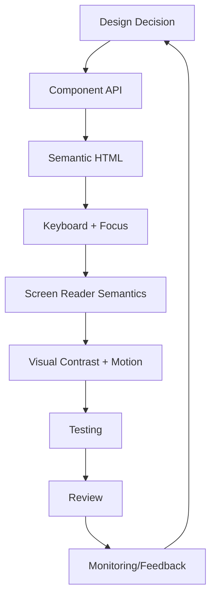

------
title: Learn Frontend React Production Architecture - Part 032
description: Production-grade guide to accessibility as a production invariant in React applications, including WCAG, semantic HTML, keyboard, focus, forms, error states, routing, dialogs, tables, data visualization, testing, governance, and anti-patterns.
series: learn-frontend-react-production-architecture
seriesTitle: Learn Frontend React Production Architecture
order: 32
partTitle: Accessibility as Production Invariant
tags:
- react
- frontend
- accessibility
- wcag
- wai-aria
- keyboard
- focus
- forms
- testing
- production
- series
date: 2026-06-28
---

# Part 032 — Accessibility as Production Invariant

## Tujuan Pembelajaran

Accessibility sering diperlakukan sebagai checklist akhir:

- “nanti tambahkan aria”
- “nanti dicek pakai tool”
- “nanti kalau ada user complain”
- “nanti kalau legal minta”

Ini salah untuk production engineering.

Accessibility adalah **production invariant**:

> A feature is not done if users cannot perceive, operate, understand, and rely on it through diverse abilities, devices, and assistive technologies.

Accessibility bukan hanya untuk screen reader users. Ia mencakup:

- keyboard-only users,
- low vision users,
- color vision deficiency,
- motor impairments,
- cognitive load,
- vestibular sensitivity,
- temporary disability,
- situational limitation,
- mobile/touch constraints,
- zoom/high contrast users,
- screen reader users,
- users on slow devices,
- users with aging-related changes.

Part ini membahas accessibility sebagai sistem engineering yang harus masuk design, implementation, test, CI, review, dan governance.

---

## 1. Core Mental Model

Accessibility production bukan satu task. Ia adalah quality system.



Jika design system component inaccessible, semua feature yang memakai component tersebut inherited bug.

Jika routing tidak mengelola focus, semua SPA navigation bisa membingungkan keyboard/screen reader users.

Jika form error tidak terkait input, semua validation UX rusak.

Accessibility harus dibangun dari primitive.

---

## 2. WCAG Mental Model

WCAG disusun di bawah empat prinsip:

| Principle | Meaning |
|---|---|
| Perceivable | user can perceive information |
| Operable | user can operate interface |
| Understandable | user can understand content and behavior |
| Robust | content works with assistive technologies |

Singkatan umum: POUR.

WCAG juga punya success criteria dengan level:

- A,
- AA,
- AAA.

Banyak organisasi menargetkan WCAG AA sebagai baseline, tetapi target legal/organizational harus ditentukan oleh tim/organisasi.

---

## 3. Accessibility Is Everyone's Responsibility

| Role | Responsibility |
|---|---|
| Product | prioritize inclusive requirements |
| Design | contrast, focus, states, patterns |
| Engineering | semantic implementation |
| QA | keyboard/screen reader checks |
| Content | clear labels/errors |
| Design system | accessible primitives |
| Backend | data/error contract supports accessible UI |
| Leadership | make it definition of done |

Accessibility fails when it is assigned to “someone later.”

---

## 4. Shift Left Accessibility

Catch issues early.

```txt
Design review:
  color contrast, focus order, keyboard path, error copy

Component implementation:
  semantic HTML, ARIA, focus, tests

Storybook:
  states, a11y checks, keyboard docs

PR review:
  role/label/focus/error/keyboard checklist

CI:
  lint, axe, story tests, component tests

Manual:
  keyboard, screen reader smoke, zoom, high contrast
```

The later accessibility bugs are found, the more expensive they are to fix.

---

## 5. Semantic HTML First

Use semantic HTML before ARIA.

Good:

```tsx
<button type="button">Approve case</button>
<a href="/cases">Cases</a>
<label htmlFor="reason">Reason</label>
<input id="reason" />
<nav aria-label="Primary navigation">...</nav>
<main id="main-content">...</main>
```

Bad:

```tsx
<div onClick={approve}>Approve</div>
<span role="button">Approve</span>
```

ARIA cannot magically give all native behavior. If you use non-native interactive element, you must implement keyboard, focus, role, disabled semantics, and accessible name.

---

## 6. Accessible Name and Description

Every control needs accessible name.

```tsx
<button>Submit approval</button>
```

Icon-only:

```tsx
<button aria-label="Open notifications">
  <BellIcon aria-hidden="true" />
</button>
```

Input:

```tsx
<label htmlFor="reason">Reason</label>
<textarea id="reason" />
```

Description:

```tsx
<p id="reason-help">
  Explain why this case should be approved.
</p>
<textarea aria-describedby="reason-help" />
```

Error:

```tsx
<p id="reason-error" role="alert">
  Reason is required.
</p>
<textarea
  aria-invalid="true"
  aria-describedby="reason-help reason-error"
/>
```

Name tells what control is. Description tells extra context.

---

## 7. Keyboard Accessibility

A production app must be usable by keyboard.

Minimum:

- all interactive controls reachable,
- logical tab order,
- visible focus,
- no keyboard traps,
- Enter/Space activate buttons,
- links navigate,
- Escape closes dismissible overlay,
- arrow keys work in composite widgets,
- disabled/unavailable state understandable,
- skip link available,
- route transitions do not lose user.

Manual test:

1. unplug mouse mentally,
2. press Tab from top,
3. navigate feature,
4. open menus/dialogs,
5. submit form,
6. recover from errors,
7. close overlays,
8. verify focus location always makes sense.

---

## 8. Focus Visibility

Never remove focus outline without replacement.

Bad:

```css
*:focus {
  outline: none;
}
```

Good:

```css
:focus-visible {
  outline: 2px solid var(--color-focus-ring);
  outline-offset: 2px;
}
```

Focus ring must be visible against backgrounds.

Design token:

```css
--color-focus-ring: #2563eb;
```

Focus styling is a design-system responsibility.

---

## 9. Focus Management in SPA

SPA route change does not reload document. Browser focus may remain on clicked link/button, while visual content changes.

Pattern:

- provide skip link,
- focus main heading/main region after major route change,
- update document title,
- preserve focus for small state changes,
- restore focus after dialog closes,
- do not steal focus during background refresh.

Example:

```tsx
function RouteFocusManager({ children }: { children: React.ReactNode }) {
  const location = useLocation();
  const mainRef = useRef<HTMLElement | null>(null);

  useEffect(() => {
    mainRef.current?.focus();
  }, [location.pathname]);

  return (
    <main id="main-content" tabIndex={-1} ref={mainRef}>
      {children}
    </main>
  );
}
```

Only focus on meaningful navigation, not every search param update.

---

## 10. Skip Link

Skip link lets keyboard users bypass repeated navigation.

```tsx
<a className="skip-link" href="#main-content">
  Skip to main content
</a>
```

CSS:

```css
.skip-link {
  position: absolute;
  top: -100%;
}

.skip-link:focus {
  top: 0;
}
```

Every app shell should include skip link if there is repeated nav/header before main content.

---

## 11. Landmarks

Use landmarks:

```tsx
<header>...</header>
<nav aria-label="Primary navigation">...</nav>
<main id="main-content">...</main>
<aside aria-label="Case details">...</aside>
<footer>...</footer>
```

Guidelines:

- one main landmark,
- label multiple nav/aside regions,
- avoid landmark soup,
- keep structure consistent.

Landmarks help screen reader users navigate by regions.

---

## 12. Heading Structure

Headings create document outline.

Bad:

```tsx
<h1>Case Detail</h1>
<h4>Status</h4>
<h2>Audit</h2>
```

Better:

```tsx
<h1>Case CASE-2026-001</h1>
<h2>Status</h2>
<h2>Documents</h2>
<h2>Audit Timeline</h2>
```

Do not choose heading level based on font size. Use CSS for size. Use heading level for structure.

---

## 13. Links vs Buttons

Use button for actions.

```tsx
<button type="button" onClick={openDialog}>
  Approve case
</button>
```

Use link for navigation.

```tsx
<Link to="/cases/CASE-001">Open case</Link>
```

Bad:

```tsx
<a onClick={openDialog}>Approve</a>
<button onClick={() => navigate("/cases")}>Cases</button>
```

Semantic mismatch confuses assistive tech and keyboard expectations.

---

## 14. Forms

Accessible forms require:

- labels,
- descriptions,
- errors,
- required indication,
- logical field grouping,
- submit feedback,
- error summary for long forms,
- focus first invalid field if appropriate,
- no placeholder-only labels,
- server errors mapped to fields/root,
- disabled/read-only semantics clear.

Field pattern:

```tsx
<label htmlFor="approval-reason">Reason</label>
<textarea
  id="approval-reason"
  aria-invalid={Boolean(error)}
  aria-describedby={error ? "approval-reason-error" : undefined}
/>
{error && (
  <p id="approval-reason-error" role="alert">
    {error}
  </p>
)}
```

---

## 15. Error Summary

For long forms, show summary.

```tsx
<div role="alert" aria-labelledby="error-summary-title">
  <h2 id="error-summary-title">There are 3 errors</h2>
  <ul>
    <li><a href="#reason">Reason is required</a></li>
    <li><a href="#acknowledge">You must acknowledge policy</a></li>
  </ul>
</div>
```

Benefits:

- user knows form failed,
- errors discoverable,
- keyboard can jump to field,
- screen reader announcement possible.

Do not rely only on red border.

---

## 16. Required Fields

Indicate required fields visibly and programmatically.

```tsx
<label htmlFor="reason">
  Reason <span aria-hidden="true">*</span>
</label>
<input id="reason" required aria-describedby="reason-help" />
```

If using custom required indicator, include explanation.

Avoid ambiguous asterisks without context.

---

## 17. Disabled vs Readonly Accessibility

Disabled controls:

- not focusable,
- not submitted,
- may be skipped by screen reader navigation,
- can hide reason from keyboard users.

Readonly controls:

- focusable/readable,
- value visible,
- can be submitted depending element.

If action unavailable, consider visible reason:

```tsx
<Button disabled aria-describedby="approve-disabled-reason">
  Approve
</Button>
<p id="approve-disabled-reason">
  Only supervisors can approve cases under review.
</p>
```

Or show an availability panel. Do not hide important explanation in tooltip only.

---

## 18. Color and Contrast

Do not rely only on color.

Bad:

```txt
Red status = error
Green status = success
```

Better:

- color + text,
- color + icon,
- color + label,
- sufficient contrast,
- tested in high contrast/forced colors.

Example:

```tsx
<Badge tone="danger">
  Rejected
</Badge>
```

The text “Rejected” carries meaning, not color alone.

---

## 19. Status Badges

Status badges should be readable and meaningful.

Bad:

```tsx
<span className="red-dot" />
```

Good:

```tsx
<Badge tone="warning">
  Under review
</Badge>
```

For unknown status:

```tsx
<Badge tone="neutral">
  Unknown status
</Badge>
```

Do not expose raw enum to users unless it is understandable.

---

## 20. Motion and Animation

Motion can harm users with vestibular disorders.

Respect reduced motion:

```css
@media (prefers-reduced-motion: reduce) {
  .animated {
    animation: none;
    transition: none;
  }
}
```

Avoid:

- parallax-heavy movement,
- flashing,
- unnecessary auto animation,
- motion required to understand UI,
- long animated route transitions without reduced-motion alternative.

Use animation to clarify, not distract.

---

## 21. Loading States

Loading state should be accessible.

Options:

```tsx
<section aria-busy={isLoading}>
  ...
</section>
```

For dynamic status:

```tsx
<div role="status" aria-live="polite">
  Loading case details...
</div>
```

Skeletons:

- should not shift layout,
- should not be announced as meaningful content repeatedly,
- should have accessible label/status if user needs it,
- should match final layout enough to reduce CLS.

Avoid infinite spinner with no context.

---

## 22. Live Regions

Use live regions for dynamic updates.

Polite:

```tsx
<div aria-live="polite">Case saved</div>
```

Assertive/alert for urgent errors:

```tsx
<div role="alert">Approval failed</div>
```

Do not overuse. Realtime apps can spam screen readers if every event announces.

For notifications:

- announce important new notifications,
- do not announce every background refresh,
- allow user to control noisy updates.

---

## 23. Dialog Accessibility

Dialog requirements:

- labelled title,
- focus moves inside,
- focus trapped,
- Escape behavior defined,
- close button accessible,
- background inert/unavailable,
- focus restored on close,
- not opened automatically without reason,
- errors inside dialog announced,
- destructive actions clear.

Example:

```tsx
<DialogContent aria-labelledby="approve-title" aria-describedby="approve-desc">
  <h2 id="approve-title">Approve case</h2>
  <p id="approve-desc">This action will be recorded in the audit log.</p>
</DialogContent>
```

Do not implement modal with plain div overlay and no focus management.

---

## 24. Menus and Popovers

Menus are for actions. Popovers are for floating content. Tooltips are for short non-interactive descriptions.

Keyboard:

- trigger focusable,
- open with Enter/Space/Arrow as pattern requires,
- arrow navigation,
- Escape closes,
- focus returns,
- disabled items handled.

Avoid putting complex forms in menus. Use dialog/popover with correct semantics.

---

## 25. Tabs

Tabs need:

- tablist,
- tabs,
- selected state,
- tabpanel,
- keyboard behavior,
- clear label.

But sometimes route links are better.

If tabs are major navigable sections:

```txt
/cases/CASE-001/audit
```

Use route navigation with links. Do not force ARIA tabs if browser history/deep link behavior is desired.

---

## 26. Tables and Data Grids

Use `<table>` for tabular data.

```tsx
<table>
  <caption>Cases assigned to you</caption>
  <thead>
    <tr>
      <th scope="col">Reference</th>
      <th scope="col">Status</th>
    </tr>
  </thead>
  <tbody>...</tbody>
</table>
```

For sortable columns:

```tsx
<th scope="col" aria-sort="ascending">
  <button>Reference</button>
</th>
```

Data grids with keyboard cell navigation are much more complex. Use grid role only if implementing grid behavior.

---

## 27. Virtualized Lists and Accessibility

Virtualization can harm accessibility if not designed.

Risks:

- screen reader cannot access offscreen items,
- row count unclear,
- keyboard navigation breaks,
- browser find does not work,
- focus lost when item unmounts.

Controls:

- provide row count,
- keep focused item mounted or manage focus,
- ensure keyboard navigation,
- support pagination if better,
- test with assistive tech.

Virtualization is performance tool with accessibility trade-offs.

---

## 28. Data Visualization

Charts must not rely only on visuals.

Provide:

- title,
- summary,
- data table alternative,
- keyboard accessible interaction,
- color-independent encoding,
- labels,
- contrast,
- tooltip accessible alternative,
- export if needed.

Example:

```tsx
<figure>
  <figcaption>Cases by status</figcaption>
  <CaseStatusChart data={data} />
  <VisuallyHidden>
    Under review: 25. Approved: 10. Rejected: 3.
  </VisuallyHidden>
</figure>
```

For critical data, provide table.

---

## 29. Icons

Decorative icon:

```tsx
<CheckIcon aria-hidden="true" />
```

Meaningful icon-only button:

```tsx
<button aria-label="Download report">
  <DownloadIcon aria-hidden="true" />
</button>
```

Icon with visible text:

```tsx
<Button>
  <DownloadIcon aria-hidden="true" />
  Download report
</Button>
```

Do not let screen reader announce icon file names.

---

## 30. Images and Alternative Text

Alt text depends on purpose.

Decorative:

```tsx

```

Informative:

```tsx

```

Functional:

```tsx
<button>
  
  Download
</button>
```

Do not write “image of” unless needed. Describe purpose.

---

## 31. Responsive and Zoom

Accessibility includes zoom and reflow.

Test:

- 200% zoom,
- small viewport,
- no horizontal scrolling for normal content,
- text not clipped,
- controls still reachable,
- dialogs fit viewport,
- mobile keyboard does not hide fields,
- sticky headers do not cover focus target.

Responsive design is accessibility.

---

## 32. Touch Target Size

Small targets hurt motor accessibility.

Design system should define minimum target size.

Examples:

- icon buttons large enough,
- spacing between touch targets,
- avoid tiny close buttons,
- checkbox/radio labels clickable,
- table row actions usable.

Do not require pixel-perfect tiny clicks for important actions.

---

## 33. Cognitive Accessibility

Make UI understandable:

- clear labels,
- consistent navigation,
- predictable behavior,
- avoid jargon,
- explain errors,
- avoid unnecessary steps,
- group related fields,
- show progress in wizards,
- confirm destructive actions,
- avoid time pressure or allow extension,
- use plain language.

For workflow-heavy UI, explain:

- current state,
- what user can do,
- why action unavailable,
- what happens next.

---

## 34. Internationalization and Accessibility

i18n affects accessibility:

- text length changes,
- label association,
- RTL layout,
- date/time formatting,
- pluralization,
- screen reader language,
- number formatting,
- input validation messages.

Use:

```html
<html lang="id">
```

or appropriate locale.

For mixed language content, mark language if needed.

---

## 35. Accessibility in Design System

Design system should provide:

- accessible Button,
- IconButton requiring label,
- TextField with label/error/description,
- Dialog with focus management,
- Menu with keyboard,
- Tabs with semantics,
- Toast/live region policy,
- VisuallyHidden,
- FocusRing,
- SkipLink,
- Page layout landmarks,
- form field primitives.

If every feature implements accessibility independently, bugs multiply.

---

## 36. Accessibility Testing Strategy

Layered testing:

| Layer | Test |
|---|---|
| lint | jsx-a11y rules |
| unit/component | role/name/focus assertions |
| automated a11y | axe checks |
| Storybook | a11y addon/stories |
| visual | focus ring/contrast visual states |
| E2E | keyboard journeys |
| manual | screen reader, zoom, high contrast |
| audits | periodic expert review |

Automated tests catch many issues, but not all. Manual testing remains necessary.

---

## 37. Component Test Examples

Button:

```tsx
expect(screen.getByRole("button", { name: /approve case/i }))
  .toBeEnabled();
```

Form error:

```tsx
const reason = screen.getByLabelText(/reason/i);

expect(reason).toHaveAttribute("aria-invalid", "true");
expect(reason).toHaveAccessibleDescription(/reason is required/i);
```

Dialog focus:

```tsx
await user.click(screen.getByRole("button", { name: /approve/i }));

expect(screen.getByRole("dialog", { name: /approve case/i }))
  .toBeInTheDocument();

await user.keyboard("{Escape}");

expect(screen.getByRole("button", { name: /approve/i })).toHaveFocus();
```

---

## 38. E2E Keyboard Journey

Critical workflow:

```txt
1. Tab to skip link.
2. Skip to main.
3. Navigate to case list.
4. Open case with keyboard.
5. Open action menu.
6. Open approve dialog.
7. Fill reason.
8. Submit.
9. Confirm success.
```

Automate at least smoke version for high-risk workflows.

Manual keyboard testing should remain part of release review for major UI changes.

---

## 39. Manual Screen Reader Smoke

For key pages:

- page title announced,
- landmarks available,
- heading structure useful,
- form labels announced,
- errors announced,
- dialog title announced,
- table headers read,
- status changes understandable,
- buttons have names,
- no excessive noise.

Use at least one screen reader/browser combination relevant to user base.

---

## 40. Accessibility and Error Handling

Error UI should be accessible.

Network error:

```tsx
<section role="alert">
  <h2>Could not load case</h2>
  <p>Check your connection and try again.</p>
  <button>Retry</button>
</section>
```

Form error:

- field-level,
- summary for long form,
- focus/announcement,
- clear instructions.

Domain error:

- explain conflict/forbidden/locked state,
- provide next action,
- do not just toast.

---

## 41. Accessibility and Realtime

Realtime updates can be overwhelming.

Rules:

- announce only important updates,
- group updates,
- allow user to review notification center,
- avoid interrupting active form,
- do not move focus automatically for background events,
- show “data updated” banner if content changed,
- let user refresh/inspect.

Screen reader users should not be spammed by every event.

---

## 42. Accessibility and Security

Security UI must be accessible:

- login form labels,
- MFA fields,
- error messages,
- session expiry dialog,
- reauthentication prompt,
- permission denied page,
- CAPTCHA alternatives if used,
- timeout warning accessible,
- focus management.

If authentication is inaccessible, app is inaccessible.

---

## 43. Accessibility and Performance

Slow UI can become inaccessible.

Examples:

- input lag blocks motor users,
- delayed hydration makes controls visually present but unusable,
- layout shift moves target during interaction,
- long tasks block assistive tech,
- animations cause discomfort,
- huge DOM slows screen reader navigation.

Performance and accessibility are linked.

---

## 44. Accessibility Bug Severity

Not all a11y bugs have same severity.

Severity factors:

- blocks task completion,
- affects critical workflow,
- affects many users,
- no workaround,
- legal/compliance exposure,
- security/authentication affected,
- data loss risk.

Example high severity:

- cannot submit approval form by keyboard,
- screen reader cannot identify required reason field,
- dialog traps focus permanently,
- login button has no accessible name.

---

## 45. Definition of Done

For production feature:

1. semantic HTML used,
2. controls have accessible names,
3. keyboard path works,
4. focus states visible,
5. route/dialog focus handled,
6. form labels/errors associated,
7. color contrast acceptable,
8. status not color-only,
9. loading/error/empty states accessible,
10. responsive/zoom checked,
11. automated a11y tests pass,
12. manual keyboard smoke done for complex UI,
13. Storybook states cover accessibility cases,
14. no known critical a11y blockers.

This should be part of review, not optional polish.

---

## 46. Anti-Pattern Catalog

### 46.1 ARIA Afterthought

Adding random `aria-*` after component is wrong.

### 46.2 Clickable Div

Mouse-only interaction.

### 46.3 Placeholder as Label

Label disappears and is not robust.

### 46.4 Focus Outline Removed

Keyboard users lost.

### 46.5 All Errors as Toast

Fields not associated with errors.

### 46.6 Color-Only Status

Color-blind users miss meaning.

### 46.7 Modal Without Focus Trap

Keyboard enters background.

### 46.8 Hidden Disabled Reason

User cannot know why action unavailable.

### 46.9 Automated Axe Only

Many usability issues missed.

### 46.10 Design System Components Inaccessible

Bug replicated everywhere.

---

## 47. Mini Case Study: Approval Dialog

### Requirements

- open by keyboard,
- title announced,
- description explains audit impact,
- reason field labelled,
- validation error announced,
- submit disabled/pending clear,
- Escape/cancel behavior clear,
- focus restored after close,
- success announced or visible.

Implementation layers:

```txt
Dialog primitive:
  focus trap, title, portal, escape, restore focus

Form primitive:
  label, description, error association

Domain form:
  reason validation, conflict/forbidden handling

Mutation:
  pending, success, error
```

Testing:

- component test for form error association,
- dialog focus test,
- E2E keyboard approval smoke,
- manual screen reader check.

---

## 48. Mini Case Study: Case Status Timeline

Accessibility needs:

- timeline has heading,
- events are list items,
- event time readable,
- actor and action text clear,
- icon decorative or labelled,
- status color accompanied by text,
- realtime new event not over-announced,
- pagination/load more button accessible.

Bad:

```tsx
<div className="timeline">
  <div className="green-dot" />
  <span>Done</span>
</div>
```

Better:

```tsx
<section aria-labelledby="audit-title">
  <h2 id="audit-title">Audit timeline</h2>
  <ol>
    <li>
      <time dateTime="2026-06-28T09:15:00+07:00">
        28 Jun 2026, 09:15
      </time>
      <p>Ayu approved the case. Reason: Reviewed and approved.</p>
    </li>
  </ol>
</section>
```

---

## 49. Accessibility Review Checklist

Before approving feature:

1. Can it be used with keyboard only?
2. Is focus visible?
3. Is focus order logical?
4. Are all controls named?
5. Are links/buttons semantically correct?
6. Are forms labelled?
7. Are errors associated and announced?
8. Is status conveyed without color only?
9. Is contrast acceptable?
10. Are headings/landmarks meaningful?
11. Are dialogs focus-managed?
12. Are menus/tabs/comboboxes using correct patterns?
13. Are loading/error/empty states accessible?
14. Does zoom 200% work?
15. Does mobile/touch target size work?
16. Is reduced motion respected?
17. Are realtime updates not noisy?
18. Are tables/charts accessible?
19. Are automated tests included?
20. Was manual keyboard/screen-reader smoke done for complex UI?

---

## 50. Deliberate Practice

### Latihan 1 — Keyboard Audit

Pick one feature and use only keyboard.

Record:

| Step | Expected | Actual | Fix |
|---|---|---|---|
| open menu | Enter opens | fails | use button/menu primitive |
| open dialog | focus title/first field | focus lost | fix dialog focus |
| submit invalid | error announced | not announced | role/aria-describedby |

### Latihan 2 — Form Accessibility Refactor

Find form field without label/error association.

Refactor to:

- label,
- description,
- error id,
- `aria-invalid`,
- `aria-describedby`.

### Latihan 3 — Screen Reader Outline

For one page, list what screen reader should expose:

- title,
- landmarks,
- headings,
- buttons,
- form fields,
- status messages.

Compare with actual.

### Latihan 4 — Storybook A11y Matrix

For one component, add stories:

- default,
- focus-visible,
- invalid,
- disabled with reason,
- long label,
- keyboard interaction,
- high contrast/reduced motion if relevant.

### Latihan 5 — Data Visualization Alternative

For one chart, add:

- title,
- summary,
- accessible table,
- non-color encoding.

---

## 51. Ringkasan

Accessibility is a production invariant.

Key principles:

- semantic HTML first,
- keyboard operability,
- visible focus,
- correct focus management,
- accessible names/descriptions,
- form errors associated,
- color not sole meaning,
- dialogs/menus/tabs/comboboxes follow patterns,
- loading/error/realtime states are accessible,
- testing is layered,
- design system encodes accessibility,
- manual review still matters.

Top frontend engineers do not “add accessibility later.” They design components so inaccessible usage is difficult and accessible usage is natural.

---

## 52. Self-Assessment

Anda siap lanjut jika bisa menjawab:

1. Apa empat prinsip WCAG?
2. Mengapa accessibility harus invariant production?
3. Mengapa semantic HTML lebih baik daripada ARIA custom?
4. Bagaimana menentukan accessible name?
5. Bagaimana form error dikaitkan ke input?
6. Apa focus management yang benar untuk dialog?
7. Bagaimana SPA route change mempengaruhi focus?
8. Mengapa status tidak boleh color-only?
9. Apa batas automated accessibility testing?
10. Apa Definition of Done accessibility untuk feature React?

---

## 53. Sumber Rujukan

- W3C WCAG 2.2
- W3C WAI — WCAG Overview
- W3C WAI-ARIA Authoring Practices Guide
- MDN — ARIA
- MDN — HTML Accessibility
- React Docs — Accessibility
- Testing Library Docs — Accessibility-oriented queries
- axe-core Documentation
