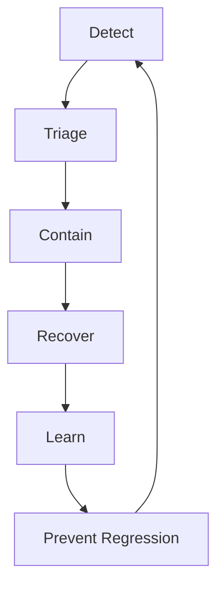
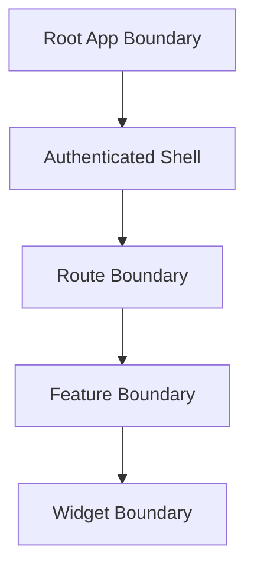

------
title: Learn Frontend React Production Architecture - Part 033
description: Production-grade guide to frontend observability, error boundaries, reliability engineering, logging, metrics, tracing, Web Vitals, session replay, release health, incident response, and anti-patterns in React applications.
series: learn-frontend-react-production-architecture
seriesTitle: Learn Frontend React Production Architecture
order: 33
partTitle: Observability, Error Boundaries, and Frontend Reliability
tags:
- react
- frontend
- observability
- reliability
- error-boundaries
- logging
- metrics
- tracing
- web-vitals
- production
- series
date: 2026-06-28
---

# Part 033 — Observability, Error Boundaries, and Frontend Reliability

## Tujuan Pembelajaran

Production frontend tidak selesai saat test hijau dan deploy berhasil.

Setelah aplikasi digunakan ribuan user dengan device, browser, network, auth state, permission, data shape, dan behavior yang berbeda-beda, bug baru akan muncul.

Frontend reliability menjawab:

- apakah user benar-benar bisa menggunakan app?
- halaman mana yang crash?
- release mana yang memperburuk error rate?
- route mana yang lambat?
- API mana yang sering gagal?
- apakah chunk load error terjadi setelah deploy?
- apakah user mengalami blank screen?
- apakah action approval gagal karena 409, 403, atau network?
- apakah realtime disconnected?
- apakah Web Vitals memburuk?
- apakah error hanya terjadi di browser tertentu?
- apakah app pulih dengan baik setelah failure?

Observability adalah kemampuan untuk menjawab pertanyaan-pertanyaan tersebut dari data production, tanpa harus menebak.

---

## 1. Core Mental Model

Frontend reliability loop:



Detect:

- error tracking,
- metrics,
- logs,
- traces,
- Web Vitals,
- synthetic checks,
- user feedback.

Triage:

- route,
- release,
- browser,
- device,
- user segment,
- API status,
- stack trace,
- replay/breadcrumbs.

Contain:

- feature flag off,
- rollback,
- disable broken route/action,
- degrade gracefully.

Recover:

- error boundary fallback,
- retry,
- reload prompt,
- cache reset,
- reconnect.

Learn:

- postmortem,
- test added,
- monitor added,
- checklist updated.

---

## 2. Observability vs Monitoring

Monitoring asks:

> Is something known bad happening?

Observability asks:

> Can we understand unknown bad behavior from emitted signals?

Monitoring:

- error rate above threshold,
- LCP p75 above budget,
- 5xx API error spike,
- chunk load failures.

Observability:

- which route?
- which release?
- which browser?
- which user flow?
- what happened before error?
- which API request failed?
- did retry help?
- did feature flag correlate?

Production frontend needs both.

---

## 3. Frontend Telemetry Signals

Signals:

| Signal | Examples |
|---|---|
| errors | uncaught exception, promise rejection, render crash |
| logs | structured diagnostic events |
| metrics | error rate, Web Vitals, route latency |
| traces | navigation/action/API spans |
| breadcrumbs | user actions before failure |
| session replay | visual reproduction, privacy-safe |
| network telemetry | API status/latency |
| release health | crash-free sessions/users |
| feature flags | flag state at error time |
| device/browser info | browser, OS, viewport, memory |
| custom domain events | approval submitted, conflict shown |

Do not collect everything blindly. Collect what helps reliability while respecting privacy/security.

---

## 4. Error Types in Frontend

Frontend errors include:

| Error Type | Example |
|---|---|
| render error | component throws during render |
| event handler error | click handler throws |
| async error | promise rejection |
| resource error | script/image chunk fails |
| API error | 500/403/409/network |
| hydration error | server/client markup mismatch |
| routing error | route loader/action fails |
| state invariant error | impossible state reached |
| browser API error | storage denied, clipboard blocked |
| realtime error | socket disconnect, invalid event |
| validation error | user input invalid |
| domain error | conflict/forbidden/locked |

Not all errors are bugs. Some are expected states. Observability should distinguish.

Example: 409 conflict in workflow is expected domain condition, not necessarily production bug. But a sudden spike may signal UX/concurrency issue.

---

## 5. Error Boundary Mental Model

React error boundaries catch JavaScript errors during rendering, lifecycle, and constructors of child components.

They do not catch every error, such as:

- event handler errors,
- async promise rejections,
- server-side errors in some contexts,
- errors thrown inside the boundary itself.

Error boundary purpose:

- prevent whole app from unmounting,
- show fallback UI,
- log error,
- allow reset/retry where possible,
- isolate failure by route/widget.

A class component can implement:

- `static getDerivedStateFromError`,
- `componentDidCatch`.

Example:

```tsx
class RouteErrorBoundary extends React.Component<
  { children: React.ReactNode; fallback: React.ReactNode },
  { hasError: boolean }
> {
  state = {
    hasError: false,
  };

  static getDerivedStateFromError() {
    return { hasError: true };
  }

  componentDidCatch(error: Error, info: React.ErrorInfo) {
    reportError(error, {
      componentStack: info.componentStack,
      boundary: "RouteErrorBoundary",
    });
  }

  render() {
    if (this.state.hasError) {
      return this.props.fallback;
    }

    return this.props.children;
  }
}
```

---

## 6. Error Boundary Placement

Error boundary placement is architecture.



Root boundary:

- catches catastrophic app failure,
- fallback may ask reload.

Route boundary:

- isolates broken route,
- user can navigate elsewhere.

Widget boundary:

- isolates chart/timeline/third-party widget,
- page remains usable.

Do not rely only on root boundary. A chart crash should not blank entire case detail page.

---

## 7. Error Boundary Fallback UX

Bad fallback:

```txt
Something went wrong.
```

Better fallback includes:

- user-friendly explanation,
- retry action,
- reload if needed,
- navigation fallback,
- support reference/trace id if safe,
- no sensitive stack trace,
- preserves app shell where possible.

Example:

```tsx
function RouteErrorFallback({ onRetry }: { onRetry: () => void }) {
  return (
    <section role="alert">
      <h1>We could not show this page</h1>
      <p>Try again. If the problem continues, contact support.</p>
      <button onClick={onRetry}>Retry</button>
      <Link to="/cases">Back to cases</Link>
    </section>
  );
}
```

Fallback must be accessible.

---

## 8. Resetting Error Boundaries

Error boundary should reset when route/resource changes.

Example with key:

```tsx
<RouteErrorBoundary key={location.pathname} fallback={<RouteErrorFallback />}>
  <Outlet />
</RouteErrorBoundary>
```

For case detail:

```tsx
<CaseBoundary key={caseId}>
  <CaseDetail caseId={caseId} />
</CaseBoundary>
```

If boundary does not reset, user may stay stuck in fallback after navigating.

---

## 9. Route Error Boundaries

Framework/router route error boundaries can handle loader/action/render errors at route level.

Route-level fallback can distinguish:

- not found,
- forbidden,
- loader failed,
- thrown response,
- unexpected render crash.

Pattern:

```tsx
function CaseRouteErrorBoundary() {
  const error = useRouteError();

  if (isForbidden(error)) {
    return <ForbiddenPage />;
  }

  if (isNotFound(error)) {
    return <CaseNotFound />;
  }

  return <RouteCrashFallback />;
}
```

Do not collapse all route errors into generic crash.

---

## 10. Event Handler Errors

Error boundaries generally do not catch event handler errors. Handle event errors explicitly or let global error handler report them.

```tsx
async function handleApprove() {
  try {
    await approveCaseMutation.mutateAsync(input);
  } catch (error) {
    const normalized = normalizeAppError(error);
    showCommandError(normalized);
    reportHandledError(normalized, {
      action: "approveCase",
      caseId,
    });
  }
}
```

Handled domain errors should be UI states, not uncaught exceptions.

---

## 11. Promise Rejection Handling

Unhandled promise rejections are common.

Global handlers:

```ts
window.addEventListener("unhandledrejection", (event) => {
  reportError(event.reason, {
    source: "unhandledrejection",
  });
});
```

But do not use global handler as substitute for proper command error handling.

Global handler is safety net.

---

## 12. Resource and Chunk Load Errors

Chunk load failure can happen after deployment.

Detect:

- dynamic import rejection,
- script load error,
- asset 404,
- service worker stale cache.

Fallback:

```tsx
function ChunkLoadErrorFallback() {
  return (
    <section role="alert">
      <h1>Application update available</h1>
      <p>Reload to continue.</p>
      <button onClick={() => window.location.reload()}>
        Reload
      </button>
    </section>
  );
}
```

Track:

- chunk URL,
- release id,
- browser,
- route,
- asset status if available.

Deployment strategy should retain old assets and cache `index.html` correctly.

---

## 13. Hydration and Recoverable Errors

SSR/hydration can produce mismatch warnings/errors.

Track:

- hydration mismatch count,
- route,
- component,
- release,
- browser,
- whether user-facing.

Common causes:

- `Date.now()` in render,
- random IDs not from `useId`,
- locale/timezone mismatch,
- browser-only data during SSR,
- auth personalization mismatch,
- invalid HTML nesting,
- third-party DOM mutation.

Hydration errors are reliability issues, not only console noise.

---

## 14. Structured Logging

Logs should be structured.

Bad:

```ts
console.log("approve failed", error);
```

Better:

```ts
logger.error("case_approval_failed", {
  caseId,
  route: "/cases/:caseId",
  errorType: normalized.type,
  status: normalized.status,
  release: config.releaseId,
  traceId: normalized.traceId,
});
```

Rules:

- use event names,
- include route pattern, not raw sensitive URL if needed,
- include release,
- include feature flag state if useful,
- redact sensitive values,
- sample noisy logs,
- avoid logging full payloads.

---

## 15. Breadcrumbs

Observability breadcrumbs capture preceding actions.

Examples:

```ts
addBreadcrumb({
  category: "navigation",
  message: "Opened case detail",
  data: { route: "/cases/:caseId" },
});

addBreadcrumb({
  category: "ui.action",
  message: "Clicked approve",
  data: { caseId },
});
```

Breadcrumbs help answer “what happened before crash?”

But never include sensitive form fields or document contents.

---

## 16. Metrics

Metrics are numerical signals.

Frontend metrics:

- JS error rate,
- crash-free sessions,
- unhandled rejection count,
- route transition p75/p95,
- API latency by endpoint,
- API error rate by status,
- Web Vitals,
- chunk load failures,
- realtime reconnect count,
- memory growth,
- form submission success/failure,
- conflict rate,
- forbidden rate,
- retry rate.

Metric needs dimensions:

- route,
- release,
- browser,
- device,
- country/region if allowed,
- network type if available,
- user role/segment if privacy policy allows.

Avoid high-cardinality dimensions like raw case ID.

---

## 17. Web Vitals Instrumentation

Track:

- LCP,
- INP,
- CLS,
- FCP/TTFB if useful.

Attach:

- route,
- release,
- page type,
- device class,
- navigation type,
- user segment if allowed.

Example conceptual:

```ts
onLCP((metric) => {
  reportMetric("web_vital_lcp", {
    value: metric.value,
    rating: metric.rating,
    route: getRoutePattern(),
    release: config.releaseId,
  });
});
```

Field Web Vitals reveal real user pain. Lab-only performance can miss production issues.

---

## 18. Tracing

Tracing links work across frontend and backend.

Example trace:

```txt
User clicks Approve
  frontend span: approve_button_click
  frontend span: POST /cases/:id/approve
  backend span: approveCase handler
  db span: update case
  backend span: audit event insert
  frontend span: invalidate case detail
```

Benefits:

- see end-to-end latency,
- correlate frontend action with backend service,
- debug slow command,
- identify API bottleneck,
- attach trace id to support ticket.

OpenTelemetry provides vendor-neutral APIs/SDKs for traces, metrics, and logs.

---

## 19. Frontend Span Design

Spans:

- navigation,
- route loader,
- API request,
- form submit,
- mutation,
- realtime reconnect,
- heavy computation,
- file upload,
- chunk load.

Example conceptual:

```ts
const span = tracer.startSpan("case.approve");

try {
  span.setAttribute("case.id", caseId);
  span.setAttribute("route", "/cases/:caseId");

  await approveCase(input);

  span.setStatus({ code: SpanStatusCode.OK });
} catch (error) {
  span.recordException(error);
  span.setStatus({ code: SpanStatusCode.ERROR });
  throw error;
} finally {
  span.end();
}
```

Be careful with sensitive attributes. Do not attach approval reason.

---

## 20. API Observability

For each API request, capture:

- method,
- endpoint pattern,
- status,
- duration,
- retry count,
- aborted/timeout,
- trace id,
- release,
- route,
- error type.

Endpoint pattern:

```txt
GET /cases/:caseId
```

not raw:

```txt
GET /cases/CASE-2026-001
```

if IDs are sensitive/high-cardinality.

---

## 21. Domain Reliability Metrics

For workflow-heavy UI, track domain-oriented signals.

Examples:

- approval submit success rate,
- approval validation error rate,
- conflict rate,
- forbidden action attempt rate,
- average approval command latency,
- percentage of cases with stale update banner,
- realtime disconnect duration,
- file upload failure rate,
- report generation timeout rate.

These metrics connect frontend reliability to business outcomes.

---

## 22. Release Health

Every event should include release id.

Release health tracks:

- crash-free sessions,
- error rate by release,
- Web Vitals by release,
- chunk failures by release,
- API failure correlation,
- feature flag state,
- adoption percentage,
- rollback trigger threshold.

If new release spikes errors, rollback or disable flag quickly.

---

## 23. Feature Flag Observability

Flags should be included in relevant telemetry.

Example:

```ts
reportError(error, {
  release: config.releaseId,
  flags: {
    newCaseTimeline: flagClient.get("newCaseTimeline"),
  },
});
```

But do not attach every flag to every event if high payload/cardinality.

Use targeted flag context.

Feature flags are only useful for reliability if you can observe their impact.

---

## 24. Session Replay

Session replay can help reproduce UI issues.

Benefits:

- see user steps,
- inspect DOM state,
- diagnose visual failures,
- reproduce rage clicks/dead clicks.

Risks:

- privacy,
- PII capture,
- sensitive form data,
- regulatory data,
- performance overhead.

Controls:

- mask sensitive text/input,
- disable for sensitive routes if needed,
- sample,
- access control,
- retention limits,
- privacy review.

For case management apps, session replay must be very carefully governed.

---

## 25. Privacy and Redaction

Telemetry must not leak sensitive data.

Avoid:

- approval reason,
- case subject details,
- document content,
- token/cookie,
- full URL with sensitive query,
- raw API response,
- localStorage dump,
- user PII unless approved,
- screenshots/replay of sensitive screens without masking.

Redaction should be built into telemetry wrapper.

```ts
function safeRouteContext() {
  return {
    routePattern: getRoutePattern(),
    release: config.releaseId,
  };
}
```

---

## 26. Reliability UX Patterns

Reliability is not only reporting. UI should recover.

Patterns:

- retry button,
- stale data banner,
- offline banner,
- reconnecting indicator,
- partial failure fallback,
- route error boundary,
- widget error boundary,
- reload prompt for chunk failure,
- conflict resolution UI,
- permission denied page,
- not found page,
- maintenance mode,
- graceful empty state,
- progressive enhancement.

Do not let one failed widget blank entire route.

---

## 27. Partial Failure Design

Case detail may have:

- summary,
- timeline,
- documents,
- related cases,
- actions.

If timeline fails, summary and actions can still work.

```tsx
<CaseSummary data={caseDetail} />

<WidgetBoundary fallback={<TimelineError />}>
  <AuditTimeline caseId={caseId} />
</WidgetBoundary>

<WidgetBoundary fallback={<DocumentsError />}>
  <DocumentsPanel caseId={caseId} />
</WidgetBoundary>
```

Use partial boundaries around independent sections.

---

## 28. Offline and Reconnect Reliability

When offline:

- show offline banner,
- prevent unsafe commands,
- allow cached read if acceptable,
- mark data stale,
- reconnect automatically,
- invalidate after reconnect,
- preserve form draft if safe,
- avoid false success.

Realtime:

- show reconnecting,
- backoff,
- heartbeat,
- invalidate after reconnect gap.

Reliability is user trust. Do not pretend app is live when it is stale.

---

## 29. Error Budget

Reliability can use error budgets.

Examples:

```txt
JS crash-free sessions >= 99.9%
chunk load error rate < 0.05%
approval command failure due frontend bug < 0.1%
route transition p95 < 2s
unhandled promise rejection rate < 0.1/session
```

If error budget is burned:

- pause feature work,
- fix reliability,
- rollback risky release,
- add tests/monitors.

Error budget makes reliability trade-off explicit.

---

## 30. SLOs for Frontend

Service Level Objectives for frontend can include:

| SLO | Example |
|---|---|
| availability | app shell loads 99.9% |
| crash-free | 99.9% sessions crash-free |
| performance | LCP p75 <= 2.5s on public routes |
| interaction | INP p75 <= 200ms |
| workflow | approval action feedback <= 200ms p75 |
| delivery | chunk load failure < 0.05% |
| realtime | reconnect within 10s p95 |
| freshness | case detail stale warning under 1% sessions |

Choose SLOs that match business value.

---

## 31. Alerting

Alert only on actionable signals.

Bad alerts:

- every single frontend error,
- noisy 404 due bot,
- known validation errors,
- low-volume non-actionable warnings.

Good alerts:

- new release error spike,
- chunk load failures above threshold,
- app shell boot failure,
- login failure spike,
- approval command failure spike,
- Web Vitals budget regression,
- realtime disconnect spike,
- source map missing for release.

Alert should have owner and runbook.

---

## 32. Runbooks

Runbook example: chunk load error spike.

```txt
Symptoms:
  ChunkLoadError > 0.1% sessions after release

Check:
  asset 404 logs
  CDN cache headers
  release id
  old asset retention
  service worker status

Mitigation:
  restore previous assets
  rollback index.html
  purge CDN if wrong
  show reload prompt
  disable service worker if culprit

Prevention:
  retain old assets
  add deploy smoke
  monitor asset 404
```

Runbooks reduce panic during incidents.

---

## 33. Incident Response

Frontend incident flow:

1. detection,
2. severity classification,
3. owner assigned,
4. user impact defined,
5. mitigation chosen,
6. communication,
7. rollback/flag disable if needed,
8. verification,
9. postmortem,
10. action items.

Frontend incidents can be serious:

- login broken,
- approval action broken,
- sensitive data leak,
- blank screen,
- chunk 404,
- XSS,
- severe performance regression.

Treat with same seriousness as backend incidents.

---

## 34. Postmortem

Good postmortem includes:

- timeline,
- detection gap,
- user impact,
- root cause,
- contributing factors,
- why tests missed it,
- why monitoring missed/detected it,
- what prevented worse impact,
- action items,
- owners,
- due dates.

Avoid blame.

Question:

> What system change would make this class of failure less likely?

---

## 35. Source Maps and Error Quality

Minified stack traces need source maps.

Reliability setup:

- build release id,
- upload source maps to error provider,
- do not publicly expose if policy forbids,
- verify upload in CI/CD,
- associate release with deployed assets,
- redact sources if needed.

If source maps missing, production debugging becomes slower.

---

## 36. Frontend Health Dashboard

Dashboard should show:

- active release,
- crash-free sessions,
- top errors by route/release,
- Web Vitals by route,
- API error rate by endpoint,
- chunk load errors,
- route transition latency,
- approval command success/failure,
- realtime reconnects,
- browser/device breakdown,
- feature flag correlation.

The dashboard should answer “is the app healthy now?”

---

## 37. Synthetic Monitoring

Synthetic checks:

- load public route,
- login smoke,
- open dashboard,
- deep link refresh,
- approve test case in safe environment,
- check static asset availability,
- check chunk lazy route.

Synthetic is not substitute for RUM but catches obvious deploy/config failures.

Use safe test tenant/data for workflow commands.

---

## 38. Anti-Pattern Catalog

### 38.1 Error Boundary Only at Root

Small widget crash blanks app.

### 38.2 Generic “Something Went Wrong”

No recovery, no trace, no context.

### 38.3 Logging Sensitive Data

Telemetry becomes data leak.

### 38.4 No Release ID

Cannot correlate errors to deploy.

### 38.5 No Source Maps

Stack traces unusable.

### 38.6 Treating 409/403 as Crashes

Expected domain errors pollute error tracking.

### 38.7 No Chunk Load Monitoring

Deployment delivery failures invisible.

### 38.8 Session Replay Without Privacy Review

Sensitive data exposure.

### 38.9 Alerts Without Runbooks

Noise and panic.

### 38.10 No Postmortems

Same incident repeats.

---

## 39. Mini Case Study: Case Detail Partial Failure

### Requirement

If audit timeline fails, case summary and actions remain usable.

Architecture:

```tsx
function CaseDetailPage({ caseDetail }: Props) {
  return (
    <>
      <CaseHeader caseDetail={caseDetail} />
      <CaseActionBar caseDetail={caseDetail} />

      <SectionBoundary
        name="AuditTimeline"
        fallback={<AuditTimelineError />}
      >
        <AuditTimeline caseId={caseDetail.id} />
      </SectionBoundary>

      <SectionBoundary
        name="DocumentsPanel"
        fallback={<DocumentsPanelError />}
      >
        <DocumentsPanel caseId={caseDetail.id} />
      </SectionBoundary>
    </>
  );
}
```

Telemetry:

```ts
reportError(error, {
  boundary: "AuditTimeline",
  route: "/cases/:caseId",
  release: config.releaseId,
});
```

User impact minimized. Error still reported.

---

## 40. Mini Case Study: Approval Command Observability

Command telemetry:

```txt
case_approval_opened
case_approval_submitted
case_approval_succeeded
case_approval_failed
```

Attributes:

- route pattern,
- release,
- status/error type,
- duration,
- retry count,
- trace id,
- user role if allowed,
- feature flag variant.

Never include approval reason.

Metrics:

- success rate,
- 403 rate,
- 409 rate,
- validation error rate,
- latency p75/p95,
- retry rate.

If 409 rate spikes, maybe realtime stale data problem. If 403 spikes, maybe available action mismatch.

---

## 41. Mini Case Study: New Release Error Spike

### Symptom

Error rate doubles after release `2026.06.28-001`.

### Triage

- top error: `Cannot read properties of undefined`.
- route: `/cases/:caseId/documents`.
- browser: Chrome/Edge.
- feature flag: new document preview.
- source map identifies `DocumentPreview.tsx`.

### Contain

- disable feature flag,
- fallback to old document preview.

### Recover

- monitor error rate returns normal.

### Learn

- add fixture for document without preview metadata,
- add component test,
- add runtime schema fallback,
- add story for missing metadata.

---

## 42. Reliability Review Checklist

Before approving production feature:

1. What can fail?
2. Is there an error boundary at correct level?
3. Is fallback user-friendly and accessible?
4. Are expected domain errors handled as UI states?
5. Are unexpected errors reported?
6. Are sensitive values redacted?
7. Is release id attached?
8. Are source maps uploaded?
9. Are API failures observable by endpoint/status?
10. Are Web Vitals/route metrics relevant?
11. Is chunk load failure handled?
12. Is offline/reconnect behavior defined?
13. Are feature flags observable?
14. Is partial failure possible?
15. Are alerts actionable?
16. Is there a runbook for critical failure?
17. Is cache cleared on logout/error where needed?
18. Are user-impact metrics defined?
19. Are tests covering fallback/recovery?
20. How would we know this broke in production?

---

## 43. Deliberate Practice

### Latihan 1 — Error Boundary Map

Draw component tree and mark boundaries:

```txt
Root
  AuthenticatedShell
    CaseDetailRoute
      AuditTimeline
      DocumentsPanel
      ActionDialogs
```

Decide fallback for each.

### Latihan 2 — Telemetry Event Design

For one command, define:

- event names,
- attributes,
- sensitive fields to exclude,
- metrics,
- alert threshold.

### Latihan 3 — Runbook

Write runbook for:

- blank screen,
- chunk load error,
- login broken,
- approval command failure spike,
- WebSocket reconnect spike.

### Latihan 4 — Reliability Dashboard

Design dashboard panels:

- errors by release,
- route latency,
- Web Vitals,
- top API failures,
- workflow success rate,
- realtime health.

### Latihan 5 — Postmortem Simulation

Pick previous bug. Write:

- timeline,
- detection,
- impact,
- root cause,
- missing test/monitor,
- prevention action.

---

## 44. Ringkasan

Frontend reliability requires observability, containment, recovery, and learning.

Core practices:

- use error boundaries at root/route/widget levels,
- distinguish expected domain errors from crashes,
- emit structured telemetry,
- attach release id and route pattern,
- protect privacy,
- track Web Vitals and route/user-flow metrics,
- observe API and chunk failures,
- provide recovery UX,
- use alerts with runbooks,
- run postmortems,
- add regression tests and monitors.

A production frontend without observability is a black box. A top-tier engineer designs the app so failures are visible, contained, recoverable, and less likely to repeat.

---

## 45. Self-Assessment

Anda siap lanjut jika bisa menjawab:

1. Apa beda monitoring dan observability?
2. Error apa saja yang tidak ditangkap error boundary?
3. Di mana error boundary sebaiknya ditempatkan?
4. Apa fallback UI yang baik?
5. Apa yang harus ada di telemetry event?
6. Mengapa release id penting?
7. Bagaimana Web Vitals masuk observability?
8. Mengapa session replay berisiko privacy?
9. Apa itu frontend SLO/error budget?
10. Bagaimana membuat runbook untuk chunk load error?

---

## 46. Sumber Rujukan

- React Docs — Error Boundaries via `Component`
- React Legacy Docs — Error Boundaries
- Sentry Docs — React Error Boundary
- OpenTelemetry Docs — JavaScript
- OpenTelemetry Docs — Instrumentation
- web.dev — Web Vitals
