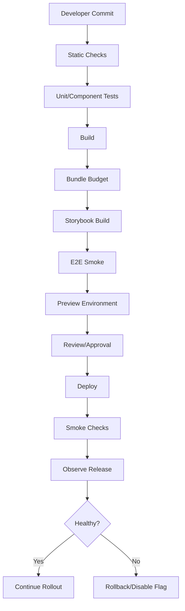
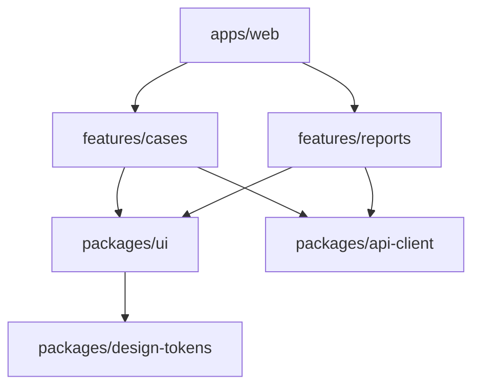

------
title: Learn Frontend React Production Architecture - Part 034
description: Production-grade guide to monorepo architecture, CI/CD, release governance, deployment strategy, quality gates, environments, feature flags, dependency governance, rollback, and frontend delivery operations.
series: learn-frontend-react-production-architecture
seriesTitle: Learn Frontend React Production Architecture
order: 34
partTitle: Monorepo, CI/CD, Release, and Deployment Governance
tags:
- react
- frontend
- monorepo
- ci-cd
- deployment
- github-actions
- release
- governance
- production
- series
date: 2026-06-28
---

# Part 034 — Monorepo, CI/CD, Release, and Deployment Governance

## Tujuan Pembelajaran

Kualitas frontend production tidak hanya ditentukan oleh component dan architecture runtime. Ia juga ditentukan oleh delivery system:

- repo structure,
- package boundaries,
- dependency governance,
- CI speed,
- test strategy,
- build reproducibility,
- environment configuration,
- release strategy,
- deployment cache,
- rollback,
- feature flags,
- observability,
- approval gates,
- security checks,
- ownership.

Part ini membahas bagaimana membuat sistem delivery yang menjaga kualitas secara konsisten.

Tujuan:

> Make the safe path the default path from commit to production.

---

## 1. Delivery as Architecture

Frontend delivery pipeline adalah bagian dari architecture.



Architecture is not only code organization. It includes how code safely reaches users.

---

## 2. Monorepo vs Polyrepo

Monorepo:

- multiple packages/apps in one repository.

Polyrepo:

- separate repositories per app/package/service.

Monorepo benefits:

- atomic changes across packages,
- shared tooling,
- easier refactoring,
- consistent lint/test/build,
- single dependency graph,
- easier design system integration,
- centralized code ownership.

Monorepo costs:

- CI complexity,
- ownership boundaries need discipline,
- dependency coupling risk,
- repo size,
- build caching setup,
- permission granularity,
- release coordination.

Monorepo is not automatically good. It requires governance.

---

## 3. Example Frontend Monorepo Structure

```txt
apps/
  web/
  admin/
  storybook/

packages/
  ui/
  design-tokens/
  api-client/
  eslint-config/
  tsconfig/
  testing/
  feature-flags/
  telemetry/

features/
  cases/
  reports/
  users/
```

Alternative:

```txt
apps/
  case-management/
packages/
  shared-ui/
  shared-api/
  shared-config/
```

Principle:

- app packages compose features,
- shared packages stay domain-neutral or clearly scoped,
- design system package does not import app feature,
- API clients may be shared but wrapped by feature layer,
- server-only code not imported into client package.

---

## 4. Package Boundary Rules

Define import rules.

Example:

```txt
apps/web can import packages/ui and features/*
features/cases can import packages/ui, packages/api-client
packages/ui cannot import features/*
packages/design-tokens cannot import React
packages/api-client cannot import UI
```

Architecture test/lint can enforce:

- no circular dependency,
- no feature-to-feature deep import,
- no server package in client bundle,
- no app import from package,
- no private module import.

Boundary enforcement prevents architecture erosion.

---

## 5. Shared Package Criteria

Before creating shared package, ask:

1. Is it used by multiple apps/features?
2. Is it domain-neutral or intentionally domain-specific?
3. Who owns it?
4. What is its public API?
5. How is it versioned?
6. Does it increase coupling?
7. Can it be changed atomically?
8. Is it testable in isolation?
9. Does it ship to browser?
10. Does it have bundle budget?

Do not create shared package just because two files look similar once.

---

## 6. Design System Package Governance

`packages/ui` should have:

- public entrypoints,
- server/client split if needed,
- accessibility tests,
- stories,
- visual regression,
- token dependency,
- changelog,
- component ownership,
- deprecation policy.

Avoid:

```txt
packages/ui imports features/cases
packages/ui exports everything from one client barrel
packages/ui includes heavy chart/editor by default
```

Design system is platform. Treat it like a product.

---

## 7. Dependency Graph

Monorepo dependency graph should be visible.



Use graph to answer:

- what is affected by this change?
- which tests/builds must run?
- which packages depend on this?
- is there forbidden dependency?
- is a cycle created?

Affected-based CI can reduce runtime significantly.

---

## 8. CI Principles

Good CI is:

- fast,
- deterministic,
- incremental where possible,
- parallelized,
- reproducible,
- secure,
- observable,
- trustworthy.

Bad CI:

- slow,
- flaky,
- impossible to debug,
- secrets exposed,
- no caching,
- runs everything always,
- passes despite broken artifacts,
- fails randomly,
- has no ownership.

Developers must trust CI. If CI is theater, quality gates fail.

---

## 9. CI Pipeline Layers

PR pipeline:

```txt
1. install with frozen lockfile
2. format/lint
3. typecheck
4. unit tests
5. component/integration tests
6. build app
7. build Storybook
8. bundle budget
9. affected E2E smoke
10. security/dependency checks
```

Nightly:

```txt
full E2E
cross-browser tests
visual regression
performance smoke
dependency audit
contract verification
long-running session test
```

Release:

```txt
build immutable artifact
upload sourcemaps
deploy preview/staging
run smoke
promote to production
monitor release health
```

---

## 10. GitHub Actions Mental Model

A GitHub Actions workflow is defined in YAML and contains jobs. Jobs run steps. Jobs can run in parallel or depend on other jobs.

Example:

```yaml
name: Pull Request

on:
  pull_request:

jobs:
  quality:
    runs-on: ubuntu-latest

    steps:
      - uses: actions/checkout@v4
      - uses: pnpm/action-setup@v4
      - uses: actions/setup-node@v4
        with:
          node-version: 22
          cache: pnpm

      - run: pnpm install --frozen-lockfile
      - run: pnpm typecheck
      - run: pnpm lint
      - run: pnpm test
      - run: pnpm build
```

Workflow file is production infrastructure. Review it like code.

---

## 11. CI Caching

Cache:

- package manager store,
- build cache,
- test cache,
- framework cache,
- browser binaries if appropriate.

But cache must not hide broken dependencies.

Use frozen lockfile.

```bash
pnpm install --frozen-lockfile
```

Cache keys should include:

- lockfile hash,
- Node version,
- OS,
- package manager version,
- relevant config.

Wrong cache can cause spooky failures.

---

## 12. Reproducible Builds

A release build should be reproducible.

Controls:

- pinned Node version,
- pinned package manager,
- lockfile committed,
- frozen install,
- deterministic environment variables,
- build artifact stored,
- release id generated once,
- no random build-time output unless stable,
- sourcemaps tied to release,
- CI builds artifact deployed.

Avoid rebuilding different artifact during promotion if possible. Build once, promote same artifact.

---

## 13. Environment Configuration

Runtime config should be explicit.

```json
{
  "apiBaseUrl": "https://api.example.com",
  "environment": "production",
  "releaseId": "2026.06.28-001"
}
```

Rules:

- validate config schema,
- fail fast with clear bootstrap error,
- do not put secrets in client config,
- config cache policy short/no-store,
- environment differences documented.

Build-time config should be minimal. Runtime config helps promote same artifact across environments.

---

## 14. Secrets Governance

CI/CD secrets:

- stored in platform secret manager,
- least privilege,
- environment-scoped,
- rotated,
- not printed,
- not passed to untrusted PRs,
- not exposed to client bundle,
- protected environment approvals for production.

Danger:

- running untrusted pull request code with production secrets,
- logging env vars,
- using broad deployment token,
- storing secrets in repo,
- exposing secrets through source maps/config.

CI security is frontend security.

---

## 15. Permissions in GitHub Actions

Set minimal permissions.

Example:

```yaml
permissions:
  contents: read
```

For deployment job:

```yaml
permissions:
  contents: read
  id-token: write
  deployments: write
```

Do not give broad permissions to all jobs.

Use job-level permissions where possible.

---

## 16. Supply Chain in CI

Controls:

- lockfile review,
- dependency scanning,
- package provenance where available,
- pin action versions,
- avoid untrusted third-party actions,
- restrict install scripts if feasible,
- audit new dependencies,
- generate SBOM if required,
- artifact signing/provenance for regulated environments.

GitHub Actions workflows can be attack surface. Treat workflow changes as sensitive.

---

## 17. Quality Gates

Quality gate examples:

| Gate | Purpose |
|---|---|
| typecheck | type correctness |
| lint | code/style/security rules |
| unit tests | pure logic |
| component tests | UI behavior |
| integration tests | route/API mock |
| E2E smoke | critical browser flow |
| storybook build | docs/workshop health |
| visual regression | UI consistency |
| a11y checks | accessibility baseline |
| bundle budget | delivery performance |
| dependency audit | supply chain |
| contract tests | API compatibility |
| sourcemap upload check | observability |

Every gate should have owner and failure policy.

---

## 18. Definition of Done as Pipeline

Part 001–033 quality concerns should become gates:

```txt
Architecture:
  import boundary checks

Runtime:
  typecheck, component tests

State:
  reducer/parser tests

Accessibility:
  lint + component + manual checklist

Security:
  dependency scan + secret scan + review

Performance:
  bundle budget + Web Vitals monitor

Reliability:
  source map upload + release health

Testing:
  unit/component/integration/E2E

Documentation:
  Storybook build
```

If quality is not in workflow, it depends on heroics.

---

## 19. Preview Environments

Preview environment per PR enables:

- product review,
- design review,
- QA smoke,
- accessibility manual check,
- stakeholder feedback,
- debugging integration.

Preview should include:

- release/commit id,
- feature flag config,
- test backend/mock backend,
- basic auth if private,
- link in PR comment,
- expiry/cleanup.

Do not expose sensitive internal data in public preview.

---

## 20. Staging/UAT

Staging should be production-like enough to catch integration issues.

Check parity:

- auth,
- CORS/cookies,
- cache headers,
- CDN,
- runtime config,
- feature flags,
- API version,
- WebSocket/SSE,
- file storage,
- service worker,
- security headers.

If staging differs significantly, know what it cannot catch.

---

## 21. Release Strategies

Common strategies:

| Strategy | Use |
|---|---|
| big bang | simple but risky |
| canary | release to small segment |
| blue/green | switch traffic between environments |
| rolling | gradual deploy |
| feature flag | decouple deploy/release |
| dark launch | deploy hidden functionality |
| staged rollout | gradually increase exposure |

Frontend static deployment often uses immutable assets + config/flag rollout.

Feature flags are especially useful for high-risk UI changes.

---

## 22. Deploy vs Release

Deploy:

> Code is available in environment.

Release:

> Users can access behavior.

Feature flags separate deploy from release.

Example:

- deploy new timeline code,
- flag off by default,
- enable for internal users,
- monitor,
- enable 10%,
- enable 100%,
- remove old code later.

This reduces blast radius.

---

## 23. Feature Flag Governance

Flags need lifecycle.

For every flag:

- owner,
- purpose,
- default,
- targeting,
- rollout plan,
- observability,
- expiry date,
- cleanup task,
- kill switch behavior,
- security note.

Flag debt is real.

Anti-pattern:

```txt
newUIFlag remains for 18 months
```

Flags multiply test matrix. Clean them up.

---

## 24. Rollback Strategy

Rollback must be planned before deploy.

Rollback options:

- redeploy previous artifact,
- switch CDN pointer,
- disable feature flag,
- revert config,
- restore old assets,
- hotfix release.

Frontend rollback must consider:

- old assets retained,
- API compatibility,
- migrations,
- service worker caches,
- source maps,
- feature flag state,
- user sessions with old HTML.

If backend changed incompatibly, frontend rollback may not work. Coordinate release contracts.

---

## 25. Static Asset Deployment

For static SPA/Vite:

- hashed assets immutable cache,
- `index.html` no-cache/short cache,
- runtime config no-store/short,
- retain old hashed assets,
- atomic deploy,
- handle chunk load errors.

Bad:

```txt
delete dist/assets/*
upload new assets
cache index.html for 1 year
```

Good:

```txt
upload new hashed assets
keep old hashed assets
update index.html atomically
serve index.html no-cache
monitor asset 404
```

Delivery bugs are production bugs.

---

## 26. CDN and Cache Invalidation

CDN strategy:

- immutable hashed assets need no purge,
- HTML/config may need purge or short cache,
- avoid purging all assets unnecessarily,
- verify headers,
- use stale-while-revalidate carefully,
- monitor cache hit ratio.

Wrong cache can cause:

- stale app,
- chunk load failure,
- config mismatch,
- old service worker,
- inconsistent release.

---

## 27. Source Maps in Release

Release pipeline:

1. build app with source maps,
2. upload source maps to observability provider,
3. verify upload,
4. deploy assets,
5. optionally do not publicly expose source maps,
6. associate release id with errors.

If source map upload fails, decide whether release blocks. For critical apps, it often should.

---

## 28. Database/API Compatibility

Frontend release depends on backend contract.

Compatibility rules:

- backend should be backward-compatible before frontend uses new field,
- frontend should tolerate unknown enum where possible,
- remove fields only after clients no longer use them,
- use feature flags for coordinated rollout,
- contract tests gate changes,
- avoid simultaneous incompatible deploys unless atomic release possible.

Frontend/backend independent deployability requires backward-compatible contracts.

---

## 29. Monorepo Affected CI

Affected CI runs tasks only for impacted packages/apps.

Example:

```txt
change packages/ui/Button
  -> test ui
  -> test affected features/apps
  -> build storybook
  -> run visual stories for Button and dependents
```

Benefits:

- faster CI,
- less wasted compute,
- scalable monorepo.

Risks:

- dependency graph inaccurate,
- hidden runtime coupling,
- test skipped incorrectly,
- config changes not treated as global.

Global config changes should trigger broader pipeline.

---

## 30. Build Artifacts

Store build artifacts:

- app bundle,
- Storybook,
- sourcemaps,
- bundle report,
- test reports,
- coverage,
- E2E traces,
- SBOM if required.

Artifacts enable:

- debugging,
- audit,
- rollback,
- compliance,
- postmortem.

Release artifact should be immutable.

---

## 31. Versioning

Frontend release id can be:

```txt
2026.06.28-001
git-sha
semver
build number
```

Use consistently in:

- app config,
- error telemetry,
- logs,
- source maps,
- deployed artifact,
- support UI,
- environment banner.

Users/support should be able to identify active version.

---

## 32. Environment Banner

Non-prod app should show environment/release.

```tsx
function EnvironmentBanner() {
  if (config.environment === "production") {
    return null;
  }

  return (
    <div role="status">
      {config.environment.toUpperCase()} — {config.releaseId}
    </div>
  );
}
```

Prevents QA/user confusion.

---

## 33. Dependency Updates

Govern dependency updates:

- automated PRs,
- grouped updates,
- changelog review,
- security updates prioritized,
- bundle diff reviewed,
- visual regression for UI libs,
- E2E smoke for framework/router updates,
- lockfile integrity.

Major updates need migration plan.

Do not let dependencies freeze for years. Do not auto-merge risky major updates blindly.

---

## 34. Framework Upgrade Governance

For React/Next/Vite/router upgrades:

1. read release notes,
2. create upgrade branch,
3. run codemods if available,
4. update types,
5. run full test suite,
6. run bundle/perf comparison,
7. run accessibility/visual regression,
8. verify SSR/hydration,
9. deploy preview,
10. staged rollout.

Framework upgrades are architecture work.

---

## 35. Database-Free Frontend Migration Risk

Even frontend-only changes can need migration:

- localStorage schema,
- persisted query cache,
- service worker cache,
- feature flag cleanup,
- URL schema,
- route rename,
- component prop deprecation,
- design token rename,
- analytics event schema.

Plan migrations:

- version stored data,
- tolerate old URL params,
- redirect old routes,
- deprecate gradually,
- clear incompatible cache safely.

---

## 36. Release Notes and Changelog

Internal release notes should include:

- user-visible changes,
- flags enabled,
- migrations,
- known issues,
- rollback notes,
- monitoring links,
- support impact,
- accessibility/security/performance notes if relevant.

For design system package:

- breaking changes,
- new components,
- deprecated APIs,
- migration examples.

Release notes improve operations and support.

---

## 37. Ownership and CODEOWNERS

Use ownership.

Examples:

```txt
/packages/ui/ @frontend-platform
/features/cases/ @case-team
/.github/workflows/ @platform-security @frontend-platform
/packages/api-client/ @frontend-platform @backend-api-team
```

Sensitive areas need review:

- CI workflows,
- auth code,
- security headers/config,
- deployment scripts,
- design system primitives,
- API client contracts.

Ownership reduces accidental risky changes.

---

## 38. Pull Request Governance

PR template can ask:

```txt
What changed?
Risk level?
Screenshots/Storybook link?
Tests run?
Accessibility checked?
Security impact?
Performance/bundle impact?
Feature flag?
Rollback plan?
```

Do not make template huge and ignored. Keep it useful.

For high-risk PRs, require architecture/security/performance review.

---

## 39. Architecture Decision Records

Use ADR for durable decisions.

Example topics:

- Vite vs Next,
- server-state library,
- design system package split,
- auth/session strategy,
- feature flag platform,
- CI/CD deployment strategy,
- runtime config,
- module boundary rules,
- error tracking vendor,
- monorepo tooling.

ADR template:

```md
# Decision

## Context

## Options

## Decision

## Consequences

## Follow-up
```

ADR prevents repeated debate and lost reasoning.

---

## 40. Quality Dashboards

Delivery dashboard:

- CI duration,
- CI flake rate,
- failed gate categories,
- deployment frequency,
- lead time,
- rollback rate,
- change failure rate,
- bundle size trend,
- dependency risk,
- visual diff volume,
- E2E pass rate,
- release health.

Quality should be observable too.

---

## 41. Deployment Smoke Tests

After deploy:

- app shell loads,
- main route loads,
- deep link refresh works,
- runtime config valid,
- chunks load,
- source maps uploaded,
- API health endpoint reachable,
- auth redirects correct,
- security headers present,
- service worker not stale,
- Web Vitals beacon works.

For critical environment:

- safe login,
- open test case,
- non-destructive action smoke.

---

## 42. Production Monitoring Gate

After release, monitor:

- error rate,
- crash-free sessions,
- Web Vitals,
- chunk load errors,
- API error rate,
- login success,
- critical workflow success,
- user feedback/support tickets.

Use automated rollback/flag disable only if risk model is clear. Otherwise alert owner.

---

## 43. Deployment Anti-Patterns

### 43.1 CI Slow and Flaky

Developers bypass it mentally.

### 43.2 No Bundle Budget

App grows every release.

### 43.3 Build Again per Environment

Different artifacts in staging/prod.

### 43.4 Production Secrets in PR CI

Critical security risk.

### 43.5 `index.html` Cached Forever

Users stuck on old app.

### 43.6 Delete Old Chunks

Lazy routes fail.

### 43.7 Feature Flags Never Removed

Complexity grows.

### 43.8 No Rollback Plan

Incident response improvisation.

### 43.9 No Source Map Upload

Production stack traces useless.

### 43.10 Workflow Files Unreviewed

CI/CD supply-chain risk.

---

## 44. Mini Case Study: Safe Frontend Release

### Scenario

Release new case timeline.

Plan:

1. merge code behind `newCaseTimeline` flag,
2. Storybook visual regression,
3. integration tests for old/new timeline,
4. bundle budget check,
5. deploy preview,
6. enable flag for internal users,
7. monitor errors/performance,
8. enable 10%,
9. enable 100%,
10. remove old timeline in follow-up.

Rollback:

- disable flag.

Telemetry:

- timeline render errors,
- API failures,
- route performance,
- user interaction metrics.

This is safer than big-bang replacement.

---

## 45. Mini Case Study: Monorepo Boundary Violation

Problem:

```tsx
packages/ui/CaseStatusBadge.tsx
```

imports:

```ts
import { CaseStatus } from "@/features/cases/model";
```

Issue:

- UI package now depends on case domain,
- design system cannot be reused,
- bundle may include feature code,
- circular dependency risk.

Fix:

```tsx
// packages/ui
<Badge tone="warning">Under review</Badge>

// features/cases
function CaseStatusBadge({ status }: { status: CaseStatus }) {
  const view = getCaseStatusView(status);
  return <Badge tone={view.tone}>{view.label}</Badge>;
}
```

Domain mapping belongs to feature.

---

## 46. Mini Case Study: CI Gate for UI Package

For `packages/ui` change:

Run:

- typecheck,
- component tests,
- accessibility tests,
- Storybook build,
- visual regression affected stories,
- bundle check for package,
- downstream app smoke if affected.

Require:

- design review for visual change,
- accessibility review for interactive primitive,
- migration note for breaking API.

This treats design system as production platform.

---

## 47. Delivery Governance Checklist

Before release:

1. Is build reproducible?
2. Is same artifact promoted?
3. Are env configs validated?
4. Are secrets scoped?
5. Are CI permissions minimal?
6. Are tests passing and non-flaky?
7. Is Storybook healthy?
8. Are bundle budgets passing?
9. Are contract tests passing?
10. Are source maps uploaded?
11. Are old assets retained?
12. Is cache policy correct?
13. Is runtime config safe?
14. Is feature flag rollout plan defined?
15. Is rollback plan defined?
16. Are smoke tests ready?
17. Are release notes written?
18. Are dashboards/alerts ready?
19. Are owners assigned?
20. Is post-release monitoring planned?

---

## 48. Deliberate Practice

### Latihan 1 — Pipeline Audit

Draw your current pipeline.

Mark:

- missing gates,
- slow/flaky gates,
- security gaps,
- no owner,
- no artifact retention.

### Latihan 2 — Cache Header Audit

Check deployed headers:

| Resource | Expected |
|---|---|
| index.html | no-cache/short |
| hashed js/css | immutable long |
| config.json | no-store/short |
| service worker | no-cache |

### Latihan 3 — Feature Flag Lifecycle

Pick one existing flag.

Document:

- owner,
- rollout,
- telemetry,
- expiry,
- cleanup PR.

### Latihan 4 — Boundary Rule

Write import rules for monorepo and add lint/enforcement.

### Latihan 5 — Rollback Drill

Simulate broken release:

- how detect?
- how rollback?
- how verify?
- what if assets deleted?
- what if backend incompatible?

---

## 49. Ringkasan

Production frontend quality depends on delivery governance.

Strong system:

- enforces package boundaries,
- runs layered CI,
- builds reproducibly,
- protects secrets,
- gates quality,
- uses preview environments,
- separates deploy from release,
- manages feature flags,
- handles static asset caching correctly,
- uploads source maps,
- has rollback plan,
- monitors release health,
- assigns ownership.

A top-tier frontend engineer can reason not only about components, but about the full path from commit to user and back through observability.

---

## 50. Self-Assessment

Anda siap lanjut jika bisa menjawab:

1. Apa trade-off monorepo?
2. Mengapa package boundaries harus enforced?
3. Apa layer CI yang ideal untuk React app production?
4. Mengapa build once/promote same artifact penting?
5. Bagaimana cache policy static assets seharusnya?
6. Apa beda deploy dan release?
7. Mengapa feature flags butuh lifecycle?
8. Apa rollback strategy untuk frontend static app?
9. Mengapa source map upload bagian dari release?
10. Apa checklist delivery governance sebelum production?

---

## 51. Sumber Rujukan

- GitHub Actions Docs — Workflows and workflow syntax
- GitHub Actions Docs — Contexts, permissions, deployments, environments
- Vite Docs — Building for Production
- Next.js Docs — Production deployment
- OpenTelemetry Docs — Release and telemetry concepts
- web.dev — Performance budgets
