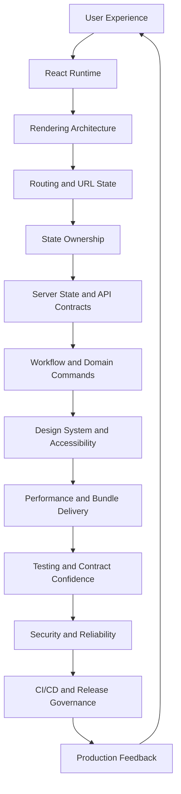
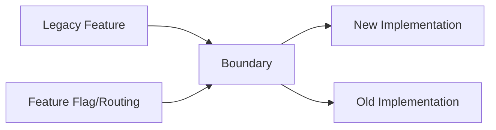
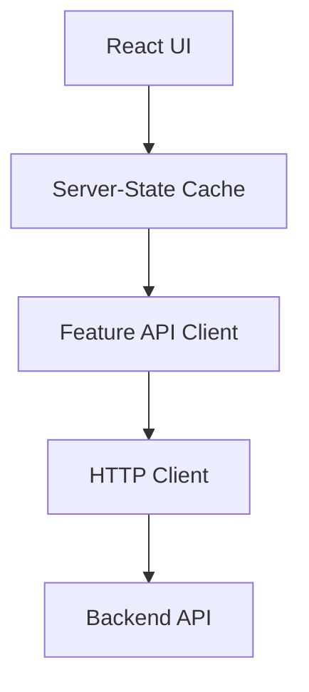
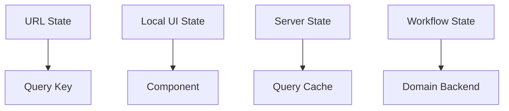
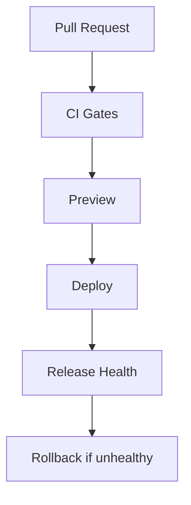

------
title: Learn Frontend React Production Architecture - Part 035
description: Final capstone for React production architecture mastery, including architecture review method, refactoring playbook, technical debt strategy, ADRs, migration planning, production readiness review, and end-to-end capstone project.
series: learn-frontend-react-production-architecture
seriesTitle: Learn Frontend React Production Architecture
order: 35
partTitle: Architecture Review, Refactoring Playbook, and Final Capstone
tags:
- react
- frontend
- architecture-review
- refactoring
- capstone
- technical-debt
- production
- staff-engineering
- series
date: 2026-06-28
---

# Part 035 — Architecture Review, Refactoring Playbook, and Final Capstone

## Tujuan Pembelajaran

Ini adalah part terakhir dari seri **Learn Frontend React Production Architecture**.

Part sebelumnya membangun kompetensi per area:

- runtime React,
- rendering architecture,
- routing,
- state,
- API,
- workflow-heavy UI,
- realtime,
- design system,
- performance,
- testing,
- security,
- accessibility,
- observability,
- CI/CD,
- release governance.

Part ini menyatukan semuanya menjadi kemampuan yang membedakan senior engineer kuat dari engineer biasa:

> kemampuan membaca sistem, menemukan trade-off, mengurangi risk, memandu refactor, membuat keputusan eksplisit, dan membawa aplikasi menuju production excellence tanpa rewrite impulsif.

Kita akan membahas:

1. cara melakukan architecture review,
2. cara menemukan architectural smells,
3. cara membuat decision record,
4. cara memilih refactor vs rewrite,
5. cara membuat migration plan,
6. cara mengelola technical debt,
7. cara membuat production readiness review,
8. cara menyusun capstone project,
9. rubrik self-assessment menuju level top engineer.

---

## 1. The Final Mental Model

Frontend production architecture adalah sistem dari banyak boundary.



A top engineer does not optimize one box in isolation. They reason about how a change in one layer affects the whole system.

Example:

- moving filters to URL affects routing, query keys, caching, tests, analytics, accessibility, and deep links.
- marking a root layout as `'use client'` affects bundle, hydration, performance, RSC boundaries, and delivery.
- adding optimistic approval affects workflow correctness, audit, conflict handling, cache invalidation, and observability.
- introducing a design system Dialog affects focus management, tests, Storybook, visual regression, and accessibility.
- adding a chart library affects route chunk, bundle budget, CI, performance, and dependency governance.

Architecture is the management of consequences.

---

## 2. What Architecture Review Is

Architecture review is not a meeting where senior engineers say “I like this” or “I don't like this”.

Architecture review is a disciplined process to answer:

1. What problem are we solving?
2. What constraints matter?
3. What options exist?
4. What trade-offs do we accept?
5. What risks are introduced?
6. What future changes become easier or harder?
7. What quality attributes are affected?
8. What is the migration path?
9. How will we know it works?
10. How will we rollback if wrong?

Architecture review should produce clarity, not bureaucracy.

---

## 3. Quality Attribute Lens

Review every design through quality attributes.

| Attribute | Frontend Question |
|---|---|
| Correctness | Does UI represent true domain state? |
| Reliability | What happens when API/realtime/chunk fails? |
| Performance | What is the cost in JS, render, network, hydration? |
| Accessibility | Can all users operate and understand it? |
| Security | Does it expose or trust data incorrectly? |
| Maintainability | Can future engineers safely change it? |
| Testability | Can we test the behavior at right level? |
| Observability | Can we detect production failure? |
| Evolvability | Can the architecture handle future change? |
| Operability | Can we deploy, rollback, and support it? |
| Usability | Does it make the workflow clear? |
| Compatibility | Does it work across supported browsers/devices? |

A decision that improves one attribute may hurt another.

Example:

- aggressive code splitting improves initial bundle but can hurt route transition.
- optimistic UI improves perceived speed but can hurt correctness/audit.
- heavy generic DataTable improves reuse but hurts bundle/performance/maintainability.
- server rendering improves LCP but can increase operational complexity.
- global store simplifies access but can hurt ownership and re-render performance.

Architecture review makes trade-offs explicit.

---

## 4. Architecture Review Levels

Not every change needs same review depth.

| Level | Example | Review |
|---|---|---|
| Small | add Button variant | design-system checklist |
| Medium | new route with API fetch | route/state/API review |
| Large | introduce new server-state library | ADR + spike + migration plan |
| Critical | auth/session strategy | security review + ADR |
| Platform | monorepo restructure | architecture council/staff review |
| High-risk workflow | approval/rejection process | domain/security/audit review |

Avoid over-reviewing small changes. Avoid under-reviewing irreversible architecture changes.

---

## 5. Architecture Review Checklist

Use this as general review template.

### Problem

1. What user/business problem is solved?
2. What non-goals are explicit?
3. What constraints exist?
4. What is the expected lifetime of solution?

### Runtime and Rendering

5. Is this SPA/SSR/RSC/route-loader/client-only?
6. What code runs server vs client?
7. Are client boundaries minimal?
8. Is hydration cost understood?

### Routing and State

9. What belongs in URL?
10. What state category is introduced?
11. Who owns each state?
12. What resets/persists on navigation/logout?

### Data and API

13. What API contracts are required?
14. Are query keys complete?
15. What invalidates data?
16. Are errors normalized?
17. Are 401/403/404/409/422 handled distinctly?

### Workflow

18. Is domain state backend-owned?
19. Are commands versioned/idempotent?
20. Are available actions authoritative or hints?
21. Is audit trail considered?

### UI and Accessibility

22. Is design system used?
23. Are interaction primitives accessible?
24. Are loading/error/empty states designed?
25. Is keyboard/focus behavior defined?

### Performance

26. What bundle/chunk impact?
27. What render/perf risk?
28. Are budgets affected?
29. Are heavy dependencies lazy-loaded?

### Security

30. What data is sensitive?
31. Are route guards only UX?
32. Are XSS/CSRF/CORS/token risks handled?
33. Are logs/telemetry redacted?

### Testing

34. What unit/component/integration/E2E tests?
35. Are contract tests needed?
36. Are mocks contract-backed?
37. Are accessibility tests included?

### Reliability and Delivery

38. What can fail?
39. Are error boundaries placed correctly?
40. What telemetry is emitted?
41. Is rollback/flag strategy defined?
42. Are release gates updated?

### Decision

43. What alternatives were rejected?
44. What trade-offs are accepted?
45. What follow-up cleanup is required?

---

## 6. Architectural Smells

Architectural smell is a symptom that design may be degrading.

### 6.1 God Component

One component owns:

- data fetching,
- state,
- forms,
- workflow rules,
- API calls,
- layout,
- modals,
- permissions,
- transformations,
- error handling.

Smell:

```tsx
CaseDetailPage.tsx // 2500 lines
```

Refactor into:

- route loader/query,
- page composition,
- view model,
- action dialogs,
- feature sections,
- hooks,
- API boundary,
- reducers.

### 6.2 God Store

One store owns:

- server data,
- form state,
- URL filters,
- modals,
- auth,
- theme,
- workflow state.

Refactor by state taxonomy.

### 6.3 Fetch in Components Everywhere

Raw `fetch()` in many components.

Refactor to:

- shared HTTP client,
- feature API modules,
- server-state hooks,
- error normalization.

### 6.4 URL-Ignorant View State

Filters/page/sort stored locally only. User cannot share/reload.

Refactor to URL state + parser + query keys.

### 6.5 Global Provider Soup

Many providers with unclear purpose and broad updates.

Refactor by ownership/frequency and document provider contract.

### 6.6 Client Boundary Too High

Root/layout/page marked `'use client'` unnecessarily.

Refactor server-safe parts into Server Components and isolate client islands.

### 6.7 Design System Escape Hatch Everywhere

Every consumer overrides component styles.

Refactor component API/variants/tokens.

### 6.8 Tests Mock Internals

Tests mock hooks/components instead of API boundary.

Refactor tests to user behavior + HTTP mock.

### 6.9 Performance Regression Hidden

No bundle budgets, no Web Vitals, no profiler evidence.

Add measurement and budget gates.

### 6.10 Security by UI

Frontend hides button and assumes action protected.

Backend must enforce; frontend only improves UX.

---

## 7. Smell-to-Refactor Map

| Smell | Likely Root Cause | Refactor |
|---|---|---|
| God component | no boundary discipline | split route/page/sections/forms |
| God store | wrong state taxonomy | classify and move state |
| fetch in UI | missing API boundary | API module + query hooks |
| duplicate derived state | misunderstanding React state | compute during render/useMemo |
| boolean explosion | missing state machine | discriminated union/reducer |
| global modal state | local state too high | localize to feature/action |
| stale data after mutation | missing invalidation map | query keys + invalidation helpers |
| slow typing | state too high/list too big | colocation/defer/virtualize |
| inaccessible dialog | custom primitive | design system accessible Dialog |
| chunk errors after deploy | asset retention/cache policy | deployment governance |
| flaky tests | poor async/data isolation | deterministic waits/data |
| source maps missing | release pipeline gap | upload/verify maps |

---

## 8. Refactor vs Rewrite

The instinct to rewrite is often dangerous.

Rewrite can be justified when:

- current architecture blocks critical business goals,
- incremental refactor cost exceeds replacement,
- system is small enough,
- migration path is clear,
- parity can be verified,
- team has capacity,
- old/new can coexist,
- rollback is possible.

Rewrite is dangerous when:

- behavior is poorly understood,
- tests are weak,
- domain rules are implicit,
- no migration plan,
- business cannot pause,
- team underestimates edge cases,
- old system still changing,
- no observability.

Default stance:

> Prefer strangler-style incremental migration unless there is strong evidence rewrite is safer.

---

## 9. Strangler Fig Refactoring

Strangler approach replaces system piece by piece.



Steps:

1. identify boundary,
2. add tests/observability,
3. wrap old behavior,
4. build new implementation behind flag,
5. route subset of traffic/users,
6. compare behavior,
7. migrate gradually,
8. remove old code.

Useful for:

- routing migration,
- state store migration,
- design system migration,
- API client migration,
- table component migration,
- Next/Vite architecture migration,
- legacy class component migration.

---

## 10. Refactoring Safety Net

Before major refactor:

1. characterization tests,
2. Storybook stories,
3. visual snapshots,
4. E2E critical flows,
5. API contract tests,
6. telemetry baseline,
7. bundle/performance baseline,
8. feature flag,
9. rollback plan.

Refactor without safety net is gambling.

---

## 11. Characterization Tests

Characterization test captures current behavior before changing code.

Example:

```tsx
test("case filters preserve status and page in URL", async () => {
  renderAppAt("/cases?status=UNDER_REVIEW&page=2");

  expect(screen.getByRole("combobox", { name: /status/i }))
    .toHaveValue("UNDER_REVIEW");

  expect(screen.getByRole("navigation", { name: /pagination/i }))
    .toHaveTextContent("Page 2");
});
```

It does not prove current behavior is ideal. It prevents accidental behavior loss during refactor.

---

## 12. Migration Plan Template

Use this template for high-risk refactor.

```md
# Migration Plan: <Name>

## Problem

## Current Architecture

## Target Architecture

## Non-goals

## Risks

## Safety Net

- tests:
- observability:
- feature flags:
- rollback:

## Migration Steps

1.
2.
3.

## Compatibility Strategy

## Data/State Migration

## Performance Impact

## Security/Accessibility Impact

## Release Plan

## Cleanup Plan

## Success Metrics
```

A migration without cleanup plan creates permanent hybrid complexity.

---

## 13. ADR Template

Architecture Decision Record:

```md
# ADR: Use TanStack Query for Server State

## Status

Accepted

## Context

We currently fetch server data manually in components and store some API responses in Redux. This creates duplicate requests, stale data, and inconsistent error handling.

## Decision

Use TanStack Query as primary server-state cache for client-rendered routes. Keep Redux/Zustand for client-owned state only.

## Alternatives

1. Keep manual fetching.
2. Use RTK Query.
3. Use React Router loaders only.
4. Use custom cache.

## Consequences

Positive:
- standard query keys,
- invalidation,
- retry/stale semantics,
- better devtools.

Negative:
- new dependency,
- team learning curve,
- migration effort,
- cache behavior must be governed.

## Follow-up

- define query key convention,
- migrate case detail route,
- add testing helpers,
- document mutation invalidation.
```

ADR should be short enough to read and clear enough to guide future decisions.

---

## 14. Technical Debt Taxonomy

Not all debt is same.

| Debt Type | Example |
|---|---|
| code debt | duplicated utility |
| design debt | inconsistent interaction patterns |
| architecture debt | wrong state ownership |
| test debt | no integration tests |
| performance debt | large bundle, slow route |
| accessibility debt | custom inaccessible menu |
| security debt | unsafe HTML rendering |
| observability debt | errors not reported |
| delivery debt | flaky CI, no rollback |
| documentation debt | no ADRs/guides |

Debt should be categorized because mitigation differs.

---

## 15. Debt Register

Maintain debt register for significant debt.

```md
# Debt: Case list filters stored in local state

## Category
Routing / State ownership

## Impact
Users cannot share/reload filtered view. Query keys duplicated. Tests fragile.

## Risk
Medium. Affects case workflow productivity.

## Proposed Fix
Move filters to URL with parser/serializer and query key integration.

## Owner
Frontend Cases Team

## Target
Q3

## Dependencies
Route refactor, query key factory.

## Exit Criteria
All case list filters represented in URL and tested.
```

Debt without owner/date is wishful thinking.

---

## 16. Refactoring Prioritization

Prioritize by:

- user impact,
- delivery impact,
- risk reduction,
- frequency of change,
- defect history,
- performance/security/accessibility severity,
- migration cost,
- strategic direction.

High priority debt:

- blocks critical roadmap,
- causes repeated bugs,
- creates security/accessibility risk,
- slows every feature,
- prevents reliable release.

Low priority debt:

- ugly but stable,
- rarely touched,
- no user impact,
- costly to fix.

Do not refactor everything just because it is imperfect.

---

## 17. Architecture Fitness Functions

Fitness function is an automated check that architecture property remains true.

Examples:

- bundle budget,
- import boundary rule,
- no raw `fetch()` outside API module,
- no `dangerouslySetInnerHTML` without sanitizer wrapper,
- no `AppContext` import in feature packages,
- no feature import inside design system,
- no route without error boundary,
- Storybook build passes,
- accessibility tests pass,
- generated OpenAPI client up to date,
- no circular dependencies.

Fitness functions turn architecture into executable constraints.

---

## 18. Example Import Boundary Fitness Function

Rule:

```txt
packages/ui must not import features/*
```

Enforce with ESLint/import rules or architecture test.

Pseudo:

```ts
expectArchitecture()
  .module("packages/ui")
  .notToDependOn("features/*");
```

When a PR violates rule, CI fails early.

Architecture without enforcement decays under pressure.

---

## 19. Production Readiness Review

Before launching major feature, review:

### User Experience

- happy path,
- loading,
- empty,
- error,
- conflict,
- forbidden,
- offline/retry,
- responsive,
- accessibility.

### Architecture

- routing,
- state ownership,
- API contracts,
- server-state cache,
- command lifecycle,
- design system usage.

### Quality

- tests,
- Storybook,
- visual regression,
- contract tests,
- E2E smoke.

### Security

- sensitive data,
- authz,
- XSS,
- CSRF/CORS,
- logs,
- storage.

### Performance

- bundle impact,
- render cost,
- Web Vitals/route metrics,
- heavy dependencies,
- budgets.

### Reliability

- error boundaries,
- telemetry,
- runbooks,
- rollback,
- feature flag.

### Delivery

- CI gates,
- deployment strategy,
- source maps,
- cache policy,
- monitoring dashboard.

---

## 20. Production Readiness Checklist

Use this as launch gate.

1. Route deep links work.
2. Reload works on every route.
3. Back/forward behavior correct.
4. URL state canonicalized.
5. Server state query keys complete.
6. Mutations invalidate affected data.
7. 401/403/404/409/422 handled.
8. Workflow commands versioned/idempotent where needed.
9. Forms accessible and validated.
10. Dialogs focus-managed.
11. Loading/error/empty states designed.
12. Keyboard-only flow works.
13. Core accessibility checks pass.
14. Bundle budget checked.
15. Heavy dependencies lazy-loaded.
16. Performance baseline captured.
17. Security review completed.
18. Sensitive data not logged/persisted.
19. Error boundaries placed.
20. Telemetry events emitted.
21. Source maps uploaded.
22. Feature flag/rollback plan defined.
23. E2E smoke passes.
24. Contract tests pass if API changes.
25. Owner/runbook documented.

---

## 21. Code Review as Architecture Practice

Every PR review can reinforce architecture.

Look beyond syntax:

- Is state owned by the right layer?
- Is API boundary respected?
- Is component API reusable and accessible?
- Are errors handled as states?
- Does this add hidden coupling?
- Does this change bundle size?
- Does this need ADR?
- Does this weaken security?
- Does this bypass test strategy?
- Does this create future migration burden?

Good review comment:

```txt
This filter state should likely live in URL because users need shareable/reloadable case queues. Could we introduce parseCaseFilters/serializeCaseFilters and use that as query key input?
```

Bad review comment:

```txt
I don't like this.
```

Architecture review should explain principles and trade-offs.

---

## 22. Staff-Level Review Questions

Staff-level engineer asks:

1. What happens when this fails?
2. What is the smallest correct boundary?
3. What future change are we optimizing for?
4. What future change are we making harder?
5. What does this do to blast radius?
6. What is the operational story?
7. What will the next engineer misunderstand?
8. What tests would catch the most likely regression?
9. What metric will prove this works?
10. How do we undo it?

These questions reveal architecture maturity.

---

## 23. Communication Artifacts

Top engineers communicate through artifacts.

Artifacts:

- ADR,
- architecture diagram,
- migration plan,
- risk matrix,
- testing strategy,
- rollout plan,
- runbook,
- checklist,
- Storybook examples,
- performance report,
- postmortem,
- decision matrix.

Artifacts reduce repeated explanation and align teams.

---

## 24. Architecture Diagram Patterns

Useful diagrams:

### Runtime Boundary



### State Ownership



### Release Flow



Diagram should clarify decisions, not decorate docs.

---

## 25. Final Capstone Overview

Final capstone is a realistic production design exercise.

You will design and partially implement a **Regulatory Case Management Frontend**.

This capstone forces integration of all 35 parts.

### Product Context

Users:

- officer,
- reviewer,
- supervisor,
- auditor,
- admin.

Core workflows:

- view assigned cases,
- filter/sort/paginate case queue,
- open case detail,
- review evidence,
- approve/reject/request information,
- see audit timeline,
- receive realtime updates,
- handle conflicts,
- export report,
- manage permissions,
- observe release health.

Quality requirements:

- accessible,
- secure,
- observable,
- performant,
- testable,
- deployable,
- resilient.

---

## 26. Capstone Architecture Requirements

You must produce:

1. architecture diagram,
2. route map,
3. state ownership table,
4. API contract sketch,
5. query key strategy,
6. command/mutation strategy,
7. design system component list,
8. accessibility plan,
9. security threat model,
10. performance budget,
11. testing portfolio,
12. observability plan,
13. CI/CD pipeline,
14. rollout/rollback plan,
15. ADRs for major decisions,
16. refactoring/debt plan.

Optional implementation:

- case list route,
- case detail route,
- approve case dialog,
- audit timeline,
- realtime invalidation,
- Storybook stories,
- tests,
- bundle budget.

---

## 27. Capstone Route Map

Example:

```txt
/login
/cases
/cases/:caseId
/cases/:caseId/overview
/cases/:caseId/evidence
/cases/:caseId/audit
/reports
/admin/users
/settings/profile
```

Route principles:

- `/cases` filters in URL,
- `/cases/:caseId/*` deep-linkable,
- major tabs route-based,
- modal actions local state unless shareable,
- forbidden/not-found handled,
- reload works on every route.

---

## 28. Capstone State Ownership Table

| State | Owner | Reason |
|---|---|---|
| case queue filters | URL | shareable/reloadable |
| case list result | server-state cache | backend-owned |
| selected table rows | route/local table state | UI interaction |
| case status | backend/domain | workflow authority |
| available actions | backend response | UX hint, server revalidates |
| approval reason | form state | local draft |
| approve pending | mutation state | command lifecycle |
| conflict state | form/command error | submit outcome |
| audit timeline | server-state/realtime | backend-owned history |
| sidebar collapsed | shell preference | user preference |
| current user | auth provider/server-state | session display |
| permissions | backend/auth context | server authority |
| realtime connection | subscription state | UI freshness |
| theme | persistent preference | safe local persistence |

---

## 29. Capstone API Contract Sketch

### Case List

```http
GET /cases?status=&page=&pageSize=&sort=
```

Response:

```ts
type CaseListResponse = {
  items: CaseListItemDto[];
  page: number;
  pageSize: number;
  total: number;
};
```

### Case Detail

```http
GET /cases/{caseId}
```

Response includes:

```ts
type CaseDetailDto = {
  id: string;
  referenceNo: string;
  status: CaseStatus;
  version: number;
  subjectName: string;
  availableActions: CaseActionAvailabilityDto[];
  sla: SlaDto;
};
```

### Approve Case

```http
POST /cases/{caseId}/approve
Idempotency-Key: uuid

{
  "expectedVersion": 7,
  "reason": "Reviewed and approved."
}
```

Responses:

- `200` success,
- `403` forbidden,
- `409` conflict,
- `422` validation,
- `500` server error.

---

## 30. Capstone Query Key Strategy

```ts
const caseKeys = {
  all: ["cases"] as const,
  lists: () => [...caseKeys.all, "list"] as const,
  list: (filters: CaseFilters) => [...caseKeys.lists(), filters] as const,
  detail: (caseId: string) => [...caseKeys.all, "detail", caseId] as const,
  timeline: (caseId: string) => [...caseKeys.detail(caseId), "timeline"] as const,
};
```

After approval:

```ts
function invalidateAfterCaseCommand(
  queryClient: QueryClient,
  caseId: string
) {
  queryClient.invalidateQueries({ queryKey: caseKeys.detail(caseId) });
  queryClient.invalidateQueries({ queryKey: caseKeys.timeline(caseId) });
  queryClient.invalidateQueries({ queryKey: caseKeys.lists() });
  queryClient.invalidateQueries({ queryKey: dashboardKeys.caseMetrics() });
}
```

---

## 31. Capstone Component Architecture

```txt
CaseListRoute
  CaseListPage
    CaseListToolbar
    CaseFilterBar
    CaseTable
    Pagination

CaseDetailRoute
  CaseDetailPage
    CaseHeader
    CaseStatusPanel
    CaseActionArea
      ApproveCaseDialog
      RejectCaseDialog
      RequestInformationDialog
    CaseContentTabs
      OverviewPanel
      EvidencePanel
      AuditTimeline
```

Rules:

- route owns data loading,
- page composes sections,
- feature components own domain display,
- design system components stay domain-neutral,
- dialogs own form state,
- backend owns workflow state.

---

## 32. Capstone Design System Requirements

Components:

- Button,
- IconButton,
- Badge,
- Alert,
- Dialog,
- DropdownMenu,
- Tabs,
- TextField,
- TextArea,
- Checkbox,
- Select,
- FormField,
- PageHeader,
- EmptyState,
- ErrorState,
- Skeleton,
- DataTable primitives,
- Timeline primitives,
- Toast/Notification region,
- SkipLink,
- FocusRing.

Stories:

- default,
- disabled,
- loading,
- invalid,
- long text,
- keyboard interaction,
- mobile,
- high contrast/reduced motion where relevant.

Accessibility:

- no clickable div,
- dialogs focus-managed,
- form errors associated,
- statuses not color-only,
- route focus managed.

---

## 33. Capstone Security Threat Model

Threats and controls:

| Threat | Control |
|---|---|
| unauthorized approval | backend authorization |
| hidden button bypass | backend still validates |
| stale approval | expectedVersion + 409 |
| duplicate approval | idempotency key |
| XSS in notes/reason | output encoding/sanitization |
| CSRF approval | CSRF controls for cookie auth |
| open redirect after login | sanitize internal returnTo |
| sensitive cache after logout | clear query cache/stores |
| source map exposure | controlled upload/access |
| realtime tenant leak | topic authorization |
| telemetry PII leak | redaction policy |
| chunk load failure | old asset retention + fallback |

---

## 34. Capstone Accessibility Plan

Must support:

- keyboard-only approval workflow,
- skip link,
- landmarks,
- route focus,
- accessible case table,
- labelled forms,
- error summary,
- dialog focus trap,
- status labels,
- timeline semantic list,
- realtime updates not over-announced,
- conflict banner with next actions,
- zoom/responsive behavior.

Manual smoke:

```txt
Tab -> skip to main -> filter cases -> open case -> action menu -> approve dialog -> invalid submit -> fix reason -> submit -> success.
```

---

## 35. Capstone Performance Budget

Example:

```txt
Initial authenticated shell:
  JS gzip <= 300KB
  shell visible <= 3s p75 target users

Case list:
  route transition cached <= 500ms perceived
  filter input INP <= 200ms
  table supports 1000 rows via pagination/virtualization strategy

Case detail:
  critical summary visible <= 1.5s p75 after navigation
  audit timeline lazy/paginated
  PDF viewer lazy-loaded

Bundle:
  chart/report/editor/pdf libraries not in initial chunk
  route chunk budgets enforced in CI

Reliability:
  chunk load error < 0.05%
```

---

## 36. Capstone Testing Portfolio

| Behavior | Unit | Component | Integration | E2E |
|---|---:|---:|---:|---:|
| URL filter parsing | yes | no | yes | maybe |
| status view mapping | yes | yes | no | no |
| approval reducer/schema | yes | yes | no | no |
| approve form validation | yes | yes | yes | yes smoke |
| approve success | no | yes | yes | yes critical |
| 409 conflict | yes | yes | yes | maybe |
| forbidden action | yes | yes | yes | yes smoke |
| query invalidation | no | no | yes | no |
| route deep link | no | no | yes | yes |
| dialog focus | no | yes | yes | yes smoke |
| audit timeline realtime | unit event | component | yes | no |
| API contract | yes | no | contract | maybe |

Also:

- Storybook visual tests,
- accessibility tests,
- bundle budget,
- source map upload check,
- deployment smoke.

---

## 37. Capstone Observability Plan

Telemetry events:

```txt
case_list_loaded
case_detail_loaded
case_approval_opened
case_approval_submitted
case_approval_succeeded
case_approval_failed
case_conflict_shown
realtime_reconnected
chunk_load_failed
route_error_boundary_shown
```

Metrics:

- case detail load latency,
- approval success/failure rate,
- 403/409/422 rates,
- route transition p75/p95,
- Web Vitals by route,
- JS error rate by release,
- chunk load failure rate,
- realtime reconnect duration.

Redaction:

- no approval reason,
- no full case subject if sensitive,
- route patterns not raw sensitive URLs,
- no tokens,
- no full API payload.

---

## 38. Capstone CI/CD Plan

PR gates:

1. typecheck,
2. lint/import boundary,
3. unit tests,
4. component/integration tests,
5. Storybook build,
6. accessibility checks,
7. app build,
8. bundle budget,
9. E2E smoke for affected route,
10. dependency/security scan.

Release:

1. build once,
2. upload source maps,
3. deploy preview/staging,
4. run smoke,
5. promote to production,
6. monitor release health,
7. rollback/disable flag if unhealthy.

Deployment:

- hashed assets immutable,
- `index.html` no-cache,
- old assets retained,
- runtime config validated,
- chunk load fallback.

---

## 39. Capstone ADRs

Write at least these ADRs:

1. Rendering Architecture: SPA vs Next App Router/RSC.
2. Server-State Strategy: TanStack Query/RTK Query/Router loaders.
3. State Ownership: URL/form/server/global taxonomy.
4. Design System: accessible primitives and Storybook.
5. Testing Strategy: component/integration/E2E portfolio.
6. Security/Auth: session/token and CSRF model.
7. Delivery: static asset cache and release strategy.

Each ADR should include alternatives and consequences.

---

## 40. Final Capstone Deliverables

Minimum deliverables:

```txt
/docs/architecture/
  frontend-architecture-overview.md
  adr-001-rendering-strategy.md
  adr-002-server-state-strategy.md
  adr-003-design-system-strategy.md
  production-readiness-checklist.md

/src/
  shared/ui/
  shared/api/
  features/cases/
  app/routes/

/tests/
  unit/
  integration/
  e2e/

/storybook/
```

Implementation minimum:

- case list route,
- case detail route,
- approve dialog,
- API mock,
- query keys,
- conflict handling,
- Storybook stories,
- unit/component/integration tests,
- accessibility check,
- bundle budget.

---

## 41. Capstone Evaluation Rubric

Score 1–5.

| Area | 1 | 3 | 5 |
|---|---|---|---|
| Routing | local-only state | deep links mostly work | URL canonical, reload/back tested |
| State | mixed/global | mostly classified | explicit ownership table and clean boundaries |
| API | raw fetch | feature API wrapper | typed contracts, error normalization, tests |
| Workflow | local status | backend command | version/idempotency/audit/conflict |
| Design System | ad hoc UI | shared components | accessible governed primitives |
| Accessibility | basic labels | keyboard mostly works | invariant with tests/manual review |
| Performance | no budget | some lazy loading | measured budgets and CI gates |
| Testing | unit only | integration present | portfolio by risk + contract/E2E |
| Security | route guards | backend authz known | threat model + controls/tests |
| Observability | console logs | error tracking | release/domain metrics/runbooks |
| Delivery | manual deploy | CI build/test | reproducible release/rollback/governance |
| Documentation | none | README | ADRs/diagrams/checklists |

Goal: reach 4–5 in most categories.

---

## 42. Top 1% Frontend Engineer Behaviors

A top frontend engineer:

1. classifies state before choosing library,
2. treats URL as product contract,
3. separates command and query,
4. respects backend authority,
5. designs accessible primitives,
6. measures performance before optimizing,
7. knows bundle/delivery cost,
8. writes tests at right level,
9. models security threats explicitly,
10. builds observability into features,
11. communicates decisions through ADRs,
12. avoids rewrite impulses without migration plan,
13. turns repeated review feedback into automated gates,
14. designs rollback before release,
15. teaches team mental models, not just code snippets.

Technical excellence is not just knowing APIs. It is making systems easier to change safely.

---

## 43. Final Self-Assessment

You are ready to call yourself advanced in React production architecture if you can answer all of these without hand-waving:

1. Where should each state live and why?
2. What data is source of truth?
3. What happens on refresh/deep link/back button?
4. What happens when API fails?
5. What happens when another user changes data?
6. What happens when a workflow command conflicts?
7. What happens when a chunk fails to load?
8. What happens when user logs out?
9. What happens when route crashes?
10. What happens when user uses keyboard only?
11. What happens when malicious input is rendered?
12. What happens when dependency adds 200KB?
13. What happens when backend adds enum value?
14. What happens when release causes error spike?
15. What happens when feature flag must be rolled back?
16. What tests prove the critical behavior?
17. What telemetry proves production health?
18. What ADR explains the decision?
19. What migration path avoids big-bang risk?
20. What automated gate prevents regression?

If you can answer these, you are operating beyond component-level React.

---

## 44. Recommended Ongoing Practice

Weekly practice:

- profile one slow interaction,
- review one API boundary,
- audit one component for accessibility,
- improve one Storybook story,
- remove one unnecessary dependency/import,
- add one missing error state test,
- write one small ADR,
- review one production error,
- reduce one piece of technical debt.

Monthly practice:

- run bundle review,
- run accessibility audit,
- review Web Vitals,
- review flaky tests,
- review feature flags,
- update dependency risk,
- clean dead code,
- revisit architecture boundaries.

Quarterly practice:

- production readiness review,
- threat modeling workshop,
- design system governance review,
- CI/CD pipeline audit,
- incident/postmortem review,
- roadmap/debt prioritization.

Mastery comes from repeated feedback loops.

---

## 45. How to Use This 35-Part Series

Suggested sequence after reading:

### Pass 1 — Conceptual Map

Read all parts lightly. Build vocabulary and mental model.

### Pass 2 — Apply to One App

Pick existing app. For each part, audit one area.

Example:

- Part 013: audit URL state.
- Part 015: state ownership table.
- Part 020: API boundary.
- Part 026: performance budget.
- Part 031: threat model.

### Pass 3 — Capstone Implementation

Build simplified case management app with:

- routes,
- query cache,
- workflow command,
- design system primitives,
- tests,
- observability hooks,
- release checklist.

### Pass 4 — Teach Back

Create internal workshop:

- state taxonomy,
- server-state cache,
- accessible dialog,
- bundle budget,
- architecture review.

Teaching forces clarity.

---

## 46. Final Summary

React production architecture is not about memorizing hooks or choosing the trendiest framework.

It is about building frontend systems that are:

- correct,
- understandable,
- accessible,
- secure,
- fast enough,
- observable,
- testable,
- evolvable,
- deployable,
- recoverable,
- aligned with domain truth.

The best React engineers do not merely write components. They design systems where components, state, routes, APIs, tests, performance, security, accessibility, and delivery all reinforce each other.

The final skill is not knowing every answer instantly. The final skill is knowing the right questions, the right trade-offs, and the right feedback loops.

---

## 47. Sumber Rujukan

- React Docs — Thinking in React
- React Docs — Managing State
- React Docs — Performance APIs
- React Docs — Error Boundaries via Component
- W3C WCAG 2.2
- W3C WAI-ARIA Authoring Practices Guide
- OWASP Top 10
- OWASP Cheat Sheet Series
- OpenTelemetry Docs
- web.dev — Core Web Vitals and Performance Budgets
- Storybook Docs
- Testing Library Docs
- Playwright Docs
- OpenAPI Specification
- Pact Docs
- Vite Docs
- Next.js Docs
