# Part 001 — Browser as a Distributed Runtime

> Target part ini bukan menghafal API. Targetnya adalah membentuk model mental bahwa aplikasi web modern yang dibuka di banyak tab adalah sistem terdistribusi kecil yang berjalan di atas runtime browser.

Banyak engineer memperlakukan browser seperti satu proses JavaScript sederhana:

```txt
user opens app -> JavaScript runs -> UI updates -> API called
```

Model itu cukup untuk aplikasi kecil. Tetapi begitu aplikasi mulai memiliki beberapa tab, background task, refresh token, offline queue, shared cache, optimistic update, WebSocket, service worker, worker pool, notification, atau IndexedDB, model itu runtuh.

Di level production, browser lebih tepat dipahami sebagai kumpulan execution context yang:

1. bisa hidup bersamaan,
2. bisa mati kapan saja,
3. tidak selalu memiliki visibility yang sama,
4. tidak selalu punya kemampuan API yang sama,
5. berkomunikasi lewat message passing,
6. berbagi sebagian resource berdasarkan origin/storage partition,
7. menjalankan task di event loop yang berbeda,
8. dan dipengaruhi oleh lifecycle browser yang tidak sepenuhnya dikendalikan aplikasi.

Dengan kata lain:

```txt
A browser app is not one process.
It is a fleet of small, unreliable, partially connected replicas.
```

Itulah inti dari seri ini.

---

## 1. Masalah Nyata yang Memaksa Kita Mempelajari Ini

Kita mulai dari kejadian production, bukan definisi API.

### 1.1 Refresh token storm

User membuka aplikasi di 5 tab. Access token expired. Semua tab mendeteksi `401` dalam waktu hampir bersamaan. Semua tab memanggil endpoint refresh token.

Dampaknya:

- server menerima 5 refresh request untuk sesi yang sama,
- refresh token rotation bisa membuat sebagian tab menerima token lama,
- tab A berhasil, tab B gagal karena token sudah dipakai,
- tab C logout user karena mengira refresh gagal permanen,
- tab D masih mengirim request memakai token lama,
- user melihat status login tidak konsisten antar tab.

Akar masalahnya bukan “kurang debounce”. Akar masalahnya adalah tidak ada koordinasi lintas tab.

### 1.2 Duplicate WebSocket connection

User membuka dashboard monitoring di 8 tab. Setiap tab membuka WebSocket sendiri ke backend.

Dampaknya:

- koneksi server meningkat tidak perlu,
- message fan-out membesar,
- event diproses berulang,
- notifikasi muncul berkali-kali,
- battery dan CPU usage naik,
- reconnect storm terjadi saat network flapping.

Masalahnya bukan WebSocket. Masalahnya adalah setiap tab merasa dirinya satu-satunya aplikasi.

### 1.3 Background computation memblokir UI

Aplikasi mengunduh dataset besar, melakukan parsing, filtering, diffing, dan indexing di main thread. Di laptop cepat terlihat baik-baik saja. Di device user, UI freeze.

Dampaknya:

- input delay tinggi,
- animation drop,
- click terasa tidak responsif,
- browser menampilkan “page unresponsive”,
- user refresh atau close tab.

Masalahnya bukan hanya algorithm complexity. Masalahnya adalah pekerjaan berat ditempatkan di thread yang juga bertanggung jawab untuk UI.

### 1.4 Offline queue diproses oleh banyak tab

User offline, membuat beberapa perubahan. Perubahan disimpan di IndexedDB. Saat online kembali, 3 tab aktif dan semuanya membaca queue yang sama lalu mengirim replay ke server.

Dampaknya:

- operasi terkirim ganda,
- server harus melakukan dedup lebih agresif,
- konflik meningkat,
- state lokal antar tab tidak sinkron,
- user melihat data berubah-ubah.

Masalahnya adalah shared durable state tanpa ownership protocol.

### 1.5 Cache update tidak konsisten

Service worker mengunduh versi asset baru. Tab lama masih menjalankan bundle lama. Tab baru menjalankan bundle baru. IndexedDB schema sudah dimigrasi oleh tab baru. Tab lama masih menulis format lama.

Dampaknya:

- runtime error,
- data corruption,
- silent data loss,
- user harus hard refresh,
- bug sulit direproduksi.

Masalahnya adalah deployment frontend sebenarnya adalah distributed rollout di client.

---

## 2. Model Mental Utama: Browser App sebagai Distributed Runtime

Dalam backend distributed system, kita terbiasa dengan istilah seperti node, process, lease, leader election, idempotency, duplicate delivery, partial failure, dan consistency.

Di browser, konsep yang sama muncul dengan nama berbeda.

| Backend distributed system | Browser equivalent |
|---|---|
| node/process | tab, iframe, worker, service worker |
| RPC/message broker | `postMessage`, `BroadcastChannel`, `MessagePort` |
| distributed lock | Web Locks API |
| durable local database | IndexedDB, OPFS, Cache API |
| leader process | selected tab/worker that owns a task |
| node crash | tab close, renderer crash, worker termination |
| network partition | frozen tab, suspended timer, offline mode |
| deployment rollout | service worker update + old/new tabs coexisting |
| heartbeat | tab presence ping |
| lease expiration | stale heartbeat timeout / lock release |
| exactly-once myth | idempotent protocol + dedup key |

Browser orchestration bukan memindahkan semua pattern backend ke frontend secara membabi buta. Tetapi mental model distributed system sangat berguna karena masalahnya sejenis:

- siapa yang berhak mengerjakan sebuah task,
- siapa yang memegang state terbaru,
- bagaimana proses lain diberi tahu,
- bagaimana jika pemegang tugas mati,
- bagaimana mencegah duplicate side effect,
- bagaimana recover tanpa membuat state rusak.

---

## 3. Topologi Besar Runtime Browser

Secara sederhana, satu origin aplikasi bisa memiliki banyak execution context.

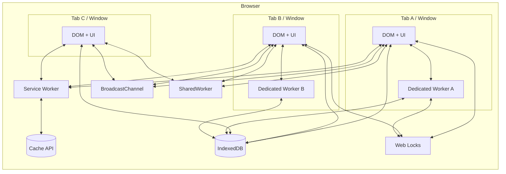

Diagram ini bukan jaminan implementasi process internal browser. Browser bebas mengatur process/thread internalnya. Yang penting bagi aplikasi adalah **model koordinasi**:

- tab bisa lebih dari satu,
- worker bisa per-tab atau shared,
- service worker event-driven,
- storage bisa dibaca banyak context,
- komunikasi terjadi lewat message passing,
- browser dapat membatasi atau menghentikan eksekusi context tertentu.

---

## 4. Primitive vs System

Kesalahan umum adalah belajar API satu per satu, lalu menganggap masalah selesai.

Contoh:

```txt
Need cross-tab communication? Use BroadcastChannel.
Need background work? Use Web Worker.
Need offline? Use Service Worker.
Need shared data? Use IndexedDB.
Need locking? Use Web Locks.
```

Itu benar secara lokal, tapi belum cukup secara sistem.

API adalah primitive. Production behavior lahir dari kombinasi primitive + protocol + lifecycle handling.

| Primitive | Yang diberikan | Yang tidak diberikan |
|---|---|---|
| `postMessage` | async message passing | durability, retry, schema evolution |
| `BroadcastChannel` | pub/sub same-origin/storage-partition | history, guaranteed delivery to future contexts |
| Dedicated Worker | background thread per owner | cross-tab sharing, persistence |
| SharedWorker | hub untuk banyak context | universal support/availability assumption |
| Service Worker | network/cache proxy event-driven | always-running background process |
| Web Locks | mutual exclusion same-origin | business-level correctness otomatis |
| IndexedDB | durable structured storage | conflict resolution otomatis |
| SharedArrayBuffer | shared memory | safety, protocol, portability tanpa isolation |

Top 1% engineer tidak berhenti di “pakai API X”. Mereka bertanya:

1. Apa invariant-nya?
2. Apa failure mode-nya?
3. Apa state transition-nya?
4. Apa delivery semantics-nya?
5. Apa rollback/recovery path-nya?
6. Apa observability signal-nya?
7. Apa fallback jika primitive tidak tersedia?

---

## 5. Invariant Dasar Multi-Tab Orchestration

Invariant adalah aturan yang harus tetap benar walaupun tab dibuka banyak, worker mati, network flapping, atau user menutup browser.

### 5.1 Tidak boleh ada single tab yang dianggap immortal

Salah:

```txt
Tab pertama yang dibuka akan selalu menjadi owner background sync.
```

Benar:

```txt
Tab mana pun boleh menjadi owner sementara.
Ownership harus punya lease, heartbeat, atau lock.
Jika owner hilang, context lain harus bisa mengambil alih.
```

### 5.2 Message bukan storage

`BroadcastChannel` bagus untuk menyebar sinyal. Tetapi sinyal tidak sama dengan state durable.

Salah:

```txt
Tab baru akan tahu state terakhir karena tab lain pernah broadcast.
```

Benar:

```txt
Broadcast adalah notification.
State authoritative harus bisa dibaca ulang dari sumber durable: memory owner, IndexedDB, server, atau cache version store.
```

### 5.3 Background tab bukan active worker yang bisa dipercaya

Hidden tab bisa mengalami throttling, freeze, discard, atau termination tergantung browser dan kondisi device. Artinya timer, polling, dan callback tidak boleh menjadi satu-satunya mekanisme correctness.

Salah:

```txt
setInterval heartbeat setiap 2 detik pasti jalan.
```

Benar:

```txt
Heartbeat adalah hint. Liveness harus memakai timeout konservatif, ownership recovery, dan idempotent side effect.
```

### 5.4 Worker bukan database

Worker memory bisa hilang. Dedicated worker mati saat owner terminate. Shared worker juga tidak boleh dianggap durable. Service worker bahkan secara desain event-driven dan dapat dimatikan ketika idle.

Salah:

```txt
Queue penting disimpan di memory worker.
```

Benar:

```txt
Queue penting disimpan di IndexedDB/OPFS/server. Worker hanya executor/coordinator.
```

### 5.5 Side effect harus idempotent

Begitu ada banyak tab, retry, resume, dan replay, duplicate side effect adalah normal.

Salah:

```txt
Klik bayar -> request dikirim sekali.
```

Benar:

```txt
Operasi critical memakai idempotency key. Client dan server menyepakati dedup semantics.
```

### 5.6 Deployment frontend adalah migrasi bertahap

Tidak semua tab menjalankan bundle versi yang sama. Old tab dan new tab bisa hidup bersamaan selama menit, jam, bahkan hari.

Salah:

```txt
Setelah deploy, semua client otomatis memakai schema baru.
```

Benar:

```txt
Schema migration harus kompatibel lintas versi, punya version gate, dan tidak merusak tab lama.
```

---

## 6. Browser Lifecycle adalah Bagian dari Correctness

Aplikasi backend biasanya berjalan dalam runtime yang relatif eksplisit: process start, health check, SIGTERM, restart. Di browser, lifecycle lebih liar.

Sebuah page bisa berada di kondisi:

- active,
- passive,
- hidden,
- frozen,
- discarded,
- terminated,
- restored via back/forward cache.

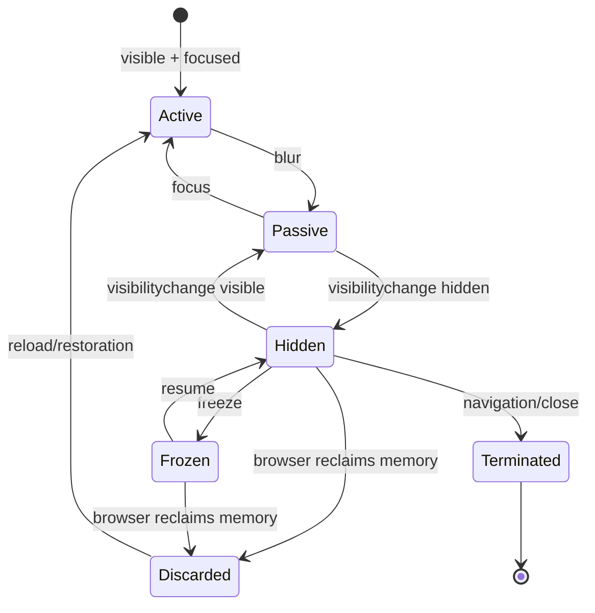

Konsekuensinya:

1. `visibilitychange` ke hidden sering menjadi momen terakhir yang relatif reliable untuk persist state.
2. `unload` tidak boleh dijadikan fondasi correctness.
3. Freeze dapat menghentikan freezable tasks seperti timer dan callback tertentu.
4. Discard tidak memberi kesempatan JavaScript untuk cleanup.
5. State penting harus sudah durable sebelum lifecycle menjadi tidak observable.

Di seri ini, lifecycle diperlakukan sebagai **fault model**, bukan fitur kosmetik.

---

## 7. Layer Arsitektur Browser-Orchestrated App

Untuk mengelola kompleksitas, pecah aplikasi menjadi beberapa plane.

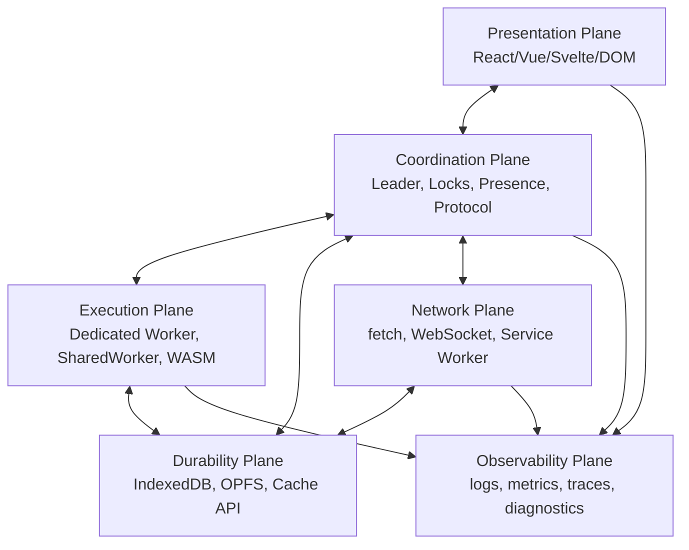

### 7.1 Presentation plane

Ini layer UI. Ia bertanggung jawab untuk:

- rendering,
- input handling,
- user feedback,
- optimistic UI,
- local component state,
- accessibility,
- route-level lifecycle.

Ia tidak boleh memegang responsibility global yang harus konsisten lintas tab.

Contoh anti-pattern:

```ts
// Anti-pattern: setiap tab membuat poller global sendiri.
useEffect(() => {
  const id = setInterval(syncEverything, 5000);
  return () => clearInterval(id);
}, []);
```

### 7.2 Coordination plane

Ini otak multi-tab orchestration. Ia menjawab:

- tab mana yang aktif,
- siapa leader,
- lock apa yang sedang dipegang,
- message protocol apa yang berlaku,
- bagaimana dedup dilakukan,
- kapan recovery terjadi,
- bagaimana cross-tab event disebarkan.

Coordination plane tidak harus satu file besar. Ia bisa berupa library internal kecil.

### 7.3 Execution plane

Ini tempat kerja berat dilakukan:

- parsing file besar,
- compression/decompression,
- search indexing,
- diffing,
- crypto,
- image processing,
- validation batch,
- WebAssembly computation,
- background queue processing.

Dedicated Worker, SharedWorker, dan WebAssembly sering masuk layer ini.

### 7.4 Durability plane

Ini tempat state yang harus survive reload/tab close disimpan:

- IndexedDB untuk object store dan transactional data,
- OPFS untuk file-like data besar,
- Cache API untuk request/response artifact,
- `localStorage` hanya untuk kasus sederhana dan hati-hati,
- server sebagai source of truth akhir untuk data multi-device.

### 7.5 Network plane

Ini layer yang mengatur hubungan dengan backend:

- fetch,
- WebSocket,
- Server-Sent Events,
- retry,
- offline detection,
- service worker fetch interception,
- cache revalidation,
- token refresh.

### 7.6 Observability plane

Tanpa observability, multi-tab bug menjadi hampir mustahil di-debug.

Minimal observability:

- context id,
- tab id,
- worker id,
- protocol version,
- leader id,
- lock acquisition/release,
- heartbeat timestamp,
- message correlation id,
- queue length,
- retry count,
- storage migration version,
- lifecycle transitions.

---

## 8. Execution Context sebagai Replica

Satu tab bukan hanya UI. Ia adalah replica dari sebagian aplikasi.

Replica punya:

- identity,
- local memory,
- view state,
- cache snapshot,
- network state,
- lifecycle state,
- protocol version,
- subscription set.

Contoh identity sederhana:

```ts
export type ContextKind = 'window' | 'dedicated-worker' | 'shared-worker' | 'service-worker';

export interface RuntimeContextIdentity {
  appId: string;
  contextId: string;
  kind: ContextKind;
  createdAt: number;
  protocolVersion: number;
  buildId: string;
}

export function createContextIdentity(kind: ContextKind): RuntimeContextIdentity {
  return {
    appId: 'case-management-web',
    contextId: crypto.randomUUID(),
    kind,
    createdAt: Date.now(),
    protocolVersion: 1,
    buildId: import.meta.env.VITE_BUILD_ID ?? 'dev',
  };
}
```

Ini terlihat kecil, tetapi dampaknya besar. Tanpa identity, log seperti ini tidak berguna:

```txt
received sync event
lock acquired
refresh failed
```

Dengan identity:

```txt
[tab=4f8e build=2026.07.07 protocol=1 leader=true] refresh-token lock acquired
[tab=91aa build=2026.07.07 protocol=1 leader=false] waiting for refresh result
```

Production browser orchestration dimulai dari kemampuan membedakan “siapa berbicara kepada siapa”.

---

## 9. Communication Model

Browser menyediakan beberapa bentuk komunikasi.

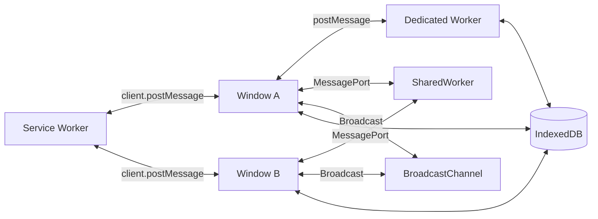

Tiga style utama:

### 9.1 Point-to-point

Contoh:

- Window ke Dedicated Worker,
- Window ke iframe,
- Service Worker ke specific client,
- MessagePort ke SharedWorker.

Cocok saat ada pasangan jelas.

### 9.2 Broadcast/pub-sub

Contoh:

- BroadcastChannel,
- service worker broadcasting ke semua clients.

Cocok untuk event/signal:

- token updated,
- logout requested,
- cache version changed,
- queue length changed,
- leader changed.

Tidak cocok sebagai satu-satunya storage state.

### 9.3 Shared durable state + notification

Pattern paling sering dipakai di production:

1. tulis state ke IndexedDB,
2. broadcast event ringan,
3. receiver membaca ulang state dari storage jika perlu.

```txt
Do not broadcast the whole truth.
Broadcast the fact that truth has changed.
```

Contoh:

```ts
type RuntimeEvent =
  | { type: 'AUTH_TOKEN_UPDATED'; version: number; by: string }
  | { type: 'SESSION_REVOKED'; reason: string; by: string }
  | { type: 'QUEUE_CHANGED'; queueName: string; version: number; by: string };

const channel = new BroadcastChannel('app-runtime');

export function publish(event: RuntimeEvent) {
  channel.postMessage({
    ...event,
    messageId: crypto.randomUUID(),
    sentAt: Date.now(),
  });
}
```

Pada part berikutnya kita akan membangun protocol yang lebih formal: envelope, schema version, correlation id, ack, retry, timeout, dan idempotency.

---

## 10. Correctness Model: Jangan Mulai dari API, Mulai dari Semantics

Sebelum memilih primitive, jawab dulu semantics yang dibutuhkan.

### 10.1 Untuk setiap operation, tanyakan

| Pertanyaan | Contoh jawaban |
|---|---|
| Apakah operation punya side effect server? | Ya, create payment instruction |
| Boleh duplicate? | Tidak, harus dedup dengan idempotency key |
| Boleh dijalankan oleh banyak tab? | Tidak, harus single owner |
| Apakah perlu survive reload? | Ya, simpan command di IndexedDB |
| Apakah hasil perlu disebar ke tab lain? | Ya, broadcast completion event |
| Apakah tab baru perlu tahu state terakhir? | Ya, baca dari IndexedDB/server |
| Apa jika owner mati? | Lock release/heartbeat timeout lalu takeover |

### 10.2 Delivery semantics praktis

Dalam sistem browser, treat message sebagai:

- asynchronous,
- non-durable,
- mungkin terlambat,
- tidak diterima oleh context yang belum subscribe,
- butuh schema validation,
- perlu idempotent handler.

Untuk sebagian primitive, browser/spec memberi ordering tertentu dalam kondisi tertentu. Tetapi architecture yang robust sebaiknya tidak bergantung pada asumsi lemah yang sulit diuji lintas lifecycle. Gunakan sequence number/version untuk state penting.

```ts
interface MessageEnvelope<TPayload> {
  messageId: string;
  type: string;
  protocolVersion: number;
  senderId: string;
  sentAt: number;
  correlationId?: string;
  causationId?: string;
  payload: TPayload;
}
```

Handler idempotent:

```ts
const seen = new Set<string>();

function handleMessage<T>(envelope: MessageEnvelope<T>) {
  if (seen.has(envelope.messageId)) return;
  seen.add(envelope.messageId);

  if (envelope.protocolVersion !== 1) {
    console.warn('unsupported protocol version', envelope);
    return;
  }

  dispatch(envelope);
}
```

Di production, `seen` tidak selalu cukup di memory. Untuk operasi critical, dedup key harus masuk durable store atau server.

---

## 11. Ownership Model

Banyak bug multi-tab berasal dari ownership yang kabur.

Contoh pertanyaan ownership:

- Siapa yang membuka WebSocket?
- Siapa yang melakukan token refresh?
- Siapa yang memproses offline queue?
- Siapa yang menjalankan polling?
- Siapa yang melakukan IndexedDB migration?
- Siapa yang membersihkan cache lama?
- Siapa yang mengirim notification?

Tanpa ownership, semua tab melakukan semuanya.

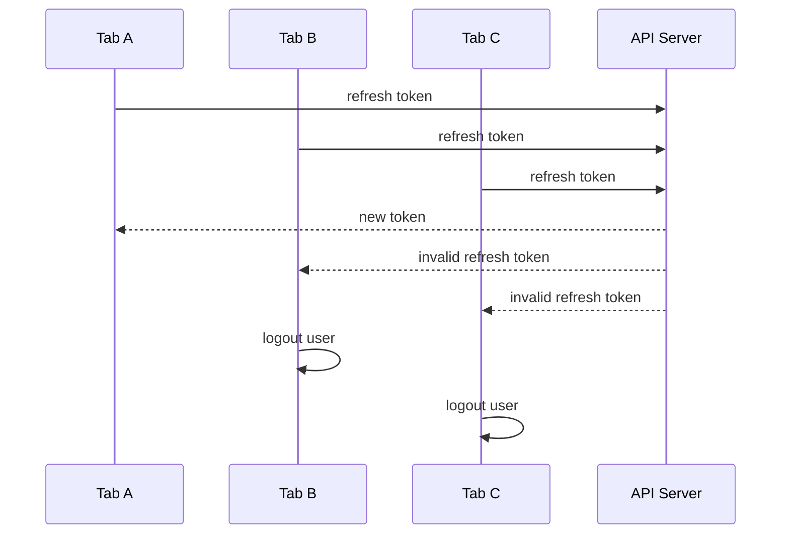

Dengan ownership:

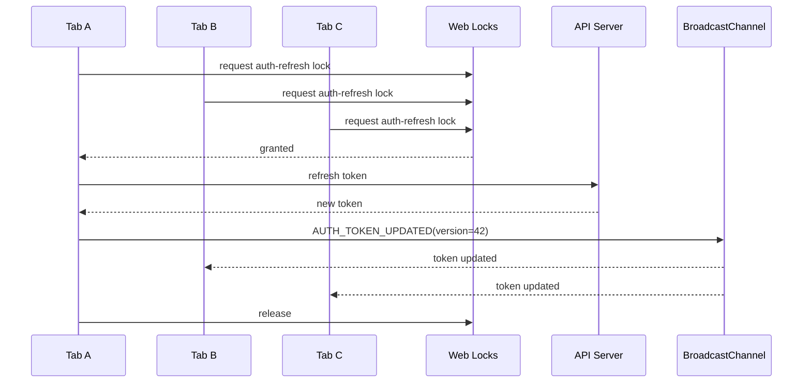

Tetapi lock saja belum cukup. Untuk correctness penuh, kita butuh:

- lock timeout/abort,
- result propagation,
- shared durable token version,
- fallback jika Web Locks tidak tersedia,
- idempotent handling untuk request yang sudah menunggu,
- session revocation semantics.

Itu akan dibahas detail di part khusus auth token refresh orchestration.

---

## 12. Resource Model

Resource di browser bisa dikelompokkan menjadi beberapa jenis.

| Resource | Shared antar tab? | Durable? | Perlu coordination? |
|---|---:|---:|---:|
| JS memory window | Tidak | Tidak | Tidak langsung |
| Dedicated worker memory | Tidak, owned by creator | Tidak | Tidak langsung |
| SharedWorker memory | Bisa untuk connected clients | Tidak boleh dianggap durable | Ya |
| Service worker state | Event-driven, tidak persistent | Tidak boleh dianggap durable | Ya |
| IndexedDB | Ya, same origin/partition | Ya | Ya untuk write contention |
| Cache API | Ya, same origin/partition | Ya | Ya untuk versioning |
| OPFS | Ya, origin-scoped | Ya | Ya untuk file access |
| WebSocket | Biasanya per context yang membuka | Tidak | Ya untuk dedup |
| BroadcastChannel | Ya untuk subscriber eligible | Tidak | Protocol-level |
| Web Locks | Ya, same origin | Lock lifetime only | Primitive koordinasi |

Rule praktis:

```txt
If it is shared and mutable, it needs a consistency story.
If it creates external side effects, it needs an idempotency story.
If it must survive reload, it needs durable storage.
If it has a single desired owner, it needs election/locking/lease.
```

---

## 13. Failure Model Browser

Kita tidak bisa mendesain orchestration tanpa failure model.

### 13.1 Failure types

| Failure | Contoh | Dampak |
|---|---|---|
| Tab closed | user close tab | memory hilang, worker owner mati |
| Navigation | route full reload / logout redirect | in-flight operation batal |
| Hidden throttling | background timer lambat | heartbeat false negative |
| Freeze | task queue suspended | lock holder mungkin tidak progress |
| Discard | browser reclaim memory | no cleanup callback |
| Worker crash/error | uncaught error | task hilang jika tidak durable |
| Service worker update | old/new SW coexist | protocol mismatch |
| Network offline | fetch gagal | queue replay tertunda |
| Storage quota exceeded | IDB/Cache write gagal | durability gagal |
| Version skew | old tab + new tab | schema/protocol conflict |
| User clears storage | IDB/cache hilang | local state reset |

### 13.2 Failure assumptions yang aman

Gunakan asumsi ini sebagai baseline:

1. Tab bisa hilang tanpa farewell message.
2. Worker bisa terminate tanpa menyelesaikan task.
3. Broadcast message tidak menggantikan storage.
4. Timer tidak reliable untuk correctness.
5. Hidden tab tidak boleh memegang resource penting tanpa lease/lock strategy.
6. Service worker bukan daemon yang selalu hidup.
7. Old code dan new code bisa berjalan bersamaan.
8. Semua external side effect bisa ter-retry.
9. User bisa membuka tab baru pada state aplikasi yang sudah berubah.
10. Browser bisa berbeda perilaku detail antar engine dan versi.

---

## 14. Pattern: Durable State + Ephemeral Coordinator

Satu pattern yang sering muncul di seri ini:

```txt
Durable state lives in storage/server.
Coordinator decides who acts.
Executor performs bounded work.
Bus notifies replicas.
```

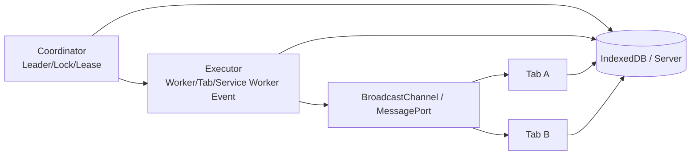

Contoh offline queue:

1. UI menulis command ke IndexedDB.
2. UI broadcast `QUEUE_CHANGED`.
3. Salah satu coordinator memperoleh lock `queue:replay`.
4. Executor membaca batch kecil.
5. Executor mengirim ke server dengan idempotency key.
6. Executor menandai command selesai.
7. Executor broadcast `QUEUE_REPLAYED`.
8. Tab lain membaca ulang state queue.

Kelebihannya:

- tab mati tidak menghapus queue,
- duplicate execution bisa dideteksi,
- tab baru bisa catch up,
- worker hanya mengerjakan batch bounded,
- network retry bisa dikontrol.

---

## 15. Pattern: Coordination Plane sebagai Library Internal

Daripada menyebar BroadcastChannel dan Web Locks langsung di komponen UI, buat runtime kecil.

Struktur awal:

```txt
src/runtime/
  context-id.ts
  bus.ts
  protocol.ts
  lifecycle.ts
  locks.ts
  presence.ts
  leader.ts
  storage.ts
  diagnostics.ts
```

Contoh boundary:

```ts
export interface RuntimeBus {
  publish<T>(type: string, payload: T): void;
  subscribe<T>(type: string, handler: (payload: T, meta: MessageMeta) => void): () => void;
}

export interface RuntimeLockManager {
  withLock<T>(name: string, fn: () => Promise<T>, options?: LockOptions): Promise<T | undefined>;
}

export interface RuntimePresence {
  start(): void;
  stop(): void;
  listPeers(): RuntimePeer[];
}
```

Komponen UI cukup memakai use-case API:

```ts
await authRuntime.refreshTokenIfNeeded();
await offlineRuntime.enqueue(command);
await notificationRuntime.markSeen(notificationId);
```

Bukan:

```ts
new BroadcastChannel('auth').postMessage(...);
navigator.locks.request(...);
indexedDB.open(...);
```

Ini menjaga orchestration tetap testable, observable, dan bisa diganti fallback.

---

## 16. Decision Framework: Memilih Primitive

Gunakan pertanyaan berikut.

### 16.1 Apakah pekerjaan CPU-bound dan mengganggu UI?

Gunakan Dedicated Worker atau worker pool.

Contoh:

- parse CSV 200 MB,
- generate index pencarian,
- image transform,
- compression,
- diff besar,
- crypto batch.

### 16.2 Apakah banyak tab perlu terhubung ke satu hub in-memory?

Pertimbangkan SharedWorker.

Contoh:

- satu WebSocket dibagi banyak tab,
- broker message in-memory,
- single in-browser session coordinator.

Tetapi siapkan fallback jika target browser/environment tidak mendukung atau tidak sesuai deployment.

### 16.3 Apakah masalahnya network/cache/offline?

Pertimbangkan Service Worker.

Contoh:

- intercept fetch,
- offline shell,
- stale-while-revalidate,
- background sync,
- cache versioning,
- update notification.

Jangan perlakukan service worker sebagai daemon selalu hidup.

### 16.4 Apakah masalahnya mutual exclusion lintas tab/worker?

Pertimbangkan Web Locks.

Contoh:

- token refresh,
- queue replay,
- DB migration,
- cache cleanup,
- leader election.

Tetap desain idempotency, karena lock adalah coordination primitive, bukan business guarantee.

### 16.5 Apakah masalahnya notification lintas tab?

Pertimbangkan BroadcastChannel.

Contoh:

- logout,
- token updated,
- settings changed,
- entity updated,
- queue changed.

Untuk state final, receiver sebaiknya membaca ulang dari source of truth.

### 16.6 Apakah perlu shared memory low-level?

Pertimbangkan SharedArrayBuffer + Atomics hanya jika:

- benar-benar butuh throughput/latency rendah,
- target environment bisa cross-origin isolated,
- tim siap menanggung complexity concurrency memory-level.

Untuk mayoritas aplikasi bisnis, message passing + Transferable lebih aman.

---

## 17. Contoh Kasus: Token Refresh yang Benar Secara Sistem

Kita belum masuk implementasi penuh, tetapi lihat bentuk architecture-nya.

### 17.1 Invariant

- Paling banyak satu refresh request aktif untuk satu session.
- Semua tab harus memakai token version terbaru.
- Tab yang tidak memegang lock harus menunggu hasil atau membaca ulang token.
- Jika refresh gagal karena session revoked, semua tab logout konsisten.
- Jika tab pemegang lock mati, tab lain bisa retry.

### 17.2 State minimal

```ts
interface AuthTokenRecord {
  accessToken: string;
  refreshTokenFamilyVersion: number;
  expiresAt: number;
  updatedAt: number;
}

interface RefreshState {
  status: 'idle' | 'refreshing' | 'succeeded' | 'failed' | 'revoked';
  ownerId?: string;
  startedAt?: number;
  completedAt?: number;
  tokenVersion: number;
  errorCode?: string;
}
```

### 17.3 Flow

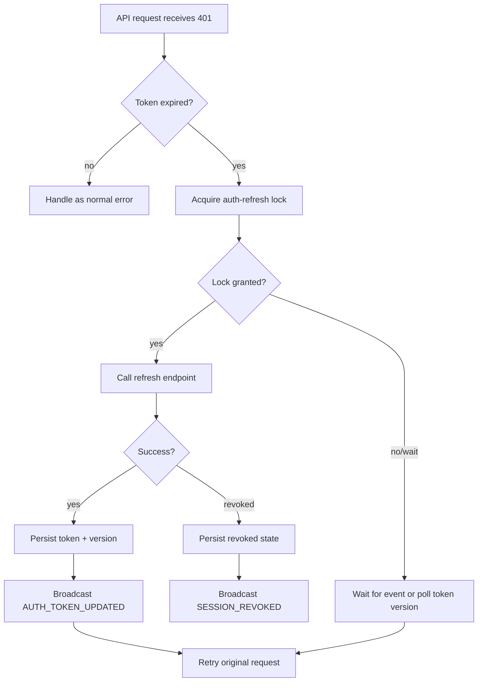

### 17.4 Kenapa ini bukan sekadar mutex?

Karena mutex hanya menjawab “siapa yang boleh masuk critical section”. Ia tidak menjawab:

- bagaimana tab lain menunggu hasil,
- bagaimana hasil disimpan,
- bagaimana revocation disebarkan,
- bagaimana jika lock holder mati,
- bagaimana jika message tidak diterima,
- bagaimana jika ada tab dengan build lama.

Itulah perbedaan API usage dan system design.

---

## 18. Contoh Kasus: Satu WebSocket untuk Banyak Tab

Ada beberapa pendekatan.

### 18.1 Naive per-tab socket

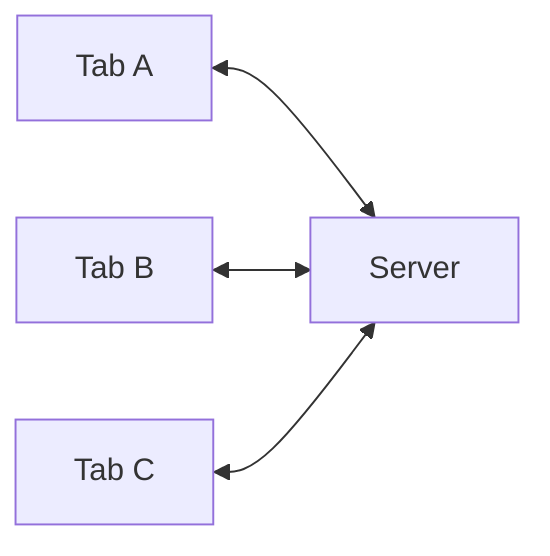

Sederhana, tetapi mahal jika tab banyak.

### 18.2 SharedWorker hub

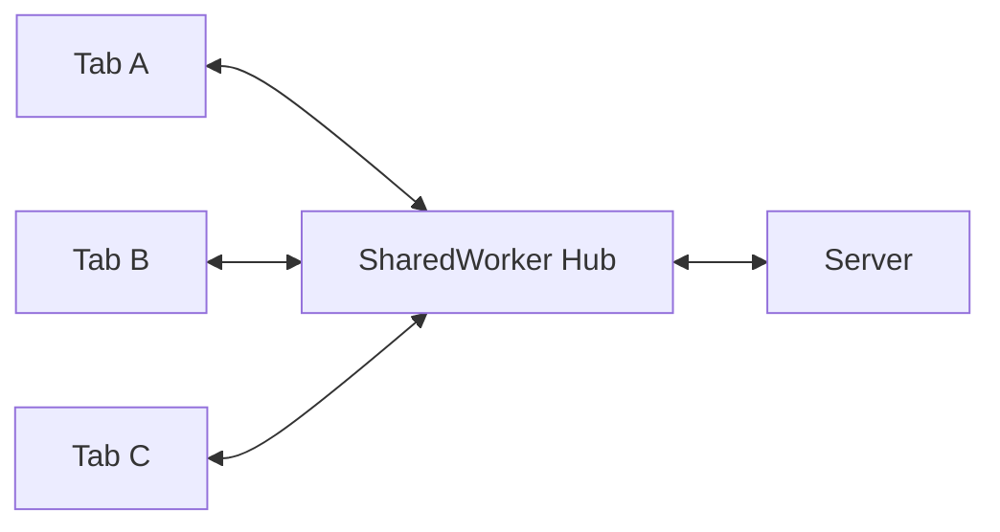

Bagus untuk satu koneksi dibagi banyak tab. Tetapi perlu handle:

- port registry,
- tab disconnect,
- hub crash/recreate,
- auth update,
- message replay,
- browser compatibility,
- fallback ke per-tab atau leader-tab socket.

### 18.3 Leader tab socket

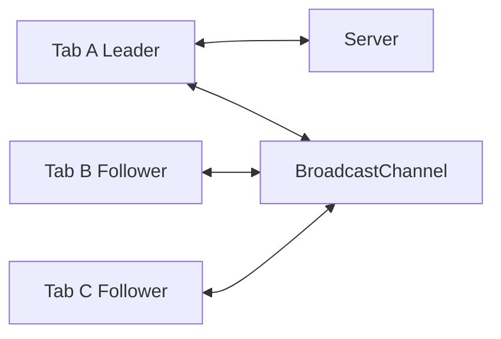

Bisa berjalan tanpa SharedWorker, tetapi butuh leader election dan takeover.

Pilihan terbaik tergantung kebutuhan:

| Kebutuhan | Pattern awal |
|---|---|
| sederhana, tab sedikit | per-tab socket |
| ingin satu socket lintas tab | SharedWorker hub |
| butuh fallback luas | leader tab + BroadcastChannel/Web Locks |
| offline/cache integration kuat | service worker + client messaging |

---

## 19. Apa yang Akan Kita Build Sepanjang Seri

Seri ini akan bergerak dari primitive ke runtime.

Target akhirnya bukan hanya tahu API, tetapi bisa membangun browser orchestration runtime internal.

Komponen akhir:

```txt
BrowserRuntime
  ├─ ContextIdentity
  ├─ LifecycleObserver
  ├─ MessageBus
  ├─ DurableEventLog
  ├─ PresenceRegistry
  ├─ LockAdapter
  ├─ LeaderElection
  ├─ WorkerPool
  ├─ SharedWorkerHubAdapter
  ├─ ServiceWorkerClient
  ├─ OfflineQueue
  ├─ AuthRefreshCoordinator
  ├─ CacheVersionCoordinator
  ├─ Diagnostics
  └─ TestHarness
```

Kita akan membangun sebagian dari scratch agar mental model kuat. Library bisa dipakai setelah paham fondasinya.

---

## 20. Prinsip Desain yang Dipakai Seri Ini

### 20.1 Prefer explicit protocol over implicit side effect

Buruk:

```ts
channel.postMessage(user);
```

Lebih baik:

```ts
publish({
  type: 'USER_PROFILE_UPDATED',
  protocolVersion: 1,
  payload: { userId, profileVersion },
});
```

### 20.2 Prefer durable intent over in-memory hope

Buruk:

```ts
worker.postMessage({ type: 'SYNC_NOW', changes });
```

Jika worker mati, `changes` hilang.

Lebih baik:

```txt
1. persist sync command
2. notify worker/coordinator
3. worker reads durable command
4. worker marks command complete
```

### 20.3 Prefer bounded work

Worker tidak boleh diberi pekerjaan tak terbatas tanpa cancellation/backpressure.

```txt
Process 100,000 records now
```

lebih buruk daripada:

```txt
Process batch of 500 records
checkpoint progress
yield/cancel if needed
resume later
```

### 20.4 Prefer takeover over prevention

Jangan berusaha mencegah semua failure. Desain agar failure bisa diambil alih.

```txt
Owner died -> detect stale lease -> acquire lock -> resume from checkpoint
```

### 20.5 Prefer server-supported idempotency for critical side effects

Client-only dedup tidak cukup untuk operasi critical seperti payment, submission legal, workflow transition, atau enforcement action.

Gunakan:

- idempotency key,
- command id,
- request fingerprint,
- server-side dedup table,
- monotonic version,
- optimistic concurrency control.

---

## 21. Minimal Runtime Skeleton

Ini bukan implementasi final. Ini hanya bentuk awal agar pembahasan part berikutnya punya anchor.

```ts
export interface BrowserRuntime {
  identity: RuntimeContextIdentity;
  lifecycle: RuntimeLifecycle;
  bus: RuntimeBus;
  locks: RuntimeLockManager;
  diagnostics: RuntimeDiagnostics;
}

export async function createBrowserRuntime(): Promise<BrowserRuntime> {
  const identity = createContextIdentity('window');
  const diagnostics = createDiagnostics(identity);
  const lifecycle = createLifecycleObserver(diagnostics);
  const bus = createBroadcastRuntimeBus(identity, diagnostics);
  const locks = createWebLocksAdapter(identity, diagnostics);

  lifecycle.start();

  diagnostics.info('runtime.created', {
    contextId: identity.contextId,
    protocolVersion: identity.protocolVersion,
    buildId: identity.buildId,
  });

  return {
    identity,
    lifecycle,
    bus,
    locks,
    diagnostics,
  };
}
```

Yang perlu diperhatikan:

- semua subsystem menerima identity,
- diagnostics bukan tempelan belakangan,
- lifecycle dimulai eksplisit,
- bus dan lock diabstraksikan,
- runtime bisa dites dengan adapter palsu.

---

## 22. Cara Membaca Seri Ini

Setiap part akan mengikuti pola:

1. masalah production,
2. mental model,
3. primitive browser,
4. implementation skeleton,
5. failure mode,
6. observability,
7. checklist,
8. trade-off,
9. latihan desain.

Karena targetnya implementasi, kita tidak akan berhenti di definisi. Setiap API akan ditarik ke use case nyata:

- auth refresh,
- cross-tab logout,
- notification suppression,
- offline replay,
- cache migration,
- worker task queue,
- leader election,
- worker pool,
- shared memory ring buffer,
- service worker update.

---

## 23. Checklist Part 001

Sebelum lanjut, pastikan konsep berikut sudah jelas.

- [ ] Aplikasi web multi-tab adalah kumpulan replica, bukan satu instance.
- [ ] Worker menyelesaikan masalah eksekusi, bukan otomatis menyelesaikan koordinasi.
- [ ] BroadcastChannel menyebar sinyal, bukan menyimpan state.
- [ ] IndexedDB menyimpan state, tetapi tidak menyelesaikan conflict otomatis.
- [ ] Web Locks membantu mutual exclusion, tetapi bukan business guarantee.
- [ ] Service worker adalah network/cache coordinator event-driven, bukan daemon abadi.
- [ ] Hidden/frozen/discarded tab adalah bagian dari failure model.
- [ ] Side effect critical harus idempotent.
- [ ] Old tab dan new tab bisa hidup bersamaan setelah deploy.
- [ ] Observability harus membawa context id, build id, protocol version, dan lifecycle state.

---

## 24. Latihan Desain

Ambil satu aplikasi yang pernah kamu bangun. Jawab pertanyaan ini:

1. Apa yang terjadi jika user membuka 5 tab?
2. Apakah semua tab membuka koneksi network sendiri?
3. Apakah token refresh bisa terjadi bersamaan?
4. Apakah logout di satu tab langsung membersihkan tab lain?
5. Apakah offline queue bisa diproses ganda?
6. Apakah IndexedDB migration aman jika tab lama masih terbuka?
7. Apakah heavy computation pernah berjalan di main thread?
8. Apakah hidden tab masih polling?
9. Apakah ada operation yang harus single-owner?
10. Apakah log cukup untuk membedakan tab A dan tab B?

Jika beberapa jawabannya “tidak tahu”, itu bukan kegagalan. Itu peta belajar untuk part berikutnya.

---

## 25. Ringkasan

Browser orchestration adalah disiplin desain sistem di dalam client runtime.

Inti part ini:

1. Jangan melihat browser app sebagai satu JavaScript process.
2. Lihat ia sebagai banyak execution context yang saling berkomunikasi.
3. Pisahkan presentation, coordination, execution, durability, network, dan observability plane.
4. Jangan percaya tab, timer, worker memory, atau broadcast message sebagai sumber kebenaran tunggal.
5. Desain dengan invariant, failure model, dan delivery semantics.
6. Gunakan API browser sebagai primitive, bukan sebagai jawaban final.

Part berikutnya akan memetakan execution context satu per satu: Window, Tab, Iframe, Dedicated Worker, SharedWorker, Service Worker, Worklet, BroadcastChannel, storage, dan lock boundary.

---

## References

- MDN — Web Workers API: https://developer.mozilla.org/en-US/docs/Web/API/Web_Workers_API
- MDN — Broadcast Channel API: https://developer.mozilla.org/en-US/docs/Web/API/Broadcast_Channel_API
- MDN — Web Locks API: https://developer.mozilla.org/en-US/docs/Web/API/Web_Locks_API
- MDN — Service Worker API: https://developer.mozilla.org/en-US/docs/Web/API/Service_Worker_API
- MDN — Page Visibility API: https://developer.mozilla.org/en-US/docs/Web/API/Page_Visibility_API
- Chrome for Developers — Page Lifecycle API: https://developer.chrome.com/docs/web-platform/page-lifecycle-api
- WHATWG HTML Standard — Event loops: https://html.spec.whatwg.org/multipage/webappapis.html#event-loops
