# Part 002 — Mapping Window, Tab, Iframe, Worker, SharedWorker, Service Worker

> Part ini membuat peta runtime. Sebelum membangun orchestration, kita harus tahu siapa saja aktornya, apa hak aksesnya, bagaimana mereka hidup/mati, dan bagaimana mereka berbicara.

Dalam aplikasi web sederhana, kita sering hanya peduli pada `window` dan DOM. Dalam aplikasi production yang serius, aktornya lebih banyak:

- top-level window/tab,
- iframe,
- dedicated worker,
- shared worker,
- service worker,
- worklet,
- storage layer,
- broadcast channel,
- web lock manager,
- server connection,
- dan kadang WebAssembly/shared memory.

Kesalahan desain biasanya muncul saat semua aktor ini dianggap sama.

Mereka tidak sama.

Masing-masing punya:

- lifecycle berbeda,
- global scope berbeda,
- kemampuan API berbeda,
- ownership berbeda,
- komunikasi berbeda,
- failure mode berbeda,
- dan use case berbeda.

---

## 1. Peta Awal Execution Context

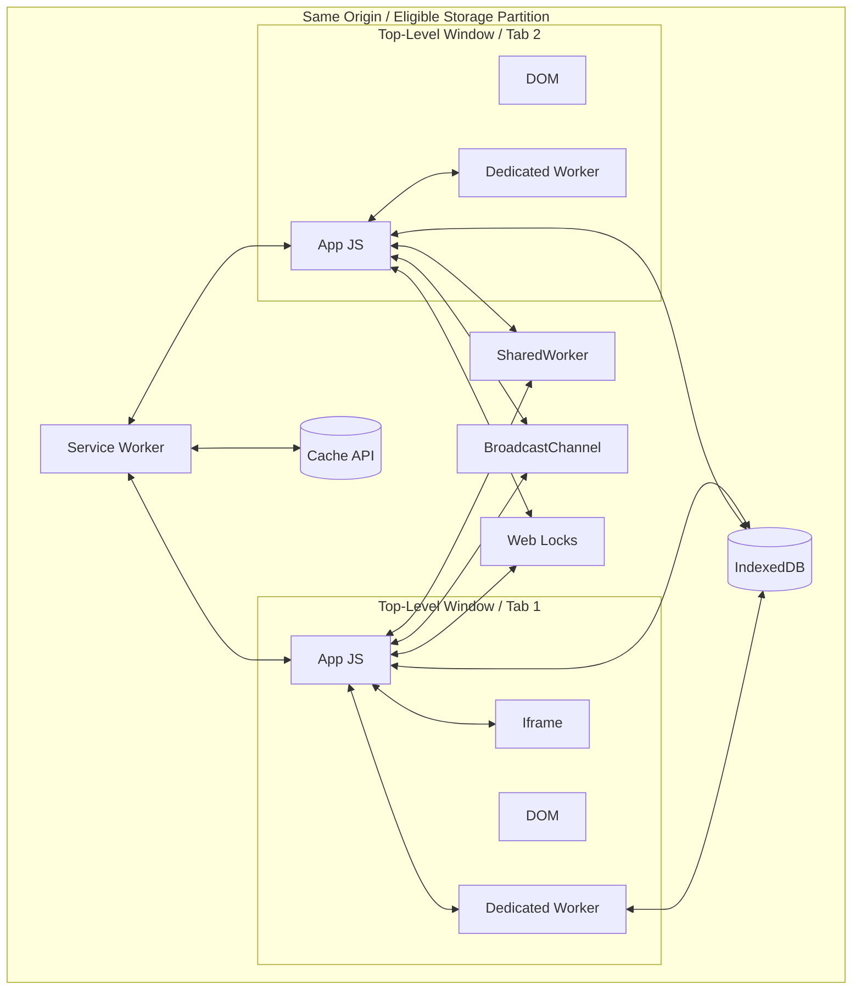

Catatan penting:

1. Diagram ini adalah model aplikasi, bukan janji process/thread internal browser.
2. Same-origin tidak selalu cukup untuk beberapa primitive; storage partition juga bisa memengaruhi eligibility.
3. Tidak semua context bisa menyentuh DOM.
4. Tidak semua context selalu hidup.
5. Tidak semua browser/environment memberi kemampuan API yang sama.

---

## 2. Vocabulary yang Harus Rapi

Sebelum masuk detail, rapikan istilah.

### 2.1 Window

`window` adalah global object untuk document di browsing context. Biasanya ini yang kita maksud sebagai “halaman” atau “tab”, walaupun secara teknis satu tab bisa memiliki frame tree yang berisi beberapa browsing context.

Kemampuan utama:

- akses DOM,
- render UI,
- handle input,
- membuat worker,
- fetch,
- storage access,
- messaging.

### 2.2 Tab

Tab adalah konsep UI browser. Satu tab biasanya berisi top-level browsing context. Untuk architecture, kita sering memakai “tab” sebagai shorthand untuk satu top-level page instance aplikasi.

Tetapi hati-hati:

```txt
Tab != JavaScript process guarantee
Tab != origin boundary
Tab != durable owner
```

### 2.3 Iframe

Iframe adalah embedded browsing context di dalam document lain.

Ia bisa:

- same-origin atau cross-origin,
- sandboxed atau tidak,
- punya lifecycle sendiri,
- memiliki DOM sendiri,
- berkomunikasi via `postMessage`,
- terpengaruh policy/security boundary.

### 2.4 Dedicated Worker

Dedicated Worker adalah worker yang dimiliki oleh satu creator context. Ia menjalankan JavaScript di background thread terpisah dari main execution thread aplikasi, sehingga pekerjaan berat tidak memblokir UI.

Ia cocok untuk:

- CPU-heavy task,
- parsing,
- transform,
- validation,
- indexing,
- compression,
- isolated background computation.

Ia tidak punya akses DOM.

### 2.5 SharedWorker

SharedWorker adalah worker yang dapat diakses oleh beberapa browsing context yang eligible, biasanya same-origin. Context berkomunikasi dengan SharedWorker melalui `MessagePort`.

Ia cocok untuk:

- cross-tab in-memory hub,
- shared WebSocket,
- session-level coordinator,
- message broker antar tab.

Tetapi jangan anggap memory SharedWorker durable.

### 2.6 Service Worker

Service Worker adalah worker khusus yang duduk di antara aplikasi, browser, dan network. Ia dapat intercept network request, mengelola cache, dan memungkinkan offline experience.

Ia event-driven. Ia bukan daemon yang selalu hidup.

Cocok untuk:

- offline shell,
- cache strategy,
- request interception,
- background sync,
- push notification,
- update coordination.

### 2.7 Worklet

Worklet adalah context khusus untuk pekerjaan sangat spesifik seperti rendering/audio/layout/paint tergantung API. Worklet bukan general-purpose worker replacement.

Contoh:

- AudioWorklet,
- PaintWorklet,
- AnimationWorklet,
- LayoutWorklet.

Dalam seri ini worklet dibahas secukupnya saat relevan dengan rendering/performance.

### 2.8 BroadcastChannel

BroadcastChannel bukan execution context. Ia adalah communication primitive yang memungkinkan context eligible saling mengirim message pada channel bernama.

Cocok untuk:

- cross-tab notification,
- logout signal,
- token updated signal,
- cache version changed,
- queue changed,
- leader announcement.

Tidak cocok sebagai durable event store.

### 2.9 Web Locks

Web Locks bukan execution context. Ia adalah coordination primitive untuk mutual exclusion lintas tab/worker same-origin.

Cocok untuk:

- leader election,
- single-flight token refresh,
- queue replay lock,
- migration lock,
- cache cleanup lock.

### 2.10 IndexedDB / Cache API / OPFS

Ini durability/resource layer. Mereka bukan coordinator otomatis.

IndexedDB memberi storage transactional object store. Cache API menyimpan request/response artifact. OPFS memberi file-like storage origin-private untuk data besar atau worker-heavy use case.

---

## 3. Capability Matrix

Gunakan tabel ini sebagai peta awal. Detail browser support harus selalu diverifikasi untuk target environment.

| Context / Primitive | DOM access | Long CPU work | Cross-tab sharing | Durable state | Network interception | Typical owner | Main risk |
|---|---:|---:|---:|---:|---:|---|---|
| Window/Tab | Yes | Bad idea on main thread | Via bus/storage | Via storage | No global intercept | User/page | UI jank, duplicate side effects |
| Iframe | Yes, inside own document | Bad idea on its main thread | Via parent/postMessage/storage if eligible | Via storage if allowed | No global intercept | Parent/page/embedder | security boundary confusion |
| Dedicated Worker | No | Yes | No direct cross-tab sharing | Via storage APIs where available | No global intercept | Creator context | owner death, memory not durable |
| SharedWorker | No | Yes | Yes, via ports | Via storage APIs where available | No global intercept | Connected clients | availability/support assumptions |
| Service Worker | No | Bounded event work | Can message clients | Cache/IDB where available | Yes | Browser registration/scope | assuming it is always alive |
| Worklet | No normal DOM | Specialized | No general app hub | No general durability | No | Rendering/audio subsystem | using it as general worker |
| BroadcastChannel | No | No | Yes for eligible contexts | No | No | Channel subscribers | treating signal as state |
| Web Locks | No | No | Coordinates eligible contexts | No | No | Lock requester | treating lock as business guarantee |
| IndexedDB | No | No | Shared storage | Yes | No | Origin/storage partition | conflict/version skew |
| Cache API | No | No | Shared artifact store | Yes | Service worker often uses it | Origin/storage partition | stale cache/version bugs |

---

## 4. Window / Top-Level Tab

Window adalah tempat UI hidup.

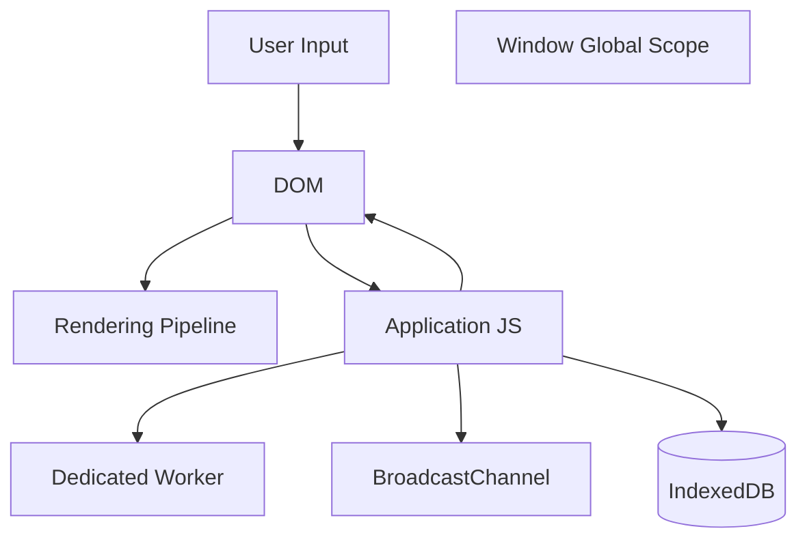

### 4.1 Responsibilities yang cocok

Window cocok untuk:

- rendering UI,
- event handling,
- local view state,
- user feedback,
- route orchestration,
- delegating heavy work,
- subscribing to runtime events,
- showing conflict resolution UI.

Window tidak cocok untuk:

- long CPU-bound task di main thread,
- global singleton side effect tanpa coordination,
- durable queue hanya di memory,
- assuming it will close cleanly,
- ownership abadi atas background task.

### 4.2 Window sebagai replica

Setiap tab adalah replica dari aplikasi.

Replica bisa berbeda dalam:

- route,
- unsaved form state,
- selected entity,
- auth token copy,
- cache freshness,
- connection status,
- lifecycle state,
- build version.

Karena itu, cross-tab design harus membedakan:

```txt
local view state
vs
session-global state
vs
server-authoritative state
vs
durable client-side state
```

Contoh:

| State | Scope yang benar |
|---|---|
| modal open/closed | local tab |
| selected row | local tab, kecuali memang shared collaboration |
| access token | session-global, durable/secure strategy |
| logout state | session-global |
| offline command queue | durable client-side |
| server entity version | server-authoritative |
| cache asset version | service-worker/cache scoped |

### 4.3 Window lifecycle matters

Window bisa:

- active,
- passive,
- hidden,
- frozen,
- discarded,
- terminated.

Implikasi desain:

- persist unsaved important state saat `visibilitychange` ke hidden,
- stop UI-only work saat hidden,
- jangan mengandalkan `unload`,
- jangan jadikan hidden tab sebagai owner tanpa lock/lease,
- gunakan lifecycle signal sebagai input coordination.

Skeleton lifecycle observer:

```ts
export type PageRuntimeState = 'active' | 'passive' | 'hidden' | 'frozen' | 'terminated';

export function getApproxPageState(): PageRuntimeState {
  if (document.visibilityState === 'hidden') return 'hidden';
  if (document.hasFocus()) return 'active';
  return 'passive';
}

export function observePageLifecycle(onChange: (state: PageRuntimeState) => void): () => void {
  const emit = () => onChange(getApproxPageState());

  const onFreeze = () => onChange('frozen');
  const onResume = () => emit();
  const onPageHide = () => onChange('terminated');

  window.addEventListener('focus', emit, { capture: true });
  window.addEventListener('blur', emit, { capture: true });
  document.addEventListener('visibilitychange', emit, { capture: true });
  document.addEventListener('freeze', onFreeze as EventListener, { capture: true });
  document.addEventListener('resume', onResume as EventListener, { capture: true });
  window.addEventListener('pagehide', onPageHide, { capture: true });

  emit();

  return () => {
    window.removeEventListener('focus', emit, { capture: true } as AddEventListenerOptions);
    window.removeEventListener('blur', emit, { capture: true } as AddEventListenerOptions);
    document.removeEventListener('visibilitychange', emit, { capture: true } as AddEventListenerOptions);
    document.removeEventListener('freeze', onFreeze as EventListener, { capture: true } as AddEventListenerOptions);
    document.removeEventListener('resume', onResume as EventListener, { capture: true } as AddEventListenerOptions);
    window.removeEventListener('pagehide', onPageHide, { capture: true } as AddEventListenerOptions);
  };
}
```

Catatan: event `freeze`/`resume` tidak boleh diasumsikan tersedia sama di semua browser. Runtime production perlu feature detection dan fallback.

---

## 5. Iframe

Iframe sering diremehkan, padahal ia adalah execution context penting dalam aplikasi enterprise.

Contoh penggunaan:

- embed payment provider,
- embed document viewer,
- embed legacy app,
- micro-frontend isolation,
- sandboxed untrusted content,
- cross-origin integration,
- report viewer,
- authentication/SSO bridge.

### 5.1 Same-origin iframe

Same-origin iframe relatif lebih kuat karena parent bisa mengakses content tertentu jika policy mengizinkan.

Tetapi tetap pisahkan mental model:

```txt
Parent window and iframe are not one app instance.
They are separate documents with communication boundary.
```

### 5.2 Cross-origin iframe

Cross-origin iframe harus dianggap sebagai remote actor. Komunikasi menggunakan `postMessage` dengan origin validation.

Anti-pattern:

```ts
window.addEventListener('message', (event) => {
  handle(event.data);
});
```

Lebih aman:

```ts
const allowedOrigins = new Set([
  'https://payments.example.com',
  'https://viewer.example.com',
]);

window.addEventListener('message', (event) => {
  if (!allowedOrigins.has(event.origin)) return;

  const message = parseTrustedIframeMessage(event.data);
  if (!message.ok) return;

  handleTrustedMessage(message.value);
});
```

### 5.3 Iframe sandbox

`sandbox` attribute dapat membatasi kemampuan iframe. Ini penting untuk threat model.

Contoh:

```html
<iframe
  src="https://viewer.example.com/document/123"
  sandbox="allow-scripts allow-downloads"
  referrerpolicy="no-referrer"
></iframe>
```

Gunakan prinsip:

```txt
Give iframe only the capabilities it needs.
Never treat embedded content as trusted by default.
```

### 5.4 Iframe dalam orchestration

Pertanyaan desain:

- Apakah iframe perlu tahu auth/session state?
- Apakah iframe boleh ikut BroadcastChannel?
- Apakah iframe same-origin atau cross-origin?
- Apakah iframe boleh menyimpan data?
- Apakah parent menjadi coordinator?
- Bagaimana jika iframe reload sendiri?
- Bagaimana protocol version parent vs iframe dijaga?

Untuk aplikasi regulatory/case management, iframe sering muncul sebagai document viewer, evidence viewer, atau legacy module. Jangan biarkan ia menjadi lubang observability.

---

## 6. Dedicated Worker

Dedicated Worker adalah tool utama untuk memindahkan CPU-heavy work keluar dari main thread.

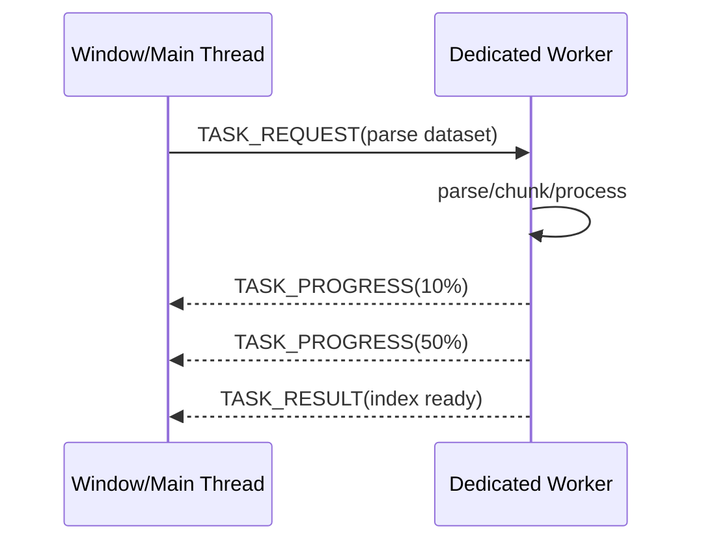

### 6.1 Ownership

Dedicated Worker dimiliki oleh creator.

Jika tab A membuat worker A, worker itu bukan otomatis milik tab B. Tab B tidak bisa langsung memakai worker A kecuali ada broker tambahan.

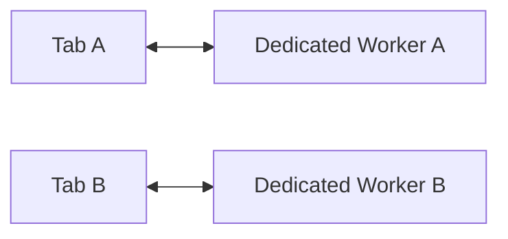

Konsekuensi:

- bagus untuk task lokal per tab,
- tidak cukup untuk cross-tab singleton,
- worker mati jika owner context terminate,
- hasil penting harus disimpan atau dikirim sebelum owner hilang.

### 6.2 Use case yang tepat

Dedicated Worker cocok untuk:

| Use case | Kenapa cocok |
|---|---|
| parse file besar | CPU-heavy, tidak butuh DOM |
| build search index | bisa incremental/progress |
| validate ribuan record | batchable |
| compression | CPU-heavy |
| diff besar | CPU-heavy |
| crypto operation | CPU-heavy dan isolated |
| WebAssembly compute | thread terpisah |
| image processing dengan OffscreenCanvas | mengurangi main-thread pressure |

### 6.3 Use case yang kurang tepat

Dedicated Worker kurang tepat untuk:

- menyimpan session-global state,
- menjadi satu-satunya offline queue owner lintas tab,
- shared WebSocket lintas tab tanpa broker,
- task yang perlu DOM,
- task yang harus survive tab close tanpa checkpoint.

### 6.4 Message contract

Jangan kirim object random. Buat contract.

```ts
export type WorkerRequest =
  | {
      type: 'BUILD_SEARCH_INDEX';
      requestId: string;
      payload: {
        documents: Array<{ id: string; text: string }>;
      };
    }
  | {
      type: 'CANCEL_TASK';
      requestId: string;
    };

export type WorkerResponse =
  | {
      type: 'TASK_PROGRESS';
      requestId: string;
      payload: { completed: number; total: number };
    }
  | {
      type: 'TASK_RESULT';
      requestId: string;
      payload: { indexId: string };
    }
  | {
      type: 'TASK_FAILED';
      requestId: string;
      payload: { code: string; message: string };
    };
```

### 6.5 Cancellation

Worker task harus bisa dibatalkan.

```ts
const cancelled = new Set<string>();

self.onmessage = async (event: MessageEvent<WorkerRequest>) => {
  const message = event.data;

  if (message.type === 'CANCEL_TASK') {
    cancelled.add(message.requestId);
    return;
  }

  if (message.type === 'BUILD_SEARCH_INDEX') {
    try {
      await buildIndex(message.requestId, message.payload.documents);
    } catch (error) {
      postMessage({
        type: 'TASK_FAILED',
        requestId: message.requestId,
        payload: {
          code: 'INDEX_FAILED',
          message: error instanceof Error ? error.message : 'Unknown error',
        },
      } satisfies WorkerResponse);
    }
  }
};

async function buildIndex(requestId: string, documents: Array<{ id: string; text: string }>) {
  for (let i = 0; i < documents.length; i++) {
    if (cancelled.has(requestId)) return;

    processDocument(documents[i]);

    if (i % 100 === 0) {
      postMessage({
        type: 'TASK_PROGRESS',
        requestId,
        payload: { completed: i, total: documents.length },
      } satisfies WorkerResponse);

      await schedulerYieldFallback();
    }
  }
}

function schedulerYieldFallback(): Promise<void> {
  return new Promise((resolve) => setTimeout(resolve, 0));
}
```

### 6.6 Transferable objects

Untuk data besar, copying mahal. Gunakan Transferable jika sesuai.

```ts
const buffer = new ArrayBuffer(1024 * 1024 * 50);
worker.postMessage({ type: 'PROCESS_BUFFER', buffer }, [buffer]);
```

Setelah ditransfer, ownership berpindah dan buffer lama tidak bisa dipakai seperti sebelumnya. Ini bagus untuk performa, tetapi harus eksplisit dalam protocol.

---

## 7. SharedWorker

SharedWorker memungkinkan beberapa context terhubung ke satu worker.

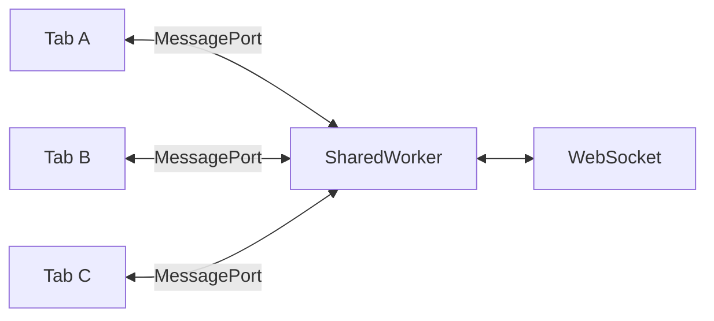

### 7.1 Mental model

SharedWorker adalah hub in-memory yang dapat menerima banyak port.

Di dalam SharedWorker, kamu biasanya memiliki:

- port registry,
- client identity,
- subscriptions,
- shared connection,
- routing table,
- heartbeat,
- cleanup.

### 7.2 SharedWorker skeleton

Client:

```ts
const worker = new SharedWorker(new URL('./shared-runtime.worker.ts', import.meta.url), {
  type: 'module',
});

worker.port.start();

worker.port.postMessage({
  type: 'CLIENT_HELLO',
  clientId: crypto.randomUUID(),
  buildId: import.meta.env.VITE_BUILD_ID,
});

worker.port.onmessage = (event) => {
  console.log('from shared worker', event.data);
};
```

Worker:

```ts
interface ClientRecord {
  clientId: string;
  port: MessagePort;
  connectedAt: number;
  lastSeenAt: number;
}

const clients = new Map<string, ClientRecord>();

self.onconnect = (event: MessageEvent) => {
  const port = event.ports[0];
  port.start();

  let clientId: string | undefined;

  port.onmessage = (messageEvent) => {
    const message = messageEvent.data;

    if (message.type === 'CLIENT_HELLO') {
      clientId = message.clientId;
      clients.set(clientId, {
        clientId,
        port,
        connectedAt: Date.now(),
        lastSeenAt: Date.now(),
      });

      port.postMessage({ type: 'CLIENT_ACCEPTED', clientId });
      return;
    }

    if (!clientId) return;

    const record = clients.get(clientId);
    if (record) record.lastSeenAt = Date.now();

    routeMessage(clientId, message);
  };
};

function broadcast(message: unknown) {
  for (const client of clients.values()) {
    client.port.postMessage(message);
  }
}

function routeMessage(senderId: string, message: unknown) {
  broadcast({ type: 'BROADCAST_FROM_CLIENT', senderId, payload: message });
}
```

### 7.3 Cocok untuk apa?

SharedWorker cocok untuk:

- satu WebSocket lintas tab,
- in-browser pub/sub hub,
- shared session coordination,
- centralizing expensive in-memory resource,
- cross-tab state cache dengan fallback durable store.

### 7.4 Risiko

Jangan abaikan:

- compatibility target harus dicek,
- shared memory tetap ephemeral,
- client disconnect detection tidak selalu sempurna,
- worker bisa terminate,
- protocol version antar tab bisa berbeda,
- fallback perlu disiapkan.

### 7.5 SharedWorker vs BroadcastChannel

| Pertanyaan | BroadcastChannel | SharedWorker |
|---|---|---|
| Butuh hub stateful? | Kurang cocok | Cocok |
| Butuh request/response routing? | Perlu protocol manual | Natural via ports |
| Butuh single WebSocket? | Butuh leader pattern | Cocok |
| Butuh simple notification? | Cocok | Bisa, tapi overkill |
| Butuh fallback mudah? | Lebih mudah | Lebih kompleks |

---

## 8. Service Worker

Service Worker berbeda dari Dedicated Worker dan SharedWorker.

Ia tidak dibuat sebagai helper langsung untuk satu tab. Ia diregistrasi untuk scope tertentu dan browser dapat menjalankannya sebagai respons terhadap event.

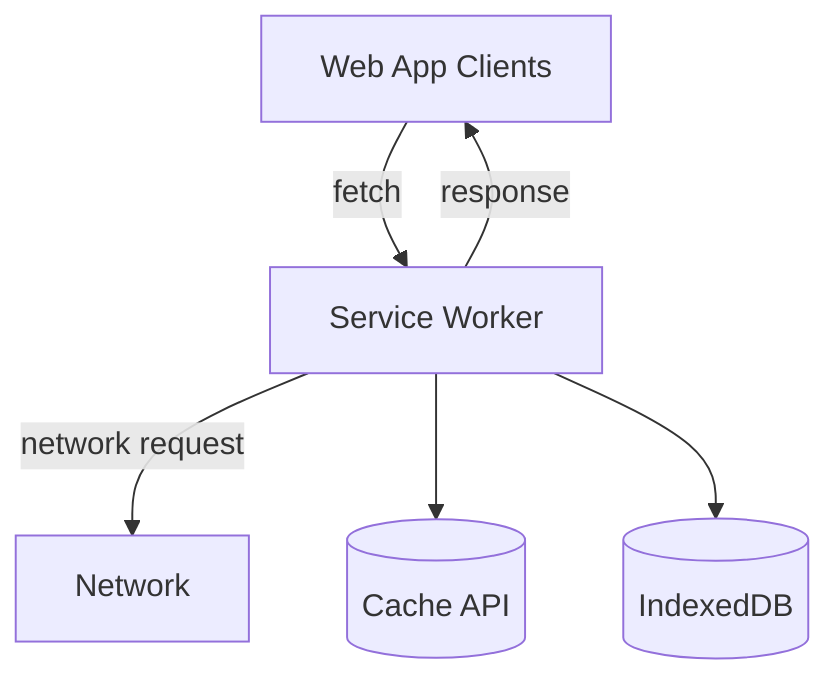

### 8.1 Responsibilities yang tepat

Service Worker cocok untuk:

- intercept `fetch`,
- offline fallback,
- app shell caching,
- stale-while-revalidate,
- cache invalidation,
- push notification,
- background sync,
- notifying clients about updates.

### 8.2 Batasan mental model

Jangan menganggap service worker sebagai:

- always-running process,
- global in-memory database,
- reliable interval scheduler,
- replacement untuk backend job queue,
- replacement untuk all-purpose SharedWorker.

Service worker bisa dimulai dan dihentikan oleh browser. State penting harus disimpan di storage durable.

### 8.3 Service worker lifecycle sederhana

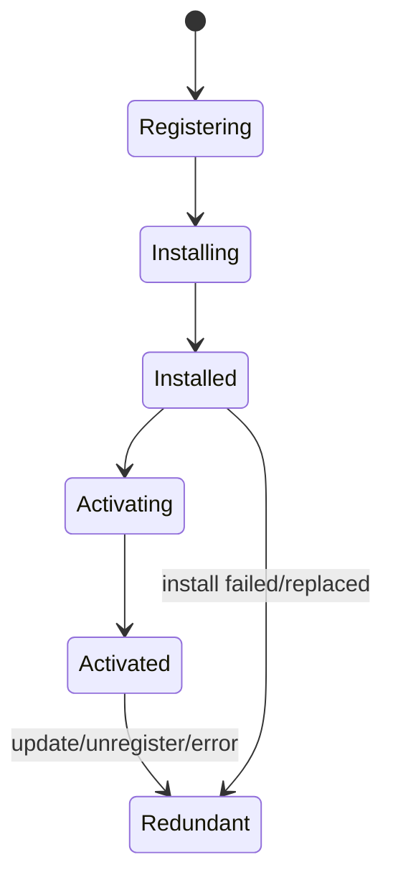

### 8.4 Update trap

Frontend deploy punya masalah khas:

```txt
Old tab still controlled by old service worker.
New tab may use new assets.
Waiting service worker may exist.
Cache may contain multiple versions.
IndexedDB schema may be migrated by new code.
```

Karena itu service worker update bukan sekadar:

```ts
registration.update();
```

Perlu desain:

- asset manifest version,
- client notification,
- safe reload prompt,
- schema compatibility,
- cache cleanup lock,
- old/new protocol support.

### 8.5 Messaging service worker dengan clients

Client ke service worker:

```ts
navigator.serviceWorker.controller?.postMessage({
  type: 'SKIP_WAITING_REQUESTED',
  requestedAt: Date.now(),
});
```

Service worker ke clients:

```ts
self.addEventListener('message', (event) => {
  if (event.data?.type === 'SKIP_WAITING_REQUESTED') {
    self.skipWaiting();
  }
});

async function broadcastToClients(message: unknown) {
  const clients = await self.clients.matchAll({
    type: 'window',
    includeUncontrolled: true,
  });

  for (const client of clients) {
    client.postMessage(message);
  }
}
```

Catatan: kode service worker TypeScript biasanya butuh konfigurasi lib dan typing yang tepat. Detail bundling akan dibahas nanti.

---

## 9. Worklet

Worklet adalah context kecil dan specialized.

Contoh:

| Worklet | Use case |
|---|---|
| AudioWorklet | low-latency audio processing |
| PaintWorklet | CSS custom painting |
| AnimationWorklet | animation worklet model tertentu |
| LayoutWorklet | custom layout model tertentu |

Prinsipnya:

```txt
Use Worklet when the platform feature requires it.
Do not use Worklet as a general background worker.
```

Untuk seri ini, worklet akan masuk saat kita membahas rendering/performance. Fokus utama tetap Window, Dedicated Worker, SharedWorker, Service Worker, BroadcastChannel, Web Locks, dan storage.

---

## 10. Event Loop dan Agent Boundary

Kita tidak perlu menghafal semua detail spesifikasi untuk produktif, tetapi perlu memahami konsekuensinya.

Setiap context menjalankan task melalui event loop. Ada task queue dan microtask queue. Worker memiliki worker event loop. Window memiliki event loop yang juga terkait rendering opportunity.

Implikasi praktis:

1. Main thread window bertanggung jawab atas UI responsiveness.
2. Long task di window mengganggu input dan rendering.
3. Worker memindahkan kerja ke event loop lain.
4. Komunikasi antar context selalu asynchronous.
5. Data yang dikirim antar context harus melewati structured clone/transfer/shared memory semantics.
6. Jangan mengandalkan synchronous shared state antar window/worker, kecuali memakai shared memory dengan desain khusus.

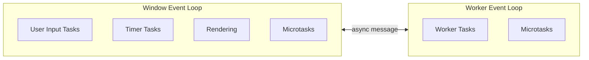

### 10.1 Kenapa ini penting?

Jika kamu melakukan ini di main thread:

```ts
for (const item of hugeDataset) {
  expensiveProcess(item);
}
```

maka browser tidak bisa memproses input/rendering sampai task selesai.

Jika dipindahkan ke worker:

```ts
worker.postMessage({ type: 'PROCESS_DATASET', payload });
```

main thread tetap punya kesempatan memproses UI. Tetapi kamu sekarang punya masalah baru:

- message protocol,
- data copy cost,
- cancellation,
- progress,
- error propagation,
- worker lifecycle.

Tidak ada free lunch. Ada trade-off yang lebih tepat.

---

## 11. Data Movement Boundary

Setiap kali data melewati boundary, ada biaya dan semantics.

### 11.1 Structured clone

Banyak browser messaging API memakai structured clone. Ini memungkinkan object kompleks dikirim tanpa JSON stringify manual, tetapi tidak semua object bisa dikloning.

Konsekuensi:

- function tidak bisa dikirim,
- prototype/class semantics bisa berubah,
- object besar bisa mahal,
- error object punya perilaku tertentu,
- transferables bisa menghindari copy untuk beberapa data.

### 11.2 Transferable

Transferable memindahkan ownership object tertentu.

```ts
const bytes = new Uint8Array(1024 * 1024 * 100);
worker.postMessage({ type: 'PROCESS', buffer: bytes.buffer }, [bytes.buffer]);
```

Setelah transfer, sender tidak lagi memakai buffer seperti sebelumnya. Ini bagus untuk pipeline performa tinggi.

### 11.3 Shared memory

SharedArrayBuffer memungkinkan memory dibaca/ditulis lintas thread, tetapi membutuhkan secure context dan cross-origin isolation. Ini masuk kategori advanced. Gunakan saat message passing tidak cukup.

Risiko:

- data race,
- deadlock/spin wait buruk,
- debugging sulit,
- portability lebih rumit,
- security header harus benar.

Untuk kebanyakan aplikasi enterprise, mulai dari message passing. Naik ke SharedArrayBuffer hanya ketika profiling membuktikan kebutuhan.

---

## 12. Storage Boundary

Storage bukan hanya tempat menyimpan data. Dalam multi-tab orchestration, storage adalah media koordinasi dan recovery.

### 12.1 IndexedDB

Cocok untuk:

- offline queue,
- client-side event log,
- entity cache,
- large structured data,
- migration state,
- replay checkpoint.

Risiko:

- versionchange blocked oleh tab lama,
- schema migration conflict,
- transaction abort,
- quota exceeded,
- serialization cost,
- stale reads jika runtime tidak invalidasi cache memory.

### 12.2 Cache API

Cocok untuk:

- request/response caching,
- app shell,
- asset versioning,
- offline fallback,
- API response artifact tertentu.

Risiko:

- stale response,
- cache key salah,
- cleanup race,
- old/new service worker conflict.

### 12.3 OPFS

Cocok untuk:

- file-like data besar,
- binary data,
- worker-heavy processing,
- local document processing,
- large generated artifacts.

Risiko:

- quota,
- locking/access coordination,
- browser support constraints,
- migration/cleanup.

### 12.4 localStorage

`localStorage` sering dipakai untuk cross-tab signaling lama melalui storage event, tetapi hati-hati:

- synchronous API,
- bisa mengganggu main thread,
- kapasitas terbatas,
- tidak cocok untuk data besar,
- bukan transactional database.

Gunakan untuk kasus sangat sederhana atau fallback, bukan fondasi runtime besar.

---

## 13. Communication Matrix

| From | To | Primitive umum | Catatan |
|---|---|---|---|
| Window | Dedicated Worker | `worker.postMessage` | owned by window |
| Dedicated Worker | Window | `postMessage` | result/progress/error |
| Window | SharedWorker | `MessagePort` | port harus dikelola |
| SharedWorker | Window | `MessagePort` | routing perlu client id |
| Window | Window same-origin | `BroadcastChannel` | no durable history |
| Window | Iframe | `postMessage` | validate origin |
| Service Worker | Window | `client.postMessage` | match clients |
| Window | Service Worker | `navigator.serviceWorker.controller.postMessage` | controller bisa null |
| Worker | Worker | via owner/MessageChannel/SharedWorker | tidak otomatis langsung |
| Any eligible context | Any eligible context | storage + notification | durable pattern |

---

## 14. Context Identity Registry

Karena banyak context bisa berjalan, kita butuh registry identity.

```ts
export type RuntimeContextKind =
  | 'window'
  | 'iframe'
  | 'dedicated-worker'
  | 'shared-worker'
  | 'service-worker'
  | 'worklet';

export interface RuntimeContextDescriptor {
  contextId: string;
  kind: RuntimeContextKind;
  origin: string;
  storageKey?: string;
  buildId: string;
  protocolVersion: number;
  createdAt: number;
  parentContextId?: string;
  visibility?: 'active' | 'passive' | 'hidden' | 'frozen' | 'unknown';
  capabilities: RuntimeCapabilities;
}

export interface RuntimeCapabilities {
  broadcastChannel: boolean;
  webLocks: boolean;
  serviceWorker: boolean;
  sharedWorker: boolean;
  indexedDB: boolean;
  cacheApi: boolean;
  opfs: boolean;
  sharedArrayBuffer: boolean;
  crossOriginIsolated: boolean;
}
```

Feature detection:

```ts
export function detectRuntimeCapabilities(): RuntimeCapabilities {
  return {
    broadcastChannel: typeof BroadcastChannel !== 'undefined',
    webLocks: typeof navigator !== 'undefined' && 'locks' in navigator,
    serviceWorker: typeof navigator !== 'undefined' && 'serviceWorker' in navigator,
    sharedWorker: typeof SharedWorker !== 'undefined',
    indexedDB: typeof indexedDB !== 'undefined',
    cacheApi: typeof caches !== 'undefined',
    opfs:
      typeof navigator !== 'undefined' &&
      Boolean(navigator.storage && 'getDirectory' in navigator.storage),
    sharedArrayBuffer: typeof SharedArrayBuffer !== 'undefined',
    crossOriginIsolated:
      typeof globalThis !== 'undefined' &&
      Boolean((globalThis as typeof globalThis & { crossOriginIsolated?: boolean }).crossOriginIsolated),
  };
}
```

Runtime descriptor:

```ts
export function createRuntimeContextDescriptor(
  kind: RuntimeContextKind,
  parentContextId?: string,
): RuntimeContextDescriptor {
  return {
    contextId: crypto.randomUUID(),
    kind,
    origin: location.origin,
    buildId: import.meta.env.VITE_BUILD_ID ?? 'dev',
    protocolVersion: 1,
    createdAt: Date.now(),
    parentContextId,
    visibility: kind === 'window' ? 'unknown' : undefined,
    capabilities: detectRuntimeCapabilities(),
  };
}
```

---

## 15. Choosing the Right Actor

### 15.1 Use Window when...

- pekerjaan berhubungan langsung dengan UI,
- membutuhkan DOM,
- membutuhkan user gesture,
- harus menampilkan prompt/confirmation,
- state bersifat view-local.

### 15.2 Use Dedicated Worker when...

- pekerjaan CPU-heavy,
- hasilnya milik satu tab,
- task bisa dibatalkan,
- progress bisa dikirim,
- tidak butuh DOM,
- data movement cost masih masuk akal.

### 15.3 Use SharedWorker when...

- banyak tab butuh hub in-memory,
- ingin satu koneksi untuk banyak tab,
- routing antar clients penting,
- fallback strategy tersedia,
- target browser mendukung.

### 15.4 Use Service Worker when...

- masalah utamanya fetch/cache/offline,
- butuh intercept request,
- butuh update coordination,
- butuh push/background sync,
- tidak butuh process yang selalu hidup.

### 15.5 Use BroadcastChannel when...

- butuh signal lintas tab sederhana,
- message tidak perlu durable,
- receiver bisa membaca ulang state,
- tidak butuh request/response kompleks.

### 15.6 Use Web Locks when...

- butuh mutual exclusion lintas tab/worker,
- task tidak boleh dijalankan paralel,
- lock scope jelas,
- operation tetap idempotent.

### 15.7 Use IndexedDB when...

- state harus survive reload,
- data structured,
- perlu queue/checkpoint,
- perlu versioned local state,
- perlu recovery setelah crash.

---

## 16. Topology Patterns

### 16.1 Per-tab worker topology

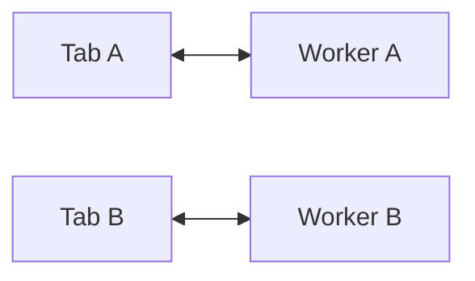

Cocok untuk task lokal.

Contoh:

- tab A import file,
- tab B buka report lain,
- masing-masing punya worker sendiri.

Risiko:

- resource usage meningkat jika banyak tab,
- duplicate computation,
- tidak ada shared cache in-memory.

### 16.2 Broadcast bus topology

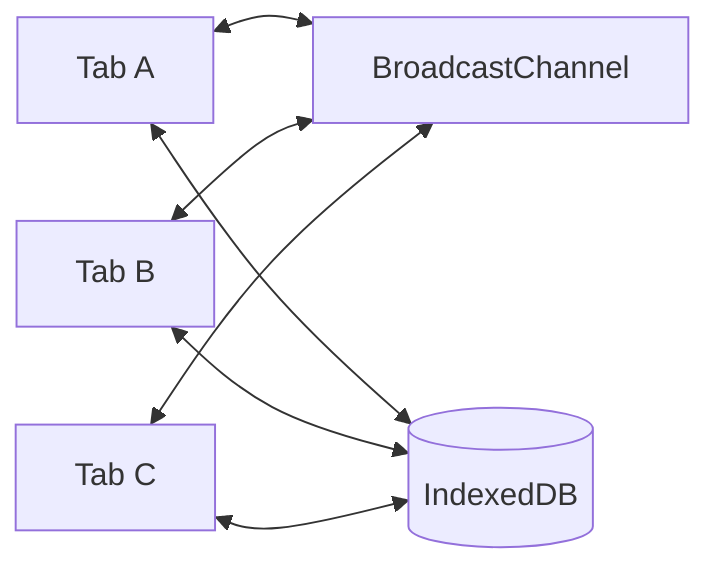

Cocok untuk state-change notification.

Contoh:

- logout,
- entity updated,
- queue changed,
- settings changed.

Risiko:

- no durable history,
- tab baru harus read from store,
- message protocol tetap perlu.

### 16.3 SharedWorker hub topology

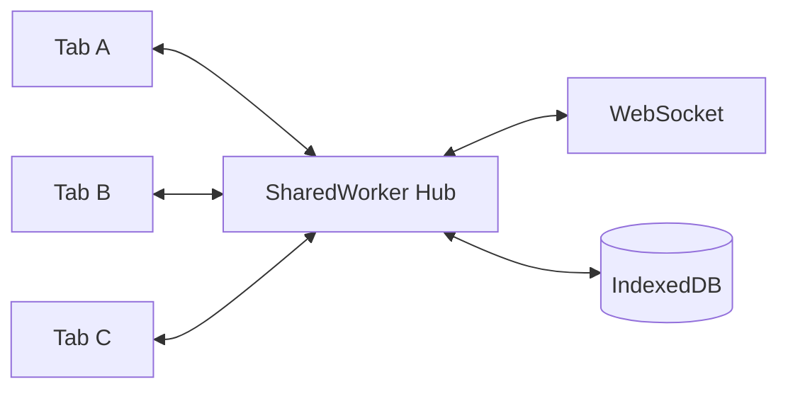

Cocok untuk shared connection dan in-memory routing.

Risiko:

- fallback,
- port cleanup,
- hub lifecycle,
- browser support.

### 16.4 Service worker network topology

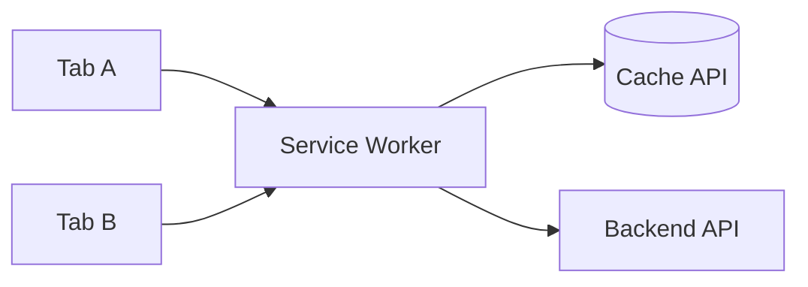

Cocok untuk offline/cache/fetch.

Risiko:

- update lifecycle,
- stale cache,
- assuming always running.

### 16.5 Leader tab topology

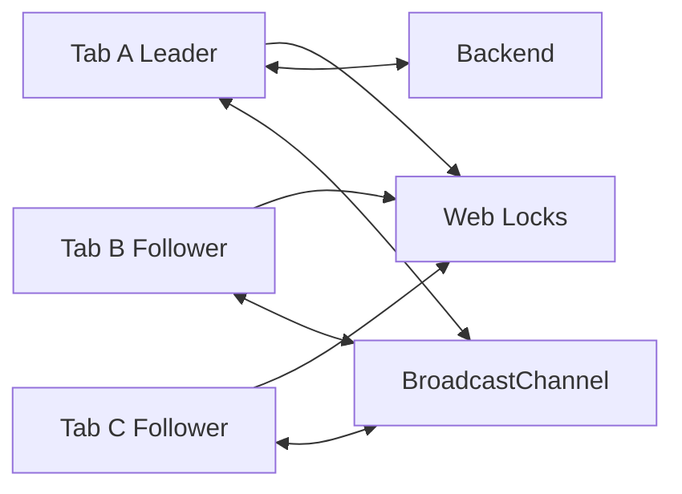

Cocok untuk fallback cross-tab singleton tanpa SharedWorker.

Risiko:

- leader failure,
- heartbeat tuning,
- split-brain jika fallback lock buruk,
- lifecycle edge cases.

---

## 17. Failure Mode per Context

| Context | Failure | Mitigasi |
|---|---|---|
| Window | close/reload | persist before hidden, durable commands |
| Window | hidden/frozen | stop noncritical work, release/avoid ownership |
| Window | old build | protocol version, backward-compatible schema |
| Iframe | origin mismatch | strict origin validation |
| Iframe | sandbox limitation | explicit capability design |
| Dedicated Worker | owner dies | checkpoint durable state |
| Dedicated Worker | uncaught error | error boundary, restart, poison message handling |
| SharedWorker | client disconnect | heartbeat/port registry cleanup |
| SharedWorker | hub unavailable | fallback topology |
| Service Worker | stopped while idle | no in-memory critical state |
| Service Worker | update conflict | version protocol and client messaging |
| BroadcastChannel | receiver missing | storage-backed state reload |
| Web Locks | unavailable | fallback lock/leader strategy |
| IndexedDB | blocked migration | close old connections, user prompt, compatibility |

---

## 18. Anti-Patterns

### 18.1 Global singleton in module scope

```ts
export const socket = new WebSocket('/events');
```

Di multi-tab scenario, ini berarti satu socket per tab. Kadang itu benar. Sering kali tidak.

### 18.2 Worker as durable state

```ts
// Anti-pattern
let offlineQueue: Command[] = [];
```

Jika worker mati, queue hilang. Simpan command penting di IndexedDB.

### 18.3 Broadcast as source of truth

```ts
channel.postMessage({ type: 'CURRENT_USER', user });
```

Tab baru tidak menerima history. Lebih baik broadcast version/signal, lalu read from source.

### 18.4 No protocol version

```ts
postMessage({ action: 'sync', data });
```

Setelah deploy, old tab dan new tab bisa salah paham. Gunakan versioned envelope.

### 18.5 Assume service worker controls page immediately

Setelah register, page saat ini belum tentu langsung controlled. Runtime harus handle `navigator.serviceWorker.controller === null`.

### 18.6 Heavy JSON through worker boundary

Mengirim object besar terus-menerus bisa lebih mahal daripada processing di tempat. Ukur data movement cost. Gunakan Transferable/chunking bila perlu.

---

## 19. Implementation Anchor: Runtime Topology Detector

Buat satu modul kecil untuk mengetahui topology saat runtime.

```ts
export interface RuntimeTopology {
  context: RuntimeContextDescriptor;
  hasServiceWorkerController: boolean;
  canUseBroadcastBus: boolean;
  canUseWebLocks: boolean;
  canUseSharedWorkerHub: boolean;
  recommendedCoordinationMode: 'web-locks' | 'broadcast-fallback' | 'single-tab-only';
}

export function detectRuntimeTopology(context: RuntimeContextDescriptor): RuntimeTopology {
  const hasServiceWorkerController =
    typeof navigator !== 'undefined' &&
    'serviceWorker' in navigator &&
    Boolean(navigator.serviceWorker.controller);

  const canUseBroadcastBus = context.capabilities.broadcastChannel;
  const canUseWebLocks = context.capabilities.webLocks;
  const canUseSharedWorkerHub = context.capabilities.sharedWorker;

  let recommendedCoordinationMode: RuntimeTopology['recommendedCoordinationMode'];

  if (canUseWebLocks) {
    recommendedCoordinationMode = 'web-locks';
  } else if (canUseBroadcastBus && context.capabilities.indexedDB) {
    recommendedCoordinationMode = 'broadcast-fallback';
  } else {
    recommendedCoordinationMode = 'single-tab-only';
  }

  return {
    context,
    hasServiceWorkerController,
    canUseBroadcastBus,
    canUseWebLocks,
    canUseSharedWorkerHub,
    recommendedCoordinationMode,
  };
}
```

Ini bukan final architecture. Ini kebiasaan penting: **runtime harus tahu kemampuan environment**, bukan assume semua API tersedia.

---

## 20. Decision Table: Common Use Cases

| Use case | Actor utama | Primitive pendukung | Durable? | Catatan |
|---|---|---|---:|---|
| CSV import besar | Dedicated Worker | Transferable, progress messages | Optional | checkpoint jika proses panjang |
| Token refresh | Window/worker coordinator | Web Locks, BroadcastChannel, IndexedDB | Ya | single-flight + version |
| Logout semua tab | Any tab initiator | BroadcastChannel + storage cleanup | Ya | security cleanup harus idempotent |
| Offline mutation queue | Worker/leader tab | IndexedDB, Web Locks, BroadcastChannel | Ya | server idempotency wajib |
| Shared WebSocket | SharedWorker/leader tab | MessagePort/BroadcastChannel | Optional | fallback penting |
| Cache update | Service Worker | Cache API, clients messaging | Ya | handle old/new clients |
| DB migration | Window/worker coordinator | IndexedDB versionchange, Web Locks | Ya | old tab handling penting |
| Notification suppression | Coordination plane | BroadcastChannel, storage | Ya | avoid duplicate notification |
| Heavy rendering | Dedicated Worker | OffscreenCanvas | Optional | feature detect |
| Ultra-low-latency buffer | Worker | SharedArrayBuffer, Atomics | Optional | cross-origin isolation |

---

## 21. Practical Heuristics

Gunakan heuristik ini sebelum memilih API.

### 21.1 Jika butuh DOM, tetap di Window

Worker tidak punya DOM. Jangan memaksa worker melakukan pekerjaan UI.

### 21.2 Jika butuh CPU isolation, Dedicated Worker dulu

Mulai dari dedicated worker sebelum worker pool. Worker pool menambah scheduling complexity.

### 21.3 Jika butuh cross-tab signal, BroadcastChannel dulu

Untuk signal sederhana, BroadcastChannel cukup. Jangan langsung membangun SharedWorker hub.

### 21.4 Jika butuh cross-tab singleton, Web Locks dulu

Jika target mendukung, Web Locks memberi primitive paling langsung untuk mutual exclusion.

### 21.5 Jika butuh network interception, Service Worker

Jangan memakai SharedWorker untuk menggantikan fetch interception. Service worker memang berada di network path.

### 21.6 Jika butuh durable recovery, IndexedDB/OPFS/server

Jangan simpan state critical hanya di memory context mana pun.

### 21.7 Jika butuh browser compatibility luas, desain fallback dari awal

Feature detection bukan tambahan di akhir. Ia memengaruhi architecture.

---

## 22. Observability Requirements per Context

Minimal log fields:

```ts
interface RuntimeLogFields {
  timestamp: number;
  level: 'debug' | 'info' | 'warn' | 'error';
  event: string;
  contextId: string;
  contextKind: RuntimeContextKind;
  buildId: string;
  protocolVersion: number;
  lifecycleState?: string;
  leaderId?: string;
  lockName?: string;
  correlationId?: string;
  messageId?: string;
  taskId?: string;
  errorCode?: string;
}
```

Contoh log bagus:

```json
{
  "timestamp": 1783380000000,
  "level": "info",
  "event": "auth.refresh.lock_acquired",
  "contextId": "tab-8d3f",
  "contextKind": "window",
  "buildId": "2026.07.07.1",
  "protocolVersion": 1,
  "lockName": "auth-refresh",
  "correlationId": "req-92af"
}
```

Contoh log buruk:

```txt
refreshing token
```

Dalam bug multi-tab, log tanpa context identity hampir tidak berguna.

---

## 23. Testing Implications

Begitu execution context dipetakan, strategi testing berubah.

Kamu perlu menguji:

- satu tab,
- dua tab,
- tab leader closed,
- hidden tab,
- service worker update,
- worker crash,
- duplicate message,
- stale message,
- old build/new build protocol,
- IndexedDB blocked migration,
- offline/online replay,
- BroadcastChannel unavailable,
- Web Locks unavailable.

Playwright dapat membuka beberapa page dalam satu browser context untuk simulasi cross-tab. Tetapi beberapa lifecycle seperti discard/freeze perlu strategi khusus dan tidak selalu bisa diuji sempurna secara otomatis.

Testing mindset:

```txt
Do not only test API behavior.
Test topology behavior.
```

---

## 24. Checklist Part 002

Pastikan kamu bisa menjawab:

- [ ] Apa beda Window, Tab, dan browsing context secara praktis?
- [ ] Kapan memakai Dedicated Worker?
- [ ] Kenapa Dedicated Worker tidak menyelesaikan cross-tab sharing?
- [ ] Kapan SharedWorker lebih tepat dari BroadcastChannel?
- [ ] Kenapa Service Worker bukan daemon?
- [ ] Bagaimana iframe memengaruhi security boundary?
- [ ] Apa bedanya communication primitive dan execution context?
- [ ] Apa saja state yang harus durable?
- [ ] Apa saja failure mode setiap context?
- [ ] Bagaimana mendeteksi capability runtime?
- [ ] Mengapa context identity wajib untuk observability?

---

## 25. Latihan Desain

Desain topology untuk tiga skenario berikut.

### 25.1 Evidence upload app

User bisa upload file besar, file diproses lokal untuk hash dan preview, lalu dikirim ke server. User bisa membuka beberapa tab.

Tentukan:

- apa yang berjalan di Window,
- apa yang berjalan di Dedicated Worker,
- apa yang disimpan di IndexedDB/OPFS,
- bagaimana upload tidak duplicate,
- bagaimana progress disinkronkan antar tab.

### 25.2 Regulatory dashboard dengan live event

Dashboard menampilkan live event dari backend. User bisa membuka beberapa dashboard tab.

Tentukan:

- apakah setiap tab membuka WebSocket,
- apakah memakai SharedWorker hub,
- fallback jika SharedWorker tidak tersedia,
- bagaimana tab baru catch up state terakhir,
- bagaimana notification tidak muncul ganda.

### 25.3 Offline case mutation queue

User bisa membuat perubahan saat offline. Saat online, perubahan harus dikirim ke server dengan urutan tertentu.

Tentukan:

- command store,
- replay owner,
- lock strategy,
- idempotency key,
- conflict handling,
- cross-tab UI update.

---

## 26. Ringkasan

Part ini memetakan aktor runtime browser.

Intinya:

1. Window cocok untuk UI, bukan global singleton side effect tanpa koordinasi.
2. Iframe adalah boundary yang harus diperlakukan eksplisit, terutama cross-origin.
3. Dedicated Worker cocok untuk background computation milik satu owner.
4. SharedWorker cocok sebagai hub lintas context, tetapi memory-nya tidak durable.
5. Service Worker cocok untuk network/cache/offline, tetapi bukan process abadi.
6. BroadcastChannel adalah bus sinyal, bukan state store.
7. Web Locks adalah primitive mutual exclusion, bukan business guarantee.
8. IndexedDB/Cache/OPFS adalah durability layer yang tetap butuh consistency design.
9. Context identity, capability detection, dan observability adalah fondasi production.

Part berikutnya akan masuk ke Main Thread vs Background Thread: bagaimana browser memproses input/rendering, apa itu long task, kapan worker benar-benar membantu, dan kapan worker justru membuat overhead baru.

---

## References

- MDN — Web Workers API: https://developer.mozilla.org/en-US/docs/Web/API/Web_Workers_API
- MDN — DedicatedWorkerGlobalScope: https://developer.mozilla.org/en-US/docs/Web/API/DedicatedWorkerGlobalScope
- MDN — SharedWorker: https://developer.mozilla.org/en-US/docs/Web/API/SharedWorker
- MDN — Service Worker API: https://developer.mozilla.org/en-US/docs/Web/API/Service_Worker_API
- MDN — Broadcast Channel API: https://developer.mozilla.org/en-US/docs/Web/API/Broadcast_Channel_API
- MDN — Web Locks API: https://developer.mozilla.org/en-US/docs/Web/API/Web_Locks_API
- MDN — Page Visibility API: https://developer.mozilla.org/en-US/docs/Web/API/Page_Visibility_API
- MDN — SharedArrayBuffer: https://developer.mozilla.org/en-US/docs/Web/JavaScript/Reference/Global_Objects/SharedArrayBuffer
- WHATWG HTML Standard — Event loops: https://html.spec.whatwg.org/multipage/webappapis.html#event-loops
