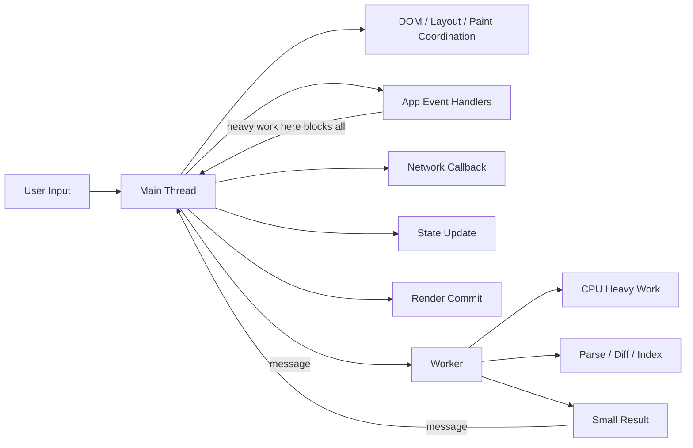
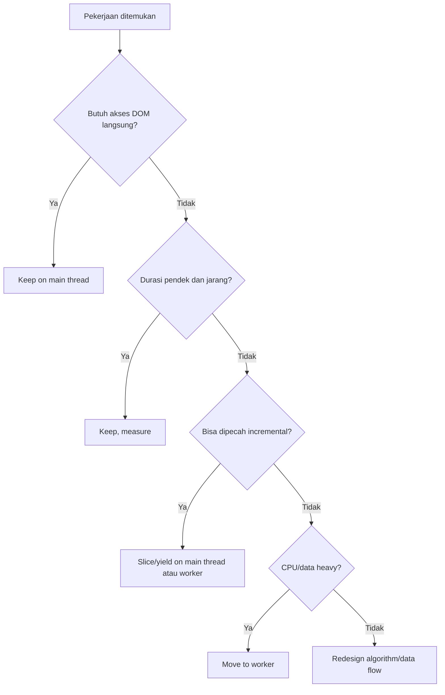
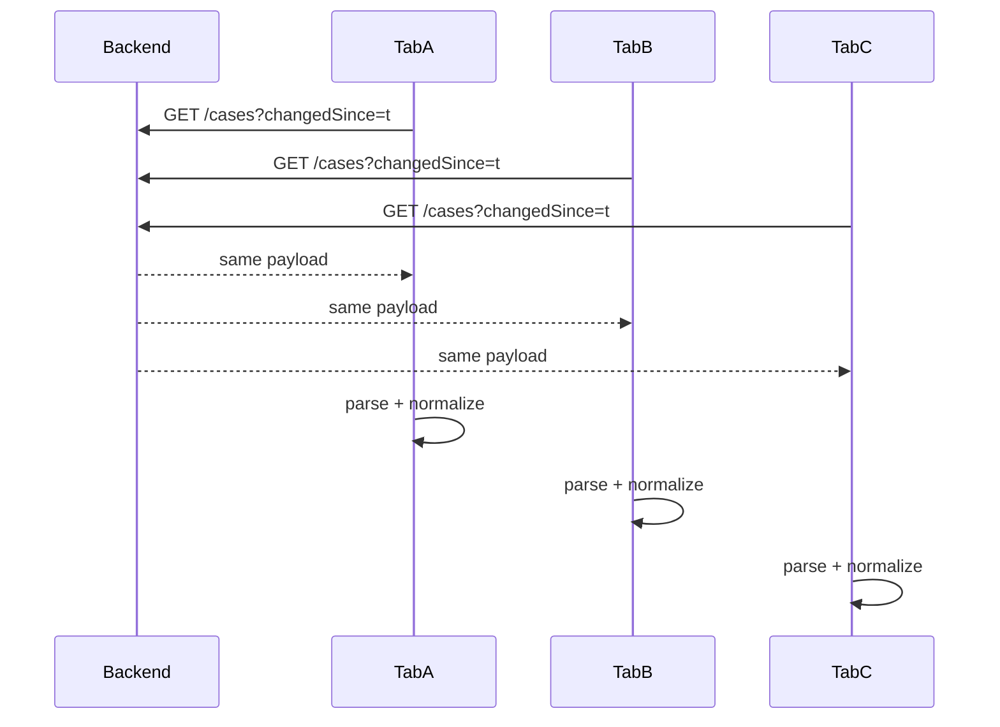
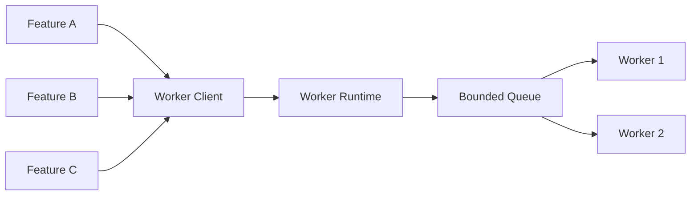
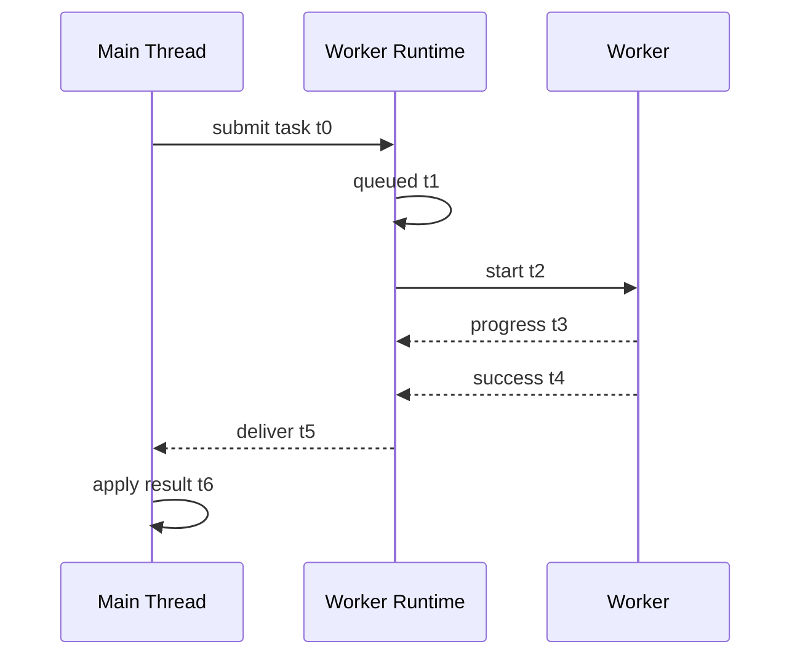
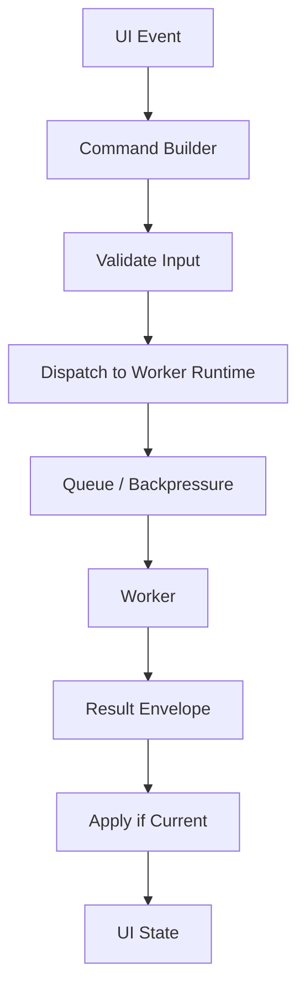
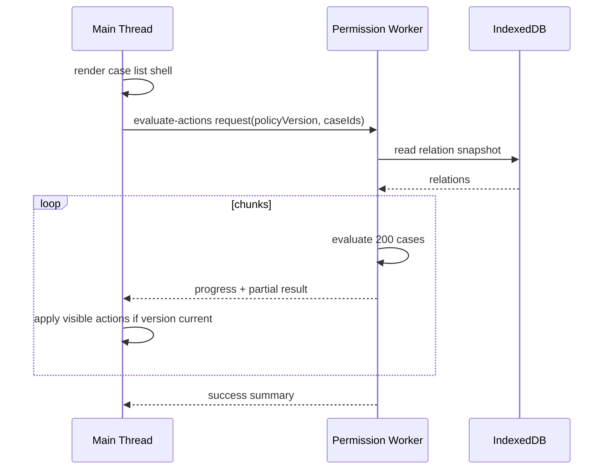

# Part 003 — Main Thread Pressure and Why Workers Exist

> Target part ini: membentuk intuisi kapan pekerjaan boleh tetap di main thread, kapan harus dipotong menjadi chunk kecil, dan kapan harus dipindahkan ke Worker. Jangan mulai dari API. Mulai dari tekanan sistem.

Banyak engineer memakai Web Worker setelah melihat UI freeze. Itu terlambat.

Worker bukan “fitur performance tambahan”. Worker adalah boundary arsitektur untuk memisahkan pekerjaan yang punya karakteristik berbeda:

- pekerjaan UI yang harus responsif,
- pekerjaan komputasi yang bisa memakan waktu,
- pekerjaan data movement yang mahal,
- pekerjaan background yang tidak harus mengganggu interaksi user,
- pekerjaan orchestration yang perlu berjalan lintas tab atau lintas context.

Di browser, main thread adalah thread yang paling mahal karena ia membawa terlalu banyak tanggung jawab. Ia bukan hanya menjalankan JavaScript aplikasi. Ia juga menangani input, event dispatch, sebagian style/layout work, rendering coordination, DOM interaction, timers, promise continuation, dan callback dari banyak API browser.

Kalau main thread sibuk, user tidak peduli alasannya. Bagi user, aplikasi “macet”.

---

## 1. Mental Model: Main Thread Itu Jalur Darurat, Bukan Gudang Kerja

Model yang sering salah:

```txt
main thread = tempat semua JavaScript berjalan
worker      = tempat opsional kalau butuh cepat
```

Model yang lebih tepat:

```txt
main thread = control plane untuk pengalaman user
worker      = compute/data plane untuk pekerjaan berat atau terisolasi
```

Main thread harus diperlakukan seperti jalur emergency di jalan raya. Ia boleh dilewati untuk pekerjaan penting, pendek, dan latency-sensitive. Ia buruk untuk pekerjaan panjang, batch, streaming parse, indexing, compression, diffing besar, atau operasi yang bisa diproses secara incremental.



Ingat invariannya:

> Semua pekerjaan yang berjalan terlalu lama di main thread bersaing langsung dengan input user.

Ini berbeda dari backend. Di backend, satu request lambat mungkin mempengaruhi worker thread tertentu. Di browser, satu task JavaScript panjang bisa membuat seluruh halaman terasa mati.

---

## 2. Apa Saja yang Dibebankan ke Main Thread?

Secara praktis, main thread menangani kategori berikut.

| Kategori | Contoh | Risiko bila berat |
|---|---|---|
| User input | click, keydown, pointermove, scroll handler | input delay, tap terasa lambat |
| JavaScript aplikasi | event handler, state reducer, validation, serialization | long task, UI freeze |
| DOM work | query DOM, mutation, measurement | layout thrashing, reflow mahal |
| Framework rendering | React/Vue/Svelte render/commit | frame drop, hydration lambat |
| Microtask continuation | Promise callbacks, `queueMicrotask` | starvation jika chain panjang |
| Timer callback | `setTimeout`, `setInterval` | drift, batch callback setelah tab resume |
| Browser callback | observer, network, storage, channel callback | event backlog |
| Coordination glue | auth refresh handling, cross-tab events | race jika callback telat |

Main thread bukan hanya CPU. Ia adalah scheduler bottleneck.

Kalau sebuah operasi memakan 400ms di main thread, masalahnya bukan cuma “400ms CPU”. Masalahnya adalah selama 400ms itu browser tidak bisa menjalankan task lain di event loop yang sama.

---

## 3. Long Task: Gejala, Bukan Root Cause

Long task biasanya didefinisikan sebagai task yang menahan UI thread selama 50ms atau lebih. Ambang 50ms ini penting bukan karena 49ms selalu aman, tetapi karena ia memberi sinyal bahwa event loop tidak mendapat kesempatan cukup cepat untuk menerima pekerjaan lain.

```txt
0ms       user click masuk queue
5ms       app memulai parsing JSON besar
5-280ms   main thread sibuk
281ms     browser baru bisa proses click
```

Dari sudut pandang aplikasi, parsing JSON “hanya” 275ms.

Dari sudut pandang user, input tertunda.

### 3.1 Blocking period

Jika task berjalan 180ms, bagian yang paling mengganggu bukan 180ms penuh, melainkan durasi di atas threshold responsivitas. Secara mental:

```txt
long task duration = 180ms
safe-ish window    = 50ms
blocking period    = 130ms
```

Jangan memaknai angka ini secara dogmatis. Gunakan sebagai alarm desain.

### 3.2 Long task yang paling sering muncul di aplikasi bisnis

Di aplikasi enterprise/regulatory/case-management, long task sering muncul dari:

- parsing payload besar,
- normalisasi nested entities,
- permission matrix evaluation,
- table virtualization yang salah,
- client-side search/filter/sort pada dataset besar,
- diff dokumen atau form schema,
- PDF/image preprocessing,
- encrypt/decrypt payload,
- optimistic state reconciliation,
- replay offline queue,
- audit trail rendering,
- serialization state untuk persistence,
- migration IndexedDB saat app startup.

Banyak dari pekerjaan ini terlihat “business logic”, sehingga diam-diam masuk main thread. Itu yang berbahaya.

---

## 4. Frame Budget: Kenapa 16ms Sering Disebut, Tapi Tidak Cukup

Untuk animasi 60fps, satu frame kira-kira punya budget 16.67ms.

```txt
1000ms / 60 frames ≈ 16.67ms per frame
```

Namun JavaScript aplikasi tidak mendapatkan seluruh 16ms. Browser masih perlu waktu untuk input, style, layout, paint, compositing, dan pekerjaan internal lain.

Model kasar:

```txt
Frame budget 16.67ms
├─ input handling
├─ JavaScript app code
├─ style calculation
├─ layout
├─ paint
└─ compositing
```

Jadi target “task di bawah 16ms” pun tidak otomatis aman. Jika aplikasi melakukan 12ms JavaScript setiap frame, lalu layout butuh 8ms, frame tetap drop.

Untuk aplikasi non-animasi, targetnya bukan selalu 60fps. Tetapi untuk input responsiveness, prinsipnya sama:

> Semakin lama main thread tidak yield, semakin buruk peluang browser merespons user tepat waktu.

---

## 5. Worker Tidak Membuat Kode “Lebih Cepat” Secara Ajaib

Ini asumsi lemah yang harus dibuang:

```txt
pindah ke worker => otomatis lebih cepat
```

Worker bisa membuat UI lebih responsif karena pekerjaan berat tidak memblokir main thread. Tetapi total latency bisa naik bila data movement mahal.

Contoh:

```txt
main thread parse 80ms
worker parse 80ms + copy input 40ms + copy output 20ms = 140ms end-to-end
```

Apakah worker buruk? Belum tentu.

Jika 80ms di main thread menyebabkan input freeze, worker tetap lebih baik dari sisi UX. Tetapi dari sisi throughput dan latency total, desain data movement harus dihitung.

### 5.1 Worker membantu saat bottleneck-nya main-thread occupancy

Worker cocok saat:

- UI freeze karena pekerjaan CPU panjang,
- user tetap harus bisa interact saat proses jalan,
- pekerjaan bisa dijalankan tanpa akses DOM,
- data input/output bisa dibatasi,
- pekerjaan bisa dipecah menjadi task,
- failure worker bisa diretry,
- ordering dan cancellation bisa dikontrol.

### 5.2 Worker tidak membantu saat bottleneck-nya network atau DOM

Worker tidak menyelesaikan:

- endpoint lambat,
- DOM rendering terlalu banyak,
- layout thrashing,
- CSS selector mahal,
- image decode/render path tertentu,
- state model framework yang menyebabkan rerender masif,
- data yang tetap harus dipindahkan bolak-balik besar.

Worker adalah tool untuk isolasi dan concurrency, bukan pengganti desain UI yang benar.

---

## 6. Taxonomy Pekerjaan: Keep, Slice, Move, or Redesign

Sebelum membuat worker, klasifikasikan pekerjaan.



### 6.1 Keep on main thread

Tetap di main thread bila:

- operasi sangat pendek,
- perlu akses DOM langsung,
- hasilnya harus sinkron untuk event handler,
- overhead message passing lebih besar dari kerja itu sendiri,
- kompleksitas worker tidak sebanding.

Contoh:

```ts
button.addEventListener('click', () => {
  // OK: update class, schedule state update, trigger small action.
  button.classList.add('loading');
});
```

### 6.2 Slice on main thread

Potong menjadi batch bila:

- operasi bisa incremental,
- pekerjaan masih perlu data UI/main-thread,
- worker belum diperlukan,
- latency total boleh lebih panjang asalkan UI tetap responsif.

Contoh pola:

```ts
async function processInChunks<T>(
  items: T[],
  chunkSize: number,
  process: (item: T) => void,
  yieldToBrowser: () => Promise<void>
) {
  for (let i = 0; i < items.length; i += chunkSize) {
    const chunk = items.slice(i, i + chunkSize);

    for (const item of chunk) {
      process(item);
    }

    await yieldToBrowser();
  }
}
```

Yield sederhana:

```ts
function yieldWithTimeout(): Promise<void> {
  return new Promise(resolve => setTimeout(resolve, 0));
}
```

Yield ini bukan sempurna. Ia memasukkan continuation ke task berikutnya, memberi browser peluang memproses task lain. Di part scheduling lanjut, kita akan bahas `scheduler.yield()`, `requestIdleCallback`, `requestAnimationFrame`, dan trade-off masing-masing.

### 6.3 Move to worker

Pindah ke worker bila:

- pekerjaan CPU-bound,
- data bisa dikirim sebagai snapshot,
- tidak perlu akses DOM,
- bisa diperlakukan sebagai command/request,
- cancellation bisa dimodelkan,
- result bisa dikirim balik dalam bentuk ringkas.

Contoh:

```ts
// main.ts
const worker = new Worker(new URL('./indexer.worker.ts', import.meta.url), {
  type: 'module',
});

worker.postMessage({
  type: 'build-index',
  requestId: crypto.randomUUID(),
  records,
});

worker.onmessage = event => {
  const message = event.data;

  if (message.type === 'build-index:success') {
    applySearchIndexMetadata(message.summary);
  }
};
```

```ts
// indexer.worker.ts
self.onmessage = event => {
  const message = event.data;

  if (message.type !== 'build-index') return;

  const index = buildIndex(message.records);

  self.postMessage({
    type: 'build-index:success',
    requestId: message.requestId,
    summary: index.summary,
  });
};
```

### 6.4 Redesign

Kadang worker hanya menyembunyikan desain buruk.

Contoh masalah:

```txt
User membuka tabel 250.000 row.
Frontend mengambil semua row.
Frontend filter/sort/search semua data.
Lalu hasil dirender sebagian dengan virtualized table.
```

Worker bisa membantu search. Tapi pertanyaan desainnya:

- Apakah data harus seluruhnya ke client?
- Apakah query harus server-side?
- Apakah user butuh full-text search lokal?
- Apakah index bisa dibangun incremental?
- Apakah snapshot bisa dipartisi?
- Apakah cache lokal punya TTL dan schema version?

Worker bukan izin untuk memindahkan beban backend ke browser tanpa batas.

---

## 7. Main Thread Pressure Dalam Aplikasi Multi-Tab

Satu tab yang berat sudah buruk. Banyak tab yang berat lebih buruk.

Setiap tab dapat memiliki main thread sendiri di proses/renderer tertentu, tetapi mereka tetap bersaing untuk resource mesin: CPU core, memory, disk, network, battery, dan scheduling browser. Selain itu, background tab bisa mengalami timer throttling, freeze, discard, atau resume burst.

Masalah multi-tab yang khas:

```txt
Tab A visible   -> render dashboard realtime
Tab B hidden    -> interval polling masih jalan
Tab C hidden    -> token refresh timer
Tab D restored  -> replay queued events
Tab E new       -> migration IndexedDB
```

Kalau semua tab menganggap dirinya aktif penuh, aplikasi menjadi noisy neighbor terhadap dirinya sendiri.

### 7.1 Background tab bukan worker

Jangan menganggap tab hidden sebagai background worker.

Hidden tab:

- masih punya page lifecycle sendiri,
- timer bisa dibatasi,
- bisa freeze,
- bisa discard,
- bisa resume dengan state usang,
- masih punya UI dan DOM,
- tidak ideal sebagai tempat single source of truth.

Worker pun bukan selalu abadi, tetapi setidaknya ia memberi boundary eksplisit untuk pekerjaan non-UI.

### 7.2 Multi-tab pressure multiplier

Jika satu tab melakukan polling tiap 10 detik, lima tab melakukan lima kali polling.

Jika satu tab melakukan parsing payload 80ms, lima tab bisa membuat CPU spike berulang.

Jika satu tab membuka WebSocket, delapan tab membuka delapan connection.

Masalah ini bukan performance micro-optimization. Ini orchestration problem.



Orchestration goal:

```txt
only one context fetches / computes;
others receive compact result or invalidation signal.
```

---

## 8. Pressure Sources: CPU, Memory, IO, and Coordination

Untuk menentukan strategi, bedakan jenis tekanan.

### 8.1 CPU pressure

Gejala:

- long task,
- UI freeze,
- fan laptop menyala,
- input delay,
- worker CPU tinggi,
- battery drain.

Sumber:

- parsing besar,
- compression,
- encryption,
- hashing,
- diffing,
- sorting,
- search indexing,
- permission evaluation massal.

Strategi:

- move to worker,
- chunk processing,
- reduce algorithmic complexity,
- precompute,
- cache index,
- avoid recompute across tabs.

### 8.2 Memory pressure

Gejala:

- tab reload sendiri,
- browser discard tab,
- GC pause,
- worker terminated,
- device low-end crash,
- structured clone lambat.

Sumber:

- clone payload besar,
- duplicate cache per tab,
- many workers,
- unbounded queues,
- retained DOM references,
- large IndexedDB reads loaded at once.

Strategi:

- transfer `ArrayBuffer`,
- stream/chunk data,
- bounded queue,
- LRU cache,
- shared ownership design,
- avoid per-tab duplicate index.

### 8.3 IO pressure

Gejala:

- IndexedDB transaction delay,
- Cache API delay,
- network request burst,
- storage quota issue,
- startup lambat.

Sumber:

- every tab reads same large store,
- all tabs migrate schema,
- write amplification,
- polling duplication,
- offline replay duplication.

Strategi:

- leader-based IO,
- Web Locks,
- single-flight,
- WAL,
- incremental migration,
- schema fencing.

### 8.4 Coordination pressure

Gejala:

- race condition,
- duplicate refresh token,
- stale tab overwrites fresh state,
- logout not propagated,
- notification duplicated,
- cache invalidation inconsistent.

Sumber:

- no ownership,
- no liveness protocol,
- no versioning,
- no idempotency,
- no correlation ID,
- no fencing token.

Strategi:

- BroadcastChannel protocol,
- Web Locks ownership,
- leader election,
- monotonic version,
- idempotent commands,
- explicit recovery.

---

## 9. The Main Thread Budget Contract

Untuk aplikasi serius, buat kontrak internal. Contoh:

```txt
Main Thread Budget Contract

1. No synchronous task > 50ms in normal interaction path.
2. No unbounded loop in event handlers.
3. No full dataset parse during visible input interaction.
4. No IndexedDB full scan during route transition without yielding.
5. No expensive permission matrix evaluation during render.
6. No per-tab duplicate background computation if result can be shared.
7. All heavy tasks must declare owner, cancellation, and result shape.
```

Kontrak ini lebih berguna daripada “gunakan worker untuk hal berat”.

### 9.1 Define task class

```ts
type TaskClass =
  | 'ui-critical'
  | 'ui-deferred'
  | 'background-compute'
  | 'background-io'
  | 'cross-tab-coordination'
  | 'best-effort';
```

### 9.2 Define execution target

```ts
type ExecutionTarget =
  | 'main-thread-now'
  | 'main-thread-yielded'
  | 'dedicated-worker'
  | 'shared-worker'
  | 'service-worker'
  | 'leader-tab'
  | 'server';
```

### 9.3 Decision function

```ts
interface WorkDescriptor {
  name: string;
  taskClass: TaskClass;
  estimatedCostMs: number;
  needsDom: boolean;
  dataSizeBytes: number;
  canChunk: boolean;
  canCancel: boolean;
  needsCrossTabDedup: boolean;
}

function chooseExecutionTarget(work: WorkDescriptor): ExecutionTarget {
  if (work.needsDom) {
    return work.canChunk ? 'main-thread-yielded' : 'main-thread-now';
  }

  if (work.needsCrossTabDedup) {
    return 'leader-tab';
  }

  if (work.estimatedCostMs > 50 || work.dataSizeBytes > 1_000_000) {
    return 'dedicated-worker';
  }

  if (work.canChunk && work.taskClass === 'ui-deferred') {
    return 'main-thread-yielded';
  }

  return 'main-thread-now';
}
```

Ini bukan algoritma final. Ini starting point untuk memaksa engineer menyebutkan asumsi.

---

## 10. Anti-Pattern: Worker Sebagai Tempat Membuang Kompleksitas

Worker sering disalahgunakan sebagai “trash bin” pekerjaan berat.

### 10.1 Worker tanpa protocol

Buruk:

```ts
worker.postMessage(anything);
worker.onmessage = e => {
  setState(e.data);
};
```

Masalah:

- tidak ada correlation ID,
- tidak ada schema message,
- tidak ada version,
- tidak ada error envelope,
- tidak ada cancellation,
- tidak ada backpressure,
- tidak ada observability.

Lebih baik:

```ts
type WorkerCommand =
  | {
      protocol: 'case-indexer.v1';
      type: 'build-index';
      requestId: string;
      issuedAt: number;
      payload: {
        schemaVersion: number;
        records: CaseRecord[];
      };
    }
  | {
      protocol: 'case-indexer.v1';
      type: 'cancel';
      requestId: string;
      reason: string;
    };

type WorkerEvent =
  | {
      protocol: 'case-indexer.v1';
      type: 'progress';
      requestId: string;
      processed: number;
      total: number;
    }
  | {
      protocol: 'case-indexer.v1';
      type: 'success';
      requestId: string;
      result: CaseIndexSummary;
    }
  | {
      protocol: 'case-indexer.v1';
      type: 'failure';
      requestId: string;
      error: SerializedWorkerError;
      retryable: boolean;
    };
```

Worker bukan function call. Worker adalah remote actor lokal.

### 10.2 Worker tanpa ownership

Buruk:

```txt
Setiap component yang butuh compute membuat worker sendiri.
```

Dampak:

- worker terlalu banyak,
- memory naik,
- CPU contention,
- lifecycle sulit,
- debugging kacau,
- cancellation tidak konsisten.

Lebih baik:

```txt
Feature -> Worker Client -> Worker Runtime -> Worker Pool -> Task Protocol
```



---

## 11. Work Placement: Main Thread, Dedicated Worker, SharedWorker, Service Worker

Tidak semua worker sama.

| Target | Cocok untuk | Tidak cocok untuk |
|---|---|---|
| Main thread | UI, DOM, small synchronous work | CPU-heavy batch |
| Main thread yielded | incremental UI-adjacent work | isolated compute besar |
| Dedicated Worker | per-tab compute, parse, index, transform | cross-tab singleton by default |
| SharedWorker | same-origin shared hub antar tab | network proxy/offline caching utama |
| Service Worker | network/cache coordination, offline, push-like lifecycle tertentu | direct DOM, guaranteed always-running daemon |
| Leader tab | cross-tab singleton task | task yang harus hidup saat semua tab tutup |
| Server | global consistency, expensive query, authority | low-latency local interaction only |

Rule sederhana:

```txt
UI ownership => main thread
CPU isolation => dedicated worker
cross-tab hub => SharedWorker/BroadcastChannel/Web Locks
network/cache lifecycle => Service Worker
source of truth => server or durable local store with protocol
```

---

## 12. Measurement: Jangan Menebak Pressure

Worker architecture yang baik dimulai dari measurement.

### 12.1 Detect long tasks

```ts
export function observeLongTasks(onLongTask: (entry: PerformanceEntry) => void) {
  if (!('PerformanceObserver' in window)) return () => {};

  let observer: PerformanceObserver | undefined;

  try {
    observer = new PerformanceObserver(list => {
      for (const entry of list.getEntries()) {
        onLongTask(entry);
      }
    });

    observer.observe({ entryTypes: ['longtask'] });
  } catch {
    // Browser may not support longtask entries.
    return () => {};
  }

  return () => observer?.disconnect();
}
```

Gunakan ini untuk telemetry, bukan untuk menulis logic bisnis.

### 12.2 Measure task envelope

Setiap task berat sebaiknya punya envelope:

```ts
interface TaskTelemetry {
  taskName: string;
  requestId: string;
  executionTarget: ExecutionTarget;
  queuedAt: number;
  startedAt: number;
  finishedAt: number;
  inputBytes?: number;
  outputBytes?: number;
  cancelled: boolean;
  errorName?: string;
}
```

### 12.3 Measure queue delay, not only execution time

Worker lambat bisa karena:

- execution time mahal,
- queue terlalu panjang,
- data copy mahal,
- worker startup mahal,
- worker sedang stuck,
- main thread telat menerima result.

Jadi minimal ukur:

```txt
submit -> queued -> started -> firstProgress -> completed -> delivered -> applied
```



Jika hanya mengukur `t2 -> t4`, Anda kehilangan bottleneck yang paling sering terjadi.

---

## 13. Startup Path: Tempat Kesalahan Worker Sering Disembunyikan

Aplikasi sering memindahkan pekerjaan startup ke worker, tapi tetap membuat startup lambat karena main thread melakukan:

- download bundle besar,
- parse/evaluate JavaScript besar,
- hydrate UI,
- initialize store,
- read IndexedDB,
- create worker,
- send huge payload to worker,
- wait result before rendering.

Jika UI menunggu worker result sebelum first usable interaction, worker mungkin tidak memperbaiki perceived performance.

### 13.1 Jangan blocking shell dengan derived data

Buruk:

```txt
load app
-> read all cases
-> build search index in worker
-> wait index complete
-> render page
```

Lebih baik:

```txt
load app
-> render shell
-> show recent/essential data
-> build search index in background
-> enable search when ready
```

### 13.2 Progressive readiness

```ts
type ReadinessState =
  | { state: 'shell-ready' }
  | { state: 'core-data-ready' }
  | { state: 'search-index-building'; progress: number }
  | { state: 'search-ready' }
  | { state: 'background-error'; recoverable: boolean };
```

Perhatikan bahwa `search-ready` bukan syarat untuk semua UI. Ini desain produk dan arsitektur.

---

## 14. Rendering Work vs Computation Work

Bedakan dua hal:

```txt
rendering work    = membuat/mengubah representasi UI
computation work  = menghasilkan data yang dibutuhkan UI
```

Worker bisa membantu computation work. Worker tidak bisa langsung memanipulasi DOM.

Contoh salah:

```txt
Tabel lambat render 10.000 row.
Solusi: pindahkan render ke worker.
```

Ini biasanya salah framing. Yang benar:

- virtualize row,
- reduce component complexity,
- memoize expensive derivation,
- move filtering/sorting/indexing to worker,
- send only visible window data to main thread,
- avoid passing 10.000 row hasil compute balik jika UI hanya butuh 50 row.

### 14.1 Worker result harus UI-oriented

Buruk:

```ts
worker.postMessage({ type: 'filter-result', rows: allFilteredRows });
```

Lebih baik:

```ts
worker.postMessage({
  type: 'filter-result-window',
  totalMatches: 18_421,
  visibleRows: rows.slice(start, end),
  cursor: { filterHash, sortKey, start, end },
});
```

Jangan memindahkan masalah besar dari worker balik ke main thread.

---

## 15. Cancellation: Responsiveness Bukan Hanya Cepat, Tapi Bisa Berhenti

User mengetik search query:

```txt
c
ca
cas
case
case 1
```

Jika setiap query mengirim worker task dan semua task diselesaikan, worker membuang CPU untuk hasil yang sudah usang.

### 15.1 Stale result guard

```ts
let latestSearchRequestId: string | undefined;

function search(query: string) {
  const requestId = crypto.randomUUID();
  latestSearchRequestId = requestId;

  worker.postMessage({
    type: 'search',
    requestId,
    query,
  });
}

worker.onmessage = event => {
  const message = event.data;

  if (message.type === 'search:success') {
    if (message.requestId !== latestSearchRequestId) {
      return; // stale result
    }

    renderSearchResult(message.result);
  }
};
```

Ini mencegah UI memakai hasil usang, tetapi worker tetap mengerjakan task lama. Lebih baik tambahkan cancellation.

### 15.2 Cooperative cancellation

```ts
// main
worker.postMessage({
  type: 'cancel',
  requestId: previousRequestId,
  reason: 'superseded-by-new-query',
});
```

```ts
// worker
const cancelled = new Set<string>();

self.onmessage = event => {
  const message = event.data;

  if (message.type === 'cancel') {
    cancelled.add(message.requestId);
    return;
  }

  if (message.type === 'search') {
    runSearch(message);
  }
};

function runSearch(message: { requestId: string; query: string }) {
  for (const segment of segments) {
    if (cancelled.has(message.requestId)) {
      cancelled.delete(message.requestId);
      return;
    }

    searchSegment(segment, message.query);
  }
}
```

Cancellation harus cooperative. JavaScript worker tidak otomatis menghentikan function yang sedang berjalan hanya karena main thread mengirim pesan cancel. Worker baru membaca pesan cancel setelah ia kembali ke event loop, kecuali algoritma Anda sendiri memeriksa sinyal cancel secara periodik.

---

## 16. Backpressure: Jangan Biarkan UI Membanjiri Worker

Tanpa backpressure:

```txt
User mengetik cepat -> 40 search tasks -> worker queue menumpuk -> result datang terlambat -> UI stale
```

Backpressure berarti producer tidak boleh mengirim lebih cepat daripada consumer mampu memproses.

### 16.1 Bounded queue

```ts
class BoundedTaskQueue<T> {
  private readonly queue: T[] = [];

  constructor(private readonly maxSize: number) {}

  offer(task: T): boolean {
    if (this.queue.length >= this.maxSize) {
      return false;
    }

    this.queue.push(task);
    return true;
  }

  poll(): T | undefined {
    return this.queue.shift();
  }

  size() {
    return this.queue.length;
  }
}
```

### 16.2 Latest-wins queue

Untuk search, route preview, validation, dan recommendation, sering kali task lama tidak perlu diselesaikan.

```ts
class LatestWinsSlot<T> {
  private value: T | undefined;

  set(task: T) {
    this.value = task;
  }

  take(): T | undefined {
    const value = this.value;
    this.value = undefined;
    return value;
  }
}
```

### 16.3 Queue policy by task type

| Task | Queue policy |
|---|---|
| Search while typing | latest-wins |
| File upload chunks | bounded FIFO |
| Audit event write | durable queue + idempotency |
| Token refresh | single-flight |
| Offline replay | lock + lease + checkpoint |
| UI validation | debounce + latest-wins |
| Large migration | exclusive lock + resumable checkpoint |

Backpressure adalah desain domain, bukan utility generik.

---

## 17. Data Movement: Biaya Tersembunyi Worker

Worker berkomunikasi dengan message passing. Data umumnya melewati structured clone, kecuali memakai transferable object atau shared memory.

Implikasi:

```txt
large object graph -> clone cost tinggi
ArrayBuffer transfer -> ownership pindah, lebih murah
SharedArrayBuffer -> shared memory, perlu cross-origin isolation
```

### 17.1 Jangan kirim object graph mentah jika tidak perlu

Buruk:

```ts
worker.postMessage({
  type: 'evaluate-permissions',
  user,
  organization,
  allCases,
  allPolicies,
  allRelations,
});
```

Lebih baik:

```ts
worker.postMessage({
  type: 'evaluate-permissions',
  requestId,
  snapshot: {
    userId,
    caseIds,
    policyVersion,
    relationIndexKey,
  },
});
```

Atau biarkan worker membaca data dari IndexedDB sendiri bila memang ia pemilik compute/data plane.

### 17.2 Transferable buffer

```ts
const buffer = new ArrayBuffer(1024 * 1024);

worker.postMessage(
  {
    type: 'process-buffer',
    requestId,
    buffer,
  },
  [buffer]
);
```

Setelah transfer, buffer di sender tidak lagi dapat digunakan dengan cara yang sama. Ini ownership transfer, bukan copy biasa. Bagus untuk binary processing, image/audio/video preprocessing, compression, dan parsing format tertentu.

---

## 18. DOM Boundary: Kenapa Worker Tidak Bisa Menyentuh DOM

Worker berjalan di global scope berbeda. Ia tidak memiliki `window` dan tidak bisa memanipulasi DOM. Ini bukan kekurangan kecil; ini boundary desain.

Konsekuensinya:

```txt
main thread owns UI state and DOM interaction
worker owns pure compute / data transformation / protocol work
```

Worker function sebaiknya:

- deterministic sejauh mungkin,
- input-output jelas,
- tidak diam-diam bergantung pada DOM,
- tidak membuat side effect UI,
- mengirim progress/result/error secara eksplisit.

### 18.1 Bad worker API

```ts
// vague
worker.postMessage({ action: 'doStuff', data });
```

### 18.2 Good worker API

```ts
worker.postMessage({
  protocol: 'document-diff.v1',
  type: 'compute-diff',
  requestId,
  payload: {
    baseDocumentId,
    candidateDocumentId,
    algorithm: 'semantic-section-diff',
    maxEditDistance: 10_000,
  },
});
```

Semakin eksplisit contract, semakin mudah diobservasi, dites, dan di-recover.

---

## 19. Worker Startup Cost dan Warm Pool

Membuat worker punya biaya:

- load script,
- parse/evaluate worker bundle,
- initialize module,
- allocate memory,
- establish message channel,
- mungkin load wasm/data/index.

Untuk task kecil, worker cold start bisa lebih mahal daripada menjalankan langsung.

### 19.1 Lazy worker

Cocok bila fitur jarang dipakai:

```ts
let worker: Worker | undefined;

function getWorker() {
  worker ??= new Worker(new URL('./heavy.worker.ts', import.meta.url), {
    type: 'module',
  });

  return worker;
}
```

### 19.2 Warm worker

Cocok bila fitur pasti dipakai dan startup worker bisa dilakukan setelah shell siap:

```ts
window.addEventListener('load', () => {
  setTimeout(() => {
    warmWorkerPool();
  }, 0);
});
```

### 19.3 Jangan warm semua hal

Warm pool yang berlebihan bisa memperburuk startup dan memory. Gunakan policy:

| Feature | Worker policy |
|---|---|
| Search index for primary workflow | warm after shell ready |
| Rare export PDF | lazy on first use |
| Realtime dashboard aggregation | warm when route active |
| Offline replay | leader-owned background task |
| Image preprocessing | lazy + bounded pool |

---

## 20. Orchestration Pattern: Main Thread as Dispatcher

Pada tahap awal, main thread biasanya menjadi dispatcher ke worker.



Dispatcher harus bertanggung jawab atas:

- request ID,
- ordering,
- cancellation,
- timeout,
- stale result guard,
- telemetry,
- fallback,
- feature flag,
- worker restart.

Jangan biarkan component React/Vue langsung mengatur `worker.postMessage` tanpa abstraction. Itu membuat protocol tersebar.

---

## 21. Timeout dan Recovery

Worker bisa:

- stuck dalam loop,
- memakan memory besar,
- menerima poison message,
- crash karena exception fatal,
- lambat karena CPU contention,
- tertahan oleh task sebelumnya.

Main thread perlu timeout policy.

```ts
interface WorkerRequestOptions {
  timeoutMs: number;
  retry?: {
    maxAttempts: number;
    retryableErrors: string[];
  };
}
```

Contoh wrapper konseptual:

```ts
function withTimeout<T>(promise: Promise<T>, timeoutMs: number): Promise<T> {
  return new Promise((resolve, reject) => {
    const timeout = setTimeout(() => {
      reject(new Error(`Worker request timed out after ${timeoutMs}ms`));
    }, timeoutMs);

    promise.then(
      value => {
        clearTimeout(timeout);
        resolve(value);
      },
      error => {
        clearTimeout(timeout);
        reject(error);
      }
    );
  });
}
```

Timeout bukan berarti worker task benar-benar berhenti. Anda masih perlu cancellation atau terminate/recreate worker untuk kasus tertentu.

```ts
function restartWorker(worker: Worker) {
  worker.terminate();

  return new Worker(new URL('./runtime.worker.ts', import.meta.url), {
    type: 'module',
  });
}
```

Terminate adalah palu besar. Gunakan bila worker tidak bisa dipercaya lagi.

---

## 22. Case Study: Permission Matrix Evaluation

Bayangkan aplikasi regulatory case management.

Setiap case punya:

- owner unit,
- assigned officers,
- status lifecycle,
- confidentiality level,
- legal basis,
- escalation state,
- related entities,
- delegation rules,
- temporary access grants,
- audit obligations.

User membuka list 5.000 case. UI perlu menampilkan action yang boleh dilakukan pada setiap row.

Naive:

```ts
const rows = cases.map(c => ({
  ...c,
  actions: evaluateAllowedActions(user, c, policies, relations),
}));
```

Masalah:

- evaluasi mahal,
- berjalan saat render,
- recompute ketika state berubah kecil,
- sulit diukur,
- membuat UI freeze.

Lebih baik:

```txt
1. Main thread render skeleton/list minimal.
2. Worker menerima snapshot policyVersion + caseIds.
3. Worker membangun relation index.
4. Worker evaluate per chunk.
5. Worker kirim progress + visible window result.
6. Main thread apply result hanya jika policyVersion masih sama.
```



### 22.1 Fencing result by version

```ts
interface PermissionResult {
  requestId: string;
  policyVersion: number;
  caseActions: Record<string, string[]>;
}

function applyPermissionResult(result: PermissionResult) {
  if (result.policyVersion !== currentPolicyVersion()) {
    return;
  }

  permissionStore.merge(result.caseActions);
}
```

Tanpa version fence, worker bisa mengirim hasil lama setelah policy berubah.

---

## 23. Case Study: Multi-Tab Search Index

Search index mahal dibangun. Jika user membuka 4 tab, jangan setiap tab membangun index yang sama.

Ada beberapa pilihan:

| Pattern | Desain | Trade-off |
|---|---|---|
| Per-tab dedicated worker | tiap tab build sendiri | sederhana, boros CPU/memory |
| SharedWorker index hub | satu worker hub untuk tabs | bagus bila supported dan lifecycle cocok |
| Leader tab builds index | leader dengan Web Locks, broadcast result/invalidation | portable, perlu liveness/recovery |
| Persisted index in IndexedDB/OPFS | build sekali, reuse | perlu versioning dan migration |
| Server-side search | browser tidak build index | network latency, server cost |

Untuk seri ini, kita akan implement beberapa variasi. Tapi mental modelnya dari sekarang:

```txt
compute once, reuse many, invalidate explicitly
```

---

## 24. Checklist: Kapan Harus Memikirkan Worker?

Gunakan checklist ini saat code review.

### 24.1 Red flags

- Ada loop di event handler user.
- Ada `.map/.filter/.sort` terhadap dataset besar saat render.
- Ada `JSON.parse/stringify` besar di interaction path.
- Ada permission evaluation massal di component.
- Ada compression/encryption/hash di main thread.
- Ada file/image/PDF processing di main thread.
- Ada IndexedDB full scan saat route transition.
- Ada polling/prefetch per tab tanpa dedup.
- Ada offline replay yang bisa dijalankan banyak tab.
- Ada worker tanpa timeout/cancellation.
- Ada result worker besar yang langsung masuk state UI.

### 24.2 Worker readiness questions

Sebelum membuat worker, jawab:

1. Apa task boundary-nya?
2. Apa input minimalnya?
3. Apa output minimalnya?
4. Apakah perlu progress?
5. Apakah bisa cancel?
6. Apa policy bila timeout?
7. Apa retry semantics?
8. Apa idempotency key?
9. Apa version/fencing token?
10. Bagaimana task diobservasi?
11. Apakah per-tab atau cross-tab?
12. Apakah result harus dipersist?
13. Bagaimana kalau tab hidden/frozen?
14. Bagaimana kalau worker crash?
15. Bagaimana kalau user logout saat task berjalan?

Worker yang tidak bisa menjawab pertanyaan ini hanya memindahkan chaos ke thread lain.

---

## 25. Implementation Seed: Minimal Worker Runtime

Ini belum final runtime. Ini seed untuk berpikir.

```ts
// worker-runtime.ts
export interface WorkerCommand<TPayload = unknown> {
  protocol: string;
  type: string;
  requestId: string;
  issuedAt: number;
  payload: TPayload;
}

export interface WorkerSuccess<TResult = unknown> {
  protocol: string;
  type: `${string}:success`;
  requestId: string;
  finishedAt: number;
  result: TResult;
}

export interface WorkerFailure {
  protocol: string;
  type: `${string}:failure`;
  requestId: string;
  finishedAt: number;
  error: {
    name: string;
    message: string;
    stack?: string;
  };
  retryable: boolean;
}

export type WorkerResponse<TResult = unknown> =
  | WorkerSuccess<TResult>
  | WorkerFailure;
```

```ts
// main-worker-client.ts
export class WorkerClient {
  private readonly pending = new Map<
    string,
    {
      resolve: (value: unknown) => void;
      reject: (error: unknown) => void;
      timeout: ReturnType<typeof setTimeout>;
    }
  >();

  constructor(private worker: Worker) {
    this.worker.onmessage = event => this.handleMessage(event.data);
    this.worker.onerror = event => {
      // In production, mark all pending requests as failed or restart worker.
      console.error('Worker error', event);
    };
  }

  request<TPayload, TResult>(
    type: string,
    payload: TPayload,
    options: { protocol: string; timeoutMs: number }
  ): Promise<TResult> {
    const requestId = crypto.randomUUID();

    const command: WorkerCommand<TPayload> = {
      protocol: options.protocol,
      type,
      requestId,
      issuedAt: performance.now(),
      payload,
    };

    const promise = new Promise<TResult>((resolve, reject) => {
      const timeout = setTimeout(() => {
        this.pending.delete(requestId);
        reject(new Error(`Worker request ${type} timed out`));
      }, options.timeoutMs);

      this.pending.set(requestId, {
        resolve: resolve as (value: unknown) => void,
        reject,
        timeout,
      });
    });

    this.worker.postMessage(command);

    return promise;
  }

  private handleMessage(message: WorkerResponse) {
    const entry = this.pending.get(message.requestId);
    if (!entry) return;

    clearTimeout(entry.timeout);
    this.pending.delete(message.requestId);

    if (message.type.endsWith(':success')) {
      entry.resolve((message as WorkerSuccess).result);
      return;
    }

    entry.reject((message as WorkerFailure).error);
  }
}
```

Apa yang belum ada:

- cancellation,
- progress,
- bounded queue,
- restart strategy,
- transferable optimization,
- structured error taxonomy,
- telemetry hooks,
- worker pool,
- protocol version negotiation.

Itu akan dibangun bertahap di part berikutnya.

---

## 26. Engineering Heuristics

Pegang heuristik ini:

1. **Main thread is for immediacy.** Jangan taruh batch work di jalur interaksi.
2. **Worker is for isolation.** Tujuan pertama adalah melindungi UI, bukan selalu memangkas latency total.
3. **Data movement is part of cost.** Ukur clone/transfer, bukan hanya compute.
4. **Cancellation is responsiveness.** Task cepat tapi tidak bisa dihentikan tetap bisa merusak UX.
5. **Backpressure is architecture.** Queue tanpa batas adalah bug tertunda.
6. **Multi-tab multiplies waste.** Compute/polling/cache yang masuk akal di satu tab bisa buruk di lima tab.
7. **A worker is a local remote service.** Desain protocol, telemetry, error, timeout, dan versioning.
8. **Do not hide product decisions in workers.** Kadang solusi yang benar adalah server-side query, pagination, atau UX progressive.

---

## 27. Mini Exercise

Ambil satu fitur di aplikasi Anda yang terasa berat. Isi tabel ini.

| Pertanyaan | Jawaban |
|---|---|
| Nama pekerjaan |  |
| Dipicu oleh | user input / route load / background / cross-tab event |
| Durasi sekarang |  |
| Data input |  |
| Data output |  |
| Butuh DOM? | ya/tidak |
| Bisa di-chunk? | ya/tidak |
| Bisa cancel? | ya/tidak |
| Bisa stale? | ya/tidak |
| Perlu cross-tab dedup? | ya/tidak |
| Target eksekusi | main yielded / dedicated worker / shared worker / service worker / leader tab / server |
| Failure policy | ignore / retry / restart / persist / escalate |

Jangan mulai coding sebelum tabel ini masuk akal.

---

## 28. Ringkasan

Worker ada karena main thread terlalu penting untuk dijadikan tempat semua pekerjaan. Tetapi worker bukan magic performance switch. Worker adalah boundary untuk mengisolasi pekerjaan, mengontrol lifecycle task, menerapkan backpressure, cancellation, protocol, dan observability.

Untuk aplikasi multi-tab, masalahnya bertambah: bukan hanya “satu UI freeze”, tetapi duplikasi compute, duplikasi network, refresh storm, offline replay ganda, dan state yang saling menimpa antar context.

Pola berpikir yang harus dibawa ke part berikutnya:

```txt
Classify work -> choose execution target -> define protocol -> measure pressure -> handle failure.
```

Part berikutnya akan masuk ke event loop dan agent cluster. Itu penting karena banyak bug orchestration muncul dari asumsi salah tentang urutan task, microtask, rendering, timer, worker event loop, dan lifecycle browser.

---

## Referensi

- MDN — Web Workers API: https://developer.mozilla.org/en-US/docs/Web/API/Web_Workers_API
- MDN — Using Web Workers: https://developer.mozilla.org/en-US/docs/Web/API/Web_Workers_API/Using_web_workers
- MDN — PerformanceLongTaskTiming: https://developer.mozilla.org/en-US/docs/Web/API/PerformanceLongTaskTiming
- MDN — Long task glossary: https://developer.mozilla.org/en-US/docs/Glossary/Long_task
- web.dev — Optimize long tasks: https://web.dev/articles/optimize-long-tasks
- MDN — `requestIdleCallback`: https://developer.mozilla.org/en-US/docs/Web/API/Window/requestIdleCallback
- W3C — Long Tasks API: https://www.w3.org/TR/longtasks-1/
