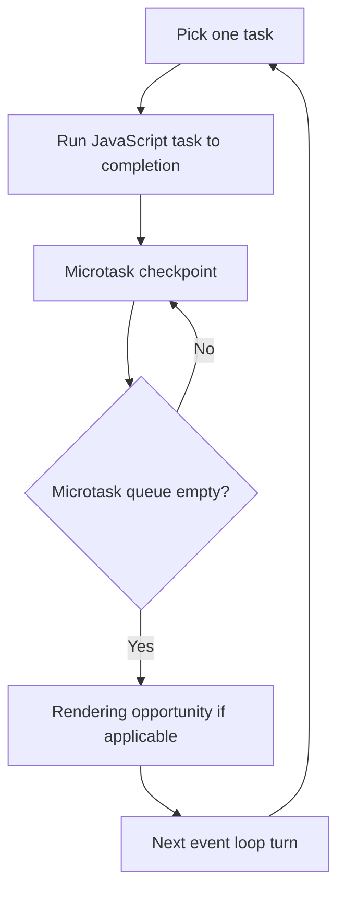
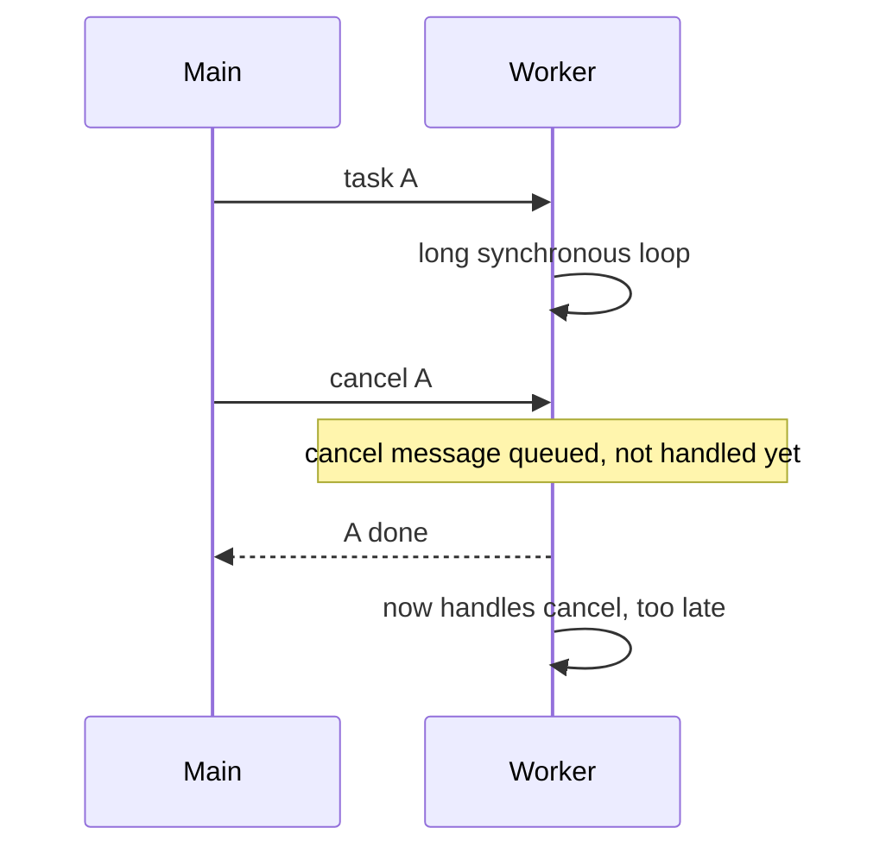
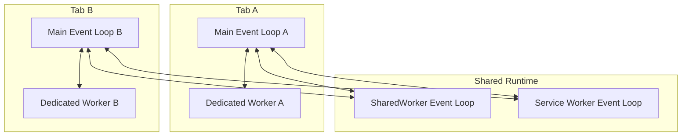
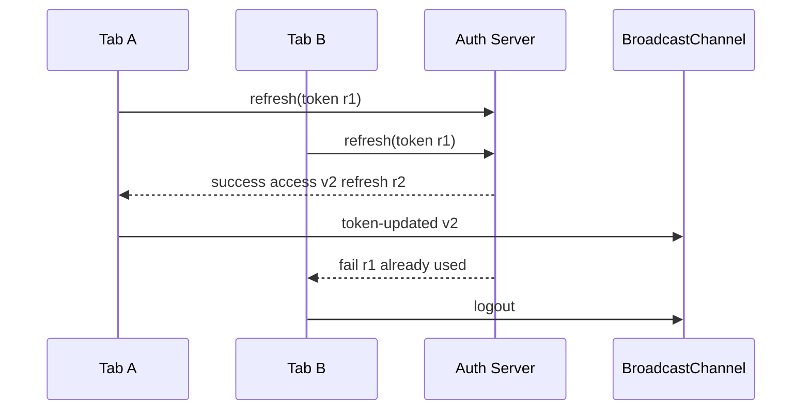
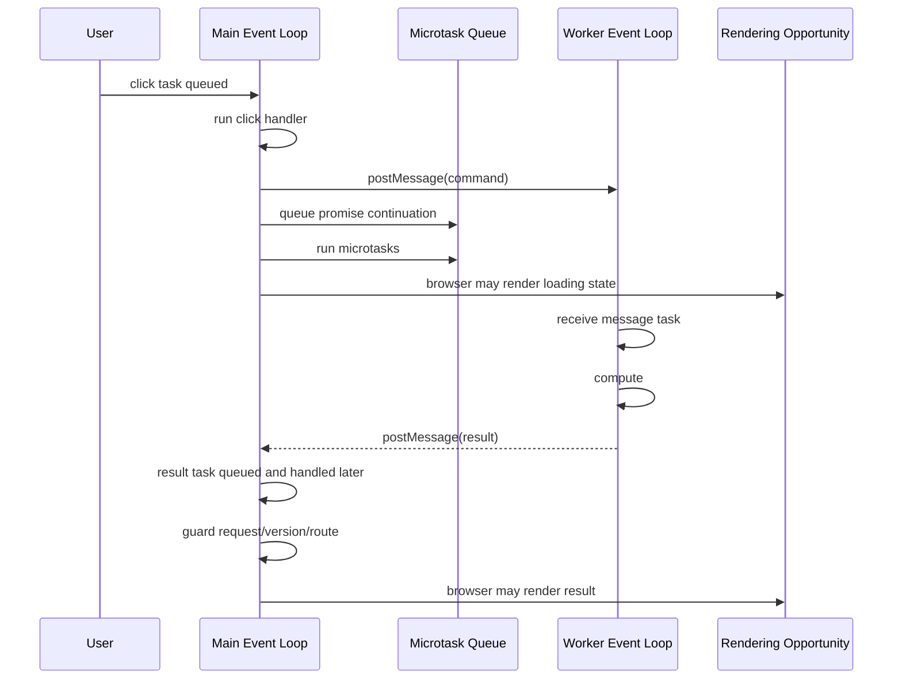

# Part 004 — Browser Event Loops, Agent Clusters, and Isolation Boundaries

> Target part ini: Anda bisa memprediksi urutan eksekusi, memahami kenapa message antar context tidak sinkron, kenapa microtask bisa membuat UI starvation, dan kenapa multi-tab orchestration harus didesain seperti sistem asynchronous.

Jika Part 003 menjawab “kenapa Worker ada”, Part 004 menjawab “apa sebenarnya yang berjalan saat browser mengeksekusi banyak context”.

Banyak bug multi-tab dan worker bukan karena API salah, tetapi karena asumsi ordering salah.

Contoh asumsi salah:

```txt
postMessage berarti worker langsung menerima pesan.
Promise.then selalu lebih aman daripada setTimeout.
BroadcastChannel message langsung sampai ke semua tab.
Hidden tab tetap menjalankan timer tepat waktu.
Worker bisa diperlakukan seperti function call asynchronous biasa.
Jika A dikirim sebelum B, semua context pasti melihat A sebelum B.
```

Sebagian bisa benar dalam boundary tertentu. Sebagian tidak. Engineering level tinggi dimulai dari tahu boundary-nya.

---

## 1. Event Loop: Model Minimal yang Harus Dipegang

Satu event loop memproses pekerjaan secara berulang.

Model sederhana:

```txt
loop:
  ambil satu task
  jalankan task sampai selesai
  jalankan microtask sampai queue kosong
  browser boleh update rendering
  ulangi
```

Diagram:



Kata kunci: **run to completion**.

Jika satu task JavaScript mulai berjalan, browser tidak akan menyisipkan task lain di tengah function biasa. Tidak ada preemption seperti thread OS yang bisa menghentikan function Anda kapan saja. JavaScript cooperative: kode Anda harus selesai atau yield.

---

## 2. Task vs Microtask

### 2.1 Task

Task adalah unit besar pekerjaan yang masuk ke event loop.

Contoh sumber task:

- click event,
- timer callback,
- network event,
- message event dari `postMessage`,
- BroadcastChannel message,
- worker message,
- parsing script tertentu,
- lifecycle event.

Task diproses satu per satu.

### 2.2 Microtask

Microtask adalah continuation yang diproses setelah task saat ini selesai, sebelum browser mengambil task berikutnya dan sebelum rendering opportunity berikutnya.

Contoh sumber microtask:

- Promise reaction,
- `queueMicrotask`,
- mutation observer callback pada timing tertentu.

Model:

```ts
console.log('A');

setTimeout(() => console.log('B task'), 0);

Promise.resolve().then(() => console.log('C microtask'));

console.log('D');
```

Urutan umum:

```txt
A
D
C microtask
B task
```

Karena Promise continuation masuk microtask, sedangkan `setTimeout` masuk task berikutnya.

---

## 3. Microtask Starvation

Microtask terlihat “cepat” karena jalan sebelum task berikutnya. Tetapi chain microtask panjang bisa menunda rendering dan input.

Buruk:

```ts
function spinMicrotasks() {
  Promise.resolve().then(spinMicrotasks);
}

spinMicrotasks();
```

Ini dapat membuat event loop terus menjalankan microtask checkpoint tanpa memberi kesempatan task lain berjalan.

Versi realistis:

```ts
async function processMany(items: Item[]) {
  for (const item of items) {
    await Promise.resolve();
    process(item);
  }
}
```

Banyak engineer mengira `await Promise.resolve()` adalah yield ke browser. Ia bukan yield task. Ia hanya menunda ke microtask, dan microtask masih diproses sebelum browser mengambil task berikutnya.

Jika tujuan Anda memberi browser peluang memproses input/rendering, gunakan yield yang benar-benar memberi giliran ke event loop turn lain, misalnya task boundary atau API scheduling yang sesuai.

---

## 4. Rendering Opportunity Bukan Janji Rendering

Setelah task dan microtask selesai, browser **boleh** melakukan rendering update. Tetapi “boleh” bukan “pasti”. Browser dapat menggabungkan, menunda, atau melewati rendering tergantung kondisi.

Model mental:

```txt
JavaScript selesai -> microtask selesai -> browser punya kesempatan render
```

Bukan:

```txt
setState -> DOM pasti langsung terlihat
```

Pada framework modern, ada tambahan scheduler framework di atas event loop browser. React, Vue, Svelte, Solid, dan framework lain punya mekanisme batching/commit berbeda. Tetapi mereka tetap berjalan di atas constraint browser.

Untuk orchestration, implikasinya:

- jangan mengandalkan “UI sudah render” hanya karena state sudah diset,
- jangan mengirim message yang mengasumsikan DOM sudah update kecuali Anda punya boundary eksplisit,
- jangan melakukan heavy synchronous work setelah state update jika user perlu segera melihat feedback.

---

## 5. Worker Event Loop

Worker memiliki event loop sendiri. Dedicated Worker tidak berbagi DOM event loop main thread. Inilah alasan ia bisa menjalankan CPU work tanpa memblokir UI.

Namun worker tetap JavaScript event loop:

```txt
worker receives message task
runs handler to completion
runs worker microtasks
then handles next worker task
```

Jika worker menjalankan loop CPU panjang, worker itu sendiri tidak bisa menerima cancel message sampai loop selesai atau sampai kode worker yield/check cancellation.



Jadi worker tidak otomatis membuat cancellation mudah. Ia hanya memindahkan blocking dari main thread ke worker thread.

---

## 6. Multiple Event Loops, Multiple Realities

Dalam aplikasi multi-tab, Anda bisa punya:

```txt
Tab A main event loop
Tab B main event loop
Tab C main event loop
Dedicated Worker for Tab A
Dedicated Worker for Tab B
SharedWorker event loop
Service Worker event loop
```

Masing-masing punya queue sendiri, lifecycle sendiri, dan timing sendiri.



Tidak ada satu global event loop aplikasi. Yang ada adalah beberapa local event loop yang berkomunikasi lewat asynchronous messages.

Ini sama seperti distributed systems mini:

- setiap node punya clock/queue sendiri,
- message bisa tertunda,
- node bisa pause/resume,
- node bisa mati,
- ordering hanya kuat dalam boundary tertentu,
- state harus diberi version/fence.

---

## 7. Ordering: Apa yang Bisa dan Tidak Bisa Diasumsikan

### 7.1 Dalam satu call stack

Synchronous code run-to-completion.

```ts
state.a = 1;
state.b = 2;
```

Tidak ada event lain yang masuk di tengah dua assignment itu.

### 7.2 Dalam satu event loop, task dan microtask

Microtask yang dibuat dalam task saat ini diproses sebelum task berikutnya.

```ts
setTimeout(() => console.log('task 1'), 0);
Promise.resolve().then(() => console.log('microtask'));
setTimeout(() => console.log('task 2'), 0);
```

Umumnya:

```txt
microtask
task 1
task 2
```

### 7.3 Antara main thread dan worker

`postMessage` mengirim message asynchronous. Handler worker akan berjalan ketika event loop worker mengambil task message itu.

Tidak berarti:

```txt
main postMessage -> worker immediately running now
```

Yang benar:

```txt
main postMessage -> message queued -> worker event loop handles later
```

### 7.4 Antara dua tab

Jika Tab A mengirim BroadcastChannel message dan Tab B sedang sibuk, tersembunyi, atau lifecycle-nya berubah, Tab B akan memproses saat event loop-nya mendapat kesempatan. Tidak ada shared synchronous memory hanya karena same origin.

### 7.5 Antara storage dan message

Misalnya:

```ts
localStorage.setItem('token-version', '2');
channel.postMessage({ type: 'token-updated', version: 2 });
```

Tab lain mungkin menerima signal setelah storage update. Tetapi desain yang baik tetap harus idempotent:

```txt
on token-updated(version=2): read current durable state, compare version, apply if newer
```

Jangan bergantung penuh pada message sebagai state. Message adalah signal. State harus punya sumber kebenaran atau version yang jelas.

---

## 8. Agent dan Agent Cluster: Kenapa Shared Memory Tidak Global

Spesifikasi HTML menggunakan konsep agent dan agent cluster untuk memodelkan unit eksekusi dan boundary berbagi memori. Untuk engineering praktis, pahami ini:

```txt
agent = execution agent yang menjalankan JavaScript dengan event loop terkait
agent cluster = kelompok agent yang boleh berbagi memory tertentu seperti SharedArrayBuffer dalam kondisi yang memenuhi syarat
```

Contoh relasi praktis:

- Window dan dedicated worker yang dibuatnya dapat berada dalam agent cluster yang memungkinkan shared memory tertentu.
- Worker dapat membuat dedicated worker lain.
- Tidak semua context same-origin otomatis berarti boleh berbagi memory langsung.
- Cross-origin isolation diperlukan untuk memakai `SharedArrayBuffer` secara modern.

Mental model:

```txt
same origin       -> boleh pakai beberapa primitive komunikasi/storage
same agent loop   -> ordering lebih lokal
same agent cluster-> potensi shared memory tertentu
same process      -> detail implementasi browser, jangan dijadikan kontrak app
```

Jangan mencampur istilah ini.

### 8.1 Same-origin bukan same-event-loop

Dua tab same-origin dapat berbagi BroadcastChannel, storage tertentu, service worker, cache, IndexedDB. Tetapi mereka tidak menjadi satu event loop.

### 8.2 Same-origin bukan same-lifecycle

Tab A visible, Tab B hidden, Tab C frozen. Same origin tidak menyamakan lifecycle.

### 8.3 Same-origin bukan same-memory

Tanpa shared memory primitive, data dikirim lewat clone/transfer/message. Jangan menganggap object reference bisa dibagi antar tab.

---

## 9. Isolation Boundaries yang Sering Diabaikan

### 9.1 Realm/global boundary

Window punya `window`. Worker punya `WorkerGlobalScope`. Service Worker punya `ServiceWorkerGlobalScope`. Mereka tidak punya API yang sama.

| Context | Global | DOM access | Typical role |
|---|---|---:|---|
| Window/tab | `Window` | ya | UI, DOM, user interaction |
| Dedicated Worker | `DedicatedWorkerGlobalScope` | tidak | per-owner compute |
| SharedWorker | `SharedWorkerGlobalScope` | tidak | shared same-origin hub |
| Service Worker | `ServiceWorkerGlobalScope` | tidak | network/cache/event proxy |

### 9.2 Lifecycle boundary

Context bisa hilang atau pause. Contoh:

- tab ditutup,
- tab hidden lalu frozen,
- tab discarded lalu reload,
- worker terminated,
- service worker stopped saat idle,
- browser update/restart,
- mobile OS reclaim memory.

Event loop model tidak cukup tanpa lifecycle model. Part 006 akan fokus penuh ke lifecycle.

### 9.3 Storage partition boundary

Modern browser privacy model membuat storage dan komunikasi tertentu bisa dipartisi berdasarkan top-level site/origin context. Jangan membuat asumsi “same-origin selalu global di seluruh browser profile” tanpa memahami storage partitioning.

Untuk materi implementasi, prinsip amannya:

```txt
Treat communication scope as explicit and test it in target browser matrix.
```

---

## 10. Run-to-Completion dan Atomicity Semu

Karena satu task run-to-completion, engineer sering merasa operasi mereka atomic.

Contoh:

```ts
let refreshing = false;

async function refreshTokenIfNeeded() {
  if (refreshing) return;

  refreshing = true;
  await refreshToken();
  refreshing = false;
}
```

Dalam satu tab, ini bisa mencegah double refresh lokal. Tapi antar tab tidak berguna.

Tab A:

```txt
refreshing = false -> true
```

Tab B:

```txt
refreshing = false -> true
```

Mereka punya memory berbeda.

Atomicity run-to-completion hanya berlaku dalam satu execution context/event loop, bukan lintas tab.

### 10.1 Untuk cross-tab atomicity, gunakan primitive koordinasi

Misalnya Web Locks:

```ts
await navigator.locks.request('auth-refresh', async lock => {
  // only one same-origin participant holding this lock at a time
  await refreshTokenSafely();
});
```

Atau gunakan durable lease di IndexedDB/localStorage dengan fencing token bila Web Locks tidak tersedia. Detailnya nanti di Part 039–040.

---

## 11. Reentrancy: Event Tidak Masuk Tengah Function, Tapi State Bisa Usang Setelah Await

Synchronous code run-to-completion. Tetapi `await` memecah function menjadi beberapa continuation.

```ts
async function saveCase(caseId: string) {
  const snapshot = getCaseState(caseId);

  await api.save(snapshot);

  markSaved(caseId, snapshot.version);
}
```

Selama `await`, event lain bisa berjalan:

- user mengubah case,
- tab lain mengirim update,
- token refresh terjadi,
- route berubah,
- component unmount,
- worker result lama masuk.

Jadi setelah `await`, snapshot bisa usang.

### 11.1 Version check setelah await

```ts
async function saveCase(caseId: string) {
  const snapshot = getCaseState(caseId);
  const versionAtStart = snapshot.version;

  await api.save(snapshot);

  if (getCaseState(caseId).version !== versionAtStart) {
    return; // do not mark latest state as saved by old request
  }

  markSaved(caseId, versionAtStart);
}
```

Dalam orchestration, hampir semua `await` adalah boundary reentrancy. Perlakukan seperti distributed async gap.

---

## 12. Message Passing is Not a Function Call

Function call:

```txt
caller -> callee executes now -> returns/throws
```

Message passing:

```txt
sender -> serialize/clone/transfer -> enqueue -> receiver later -> response maybe later
```

Konsekuensi:

| Function call | Message passing |
|---|---|
| stack sama | stack berbeda |
| error bisa throw langsung | error harus diserialisasi |
| memory reference sama | data cloned/transferred/shared explicitly |
| ordering lokal kuat | ordering bergantung channel dan queue |
| cancellation via control flow | cancellation via protocol |
| timeout jarang perlu | timeout wajib dipikirkan |

### 12.1 Envelope wajib

```ts
type MessageEnvelope<T> = {
  protocol: string;
  type: string;
  messageId: string;
  correlationId?: string;
  causationId?: string;
  senderId: string;
  issuedAt: number;
  schemaVersion: number;
  payload: T;
};
```

### 12.2 Causality chain

Untuk debugging multi-context:

```txt
user-click event
  -> command message A
    -> worker task B
      -> BroadcastChannel event C
        -> tab state update D
```

Gunakan:

- `messageId` untuk identitas event,
- `correlationId` untuk request flow,
- `causationId` untuk parent event,
- `senderId` untuk asal context,
- `issuedAt` untuk observability, bukan ordering absolut.

---

## 13. Ordering Bug: Auth Refresh Race

Naive flow:

```txt
Tab A gets 401
Tab A starts refresh
Tab B gets 401
Tab B starts refresh
Tab A success -> broadcasts token v2
Tab B fail -> broadcasts logout
```

Event loop masing-masing tab valid. Sistem global salah.



Solusi bukan “Promise lebih cepat”. Solusinya ownership protocol:

```txt
1. acquire auth-refresh lock
2. re-read current token version
3. if already refreshed, reuse
4. only lock holder calls refresh endpoint
5. publish versioned result
6. receivers apply only newer token version
7. failure from non-owner cannot force logout
```

Event loop reasoning memberi tahu bahwa local flag tidak cukup.

---

## 14. Ordering Bug: Worker Result Setelah Route Berubah

```txt
User di route /cases/123
Main thread kirim worker task compute detail 123
User pindah ke /cases/456
Worker selesai task 123
Main thread apply result ke current page
UI menampilkan data salah
```

Bug ini bukan worker-specific. Ini stale async result.

Solusi:

```ts
type RouteScopedRequest = {
  requestId: string;
  routeKey: string;
  entityId: string;
};

function applyWorkerResult(result: {
  requestId: string;
  routeKey: string;
  entityId: string;
  data: unknown;
}) {
  if (result.routeKey !== currentRouteKey()) return;
  if (result.entityId !== currentEntityId()) return;

  applyData(result.data);
}
```

Boundary event loop berarti “selesai nanti” selalu bisa berarti “terlambat untuk konteks sekarang”.

---

## 15. Timer Semantics: Timer Bukan Jam Akurat

`setTimeout(fn, 1000)` bukan janji bahwa `fn` pasti berjalan tepat setelah 1000ms. Ia berarti callback eligible untuk masuk queue setelah delay minimum, lalu akan dijalankan saat event loop bisa memprosesnya.

Dalam browser modern:

- tab hidden bisa mengalami throttling,
- tab frozen bisa menghentikan task tertentu,
- main thread busy membuat callback telat,
- nested timers bisa dibatasi,
- mobile OS/browser bisa lebih agresif.

Jangan memakai timer lokal sebagai distributed lock tanpa lease/fencing yang benar.

### 15.1 Timer drift

```ts
let count = 0;

setInterval(() => {
  count++;
  doWork();
}, 1000);
```

Jika `doWork` lambat atau tab hidden, interval bisa drift atau callback terkumpul tergantung browser behavior. Untuk pekerjaan penting, gunakan timestamp dan checkpoint.

```ts
setInterval(() => {
  const now = Date.now();
  runDueJobs(now);
}, 1000);
```

Lebih baik lagi, untuk multi-tab job:

```txt
acquire lock -> read due jobs from durable store -> process bounded batch -> checkpoint
```

---

## 16. Microtask vs Task Yield: Kesalahan Umum

### 16.1 `await Promise.resolve()`

```ts
await Promise.resolve();
```

Ini yield ke microtask, bukan memberi browser kesempatan penuh untuk task lain/rendering.

### 16.2 `setTimeout(..., 0)`

```ts
await new Promise(resolve => setTimeout(resolve, 0));
```

Ini membuat task boundary baru. Browser punya peluang lebih besar untuk memproses input/rendering sebelum continuation, meskipun detail scheduling tetap browser-dependent.

### 16.3 `requestAnimationFrame`

Cocok untuk sinkron dengan rendering frame.

```ts
await new Promise<void>(resolve => {
  requestAnimationFrame(() => resolve());
});
```

### 16.4 `requestIdleCallback`

Cocok untuk low-priority work saat browser idle, tetapi jangan digunakan untuk pekerjaan yang harus selesai deterministik cepat tanpa timeout/fallback.

### 16.5 `scheduler.yield()` / `scheduler.postTask()`

API scheduling modern dapat memberi cara lebih eksplisit untuk prioritas/yield, tetapi support browser harus dicek dan fallback disiapkan.

Kita akan bahas scheduling API lebih jauh di Part 063.

---

## 17. Worker Message Ordering

Dalam satu `Worker` dan satu arah komunikasi, message yang dikirim berurutan umumnya diproses sebagai message tasks sesuai antrean channel. Namun desain production jangan berhenti di “umumnya urut”.

Kenapa?

- task A bisa lebih lama dari task B,
- response B bisa selesai sebelum A jika worker memproses parallel melalui subworker atau async IO,
- main thread bisa ignore/apply berdasarkan state saat response datang,
- worker bisa restart dan kehilangan in-flight state,
- message dari channel berbeda bisa interleave.

### 17.1 Jangan pakai arrival order sebagai version

Buruk:

```ts
worker.onmessage = e => {
  state.result = e.data;
};
```

Lebih baik:

```ts
worker.onmessage = e => {
  const message = e.data;

  if (message.version < state.version) {
    return;
  }

  state.version = message.version;
  state.result = message.result;
};
```

### 17.2 Sequence number per stream

```ts
interface StreamMessage<T> {
  streamId: string;
  sequence: number;
  payload: T;
}
```

Gunakan sequence bila Anda perlu mendeteksi missing/out-of-order message.

```ts
const expectedSequenceByStream = new Map<string, number>();

function handleStreamMessage<T>(message: StreamMessage<T>) {
  const expected = expectedSequenceByStream.get(message.streamId) ?? 1;

  if (message.sequence !== expected) {
    requestResync(message.streamId, expected, message.sequence);
    return;
  }

  apply(message.payload);
  expectedSequenceByStream.set(message.streamId, expected + 1);
}
```

---

## 18. Event Loop Turns as Observability Unit

Untuk debugging, log “function X dipanggil” tidak cukup. Anda perlu tahu:

- context mana,
- event loop turn mana,
- message apa yang menyebabkan ini,
- task masuk dari channel mana,
- berapa lama queue delay,
- berapa lama execution,
- apakah result stale.

### 18.1 Context identity

```ts
const contextId = `${crypto.randomUUID()}`;

const contextInfo = {
  contextId,
  kind: 'window',
  createdAt: performance.now(),
};
```

### 18.2 Logical turn counter

Tidak ada API standar sederhana untuk “event loop turn id”. Tapi Anda bisa membuat counter pada entrypoint message/event yang Anda kontrol.

```ts
let logicalTurn = 0;

function enterTurn<T>(source: string, fn: () => T): T {
  logicalTurn++;
  const turn = logicalTurn;
  const startedAt = performance.now();

  try {
    return fn();
  } finally {
    const duration = performance.now() - startedAt;
    recordTurn({ source, turn, duration });
  }
}
```

```ts
channel.onmessage = event => {
  enterTurn('broadcast-channel', () => {
    handleBroadcast(event.data);
  });
};
```

Ini tidak sempurna, tapi membantu causal tracing.

---

## 19. Context Identity dan Epoch

Dalam multi-tab, setiap tab perlu identitas.

```ts
type ContextKind = 'window' | 'dedicated-worker' | 'shared-worker' | 'service-worker';

interface ContextIdentity {
  contextId: string;
  kind: ContextKind;
  bootId: string;
  startedAt: number;
  pageVisibility?: DocumentVisibilityState;
}
```

Kenapa `bootId` penting?

Karena tab bisa reload dengan storage/session yang sama tetapi runtime baru. Worker bisa restart. Service worker bisa update. Identitas runtime harus berbeda dari identitas user/session.

### 19.1 Epoch untuk leadership

```ts
interface LeadershipClaim {
  leaderId: string;
  epoch: number;
  acquiredAt: number;
  expiresAt: number;
}
```

Jika leader lama resume setelah freeze, ia mungkin masih merasa leader. Epoch/fencing token mencegah stale leader menulis state baru.

```ts
function canCommit(claim: LeadershipClaim, currentEpoch: number) {
  return claim.epoch === currentEpoch;
}
```

---

## 20. Agent Cluster dan SharedArrayBuffer: Preview

Shared memory mengubah model dari message passing ke memory coordination.

Dengan `SharedArrayBuffer` + `Atomics`, beberapa agent bisa membaca/menulis memory yang sama. Ini kuat, tapi berbahaya jika mental model concurrency lemah.

Message passing:

```txt
send immutable-ish snapshot -> receiver processes -> send result
```

Shared memory:

```txt
both sides see same bytes -> need synchronization protocol
```

Jangan memakai shared memory untuk menghindari desain protocol. Shared memory membutuhkan protocol yang lebih ketat.

Contoh ringkas:

```ts
const sab = new SharedArrayBuffer(Int32Array.BYTES_PER_ELEMENT * 2);
const view = new Int32Array(sab);

Atomics.store(view, 0, 42);
Atomics.notify(view, 0);
```

Topik ini akan dibahas di Part 057–060. Untuk sekarang cukup pegang:

```txt
Shared memory is not shared object convenience.
It is low-level concurrency infrastructure.
```

---

## 21. Service Worker Event Loop: Bukan Daemon Abadi

Service Worker sering disalahpahami sebagai background process yang selalu hidup.

Model yang lebih aman:

```txt
Service Worker is event-driven.
It can be started to handle events and stopped when idle.
```

Konsekuensi:

- jangan menyimpan critical state hanya di variable global service worker,
- persist state penting ke IndexedDB/Cache/Storage sesuai kebutuhan,
- handle event secara idempotent,
- siap menghadapi restart,
- jangan menganggap timer panjang di service worker sebagai scheduler utama.

Buruk:

```ts
let pendingSyncJobs: Job[] = [];
```

Lebih baik:

```txt
pending jobs live in durable store;
service worker event reads bounded batch;
processes;
checkpoints;
exits safely.
```

Service worker adalah event handler dengan lifecycle khusus, bukan server kecil yang selalu running.

---

## 22. BroadcastChannel Event Loop Semantics

BroadcastChannel berguna untuk same-origin communication antar browsing context dan worker yang berada dalam scope komunikasi yang sesuai. Tetapi ia tetap asynchronous message passing.

Pattern aman:

```ts
const channel = new BroadcastChannel('app-events');

channel.postMessage({
  protocol: 'app-events.v1',
  type: 'case-updated',
  messageId: crypto.randomUUID(),
  caseId,
  version,
});
```

Receiver:

```ts
channel.onmessage = event => {
  const message = event.data;

  if (message.protocol !== 'app-events.v1') return;

  if (message.type === 'case-updated') {
    invalidateCaseIfNewer(message.caseId, message.version);
  }
};
```

Prinsip:

```txt
BroadcastChannel carries invalidation/signal.
Durable store or server carries authoritative state.
```

Jangan mengirim seluruh state besar setiap kali jika receiver bisa fetch/read sendiri berdasarkan version.

---

## 23. IndexedDB Callback dan Transaction Boundaries

IndexedDB asynchronous. Ia punya transaction semantics sendiri. Dalam multi-context, Anda perlu paham bahwa:

- transaction tidak sama dengan global application lock,
- beberapa tab bisa membuka database,
- upgrade/migration perlu koordinasi,
- tab lama bisa menahan koneksi dan menghambat upgrade,
- callback result datang lewat event loop.

Part 047–056 akan membahas storage detail. Untuk event loop part ini, poinnya:

```txt
IndexedDB read result is async; by the time it arrives, app state may have changed.
```

Jadi tetap perlu version check setelah read.

```ts
const requestVersion = currentState.version;
const record = await readCaseFromDb(caseId);

if (currentState.version !== requestVersion) {
  return;
}

applyRecord(record);
```

---

## 24. Practical Rule: Every Async Boundary Needs a Guard

Async boundary:

- `await`,
- `postMessage`,
- worker response,
- BroadcastChannel message,
- `setTimeout`,
- IndexedDB callback,
- network response,
- service worker event,
- visibility change,
- page restore,
- lock acquisition.

Guard types:

| Guard | Melindungi dari |
|---|---|
| requestId | response salah request |
| version | stale data overwrite |
| routeKey | result masuk route salah |
| contextId | echo/self-message tidak sengaja |
| epoch/fencing token | stale leader commit |
| idempotency key | duplicate effect |
| deadline | result terlalu lama |
| visibility state | background behavior berbeda |
| auth/session version | result dari session lama |

Contoh envelope lengkap:

```ts
interface OrchestrationMessage<T> {
  protocol: 'orchestrator.v1';
  messageId: string;
  correlationId: string;
  causationId?: string;
  sender: ContextIdentity;
  type: string;
  issuedAt: number;
  deadlineAt?: number;
  sessionVersion: number;
  appVersion: string;
  payloadVersion: number;
  payload: T;
}
```

Ya, ini terlihat berat. Tetapi untuk platform internal besar, envelope seperti ini sering lebih murah daripada debugging race condition production.

---

## 25. Diagram: From User Click to Worker Result



Perhatikan dua hal:

1. Worker compute tidak terjadi di tengah click handler main thread.
2. Result worker datang sebagai task baru nanti, sehingga harus divalidasi terhadap state terbaru.

---

## 26. Design Pattern: Explicit Turn Boundary

Untuk pekerjaan main thread yang perlu chunking:

```ts
export async function yieldToNextTask() {
  await new Promise<void>(resolve => setTimeout(resolve, 0));
}
```

Pemakaian:

```ts
async function normalizeLargeList(records: RawRecord[]) {
  const result: NormalizedRecord[] = [];

  for (let i = 0; i < records.length; i++) {
    result.push(normalize(records[i]));

    if (i % 500 === 0) {
      await yieldToNextTask();
    }
  }

  return result;
}
```

Tetapi ini bukan pengganti worker untuk CPU-heavy work. Ini fallback untuk pekerjaan yang:

- tidak terlalu besar,
- UI-adjacent,
- perlu akses main-thread state,
- bisa menerima total latency lebih panjang.

---

## 27. Design Pattern: Message Envelope With Apply Guard

```ts
interface WorkerResult<T> {
  protocol: 'worker-runtime.v1';
  requestId: string;
  routeKey: string;
  dataVersion: number;
  result: T;
}

function handleWorkerResult<T>(message: WorkerResult<T>) {
  if (message.protocol !== 'worker-runtime.v1') return;
  if (!pendingRequests.has(message.requestId)) return;
  if (message.routeKey !== currentRouteKey()) return;
  if (message.dataVersion < currentDataVersion()) return;

  applyWorkerResult(message.result);
}
```

Ini simple, tapi menyelesaikan banyak bug.

---

## 28. Design Pattern: Causal Broadcast as Invalidation

Sender:

```ts
channel.postMessage({
  protocol: 'case-cache.v1',
  type: 'case-invalidated',
  messageId: crypto.randomUUID(),
  caseId,
  version,
  senderId: contextId,
});
```

Receiver:

```ts
channel.onmessage = async event => {
  const message = event.data;

  if (message.senderId === contextId) return;
  if (message.type !== 'case-invalidated') return;

  const local = getLocalCaseVersion(message.caseId);

  if (local >= message.version) return;

  markCaseStale(message.caseId, message.version);
  scheduleRefetch(message.caseId, message.version);
};
```

Channel tidak membawa full truth. Ia membawa “sesuatu berubah”. Ini mengurangi clone cost dan stale overwrite.

---

## 29. Common Failure Modes

### 29.1 Promise-as-yield bug

```ts
for (const item of hugeList) {
  await Promise.resolve();
  process(item);
}
```

Gejala: UI tetap terasa freeze/lag karena microtask chain tidak memberi ruang cukup untuk task/rendering.

### 29.2 Local mutex bug

```ts
let isLeader = false;
```

Gejala: setiap tab punya `isLeader` sendiri. Semua merasa aman.

### 29.3 Arrival-order bug

```ts
state.value = message.value;
```

Gejala: response lama overwrite state baru.

### 29.4 Timer-as-lock bug

```ts
localStorage.setItem('lock', Date.now() + 5000);
```

Gejala: tab frozen resume dengan lock usang; clock/timer drift; split brain.

### 29.5 Service-worker-global-state bug

```ts
let authToken = undefined;
```

Gejala: service worker restart dan state hilang.

### 29.6 Worker-cancel-too-late bug

```txt
cancel message queued but worker is busy in synchronous loop
```

Gejala: CPU tetap jalan meski UI sudah pindah route/query.

---

## 30. Testing Ordering Assumptions

Anda tidak bisa hanya mengetes happy path.

### 30.1 Delay injection

```ts
function randomDelay(maxMs: number) {
  return new Promise(resolve => {
    setTimeout(resolve, Math.floor(Math.random() * maxMs));
  });
}
```

Inject di boundary:

```ts
async function handleWorkerResultWithChaos(message: WorkerResult<unknown>) {
  if (isChaosEnabled()) {
    await randomDelay(500);
  }

  handleWorkerResult(message);
}
```

### 30.2 Out-of-order simulation

```ts
const results = [resultV2, resultV1];

for (const result of results) {
  handleWorkerResult(result);
}

expect(currentVersion()).toBe(2);
```

### 30.3 Frozen/resume simulation

Di browser automation, simulasikan:

- buka dua tab,
- tab A acquire leadership,
- pause/tab hidden,
- tab B acquire leadership setelah timeout,
- tab A resume,
- pastikan Tab A tidak commit dengan epoch lama.

Kita akan bahas testing multi-tab di Part 067 dan chaos testing di Part 068.

---

## 31. Engineering Checklist

Saat melihat async/browser orchestration code, cek:

- Apakah ada asumsi synchronous pada `postMessage`?
- Apakah Promise dipakai sebagai yield padahal butuh task boundary?
- Apakah worker result punya request ID?
- Apakah response stale dicegah dengan version/route/session guard?
- Apakah BroadcastChannel message membawa sender ID?
- Apakah message dianggap state, bukan signal?
- Apakah local boolean dipakai untuk cross-tab lock?
- Apakah timer dipakai sebagai clock akurat?
- Apakah service worker menyimpan state penting hanya di memory?
- Apakah cancellation bisa diproses saat worker busy?
- Apakah context identity dibedakan dari user/session identity?
- Apakah setiap async boundary punya failure/timeout path?

---

## 32. Mental Model Akhir

Pegang model ini:

```txt
A browser app is a set of event-loop-driven actors.
Actors do not share call stacks.
Actors communicate by messages, storage, locks, and explicit shared memory.
Every async boundary can reorder reality.
Every result must prove it is still valid before mutating state.
```

Kalau Part 003 mengajarkan “main thread harus dilindungi”, Part 004 mengajarkan “ordering harus dibuktikan”.

---

## 33. Ringkasan

Event loop adalah unit dasar eksekusi browser. Task berjalan run-to-completion. Microtask berjalan setelah task dan bisa menyebabkan starvation bila disalahgunakan. Rendering terjadi pada opportunity tertentu, bukan sebagai efek langsung setiap state update. Worker punya event loop sendiri, tetapi tetap asynchronous dan cooperative. Multi-tab berarti banyak event loop dengan lifecycle berbeda.

Konsekuensi arsitekturalnya jelas:

1. Jangan menganggap message passing sebagai function call.
2. Jangan memakai local flag untuk koordinasi lintas tab.
3. Jangan mengandalkan arrival order sebagai kebenaran.
4. Jangan memakai Promise microtask sebagai yield UI universal.
5. Jangan menyimpan state penting di memory context yang bisa mati.
6. Selalu guard result dengan request ID, version, route/session, dan fencing token bila perlu.

Part berikutnya akan masuk ke origin/security model, karena seluruh primitive komunikasi multi-tab dan worker dibatasi oleh origin, storage partition, isolation policy, dan permission surface browser.

---

## Referensi

- MDN — In depth: microtasks and JavaScript runtime environment: https://developer.mozilla.org/en-US/docs/Web/API/HTML_DOM_API/Microtask_guide/In_depth
- MDN — Using microtasks in JavaScript with `queueMicrotask()`: https://developer.mozilla.org/en-US/docs/Web/API/HTML_DOM_API/Microtask_guide
- MDN — JavaScript execution model: https://developer.mozilla.org/en-US/docs/Web/JavaScript/Reference/Execution_model
- WHATWG HTML Standard — Event loops: https://html.spec.whatwg.org/multipage/webappapis.html
- WHATWG HTML Standard — Workers: https://html.spec.whatwg.org/multipage/workers.html
- MDN — BroadcastChannel: https://developer.mozilla.org/en-US/docs/Web/API/BroadcastChannel
- MDN — Web Workers API: https://developer.mozilla.org/en-US/docs/Web/API/Web_Workers_API
- Chrome for Developers — Page Lifecycle API: https://developer.chrome.com/docs/web-platform/page-lifecycle-api
