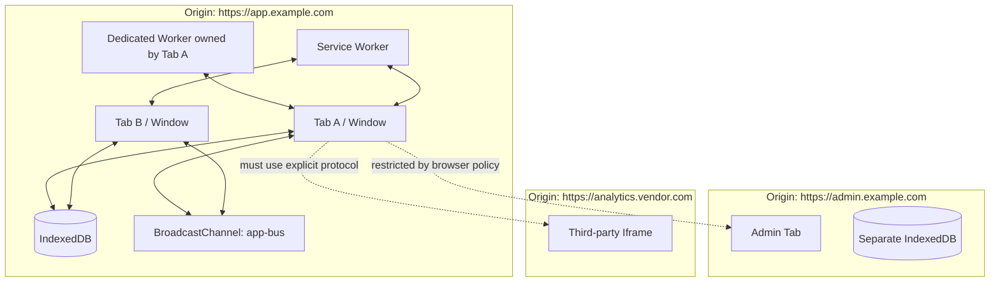
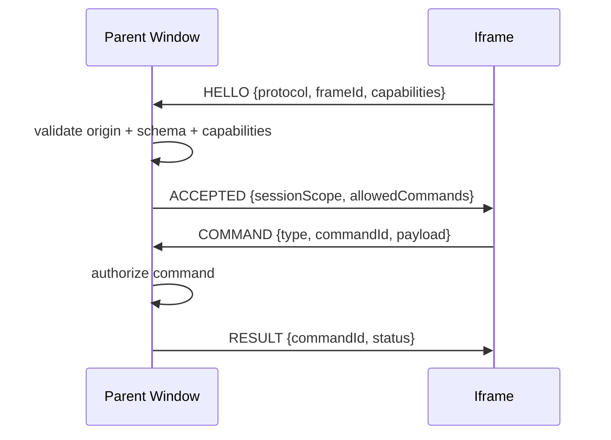
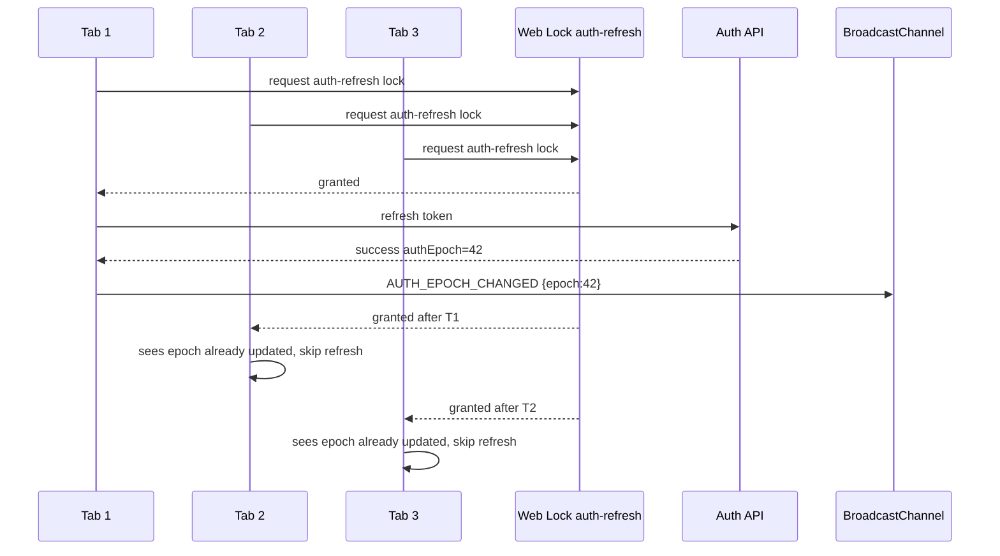

# Part 005 — Same-Origin, Storage Partitioning, and Trust Boundaries

> Target part ini: kamu tidak hanya tahu bahwa browser punya Same-Origin Policy. Kamu harus mampu mendesain sistem multi-tab yang tahu siapa boleh bicara dengan siapa, resource mana yang benar-benar shared, pesan mana yang tidak boleh dipercaya, dan boundary mana yang bisa berubah karena iframe, storage partitioning, cookie policy, atau browser lifecycle.

Multi-tab orchestration selalu terlihat seperti masalah koordinasi.

Tab A butuh bicara dengan Tab B. Worker perlu mengirim hasil ke window. Service Worker perlu memberi tahu semua client bahwa cache baru tersedia. Auth token refresh harus dideduplicate. Offline queue harus hanya direplay sekali.

Tapi sebelum bicara tentang protocol, election, lock, dan state, ada pertanyaan lebih dasar:

> Dua execution context ini sebenarnya berada dalam security boundary yang sama atau tidak?

Kalau jawaban ini salah, seluruh desain berikutnya bisa salah.

Browser bukan runtime backend biasa. Browser adalah runtime hostile-by-default. Ia menjalankan dokumen dari banyak origin, script pihak ketiga, iframe embedded, extension, cache lama, tab lama, service worker lama, dan user session yang bisa berubah di tengah jalan.

Karena itu, security model bukan appendix. Ia adalah fondasi orchestration.

---

## 1. Mental Model: Origin Adalah Boundary Minimal, Bukan Boundary Bisnis

Origin biasanya didefinisikan dari tiga komponen:

```txt
scheme + host + port
```

Contoh:

```txt
https://app.example.com:443
```

Berbeda origin dari:

```txt
http://app.example.com:443      # scheme berbeda
https://api.example.com:443     # host berbeda
https://app.example.com:8443    # port berbeda
```

Same-Origin Policy adalah mekanisme browser untuk membatasi bagaimana dokumen/script dari satu origin berinteraksi dengan resource dari origin lain. Ia mengurangi risiko halaman dari origin jahat membaca atau mengontrol data origin lain.

Tetapi untuk desain aplikasi, origin hanya boundary teknis minimal.

Ia tidak otomatis menjawab:

- apakah dua tab berada pada tenant yang sama,
- apakah dua tab memakai user session yang sama,
- apakah dua tab memakai app version yang kompatibel,
- apakah dua tab berasal dari deployment environment yang sama,
- apakah dua tab sedang berada pada permission scope yang sama,
- apakah satu context sedang menjalankan script lama dari cache,
- apakah iframe yang same-origin memang boleh dipercaya secara bisnis.

Inilah perbedaan penting:

```txt
Same origin  = browser mengizinkan beberapa interaksi teknis
Same trust   = aplikasi memutuskan context tersebut boleh ikut orchestration tertentu
```

Jangan campur keduanya.

---

## 2. Diagram Boundary Dasar



Di dalam origin yang sama, beberapa resource bisa shared: IndexedDB, CacheStorage, BroadcastChannel, Web Locks, localStorage, Service Worker registration.

Namun “bisa shared” tidak sama dengan “harus dipakai sembarangan”.

Dalam sistem production, setiap shared primitive harus diperlakukan sebagai shared infrastructure dengan aturan:

1. namespacing jelas,
2. message schema valid,
3. version compatible,
4. no implicit trust,
5. cleanup lifecycle,
6. failure recovery,
7. observability.

---

## 3. Same-Origin vs Same-Site

Banyak bug desain terjadi karena engineer mencampur “origin” dan “site”.

Secara praktis:

```txt
origin = scheme + host + port
site   = registrable domain concept, sering dipakai dalam cookie/SameSite/storage partitioning context
```

Contoh:

```txt
https://app.example.com
https://admin.example.com
```

Keduanya berbeda origin. Tetapi keduanya biasanya same-site karena berada di bawah `example.com`.

Kenapa ini penting?

Karena browser API yang berbeda memakai boundary yang berbeda:

| Concern | Boundary yang sering relevan |
|---|---|
| DOM direct access | same-origin |
| `fetch` read access | same-origin atau CORS |
| Cookie `SameSite` behavior | site-level concept |
| BroadcastChannel | same-origin, juga dipengaruhi storage partition |
| localStorage | origin-scoped, tapi partitioning bisa memengaruhi third-party context |
| IndexedDB | origin-scoped, dengan storage partitioning rules |
| Service Worker | origin/scope-bound |
| Web Locks | origin-bound |
| SharedArrayBuffer | secure context + cross-origin isolation |

Multi-tab orchestration umumnya same-origin. Tetapi embedding dan third-party contexts membuat cerita lebih rumit.

---

## 4. Storage Partitioning: “Same-Origin” Tidak Selalu Cukup

Dulu, banyak engineer berpikir:

> Kalau dua context same-origin, mereka bisa BroadcastChannel, localStorage, IndexedDB bersama.

Sekarang desain browser lebih privacy-oriented. Storage bisa dipartisi berdasarkan top-level site.

Contoh konseptual:

```txt
Top-level page: https://shop.example
Iframe:         https://app.vendor.com

Top-level page: https://news.example
Iframe:         https://app.vendor.com
```

Iframe `https://app.vendor.com` di dua top-level site berbeda mungkin same-origin satu sama lain secara URL, tetapi tidak harus berada dalam storage partition yang sama. Karena itu, jangan mengasumsikan mereka bisa berkomunikasi via BroadcastChannel/storage hanya karena origin URL mereka sama.

Model mental yang lebih aman:

```txt
communication eligibility = origin compatibility + storage partition compatibility + browser policy + API support
```

Untuk aplikasi first-party biasa:

```txt
https://app.example.com in top-level tab A
https://app.example.com in top-level tab B
```

Biasanya BroadcastChannel dan shared storage bekerja sesuai ekspektasi.

Untuk embedded iframe, white-label apps, cross-site embeds, SSO widget, payment widget, analytics widget, atau admin iframe, jangan membuat asumsi tanpa eksplisit menguji boundary.

---

## 5. Trust Boundary dalam Multi-Tab App

Anggap kamu punya aplikasi regulatory case management di browser:

- user membuka case list di Tab A,
- detail case di Tab B,
- enforcement action form di Tab C,
- background worker melakukan search indexing,
- service worker mengelola cache dan offline queue,
- BroadcastChannel dipakai untuk session/logout/update notifications.

Pertanyaan trust bukan hanya:

> Apakah semua ini same-origin?

Pertanyaan sebenarnya:

> Apakah semua context ini boleh melihat, menyimpan, mengubah, atau mengkoordinasikan state yang sama?

Contoh boundary bisnis:

| Boundary | Risiko jika diabaikan |
|---|---|
| User identity | Tab lama milik user sebelumnya menerima pesan session baru |
| Tenant/account | Tab tenant A menerima event tenant B |
| Role/permission | Tab dengan permission lama menganggap masih boleh mutate |
| Case scope | Event detail case bocor ke tab unrelated |
| Environment | staging/prod channel tercampur oleh konfigurasi salah |
| App version | pesan versi baru diproses oleh handler versi lama |
| Auth epoch | token refresh lama menimpa token baru |
| Tab ownership | satu tab menganggap dirinya leader setelah leadership sudah pindah |

Maka orchestration bus harus punya scope lebih kaya dari sekadar channel name.

---

## 6. Channel Name Bukan Security Control

BroadcastChannel menggunakan string name:

```ts
const channel = new BroadcastChannel('app-bus');
```

Ini nyaman, tapi berbahaya kalau dianggap sebagai access control.

Semua same-origin compatible context yang tahu nama channel dapat join. Kalau script pihak ketiga berjalan di origin yang sama, ia bisa membuat channel dengan nama yang sama. Kalau ada XSS, attacker bisa subscribe. Kalau ada iframe same-origin yang tidak kamu pikirkan, ia bisa ikut.

Jadi channel name adalah routing primitive, bukan authorization primitive.

Gunakan channel name untuk mengurangi accidental collision:

```txt
<app-id>:<environment>:<major-protocol-version>:<partition-purpose>
```

Contoh:

```txt
regsys:prod:v3:session-bus
regsys:prod:v3:case-workspace
regsys:prod:v3:offline-queue
```

Tetapi jangan pernah kirim secret hanya karena nama channel “sulit ditebak”.

---

## 7. Pesan Orchestration Tidak Boleh Mengandung Secret Mentah

Anti-pattern:

```ts
channel.postMessage({
  type: 'TOKEN_REFRESHED',
  accessToken,
  refreshToken,
});
```

Masalah:

1. Token tersebar ke semua context yang subscribe.
2. Token bisa terbaca oleh code yang compromised di origin yang sama.
3. Logging/debug tooling bisa menyimpan payload.
4. Handler versi lama bisa salah menyimpan token.
5. Tab yang seharusnya logout bisa menerima token baru.

Pattern yang lebih aman:

```ts
channel.postMessage({
  type: 'AUTH_EPOCH_CHANGED',
  epoch,
  reason: 'token-refreshed',
});
```

Lalu setiap tab melakukan read dari authority lokal yang dikontrol, atau melakukan revalidation ke server.

Untuk session-level orchestration, broadcast event sebaiknya berupa signal, bukan secret.

```txt
bad:  here is the credential
ok:   session epoch changed, re-read your own credential state
best: credential never enters JS when architecture memungkinkan
```

Tentu tidak semua aplikasi bisa memakai cookie HttpOnly murni. Tetapi prinsipnya tetap:

> Cross-tab message harus membawa intent dan metadata minimal, bukan data sensitif mentah.

---

## 8. Protocol Envelope Wajib Ada

Jangan kirim pesan bebas.

Anti-pattern:

```ts
channel.postMessage({ type: 'logout' });
channel.postMessage({ type: 'caseUpdated', data });
channel.postMessage({ action: 'refresh' });
```

Tidak ada:

- protocol version,
- app id,
- environment,
- tenant/user scope,
- sender id,
- message id,
- timestamp,
- causality marker,
- schema validation,
- compatibility policy.

Gunakan envelope:

```ts
export type BusEnvelope<TPayload> = {
  app: 'regsys';
  env: 'local' | 'dev' | 'staging' | 'prod';
  protocol: 3;
  channel: 'session' | 'case-workspace' | 'offline-queue';

  messageId: string;
  correlationId?: string;
  causationId?: string;

  sender: {
    tabId: string;
    instanceId: string;
    startedAt: number;
  };

  scope: {
    userIdHash?: string;
    tenantId?: string;
    authEpoch?: number;
    workspaceId?: string;
  };

  type: string;
  payload: TPayload;
  createdAt: number;
};
```

Envelope bukan formalitas. Ia membuat sistem bisa menolak pesan yang tidak sesuai.

---

## 9. Message Validation adalah Security + Reliability

Semua inbound message dari cross-context channel harus dianggap untrusted.

Walaupun datang dari same-origin.

Kenapa?

Karena same-origin bisa berisi:

- tab lama,
- app version lama,
- iframe yang tidak kamu ingat,
- script pihak ketiga,
- compromised context,
- extension interference,
- test harness,
- stale service worker,
- user yang pindah akun,
- payload dari bug internal.

Minimal validation:

```ts
type DecodeResult<T> =
  | { ok: true; value: T }
  | { ok: false; reason: string };

function decodeEnvelope(input: unknown): DecodeResult<BusEnvelope<unknown>> {
  if (!input || typeof input !== 'object') {
    return { ok: false, reason: 'not-object' };
  }

  const value = input as Record<string, unknown>;

  if (value.app !== 'regsys') return { ok: false, reason: 'wrong-app' };
  if (value.env !== APP_ENV) return { ok: false, reason: 'wrong-env' };
  if (value.protocol !== 3) return { ok: false, reason: 'wrong-protocol' };
  if (typeof value.messageId !== 'string') return { ok: false, reason: 'missing-message-id' };
  if (typeof value.type !== 'string') return { ok: false, reason: 'missing-type' };
  if (typeof value.createdAt !== 'number') return { ok: false, reason: 'missing-created-at' };

  return { ok: true, value: input as BusEnvelope<unknown> };
}
```

Di production, pakai runtime schema validator seperti Zod, Valibot, io-ts, atau validator internal. TypeScript compile-time type tidak cukup karena message datang saat runtime.

---

## 10. Scope Matching

Setelah envelope valid, jangan langsung process.

Lakukan scope matching.

```ts
function shouldAcceptMessage(
  msg: BusEnvelope<unknown>,
  local: {
    userIdHash?: string;
    tenantId?: string;
    authEpoch?: number;
    workspaceId?: string;
  },
): boolean {
  if (msg.scope.tenantId && msg.scope.tenantId !== local.tenantId) return false;
  if (msg.scope.userIdHash && msg.scope.userIdHash !== local.userIdHash) return false;

  // Jika pesan membawa authEpoch lama, jangan biarkan ia menimpa state baru.
  if (
    typeof msg.scope.authEpoch === 'number' &&
    typeof local.authEpoch === 'number' &&
    msg.scope.authEpoch < local.authEpoch
  ) {
    return false;
  }

  if (msg.scope.workspaceId && msg.scope.workspaceId !== local.workspaceId) return false;

  return true;
}
```

Perhatikan `userIdHash`, bukan raw user email/name. Bus payload sering masuk log. Hindari PII kalau tidak perlu.

---

## 11. `postMessage` dan `targetOrigin`

Untuk Window-to-Window atau Window-to-Iframe communication, `postMessage` adalah primitive penting. Tetapi bug paling umum adalah memakai wildcard target origin:

```ts
iframe.contentWindow?.postMessage(payload, '*');
```

Ini convenience yang mahal.

Pattern lebih aman:

```ts
const EXPECTED_IFRAME_ORIGIN = 'https://widget.example.com';

iframe.contentWindow?.postMessage(
  {
    type: 'HOST_CONTEXT_UPDATED',
    payload: { theme: 'dark' },
  },
  EXPECTED_IFRAME_ORIGIN,
);
```

Inbound juga wajib check origin:

```ts
window.addEventListener('message', (event) => {
  if (event.origin !== EXPECTED_IFRAME_ORIGIN) return;

  const decoded = decodeWidgetMessage(event.data);
  if (!decoded.ok) return;

  handleWidgetMessage(decoded.value);
});
```

`targetOrigin` membatasi siapa yang boleh menerima message. `event.origin` membantu memastikan siapa yang mengirim. Keduanya bukan pengganti schema validation.

---

## 12. Iframe Same-Origin Tidak Selalu Aman Secara Bisnis

Same-origin iframe punya kemampuan kuat. Ia bisa, tergantung sandboxing dan policy, berinteraksi dengan parent lebih dalam dibanding cross-origin iframe.

Tetapi dalam aplikasi besar, same-origin iframe sering dipakai untuk:

- legacy module,
- micro frontend,
- internal admin panel,
- embedded report,
- editor lama,
- preview mode,
- migration bridge.

Kalau semua same-origin iframe dianggap fully trusted, maka satu legacy module bisa membaca/mengubah state global yang tidak seharusnya.

Gunakan prinsip:

```txt
same-origin = technically capable
trusted participant = explicitly admitted by protocol
```

Admission bisa berupa handshake:



Jangan expose bus internal penuh ke iframe hanya karena origin sama.

---

## 13. Service Worker Scope Boundary

Service Worker tidak “mengontrol seluruh domain” secara otomatis. Ia punya registration scope.

Contoh:

```ts
navigator.serviceWorker.register('/app/sw.js', {
  scope: '/app/',
});
```

Service Worker dengan scope `/app/` hanya mengontrol clients di bawah scope tersebut.

Arsitektur yang salah:

```txt
assume service worker sees all app tabs
```

Arsitektur yang benar:

```txt
service worker coordinates only clients it controls and events it receives
```

Konsekuensinya:

- Tab pertama setelah registration mungkin belum controlled sampai reload/navigation berikutnya.
- Ada periode di mana beberapa tab controlled oleh SW versi lama, beberapa oleh SW versi baru.
- Ada halaman di origin sama tapi luar scope yang tidak ikut orchestration.
- `clients.matchAll()` hanya memberi client yang bisa dilihat oleh service worker sesuai aturan API.

Jadi pesan dari Service Worker ke tab juga harus punya version dan compatibility policy.

---

## 14. Web Locks: Same-Origin Mutual Exclusion, Bukan Global Authority

Web Locks memungkinkan script same-origin, termasuk tabs dan workers, meminta lock bernama untuk mengoordinasikan akses ke resource bersama.

Contoh:

```ts
await navigator.locks.request('regsys:offline-replay', async (lock) => {
  if (!lock) return;
  await replayPendingOperations();
});
```

Ini sangat berguna untuk:

- leader election,
- single-flight token refresh,
- offline queue replay,
- IndexedDB migration guard,
- cache compaction,
- periodic sync dedupe.

Tetapi Web Locks bukan security boundary. Ia coordination primitive.

Kalau ada compromised same-origin script, ia juga bisa request lock. Kalau ada tab lama yang bug, ia bisa memegang lock terlalu lama. Kalau browser tidak mendukung Web Locks di target environment, kamu perlu fallback atau degraded mode.

Gunakan Web Locks bersama:

- timeout logic,
- fencing token,
- heartbeat,
- version check,
- scope-aware resource name,
- observability.

Contoh lock name yang scoped:

```txt
regsys:prod:v3:tenant:<tenantId>:offline-replay
regsys:prod:v3:user:<userHash>:auth-refresh
regsys:prod:v3:indexeddb:migration
```

Jangan pakai lock name terlalu generik:

```txt
leader
sync
refresh
lock
```

---

## 15. Shared Storage Bukan Shared Truth Otomatis

Shared storage sering terlihat seperti solusi mudah:

```txt
localStorage.setItem('session', ...)
IndexedDB.put('leader', ...)
CacheStorage.put(...)
```

Masalahnya, storage punya karakteristik berbeda:

| Storage | Cocok untuk | Risiko orchestration |
|---|---|---|
| localStorage | simple key/value legacy signal | synchronous, blocking, coarse, string-only, easy to misuse |
| sessionStorage | per-tab state | tidak shared antar tab biasa |
| IndexedDB | durable structured client state | transaction/version complexity, migration race |
| CacheStorage | request/response artifact | cache invalidation, SW version split |
| OPFS | file-like worker-heavy data | quota, locking, migration, browser support variance |
| Memory | fast per-context state | hilang saat reload/crash, tidak shared |

Tidak ada storage yang otomatis memberi:

- distributed transaction lintas tab,
- exactly-once delivery,
- global ordering,
- authorization,
- dead participant detection,
- automatic conflict resolution.

Shared storage harus dilapisi protocol.

---

## 16. Same-Origin XSS Menghancurkan Banyak Asumsi

Dalam browser app, XSS adalah boundary collapse.

Kalau attacker bisa menjalankan JavaScript di origin aplikasimu, maka ia sering bisa:

- subscribe BroadcastChannel,
- read/write localStorage,
- access IndexedDB jika tidak dilindungi lebih jauh,
- send messages ke Worker,
- interact dengan Service Worker APIs yang tersedia,
- request Web Locks,
- observe application state in memory,
- call same-origin APIs dengan credential user.

Karena itu, jangan desain bus seolah-olah same-origin message selalu jujur.

Hardening yang tetap berguna:

1. jangan broadcast secrets,
2. minimalkan payload,
3. runtime validation,
4. CSP ketat,
5. Trusted Types untuk DOM injection surface,
6. dependency hygiene,
7. event audit logging,
8. server-side authorization tetap authoritative,
9. short-lived capability tokens kalau perlu,
10. revoke session via server, bukan hanya client signal.

Client-side orchestration membantu UX dan efficiency. Ia tidak menggantikan server-side authorization.

---

## 17. Tenant dan Permission Scope

Dalam aplikasi enterprise/regulatory, tenant boundary biasanya lebih penting daripada origin boundary.

Misal semua tenant disajikan dari:

```txt
https://app.example.com
```

Maka origin sama untuk semua tenant. Kalau user bisa switch tenant di satu tab, multi-tab bus harus sadar tenant.

Anti-pattern:

```ts
channel.postMessage({
  type: 'CASE_UPDATED',
  caseId,
});
```

Lebih baik:

```ts
publish({
  channel: 'case-workspace',
  type: 'CASE_UPDATED',
  scope: {
    tenantId,
    userIdHash,
    workspaceId,
    authEpoch,
  },
  payload: {
    caseId,
    version,
    changedFields: ['status', 'assignedOfficer'],
  },
});
```

Receiver menolak event tenant berbeda.

```ts
if (message.scope.tenantId !== currentTenantId) {
  metrics.increment('bus.reject.scope.tenant');
  return;
}
```

Ini bukan hanya security. Ini juga reliability. Tanpa scope, tab bisa invalidate cache yang salah, refresh data yang salah, atau menampilkan notification yang salah.

---

## 18. App Version Compatibility

Dalam multi-tab app, user bisa punya:

- Tab A menjalankan bundle v10,
- Tab B menjalankan bundle v11,
- Service Worker masih v9,
- IndexedDB schema sedang migrasi ke v12.

Kalau semua context bicara di channel yang sama tanpa protocol version, chaos akan muncul.

Rule yang sehat:

```txt
major protocol version incompatible = reject message
minor protocol version newer        = ignore unknown optional fields
minor protocol version older        = support compatibility window jika aman
```

Contoh:

```ts
const SUPPORTED_PROTOCOL_MAJOR = 3;

function isCompatibleProtocol(envelope: BusEnvelope<unknown>): boolean {
  return envelope.protocol === SUPPORTED_PROTOCOL_MAJOR;
}
```

Untuk sistem lebih matang:

```ts
type ProtocolVersion = {
  major: number;
  minor: number;
};

function supports(version: ProtocolVersion): boolean {
  if (version.major !== 3) return false;
  if (version.minor > 4) return true; // tolerate newer optional fields
  return version.minor >= 1;
}
```

Jangan mencoba backward compatibility tanpa batas. Itu akan membuat bus internal menjadi legacy API permanen.

---

## 19. Capability-Based Thinking

Daripada semua participant otomatis boleh melakukan semua hal, gunakan capability.

Contoh capability:

```ts
type ParticipantCapability =
  | 'can-observe-session'
  | 'can-request-token-refresh'
  | 'can-own-token-refresh-lock'
  | 'can-replay-offline-queue'
  | 'can-index-search-data'
  | 'can-broadcast-case-invalidations'
  | 'can-write-durable-client-state';
```

Saat context join bus, ia mendaftar:

```ts
type JoinMessage = {
  type: 'PARTICIPANT_JOINED';
  participantId: string;
  participantKind: 'window' | 'dedicated-worker' | 'shared-worker' | 'service-worker' | 'iframe';
  protocol: { major: number; minor: number };
  capabilities: ParticipantCapability[];
};
```

Kemudian coordinator atau local receiver bisa menerapkan policy:

```ts
function canHandle(messageType: string, capabilities: ParticipantCapability[]): boolean {
  switch (messageType) {
    case 'OFFLINE_REPLAY_REQUESTED':
      return capabilities.includes('can-replay-offline-queue');
    case 'TOKEN_REFRESH_REQUESTED':
      return capabilities.includes('can-request-token-refresh');
    default:
      return true;
  }
}
```

Capability tidak melindungi dari malicious same-origin script secara penuh, tetapi ia mengurangi accidental misuse dan membuat sistem bisa diaudit.

---

## 20. Threat Model Ringkas

Kita tidak akan menyelesaikan semua security topic di part ini. Namun setiap desain orchestration harus punya threat model minimal.

| Threat | Contoh | Mitigasi awal |
|---|---|---|
| Accidental cross-tenant message | Tab tenant A menerima event tenant B | scope envelope + reject metrics |
| Stale tab mutation | Tab lama menulis state setelah user logout | authEpoch + server validation |
| Protocol mismatch | v1 handler membaca v3 payload | protocol version + compatibility rule |
| Secret leakage via bus | token dibroadcast | signal-only event, no secret payload |
| XSS observer | malicious script subscribe channel | CSP, Trusted Types, no secrets, server auth |
| iframe abuse | embedded module mengakses bus penuh | explicit bridge + capability admission |
| leader split-brain | dua tab merasa leader | Web Locks + fencing token + heartbeat |
| storage poisoning | malformed IndexedDB record | schema validation on read/write |
| replayed message | old message diproses ulang | messageId dedupe + TTL + idempotency |
| service worker version split | old SW broadcast incompatible update | protocol version + client capability check |

---

## 21. Safe Bus Skeleton

Berikut skeleton bus minimal yang menggabungkan beberapa prinsip.

```ts
type PublishOptions<TPayload> = {
  channel: BusEnvelope<TPayload>['channel'];
  type: string;
  scope: BusEnvelope<TPayload>['scope'];
  payload: TPayload;
  correlationId?: string;
  causationId?: string;
};

class CrossContextBus {
  private readonly channel: BroadcastChannel;
  private readonly seen = new Set<string>();

  constructor(
    private readonly local: {
      app: 'regsys';
      env: 'local' | 'dev' | 'staging' | 'prod';
      protocol: 3;
      tabId: string;
      instanceId: string;
      startedAt: number;
      tenantId?: string;
      userIdHash?: string;
      authEpoch?: number;
      workspaceId?: string;
    },
    channelName: string,
  ) {
    this.channel = new BroadcastChannel(channelName);
  }

  publish<TPayload>(options: PublishOptions<TPayload>): void {
    const envelope: BusEnvelope<TPayload> = {
      app: this.local.app,
      env: this.local.env,
      protocol: this.local.protocol,
      channel: options.channel,
      messageId: crypto.randomUUID(),
      correlationId: options.correlationId,
      causationId: options.causationId,
      sender: {
        tabId: this.local.tabId,
        instanceId: this.local.instanceId,
        startedAt: this.local.startedAt,
      },
      scope: options.scope,
      type: options.type,
      payload: options.payload,
      createdAt: Date.now(),
    };

    this.channel.postMessage(envelope);
  }

  subscribe(handler: (message: BusEnvelope<unknown>) => void): () => void {
    const listener = (event: MessageEvent) => {
      const decoded = decodeEnvelope(event.data);
      if (!decoded.ok) {
        metrics.increment('bus.reject.decode', { reason: decoded.reason });
        return;
      }

      const message = decoded.value;

      if (this.seen.has(message.messageId)) {
        metrics.increment('bus.reject.duplicate');
        return;
      }

      if (Date.now() - message.createdAt > 60_000) {
        metrics.increment('bus.reject.expired');
        return;
      }

      if (!shouldAcceptMessage(message, this.local)) {
        metrics.increment('bus.reject.scope');
        return;
      }

      this.seen.add(message.messageId);
      handler(message);
    };

    this.channel.addEventListener('message', listener);

    return () => {
      this.channel.removeEventListener('message', listener);
      this.channel.close();
    };
  }
}
```

Ini belum final production bus. Nanti kita akan bangun lebih serius: ACK, retry, leader election, storage-backed dedupe, lifecycle, recovery, dan observability.

Namun dari awal, bus sudah tidak naif.

---

## 22. Environment Isolation

Satu class bug yang memalukan tapi nyata:

```txt
staging tab receives prod-like message
local dev channel collides with another app
preview deploy shares storage namespace with main app
```

Channel name dan storage key harus selalu membawa environment.

```ts
const busName = [
  'regsys',
  APP_ENV,
  `v${PROTOCOL_MAJOR}`,
  'session-bus',
].join(':');
```

Storage key juga:

```ts
const key = `regsys:${APP_ENV}:v3:${tenantId}:offline-queue`;
```

Jangan hardcode global:

```txt
app-bus
session
offline-queue
leader
```

Di sistem enterprise, environment collision bisa menyebabkan debugging berhari-hari.

---

## 23. Origin Relaxation: Jangan Pakai untuk Orchestration Modern

Ada legacy mechanism seperti `document.domain` yang dulu dipakai untuk membuat subdomain berbeda dapat berinteraksi. Di modern browser/platform, ini bukan fondasi yang sehat untuk desain baru.

Untuk orchestration modern:

- gunakan explicit messaging,
- gunakan exact origin checks,
- gunakan CORS untuk network boundary,
- gunakan server-side session/authorization,
- gunakan domain architecture yang jelas,
- hindari mencoba “melonggarkan” origin boundary demi convenience.

Kalau dua app berbeda subdomain butuh coordination, desainlah protocol eksplisit, bukan bergantung pada origin relaxation.

---

## 24. Cross-Origin Communication Harus Lewat Protocol Eksplisit

Untuk host app dan widget cross-origin:

```txt
https://app.example.com embeds https://widget.vendor.com
```

Gunakan `postMessage` dengan:

- exact `targetOrigin`,
- `event.origin` check,
- handshake,
- command whitelist,
- schema validation,
- per-command authorization,
- no ambient access ke internal bus.

```ts
type HostToWidget =
  | { type: 'HOST_READY'; protocol: 2; theme: 'light' | 'dark' }
  | { type: 'CASE_CONTEXT_CHANGED'; caseId: string; redactedTitle?: string };

type WidgetToHost =
  | { type: 'WIDGET_READY'; protocol: 2; capabilities: string[] }
  | { type: 'REQUEST_NAVIGATION'; target: 'case-detail'; caseId: string };
```

Command whitelist:

```ts
function handleWidgetToHost(message: WidgetToHost) {
  switch (message.type) {
    case 'WIDGET_READY':
      return registerWidget(message);
    case 'REQUEST_NAVIGATION':
      return authorizeAndNavigate(message);
    default:
      assertNever(message);
  }
}
```

Jangan memberi widget akses langsung ke BroadcastChannel utama.

---

## 25. Security Invariants untuk Series Ini

Mulai part ini, kita akan memakai beberapa invariants:

### Invariant 1 — No Secret on Broadcast Bus

BroadcastChannel, localStorage event, dan bus cross-tab lain tidak boleh membawa token mentah, refresh token, private key, atau payload sensitif yang tidak perlu.

### Invariant 2 — Every Message Has Scope

Setiap message orchestration punya scope minimal:

```txt
app, env, protocol, sender, messageId, createdAt
```

Untuk domain app:

```txt
user/session/tenant/workspace/authEpoch jika relevan
```

### Invariant 3 — Every Inbound Message Is Decoded

Tidak ada `as SomeType` langsung dari `event.data`.

### Invariant 4 — Same-Origin Is Not Same-Trust

Context yang same-origin tetap harus melewati admission, capability, dan scope matching.

### Invariant 5 — Server Remains Authority

Client orchestration boleh optimize UX dan dedupe work, tetapi tidak boleh menjadi authority terakhir untuk permission, entitlement, ownership, atau irreversible mutation.

### Invariant 6 — Version Split Is Normal

Multi-tab app selalu mungkin menjalankan beberapa app version sekaligus. Protocol harus eksplisit.

### Invariant 7 — Context Can Be Stale

Tab yang hidden, frozen, restored, atau lama idle tidak boleh dipercaya sebagai pemilik state terbaru tanpa epoch/version check.

---

## 26. Common Design Smells

Kalau kamu melihat ini di codebase, curigai:

```ts
new BroadcastChannel('channel')
```

Tanpa env/protocol namespace.

```ts
event.data as Message
```

Tanpa runtime validation.

```ts
postMessage(payload, '*')
```

Tanpa alasan kuat dan mitigasi.

```ts
localStorage.setItem('token', token)
```

Credential exposed ke JS dan cross-tab surface.

```ts
if (message.type === 'LOGOUT') logout()
```

Tanpa scope, sender, epoch, atau dedupe.

```ts
navigator.serviceWorker.controller!.postMessage(...)
```

Mengasumsikan page selalu controlled.

```ts
await indexedDbMigration()
```

Tanpa cross-tab migration lock.

```ts
setInterval(sync, 5000)
```

Di semua tab, tanpa leader election atau lock.

---

## 27. Mini Case Study: Token Refresh Storm

Masalah:

- User membuka 5 tab.
- Access token hampir expired.
- Semua tab menerima 401 hampir bersamaan.
- Semua tab mencoba refresh token.
- Server menerima 5 refresh request.
- Refresh token rotation membuat 4 request gagal.
- Sebagian tab logout, sebagian berhasil.

Naive desain:

```txt
each tab handles its own refresh
```

Desain orchestration yang benar:



Tetapi security rules tetap berlaku:

- bus tidak membawa refresh token,
- message membawa auth epoch,
- setiap tab revalidasi local credential state,
- server tetap authority,
- stale epoch ditolak.

---

## 28. Mini Case Study: Cross-Tenant Cache Invalidation

Masalah:

User membuka tenant A di Tab 1 dan tenant B di Tab 2. Dua-duanya same-origin.

Tab 1 menerima event:

```ts
{ type: 'CASE_UPDATED', caseId: 'C-100' }
```

Tab 2 juga menerima dan invalidate cache case `C-100` tenant B. Kalau case ID tidak globally unique, ini bisa salah. Bahkan kalau unique, Tab 2 melakukan network work yang tidak perlu.

Desain lebih baik:

```ts
{
  app: 'regsys',
  env: 'prod',
  protocol: 3,
  channel: 'case-workspace',
  type: 'CASE_UPDATED',
  scope: {
    tenantId: 'tenant-a',
    workspaceId: 'workspace-case-list',
    authEpoch: 42,
  },
  payload: {
    caseId: 'C-100',
    entityVersion: 19,
  }
}
```

Receiver tenant B menolak.

---

## 29. Design Checklist

Sebelum memakai shared browser primitive, jawab:

1. Apakah participant benar-benar same-origin?
2. Apakah storage partition-nya sama?
3. Apakah context berada dalam app/environment/protocol yang sama?
4. Apakah user/session/tenant/workspace scope sama?
5. Apakah payload membawa secret?
6. Apakah inbound message divalidasi runtime?
7. Apakah ada replay/dedupe/TTL?
8. Apakah app version split ditangani?
9. Apakah stale tab bisa merusak state?
10. Apakah server tetap authority untuk mutation sensitif?
11. Apakah iframe punya bridge terbatas, bukan akses bus penuh?
12. Apakah lock/resource name cukup scoped?
13. Apakah observability bisa menjawab “siapa mengirim pesan ini?”
14. Apakah cleanup dilakukan saat lifecycle berubah?
15. Apakah fallback ada jika primitive tidak tersedia?

---

## 30. What You Should Remember

Inti part ini:

> Same-origin memberi izin teknis. Orchestration production butuh trust model sendiri.

Browser memberi primitive seperti BroadcastChannel, Web Locks, Service Worker, IndexedDB, dan `postMessage`. Primitive ini kuat, tetapi tidak otomatis aman, tidak otomatis scoped secara bisnis, dan tidak otomatis tahan terhadap tab lama, app version split, storage partitioning, atau compromised same-origin script.

Desain yang matang selalu memisahkan:

```txt
browser permission boundary
application trust boundary
business data boundary
protocol compatibility boundary
lifecycle boundary
```

Kalau boundary ini kabur, multi-tab orchestration akan terlihat bekerja di demo, lalu gagal di production dengan bug yang sangat sulit direproduksi.

Di part berikutnya, kita akan masuk ke Page Lifecycle: visible, hidden, frozen, discarded, restored. Ini penting karena participant dalam orchestration browser tidak stabil. Tab bisa diam, diperlambat, dibekukan, dibuang, lalu muncul lagi dengan state lama.

---

## References

- MDN Web Docs — Same-Origin Policy: `https://developer.mozilla.org/en-US/docs/Web/Security/Defenses/Same-origin_policy`
- MDN Web Docs — Broadcast Channel API: `https://developer.mozilla.org/en-US/docs/Web/API/Broadcast_Channel_API`
- MDN Web Docs — Window.postMessage: `https://developer.mozilla.org/en-US/docs/Web/API/Window/postMessage`
- MDN Web Docs — Service Worker API: `https://developer.mozilla.org/en-US/docs/Web/API/Service_Worker_API`
- MDN Web Docs — Web Locks API: `https://developer.mozilla.org/en-US/docs/Web/API/Web_Locks_API`
- MDN Web Docs — Storage quotas and eviction criteria: `https://developer.mozilla.org/en-US/docs/Web/API/Storage_API/Storage_quotas_and_eviction_criteria`
