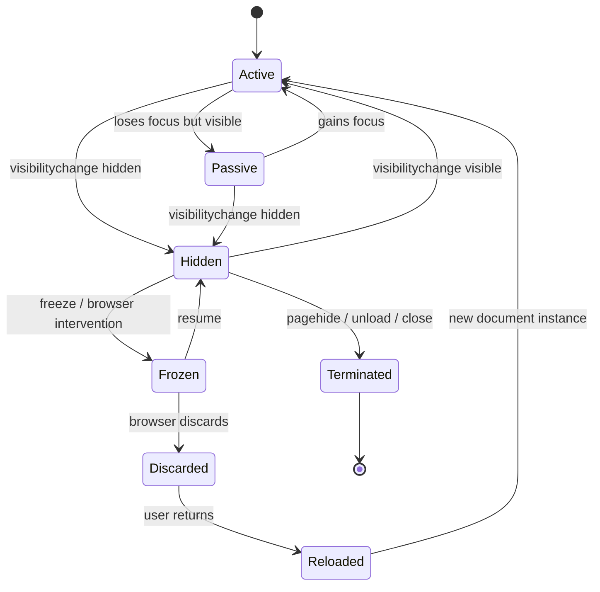
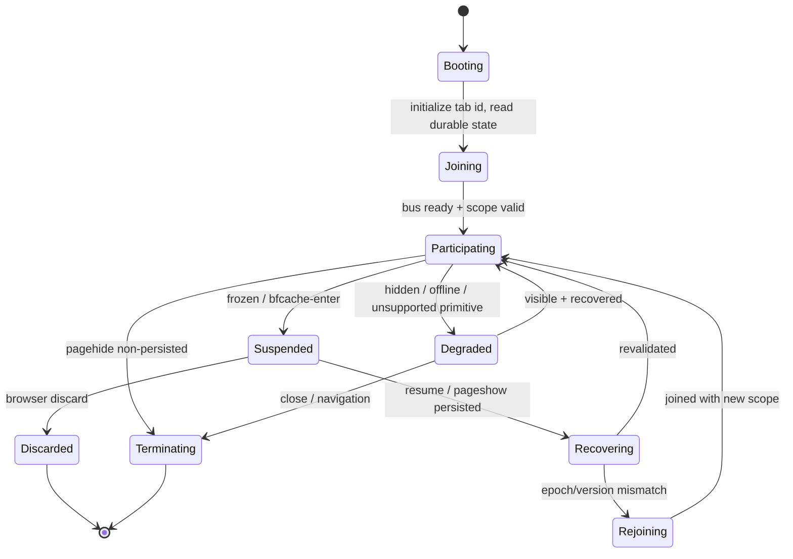

# Part 006 — Page Lifecycle: Visible, Hidden, Frozen, Discarded, Restored

> Target part ini: kamu mampu mendesain multi-tab orchestration yang tidak runtuh ketika tab disembunyikan, timer diperlambat, page masuk bfcache, context dibekukan, service worker berubah versi, atau tab kembali hidup membawa state lama.

Di backend, worker process biasanya punya lifecycle yang relatif eksplisit:

```txt
start -> ready -> handle work -> shutdown
```

Di browser, lifecycle jauh lebih licin.

Tab bisa:

- aktif dan visible,
- visible tapi tidak fokus,
- hidden di background,
- throttled,
- frozen,
- masuk back/forward cache,
- discarded oleh browser untuk menghemat memory,
- restored lewat navigation,
- reloaded diam-diam oleh user,
- kehilangan network,
- berubah auth state saat hidden,
- kembali setelah app version berubah.

Kalau orchestration kamu mengasumsikan bahwa setiap tab selalu hidup, timer selalu jalan, dan handler selalu segera dipanggil, desainnya rapuh.

Kebenaran kerasnya:

> Browser tab adalah participant tidak stabil dalam distributed system kecil.

---

## 1. Mental Model: Page Bukan Process yang Selalu Running

Model salah:

```txt
Tab opened = app running
Tab hidden = app still running normally
Tab visible again = app continues from exact same safe state
```

Model yang lebih benar:

```txt
Tab opened       = context may participate
Tab hidden       = context may be deprioritized
Tab frozen       = context may stop executing freezable tasks
Tab discarded    = context is gone, later reload/restoration may happen
Tab restored     = context must revalidate reality
```

Untuk orchestration, tab lifecycle harus dianggap sebagai input sistem.



Tidak semua browser mengekspos semua state dengan event yang sama. Jangan desain hanya untuk satu event. Desain untuk realitas: context bisa berhenti tanpa memberi kamu kesempatan cleanup sempurna.

---

## 2. Visibility State: Signal Paling Praktis

`document.visibilityState` adalah signal dasar:

```ts
function currentVisibility(): DocumentVisibilityState {
  return document.visibilityState;
}

document.addEventListener('visibilitychange', () => {
  if (document.visibilityState === 'hidden') {
    onPageHidden();
  } else if (document.visibilityState === 'visible') {
    onPageVisible();
  }
});
```

`hidden` bukan berarti page mati. Tetapi hidden berarti browser boleh melakukan banyak optimisasi:

- timer throttling,
- deprioritized rendering,
- reduced CPU scheduling,
- possible freezing,
- possible discard under memory pressure,
- network/resource behavior yang berbeda antar browser.

Rule praktis:

```txt
visible -> boleh melakukan latency-sensitive user work
hidden  -> kurangi work, persist state, release leadership jika perlu
visible again -> revalidate sebelum lanjut
```

---

## 3. Active, Passive, Hidden

Chrome Page Lifecycle model membedakan active, passive, hidden, frozen, terminated, discarded. Untuk aplikasi, kamu bisa memakai simplifikasi:

| State | Makna praktis | Apa yang boleh dilakukan |
|---|---|---|
| active | visible + focused | UI work, input, optimistic updates, foreground sync |
| passive | visible tapi tidak focused | render/update boleh, tapi jangan asumsikan user sedang aktif |
| hidden | tidak terlihat | persist, reduce polling, release expensive resources |
| frozen | JS task tertentu bisa berhenti | jangan mengandalkan timer/heartbeat |
| terminated | document selesai | best-effort cleanup saja |
| discarded | proses dokumen dibuang | tidak ada cleanup reliable |

Kamu tidak harus expose semua state ke business code. Tetapi orchestration layer perlu tahu enough untuk membuat keputusan.

---

## 4. Page Lifecycle Adapter

Jangan biarkan seluruh app membaca `document.visibilityState`, `pagehide`, `pageshow`, `freeze`, `resume`, `beforeunload`, dan `focus` secara langsung. Buat adapter.

```ts
type PageRuntimeState =
  | 'active'
  | 'passive'
  | 'hidden'
  | 'frozen'
  | 'terminated';

type LifecycleEvent = {
  previous: PageRuntimeState;
  next: PageRuntimeState;
  reason: string;
  at: number;
};

type Unsubscribe = () => void;

class PageLifecycleAdapter {
  private state: PageRuntimeState = this.computeState();
  private listeners = new Set<(event: LifecycleEvent) => void>();

  start(): Unsubscribe {
    const onVisibility = () => this.transition(this.computeState(), 'visibilitychange');
    const onFocus = () => this.transition(this.computeState(), 'focus');
    const onBlur = () => this.transition(this.computeState(), 'blur');
    const onFreeze = () => this.transition('frozen', 'freeze');
    const onResume = () => this.transition(this.computeState(), 'resume');
    const onPageHide = (event: PageTransitionEvent) => {
      this.transition('terminated', event.persisted ? 'pagehide-bfcache' : 'pagehide');
    };
    const onPageShow = (event: PageTransitionEvent) => {
      this.transition(this.computeState(), event.persisted ? 'pageshow-bfcache' : 'pageshow');
    };

    document.addEventListener('visibilitychange', onVisibility);
    window.addEventListener('focus', onFocus);
    window.addEventListener('blur', onBlur);
    window.addEventListener('pagehide', onPageHide);
    window.addEventListener('pageshow', onPageShow);

    // freeze/resume are Chromium-oriented Page Lifecycle events. Guard usage.
    document.addEventListener?.('freeze', onFreeze as EventListener);
    document.addEventListener?.('resume', onResume as EventListener);

    return () => {
      document.removeEventListener('visibilitychange', onVisibility);
      window.removeEventListener('focus', onFocus);
      window.removeEventListener('blur', onBlur);
      window.removeEventListener('pagehide', onPageHide);
      window.removeEventListener('pageshow', onPageShow);
      document.removeEventListener?.('freeze', onFreeze as EventListener);
      document.removeEventListener?.('resume', onResume as EventListener);
    };
  }

  subscribe(listener: (event: LifecycleEvent) => void): Unsubscribe {
    this.listeners.add(listener);
    return () => this.listeners.delete(listener);
  }

  getState(): PageRuntimeState {
    return this.state;
  }

  private computeState(): PageRuntimeState {
    if (document.visibilityState === 'hidden') return 'hidden';
    return document.hasFocus() ? 'active' : 'passive';
  }

  private transition(next: PageRuntimeState, reason: string): void {
    const previous = this.state;
    if (previous === next) return;

    this.state = next;

    const event: LifecycleEvent = {
      previous,
      next,
      reason,
      at: Date.now(),
    };

    for (const listener of this.listeners) {
      listener(event);
    }
  }
}
```

Adapter ini sengaja tidak sempurna. Tujuannya adalah memusatkan ketidaksempurnaan browser lifecycle dalam satu modul.

---

## 5. Jangan Mengandalkan `unload`

Banyak tutorial lama memakai:

```ts
window.addEventListener('unload', cleanup);
window.addEventListener('beforeunload', saveState);
```

Untuk sistem modern, ini smell.

Masalah:

- tidak selalu reliable,
- bisa mengganggu bfcache,
- behavior berbeda antar browser,
- async work sering tidak selesai,
- user/browser bisa terminate tanpa memberi kesempatan,
- page yang masuk bfcache tidak benar-benar unload.

Lebih baik:

- persist state saat perubahan penting terjadi, bukan menunggu akhir,
- gunakan `visibilitychange` ke hidden sebagai signal untuk flush cepat,
- gunakan `pagehide` untuk best-effort finalization,
- gunakan `navigator.sendBeacon()` untuk telemetry kecil jika cocok,
- desain recovery saat next startup.

Rule:

```txt
cleanup on unload = best effort
recovery on startup = mandatory
```

---

## 6. Hidden State adalah Last Reliable-ish Checkpoint

Saat page berubah menjadi hidden, itu sering menjadi kesempatan terakhir yang relatif baik untuk:

- flush draft lokal,
- persist in-memory queue,
- update tab presence status,
- release non-critical leadership,
- stop expensive polling,
- record lifecycle telemetry,
- schedule recovery metadata.

Contoh:

```ts
lifecycle.subscribe((event) => {
  if (event.next === 'hidden') {
    persistVolatileState();
    tabPresence.markHidden();
    polling.suspend('page-hidden');
    metrics.flushSoon();
  }

  if (event.next === 'active') {
    recoverAfterVisibilityGain();
  }
});
```

Tetapi jangan lakukan pekerjaan berat saat hidden. Kamu sedang berada dalam jalur keluar.

---

## 7. Frozen State: Heartbeat Bisa Berhenti

Ketika page frozen, task tertentu bisa tidak dijalankan sampai page resume. Ini fatal untuk desain yang bergantung pada `setInterval` heartbeat.

Naive liveness:

```ts
setInterval(() => {
  broadcastHeartbeat(tabId, Date.now());
}, 5_000);
```

Masalah:

- hidden tab timer bisa throttled,
- frozen tab tidak mengirim heartbeat,
- event loop bisa tertahan long task,
- laptop sleep membuat gap besar,
- mobile browser bisa pause agresif,
- tab bisa discarded tanpa final heartbeat.

Liveness harus berbasis timeout yang toleran, bukan “heartbeat pasti tiap N detik”.

```ts
type ParticipantStatus =
  | 'alive'
  | 'suspect'
  | 'expired';

function classifyParticipant(lastSeenAt: number, now = Date.now()): ParticipantStatus {
  const age = now - lastSeenAt;

  if (age < 15_000) return 'alive';
  if (age < 60_000) return 'suspect';
  return 'expired';
}
```

Jangan langsung menghapus participant saat satu interval terlewat. Hidden/frozen adalah normal.

---

## 8. Discarded State: Tidak Ada Cleanup

Tab discarded berarti browser membuang dokumen dari memory, biasanya karena tekanan resource. Saat user kembali, halaman reload dari awal, tetapi browser bisa mempertahankan indikasi bahwa document sebelumnya pernah discarded.

Konsekuensi:

- tidak ada final message,
- tidak ada release lock manual,
- in-memory state hilang,
- worker owned by page hilang,
- pending async work hilang,
- presence record bisa stale,
- leader identity bisa stale jika disimpan buruk.

Maka semua state penting harus recoverable.

```txt
if losing this in-memory variable breaks the system,
it should not only live in memory.
```

Untuk multi-tab orchestration:

- leadership harus berbasis lock/lease/fencing, bukan flag memory,
- offline queue harus durable,
- pending operation harus idempotent,
- tab registry harus expire stale entries,
- startup harus reconcile.

---

## 9. BFCache: Page Bisa “Kembali dari Masa Lalu”

Back/forward cache menyimpan halaman agar navigation back/forward terasa instan. Saat page masuk bfcache, ia tidak sama dengan unload normal. Saat kembali, JavaScript state bisa masih ada.

Ini bagus untuk UX, tapi berbahaya untuk orchestration kalau kamu menganggap state memory selalu fresh.

Gunakan `pageshow` dan `pagehide`:

```ts
window.addEventListener('pagehide', (event) => {
  if (event.persisted) {
    orchestration.suspend('bfcache-enter');
  } else {
    orchestration.terminateBestEffort('pagehide');
  }
});

window.addEventListener('pageshow', (event) => {
  if (event.persisted) {
    orchestration.resumeFromBfcache();
  } else {
    orchestration.startFresh();
  }
});
```

Saat resume dari bfcache:

1. jangan percaya cache memory,
2. baca auth/session epoch terbaru,
3. cek app version/protocol,
4. refresh tab presence,
5. cek apakah leadership masih valid,
6. invalidate stale network assumptions,
7. reconcile pending UI state.

---

## 10. Lifecycle-aware Orchestration State Machine

Orchestration layer sebaiknya punya state machine sendiri.



Perhatikan bahwa `Recovering` bukan formalitas. Banyak bug lahir karena tab langsung “lanjut” setelah visible lagi.

---

## 11. Startup Recovery Lebih Penting daripada Shutdown Cleanup

Setiap tab startup harus bertanya:

```txt
Apa yang mungkin terjadi saat saya mati/tidur/tidak terlihat?
```

Recovery checklist:

1. assign `tabId` baru atau restore session-scoped tab identity dengan hati-hati,
2. read durable auth/session epoch,
3. read app/build/protocol version,
4. check if IndexedDB schema needs migration,
5. expire old tab registry records,
6. check existing leader/lease state,
7. rejoin BroadcastChannel,
8. announce presence,
9. resubscribe service worker messages,
10. reconcile offline queue,
11. revalidate visible screen data,
12. emit telemetry: cold start, reload, bfcache restore, possible discard.

Contoh:

```ts
async function bootOrchestration() {
  const bootId = crypto.randomUUID();
  const startedAt = Date.now();

  const [session, appVersion, durableQueue] = await Promise.all([
    sessionStore.readCurrentSession(),
    versionStore.readClientVersion(),
    offlineQueue.readSummary(),
  ]);

  await tabRegistry.expireOldEntries({ now: startedAt });

  const participant = {
    tabId: createTabId(),
    bootId,
    startedAt,
    userIdHash: session.userIdHash,
    tenantId: session.tenantId,
    authEpoch: session.authEpoch,
    protocol: 3,
  };

  await tabRegistry.register(participant);

  bus.start(participant);
  lifecycle.start();

  await reconcileAfterBoot({ participant, durableQueue, appVersion });
}
```

---

## 12. Tab Identity: Stable Enough, Not Forever

Kamu butuh id untuk membedakan sender.

Pilihan:

| Identity | Lifetime | Use case |
|---|---:|---|
| `messageId` | per message | dedupe, tracing |
| `instanceId` | per JS runtime boot | crash/reload distinction |
| `tabId` | per tab/sessionStorage | tab-level presence |
| `participantId` | per joined context | bus registry |
| `userIdHash` | per user session | scope matching |
| `authEpoch` | per auth change | stale auth rejection |

`sessionStorage` sering berguna untuk tab identity karena ia scoped per top-level browsing context.

```ts
function getOrCreateTabId(): string {
  const key = 'regsys:tab-id';
  const existing = sessionStorage.getItem(key);
  if (existing) return existing;

  const created = crypto.randomUUID();
  sessionStorage.setItem(key, created);
  return created;
}
```

Tetapi jangan menjadikan `tabId` sebagai authority. Tab bisa duplicate karena restore/clone behavior, sessionStorage bisa hilang, dan user bisa membuka environment berbeda.

Tambahkan `instanceId`:

```ts
const runtimeIdentity = {
  tabId: getOrCreateTabId(),
  instanceId: crypto.randomUUID(),
  startedAt: Date.now(),
};
```

Jika `tabId` sama tapi `instanceId` berubah, artinya runtime baru.

---

## 13. Presence Registry dengan Expiry

Presence registry tidak boleh bergantung pada perfect leave event.

Data model:

```ts
type TabPresenceRecord = {
  tabId: string;
  instanceId: string;
  userIdHash?: string;
  tenantId?: string;
  state: 'active' | 'passive' | 'hidden' | 'frozen' | 'terminating';
  protocol: number;
  startedAt: number;
  lastSeenAt: number;
  lastStateChangeAt: number;
};
```

Update:

```ts
async function updatePresenceState(state: TabPresenceRecord['state']) {
  await presenceStore.put({
    ...currentPresence,
    state,
    lastSeenAt: Date.now(),
    lastStateChangeAt: Date.now(),
  });

  bus.publish({
    channel: 'session',
    type: 'PRESENCE_CHANGED',
    scope: currentScope(),
    payload: {
      tabId: currentPresence.tabId,
      instanceId: currentPresence.instanceId,
      state,
    },
  });
}
```

Expiry:

```ts
async function expirePresence(now = Date.now()) {
  const records = await presenceStore.list();

  for (const record of records) {
    const age = now - record.lastSeenAt;
    if (age > 120_000) {
      await presenceStore.remove(record.tabId, record.instanceId);
      metrics.increment('presence.expired');
    }
  }
}
```

Presence is evidence, not truth.

---

## 14. Leadership Harus Lifecycle-aware

Misal hanya satu tab boleh menjalankan offline replay.

Naive:

```ts
if (isLeader) {
  setInterval(replayOfflineQueue, 10_000);
}
```

Masalah:

- leader hidden dan timer throttled,
- leader frozen,
- leader discarded tanpa cleanup,
- leader kembali dan mengira masih leader,
- tab lain sudah mengambil alih.

Pattern lebih baik:

```txt
visible/active tab preferred leader
hidden leader may voluntarily step down
lock/lease determines actual ownership
fencing token protects writes
resume requires re-acquire/revalidate
```

Pseudo:

```ts
lifecycle.subscribe(async (event) => {
  if (event.next === 'hidden') {
    await leadership.demoteIfNonCritical('page-hidden');
  }

  if (event.next === 'active') {
    await leadership.tryAcquireIfNeeded('page-active');
  }

  if (event.next === 'frozen') {
    await leadership.persistLeaseCheckpoint('page-frozen');
  }
});
```

Kita akan bahas leader election detail di Part 038–040. Untuk sekarang, ingat: lifecycle mempengaruhi siapa yang layak menjadi leader.

---

## 15. Timer Throttling dan Scheduling Reality

Browser dapat memperlambat timer di background. Maka `setInterval` bukan scheduler yang presisi.

Design implication:

| Pattern | Risiko |
|---|---|
| `setInterval(sync, 5000)` di semua tab | duplicate work, battery drain |
| satu hidden tab sebagai leader | sync terlambat |
| heartbeat interval ketat | false failure detection |
| timeout terlalu pendek | false retry storm |
| cleanup hanya via timer | stale records menumpuk |

Lebih sehat:

- gunakan event-driven trigger jika mungkin,
- gunakan Web Locks untuk dedupe work,
- gunakan visibility-aware scheduling,
- gunakan jitter,
- gunakan stale-while-revalidate semantics,
- expire berdasarkan wall-clock timestamp, bukan tick count,
- recover saat visible/startup.

Contoh scheduler:

```ts
type ScheduleReason =
  | 'visible'
  | 'network-online'
  | 'lock-acquired'
  | 'manual'
  | 'periodic-backoff';

class LifecycleAwareScheduler {
  private timer: number | undefined;
  private backoffMs = 5_000;

  constructor(
    private readonly lifecycle: PageLifecycleAdapter,
    private readonly run: (reason: ScheduleReason) => Promise<void>,
  ) {}

  start() {
    this.lifecycle.subscribe((event) => {
      if (event.next === 'active') {
        void this.trigger('visible');
      }

      if (event.next === 'hidden' || event.next === 'frozen') {
        this.cancelTimer();
      }
    });

    this.scheduleNext('periodic-backoff');
  }

  async trigger(reason: ScheduleReason) {
    if (this.lifecycle.getState() === 'frozen') return;

    try {
      await this.run(reason);
      this.backoffMs = 5_000;
    } catch {
      this.backoffMs = Math.min(this.backoffMs * 2, 120_000);
    } finally {
      this.scheduleNext('periodic-backoff');
    }
  }

  private scheduleNext(reason: ScheduleReason) {
    this.cancelTimer();
    if (this.lifecycle.getState() === 'hidden') return;

    const jitter = Math.floor(Math.random() * 1_000);
    this.timer = window.setTimeout(() => {
      void this.trigger(reason);
    }, this.backoffMs + jitter);
  }

  private cancelTimer() {
    if (this.timer !== undefined) {
      window.clearTimeout(this.timer);
      this.timer = undefined;
    }
  }
}
```

---

## 16. Workers dan Page Lifecycle

Dedicated Worker dimiliki oleh context yang membuatnya. Kalau page mati, worker-nya juga tidak bisa dianggap tetap hidup sebagai coordinator durable.

SharedWorker bisa dipakai oleh beberapa context, tetapi tetap bukan process backend permanen. Ia ada selama ada participant yang terhubung dan browser mempertahankannya.

Service Worker bersifat event-driven. Ia bukan daemon abadi. Ia bisa start untuk event lalu stop setelah selesai.

Mental model:

| Worker type | Lifecycle ownership | Jangan diasumsikan |
|---|---|---|
| Dedicated Worker | owner page/window | hidup setelah owner hilang |
| SharedWorker | shared by connected contexts | selalu tersedia seperti server process |
| Service Worker | browser event-driven | running terus-menerus |

Karena itu, durable orchestration state tetap perlu storage/protocol, bukan worker memory saja.

---

## 17. Service Worker Lifecycle Split

Service Worker menambah satu dimensi lifecycle:

```txt
installing -> installed/waiting -> activating -> activated -> redundant
```

Masalah multi-tab:

- Tab A controlled by SW v1.
- Tab B opened after deploy and sees SW v2 waiting.
- User keeps Tab A open for hours.
- Cache schema changes.
- SW v2 broadcasts update but Tab A handler v1 tidak kompatibel.

Jangan broadcast message tanpa version.

```ts
type ServiceWorkerToClient = {
  app: 'regsys';
  swProtocol: 2;
  buildId: string;
  type: 'CACHE_VERSION_READY' | 'CLIENTS_SHOULD_RELOAD' | 'OFFLINE_REPLAY_DONE';
  payload: unknown;
};
```

Client harus reject incompatible SW message.

```ts
navigator.serviceWorker.addEventListener('message', (event) => {
  const decoded = decodeServiceWorkerMessage(event.data);
  if (!decoded.ok) return;

  if (!supportsSwProtocol(decoded.value.swProtocol)) {
    metrics.increment('sw.message.reject.protocol');
    return;
  }

  handleServiceWorkerMessage(decoded.value);
});
```

---

## 18. Online/Offline adalah Signal Lemah

`navigator.onLine` dan `online`/`offline` event berguna sebagai signal kasar, tetapi bukan truth.

Masalah:

- device bisa online tapi API unreachable,
- captive portal,
- DNS failure,
- corporate proxy,
- origin-specific outage,
- flaky mobile connection,
- background tab throttling.

Jangan desain:

```ts
if (navigator.onLine) replayAllQueue();
```

Lebih baik:

```ts
window.addEventListener('online', () => {
  scheduler.trigger('network-online');
});
```

Kemudian replay tetap:

- acquire lock,
- ping/retry API safely,
- respect backoff,
- handle 401/403 separately,
- idempotent mutation,
- persist progress.

---

## 19. Visibility-aware Data Refresh

Saat tab kembali visible, banyak aplikasi langsung refresh semua data.

Naive:

```ts
document.addEventListener('visibilitychange', () => {
  if (document.visibilityState === 'visible') {
    queryClient.invalidateQueries();
  }
});
```

Masalah:

- 10 tab visible bergantian bisa storm,
- stale tab dengan tenant lama bisa refresh salah,
- hidden duration pendek tidak perlu refresh penuh,
- auth epoch bisa berubah,
- offline queue replay bisa sedang berjalan di tab lain.

Lebih baik:

```ts
async function recoverAfterVisibilityGain() {
  const previous = runtime.snapshot;
  const currentSession = await sessionStore.readCurrentSession();

  if (currentSession.authEpoch !== previous.authEpoch) {
    await sessionRuntime.rejoin(currentSession);
    return;
  }

  const hiddenForMs = Date.now() - runtime.lastHiddenAt;

  if (hiddenForMs > 30_000) {
    await refreshCriticalQueriesOnly();
  }

  await presence.markActive();
  await leadership.tryAcquireIfUseful('visible-recovery');
}
```

Refresh should be scoped and reasoned.

---

## 20. Lifecycle Event Ordering Tidak Boleh Dianggap Sempurna

Event bisa datang dalam urutan yang berbeda antar browser/kondisi.

Misal:

```txt
visibilitychange hidden
pagehide persisted=true
freeze
resume
pageshow persisted=true
visibilitychange visible
```

Atau variasi lain.

Maka handler harus idempotent.

Anti-pattern:

```ts
let isSuspended = false;

onFreeze(() => {
  isSuspended = true;
  closeEverything();
});

onPageHide(() => {
  closeEverything(); // double close bug
});
```

Pattern:

```ts
class ResourceGate {
  private closed = false;

  close(reason: string) {
    if (this.closed) return;
    this.closed = true;
    metrics.increment('resource.closed', { reason });
    this.doClose();
  }

  reopen(reason: string) {
    if (!this.closed) return;
    this.closed = false;
    metrics.increment('resource.reopened', { reason });
    this.doOpen();
  }

  private doClose() {}
  private doOpen() {}
}
```

Lifecycle handlers must be idempotent because browser lifecycle is not a neat business workflow.

---

## 21. Resource Management by Lifecycle

Map resource ke lifecycle decision.

| Resource | On hidden | On frozen/pagehide | On visible/pageshow |
|---|---|---|---|
| UI animation | stop | stopped | restart if needed |
| polling | suspend/reduce | stopped | refresh selectively |
| WebSocket | maybe keep or close | close if required | reconnect + resync |
| BroadcastChannel | usually keep | close on termination | recreate on boot |
| Dedicated Worker | pause tasks | terminate if non-critical | recreate if needed |
| IndexedDB transaction | finish quickly | do not start long tx | reopen/retry |
| leadership | demote if non-critical | persist/release best effort | reacquire if useful |
| metrics | flush small payload | best effort beacon | start new session span |
| draft form | persist | already persisted | reconcile |

Jangan gunakan satu policy untuk semua resource. WebSocket chat app berbeda dari case management form, trading screen, video editor, atau offline-first audit tool.

---

## 22. Handling Long IndexedDB Work

IndexedDB migration atau batch write yang panjang bisa bermasalah saat page lifecycle berubah.

Rule:

- jangan mulai migration besar di hidden tab kalau bisa dihindari,
- gunakan Web Lock untuk migration,
- checkpoint progress,
- buat migration idempotent,
- handle blocked/open versionchange,
- jangan mengandalkan single tab menyelesaikan semuanya tanpa gangguan.

Pseudo:

```ts
await navigator.locks.request('regsys:prod:v3:indexeddb:migration', async () => {
  const lifecycleState = lifecycle.getState();

  if (lifecycleState === 'hidden' || lifecycleState === 'frozen') {
    throw new Error('defer-migration-page-not-active');
  }

  await runMigrationInSmallSteps({
    shouldContinue: () => lifecycle.getState() === 'active' || lifecycle.getState() === 'passive',
    checkpointEvery: 100,
  });
});
```

---

## 23. Lifecycle and User Journey

Lifecycle bukan cuma technical state. Ia mengubah user journey.

Contoh case workflow:

1. User membuka enforcement action form.
2. User pindah tab untuk cari data pendukung.
3. Browser mobile membekukan tab form.
4. Session direvokasi oleh admin di tab lain/server.
5. User kembali ke form.
6. UI masih punya data draft lama.

Aplikasi harus menjawab:

- Apakah draft masih boleh diedit?
- Apakah action masih valid?
- Apakah permission berubah?
- Apakah case status berubah?
- Apakah form harus read-only?
- Apakah user harus re-auth?
- Apakah pending attachment upload harus dilanjutkan?

Lifecycle recovery harus masuk domain model, bukan hanya refresh teknis.

---

## 24. Recovery Contract untuk Feature Teams

Orchestration layer bisa menyediakan hook:

```ts
type RecoveryReason =
  | 'visible-after-hidden'
  | 'bfcache-restore'
  | 'startup-after-discard'
  | 'auth-epoch-changed'
  | 'protocol-rejoined';

type RecoveryHandler = {
  feature: string;
  recover(reason: RecoveryReason, context: RecoveryContext): Promise<void>;
};

class RecoveryRegistry {
  private handlers: RecoveryHandler[] = [];

  register(handler: RecoveryHandler) {
    this.handlers.push(handler);
  }

  async recoverAll(reason: RecoveryReason, context: RecoveryContext) {
    for (const handler of this.handlers) {
      await handler.recover(reason, context);
    }
  }
}
```

Feature team tidak perlu tahu semua browser events. Mereka hanya perlu implement recovery contract:

```ts
recoveryRegistry.register({
  feature: 'case-action-form',
  async recover(reason, context) {
    if (reason === 'auth-epoch-changed') {
      await reloadPermissions();
    }

    if (reason === 'visible-after-hidden' && context.hiddenForMs > 60_000) {
      await revalidateCaseVersion();
    }
  },
});
```

Ini membuat lifecycle concern tidak menyebar liar.

---

## 25. Observability: Lifecycle Harus Terlihat

Tanpa telemetry, bug lifecycle terlihat seperti “kadang-kadang UI aneh”.

Log minimal:

```ts
type LifecycleTelemetry = {
  tabId: string;
  instanceId: string;
  previous: PageRuntimeState;
  next: PageRuntimeState;
  reason: string;
  at: number;
  hiddenForMs?: number;
  authEpoch?: number;
  buildId: string;
  protocol: number;
};
```

Metrics:

| Metric | Tujuan |
|---|---|
| `lifecycle.transition.count` | distribusi state changes |
| `page.hidden.duration` | berapa lama tab hidden |
| `bfcache.restore.count` | restore dari bfcache |
| `presence.expired.count` | stale participant cleanup |
| `leadership.demote.hidden.count` | leader turun karena hidden |
| `recovery.duration` | biaya recovery |
| `recovery.failure.count` | feature gagal recover |
| `message.rejected.stale_epoch` | stale tab attempts |

Debugging multi-tab tanpa lifecycle telemetry hampir selalu menyakitkan.

---

## 26. Testing Lifecycle

Unit test saja tidak cukup. Butuh integration/browser test.

Test scenarios:

1. tab becomes hidden, polling stops,
2. tab visible again, critical data revalidates,
3. bfcache restore triggers recovery,
4. stale auth epoch rejected after hidden resume,
5. presence expires participant without leave event,
6. leader hidden voluntarily demotes,
7. discarded-like reload performs startup recovery,
8. duplicate lifecycle events do not double-close resource,
9. service worker version split rejects incompatible message,
10. offline queue replay resumes idempotently after interruption.

Pseudo Playwright pattern:

```ts
test('hidden tab does not keep leadership forever', async ({ browser }) => {
  const context = await browser.newContext();
  const tabA = await context.newPage();
  const tabB = await context.newPage();

  await tabA.goto(APP_URL);
  await tabB.goto(APP_URL);

  await acquireLeadership(tabA);
  await simulateHidden(tabA);

  await expectEventually(async () => {
    return await isLeader(tabB);
  }).toBe(true);
});
```

Browser APIs for lifecycle simulation are not always perfectly exposed in test runners, so use controlled adapters. Design your lifecycle adapter so tests can inject transitions.

---

## 27. Dependency Injection untuk Lifecycle Tests

Jangan hard-bind production adapter ke semua code.

```ts
interface LifecycleSource {
  getState(): PageRuntimeState;
  subscribe(listener: (event: LifecycleEvent) => void): Unsubscribe;
}
```

Production:

```ts
const lifecycle: LifecycleSource = new PageLifecycleAdapter();
```

Test:

```ts
class FakeLifecycleSource implements LifecycleSource {
  private state: PageRuntimeState = 'active';
  private listeners = new Set<(event: LifecycleEvent) => void>();

  getState() {
    return this.state;
  }

  subscribe(listener: (event: LifecycleEvent) => void) {
    this.listeners.add(listener);
    return () => this.listeners.delete(listener);
  }

  transition(next: PageRuntimeState, reason = 'test') {
    const previous = this.state;
    this.state = next;

    for (const listener of this.listeners) {
      listener({ previous, next, reason, at: Date.now() });
    }
  }
}
```

Ini membuat failure model bisa dites tanpa menunggu browser benar-benar freeze.

---

## 28. Practical Policies

Berikut policy awal yang masuk akal untuk banyak enterprise app.

### On hidden

- persist draft and volatile app state,
- reduce or stop polling,
- mark presence hidden,
- release non-critical leadership,
- flush small telemetry,
- keep minimal bus listener if cheap.

### On visible

- mark presence active/passive,
- read current session/auth epoch,
- reject stale runtime if epoch changed,
- refresh critical visible data if hidden long enough,
- try reacquire leadership only if useful,
- resume suspended worker tasks carefully.

### On pagehide persisted

- suspend orchestration,
- avoid destructive cleanup,
- prepare for bfcache restore.

### On pagehide non-persisted

- best-effort presence terminating,
- best-effort release resources,
- no reliance on async completion.

### On pageshow persisted

- treat as recovery, not normal continuation.

### On startup

- expire stale registry,
- rejoin bus,
- reconcile durable state,
- detect possible discard/reload,
- validate session/protocol.

---

## 29. Common Lifecycle Bugs

### Bug 1 — Hidden leader blocks progress

Satu tab menjadi leader, lalu hidden. Timer throttled. Offline queue terlambat replay.

Fix: visible preferred leadership + Web Lock + recovery.

### Bug 2 — Stale tab overwrites fresh state

Tab hidden selama 2 jam, user berubah tenant di tab lain, lalu tab lama visible dan menulis cache lama.

Fix: auth/session/tenant epoch check before write.

### Bug 3 — Page restored from bfcache with old permission

UI masih menampilkan tombol approve, padahal permission dicabut.

Fix: pageshow persisted -> revalidate permission-sensitive screens.

### Bug 4 — Double cleanup

`visibilitychange`, `pagehide`, dan custom router event semua menutup resource yang sama.

Fix: idempotent resource gate.

### Bug 5 — Refresh storm on visible

Banyak tab visible/recovered lalu semua invalidate query besar.

Fix: scoped refresh + lock/single-flight + jitter.

### Bug 6 — Worker assumed persistent

Dedicated worker menyimpan queue memory. Page discarded. Queue hilang.

Fix: durable queue + worker as executor, not source of truth.

---

## 30. Design Rule: Resume Means Revalidate

Kalimat paling penting part ini:

> Resume is not continue. Resume is revalidate.

Setiap kali page kembali visible, kembali dari bfcache, atau startup setelah kemungkinan discard, tanyakan:

```txt
Apakah session masih sama?
Apakah tenant masih sama?
Apakah auth epoch masih sama?
Apakah app protocol masih kompatibel?
Apakah leadership masih valid?
Apakah durable queue berubah?
Apakah visible data masih valid?
Apakah permission-sensitive action masih boleh?
```

Kalau jawaban ini tidak diperiksa, bug akan muncul sebagai:

- stale UI,
- duplicate sync,
- ghost notification,
- failed token refresh,
- lost draft,
- incorrect permission display,
- leader split-brain,
- cache corruption.

---

## 31. What You Should Remember

Page lifecycle adalah sumber nondeterminism besar di browser orchestration.

Tab bukan process stabil. Hidden tab bisa diperlambat. Frozen tab bisa berhenti mengeksekusi task. Discarded tab tidak memberi cleanup. BFCache bisa mengembalikan JavaScript state lama. Service Worker bukan daemon permanen. Dedicated Worker mati bersama owner.

Karena itu, desain production harus memakai prinsip:

```txt
persist early
cleanup best-effort
recover always
validate on resume
expire stale participants
make handlers idempotent
prefer event-driven + lock-based coordination over timer faith
```

Di part berikutnya, kita akan membahas failure model secara eksplisit: closed tabs, crashed workers, frozen timers, lost messages, stale state, duplicate messages, and recovery boundaries. Itu akan menjadi fondasi sebelum masuk ke messaging primitives dan protocol design.

---

## References

- Chrome for Developers — Page Lifecycle API: `https://developer.chrome.com/docs/web-platform/page-lifecycle-api`
- MDN Web Docs — Page Visibility API: `https://developer.mozilla.org/en-US/docs/Web/API/Page_Visibility_API`
- MDN Web Docs — Document.visibilityState: `https://developer.mozilla.org/en-US/docs/Web/API/Document/visibilityState`
- MDN Web Docs — Window: pagehide event: `https://developer.mozilla.org/en-US/docs/Web/API/Window/pagehide_event`
- MDN Web Docs — Window: pageshow event: `https://developer.mozilla.org/en-US/docs/Web/API/Window/pageshow_event`
- MDN Web Docs — Service Worker API: `https://developer.mozilla.org/en-US/docs/Web/API/Service_Worker_API`
- web.dev — Back/forward cache: `https://web.dev/articles/bfcache`
