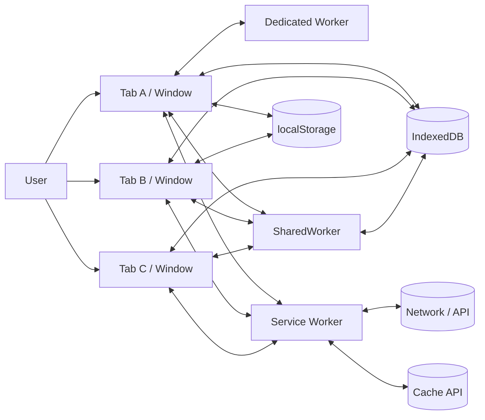
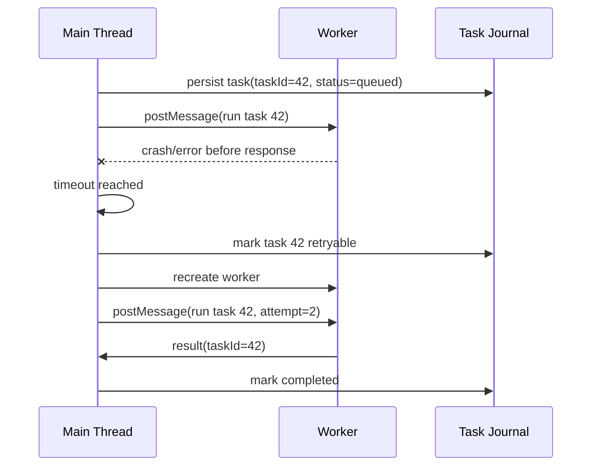
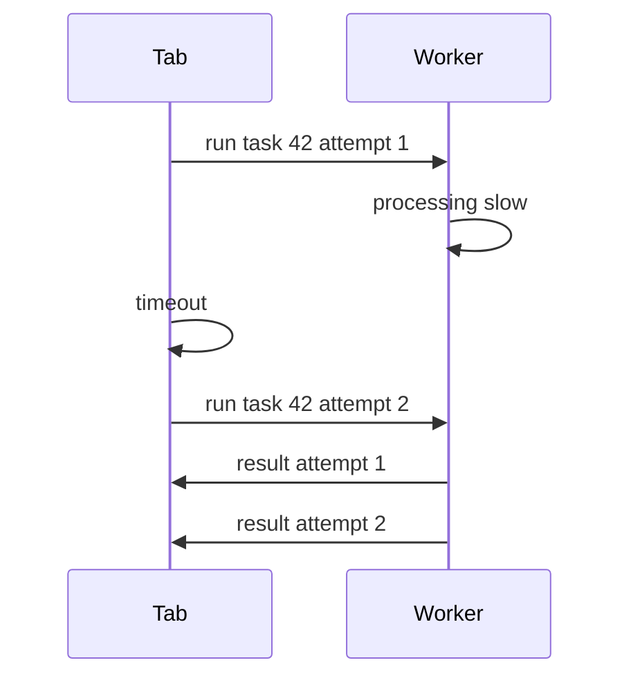
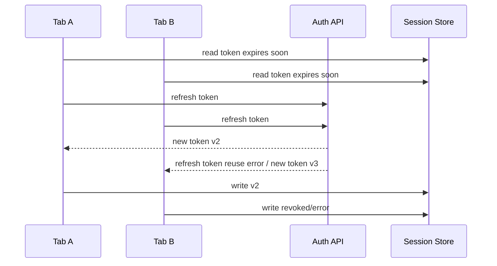
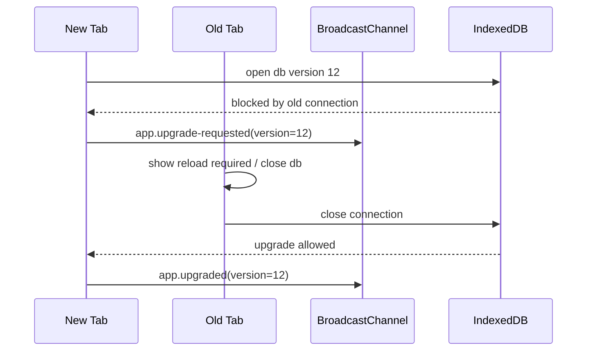
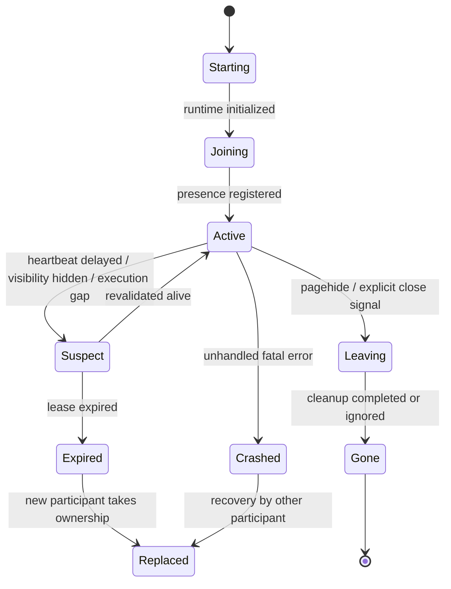
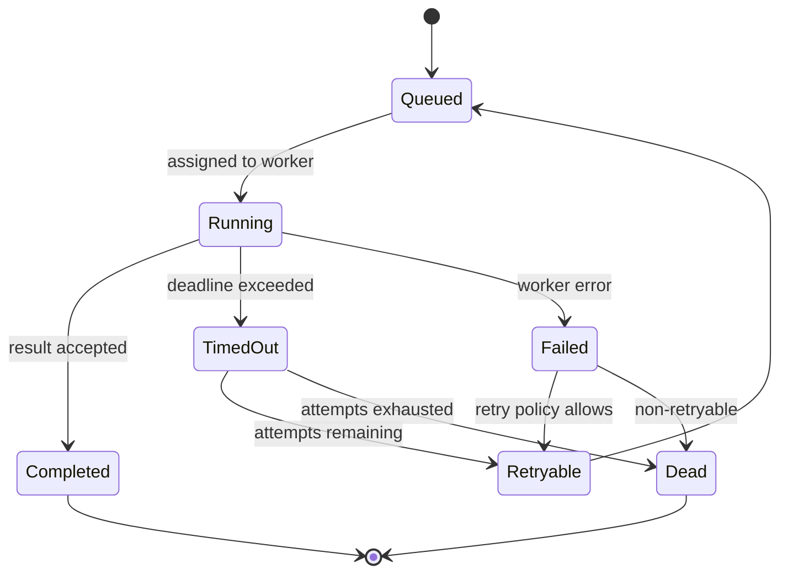

# Part 007 — Failure Model: Closed Tabs, Crashed Workers, Frozen Timers, Lost Messages

> Target part ini: kamu mampu mendesain multi-tab orchestration dengan asumsi runtime yang tidak sempurna. Bukan sekadar "tab A kirim message ke tab B", tapi sistem yang tetap benar ketika tab ditutup, worker mati, message hilang, timer telat, lock tertahan, state basi, dan user membuka lima tab sekaligus.

Di backend engineering, kita biasa membuat daftar failure mode:

- process crash,
- node restart,
- network partition,
- duplicate request,
- timeout,
- stale lock,
- split brain,
- partial write,
- poison message,
- schema mismatch.

Di frontend, banyak engineer tidak membuat daftar seperti itu. Akibatnya desain browser-side orchestration sering dibangun di atas asumsi naif:

```txt
Kalau message sudah dikirim, penerima pasti menerima.
Kalau tab hidden, timer tetap akurat.
Kalau worker dibuat, worker pasti hidup sampai pekerjaan selesai.
Kalau localStorage diubah, tab lain pasti segera tahu.
Kalau satu tab logout, semua tab pasti langsung bersih.
Kalau satu tab sedang refresh token, tab lain pasti menunggu.
```

Asumsi-asumsi itu terlalu optimis.

Mental model yang lebih aman:

> Multi-tab browser app adalah distributed system kecil dengan participant yang volatile, scheduler yang tidak kamu kendalikan, delivery yang tidak selalu bisa diandalkan, dan lifecycle yang bisa diputus oleh browser kapan saja.

Part ini membangun **failure model**. Ini bukan materi API. Ini materi desain.

---

## 1. Runtime yang Kita Desain

Kita punya banyak context:



Yang kelihatan seperti satu aplikasi sebenarnya kumpulan context yang hidup dan mati secara independen.

### 1.1 Participant

| Participant | Bisa mati? | Bisa freeze? | Bisa menerima message? | Bisa punya state sendiri? | Catatan |
|---|---:|---:|---:|---:|---|
| Window/tab | Ya | Ya | Ya, saat aktif | Ya | Participant paling volatile |
| iframe | Ya | Ya | Ya | Ya | Boundary security lebih kompleks |
| Dedicated Worker | Ya | Tidak seperti page, tapi bisa terminate | Ya | Ya | Owned by creating context |
| SharedWorker | Ya | Bergantung client dan browser | Ya via port | Ya | Cocok hub same-origin, tapi perlu fallback |
| Service Worker | Ya | Lifecycle event-driven | Ya via clients/message | Ya, tapi tidak boleh dianggap always-on | Bagus untuk network/cache, bukan daemon abadi |
| IndexedDB | Tidak "hidup" | Tidak | Tidak | Persisten | Shared state store, bukan message bus |
| BroadcastChannel | Object bisa close/GC | Bergantung context | Ya | Tidak | Pub/sub transient |
| Web Lock | Lock release saat callback selesai/context hilang | Bergantung holder | Tidak | Tidak | Mutual exclusion, bukan storage |

### 1.2 Kebenaran Sistem

Sistem multi-tab yang benar tidak berarti semua message selalu sampai.

Sistem yang benar berarti:

1. kalau message hilang, state bisa direkonsiliasi,
2. kalau owner mati, ownership bisa dipilih ulang,
3. kalau pekerjaan duplicate, efeknya tetap aman,
4. kalau tab stale, dia revalidate sebelum bertindak,
5. kalau runtime berubah versi, protocol tidak corrupt,
6. kalau browser menunda eksekusi, timeout tidak salah dianggap sebagai kebenaran final.

---

## 2. Failure Model Matrix

Gunakan tabel ini sebagai baseline. Setiap fitur multi-tab harus melewati matrix ini.

| Failure | Contoh | Dampak | Deteksi | Mitigasi |
|---|---|---|---|---|
| Tab closed | User close Tab A saat leader | Leader hilang | Heartbeat expiry, lock released, no ACK | Re-election, lease expiry |
| Tab crashed | Renderer crash | State volatile hilang | Missing heartbeat | Rebuild from durable state |
| Tab frozen | Background tab frozen | Timer berhenti/telat | Time gap on resume | Revalidate on visibility/pageshow |
| Tab discarded | Browser unload page tanpa event cleanup | Presence stale | Expiry by monotonic timestamp | Treat presence as lease |
| Worker terminated | Main calls `terminate()` / owner gone | In-flight task hilang | No response, error event, timeout | Task journal + retry |
| Service worker stopped | Idle/event complete | In-memory state hilang | No assumption of memory | Persist critical state |
| Message lost | Sender closed before receiver handles | Receiver never updates | Missing ACK | Retry + reconciliation |
| Message duplicated | Retry after timeout but original processed | Double effect | Idempotency key | Idempotent command handler |
| Message reordered | Different channels/storage | Stale update wins | Version/fencing token | Reject old version |
| Poison message | Bad schema, non-cloneable payload, incompatible version | Handler crash | Runtime validation | Dead-letter + protocol version |
| Lock starvation | One tab repeatedly wins | Background work never runs elsewhere | Lock wait telemetry | Fairness/backoff |
| Split brain | Two tabs believe leader | Duplicate refresh/sync | Fencing token conflict | Fenced writes, monotonic epoch |
| Storage partial failure | Quota exceeded, IDB blocked | Queue cannot persist | Exception + transaction abort | Backpressure + user-visible degraded mode |
| Version skew | Old tab and new tab speak different protocol | Corrupt messages | Protocol version mismatch | Compatibility window, upgrade barrier |
| Network partition | Some tabs offline, some online | Divergent local state | navigator/network result + failed fetch | Durable queue + conflict resolution |

Matrix ini sengaja lebih ketat dari tutorial biasa. Tujuannya bukan menakut-nakuti, tapi mengubah cara berpikir: browser orchestration adalah desain sistem, bukan glue code.

---

## 3. Failure 1: Closed Tab

Closed tab adalah failure paling umum.

Masalahnya: close tidak selalu memberi kamu kesempatan cleanup yang reliable.

Kamu mungkin punya handler:

```ts
window.addEventListener('beforeunload', () => {
  markTabOffline(tabId);
});
```

Ini terlihat masuk akal, tapi tidak boleh menjadi satu-satunya mekanisme correctness.

Kenapa?

- browser bisa discard tab tanpa menjalankan cleanup yang kamu harapkan,
- mobile browser bisa kill process,
- page bisa masuk bfcache,
- network/storage operation di unload tidak reliable,
- user bisa close banyak tab cepat,
- extension/browser policy bisa mengubah behavior.

### 3.1 Rule: Presence Harus Lease, Bukan Boolean

Model salah:

```ts
interface TabPresenceWrong {
  tabId: string;
  online: boolean;
}
```

Model benar:

```ts
interface TabPresence {
  tabId: string;
  sessionId: string;
  startedAt: number;
  lastSeenAt: number;
  visible: boolean;
  lifecycle: 'active' | 'passive' | 'hidden' | 'frozen-suspected' | 'restored';
  capabilities: string[];
  protocolVersion: number;
}
```

`online: true` adalah klaim statis. `lastSeenAt` adalah lease.

Artinya:

```ts
function isAlive(presence: TabPresence, now = Date.now()): boolean {
  const maxSilenceMs = 15_000;
  return now - presence.lastSeenAt <= maxSilenceMs;
}
```

Presence yang tidak diperbarui otomatis expired.

### 3.2 Cleanup Adalah Optimization, Bukan Correctness

Kamu tetap boleh cleanup:

```ts
window.addEventListener('pagehide', () => {
  publish({
    type: 'tab.leaving',
    tabId,
    sessionId,
    at: Date.now(),
  });
});
```

Tapi sistem tidak boleh bergantung pada event ini.

Invariant:

> Jika cleanup tidak terjadi, sistem tetap recover melalui expiry.

---

## 4. Failure 2: Crashed Worker

Dedicated Worker bisa error atau dihentikan. Method `terminate()` menghentikan worker segera; worker tidak diberi kesempatan menyelesaikan operasi berjalan. Worker juga punya `error` event ketika error terjadi.

Desain salah:

```ts
const worker = new Worker('/worker.js');
worker.postMessage({ type: 'heavy-task', input });
// assume result will eventually come
```

Desain benar:

```ts
interface WorkerTask<TInput> {
  taskId: string;
  kind: string;
  input: TInput;
  createdAt: number;
  deadlineAt: number;
  attempt: number;
  idempotencyKey: string;
}
```

Setiap task harus punya:

- `taskId` untuk correlation,
- `deadlineAt` untuk timeout,
- `attempt` untuk retry policy,
- `idempotencyKey` untuk deduplicate effect,
- optional durable journal jika task penting.

### 4.1 Worker Crash Sequence



### 4.2 Kapan Task Perlu Durable Journal?

Tidak semua task perlu dipersist.

| Task | Durable journal? | Reason |
|---|---:|---|
| UI filtering 100 rows | Tidak | Bisa dihitung ulang murah |
| Parse file besar user | Mungkin | Mahal, tapi input masih ada? |
| Encrypt file sebelum upload | Ya | Jika upload pipeline penting |
| Generate preview image | Tidak/mungkin | Bergantung UX |
| Offline mutation sync | Ya | Berdampak data server |
| Token refresh | Tidak sebagai task, tapi perlu orchestration lock | Efeknya session state |

Rule praktis:

> Persist task kalau kehilangan task akan membuat data user hilang, server state inconsistent, atau user harus mengulang kerja mahal.

---

## 5. Failure 3: Frozen Timer

Timer di background tab tidak punya SLA real-time.

Masalah umum:

```ts
setInterval(() => {
  sendHeartbeat(tabId);
}, 5_000);
```

Lalu leader detector:

```ts
if (Date.now() - leader.lastSeenAt > 10_000) {
  electNewLeader();
}
```

Ini terlihat benar. Tapi ketika tab hidden/frozen, heartbeat bisa telat. Kalau detector terlalu agresif, sistem bisa menganggap tab mati padahal hanya dibekukan.

### 5.1 Timer Delay Bukan Bukti Kematian

Kita perlu bedakan:

| Kondisi | Interpretasi |
|---|---|
| Heartbeat telat 2 detik | Normal jitter |
| Heartbeat telat 30 detik dari hidden tab | Mungkin frozen/throttled |
| Heartbeat hilang dan Web Lock tersedia | Owner mungkin mati/expired |
| Tab resume setelah 10 menit | State lokal wajib dianggap stale |

Timer hanya indikator lemah. Untuk ownership serius, gabungkan dengan lease dan fencing.

### 5.2 Detect Resume Gap

```ts
let lastTick = Date.now();

setInterval(() => {
  const now = Date.now();
  const gap = now - lastTick;
  lastTick = now;

  if (gap > 30_000) {
    onLargeExecutionGap({ gapMs: gap, now });
  }
}, 5_000);

function onLargeExecutionGap(event: { gapMs: number; now: number }) {
  orchestrationRuntime.revalidate({
    reason: 'large-execution-gap',
    gapMs: event.gapMs,
  });
}
```

Setiap large gap harus memicu revalidation:

- baca ulang session state,
- baca ulang leadership epoch,
- baca ulang pending queue,
- cek app version,
- cek apakah tab masih boleh melakukan network sync,
- discard stale in-memory cache.

### 5.3 Rule: Resume Is a Mini-Restart

Ketika tab kembali dari hidden/frozen/discard/bfcache, perlakukan seperti restart kecil.

```txt
resume != continue blindly
resume = revalidate + reconcile + then continue
```

---

## 6. Failure 4: Lost Message

BroadcastChannel, `postMessage`, MessagePort, Service Worker messaging, dan storage event adalah signaling primitives. Mereka bukan durable queue.

Kalau penerima tidak hidup, belum subscribe, frozen, closed, atau berbeda lifecycle, message bisa tidak menghasilkan efek yang kamu harapkan.

### 6.1 Message Bukan State

Anti-pattern:

```ts
channel.postMessage({
  type: 'auth.logged-out',
});
```

Lalu tab lain hanya mengandalkan message itu:

```ts
channel.onmessage = (event) => {
  if (event.data.type === 'auth.logged-out') {
    clearSession();
  }
};
```

Kalau tab B sedang tidak menerima message dengan benar, tab B bisa tetap membawa session state basi.

Model lebih benar:

```ts
async function logoutEverywhere() {
  await sessionStore.write({
    status: 'revoked',
    revokedAt: Date.now(),
    epoch: crypto.randomUUID(),
  });

  channel.postMessage({
    type: 'session.changed',
    reason: 'logout',
  });
}

channel.onmessage = async (event) => {
  if (event.data.type === 'session.changed') {
    await reloadSessionFromStore();
  }
};

window.addEventListener('pageshow', async () => {
  await reloadSessionFromStore();
});
```

Message hanya wake-up signal. Durable state tetap berada di storage.

Invariant:

> Message boleh hilang. State final tetap harus bisa ditemukan ulang dari source of truth.

### 6.2 ACK Untuk Command, Bukan Broadcast Informasional

Tidak semua message perlu ACK.

| Message type | ACK? | Durable state? | Example |
|---|---:|---:|---|
| Informational broadcast | Tidak | Ya | `session.changed` |
| Command to worker | Ya | Mungkin | `runTask` |
| Request-response | Ya | Tidak/mungkin | `getMetrics` |
| Lease claim | Ya/lock-backed | Ya | `leader.claimed` |
| UI notification | Tidak | Tidak/mungkin | `toast.dismissed` |

Rule:

> Kalau sender perlu tahu hasilnya, pakai ACK/response. Kalau receiver hanya perlu tahu "ada perubahan", message cukup menjadi invalidation signal.

---

## 7. Failure 5: Duplicate Message and Duplicate Work

Retry menyebabkan duplicate. Timeout tidak berarti operasi gagal; bisa saja operasi sedang berjalan tapi response telat.

Contoh:



Kalau handler tidak idempotent, duplicate bisa membuat efek ganda.

### 7.1 Idempotent Result Handler

```ts
const completed = new Set<string>();

function handleWorkerResult(result: {
  taskId: string;
  attempt: number;
  value: unknown;
}) {
  if (completed.has(result.taskId)) {
    return;
  }

  completed.add(result.taskId);
  commitResult(result);
}
```

Untuk state durable, jangan hanya pakai `Set` in-memory.

```ts
async function commitResult(result: WorkerResult) {
  await db.transaction('rw', db.tasks, async () => {
    const task = await db.tasks.get(result.taskId);

    if (!task || task.status === 'completed') {
      return;
    }

    await db.tasks.update(result.taskId, {
      status: 'completed',
      completedAt: Date.now(),
      result: result.value,
    });
  });
}
```

### 7.2 Idempotency Key vs Task ID

`taskId` mengidentifikasi eksekusi internal. `idempotencyKey` mengidentifikasi efek bisnis/logis.

```ts
interface OfflineMutation {
  mutationId: string;       // internal queue identity
  idempotencyKey: string;   // server-side dedupe identity
  entityType: string;
  entityId: string;
  operation: 'create' | 'update' | 'delete';
  payload: unknown;
}
```

Kalau queue direplay setelah crash, mutation baru bisa punya attempt baru tapi idempotency key tetap sama.

---

## 8. Failure 6: Reordered Message

Message ordering sering disalahpahami.

Dalam satu channel dan satu sender, kamu mungkin melihat ordering yang cukup stabil untuk kasus sederhana. Tapi sistem nyata memakai banyak jalur:

- BroadcastChannel,
- storage event,
- IndexedDB read,
- Service Worker message,
- network response,
- worker result,
- visibility resume,
- polling,
- user action.

Begitu ada banyak source, urutan global tidak ada.

### 8.1 Stale Update Example

```txt
T1: writes session epoch=10
T2: hidden
T1: writes session epoch=11
T2: resumes with in-memory epoch=9
T2: receives old delayed message referring epoch=10
T2: overwrites local state from stale event
```

Fix: setiap state penting punya version/epoch.

```ts
interface VersionedSessionState {
  epoch: number;
  status: 'active' | 'refreshing' | 'revoked';
  accessTokenExpiresAt: number;
  updatedAt: number;
}

function acceptIncomingSession(
  current: VersionedSessionState,
  incoming: VersionedSessionState,
): VersionedSessionState {
  if (incoming.epoch < current.epoch) {
    return current;
  }

  if (incoming.epoch === current.epoch && incoming.updatedAt < current.updatedAt) {
    return current;
  }

  return incoming;
}
```

Invariant:

> Tidak ada update penting yang diterima tanpa version check.

---

## 9. Failure 7: Split Brain

Split brain terjadi ketika dua participant percaya mereka adalah owner/leader.

Di browser, split brain bisa muncul karena:

- heartbeat detector terlalu agresif,
- hidden tab resume dengan state lama,
- lock tidak digunakan untuk resource kritikal,
- election hanya berbasis timestamp lokal,
- message `leader.alive` hilang,
- dua tab start bersamaan.

### 9.1 Contoh Refresh Token Storm



Tanpa coordination, multi-tab refresh token bisa menciptakan race yang serius.

### 9.2 Lock Saja Belum Cukup Tanpa Fencing

Web Locks membantu mutual exclusion same-origin. Tapi untuk side effect yang memiliki versi/ownership, tetap butuh fencing token.

```ts
interface LeadershipLease {
  epoch: number;
  ownerTabId: string;
  acquiredAt: number;
  expiresAt: number;
}
```

Saat leader melakukan write:

```ts
async function writeLeaderEffect(effect: Effect, lease: LeadershipLease) {
  const current = await leadershipStore.read();

  if (current.epoch !== lease.epoch || current.ownerTabId !== lease.ownerTabId) {
    throw new Error('stale leader rejected');
  }

  await effectStore.append({
    ...effect,
    leaderEpoch: lease.epoch,
    ownerTabId: lease.ownerTabId,
  });
}
```

Invariant:

> Leadership adalah lease + epoch + fenced write, bukan boolean `isLeader`.

---

## 10. Failure 8: Poison Message

Poison message adalah message yang membuat receiver gagal:

- schema salah,
- field hilang,
- version tidak kompatibel,
- payload terlalu besar,
- object tidak bisa di-clone/deserialisasi,
- sender bug,
- malicious same-origin script,
- old tab berbicara dengan new tab.

BroadcastChannel punya `messageerror` event ketika message tidak bisa dideserialisasi. Worker juga punya error handling sendiri. Tapi jangan berhenti di event handler; desain protocol harus defensive.

### 10.1 Validate at Boundary

```ts
type RuntimeMessage =
  | {
      type: 'presence.heartbeat';
      protocolVersion: 1;
      tabId: string;
      sentAt: number;
    }
  | {
      type: 'session.changed';
      protocolVersion: 1;
      reason: 'login' | 'logout' | 'refresh';
      sentAt: number;
    };

function parseRuntimeMessage(input: unknown): RuntimeMessage | null {
  if (!input || typeof input !== 'object') return null;

  const value = input as Record<string, unknown>;

  if (value.protocolVersion !== 1) return null;
  if (typeof value.type !== 'string') return null;
  if (typeof value.sentAt !== 'number') return null;

  switch (value.type) {
    case 'presence.heartbeat':
      if (typeof value.tabId !== 'string') return null;
      return value as RuntimeMessage;

    case 'session.changed':
      if (
        value.reason !== 'login' &&
        value.reason !== 'logout' &&
        value.reason !== 'refresh'
      ) {
        return null;
      }
      return value as RuntimeMessage;

    default:
      return null;
  }
}
```

### 10.2 Dead-Letter Log

Untuk production debugging, message invalid jangan hanya diabaikan tanpa jejak.

```ts
interface DeadLetterMessage {
  id: string;
  receivedAt: number;
  source: 'broadcast-channel' | 'worker' | 'service-worker' | 'storage-event';
  reason: string;
  sample: string;
}
```

Tapi hati-hati: jangan menyimpan token, PII, atau payload sensitif di dead-letter log.

---

## 11. Failure 9: Storage Contention and Blocked Upgrade

IndexedDB sering menjadi shared state store. Tapi multi-tab membuka masalah:

- satu tab masih membuka connection versi lama,
- migration butuh upgrade transaction,
- tab lama menghalangi upgrade,
- schema berubah ketika tab lain masih aktif,
- write contention meningkat,
- quota exceeded.

### 11.1 Upgrade Barrier

Saat app version baru butuh schema baru, jangan diam-diam berharap semua tab cocok.

Protocol minimal:



### 11.2 Rule: Schema Version Is Part of Protocol Version

Kalau message membawa data yang bergantung schema, cantumkan:

```ts
interface VersionedEnvelope<T> {
  protocolVersion: number;
  appBuildId: string;
  schemaVersion: number;
  messageId: string;
  type: string;
  payload: T;
  sentAt: number;
}
```

Old tab tidak boleh memproses message new schema secara buta.

---

## 12. Failure 10: Quota and Persistence Failure

Frontend engineer sering memperlakukan browser storage seperti disk backend. Padahal browser storage memiliki quota, eviction policy, private browsing quirks, dan user/browser cleanup.

Ketika storage gagal, sistem harus punya mode degradasi.

### 12.1 Storage Write Contract

```ts
type PersistResult =
  | { ok: true }
  | { ok: false; reason: 'quota-exceeded' }
  | { ok: false; reason: 'blocked' }
  | { ok: false; reason: 'unavailable' }
  | { ok: false; reason: 'unknown'; error: unknown };
```

Jangan sembunyikan error storage di util function.

```ts
async function persistOfflineMutation(mutation: OfflineMutation): Promise<PersistResult> {
  try {
    await db.mutations.add(mutation);
    return { ok: true };
  } catch (error) {
    if (isQuotaExceeded(error)) {
      return { ok: false, reason: 'quota-exceeded' };
    }
    return { ok: false, reason: 'unknown', error };
  }
}
```

### 12.2 Degraded Mode

Jika offline queue tidak bisa dipersist, UI harus jujur:

```txt
Tidak bisa menyimpan perubahan offline karena penyimpanan browser penuh.
Sinkronkan sekarang atau kosongkan ruang penyimpanan.
```

System invariant:

> Jangan memberi ilusi "saved" jika durable write gagal.

---

## 13. Failure 11: Version Skew

User bisa membuka Tab A dengan app build lama, lalu deployment baru terjadi, lalu membuka Tab B dengan app build baru.

Sekarang dua versi app berbicara.

Masalah:

- message type baru tidak dikenal old tab,
- old tab menulis schema lama,
- new tab membaca state lama,
- service worker versi lama masih mengontrol client,
- cache artifact campur.

### 13.1 Compatibility Window

Untuk sistem serius, tentukan:

```ts
interface RuntimeCompatibility {
  appBuildId: string;
  protocolVersion: number;
  minCompatibleProtocolVersion: number;
  schemaVersion: number;
}
```

Receiver check:

```ts
function isCompatible(sender: RuntimeCompatibility, receiver: RuntimeCompatibility): boolean {
  return (
    sender.protocolVersion >= receiver.minCompatibleProtocolVersion &&
    receiver.protocolVersion >= sender.minCompatibleProtocolVersion
  );
}
```

Kalau tidak kompatibel:

- jangan proses message,
- publish `app.reload-required`,
- tampilkan reload banner,
- close channel/DB lama jika perlu,
- jangan lakukan side effect kritikal dari old context.

---

## 14. Failure 12: Clock Skew and Time Semantics

Di satu device, clock antar tab umumnya sama, tapi kamu tetap tidak boleh terlalu percaya pada wall clock untuk ordering mutlak.

`Date.now()` bisa berubah karena:

- user/system time changed,
- sleep/wake,
- VM/container/mobile behavior,
- browser throttling,
- tab resume setelah lama.

Gunakan waktu untuk lease dan expiry, tapi untuk ordering state penting gunakan version/epoch yang dikontrol aplikasi.

| Need | Better primitive |
|---|---|
| UI timestamp | `Date.now()` |
| Measure duration within context | `performance.now()` |
| Cross-tab lease expiry | `Date.now()` + conservative TTL + revalidation |
| State ordering | monotonic version/epoch |
| Leader fencing | epoch/token |
| Message dedupe | messageId/idempotencyKey |

Invariant:

> Time helps detect suspicion. Time should not be the only source of truth for correctness.

---

## 15. Failure Model as State Machine

Setiap participant bisa dimodelkan seperti ini:



Untuk worker task:



State machine membuat failure eksplisit. Tanpa state machine, logic biasanya tersebar di event handler dan sulit diverifikasi.

---

## 16. Failure-Oriented Design Checklist

Sebelum menulis orchestration feature, jawab pertanyaan ini.

### 16.1 Participant

- Siapa participant-nya?
- Apakah participant bisa lebih dari satu?
- Siapa owner pekerjaan?
- Bagaimana owner dipilih?
- Bagaimana owner dilepas?
- Apa yang terjadi kalau owner mati?

### 16.2 Message

- Apakah message command, event, query, atau invalidation?
- Apakah message perlu ACK?
- Apakah message boleh duplicate?
- Apakah message boleh lost?
- Bagaimana receiver menolak message stale?
- Apakah payload divalidasi?
- Apakah ada protocol version?

### 16.3 State

- Apa source of truth?
- Apakah state durable atau transient?
- Apakah write idempotent?
- Apakah ada version/epoch?
- Apa yang terjadi kalau storage gagal?
- Bagaimana migration saat tab lama masih terbuka?

### 16.4 Lifecycle

- Apa yang terjadi saat tab hidden?
- Apa yang terjadi saat tab resume setelah 30 menit?
- Apa yang terjadi saat service worker update?
- Apa yang terjadi saat worker terminated?
- Apakah cleanup hanya optimization?
- Apakah revalidation berjalan di `pageshow`/visibility resume?

### 16.5 Recovery

- Apakah ada reconciliation loop?
- Apakah stuck task bisa ditemukan?
- Apakah stale leader bisa ditolak?
- Apakah duplicate result aman?
- Apakah user diberi tahu saat mode degradasi?

---

## 17. A Minimal Failure-Aware Runtime Skeleton

Ini bukan final architecture. Ini seed mental model.

```ts
type RuntimeEvent =
  | { type: 'runtime.started'; tabId: string; at: number }
  | { type: 'runtime.execution-gap'; gapMs: number; at: number }
  | { type: 'runtime.revalidate-requested'; reason: string; at: number }
  | { type: 'runtime.revalidated'; at: number }
  | { type: 'runtime.degraded'; reason: string; at: number };

class BrowserOrchestrationRuntime {
  private readonly tabId = crypto.randomUUID();
  private lastTick = Date.now();
  private stopped = false;

  constructor(
    private readonly bus: RuntimeBus,
    private readonly store: RuntimeStore,
    private readonly clock: () => number = () => Date.now(),
  ) {}

  async start() {
    await this.registerPresence();
    this.startHeartbeat();
    this.startExecutionGapDetector();
    this.bindLifecycleEvents();

    await this.bus.publish({
      type: 'runtime.started',
      tabId: this.tabId,
      at: this.clock(),
    });
  }

  async revalidate(reason: string) {
    await this.bus.publish({
      type: 'runtime.revalidate-requested',
      reason,
      at: this.clock(),
    });

    await this.reloadSession();
    await this.reconcilePresence();
    await this.reconcileLeadership();
    await this.reconcilePendingTasks();

    await this.bus.publish({
      type: 'runtime.revalidated',
      at: this.clock(),
    });
  }

  private startHeartbeat() {
    window.setInterval(async () => {
      if (this.stopped) return;
      await this.registerPresence();
    }, 5_000);
  }

  private startExecutionGapDetector() {
    window.setInterval(() => {
      const now = this.clock();
      const gap = now - this.lastTick;
      this.lastTick = now;

      if (gap > 30_000) {
        void this.revalidate('large-execution-gap');
      }
    }, 5_000);
  }

  private bindLifecycleEvents() {
    document.addEventListener('visibilitychange', () => {
      if (document.visibilityState === 'visible') {
        void this.revalidate('visible-again');
      }
    });

    window.addEventListener('pageshow', (event) => {
      void this.revalidate(event.persisted ? 'bfcache-restore' : 'pageshow');
    });

    window.addEventListener('pagehide', () => {
      this.stopped = true;
      void this.bus.publish({
        type: 'runtime.revalidate-requested',
        reason: 'pagehide',
        at: this.clock(),
      });
    });
  }

  private async registerPresence() {
    await this.store.upsertPresence({
      tabId: this.tabId,
      lastSeenAt: this.clock(),
      visible: document.visibilityState === 'visible',
    });
  }

  private async reloadSession() {
    // Read durable session source of truth.
  }

  private async reconcilePresence() {
    // Expire old leases.
  }

  private async reconcileLeadership() {
    // Verify lock/epoch/fencing.
  }

  private async reconcilePendingTasks() {
    // Requeue timed-out or abandoned work.
  }
}
```

Interface pendukung:

```ts
interface RuntimeBus {
  publish(event: RuntimeEvent): Promise<void>;
  subscribe(handler: (event: RuntimeEvent) => void): () => void;
}

interface RuntimeStore {
  upsertPresence(input: {
    tabId: string;
    lastSeenAt: number;
    visible: boolean;
  }): Promise<void>;
}
```

Yang penting bukan class-nya. Yang penting adalah pola:

```txt
observe lifecycle -> detect suspicion -> revalidate from durable state -> reconcile -> continue
```

---

## 18. Anti-Patterns

### 18.1 Boolean Leadership

```ts
let isLeader = false;
```

Masalah: tidak ada epoch, tidak ada lease, tidak ada fencing.

Ganti dengan:

```ts
interface LeaderIdentity {
  ownerTabId: string;
  epoch: number;
  acquiredAt: number;
  expiresAt: number;
}
```

### 18.2 Message as Source of Truth

```ts
channel.postMessage({ type: 'cart.updated', cart });
```

Masalah: message transient, payload bisa stale, duplicate, lost.

Ganti dengan:

```ts
await cartStore.write(nextCart);
channel.postMessage({ type: 'cart.invalidated', cartVersion: nextCart.version });
```

### 18.3 Cleanup-Dependent Correctness

```ts
window.addEventListener('beforeunload', releaseLeadership);
```

Masalah: cleanup tidak guaranteed.

Ganti dengan lease expiry + lock release + re-election.

### 18.4 Timeout Means Failure

```ts
if (timeout) retryPayment();
```

Masalah: timeout berarti unknown, bukan failure.

Ganti dengan idempotency key + status query + reconcile.

### 18.5 One Global Event Bus for Everything

Satu BroadcastChannel untuk semua hal bisa membuat protocol kacau.

Lebih baik pisahkan domain:

```txt
app.presence.v1
app.session.v1
app.sync.v1
app.debug.v1
```

Atau gunakan envelope dengan strict routing.

---

## 19. Mental Model Ringkas

Pegang lima prinsip ini.

### 19.1 Participant Are Disposable

Tab, worker, service worker instance, dan message channel object bisa hilang. Jangan taruh correctness di memory participant tunggal.

### 19.2 Messages Are Hints

Message mempercepat awareness. Message bukan state final.

### 19.3 Ownership Is Leased

Owner/leader harus punya expiry dan fencing. Jangan gunakan boolean ownership.

### 19.4 Timeouts Mean Unknown

Timeout tidak membuktikan operasi gagal. Timeout hanya berarti sender belum menerima hasil dalam batas waktu.

### 19.5 Recovery Is Normal Path

Revalidation dan reconciliation bukan fallback langka. Dalam browser orchestration, itu jalur normal.

---

## 20. Latihan Engineering

Ambil fitur "refresh token hanya oleh satu tab".

Tulis failure model:

1. Tab leader close saat refresh berjalan.
2. Tab follower timeout menunggu leader.
3. Network refresh berhasil tapi response tidak diterima.
4. Dua tab refresh bersamaan karena old tab stale.
5. Tab hidden resume dengan access token lama.
6. Service worker masih cache response lama.
7. Logout terjadi saat refresh berjalan.
8. App versi baru mengubah session schema.

Untuk setiap failure, jawab:

- source of truth-nya apa?
- message apa yang hanya hint?
- idempotency key-nya apa?
- lock/lease/fencing-nya apa?
- recovery loop-nya kapan berjalan?
- UI harus menampilkan apa saat degraded?

Kalau kamu bisa menjawabnya, kamu sudah berpikir lebih matang daripada mayoritas implementasi multi-tab auth di production.

---

## 21. What to Carry Forward

Part berikutnya akan mengubah failure model ini menjadi requirements.

Yang harus dibawa:

```txt
No participant is permanent.
No message is guaranteed to be enough.
No timeout proves failure.
No leader is valid without lease and fencing.
No hidden tab can resume without revalidation.
No storage write can be assumed successful.
No protocol survives version skew without compatibility rules.
```

Ini foundation untuk orchestration runtime yang benar.

---

## References

- MDN Web Docs — Web Workers API: https://developer.mozilla.org/en-US/docs/Web/API/Web_Workers_API
- MDN Web Docs — Using Web Workers: https://developer.mozilla.org/en-US/docs/Web/API/Web_Workers_API/Using_web_workers
- MDN Web Docs — Worker `error` event: https://developer.mozilla.org/en-US/docs/Web/API/Worker/error_event
- MDN Web Docs — Worker interface and `terminate()`: https://developer.mozilla.org/en-US/docs/Web/API/Worker
- MDN Web Docs — BroadcastChannel `message` event: https://developer.mozilla.org/en-US/docs/Web/API/BroadcastChannel/message_event
- MDN Web Docs — BroadcastChannel `messageerror` event: https://developer.mozilla.org/en-US/docs/Web/API/BroadcastChannel/messageerror_event
- MDN Web Docs — BroadcastChannel `close()`: https://developer.mozilla.org/en-US/docs/Web/API/BroadcastChannel/close
- MDN Web Docs — Web Locks API: https://developer.mozilla.org/en-US/docs/Web/API/Web_Locks_API
- Chrome Developers — Page Lifecycle API: https://developer.chrome.com/docs/web-platform/page-lifecycle-api
