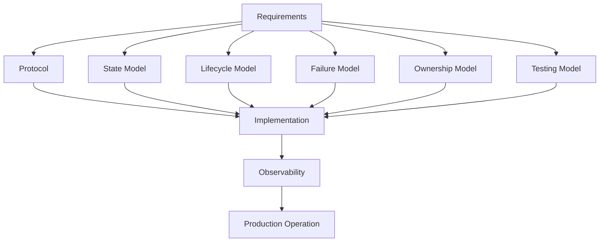
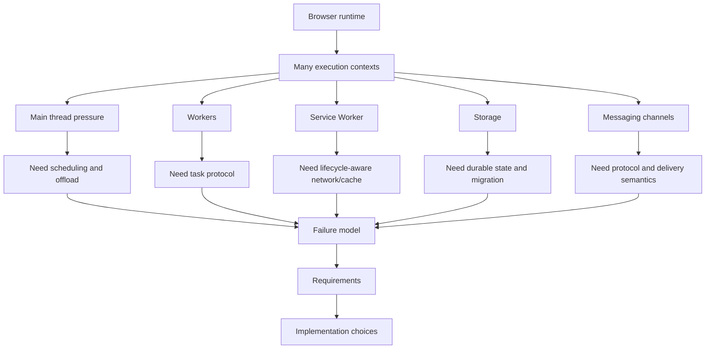

# Part 008 — Requirements for Serious Multi-Tab Orchestration

> Target part ini: kamu mampu menulis requirements engineering untuk sistem multi-tab dan worker sebelum memilih API. Setelah part ini, kamu harus bisa melihat bedanya "pakai BroadcastChannel" dengan "mendesain runtime coordination yang benar".

Banyak implementasi browser orchestration gagal bukan karena engineer tidak tahu API.

Mereka gagal karena requirement-nya tidak pernah dibuat eksplisit.

Biasanya requirement hanya seperti ini:

```txt
- sync state antar tab
- jalankan pekerjaan berat di worker
- refresh token jangan dobel
- logout semua tab
- cache data offline
```

Itu belum requirement. Itu daftar keinginan.

Requirement yang layak untuk production harus menjawab:

- siapa participant-nya,
- apa source of truth-nya,
- apa delivery guarantee-nya,
- apa failure model-nya,
- apa consistency target-nya,
- bagaimana ownership dipilih,
- bagaimana stale actor ditolak,
- bagaimana recovery berjalan,
- bagaimana observability dibuat,
- bagaimana migration berjalan saat banyak tab masih terbuka.

Part ini mengubah Phase 1 menjadi checklist arsitektur.

---

## 1. Core Thesis

Serious multi-tab orchestration bukan fitur kecil. Ia adalah mini runtime.

Runtime itu butuh kontrak.



Kalau requirement kabur, implementasi akan menjadi kumpulan event listener:

```txt
onmessage -> if type A -> update X
visibilitychange -> maybe refresh Y
storage -> maybe sync Z
worker.onmessage -> setState
```

Kode seperti itu bisa berjalan di demo, tapi sulit dibuktikan benar.

---

## 2. Requirement Layers

Kita akan bagi requirement ke beberapa layer.

| Layer | Pertanyaan utama |
|---|---|
| Product semantics | Apa yang harus benar dari sudut pandang user/business? |
| Consistency | Seberapa cepat dan seberapa kuat state harus converge? |
| Ownership | Siapa boleh melakukan side effect global? |
| Messaging | Apa arti message? command/event/query/invalidation? |
| Storage | Apa source of truth durable? |
| Lifecycle | Apa yang terjadi saat tab hidden/frozen/discarded/restored? |
| Failure | Apa yang terjadi saat actor mati/message lost/duplicate/reordered? |
| Security | Data apa yang tidak boleh dibroadcast/dipersist? |
| Performance | Berapa budget main thread, memory, payload, CPU? |
| Observability | Bagaimana tahu sistem sehat atau rusak? |
| Testing | Bagaimana failure dibuktikan lewat automated tests? |
| Compatibility | Bagaimana old/new tab dan service worker version skew ditangani? |

Kita bahas satu per satu.

---

## 3. Product Semantics Requirement

Mulai dari hal yang harus benar untuk user.

Contoh requirement lemah:

```txt
Logout harus sync antar tab.
```

Requirement lebih kuat:

```txt
Saat user logout dari salah satu tab, semua tab same-origin yang menggunakan session yang sama harus berhenti mengirim authenticated request secepat mungkin. Tab yang sedang hidden atau frozen harus mendeteksi session revoked sebelum melakukan action authenticated berikutnya setelah resume. Jika broadcast logout hilang, tab tetap harus menemukan status revoked dari durable session store atau server validation.
```

Bedanya besar.

Yang pertama mengarah ke:

```ts
broadcast('logout')
```

Yang kedua mengarah ke:

- durable session state,
- broadcast sebagai invalidation,
- request interceptor yang revalidate session,
- resume hook,
- server-side revocation check,
- token cleanup,
- stale message rejection.

### 3.1 Requirement Template

Gunakan format ini:

```txt
When <trigger>, all <affected participants> must <observable behavior>
within <time/ordering expectation>, unless <explicit degraded condition>.
If <failure mode>, the system must <recovery behavior> without <forbidden outcome>.
```

Contoh:

```txt
When any tab detects that the access token is near expiry, exactly one active participant should attempt refresh for the session epoch. Other tabs must wait for the session store to update or revalidate before sending authenticated requests. If the refreshing participant dies, another participant may retry after the refresh lease expires. Duplicate refresh attempts must not corrupt the session state.
```

Ini requirement. Bukan implementasi.

---

## 4. Consistency Requirement

Tidak semua state perlu konsistensi yang sama.

### 4.1 Consistency Spectrum

| State | Required consistency | Example handling |
|---|---|---|
| Theme preference | Eventual | Broadcast + localStorage/IDB |
| Notification dismiss | Eventual | Idempotent event |
| Cart count | Read-your-write per tab + eventual cross-tab | Versioned store + invalidation |
| Auth logout | Stronger safety requirement | Durable revoked state + request guard |
| Token refresh | Single-owner critical section | Web Lock/lease + fenced session write |
| Offline mutation queue | Durable, ordered per entity/user | IndexedDB WAL + replay protocol |
| File processing task | At-least-once execution, idempotent commit | Task journal + worker retry |
| Leader background sync | Single active owner, recoverable | Lock + heartbeat + epoch |

### 4.2 Jangan Semua Dibuat Strong

Kesalahan umum: semua cross-tab state diperlakukan seperti distributed database strong consistency.

Itu mahal dan sering tidak perlu.

Rule:

> Perketat consistency hanya untuk state yang punya side effect irreversible, security consequence, atau data loss risk.

### 4.3 Consistency Declaration

Untuk setiap domain, tulis deklarasi:

```ts
type ConsistencyLevel =
  | 'local-only'
  | 'eventual-cross-tab'
  | 'read-your-write'
  | 'single-owner'
  | 'durable-ordered'
  | 'security-critical';

interface DomainConsistencyRequirement {
  domain: string;
  level: ConsistencyLevel;
  sourceOfTruth: 'memory' | 'indexeddb' | 'cache-api' | 'server' | 'hybrid';
  staleReadAllowedForMs: number;
  duplicateAllowed: boolean;
  lostMessageTolerated: boolean;
}
```

Contoh:

```ts
const authSessionRequirement: DomainConsistencyRequirement = {
  domain: 'auth-session',
  level: 'security-critical',
  sourceOfTruth: 'hybrid',
  staleReadAllowedForMs: 0,
  duplicateAllowed: false,
  lostMessageTolerated: true,
};
```

`lostMessageTolerated: true` bukan berarti logout boleh hilang. Artinya correctness tidak bergantung hanya pada message.

---

## 5. Ownership Requirement

Multi-tab orchestration sering butuh satu actor menjalankan kerja global.

Contoh:

- refresh token,
- websocket connection shared secara konseptual,
- background sync,
- notification polling,
- migration,
- upload queue replay,
- cache warmup,
- analytics batch flush.

Requirement lemah:

```txt
Hanya satu tab yang jalanin sync.
```

Requirement kuat:

```txt
At most one participant may own background sync for a given user/session/resource epoch. Ownership must be represented as a lease with an epoch. Side effects must include the owner epoch and be rejected if the owner is stale. If the owner stops heartbeating or the lock is released, another participant may acquire ownership after the lease expires.
```

### 5.1 Ownership Model

```ts
interface OwnershipRequirement {
  resource: string;
  ownerScope: 'origin' | 'user-session' | 'tenant' | 'entity' | 'queue';
  acquisition: 'web-lock' | 'idb-lease' | 'sharedworker-arbiter' | 'server-lease';
  leaseMs: number;
  fencingRequired: boolean;
  staleOwnerAction: 'reject' | 'ignore' | 'revalidate' | 'force-release';
}
```

Contoh:

```ts
const tokenRefreshOwnership: OwnershipRequirement = {
  resource: 'auth-token-refresh',
  ownerScope: 'user-session',
  acquisition: 'web-lock',
  leaseMs: 15_000,
  fencingRequired: true,
  staleOwnerAction: 'reject',
};
```

### 5.2 At-Most-One vs Effectively-One

Bedakan:

| Target | Meaning | Example |
|---|---|---|
| At-most-one execution | Tidak boleh ada dua actor mulai | Sulit di browser tanpa lock/arbiter kuat |
| At-most-one commit | Dua actor boleh mulai, hanya satu result diterima | Lebih praktis |
| Effectively-one visible effect | Duplicate internal work boleh, user/server melihat satu efek | Biasanya target terbaik |

Untuk banyak browser workflow, target realistis adalah:

```txt
Duplicate work may happen. Duplicate committed effect must not happen.
```

Ini lebih jujur dan lebih robust.

---

## 6. Messaging Requirement

Sebelum memilih `BroadcastChannel`, `postMessage`, `MessageChannel`, Service Worker messaging, atau storage event, tentukan arti message.

### 6.1 Message Kinds

| Kind | Question | Needs ACK? | Durable? | Example |
|---|---|---:|---:|---|
| Command | "Please do this" | Ya | Mungkin | worker run task |
| Event | "This happened" | Tidak/mungkin | Jika penting | session revoked |
| Query | "Give me current value" | Ya | Tidak | get active tab count |
| Response | "Here is result" | Correlated | Tidak/mungkin | worker result |
| Invalidation | "Your cache may be stale" | Tidak | Source of truth elsewhere | cart changed |
| Lease signal | "I own/renew/release" | Mungkin | Ya | leader heartbeat |

### 6.2 Message Envelope Requirement

Jangan broadcast payload mentah.

```ts
interface MessageEnvelope<TPayload> {
  messageId: string;
  protocolVersion: number;
  minConsumerVersion: number;
  type: string;
  kind: 'command' | 'event' | 'query' | 'response' | 'invalidation' | 'lease-signal';
  source: {
    tabId?: string;
    workerId?: string;
    serviceWorkerVersion?: string;
    appBuildId: string;
  };
  correlationId?: string;
  causationId?: string;
  idempotencyKey?: string;
  resource?: string;
  epoch?: number;
  sentAt: number;
  expiresAt?: number;
  payload: TPayload;
}
```

Tidak semua field wajib untuk semua message. Tapi requirement-nya harus jelas.

### 6.3 Delivery Semantics Requirement

| Delivery semantics | Meaning | Browser implementation pattern |
|---|---|---|
| Best effort | Message boleh hilang | BroadcastChannel event |
| At least once | Retry sampai ACK/commit | command + idempotency |
| At most once | Tidak retry | fire-and-forget UI hint |
| Effectively once | Retry boleh, commit idempotent | task journal + idempotency key |
| Durable event | Bisa diproses setelah receiver restart | IndexedDB event log/WAL |

Requirement harus menyebut delivery target.

Contoh:

```txt
Worker task command uses at-least-once delivery from task journal to worker execution, but result commit is effectively-once by taskId.
```

---

## 7. Storage Requirement

Storage bukan detail teknis. Storage menentukan correctness.

### 7.1 Storage Role Matrix

| Storage | Good for | Bad for |
|---|---|---|
| Memory | Fast local derived state | Cross-tab truth, recovery |
| BroadcastChannel | Wake-up/invalidation | Durable state |
| localStorage | Simple small same-origin flags | High-frequency writes, large state, secure data |
| sessionStorage | Per-tab state | Cross-tab coordination |
| IndexedDB | Durable structured app state | Low-latency pub/sub |
| Cache API | HTTP-like artifacts/responses | Arbitrary transactional app state |
| OPFS | File-like large data, worker-heavy processing | Simple reactive state |
| Server | Authoritative business/security state | Offline-only UX |

### 7.2 Source of Truth Declaration

```ts
interface StateRequirement {
  name: string;
  sourceOfTruth: 'memory' | 'indexeddb' | 'cache-api' | 'opfs' | 'server' | 'hybrid';
  durability: 'transient' | 'session' | 'persistent' | 'authoritative';
  versioned: boolean;
  transactional: boolean;
  sensitive: boolean;
  evictionImpact: 'none' | 'degraded' | 'data-loss-risk' | 'security-risk';
}
```

Contoh:

```ts
const offlineQueueState: StateRequirement = {
  name: 'offline-mutation-queue',
  sourceOfTruth: 'indexeddb',
  durability: 'persistent',
  versioned: true,
  transactional: true,
  sensitive: true,
  evictionImpact: 'data-loss-risk',
};
```

### 7.3 Write Contract

Setiap write penting harus punya hasil eksplisit.

```ts
type WriteResult<TVersion> =
  | { ok: true; version: TVersion }
  | { ok: false; reason: 'conflict'; currentVersion: TVersion }
  | { ok: false; reason: 'quota-exceeded' }
  | { ok: false; reason: 'blocked' }
  | { ok: false; reason: 'unavailable' }
  | { ok: false; reason: 'unknown'; error: unknown };
```

Anti-pattern:

```ts
await saveState(next);
notifyTabs();
```

Lebih aman:

```ts
const result = await saveState(next);

if (!result.ok) {
  await enterDegradedMode(result.reason);
  return;
}

await notifyTabs({
  type: 'state.invalidated',
  version: result.version,
});
```

---

## 8. Lifecycle Requirement

Lifecycle requirement menjawab: context boleh melakukan apa di state tertentu?

### 8.1 Lifecycle Capability Matrix

| Lifecycle state | May own global work? | May send heartbeat? | Must revalidate before side effect? | Notes |
|---|---:|---:|---:|---|
| visible/active | Ya | Ya | Untuk critical path | Best participant |
| visible/passive | Ya | Ya | Ya | Tidak fokus tapi masih visible |
| hidden | Mungkin, tapi hati-hati | Mungkin telat | Ya | Timer throttling/freeze risk |
| frozen-suspected | Tidak ideal | Tidak reliable | Ya | Treat as suspect |
| restored | Belum | Setelah revalidate | Wajib | Mini restart |
| discarded/reloaded | Tidak ada state lama | Register ulang | Wajib | New context |

### 8.2 Lifecycle Policy

```ts
interface LifecyclePolicy {
  canAcquireLeadership(input: {
    visibilityState: DocumentVisibilityState;
    lastExecutionGapMs: number;
    batterySaverKnown?: boolean;
  }): boolean;

  mustRevalidateBeforeNetwork(input: {
    hiddenForMs: number;
    sessionCritical: boolean;
  }): boolean;

  heartbeatIntervalMs(input: {
    visibilityState: DocumentVisibilityState;
  }): number;
}
```

Contoh sederhana:

```ts
const lifecyclePolicy: LifecyclePolicy = {
  canAcquireLeadership(input) {
    return input.visibilityState === 'visible' && input.lastExecutionGapMs < 30_000;
  },

  mustRevalidateBeforeNetwork(input) {
    return input.sessionCritical || input.hiddenForMs > 10_000;
  },

  heartbeatIntervalMs(input) {
    return input.visibilityState === 'visible' ? 5_000 : 15_000;
  },
};
```

### 8.3 Resume Requirement

Tuliskan eksplisit:

```txt
Any tab that becomes visible after being hidden for more than 10 seconds must reload session state, app version state, queue ownership state, and pending mutation summary before sending authenticated writes.
```

Ini mencegah hidden tab membawa state lama lalu menulis hal berbahaya.

---

## 9. Failure Requirement

Failure requirement harus berbasis matrix dari Part 007.

### 9.1 Failure Contract Template

```txt
If <actor> fails during <operation>, then <other actor/runtime> must detect it by <signal> within <bound/condition>, and recover by <action>. Duplicate recovery must be safe because <idempotency/fencing/version rule>.
```

Contoh:

```txt
If the tab owning offline replay closes while a mutation batch is in progress, another visible tab may acquire the replay lock after the replay lease expires. Mutations already committed to the server must not be replayed with a different idempotency key. The queue reconciler must mark server-confirmed mutations as completed before sending the next batch.
```

### 9.2 Timeout Requirement

Jangan tulis:

```txt
If timeout, retry.
```

Tulis:

```txt
If timeout occurs, the operation state becomes unknown. The runtime must first check whether a committed result exists using taskId/idempotencyKey. If no committed result exists and retry budget remains, it may retry with the same idempotency key.
```

Itu perbedaan matang vs naif.

---

## 10. Security Requirement

Multi-tab messaging memperluas blast radius bug.

### 10.1 Sensitive Data Policy

| Data | Broadcast? | Persist local? | Notes |
|---|---:|---:|---|
| Access token | Tidak | Sebisa mungkin tidak / sangat hati-hati | Jangan kirim lewat BroadcastChannel |
| Refresh token | Tidak | Hindari di JS-readable storage | Ikuti auth architecture |
| Session revoked flag | Ya, sebagai invalidation | Ya | Tidak sensitif seperti token |
| User profile summary | Mungkin | Mungkin | Perhatikan PII |
| Tenant ID | Mungkin | Mungkin | Bisa sensitif tergantung domain |
| Permission snapshot | Hati-hati | Ya dengan version/expiry | Jangan stale terlalu lama |
| Offline mutation payload | Tidak broadcast | Ya jika perlu | Encrypt? redact logs? |
| Worker task input | Hanya ke worker yang perlu | Mungkin | Hindari payload besar/sensitif di logs |

### 10.2 Same-Origin Is Not Same-Trust

Same-origin script lain bisa jadi:

- third-party bundle yang compromised,
- browser extension injection context tertentu,
- old app build,
- microfrontend lain,
- XSS payload jika aplikasi punya vulnerability.

Karena itu message boundary tetap perlu:

- strict schema validation,
- allowlist message type,
- no token broadcast,
- no blind command execution,
- no eval/function transfer assumption,
- redacted telemetry.

### 10.3 Command Authorization

Kalau satu tab bisa mengirim command ke worker/hub:

```ts
channel.postMessage({ type: 'admin.delete-cache' });
```

Receiver harus memeriksa:

- apakah command dikenal,
- apakah source context valid,
- apakah session masih active,
- apakah capability diizinkan,
- apakah command expired,
- apakah idempotency key valid.

Jangan membuat worker sebagai privileged backend tanpa auth boundary.

---

## 11. Performance Requirement

Worker bukan magic. Worker mengurangi pressure main thread, tapi menambah biaya:

- serialization/structured clone,
- transfer ownership,
- memory duplication,
- startup cost,
- queueing,
- cancellation complexity,
- debugging complexity.

### 11.1 Budget Declaration

```ts
interface PerformanceRequirement {
  domain: string;
  maxMainThreadBlockingMs: number;
  maxMessagePayloadBytes: number;
  maxWorkerStartupMs: number;
  maxInFlightTasks: number;
  maxMemoryBytes: number;
  cancellationRequired: boolean;
  backpressureStrategy: 'drop' | 'merge' | 'queue-bounded' | 'reject' | 'latest-wins';
}
```

Contoh:

```ts
const searchIndexWorkerRequirement: PerformanceRequirement = {
  domain: 'client-side-search-index',
  maxMainThreadBlockingMs: 16,
  maxMessagePayloadBytes: 2_000_000,
  maxWorkerStartupMs: 200,
  maxInFlightTasks: 2,
  maxMemoryBytes: 128 * 1024 * 1024,
  cancellationRequired: true,
  backpressureStrategy: 'latest-wins',
};
```

### 11.2 Main Thread Rule

Requirement praktis:

```txt
No orchestration handler may perform unbounded synchronous work on the main thread. Message handlers must validate, enqueue, mark dirty, or schedule work; heavy computation goes to worker or incremental task scheduling.
```

### 11.3 Payload Rule

```txt
Large binary payloads must use Transferable objects or OPFS/IndexedDB references instead of repeated structured clone across contexts.
```

Ini akan kita bahas dalam Part 010 dan Phase 7.

---

## 12. Observability Requirement

Kalau orchestration rusak, gejalanya sering halus:

- dua tab refresh token bersamaan,
- background sync berhenti,
- worker queue stuck,
- hidden tab menulis data lama,
- BroadcastChannel message tidak diproses,
- old tab menghalangi migration,
- task duplicate tapi hanya kadang.

Tanpa observability, kamu hanya punya bug report random.

### 12.1 Runtime Events

Minimal event yang perlu dilog secara redacted:

```ts
type OrchestrationTelemetryEvent =
  | { type: 'tab.registered'; tabId: string; visible: boolean; at: number }
  | { type: 'tab.expired'; tabId: string; lastSeenAgeMs: number; at: number }
  | { type: 'leader.acquired'; resource: string; ownerTabId: string; epoch: number; at: number }
  | { type: 'leader.rejected-stale'; resource: string; ownerTabId: string; epoch: number; currentEpoch: number; at: number }
  | { type: 'message.invalid'; channel: string; reason: string; at: number }
  | { type: 'message.timeout'; messageType: string; correlationId: string; at: number }
  | { type: 'worker.task.started'; taskId: string; kind: string; attempt: number; at: number }
  | { type: 'worker.task.completed'; taskId: string; durationMs: number; at: number }
  | { type: 'worker.task.failed'; taskId: string; reason: string; at: number }
  | { type: 'storage.write.failed'; store: string; reason: string; at: number }
  | { type: 'runtime.revalidated'; reason: string; durationMs: number; at: number };
```

### 12.2 Metrics

| Metric | Why it matters |
|---|---|
| active tab count | Presence health |
| stale presence count | Expiry/cleanup health |
| leadership acquisition count | Churn detection |
| leadership conflict count | Split brain smell |
| message invalid count | Protocol/schema issue |
| message timeout count | Broken channel/worker |
| worker queue depth | Backpressure |
| worker task duration | Performance |
| retry count | Instability |
| storage write failure count | Data loss/degraded mode |
| revalidation duration | Resume latency |
| old build active count | Version skew risk |

### 12.3 Debug Snapshot

Bangun satu function debug:

```ts
interface RuntimeDebugSnapshot {
  tab: {
    tabId: string;
    visible: boolean;
    hiddenForMs: number;
    appBuildId: string;
    protocolVersion: number;
  };
  presence: {
    activeCount: number;
    staleCount: number;
    oldestLastSeenAgeMs: number;
  };
  leadership: Array<{
    resource: string;
    ownerTabId: string;
    epoch: number;
    expiresInMs: number;
  }>;
  workerQueues: Array<{
    name: string;
    queued: number;
    running: number;
    failed: number;
  }>;
  storage: {
    schemaVersion: number;
    lastWriteFailure?: string;
  };
}
```

Ini sangat membantu untuk support/debugging.

---

## 13. Testing Requirement

Testing multi-tab tidak boleh hanya unit test pure function.

### 13.1 Test Levels

| Level | What to test |
|---|---|
| Unit | protocol parser, reducer, idempotency, version compare |
| Integration | bus adapter, worker RPC, storage transaction |
| Multi-context E2E | two or more tabs, BroadcastChannel, locks, visibility simulation |
| Failure test | close tab, kill worker, timeout, duplicate message, stale state |
| Migration test | old tab + new tab + IndexedDB upgrade |
| Performance test | main thread blocking, payload size, queue depth |
| Security test | invalid message, forbidden command, sensitive log redaction |

### 13.2 Failure Test Scenarios

Minimal suite:

```txt
1. Two tabs open; one logs out; hidden tab resumes; hidden tab must not send authenticated request.
2. Two tabs attempt token refresh; only one session write is accepted.
3. Leader tab closes during sync; follower resumes sync after lease expiry.
4. Worker crashes during task; task is retried or marked failed according to policy.
5. Duplicate worker result arrives; result committed once.
6. Old protocol message arrives; receiver rejects and logs message.invalid.
7. IndexedDB upgrade blocked by old tab; reload-required flow triggers.
8. BroadcastChannel message is lost; state still reconciles from durable store.
9. Storage quota failure; UI enters degraded mode instead of pretending saved.
10. Tab resumes after long execution gap; runtime revalidates before side effect.
```

### 13.3 Testability Requirement

Kode orchestration harus dependency-injected:

```ts
interface RuntimeDependencies {
  bus: RuntimeBus;
  store: RuntimeStore;
  lockManager: RuntimeLockManager;
  workerClient: WorkerClient;
  clock: Clock;
  lifecycle: LifecycleSource;
  telemetry: TelemetrySink;
}
```

Jangan hard-code semua ke global browser object jika ingin mudah diuji.

---

## 14. Compatibility and Migration Requirement

Deployment frontend menciptakan distributed upgrade problem.

### 14.1 Compatibility Contract

```ts
interface CompatibilityRequirement {
  appBuildId: string;
  protocolVersion: number;
  minProtocolVersion: number;
  schemaVersion: number;
  serviceWorkerVersion?: string;
  migrationPolicy: 'online-only' | 'lazy-compatible' | 'upgrade-barrier' | 'force-reload-old-tabs';
}
```

### 14.2 Migration Policies

| Policy | Meaning | Use when |
|---|---|---|
| Online-only | No local durable schema | Simple apps |
| Lazy-compatible | New app can read old schema | Most safe gradual upgrades |
| Upgrade-barrier | Must coordinate old tabs before IDB upgrade | Breaking schema changes |
| Force-reload-old-tabs | Old tabs cannot safely continue | Security/protocol breaking change |

### 14.3 Version Skew Requirement Example

```txt
If a tab with protocolVersion 3 receives a message from protocolVersion 1 and min supported version is 2, it must reject the message, emit message.invalid with reason incompatible-protocol, and publish app.reload-required without executing side effects.
```

---

## 15. API Selection Comes After Requirements

Sekarang baru pilih API.

### 15.1 Decision Matrix

| Requirement | Likely primitive |
|---|---|
| Same-origin broadcast invalidation | BroadcastChannel |
| Legacy fallback cross-tab signal | storage event |
| Explicit request-response pipe | MessageChannel/MessagePort |
| One tab to worker CPU offload | Dedicated Worker |
| Same-origin client hub | SharedWorker |
| Network/cache/offline mediation | Service Worker |
| Cross-tab mutual exclusion | Web Locks |
| Durable state/event log | IndexedDB |
| Large worker-local files | OPFS |
| HTTP artifact cache | Cache API |
| Shared memory low-latency compute | SharedArrayBuffer + Atomics |

### 15.2 Anti-Decision

Jangan mulai dengan:

```txt
Kita pakai BroadcastChannel buat sync semua state.
```

Mulai dengan:

```txt
State mana yang durable?
Message mana yang hint?
Message mana yang command?
Apa yang terjadi kalau message lost?
Apa consistency level-nya?
Apa failure mode paling bahaya?
```

Setelah itu baru pilih channel.

---

## 16. Reference Requirement Document

Berikut contoh mini requirement doc untuk domain `auth-session`.

```md
# Auth Session Multi-Tab Requirement

## Product Semantics
When the user logs out from any tab, all same-origin tabs for the same user session must stop sending authenticated requests. Hidden/restored tabs must detect revoked session before the next authenticated write.

## Consistency
- Security-critical.
- Session revoked state is durable.
- Broadcast is invalidation only.
- Lost broadcast must not break correctness.

## Ownership
- Token refresh is single-owner per session epoch.
- Acquisition uses Web Lock where available.
- Session writes require epoch fencing.
- Duplicate refresh attempts must not corrupt session.

## Messaging
- `session.changed` is invalidation.
- `session.refresh.requested` is command-like but must be lock-backed.
- All messages include protocolVersion, messageId, sentAt, sessionEpoch.

## Storage
- Durable session metadata stored in IndexedDB or equivalent session store.
- Tokens are not broadcast.
- Sensitive logs are redacted.

## Lifecycle
- On visible resume, tab revalidates session before authenticated write.
- Hidden tab may not acquire refresh leadership unless no visible candidate exists and policy allows.

## Failure
- If refresher dies, refresh lease expires and another tab may retry.
- Timeout means unknown; reconciler checks session store/server before retry.
- Stale epoch write is rejected.

## Observability
- Log refresh lock acquired/released/timeout.
- Log stale write rejected.
- Count concurrent refresh attempts.

## Tests
- Two tabs refresh simultaneously.
- Logout while refresh in flight.
- Hidden tab resumes after logout.
- Broadcast lost; durable session still wins.
```

Ini format yang akan sering kita pakai di part berikutnya.

---

## 17. Build a Requirements Checklist

Gunakan checklist ini sebelum implementasi.

### 17.1 Correctness

- Apa invariant bisnis/security yang tidak boleh dilanggar?
- Apa source of truth untuk state penting?
- Apakah message boleh lost?
- Apakah duplicate aman?
- Apakah stale update ditolak?
- Apakah ownership fenced?

### 17.2 Lifecycle

- Apakah hidden tab boleh menjadi owner?
- Apa yang terjadi saat resume?
- Apa yang terjadi saat discard/reload?
- Apa yang terjadi saat service worker update?
- Apa cleanup hanya optimization?

### 17.3 Storage

- Apakah write transactional?
- Apa yang terjadi jika quota exceeded?
- Apa migration policy?
- Apakah old tab bisa block upgrade?
- Apakah data sensitif dipersist?

### 17.4 Messaging

- Apakah message punya envelope?
- Apakah ada protocol version?
- Apakah payload divalidasi?
- Apakah ada ACK untuk command?
- Apakah ada timeout policy?
- Apakah response correlated?

### 17.5 Worker

- Apa task boundary?
- Apa cancellation policy?
- Apa backpressure policy?
- Apa retry policy?
- Apa journal requirement?
- Apa max payload?

### 17.6 Observability

- Apa event yang dilog?
- Apa metric health?
- Apa debug snapshot?
- Apa redaction policy?
- Apa alert untuk split brain/stuck queue?

### 17.7 Testing

- Ada test duplicate?
- Ada test lost message?
- Ada test closed tab?
- Ada test worker crash?
- Ada test version skew?
- Ada test storage failure?
- Ada test hidden resume?

---

## 18. Requirement Smells

Kalau kamu melihat kalimat ini, requirement masih lemah.

| Smell | Better framing |
|---|---|
| "Sync state antar tab" | State apa, consistency apa, source of truth apa? |
| "Gunakan worker biar cepat" | Workload apa, payload berapa, cancellation bagaimana? |
| "Hanya satu tab yang jalan" | At-most-one execution atau at-most-one commit? |
| "Kalau timeout retry" | Timeout means unknown; reconcile dulu |
| "Broadcast logout" | Broadcast invalidation + durable revoked state |
| "Simpan di IndexedDB" | Schema, transaction, quota, migration, version skew? |
| "Pakai service worker untuk background" | Event-driven lifecycle, bukan daemon |
| "Tab tutup release lock" | Cleanup bukan correctness; pakai lease/expiry |

---

## 19. Phase 1 Final Mental Map

Kita sudah menutup Phase 1.



Phase 2 akan masuk ke primitive messaging:

- `postMessage`,
- structured clone,
- transferables,
- `MessageChannel`,
- `BroadcastChannel`,
- storage event,
- service worker client messaging,
- message protocol design,
- ACK/retry/timeout/idempotency.

Sekarang kamu sudah punya frame untuk menilai API tersebut: bukan "bisa kirim message atau tidak", tapi "apa guarantee-nya dan bagaimana ia gagal".

---

## 20. Final Invariants for Serious Orchestration

Tutup Phase 1 dengan invariant ini:

```txt
1. Every cross-context state change has a source of truth.
2. Every critical message has a declared delivery semantic.
3. Every owner is leased and, if needed, fenced.
4. Every participant can disappear without cleanup.
5. Every resumed tab revalidates before critical side effects.
6. Every duplicate command is safe or rejected.
7. Every stale update is version-checked.
8. Every storage failure has a degraded behavior.
9. Every protocol has a version and compatibility rule.
10. Every production runtime has telemetry and a debug snapshot.
```

Kalau invariant ini terasa berat, itu karena aplikasinya memang sudah masuk wilayah systems engineering.

Di level top engineer, kamu tidak hanya tahu API. Kamu tahu failure surface-nya, kontrak correctness-nya, dan cara membuktikan desainnya.

---

## References

- MDN Web Docs — Web Workers API: https://developer.mozilla.org/en-US/docs/Web/API/Web_Workers_API
- MDN Web Docs — Worker interface and `terminate()`: https://developer.mozilla.org/en-US/docs/Web/API/Worker
- MDN Web Docs — BroadcastChannel `message` event: https://developer.mozilla.org/en-US/docs/Web/API/BroadcastChannel/message_event
- MDN Web Docs — BroadcastChannel `messageerror` event: https://developer.mozilla.org/en-US/docs/Web/API/BroadcastChannel/messageerror_event
- MDN Web Docs — BroadcastChannel `close()`: https://developer.mozilla.org/en-US/docs/Web/API/BroadcastChannel/close
- MDN Web Docs — Web Locks API: https://developer.mozilla.org/en-US/docs/Web/API/Web_Locks_API
- Chrome Developers — Page Lifecycle API: https://developer.chrome.com/docs/web-platform/page-lifecycle-api
