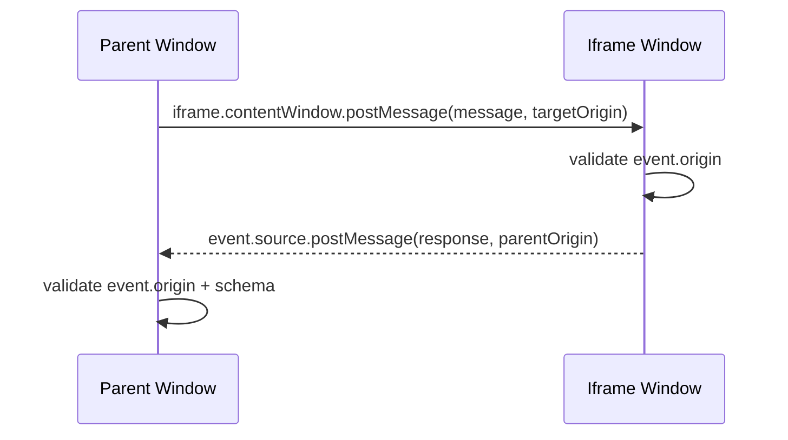
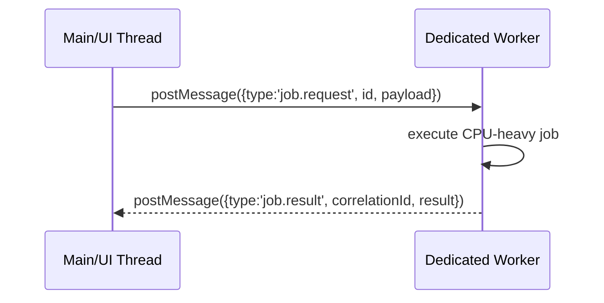
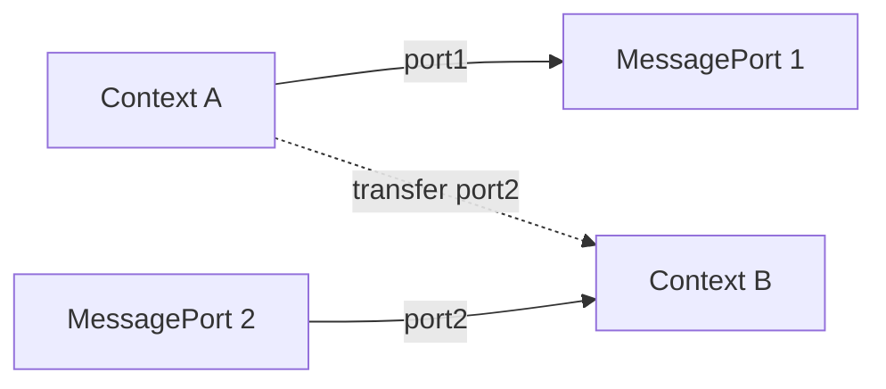
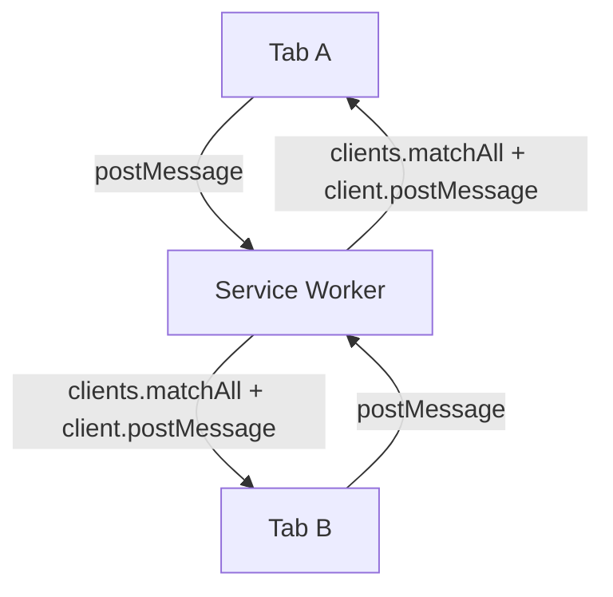
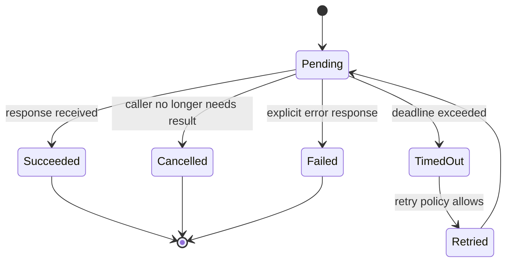

# Part 009 — `postMessage` Deep Dive

> Target part ini: memahami `postMessage` sebagai primitive message passing, bukan sekadar cara mengirim object ke worker. Kita akan melihat bentuk-bentuk `postMessage`, batas keamanan, delivery semantics, protocol envelope, dan desain dispatcher yang siap dipakai untuk multi-context orchestration.

Di aplikasi kecil, `postMessage` sering terlihat seperti ini:

```ts
worker.postMessage({ type: 'DO_WORK', payload });
```

Lalu kita tambahkan handler:

```ts
worker.onmessage = event => {
  console.log(event.data);
};
```

Itu cukup untuk demo. Tetapi di sistem multi-tab/worker yang serius, pertanyaan sebenarnya adalah:

1. siapa pengirim pesan?
2. siapa penerima yang sah?
3. apakah pesan masih berlaku saat diterima?
4. bagaimana menghindari pesan dari versi lama?
5. bagaimana tahu pesan sudah diproses?
6. bagaimana menangani duplicate, stale result, dan receiver mati?
7. apakah payload murah untuk dikirim?
8. apakah pesan mengandung data sensitif?
9. apakah ordering penting?
10. apakah pesan ini command, event, query, atau response?

`postMessage` hanya memberi primitive transport. Production system butuh protocol.

---

## 1. Mental Model: `postMessage` Bukan Function Call

Kesalahan paling mahal adalah memperlakukan `postMessage` seperti function call antar-thread.

Function call memiliki model seperti ini:

```txt
caller stack -> callee stack -> return value / throw
```

`postMessage` memiliki model seperti ini:

```txt
sender context
  -> serialize / clone / transfer data
  -> enqueue task to receiver event loop
  -> sender continues immediately

receiver context
  -> later, when event loop picks the task
  -> dispatch MessageEvent
  -> handler runs
```

Perbedaannya fundamental.

| Aspek | Function call | `postMessage` |
|---|---|---|
| Eksekusi | synchronous | asynchronous |
| Call stack | shared sementara | tidak shared |
| Return value | langsung | harus pakai response message |
| Error propagation | throw ke caller | harus dikirim sebagai error response/event |
| Memory | object reference | structured clone / transfer |
| Ordering | natural dalam call stack | hanya bisa diasumsikan dalam batas channel tertentu |
| Receiver availability | ada saat call | bisa belum siap, sudah mati, frozen, atau versi beda |
| Debugging | stack trace langsung | causal chain perlu correlation id |

Jadi invariant pertama:

```txt
postMessage gives you delivery attempt, not distributed correctness.
```

---

## 2. Keluarga `postMessage`

`postMessage` bukan satu bentuk API saja. Ada beberapa surface yang terlihat mirip tetapi punya boundary berbeda.

| Surface | Contoh | Umum dipakai untuk |
|---|---|---|
| `Window.postMessage` | parent window ⇄ iframe/popup | cross-document messaging |
| `Worker.postMessage` | main thread -> dedicated worker | command ke worker |
| `DedicatedWorkerGlobalScope.postMessage` | worker -> owner | response/event dari worker |
| `MessagePort.postMessage` | port A -> port B | explicit pipe via `MessageChannel` |
| `ServiceWorker.postMessage` | page -> active service worker | client-to-service-worker signaling |
| `Client.postMessage` | service worker -> page/client | service-worker broadcast/targeted message |
| `BroadcastChannel.postMessage` | same-origin contexts | pub/sub antar tab/worker |

Yang sama:

- data melewati structured clone algorithm,
- message dikirim asynchronous,
- receiver mendapat `MessageEvent`,
- payload bukan reference biasa.

Yang berbeda:

- boundary keamanan,
- lifetime receiver,
- scoping origin/storage partition,
- mekanisme discovery receiver,
- dukungan transferables,
- risiko kebocoran data.

Kita mulai dari `postMessage` karena API lain dalam seri ini pada akhirnya tetap kembali ke prinsip yang sama: message passing dengan biaya, boundary, dan failure.

---

## 3. Topologi Dasar

### 3.1 Window ⇄ iframe



Ini umum untuk:

- embedded payment iframe,
- OAuth/SSO popup callback,
- micro-frontend iframe isolation,
- partner widget,
- secure sandboxed capability delegation.

Kunci desainnya: jangan pernah menerima pesan hanya karena bentuk payload terlihat benar. Validasi `origin`, `source`, schema, version, dan intent.

### 3.2 Main thread ⇄ Dedicated Worker



Ini umum untuk:

- parsing file besar,
- search/filter besar,
- diff/merge,
- compression,
- crypto,
- image processing,
- WASM computation,
- local index building.

Dedicated worker punya owner. Jika owner pergi, desain harus menganggap worker tidak boleh dijadikan durable coordinator.

### 3.3 MessageChannel sebagai explicit pipe



`MessageChannel` berguna saat kita tidak ingin memakai global bus. Kita membuat pipe eksplisit, lalu salah satu port bisa ditransfer ke worker, iframe, atau service worker.

### 3.4 Service Worker ⇄ Clients



Service worker bukan thread background permanen. Dia event-driven. Dia bisa aktif, idle, terminated, lalu dibangunkan lagi oleh event tertentu. Karena itu jangan mendesain service worker seperti daemon server yang selalu hidup.

---

## 4. Delivery Semantics: Apa yang Dijanjikan dan Tidak Dijanjikan

`postMessage` adalah best-effort asynchronous messaging within browser runtime. Ia bukan durable queue.

### 4.1 Yang aman diasumsikan

Secara praktis, untuk desain aplikasi:

1. sender tidak menunggu receiver selesai,
2. receiver memproses pesan pada event loop-nya sendiri,
3. payload dikloning atau ditransfer,
4. object identity tidak dipertahankan sebagai shared reference,
5. jika payload tidak bisa dikloning, pengiriman bisa gagal,
6. receiver perlu handler aktif untuk memproses pesan,
7. message event bisa datang setelah state aplikasi berubah.

### 4.2 Yang tidak boleh diasumsikan

Jangan mengasumsikan:

1. pesan pasti diproses,
2. pesan diproses tepat waktu,
3. receiver masih sama versinya,
4. receiver masih memerlukan hasilnya,
5. pesan global selalu terurut antar semua sender,
6. error otomatis kembali ke sender,
7. `postMessage` aman untuk secret broadcast,
8. clone payload besar itu murah,
9. worker yang menerima pesan akan selalu hidup sampai selesai,
10. tab yang hidden/frozen akan memproses pesan sesuai ekspektasi real-time.

Production invariant:

```txt
Every message is a delayed fact. Treat it as possibly stale on arrival.
```

---

## 5. Message Shape: Jangan Kirim Object Ad-Hoc

Ad-hoc message seperti ini cepat rusak:

```ts
worker.postMessage({ action: 'calculate', data });
```

Masalahnya:

- tidak ada version,
- tidak ada message id,
- tidak ada correlation id,
- tidak ada schema contract,
- tidak ada issued time,
- tidak ada TTL,
- tidak ada source identity,
- tidak ada way to reject stale message,
- tidak ada room untuk tracing.

Untuk orchestration, buat envelope standar.

```ts
type MessageKind = 'command' | 'event' | 'query' | 'response' | 'error';

type ProtocolEnvelope<TType extends string, TPayload> = {
  protocol: 'browser-orchestration/v1';
  id: string;
  type: TType;
  kind: MessageKind;

  source: {
    contextId: string;
    contextType: 'window' | 'dedicated-worker' | 'shared-worker' | 'service-worker' | 'iframe';
    instanceId: string;
    buildId: string;
  };

  target?: {
    contextId?: string;
    contextType?: string;
    role?: 'leader' | 'owner' | 'any';
  };

  causationId?: string;
  correlationId?: string;
  sequence?: number;
  issuedAt: number;
  expiresAt?: number;

  payload: TPayload;
};
```

Field penting:

| Field | Fungsi |
|---|---|
| `protocol` | menolak pesan dari protokol/versi lain |
| `id` | deduplication dan tracing |
| `type` | routing handler |
| `kind` | membedakan command/event/query/response/error |
| `source` | observability dan trust decision |
| `target` | filtering receiver |
| `causationId` | pesan ini terjadi karena pesan apa |
| `correlationId` | response untuk request yang mana |
| `sequence` | ordering lokal per stream |
| `issuedAt` | audit/debug |
| `expiresAt` | stale message rejection |
| `payload` | isi domain |

Envelope bukan ceremony. Envelope adalah cara agar asynchronous message bisa di-debug dan dikendalikan.

---

## 6. Command, Event, Query, Response

Jangan semua message disebut “event”.

| Kind | Makna | Receiver boleh gagal? | Butuh response? | Contoh |
|---|---|---:|---:|---|
| command | minta pihak lain melakukan sesuatu | ya | biasanya ya | `token.refresh.request` |
| event | memberitahu sesuatu sudah terjadi | ya | tidak wajib | `session.revoked` |
| query | minta data | ya | ya | `cache.entry.get` |
| response | balasan request/query | tidak relevan | tidak | `token.refresh.response` |
| error | kegagalan request/query/command | tidak relevan | tidak | `worker.job.failed` |

Rule sederhana:

```txt
Command has an owner.
Event has observers.
Query has a response.
Response has a correlationId.
```

Contoh salah:

```ts
{ type: 'REFRESH_TOKEN' }
```

Lebih jelas:

```ts
{
  protocol: 'browser-orchestration/v1',
  id: crypto.randomUUID(),
  type: 'auth.tokenRefresh.request',
  kind: 'command',
  source: currentSource,
  target: { role: 'leader' },
  issuedAt: Date.now(),
  expiresAt: Date.now() + 10_000,
  payload: {
    reason: 'api-401',
    audience: 'main-api'
  }
}
```

---

## 7. Window `postMessage`: Security First

Window messaging adalah area paling berbahaya karena sering menyentuh cross-origin communication.

### 7.1 Jangan gunakan wildcard sembarangan

Anti-pattern:

```ts
iframe.contentWindow?.postMessage(message, '*');
```

`'*'` berarti browser boleh mengirim pesan ke origin apa pun yang sedang dimiliki window target. Jika iframe/popup melakukan navigation ke origin lain, pesan sensitif bisa terkirim ke pihak yang tidak diinginkan.

Gunakan target origin eksplisit:

```ts
iframe.contentWindow?.postMessage(message, 'https://trusted.example.com');
```

### 7.2 Validasi `event.origin`

Receiver wajib melakukan allowlist.

```ts
const allowedOrigins = new Set([
  'https://trusted.example.com',
  'https://checkout.example-payments.com'
]);

window.addEventListener('message', (event: MessageEvent) => {
  if (!allowedOrigins.has(event.origin)) {
    return;
  }

  const message = parseEnvelope(event.data);
  if (!message.ok) return;

  dispatch(message.value);
});
```

### 7.3 Validasi `event.source`

Origin saja tidak cukup jika ada beberapa iframe/popup dari origin sama.

```ts
const trustedSource = iframe.contentWindow;

window.addEventListener('message', event => {
  if (event.origin !== 'https://trusted.example.com') return;
  if (event.source !== trustedSource) return;

  // safe enough to continue with schema validation
});
```

### 7.4 Jangan kirim credential/secret jika tidak perlu

Pesan antar-window sering masuk ke integrasi pihak ketiga. Treat as untrusted boundary.

Jangan kirim:

- refresh token,
- access token jika tidak sangat diperlukan,
- PII mentah,
- authorization context penuh,
- raw business object sensitif,
- internal feature flags yang mengungkap capability.

Kirim capability terbatas:

```ts
{
  type: 'payment.intent.authorized',
  payload: {
    paymentIntentId: 'pi_...',
    status: 'authorized'
  }
}
```

Bukan:

```ts
{
  type: 'payment.user.context',
  payload: {
    user,
    token,
    permissions,
    fullCart,
    fraudScore
  }
}
```

---

## 8. Worker `postMessage`: Control Plane vs Data Plane

Saat bicara worker, pisahkan control plane dan data plane.

### 8.1 Control plane

Control plane adalah pesan kecil untuk mengatur kerja.

Contoh:

```ts
type WorkerCommand =
  | { type: 'job.start'; jobId: string; inputRef: string }
  | { type: 'job.cancel'; jobId: string }
  | { type: 'job.status.get'; jobId: string };
```

Karakteristik:

- kecil,
- sering,
- harus mudah divalidasi,
- tidak membawa payload besar,
- butuh idempotency.

### 8.2 Data plane

Data plane membawa data besar.

Contoh:

```ts
worker.postMessage(
  {
    type: 'image.process.request',
    jobId,
    buffer,
    options
  },
  [buffer]
);
```

Karakteristik:

- besar,
- mahal jika clone,
- sebaiknya transfer, chunk, atau simpan di shared store,
- harus diberi ownership jelas,
- harus punya cleanup policy.

Production rule:

```txt
Do not mix high-frequency control messages with unbounded data payloads without backpressure.
```

---

## 9. Request/Response di Atas `postMessage`

Karena `postMessage` tidak punya return value, kita membangun RPC kecil di atas message passing.

### 9.1 Minimal typed request map

```ts
type RequestMap = {
  'math.sum': {
    request: { values: number[] };
    response: { total: number };
  };
  'text.tokenize': {
    request: { text: string };
    response: { tokens: string[] };
  };
};
```

### 9.2 Client wrapper

```ts
type PendingRequest = {
  resolve: (value: unknown) => void;
  reject: (reason: unknown) => void;
  timeoutId: ReturnType<typeof setTimeout>;
};

class WorkerRpc<T extends Record<string, { request: unknown; response: unknown }>> {
  private pending = new Map<string, PendingRequest>();

  constructor(private readonly worker: Worker) {
    worker.addEventListener('message', event => this.onMessage(event.data));
    worker.addEventListener('error', event => {
      this.rejectAll(new Error(`Worker error: ${event.message}`));
    });
    worker.addEventListener('messageerror', () => {
      this.rejectAll(new Error('Worker message deserialization failed'));
    });
  }

  request<K extends keyof T & string>(
    type: K,
    payload: T[K]['request'],
    options: { timeoutMs?: number } = {}
  ): Promise<T[K]['response']> {
    const id = crypto.randomUUID();
    const timeoutMs = options.timeoutMs ?? 10_000;

    return new Promise((resolve, reject) => {
      const timeoutId = setTimeout(() => {
        this.pending.delete(id);
        reject(new Error(`Worker request timed out: ${type} ${id}`));
      }, timeoutMs);

      this.pending.set(id, { resolve, reject, timeoutId });

      this.worker.postMessage({
        protocol: 'worker-rpc/v1',
        id,
        type,
        kind: 'query',
        issuedAt: Date.now(),
        expiresAt: Date.now() + timeoutMs,
        payload
      });
    });
  }

  private onMessage(message: unknown): void {
    if (!isRpcResponse(message)) return;

    const pending = this.pending.get(message.correlationId);
    if (!pending) return;

    this.pending.delete(message.correlationId);
    clearTimeout(pending.timeoutId);

    if (message.kind === 'error') {
      pending.reject(new Error(message.payload.message));
    } else {
      pending.resolve(message.payload);
    }
  }

  private rejectAll(reason: unknown): void {
    for (const [id, pending] of this.pending) {
      clearTimeout(pending.timeoutId);
      pending.reject(reason);
      this.pending.delete(id);
    }
  }
}

function isRpcResponse(value: unknown): value is {
  protocol: 'worker-rpc/v1';
  kind: 'response' | 'error';
  correlationId: string;
  payload: any;
} {
  return typeof value === 'object'
    && value !== null
    && (value as any).protocol === 'worker-rpc/v1'
    && typeof (value as any).correlationId === 'string';
}
```

### 9.3 Worker handler

```ts
type Handler = (payload: any, message: any) => Promise<any> | any;

const handlers = new Map<string, Handler>();

handlers.set('math.sum', ({ values }) => {
  return { total: values.reduce((a: number, b: number) => a + b, 0) };
});

self.addEventListener('message', async event => {
  const message = event.data;

  if (!isRpcRequest(message)) return;
  if (message.expiresAt && Date.now() > message.expiresAt) {
    return;
  }

  const handler = handlers.get(message.type);

  if (!handler) {
    self.postMessage({
      protocol: 'worker-rpc/v1',
      id: crypto.randomUUID(),
      kind: 'error',
      type: `${message.type}.error`,
      correlationId: message.id,
      issuedAt: Date.now(),
      payload: { message: `No handler for ${message.type}` }
    });
    return;
  }

  try {
    const result = await handler(message.payload, message);

    self.postMessage({
      protocol: 'worker-rpc/v1',
      id: crypto.randomUUID(),
      kind: 'response',
      type: `${message.type}.response`,
      correlationId: message.id,
      issuedAt: Date.now(),
      payload: result
    });
  } catch (error) {
    self.postMessage({
      protocol: 'worker-rpc/v1',
      id: crypto.randomUUID(),
      kind: 'error',
      type: `${message.type}.error`,
      correlationId: message.id,
      issuedAt: Date.now(),
      payload: normalizeError(error)
    });
  }
});

function isRpcRequest(value: unknown): value is any {
  return typeof value === 'object'
    && value !== null
    && (value as any).protocol === 'worker-rpc/v1'
    && ((value as any).kind === 'query' || (value as any).kind === 'command')
    && typeof (value as any).id === 'string'
    && typeof (value as any).type === 'string';
}

function normalizeError(error: unknown): { name: string; message: string; stack?: string } {
  if (error instanceof Error) {
    return {
      name: error.name,
      message: error.message,
      stack: error.stack
    };
  }

  return {
    name: 'UnknownError',
    message: String(error)
  };
}
```

Ini belum sempurna. Tetapi sudah mengandung primitives penting:

- request id,
- correlation id,
- timeout,
- stale rejection,
- unknown handler rejection,
- error normalization,
- pending request cleanup,
- `messageerror` handling,
- no direct return illusion.

---

## 10. Message Validation

Structured clone memastikan data bisa dikirim. Ia tidak memastikan data benar secara domain.

Jadi ini salah:

```ts
worker.addEventListener('message', event => {
  const message = event.data;
  runHandler(message.type, message.payload);
});
```

Yang benar: parse, validate, normalize.

```ts
type ParseResult<T> =
  | { ok: true; value: T }
  | { ok: false; reason: string };

function parseEnvelope(value: unknown): ParseResult<ProtocolEnvelope<string, unknown>> {
  if (typeof value !== 'object' || value === null) {
    return { ok: false, reason: 'message-not-object' };
  }

  const raw = value as Record<string, unknown>;

  if (raw.protocol !== 'browser-orchestration/v1') {
    return { ok: false, reason: 'unsupported-protocol' };
  }

  if (typeof raw.id !== 'string') {
    return { ok: false, reason: 'missing-id' };
  }

  if (typeof raw.type !== 'string') {
    return { ok: false, reason: 'missing-type' };
  }

  if (typeof raw.issuedAt !== 'number') {
    return { ok: false, reason: 'missing-issued-at' };
  }

  if (typeof raw.expiresAt === 'number' && Date.now() > raw.expiresAt) {
    return { ok: false, reason: 'message-expired' };
  }

  return { ok: true, value: raw as ProtocolEnvelope<string, unknown> };
}
```

Untuk production TypeScript, biasanya gunakan schema runtime validator seperti Zod, Valibot, TypeBox, ArkType, atau custom generated validator. TypeScript compile-time type tidak cukup karena message datang dari runtime boundary.

---

## 11. Ordering: Jangan Membutuhkan Global Order

Dalam satu channel sederhana, pesan yang dikirim berurutan biasanya diproses berurutan oleh receiver. Tetapi desain multi-tab tidak boleh menggantungkan correctness pada “semua pesan dari semua context selalu global ordered”.

Kenapa?

1. Ada banyak sender.
2. Ada banyak event loop.
3. Ada worker berbeda.
4. Ada tab hidden/frozen.
5. Ada service worker lifecycle.
6. Ada retry.
7. Ada storage event dan BroadcastChannel yang bisa bercampur.
8. Ada versi aplikasi berbeda yang masih terbuka.

Gunakan ordering eksplisit per stream.

```ts
type StreamMessage<T> = ProtocolEnvelope<string, T> & {
  stream: {
    name: string;
    producerId: string;
    sequence: number;
  };
};
```

Receiver bisa menolak stale message:

```ts
const lastSeen = new Map<string, number>();

function shouldAccept(message: StreamMessage<unknown>): boolean {
  const key = `${message.stream.name}:${message.stream.producerId}`;
  const previous = lastSeen.get(key) ?? 0;

  if (message.stream.sequence <= previous) {
    return false;
  }

  lastSeen.set(key, message.stream.sequence);
  return true;
}
```

Untuk event yang harus durable dan ordered, jangan jadikan `postMessage` sebagai source of truth. Simpan event ke IndexedDB/WAL, lalu gunakan message hanya sebagai notification.

```txt
Durable fact: IndexedDB event log
Fast signal: postMessage / BroadcastChannel
```

---

## 12. Stale Result Problem

Misal user mengetik query pencarian:

```txt
q = "a"     -> worker search request #1
q = "ab"    -> worker search request #2
q = "abc"   -> worker search request #3
```

Worker mungkin menyelesaikan #1 setelah #3. Jika UI langsung menerima hasil #1, UI menampilkan hasil stale.

Solusinya: monotonic request version.

```ts
let searchVersion = 0;

async function search(query: string) {
  const version = ++searchVersion;

  const result = await workerRpc.request('search.query', {
    query,
    version
  });

  if (version !== searchVersion) {
    return; // stale result
  }

  renderSearchResult(result);
}
```

Di protocol-level:

```ts
{
  type: 'search.query',
  id,
  payload: {
    query,
    viewVersion
  }
}
```

Lalu response membawa `viewVersion` yang sama.

---

## 13. Duplicate Message dan Idempotency

`postMessage` sendiri bukan retry system. Tetapi begitu kita menambahkan timeout/retry di layer aplikasi, duplicate menjadi mungkin.

Contoh:

```txt
Tab A sends command C1
Receiver processes C1
Response delayed
Tab A times out
Tab A retries C1
Receiver processes C1 again
```

Kalau C1 adalah “recompute cache”, aman. Kalau C1 adalah “submit payment”, fatal.

Rule:

```txt
Every command that can be retried must have idempotency key.
```

Contoh:

```ts
{
  id: 'message-123',
  type: 'offlineQueue.flush.request',
  kind: 'command',
  payload: {
    idempotencyKey: 'flush-cart-456-v3',
    queueName: 'cart-write-queue'
  }
}
```

Receiver menyimpan command id atau domain idempotency key:

```ts
const processed = new Set<string>();

async function handleCommand(message: any) {
  const key = message.payload.idempotencyKey ?? message.id;

  if (processed.has(key)) {
    return { status: 'duplicate-ignored' };
  }

  processed.add(key);
  return executeCommand(message.payload);
}
```

Untuk durable idempotency, simpan di IndexedDB, bukan memory.

---

## 14. Timeout Bukan Berarti Receiver Gagal

Timeout hanya berarti sender tidak mendapat response sebelum deadline.

Kemungkinan:

1. pesan tidak terkirim,
2. receiver belum siap,
3. receiver sibuk,
4. receiver frozen,
5. receiver memproses tetapi lambat,
6. response hilang,
7. sender sendiri sudah tidak relevan,
8. browser throttling terjadi.

Jangan menulis log seperti:

```txt
Worker failed
```

Lebih akurat:

```txt
Worker request timed out waiting for response
```

Model state:



---

## 15. Cancellation di Atas `postMessage`

`postMessage` tidak otomatis membatalkan pekerjaan yang sudah dimulai.

Jika UI membatalkan request, worker tetap bisa menjalankan job kecuali kita mendesain cancellation protocol.

```ts
worker.postMessage({
  protocol: 'worker-rpc/v1',
  id: crypto.randomUUID(),
  type: 'job.cancel',
  kind: 'command',
  correlationId: jobId,
  issuedAt: Date.now(),
  payload: { jobId }
});
```

Worker perlu registry:

```ts
const cancellations = new Set<string>();

handlers.set('job.cancel', ({ jobId }) => {
  cancellations.add(jobId);
  return { cancelled: true };
});

async function longRunningJob(jobId: string, chunks: Chunk[]) {
  for (const chunk of chunks) {
    if (cancellations.has(jobId)) {
      throw new Error(`Job cancelled: ${jobId}`);
    }

    processChunk(chunk);
    await yieldToEventLoop();
  }
}

function yieldToEventLoop() {
  return new Promise(resolve => setTimeout(resolve, 0));
}
```

Cancellation harus cooperative. Jika worker sedang menjalankan loop CPU besar tanpa yield, dia tidak bisa memproses cancel message sampai loop selesai.

---

## 16. Backpressure: Jangan Biarkan Sender Membanjiri Receiver

`postMessage` mudah dipanggil. Terlalu mudah.

Anti-pattern:

```ts
for (const item of oneMillionItems) {
  worker.postMessage({ type: 'process.item', payload: item });
}
```

Masalah:

- event queue membengkak,
- clone cost tinggi,
- memory spike,
- worker tidak punya kesempatan memberi feedback,
- cancel jadi lambat,
- UI tidak tahu progress realistis.

Gunakan bounded in-flight.

```ts
class BoundedWorkerClient {
  private inFlight = 0;
  private readonly queue: Array<() => void> = [];

  constructor(private readonly maxInFlight: number) {}

  async schedule<T>(task: () => Promise<T>): Promise<T> {
    if (this.inFlight >= this.maxInFlight) {
      await new Promise<void>(resolve => this.queue.push(resolve));
    }

    this.inFlight++;

    try {
      return await task();
    } finally {
      this.inFlight--;
      this.queue.shift()?.();
    }
  }
}
```

Batching sering lebih baik daripada satu pesan per item.

```ts
worker.postMessage({
  type: 'process.batch',
  payload: {
    batchId,
    items: items.slice(offset, offset + batchSize)
  }
});
```

---

## 17. Message Bus Minimal untuk Multi-Context

Untuk multi-tab orchestration, kita butuh satu abstraction tipis di atas transport. Jangan terlalu cepat membuat framework. Mulai dari interface kecil.

```ts
type Unsubscribe = () => void;

type MessageTransport = {
  name: string;
  publish(message: ProtocolEnvelope<string, unknown>, transfer?: Transferable[]): void;
  subscribe(handler: (message: ProtocolEnvelope<string, unknown>) => void): Unsubscribe;
  close(): void;
};
```

Implementasi untuk worker:

```ts
function createWorkerTransport(worker: Worker): MessageTransport {
  const handlers = new Set<(message: ProtocolEnvelope<string, unknown>) => void>();

  const listener = (event: MessageEvent) => {
    const parsed = parseEnvelope(event.data);
    if (!parsed.ok) return;

    for (const handler of handlers) {
      handler(parsed.value);
    }
  };

  worker.addEventListener('message', listener);

  return {
    name: 'worker',

    publish(message, transfer = []) {
      worker.postMessage(message, transfer);
    },

    subscribe(handler) {
      handlers.add(handler);
      return () => handlers.delete(handler);
    },

    close() {
      worker.removeEventListener('message', listener);
      worker.terminate();
      handlers.clear();
    }
  };
}
```

Implementasi untuk window message perlu origin check.

```ts
function createWindowTransport(options: {
  targetWindow: Window;
  targetOrigin: string;
  allowedOrigin: string;
}): MessageTransport {
  const handlers = new Set<(message: ProtocolEnvelope<string, unknown>) => void>();

  const listener = (event: MessageEvent) => {
    if (event.origin !== options.allowedOrigin) return;

    const parsed = parseEnvelope(event.data);
    if (!parsed.ok) return;

    for (const handler of handlers) {
      handler(parsed.value);
    }
  };

  window.addEventListener('message', listener);

  return {
    name: 'window-postmessage',

    publish(message, transfer = []) {
      options.targetWindow.postMessage(message, options.targetOrigin, transfer);
    },

    subscribe(handler) {
      handlers.add(handler);
      return () => handlers.delete(handler);
    },

    close() {
      window.removeEventListener('message', listener);
      handlers.clear();
    }
  };
}
```

Transport ini belum punya durable queue, leader election, atau retry. Itu sengaja. Primitive harus kecil dan benar sebelum ditumpuk.

---

## 18. Observability: Message Tanpa Trace Itu Gelap

Multi-context bug sering tidak terlihat di satu console.

Tambahkan structured log minimal:

```ts
type MessageTrace = {
  ts: number;
  direction: 'in' | 'out';
  transport: string;
  id: string;
  type: string;
  kind: string;
  correlationId?: string;
  sourceContextId?: string;
  targetContextId?: string;
  payloadBytesEstimate?: number;
};
```

Hook transport:

```ts
function withTracing(transport: MessageTransport, trace: (entry: MessageTrace) => void): MessageTransport {
  return {
    ...transport,

    publish(message, transfer) {
      trace({
        ts: performance.now(),
        direction: 'out',
        transport: transport.name,
        id: message.id,
        type: message.type,
        kind: message.kind,
        correlationId: message.correlationId,
        sourceContextId: message.source?.contextId,
        targetContextId: message.target?.contextId
      });

      transport.publish(message, transfer);
    },

    subscribe(handler) {
      return transport.subscribe(message => {
        trace({
          ts: performance.now(),
          direction: 'in',
          transport: transport.name,
          id: message.id,
          type: message.type,
          kind: message.kind,
          correlationId: message.correlationId,
          sourceContextId: message.source?.contextId,
          targetContextId: message.target?.contextId
        });

        handler(message);
      });
    }
  };
}
```

Saat bug terjadi, kamu ingin bisa menjawab:

- pesan apa yang dikirim?
- oleh context mana?
- ke target mana?
- kapan?
- apakah response datang?
- apakah response stale?
- apakah ada duplicate?
- apakah ada version mismatch?
- apakah pesan drop karena expired?

---

## 19. Decision: Kapan Pakai `postMessage` Langsung?

| Situasi | Cocok pakai langsung? | Catatan |
|---|---:|---|
| main thread ke dedicated worker sederhana | ya | bungkus minimal RPC tetap disarankan |
| iframe trusted same-origin | ya | tetap validate schema |
| iframe third-party | ya, hati-hati | wajib targetOrigin dan origin allowlist |
| multi-tab broadcast | tidak langsung | gunakan BroadcastChannel atau Service Worker clients |
| durable offline event | tidak | simpan ke IndexedDB/WAL, message hanya signal |
| high-volume binary data | bisa | gunakan transferables, bukan clone besar |
| auth token broadcast | umumnya tidak | kirim event status, bukan token mentah |
| leader election | bukan primitive utama | gunakan Web Locks/BroadcastChannel/storage sebagai pendukung |

---

## 20. Anti-Patterns

### 20.1 Payload tanpa envelope

```ts
worker.postMessage(data);
```

Sulit di-debug dan tidak bisa evolve.

### 20.2 Global wildcard origin

```ts
otherWindow.postMessage(secret, '*');
```

Berbahaya untuk cross-origin communication.

### 20.3 Satu message type untuk semua hal

```ts
{ type: 'message', payload: { action: '...' } }
```

Routing menjadi stringly-typed dua lapis.

### 20.4 Mengirim class instance

```ts
worker.postMessage(new DomainAggregate(...));
```

Structured clone tidak mempertahankan behavior/class prototype seperti domain object runtime biasa. Kirim DTO.

### 20.5 Menganggap timeout berarti safe retry

Timeout bukan bukti gagal. Retry command tanpa idempotency bisa menggandakan efek.

### 20.6 Mengirim data besar tanpa measurement

Structured clone bisa menjadi bottleneck utama. Ukur clone/transfer cost.

---

## 21. Production Checklist

Sebelum memakai `postMessage` untuk fitur serius, jawab ini:

- [ ] Apakah receiver boundary jelas?
- [ ] Apakah origin/source divalidasi untuk window messaging?
- [ ] Apakah message punya `protocol` dan version?
- [ ] Apakah message punya `id`?
- [ ] Apakah request/response punya `correlationId`?
- [ ] Apakah stale message bisa ditolak?
- [ ] Apakah payload divalidasi runtime?
- [ ] Apakah command retry-safe/idempotent?
- [ ] Apakah timeout dibedakan dari failure eksplisit?
- [ ] Apakah cancellation didesain cooperative?
- [ ] Apakah payload besar dikloning atau ditransfer dengan sadar?
- [ ] Apakah receiver crash/frozen/closed sudah masuk failure model?
- [ ] Apakah observability cukup untuk trace antar-context?
- [ ] Apakah version skew antar-tab dipertimbangkan?
- [ ] Apakah secret tidak dikirim ke boundary yang tidak perlu?

---

## 22. Mental Model Final

`postMessage` adalah primitive rendah. Ia memberi jalan untuk memindahkan pesan melewati boundary context, tetapi tidak memberi correctness.

Cara berpikir yang tepat:

```txt
postMessage = async transport
protocol envelope = semantic contract
correlation id = causality
idempotency key = retry safety
timeout = waiting policy
schema validation = boundary defense
durable store = source of truth
observability = ability to debug reality
```

Kalau hanya tahu syntax `postMessage`, kita bisa membuat demo.

Kalau memahami semantics, boundary, dan protocol, kita bisa membangun runtime orchestration yang tahan terhadap multi-tab chaos.

---

## Referensi

- MDN — Worker: `postMessage()` method
- MDN — Window: `postMessage()` method
- MDN — Channel Messaging API
- MDN — MessageEvent
- MDN — The structured clone algorithm
- WHATWG HTML Standard — Cross-document messaging
- WHATWG HTML Standard — Web workers
