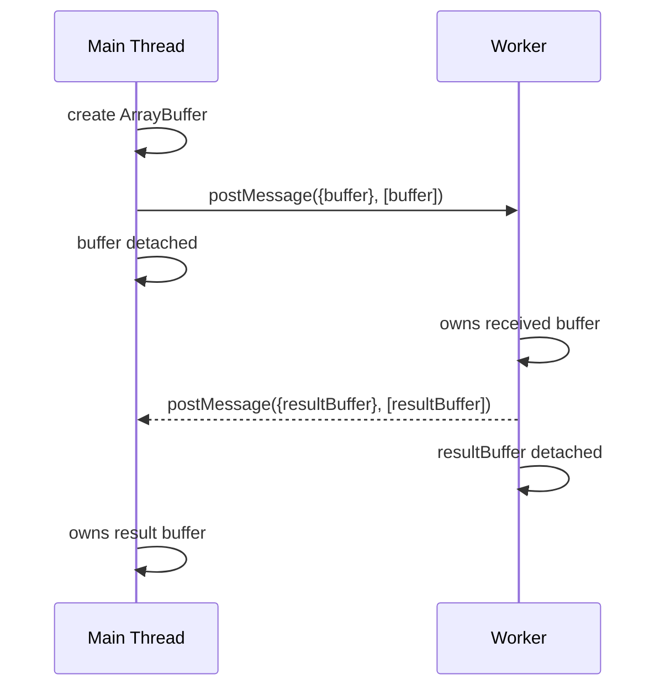
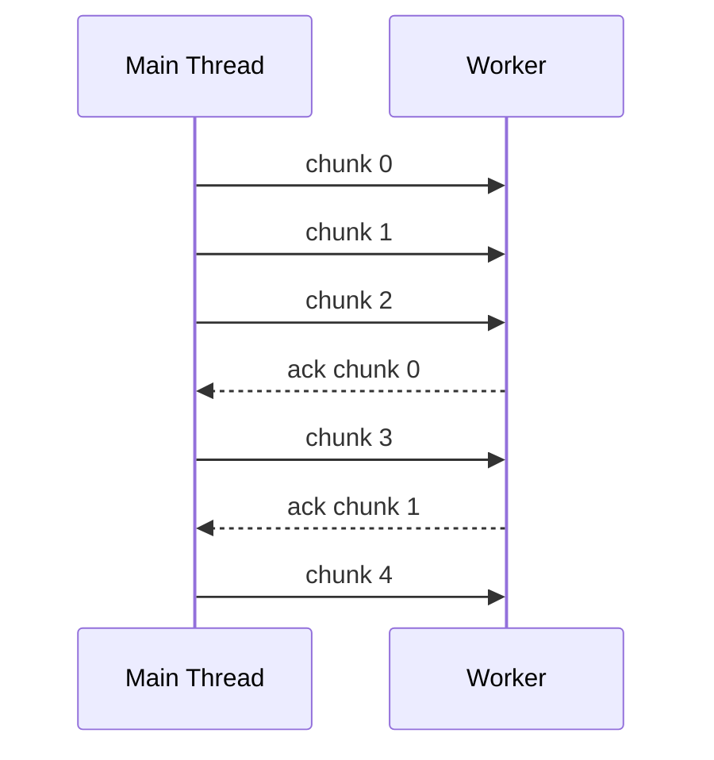
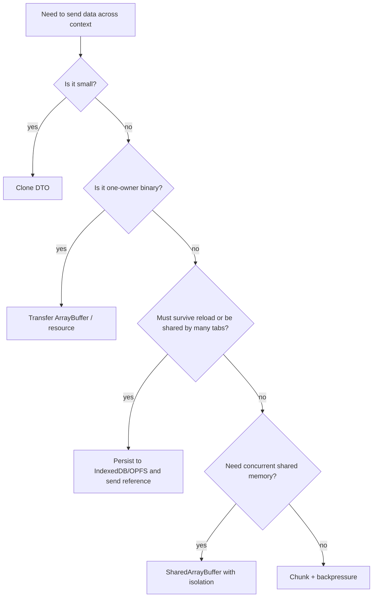
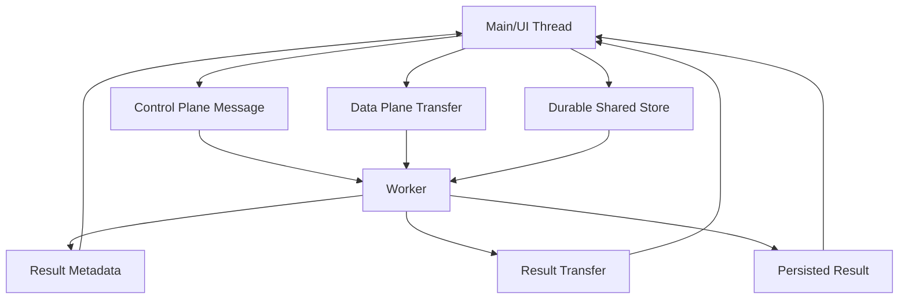
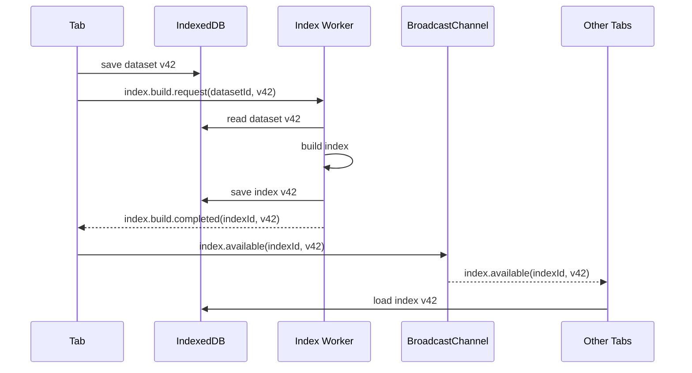

# Part 010 — Structured Clone, Transferable Objects, and Data Movement Cost

> Target part ini: memahami bahwa biaya utama worker system sering bukan komputasi di worker, tetapi pemindahan data ke dan dari worker. Kita akan membedah structured clone, transferables, object semantics, binary payload strategy, dan cara mendesain data plane yang tidak membunuh performance.

Worker biasanya dipakai karena main thread terlalu sibuk.

Tetapi banyak engineer memindahkan kerja ke worker lalu kecewa:

```txt
CPU work in worker: 30 ms
sending input to worker: 80 ms
sending output back: 60 ms
UI still janky
```

Masalahnya bukan worker. Masalahnya data movement.

Di browser, message passing tidak mengirim reference JavaScript biasa. Payload harus melewati structured clone algorithm atau transfer ownership. Ini membuat desain payload menjadi keputusan arsitektur, bukan detail kecil.

---

## 1. Mental Model: Data Crossing Context Boundary

Dalam satu JavaScript context:

```ts
const a = { count: 1 };
const b = a;
b.count = 2;
console.log(a.count); // 2
```

`a` dan `b` menunjuk object yang sama.

Antar worker/window context:

```ts
worker.postMessage({ count: 1 });
```

Receiver tidak menerima reference ke object sender. Receiver menerima hasil structured clone, kecuali object tertentu ditransfer.

```txt
same context:
  reference copied

cross context:
  value cloned OR resource ownership transferred
```

Itu berarti:

1. mutasi di receiver tidak mengubah object sender,
2. class behavior tidak boleh diasumsikan ikut,
3. object besar punya clone cost,
4. binary buffer bisa ditransfer agar tidak dicopy,
5. payload design memengaruhi latency, memory, dan jank.

---

## 2. Structured Clone Algorithm

Structured clone adalah mekanisme browser untuk menyalin value JavaScript kompleks antar boundary tertentu. Ia dipakai oleh beberapa API, termasuk:

- `postMessage` ke worker,
- `postMessage` antar window,
- `MessagePort.postMessage`,
- `BroadcastChannel.postMessage`,
- `structuredClone()` manual,
- IndexedDB object storage,
- beberapa API browser lain.

Secara mental:

```txt
input object graph
  -> traverse graph
  -> preserve supported values
  -> preserve cycles/references within cloned graph
  -> reject unsupported values
  -> produce new graph in receiver context
```

Structured clone lebih kuat dari JSON:

| Kemampuan | JSON | Structured clone |
|---|---:|---:|
| object biasa | ya | ya |
| array | ya | ya |
| `Date` | jadi string jika manual | ya |
| `Map` | tidak natural | ya |
| `Set` | tidak natural | ya |
| circular reference | tidak | ya |
| `ArrayBuffer` | tidak natural | ya |
| typed array | tidak natural | ya |
| `Blob` | tidak natural | ya |
| `Error` | tidak natural | sebagian properti didukung |
| function | tidak | tidak |
| DOM node | tidak | tidak |
| prototype/class behavior | tidak | jangan diasumsikan |

Structured clone bukan JSON stringify. Tetapi juga bukan magic “deep clone semua hal”.

---

## 3. Object Graph Semantics

### 3.1 Clone menghasilkan object baru

```ts
const original = { nested: { count: 1 } };
const cloned = structuredClone(original);

cloned.nested.count = 2;
console.log(original.nested.count); // 1
```

Dalam worker messaging, hal yang sama berlaku. Receiver bekerja pada salinan.

### 3.2 Circular reference bisa dipertahankan

```ts
const a: any = { name: 'a' };
a.self = a;

const b = structuredClone(a);

console.log(b.self === b); // true
```

Ini salah satu perbedaan besar dari JSON.

### 3.3 Shared reference internal bisa dipertahankan dalam clone graph

```ts
const shared = { value: 1 };
const input = { left: shared, right: shared };

const cloned = structuredClone(input);

console.log(cloned.left === cloned.right); // true
console.log(cloned.left === shared);       // false
```

Reference internal dalam graph bisa tetap konsisten, tetapi graph baru tetap terpisah dari graph asal.

---

## 4. Yang Tidak Bisa atau Tidak Layak Diclone

Structured clone punya batas.

Umumnya jangan kirim:

- function,
- closure,
- DOM node,
- object dengan behavior yang bergantung prototype custom,
- object dengan getter/setter yang diharapkan tetap hidup,
- class instance sebagai domain object aktif,
- object besar penuh field tidak perlu,
- object yang membawa capability sensitif.

Contoh gagal:

```ts
worker.postMessage({
  type: 'run',
  payload: {
    callback: () => console.log('done')
  }
});
```

Akan gagal karena function tidak bisa diclone.

Contoh desain yang benar:

```ts
worker.postMessage({
  type: 'run',
  payload: {
    callbackId: 'on-finished-123'
  }
});
```

Lalu callback dimodelkan sebagai response message:

```ts
self.postMessage({
  type: 'callback.invoke',
  correlationId: 'on-finished-123',
  payload: { status: 'done' }
});
```

Boundary message passing mengubah function callback menjadi protocol event.

---

## 5. Class Instance Problem

Misal kita punya domain class:

```ts
class Money {
  constructor(
    public readonly amount: number,
    public readonly currency: string
  ) {}

  add(other: Money): Money {
    if (other.currency !== this.currency) {
      throw new Error('Currency mismatch');
    }

    return new Money(this.amount + other.amount, this.currency);
  }
}
```

Mengirim `Money` instance ke worker tampak menarik:

```ts
worker.postMessage({ price: new Money(100, 'USD') });
```

Tetapi boundary messaging sebaiknya dianggap DTO boundary. Jangan desain receiver membutuhkan method `add()` dari object yang dikirim.

Gunakan DTO:

```ts
type MoneyDto = {
  amountMinor: number;
  currency: string;
};
```

Rehydrate jika perlu:

```ts
function moneyFromDto(dto: MoneyDto): Money {
  return new Money(dto.amountMinor, dto.currency);
}
```

Rule:

```txt
Across postMessage boundaries, send data contracts, not behavior.
```

---

## 6. Transferable Objects

Structured clone menyalin. Transferables memindahkan ownership.

Untuk data besar, ini krusial.

```ts
const buffer = new ArrayBuffer(1024 * 1024 * 100); // 100 MB

worker.postMessage(
  { type: 'process', buffer },
  [buffer]
);
```

Setelah transfer, sender tidak lagi memiliki buffer yang usable. Ownership pindah ke receiver.

Mental model:

```txt
clone:
  sender keeps original
  receiver gets copy
  cost: copy/serialize memory

transfer:
  sender loses ownership
  receiver gets original resource ownership
  cost: much lower for large transferable resources
```

Diagram:



---

## 7. Transferable List Is Not Payload

Penting: daftar transferables bukan berarti object itu otomatis dikirim sebagai data mandiri. Transfer list hanya memberi tahu browser resource mana yang harus dipindahkan ownership-nya saat melakukan structured clone payload.

Benar:

```ts
worker.postMessage(
  {
    type: 'binary.process',
    payload: {
      buffer
    }
  },
  [buffer]
);
```

Salah:

```ts
worker.postMessage(
  {
    type: 'binary.process',
    payload: {
      bufferId: 'buf-1'
    }
  },
  [buffer]
);
```

Pada pola salah, `buffer` ditransfer/didetach dari sender, tetapi receiver tidak punya reference ke buffer dalam message payload.

Rule:

```txt
If you transfer a resource, include it in the message graph.
```

---

## 8. Common Transferables

Transferable support bergantung API/browser, tetapi secara desain yang sering relevan:

| Transferable | Umum dipakai untuk | Catatan |
|---|---|---|
| `ArrayBuffer` | binary data, typed arrays | sangat umum untuk worker data plane |
| `MessagePort` | channel pipe | membangun private channel |
| `ImageBitmap` | image pipeline | berguna untuk off-main-thread processing |
| `OffscreenCanvas` | worker rendering | dipakai di rendering part nanti |
| `ReadableStream` / stream transfer support | streaming pipeline | cek support target browser |
| WebCodecs objects tertentu | media processing | workload advanced |

Typed array seperti `Uint8Array` bukan resource transfer utama; yang ditransfer biasanya `typedArray.buffer`.

```ts
const bytes = new Uint8Array(1024);

worker.postMessage(
  { type: 'bytes', bytes },
  [bytes.buffer]
);
```

Receiver masih mendapat typed array view dalam payload, dengan buffer yang ownership-nya sudah pindah.

---

## 9. Clone vs Transfer: Decision Table

| Payload | Ukuran | Mutasi setelah kirim? | Strategi |
|---|---:|---:|---|
| command kecil | kecil | sender masih perlu | clone |
| config kecil | kecil | sender masih perlu | clone |
| JSON DTO sedang | sedang | sender masih perlu | clone, tapi ukur |
| file binary besar | besar | sender tidak perlu lagi | transfer `ArrayBuffer` |
| image decode/process | besar | pipeline ownership jelas | transfer `ImageBitmap`/buffer |
| large result buffer | besar | worker tidak perlu setelah kirim | transfer balik |
| shared mutable memory | besar | dua context perlu akses | `SharedArrayBuffer`, jika isolation memenuhi |
| durable data | besar | perlu survive reload | simpan di IndexedDB/OPFS, kirim reference/id |
| frequent progress update | kecil | n/a | clone small event |

Rule praktis:

```txt
Small control messages: clone.
Large one-owner binary payloads: transfer.
Shared concurrent buffer: SharedArrayBuffer.
Durable data: store and send references.
```

---

## 10. Data Plane Pattern: Transfer In, Transfer Out

Misal kita ingin melakukan image-like binary transformation.

### 10.1 Main thread

```ts
type ProcessImageRequest = {
  type: 'image.process.request';
  id: string;
  payload: {
    input: ArrayBuffer;
    width: number;
    height: number;
    operation: 'grayscale' | 'threshold';
  };
};

const input = await file.arrayBuffer();
const id = crypto.randomUUID();

worker.postMessage(
  {
    type: 'image.process.request',
    id,
    payload: {
      input,
      width,
      height,
      operation: 'grayscale'
    }
  } satisfies ProcessImageRequest,
  [input]
);
```

Setelah call ini, `input` di main thread sudah tidak boleh dipakai.

### 10.2 Worker

```ts
self.addEventListener('message', event => {
  const message = event.data as ProcessImageRequest;

  if (message.type !== 'image.process.request') return;

  const output = processImage(
    message.payload.input,
    message.payload.width,
    message.payload.height,
    message.payload.operation
  );

  self.postMessage(
    {
      type: 'image.process.response',
      correlationId: message.id,
      payload: {
        output
      }
    },
    [output]
  );
});

function processImage(
  input: ArrayBuffer,
  width: number,
  height: number,
  operation: 'grayscale' | 'threshold'
): ArrayBuffer {
  const source = new Uint8ClampedArray(input);
  const result = new Uint8ClampedArray(source.length);

  for (let i = 0; i < source.length; i += 4) {
    const r = source[i];
    const g = source[i + 1];
    const b = source[i + 2];
    const a = source[i + 3];

    const gray = Math.round((r + g + b) / 3);

    result[i] = gray;
    result[i + 1] = gray;
    result[i + 2] = gray;
    result[i + 3] = a;
  }

  return result.buffer;
}
```

Ini adalah ownership pipeline:

```txt
main owns input
main transfers input to worker
worker owns input
worker creates output
worker transfers output to main
main owns output
```

Tidak ada shared mutation, tidak ada copy besar jika transfer berhasil.

---

## 11. Data Plane Pattern: Store and Signal

Untuk data besar yang perlu durable, jangan kirim datanya berkali-kali.

Anti-pattern:

```ts
broadcastChannel.postMessage({
  type: 'dataset.updated',
  payload: hugeDataset
});
```

Lebih baik:

```ts
await saveDatasetToIndexedDb(datasetId, hugeDataset);

broadcastChannel.postMessage({
  type: 'dataset.updated',
  payload: {
    datasetId,
    version,
    store: 'indexeddb:datasets'
  }
});
```

Receiver:

```ts
channel.addEventListener('message', async event => {
  if (event.data.type !== 'dataset.updated') return;

  const { datasetId, version } = event.data.payload;
  const dataset = await loadDatasetFromIndexedDb(datasetId, version);

  render(dataset);
});
```

Pattern:

```txt
large durable data -> shared store
message -> invalidation / pointer / version signal
```

Ini sangat penting untuk multi-tab. Broadcast payload besar ke 5 tab berarti clone cost bisa berlipat.

---

## 12. Data Plane Pattern: Chunking

Jika data besar tidak bisa atau tidak ideal ditransfer sekaligus, gunakan chunking.

```ts
type ChunkMessage = {
  type: 'file.chunk';
  transferId: string;
  index: number;
  total: number;
  buffer: ArrayBuffer;
};
```

Sender:

```ts
async function sendInChunks(worker: Worker, file: File, chunkSize = 1024 * 1024) {
  const transferId = crypto.randomUUID();
  const total = Math.ceil(file.size / chunkSize);

  for (let index = 0; index < total; index++) {
    const start = index * chunkSize;
    const end = Math.min(start + chunkSize, file.size);
    const buffer = await file.slice(start, end).arrayBuffer();

    worker.postMessage(
      {
        type: 'file.chunk',
        transferId,
        index,
        total,
        buffer
      } satisfies ChunkMessage,
      [buffer]
    );
  }
}
```

Receiver:

```ts
type Assembly = {
  chunks: Array<ArrayBuffer | undefined>;
  received: number;
  total: number;
};

const assemblies = new Map<string, Assembly>();

function receiveChunk(message: ChunkMessage) {
  let assembly = assemblies.get(message.transferId);

  if (!assembly) {
    assembly = {
      chunks: new Array(message.total),
      received: 0,
      total: message.total
    };
    assemblies.set(message.transferId, assembly);
  }

  if (!assembly.chunks[message.index]) {
    assembly.chunks[message.index] = message.buffer;
    assembly.received++;
  }

  if (assembly.received === assembly.total) {
    assemblies.delete(message.transferId);
    return concatBuffers(assembly.chunks as ArrayBuffer[]);
  }
}

function concatBuffers(buffers: ArrayBuffer[]): ArrayBuffer {
  const totalBytes = buffers.reduce((sum, b) => sum + b.byteLength, 0);
  const output = new Uint8Array(totalBytes);

  let offset = 0;
  for (const buffer of buffers) {
    output.set(new Uint8Array(buffer), offset);
    offset += buffer.byteLength;
  }

  return output.buffer;
}
```

Chunking memberi:

- progress reporting,
- memory control,
- cancellation point,
- retry per chunk,
- backpressure per chunk.

Tetapi chunking juga menambah complexity:

- reassembly,
- ordering,
- cleanup incomplete transfer,
- duplicate chunk handling,
- timeout transfer.

---

## 13. Backpressure untuk Binary Transfer

Tanpa backpressure, chunking tetap bisa membanjiri worker.

Gunakan ACK per window/chunk.



Sender dengan max in-flight:

```ts
async function sendChunksWithBackpressure(
  workerRpc: WorkerRpc<any>,
  file: File,
  chunkSize: number,
  maxInFlight: number
) {
  const transferId = crypto.randomUUID();
  const total = Math.ceil(file.size / chunkSize);
  let next = 0;
  let completed = 0;

  return new Promise<void>((resolve, reject) => {
    const pump = () => {
      while (next < total && next - completed < maxInFlight) {
        const index = next++;
        const start = index * chunkSize;
        const end = Math.min(start + chunkSize, file.size);

        file.slice(start, end).arrayBuffer()
          .then(buffer => workerRpc.request('file.chunk', {
            transferId,
            index,
            total,
            buffer
          }, {
            transfer: [buffer]
          }))
          .then(() => {
            completed++;
            if (completed === total) resolve();
            else pump();
          })
          .catch(reject);
      }
    };

    pump();
  });
}
```

Kode di atas konseptual; implementasi `WorkerRpc` dari Part 009 perlu ditambah opsi `transfer`.

Point-nya: untuk payload besar, kontrol jumlah in-flight sama pentingnya dengan transfer.

---

## 14. Measuring Clone vs Transfer Cost

Jangan menebak. Ukur.

Benchmark sederhana:

### 14.1 Main thread

```ts
const worker = new Worker(new URL('./bench.worker.ts', import.meta.url), {
  type: 'module'
});

function once<T>(target: EventTarget, eventName: string): Promise<T> {
  return new Promise(resolve => {
    target.addEventListener(eventName, event => resolve(event as T), { once: true });
  });
}

async function roundTripClone(sizeMb: number) {
  const buffer = new ArrayBuffer(sizeMb * 1024 * 1024);
  const startedAt = performance.now();

  worker.postMessage({ type: 'echo', buffer });

  await once<MessageEvent>(worker, 'message');

  return performance.now() - startedAt;
}

async function roundTripTransfer(sizeMb: number) {
  const buffer = new ArrayBuffer(sizeMb * 1024 * 1024);
  const startedAt = performance.now();

  worker.postMessage({ type: 'echo', buffer }, [buffer]);

  await once<MessageEvent>(worker, 'message');

  return performance.now() - startedAt;
}
```

### 14.2 Worker

```ts
self.addEventListener('message', event => {
  const { type, buffer } = event.data;

  if (type !== 'echo') return;

  self.postMessage({ type: 'echo.response', buffer }, [buffer]);
});
```

Catatan benchmark:

- jalankan beberapa warm-up iteration,
- ukur median/p95, bukan satu angka,
- bandingkan berbagai ukuran payload,
- cek memory di performance tools,
- lakukan di target browser/device nyata,
- jangan mengukur hanya di laptop high-end.

Output yang ingin dilihat:

| Size | Clone median | Transfer median | Catatan |
|---:|---:|---:|---|
| 1 MB | ... | ... | clone mungkin masih acceptable |
| 10 MB | ... | ... | transfer mulai penting |
| 100 MB | ... | ... | clone bisa spike memory |

Tidak ada angka universal. Browser, device, memory pressure, dan payload shape berpengaruh.

---

## 15. Payload Shape Matters

Dua payload dengan ukuran byte mirip bisa punya cost berbeda.

### 15.1 Deep object graph

```ts
const payload = {
  rows: Array.from({ length: 100_000 }, (_, i) => ({
    id: i,
    name: `Item ${i}`,
    flags: { active: i % 2 === 0 }
  }))
};
```

Structured clone harus menelusuri banyak object kecil.

### 15.2 Flat binary representation

```ts
const ids = new Uint32Array(100_000);
const active = new Uint8Array(100_000);
```

Lebih mudah ditransfer, lebih cache-friendly, dan cocok untuk worker CPU processing.

Rule:

```txt
For high-volume worker data, prefer flat typed data over deep object forests.
```

Bukan berarti semua domain harus binary. Tetapi untuk hot path, object forest mahal.

---

## 16. Typed Arrays as Boundary Format

Typed array berguna saat:

- jumlah data besar,
- schema sederhana,
- operasi numerik,
- parsing binary,
- search index,
- bitmap/image processing,
- WASM interop,
- compression/encryption.

Contoh format sederhana:

```ts
type ColumnarUsers = {
  ids: Uint32Array;
  ages: Uint8Array;
  status: Uint8Array;
};
```

Transfer:

```ts
worker.postMessage(
  {
    type: 'users.index.build',
    payload: {
      ids,
      ages,
      status
    }
  },
  [ids.buffer, ages.buffer, status.buffer]
);
```

Kelemahan:

- lebih sulit dibaca,
- perlu encoding/decoding,
- schema evolution lebih eksplisit,
- debugging lebih sulit,
- tidak cocok untuk semua domain.

Gunakan di hot path, bukan semua tempat.

---

## 17. DTO vs Binary vs Reference

Pilih boundary representation berdasarkan workload.



Decision table:

| Strategy | Best for | Avoid when |
|---|---|---|
| Clone DTO | small commands/events | payload large/hot path |
| Transfer buffer | one-owner large binary | sender still needs buffer |
| Store and signal | durable/shared large data | low-latency tiny data |
| Chunking | huge stream-like transfer | protocol simplicity matters more |
| SharedArrayBuffer | ultra-low-latency shared data | app cannot enable cross-origin isolation |

---

## 18. SharedArrayBuffer Is Different

`SharedArrayBuffer` bukan structured clone biasa dan bukan transfer ownership. Ia memungkinkan memory yang sama diakses oleh beberapa agent, dengan synchronization via `Atomics`.

Mental model:

```txt
ArrayBuffer transfer:
  one owner at a time

SharedArrayBuffer:
  multiple contexts can view same memory
  correctness requires synchronization
```

Ini powerful tetapi berbahaya. Begitu memory shared, kita masuk ke dunia:

- data race,
- atomic operations,
- memory ordering,
- ring buffer,
- lock-free queue,
- cross-origin isolation requirement,
- debugging jauh lebih sulit.

Karena itu `SharedArrayBuffer` dibahas mendalam nanti di Part 057–060.

Untuk sekarang rule-nya:

```txt
Do not reach for SharedArrayBuffer until clone/transfer/store-reference is proven insufficient.
```

---

## 19. Memory Pressure and Detached Buffers

Transfer mengurangi copy, tetapi bukan berarti bebas dari memory problem.

Perhatikan pipeline:

```txt
file.arrayBuffer() creates large buffer
transfer to worker
worker creates output buffer
transfer output back
UI creates Blob/ImageData/etc
```

Pada momen tertentu, beberapa buffer bisa hidup bersamaan.

Checklist:

- release references setelah transfer,
- jangan simpan old payload di logs,
- jangan stringify binary message,
- jangan taruh payload besar di Redux/devtools,
- jangan cache result besar tanpa eviction,
- jangan transfer buffer lalu tetap mencoba memakainya,
- gunakan chunking jika peak memory terlalu besar.

Anti-pattern logging:

```ts
console.log('worker payload', payload); // payload may hold huge buffer
```

Lebih baik:

```ts
console.log('worker payload', {
  type: payload.type,
  bytes: payload.buffer?.byteLength,
  id: payload.id
});
```

---

## 20. MessageError and Clone Failure

Ada dua kategori error.

### 20.1 Send-time clone failure

Payload mengandung sesuatu yang tidak bisa diclone.

```ts
try {
  worker.postMessage({ fn: () => null });
} catch (error) {
  // DataCloneError-like failure
}
```

Tangani di boundary.

```ts
function safePostMessage(
  worker: Worker,
  message: unknown,
  transfer: Transferable[] = []
): { ok: true } | { ok: false; error: unknown } {
  try {
    worker.postMessage(message, transfer);
    return { ok: true };
  } catch (error) {
    return { ok: false, error };
  }
}
```

### 20.2 Receive-time deserialization failure

Receiver bisa mendapat `messageerror` ketika message gagal dideserialize.

```ts
worker.addEventListener('messageerror', event => {
  reportWorkerMessageError(event);
});
```

Di production, `messageerror` harus masuk observability. Jangan diam.

---

## 21. Protocol-Level Size Budget

Tetapkan budget payload.

Contoh:

```ts
const MESSAGE_BUDGET = {
  controlMessageBytes: 16 * 1024,
  clonedPayloadWarnBytes: 256 * 1024,
  clonedPayloadHardLimitBytes: 1024 * 1024,
  transferRecommendedBytes: 1024 * 1024
};
```

Estimasi kasar:

```ts
function estimateJsonBytes(value: unknown): number | undefined {
  try {
    return new TextEncoder().encode(JSON.stringify(value)).byteLength;
  } catch {
    return undefined;
  }
}
```

Untuk binary:

```ts
function binaryBytes(value: unknown): number {
  if (value instanceof ArrayBuffer) return value.byteLength;
  if (ArrayBuffer.isView(value)) return value.byteLength;
  return 0;
}
```

Jangan terlalu percaya estimasi JSON untuk semua payload. Ia hanya alarm kasar.

Runtime guard:

```ts
function assertPayloadBudget(message: any) {
  const estimated = estimateJsonBytes(message);

  if (estimated && estimated > MESSAGE_BUDGET.clonedPayloadWarnBytes) {
    console.warn('Large cloned message payload', {
      type: message.type,
      estimated
    });
  }
}
```

---

## 22. Versioning Boundary Data

Structured clone bisa mengirim object, tetapi tidak memecahkan masalah version skew.

Tab A versi lama:

```ts
{ type: 'cart.updated', payload: { cartId, items } }
```

Tab B versi baru:

```ts
{ type: 'cart.updated', payload: { cartId, lines, pricingVersion } }
```

Jika dua tab versi berbeda hidup bersamaan, message contract harus evolve.

Gunakan versioned payload:

```ts
type CartUpdatedV1 = {
  schemaVersion: 1;
  cartId: string;
  items: Array<{ sku: string; qty: number }>;
};

type CartUpdatedV2 = {
  schemaVersion: 2;
  cartId: string;
  lines: Array<{ sku: string; quantity: number; priceMinor?: number }>;
  pricingVersion: string;
};
```

Normalize di receiver:

```ts
function normalizeCartUpdated(payload: CartUpdatedV1 | CartUpdatedV2) {
  switch (payload.schemaVersion) {
    case 1:
      return {
        cartId: payload.cartId,
        lines: payload.items.map(item => ({
          sku: item.sku,
          quantity: item.qty
        })),
        pricingVersion: 'unknown'
      };

    case 2:
      return payload;

    default:
      throw new Error('Unsupported cart payload version');
  }
}
```

Message boundary adalah compatibility boundary.

---

## 23. Security: Clone Does Not Mean Safe

Structured clone membuat copy, bukan sanitization.

Jika payload datang dari untrusted iframe/window:

- tetap validasi origin,
- tetap validasi schema,
- tetap sanitize string sebelum masuk DOM,
- jangan percaya enum tanpa validation,
- jangan eksekusi command hanya karena type cocok,
- jangan treat cloned object as trusted domain object.

Contoh berbahaya:

```ts
window.addEventListener('message', event => {
  document.body.innerHTML = event.data.html;
});
```

Lebih aman:

```ts
window.addEventListener('message', event => {
  if (event.origin !== TRUSTED_ORIGIN) return;

  const parsed = parseSafeMessage(event.data);
  if (!parsed.ok) return;

  renderSafeViewModel(parsed.value);
});
```

Message boundary harus dianggap input boundary.

---

## 24. Production Data Movement Architecture

Untuk sistem kompleks, pisahkan message menjadi tiga layer.



### 24.1 Control plane

Small messages:

```ts
{
  type: 'index.build.request',
  payload: {
    datasetId,
    sourceRef,
    options
  }
}
```

### 24.2 Data plane

Large buffers/resources:

```ts
{
  type: 'index.segment.transfer',
  payload: {
    segmentId,
    buffer
  }
}
```

with transfer list:

```ts
[buffer]
```

### 24.3 State plane

Durable state:

```ts
{
  type: 'index.version.available',
  payload: {
    indexId,
    version,
    store: 'indexeddb:indexes'
  }
}
```

This separation keeps architecture understandable.

---

## 25. Applied Example: Search Index Worker

Scenario:

- app punya dataset besar,
- worker membangun search index,
- banyak tab perlu tahu index sudah tersedia,
- dataset terlalu besar untuk broadcast langsung.

Design:

```txt
1. Main thread stores dataset in IndexedDB.
2. Main thread sends build command to worker with datasetId/version.
3. Worker loads dataset from IndexedDB.
4. Worker builds index.
5. Worker stores index in IndexedDB.
6. Worker posts small completion message.
7. Tabs receive invalidation and load index by reference.
```

Diagram:



Message payload tetap kecil. Data besar tinggal di storage.

---

## 26. Applied Example: File Hash Worker

Scenario:

- user memilih file besar,
- app butuh hash,
- tidak butuh file content di main thread setelah dikirim.

Design:

```ts
const buffer = await file.arrayBuffer();

worker.postMessage(
  {
    type: 'file.hash.request',
    id: crypto.randomUUID(),
    payload: {
      fileName: file.name,
      size: file.size,
      buffer
    }
  },
  [buffer]
);
```

Worker:

```ts
self.addEventListener('message', async event => {
  if (event.data.type !== 'file.hash.request') return;

  const { buffer, fileName, size } = event.data.payload;
  const hash = await sha256(buffer);

  self.postMessage({
    type: 'file.hash.response',
    correlationId: event.data.id,
    payload: {
      fileName,
      size,
      hash
    }
  });
});
```

Di sini response kecil, jadi clone biasa cukup.

---

## 27. Applied Example: AST Parser Worker

Scenario:

- editor web mengirim source code ke worker,
- worker parsing AST,
- AST besar,
- UI hanya butuh diagnostics dan outline.

Anti-pattern:

```ts
worker.postMessage({ type: 'parse.response', ast });
```

AST besar bisa sangat mahal untuk clone.

Better:

```ts
self.postMessage({
  type: 'parse.response',
  correlationId: requestId,
  payload: {
    diagnostics,
    outline,
    symbolCount,
    parseVersion
  }
});
```

AST tetap di worker untuk query berikutnya:

```ts
worker.postMessage({
  type: 'symbol.lookup.request',
  payload: {
    parseVersion,
    position
  }
});
```

Pattern:

```txt
Keep heavy internal structure in worker.
Expose small query API to UI.
```

---

## 28. Testing Data Movement

Unit test tidak cukup. Buat test untuk boundary behavior.

### 28.1 Clone unsupported value

```ts
expect(() => {
  worker.postMessage({ fn: () => undefined });
}).toThrow();
```

### 28.2 Transfer detaches sender buffer

```ts
const buffer = new ArrayBuffer(8);
worker.postMessage({ buffer }, [buffer]);

expect(buffer.byteLength).toBe(0);
```

### 28.3 Receiver gets expected bytes

```ts
const bytes = new Uint8Array([1, 2, 3]);
worker.postMessage({ bytes }, [bytes.buffer]);

const response = await nextWorkerMessage(worker);
expect([...response.data.bytes]).toEqual([1, 2, 3]);
```

### 28.4 Large payload warning

```ts
const message = createHugeMessage();
expect(() => assertPayloadBudget(message)).toWarnLargePayload();
```

### 28.5 Version skew

```ts
expect(normalizeCartUpdated(v1Payload)).toEqual(expectedNormalized);
expect(normalizeCartUpdated(v2Payload)).toEqual(expectedNormalized);
```

---

## 29. Checklist

Sebelum mengirim data antar context:

- [ ] Apakah payload kecil, besar, durable, atau streaming?
- [ ] Apakah sender masih butuh data setelah kirim?
- [ ] Apakah clone cost sudah diukur?
- [ ] Apakah transfer list benar-benar menyertakan object di payload graph?
- [ ] Apakah buffer detach behavior aman untuk sender?
- [ ] Apakah typed arrays lebih cocok daripada object graph?
- [ ] Apakah data besar seharusnya disimpan di IndexedDB/OPFS saja?
- [ ] Apakah payload punya schema version?
- [ ] Apakah message boundary divalidasi runtime?
- [ ] Apakah binary transfer punya backpressure?
- [ ] Apakah incomplete chunk transfer dibersihkan?
- [ ] Apakah logs tidak menyimpan payload besar?
- [ ] Apakah memory peak sudah dipikirkan?
- [ ] Apakah worker menyimpan heavy state internal daripada bolak-balik AST/index besar?

---

## 30. Mental Model Final

Structured clone dan transferables adalah fondasi data movement di browser orchestration.

Ringkasnya:

```txt
postMessage moves messages.
Structured clone copies supported object graphs.
Transferables move ownership of resources.
SharedArrayBuffer shares memory with synchronization cost.
IndexedDB/OPFS store durable large data.
Good protocol sends small intent and moves large data consciously.
```

Engineer biasa bertanya:

```txt
Can I send this object to worker?
```

Engineer yang lebih matang bertanya:

```txt
Should this data cross the boundary at all?
If yes, should it be cloned, transferred, shared, chunked, or referenced?
What is the ownership and lifecycle after crossing?
```

Itulah perbedaan antara “pakai worker” dan membangun worker system yang production-grade.

---

## Referensi

- MDN — The structured clone algorithm
- MDN — Transferable objects
- MDN — Worker: `postMessage()` method
- MDN — Window: `postMessage()` method
- MDN — `structuredClone()`
- WHATWG HTML Standard — Structured serialize / deserialize
- WHATWG HTML Standard — Web workers
