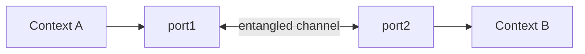
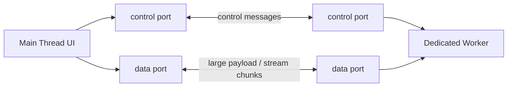
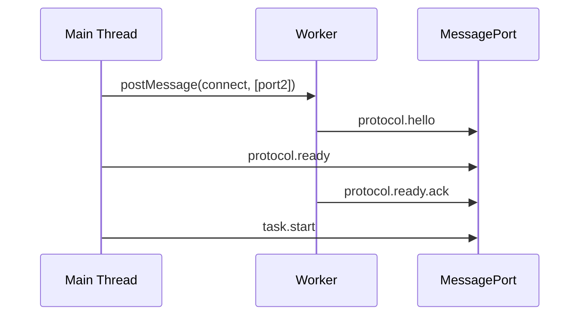
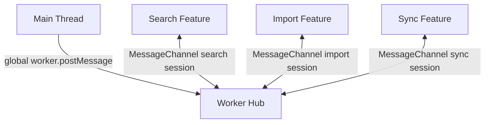

# Part 011 — MessageChannel and MessagePort as Explicit Pipes

> Target part ini: memahami `MessageChannel` dan `MessagePort` sebagai primitive komunikasi point-to-point yang lebih eksplisit daripada `window.postMessage` global dan lebih terkendali daripada broadcast bus. Setelah part ini, kita punya mental model untuk membangun private control channel, data channel, RPC layer, worker routing, lifecycle cleanup, dan bounded message protocol.

Pada part sebelumnya kita membahas `postMessage` dan structured clone.

Sekarang kita naik satu level: bukan lagi sekadar “kirim message ke worker”, tetapi **mendesain jalur komunikasi**.

Dalam sistem browser yang serius, satu global `postMessage` handler cepat berubah menjadi tempat sampah:

```ts
window.addEventListener("message", (event) => {
  if (event.data.type === "A") { /* ... */ }
  if (event.data.type === "B") { /* ... */ }
  if (event.data.type === "C") { /* ... */ }
});
```

Awalnya sederhana. Lalu tab punya iframe. Worker punya sub-worker. Service worker perlu mengirim update. Ada handshake. Ada auth refresh. Ada cancel. Ada retry. Ada correlation id. Ada payload besar.

Tanpa pipe eksplisit, semua context berbicara lewat ruangan yang sama.

`MessageChannel` memberi kita sesuatu yang lebih sehat:

```txt
not: everyone shouts in global room
but: two endpoints share a private pipe
```

---

## 1. Mental Model: Entangled Ports

`MessageChannel` membuat dua `MessagePort`.

```ts
const channel = new MessageChannel();

const portA = channel.port1;
const portB = channel.port2;
```

Keduanya bisa dipikirkan seperti dua ujung pipa.



Jika `port1.postMessage(payload)` dipanggil, message diterima di `port2`.

Jika `port2.postMessage(payload)` dipanggil, message diterima di `port1`.

Ini bukan broadcast. Ini bukan global event bus. Ini adalah channel private dua arah.

```txt
MessageChannel = creates pipe
MessagePort    = one endpoint of pipe
postMessage    = sends message through endpoint
close           = disconnects endpoint
```

---

## 2. Kenapa Perlu MessageChannel Kalau Sudah Ada Worker.postMessage?

Untuk worker sederhana, ini cukup:

```ts
const worker = new Worker(new URL("./worker.ts", import.meta.url), {
  type: "module",
});

worker.postMessage({ type: "calculate", input });
worker.onmessage = (event) => {
  console.log(event.data);
};
```

Tetapi begitu sistem membesar, `worker.postMessage` langsung punya beberapa keterbatasan arsitektural:

| Masalah | Dampak |
|---|---|
| Semua traffic lewat satu endpoint | control message, task message, debug message bercampur |
| Tidak ada private sub-channel | sulit memberi “session” komunikasi khusus |
| Tidak mudah delegasi channel ke context lain | routing menjadi manual |
| Cleanup sering dilupakan | listener global menumpuk |
| Protocol sulit dipisahkan | satu handler memproses terlalu banyak tipe |

`MessageChannel` menyelesaikan sebagian masalah itu dengan membuat **channel sebagai object capability**.

Artinya: siapa yang memegang `MessagePort`, dia punya kemampuan berbicara pada channel itu.

```txt
port possession = communication authority
```

Ini pattern penting untuk sistem browser:

1. main thread membuat channel,
2. salah satu port dikirim ke worker,
3. worker hanya bisa bicara lewat port itu,
4. saat session selesai, port ditutup,
5. resource bisa dibersihkan.

---

## 3. `MessagePort` sebagai Object Capability

Di sistem keamanan, object capability berarti akses diberikan lewat object, bukan global name.

Contoh buruk:

```ts
window.__GLOBAL_BUS__.send({ type: "secret" });
```

Siapa pun yang punya akses ke global bus bisa kirim message.

Contoh lebih baik:

```ts
const channel = new MessageChannel();
worker.postMessage({ type: "attach-session" }, [channel.port2]);

const sessionPort = channel.port1;
```

Hanya pihak yang menerima port yang bisa bicara pada session itu.

Ini cocok untuk:

1. private worker session,
2. iframe bridge,
3. request-scoped stream,
4. debug channel,
5. upload progress channel,
6. RPC connection,
7. tab-to-hub client connection.

Jangan salah paham: ini bukan security boundary absolut. Jika page sudah compromised, attacker bisa mengakses JS runtime yang sama. Tetapi sebagai desain software, `MessagePort` membantu membatasi routing dan lifecycle.

---

## 4. Basic API

### 4.1 Membuat channel

```ts
const channel = new MessageChannel();
```

### 4.2 Mendengar message

Ada dua cara umum.

Dengan `onmessage`:

```ts
channel.port1.onmessage = (event) => {
  console.log("received", event.data);
};
```

Dengan `addEventListener`:

```ts
channel.port1.addEventListener("message", (event) => {
  console.log("received", event.data);
});

channel.port1.start();
```

Saat memakai `addEventListener`, panggil `start()` agar port mulai mengirim event yang queued ke listener. Saat memakai `onmessage`, start biasanya implicit.

### 4.3 Mengirim message

```ts
channel.port2.postMessage({ type: "hello" });
```

### 4.4 Menutup port

```ts
channel.port1.close();
channel.port2.close();
```

Close bukan kosmetik. Port yang tidak ditutup bisa mempertahankan resource lebih lama dari yang kita kira, terutama jika banyak port dibuat untuk session pendek.

---

## 5. Port Transfer: Cara Mengirim Pipe ke Context Lain

Port adalah transferable object.

Artinya port bisa dikirim melalui `postMessage`.

```ts
const channel = new MessageChannel();

worker.postMessage(
  {
    type: "connect",
    protocol: "task-session.v1",
  },
  [channel.port2]
);

const port = channel.port1;
```

Di worker:

```ts
self.onmessage = (event) => {
  if (event.data?.type !== "connect") return;

  const [port] = event.ports;

  port.onmessage = (messageEvent) => {
    console.log("session message", messageEvent.data);
  };

  port.postMessage({ type: "connected" });
};
```

Perhatikan bagian ini:

```ts
const [port] = event.ports;
```

Port tidak selalu berada di `event.data`. Port dikirim lewat transfer list, lalu tersedia sebagai `event.ports` pada receiver.

---

## 6. Topology: Control Plane vs Data Plane

Salah satu manfaat paling besar dari `MessageChannel` adalah memisahkan traffic.



Control plane membawa message kecil:

```ts
type ControlMessage =
  | { type: "ready" }
  | { type: "pause" }
  | { type: "resume" }
  | { type: "cancel"; taskId: string }
  | { type: "stats-request" };
```

Data plane membawa payload besar:

```ts
type DataMessage =
  | { type: "chunk"; taskId: string; seq: number; buffer: ArrayBuffer }
  | { type: "chunk-ack"; taskId: string; seq: number }
  | { type: "end"; taskId: string };
```

Kenapa perlu dipisah?

Karena control message harus tetap responsif meskipun data plane sedang sibuk.

Jika semua message lewat satu queue, payload besar bisa membuat cancel/pause terlambat diproses.

```txt
single queue:
  chunk chunk chunk chunk cancel

split queue:
  data:    chunk chunk chunk chunk
  control: cancel
```

Untuk production runtime, separation ini sering lebih penting daripada optimasi micro-level.

---

## 7. Protocol Envelope untuk MessagePort

Jangan mengirim raw object ad hoc.

Gunakan envelope.

```ts
type PortEnvelope<TType extends string, TPayload> = {
  protocol: "com.acme.worker.session";
  version: 1;
  id: string;
  type: TType;
  senderId: string;
  timestampMs: number;
  payload: TPayload;
};
```

Contoh:

```ts
type TaskStart = PortEnvelope<"task.start", {
  taskId: string;
  kind: "parse-csv" | "build-index";
  inputRef: string;
}>;

type TaskProgress = PortEnvelope<"task.progress", {
  taskId: string;
  done: number;
  total: number;
}>;

type TaskComplete = PortEnvelope<"task.complete", {
  taskId: string;
  outputRef: string;
}>;

type TaskFailed = PortEnvelope<"task.failed", {
  taskId: string;
  code: string;
  retryable: boolean;
  message: string;
}>;
```

Envelope memberi kita:

1. versi protocol,
2. correlation id,
3. audit/debug metadata,
4. runtime validation point,
5. forward compatibility,
6. tempat untuk fencing token atau epoch di part leader election nanti.

---

## 8. Request/Response di Atas MessagePort

`MessagePort` hanya mengirim event.

Tidak ada built-in promise, timeout, retry, atau ACK.

Kita harus membangun sendiri.

### 8.1 Contract

```ts
type RequestEnvelope<TPayload> = {
  kind: "request";
  id: string;
  type: string;
  payload: TPayload;
};

type ResponseEnvelope<TResult> = {
  kind: "response";
  requestId: string;
  ok: true;
  result: TResult;
} | {
  kind: "response";
  requestId: string;
  ok: false;
  error: {
    code: string;
    message: string;
    retryable: boolean;
  };
};
```

### 8.2 Client-side peer

```ts
export class PortRpcClient {
  private readonly pending = new Map<
    string,
    {
      resolve: (value: unknown) => void;
      reject: (reason: unknown) => void;
      timer: number;
    }
  >();

  constructor(private readonly port: MessagePort) {
    this.port.addEventListener("message", (event) => {
      this.handleMessage(event.data);
    });
    this.port.addEventListener("messageerror", () => {
      // Deserialization error. Treat as protocol failure.
      // Do not try to recover blindly.
      this.rejectAll(new Error("messageerror from MessagePort"));
    });
    this.port.start();
  }

  request<TPayload, TResult>(
    type: string,
    payload: TPayload,
    timeoutMs = 10_000
  ): Promise<TResult> {
    const id = crypto.randomUUID();

    return new Promise<TResult>((resolve, reject) => {
      const timer = window.setTimeout(() => {
        this.pending.delete(id);
        reject(new Error(`Port RPC timeout: ${type} ${id}`));
      }, timeoutMs);

      this.pending.set(id, {
        resolve: resolve as (value: unknown) => void,
        reject,
        timer,
      });

      this.port.postMessage({
        kind: "request",
        id,
        type,
        payload,
      } satisfies RequestEnvelope<TPayload>);
    });
  }

  close(): void {
    this.rejectAll(new Error("Port closed"));
    this.port.close();
  }

  private handleMessage(message: unknown): void {
    if (!isResponseEnvelope(message)) {
      return;
    }

    const pending = this.pending.get(message.requestId);
    if (!pending) {
      // Late response, duplicate response, or response after timeout.
      return;
    }

    window.clearTimeout(pending.timer);
    this.pending.delete(message.requestId);

    if (message.ok) {
      pending.resolve(message.result);
    } else {
      pending.reject(Object.assign(new Error(message.error.message), {
        code: message.error.code,
        retryable: message.error.retryable,
      }));
    }
  }

  private rejectAll(reason: unknown): void {
    for (const pending of this.pending.values()) {
      window.clearTimeout(pending.timer);
      pending.reject(reason);
    }
    this.pending.clear();
  }
}

function isResponseEnvelope(value: unknown): value is ResponseEnvelope<unknown> {
  if (!value || typeof value !== "object") return false;
  const record = value as Record<string, unknown>;
  return record.kind === "response" && typeof record.requestId === "string";
}
```

### 8.3 Server-side peer

```ts
export class PortRpcServer {
  private readonly handlers = new Map<
    string,
    (payload: unknown) => Promise<unknown> | unknown
  >();

  constructor(private readonly port: MessagePort) {
    this.port.addEventListener("message", (event) => {
      void this.handleMessage(event.data);
    });
    this.port.start();
  }

  handle<TPayload, TResult>(
    type: string,
    handler: (payload: TPayload) => Promise<TResult> | TResult
  ): void {
    this.handlers.set(type, handler as (payload: unknown) => Promise<unknown> | unknown);
  }

  close(): void {
    this.port.close();
    this.handlers.clear();
  }

  private async handleMessage(message: unknown): Promise<void> {
    if (!isRequestEnvelope(message)) return;

    const handler = this.handlers.get(message.type);

    if (!handler) {
      this.port.postMessage({
        kind: "response",
        requestId: message.id,
        ok: false,
        error: {
          code: "HANDLER_NOT_FOUND",
          message: `No handler for ${message.type}`,
          retryable: false,
        },
      } satisfies ResponseEnvelope<never>);
      return;
    }

    try {
      const result = await handler(message.payload);
      this.port.postMessage({
        kind: "response",
        requestId: message.id,
        ok: true,
        result,
      } satisfies ResponseEnvelope<unknown>);
    } catch (error) {
      this.port.postMessage({
        kind: "response",
        requestId: message.id,
        ok: false,
        error: normalizeError(error),
      } satisfies ResponseEnvelope<never>);
    }
  }
}

function isRequestEnvelope(value: unknown): value is RequestEnvelope<unknown> {
  if (!value || typeof value !== "object") return false;
  const record = value as Record<string, unknown>;
  return record.kind === "request" &&
    typeof record.id === "string" &&
    typeof record.type === "string";
}

function normalizeError(error: unknown): {
  code: string;
  message: string;
  retryable: boolean;
} {
  if (error instanceof Error) {
    return {
      code: "INTERNAL_ERROR",
      message: error.message,
      retryable: false,
    };
  }

  return {
    code: "UNKNOWN_ERROR",
    message: String(error),
    retryable: false,
  };
}
```

Ini belum sempurna. Belum ada backpressure, cancellation, request priority, trace id, version negotiation, atau authentication context. Tetapi ini sudah cukup untuk memahami bahwa `MessagePort` bisa menjadi dasar RPC lokal antar execution context.

---

## 9. Handshake Pattern

Jangan langsung menganggap port siap.

Gunakan handshake.



Kenapa handshake penting?

Karena kita perlu memastikan:

1. receiver memang memahami protocol,
2. version cocok,
3. capabilities jelas,
4. channel bukan port salah kirim,
5. lifecycle state siap,
6. observability bisa mencatat connection id.

Contoh message:

```ts
type HelloMessage = {
  type: "protocol.hello";
  protocol: "com.acme.worker.session";
  version: 1;
  peerId: string;
  capabilities: string[];
};
```

Main thread bisa menolak worker jika version mismatch:

```ts
function assertProtocol(message: HelloMessage): void {
  if (message.protocol !== "com.acme.worker.session") {
    throw new Error(`Unexpected protocol: ${message.protocol}`);
  }

  if (message.version !== 1) {
    throw new Error(`Unsupported protocol version: ${message.version}`);
  }
}
```

Di production, protocol mismatch bukan edge case. Tab lama bisa masih terbuka setelah deployment baru. Worker bisa dicache bundler. Service worker bisa punya versi berbeda. Jadi version negotiation harus ada sejak awal.

---

## 10. Routing: MessagePort sebagai Private Session

Bayangkan app punya satu worker hub.

Setiap fitur membuat session port sendiri.



Main thread:

```ts
function openWorkerSession(
  worker: Worker,
  sessionType: "search" | "import" | "sync"
): MessagePort {
  const channel = new MessageChannel();

  worker.postMessage(
    {
      type: "session.open",
      sessionType,
      sessionId: crypto.randomUUID(),
    },
    [channel.port2]
  );

  return channel.port1;
}
```

Worker:

```ts
const sessions = new Map<string, MessagePort>();

self.addEventListener("message", (event) => {
  if (event.data?.type !== "session.open") return;

  const port = event.ports[0];
  const sessionId = event.data.sessionId;
  const sessionType = event.data.sessionType;

  sessions.set(sessionId, port);

  port.addEventListener("message", (messageEvent) => {
    routeSessionMessage(sessionId, sessionType, messageEvent.data);
  });

  port.start();

  port.postMessage({
    type: "session.ready",
    sessionId,
  });
});
```

Kelebihannya:

1. setiap fitur punya port private,
2. cleanup bisa per session,
3. logging bisa per session,
4. backpressure bisa beda per session,
5. error isolation lebih baik,
6. protocol bisa berevolusi tanpa satu global handler raksasa.

---

## 11. Bounded In-Flight Requests

Port tidak memberi backpressure otomatis seperti stream network dengan flow control.

Kalau producer terlalu cepat, receiver akan dibanjiri task.

Buat batas in-flight.

```ts
export class BoundedPortSender {
  private inFlight = 0;
  private readonly queue: Array<() => void> = [];

  constructor(
    private readonly port: MessagePort,
    private readonly maxInFlight: number
  ) {}

  async sendWithAck(message: unknown): Promise<void> {
    await this.acquireSlot();

    try {
      await this.sendAndWaitAck(message);
    } finally {
      this.releaseSlot();
    }
  }

  private acquireSlot(): Promise<void> {
    if (this.inFlight < this.maxInFlight) {
      this.inFlight++;
      return Promise.resolve();
    }

    return new Promise((resolve) => {
      this.queue.push(() => {
        this.inFlight++;
        resolve();
      });
    });
  }

  private releaseSlot(): void {
    this.inFlight--;
    const next = this.queue.shift();
    if (next) next();
  }

  private sendAndWaitAck(message: unknown): Promise<void> {
    const id = crypto.randomUUID();

    return new Promise((resolve, reject) => {
      const timer = setTimeout(() => reject(new Error("ack timeout")), 5_000);

      const onMessage = (event: MessageEvent) => {
        if (event.data?.type !== "ack") return;
        if (event.data?.id !== id) return;

        clearTimeout(timer);
        this.port.removeEventListener("message", onMessage);
        resolve();
      };

      this.port.addEventListener("message", onMessage);
      this.port.postMessage({
        type: "data",
        id,
        payload: message,
      });
    });
  }
}
```

Ini contoh sederhana, bukan final abstraction. Dalam sistem nyata, hindari menambah listener per request secara berlebihan. Gunakan pending map seperti RPC client sebelumnya.

Poinnya: **bounded in-flight adalah invariant**, bukan optimization.

```txt
Invariant:
  no producer may have unlimited in-flight messages
```

Tanpa invariant ini, worker orchestration bisa gagal bukan karena bug logika, tetapi karena queue dan memory pressure.

---

## 12. Cancellation di Atas MessagePort

MessagePort tidak bisa membatalkan message yang sudah dikirim.

Cancellation harus menjadi bagian dari protocol.

```ts
type StartTask = {
  type: "task.start";
  taskId: string;
  payload: unknown;
};

type CancelTask = {
  type: "task.cancel";
  taskId: string;
  reason: string;
};
```

Worker harus punya registry task aktif.

```ts
const activeTasks = new Map<string, AbortController>();

async function startTask(taskId: string, payload: unknown): Promise<void> {
  const controller = new AbortController();
  activeTasks.set(taskId, controller);

  try {
    await runLongTask(payload, controller.signal);
  } finally {
    activeTasks.delete(taskId);
  }
}

function cancelTask(taskId: string): void {
  const controller = activeTasks.get(taskId);
  if (!controller) return;
  controller.abort("cancelled by peer");
}
```

Message handler:

```ts
port.addEventListener("message", (event) => {
  const message = event.data;

  switch (message.type) {
    case "task.start":
      void startTask(message.taskId, message.payload);
      break;
    case "task.cancel":
      cancelTask(message.taskId);
      break;
  }
});
```

Agar cancellation efektif, long task harus cooperative:

```ts
async function runLongTask(input: unknown, signal: AbortSignal): Promise<void> {
  for (const chunk of splitIntoChunks(input)) {
    signal.throwIfAborted();
    processChunk(chunk);
    await Promise.resolve();
  }
}
```

Jika task synchronous 10 detik tanpa yield, cancel message tidak akan diproses sampai task selesai.

---

## 13. MessagePort dan Transferables

Karena `MessagePort.postMessage()` juga menerima transfer list, port bisa dipakai untuk data movement yang efficient.

```ts
const buffer = new ArrayBuffer(1024 * 1024);

port.postMessage(
  {
    type: "chunk",
    buffer,
  },
  [buffer]
);
```

Setelah transfer, sender tidak lagi punya usable ownership atas buffer.

Gunakan pattern ini untuk:

1. parse file besar,
2. image processing,
3. compression,
4. crypto,
5. indexing,
6. binary protocol,
7. WebAssembly memory handoff.

Tetapi jangan transfer sembarang object. Transfer ownership mengubah lifecycle. Jika caller masih butuh data, clone atau copy intentional.

Rule of thumb:

| Payload | Strategy |
|---|---|
| small command | structured clone biasa |
| medium JSON | clone, ukur cost |
| large binary one-way | transfer `ArrayBuffer` |
| shared binary frequent access | pertimbangkan `SharedArrayBuffer` dengan cross-origin isolation |
| persistent artifact | kirim key/ref, simpan di IndexedDB/Cache/OPFS |

---

## 14. Port Multiplexing

Kadang kita ingin satu port membawa beberapa logical stream.

Ini disebut multiplexing.

```ts
type MultiplexedMessage = {
  streamId: string;
  streamType: "control" | "data" | "debug";
  seq: number;
  payload: unknown;
};
```

Kapan multiplexing berguna?

1. port mahal dibuat terlalu banyak,
2. routing butuh satu physical pipe,
3. peer connection sudah established,
4. logical stream banyak tapi payload kecil.

Kapan jangan?

1. payload besar dan control message harus low-latency,
2. satu stream bisa membanjiri port,
3. fairness sulit,
4. failure per stream harus isolated.

Untuk top 1% engineer, pertanyaannya bukan “bisa atau tidak”. Pertanyaannya:

```txt
Apa invariant scheduling dan fairness-nya?
```

Jika satu stream bisa menghabiskan semua queue, multiplexing membuat isolasi memburuk.

---

## 15. Port Registry dan Lifecycle Cleanup

Setiap port harus punya owner dan lifecycle.

```ts
type PortRecord = {
  port: MessagePort;
  id: string;
  openedAt: number;
  lastSeenAt: number;
  protocol: string;
  version: number;
  close: () => void;
};
```

Registry:

```ts
class PortRegistry {
  private readonly records = new Map<string, PortRecord>();

  add(record: PortRecord): void {
    if (this.records.has(record.id)) {
      throw new Error(`Duplicate port id: ${record.id}`);
    }
    this.records.set(record.id, record);
  }

  touch(id: string): void {
    const record = this.records.get(id);
    if (!record) return;
    record.lastSeenAt = Date.now();
  }

  close(id: string): void {
    const record = this.records.get(id);
    if (!record) return;
    record.close();
    this.records.delete(id);
  }

  sweepIdle(now = Date.now(), idleMs = 60_000): void {
    for (const record of this.records.values()) {
      if (now - record.lastSeenAt > idleMs) {
        this.close(record.id);
      }
    }
  }
}
```

Kenapa perlu sweep?

Karena tidak semua context mati dengan sopan.

Tab bisa ditutup. Worker bisa crash. Browser bisa freeze page. Handler cleanup tidak selalu berjalan. Jadi port registry harus punya timeout dan heartbeat.

---

## 16. Heartbeat di Private Port

```ts
type HeartbeatPing = {
  type: "heartbeat.ping";
  id: string;
  sentAt: number;
};

type HeartbeatPong = {
  type: "heartbeat.pong";
  id: string;
  sentAt: number;
  receivedAt: number;
};
```

Sender:

```ts
function startHeartbeat(port: MessagePort, intervalMs: number): () => void {
  const timer = setInterval(() => {
    port.postMessage({
      type: "heartbeat.ping",
      id: crypto.randomUUID(),
      sentAt: Date.now(),
    } satisfies HeartbeatPing);
  }, intervalMs);

  return () => clearInterval(timer);
}
```

Receiver:

```ts
port.addEventListener("message", (event) => {
  const message = event.data;

  if (message?.type === "heartbeat.ping") {
    port.postMessage({
      type: "heartbeat.pong",
      id: message.id,
      sentAt: message.sentAt,
      receivedAt: Date.now(),
    } satisfies HeartbeatPong);
  }
});
```

Namun heartbeat bukan proof hidup absolut. Timer bisa throttled. Page bisa hidden/frozen. Worker bisa sibuk. Gunakan heartbeat sebagai signal probabilistik, bukan kebenaran final.

---

## 17. MessageError: Protocol Failure, Not Noise

`messageerror` terjadi ketika message tidak bisa dideserialize.

```ts
port.addEventListener("messageerror", (event) => {
  console.error("MessagePort deserialization failed", event);
});
```

Dalam production, treat ini sebagai signal penting.

Kemungkinan penyebab:

1. payload tidak cloneable,
2. object shape tidak kompatibel,
3. version skew,
4. browser bug/edge case,
5. transfer list salah,
6. protocol violation.

Jangan hanya log lalu lanjut seolah normal. Minimal:

1. catat connection id,
2. catat protocol version,
3. increment metric,
4. close session jika messageerror menunjukkan state tidak terpercaya,
5. minta retry dari layer atas.

---

## 18. Anti-Pattern: Satu Port Untuk Semuanya

Contoh buruk:

```ts
const channel = new MessageChannel();
worker.postMessage({ type: "connect" }, [channel.port2]);

// later: auth, import, search, sync, debug, metrics, everything...
channel.port1.postMessage({ type: "auth.refresh" });
channel.port1.postMessage({ type: "import.chunk", hugePayload });
channel.port1.postMessage({ type: "debug.trace" });
channel.port1.postMessage({ type: "sync.flush" });
```

Kenapa buruk?

Karena satu queue menjadi shared fate.

Jika import chunk besar membanjiri port, auth refresh bisa delay. Jika debug spam meningkat, sync flush terlambat. Jika protocol parsing error terjadi, semua fitur terdampak.

Lebih baik:

```txt
control port: lifecycle, pause, cancel, health
feature port: isolated feature session
bulk port: large binary payload
metrics port: low priority telemetry
```

Tidak semua app perlu empat port. Tapi app serius perlu sadar bahwa “satu pipe” adalah shared fate.

---

## 19. Anti-Pattern: No Protocol Version

Buruk:

```ts
port.postMessage({ type: "start", input });
```

Lebih baik:

```ts
port.postMessage({
  protocol: "com.acme.csv-import",
  version: 2,
  type: "task.start",
  id: crypto.randomUUID(),
  payload: input,
});
```

Kenapa version penting?

Karena browser app sering punya multi-version runtime:

1. tab lama masih terbuka,
2. worker file baru ter-load,
3. service worker lama masih controlling clients,
4. cache masih menyimpan asset lama,
5. user membuka tab baru setelah deploy.

Tanpa version, pesan dari versi berbeda terlihat valid sampai gagal di tengah proses.

---

## 20. Anti-Pattern: Port Tanpa Ownership

Buruk:

```ts
const ports: MessagePort[] = [];
```

Tidak jelas:

1. siapa owner port,
2. kapan close,
3. apakah port masih aktif,
4. apa protocol-nya,
5. bagaimana timeout-nya,
6. metric mana yang mewakili port.

Lebih baik:

```ts
type OwnedPort = {
  id: string;
  owner: "search" | "import" | "sync";
  protocol: string;
  version: number;
  port: MessagePort;
  close: () => void;
};
```

Rule:

```txt
Every port must have an owner, purpose, protocol, and close path.
```

---

## 21. Decision Matrix

| Need | Use MessageChannel? | Reason |
|---|---:|---|
| One-off message to worker | Maybe | direct `worker.postMessage` cukup |
| Private session with worker | Yes | port sebagai capability |
| Multiple independent streams | Yes | channel isolation |
| Broadcast logout to all tabs | No | pakai `BroadcastChannel` |
| Cache/network coordination | Maybe | service worker messaging lebih natural |
| Large binary transfer | Yes | transfer list + dedicated data port |
| Long-lived hub with many clients | Yes | port registry pattern |
| Cross-origin communication | Maybe | biasanya `window.postMessage` + strict targetOrigin/validation |

---

## 22. Reference Implementation: Worker Session Factory

Main thread:

```ts
export type WorkerSession = {
  id: string;
  port: MessagePort;
  close: () => void;
};

export function createWorkerSession(
  worker: Worker,
  sessionType: string
): WorkerSession {
  const id = crypto.randomUUID();
  const channel = new MessageChannel();

  worker.postMessage(
    {
      type: "session.open",
      sessionId: id,
      sessionType,
      protocol: "com.acme.worker-session",
      version: 1,
    },
    [channel.port2]
  );

  const port = channel.port1;

  port.addEventListener("messageerror", () => {
    console.error("Session port messageerror", { id, sessionType });
  });

  port.start();

  return {
    id,
    port,
    close: () => {
      try {
        port.postMessage({
          type: "session.close",
          sessionId: id,
        });
      } finally {
        port.close();
      }
    },
  };
}
```

Worker:

```ts
const sessionHandlers: Record<string, (port: MessagePort, sessionId: string) => void> = {
  search: attachSearchSession,
  import: attachImportSession,
  sync: attachSyncSession,
};

self.addEventListener("message", (event) => {
  const message = event.data;

  if (message?.type !== "session.open") return;

  if (message.protocol !== "com.acme.worker-session" || message.version !== 1) {
    return;
  }

  const port = event.ports[0];
  const handler = sessionHandlers[message.sessionType];

  if (!handler) {
    port.postMessage({
      type: "session.rejected",
      reason: "UNKNOWN_SESSION_TYPE",
    });
    port.close();
    return;
  }

  handler(port, message.sessionId);
});

function attachSearchSession(port: MessagePort, sessionId: string): void {
  port.addEventListener("message", (event) => {
    // route search messages
  });

  port.start();

  port.postMessage({
    type: "session.ready",
    sessionId,
  });
}

function attachImportSession(port: MessagePort, sessionId: string): void {
  port.addEventListener("message", (event) => {
    // route import messages
  });

  port.start();

  port.postMessage({
    type: "session.ready",
    sessionId,
  });
}

function attachSyncSession(port: MessagePort, sessionId: string): void {
  port.addEventListener("message", (event) => {
    // route sync messages
  });

  port.start();

  port.postMessage({
    type: "session.ready",
    sessionId,
  });
}
```

---

## 23. Testing Strategy

`MessageChannel` mudah dites tanpa browser multi-tab penuh.

```ts
it("sends request and receives response", async () => {
  const channel = new MessageChannel();

  const server = new PortRpcServer(channel.port2);
  server.handle("add", (payload: unknown) => {
    const { a, b } = payload as { a: number; b: number };
    return a + b;
  });

  const client = new PortRpcClient(channel.port1);

  await expect(
    client.request("add", { a: 2, b: 3 })
  ).resolves.toBe(5);

  client.close();
  server.close();
});
```

Test yang perlu ada:

1. response normal,
2. handler tidak ditemukan,
3. timeout,
4. duplicate response,
5. late response setelah timeout,
6. invalid message shape,
7. close saat pending request,
8. messageerror handling,
9. large transferable payload,
10. bounded in-flight limit.

---

## 24. Observability

Minimal setiap port punya metadata:

```ts
type PortMetrics = {
  portId: string;
  owner: string;
  protocol: string;
  version: number;
  openedAt: number;
  closedAt?: number;
  sentMessages: number;
  receivedMessages: number;
  pendingRequests: number;
  timeouts: number;
  messageErrors: number;
};
```

Jangan hanya log message payload. Payload bisa besar atau sensitif.

Log metadata:

```ts
logger.info("worker.session.message", {
  portId,
  type: envelope.type,
  id: envelope.id,
  sizeEstimate: estimateSize(envelope),
  pendingRequests,
});
```

Untuk debugging worker systems, metadata sering lebih berharga daripada isi data.

---

## 25. Failure Model

| Failure | Symptom | Mitigation |
|---|---|---|
| Peer mati | tidak ada response | timeout + close session |
| Message tidak cloneable | `messageerror` atau exception saat send | validate payload |
| Port lupa ditutup | memory/resource pressure | ownership + registry + sweep |
| Version mismatch | handler salah membaca payload | protocol/version handshake |
| Queue overload | latency naik, memory naik | bounded in-flight |
| Late response | stale state overwrite | correlation id + generation check |
| Duplicate message | side effect dobel | idempotency key |
| Large payload copy | jank/memory spike | transfer/ref-store/chunking |

---

## 26. Production Checklist

Sebelum memakai `MessageChannel` di runtime serius, jawab pertanyaan ini:

1. Apa owner setiap port?
2. Apa protocol dan version setiap port?
3. Apa kondisi port dianggap ready?
4. Bagaimana handshake gagal?
5. Apa timeout default?
6. Berapa max pending request?
7. Bagaimana port ditutup?
8. Bagaimana receiver mendeteksi peer mati?
9. Apakah payload cloneable?
10. Apakah payload besar harus ditransfer?
11. Apakah control dan data plane harus dipisah?
12. Bagaimana late response dicegah merusak state?
13. Bagaimana metric messageerror dicatat?
14. Bagaimana tab lama berbicara dengan worker versi baru?
15. Apa fallback jika MessageChannel tidak tersedia?

---

## 27. Inti Mental Model

`MessageChannel` bukan sekadar API kecil.

Ia adalah primitive untuk membuat **komunikasi eksplisit** di runtime browser.

```txt
postMessage global = shared hallway
BroadcastChannel   = public announcement room
MessageChannel     = private pipe
```

Private pipe membuat sistem lebih mudah dipikirkan:

1. siapa bicara dengan siapa,
2. channel apa untuk tujuan apa,
3. bagaimana lifecycle dimulai dan selesai,
4. bagaimana timeout dan cleanup dikelola,
5. bagaimana protocol bisa diberi version,
6. bagaimana failure dibatasi scope-nya.

Top 1% browser orchestration bukan tentang hafal semua API. Ia tentang melihat browser seperti distributed runtime kecil, lalu memilih communication primitive yang membuat invariants lebih jelas.

---

## 28. What Comes Next

Part berikutnya membahas `BroadcastChannel`.

Kalau `MessageChannel` adalah private pipe, `BroadcastChannel` adalah same-origin message bus.

Itu berguna untuk:

1. logout semua tab,
2. cache invalidation,
3. presence heartbeat,
4. leader election signal,
5. notification suppression,
6. global session state update.

Tapi broadcast membawa risiko baru: no ownership, no delivery guarantee, no confidentiality inside origin, and no natural backpressure.

Kita akan membedahnya sebagai primitive sistem, bukan sekadar demo `bc.postMessage()`.

---

## References

- MDN — `MessageChannel`
- MDN — `MessagePort`
- MDN — `MessagePort.postMessage()`
- HTML Standard — Cross-document messaging, channel messaging, ports and garbage collection
- MDN — Structured clone algorithm
