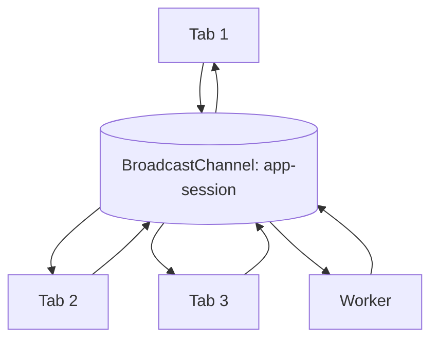
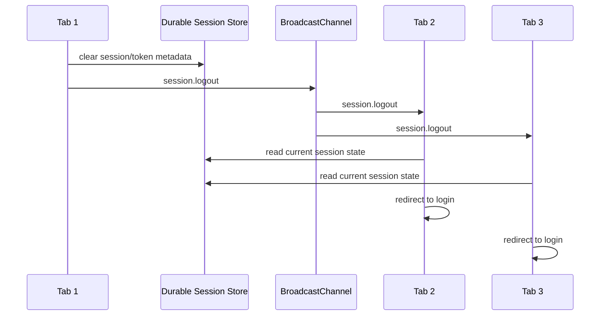
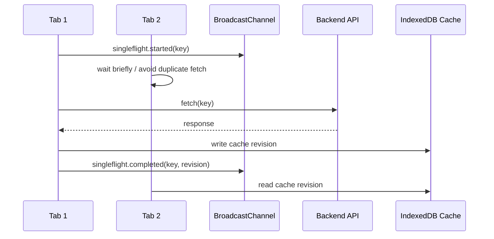
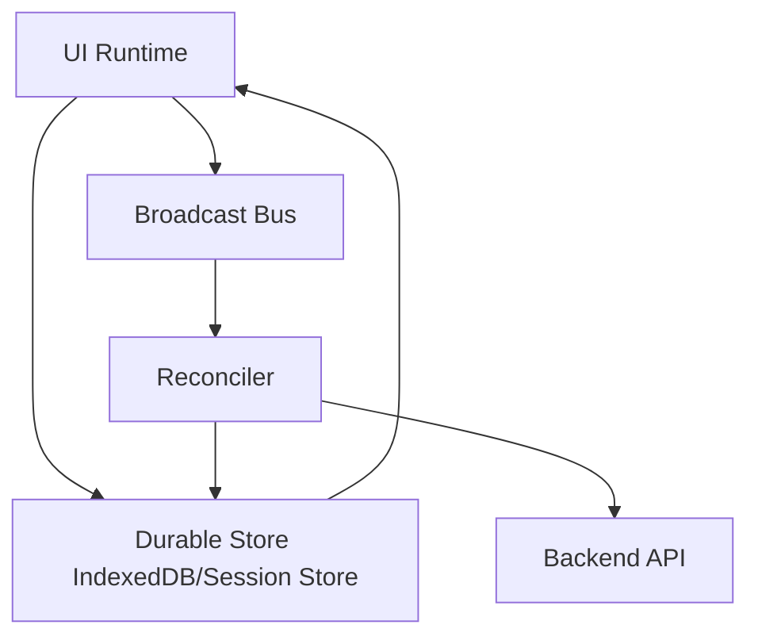

# Part 012 — BroadcastChannel as Same-Origin Message Bus

> Target part ini: memahami `BroadcastChannel` bukan sebagai trik kecil “sync antar tab”, tetapi sebagai same-origin pub/sub bus dengan batasan lifecycle, security, storage partition, delivery semantics, payload cost, dan failure model yang harus dikelola secara eksplisit.

`MessageChannel` adalah private pipe.

`BroadcastChannel` adalah ruangan pengumuman.

```txt
MessageChannel:
  A <---- private pipe ----> B

BroadcastChannel:
  A ----+
  B ----+---- same channel name ---- all listening contexts
  C ----+
```

Dalam aplikasi browser modern, `BroadcastChannel` sering dipakai untuk:

1. logout semua tab,
2. sinkronisasi session state,
3. invalidasi cache lokal,
4. leader heartbeat,
5. notifikasi bahwa IndexedDB berubah,
6. mencegah duplicate notification,
7. memberitahu tab lain bahwa background sync sedang berjalan,
8. menyebarkan config runtime ringan.

Tapi ada jebakan besar.

Broadcast bukan database. Broadcast bukan queue durable. Broadcast bukan security boundary. Broadcast bukan consensus protocol.

Ia hanya primitive pengiriman pesan ke context lain yang sedang mendengar channel yang sama, dalam boundary browser yang sesuai.

---

## 1. Mental Model: Same-Origin Pub/Sub, Not Global Truth

Basic usage:

```ts
const channel = new BroadcastChannel("app-session");

channel.postMessage({
  type: "logout",
  reason: "user-clicked-logout",
});

channel.onmessage = (event) => {
  console.log(event.data);
};
```

Context lain dengan channel name yang sama bisa menerima message.



Namun mental model yang benar:

```txt
BroadcastChannel is a volatile signal bus.
It tells interested peers that something happened.
It should not be the only source of durable truth.
```

Jika event penting, simpan state di tempat durable seperti IndexedDB/local server/session store, lalu broadcast hanya sebagai signal:

```txt
wrong:
  broadcast contains truth

better:
  durable store contains truth
  broadcast says: truth changed, go read it
```

---

## 2. Apa yang BroadcastChannel Bisa dan Tidak Bisa

| Capability | Support |
|---|---:|
| Same-origin / partition-compatible communication | Yes |
| Window/tab communication | Yes |
| Worker communication | Yes, pada environment yang support |
| Structured clone payload | Yes |
| Transferable object ownership | Tidak seperti `postMessage` transfer list umum; desainlah payload kecil |
| Durable message queue | No |
| Built-in ACK | No |
| Built-in retry | No |
| Built-in authentication | No |
| Backpressure | No |
| Exactly-once delivery | No |
| Secret isolation antar same-origin tab | No |

Jadi gunakan untuk **signals**, bukan guaranteed commands.

---

## 3. Storage Partitioning: Same-Origin Tidak Selalu Cukup

Banyak engineer mengira `BroadcastChannel` hanya bicara berdasarkan origin.

Realitas modern browser lebih rumit karena storage partitioning.

Dalam desain sistem, gunakan asumsi lebih aman:

```txt
BroadcastChannel reaches contexts that share the appropriate origin/storage partition boundary.
Do not assume every same-origin context in every embedding scenario can hear each other.
```

Contoh penting:

1. top-level app tab normal kemungkinan bisa saling bicara,
2. iframe third-party embedding bisa punya partition berbeda,
3. privacy feature browser bisa membatasi scope,
4. private browsing/profile berbeda tidak perlu dianggap connected,
5. cross-browser behavior harus diuji untuk produk yang embed-heavy.

Untuk app biasa dengan tab top-level same-origin, `BroadcastChannel` cocok. Untuk widget embedded lintas site, perlu desain bridge berbeda.

---

## 4. Channel Naming: Jangan Sembarangan

Buruk:

```ts
new BroadcastChannel("events");
```

Masalah:

1. terlalu generik,
2. collision antar modul,
3. sulit versioning,
4. tidak jelas environment,
5. tidak jelas tenant/user/session.

Lebih baik:

```ts
function createChannelName(input: {
  appId: string;
  environment: "dev" | "staging" | "prod";
  protocol: string;
  version: number;
}): string {
  return `${input.appId}:${input.environment}:${input.protocol}:v${input.version}`;
}

const channel = new BroadcastChannel(createChannelName({
  appId: "regulatory-case-platform",
  environment: "prod",
  protocol: "session-events",
  version: 1,
}));
```

Untuk multi-tenant app, hati-hati memasukkan tenant/user id ke channel name. Channel name bukan secret. Ia membantu segmentasi software, bukan keamanan absolut.

---

## 5. Message Envelope

Jangan broadcast object random.

```ts
type BroadcastEnvelope<TType extends string, TPayload> = {
  protocol: "com.acme.browser-bus";
  version: 1;
  messageId: string;
  type: TType;
  senderId: string;
  tabId: string;
  epoch: number;
  createdAtMs: number;
  payload: TPayload;
};
```

Kenapa perlu `senderId` dan `tabId`?

Karena:

1. kita ingin menghindari echo loop,
2. satu tab bisa punya beberapa channel instance,
3. observability butuh sumber message,
4. duplicate detection butuh id,
5. debugging multi-tab tanpa identity hampir mustahil.

Contoh:

```ts
type SessionLogout = BroadcastEnvelope<"session.logout", {
  reason: "user-action" | "server-revoked" | "token-expired";
}>;

type CacheInvalidated = BroadcastEnvelope<"cache.invalidated", {
  namespace: "case-list" | "case-detail" | "user-profile";
  key?: string;
}>;

type TabHeartbeat = BroadcastEnvelope<"tab.heartbeat", {
  visible: boolean;
  route: string;
}>;
```

---

## 6. Minimal Typed Broadcast Bus

```ts
type Handler<T> = (message: T) => void;

export class BrowserBroadcastBus<TMessage extends { type: string; messageId: string; senderId: string }> {
  private readonly channel: BroadcastChannel;
  private readonly handlers = new Map<string, Set<Handler<TMessage>>>();
  private readonly seen = new Set<string>();

  constructor(
    channelName: string,
    private readonly senderId: string,
    private readonly maxSeen = 1_000
  ) {
    this.channel = new BroadcastChannel(channelName);

    this.channel.addEventListener("message", (event) => {
      this.receive(event.data);
    });

    this.channel.addEventListener("messageerror", () => {
      console.error("BroadcastChannel messageerror", { channelName });
    });
  }

  publish(message: Omit<TMessage, "messageId" | "senderId">): void {
    const fullMessage = {
      ...message,
      messageId: crypto.randomUUID(),
      senderId: this.senderId,
    } as TMessage;

    this.remember(fullMessage.messageId);
    this.channel.postMessage(fullMessage);
  }

  subscribe(type: string, handler: Handler<TMessage>): () => void {
    let set = this.handlers.get(type);
    if (!set) {
      set = new Set();
      this.handlers.set(type, set);
    }

    set.add(handler);

    return () => {
      set?.delete(handler);
      if (set?.size === 0) this.handlers.delete(type);
    };
  }

  close(): void {
    this.handlers.clear();
    this.channel.close();
  }

  private receive(value: unknown): void {
    if (!isBusMessage(value)) return;

    const message = value as TMessage;

    if (message.senderId === this.senderId) {
      return;
    }

    if (this.seen.has(message.messageId)) {
      return;
    }

    this.remember(message.messageId);

    const handlers = this.handlers.get(message.type);
    if (!handlers) return;

    for (const handler of handlers) {
      handler(message);
    }
  }

  private remember(messageId: string): void {
    this.seen.add(messageId);

    if (this.seen.size <= this.maxSeen) return;

    const first = this.seen.values().next().value;
    if (first) this.seen.delete(first);
  }
}

function isBusMessage(value: unknown): value is {
  type: string;
  messageId: string;
  senderId: string;
} {
  if (!value || typeof value !== "object") return false;
  const record = value as Record<string, unknown>;
  return typeof record.type === "string" &&
    typeof record.messageId === "string" &&
    typeof record.senderId === "string";
}
```

Catatan penting:

1. dedupe set dibatasi agar tidak leak memory,
2. bus menutup channel di `close()`,
3. handler tidak boleh throw tanpa guard di production,
4. envelope harus divalidasi lebih ketat di sistem nyata,
5. message besar sebaiknya tidak lewat broadcast.

---

## 7. Logout Propagation

Use case klasik: user logout di satu tab, tab lain harus ikut keluar.

### 7.1 Flow



### 7.2 Implementation

```ts
type SessionBusMessage =
  | {
      type: "session.logout";
      messageId: string;
      senderId: string;
      reason: "user-action" | "server-revoked" | "token-expired";
      createdAtMs: number;
    }
  | {
      type: "session.changed";
      messageId: string;
      senderId: string;
      createdAtMs: number;
    };

const bus = new BrowserBroadcastBus<SessionBusMessage>(
  "case-platform:prod:session:v1",
  getOrCreateTabInstanceId()
);

function logout(reason: SessionBusMessage["reason"]): void {
  clearLocalSessionState();

  bus.publish({
    type: "session.logout",
    reason,
    createdAtMs: Date.now(),
  });

  redirectToLogin();
}

bus.subscribe("session.logout", (message) => {
  clearLocalSessionState();
  redirectToLogin({ reason: message.reason });
});
```

Key invariant:

```txt
Logout must not depend only on receiving broadcast.
```

Kenapa?

Karena tab mungkin dibuka setelah broadcast terjadi. Tab mungkin frozen. Browser mungkin discard tab. Jadi setiap tab pada resume/focus/load harus tetap membaca durable session state.

```ts
document.addEventListener("visibilitychange", () => {
  if (document.visibilityState === "visible") {
    validateSessionOnResume();
  }
});
```

Broadcast mempercepat propagation. Durable state menjaga kebenaran.

---

## 8. Cache Invalidation Pattern

Jangan broadcast seluruh data.

Buruk:

```ts
bus.publish({
  type: "case.updated",
  case: hugeCaseObject,
});
```

Lebih baik:

```ts
bus.publish({
  type: "cache.invalidated",
  namespace: "case-detail",
  key: caseId,
  revision,
  createdAtMs: Date.now(),
});
```

Receiver:

```ts
bus.subscribe("cache.invalidated", (message) => {
  if (message.namespace !== "case-detail") return;

  cache.markStale(message.key);

  if (isCurrentRouteCase(message.key)) {
    void refetchCase(message.key);
  }
});
```

Mental model:

```txt
Broadcast should carry invalidation metadata, not the source of truth.
```

Ini mirip distributed cache invalidation. Message mengatakan “data X mungkin berubah”. Receiver memutuskan apakah perlu refetch.

---

## 9. Presence and Tab Registry

`BroadcastChannel` bisa dipakai untuk presence ringan.

```ts
type PresenceMessage =
  | {
      type: "tab.hello";
      messageId: string;
      senderId: string;
      tabId: string;
      route: string;
      visible: boolean;
      createdAtMs: number;
    }
  | {
      type: "tab.heartbeat";
      messageId: string;
      senderId: string;
      tabId: string;
      route: string;
      visible: boolean;
      createdAtMs: number;
    }
  | {
      type: "tab.goodbye";
      messageId: string;
      senderId: string;
      tabId: string;
      createdAtMs: number;
    };
```

Registry:

```ts
type TabRecord = {
  tabId: string;
  route: string;
  visible: boolean;
  lastSeenAt: number;
};

class TabPresenceRegistry {
  private readonly tabs = new Map<string, TabRecord>();

  upsert(message: Extract<PresenceMessage, { type: "tab.hello" | "tab.heartbeat" }>): void {
    this.tabs.set(message.tabId, {
      tabId: message.tabId,
      route: message.route,
      visible: message.visible,
      lastSeenAt: Date.now(),
    });
  }

  remove(tabId: string): void {
    this.tabs.delete(tabId);
  }

  sweep(now = Date.now(), ttlMs = 30_000): void {
    for (const [tabId, record] of this.tabs) {
      if (now - record.lastSeenAt > ttlMs) {
        this.tabs.delete(tabId);
      }
    }
  }

  list(): TabRecord[] {
    return [...this.tabs.values()];
  }
}
```

Heartbeat publisher:

```ts
const tabId = getOrCreateTabInstanceId();

function publishHeartbeat(): void {
  bus.publish({
    type: "tab.heartbeat",
    tabId,
    route: location.pathname,
    visible: document.visibilityState === "visible",
    createdAtMs: Date.now(),
  });
}

const heartbeatTimer = setInterval(publishHeartbeat, 10_000);

window.addEventListener("pagehide", () => {
  bus.publish({
    type: "tab.goodbye",
    tabId,
    createdAtMs: Date.now(),
  });

  clearInterval(heartbeatTimer);
});
```

Important caveat:

```txt
Goodbye is best-effort. TTL sweep is mandatory.
```

Jangan pernah menganggap `pagehide`, `beforeunload`, atau cleanup handler selalu terkirim.

---

## 10. Leader Election: BroadcastChannel Saja Tidak Cukup

Banyak tutorial membuat leader election hanya dengan BroadcastChannel.

Masalahnya: broadcast tidak memberi mutual exclusion.

Dua tab bisa sama-sama mengira dirinya leader karena:

1. message delay,
2. tab frozen,
3. heartbeat timeout palsu,
4. page lifecycle throttling,
5. crash/recovery,
6. split brain.

Broadcast bisa membantu menyebarkan signal:

```ts
bus.publish({
  type: "leader.heartbeat",
  leaderId,
  epoch,
  createdAtMs: Date.now(),
});
```

Tapi untuk mutual exclusion yang lebih kuat di same-origin browser context, kita akan memakai Web Locks di part berikutnya.

Rule:

```txt
BroadcastChannel can announce leadership.
It should not be the only lock.
```

---

## 11. Single-Flight Request Signal

Use case: beberapa tab butuh data yang sama. Jangan semua tab fetch bersamaan.

Broadcast bisa menyebarkan “sedang fetch”.

```ts
type SingleFlightMessage =
  | {
      type: "singleflight.started";
      messageId: string;
      senderId: string;
      key: string;
      ownerTabId: string;
      createdAtMs: number;
    }
  | {
      type: "singleflight.completed";
      messageId: string;
      senderId: string;
      key: string;
      ownerTabId: string;
      revision: string;
      createdAtMs: number;
    }
  | {
      type: "singleflight.failed";
      messageId: string;
      senderId: string;
      key: string;
      ownerTabId: string;
      retryable: boolean;
      createdAtMs: number;
    };
```

Flow:



Namun ini masih advisory. Untuk strict dedupe, kombinasikan dengan Web Locks atau IndexedDB lease.

---

## 12. Request/Reply Over BroadcastChannel: Gunakan dengan Hati-Hati

Broadcast bisa dibuat request/reply.

Tapi ini sering menjadi design smell.

```txt
Broadcast request/reply means everyone hears every request.
```

Bisa dipakai untuk discovery:

```ts
type DiscoveryRequest = {
  type: "discovery.request";
  messageId: string;
  senderId: string;
  requestId: string;
};

type DiscoveryResponse = {
  type: "discovery.response";
  messageId: string;
  senderId: string;
  requestId: string;
  capabilities: string[];
};
```

Tetapi untuk komunikasi intensif, setelah discovery lebih baik buka private `MessageChannel` jika memungkinkan.

Pattern:

```txt
BroadcastChannel for discovery
MessageChannel for private session
Web Locks for mutual exclusion
IndexedDB/Cache/OPFS for durable state/artifacts
```

---

## 13. Security Model

BroadcastChannel adalah same-origin communication primitive. Tetapi same-origin bukan same-trust.

Jika ada script third-party yang berjalan di origin yang sama, atau XSS di salah satu tab, message bus bisa menjadi surface untuk:

1. membaca event sensitif,
2. trigger command palsu,
3. replay message,
4. flooding bus,
5. memalsukan senderId,
6. menyebabkan logout/redirect/cache invalidation palsu.

Rules:

1. jangan broadcast access token,
2. jangan broadcast refresh token,
3. jangan broadcast PII jika tidak perlu,
4. jangan anggap senderId authentic,
5. validate semua message shape,
6. treat broadcast as untrusted input,
7. command penting harus diverifikasi ke durable/server state,
8. gunakan Content Security Policy untuk mengurangi XSS risk.

Contoh buruk:

```ts
bus.publish({
  type: "token.refreshed",
  accessToken,
  refreshToken,
});
```

Lebih baik:

```ts
bus.publish({
  type: "session.changed",
  createdAtMs: Date.now(),
});
```

Receiver membaca state dari session manager yang punya kontrol lebih jelas.

---

## 14. Payload Strategy

Broadcast payload harus kecil.

Kenapa?

1. structured clone cost,
2. semua listener menerima salinan message,
3. tab tidak relevan tetap membayar biaya deserialization,
4. tidak ada backpressure,
5. message besar memperburuk memory pressure.

Rule:

```txt
Broadcast metadata and references, not bulk data.
```

Contoh:

```ts
bus.publish({
  type: "artifact.ready",
  artifactId,
  store: "indexeddb",
  revision,
});
```

Bukan:

```ts
bus.publish({
  type: "artifact.ready",
  hugeJsonDocument,
});
```

Jika data besar, gunakan:

1. IndexedDB untuk structured data,
2. Cache API untuk response/artifact,
3. OPFS untuk file-like binary,
4. `MessageChannel` + transferables untuk private one-way binary handoff,
5. `SharedArrayBuffer` untuk shared memory case khusus.

---

## 15. Close Channel Explicitly

Saat channel tidak dibutuhkan:

```ts
channel.close();
```

Untuk SPA, channel sering dibuat saat app boot dan hidup sampai app unload. Itu tidak masalah.

Tapi untuk feature-scoped channel, tutup saat scope selesai:

```ts
function mountFeature(): () => void {
  const channel = new BroadcastChannel("feature-x:v1");

  channel.addEventListener("message", onMessage);

  return () => {
    channel.removeEventListener("message", onMessage);
    channel.close();
  };
}
```

Jangan membuat channel baru setiap render/event tanpa cleanup.

---

## 16. Framework Adapter Tanpa Mengikat ke Framework

Core bus sebaiknya framework-agnostic.

```ts
export const sessionBus = new BrowserBroadcastBus<SessionBusMessage>(
  "case-platform:prod:session:v1",
  getOrCreateTabInstanceId()
);
```

Framework adapter hanya subscribe/unsubscribe.

```ts
export function attachSessionLogoutHandler(onLogout: (reason: string) => void): () => void {
  return sessionBus.subscribe("session.logout", (message) => {
    onLogout(message.reason);
  });
}
```

Dengan pemisahan ini:

1. core orchestration bisa dites tanpa UI framework,
2. React/Vue/Svelte hanya adapter,
3. worker/service worker integration tidak tercampur state rendering,
4. bug message protocol tidak menjadi bug component lifecycle.

---

## 17. Browser Lifecycle Caveat

BroadcastChannel tidak menghapus realitas page lifecycle.

Tab hidden bisa throttled. Page bisa frozen. Page bisa masuk bfcache. Page bisa discarded. Message yang terjadi saat tab tidak aktif tidak boleh diasumsikan selalu cukup untuk menjaga state.

Invariants:

```txt
On foreground/resume:
  re-read durable state.

On broadcast received:
  treat message as hint, not complete truth.

On startup:
  reconstruct local runtime from durable state, not past broadcasts.
```

Contoh:

```ts
async function reconcileOnResume(): Promise<void> {
  const session = await sessionStore.read();

  if (!session.valid) {
    redirectToLogin();
    return;
  }

  await cache.revalidateStaleEntries();
}

document.addEventListener("visibilitychange", () => {
  if (document.visibilityState === "visible") {
    void reconcileOnResume();
  }
});

window.addEventListener("pageshow", (event) => {
  if (event.persisted) {
    void reconcileOnResume();
  }
});
```

---

## 18. Message Ordering

Jangan membangun desain yang membutuhkan global total order dari semua tab.

Lebih aman gunakan:

1. per-entity revision,
2. monotonic local sequence per sender,
3. server-issued version,
4. timestamp hanya untuk observability atau TTL,
5. idempotency key,
6. conflict resolution eksplisit.

Contoh envelope dengan revision:

```ts
type EntityChanged = {
  type: "entity.changed";
  messageId: string;
  senderId: string;
  entityType: "case";
  entityId: string;
  revision: string;
  createdAtMs: number;
};
```

Receiver:

```ts
bus.subscribe("entity.changed", (message) => {
  const current = revisionStore.get(message.entityId);

  if (current && compareRevision(current, message.revision) >= 0) {
    return;
  }

  revisionStore.set(message.entityId, message.revision);
  markEntityStale(message.entityId);
});
```

Jangan pakai `Date.now()` untuk menyelesaikan konflik serius antar tab. Clock lokal bisa tidak reliable untuk ordering absolut.

---

## 19. Broadcast Flood Control

BroadcastChannel tidak memberi backpressure.

Kalau satu tab mengirim 1.000 message/detik, tab lain menerima flood.

Mitigation:

1. debounce update noisy,
2. coalesce invalidation,
3. rate limit per type,
4. drop stale message,
5. gunakan summary event,
6. jangan broadcast progress high-frequency.

Buruk:

```ts
for (const progress of progressEvents) {
  bus.publish({ type: "import.progress", progress });
}
```

Lebih baik:

```ts
const publishProgress = throttle((progress: number) => {
  bus.publish({
    type: "import.progress",
    progress,
    createdAtMs: Date.now(),
  });
}, 500);
```

Atau hanya broadcast state penting:

```ts
bus.publish({ type: "import.started", importId });
bus.publish({ type: "import.completed", importId, artifactId });
```

---

## 20. BroadcastChannel vs Alternatives

| Primitive | Best For | Weakness |
|---|---|---|
| BroadcastChannel | same-origin signal bus | no durability, no lock, no backpressure |
| MessageChannel | private point-to-point pipe | needs setup/port transfer |
| `worker.postMessage` | direct worker command | one endpoint can become crowded |
| `storage` event | legacy cross-tab signal | string-only storage semantics, no same-tab event behavior |
| Service Worker clients messaging | network/cache/update coordination | service worker lifecycle complexity |
| SharedWorker | shared hub across tabs | availability/deployment constraints |
| Web Locks | mutual exclusion | not a data bus |
| IndexedDB | durable local state | not notification by itself |

Decision rule:

```txt
Need to announce? BroadcastChannel.
Need to talk privately? MessageChannel.
Need to coordinate ownership? Web Locks.
Need durable truth? IndexedDB/server/cache.
Need network mediation? Service Worker.
```

---

## 21. Reference Architecture: Bus + Store + Reconciler



Responsibilities:

| Component | Responsibility |
|---|---|
| UI Runtime | publish user-driven signals, react to state |
| Broadcast Bus | low-latency cross-context notification |
| Durable Store | source of truth for local browser state |
| Reconciler | reads truth, validates, resolves stale state |
| Backend API | authoritative server-side truth |

This architecture avoids overloading BroadcastChannel.

Broadcast says:

```txt
something changed
```

Reconciler asks:

```txt
what is true now?
```

---

## 22. Production-Ready Bus Skeleton

```ts
type BusOptions = {
  channelName: string;
  senderId: string;
  protocol: string;
  version: number;
  maxSeenMessages?: number;
  onProtocolError?: (error: unknown) => void;
};

export class ProductionBroadcastBus<TPayloadByType extends Record<string, unknown>> {
  private readonly channel: BroadcastChannel;
  private readonly handlers = new Map<
    keyof TPayloadByType & string,
    Set<(payload: unknown, envelope: BusEnvelope) => void>
  >();
  private readonly seen = new Set<string>();
  private readonly maxSeenMessages: number;

  constructor(private readonly options: BusOptions) {
    this.channel = new BroadcastChannel(options.channelName);
    this.maxSeenMessages = options.maxSeenMessages ?? 2_000;

    this.channel.addEventListener("message", (event) => {
      this.handleIncoming(event.data);
    });

    this.channel.addEventListener("messageerror", (event) => {
      options.onProtocolError?.(event);
    });
  }

  publish<TType extends keyof TPayloadByType & string>(
    type: TType,
    payload: TPayloadByType[TType]
  ): void {
    const envelope: BusEnvelope<TType, TPayloadByType[TType]> = {
      protocol: this.options.protocol,
      version: this.options.version,
      messageId: crypto.randomUUID(),
      senderId: this.options.senderId,
      type,
      createdAtMs: Date.now(),
      payload,
    };

    this.remember(envelope.messageId);
    this.channel.postMessage(envelope);
  }

  subscribe<TType extends keyof TPayloadByType & string>(
    type: TType,
    handler: (payload: TPayloadByType[TType], envelope: BusEnvelope<TType, TPayloadByType[TType]>) => void
  ): () => void {
    let handlers = this.handlers.get(type);
    if (!handlers) {
      handlers = new Set();
      this.handlers.set(type, handlers);
    }

    handlers.add(handler as (payload: unknown, envelope: BusEnvelope) => void);

    return () => {
      handlers?.delete(handler as (payload: unknown, envelope: BusEnvelope) => void);
      if (handlers?.size === 0) this.handlers.delete(type);
    };
  }

  close(): void {
    this.handlers.clear();
    this.channel.close();
  }

  private handleIncoming(value: unknown): void {
    if (!isBusEnvelope(value)) {
      this.options.onProtocolError?.(new Error("Invalid bus envelope"));
      return;
    }

    if (value.protocol !== this.options.protocol) return;
    if (value.version !== this.options.version) return;
    if (value.senderId === this.options.senderId) return;
    if (this.seen.has(value.messageId)) return;

    this.remember(value.messageId);

    const handlers = this.handlers.get(value.type);
    if (!handlers) return;

    for (const handler of handlers) {
      try {
        handler(value.payload, value);
      } catch (error) {
        this.options.onProtocolError?.(error);
      }
    }
  }

  private remember(messageId: string): void {
    this.seen.add(messageId);
    if (this.seen.size <= this.maxSeenMessages) return;

    const first = this.seen.values().next().value;
    if (first) this.seen.delete(first);
  }
}

type BusEnvelope<TType extends string = string, TPayload = unknown> = {
  protocol: string;
  version: number;
  messageId: string;
  senderId: string;
  type: TType;
  createdAtMs: number;
  payload: TPayload;
};

function isBusEnvelope(value: unknown): value is BusEnvelope {
  if (!value || typeof value !== "object") return false;

  const record = value as Record<string, unknown>;

  return typeof record.protocol === "string" &&
    typeof record.version === "number" &&
    typeof record.messageId === "string" &&
    typeof record.senderId === "string" &&
    typeof record.type === "string" &&
    typeof record.createdAtMs === "number" &&
    "payload" in record;
}
```

---

## 23. Testing BroadcastChannel

Testing cross-tab behavior perlu dua level.

### 23.1 Unit test dengan fake bus

```ts
type Listener = (value: unknown) => void;

class FakeBroadcastChannel {
  private static channels = new Map<string, Set<FakeBroadcastChannel>>();
  private listeners = new Set<Listener>();

  constructor(private readonly name: string) {
    let peers = FakeBroadcastChannel.channels.get(name);
    if (!peers) {
      peers = new Set();
      FakeBroadcastChannel.channels.set(name, peers);
    }
    peers.add(this);
  }

  postMessage(value: unknown): void {
    const peers = FakeBroadcastChannel.channels.get(this.name);
    if (!peers) return;

    for (const peer of peers) {
      if (peer === this) continue;
      for (const listener of peer.listeners) {
        listener({ data: value });
      }
    }
  }

  addEventListener(type: "message", listener: Listener): void {
    if (type === "message") this.listeners.add(listener);
  }

  close(): void {
    FakeBroadcastChannel.channels.get(this.name)?.delete(this);
    this.listeners.clear();
  }
}
```

### 23.2 Browser integration test

Gunakan beberapa page/context di Playwright:

```ts
test("logout propagates across tabs", async ({ browser }) => {
  const context = await browser.newContext();
  const tab1 = await context.newPage();
  const tab2 = await context.newPage();

  await tab1.goto("/app");
  await tab2.goto("/app");

  await tab1.getByRole("button", { name: "Logout" }).click();

  await expect(tab2).toHaveURL(/\/login/);
});
```

Test cases:

1. message diterima tab lain,
2. sender tidak memproses echo sendiri,
3. invalid message diabaikan,
4. duplicate message tidak diproses dua kali,
5. logout tetap benar jika tab dibuka setelah broadcast,
6. resume dari bfcache melakukan reconcile,
7. hidden tab tidak menjadi satu-satunya source of truth,
8. channel close menghentikan listener.

---

## 24. Observability

Minimal metric:

```ts
type BroadcastMetrics = {
  channelName: string;
  sent: number;
  received: number;
  droppedSelf: number;
  droppedDuplicate: number;
  droppedInvalidProtocol: number;
  handlerErrors: number;
  messageErrors: number;
};
```

Log contoh:

```ts
logger.debug("broadcast.received", {
  channelName,
  type: envelope.type,
  messageId: envelope.messageId,
  senderId: envelope.senderId,
  ageMs: Date.now() - envelope.createdAtMs,
});
```

Jangan log payload sensitif.

Untuk issue multi-tab, metadata yang paling penting biasanya:

1. tab id,
2. sender id,
3. message id,
4. channel name,
5. protocol version,
6. visibility state,
7. lifecycle state,
8. app build version.

---

## 25. Failure Model

| Failure | Symptom | Mitigation |
|---|---|---|
| Tab tidak mendengar saat event terjadi | stale state | reconcile on resume/startup |
| Message duplicate | side effect dobel | message id + idempotency |
| Message besar | jank/memory spike | metadata only, store ref |
| Sender palsu | invalid command | validate + verify durable/server state |
| Flood | tab lain lambat | rate limit/coalesce |
| Version skew | handler salah parse | protocol/version envelope |
| Channel tidak ditutup | resource leak | explicit `close()` |
| Storage partition mismatch | message tidak sampai | fallback/bridge depending deployment |
| Broadcast dipakai sebagai lock | split brain | Web Locks/lease |
| Broadcast dipakai sebagai database | missing truth | durable store as source of truth |

---

## 26. Production Checklist

Sebelum menggunakan BroadcastChannel:

1. Apa channel name dan version-nya?
2. Apa message envelope formal?
3. Apakah payload kecil?
4. Apakah message membawa secret? Jika ya, desain ulang.
5. Apakah event ini signal atau source of truth?
6. Di mana durable truth disimpan?
7. Apa yang terjadi jika tab tidak menerima message?
8. Apakah receiver reconcile saat startup/resume?
9. Apakah duplicate message aman?
10. Apakah senderId hanya untuk debugging atau dipercaya? Jangan dipercaya.
11. Apakah message type divalidasi runtime?
12. Apakah ada rate limit/coalescing untuk noisy event?
13. Apakah channel ditutup saat scope selesai?
14. Apakah multi-version tab didukung?
15. Apakah embed/iframe/storage partition scenario relevan?

---

## 27. Inti Mental Model

`BroadcastChannel` memberi kita bus cepat untuk same-origin browser contexts.

Tetapi bus ini volatile.

```txt
BroadcastChannel is excellent for notification.
BroadcastChannel is dangerous as truth.
```

Desain production biasanya memisahkan:

```txt
BroadcastChannel = signal
IndexedDB/Cache/Session Store = local truth
Backend = authoritative truth
Web Locks/Lease = ownership
MessageChannel = private session
```

Saat separation ini jelas, multi-tab orchestration menjadi sistem yang bisa dipikirkan, dites, dan direcover.

Saat separation ini kabur, kita mendapat bug aneh:

1. tab logout sebagian,
2. cache stale sebagian,
3. duplicate refresh token request,
4. notification muncul berkali-kali,
5. leader election split brain,
6. message hilang saat tab sleep,
7. issue hanya muncul setelah deploy saat tab lama masih terbuka.

BroadcastChannel bukan solusi semua masalah. Ia adalah satu primitive yang kuat jika ditempatkan di boundary yang benar.

---

## 28. What Comes Next

Part berikutnya membahas `storage` event sebagai legacy cross-tab signaling.

Kita tidak akan mempromosikannya sebagai pilihan utama untuk app modern, tetapi perlu memahaminya karena:

1. banyak codebase lama masih memakainya,
2. ia berguna sebagai fallback terbatas,
3. ia punya semantics yang berbeda dari BroadcastChannel,
4. ia sering dipakai untuk logout propagation,
5. ia mengajarkan perbedaan antara storage mutation dan messaging.

Setelah itu kita akan masuk ke service worker client messaging.

---

## References

- MDN — Broadcast Channel API
- MDN — `BroadcastChannel.message` event
- MDN — `BroadcastChannel.messageerror` event
- MDN — `BroadcastChannel.close()`
- MDN — Structured clone algorithm
- MDN — Page Visibility API
- Chrome Developers — Page Lifecycle API
