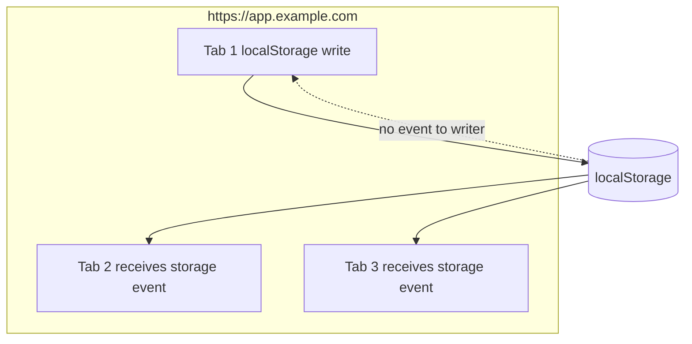
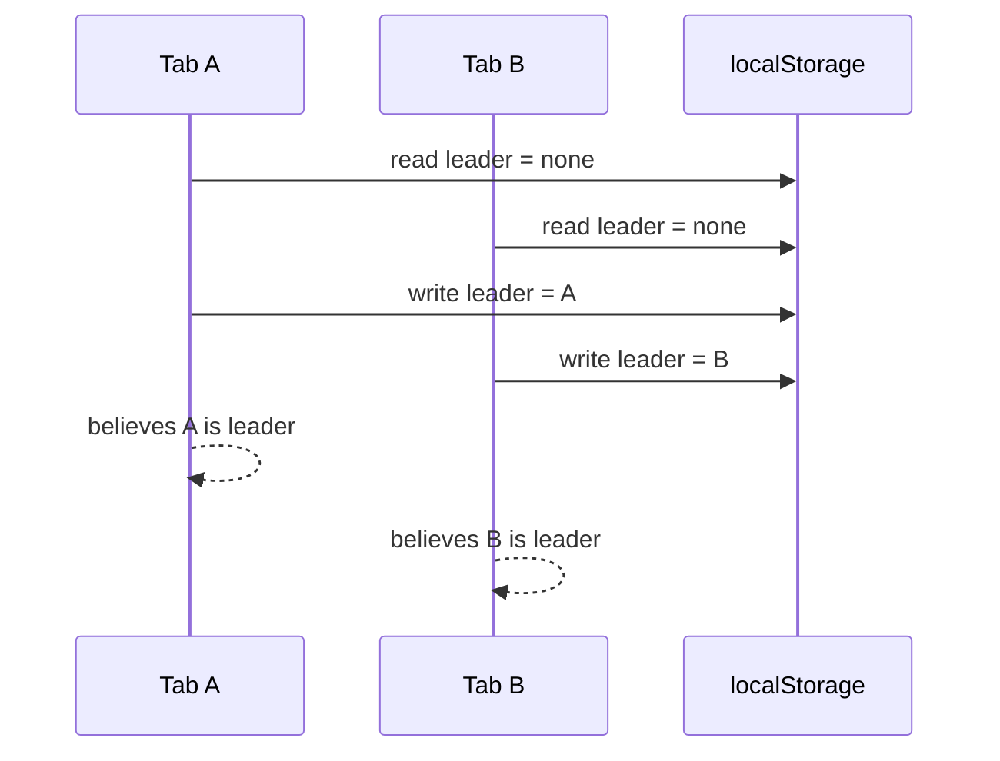
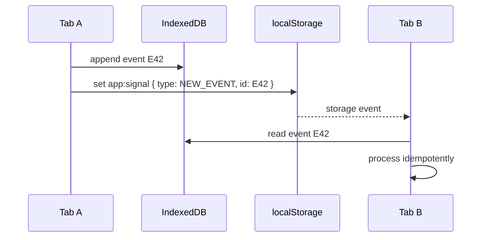

# Part 013 — Storage Event as Legacy Cross-Tab Signaling

> Target part ini: memahami `storage` event sebagai primitive komunikasi lintas tab yang historis, berguna sebagai fallback, tetapi berbahaya jika diperlakukan seperti message bus modern atau durable queue.

Kita sudah membahas `BroadcastChannel` sebagai same-origin volatile bus.

Sekarang kita bahas primitive yang lebih tua: **Web Storage event**.

Banyak aplikasi lama melakukan ini:

```ts
localStorage.setItem("logout", String(Date.now()));

window.addEventListener("storage", (event) => {
  if (event.key === "logout") {
    logoutCurrentTab();
  }
});
```

Pattern ini populer karena sederhana dan dulu lebih luas didukung dibanding `BroadcastChannel`.

Tapi simplicity-nya menipu.

`storage` event bukan queue. Bukan broadcast bus yang rapi. Bukan transport yang bagus untuk payload besar. Bukan mekanisme locking. Bukan durable event log.

Ia adalah **side effect notification** dari perubahan Web Storage.

Mental model yang benar:

```txt
Tab A writes localStorage
  ↓
Browser mutates origin storage area
  ↓
Other eligible documents receive a storage event
  ↓
Those documents may inspect key/oldValue/newValue/url/storageArea
```

Yang penting: tab yang melakukan write **tidak menerima** event-nya sendiri.

---

## 1. API Surface

Event listener:

```ts
window.addEventListener("storage", (event: StorageEvent) => {
  console.log({
    key: event.key,
    oldValue: event.oldValue,
    newValue: event.newValue,
    url: event.url,
    storageArea: event.storageArea,
  });
});
```

Write:

```ts
localStorage.setItem("app:signal", JSON.stringify({
  type: "SESSION_LOGOUT",
  at: Date.now(),
  id: crypto.randomUUID(),
}));
```

Remove:

```ts
localStorage.removeItem("app:signal");
```

Clear:

```ts
localStorage.clear();
```

Semantics penting:

| Operation | `event.key` | `oldValue` | `newValue` |
|---|---|---|---|
| `setItem(newKey, value)` | key | `null` | new value |
| `setItem(existingKey, value)` | key | old value | new value |
| `removeItem(key)` | key | old value | `null` |
| `clear()` | `null` | `null` | `null` |

---

## 2. `localStorage` vs `sessionStorage`

`storage` event punya behavior berbeda tergantung storage area.

| Storage | Cross-tab? | Scope utama | Usefulness untuk orchestration |
|---|---:|---|---|
| `localStorage` | Ya, untuk same-origin browsing context lain | Origin | Bisa dipakai sebagai legacy cross-tab signal |
| `sessionStorage` | Tidak untuk tab berbeda | Top-level browsing context | Hampir tidak cocok untuk cross-tab orchestration |

Dalam praktik orchestration lintas tab, yang biasanya dipakai adalah `localStorage`, bukan `sessionStorage`.

Kenapa?

Karena `sessionStorage` terikat ke top-level browsing context. Ia lebih cocok untuk state ephemeral per tab, bukan sinyal antar tab.



---

## 3. Why This API Exists

Web Storage awalnya bukan dibuat sebagai message bus.

Ia dibuat sebagai key-value storage sederhana untuk browser.

`storage` event ditambahkan agar dokumen lain bisa tahu bahwa area storage berubah.

Artinya, event-nya adalah **notification about mutation**, bukan message transport murni.

Perbedaan ini penting.

Dengan `BroadcastChannel`:

```ts
channel.postMessage(message);
```

Intent-nya jelas: kirim pesan.

Dengan `storage` event:

```ts
localStorage.setItem(key, serializedMessage);
```

Kita memaksa storage mutation menjadi message.

Ini ada konsekuensi:

1. payload harus string,
2. write bersifat synchronous,
3. data tertinggal di storage kecuali dibersihkan,
4. event tidak diterima sender,
5. storage quota bisa gagal,
6. semua script same-origin yang punya akses localStorage bisa membaca isi signal,
7. mekanisme ini mudah bocor ke persistence layer.

---

## 4. When to Use Storage Event

Gunakan `storage` event hanya untuk kasus seperti ini:

| Use case | Cocok? | Catatan |
|---|---:|---|
| Logout all tabs | Ya | Payload kecil, idempotent |
| Session changed notification | Ya | Signal saja, state authoritative di tempat lain |
| Cache invalidation hint | Ya | Jangan broadcast data besar |
| Feature flag reload signal | Ya | Ambil ulang config dari source lain |
| Presence heartbeat | Terbatas | Bisa, tapi noisy dan synchronous |
| Leader election | Tidak ideal | Gunakan Web Locks jika tersedia |
| Large data replication | Tidak | Gunakan IndexedDB/worker/channel |
| Durable queue | Tidak | Gunakan IndexedDB event log |
| Secure secret exchange | Tidak | Jangan tulis secret ke localStorage |

Rule praktis:

> Storage event boleh dipakai sebagai **fallback signal plane**, bukan sebagai **state plane**.

---

## 5. Message Envelope

Jangan menulis string bebas seperti ini:

```ts
localStorage.setItem("logout", "true");
```

Itu terlalu miskin konteks.

Gunakan envelope.

```ts
type StorageSignal = {
  protocol: "app.storage-signal.v1";
  id: string;
  type: string;
  sourceTabId: string;
  createdAt: number;
  expiresAt: number;
  payload?: unknown;
};
```

Contoh:

```ts
const signal: StorageSignal = {
  protocol: "app.storage-signal.v1",
  id: crypto.randomUUID(),
  type: "AUTH_LOGOUT",
  sourceTabId: currentTabId,
  createdAt: Date.now(),
  expiresAt: Date.now() + 30_000,
  payload: {
    reason: "user-requested",
  },
};

localStorage.setItem("app:signal", JSON.stringify(signal));
```

Receiver:

```ts
window.addEventListener("storage", (event) => {
  if (event.key !== "app:signal") return;
  if (!event.newValue) return;

  const signal = parseStorageSignal(event.newValue);
  if (!signal) return;
  if (signal.sourceTabId === currentTabId) return;
  if (signal.expiresAt <= Date.now()) return;

  handleSignal(signal);
});
```

---

## 6. Why `id` Matters

A receiver may observe the same effective signal more than once because:

1. app code may retry writes,
2. user may restore tab from bfcache-like lifecycle,
3. app may re-read last signal from storage during boot,
4. browser behavior around restore/reload can surface stale persisted values,
5. multiple tabs may emit equivalent signals.

Karena itu handler harus idempotent.

```ts
const seen = new Set<string>();

function handleStorageSignal(signal: StorageSignal) {
  if (seen.has(signal.id)) return;
  seen.add(signal.id);

  switch (signal.type) {
    case "AUTH_LOGOUT":
      forceLogoutOnce(signal);
      break;
    case "CACHE_INVALIDATED":
      invalidateCacheOnce(signal);
      break;
  }
}
```

Tapi `Set` in-memory hilang saat reload.

Untuk sinyal sangat penting, simpan processed-id kecil di IndexedDB atau gunakan monotonic version.

---

## 7. Expiry Is Mandatory

Karena `localStorage` persistent, sinyal bisa tertinggal.

Tanpa expiry, tab yang dibuka esok hari bisa membaca sinyal lama dan melakukan aksi salah.

Bad:

```ts
localStorage.setItem("app:logout", "true");
```

Better:

```ts
localStorage.setItem("app:signal", JSON.stringify({
  protocol: "app.storage-signal.v1",
  id: crypto.randomUUID(),
  type: "AUTH_LOGOUT",
  sourceTabId: currentTabId,
  createdAt: Date.now(),
  expiresAt: Date.now() + 30_000,
}));
```

Receiver:

```ts
if (signal.expiresAt < Date.now()) {
  return;
}
```

Cleanup:

```ts
setTimeout(() => {
  const raw = localStorage.getItem("app:signal");
  if (!raw) return;

  const signal = parseStorageSignal(raw);
  if (signal?.id === emittedSignal.id) {
    localStorage.removeItem("app:signal");
  }
}, 5_000);
```

Namun cleanup tidak boleh menjadi correctness requirement.

Tab bisa ditutup sebelum cleanup berjalan.

Expiry adalah correctness mechanism. Cleanup hanya hygiene.

---

## 8. Synchronous Write Cost

`localStorage` API bersifat synchronous.

Artinya write/read dapat memblokir main thread.

Ini berbeda dari IndexedDB yang async.

Jangan lakukan ini:

```ts
for (const item of hugeList) {
  localStorage.setItem(`app:item:${item.id}`, JSON.stringify(item));
}
```

Untuk signaling, payload harus kecil.

Budget kasar:

```txt
Good signal payload: < 2 KB
Suspicious: 2 KB - 20 KB
Bad: > 20 KB
Very bad: hundreds of KB / MB
```

Kalau payload besar, simpan payload di IndexedDB lalu kirim pointer:

```ts
localStorage.setItem("app:signal", JSON.stringify({
  protocol: "app.storage-signal.v1",
  id: crypto.randomUUID(),
  type: "DATASET_READY",
  sourceTabId: currentTabId,
  createdAt: Date.now(),
  expiresAt: Date.now() + 60_000,
  payload: {
    store: "indexeddb://app-cache/datasets/price-index-v42",
  },
}));
```

Pattern ini sama seperti messaging di sistem terdistribusi:

> message membawa metadata dan pointer, bukan seluruh data besar.

---

## 9. A Small Production Wrapper

Kita butuh abstraction tipis.

Tujuannya bukan menyembunyikan browser API sepenuhnya, tapi memaksa discipline:

1. protocol version,
2. source tab id,
3. idempotency id,
4. expiry,
5. schema validation,
6. error handling,
7. self-delivery optional.

```ts
type SignalHandler = (signal: StorageSignal) => void;

type StorageSignalBusOptions = {
  key: string;
  tabId: string;
  ttlMs: number;
  selfDeliver?: boolean;
};

export class StorageSignalBus {
  private handlers = new Set<SignalHandler>();
  private seen = new Set<string>();
  private readonly onStorage = (event: StorageEvent) => {
    if (event.key !== this.options.key) return;
    if (!event.newValue) return;

    const signal = parseStorageSignal(event.newValue);
    if (!signal) return;

    this.deliver(signal);
  };

  constructor(private readonly options: StorageSignalBusOptions) {}

  start() {
    window.addEventListener("storage", this.onStorage);
  }

  stop() {
    window.removeEventListener("storage", this.onStorage);
    this.handlers.clear();
  }

  subscribe(handler: SignalHandler) {
    this.handlers.add(handler);
    return () => this.handlers.delete(handler);
  }

  publish(type: string, payload?: unknown) {
    const now = Date.now();
    const signal: StorageSignal = {
      protocol: "app.storage-signal.v1",
      id: crypto.randomUUID(),
      type,
      sourceTabId: this.options.tabId,
      createdAt: now,
      expiresAt: now + this.options.ttlMs,
      payload,
    };

    const serialized = JSON.stringify(signal);
    localStorage.setItem(this.options.key, serialized);

    // The browser will not fire a storage event in the same tab that performed
    // the write. Self-delivery is an app-level policy.
    if (this.options.selfDeliver) {
      this.deliver(signal);
    }

    return signal.id;
  }

  private deliver(signal: StorageSignal) {
    if (signal.protocol !== "app.storage-signal.v1") return;
    if (signal.sourceTabId === this.options.tabId && !this.options.selfDeliver) return;
    if (signal.expiresAt <= Date.now()) return;
    if (this.seen.has(signal.id)) return;

    this.seen.add(signal.id);

    for (const handler of this.handlers) {
      try {
        handler(signal);
      } catch (error) {
        console.error("storage signal handler failed", { signal, error });
      }
    }
  }
}

function parseStorageSignal(raw: string): StorageSignal | null {
  try {
    const value = JSON.parse(raw) as Partial<StorageSignal>;

    if (value.protocol !== "app.storage-signal.v1") return null;
    if (typeof value.id !== "string") return null;
    if (typeof value.type !== "string") return null;
    if (typeof value.sourceTabId !== "string") return null;
    if (typeof value.createdAt !== "number") return null;
    if (typeof value.expiresAt !== "number") return null;

    return value as StorageSignal;
  } catch {
    return null;
  }
}
```

Usage:

```ts
const bus = new StorageSignalBus({
  key: "app:signal",
  tabId: getOrCreateTabId(),
  ttlMs: 30_000,
  selfDeliver: true,
});

bus.start();

bus.subscribe((signal) => {
  if (signal.type === "AUTH_LOGOUT") {
    forceLogout();
  }
});

bus.publish("AUTH_LOGOUT", { reason: "user-clicked" });
```

---

## 10. Self-Delivery Policy

Karena sender tidak menerima `storage` event sendiri, ada dua pilihan.

### Option A — Explicit local action

```ts
function logoutEverywhere() {
  bus.publish("AUTH_LOGOUT", { reason: "user-clicked" });
  forceLogout();
}
```

### Option B — Bus self-delivery

```ts
bus.publish("AUTH_LOGOUT", { reason: "user-clicked" });
```

Wrapper langsung memanggil handler lokal.

Mana yang lebih baik?

| Approach | Kelebihan | Kekurangan |
|---|---|---|
| Explicit local action | Jelas, mudah debug | Bisa lupa dipanggil |
| Self-delivery bus | Uniform handler path | Perlu guard agar tidak double-handle |

Untuk sistem yang lebih besar, self-delivery sering lebih konsisten karena semua event melewati satu handler path.

Tapi pastikan idempotency kuat.

---

## 11. Common Use Case: Logout Propagation

Logout adalah use case terbaik untuk storage event.

Kenapa?

1. payload kecil,
2. operation idempotent,
3. tidak butuh ordering kompleks,
4. receiver bisa recover dengan membaca auth state authoritative,
5. risiko duplicate rendah jika handler benar.

```ts
bus.subscribe((signal) => {
  if (signal.type !== "AUTH_LOGOUT") return;

  authStore.clearVolatileCredentials();
  queryClient.clear();
  router.navigate("/login", { replace: true });
});
```

Publisher:

```ts
async function logout() {
  await api.post("/logout").catch(() => {
    // Logout local tetap harus terjadi.
  });

  authStore.clearVolatileCredentials();
  bus.publish("AUTH_LOGOUT", { reason: "manual" });
  router.navigate("/login", { replace: true });
}
```

Security note:

Jangan menaruh token di payload.

```ts
// Bad
bus.publish("AUTH_LOGOUT", {
  accessToken: token,
});
```

Sinyal cukup menyatakan event.

State sensitive harus dikelola melalui memory, secure cookie, server session, atau storage yang risk-nya dipahami.

---

## 12. Common Use Case: Cache Invalidation Hint

Misal tab A mengubah profile user.

Tab B harus tahu bahwa cache profile-nya stale.

```ts
bus.publish("CACHE_INVALIDATED", {
  resource: "user-profile",
  userId,
  version: newProfileVersion,
});
```

Receiver:

```ts
bus.subscribe((signal) => {
  if (signal.type !== "CACHE_INVALIDATED") return;

  const payload = signal.payload as {
    resource: string;
    userId: string;
    version: number;
  };

  if (payload.resource === "user-profile") {
    queryClient.invalidateQueries({ queryKey: ["user-profile", payload.userId] });
  }
});
```

Ingat: signal bukan data source.

Receiver tetap mengambil ulang data dari cache authoritative/server/IndexedDB.

---

## 13. Common Use Case: Feature Flag Reload

```ts
bus.publish("FEATURE_FLAGS_CHANGED", {
  version: "2026-07-08T10:00:00Z",
});
```

Receiver:

```ts
bus.subscribe((signal) => {
  if (signal.type !== "FEATURE_FLAGS_CHANGED") return;

  featureFlagClient.reload();
});
```

Jangan broadcast seluruh config besar.

Cukup broadcast version.

---

## 14. Do Not Use It for Leader Election Unless Forced

Kita bisa membuat leader election kasar dengan `localStorage`:

```ts
localStorage.setItem("app:leader", JSON.stringify({
  tabId,
  leaseUntil: Date.now() + 10_000,
}));
```

Tapi ini penuh race.

Masalahnya:

1. read-modify-write tidak atomic,
2. clock antar tab tidak dijamin presisi sebagai consensus clock,
3. frozen tab bisa kehilangan lease tapi masih merasa leader,
4. write conflict tidak punya fencing token bawaan,
5. storage write synchronous tapi bukan distributed lock.

Jika browser mendukung Web Locks, gunakan Web Locks untuk mutual exclusion/leadership.

Storage event hanya bisa menjadi fallback degraded mode, bukan pilihan utama.

---

## 15. Race Example: Lost Ownership



Karena tidak ada compare-and-swap, kedua tab bisa mengambil keputusan berdasarkan observasi stale.

Mitigasi partial:

1. gunakan lease pendek,
2. gunakan fencing token monotonic dari storage/IndexedDB,
3. validasi sebelum side effect,
4. side effect server-side harus idempotent,
5. prefer Web Locks.

Tapi ini tetap lebih buruk daripada primitive lock yang memang dirancang untuk koordinasi.

---

## 16. Storage Quota and Failure Handling

`localStorage.setItem()` bisa throw.

Misalnya quota exceeded, storage disabled, private mode behavior, atau policy browser.

Jangan asumsikan write selalu berhasil.

```ts
function safePublish(signal: StorageSignal): boolean {
  try {
    localStorage.setItem("app:signal", JSON.stringify(signal));
    return true;
  } catch (error) {
    console.warn("failed to publish storage signal", { error });
    return false;
  }
}
```

Jika signal penting, fallback ke transport lain:

```ts
function publishCrossTab(signal: StorageSignal) {
  if (broadcastChannelAvailable()) {
    broadcastChannel.postMessage(signal);
    return;
  }

  if (safePublish(signal)) {
    return;
  }

  // Last resort: no cross-tab propagation.
  // Current tab still handles local action.
  handleLocally(signal);
}
```

Failure policy harus eksplisit.

Contoh:

| Signal | Jika publish gagal |
|---|---|
| Logout | Logout current tab; other tabs recover via server/session check |
| Cache invalidation | Receiver stale sampai focus/refetch/reload |
| Feature flags | Receiver stale sampai polling/reload |
| Leader election | Jangan pakai storage fallback untuk critical side effect |

---

## 17. Security Model

`localStorage` readable oleh JavaScript same-origin.

Karena itu:

1. jangan tulis access token,
2. jangan tulis refresh token,
3. jangan tulis PII sensitif sebagai signal payload,
4. jangan percaya signal hanya karena datang dari same-origin,
5. validasi protocol, type, expiry, dan payload,
6. treat signal as untrusted input.

Kenapa same-origin tidak cukup?

Karena jika ada XSS di origin yang sama, attacker bisa membaca dan menulis localStorage.

Storage signal harus dianggap seperti input dari network internal yang tidak sepenuhnya trusted.

```ts
bus.subscribe((signal) => {
  if (!isAllowedSignal(signal)) return;
  if (!validatePayload(signal.type, signal.payload)) return;

  dispatch(signal);
});
```

---

## 18. Versioning

Signal lama dan baru bisa coexist saat deploy rolling.

Tab A berjalan bundle lama.

Tab B berjalan bundle baru.

Keduanya same-origin, sama-sama membuka channel storage.

Envelope harus versioned.

```ts
type StorageSignalV1 = {
  protocol: "app.storage-signal.v1";
  id: string;
  type: string;
  sourceTabId: string;
  createdAt: number;
  expiresAt: number;
  payload?: unknown;
};

type StorageSignalV2 = {
  protocol: "app.storage-signal.v2";
  messageId: string;
  kind: string;
  source: {
    tabId: string;
    appVersion: string;
  };
  time: {
    createdAt: number;
    expiresAt: number;
  };
  data?: unknown;
};
```

Receiver bisa support dua versi sementara.

```ts
function parseAnySignal(raw: string): StorageSignalV1 | StorageSignalV2 | null {
  const value = JSON.parse(raw);

  if (value.protocol === "app.storage-signal.v1") return parseV1(value);
  if (value.protocol === "app.storage-signal.v2") return parseV2(value);

  return null;
}
```

Rule:

> Jangan deploy protocol change yang memutus tab lama secara diam-diam.

---

## 19. Key Strategy

Ada dua strategi key.

### Single key

```txt
app:signal
```

Setiap publish overwrite key yang sama.

Kelebihan:

1. sederhana,
2. cleanup mudah,
3. storage tidak membengkak.

Kekurangan:

1. concurrent signal bisa overwrite,
2. receiver hanya mendapat event, tapi persisted last value hanya satu.

### Per-message key

```txt
app:signal:01HX...
app:signal:01HY...
```

Kelebihan:

1. lebih mudah replay short-lived,
2. mengurangi overwrite.

Kekurangan:

1. butuh cleanup,
2. storage bisa penuh,
3. banyak event lebih noisy.

Rekomendasi:

| Need | Strategy |
|---|---|
| Logout/cache invalidation simple | Single key |
| Short replay on boot | Per-message key dengan TTL cleanup |
| Durable queue | Jangan pakai localStorage; gunakan IndexedDB |

---

## 20. Boot-Time Catch-Up

Masalah: tab baru dibuka setelah signal dikirim.

Apakah ia harus memproses signal terakhir?

Untuk logout, mungkin ya jika session state authoritative menyatakan logged out.

Tapi jangan hanya mengandalkan signal lama.

Boot logic yang benar:

```ts
async function bootstrapAuth() {
  const session = await authClient.getCurrentSession();

  if (!session.valid) {
    forceLogout();
    return;
  }

  startCrossTabBus();
}
```

Signal hanya mempercepat propagation.

Authoritative check tetap dibutuhkan.

---

## 21. Storage Event vs BroadcastChannel

| Dimension | `storage` event | `BroadcastChannel` |
|---|---|---|
| Purpose | Notify storage mutation | Broadcast message |
| Payload | String via storage value | Structured clone |
| Sender receives own message | No | No, generally channel posts to other BroadcastChannel objects, not itself |
| Persistence side effect | Yes | No |
| Main thread cost | Synchronous storage write | Async event delivery, clone cost tetap ada |
| Cleanup needed | Often | Channel close only |
| Large payload | Bad | Still not ideal, but better with clone/transfer alternatives unavailable for BroadcastChannel |
| Legacy fallback | Good | Better modern primitive |
| Durable queue | No | No |

Decision:

```txt
Need modern same-origin signal?
  Use BroadcastChannel.

Need fallback for older environments?
  Use storage event with strict envelope.

Need durable cross-tab state?
  Use IndexedDB + signal.

Need mutual exclusion?
  Use Web Locks.
```

---

## 22. Combining IndexedDB and Storage Event

Robust pattern:

1. write real event to IndexedDB,
2. emit storage signal containing event id/version,
3. receiver reads event from IndexedDB,
4. receiver marks processed.



This separates planes:

| Plane | Technology | Responsibility |
|---|---|---|
| Durable state | IndexedDB | Store event/data |
| Signal | storage event | Wake up other tabs |
| Processing | App runtime | Idempotent handling |

This is much better than stuffing full data into localStorage.

---

## 23. Testing Storage Event

Testing cross-tab behavior needs real browser contexts.

Unit tests can validate parser and handler.

```ts
describe("parseStorageSignal", () => {
  it("rejects invalid json", () => {
    expect(parseStorageSignal("not-json")).toBeNull();
  });

  it("rejects expired signal", () => {
    // parser accepts shape; delivery layer rejects expiry
  });
});
```

Integration test with Playwright:

```ts
import { test, expect } from "@playwright/test";

test("logout propagates to another tab", async ({ context }) => {
  const page1 = await context.newPage();
  const page2 = await context.newPage();

  await page1.goto("/app");
  await page2.goto("/app");

  await page1.getByRole("button", { name: "Logout" }).click();

  await expect(page2).toHaveURL(/\/login/);
});
```

Chaos cases:

1. write malformed JSON,
2. write expired signal,
3. write duplicate signal id,
4. rapidly publish 100 signals,
5. fill storage until quota failure,
6. reload one tab during signal propagation,
7. close sender immediately after write,
8. clear storage while receiver is active.

---

## 24. Observability

Log minimal metadata, not payload secrets.

```ts
logger.info("storage_signal_received", {
  id: signal.id,
  type: signal.type,
  sourceTabId: signal.sourceTabId,
  ageMs: Date.now() - signal.createdAt,
  expired: signal.expiresAt <= Date.now(),
});
```

Metrics worth tracking:

| Metric | Meaning |
|---|---|
| `storage_signal_publish_total` | Number of attempted publishes |
| `storage_signal_publish_failed_total` | Quota/security/storage failures |
| `storage_signal_received_total` | Received events |
| `storage_signal_invalid_total` | Parse/schema failures |
| `storage_signal_expired_total` | Stale signals ignored |
| `storage_signal_duplicate_total` | Duplicate id ignored |
| `storage_signal_handler_failed_total` | Handler exceptions |

These metrics reveal whether the bus is becoming overloaded or abused.

---

## 25. Anti-Patterns

### Anti-pattern 1 — Put auth token in localStorage signal

```ts
localStorage.setItem("app:token", accessToken);
```

This increases blast radius of XSS.

### Anti-pattern 2 — Use localStorage as queue

```ts
localStorage.setItem(`queue:${id}`, JSON.stringify(job));
```

No atomic claim, no backpressure, poor quota behavior.

### Anti-pattern 3 — Huge JSON payload

```ts
localStorage.setItem("app:data", JSON.stringify(largeDataset));
```

This blocks main thread and creates persistence side effects.

### Anti-pattern 4 — No expiry

```ts
localStorage.setItem("app:reload", "true");
```

Stale signal can haunt future sessions.

### Anti-pattern 5 — Trust same-origin blindly

```ts
if (event.key === "admin-command") execute(JSON.parse(event.newValue!));
```

Same-origin does not mean safe. XSS exists.

---

## 26. Reference Implementation: Fallback Bus Selection

A real app usually wants this order:

1. `BroadcastChannel` for modern signal bus,
2. `storage` event as fallback,
3. no-op/local-only fallback when storage unavailable.

```ts
export interface CrossContextSignalBus {
  start(): void;
  stop(): void;
  publish(type: string, payload?: unknown): void;
  subscribe(handler: SignalHandler): () => void;
}

export function createSignalBus(tabId: string): CrossContextSignalBus {
  if ("BroadcastChannel" in globalThis) {
    return new BroadcastChannelSignalBus({
      channelName: "app:signals",
      tabId,
      ttlMs: 30_000,
      selfDeliver: true,
    });
  }

  if (storageAvailable()) {
    return new StorageSignalBus({
      key: "app:signal",
      tabId,
      ttlMs: 30_000,
      selfDeliver: true,
    });
  }

  return new LocalOnlySignalBus();
}

function storageAvailable(): boolean {
  try {
    const key = "__storage_probe__";
    localStorage.setItem(key, "1");
    localStorage.removeItem(key);
    return true;
  } catch {
    return false;
  }
}
```

The app layer should not care whether transport is BroadcastChannel or storage event.

But the runtime owner must care, because semantics differ.

---

## 27. Mental Model Recap

`storage` event is useful, but only if you keep it in its lane.

```txt
Correct:
  small signal
  idempotent operation
  expiry
  schema validation
  fallback transport
  authoritative state elsewhere

Incorrect:
  large data
  secrets
  durable queue
  leader lock
  consensus
  trusted command channel
```

Think of it as a doorbell.

The doorbell tells other tabs, “something changed.”

It should not carry the whole house.

---

## 28. Production Checklist

Before using storage event in production, verify:

- [ ] signal has protocol version,
- [ ] signal has unique id,
- [ ] signal has source tab id,
- [ ] signal has `createdAt` and `expiresAt`,
- [ ] receiver validates schema,
- [ ] receiver ignores expired signals,
- [ ] receiver handles duplicate ids,
- [ ] sender handles `localStorage.setItem()` failure,
- [ ] payload is small,
- [ ] payload contains no secrets,
- [ ] sender self-delivery policy is explicit,
- [ ] important state has authoritative source outside signal,
- [ ] tests cover multiple real browser pages,
- [ ] metrics exist for publish/receive/error/expired/duplicate,
- [ ] there is a migration path to `BroadcastChannel` where available.

---

## 29. References

- MDN — Window: `storage` event: https://developer.mozilla.org/en-US/docs/Web/API/Window/storage_event
- MDN — Web Storage API: https://developer.mozilla.org/en-US/docs/Web/API/Web_Storage_API
- MDN — Broadcast Channel API: https://developer.mozilla.org/en-US/docs/Web/API/Broadcast_Channel_API
- MDN — Web Locks API: https://developer.mozilla.org/en-US/docs/Web/API/Web_Locks_API

---

## 30. What Comes Next

Part 014 masuk ke komunikasi antara **Service Worker** dan client pages.

Di sana mental model berubah lagi.

Service Worker bukan tab.

Ia punya lifecycle berbeda, bisa mati dan hidup kembali, dapat mengontrol banyak clients, dan berada di jalur network/cache.

Karena itu messaging dengan Service Worker harus didesain seperti komunikasi dengan coordinator yang ephemeral, bukan object singleton yang selalu hidup.
