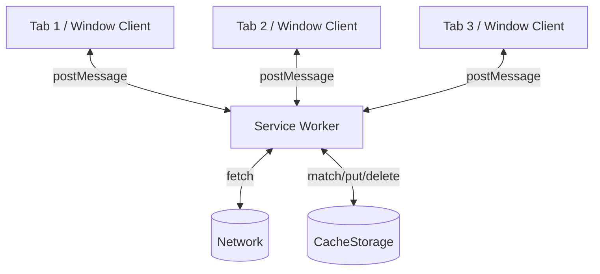
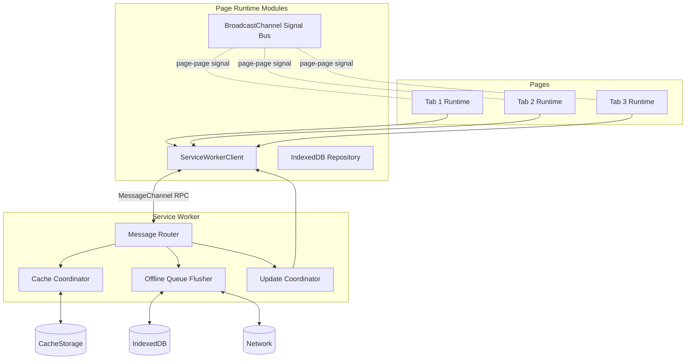

# Part 014 — Service Worker ⇄ Client Messaging

> Target part ini: memahami messaging antara page dan Service Worker sebagai protocol antar lifecycle domain, bukan sekadar `postMessage` helper. Service Worker bisa menjadi network/cache coordinator, tetapi ia bukan process permanen dan bukan global singleton yang bisa dipercaya selalu hidup.

Dedicated Worker dimiliki oleh satu page.

SharedWorker bisa menjadi hub untuk banyak same-origin context.

Service Worker berbeda.

Service Worker berada di antara:

1. web app,
2. browser,
3. network,
4. cache,
5. push/sync/fetch lifecycle,
6. multiple controlled clients.



Service Worker cocok untuk:

1. cache update notification,
2. offline readiness notification,
3. background sync status,
4. update available signal,
5. network request coordination,
6. claim/skipWaiting lifecycle UX,
7. push notification click routing,
8. routing messages to controlled clients.

Service Worker tidak cocok sebagai:

1. long-lived in-memory database,
2. always-on scheduler,
3. secret vault,
4. reliable queue tanpa durable storage,
5. guaranteed leader process.

---

## 1. Mental Model: Ephemeral Coordinator

A common mistake:

> “Service Worker is my backend inside the browser.”

Not quite.

Better:

> Service Worker is an event-driven coordinator with special browser hooks and a volatile lifecycle.

It wakes for events.

It may be terminated when idle.

Its global variables are cache, not truth.

State that must survive must go to durable browser storage such as IndexedDB or CacheStorage.

```txt
Bad mental model:
  Service Worker = always alive singleton

Better mental model:
  Service Worker = restartable event handler + network/cache coordinator
```

---

## 2. Page to Service Worker: Basic Direction

From a controlled page:

```ts
navigator.serviceWorker.controller?.postMessage({
  type: "PING",
  id: crypto.randomUUID(),
});
```

In service worker:

```ts
self.addEventListener("message", (event) => {
  console.log("message from client", event.data);
});
```

But this only works when `navigator.serviceWorker.controller` exists.

A page might not be controlled yet.

Cases where controller can be absent:

1. first page load after registration,
2. service worker not yet activated,
3. page outside scope,
4. hard refresh/update transition,
5. registration failed,
6. browser mode/policy restricts service workers.

So production code must check.

```ts
export function getActiveController(): ServiceWorker | null {
  return navigator.serviceWorker?.controller ?? null;
}

export function sendToServiceWorker(message: unknown): boolean {
  const controller = getActiveController();
  if (!controller) return false;

  controller.postMessage(message);
  return true;
}
```

---

## 3. Service Worker to Page: Basic Direction

A service worker can send a message to a client.

For a specific client:

```ts
self.addEventListener("message", async (event) => {
  const source = event.source;

  if (source && "postMessage" in source) {
    source.postMessage({
      type: "PONG",
      id: crypto.randomUUID(),
    });
  }
});
```

From page:

```ts
navigator.serviceWorker.addEventListener("message", (event) => {
  console.log("from service worker", event.data);
});
```

Broadcast to many clients:

```ts
async function broadcastToWindowClients(message) {
  const clients = await self.clients.matchAll({
    type: "window",
    includeUncontrolled: true,
  });

  for (const client of clients) {
    client.postMessage(message);
  }
}
```

`includeUncontrolled: true` matters when you need to reach same-origin clients that are not yet controlled by this active worker.

Use carefully. It broadens reach.

---

## 4. Direction Matrix

| Direction | API | Receiver listens on | Notes |
|---|---|---|---|
| Page → active Service Worker | `navigator.serviceWorker.controller.postMessage()` | `self.addEventListener("message")` | Requires controlled page |
| Page → installing/waiting worker | `registration.installing/postMessage` or `registration.waiting.postMessage` | worker `message` event | Used for update flow |
| Service Worker → source page | `event.source.postMessage()` | `navigator.serviceWorker.addEventListener("message")` | Good for direct reply |
| Service Worker → all clients | `clients.matchAll()` + `client.postMessage()` | page `message` listener | Good for broadcast/status |
| Page ↔ Service Worker request-response | `MessageChannel` transfer | `MessagePort.onmessage` | Best for RPC-like exchange |

---

## 5. Message Envelope

Use the same discipline as previous parts.

```ts
type ServiceWorkerMessage = {
  protocol: "app.sw-message.v1";
  id: string;
  type: string;
  source: "window" | "service-worker";
  sourceId: string;
  createdAt: number;
  expiresAt?: number;
  payload?: unknown;
};
```

Page publisher:

```ts
function createPageMessage(type: string, payload?: unknown): ServiceWorkerMessage {
  const now = Date.now();

  return {
    protocol: "app.sw-message.v1",
    id: crypto.randomUUID(),
    type,
    source: "window",
    sourceId: getOrCreateTabId(),
    createdAt: now,
    expiresAt: now + 30_000,
    payload,
  };
}
```

Service Worker validator:

```ts
function isValidMessage(value) {
  return value &&
    value.protocol === "app.sw-message.v1" &&
    typeof value.id === "string" &&
    typeof value.type === "string" &&
    typeof value.source === "string" &&
    typeof value.sourceId === "string" &&
    typeof value.createdAt === "number";
}
```

Why validate?

Because `message` is an input boundary.

Same-origin does not remove the need for validation.

---

## 6. Request-Response with MessageChannel

One-way `postMessage` is often not enough.

You may need:

1. ask service worker for cache status,
2. request offline queue flush,
3. ask waiting worker to skip waiting,
4. retrieve currently cached version metadata,
5. run a controlled cache cleanup.

Do not build request-response using global listeners and random events if you can use `MessageChannel`.

Page:

```ts
type SwRequestOptions = {
  timeoutMs: number;
};

export function requestServiceWorker<TResponse>(
  message: ServiceWorkerMessage,
  options: SwRequestOptions = { timeoutMs: 5_000 }
): Promise<TResponse> {
  const controller = navigator.serviceWorker.controller;

  if (!controller) {
    return Promise.reject(new Error("no active service worker controller"));
  }

  const channel = new MessageChannel();

  return new Promise((resolve, reject) => {
    const timeout = window.setTimeout(() => {
      channel.port1.close();
      reject(new Error(`service worker request timed out: ${message.type}`));
    }, options.timeoutMs);

    channel.port1.onmessage = (event) => {
      window.clearTimeout(timeout);
      channel.port1.close();

      const response = event.data;

      if (response?.ok) {
        resolve(response.data as TResponse);
      } else {
        reject(new Error(response?.error ?? "service worker request failed"));
      }
    };

    controller.postMessage(message, [channel.port2]);
  });
}
```

Service Worker:

```ts
self.addEventListener("message", (event) => {
  const [replyPort] = event.ports;

  if (!replyPort) {
    handleFireAndForget(event.data, event);
    return;
  }

  handleRequest(event.data, event)
    .then((data) => {
      replyPort.postMessage({ ok: true, data });
    })
    .catch((error) => {
      replyPort.postMessage({
        ok: false,
        error: error instanceof Error ? error.message : "unknown error",
      });
    });
});
```

This creates a private reply path per request.

It avoids ambiguous global response routing.

---

## 7. Service Worker Lifecycle Trap

Do not store important request state only in service worker globals.

Bad:

```js
const pendingUploads = [];

self.addEventListener("message", (event) => {
  if (event.data.type === "QUEUE_UPLOAD") {
    pendingUploads.push(event.data.payload);
  }
});
```

If the service worker is terminated, `pendingUploads` is gone.

Better:

```js
self.addEventListener("message", (event) => {
  event.waitUntil(handleQueueUpload(event.data));
});

async function handleQueueUpload(message) {
  await appendUploadJobToIndexedDB(message.payload);
  await notifyClients({ type: "UPLOAD_QUEUED", jobId: message.payload.id });
}
```

Use durable storage for durable work.

Use memory only for optimization.

---

## 8. `event.waitUntil()` Discipline

Inside service worker events, async work that must keep the worker alive should be attached to the event with `waitUntil()` when the event type supports it.

For message events in service workers, `ExtendableMessageEvent` supports this model.

Pattern:

```js
self.addEventListener("message", (event) => {
  event.waitUntil(handleMessage(event));
});

async function handleMessage(event) {
  const message = event.data;

  if (!isValidMessage(message)) return;

  switch (message.type) {
    case "CACHE_STATUS_REQUEST":
      await replyWithCacheStatus(event);
      break;
    case "OFFLINE_QUEUE_FLUSH_REQUEST":
      await flushOfflineQueue();
      await notifyClients({ type: "OFFLINE_QUEUE_FLUSHED" });
      break;
  }
}
```

The point: async work must be part of the service worker event lifecycle, not a detached promise nobody observes.

---

## 9. Broadcasting From Service Worker

Generic helper:

```js
async function notifyClients(message, options = {}) {
  const clients = await self.clients.matchAll({
    type: "window",
    includeUncontrolled: options.includeUncontrolled ?? false,
  });

  await Promise.all(
    clients.map(async (client) => {
      client.postMessage({
        protocol: "app.sw-message.v1",
        id: crypto.randomUUID(),
        source: "service-worker",
        sourceId: self.registration.scope,
        createdAt: Date.now(),
        ...message,
      });
    })
  );
}
```

But beware.

Broadcast can become noisy.

Use it for state transitions, not internal debug spam.

Good messages:

```txt
CACHE_UPDATED
OFFLINE_READY
UPDATE_AVAILABLE
SYNC_STARTED
SYNC_COMPLETED
SYNC_FAILED
AUTH_SESSION_MAY_BE_STALE
```

Bad messages:

```txt
FETCH_STARTED for every request
CACHE_MATCH_ATTEMPT for every asset
DEBUG_LINE for every internal branch
```

---

## 10. Client Identity

Service Worker client objects have browser-assigned identity, but your app usually also needs app-level tab identity.

Page boot:

```ts
const tabId = getOrCreateTabId();

navigator.serviceWorker.controller?.postMessage({
  protocol: "app.sw-message.v1",
  id: crypto.randomUUID(),
  type: "CLIENT_HELLO",
  source: "window",
  sourceId: tabId,
  createdAt: Date.now(),
  payload: {
    url: location.href,
    visibilityState: document.visibilityState,
    appVersion: import.meta.env.VITE_APP_VERSION,
  },
});
```

Service Worker:

```js
self.addEventListener("message", (event) => {
  const message = event.data;

  if (message?.type !== "CLIENT_HELLO") return;

  event.waitUntil(recordClientHello({
    clientId: event.source?.id,
    tabId: message.sourceId,
    url: message.payload?.url,
    appVersion: message.payload?.appVersion,
    seenAt: Date.now(),
  }));
});
```

Store presence in IndexedDB if you need it beyond memory.

But remember: client presence in browser is approximate.

Tabs freeze. Pages close without goodbye. Service worker dies.

Presence is a lease, not a fact.

---

## 11. Cache Update Notification

Classic use case:

1. Service Worker fetches and caches new app shell/data/artifact.
2. It notifies open tabs.
3. Tabs show “New version available” or invalidate local state.

Service Worker:

```js
async function cacheNewVersion(version) {
  const cache = await caches.open(`app-shell-${version}`);
  await cache.addAll([
    "/",
    "/assets/index.js",
    "/assets/index.css",
  ]);

  await notifyClients({
    type: "APP_SHELL_CACHED",
    payload: { version },
  });
}
```

Page:

```ts
navigator.serviceWorker.addEventListener("message", (event) => {
  const message = event.data;

  if (message?.type === "APP_SHELL_CACHED") {
    showUpdateToast(message.payload.version);
  }
});
```

Do not auto-reload blindly.

A user may be filling a form.

Production policy:

| App type | Update behavior |
|---|---|
| Dashboard | Toast + refresh button |
| Kiosk | Auto-refresh during idle window |
| Auth/session-critical app | Prompt after safe checkpoint |
| Document editor | Never reload without durable draft save |

---

## 12. Waiting Worker and Update Flow

Service Worker update lifecycle creates a common UX problem:

A new worker is installed and waiting, but old pages are still controlled by the old worker.

Page can detect waiting worker:

```ts
async function checkForWaitingWorker() {
  const registration = await navigator.serviceWorker.getRegistration();

  if (registration?.waiting) {
    showUpdateAvailable(() => {
      registration.waiting?.postMessage({
        protocol: "app.sw-message.v1",
        id: crypto.randomUUID(),
        type: "SKIP_WAITING",
        source: "window",
        sourceId: getOrCreateTabId(),
        createdAt: Date.now(),
      });
    });
  }
}
```

Service Worker:

```js
self.addEventListener("message", (event) => {
  const message = event.data;

  if (message?.type === "SKIP_WAITING") {
    event.waitUntil(self.skipWaiting());
  }
});
```

Page reload after controller change:

```ts
let refreshing = false;

navigator.serviceWorker.addEventListener("controllerchange", () => {
  if (refreshing) return;
  refreshing = true;
  window.location.reload();
});
```

Do not use this blindly for every product.

Reload is a destructive side effect.

---

## 13. `clients.claim()` and First-Load Control

After activation, a service worker can call `clients.claim()` to control existing clients within scope.

```js
self.addEventListener("activate", (event) => {
  event.waitUntil(self.clients.claim());
});
```

This reduces the “controller is null until next navigation” problem.

But it also changes lifecycle expectations.

If you claim clients immediately, pages may start receiving behavior from a new worker without a full reload.

That can be good for control.

It can be risky for version compatibility.

Rule:

> `clients.claim()` is a rollout decision, not a default checkbox.

Use it when your app can tolerate old page JS talking to new service worker JS.

If protocols are versioned and backward-compatible, claim is safer.

---

## 14. Message Protocol Compatibility During Updates

During deployment, these combinations can happen:

| Page JS | Service Worker JS | Scenario |
|---|---|---|
| Old | Old | Normal before update |
| Old | New | After worker update/claim/controllerchange race |
| New | Old | New page loaded but old worker still controls |
| New | New | Settled state |

Therefore protocol must be backward-compatible.

Bad:

```js
// New service worker assumes new field exists.
if (message.type === "CACHE_PREFETCH") {
  await prefetch(message.payload.urls.map(normalize));
}
```

Better:

```js
if (message.type === "CACHE_PREFETCH") {
  const urls = Array.isArray(message.payload?.urls)
    ? message.payload.urls
    : [];

  if (urls.length === 0) {
    replyError(event, "CACHE_PREFETCH requires urls[]");
    return;
  }

  await prefetch(urls);
}
```

Better still: version capability handshake.

```ts
await requestServiceWorker("HELLO", {
  appVersion,
  supportedProtocols: ["app.sw-message.v1", "app.sw-message.v2"],
});
```

Service Worker replies:

```json
{
  "selectedProtocol": "app.sw-message.v1",
  "features": ["CACHE_STATUS", "OFFLINE_QUEUE_FLUSH"]
}
```

---

## 15. Offline Queue Flush Request

A page may want to ask Service Worker to flush offline jobs.

Page:

```ts
await requestServiceWorker<{ flushed: number; failed: number }>({
  protocol: "app.sw-message.v1",
  id: crypto.randomUUID(),
  type: "OFFLINE_QUEUE_FLUSH_REQUEST",
  source: "window",
  sourceId: getOrCreateTabId(),
  createdAt: Date.now(),
});
```

Service Worker:

```js
async function handleRequest(message, event) {
  switch (message.type) {
    case "OFFLINE_QUEUE_FLUSH_REQUEST": {
      const result = await flushOfflineQueueFromIndexedDB();

      await notifyClients({
        type: "OFFLINE_QUEUE_FLUSH_RESULT",
        payload: result,
      });

      return result;
    }

    default:
      throw new Error(`unsupported request type: ${message.type}`);
  }
}
```

Important invariant:

> Offline jobs live in IndexedDB, not in service worker memory.

The message triggers work. It is not the durable queue.

---

## 16. Network Status and Cache Status

Do not ask every tab to independently probe the same resources.

Service Worker can compute a cache/network status and broadcast.

```js
async function getCacheStatus() {
  const keys = await caches.keys();

  return {
    cacheNames: keys,
    hasAppShell: keys.some((key) => key.startsWith("app-shell-")),
  };
}
```

Request-response:

```ts
const status = await requestServiceWorker<{ cacheNames: string[]; hasAppShell: boolean }>({
  protocol: "app.sw-message.v1",
  id: crypto.randomUUID(),
  type: "CACHE_STATUS_REQUEST",
  source: "window",
  sourceId: getOrCreateTabId(),
  createdAt: Date.now(),
});
```

This is reasonable because Service Worker owns cache coordination.

But do not turn it into a general-purpose query database.

---

## 17. Routing Push/Notification Clicks to Clients

Service Worker can receive notification click events.

Common flow:

1. user clicks notification,
2. service worker finds existing window client,
3. focuses it or opens a new window,
4. sends route intent.

```js
self.addEventListener("notificationclick", (event) => {
  event.notification.close();

  event.waitUntil(handleNotificationClick(event));
});

async function handleNotificationClick(event) {
  const targetUrl = event.notification.data?.url ?? "/";

  const clients = await self.clients.matchAll({
    type: "window",
    includeUncontrolled: true,
  });

  for (const client of clients) {
    if ("focus" in client) {
      await client.focus();
      client.postMessage({
        protocol: "app.sw-message.v1",
        id: crypto.randomUUID(),
        type: "NAVIGATE_INTENT",
        source: "service-worker",
        sourceId: self.registration.scope,
        createdAt: Date.now(),
        payload: { url: targetUrl },
      });
      return;
    }
  }

  await self.clients.openWindow(targetUrl);
}
```

Page:

```ts
navigator.serviceWorker.addEventListener("message", (event) => {
  const message = event.data;

  if (message?.type === "NAVIGATE_INTENT") {
    router.navigate(message.payload.url);
  }
});
```

Validate URL before navigating.

Never navigate to arbitrary untrusted payload.

---

## 18. Security Threat Model

Service Worker is powerful.

If compromised, it can affect network/cache behavior for its scope.

Messaging must be defensive.

Rules:

1. validate all incoming message shapes,
2. reject unknown protocol versions,
3. reject unknown command types,
4. do not expose privileged cache deletion to arbitrary messages,
5. do not accept open redirect navigation payloads,
6. do not send secrets to every client,
7. do not assume message source is benign just because it is same-origin,
8. keep service worker scope as narrow as product requirements allow,
9. make destructive commands explicit and guarded.

Example command allowlist:

```js
const ALLOWED_WINDOW_COMMANDS = new Set([
  "CACHE_STATUS_REQUEST",
  "OFFLINE_QUEUE_FLUSH_REQUEST",
  "SKIP_WAITING",
  "CLIENT_HELLO",
]);

function assertAllowedCommand(message) {
  if (!ALLOWED_WINDOW_COMMANDS.has(message.type)) {
    throw new Error(`command not allowed: ${message.type}`);
  }
}
```

---

## 19. Avoid the Service Worker God Object

Bad architecture:

```txt
All tabs ask Service Worker for everything:
  user state
  feature flags
  auth state
  UI preferences
  cache
  websocket ownership
  offline queue
  navigation
  analytics
```

This creates a hidden browser-side backend with poor lifecycle guarantees.

Better division:

| Concern | Better owner |
|---|---|
| Network/cache interception | Service Worker |
| CPU-heavy compute | Dedicated Worker / worker pool |
| Cross-tab volatile signal | BroadcastChannel / SharedWorker |
| Durable app state | IndexedDB |
| Mutual exclusion | Web Locks |
| UI state | Page runtime |
| Auth session validation | Server + secure client policy |

Service Worker should coordinate what only it can coordinate.

Not everything.

---

## 20. Backpressure

If every tab spams Service Worker with messages, you have a local thundering herd.

Implement bounded request concurrency on the page side.

```ts
class SwClient {
  private inFlight = 0;
  private readonly maxInFlight = 4;

  async request<T>(message: ServiceWorkerMessage): Promise<T> {
    if (this.inFlight >= this.maxInFlight) {
      throw new Error("too many in-flight service worker requests");
    }

    this.inFlight++;

    try {
      return await requestServiceWorker<T>(message, { timeoutMs: 5_000 });
    } finally {
      this.inFlight--;
    }
  }
}
```

Service Worker side can also reject unsupported bursts.

```js
let activeFlush = null;

async function flushOfflineQueueSingleFlight() {
  if (activeFlush) return activeFlush;

  activeFlush = flushOfflineQueueFromIndexedDB()
    .finally(() => {
      activeFlush = null;
    });

  return activeFlush;
}
```

But remember: service worker memory may vanish.

For critical single-flight across lifecycle, use durable state and Web Locks where appropriate.

---

## 21. Failure Matrix

| Failure | Symptom | Design response |
|---|---|---|
| No controller | Page cannot send message | Fallback or wait for `controllerchange` |
| Worker terminated mid-work | Request timeout | Use `waitUntil`, durable state, retry policy |
| Message unsupported due to version skew | Error response | Protocol versioning and feature negotiation |
| Client closed before reply | Reply lost | Treat reply as best-effort |
| Broadcast misses hidden/discarded page | Page stale | Reconcile on focus/bootstrap |
| Cache operation fails | Error response | Surface status and retry safely |
| Multiple tabs trigger same flush | Duplicate work | Single-flight + idempotent jobs |
| Malformed message | Handler crash risk | Schema validation and rejection |

---

## 22. Reconciliation on Focus

Service Worker messages are useful, but pages must reconcile on lifecycle transitions.

```ts
document.addEventListener("visibilitychange", () => {
  if (document.visibilityState === "visible") {
    reconcileWithServiceWorker();
  }
});

async function reconcileWithServiceWorker() {
  if (!navigator.serviceWorker.controller) return;

  const status = await requestServiceWorker<{
    appVersion: string;
    cacheVersion: string | null;
    offlineQueueSize: number;
  }>({
    protocol: "app.sw-message.v1",
    id: crypto.randomUUID(),
    type: "RUNTIME_STATUS_REQUEST",
    source: "window",
    sourceId: getOrCreateTabId(),
    createdAt: Date.now(),
  }).catch(() => null);

  if (!status) return;

  applyRuntimeStatus(status);
}
```

This handles missed messages.

Invariant:

> Notification is optimization. Reconciliation is correctness.

---

## 23. Observability

Instrument both page and service worker.

Page logs:

```ts
logger.info("sw_request_started", {
  messageId: message.id,
  type: message.type,
});
```

Service Worker logs:

```js
console.info("sw_message_received", {
  id: message.id,
  type: message.type,
  sourceId: message.sourceId,
  ageMs: Date.now() - message.createdAt,
});
```

Metrics:

| Metric | Meaning |
|---|---|
| `sw_message_received_total` | Incoming messages to service worker |
| `sw_message_invalid_total` | Schema/protocol rejection |
| `sw_request_timeout_total` | Page-side timeout |
| `sw_broadcast_total` | Messages sent to clients |
| `sw_clients_matched_count` | Number of clients reached |
| `sw_cache_update_total` | Cache updates performed |
| `sw_offline_flush_total` | Offline queue flush attempts |
| `sw_protocol_mismatch_total` | Version compatibility issues |

For frontend telemetry, avoid logging payloads that may contain user data.

---

## 24. Testing Service Worker Messaging

Service Worker behavior should be tested in real browser automation.

Unit tests can test protocol helpers.

Integration tests should verify lifecycle.

Playwright-style cases:

1. page sends `CACHE_STATUS_REQUEST` and receives response,
2. service worker broadcasts `APP_SHELL_CACHED` to two tabs,
3. first load with no controller behaves correctly,
4. update flow shows update prompt,
5. waiting worker receives `SKIP_WAITING`,
6. controllerchange reload logic fires only once,
7. malformed message is rejected,
8. notification click focuses existing client,
9. closed client does not break broadcast,
10. service worker restart does not lose durable offline jobs.

Pseudo-test:

```ts
test("service worker broadcasts cache update to all clients", async ({ context }) => {
  const page1 = await context.newPage();
  const page2 = await context.newPage();

  await page1.goto("/app");
  await page2.goto("/app");

  await page1.evaluate(() => window.__testHooks.triggerCacheUpdate("v2"));

  await expect(page1.getByText("New version available")).toBeVisible();
  await expect(page2.getByText("New version available")).toBeVisible();
});
```

---

## 25. Reference Architecture



Key design:

- Service Worker handles service-worker-specific capabilities.
- Page runtime owns UI-facing orchestration.
- IndexedDB stores durable app/client state.
- BroadcastChannel handles page-to-page volatile signal.
- MessageChannel handles page-to-service-worker request-response.

---

## 26. Full Minimal Runtime Sketch

Page side:

```ts
export class ServiceWorkerClient {
  constructor(private readonly tabId: string) {}

  isControlled(): boolean {
    return Boolean(navigator.serviceWorker.controller);
  }

  async request<T>(type: string, payload?: unknown): Promise<T> {
    return requestServiceWorker<T>({
      protocol: "app.sw-message.v1",
      id: crypto.randomUUID(),
      type,
      source: "window",
      sourceId: this.tabId,
      createdAt: Date.now(),
      expiresAt: Date.now() + 30_000,
      payload,
    });
  }

  listen(handler: (message: ServiceWorkerMessage) => void) {
    const listener = (event: MessageEvent) => {
      const message = event.data;
      if (!isServiceWorkerMessage(message)) return;
      if (message.expiresAt && message.expiresAt <= Date.now()) return;
      handler(message);
    };

    navigator.serviceWorker.addEventListener("message", listener);

    return () => {
      navigator.serviceWorker.removeEventListener("message", listener);
    };
  }

  hello() {
    navigator.serviceWorker.controller?.postMessage({
      protocol: "app.sw-message.v1",
      id: crypto.randomUUID(),
      type: "CLIENT_HELLO",
      source: "window",
      sourceId: this.tabId,
      createdAt: Date.now(),
      payload: {
        url: location.href,
        visibilityState: document.visibilityState,
      },
    });
  }
}
```

Service worker side:

```js
self.addEventListener("message", (event) => {
  event.waitUntil(routeMessage(event));
});

async function routeMessage(event) {
  const message = event.data;
  const replyPort = event.ports?.[0];

  try {
    if (!isValidMessage(message)) {
      throw new Error("invalid message");
    }

    assertAllowedCommand(message);

    const result = await dispatchMessage(message, event);

    if (replyPort) {
      replyPort.postMessage({ ok: true, data: result });
    }
  } catch (error) {
    if (replyPort) {
      replyPort.postMessage({
        ok: false,
        error: error instanceof Error ? error.message : "unknown error",
      });
    }
  }
}

async function dispatchMessage(message, event) {
  switch (message.type) {
    case "CLIENT_HELLO":
      return recordClientHello(message, event);

    case "CACHE_STATUS_REQUEST":
      return getCacheStatus();

    case "OFFLINE_QUEUE_FLUSH_REQUEST":
      return flushOfflineQueueFromIndexedDB();

    case "SKIP_WAITING":
      await self.skipWaiting();
      return { skipped: true };

    default:
      throw new Error(`unsupported message type: ${message.type}`);
  }
}
```

This is intentionally small.

It gives you a protocol boundary without turning Service Worker into a giant app server.

---

## 27. Decision Rules

Use Service Worker messaging when:

1. the concern is cache/network/update/offline/push related,
2. the sender/receiver crosses page ↔ service worker boundary,
3. you need to notify all controlled clients about service worker state,
4. you need request-response with worker lifecycle awareness.

Do not use Service Worker messaging when:

1. simple page-to-page signal is enough,
2. CPU-heavy compute should go to Dedicated Worker,
3. durable app state belongs in IndexedDB,
4. mutual exclusion belongs to Web Locks,
5. UI state can stay in the page.

---

## 28. Production Checklist

Before shipping Service Worker messaging:

- [ ] page handles missing `navigator.serviceWorker.controller`,
- [ ] all messages use a versioned envelope,
- [ ] all incoming messages are schema-validated,
- [ ] request-response uses timeout,
- [ ] request-response closes `MessagePort`,
- [ ] async service worker work uses `event.waitUntil()` where applicable,
- [ ] durable work is stored outside service worker globals,
- [ ] broadcast uses `clients.matchAll()` intentionally,
- [ ] `includeUncontrolled` usage is deliberate,
- [ ] update flow handles `waiting`, `skipWaiting`, and `controllerchange`,
- [ ] destructive operations are allowlisted,
- [ ] protocol supports old-page/new-worker and new-page/old-worker combinations,
- [ ] pages reconcile on focus/bootstrap,
- [ ] no secrets are broadcast to all clients,
- [ ] tests cover multi-tab and update lifecycle,
- [ ] metrics exist for request, timeout, broadcast, invalid message, and version mismatch.

---

## 29. References

- MDN — ServiceWorker: `postMessage()`: https://developer.mozilla.org/en-US/docs/Web/API/ServiceWorker/postMessage
- MDN — Clients interface: https://developer.mozilla.org/en-US/docs/Web/API/Clients
- MDN — Clients: `matchAll()`: https://developer.mozilla.org/en-US/docs/Web/API/Clients/matchAll
- MDN — Client: `postMessage()`: https://developer.mozilla.org/en-US/docs/Web/API/Client/postMessage
- MDN — Service Worker API: https://developer.mozilla.org/en-US/docs/Web/API/Service_Worker_API
- web.dev — Service workers and the Cache Storage API: https://web.dev/learn/pwa/serving

---

## 30. What Comes Next

Part 015 akan menyatukan semua primitive messaging sebelumnya menjadi **typed message protocol design**.

Kita tidak lagi melihat `postMessage`, `BroadcastChannel`, `storage` event, dan Service Worker messaging sebagai API terpisah.

Kita akan desain satu protocol layer yang punya:

1. envelope,
2. schema,
3. versioning,
4. request-response,
5. correlation id,
6. idempotency,
7. timeout,
8. observability,
9. transport abstraction,
10. failure semantics eksplisit.
