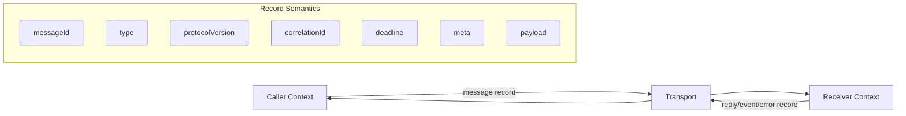
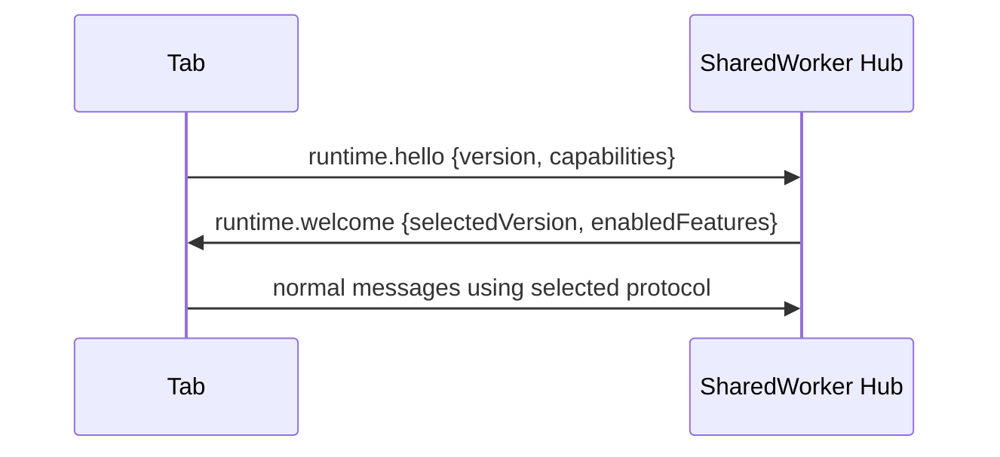
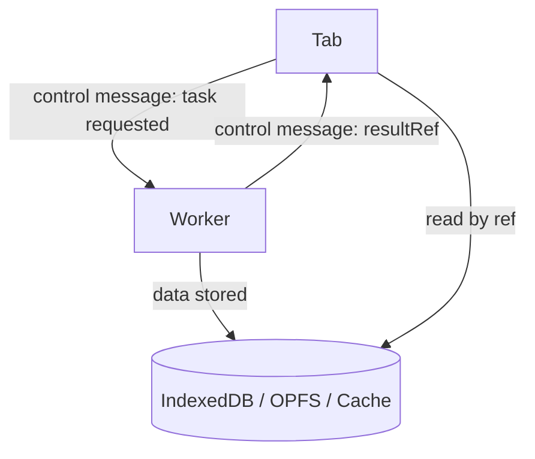
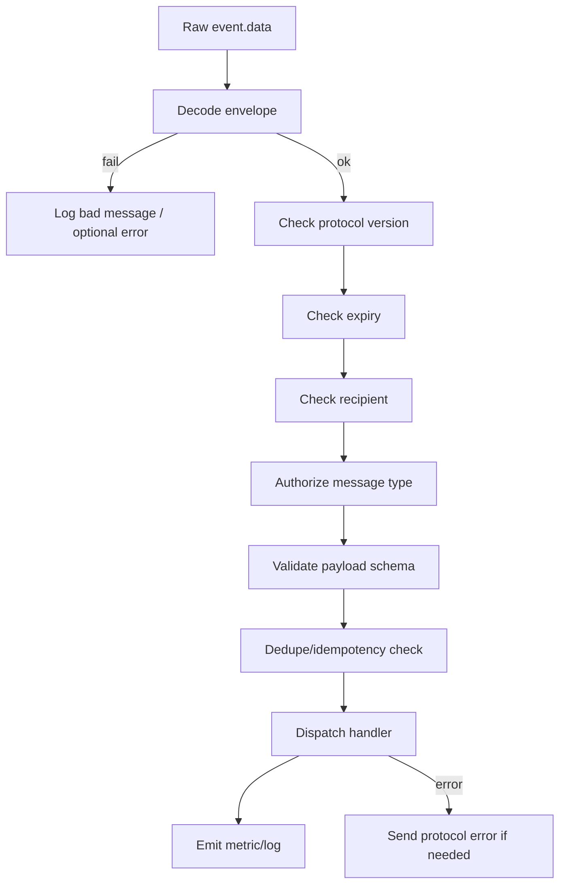
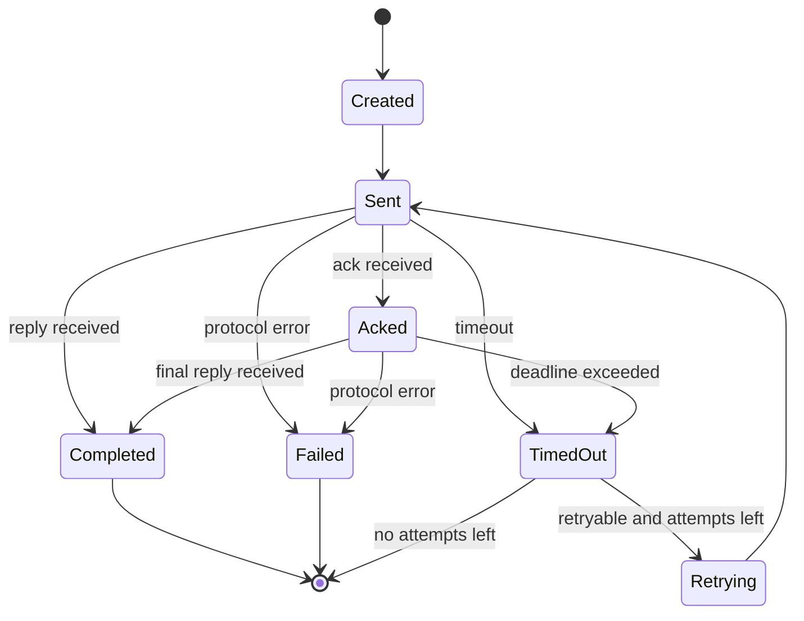
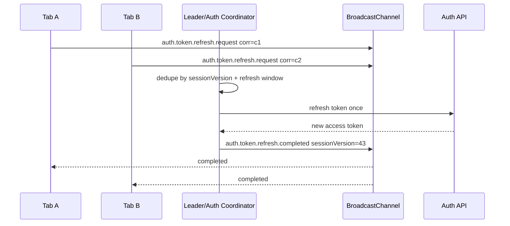

# Part 015 — Designing Typed Message Protocols

> Target part ini: mengubah komunikasi browser dari "lempar object lewat `postMessage`" menjadi protocol yang typed, versioned, observable, secure, dan tahan terhadap lifecycle browser yang tidak stabil.

Di part sebelumnya kita sudah membedah transport:

1. `postMessage`,
2. structured clone,
3. transferable objects,
4. `MessageChannel` / `MessagePort`,
5. `BroadcastChannel`,
6. `storage` event,
7. Service Worker ⇄ client messaging.

Sekarang kita naik satu level.

Transport menjawab:

> Bagaimana byte/object berpindah dari context A ke context B?

Protocol menjawab:

> Apa arti message itu, siapa boleh mengirimnya, kapan dianggap valid, bagaimana menangani error, bagaimana versioning, bagaimana tracing, bagaimana recover saat message hilang/terlambat/duplikat?

Dalam multi-tab orchestration, protocol design bukan kosmetik. Ia adalah batas antara demo dan production system.

---

## 1. Problem: Browser Messaging Terlihat Mudah, Tapi Semantiknya Lemah

Contoh buruk:

```ts
worker.postMessage({ action: "refresh" });

channel.postMessage({ type: "LOGOUT" });

navigator.serviceWorker.controller?.postMessage({ cache: "clear" });
```

Kode di atas terlihat sederhana, tetapi tidak menjawab pertanyaan penting:

1. versi protocol apa yang dipakai?
2. siapa pengirimnya?
3. apakah message ini command, event, query, atau reply?
4. apakah message boleh diulang?
5. apakah message perlu acknowledgement?
6. apakah message sudah expired?
7. apakah receiver harus ignore message dari versi lama?
8. bagaimana membedakan request baru dan retry?
9. bagaimana menghubungkan response ke request?
10. bagaimana tracing flow lintas tab/worker?
11. bagaimana menangani payload yang gagal deserialize?
12. bagaimana mencegah broadcast data sensitif?
13. bagaimana migration ketika satu tab masih menjalankan bundle versi lama?

Browser orchestration adalah distributed system kecil.

Distributed system tanpa protocol yang jelas akan berubah menjadi kumpulan event handler yang saling menebak.

---

## 2. Mental Model: Message adalah Record, Bukan Function Call

Kesalahan mental model yang paling sering:

> "Aku memanggil worker function dari tab."

Lebih tepat:

> "Aku menulis sebuah record ke transport asynchronous. Record itu mungkin diterima nanti, mungkin terlambat, mungkin receiver sudah mati, mungkin schema tidak cocok, mungkin result sudah stale."

Jadi desain protocol harus memperlakukan message seperti record di log:

1. self-describing,
2. versioned,
3. traceable,
4. idempotent bila memungkinkan,
5. bounded oleh deadline,
6. aman untuk di-ignore,
7. aman untuk di-replay bila memang didesain demikian.



Protocol yang baik membuat setiap message cukup informatif untuk diproses tanpa bergantung pada shared in-memory state yang rapuh.

---

## 3. Transport vs Protocol

Pisahkan dua layer ini secara keras.

| Layer | Tanggung Jawab | Contoh |
|---|---|---|
| Transport | Mengirim object antar context | `postMessage`, `MessagePort`, `BroadcastChannel`, `Client.postMessage` |
| Codec | Encode/decode dan validasi shape | structured clone compatible DTO, runtime validation |
| Protocol | Semantik message | command, event, request, reply, error, ack |
| Router | Dispatch message ke handler | `type -> handler` |
| Reliability | timeout, retry, dedupe, idempotency | pending map, retry policy, idempotency store |
| Observability | log, metric, trace | message id, correlation id, duration |

Jangan menaruh semua logic di callback `onmessage`.

Callback transport seharusnya kecil:

```ts
port.addEventListener("message", event => {
  runtime.receive(event.data, {
    transport: "message-port",
    rawEvent: event,
  });
});
```

Yang besar adalah runtime/protocol layer, bukan event listener.

---

## 4. The Minimal Envelope

Payload saja tidak cukup.

Kita butuh envelope.

```ts
export type ProtocolEnvelope<TPayload = unknown> = {
  protocol: "app.browser.orchestration";
  protocolVersion: 1;

  messageId: string;
  messageType: string;
  messageKind: "command" | "event" | "query" | "reply" | "error" | "ack";

  createdAt: number;
  deadlineAt?: number;

  sender: ProtocolActor;
  recipient?: ProtocolRecipient;

  correlationId?: string;
  causationId?: string;
  idempotencyKey?: string;

  schemaVersion: number;
  payload: TPayload;

  meta?: ProtocolMeta;
};

export type ProtocolActor = {
  actorId: string;
  actorType: "window" | "dedicated-worker" | "shared-worker" | "service-worker";
  instanceId: string;
  appVersion: string;
};

export type ProtocolRecipient =
  | { kind: "any" }
  | { kind: "actor"; actorId: string }
  | { kind: "role"; role: "leader" | "cache-coordinator" | "auth-coordinator" }
  | { kind: "broadcast" };

export type ProtocolMeta = {
  traceId?: string;
  spanId?: string;
  attempt?: number;
  priority?: "low" | "normal" | "high";
  feature?: string;
  debug?: boolean;
};
```

Minimal bukan berarti pendek. Minimal berarti setiap field punya alasan.

---

## 5. Field-by-Field Reasoning

### 5.1 `protocol`

Namespace protocol.

Gunanya:

1. reject message asing,
2. hindari collision dengan library lain,
3. memisahkan internal bus dari external iframe integration,
4. mempermudah observability.

```ts
if (envelope.protocol !== "app.browser.orchestration") {
  return ignore("unknown_protocol");
}
```

Jangan hanya mengandalkan `messageType` seperti `LOGOUT`. Terlalu mudah collision.

---

### 5.2 `protocolVersion`

Version untuk envelope-level semantics.

Misalnya:

1. Part 1 memakai `correlationId` optional.
2. Part 2 mewajibkan `correlationId` untuk reply.
3. Part 3 menambahkan `deadlineAt`.

Itu perubahan protocol, bukan sekadar payload schema.

Rule praktis:

| Perubahan | Butuh `protocolVersion` baru? |
|---|---:|
| Tambah optional metadata | Tidak selalu |
| Ubah arti field lama | Ya |
| Hapus required field | Ya |
| Ubah reply/error semantics | Ya |
| Tambah message type baru | Tidak selalu |
| Ubah payload command tertentu | Biasanya cukup `schemaVersion` |

---

### 5.3 `messageId`

Unique identity untuk satu message record.

Gunanya:

1. dedupe,
2. tracing,
3. log correlation,
4. ACK,
5. poison message quarantine,
6. duplicate detection.

Gunakan `crypto.randomUUID()` bila tersedia. Hindari `Math.random()` untuk identity protocol.

```ts
const messageId = crypto.randomUUID();
```

`messageId` bukan `correlationId`.

Satu request retry bisa memakai:

1. messageId berbeda untuk setiap attempt,
2. correlationId sama untuk request-reply flow,
3. idempotencyKey sama untuk operasi business yang sama.

---

### 5.4 `messageType`

Nama operasi/event.

Contoh:

```ts
"auth.token.refresh.request"
"auth.token.refresh.result"
"session.logout.command"
"cache.entry.invalidated"
"worker.task.execute"
"worker.task.completed"
"tab.presence.heartbeat"
"leader.election.claim"
```

Gunakan nama namespaced.

Jangan gunakan:

```ts
"refresh"
"done"
"update"
"sync"
"message"
```

Nama pendek terasa enak di demo, tetapi menyakitkan di observability.

---

### 5.5 `messageKind`

`messageType` menjelaskan nama. `messageKind` menjelaskan kategori semantik.

| Kind | Pertanyaan | Contoh |
|---|---|---|
| command | "Lakukan sesuatu" | logout, clear cache, refresh token |
| event | "Sesuatu telah terjadi" | token refreshed, tab hidden, cache invalidated |
| query | "Berikan informasi" | get leader, get cache state |
| reply | "Ini hasil request" | task result, token refresh result |
| error | "Request gagal" | validation failed, timeout, permission denied |
| ack | "Message diterima/diterima untuk diproses" | accepted, queued |

Kenapa penting?

Karena retry, idempotency, logging, dan authorization berbeda per kind.

Command bisa butuh idempotency.
Event biasanya tidak boleh mengubah source of truth tanpa version/sequence.
Query biasanya perlu timeout.
Reply harus punya `correlationId`.
ACK bukan hasil akhir.

---

### 5.6 `createdAt` dan `deadlineAt`

Message tanpa waktu hidup adalah bug yang tertunda.

Contoh: user membuka tiga tab. Tab A mengirim request ke worker. Tab A hidden. Worker lambat. User logout dari Tab B. Lima detik kemudian response lama dari worker masuk ke Tab A.

Tanpa deadline, Tab A mungkin meng-apply result yang sudah tidak valid.

```ts
function isExpired(envelope: ProtocolEnvelope): boolean {
  return typeof envelope.deadlineAt === "number" && Date.now() > envelope.deadlineAt;
}
```

Rule:

1. command user-facing harus punya deadline,
2. query harus punya timeout/deadline,
3. heartbeat harus punya TTL,
4. broadcast cache invalidation biasanya boleh pendek,
5. durable offline operation tidak pakai ephemeral deadline yang sama; ia pakai operation state.

---

### 5.7 `sender`

Multi-tab orchestration tanpa sender identity akan sulit di-debug.

`sender` minimal:

```ts
const actor: ProtocolActor = {
  actorId: stableActorId,
  actorType: "window",
  instanceId: runtimeInstanceId,
  appVersion: __APP_VERSION__,
};
```

Bedakan:

| Field | Stabilitas | Makna |
|---|---|---|
| `actorId` | bisa stabil selama tab hidup | logical actor |
| `instanceId` | berubah saat reload/runtime restart | process/runtime instance |
| `appVersion` | build version | version skew detection |

Saat tab reload, `actorId` bisa dipertahankan di `sessionStorage`, tetapi `instanceId` harus berubah.

Kenapa?

Untuk membedakan:

1. tab yang sama setelah reload,
2. runtime lama yang masih mengirim stale message,
3. leader epoch lama,
4. pending response dari worker lama.

---

### 5.8 `recipient`

Transport seperti BroadcastChannel mengirim ke semua listener, tetapi protocol bisa membatasi penerima logis.

```ts
recipient: { kind: "role", role: "auth-coordinator" }
```

Receiver check:

```ts
function isForMe(envelope: ProtocolEnvelope, self: ProtocolActor, roles: Set<string>): boolean {
  const r = envelope.recipient;

  if (!r) return true;
  if (r.kind === "any") return true;
  if (r.kind === "broadcast") return true;
  if (r.kind === "actor") return r.actorId === self.actorId;
  if (r.kind === "role") return roles.has(r.role);

  return false;
}
```

Ini tidak menggantikan security. Ini routing hint.

Jangan anggap recipient filtering sebagai access control kuat jika semua tab same-origin bisa membaca channel.

---

### 5.9 `correlationId`

Menghubungkan response/ack/error ke request flow.

```ts
const request = {
  messageId: "m-1",
  correlationId: "c-100",
  messageKind: "query",
};

const reply = {
  messageId: "m-2",
  correlationId: "c-100",
  messageKind: "reply",
};
```

Bukan semua message butuh correlation id.

Butuh:

1. request/reply,
2. ack,
3. async result,
4. command accepted/result split,
5. tracing multi-step workflow.

Tidak selalu butuh:

1. fire-and-forget event,
2. heartbeat sederhana,
3. presence announcement.

---

### 5.10 `causationId`

`correlationId` menjawab:

> Message ini bagian dari flow apa?

`causationId` menjawab:

> Message ini disebabkan oleh message apa?

Contoh:

```text
user.click.sync.button
  -> sync.request
     -> sync.item.started
     -> sync.item.completed
     -> cache.entry.invalidated
```

Semua bisa punya `correlationId` sama.

Setiap event bisa punya `causationId` yang menunjuk message yang memicunya.

Ini sangat membantu debugging chain panjang.

---

### 5.11 `idempotencyKey`

`messageId` unik per message.

`idempotencyKey` stabil per operasi bisnis.

Contoh:

```ts
idempotencyKey: "offline-op:case-123:add-note:client-op-789"
```

Jika sender retry karena timeout, messageId berubah, tetapi idempotencyKey tetap.

Receiver dapat berkata:

> Operasi ini sudah pernah diproses. Jangan apply side effect dua kali. Kembalikan result lama atau ACK duplicate.

---

### 5.12 `schemaVersion`

Payload-specific version.

Contoh:

```ts
type TokenRefreshRequestV1 = {
  reason: "startup" | "expiry" | "manual";
};

type TokenRefreshRequestV2 = {
  reason: "startup" | "expiry" | "manual";
  minExpiresInMs: number;
};
```

`messageType` bisa sama, tetapi `schemaVersion` berubah.

Receiver bisa support banyak versi:

```ts
function normalizeTokenRefreshRequest(schemaVersion: number, payload: unknown) {
  if (schemaVersion === 1) {
    const v1 = parseV1(payload);
    return { ...v1, minExpiresInMs: 30_000 };
  }

  if (schemaVersion === 2) {
    return parseV2(payload);
  }

  throw new ProtocolError("UNSUPPORTED_SCHEMA_VERSION");
}
```

---

## 6. Commands, Events, Queries, Replies, Errors

### 6.1 Command

Command meminta receiver melakukan sesuatu.

```ts
type LogoutCommand = ProtocolEnvelope<{
  reason: "user" | "server-revoked" | "session-expired";
  clearStorage: boolean;
}> & {
  messageKind: "command";
  messageType: "session.logout.command";
};
```

Command harus menjawab:

1. apakah command idempotent?
2. apakah perlu ACK?
3. apakah perlu result akhir?
4. apakah boleh diproses oleh banyak receiver?
5. apakah butuh role ownership?
6. apakah punya deadline?

Command yang buruk:

```ts
{ type: "DO_IT" }
```

Command yang baik:

```ts
{
  protocol: "app.browser.orchestration",
  protocolVersion: 1,
  messageKind: "command",
  messageType: "session.logout.command",
  messageId: "...",
  idempotencyKey: "logout:session:abc:revocation:42",
  createdAt: 1783497600000,
  deadlineAt: 1783497605000,
  sender: { ... },
  schemaVersion: 1,
  payload: {
    reason: "server-revoked",
    clearStorage: true
  }
}
```

---

### 6.2 Event

Event menyatakan fakta yang sudah terjadi.

```ts
type CacheInvalidatedEvent = ProtocolEnvelope<{
  cacheName: string;
  keys: string[];
  version: string;
}> & {
  messageKind: "event";
  messageType: "cache.entry.invalidated";
};
```

Rule event:

1. jangan beri nama imperative,
2. jangan pakai event sebagai command terselubung,
3. sertakan version/sequence bila ordering penting,
4. event harus aman jika diterima terlambat,
5. event yang critical harus backed by durable state.

Contoh nama buruk:

```text
cache.invalidate
user.logout
sync.start
```

Contoh nama lebih baik:

```text
cache.entry.invalidated
session.logout.completed
sync.job.started
```

---

### 6.3 Query

Query meminta data.

```ts
type GetLeaderQuery = ProtocolEnvelope<{
  role: "auth-coordinator" | "cache-coordinator";
}> & {
  messageKind: "query";
  messageType: "leader.get.query";
};
```

Query harus:

1. punya timeout,
2. punya correlation id,
3. tidak menyebabkan side effect besar,
4. aman diulang,
5. bisa gagal dengan error typed.

---

### 6.4 Reply

Reply mengembalikan hasil request/query/command async.

```ts
type ProtocolReply<TPayload> = ProtocolEnvelope<TPayload> & {
  messageKind: "reply";
  correlationId: string;
};
```

Reply tanpa `correlationId` hampir selalu bug.

---

### 6.5 Error

Error adalah bagian dari protocol, bukan exception mentah.

```ts
export type ProtocolErrorPayload = {
  code:
    | "BAD_MESSAGE"
    | "UNSUPPORTED_PROTOCOL_VERSION"
    | "UNSUPPORTED_SCHEMA_VERSION"
    | "VALIDATION_FAILED"
    | "UNAUTHORIZED_MESSAGE_TYPE"
    | "DEADLINE_EXCEEDED"
    | "HANDLER_FAILED"
    | "RESOURCE_BUSY"
    | "DUPLICATE_OPERATION";
  message: string;
  retryable: boolean;
  details?: Record<string, unknown>;
};
```

Jangan kirim raw `Error` object dan berharap structured clone mempertahankan semua hal yang Anda butuhkan.

Lebih baik normalize:

```ts
function toProtocolErrorPayload(error: unknown): ProtocolErrorPayload {
  if (error instanceof ProtocolError) {
    return {
      code: error.code,
      message: error.message,
      retryable: error.retryable,
      details: error.details,
    };
  }

  return {
    code: "HANDLER_FAILED",
    message: "Unhandled protocol handler failure",
    retryable: false,
  };
}
```

---

## 7. TypeScript Discriminated Union

Kita ingin compiler membantu dispatch.

```ts
type AppMessage =
  | SessionLogoutCommand
  | AuthTokenRefreshRequest
  | AuthTokenRefreshResult
  | CacheEntryInvalidatedEvent
  | TabPresenceHeartbeatEvent
  | WorkerTaskExecuteCommand
  | WorkerTaskCompletedEvent
  | ProtocolErrorMessage;
```

Gunakan `messageType` sebagai discriminator.

```ts
function handleMessage(message: AppMessage) {
  switch (message.messageType) {
    case "session.logout.command":
      return handleLogout(message);

    case "auth.token.refresh.request":
      return handleTokenRefresh(message);

    case "cache.entry.invalidated":
      return handleCacheInvalidated(message);

    default:
      return assertNever(message);
  }
}

function assertNever(value: never): never {
  throw new Error(`Unhandled message: ${JSON.stringify(value)}`);
}
```

Manfaat:

1. handler tidak lupa message type baru,
2. payload type narrow otomatis,
3. refactor lebih aman,
4. protocol map bisa diuji.

Namun TypeScript hanya compile-time. Message datang dari runtime.

Jadi tetap butuh runtime validation.

---

## 8. Runtime Validation adalah Wajib

Semua data dari transport adalah `unknown`.

Bukan:

```ts
port.onmessage = event => {
  const message = event.data as AppMessage;
  handleMessage(message);
};
```

Lebih aman:

```ts
port.onmessage = event => {
  const decoded = decodeAppMessage(event.data);

  if (!decoded.ok) {
    logBadMessage(decoded.reason, event.data);
    return;
  }

  runtime.receive(decoded.value);
};
```

Decoder minimal:

```ts
export type DecodeResult<T> =
  | { ok: true; value: T }
  | { ok: false; reason: string; details?: unknown };

export function decodeEnvelope(input: unknown): DecodeResult<ProtocolEnvelope> {
  if (typeof input !== "object" || input === null) {
    return { ok: false, reason: "not_object" };
  }

  const value = input as Record<string, unknown>;

  if (value.protocol !== "app.browser.orchestration") {
    return { ok: false, reason: "unknown_protocol" };
  }

  if (value.protocolVersion !== 1) {
    return { ok: false, reason: "unsupported_protocol_version" };
  }

  if (typeof value.messageId !== "string") {
    return { ok: false, reason: "missing_message_id" };
  }

  if (typeof value.messageType !== "string") {
    return { ok: false, reason: "missing_message_type" };
  }

  if (typeof value.createdAt !== "number") {
    return { ok: false, reason: "missing_created_at" };
  }

  return { ok: true, value: value as ProtocolEnvelope };
}
```

Dalam production, gunakan schema validator yang mendukung:

1. discriminated union,
2. strict object mode,
3. error detail yang bisa dilog,
4. schema versioning,
5. test fixture generation bila memungkinkan.

Tetapi prinsipnya tetap sama: decode dulu, baru dispatch.

---

## 9. Message Registry

Jangan sebar string message type ke seluruh codebase.

Buat registry.

```ts
export const MessageTypes = {
  SessionLogoutCommand: "session.logout.command",
  AuthTokenRefreshRequest: "auth.token.refresh.request",
  AuthTokenRefreshResult: "auth.token.refresh.result",
  CacheEntryInvalidated: "cache.entry.invalidated",
  TabPresenceHeartbeat: "tab.presence.heartbeat",
  WorkerTaskExecute: "worker.task.execute",
  WorkerTaskCompleted: "worker.task.completed",
} as const;

export type MessageType = typeof MessageTypes[keyof typeof MessageTypes];
```

Lalu mapping handler:

```ts
type Handler<T extends AppMessage> = (message: T, ctx: HandlerContext) => Promise<void> | void;

type HandlerMap = {
  [MessageTypes.SessionLogoutCommand]: Handler<SessionLogoutCommand>;
  [MessageTypes.AuthTokenRefreshRequest]: Handler<AuthTokenRefreshRequest>;
  [MessageTypes.CacheEntryInvalidated]: Handler<CacheEntryInvalidatedEvent>;
};
```

Jika registry tumbuh besar, pecah berdasarkan domain:

1. `authMessages`,
2. `cacheMessages`,
3. `workerMessages`,
4. `tabPresenceMessages`,
5. `leaderElectionMessages`.

---

## 10. Protocol Compatibility Across Open Tabs

Di web app, deployment tidak menghentikan tab lama.

Kemungkinan runtime:

```text
Tab A: app version 2026.07.08.1
Tab B: app version 2026.07.08.2
Service Worker: version 2026.07.07.9
SharedWorker: loaded from old JS chunk
```

Ini normal.

Konsekuensinya:

1. jangan assume semua context update bersamaan,
2. protocol harus backward-compatible selama periode transisi,
3. message baru harus aman di-ignore oleh receiver lama,
4. receiver baru harus bisa normalize payload lama bila masih ada open tab lama,
5. destructive command harus punya version guard.

---

## 11. Versioning Strategy

### 11.1 Additive Change

Aman:

```ts
type V1 = {
  reason: "expiry" | "manual";
};

type V2 = {
  reason: "expiry" | "manual";
  minExpiresInMs?: number;
};
```

Optional field biasanya aman.

---

### 11.2 Breaking Change

Berbahaya:

```ts
type V1 = {
  token: string;
};

type V2 = {
  accessToken: string;
};
```

Jika message type sama dan schemaVersion tidak berubah, tab lama akan rusak.

Gunakan:

```ts
schemaVersion: 2
```

atau message type baru:

```text
auth.token.refresh.result.v2
```

Lebih baik version di schema daripada di name untuk sebagian besar kasus. Tetapi untuk perubahan semantik sangat besar, message type baru lebih eksplisit.

---

### 11.3 Capability Negotiation

Untuk hub seperti SharedWorker atau Service Worker, client bisa announce capability.

```ts
type HelloMessage = ProtocolEnvelope<{
  supportedProtocolVersions: number[];
  supportedMessageTypes: string[];
  capabilities: string[];
}> & {
  messageKind: "event";
  messageType: "runtime.hello";
};
```

Flow:



Capability negotiation penting saat:

1. SharedWorker menjadi hub lintas tab,
2. Service Worker update lambat,
3. experimental feature rollout,
4. progressive enhancement,
5. browser support berbeda.

---

## 12. Control Plane vs Data Plane

Jangan kirim semua data melalui semua channel.

Control plane:

1. small messages,
2. metadata,
3. command,
4. invalidation,
5. ownership signal,
6. heartbeat.

Data plane:

1. binary payload,
2. large JSON,
3. file content,
4. parsed index,
5. generated report,
6. image buffer.

Pattern yang baik:



Message:

```ts
{
  messageType: "worker.task.completed",
  payload: {
    taskId: "task-123",
    resultRef: {
      store: "indexeddb",
      database: "app-worker-results",
      key: "task-123/result"
    }
  }
}
```

Keuntungan:

1. message kecil,
2. retry lebih murah,
3. observability lebih jelas,
4. tidak overload BroadcastChannel,
5. durable result bisa diambil ulang.

---

## 13. Security Model untuk Protocol

Same-origin bukan same-trust.

Dalam app besar, satu origin bisa berisi:

1. shell app,
2. microfrontend,
3. iframe same-origin,
4. legacy script,
5. analytics wrapper,
6. experimental bundle,
7. compromised dependency.

Protocol harus punya policy.

---

### 13.1 Allowlist Message Type

```ts
const allowedFromWindowToWorker = new Set([
  "worker.task.execute",
  "worker.task.cancel",
]);

function authorizeMessage(message: ProtocolEnvelope, policy: Set<string>) {
  if (!policy.has(message.messageType)) {
    throw new ProtocolError("UNAUTHORIZED_MESSAGE_TYPE", false);
  }
}
```

Policy sebaiknya per transport dan per sender role.

| From | To | Allowed |
|---|---|---|
| window | dedicated worker | task execute, task cancel |
| window | service worker | cache status query, skip waiting request |
| service worker | window | update available, cache warmed |
| any tab | BroadcastChannel | logout event, presence heartbeat |
| follower tab | leader tab | token refresh subscribe |

---

### 13.2 No Secrets on Broadcast

Jangan broadcast:

1. access token,
2. refresh token,
3. raw PII,
4. cryptographic key,
5. full user profile jika tidak perlu,
6. internal authorization decision detail.

Broadcast signal cukup:

```ts
{
  messageType: "auth.token.refresh.completed",
  payload: {
    sessionVersion: 42,
    expiresAt: 1783499999999
  }
}
```

Tab lain bisa membaca token dari secure in-memory owner atau melakukan fetch ulang sesuai desain auth.

---

### 13.3 Validate Intent, Not Only Shape

Shape valid belum tentu boleh.

```ts
{
  messageType: "session.logout.command",
  payload: {
    reason: "server-revoked",
    clearStorage: false
  }
}
```

Shape valid, tetapi mungkin intent invalid: server revocation seharusnya clear storage.

Validator perlu dua tahap:

1. structural validation,
2. semantic validation.

```ts
function validateLogoutIntent(payload: LogoutPayload) {
  if (payload.reason === "server-revoked" && payload.clearStorage !== true) {
    throw new ProtocolError("VALIDATION_FAILED", false, {
      field: "clearStorage",
      reason: "server_revoked_logout_must_clear_storage",
    });
  }
}
```

---

## 14. Routing Model

Message protocol biasanya butuh router.

```ts
export class ProtocolRouter {
  private handlers = new Map<string, Handler<any>>();

  register<T extends AppMessage>(
    messageType: T["messageType"],
    handler: Handler<T>,
  ): void {
    if (this.handlers.has(messageType)) {
      throw new Error(`Handler already registered for ${messageType}`);
    }

    this.handlers.set(messageType, handler);
  }

  async dispatch(message: AppMessage, ctx: HandlerContext): Promise<void> {
    const handler = this.handlers.get(message.messageType);

    if (!handler) {
      ctx.logger.warn("protocol.unhandled_message", {
        messageType: message.messageType,
        messageId: message.messageId,
      });
      return;
    }

    await handler(message, ctx);
  }
}
```

Router harus melakukan:

1. expiry check,
2. recipient check,
3. authorization,
4. dedupe check,
5. handler dispatch,
6. error normalization,
7. metric/log emission.

Jangan langsung dispatch setelah decode.

---

## 15. Protocol Receive Pipeline



Satu pipeline seperti ini membuat semua transport konsisten.

---

## 16. Transport Adapter Interface

Protocol runtime jangan peduli apakah message dikirim melalui `MessagePort` atau `BroadcastChannel`.

```ts
export type TransportName =
  | "message-port"
  | "broadcast-channel"
  | "service-worker"
  | "storage-event";

export type TransportAdapter = {
  name: TransportName;
  send(envelope: ProtocolEnvelope, transfer?: Transferable[]): void;
  close(): void;
};
```

Broadcast adapter:

```ts
export class BroadcastTransport implements TransportAdapter {
  readonly name = "broadcast-channel" as const;

  constructor(private readonly channel: BroadcastChannel) {}

  send(envelope: ProtocolEnvelope): void {
    this.channel.postMessage(envelope);
  }

  close(): void {
    this.channel.close();
  }
}
```

MessagePort adapter:

```ts
export class MessagePortTransport implements TransportAdapter {
  readonly name = "message-port" as const;

  constructor(private readonly port: MessagePort) {}

  send(envelope: ProtocolEnvelope, transfer: Transferable[] = []): void {
    this.port.postMessage(envelope, transfer);
  }

  close(): void {
    this.port.close();
  }
}
```

Service Worker adapter akan berbeda karena controller bisa null, worker bisa update, dan reply sering lewat `navigator.serviceWorker` event listener.

Tetapi protocol layer tetap sama.

---

## 17. Message Factory

Jangan bangun envelope manual di semua tempat.

```ts
export type CreateMessageInput<TPayload> = {
  messageType: string;
  messageKind: ProtocolEnvelope["messageKind"];
  schemaVersion: number;
  payload: TPayload;
  sender: ProtocolActor;
  recipient?: ProtocolRecipient;
  correlationId?: string;
  causationId?: string;
  idempotencyKey?: string;
  ttlMs?: number;
  meta?: ProtocolMeta;
};

export function createMessage<TPayload>(
  input: CreateMessageInput<TPayload>,
): ProtocolEnvelope<TPayload> {
  const now = Date.now();

  return {
    protocol: "app.browser.orchestration",
    protocolVersion: 1,
    messageId: crypto.randomUUID(),
    messageType: input.messageType,
    messageKind: input.messageKind,
    createdAt: now,
    deadlineAt: input.ttlMs ? now + input.ttlMs : undefined,
    sender: input.sender,
    recipient: input.recipient,
    correlationId: input.correlationId,
    causationId: input.causationId,
    idempotencyKey: input.idempotencyKey,
    schemaVersion: input.schemaVersion,
    payload: input.payload,
    meta: input.meta,
  };
}
```

Factory memaksa uniformity.

Uniformity memudahkan debugging.

---

## 18. Protocol Error Response

Saat request gagal, jangan hanya log.

Kirim typed error bila sender mengharapkan reply.

```ts
export function createErrorReply(
  request: ProtocolEnvelope,
  error: ProtocolErrorPayload,
  sender: ProtocolActor,
): ProtocolEnvelope<ProtocolErrorPayload> {
  return createMessage({
    messageType: "protocol.error",
    messageKind: "error",
    schemaVersion: 1,
    payload: error,
    sender,
    recipient: { kind: "actor", actorId: request.sender.actorId },
    correlationId: request.correlationId ?? request.messageId,
    causationId: request.messageId,
    ttlMs: 5_000,
    meta: {
      traceId: request.meta?.traceId,
      attempt: request.meta?.attempt,
    },
  });
}
```

Namun jangan kirim error untuk setiap bad broadcast. Itu bisa membuat error storm.

Rule:

| Situasi | Kirim error? |
|---|---:|
| direct request via MessagePort | Ya |
| direct Service Worker query | Ya |
| BroadcastChannel invalid unrelated message | Biasanya tidak |
| unauthorized destructive command | Mungkin log lokal + security metric |
| expired message | Tidak selalu |
| schema mismatch saat handshake | Ya, bila direct |

---

## 19. Observability Contract

Setiap message harus bisa dilog sebagai event kecil.

Log minimal:

```ts
type ProtocolLog = {
  direction: "in" | "out";
  transport: TransportName;
  messageId: string;
  messageType: string;
  messageKind: string;
  correlationId?: string;
  causationId?: string;
  senderActorId: string;
  senderType: string;
  recipient?: ProtocolRecipient;
  protocolVersion: number;
  schemaVersion: number;
  ageMs: number;
  expired: boolean;
  payloadBytesApprox?: number;
  result: "accepted" | "ignored" | "rejected" | "handled" | "failed";
  reason?: string;
};
```

Jangan log payload penuh by default.

Payload bisa berisi PII atau data besar.

Gunakan redaction policy:

```ts
function summarizePayload(payload: unknown): Record<string, unknown> {
  if (typeof payload !== "object" || payload === null) return { kind: typeof payload };

  return {
    fields: Object.keys(payload as Record<string, unknown>).slice(0, 20),
  };
}
```

---

## 20. Protocol State Machine

Untuk request/reply:



Ini preview Part 016.

Part 015 fokus desain protocol.
Part 016 akan membahas reliability mechanism di atas protocol ini.

---

## 21. Case Study: Token Refresh Protocol

Problem:

Tiga tab hampir bersamaan mendeteksi token hampir expired.

Tanpa protocol:

1. tiga refresh request ke server,
2. race token lama vs baru,
3. refresh token reuse issue,
4. logout salah karena satu request gagal,
5. inconsistent session state.

Protocol:

```ts
type TokenRefreshRequest = ProtocolEnvelope<{
  reason: "startup" | "expiry" | "foreground" | "manual";
  minExpiresInMs: number;
  sessionVersion: number;
}> & {
  messageKind: "command";
  messageType: "auth.token.refresh.request";
};

type TokenRefreshCompleted = ProtocolEnvelope<{
  sessionVersion: number;
  accessTokenExpiresAt: number;
}> & {
  messageKind: "event";
  messageType: "auth.token.refresh.completed";
};

type TokenRefreshFailed = ProtocolEnvelope<{
  sessionVersion: number;
  reason: "network" | "revoked" | "invalid_grant" | "unknown";
  retryable: boolean;
}> & {
  messageKind: "event";
  messageType: "auth.token.refresh.failed";
};
```

Flow:



Key design:

1. request adalah command,
2. completed adalah event,
3. tidak broadcast raw token,
4. ada sessionVersion,
5. request bisa didedupe,
6. event terlambat bisa di-ignore jika sessionVersion sudah lebih baru.

---

## 22. Case Study: Worker Task Protocol

Problem:

Main thread mengirim task berat ke worker. User mengganti filter sebelum result lama selesai.

Protocol:

```ts
type WorkerTaskExecute = ProtocolEnvelope<{
  taskId: string;
  taskType: "search-index" | "parse-csv" | "diff-document";
  inputRef?: DataRef;
  inlineInput?: unknown;
  priority: "low" | "normal" | "high";
}> & {
  messageKind: "command";
  messageType: "worker.task.execute";
};

type WorkerTaskCompleted = ProtocolEnvelope<{
  taskId: string;
  resultRef?: DataRef;
  inlineResult?: unknown;
  durationMs: number;
}> & {
  messageKind: "reply";
  messageType: "worker.task.completed";
  correlationId: string;
};

type DataRef = {
  store: "indexeddb" | "opfs" | "cache";
  key: string;
};
```

Receiver UI harus check:

1. apakah correlationId masih pending?
2. apakah taskId masih current?
3. apakah deadline belum lewat?
4. apakah route/page masih sama?
5. apakah input version masih sama?

Jangan apply result hanya karena worker menjawab.

---

## 23. Case Study: Cache Invalidation Protocol

Problem:

Service Worker update cache. Semua tab perlu tahu data tertentu stale.

Protocol:

```ts
type CacheInvalidated = ProtocolEnvelope<{
  namespace: "case" | "user" | "lookup" | "asset";
  keys: string[];
  cacheVersion: string;
  reason: "mutation" | "deployment" | "manual" | "ttl";
}> & {
  messageKind: "event";
  messageType: "cache.entry.invalidated";
};
```

Rule:

1. event tidak membawa full data,
2. tab decide apakah perlu refetch,
3. event punya version,
4. duplicate invalidation aman,
5. event terlambat tidak boleh mengembalikan state lama.

---

## 24. Payload Design Rules

### 24.1 DTO Only

Jangan kirim class instance.

Buruk:

```ts
class UserSession {
  constructor(private token: string) {}
  isExpired() { return true; }
}

worker.postMessage(new UserSession("..."));
```

Lebih baik:

```ts
type UserSessionDto = {
  sessionId: string;
  expiresAt: number;
  sessionVersion: number;
};
```

Structured clone tidak mempertahankan prototype custom seperti yang sering diasumsikan.

---

### 24.2 Avoid Function, DOM Node, Complex Object

Message payload harus:

1. plain object,
2. array,
3. string/number/boolean/null,
4. ArrayBuffer/TypedArray bila tepat,
5. Blob/File bila memang didukung dan ukurannya masuk akal,
6. reference ke durable store untuk payload besar.

Jangan kirim:

1. function,
2. DOM node,
3. class instance dengan behavior,
4. huge nested object tanpa budget,
5. object yang mengandung circular reference tanpa sadar,
6. sensitive object dari auth library.

---

### 24.3 Payload Budget

Tentukan budget.

Contoh:

| Channel | Budget Awal |
|---|---:|
| BroadcastChannel control event | < 16 KB |
| MessagePort direct worker task | < 256 KB inline, lebih besar pakai transfer/ref |
| Service Worker update notification | < 16 KB |
| Storage event signal | < 4 KB |
| Dedicated worker binary transfer | gunakan transferable |

Angka ini bukan standard browser. Ini engineering guardrail.

Yang penting adalah ada budget.

---

## 25. Message Naming Convention

Gunakan bentuk:

```text
<domain>.<resource>.<action-or-fact>.<kind>
```

Contoh:

```text
auth.token.refresh.request
auth.token.refresh.completed
session.logout.command
session.logout.completed
cache.entry.invalidated
tab.presence.heartbeat
leader.election.claim
worker.task.execute
worker.task.completed
protocol.error
runtime.hello
runtime.welcome
```

Hindari:

```text
GET_DATA
UPDATE
DONE
SYNC
WORKER_MESSAGE
BROADCAST_EVENT
```

Nama message adalah API publik internal. Desain seperti Anda mendesain endpoint atau event schema.

---

## 26. Ignore Policy

Tidak semua message invalid harus dianggap fatal.

Receiver harus bisa ignore dengan alasan jelas.

```ts
type IgnoreReason =
  | "unknown_protocol"
  | "unsupported_protocol_version"
  | "expired"
  | "not_for_this_recipient"
  | "sender_is_self"
  | "unknown_message_type"
  | "duplicate_message"
  | "stale_epoch"
  | "stale_schema";
```

Ignore bukan silent failure.

Log minimal metric:

```ts
metrics.increment("protocol.message.ignored", {
  reason,
  messageType: envelope.messageType,
  transport,
});
```

---

## 27. Self-Message Handling

Beberapa transport bisa membuat sender menerima efek tidak langsung dari message sendiri melalui layer lain.

BroadcastChannel secara konsep mengirim ke listener lain pada channel yang sama, tetapi dalam system dengan multiple adapters atau bridge, self echo bisa terjadi.

Selalu punya policy:

```ts
function isSelfMessage(message: ProtocolEnvelope, self: ProtocolActor) {
  return message.sender.instanceId === self.instanceId;
}
```

Kadang self-message harus di-ignore.

Kadang tidak.

Contoh:

| Message | Self ignore? |
|---|---:|
| presence heartbeat broadcast | Ya |
| cache invalidation emitted by current tab then routed through SW | Tergantung |
| logout command from current tab | Tidak, current tab juga harus logout |
| leader claim from same instance | Ya |

Jadi jangan hardcode global rule tanpa domain policy.

---

## 28. Ordering and Sequence

Transport message tidak boleh diperlakukan sebagai global ordered log.

Jika ordering penting, buat sequence eksplisit.

```ts
type SequencedPayload<T> = {
  streamId: string;
  sequence: number;
  value: T;
};
```

Receiver:

```ts
function acceptSequenced(streamId: string, sequence: number) {
  const last = lastSequenceByStream.get(streamId) ?? 0;

  if (sequence <= last) {
    return false;
  }

  lastSequenceByStream.set(streamId, sequence);
  return true;
}
```

Untuk leader election, token refresh, atau cache state, sequence/epoch jauh lebih penting daripada timestamp.

---

## 29. Epoch and Fencing

Epoch adalah versi ownership.

Contoh:

```ts
type LeaderCommandPayload = {
  role: "auth-coordinator";
  leaderId: string;
  epoch: number;
};
```

Jika tab lama masih merasa leader tetapi epoch-nya lebih rendah, receiver harus reject/ignore.

```ts
if (message.payload.epoch < currentEpoch) {
  return ignore("stale_epoch");
}
```

Ini akan dibahas lebih dalam di part leader election, tetapi protocol harus menyediakan tempat untuk epoch sejak awal.

---

## 30. Protocol Runtime Skeleton

```ts
export class BrowserProtocolRuntime {
  constructor(
    private readonly self: ProtocolActor,
    private readonly router: ProtocolRouter,
    private readonly authorizer: MessageAuthorizer,
    private readonly logger: ProtocolLogger,
  ) {}

  async receive(raw: unknown, ctx: ReceiveContext): Promise<void> {
    const decoded = decodeEnvelope(raw);

    if (!decoded.ok) {
      this.logger.badMessage(ctx.transport, decoded.reason, decoded.details);
      return;
    }

    const message = decoded.value;
    const ageMs = Date.now() - message.createdAt;

    if (message.deadlineAt && Date.now() > message.deadlineAt) {
      this.logger.ignored(message, ctx.transport, "expired", { ageMs });
      return;
    }

    if (!isForMe(message, this.self, ctx.roles)) {
      this.logger.ignored(message, ctx.transport, "not_for_this_recipient", { ageMs });
      return;
    }

    try {
      this.authorizer.assertAllowed(message, ctx);
      await this.router.dispatch(message as AppMessage, {
        runtime: this,
        transport: ctx.transport,
        logger: this.logger,
      });

      this.logger.handled(message, ctx.transport, { ageMs });
    } catch (error) {
      this.logger.failed(message, ctx.transport, error);
      await this.maybeReplyWithError(message, ctx, error);
    }
  }

  send(
    transport: TransportAdapter,
    message: ProtocolEnvelope,
    transfer?: Transferable[],
  ): void {
    this.logger.out(message, transport.name);
    transport.send(message, transfer);
  }

  private async maybeReplyWithError(
    message: ProtocolEnvelope,
    ctx: ReceiveContext,
    error: unknown,
  ) {
    if (!message.correlationId && message.messageKind !== "query") {
      return;
    }

    if (!ctx.replyTransport) {
      return;
    }

    const errorReply = createErrorReply(
      message,
      toProtocolErrorPayload(error),
      this.self,
    );

    ctx.replyTransport.send(errorReply);
  }
}
```

Ini bukan final library. Ini bentuk mental model.

---

## 31. Testing Protocol

Protocol harus punya test sendiri, bukan hanya UI test.

### 31.1 Decode Tests

```ts
it("rejects unknown protocol", () => {
  expect(decodeEnvelope({ protocol: "random" })).toEqual({
    ok: false,
    reason: "unknown_protocol",
  });
});
```

### 31.2 Compatibility Tests

```ts
it("normalizes v1 token refresh request to current internal shape", () => {
  const normalized = normalizeTokenRefreshRequest(1, {
    reason: "expiry",
  });

  expect(normalized.minExpiresInMs).toBe(30_000);
});
```

### 31.3 Handler Authorization Tests

```ts
it("does not allow follower tab to send leader-only cache commit", () => {
  expect(() => authorize(message, followerContext)).toThrow("UNAUTHORIZED_MESSAGE_TYPE");
});
```

### 31.4 Golden Fixtures

Simpan fixture JSON untuk message critical.

```text
fixtures/protocol/v1/session.logout.command.json
fixtures/protocol/v1/auth.token.refresh.completed.json
fixtures/protocol/v1/cache.entry.invalidated.json
```

Golden fixture membantu:

1. contract review,
2. migration safety,
3. cross-bundle compatibility,
4. debugging production log.

---

## 32. Anti-Patterns

### 32.1 Stringly Typed Global Bus

```ts
channel.postMessage({ type: "UPDATE", data });
```

Masalah:

1. tidak ada namespace,
2. tidak ada version,
3. tidak ada correlation,
4. tidak ada sender,
5. tidak ada expiry,
6. payload liar.

---

### 32.2 One Giant Message Type

```ts
{ type: "APP_MESSAGE", payload: { action: "logout" } }
```

Masalah:

1. observability buruk,
2. authorization sulit,
3. handler switch bertingkat,
4. type inference lemah,
5. schema versioning kabur.

---

### 32.3 Broadcast as Database

```ts
channel.postMessage({ type: "FULL_STATE", state: hugeReduxState });
```

Masalah:

1. payload besar,
2. PII leak risk,
3. stale state race,
4. memory pressure,
5. hidden tab processing cost,
6. tidak durable.

Broadcast message sebaiknya signal, bukan full source of truth.

---

### 32.4 No Expiry

Message lama bisa merusak state baru.

Contoh buruk:

```ts
worker.onmessage = event => setSearchResult(event.data);
```

Lebih baik:

```ts
if (event.data.correlationId !== currentSearchCorrelationId) {
  return;
}

if (Date.now() > event.data.deadlineAt) {
  return;
}

setSearchResult(event.data.payload);
```

---

### 32.5 Exception as Protocol

```ts
throw new Error("nope");
```

Error di satu context tidak otomatis menjadi error meaningful di context lain.

Normalize error menjadi protocol message.

---

## 33. Practical Design Checklist

Sebelum menambah message type baru, jawab:

1. Nama message type-nya apa?
2. Domain-nya apa?
3. Apakah command, event, query, reply, error, atau ack?
4. Siapa boleh mengirim?
5. Siapa boleh menerima?
6. Apakah message ini idempotent?
7. Apakah perlu correlationId?
8. Apakah perlu idempotencyKey?
9. Apakah perlu deadline?
10. Apakah perlu sequence/epoch?
11. Apakah payload structured-clone friendly?
12. Apakah payload mengandung data sensitif?
13. Apakah payload terlalu besar?
14. Apa schemaVersion awalnya?
15. Bagaimana receiver lama memperlakukan message ini?
16. Bagaimana receiver baru memperlakukan payload lama?
17. Apa error code yang mungkin?
18. Apa metric yang harus keluar?
19. Apa test fixture-nya?
20. Apa anti-pattern yang harus dicegah?

---

## 34. What Top Engineers Actually Do Differently

Engineer biasa bertanya:

> "Pakai BroadcastChannel atau postMessage?"

Engineer kuat bertanya:

> "Apa semantic contract antar context, apa failure model-nya, apa consistency level-nya, dan primitive apa yang paling cocok setelah itu?"

API choice datang setelah protocol contract.

Urutannya:

```text
requirement -> failure model -> protocol -> transport -> implementation -> observability -> testing
```

Bukan:

```text
transport -> callback -> hope
```

---

## 35. Summary

Protocol design adalah fondasi semua part berikutnya.

Key takeaways:

1. message adalah record asynchronous, bukan function call,
2. selalu pisahkan transport dan protocol,
3. payload saja tidak cukup; butuh envelope,
4. message harus typed, versioned, traceable, dan bounded,
5. command/event/query/reply/error punya semantic berbeda,
6. TypeScript membantu compile-time, tetapi runtime validation tetap wajib,
7. version skew antar open tab adalah kondisi normal,
8. BroadcastChannel cocok untuk signal, bukan database,
9. secret tidak boleh dibroadcast,
10. protocol tanpa observability akan sulit dioperasikan.

Part berikutnya akan membangun reliability layer di atas protocol ini: correlation id, ACK, retry, timeout, idempotency, dedupe, dan stale response handling.

---

## References

- MDN — MessagePort: `postMessage()` method: https://developer.mozilla.org/en-US/docs/Web/API/MessagePort/postMessage
- MDN — BroadcastChannel: `postMessage()` method: https://developer.mozilla.org/en-US/docs/Web/API/BroadcastChannel/postMessage
- MDN — Broadcast Channel API: https://developer.mozilla.org/en-US/docs/Web/API/Broadcast_Channel_API
- MDN — The structured clone algorithm: https://developer.mozilla.org/en-US/docs/Web/API/Web_Workers_API/Structured_clone_algorithm
- MDN — Transferable objects: https://developer.mozilla.org/en-US/docs/Web/API/Web_Workers_API/Transferable_objects
- MDN — MessageEvent `origin`: https://developer.mozilla.org/en-US/docs/Web/API/MessageEvent/origin
- MDN — Crypto `randomUUID()`: https://developer.mozilla.org/en-US/docs/Web/API/Crypto/randomUUID
