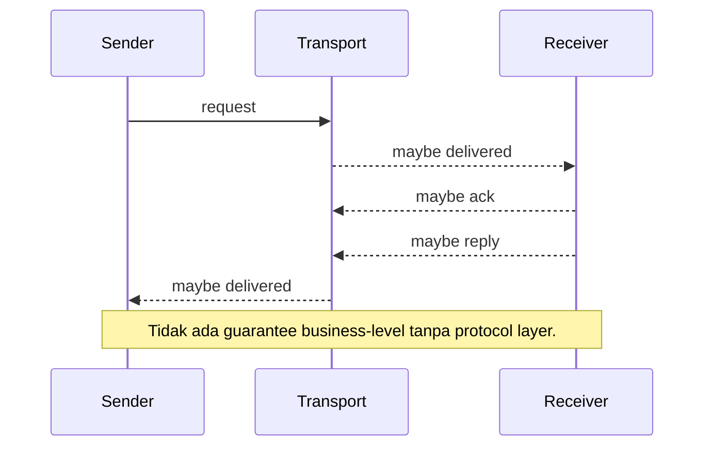
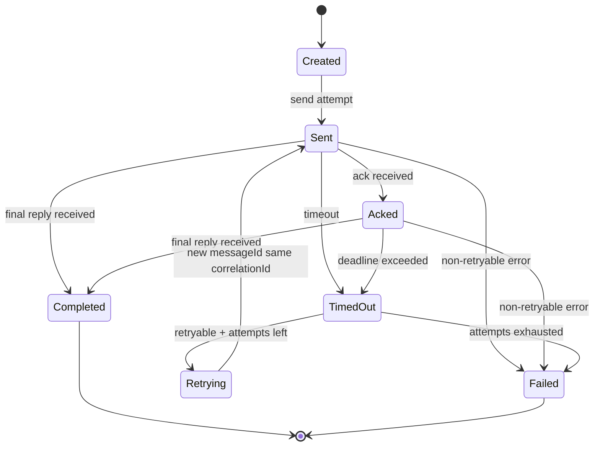
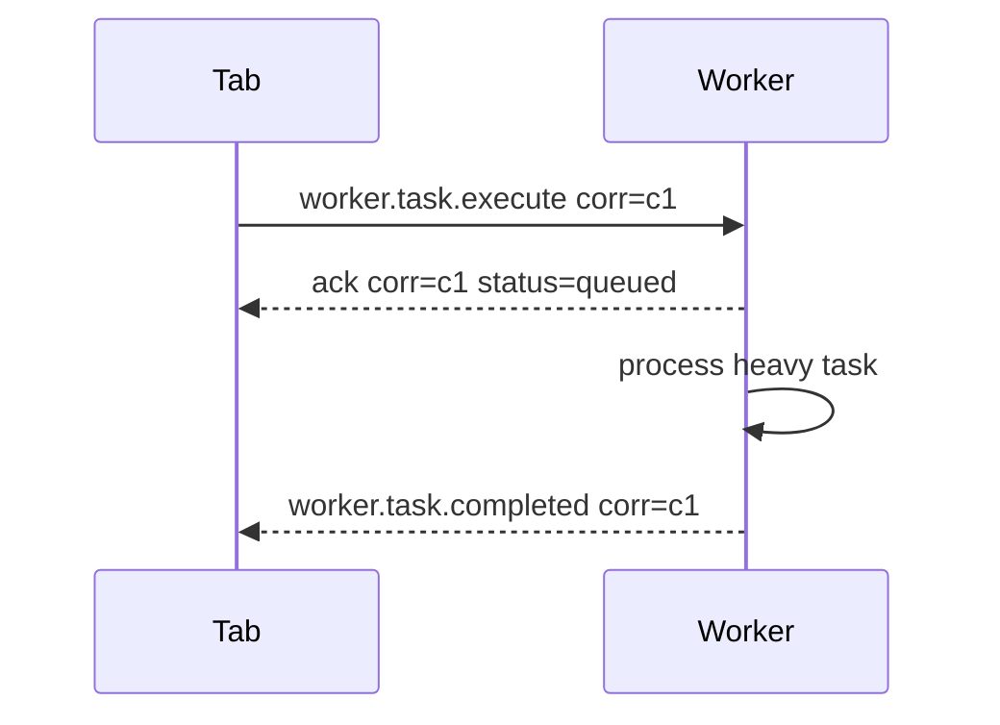
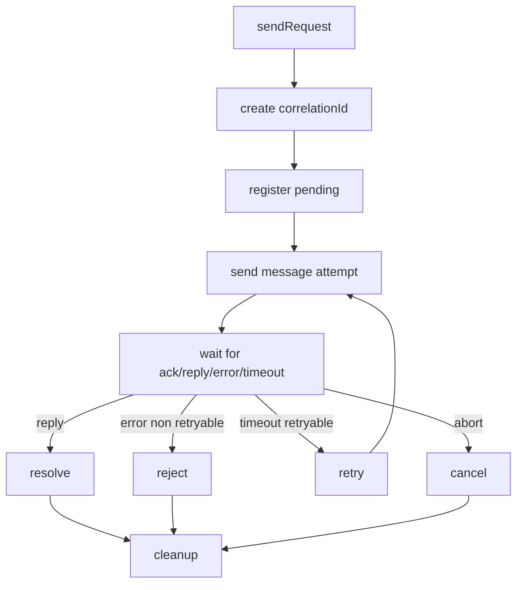
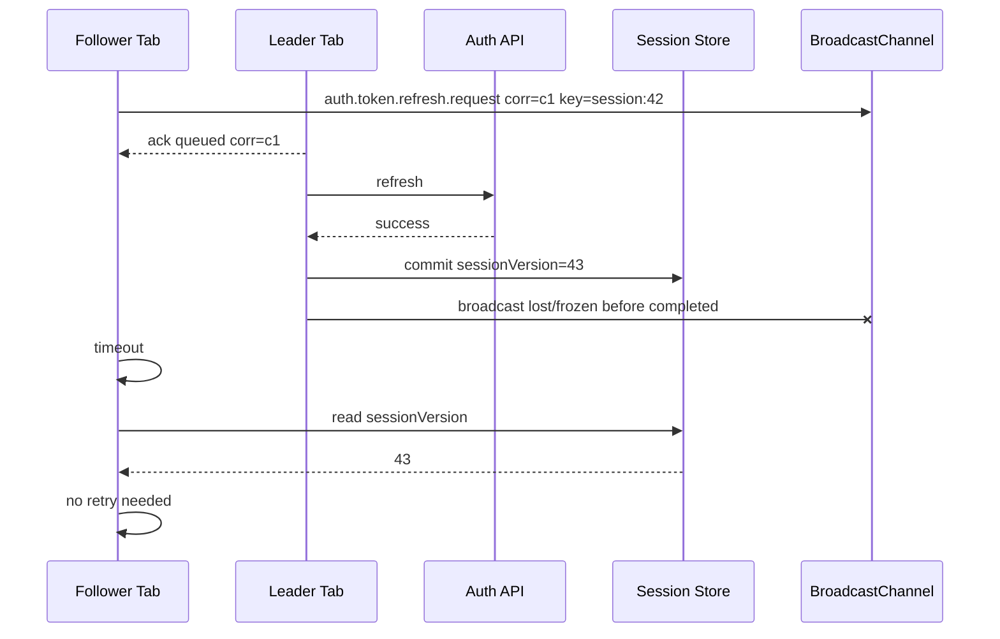
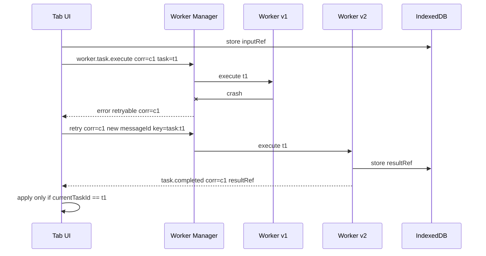
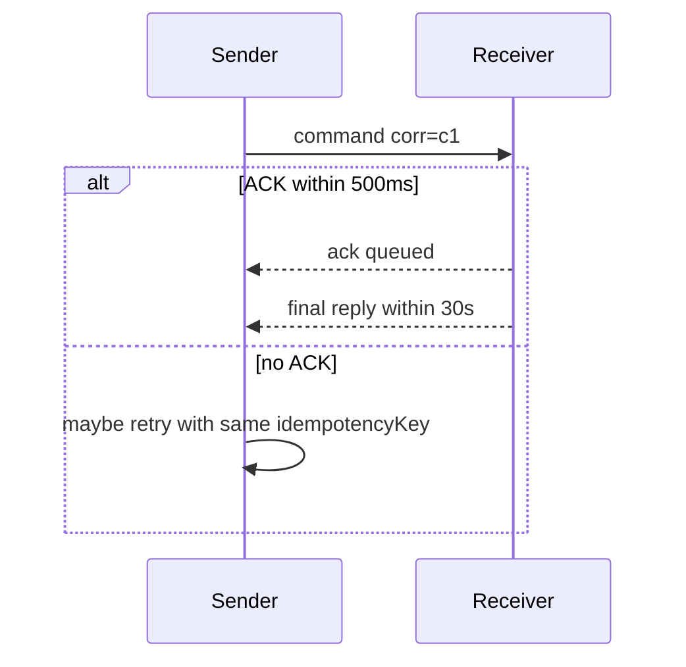

# Part 016 — Correlation ID, ACK, Retry, Timeout, and Idempotency

> Target part ini: membangun reliability layer di atas protocol browser messaging. Kita akan memperlakukan tab, worker, SharedWorker, Service Worker, dan BroadcastChannel seperti network kecil yang asynchronous, tidak selalu hidup, dan tidak memberi guarantee yang cukup untuk business correctness.

Pada part 015 kita mendesain envelope:

```ts
{
  protocol,
  protocolVersion,
  messageId,
  messageType,
  messageKind,
  createdAt,
  deadlineAt,
  sender,
  recipient,
  correlationId,
  causationId,
  idempotencyKey,
  schemaVersion,
  payload,
  meta
}
```

Sekarang kita memakai field itu untuk reliability.

Reliability bukan berarti membuat browser messaging menjadi sempurna.

Reliability berarti:

1. tahu apa yang bisa gagal,
2. membatasi waktu tunggu,
3. membedakan accepted vs completed,
4. retry hanya saat aman,
5. mencegah side effect ganda,
6. ignore response stale,
7. membuat failure observable.

---

## 1. Core Problem

`postMessage()` tidak sama dengan RPC reliable.

Saat sender mengirim message, banyak kemungkinan terjadi:

1. receiver tidak ada,
2. receiver ada tetapi belum siap,
3. receiver menerima tetapi handler gagal,
4. receiver menerima tetapi reply hilang,
5. receiver reply tetapi sender sudah timeout,
6. sender retry lalu receiver memproses dua kali,
7. tab/worker freeze di tengah flow,
8. message lama tiba setelah state berubah,
9. receiver versi lama tidak mengerti schema baru,
10. BroadcastChannel mengirim signal tetapi tidak ada yang sedang mendengar.

Jadi kita perlu desain eksplisit.



---

## 2. Terms: Jangan Campur Aduk

| Term | Makna |
|---|---|
| `messageId` | unique id untuk satu message attempt |
| `correlationId` | id untuk satu request/reply flow |
| `causationId` | id message yang menyebabkan message saat ini |
| `idempotencyKey` | stable key untuk satu operasi bisnis agar side effect tidak dobel |
| ACK | receiver mengatakan message diterima/di-queue, bukan selesai |
| reply | hasil akhir atau intermediate dari request |
| timeout | sender berhenti menunggu setelah durasi tertentu |
| deadline | batas waktu semantik yang dibawa message |
| retry | sender mengirim ulang attempt baru |
| dedupe | receiver mengenali duplicate message/operation |
| stale response | response valid secara schema tetapi tidak lagi relevan |

Ini harus jelas karena banyak bug datang dari satu id dipakai untuk semua tujuan.

---

## 3. Message Identity Model

Untuk satu operasi:

```text
User click: Export Report
Operation: export:report:case-123:client-op-888
Correlation: corr-abc
Attempt 1 Message: msg-001
Attempt 2 Message: msg-002
Final Reply: msg-003 correlation=corr-abc
```

Representasi:

```ts
const correlationId = crypto.randomUUID();
const idempotencyKey = `export-report:${caseId}:${clientOperationId}`;

const requestAttempt1 = createMessage({
  messageType: "worker.report.export.command",
  messageKind: "command",
  correlationId,
  idempotencyKey,
  ttlMs: 30_000,
  payload: { caseId, format: "pdf" },
  schemaVersion: 1,
  sender,
});

const requestAttempt2 = createMessage({
  messageType: "worker.report.export.command",
  messageKind: "command",
  correlationId,
  idempotencyKey,
  ttlMs: 30_000,
  payload: { caseId, format: "pdf" },
  schemaVersion: 1,
  sender,
  meta: { attempt: 2 },
});
```

`messageId` berbeda.

`correlationId` sama.

`idempotencyKey` sama.

---

## 4. Request/Reply State Machine



Catatan penting:

1. ACK bukan completed.
2. Timeout bukan bukti receiver tidak memproses.
3. Retry bisa menghasilkan duplicate side effect jika receiver tidak idempotent.
4. Reply setelah timeout harus bisa di-ignore.
5. Request manager harus cleanup pending entry.

---

## 5. ACK: Accepted vs Completed

ACK sering disalahartikan.

ACK hanya berarti:

> Receiver menerima message dan mungkin sudah menaruhnya di queue.

ACK tidak berarti:

1. operasi berhasil,
2. side effect sudah commit,
3. response final akan pasti datang,
4. retry sudah tidak perlu dalam semua kasus.

Gunakan dua tahap jika operasi lama:



ACK payload:

```ts
type ProtocolAckPayload = {
  accepted: boolean;
  status: "accepted" | "queued" | "duplicate" | "busy";
  retryAfterMs?: number;
  receiverMessageId?: string;
};

type ProtocolAck = ProtocolEnvelope<ProtocolAckPayload> & {
  messageKind: "ack";
  messageType: "protocol.ack";
  correlationId: string;
};
```

ACK berguna untuk:

1. membedakan receiver unreachable vs handler running,
2. update UI dari "sending" ke "processing",
3. early reject saat busy,
4. duplicate detection feedback,
5. queue visibility.

---

## 6. Kapan Perlu ACK?

| Message | ACK? | Alasan |
|---|---:|---|
| heartbeat | Tidak | terlalu noisy |
| logout broadcast | Biasanya tidak | harus idempotent, semua tab apply sendiri |
| worker heavy task | Ya | user perlu tahu task accepted |
| token refresh command ke leader | Ya | follower perlu tahu coordinator menerima |
| cache invalidation event | Tidak | event idempotent, bisa refetch dari source |
| offline mutation enqueue | Ya | user perlu tahu tersimpan/ditolak |
| Service Worker skipWaiting request | Ya | UX perlu status |
| direct query | Tidak selalu; final reply cukup | query cepat tidak perlu dua tahap |

ACK yang terlalu banyak akan menjadi noise dan bisa membuat ACK storm.

---

## 7. Timeout: Sender-Side Contract

Timeout adalah keputusan sender.

Bukan bukti receiver gagal.

```ts
function withTimeout<T>(promise: Promise<T>, timeoutMs: number): Promise<T> {
  return new Promise<T>((resolve, reject) => {
    const timer = setTimeout(() => {
      reject(new Error("REQUEST_TIMEOUT"));
    }, timeoutMs);

    promise.then(
      value => {
        clearTimeout(timer);
        resolve(value);
      },
      error => {
        clearTimeout(timer);
        reject(error);
      },
    );
  });
}
```

Namun request manager lebih kompleks karena reply datang lewat event, bukan return value langsung.

Timeout harus menghasilkan:

1. pending entry cleanup,
2. optional retry,
3. UI state update,
4. metric,
5. stale reply guard.

---

## 8. Deadline: Receiver-Side Hint

Timeout hidup di sender.

Deadline dibawa di message.

```ts
{
  createdAt: 1783497600000,
  deadlineAt: 1783497605000
}
```

Receiver check:

```ts
if (message.deadlineAt && Date.now() > message.deadlineAt) {
  return sendError(message, {
    code: "DEADLINE_EXCEEDED",
    message: "Request expired before processing",
    retryable: false,
  });
}
```

Deadline mencegah receiver memproses pekerjaan yang sudah tidak relevan.

Contoh:

1. search query lama,
2. autocomplete result lama,
3. preview generation lama,
4. stale token refresh request,
5. cache warm request dari page yang sudah hidden.

---

## 9. Timeout vs Deadline

| Concept | Pemilik | Fungsi |
|---|---|---|
| timeout | sender | berapa lama sender mau menunggu |
| deadline | message/protocol | sampai kapan operasi masih meaningful |
| retry delay | sender/retry policy | kapan attempt berikutnya dikirim |
| TTL | event/presence | kapan data dianggap expired |

Contoh:

```text
Timeout sender: 2s
Deadline message: 10s
Retry policy: 3 attempts
```

Artinya sender boleh retry saat tidak menerima reply dalam 2s, tetapi receiver harus menolak jika message sudah lebih dari 10s.

---

## 10. Retry Semantics

Retry hanya aman jika Anda tahu apa yang diretry.

Pertanyaan wajib:

1. Apakah operasi punya side effect?
2. Apakah receiver idempotent?
3. Apakah duplicate bisa diterima?
4. Apakah retry akan memperburuk overload?
5. Apakah error retryable?
6. Apakah deadline masih valid?
7. Apakah user action masih relevan?

---

## 11. Retryability Matrix

| Error / Kondisi | Retry? | Catatan |
|---|---:|---|
| transient worker busy | Ya, dengan backoff | jika deadline masih valid |
| network offline | Ya, tapi masuk offline queue | bukan tight retry loop |
| validation failed | Tidak | bug/schema mismatch |
| unauthorized | Tidak | security/policy issue |
| unsupported schema | Tidak | perlu compatibility handling |
| timeout no ACK | Mungkin | receiver mungkin tidak ada |
| timeout after ACK | Hati-hati | receiver mungkin masih memproses |
| DataCloneError/messageerror | Tidak untuk payload sama | payload harus diperbaiki |
| tab hidden/frozen | Mungkin delay | jangan spam retry |
| duplicate operation | Tidak perlu | return cached result/ack duplicate |

---

## 12. Backoff with Jitter

Jangan retry semua tab secara bersamaan.

Buruk:

```ts
setTimeout(retry, 1000);
```

Lebih baik:

```ts
function computeBackoffMs(attempt: number, baseMs = 200, maxMs = 5_000): number {
  const exponential = Math.min(maxMs, baseMs * 2 ** (attempt - 1));
  const jitter = Math.random() * exponential * 0.3;
  return Math.floor(exponential + jitter);
}
```

Untuk operasi lintas tab, jitter penting untuk mencegah herd effect.

---

## 13. Request Manager

Kita butuh komponen yang mengelola pending request.

Tanggung jawab:

1. generate correlationId,
2. create message attempt,
3. register pending resolver,
4. send via transport,
5. start timeout,
6. process ack/reply/error,
7. retry bila policy mengizinkan,
8. cleanup pending map,
9. reject stale reply,
10. expose cancellation.



---

## 14. Request Manager Types

```ts
type RequestPolicy = {
  timeoutMs: number;
  maxAttempts: number;
  ackTimeoutMs?: number;
  retryBackoffMs?: (attempt: number) => number;
  requireAck?: boolean;
};

type PendingRequest<TReply> = {
  correlationId: string;
  idempotencyKey?: string;
  attempt: number;
  createdAt: number;
  deadlineAt: number;
  resolve: (value: TReply) => void;
  reject: (error: Error) => void;
  timeoutId: number;
  abortController?: AbortController;
  status: "sent" | "acked" | "retrying";
};
```

---

## 15. Request Manager Implementation

```ts
export class ProtocolRequestManager {
  private readonly pending = new Map<string, PendingRequest<unknown>>();

  constructor(
    private readonly runtime: BrowserProtocolRuntime,
    private readonly self: ProtocolActor,
    private readonly transport: TransportAdapter,
  ) {}

  request<TPayload, TReply>(input: {
    messageType: string;
    schemaVersion: number;
    payload: TPayload;
    recipient?: ProtocolRecipient;
    idempotencyKey?: string;
    policy: RequestPolicy;
    signal?: AbortSignal;
  }): Promise<TReply> {
    const correlationId = crypto.randomUUID();
    const createdAt = Date.now();
    const deadlineAt = createdAt + input.policy.timeoutMs * input.policy.maxAttempts;

    return new Promise<TReply>((resolve, reject) => {
      const pending: PendingRequest<TReply> = {
        correlationId,
        idempotencyKey: input.idempotencyKey,
        attempt: 0,
        createdAt,
        deadlineAt,
        resolve,
        reject,
        timeoutId: 0,
        status: "sent",
      };

      this.pending.set(correlationId, pending as PendingRequest<unknown>);

      const abortHandler = () => {
        this.fail(correlationId, new Error("REQUEST_ABORTED"));
      };

      input.signal?.addEventListener("abort", abortHandler, { once: true });

      this.sendAttempt(input, correlationId, deadlineAt);
    });
  }

  receiveReply<TReply>(message: ProtocolEnvelope<TReply>): void {
    const correlationId = message.correlationId;

    if (!correlationId) {
      return;
    }

    const pending = this.pending.get(correlationId) as PendingRequest<TReply> | undefined;

    if (!pending) {
      // Late or duplicate reply. Do not apply.
      return;
    }

    if (Date.now() > pending.deadlineAt) {
      this.fail(correlationId, new Error("REPLY_AFTER_DEADLINE"));
      return;
    }

    clearTimeout(pending.timeoutId);
    this.pending.delete(correlationId);
    pending.resolve(message.payload);
  }

  receiveAck(message: ProtocolEnvelope<ProtocolAckPayload>): void {
    const correlationId = message.correlationId;
    if (!correlationId) return;

    const pending = this.pending.get(correlationId);
    if (!pending) return;

    pending.status = "acked";
  }

  private sendAttempt<TPayload>(input: {
    messageType: string;
    schemaVersion: number;
    payload: TPayload;
    recipient?: ProtocolRecipient;
    idempotencyKey?: string;
    policy: RequestPolicy;
  }, correlationId: string, deadlineAt: number): void {
    const pending = this.pending.get(correlationId);

    if (!pending) return;

    pending.attempt += 1;
    pending.status = "sent";

    const now = Date.now();
    const ttlMs = Math.max(0, deadlineAt - now);

    const message = createMessage({
      messageType: input.messageType,
      messageKind: "command",
      schemaVersion: input.schemaVersion,
      payload: input.payload,
      sender: this.self,
      recipient: input.recipient,
      correlationId,
      idempotencyKey: input.idempotencyKey,
      ttlMs,
      meta: { attempt: pending.attempt },
    });

    this.runtime.send(this.transport, message);

    pending.timeoutId = window.setTimeout(() => {
      this.onTimeout(input, correlationId, deadlineAt);
    }, input.policy.timeoutMs);
  }

  private onTimeout<TPayload>(input: {
    messageType: string;
    schemaVersion: number;
    payload: TPayload;
    recipient?: ProtocolRecipient;
    idempotencyKey?: string;
    policy: RequestPolicy;
  }, correlationId: string, deadlineAt: number): void {
    const pending = this.pending.get(correlationId);

    if (!pending) return;

    const attemptsLeft = pending.attempt < input.policy.maxAttempts;
    const deadlineValid = Date.now() < deadlineAt;

    if (!attemptsLeft || !deadlineValid) {
      this.fail(correlationId, new Error("REQUEST_TIMEOUT"));
      return;
    }

    pending.status = "retrying";

    const delay = input.policy.retryBackoffMs?.(pending.attempt + 1)
      ?? computeBackoffMs(pending.attempt + 1);

    window.setTimeout(() => {
      this.sendAttempt(input, correlationId, deadlineAt);
    }, delay);
  }

  private fail(correlationId: string, error: Error): void {
    const pending = this.pending.get(correlationId);
    if (!pending) return;

    clearTimeout(pending.timeoutId);
    this.pending.delete(correlationId);
    pending.reject(error);
  }
}
```

Ini skeleton. Dalam production, tambahkan:

1. metric,
2. retry reason,
3. abort cleanup,
4. ack timeout berbeda dari final timeout,
5. per-message policy,
6. max pending limit,
7. circuit breaker.

---

## 16. Late Reply Handling

Late reply adalah normal.

Contoh:

1. sender timeout di 2s,
2. receiver selesai di 3s,
3. reply tiba,
4. pending entry sudah tidak ada.

Jangan apply.

```ts
if (!pending.has(reply.correlationId)) {
  metrics.increment("protocol.reply.late_or_unknown", {
    messageType: reply.messageType,
  });
  return;
}
```

Late reply bukan selalu error receiver. Bisa jadi timeout terlalu agresif.

Metric ini penting untuk tuning.

---

## 17. Stale Response Guard

Pending correlation id saja belum cukup.

UI state bisa berubah.

Contoh search:

```text
User query: "ca"
Request correlation: c1
User query: "case"
Request correlation: c2
Reply c1 arrives after c2
```

Guard:

```ts
let currentSearchCorrelationId: string | null = null;

async function search(query: string) {
  const { promise, correlationId } = searchClient.search(query);
  currentSearchCorrelationId = correlationId;

  const result = await promise;

  if (currentSearchCorrelationId !== correlationId) {
    return;
  }

  renderSearchResult(result);
}
```

Untuk entity state, gunakan version:

```ts
if (reply.payload.entityVersion < currentEntityVersion) {
  return;
}
```

Untuk leader ownership, gunakan epoch/fencing token.

---

## 18. Idempotency: Receiver-Side Safety

Retry tanpa idempotency adalah sumber duplicate side effect.

Idempotency berarti:

> Operasi yang sama, dengan idempotencyKey yang sama, menghasilkan efek yang sama meski diterima lebih dari sekali.

Contoh operasi idempotent:

1. set cache version to `v10`,
2. mark notification id `n-1` as seen,
3. enqueue offline op with key `op-123`,
4. refresh token for session version `42` if not already refreshed,
5. execute worker task with task id `t-1` and return cached result.

Contoh tidak idempotent:

1. increment counter,
2. append note tanpa client operation id,
3. generate payment request baru,
4. create draft baru tanpa dedupe key,
5. consume one-time token dua kali.

---

## 19. Dedupe Store

Receiver perlu menyimpan idempotency result.

In-memory cukup untuk ephemeral worker task.

IndexedDB dibutuhkan untuk durable offline operation.

```ts
type DedupeEntry<T = unknown> = {
  idempotencyKey: string;
  status: "processing" | "completed" | "failed";
  createdAt: number;
  expiresAt: number;
  result?: T;
  error?: ProtocolErrorPayload;
};
```

In-memory dedupe:

```ts
export class InMemoryDedupeStore {
  private readonly entries = new Map<string, DedupeEntry>();

  get(key: string): DedupeEntry | undefined {
    const entry = this.entries.get(key);

    if (!entry) return undefined;

    if (Date.now() > entry.expiresAt) {
      this.entries.delete(key);
      return undefined;
    }

    return entry;
  }

  markProcessing(key: string, ttlMs: number): void {
    this.entries.set(key, {
      idempotencyKey: key,
      status: "processing",
      createdAt: Date.now(),
      expiresAt: Date.now() + ttlMs,
    });
  }

  markCompleted<T>(key: string, ttlMs: number, result: T): void {
    this.entries.set(key, {
      idempotencyKey: key,
      status: "completed",
      createdAt: Date.now(),
      expiresAt: Date.now() + ttlMs,
      result,
    });
  }

  markFailed(key: string, ttlMs: number, error: ProtocolErrorPayload): void {
    this.entries.set(key, {
      idempotencyKey: key,
      status: "failed",
      createdAt: Date.now(),
      expiresAt: Date.now() + ttlMs,
      error,
    });
  }
}
```

---

## 20. Idempotent Handler Wrapper

```ts
export function idempotentHandler<TMessage extends ProtocolEnvelope, TResult>(
  store: InMemoryDedupeStore,
  ttlMs: number,
  handler: (message: TMessage) => Promise<TResult>,
): (message: TMessage) => Promise<{ duplicate: boolean; result: TResult }> {
  return async (message: TMessage) => {
    const key = message.idempotencyKey;

    if (!key) {
      const result = await handler(message);
      return { duplicate: false, result };
    }

    const existing = store.get(key);

    if (existing?.status === "completed") {
      return { duplicate: true, result: existing.result as TResult };
    }

    if (existing?.status === "processing") {
      throw new ProtocolError("RESOURCE_BUSY", true, {
        idempotencyKey: key,
      });
    }

    store.markProcessing(key, ttlMs);

    try {
      const result = await handler(message);
      store.markCompleted(key, ttlMs, result);
      return { duplicate: false, result };
    } catch (error) {
      store.markFailed(key, ttlMs, toProtocolErrorPayload(error));
      throw error;
    }
  };
}
```

Policy untuk duplicate processing:

| Existing Status | Response |
|---|---|
| completed | return cached result |
| processing | ACK duplicate/busy, ask sender wait/retry |
| failed retryable | allow retry or return retryable error |
| failed non-retryable | return same error |
| expired | treat as new operation |

---

## 21. ACK with Idempotency

Receiver bisa ACK duplicate dengan status jelas.

```ts
function createDuplicateAck(request: ProtocolEnvelope): ProtocolAck {
  return createMessage({
    messageType: "protocol.ack",
    messageKind: "ack",
    schemaVersion: 1,
    sender: self,
    recipient: { kind: "actor", actorId: request.sender.actorId },
    correlationId: request.correlationId,
    causationId: request.messageId,
    ttlMs: 5_000,
    payload: {
      accepted: true,
      status: "duplicate",
      receiverMessageId: request.messageId,
    },
  });
}
```

Ini membantu sender membedakan:

1. duplicate aman,
2. receiver sibuk,
3. receiver tidak ada,
4. schema ditolak.

---

## 22. Cancellation

Timeout dan retry tidak sama dengan cancellation.

Cancellation berarti sender mengatakan:

> Request ini tidak lagi dibutuhkan. Bila belum diproses, hentikan. Bila sedang diproses dan bisa dihentikan, hentikan. Bila sudah selesai, abaikan result.

Protocol:

```ts
type RequestCancelCommand = ProtocolEnvelope<{
  correlationId: string;
  reason: "user" | "superseded" | "navigation" | "deadline";
}> & {
  messageKind: "command";
  messageType: "protocol.request.cancel";
};
```

Worker task cancellation:

```ts
const controllers = new Map<string, AbortController>();

async function handleTask(message: WorkerTaskExecute) {
  const controller = new AbortController();
  controllers.set(message.correlationId!, controller);

  try {
    await executeTask(message.payload, controller.signal);
  } finally {
    controllers.delete(message.correlationId!);
  }
}

function handleCancel(message: RequestCancelCommand) {
  controllers.get(message.payload.correlationId)?.abort();
}
```

Cancellation harus best-effort.

Tidak semua CPU-bound task bisa dibatalkan instan.

---

## 23. Max In-Flight and Backpressure

Reliability bukan hanya retry. Reliability juga menolak terlalu banyak kerja.

Sender-side:

```ts
const MAX_PENDING = 100;

if (pending.size >= MAX_PENDING) {
  throw new Error("CLIENT_BACKPRESSURE_LIMIT_REACHED");
}
```

Receiver-side:

```ts
const MAX_QUEUE = 50;

if (queue.length >= MAX_QUEUE) {
  return sendAck(request, {
    accepted: false,
    status: "busy",
    retryAfterMs: 1_000,
  });
}
```

Backpressure mencegah:

1. memory leak,
2. hidden tab overload,
3. worker queue tak terbatas,
4. retry storm,
5. UI freeze karena terlalu banyak result event.

---

## 24. Circuit Breaker untuk Transport

Jika transport terus gagal, jangan retry selamanya.

```ts
type CircuitState = "closed" | "open" | "half-open";

class TransportCircuitBreaker {
  private state: CircuitState = "closed";
  private failures = 0;
  private openedAt = 0;

  canSend(): boolean {
    if (this.state === "closed") return true;

    if (this.state === "open" && Date.now() - this.openedAt > 10_000) {
      this.state = "half-open";
      return true;
    }

    return this.state === "half-open";
  }

  recordSuccess(): void {
    this.failures = 0;
    this.state = "closed";
  }

  recordFailure(): void {
    this.failures += 1;

    if (this.failures >= 5) {
      this.state = "open";
      this.openedAt = Date.now();
    }
  }
}
```

Gunakan untuk:

1. Service Worker controller unavailable,
2. SharedWorker connection failing,
3. BroadcastChannel `messageerror` rate tinggi,
4. worker crash loop.

---

## 25. Delivery Semantics

Browser messaging tidak otomatis memberi exactly-once business semantics.

Pilih semantik secara eksplisit.

| Semantics | Makna | Cara Praktis |
|---|---|---|
| at-most-once | kirim sekali, mungkin hilang | fire-and-forget event |
| at-least-once | retry sampai diterima, duplicate mungkin | retry + idempotency |
| effectively-once | duplicate aman secara business | idempotency key + dedupe result |
| exactly-once | hampir selalu klaim berbahaya | hindari sebagai janji sistem |

Untuk browser app, target realistis:

1. at-most-once untuk signal ringan,
2. at-least-once + idempotency untuk command penting,
3. effectively-once untuk user-visible side effect.

---

## 26. Example: Token Refresh Reliability

Problem:

Tab A dan Tab B minta refresh. Leader tab memproses. Leader freeze setelah refresh API berhasil tapi sebelum broadcast completed.

Tanpa durable state, follower timeout lalu retry. Bisa terjadi refresh ganda.

Desain:

1. refresh operation punya `idempotencyKey = session:${sessionId}:refresh:${sessionVersion}`,
2. leader memakai Web Lock atau role ownership,
3. completed event tidak membawa token,
4. token/session metadata disimpan di source of truth yang disepakati,
5. follower yang timeout membaca sessionVersion terbaru sebelum retry.

Flow:



Key insight:

> Completion signal boleh hilang jika durable state bisa membuktikan operasi sudah commit.

---

## 27. Example: Worker Task Retry

Problem:

Dedicated worker crash saat task parsing CSV.

Desain:

1. task punya `taskId`,
2. input besar disimpan sebagai `inputRef`,
3. request punya `idempotencyKey = task:${taskId}`,
4. result disimpan sebagai `resultRef`,
5. worker manager bisa restart worker dan retry task,
6. UI hanya apply result jika task masih current.

Flow:



---

## 28. Example: Offline Mutation Enqueue

Problem:

User menambahkan note saat offline. UI retry karena ACK tidak datang. Tanpa idempotency, note bisa dobel saat replay.

Desain:

```ts
type OfflineMutation = {
  clientOperationId: string;
  entityType: "case";
  entityId: string;
  operation: "add-note";
  payload: {
    noteId: string;
    body: string;
  };
};
```

Idempotency key:

```text
offline:case:case-123:add-note:client-op-789
```

Receiver queue store unique by key.

```ts
async function enqueueOfflineMutation(message: ProtocolEnvelope<OfflineMutation>) {
  const key = message.idempotencyKey!;

  const existing = await queue.getByIdempotencyKey(key);
  if (existing) {
    return existing;
  }

  return queue.insert({
    idempotencyKey: key,
    mutation: message.payload,
    status: "pending",
    createdAt: Date.now(),
  });
}
```

---

## 29. Duplicate Suppression by Message ID vs Idempotency Key

Keduanya berbeda.

| Mechanism | Scope | Dipakai untuk |
|---|---|---|
| messageId dedupe | message attempt | duplicate transport delivery |
| idempotencyKey dedupe | business operation | retry/duplicate side effect prevention |

Jika sender retry dengan messageId baru, messageId dedupe tidak membantu.

Jika business operation sama, idempotencyKey yang menyelamatkan.

---

## 30. Message ID Dedupe Cache

```ts
class MessageDedupeCache {
  private readonly seen = new Map<string, number>();

  constructor(private readonly ttlMs: number) {}

  hasSeen(messageId: string): boolean {
    this.cleanup();

    if (this.seen.has(messageId)) {
      return true;
    }

    this.seen.set(messageId, Date.now() + this.ttlMs);
    return false;
  }

  private cleanup(): void {
    const now = Date.now();

    for (const [messageId, expiresAt] of this.seen) {
      if (expiresAt <= now) {
        this.seen.delete(messageId);
      }
    }
  }
}
```

Use case:

1. bridge yang bisa echo message,
2. storage event fallback,
3. Service Worker broadcast ulang,
4. duplicate adapter registration bug.

---

## 31. Retry Storm Prevention

Multi-tab retry bisa membuat masalah lebih buruk.

Misal 10 tab timeout token refresh lalu semua retry.

Mitigasi:

1. leader election,
2. Web Locks untuk mutual exclusion,
3. single-flight registry,
4. BroadcastChannel status update,
5. jitter,
6. shared durable operation state,
7. maxAttempts kecil,
8. retryAfterMs dari receiver,
9. tab visibility-aware retry.

Visibility-aware policy:

```ts
function shouldRetryNow(): boolean {
  if (document.visibilityState === "visible") {
    return true;
  }

  return false; // or delay until visible for non-critical work
}
```

Hidden tab tidak harus agresif.

---

## 32. Request Coalescing / Single Flight

Jika request sama sedang berjalan, join saja.

```ts
class SingleFlight<T> {
  private readonly inFlight = new Map<string, Promise<T>>();

  run(key: string, factory: () => Promise<T>): Promise<T> {
    const existing = this.inFlight.get(key);
    if (existing) return existing;

    const promise = factory().finally(() => {
      this.inFlight.delete(key);
    });

    this.inFlight.set(key, promise);
    return promise;
  }
}
```

Dipakai untuk:

1. token refresh,
2. cache warm,
3. config fetch,
4. lookup preload,
5. expensive worker task with same input hash.

Single-flight lokal satu context tidak cukup untuk multi-tab. Nanti kita kombinasikan dengan BroadcastChannel/Web Locks.

---

## 33. Error Handling Contract

Typed error:

```ts
type ProtocolErrorPayload = {
  code:
    | "REQUEST_TIMEOUT"
    | "REQUEST_ABORTED"
    | "DEADLINE_EXCEEDED"
    | "VALIDATION_FAILED"
    | "UNAUTHORIZED_MESSAGE_TYPE"
    | "RESOURCE_BUSY"
    | "HANDLER_FAILED"
    | "TRANSPORT_UNAVAILABLE"
    | "DUPLICATE_OPERATION";
  message: string;
  retryable: boolean;
  retryAfterMs?: number;
  details?: Record<string, unknown>;
};
```

Sender policy:

```ts
function shouldRetryError(error: ProtocolErrorPayload): boolean {
  if (!error.retryable) return false;

  switch (error.code) {
    case "RESOURCE_BUSY":
    case "TRANSPORT_UNAVAILABLE":
    case "REQUEST_TIMEOUT":
      return true;

    default:
      return false;
  }
}
```

Jangan retry berdasarkan string message seperti `"failed"`.

---

## 34. ACK Timeout vs Final Timeout

Untuk long-running task, pisahkan:

```ts
const policy = {
  ackTimeoutMs: 500,
  timeoutMs: 30_000,
  maxAttempts: 2,
};
```

Semantics:

1. jika ACK tidak datang dalam 500ms, receiver mungkin tidak reachable,
2. jika ACK datang, UI bisa tampilkan `Processing...`,
3. final reply boleh 30s,
4. retry setelah ACK timeout harus hati-hati jika message mungkin tetap diterima terlambat.

Flow:



---

## 35. Durable vs Ephemeral Reliability

Ephemeral reliability:

1. pending map in memory,
2. in-memory dedupe,
3. timeout and retry while page alive,
4. lost on reload.

Durable reliability:

1. operation saved to IndexedDB/OPFS,
2. retry survives reload,
3. dedupe survives tab crash,
4. queue replay possible,
5. migration needed.

Choose based on business criticality.

| Use Case | Reliability Level |
|---|---|
| autocomplete search | ephemeral |
| parse local CSV preview | ephemeral or resumable |
| logout propagation | idempotent signal + local cleanup |
| offline mutation | durable |
| audit-relevant user action | durable + server idempotency |
| token refresh | coordinated + session version |
| cache invalidation | signal + durable cache version |

---

## 36. Observability Metrics

Minimum metrics:

```text
protocol.request.sent
protocol.request.acked
protocol.request.completed
protocol.request.timeout
protocol.request.retry
protocol.request.failed
protocol.reply.late_or_unknown
protocol.message.duplicate
protocol.message.expired
protocol.error.by_code
protocol.pending.count
protocol.retry.attempts
protocol.handler.duration_ms
```

Fields:

1. messageType,
2. transport,
3. attempt,
4. sender actorType,
5. receiver role,
6. error code,
7. appVersion,
8. visible/hidden state,
9. worker instance id.

Do not log sensitive payload.

---

## 37. Testing Reliability

### 37.1 Fake Transport

```ts
class FakeTransport implements TransportAdapter {
  readonly name = "message-port" as const;
  sent: ProtocolEnvelope[] = [];

  send(envelope: ProtocolEnvelope): void {
    this.sent.push(envelope);
  }

  close(): void {}
}
```

### 37.2 Timeout Test

```ts
it("rejects when reply does not arrive before timeout", async () => {
  const transport = new FakeTransport();
  const manager = new ProtocolRequestManager(runtime, self, transport);

  const promise = manager.request({
    messageType: "worker.task.execute",
    schemaVersion: 1,
    payload: { taskId: "t1" },
    policy: { timeoutMs: 100, maxAttempts: 1 },
  });

  await advanceTimersByTime(101);

  await expect(promise).rejects.toThrow("REQUEST_TIMEOUT");
});
```

### 37.3 Retry Test

```ts
it("retries with same correlationId and idempotencyKey", async () => {
  const transport = new FakeTransport();

  manager.request({
    messageType: "worker.task.execute",
    schemaVersion: 1,
    payload: { taskId: "t1" },
    idempotencyKey: "task:t1",
    policy: { timeoutMs: 100, maxAttempts: 2, retryBackoffMs: () => 0 },
  });

  await advanceTimersByTime(101);

  expect(transport.sent).toHaveLength(2);
  expect(transport.sent[0].messageId).not.toBe(transport.sent[1].messageId);
  expect(transport.sent[0].correlationId).toBe(transport.sent[1].correlationId);
  expect(transport.sent[0].idempotencyKey).toBe(transport.sent[1].idempotencyKey);
});
```

### 37.4 Late Reply Test

```ts
it("ignores late reply after timeout cleanup", async () => {
  const correlationId = "c1";

  manager.forceTimeoutForTest(correlationId);

  manager.receiveReply({
    ...baseReply,
    correlationId,
    payload: { result: "late" },
  });

  expect(ui.applyResult).not.toHaveBeenCalled();
});
```

---

## 38. Chaos Scenarios

Reliability layer harus diuji dengan chaos:

1. drop ACK,
2. drop final reply,
3. duplicate reply,
4. reorder ACK and reply,
5. delay reply beyond timeout,
6. receiver throws,
7. receiver busy,
8. worker terminated mid-task,
9. sender closes tab mid-request,
10. app version mismatch,
11. hidden tab delayed timers,
12. BroadcastChannel unavailable/fallback path.

Untuk setiap scenario, tentukan expected behavior.

Contoh:

| Scenario | Expected |
|---|---|
| final reply duplicate | second ignored |
| ACK arrives after final reply | ignored |
| timeout then final reply | late metric, no state apply |
| retry duplicate operation | cached result returned |
| receiver busy | sender respects retryAfterMs |
| validation failed | no retry |
| deadline expired at receiver | error non-retryable |

---

## 39. Production Policy Defaults

Default yang cukup sehat:

```ts
export const ProtocolPolicies = {
  fastQuery: {
    timeoutMs: 1_500,
    maxAttempts: 1,
  },
  workerTask: {
    ackTimeoutMs: 500,
    timeoutMs: 30_000,
    maxAttempts: 2,
    retryBackoffMs: (attempt: number) => computeBackoffMs(attempt, 300, 2_000),
    requireAck: true,
  },
  broadcastCommand: {
    timeoutMs: 0,
    maxAttempts: 0,
  },
  serviceWorkerControl: {
    ackTimeoutMs: 800,
    timeoutMs: 5_000,
    maxAttempts: 2,
    retryBackoffMs: (attempt: number) => computeBackoffMs(attempt, 200, 1_000),
  },
  offlineMutationEnqueue: {
    ackTimeoutMs: 1_000,
    timeoutMs: 10_000,
    maxAttempts: 3,
    retryBackoffMs: (attempt: number) => computeBackoffMs(attempt, 500, 5_000),
    requireAck: true,
  },
} satisfies Record<string, RequestPolicy>;
```

Jangan satu timeout untuk semua message.

---

## 40. Security Considerations

Reliability mechanism bisa menjadi attack surface.

Risiko:

1. malicious/buggy tab mengirim banyak request dengan unique idempotencyKey,
2. dedupe store penuh,
3. ACK storm,
4. retry storm,
5. log pollution,
6. fake reply dengan correlationId tebakan,
7. destructive command replay.

Mitigasi:

1. max pending per sender,
2. rate limit per messageType,
3. allowlist sender/recipient role,
4. unguessable correlationId,
5. deadline pendek untuk command destructive,
6. no secrets in payload,
7. dedupe TTL,
8. payload size limit,
9. schema validation,
10. ignore unknown protocol.

CorrelationId harus sulit ditebak. `crypto.randomUUID()` cukup praktis untuk client-side unique id generation.

---

## 41. Common Anti-Patterns

### 41.1 Retry Everything

```ts
catch { retry(); }
```

Ini salah.

Validation error tidak akan sembuh dengan retry.
Unauthorized tidak akan sembuh dengan retry.
Unsupported schema tidak akan sembuh dengan retry.

---

### 41.2 Timeout Means Failure

Timeout hanya berarti sender berhenti menunggu.

Receiver mungkin masih memproses.

Karena itu side-effecting command harus idempotent.

---

### 41.3 ACK as Success

ACK queued bukan task completed.

UI yang menampilkan "done" setelah ACK akan membohongi user.

---

### 41.4 CorrelationId as IdempotencyKey

CorrelationId satu flow komunikasi.

IdempotencyKey satu operasi bisnis.

Kadang sama boleh, tetapi default-nya jangan dicampur.

---

### 41.5 Infinite Pending Map

Setiap request yang tidak cleanup adalah memory leak.

Selalu cleanup pada:

1. reply,
2. error,
3. timeout exhausted,
4. abort,
5. transport close,
6. page unload/freeze lifecycle handling.

---

## 42. Design Checklist

Untuk setiap request/reply protocol:

1. Apa correlationId strategy?
2. Apa timeout sender?
3. Apa deadline message?
4. Apakah perlu ACK?
5. ACK berarti apa?
6. Apa final reply type?
7. Apa error code yang mungkin?
8. Mana error yang retryable?
9. Berapa maxAttempts?
10. Apa backoff dan jitter policy?
11. Apa idempotencyKey strategy?
12. Apakah receiver punya dedupe store?
13. TTL dedupe berapa lama?
14. Apa stale response guard?
15. Apa cancellation behavior?
16. Apa max pending limit?
17. Apa metric wajib?
18. Apa expected behavior untuk duplicate reply?
19. Apa expected behavior untuk late reply?
20. Apa expected behavior untuk receiver crash?

---

## 43. Summary

Reliability layer membuat browser orchestration bisa dipercaya.

Key takeaways:

1. `messageId`, `correlationId`, dan `idempotencyKey` punya fungsi berbeda,
2. ACK bukan success,
3. timeout bukan bukti receiver gagal,
4. retry tanpa idempotency berbahaya,
5. deadline membantu receiver menolak pekerjaan basi,
6. stale response guard wajib untuk UI dan entity versioning,
7. duplicate harus diantisipasi,
8. late reply adalah kondisi normal,
9. hidden/frozen tab membuat retry policy harus lifecycle-aware,
10. effectively-once dicapai melalui idempotency dan dedupe, bukan transport magic.

Phase 2 selesai di sini.

Part berikutnya masuk ke Phase 3: Dedicated Worker Architecture. Kita akan mulai membangun worker system secara konkret: ownership, lifecycle, API surface, task routing, backpressure, pool, crash recovery, dan performance budget.

---

## References

- MDN — MessagePort: `postMessage()` method: https://developer.mozilla.org/en-US/docs/Web/API/MessagePort/postMessage
- MDN — MessagePort: `messageerror` event: https://developer.mozilla.org/en-US/docs/Web/API/MessagePort/messageerror_event
- MDN — BroadcastChannel: `postMessage()` method: https://developer.mozilla.org/en-US/docs/Web/API/BroadcastChannel/postMessage
- MDN — Broadcast Channel API: https://developer.mozilla.org/en-US/docs/Web/API/Broadcast_Channel_API
- MDN — The structured clone algorithm: https://developer.mozilla.org/en-US/docs/Web/API/Web_Workers_API/Structured_clone_algorithm
- MDN — Transferable objects: https://developer.mozilla.org/en-US/docs/Web/API/Web_Workers_API/Transferable_objects
- MDN — Crypto `randomUUID()`: https://developer.mozilla.org/en-US/docs/Web/API/Crypto/randomUUID
