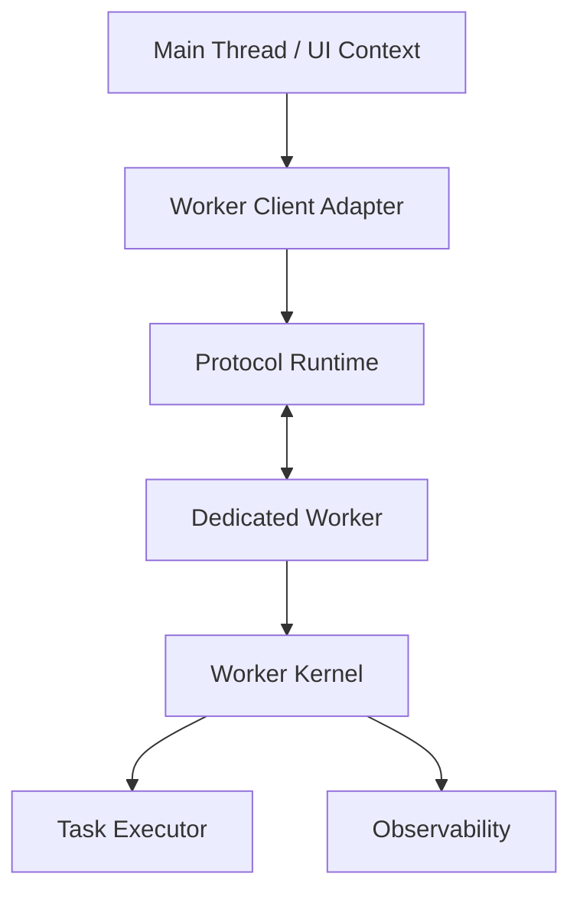
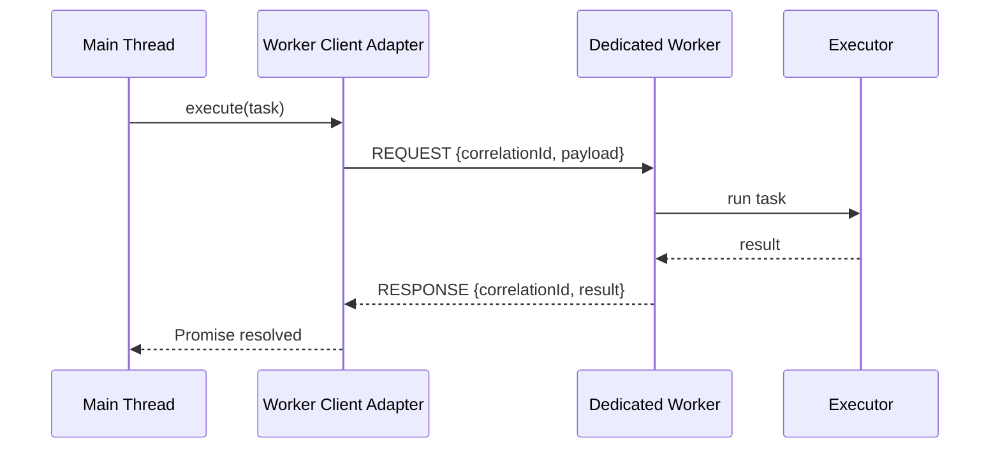
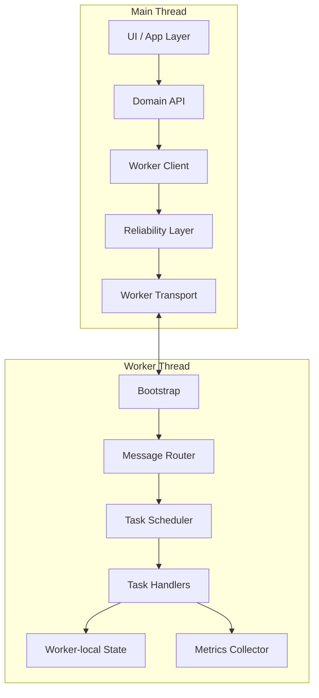
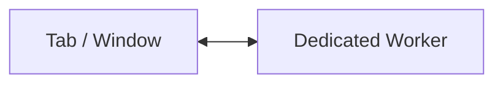
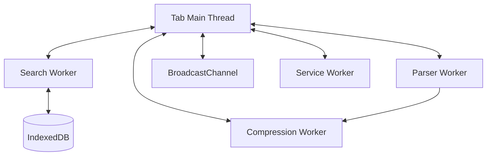
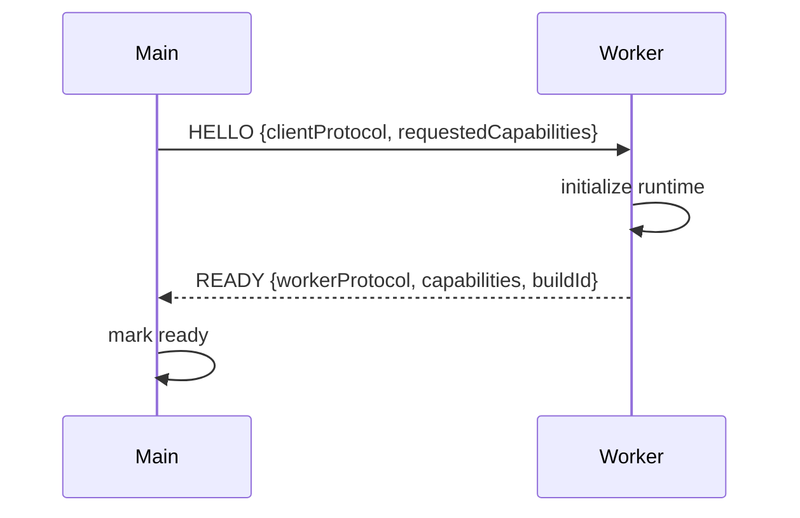
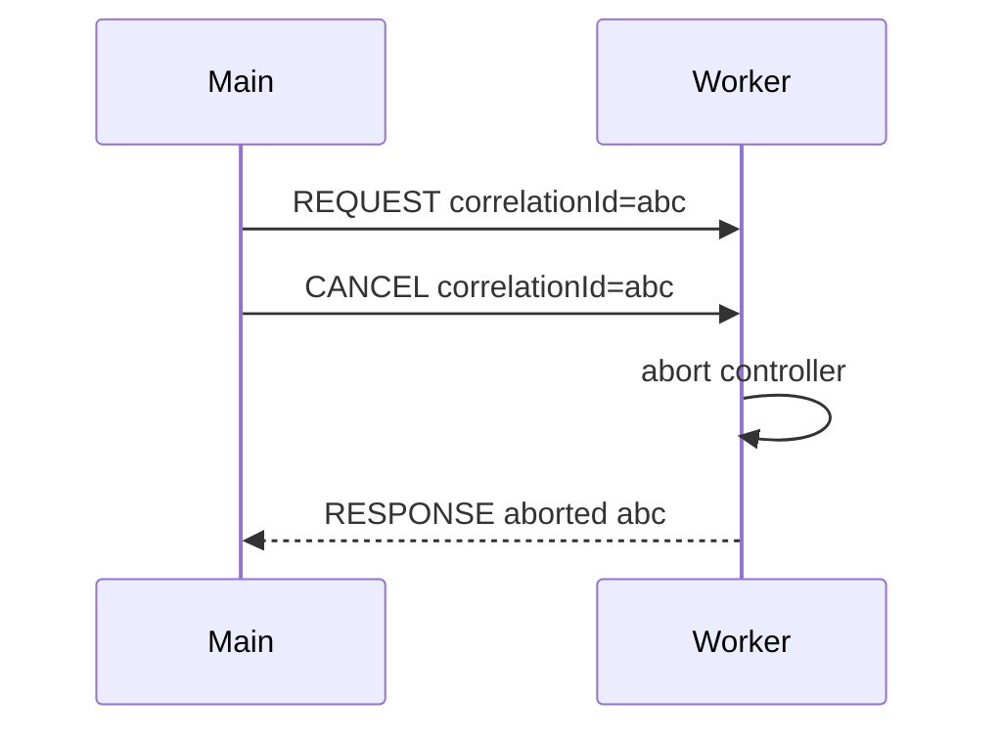
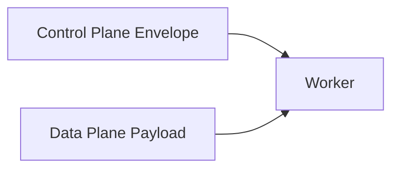
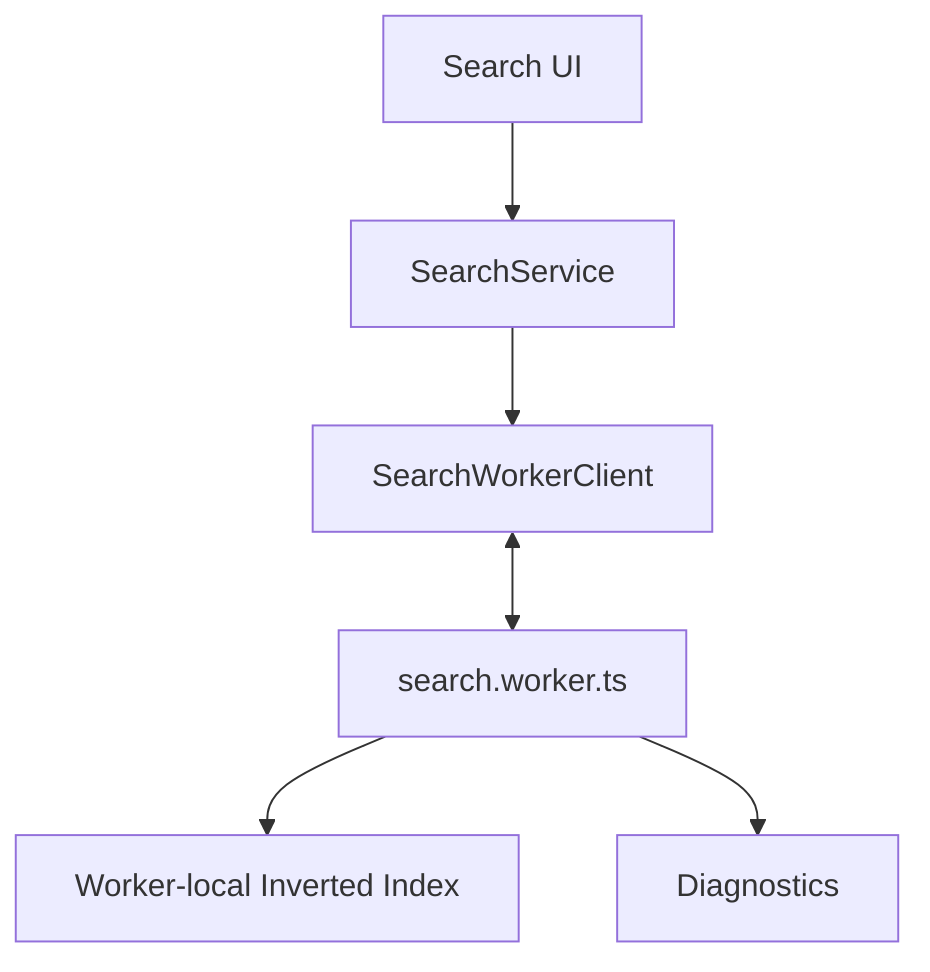
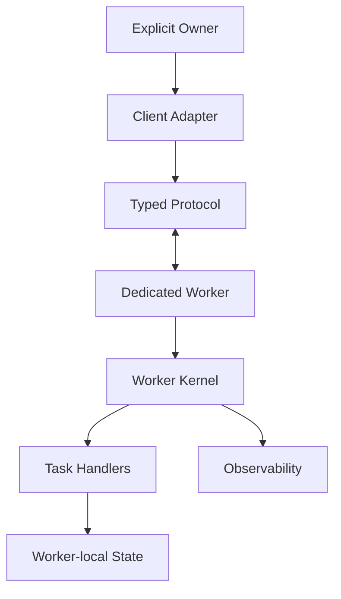

# Part 017 — Dedicated Worker Architecture

> Target part ini: membangun mental model dan rancangan arsitektur Dedicated Worker yang production-ready. Bukan sekadar `new Worker()`, bukan sekadar "pindahkan kerja berat ke background", tetapi membangun boundary, protocol, lifecycle, task execution, cancellation, observability, dan failure handling yang bisa dipakai sebagai fondasi sistem frontend besar.

Dedicated Worker adalah worker yang dimiliki oleh satu creator context: biasanya satu tab/window, iframe, atau worker lain.

Ia berguna ketika satu execution context membutuhkan background execution yang tidak boleh memblokir main thread.

Tapi ada jebakan besar:

> Dedicated Worker bukan silver bullet untuk performa. Ia hanya memindahkan pekerjaan ke event loop lain. Data movement, scheduling, cancellation, memory pressure, dan lifecycle ownership tetap harus didesain.

Di part ini kita akan membangun worker seperti membangun service kecil.

---

## 1. Recap Minimum dari Phase Sebelumnya

Sebelum masuk Dedicated Worker, kita sudah punya beberapa prinsip:

1. browser adalah distributed runtime kecil,
2. setiap tab/worker/context bisa mati, freeze, reload, atau tertinggal versi,
3. messaging bukan function call,
4. payload melewati structured clone atau transfer ownership,
5. reliability harus dibangun di atas primitive messaging,
6. correctness tidak boleh bergantung pada happy path,
7. orchestration butuh protocol, bukan event handler ad-hoc.

Dedicated Worker berada tepat di titik ini:



Worker yang baik bukan file JavaScript yang menerima `onmessage` lalu `switch`.

Worker yang baik adalah runtime kecil dengan:

1. startup handshake,
2. capability declaration,
3. task routing,
4. bounded in-flight work,
5. cancellation,
6. error normalization,
7. response correlation,
8. health reporting,
9. graceful shutdown,
10. memory discipline.

---

## 2. Apa Itu Dedicated Worker secara Praktis

Secara praktis:

```ts
const worker = new Worker(new URL('./compute.worker.ts', import.meta.url), {
  type: 'module',
  name: 'compute-worker',
});
```

Lalu main thread dan worker bertukar message:

```ts
worker.postMessage({ type: 'calculate', payload: { input: [1, 2, 3] } });

worker.addEventListener('message', event => {
  console.log(event.data);
});
```

Di dalam worker:

```ts
self.addEventListener('message', event => {
  const message = event.data;
  self.postMessage({ type: 'result', payload: message.payload });
});
```

Itu cukup untuk demo.

Tidak cukup untuk production.

Production membutuhkan jawaban untuk pertanyaan-pertanyaan ini:

1. Siapa pemilik worker?
2. Kapan worker dibuat?
3. Kapan worker dianggap siap?
4. Apa yang terjadi jika startup gagal?
5. Berapa request maksimum yang boleh in-flight?
6. Bagaimana request dibatalkan?
7. Bagaimana worker tahu request sudah tidak relevan?
8. Bagaimana main thread tahu worker stuck?
9. Bagaimana error dinormalisasi?
10. Bagaimana payload besar dipindahkan?
11. Kapan worker diterminasi?
12. Bagaimana memory leak dicegah?
13. Bagaimana metrics dikumpulkan?
14. Bagaimana behavior diuji?

Dedicated Worker architecture adalah cara menjawab semua pertanyaan itu secara konsisten.

---

## 3. Dedicated Worker Bukan untuk Semua Hal

Gunakan Dedicated Worker ketika ada pekerjaan yang:

1. CPU-bound,
2. tidak membutuhkan DOM,
3. bisa dipecah sebagai message/task,
4. punya input/output yang jelas,
5. bisa dibatalkan atau diberi deadline,
6. cukup mahal untuk membenarkan biaya messaging,
7. tidak butuh koordinasi lintas banyak tab secara langsung.

Contoh cocok:

| Workload | Cocok? | Catatan |
|---|---:|---|
| parsing file besar | Ya | transfer `ArrayBuffer` |
| full-text search lokal | Ya | index bisa hidup di worker |
| compression/decompression | Ya | CPU-heavy |
| image processing | Ya | bisa pakai `ImageBitmap`, `OffscreenCanvas` jika relevan |
| diff besar | Ya | cocok untuk worker task |
| crypto non-trivial | Ya | hati-hati key handling |
| JSON stringify/parse besar | Kadang | data copy cost bisa dominan |
| UI state update | Tidak | DOM/main thread ownership |
| localStorage synchronous ops | Tidak ideal | worker tidak punya `window.localStorage` |
| multi-tab leadership | Tidak sendiri | butuh BroadcastChannel/Web Locks/SharedWorker |

Jangan gunakan worker hanya karena "best practice".

Gunakan worker karena main-thread responsiveness punya risiko nyata.

---

## 4. Mental Model: Worker sebagai Isolated Compute Actor

Dedicated Worker paling mudah dipahami sebagai actor:

1. punya mailbox,
2. menerima message,
3. memproses message secara asynchronous,
4. mengirim response,
5. tidak berbagi stack dengan caller,
6. tidak bisa menyentuh DOM,
7. punya event loop sendiri,
8. hidup selama owner mempertahankannya atau sampai ditutup/diterminasi.



Hal yang sering dilupakan:

> Worker tidak membuat operasi menjadi lebih cepat secara otomatis. Worker membuat operasi tidak mengunci main thread, tetapi total latency bisa naik karena startup, serialization, transfer, scheduling, dan response handling.

---

## 5. Boundary Design

Boundary worker harus jelas.

Worker bukan tempat membuang semua logic yang terasa berat.

Worker harus punya kontrak:

```ts
type WorkerCommand =
  | { type: 'INDEX_DOCUMENTS'; payload: IndexDocumentsPayload }
  | { type: 'SEARCH'; payload: SearchPayload }
  | { type: 'RESET_INDEX'; payload: ResetIndexPayload }
  | { type: 'GET_STATS'; payload: GetStatsPayload };
```

Boundary yang baik punya ciri:

1. command eksplisit,
2. payload structured-clone safe,
3. output deterministic bila input sama,
4. side effect terbatas,
5. no implicit access ke UI state,
6. no hidden global dependency,
7. no unbounded memory retention,
8. bisa diuji tanpa browser UI.

Boundary yang buruk:

```ts
worker.postMessage({ action: 'doStuff', data: entireAppState });
```

Masalahnya:

1. terlalu besar,
2. tidak jelas ownership,
3. susah versioning,
4. susah observability,
5. susah cancellation,
6. raw app state mudah bocor ke worker,
7. structured clone cost tinggi.

### Rule

> Kirim intention dan minimal input, bukan seluruh state tree.

---

## 6. Layered Architecture

Pola arsitektur yang akan kita pakai:



Setiap layer punya tugas.

| Layer | Tanggung jawab | Tidak boleh melakukan |
|---|---|---|
| UI/App | memanggil operasi domain | tahu detail transport worker |
| Domain API | expose method semantik | parsing raw worker event |
| Worker Client | Promise API, timeout, cancellation | menjalankan business task |
| Reliability Layer | correlation, retry, deadline | mengerti UI component |
| Transport | `postMessage`, listener, terminate | business routing |
| Worker Bootstrap | setup runtime | heavy business logic |
| Worker Router | validasi envelope, route command | manipulasi UI |
| Scheduler | concurrency/backpressure | menyimpan app state besar tanpa policy |
| Handlers | eksekusi task | akses DOM |
| Metrics | trace/measure | memengaruhi correctness |

Layering ini mencegah worker berubah menjadi bola lumpur.

---

## 7. Dedicated Worker Topology

Topologi paling sederhana:



Topologi nyata bisa lebih kompleks:



Tapi jangan mulai dari banyak worker.

Mulai dari satu worker yang punya satu reason to exist.

### Dedicated Worker Topology Rules

1. Satu worker untuk satu class workload.
2. Jangan satu worker untuk semua background work kecuali beban kecil dan homogen.
3. Jangan worker-per-request kecuali task sangat jarang dan isolasi lebih penting dari startup cost.
4. Jangan worker pool sebelum single worker punya saturation signal.
5. Jangan biarkan UI component membuat worker sendiri tanpa owner policy.

---

## 8. Worker Ownership

Dedicated Worker selalu punya owner.

Owner ini bisa:

1. module-level singleton,
2. application shell,
3. feature boundary,
4. route-level service,
5. ephemeral action controller.

Contoh buruk:

```tsx
function SearchBox() {
  const worker = new Worker(new URL('./search.worker.ts', import.meta.url));
  // dibuat lagi setiap render/mount pattern yang salah
}
```

Contoh lebih baik:

```ts
export const searchWorkerClient = createSearchWorkerClient();
```

Atau lifecycle-aware:

```ts
class SearchFeatureRuntime {
  private workerClient: SearchWorkerClient | null = null;

  start() {
    this.workerClient ??= createSearchWorkerClient();
  }

  stop() {
    this.workerClient?.shutdown({ reason: 'feature-unmounted' });
    this.workerClient = null;
  }
}
```

### Ownership Invariant

> Satu worker harus punya satu explicit owner yang bertanggung jawab atas spawn, readiness, cancellation, drain, termination, dan metrics.

Kalau tidak ada owner, tidak ada lifecycle.

Kalau tidak ada lifecycle, memory leak dan stale work akan muncul.

---

## 9. Startup Handshake

Jangan anggap worker siap hanya karena constructor sukses.

Constructor sukses berarti browser menerima instruksi membuat worker.

Belum berarti:

1. script sudah loaded,
2. module imports berhasil,
3. runtime initialized,
4. schema/capability cocok,
5. handler registry siap,
6. worker tidak crash saat startup.

Gunakan handshake:



Envelope:

```ts
type HelloMessage = {
  type: 'CONTROL.HELLO';
  protocolVersion: number;
  clientId: string;
  buildId: string;
  requestedCapabilities: string[];
};

type ReadyMessage = {
  type: 'CONTROL.READY';
  protocolVersion: number;
  workerId: string;
  buildId: string;
  capabilities: string[];
  startedAt: number;
};
```

Client side:

```ts
async function waitForReady(worker: Worker, timeoutMs: number): Promise<ReadyMessage> {
  return new Promise((resolve, reject) => {
    const timer = setTimeout(() => {
      cleanup();
      reject(new Error('Worker startup timeout'));
    }, timeoutMs);

    const onMessage = (event: MessageEvent) => {
      const msg = event.data;
      if (msg?.type !== 'CONTROL.READY') return;
      cleanup();
      resolve(msg);
    };

    const onError = (event: ErrorEvent) => {
      cleanup();
      reject(new Error(`Worker startup failed: ${event.message}`));
    };

    const cleanup = () => {
      clearTimeout(timer);
      worker.removeEventListener('message', onMessage);
      worker.removeEventListener('error', onError);
    };

    worker.addEventListener('message', onMessage);
    worker.addEventListener('error', onError);
    worker.postMessage({
      type: 'CONTROL.HELLO',
      protocolVersion: 1,
      clientId: crypto.randomUUID(),
      buildId: import.meta.env?.VITE_BUILD_ID ?? 'dev',
      requestedCapabilities: ['search:v1'],
    });
  });
}
```

### Startup Timeout Is Mandatory

Tanpa startup timeout, UI bisa menunggu selamanya.

Worker bisa gagal load karena:

1. chunk missing,
2. MIME/type error,
3. CSP,
4. module import error,
5. browser unsupported,
6. syntax error,
7. old deployment cache,
8. user offline saat lazy worker chunk diambil.

---

## 10. Capability Negotiation

Worker dan main thread bisa beda build.

Ini terjadi saat:

1. deploy baru sementara tab lama masih hidup,
2. service worker cache menyajikan campuran asset,
3. worker chunk invalidated,
4. user membuka tab lama dari bfcache,
5. HMR/dev mode.

Jangan hanya kirim `version: 1` lalu berharap aman.

Gunakan capability negotiation:

```ts
type WorkerCapability =
  | 'search:index:v1'
  | 'search:query:v1'
  | 'search:query:v2'
  | 'document:parse:v1'
  | 'diagnostics:stats:v1';
```

Handshake result:

```json
{
  "type": "CONTROL.READY",
  "protocolVersion": 3,
  "workerId": "worker-01HZ...",
  "buildId": "2026.07.08.1",
  "capabilities": [
    "search:index:v1",
    "search:query:v2",
    "diagnostics:stats:v1"
  ]
}
```

Client kemudian memilih behavior:

```ts
if (!ready.capabilities.includes('search:query:v2')) {
  // fallback ke v1 atau disable fitur
}
```

### Invariant

> Jangan mengirim command sebelum tahu worker mendukung command tersebut.

---

## 11. Public API: Jangan Bocorkan Transport

Application code sebaiknya tidak memanggil `worker.postMessage()` langsung.

Buat API domain:

```ts
export interface SearchWorkerApi {
  indexDocuments(input: IndexDocumentsInput, options?: WorkerCallOptions): Promise<IndexDocumentsResult>;
  search(input: SearchInput, options?: WorkerCallOptions): Promise<SearchResult>;
  resetIndex(options?: WorkerCallOptions): Promise<void>;
  getStats(options?: WorkerCallOptions): Promise<SearchWorkerStats>;
  shutdown(options?: ShutdownOptions): Promise<void>;
}
```

UI memanggil:

```ts
const result = await searchWorker.search({ query: 'payment dispute', limit: 20 }, {
  timeoutMs: 1500,
  signal: abortController.signal,
});
```

Bukan:

```ts
worker.postMessage({ type: 'SEARCH', payload: { query } });
```

Mengapa?

Karena domain API bisa menyembunyikan:

1. correlation ID,
2. timeout,
3. cancellation,
4. schema validation,
5. retry policy,
6. metrics,
7. fallback,
8. worker restart.

---

## 12. Worker Client Adapter

Adapter adalah facade di main thread.

Tugasnya:

1. spawn worker,
2. wait ready,
3. serialize request,
4. track pending calls,
5. resolve/reject promise,
6. enforce timeout,
7. propagate cancellation,
8. restart worker bila policy mengizinkan,
9. expose health/stats,
10. shutdown.

Skeleton:

```ts
type WorkerCallOptions = {
  timeoutMs?: number;
  signal?: AbortSignal;
  priority?: 'user-blocking' | 'user-visible' | 'background';
  idempotencyKey?: string;
};

type PendingCall = {
  correlationId: string;
  startedAt: number;
  timeoutId: number;
  resolve: (value: unknown) => void;
  reject: (reason: unknown) => void;
  commandType: string;
};

export function createWorkerClient(scriptUrl: URL): SearchWorkerApi {
  const worker = new Worker(scriptUrl, {
    type: 'module',
    name: 'search-worker',
  });

  const pending = new Map<string, PendingCall>();
  let state: 'created' | 'ready' | 'failed' | 'terminated' = 'created';

  worker.addEventListener('message', event => {
    const message = event.data;
    handleWorkerMessage(message);
  });

  worker.addEventListener('messageerror', () => {
    // deserialization failure on message coming from worker
    failAll(new Error('Worker response could not be deserialized'));
  });

  worker.addEventListener('error', event => {
    state = 'failed';
    failAll(new Error(`Worker error: ${event.message}`));
  });

  function request<TResponse>(
    commandType: string,
    payload: unknown,
    options: WorkerCallOptions = {},
    transfer?: Transferable[],
  ): Promise<TResponse> {
    if (state === 'failed' || state === 'terminated') {
      return Promise.reject(new Error(`Worker is not available: ${state}`));
    }

    const correlationId = crypto.randomUUID();
    const timeoutMs = options.timeoutMs ?? 5000;

    return new Promise((resolve, reject) => {
      const timeoutId = window.setTimeout(() => {
        pending.delete(correlationId);
        reject(new Error(`Worker request timeout: ${commandType}`));
      }, timeoutMs);

      pending.set(correlationId, {
        correlationId,
        startedAt: performance.now(),
        timeoutId,
        resolve: resolve as (value: unknown) => void,
        reject,
        commandType,
      });

      options.signal?.addEventListener('abort', () => {
        const call = pending.get(correlationId);
        if (!call) return;
        pending.delete(correlationId);
        clearTimeout(call.timeoutId);
        worker.postMessage({
          type: 'CONTROL.CANCEL',
          correlationId,
          reason: options.signal?.reason ?? 'aborted',
        });
        reject(new DOMException('Worker request aborted', 'AbortError'));
      }, { once: true });

      worker.postMessage({
        type: 'REQUEST',
        commandType,
        correlationId,
        createdAt: Date.now(),
        deadlineAt: Date.now() + timeoutMs,
        payload,
      }, transfer ?? []);
    });
  }

  function handleWorkerMessage(message: any) {
    if (message?.type !== 'RESPONSE') return;

    const call = pending.get(message.correlationId);
    if (!call) {
      // stale response: request was timed out/aborted/replaced
      return;
    }

    pending.delete(message.correlationId);
    clearTimeout(call.timeoutId);

    if (message.ok) {
      call.resolve(message.payload);
    } else {
      call.reject(deserializeWorkerError(message.error));
    }
  }

  function failAll(error: Error) {
    for (const call of pending.values()) {
      clearTimeout(call.timeoutId);
      call.reject(error);
    }
    pending.clear();
  }

  return {
    indexDocuments(input, options) {
      return request('SEARCH.INDEX_DOCUMENTS', input, options);
    },
    search(input, options) {
      return request('SEARCH.QUERY', input, options);
    },
    resetIndex(options) {
      return request('SEARCH.RESET_INDEX', {}, options);
    },
    getStats(options) {
      return request('DIAGNOSTICS.GET_STATS', {}, options);
    },
    async shutdown() {
      state = 'terminated';
      failAll(new Error('Worker shutdown'));
      worker.terminate();
    },
  };
}

function deserializeWorkerError(error: any): Error {
  const e = new Error(error?.message ?? 'Worker request failed');
  e.name = error?.name ?? 'WorkerError';
  return e;
}
```

Ini belum final production runtime.

Tapi sudah menunjukkan prinsip: main thread tidak menganggap worker sebagai function call.

---

## 13. Worker Kernel

Di sisi worker, jangan buat handler global acak.

Bangun kernel:

1. bootstrap,
2. registry handler,
3. validate request,
4. check deadline,
5. route command,
6. execute with cancellation token,
7. normalize result/error,
8. send response,
9. track stats.

```ts
type WorkerHandler<TInput, TOutput> = (ctx: WorkerTaskContext, input: TInput) => Promise<TOutput> | TOutput;

type WorkerTaskContext = {
  correlationId: string;
  deadlineAt: number;
  signal: AbortSignal;
  startedAt: number;
  log: (event: string, fields?: Record<string, unknown>) => void;
};

const handlers = new Map<string, WorkerHandler<any, any>>();

handlers.set('SEARCH.QUERY', async (ctx, input: SearchInput) => {
  ctx.log('search.started', { queryLength: input.query.length });
  return searchIndex.query(input, ctx);
});

handlers.set('SEARCH.INDEX_DOCUMENTS', async (ctx, input: IndexDocumentsInput) => {
  return searchIndex.index(input.documents, ctx);
});
```

Main listener:

```ts
const controllers = new Map<string, AbortController>();

self.addEventListener('message', event => {
  const message = event.data;

  if (message?.type === 'CONTROL.HELLO') {
    self.postMessage({
      type: 'CONTROL.READY',
      protocolVersion: 1,
      workerId: crypto.randomUUID(),
      buildId: '__BUILD_ID__',
      capabilities: [
        'search:index:v1',
        'search:query:v1',
        'diagnostics:stats:v1',
      ],
      startedAt: Date.now(),
    });
    return;
  }

  if (message?.type === 'CONTROL.CANCEL') {
    controllers.get(message.correlationId)?.abort(message.reason ?? 'cancelled');
    return;
  }

  if (message?.type === 'REQUEST') {
    void handleRequest(message);
  }
});
```

Request handler:

```ts
async function handleRequest(message: any) {
  const handler = handlers.get(message.commandType);

  if (!handler) {
    self.postMessage({
      type: 'RESPONSE',
      correlationId: message.correlationId,
      ok: false,
      error: {
        name: 'UnknownCommandError',
        message: `Unknown command: ${message.commandType}`,
      },
    });
    return;
  }

  if (Date.now() > message.deadlineAt) {
    self.postMessage({
      type: 'RESPONSE',
      correlationId: message.correlationId,
      ok: false,
      error: {
        name: 'DeadlineExceededError',
        message: 'Request deadline already exceeded before execution',
      },
    });
    return;
  }

  const controller = new AbortController();
  controllers.set(message.correlationId, controller);

  const ctx: WorkerTaskContext = {
    correlationId: message.correlationId,
    deadlineAt: message.deadlineAt,
    signal: controller.signal,
    startedAt: performance.now(),
    log(event, fields) {
      // optional: buffer logs or post diagnostics
    },
  };

  try {
    const payload = await handler(ctx, message.payload);
    self.postMessage({
      type: 'RESPONSE',
      correlationId: message.correlationId,
      ok: true,
      payload,
      completedAt: Date.now(),
    });
  } catch (error) {
    self.postMessage({
      type: 'RESPONSE',
      correlationId: message.correlationId,
      ok: false,
      error: serializeError(error),
      completedAt: Date.now(),
    });
  } finally {
    controllers.delete(message.correlationId);
  }
}

function serializeError(error: unknown) {
  if (error instanceof Error) {
    return {
      name: error.name,
      message: error.message,
      stack: error.stack,
    };
  }
  return {
    name: 'NonErrorThrown',
    message: String(error),
  };
}
```

### Kernel Invariant

> Semua request masuk melewati satu pintu: validate, route, execute, normalize, respond.

Kalau handler langsung menerima raw message, observability dan reliability akan terfragmentasi.

---

## 14. Task Model

Dedicated Worker bisa menjalankan banyak request secara concurrent secara logical, tapi JavaScript di satu worker tetap satu thread event loop.

Ini berarti:

1. synchronous CPU loop panjang tetap memblokir worker,
2. async I/O bisa interleave,
3. banyak promise bukan berarti parallel CPU,
4. satu worker tidak memberi parallelism internal untuk CPU-heavy tasks,
5. untuk true parallel CPU, gunakan banyak worker atau WASM/thread jika memenuhi syarat.

Task harus punya metadata:

```ts
type WorkerTaskEnvelope<TPayload> = {
  type: 'REQUEST';
  commandType: string;
  correlationId: string;
  idempotencyKey?: string;
  createdAt: number;
  deadlineAt: number;
  priority: 'user-blocking' | 'user-visible' | 'background';
  payload: TPayload;
};
```

Task model minimal:

| Field | Fungsi |
|---|---|
| `correlationId` | match response ke request |
| `idempotencyKey` | mencegah side effect ganda |
| `createdAt` | observability dan stale guard |
| `deadlineAt` | worker bisa menolak kerja basi |
| `priority` | scheduler bisa memilih urutan |
| `commandType` | routing handler |
| `payload` | input domain |

---

## 15. Synchronous CPU Work: Yield atau Chunk

Kesalahan umum:

```ts
function buildIndex(docs: Document[]) {
  for (const doc of docs) {
    heavyTokenize(doc);
  }
}
```

Di main thread ini buruk karena freeze UI.

Di worker ini lebih baik untuk UI, tetapi tetap buruk untuk worker responsiveness.

Worker tidak bisa memproses cancellation message sampai loop selesai.

Solusi: chunking.

```ts
async function buildIndex(ctx: WorkerTaskContext, docs: Document[]) {
  const batchSize = 100;

  for (let i = 0; i < docs.length; i += batchSize) {
    if (ctx.signal.aborted) {
      throw new DOMException('Indexing aborted', 'AbortError');
    }

    if (Date.now() > ctx.deadlineAt) {
      throw new Error('Indexing deadline exceeded');
    }

    const batch = docs.slice(i, i + batchSize);
    for (const doc of batch) {
      heavyTokenize(doc);
    }

    await yieldToWorkerEventLoop();
  }
}

function yieldToWorkerEventLoop(): Promise<void> {
  return new Promise(resolve => setTimeout(resolve, 0));
}
```

Ini memberi kesempatan worker untuk:

1. menerima cancel,
2. menerima diagnostics request,
3. memproses heartbeat,
4. mengirim progress,
5. tidak menjadi black box.

### Rule

> Worker tidak butuh 60fps rendering, tetapi tetap butuh cooperative scheduling.

---

## 16. Progress Reporting

Long-running task sebaiknya bisa mengirim progress.

```ts
self.postMessage({
  type: 'EVENT',
  eventType: 'TASK.PROGRESS',
  correlationId: ctx.correlationId,
  payload: {
    processed,
    total,
    phase: 'tokenizing',
  },
});
```

Client:

```ts
type WorkerCallOptions = {
  timeoutMs?: number;
  signal?: AbortSignal;
  onProgress?: (progress: TaskProgress) => void;
};
```

Pending call:

```ts
type PendingCall = {
  correlationId: string;
  resolve: (value: unknown) => void;
  reject: (reason: unknown) => void;
  onProgress?: (progress: TaskProgress) => void;
};
```

Handler:

```ts
if (message.type === 'EVENT' && message.eventType === 'TASK.PROGRESS') {
  pending.get(message.correlationId)?.onProgress?.(message.payload);
}
```

Progress bukan correctness.

Progress adalah UX dan observability.

Jangan jadikan progress sebagai source of truth final result.

---

## 17. Backpressure

Tanpa backpressure, main thread bisa membanjiri worker.

```ts
for (const file of files) {
  workerClient.parse(file);
}
```

Jika `files` berisi 10.000 item, Anda baru saja membuat memory pressure dan queue yang tidak terkendali.

Backpressure bisa diterapkan di client adapter:

```ts
class BoundedWorkerClient {
  private maxInFlight = 8;
  private pendingQueue: Array<() => void> = [];
  private inFlight = 0;

  async schedule<T>(operation: () => Promise<T>): Promise<T> {
    if (this.inFlight >= this.maxInFlight) {
      await new Promise<void>(resolve => this.pendingQueue.push(resolve));
    }

    this.inFlight++;
    try {
      return await operation();
    } finally {
      this.inFlight--;
      this.pendingQueue.shift()?.();
    }
  }
}
```

Backpressure juga bisa diterapkan di worker:

```ts
const maxActiveTasks = 4;
let activeTasks = 0;
const taskQueue: any[] = [];

function enqueueTask(message: any) {
  if (activeTasks >= maxActiveTasks) {
    taskQueue.push(message);
    return;
  }

  activeTasks++;
  void handleRequest(message).finally(() => {
    activeTasks--;
    const next = taskQueue.shift();
    if (next) enqueueTask(next);
  });
}
```

Namun untuk CPU-bound task di satu worker, `maxActiveTasks > 1` sering tidak memberi benefit besar.

Ia hanya berguna bila task banyak menunggu async I/O.

### Backpressure Invariant

> Setiap worker client harus punya batas in-flight. Tidak ada unbounded Promise map.

---

## 18. Cancellation

Abort di main thread tidak otomatis menghentikan kerja di worker.

Harus ada protocol:



Client side:

```ts
options.signal?.addEventListener('abort', () => {
  worker.postMessage({
    type: 'CONTROL.CANCEL',
    correlationId,
    reason: options.signal?.reason ?? 'aborted',
  });
});
```

Worker side:

```ts
if (message.type === 'CONTROL.CANCEL') {
  controllers.get(message.correlationId)?.abort(message.reason);
}
```

Task handler harus cooperative:

```ts
function throwIfCancelled(ctx: WorkerTaskContext) {
  if (ctx.signal.aborted) {
    throw new DOMException('Task cancelled', 'AbortError');
  }
}
```

Tidak cukup hanya punya cancel message.

Handler harus check `signal.aborted` pada boundary yang masuk akal.

---

## 19. Transferables dan Data Plane

Untuk payload besar, jangan copy jika bisa transfer.

Misalnya file parsing:

```ts
const buffer = await file.arrayBuffer();
worker.postMessage({
  type: 'REQUEST',
  commandType: 'FILE.PARSE',
  correlationId,
  payload: { buffer },
}, [buffer]);
```

Setelah transfer, sender tidak boleh mengandalkan buffer lama tetap usable.

Arsitektur yang baik memisahkan:

1. control plane: envelope kecil,
2. data plane: `ArrayBuffer`, `MessagePort`, stream-like chunking, atau OPFS reference.



### Data Plane Strategy

| Payload | Strategy |
|---|---|
| small JSON | structured clone |
| medium object | structured clone + budget |
| large binary | transferable `ArrayBuffer` |
| repeated large data | worker-local cache/index |
| huge durable data | IndexedDB/OPFS reference + signal |
| streaming-like input | chunked messages with backpressure |

### Anti-pattern

```ts
worker.postMessage({
  type: 'ANALYZE',
  payload: {
    entireReduxState,
    allDocuments,
    allUserSettings,
    allCachedResponses,
  },
});
```

Itu bukan worker architecture.

Itu distributed garbage truck.

---

## 20. Worker-local State

Dedicated Worker boleh punya local state.

Contoh:

1. search index,
2. parsed schema cache,
3. WASM module instance,
4. compiled regex set,
5. dictionary/tokenizer,
6. incremental computation state.

Tapi state harus punya policy:

1. bagaimana dibuat,
2. kapan invalidated,
3. berapa maksimum size,
4. bagaimana reset,
5. bagaimana diagnostics,
6. bagaimana schema version,
7. bagaimana jika worker restart.

Contoh worker-local index:

```ts
class SearchIndexRuntime {
  private index: SearchIndex | null = null;
  private generation = 0;

  async rebuild(ctx: WorkerTaskContext, documents: Document[]) {
    const next = new SearchIndex();
    await next.build(ctx, documents);
    this.index = next;
    this.generation++;
    return { generation: this.generation, documentCount: documents.length };
  }

  query(input: SearchInput) {
    if (!this.index) {
      throw new Error('Search index is not initialized');
    }
    return {
      generation: this.generation,
      results: this.index.query(input.query, input.limit),
    };
  }

  reset() {
    this.index = null;
    this.generation++;
  }

  stats() {
    return {
      generation: this.generation,
      initialized: this.index !== null,
      estimatedMemoryBytes: this.index?.estimatedMemoryBytes() ?? 0,
    };
  }
}
```

### State Invariant

> Worker-local state is cache or derived state unless explicitly made durable somewhere else.

Jika worker mati, state hilang.

Kalau state penting, persist ke IndexedDB/OPFS atau bisa direbuild.

---

## 21. Error Boundary

Worker error harus dinormalisasi.

Error kategori:

| Error | Meaning | Recovery |
|---|---|---|
| `ValidationError` | payload invalid | caller bug / user input |
| `UnknownCommandError` | protocol mismatch | version/capability issue |
| `DeadlineExceededError` | task stale/too slow | retry? maybe smaller chunk |
| `AbortError` | caller cancelled | expected |
| `ResourceLimitError` | memory/quota/budget | degrade/fallback |
| `WorkerCrashedError` | uncaught error/load failure | restart policy |
| `DeserializeError` | structured clone failure | payload/schema bug |

Worker response error format:

```ts
type WorkerErrorResponse = {
  type: 'RESPONSE';
  correlationId: string;
  ok: false;
  error: {
    name: string;
    message: string;
    code?: string;
    retryable?: boolean;
    details?: unknown;
    stack?: string;
  };
};
```

Jangan lempar raw object ke caller.

Jangan expose stack di production user-visible UI.

Stack berguna untuk telemetry, bukan untuk user.

---

## 22. Observability

Dedicated Worker adalah black box jika tidak diberi telemetry.

Minimal metrics:

1. worker startup latency,
2. worker ready/fail count,
3. request count by command,
4. request latency by command,
5. timeout count,
6. abort count,
7. error count by name/code,
8. in-flight request gauge,
9. queue length,
10. payload size estimate,
11. transfer vs clone strategy,
12. worker restart count,
13. last heartbeat age,
14. memory approximation if available/derivable.

Diagnostics command:

```ts
handlers.set('DIAGNOSTICS.GET_STATS', () => {
  return {
    startedAt,
    uptimeMs: Date.now() - startedAt,
    activeTasks: controllers.size,
    completedTasks,
    failedTasks,
    index: searchIndex.stats(),
  };
});
```

Client can poll on debug panel:

```ts
const stats = await workerClient.getStats({ timeoutMs: 500 });
console.table(stats);
```

### Observability Rule

> Every worker should answer: what are you doing, how busy are you, and what failed recently?

---

## 23. Heartbeat

Heartbeat bukan selalu wajib untuk Dedicated Worker sederhana.

Namun untuk worker runtime penting, heartbeat berguna membedakan:

1. idle sehat,
2. busy normal,
3. stuck CPU loop,
4. crashed/terminated,
5. main thread listener leak.

Pattern:

```ts
setInterval(() => {
  self.postMessage({
    type: 'EVENT',
    eventType: 'WORKER.HEARTBEAT',
    payload: {
      now: Date.now(),
      activeTasks: controllers.size,
      completedTasks,
    },
  });
}, 5000);
```

Caveat:

1. heartbeat bisa delayed jika worker sedang CPU-bound loop,
2. heartbeat bukan proof semua task benar,
3. heartbeat harus ringan,
4. heartbeat jangan terlalu sering,
5. heartbeat harus dimatikan saat shutdown.

---

## 24. Worker Script Packaging

Modern bundler biasanya mendukung:

```ts
new Worker(new URL('./worker.ts', import.meta.url), { type: 'module' });
```

Hal yang harus diuji:

1. dev server,
2. production build,
3. code splitting,
4. asset base path,
5. CDN caching,
6. service worker caching,
7. CSP worker-src,
8. module worker support target browser,
9. sourcemap availability,
10. error reporting stack mapping.

Checklist build:

```txt
[ ] worker chunk emitted
[ ] worker chunk cache policy correct
[ ] worker chunk served with correct MIME
[ ] worker script allowed by CSP worker-src
[ ] source maps available in non-prod/debug
[ ] old tab + new deploy compatibility tested
[ ] service worker does not serve mixed incompatible chunks
```

Part 019 akan mendalami module workers dan bundling.

Di part ini cukup ingat:

> Worker architecture tidak selesai di TypeScript. Ia harus survive build pipeline dan deployment pipeline.

---

## 25. Security Boundary

Worker same-origin bukan berarti safe automatically.

Worker bisa menerima sensitive payload.

Prinsip:

1. minimalkan data rahasia yang dikirim ke worker,
2. jangan broadcast secret,
3. validasi command,
4. validate payload shape,
5. jangan expose arbitrary eval/execute command,
6. jangan biarkan worker menjadi confused deputy,
7. jangan log token/PII,
8. consider origin isolation jika memakai SharedArrayBuffer,
9. enforce capability list,
10. treat worker input as untrusted internal boundary.

Bad:

```ts
worker.postMessage({
  type: 'RUN_CODE',
  payload: userProvidedJavaScript,
});
```

Bad:

```ts
worker.postMessage({
  type: 'PROCESS',
  payload: {
    accessToken,
    refreshToken,
    fullUserProfile,
  },
});
```

Better:

```ts
worker.postMessage({
  type: 'PROCESS_PUBLIC_DATA',
  payload: {
    documentId,
    sanitizedContent,
  },
});
```

---

## 26. Example Architecture: Local Search Worker

Kita desain search worker untuk aplikasi case management.

Requirement:

1. user mengetik query,
2. main thread tidak boleh freeze,
3. index dokumen lokal bisa besar,
4. search harus cancel stale query,
5. index rebuild bisa progress,
6. worker bisa reset saat tenant/session berubah,
7. worker harus expose stats.

Topology:



Domain API:

```ts
export class SearchService {
  constructor(private readonly worker: SearchWorkerApi) {}

  async search(query: string, signal: AbortSignal) {
    if (query.trim().length < 2) return { results: [] };

    return this.worker.search({
      query,
      limit: 20,
    }, {
      signal,
      timeoutMs: 800,
      priority: 'user-blocking',
    });
  }

  async rebuildIndex(documents: Document[], onProgress: (p: TaskProgress) => void) {
    return this.worker.indexDocuments({ documents }, {
      timeoutMs: 60_000,
      priority: 'background',
      onProgress,
    });
  }
}
```

UI cancellation:

```ts
let currentSearch: AbortController | null = null;

async function onQueryChanged(query: string) {
  currentSearch?.abort('superseded-by-new-query');
  currentSearch = new AbortController();

  try {
    const result = await searchService.search(query, currentSearch.signal);
    render(result);
  } catch (error) {
    if (error instanceof DOMException && error.name === 'AbortError') return;
    showSearchError(error);
  }
}
```

This prevents stale results.

---

## 27. Worker Runtime File Layout

Recommended structure:

```txt
src/workers/search/
  search.worker.ts
  search-worker-client.ts
  protocol.ts
  handlers/
    index-documents.ts
    query.ts
    reset-index.ts
    get-stats.ts
  runtime/
    worker-kernel.ts
    scheduler.ts
    errors.ts
    validation.ts
    metrics.ts
  domain/
    inverted-index.ts
    tokenizer.ts
    scoring.ts
  tests/
    search-worker-client.test.ts
    worker-kernel.test.ts
    inverted-index.test.ts
```

Why separate `protocol.ts`?

Karena protocol dipakai dua sisi:

1. main thread client,
2. worker runtime.

Why separate `domain`?

Agar search algorithm bisa diuji tanpa browser worker.

Why separate `runtime`?

Agar reliability layer tidak bercampur dengan domain algorithm.

---

## 28. Testing Strategy

Test matrix:

| Layer | Test |
|---|---|
| domain algorithm | pure unit test |
| protocol validation | unit test |
| worker kernel | simulated message test |
| client adapter | fake worker test |
| real worker integration | browser test |
| cancellation | delayed handler test |
| timeout | never-response test |
| serialization | invalid payload test |
| restart | crash/fail handler test |
| performance | benchmark realistic payload |

Fake worker for client tests:

```ts
class FakeWorker extends EventTarget {
  sent: any[] = [];

  postMessage(message: any) {
    this.sent.push(message);
  }

  emitMessage(message: any) {
    this.dispatchEvent(new MessageEvent('message', { data: message }));
  }

  terminate() {}
}
```

Client timeout test:

```ts
it('rejects when worker does not respond before timeout', async () => {
  const fake = new FakeWorker();
  const client = createWorkerClientFromTransport(fake as any);

  await expect(client.search({ query: 'abc', limit: 10 }, { timeoutMs: 1 }))
    .rejects
    .toThrow(/timeout/i);
});
```

---

## 29. Performance Budget

A worker architecture should define budgets.

Example:

| Metric | Budget |
|---|---:|
| startup ready | < 300ms warm, < 1500ms cold |
| search response | p95 < 100ms for indexed query |
| index rebuild progress interval | every 250–1000ms |
| max in-flight requests | 4–16 depending workload |
| max JSON payload | 1–5MB before redesign |
| max transferred buffer | workload dependent, measured |
| timeout user-blocking | 500–2000ms |
| timeout background | 30–120s |

These are not universal constants.

They are starting points.

Measure with your real devices.

Especially low-end Android.

---

## 30. Common Anti-Patterns

### Anti-pattern 1 — Worker as Dumping Ground

```ts
worker.postMessage({ type: 'DO_EVERYTHING', payload: appState });
```

Fix: explicit commands and bounded payloads.

### Anti-pattern 2 — No Timeout

```ts
await workerCall(); // maybe forever
```

Fix: deadline and timeout every request.

### Anti-pattern 3 — No Stale Response Guard

```ts
render(await search(query));
```

Fix: abort previous query or compare request generation.

### Anti-pattern 4 — Unbounded Pending Map

```ts
pending.set(id, promiseCallbacks); // never removed on error
```

Fix: timeout, failAll on crash, cleanup on shutdown.

### Anti-pattern 5 — Copy Huge Payload Repeatedly

```ts
worker.postMessage({ documents: hugeDocuments });
```

Fix: transfer buffers, store derived index, send references/deltas.

### Anti-pattern 6 — Component-Owned Worker Without Cleanup

```tsx
useEffect(() => {
  const worker = new Worker('/worker.js');
}, []);
```

Fix: owner runtime and cleanup.

### Anti-pattern 7 — No Version/Capa Check

```ts
worker.postMessage({ type: 'NEW_COMMAND_V3' });
```

Fix: READY capabilities.

---

## 31. Design Decision Matrix

| Need | Use Dedicated Worker? | Better Alternative |
|---|---:|---|
| offload CPU from current tab | Yes | worker pool if parallel |
| share state across tabs | Not alone | SharedWorker/BroadcastChannel/IndexedDB |
| intercept network | No | Service Worker |
| coordinate token refresh across tabs | Not alone | Web Locks + BroadcastChannel |
| parse large file from one tab | Yes | transferable buffer |
| persist durable offline queue | Not alone | IndexedDB + orchestrator |
| render canvas off-main-thread | Yes | OffscreenCanvas worker |
| run long background task after tab closed | No | service worker where supported/appropriate |
| isolate risky computation | Partly | sandboxed iframe may be needed |

---

## 32. Production Checklist

Before shipping worker architecture:

```txt
[ ] Explicit owner exists
[ ] Startup handshake exists
[ ] Startup timeout exists
[ ] Protocol version exists
[ ] Capability negotiation exists
[ ] Every request has correlationId
[ ] Every request has timeout/deadline
[ ] Pending map is bounded or backpressured
[ ] Abort/cancel protocol exists for long tasks
[ ] Long CPU loops yield/check cancellation
[ ] Large payload strategy chosen: clone/transfer/reference
[ ] Worker-local state has invalidation/reset policy
[ ] Error format normalized
[ ] worker.onerror handled
[ ] worker.messageerror handled
[ ] worker.terminate used on shutdown
[ ] All pending calls rejected on shutdown/crash
[ ] Metrics emitted
[ ] Debug stats command exists
[ ] Tests include timeout/cancel/stale response
[ ] Build output verified in production mode
[ ] CSP worker-src verified
[ ] Old tab/new deploy compatibility considered
```

---

## 33. What This Part Establishes

Dedicated Worker architecture is not mainly about syntax.

It is about boundary and lifecycle.

The essential model:



If you remember one thing:

> Treat a Dedicated Worker as a small service owned by one browser context. Give it a protocol, lifecycle, deadline, cancellation, backpressure, and telemetry.

---

## 34. Exercises

### Exercise 1 — Worker Boundary Review

Pick a CPU-heavy feature in your application.

Write:

1. command names,
2. payload shape,
3. response shape,
4. timeout,
5. cancellation behavior,
6. max payload size,
7. state invalidation rule.

If you cannot answer these, the worker boundary is not ready.

### Exercise 2 — Stale Search Result

Implement search worker client with:

1. abort previous query,
2. correlation ID,
3. timeout,
4. stale response ignore,
5. progress event optional.

### Exercise 3 — Payload Budget

Measure latency for:

1. clone 1MB JSON,
2. clone 10MB JSON,
3. transfer 10MB ArrayBuffer,
4. worker-local cache with small command.

Write down where clone becomes unacceptable on target devices.

### Exercise 4 — Error Normalization

Make one handler throw:

1. `Error`,
2. string,
3. object,
4. DOMException,
5. validation error.

Normalize all into one response schema.

---

## 35. References

- MDN — Web Workers API: https://developer.mozilla.org/en-US/docs/Web/API/Web_Workers_API
- MDN — Worker: https://developer.mozilla.org/en-US/docs/Web/API/Worker
- MDN — Worker constructor: https://developer.mozilla.org/en-US/docs/Web/API/Worker/Worker
- MDN — Worker.postMessage: https://developer.mozilla.org/en-US/docs/Web/API/Worker/postMessage
- MDN — Worker.terminate: https://developer.mozilla.org/en-US/docs/Web/API/Worker/terminate
- MDN — DedicatedWorkerGlobalScope: https://developer.mozilla.org/en-US/docs/Web/API/DedicatedWorkerGlobalScope
- MDN — Structured clone algorithm: https://developer.mozilla.org/en-US/docs/Web/API/Web_Workers_API/Structured_clone_algorithm

---

## 36. Next

Part 018 akan masuk lebih dalam ke lifecycle dan ownership:

1. worker state machine,
2. startup/readiness,
3. drain vs terminate,
4. crash recovery,
5. page lifecycle integration,
6. HMR/deploy mismatch,
7. owner contract,
8. graceful shutdown,
9. memory cleanup,
10. deterministic lifecycle tests.
