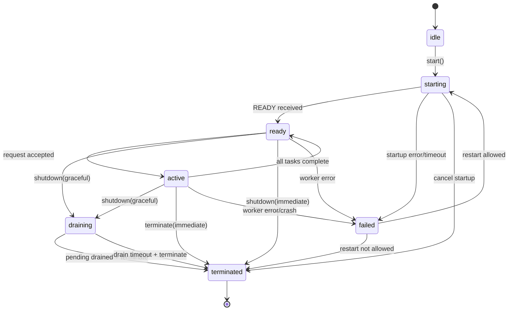
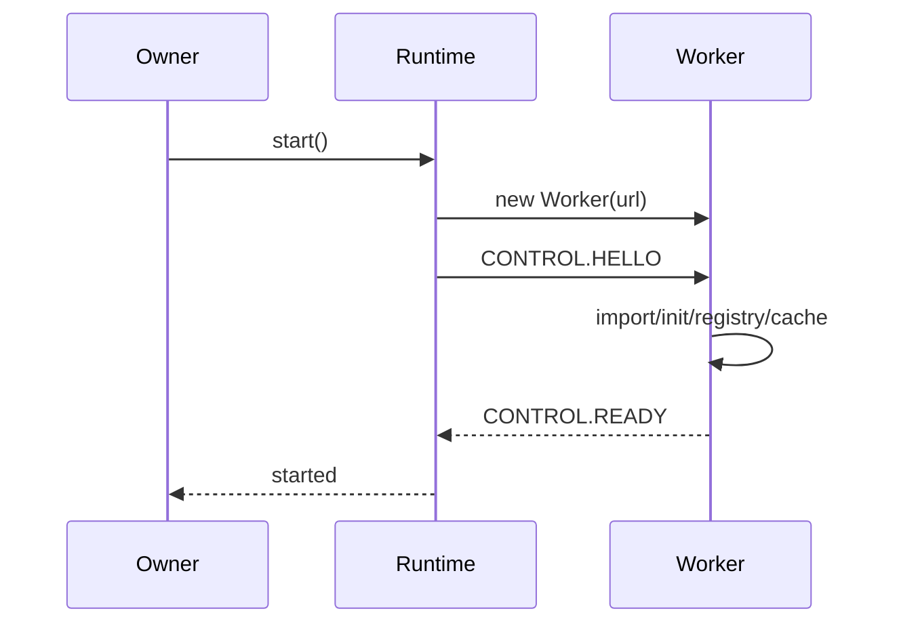
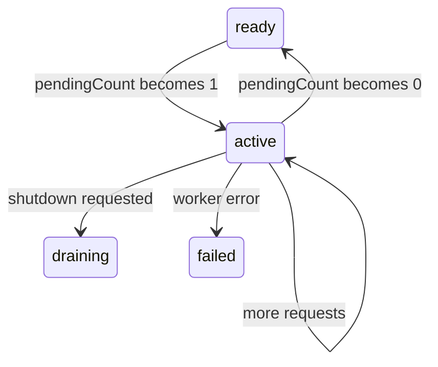
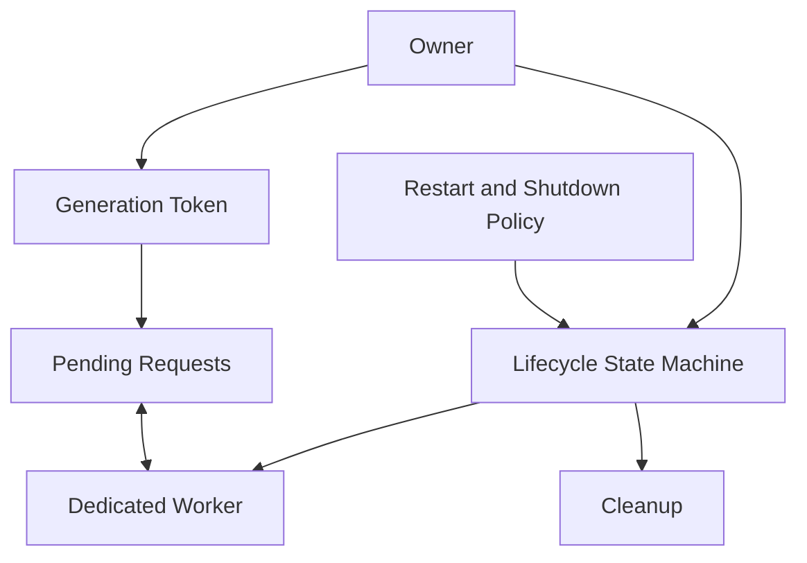

# Part 018 — Worker Lifecycle, Ownership, Termination, and Cleanup

> Target part ini: membuat lifecycle Dedicated Worker eksplisit, deterministic, dan recoverable. Kita akan mendesain state machine worker, ownership contract, startup handshake, active execution, graceful drain, hard termination, crash recovery, cancellation propagation, cleanup, dan testing.

Part 017 membangun arsitektur Dedicated Worker.

Sekarang kita fokus pada satu hal yang sering diremehkan:

> Worker lifecycle is product behavior.

Jika lifecycle buruk, aplikasi akan punya:

1. memory leak,
2. stale task,
3. duplicate worker,
4. zombie pending promise,
5. UI yang menunggu selamanya,
6. hasil lama menimpa hasil baru,
7. worker mati tanpa diketahui,
8. restart loop,
9. tab freeze yang merusak asumsi,
10. deploy mismatch yang sulit direproduksi.

Lifecycle bukan cleanup kecil di `useEffect`.

Lifecycle adalah kontrak kepemilikan resource asynchronous.

---

## 1. Lifecycle sebagai State Machine

Kita mulai dari state machine.



Minimal states:

| State | Meaning |
|---|---|
| `idle` | client object exists, worker not spawned |
| `starting` | worker constructed, waiting READY |
| `ready` | worker initialized and can accept request |
| `active` | one or more tasks in-flight |
| `draining` | no new work accepted; pending work finishing/cancelling |
| `failed` | worker unusable due to error/startup failure |
| `terminated` | worker explicitly stopped; no more work |

Jangan hanya punya boolean `isReady`.

Boolean tidak cukup membedakan:

1. belum mulai,
2. sedang startup,
3. startup timeout,
4. ready,
5. draining,
6. failed,
7. terminated.

---

## 2. Ownership Contract

Worker harus dimiliki oleh satu owner.

Owner bertanggung jawab atas:

1. kapan worker dibuat,
2. kapan worker siap,
3. siapa boleh mengirim request,
4. apa batas concurrency,
5. apa timeout default,
6. apa shutdown policy,
7. apa restart policy,
8. bagaimana pending request dibatalkan,
9. bagaimana metrics dikirim,
10. bagaimana resource dibersihkan.

Contract:

```ts
export interface WorkerOwner {
  start(): Promise<void>;
  execute<T>(command: WorkerCommand, options?: WorkerCallOptions): Promise<T>;
  shutdown(options?: WorkerShutdownOptions): Promise<void>;
  getState(): WorkerRuntimeState;
  getStats(): WorkerRuntimeStats;
}
```

State:

```ts
type WorkerRuntimeState =
  | 'idle'
  | 'starting'
  | 'ready'
  | 'active'
  | 'draining'
  | 'failed'
  | 'terminated';
```

Shutdown options:

```ts
type WorkerShutdownOptions = {
  mode: 'graceful' | 'immediate';
  reason: string;
  drainTimeoutMs?: number;
};
```

### Ownership Invariant

> Only the owner can call `terminate()`. Feature code can request shutdown, but must not directly kill the worker.

Kenapa?

Karena `terminate()` langsung menghentikan worker dan tidak memberi kesempatan operasi berjalan selesai.

Kalau sembarang layer memanggil `terminate()`, pending promise di layer lain bisa menggantung atau gagal tanpa context.

---

## 3. Creation Policy

Ada beberapa pola pembuatan worker.

### 3.1 Eager Singleton

Worker dibuat saat app start.

```ts
const workerRuntime = createSearchWorkerRuntime();
await workerRuntime.start();
```

Cocok jika:

1. worker pasti dipakai,
2. startup cost ingin dibayar awal,
3. fitur core,
4. latency pertama penting.

Risiko:

1. menambah startup cost app,
2. memori terpakai walau fitur belum digunakan,
3. worker chunk harus load awal.

### 3.2 Lazy Singleton

Worker dibuat saat request pertama.

```ts
async function execute(command: WorkerCommand) {
  await ensureStarted();
  return runtime.execute(command);
}
```

Cocok untuk fitur berat yang tidak selalu dipakai.

Risiko:

1. request pertama lebih lambat,
2. race start jika banyak caller bersamaan,
3. startup failure terjadi di tengah user action.

Butuh single-flight start:

```ts
let startPromise: Promise<void> | null = null;

function ensureStarted() {
  if (state === 'ready' || state === 'active') return Promise.resolve();
  if (startPromise) return startPromise;

  startPromise = start().finally(() => {
    startPromise = null;
  });

  return startPromise;
}
```

### 3.3 Feature-Scoped Worker

Worker hidup selama feature/route aktif.

Cocok jika:

1. state worker mahal,
2. fitur isolated,
3. user sering masuk/keluar area,
4. cleanup penting.

Risiko:

1. repeated startup,
2. stale response saat route unmount,
3. harus drain/cancel on unmount.

### 3.4 Ephemeral Worker

Worker dibuat untuk satu job lalu diterminasi.

Cocok jika:

1. job jarang,
2. job sangat berat,
3. ingin memory release cepat,
4. startup cost acceptable,
5. isolation lebih penting dari reuse.

Risiko:

1. startup overhead per job,
2. tidak cocok untuk interactive low-latency operations,
3. lebih banyak complexity bila banyak job.

---

## 4. Startup Lifecycle

Startup harus punya fase.



Runtime start:

```ts
async function start(): Promise<void> {
  assertState(['idle', 'failed']);

  state = 'starting';
  generation++;
  const currentGeneration = generation;

  const worker = new Worker(scriptUrl, {
    type: 'module',
    name: `${name}-g${currentGeneration}`,
  });

  currentWorker = worker;
  attachWorkerListeners(worker, currentGeneration);

  try {
    const ready = await performHandshake(worker, currentGeneration, startupTimeoutMs);

    if (generation !== currentGeneration) {
      worker.terminate();
      throw new Error('Worker startup superseded by newer generation');
    }

    capabilities = ready.capabilities;
    state = 'ready';
  } catch (error) {
    state = 'failed';
    worker.terminate();
    throw error;
  }
}
```

### Generation Token

`generation` mencegah event dari worker lama memengaruhi runtime baru.

Tanpa generation token:

1. worker lama bisa mengirim READY setelah worker baru dibuat,
2. response lama bisa resolve request baru,
3. error dari worker lama bisa mematikan runtime baru.

Ingat:

> In browser orchestration, stale async signals are normal. Every long-lived runtime needs generation guard.

---

## 5. Readiness Is Not Construction

Constructor berhasil bukan readiness.

Readiness membutuhkan:

1. worker file loaded,
2. imports berhasil,
3. global init berhasil,
4. handler registry siap,
5. protocol cocok,
6. capability cocok,
7. runtime mengirim READY.

Handshake timeout:

```ts
function performHandshake(worker: Worker, generation: number, timeoutMs: number) {
  return new Promise<ReadyMessage>((resolve, reject) => {
    const timeoutId = window.setTimeout(() => {
      cleanup();
      reject(new Error('Worker handshake timeout'));
    }, timeoutMs);

    const onMessage = (event: MessageEvent) => {
      const msg = event.data;
      if (msg?.type !== 'CONTROL.READY') return;
      if (generation !== currentGeneration()) return;
      cleanup();
      resolve(msg);
    };

    const onError = (event: ErrorEvent) => {
      cleanup();
      reject(new Error(`Worker startup error: ${event.message}`));
    };

    const cleanup = () => {
      clearTimeout(timeoutId);
      worker.removeEventListener('message', onMessage);
      worker.removeEventListener('error', onError);
    };

    worker.addEventListener('message', onMessage);
    worker.addEventListener('error', onError);

    worker.postMessage({
      type: 'CONTROL.HELLO',
      protocolVersion: 1,
      generation,
      createdAt: Date.now(),
    });
  });
}
```

---

## 6. Active Execution Lifecycle

Saat request diterima:



Runtime harus track pending:

```ts
type PendingRequest = {
  correlationId: string;
  commandType: string;
  generation: number;
  createdAt: number;
  deadlineAt: number;
  timeoutId: number;
  resolve: (value: unknown) => void;
  reject: (reason: unknown) => void;
  abort?: () => void;
};

const pending = new Map<string, PendingRequest>();
```

On send:

```ts
function markActive() {
  if (state === 'ready') state = 'active';
}

function maybeReady() {
  if (state === 'active' && pending.size === 0) state = 'ready';
}
```

But do not use state alone for correctness.

Use pending map and generation.

---

## 7. Request Admission Policy

Runtime should reject new requests when not allowed.

| State | Accept new request? |
|---|---:|
| `idle` | Maybe, if lazy start allowed |
| `starting` | Queue or wait, policy-specific |
| `ready` | Yes |
| `active` | Yes if under limit |
| `draining` | No |
| `failed` | Maybe restart, policy-specific |
| `terminated` | No |

Admission code:

```ts
function assertCanAcceptRequest() {
  if (state === 'draining') {
    throw new Error('Worker is draining and does not accept new requests');
  }

  if (state === 'terminated') {
    throw new Error('Worker is terminated');
  }

  if (state === 'failed' && !restartPolicy.enabled) {
    throw new Error('Worker failed and restart is disabled');
  }

  if (pending.size >= maxInFlight) {
    throw new Error('Worker backpressure limit reached');
  }
}
```

Alternative: queue instead of reject.

But queue must be bounded.

---

## 8. Graceful Shutdown vs Immediate Termination

There are two shutdown types.

### Graceful Shutdown

1. stop accepting new work,
2. optionally send cancel to background tasks,
3. wait for pending tasks to finish or timeout,
4. terminate worker,
5. cleanup listeners/pending maps.

### Immediate Termination

1. reject all pending promises,
2. call `worker.terminate()` immediately,
3. cleanup runtime.

`terminate()` is hard stop.

It does not give worker a chance to finish operations.

Use immediate termination for:

1. page unload-ish cleanup,
2. security/session boundary change,
3. worker crash containment,
4. memory emergency,
5. feature forced reset,
6. test teardown.

Use graceful shutdown for:

1. feature unmount with non-critical background work,
2. app route change where result still useful,
3. worker replacement/deploy upgrade,
4. controlled reset.

---

## 9. Graceful Drain Implementation

```ts
async function shutdown(options: WorkerShutdownOptions) {
  if (state === 'terminated') return;

  const worker = currentWorker;
  if (!worker) {
    state = 'terminated';
    return;
  }

  state = 'draining';

  if (options.mode === 'immediate') {
    failAllPending(new Error(`Worker terminated: ${options.reason}`));
    cleanupWorker(worker);
    worker.terminate();
    state = 'terminated';
    return;
  }

  worker.postMessage({
    type: 'CONTROL.DRAIN',
    reason: options.reason,
    deadlineAt: Date.now() + (options.drainTimeoutMs ?? 5000),
  });

  try {
    await waitForPendingToDrain(options.drainTimeoutMs ?? 5000);
  } finally {
    failAllPending(new Error(`Worker shutdown after drain: ${options.reason}`));
    cleanupWorker(worker);
    worker.terminate();
    state = 'terminated';
  }
}
```

Wait drain:

```ts
function waitForPendingToDrain(timeoutMs: number): Promise<void> {
  if (pending.size === 0) return Promise.resolve();

  return new Promise(resolve => {
    const intervalId = window.setInterval(() => {
      if (pending.size === 0) {
        clearInterval(intervalId);
        clearTimeout(timeoutId);
        resolve();
      }
    }, 25);

    const timeoutId = window.setTimeout(() => {
      clearInterval(intervalId);
      resolve();
    }, timeoutMs);
  });
}
```

This is basic.

A more robust runtime emits drain state and supports cancellation by priority.

---

## 10. Worker-side Drain

Inside worker:

```ts
let draining = false;

self.addEventListener('message', event => {
  const msg = event.data;

  if (msg?.type === 'CONTROL.DRAIN') {
    draining = true;
    for (const [id, controller] of controllers) {
      // optional policy: cancel background tasks only
      controller.abort('worker-draining');
    }
    self.postMessage({
      type: 'EVENT',
      eventType: 'WORKER.DRAINING',
      payload: { activeTasks: controllers.size },
    });
    return;
  }

  if (msg?.type === 'REQUEST' && draining) {
    self.postMessage({
      type: 'RESPONSE',
      correlationId: msg.correlationId,
      ok: false,
      error: {
        name: 'WorkerDrainingError',
        message: 'Worker is draining and refuses new work',
        retryable: true,
      },
    });
    return;
  }
});
```

Worker-side drain is cooperative.

Main thread still owns final termination.

---

## 11. Cleanup Checklist

When worker is terminated or failed, cleanup must include:

1. reject pending promises,
2. clear timeout timers,
3. remove event listeners,
4. clear start promise,
5. clear heartbeat timer,
6. clear queue,
7. clear capability cache,
8. mark state,
9. invalidate generation,
10. release references to worker object,
11. emit metric/log.

Client cleanup:

```ts
function cleanupWorker(worker: Worker) {
  worker.removeEventListener('message', onWorkerMessage);
  worker.removeEventListener('messageerror', onWorkerMessageError);
  worker.removeEventListener('error', onWorkerError);
  currentWorker = null;
  capabilities = [];
  startPromise = null;
}
```

Pending cleanup:

```ts
function failAllPending(error: Error) {
  for (const request of pending.values()) {
    clearTimeout(request.timeoutId);
    request.reject(error);
  }
  pending.clear();
}
```

### Cleanup Invariant

> After termination, there must be no live timeout, no live event listener, no pending promise, and no strong reference to the worker.

---

## 12. Crash Handling

Worker can fail via:

1. uncaught error,
2. startup import failure,
3. syntax error,
4. resource/memory failure,
5. explicit `self.close()` inside worker,
6. `terminate()` from owner,
7. browser process crash/discard behavior,
8. deployment chunk mismatch.

Main side must listen:

```ts
worker.addEventListener('error', onWorkerError);
worker.addEventListener('messageerror', onWorkerMessageError);
```

Handler:

```ts
function onWorkerError(event: ErrorEvent) {
  const error = new Error(`Worker error: ${event.message}`);
  transitionToFailed(error);
}

function onWorkerMessageError() {
  const error = new Error('Worker message deserialization failed');
  transitionToFailed(error);
}

function transitionToFailed(error: Error) {
  const worker = currentWorker;
  state = 'failed';
  generation++;

  failAllPending(error);

  if (worker) {
    cleanupWorker(worker);
    worker.terminate();
  }

  maybeRestart(error);
}
```

Be careful with restart.

Restart can make things worse if failure is deterministic.

---

## 13. Restart Policy

Restart policy should be explicit.

```ts
type RestartPolicy = {
  enabled: boolean;
  maxRestarts: number;
  windowMs: number;
  backoffMs: (attempt: number) => number;
  retryableErrors: string[];
};
```

Example:

```ts
const restartPolicy: RestartPolicy = {
  enabled: true,
  maxRestarts: 3,
  windowMs: 60_000,
  backoffMs: attempt => Math.min(1000 * 2 ** attempt, 10_000),
  retryableErrors: ['WorkerCrashedError', 'StartupTimeoutError'],
};
```

Restart implementation idea:

```ts
async function maybeRestart(error: Error) {
  if (!restartPolicy.enabled) return;

  if (!isRetryable(error)) return;

  const recent = restartHistory.filter(t => Date.now() - t < restartPolicy.windowMs);
  if (recent.length >= restartPolicy.maxRestarts) {
    state = 'failed';
    return;
  }

  restartHistory = recent.concat(Date.now());
  const attempt = recent.length + 1;
  const delay = restartPolicy.backoffMs(attempt);

  await sleep(delay);

  if (state !== 'failed') return;
  await start();
}
```

### Restart Invariant

> Do not retry deterministic protocol/schema failures blindly.

Examples not good for restart:

1. unknown command due to code mismatch,
2. validation failure,
3. CSP blocking worker script,
4. permanent import path broken,
5. unsupported browser feature.

Examples maybe okay:

1. transient startup timeout,
2. worker crashed due to one poison task and task is not replayed,
3. memory pressure after cleanup,
4. old worker generation replaced.

---

## 14. Poison Task Handling

A poison task is input that repeatedly kills or breaks the worker.

If runtime restarts and automatically replays pending work, poison task can cause restart loop.

Therefore:

1. do not replay side-effectful tasks by default,
2. do not auto-replay unknown failing payload,
3. attach idempotency key if replay allowed,
4. limit attempts per task,
5. mark task as poison after repeated crash association,
6. surface actionable error.

Poison guard:

```ts
type TaskAttemptRecord = {
  commandType: string;
  idempotencyKey?: string;
  payloadHash?: string;
  attempts: number;
};
```

If same payload crashes worker twice:

```ts
throw new Error('Task suspected poison: not replaying after worker restart');
```

---

## 15. `terminate()` vs Worker `close()`

There are two common stop directions:

1. owner calls `worker.terminate()` from outside,
2. worker calls `self.close()` from inside.

Use `worker.terminate()` when owner decides lifecycle.

Use `self.close()` only when worker owns completion of its own ephemeral job and protocol expects it.

In long-lived worker runtime, avoid random `self.close()` inside domain handler.

Bad:

```ts
handlers.set('SEARCH.RESET', () => {
  self.close();
});
```

Better:

```ts
handlers.set('SEARCH.RESET', () => {
  searchIndex.reset();
  return { ok: true };
});
```

### Rule

> Worker shutdown belongs to lifecycle layer, not domain handler.

---

## 16. Page Lifecycle Integration

Owner lives in a page/tab.

The page can become:

1. visible,
2. hidden,
3. frozen,
4. restored,
5. navigated away,
6. discarded by browser,
7. bfcache-restored.

Worker lifecycle should react carefully.

Common policy:

| Page event | Worker policy |
|---|---|
| visible | allow interactive work |
| hidden | continue important bounded work, reduce diagnostics |
| freeze/pagehide | checkpoint/cancel non-critical work |
| beforeunload | do not rely on async cleanup |
| pageshow persisted | revalidate runtime state |
| tenant/session change | immediate shutdown/reset |

Example:

```ts
document.addEventListener('visibilitychange', () => {
  if (document.visibilityState === 'hidden') {
    workerRuntime.reducePriority?.('page-hidden');
  }
});

window.addEventListener('pagehide', event => {
  workerRuntime.shutdown({
    mode: 'immediate',
    reason: event.persisted ? 'pagehide-bfcache' : 'pagehide-navigation',
  });
});

window.addEventListener('pageshow', event => {
  if (event.persisted) {
    void workerRuntime.start();
  }
});
```

Caveat:

Do not overfit.

Some apps should keep worker alive while hidden if work is user-expected.

Example: local encryption of a file user just selected.

But even then, bounded deadline and cancellation should exist.

---

## 17. Session and Security Boundary

When user logs out, tenant changes, or privileges change:

1. cancel pending tasks,
2. terminate worker,
3. clear worker-local state,
4. clear sensitive cached data,
5. invalidate client generation,
6. create new worker only after new session context.

Do not reuse worker across security boundary unless designed.

Bad:

```ts
currentTenantId = nextTenantId;
// same worker still has previous tenant index in memory
```

Better:

```ts
await searchWorker.shutdown({
  mode: 'immediate',
  reason: 'tenant-changed',
});

searchWorker = createSearchWorkerRuntime({ tenantId: nextTenantId });
await searchWorker.start();
```

### Security Invariant

> Worker-local memory must not survive a session/tenant boundary unless explicitly allowed and partitioned.

---

## 18. HMR, Deploy, and Version Skew

In development, HMR can replace modules while worker script remains old.

In production, old tabs can talk to old/new chunks depending cache and service worker behavior.

Protect with:

1. build ID in handshake,
2. protocol version,
3. capabilities,
4. generation token,
5. unknown command handling,
6. graceful worker replacement.

Handshake:

```ts
type ReadyMessage = {
  type: 'CONTROL.READY';
  workerId: string;
  buildId: string;
  protocolVersion: number;
  capabilities: string[];
};
```

Mismatch policy:

```ts
if (ready.protocolVersion !== CLIENT_PROTOCOL_VERSION) {
  await shutdown({ mode: 'immediate', reason: 'protocol-mismatch' });
  throw new Error('Worker protocol mismatch. Please reload the page.');
}
```

Or capability fallback:

```ts
if (!ready.capabilities.includes('search:query:v2')) {
  useQueryV1Adapter();
}
```

---

## 19. Memory Management

Workers can leak memory too.

Common sources:

1. pending maps not cleared,
2. large ArrayBuffers retained,
3. index cache never reset,
4. log buffer unbounded,
5. queued tasks unbounded,
6. closures retaining payload,
7. duplicate workers after route remount,
8. old worker references retained by event listeners,
9. message history in dev tooling,
10. accidental global caches.

Worker memory policy:

```ts
type MemoryPolicy = {
  maxIndexBytes: number;
  maxQueuedTasks: number;
  maxLogEntries: number;
  resetOnHiddenAfterMs?: number;
};
```

Stats:

```ts
handlers.set('DIAGNOSTICS.GET_STATS', () => ({
  activeTasks: controllers.size,
  queuedTasks: taskQueue.length,
  indexEstimatedBytes: index.estimatedMemoryBytes(),
  logEntries: logBuffer.length,
}));
```

Reset command:

```ts
handlers.set('MEMORY.TRIM', () => {
  logBuffer.clear();
  index.trimCaches();
  return { ok: true };
});
```

### Rule

> Long-lived worker state must have an eviction or reset story.

---

## 20. Timer Cleanup

Timers exist on both sides.

Main thread timers:

1. startup timeout,
2. request timeout,
3. heartbeat timeout,
4. drain timeout,
5. restart backoff.

Worker timers:

1. heartbeat interval,
2. scheduler yield timers,
3. polling loops,
4. diagnostics flush timers,
5. internal timeouts.

Every timer needs owner and cleanup.

Bad:

```ts
setInterval(sendHeartbeat, 5000);
```

Better:

```ts
let heartbeatId: number | undefined;

function startHeartbeat() {
  heartbeatId = setInterval(sendHeartbeat, 5000) as unknown as number;
}

function stopHeartbeat() {
  if (heartbeatId !== undefined) {
    clearInterval(heartbeatId);
    heartbeatId = undefined;
  }
}
```

On worker drain:

```ts
stopHeartbeat();
```

On main cleanup:

```ts
clearTimeout(startupTimeoutId);
for (const request of pending.values()) clearTimeout(request.timeoutId);
```

---

## 21. Runtime Implementation: A Lifecycle-Aware Client

This is a compact but meaningful runtime skeleton.

```ts
type WorkerRuntimeOptions = {
  name: string;
  scriptUrl: URL;
  startupTimeoutMs: number;
  defaultRequestTimeoutMs: number;
  maxInFlight: number;
  protocolVersion: number;
};

export class DedicatedWorkerRuntime {
  private worker: Worker | null = null;
  private state: WorkerRuntimeState = 'idle';
  private generation = 0;
  private startPromise: Promise<void> | null = null;
  private pending = new Map<string, PendingRequest>();
  private capabilities: string[] = [];

  constructor(private readonly options: WorkerRuntimeOptions) {}

  getState() {
    return this.state;
  }

  async start(): Promise<void> {
    if (this.state === 'ready' || this.state === 'active') return;
    if (this.startPromise) return this.startPromise;
    if (this.state === 'terminated') throw new Error('Runtime already terminated');

    this.startPromise = this.startInternal().finally(() => {
      this.startPromise = null;
    });

    return this.startPromise;
  }

  async execute<T>(commandType: string, payload: unknown, options: WorkerCallOptions = {}): Promise<T> {
    if (this.state === 'idle' || this.state === 'failed') {
      await this.start();
    }

    this.assertCanAcceptRequest();

    const worker = this.worker;
    if (!worker) throw new Error('Worker not available');

    const correlationId = crypto.randomUUID();
    const generation = this.generation;
    const timeoutMs = options.timeoutMs ?? this.options.defaultRequestTimeoutMs;
    const deadlineAt = Date.now() + timeoutMs;

    return new Promise<T>((resolve, reject) => {
      const timeoutId = window.setTimeout(() => {
        this.pending.delete(correlationId);
        reject(new Error(`Worker request timeout: ${commandType}`));
        this.maybeTransitionToReady();
      }, timeoutMs);

      this.pending.set(correlationId, {
        correlationId,
        commandType,
        generation,
        createdAt: Date.now(),
        deadlineAt,
        timeoutId,
        resolve: resolve as (value: unknown) => void,
        reject,
      });

      if (this.state === 'ready') this.state = 'active';

      options.signal?.addEventListener('abort', () => {
        const req = this.pending.get(correlationId);
        if (!req) return;

        this.pending.delete(correlationId);
        clearTimeout(req.timeoutId);

        worker.postMessage({
          type: 'CONTROL.CANCEL',
          correlationId,
          reason: options.signal?.reason ?? 'aborted',
        });

        reject(new DOMException('Worker request aborted', 'AbortError'));
        this.maybeTransitionToReady();
      }, { once: true });

      worker.postMessage({
        type: 'REQUEST',
        protocolVersion: this.options.protocolVersion,
        commandType,
        correlationId,
        generation,
        createdAt: Date.now(),
        deadlineAt,
        payload,
      });
    });
  }

  async shutdown(options: WorkerShutdownOptions = { mode: 'immediate', reason: 'shutdown' }) {
    const worker = this.worker;
    if (!worker || this.state === 'terminated') {
      this.state = 'terminated';
      return;
    }

    this.state = 'draining';
    this.generation++;

    if (options.mode === 'graceful') {
      worker.postMessage({
        type: 'CONTROL.DRAIN',
        reason: options.reason,
      });
      await this.waitForDrain(options.drainTimeoutMs ?? 3000);
    }

    this.failAllPending(new Error(`Worker shutdown: ${options.reason}`));
    this.detach(worker);
    worker.terminate();
    this.worker = null;
    this.capabilities = [];
    this.state = 'terminated';
  }

  private async startInternal() {
    this.state = 'starting';
    this.generation++;
    const generation = this.generation;

    const worker = new Worker(this.options.scriptUrl, {
      type: 'module',
      name: `${this.options.name}-g${generation}`,
    });

    this.worker = worker;
    this.attach(worker, generation);

    try {
      const ready = await this.handshake(worker, generation);
      if (this.generation !== generation) throw new Error('Worker startup superseded');
      this.capabilities = ready.capabilities ?? [];
      this.state = 'ready';
    } catch (error) {
      this.state = 'failed';
      this.detach(worker);
      worker.terminate();
      this.worker = null;
      throw error;
    }
  }

  private attach(worker: Worker, generation: number) {
    worker.addEventListener('message', this.onMessage);
    worker.addEventListener('messageerror', this.onMessageError);
    worker.addEventListener('error', this.onError);
  }

  private detach(worker: Worker) {
    worker.removeEventListener('message', this.onMessage);
    worker.removeEventListener('messageerror', this.onMessageError);
    worker.removeEventListener('error', this.onError);
  }

  private onMessage = (event: MessageEvent) => {
    const msg = event.data;

    if (msg?.type !== 'RESPONSE') return;

    const req = this.pending.get(msg.correlationId);
    if (!req) return;
    if (req.generation !== this.generation) return;

    this.pending.delete(msg.correlationId);
    clearTimeout(req.timeoutId);

    if (msg.ok) req.resolve(msg.payload);
    else req.reject(deserializeWorkerError(msg.error));

    this.maybeTransitionToReady();
  };

  private onMessageError = () => {
    this.transitionToFailed(new Error('Worker messageerror'));
  };

  private onError = (event: ErrorEvent) => {
    this.transitionToFailed(new Error(`Worker error: ${event.message}`));
  };

  private transitionToFailed(error: Error) {
    const worker = this.worker;
    this.state = 'failed';
    this.generation++;
    this.failAllPending(error);
    if (worker) {
      this.detach(worker);
      worker.terminate();
    }
    this.worker = null;
  }

  private assertCanAcceptRequest() {
    if (this.state === 'draining') throw new Error('Worker is draining');
    if (this.state === 'terminated') throw new Error('Worker is terminated');
    if (this.pending.size >= this.options.maxInFlight) throw new Error('Worker in-flight limit reached');
  }

  private maybeTransitionToReady() {
    if (this.state === 'active' && this.pending.size === 0) {
      this.state = 'ready';
    }
  }

  private waitForDrain(timeoutMs: number) {
    if (this.pending.size === 0) return Promise.resolve();
    return new Promise<void>(resolve => {
      const start = performance.now();
      const tick = () => {
        if (this.pending.size === 0) return resolve();
        if (performance.now() - start >= timeoutMs) return resolve();
        setTimeout(tick, 25);
      };
      tick();
    });
  }

  private failAllPending(error: Error) {
    for (const req of this.pending.values()) {
      clearTimeout(req.timeoutId);
      req.reject(error);
    }
    this.pending.clear();
  }

  private handshake(worker: Worker, generation: number): Promise<any> {
    return new Promise((resolve, reject) => {
      const timeoutId = window.setTimeout(() => {
        cleanup();
        reject(new Error('Worker startup timeout'));
      }, this.options.startupTimeoutMs);

      const onMessage = (event: MessageEvent) => {
        const msg = event.data;
        if (msg?.type !== 'CONTROL.READY') return;
        if (generation !== this.generation) return;
        cleanup();
        resolve(msg);
      };

      const onError = (event: ErrorEvent) => {
        cleanup();
        reject(new Error(`Worker startup error: ${event.message}`));
      };

      const cleanup = () => {
        clearTimeout(timeoutId);
        worker.removeEventListener('message', onMessage);
        worker.removeEventListener('error', onError);
      };

      worker.addEventListener('message', onMessage);
      worker.addEventListener('error', onError);

      worker.postMessage({
        type: 'CONTROL.HELLO',
        protocolVersion: this.options.protocolVersion,
        generation,
        createdAt: Date.now(),
      });
    });
  }
}
```

This skeleton intentionally keeps retry/restart modest.

Do not add auto-retry until you have idempotency and poison-task policy.

---

## 22. Worker-side Lifecycle Runtime

Worker should also have lifecycle state.

```ts
type WorkerInternalState = 'booting' | 'ready' | 'draining' | 'closed';

let state: WorkerInternalState = 'booting';
let generation = 0;
const controllers = new Map<string, AbortController>();

self.addEventListener('message', event => {
  const msg = event.data;

  if (msg?.type === 'CONTROL.HELLO') {
    generation = msg.generation;
    state = 'ready';
    self.postMessage({
      type: 'CONTROL.READY',
      protocolVersion: msg.protocolVersion,
      generation,
      capabilities: ['search:query:v1'],
      startedAt: Date.now(),
    });
    return;
  }

  if (msg?.type === 'CONTROL.DRAIN') {
    state = 'draining';
    for (const controller of controllers.values()) {
      controller.abort('worker-draining');
    }
    return;
  }

  if (msg?.type === 'CONTROL.CANCEL') {
    controllers.get(msg.correlationId)?.abort(msg.reason);
    return;
  }

  if (msg?.type === 'REQUEST') {
    if (state !== 'ready') {
      self.postMessage({
        type: 'RESPONSE',
        correlationId: msg.correlationId,
        ok: false,
        error: {
          name: 'WorkerNotReadyError',
          message: `Worker is ${state}`,
          retryable: state === 'draining',
        },
      });
      return;
    }

    void runRequest(msg);
  }
});
```

Worker can close itself after drain if designed:

```ts
async function maybeCloseAfterDrain() {
  if (state === 'draining' && controllers.size === 0) {
    state = 'closed';
    self.close();
  }
}
```

But in most browser app runtimes, main owner calls `terminate()`.

---

## 23. Cancellation Propagation and Cleanup

Cancellation must clean both sides.

Main:

1. remove pending request,
2. clear timeout,
3. reject promise with AbortError,
4. send CANCEL to worker.

Worker:

1. abort controller,
2. handler exits cooperatively,
3. response may be ignored if main already removed pending,
4. controller removed in finally.

Worker handler:

```ts
async function runRequest(msg: any) {
  const controller = new AbortController();
  controllers.set(msg.correlationId, controller);

  try {
    const result = await handler({
      signal: controller.signal,
      deadlineAt: msg.deadlineAt,
      correlationId: msg.correlationId,
    }, msg.payload);

    self.postMessage({
      type: 'RESPONSE',
      correlationId: msg.correlationId,
      ok: true,
      payload: result,
    });
  } catch (error) {
    self.postMessage({
      type: 'RESPONSE',
      correlationId: msg.correlationId,
      ok: false,
      error: serializeError(error),
    });
  } finally {
    controllers.delete(msg.correlationId);
    await maybeCloseAfterDrain();
  }
}
```

### Cancellation Invariant

> Cancellation is not complete until both pending map and worker controller map are cleaned.

---

## 24. Event Listener Ownership

When using class methods as listeners, use stable references.

Bad:

```ts
worker.addEventListener('message', event => this.onMessage(event));
worker.removeEventListener('message', event => this.onMessage(event)); // does not remove
```

Because those are different functions.

Good:

```ts
private onMessage = (event: MessageEvent) => {
  // stable method property
};

worker.addEventListener('message', this.onMessage);
worker.removeEventListener('message', this.onMessage);
```

This matters for cleanup.

Listener leak can keep runtime objects alive.

---

## 25. React Integration without Lifecycle Bugs

In React, do not create worker inside render.

Bad:

```tsx
function Component() {
  const worker = new Worker(new URL('./worker.ts', import.meta.url));
  return null;
}
```

Better: module singleton for app-wide worker.

```ts
export const searchRuntime = new DedicatedWorkerRuntime({
  name: 'search',
  scriptUrl: new URL('./search.worker.ts', import.meta.url),
  startupTimeoutMs: 3000,
  defaultRequestTimeoutMs: 1000,
  maxInFlight: 8,
  protocolVersion: 1,
});
```

Feature hook:

```tsx
export function useSearchRuntime() {
  useEffect(() => {
    void searchRuntime.start();
    return () => {
      // do not shutdown if singleton shared by app
      // only shutdown feature-scoped runtime here
    };
  }, []);

  return searchRuntime;
}
```

For feature-scoped runtime:

```tsx
function SearchRoute() {
  const runtimeRef = useRef<DedicatedWorkerRuntime | null>(null);

  if (!runtimeRef.current) {
    runtimeRef.current = createSearchRuntime();
  }

  useEffect(() => {
    const runtime = runtimeRef.current!;
    void runtime.start();

    return () => {
      void runtime.shutdown({
        mode: 'immediate',
        reason: 'search-route-unmounted',
      });
    };
  }, []);

  return <SearchPage runtime={runtimeRef.current} />;
}
```

React Strict Mode in development may mount/unmount effects more than once.

Your lifecycle code must tolerate duplicate start/shutdown calls.

---

## 26. Worker Lifecycle Testing

Lifecycle needs tests.

### Test 1 — Start Single-Flight

```ts
it('starts worker once for concurrent start calls', async () => {
  const runtime = createRuntimeWithFakeWorker();
  const p1 = runtime.start();
  const p2 = runtime.start();

  fakeWorker.emitReady();

  await Promise.all([p1, p2]);
  expect(fakeWorkerFactory.createdCount).toBe(1);
});
```

### Test 2 — Startup Timeout

```ts
it('fails startup when READY is not received', async () => {
  const runtime = createRuntimeWithFakeWorker({ startupTimeoutMs: 1 });
  await expect(runtime.start()).rejects.toThrow(/startup timeout/i);
  expect(runtime.getState()).toBe('failed');
});
```

### Test 3 — Pending Rejected on Terminate

```ts
it('rejects pending requests on shutdown', async () => {
  const runtime = await startedRuntime();
  const promise = runtime.execute('SLOW_TASK', {});

  await runtime.shutdown({ mode: 'immediate', reason: 'test' });

  await expect(promise).rejects.toThrow(/shutdown/i);
});
```

### Test 4 — Stale Response Ignored

```ts
it('ignores response from old generation', async () => {
  const runtime = await startedRuntime();
  const promise = runtime.execute('TASK', {});

  await runtime.shutdown({ mode: 'immediate', reason: 'replace' });

  oldFakeWorker.emitMessage({
    type: 'RESPONSE',
    correlationId: getCorrelationIdFromOldRequest(),
    ok: true,
    payload: 'late',
  });

  await expect(promise).rejects.toThrow(/shutdown/i);
});
```

### Test 5 — Listener Cleanup

```ts
it('removes listeners on shutdown', async () => {
  const runtime = await startedRuntime();
  await runtime.shutdown({ mode: 'immediate', reason: 'test' });
  expect(fakeWorker.listenerCount('message')).toBe(0);
});
```

---

## 27. Failure Matrix

| Scenario | Expected behavior |
|---|---|
| worker constructor throws | state failed, caller receives startup error |
| READY never arrives | startup timeout, worker terminated |
| worker sends invalid response | message ignored or protocol error |
| `messageerror` on main | fail runtime, reject pending |
| `error` on worker | fail runtime, reject pending, terminate worker |
| request timeout | reject request, send optional cancel |
| abort signal | reject AbortError, send cancel |
| shutdown immediate | reject all pending, terminate |
| shutdown graceful | drain until pending zero or timeout, terminate |
| old worker sends late response | ignored by generation/pending guard |
| session changes | immediate shutdown and state reset |
| page bfcache restore | revalidate/restart runtime |

---

## 28. Production Lifecycle Policy Template

Use this as a template per worker:

```md
# Worker Lifecycle Policy: Search Worker

Owner: SearchRuntime singleton
Creation: lazy on first search or index operation
Startup timeout: 3000ms
Default request timeout: 1000ms for query, 60000ms for index rebuild
Max in-flight: 8
State retained: inverted index, tokenizer cache
State invalidation: tenant change, schema version change, explicit reset
Cancellation: query cancelled when superseded; index rebuild cancellable
Shutdown: immediate on logout/tenant change; graceful on route unmount if feature-scoped
Restart: enabled for transient crash, max 2 per minute, no automatic replay of side-effectful tasks
Observability: startup latency, task latency, timeout, abort, crash, queue length, index stats
Security: no access/refresh tokens sent to worker; only sanitized document text
Compatibility: protocol version 1, capabilities declared on READY
```

If your team cannot write this policy, the worker should not be considered production-ready.

---

## 29. Lifecycle Anti-Patterns

### Anti-pattern 1 — Fire-and-forget Worker

```ts
const worker = new Worker('/worker.js');
worker.postMessage(data);
```

No owner, no timeout, no cleanup.

### Anti-pattern 2 — `isReady` Boolean

```ts
let isReady = false;
```

Cannot represent failure, draining, terminated, generation mismatch.

### Anti-pattern 3 — No Generation Guard

Late response from old worker can corrupt new runtime.

### Anti-pattern 4 — Shutdown Without Rejecting Pending

Pending promises hang forever.

### Anti-pattern 5 — Auto-Restart Everything

Restart loop hides deterministic bugs and burns CPU.

### Anti-pattern 6 — Worker Survives Tenant Change

Cross-tenant memory leak/security bug.

### Anti-pattern 7 — Cleanup Depends on `beforeunload`

Browser may not give enough time for async cleanup.

Use cleanup opportunistically, but design state to be recoverable.

---

## 30. Lifecycle Checklist

```txt
[ ] Worker has explicit owner
[ ] Worker lifecycle has state machine
[ ] `start()` is idempotent / single-flight
[ ] Startup has timeout
[ ] READY handshake exists
[ ] Generation token exists
[ ] Request admission policy exists
[ ] Pending map is always cleaned
[ ] Request timeout clears pending
[ ] Abort clears pending and sends cancel
[ ] `error` listener exists
[ ] `messageerror` listener exists
[ ] Failure rejects all pending
[ ] Shutdown has graceful and immediate modes
[ ] `terminate()` is called only by owner/runtime
[ ] Event listeners are removed on cleanup
[ ] Timers are cleared on cleanup
[ ] Restart policy is explicit and bounded
[ ] Poison task replay is prevented
[ ] Session/tenant boundary terminates or resets worker
[ ] Page lifecycle policy exists
[ ] React Strict Mode duplicate mount tolerated
[ ] Tests cover startup timeout, crash, shutdown, stale response
```

---

## 31. What This Part Establishes

Worker lifecycle is not incidental.

It is a correctness boundary.

The durable mental model:



The most important rule:

> A worker without an owner is a leak. A worker without a state machine is a race condition. A worker without cleanup is a future incident.

---

## 32. Exercises

### Exercise 1 — Draw the Lifecycle

For one worker in your app, draw states:

1. idle,
2. starting,
3. ready,
4. active,
5. draining,
6. failed,
7. terminated.

Write allowed transitions.

### Exercise 2 — Implement Generation Guard

Create fake worker that sends response after shutdown.

Ensure runtime ignores it.

### Exercise 3 — Graceful vs Immediate

Implement both shutdown modes.

Test:

1. immediate rejects pending instantly,
2. graceful waits for completion,
3. graceful falls back after timeout.

### Exercise 4 — Session Boundary

Simulate tenant change while worker has index in memory.

Ensure worker is terminated and new worker starts with empty state.

### Exercise 5 — Startup Race

Call `start()` 10 times concurrently.

Verify only one worker is created.

---

## 33. References

- MDN — Worker: https://developer.mozilla.org/en-US/docs/Web/API/Worker
- MDN — Worker.terminate: https://developer.mozilla.org/en-US/docs/Web/API/Worker/terminate
- MDN — Worker error event: https://developer.mozilla.org/en-US/docs/Web/API/Worker/error_event
- MDN — Worker messageerror event: https://developer.mozilla.org/en-US/docs/Web/API/Worker/messageerror_event
- MDN — DedicatedWorkerGlobalScope: https://developer.mozilla.org/en-US/docs/Web/API/DedicatedWorkerGlobalScope
- MDN — DedicatedWorkerGlobalScope.close: https://developer.mozilla.org/en-US/docs/Web/API/DedicatedWorkerGlobalScope/close
- MDN — WorkerGlobalScope: https://developer.mozilla.org/en-US/docs/Web/API/WorkerGlobalScope
- Chrome Developers — Page Lifecycle API: https://developer.chrome.com/docs/web-platform/page-lifecycle-api

---

## 34. Next

Part 019 akan membahas module workers dan bundling:

1. `new Worker(new URL(..., import.meta.url))`,
2. classic vs module worker,
3. Vite/Webpack/Rollup behavior,
4. code splitting,
5. CSP,
6. CDN/service worker caching,
7. HMR edge cases,
8. worker source maps,
9. deploy mismatch,
10. production build verification.
