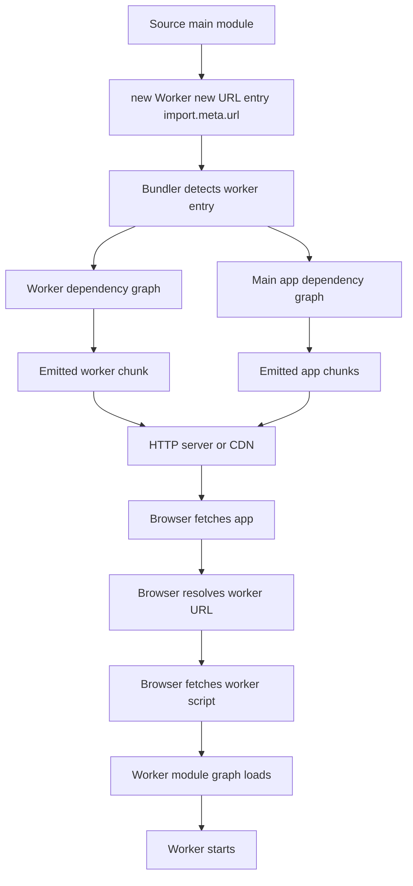
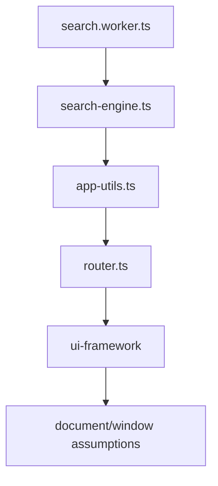
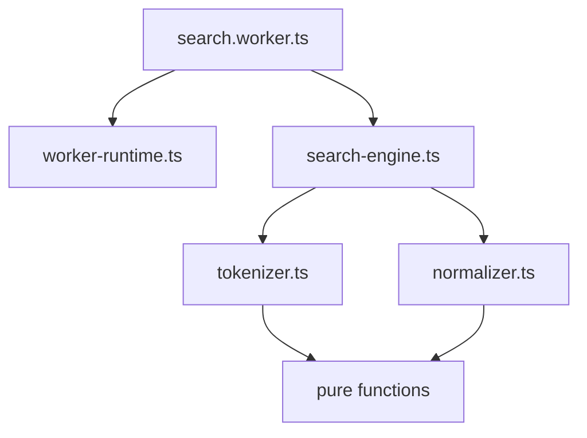
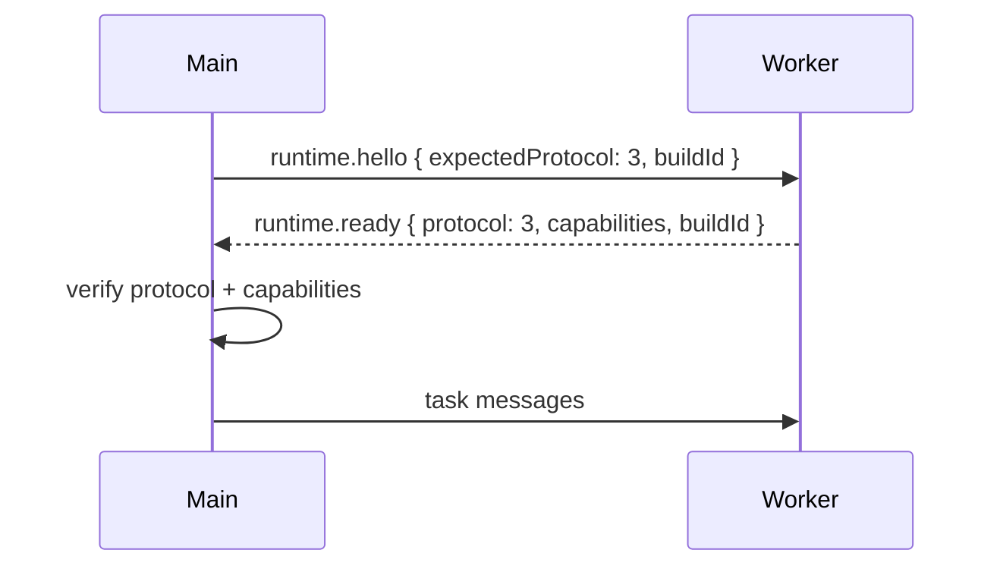

# Part 019 — Worker Module Bundling

Worker architecture is not complete until the worker survives the build pipeline.

A worker can be correct in source code and still fail in production because the browser does not load your source tree. It loads emitted assets: hashed chunks, rewritten URLs, MIME-typed responses, CSP-restricted scripts, CDN paths, and module graphs transformed by a bundler.

The important mental shift is this:

> A worker is not only a JavaScript object. A worker is a separately loaded program with its own URL, module graph, lifecycle, security policy, cache behavior, and deployment contract.

This part focuses on **Dedicated Worker module bundling**, but the principles carry into `SharedWorker`, `ServiceWorker`, and worker pools.

---

## 1. The core problem

When you write this:

```ts
const worker = new Worker("./search.worker.ts");
```

you are mixing two worlds:

1. the source-code world, where `./search.worker.ts` exists near the caller; and
2. the browser world, where the worker URL must resolve to an actual emitted JavaScript asset.

During development, a dev server may rescue you by serving source files directly. During production, the asset might become:

```txt
/assets/search.worker-B6f9a1d2.js
```

or it might be emitted as a nested chunk with a different public path.

A serious worker system cannot depend on accidental dev-server behavior.

The production-safe shape is usually:

```ts
const worker = new Worker(
  new URL("./workers/search.worker.ts", import.meta.url),
  {
    type: "module",
    name: "search-worker",
  },
);
```

Why this shape?

Because `new URL(relative, import.meta.url)` gives the bundler a statically analyzable relationship between the current module and the worker entrypoint. Modern bundlers such as Vite and webpack document this pattern for web workers.

---

## 2. Classic worker vs module worker

There are two major loading models.

| Dimension | Classic Worker | Module Worker |
|---|---|---|
| Constructor option | default | `{ type: "module" }` |
| Imports | `importScripts()` | static/dynamic ESM `import` |
| Module graph | script-style | ESM graph |
| Strict/module semantics | classic script semantics | module semantics |
| Top-level `await` | not module-style | supported where module workers/browser support it |
| Bundler integration | legacy loaders or raw assets | modern standard-compatible pattern |
| Best default for new code | no | yes |

Classic workers still exist and can be useful when integrating old libraries that expect `importScripts()`. But for modern applications, module workers are normally the better baseline because they align with ESM imports, tree-shaking, static analysis, and modern bundler behavior.

The dangerous mistake is mixing the two models.

```ts
// main.ts
const worker = new Worker(new URL("./worker.ts", import.meta.url), {
  type: "module",
});
```

```ts
// worker.ts
importScripts("./legacy-lib.js"); // wrong inside module worker
```

`importScripts()` is for classic worker scripts. A module worker should import modules using ESM:

```ts
import { parseCsv } from "./parser";
```

---

## 3. Worker loading pipeline

A useful production model:



Each arrow is a possible failure boundary.

The worker might fail because:

- the bundler did not detect the worker entry;
- the emitted path is wrong under a deployed base path;
- the CDN serves the worker with an invalid MIME type;
- CSP blocks `worker-src`;
- a module import inside the worker is blocked by CORS;
- a Node-only package leaks into the worker bundle;
- a framework plugin assumes `window` or `document` exists;
- the worker file is cached under an old version while the main app expects a new protocol.

Treat worker boot as a distributed startup handshake, not a constructor side effect.

---

## 4. Do not instantiate workers from dynamic opaque strings

Avoid this in serious systems:

```ts
const worker = new Worker(workerUrlFromConfig);
```

It looks flexible, but it hides too much from the bundler. If the bundler cannot statically see the worker entry, it may not emit the worker as a separate asset or rewrite the URL correctly.

Prefer a small factory with explicit entries:

```ts
export type WorkerKind = "search" | "csv-parser" | "crypto";

const workerEntries: Record<WorkerKind, URL> = {
  search: new URL("../workers/search.worker.ts", import.meta.url),
  "csv-parser": new URL("../workers/csv-parser.worker.ts", import.meta.url),
  crypto: new URL("../workers/crypto.worker.ts", import.meta.url),
};

export function createWorker(kind: WorkerKind): Worker {
  return new Worker(workerEntries[kind], {
    type: "module",
    name: `${kind}-worker`,
  });
}
```

This gives you:

- static worker discovery;
- one creation policy;
- consistent naming;
- one place for fallback behavior;
- one place for observability hooks;
- a clean seam for testing.

---

## 5. Recommended project layout

A clean layout separates protocol, client adapter, worker entrypoint, and pure implementation.

```txt
src/
  orchestration/
    worker-factory.ts
    worker-client.ts
    worker-errors.ts
    worker-observability.ts

  workers/
    search/
      search.protocol.ts
      search.worker.ts
      search-engine.ts
      search-transfer.ts
      search-validation.ts

    csv-parser/
      csv-parser.protocol.ts
      csv-parser.worker.ts
      csv-parser-core.ts
```

The rule:

> The worker entrypoint should be thin. Put logic in pure modules that can be tested without a real worker.

Bad worker entrypoint:

```ts
self.onmessage = async (event) => {
  // 500 lines of parsing, caching, branching, metrics, retry, and protocol logic.
};
```

Better worker entrypoint:

```ts
import { createWorkerRuntime } from "../../orchestration/worker-runtime";
import { searchRouter } from "./search.router";

createWorkerRuntime({
  name: "search-worker",
  router: searchRouter,
});
```

Now most behavior is testable as regular TypeScript.

---

## 6. The worker entrypoint is a public deployment boundary

A worker entrypoint is not an internal file in the same sense as a normal imported module.

It is a resource the browser fetches.

That means it participates in:

- URL resolution;
- HTTP caching;
- MIME type validation;
- CSP checks;
- CDN routing;
- service worker interception;
- source map loading;
- error reporting;
- cache invalidation;
- protocol compatibility.

Design worker entrypoints as versioned deployment artifacts.

A useful emitted artifact naming convention:

```txt
/assets/workers/search-worker.[hash].js
/assets/workers/csv-parser-worker.[hash].js
/assets/workers/crypto-worker.[hash].js
```

This makes observability easier because production errors reveal which worker failed.

---

## 7. Worker constructor options

The constructor has more meaning than it appears.

```ts
const worker = new Worker(new URL("./worker.ts", import.meta.url), {
  type: "module",
  name: "analytics-normalizer",
  credentials: "same-origin",
});
```

| Option | Meaning | Practical note |
|---|---|---|
| `type` | classic or module loading model | Use `"module"` for modern ESM workers unless a legacy dependency forces classic mode. |
| `name` | human-readable worker name | Useful in browser devtools and observability. |
| `credentials` | credential behavior for module worker imports | Relevant when module worker imports cross-origin modules. |

For production, always name workers. Names cost almost nothing and help debugging immediately.

---

## 8. Vite worker rules

Vite supports worker imports using constructor syntax:

```ts
const worker = new Worker(new URL("./worker.ts", import.meta.url), {
  type: "module",
});
```

The important caveat is detection. The `new URL()` expression should appear directly inside the `new Worker()` or `new SharedWorker()` expression in the shape Vite can statically analyze.

Prefer:

```ts
const worker = new Worker(new URL("./search.worker.ts", import.meta.url), {
  type: "module",
});
```

Be cautious with wrappers like this:

```ts
function resolveWorkerUrl(path: string) {
  return new URL(path, import.meta.url);
}

const worker = new Worker(resolveWorkerUrl("./search.worker.ts"), {
  type: "module",
});
```

It might look equivalent to a human, but not necessarily to a bundler transform.

Vite also supports query-based imports such as `?worker`, but for portable architecture materials we will prefer the standard-looking constructor pattern unless there is a strong project-specific reason.

---

## 9. webpack worker rules

webpack 5 also supports the constructor pattern:

```ts
const worker = new Worker(new URL("./worker.js", import.meta.url));
```

This replaced many historical `worker-loader` use cases.

The architecture rule is the same:

- make worker entries explicit;
- avoid hidden dynamic paths;
- keep worker-specific dependencies out of the main bundle when possible;
- inspect emitted chunks in production build output.

If a project still uses webpack 4, the worker story may involve legacy loaders. In a modern architecture review, this should be treated as a migration risk, not just a syntax difference.

---

## 10. Base path and CDN traps

A worker URL that works locally can fail when the application is deployed under a path prefix.

Example deployment:

```txt
https://example.com/regulatory-console/
```

Bad assumption:

```ts
new Worker("/assets/search.worker.js");
```

This resolves from domain root, not necessarily from the app base path.

The `new URL(..., import.meta.url)` pattern allows the bundler to rewrite URLs relative to the emitted module and configured base/public path.

Still, you should test with the same deployment shape you use in production:

```bash
npm run build
npm run preview
```

Then open the production preview and verify the worker script request in the Network tab.

Minimum checks:

- status is `200`, not `404`;
- response MIME type is JavaScript-compatible;
- request path contains the expected base path;
- response is not an HTML fallback page;
- response is not blocked by CSP;
- source map path is valid or intentionally disabled;
- worker module imports resolve.

---

## 11. MIME type failure

Workers are scripts. They must be served as scripts.

A common production failure:

```txt
Failed to construct 'Worker': Script at ... cannot be accessed from origin ...
```

or:

```txt
Failed to load module script: Expected a JavaScript module script but the server responded with a MIME type of "text/html".
```

Often the server returned your SPA fallback `index.html` instead of the worker file.

This happens when:

- the asset path is wrong;
- the CDN fallback rewrites unknown paths to `/index.html`;
- server routing treats hashed worker chunks as application routes;
- worker assets are not uploaded to the CDN;
- the build output is partially deployed.

Production invariant:

> A worker URL must be independently fetchable as a JavaScript asset.

---

## 12. CSP and worker loading

CSP can block worker creation.

Relevant directive:

```http
Content-Security-Policy: worker-src 'self'; script-src 'self';
```

`worker-src` controls valid sources for `Worker`, `SharedWorker`, and `ServiceWorker` scripts. If absent, browsers fall back through other directives according to CSP rules.

For strict production apps, explicitly configure `worker-src` instead of relying on fallback.

Example policy for same-origin workers:

```http
Content-Security-Policy:
  default-src 'self';
  script-src 'self';
  worker-src 'self';
  connect-src 'self' https://api.example.com;
```

If your bundler emits blob workers, CSP may require `blob:`:

```http
worker-src 'self' blob:;
```

But do not add `blob:` blindly. It broadens the allowed worker creation surface. Prefer real emitted worker files when you can.

---

## 13. Module imports inside workers

A module worker can import ESM dependencies:

```ts
// search.worker.ts
import { buildIndex } from "./search-engine";
import { tokenize } from "./tokenizer";
```

But imported code must be worker-safe.

Worker-safe means:

- no `window`;
- no `document`;
- no direct DOM API;
- no UI framework runtime assumptions;
- no Node built-ins unless explicitly polyfilled and valid in worker;
- no dependency that lazily touches browser globals during module evaluation.

Dangerous example:

```ts
import { formatWithLocaleFromDom } from "../ui/formatting";
```

The function name might sound harmless, but the module could read from `document.documentElement.lang` at import time.

Safer boundary:

```ts
// pure-formatting.ts
export function formatDate(value: Date, locale: string): string {
  return new Intl.DateTimeFormat(locale).format(value);
}
```

Pass environment-specific values into the worker explicitly.

---

## 14. Dependency graph hygiene

Worker bundles should be intentionally small.

Do not accidentally import your application shell into a worker.

Bad dependency graph:



Better dependency graph:



Boundary rule:

> Worker code may depend on pure domain modules. Pure domain modules must not depend on UI shell modules.

This keeps workers testable, smaller, and less likely to crash at module evaluation time.

---

## 15. Build-time environment variables

Bundlers often expose environment variables differently.

In Vite, app code commonly uses:

```ts
import.meta.env.VITE_API_BASE_URL
```

In webpack, code may rely on define plugins or `process.env` replacement.

Inside worker code, avoid scattering environment reads across modules. Centralize them:

```ts
export type WorkerConfig = {
  apiBaseUrl: string;
  buildVersion: string;
  protocolVersion: number;
};

export function getWorkerConfig(): WorkerConfig {
  return {
    apiBaseUrl: import.meta.env.VITE_API_BASE_URL,
    buildVersion: import.meta.env.VITE_BUILD_VERSION,
    protocolVersion: 3,
  };
}
```

Even better, pass runtime config through the initialization handshake:

```ts
worker.postMessage({
  type: "runtime.init",
  config: {
    apiBaseUrl,
    locale,
    featureFlags,
    protocolVersion: 3,
  },
});
```

This avoids baking too many runtime assumptions into the worker bundle.

---

## 16. Startup handshake for version compatibility

Because the main app and worker may be cached separately, use a startup handshake.



Example:

```ts
type RuntimeHello = {
  type: "runtime.hello";
  expectedProtocol: number;
  mainBuildId: string;
};

type RuntimeReady = {
  type: "runtime.ready";
  protocol: number;
  workerBuildId: string;
  capabilities: string[];
};
```

Policy:

```ts
if (ready.protocol !== EXPECTED_PROTOCOL) {
  worker.terminate();
  throw new Error(
    `Worker protocol mismatch: main=${EXPECTED_PROTOCOL}, worker=${ready.protocol}`,
  );
}
```

This is especially important during rolling deploys, service-worker-controlled apps, or long-lived tabs.

---

## 17. Cache invalidation model

Worker chunks are code artifacts. They must follow the same cache discipline as app chunks.

Good default:

```http
Cache-Control: public, max-age=31536000, immutable
```

for hashed assets, and:

```http
Cache-Control: no-cache
```

for HTML entrypoints.

The app HTML should point to a fresh main bundle, and the main bundle should point to the correct worker chunk hash.

The dangerous deployment shape:

```txt
new HTML -> new main chunk -> missing worker chunk
```

or:

```txt
old HTML -> old main chunk -> worker chunk removed from CDN
```

Production deployment should retain old assets for a safe window. Removing old hashed chunks immediately can break long-lived tabs.

---

## 18. Service Worker interaction

If your app uses a Service Worker, worker script loading may be intercepted by the Service Worker depending on scope and fetch logic.

Do not accidentally serve stale worker code forever.

Service Worker cache policy should distinguish:

- HTML documents;
- app shell chunks;
- worker chunks;
- API requests;
- user-generated files;
- version manifests.

For worker chunks, prefer cache behavior aligned with hashed static assets.

Also avoid this subtle split:

```txt
main app loaded from network version N+1
worker loaded from Service Worker cache version N
```

Your startup protocol handshake should catch it.

---

## 19. Worker source maps

Workers need debuggable source maps.

Checklist:

- source maps are generated for worker chunks in non-sensitive environments;
- source map paths resolve from worker script URLs;
- stack traces include worker name;
- production error reporter can distinguish main-thread error vs worker error;
- build IDs are included in worker runtime logs.

A minimal error envelope:

```ts
type WorkerErrorReport = {
  type: "runtime.error";
  workerName: string;
  buildId: string;
  protocol: number;
  errorName: string;
  errorMessage: string;
  stack?: string;
  currentTaskId?: string;
};
```

---

## 20. Blob workers: powerful but dangerous

Blob workers are sometimes used to create workers from generated code:

```ts
const source = `self.onmessage = () => self.postMessage("ok")`;
const url = URL.createObjectURL(new Blob([source], { type: "text/javascript" }));
const worker = new Worker(url);
```

Use this rarely.

Blob workers complicate:

- CSP;
- source maps;
- caching;
- code review;
- dependency management;
- stack traces;
- supply-chain controls;
- security auditing.

Valid uses exist, such as sandboxed generated code or library internals, but they should be explicitly justified.

Default rule:

> Prefer emitted worker files over blob workers for production application architecture.

---

## 21. SSR and non-browser environments

A worker factory must not run during server-side rendering.

Bad:

```ts
export const worker = new Worker(new URL("./worker.ts", import.meta.url), {
  type: "module",
});
```

This creates a worker at module evaluation time. It can break SSR, tests, and static analysis.

Better:

```ts
export function createSearchWorker(): Worker {
  if (typeof Worker === "undefined") {
    throw new Error("Web Worker is not available in this environment");
  }

  return new Worker(new URL("./search.worker.ts", import.meta.url), {
    type: "module",
    name: "search-worker",
  });
}
```

Even better, hide it behind a client-only orchestration service.

```ts
export class SearchWorkerService {
  #worker: Worker | null = null;

  start() {
    if (!this.#worker) {
      this.#worker = createSearchWorker();
    }
  }

  stop() {
    this.#worker?.terminate();
    this.#worker = null;
  }
}
```

---

## 22. Worker build configuration review

When reviewing a production worker feature, inspect these categories.

| Category | Question |
|---|---|
| Entry detection | Can the bundler statically detect the worker entry? |
| Output artifact | Is the worker emitted as a separate JS asset? |
| URL rewrite | Does the final URL work under deployed base path? |
| CSP | Is `worker-src` configured intentionally? |
| MIME | Is the response served as JavaScript, not HTML fallback? |
| Dependency graph | Does the worker avoid DOM/UI/Node-only dependencies? |
| Source maps | Are worker stack traces usable? |
| Cache | Are old worker chunks retained for long-lived tabs? |
| Versioning | Is protocol mismatch detected? |
| Observability | Can we tell which worker version failed? |

---

## 23. Reference worker factory

```ts
export type ManagedWorkerName =
  | "search-worker"
  | "csv-parser-worker"
  | "crypto-worker";

type WorkerDefinition = {
  name: ManagedWorkerName;
  url: URL;
  protocolVersion: number;
};

const definitions = {
  search: {
    name: "search-worker",
    url: new URL("../workers/search/search.worker.ts", import.meta.url),
    protocolVersion: 3,
  },
  csvParser: {
    name: "csv-parser-worker",
    url: new URL("../workers/csv-parser/csv-parser.worker.ts", import.meta.url),
    protocolVersion: 1,
  },
  crypto: {
    name: "crypto-worker",
    url: new URL("../workers/crypto/crypto.worker.ts", import.meta.url),
    protocolVersion: 2,
  },
} as const;

export type WorkerKey = keyof typeof definitions;

export function createManagedWorker(key: WorkerKey): Worker {
  const definition: WorkerDefinition = definitions[key];

  const worker = new Worker(definition.url, {
    type: "module",
    name: definition.name,
  });

  worker.addEventListener("error", (event) => {
    console.error("Worker script error", {
      workerName: definition.name,
      message: event.message,
      filename: event.filename,
      lineno: event.lineno,
      colno: event.colno,
    });
  });

  worker.addEventListener("messageerror", (event) => {
    console.error("Worker message deserialization error", {
      workerName: definition.name,
      event,
    });
  });

  return worker;
}
```

This factory is not the full runtime. It is the boot boundary. Protocol negotiation, task routing, cancellation, and backpressure should sit above it.

---

## 24. Production smoke test

Every worker feature should have a production-build smoke test.

```ts
import { test, expect } from "@playwright/test";

test("search worker boots in production build", async ({ page }) => {
  const errors: string[] = [];

  page.on("pageerror", (error) => errors.push(error.message));
  page.on("console", (msg) => {
    if (msg.type() === "error") errors.push(msg.text());
  });

  await page.goto("/regulatory-console/");
  await page.getByRole("button", { name: "Initialize Search" }).click();

  await expect(page.getByText("Search worker ready")).toBeVisible();
  expect(errors).toEqual([]);
});
```

This catches failures that unit tests cannot:

- wrong asset URL;
- MIME fallback;
- CSP block;
- module import crash;
- protocol mismatch;
- service worker stale asset;
- public base path issue.

---

## 25. Common error taxonomy

| Error symptom | Likely root cause | Fix direction |
|---|---|---|
| `Worker is not defined` | SSR/test environment | Lazy-create workers client-side only. |
| Worker request returns HTML | wrong path or SPA fallback | Fix asset path/base/CDN rewrite. |
| MIME type error | HTML or wrong content type | Serve emitted JS with correct MIME. |
| CSP violation | `worker-src` missing/too strict | Add intentional worker policy. |
| `importScripts` fails | using module worker | Replace with ESM imports or use classic worker. |
| `window is not defined` | UI dependency imported into worker | Split pure module from UI module. |
| Works in dev, fails in build | bundler detection or public path | Use static `new URL()` constructor pattern. |
| Main and worker disagree | cached version skew | Add protocol handshake and asset retention. |

---

## 26. Architecture invariant

For production systems, enforce this invariant:

> Worker construction must be centralized, statically analyzable, named, observable, version-checked, CSP-compatible, and tested from a production build.

Anything else is demo-level.

---

## 27. What not to do

Do not:

- create workers at module top level;
- pass arbitrary string URLs into `new Worker`;
- put worker files in `public/` unless you intentionally opt out of bundler processing;
- import UI modules into workers;
- assume dev-server success proves production success;
- skip protocol handshake;
- ignore `messageerror`;
- use blob workers without a security and debugging reason;
- remove old hashed worker assets immediately after deploy;
- let worker code depend on implicit global runtime config.

---

## 28. Final mental model

The browser sees your worker as a separate program. The bundler sees it as a separate entrypoint. The CDN sees it as a separate asset. CSP sees it as a separate script source. Your runtime should see it as a separately versioned actor.

That is the right abstraction.

Once you accept that, worker bundling stops being a syntax trick and becomes architecture.

---

## References

- MDN Web Docs — `Worker()` constructor: module/classic workers, URL and loading constraints.
- MDN Web Docs — `WorkerGlobalScope.importScripts()` for classic worker script imports.
- MDN Web Docs — CSP `worker-src` directive.
- Vite Docs — Web Worker import with constructors and `new URL(..., import.meta.url)`.
- webpack Docs — Web Workers with `new Worker(new URL(..., import.meta.url))`.
